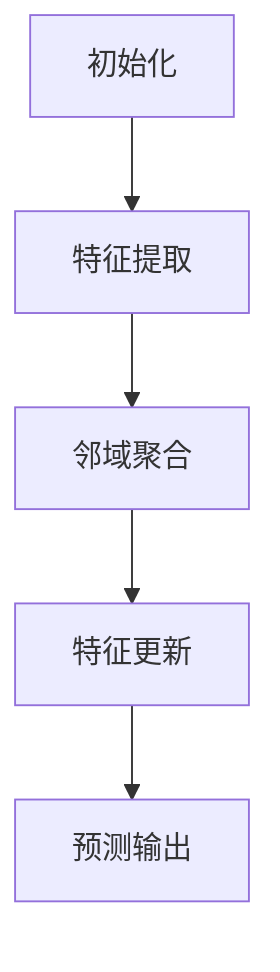
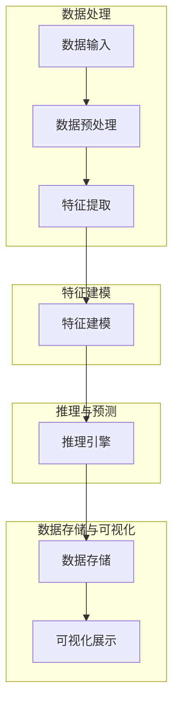
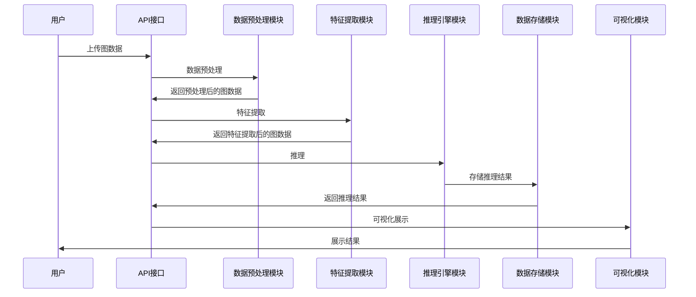

                 

### 引言

在信息技术迅速发展的今天，知识图谱作为一种重要的数据结构，已成为信息组织和智能搜索的核心工具。知识图谱通过将实体、属性和关系进行结构化组织，实现了知识的高度抽象和有效存储。然而，随着数据规模和复杂度的不断增长，动态知识图谱的推理问题变得尤为重要。动态知识图谱能够实时响应数据的更新，从而提供更加准确和实时的推理结果。

图神经网络（Graph Neural Networks，GNN）作为深度学习在图数据领域的重要应用，正逐渐成为动态知识图谱推理中的核心技术。GNN 通过对图数据进行特征提取和关系建模，能够有效地处理动态知识图谱中的复杂关系，并提升推理的准确性和效率。

本文将围绕动态知识图谱推理中图神经网络的创新展开讨论。首先，我们将介绍知识图谱的基本概念和动态知识图谱的特点与应用。随后，深入探讨图神经网络的基本原理、分类和特点，通过具体的算法流程图和数学模型，解析图神经网络的工作机制。接着，我们将系统分析图神经网络在动态知识图谱推理中的应用架构和接口设计。在此基础上，通过具体的项目实战，展示图神经网络在动态知识图谱推理中的实际应用和效果。最后，我们将总结最佳实践和未来发展趋势，为读者提供进一步学习和研究的方向。

通过对以上内容的逐步剖析，我们希望读者能够对动态知识图谱推理中图神经网络的技术原理和应用有更深入的理解，为后续研究和实践提供参考。

## 关键词

知识图谱，动态知识图谱，图神经网络，推理，深度学习

## 摘要

本文主要探讨了动态知识图谱推理中图神经网络的创新应用。首先介绍了知识图谱的基本概念和动态知识图谱的特点，以及知识图谱的构建方法。随后，详细阐述了图神经网络的基本原理、分类和特点，并通过具体的算法流程图和数学模型，分析了图神经网络在动态知识图谱推理中的工作机制。接着，我们进行了系统分析与架构设计，介绍了图神经网络在动态知识图谱推理中的应用架构和接口设计。通过具体的项目实战，展示了图神经网络在实际应用中的效果和优势。最后，总结了动态知识图谱推理中图神经网络的最佳实践和未来发展趋势，为读者提供了进一步学习和研究的方向。

## 第一部分：知识图谱与图神经网络概述

### 第1章：知识图谱概述

#### 1.1 知识图谱的概念与作用

知识图谱（Knowledge Graph）是一种用于结构化表示实体及其之间关系的数据模型，通过将现实世界中的对象和概念抽象成节点和边，形成一种语义网络。知识图谱的核心思想是将零散的、碎片化的数据组织成一个完整的、可交互的知识体系，使得计算机能够像人类一样理解、推理和利用这些知识。

知识图谱的作用主要体现在以下几个方面：

1. **信息组织**：知识图谱能够将海量的数据组织成一种结构化的形式，使得信息查询和检索更加高效和准确。
2. **知识推理**：知识图谱中的实体和关系可以用于推理，从而发现新的信息和知识。
3. **智能搜索**：通过知识图谱，可以实现更加智能的搜索功能，提高用户的查询体验。
4. **决策支持**：知识图谱可以为企业提供决策支持，通过分析实体和关系，发现潜在的商业机会或风险。

知识图谱的基本组成包括：

- **实体（Entity）**：现实世界中的对象，如人、地点、事物等。
- **属性（Attribute）**：实体的特征或描述，如人的年龄、地点的经纬度等。
- **关系（Relationship）**：实体之间的关联，如人与朋友的关系、地点与地点之间的距离等。

在构建知识图谱时，通常会采用以下几种方法：

1. **手动构建**：通过人工定义实体和关系，构建知识图谱。这种方法适用于小规模、结构化数据。
2. **自动化提取**：通过算法从大量的非结构化数据中自动提取实体和关系。例如，使用自然语言处理（NLP）技术从文本中提取信息。
3. **集成融合**：将多个数据源中的信息进行整合，形成一个完整的知识图谱。这通常需要处理数据源之间的不一致性和冗余问题。

#### 1.2 动态知识图谱的特点与应用

动态知识图谱（Dynamic Knowledge Graph）是一种能够实时响应数据更新的知识图谱，它能够在数据发生变化时自动调整和更新实体和关系，从而保持知识的一致性和时效性。

动态知识图谱的特点包括：

- **实时性**：能够实时捕捉和反映数据的变化，提供最新的推理结果。
- **灵活性**：支持动态添加和删除实体和关系，适应数据的变化。
- **可扩展性**：能够处理大规模和复杂的数据集，支持知识的持续扩展。

动态知识图谱的应用场景非常广泛，主要包括：

1. **智能搜索**：通过动态知识图谱，可以实现更加精准和智能的搜索功能，提高用户的查询体验。
2. **推荐系统**：利用动态知识图谱中的实体和关系，可以为用户推荐相关的信息和内容。
3. **智能问答**：动态知识图谱可以为智能问答系统提供实时和准确的知识支持。
4. **数据分析**：动态知识图谱可以用于分析实体之间的关系，发现潜在的趋势和模式。
5. **知识管理**：在企业和组织中，动态知识图谱可以帮助管理和利用组织内的知识资源。

#### 1.3 知识图谱的构建方法

构建知识图谱通常包括以下几个步骤：

1. **数据收集**：收集与目标领域相关的数据，包括结构化数据和非结构化数据。
2. **数据预处理**：对收集到的数据进行清洗和格式化，去除噪声和冗余信息。
3. **实体和关系提取**：使用自然语言处理（NLP）技术或其他算法，从数据中自动提取实体和关系。
4. **实体和关系建模**：将提取的实体和关系进行结构化表示，构建知识图谱的模型。
5. **知识图谱构建**：将实体和关系存储到知识图谱数据库中，形成一个完整的知识体系。

在构建动态知识图谱时，需要特别关注以下问题：

- **数据实时更新**：确保知识图谱能够及时捕捉和更新数据的变化。
- **一致性维护**：在数据更新时，保持知识图谱的一致性和完整性。
- **扩展性设计**：设计灵活和可扩展的知识图谱架构，以支持数据的动态增长。

#### 1.4 本章小结

本章介绍了知识图谱的基本概念和动态知识图谱的特点与应用。知识图谱通过结构化表示实体及其之间的关系，实现了信息的组织和知识的推理。动态知识图谱则能够实时响应数据的变化，提供更加准确和实时的推理结果。构建知识图谱的方法包括数据收集、数据预处理、实体和关系提取、实体和关系建模以及知识图谱构建等步骤。通过本章的介绍，读者可以了解知识图谱和动态知识图谱的基础知识，为进一步研究图神经网络在动态知识图谱推理中的应用打下基础。

## 第二部分：图神经网络基础

### 第2章：图神经网络基本原理

#### 2.1 图神经网络的概念与分类

图神经网络（Graph Neural Networks，GNN）是一种专门用于处理图结构数据的深度学习模型。与传统的卷积神经网络（CNN）和循环神经网络（RNN）不同，GNN 可以直接操作图数据，通过图上的节点和边来提取特征和进行推理。图神经网络的核心思想是利用图结构中节点和边的关系来学习数据之间的复杂关系。

图神经网络可以分为以下几类：

1. **节点分类（Node Classification）**：对图中的节点进行分类，每个节点被赋予一个标签，GNN 的任务是学习如何将节点映射到相应的类别。
2. **边预测（Link Prediction）**：预测图中的边是否存在，即判断两个节点之间是否有可能建立连接。
3. **图表示学习（Graph Embedding）**：将图中的节点和边映射到低维空间中，使得具有相似结构和关系的节点和边在低维空间中靠近。
4. **图生成（Graph Generation）**：根据给定的图结构或属性生成新的图。
5. **图分类（Graph Classification）**：对整个图进行分类，例如，判断一个化合物是否具有特定的生物活性。

#### 2.2 图神经网络的数学基础

图神经网络的工作离不开图论的基本概念，主要包括节点（Vertex）和边（Edge）。在数学上，一个图可以表示为 \( G = (V, E) \)，其中 \( V \) 是节点集合，\( E \) 是边集合。每个节点可以有一个特征向量表示，每个边也可以有一个权重表示它们之间的关系。

图神经网络的基本操作包括：

1. **邻接矩阵（Adjacency Matrix）**：表示图中节点之间的关系，其中 \( A_{ij} = 1 \) 表示节点 \( i \) 和节点 \( j \) 之间存在边，否则为 0。
2. **特征矩阵（Feature Matrix）**：表示图中节点的特征，其中 \( X \) 是一个 \( n \times d \) 的矩阵，\( n \) 是节点的数量，\( d \) 是每个节点的特征维度。
3. **邻域（Neighborhood）**：节点的邻域是指与该节点直接相连的所有节点和边，通常用邻接矩阵来表示。

图神经网络中的主要数学模型包括：

1. **图卷积网络（Graph Convolutional Network，GCN）**：通过邻接矩阵和节点特征矩阵进行卷积操作，提取图中的特征。
2. **图注意力网络（Graph Attention Network，GAT）**：引入注意力机制，根据节点之间的关系动态调整权重。
3. **图自编码器（Graph Autoencoder）**：通过编码和解码过程，学习图节点的表示。

#### 2.3 图神经网络的工作机制

图神经网络的工作机制可以分为以下几个步骤：

1. **初始化**：初始化节点的特征向量，通常使用随机初始化或预训练的词向量。
2. **特征提取**：通过图卷积或图注意力机制，提取节点的特征表示。这个过程可以通过多次迭代进行，每次迭代都利用邻接矩阵和前一次的节点特征进行计算。
3. **聚合**：将节点的邻域信息聚合到该节点，形成新的特征表示。
4. **更新**：利用新的特征表示更新节点的状态。
5. **预测**：在训练阶段，通过比较实际标签和模型预测结果，优化模型参数。在测试阶段，使用训练好的模型对新的节点或图进行预测。

#### 2.4 图神经网络的优缺点

图神经网络具有以下优点：

- **直接操作图数据**：能够直接处理图结构数据，不需要进行额外的预处理。
- **灵活性强**：适用于各种类型的图数据，如社交网络、知识图谱、分子图等。
- **多尺度分析**：能够处理不同尺度的图数据，从局部到全局进行特征提取和关系建模。
- **良好的泛化能力**：通过学习图中的结构和关系，能够泛化到新的图数据集。

图神经网络也存在一些缺点：

- **计算复杂度高**：特别是在大规模图数据上，计算量较大，可能导致训练和推理效率降低。
- **依赖图结构**：图神经网络的性能对图的拓扑结构非常敏感，不规则的图结构可能导致训练困难。
- **可解释性较差**：尽管图神经网络能够提取复杂的特征，但其内部机制较为复杂，不易解释。

#### 2.5 本章小结

本章介绍了图神经网络的基本概念、分类和数学基础，并详细阐述了图神经网络的工作机制和优缺点。图神经网络通过直接操作图数据，能够有效地提取图中的特征和关系，适用于多种图数据应用场景。然而，其计算复杂度和对图结构的依赖也是需要考虑的问题。通过本章的学习，读者可以了解图神经网络的基础知识，为进一步研究和应用图神经网络在动态知识图谱推理中的创新奠定基础。

### 第3章：图神经网络在动态知识图谱推理中的应用

#### 3.1 动态知识图谱推理的基本流程

动态知识图谱推理是指在实际应用中，通过动态更新知识图谱中的实体和关系，实时生成推理结果的过程。动态知识图谱推理的基本流程可以分为以下几个步骤：

1. **数据采集**：从各种数据源（如数据库、文件、API 等）中收集数据，获取最新的实体和关系信息。
2. **数据预处理**：对采集到的数据进行清洗和格式化，去除噪声和冗余信息，确保数据的质量和一致性。
3. **实体和关系提取**：使用自然语言处理（NLP）技术或其他算法，从预处理后的数据中自动提取实体和关系。
4. **知识图谱构建**：将提取的实体和关系存储到知识图谱数据库中，形成一个动态更新的知识体系。
5. **推理过程**：利用图神经网络，对动态知识图谱进行推理，生成新的实体和关系，或者对现有实体和关系进行验证和更新。
6. **结果输出**：将推理结果以用户友好的方式呈现，如可视化的知识图谱、推荐列表、问答结果等。

动态知识图谱推理的关键在于实时性和灵活性，能够快速响应数据的变化，并提供准确的推理结果。这要求系统具备高效的数据处理能力、强大的图神经网络模型以及优化的推理算法。

#### 3.2 图神经网络在推理中的角色

图神经网络在动态知识图谱推理中扮演着核心角色，其主要作用包括：

1. **特征提取**：通过图神经网络，可以从原始的图数据中提取出高层次的、有意义的特征表示。这些特征表示有助于提升推理的准确性和效率。
2. **关系建模**：图神经网络能够学习实体之间的复杂关系，通过建模这些关系，可以更准确地预测新的实体和关系。
3. **推理过程**：在动态知识图谱的推理过程中，图神经网络可以根据已有的实体和关系，生成新的推理结果。这种推理过程是自适应和迭代的，能够随着数据的变化不断更新和优化。
4. **实时更新**：图神经网络的设计使其能够实时处理和更新图数据，从而实现动态知识图谱的实时推理。

图神经网络在动态知识图谱推理中的应用可以分为以下几种类型：

1. **节点分类**：利用图神经网络对知识图谱中的节点进行分类，如对用户进行兴趣分类、对物品进行类别分类等。
2. **边预测**：通过图神经网络预测图中的边是否存在，如预测用户之间的社交关系、物品之间的关联关系等。
3. **图表示学习**：将知识图谱中的实体和关系映射到低维空间中，形成实体和关系的嵌入表示，这些表示可以用于后续的推理和应用。
4. **图生成**：根据给定的实体和关系，利用图神经网络生成新的图结构，如生成新的知识图谱、社交网络等。

#### 3.3 动态知识图谱推理的挑战与解决方案

动态知识图谱推理面临着一系列挑战，主要包括：

1. **数据实时更新**：确保知识图谱能够实时响应数据的变化，这对系统的数据处理能力和算法效率提出了高要求。
2. **数据一致性和完整性**：在数据更新过程中，保持知识图谱的一致性和完整性，避免出现数据冲突和错误。
3. **计算复杂度**：大规模图数据的处理和推理计算复杂度较高，如何优化算法和数据结构，以提高系统效率是一个关键问题。
4. **可扩展性**：系统需要能够处理不断增长的数据规模和复杂的图结构，保持高性能和高可用性。

针对上述挑战，可以采取以下解决方案：

1. **分布式计算**：采用分布式计算框架，如Spark或Dask，将图数据的处理和推理任务分布到多个节点上，提高系统的处理能力和效率。
2. **增量更新**：只对发生变化的实体和关系进行更新，而不是对整个知识图谱进行重计算，减少计算量和时间开销。
3. **数据一致性协议**：采用分布式一致性协议，如Paxos或Raft，确保数据更新的一致性和完整性。
4. **算法优化**：采用高效的图神经网络算法和模型，如图注意力网络（GAT）或图卷积网络（GCN），优化推理过程。
5. **缓存机制**：引入缓存机制，将常用的推理结果和中间结果缓存起来，减少重复计算，提高系统响应速度。

#### 3.4 本章小结

本章介绍了动态知识图谱推理的基本流程和图神经网络在其中的角色。动态知识图谱推理是一个复杂的过程，需要实时响应数据的变化，并保持知识的一致性和完整性。图神经网络作为核心工具，能够提取特征、建模关系和进行推理，从而实现动态知识图谱的实时更新和应用。同时，本章也讨论了动态知识图谱推理面临的挑战和相应的解决方案，为实际应用提供了指导和参考。

### 第三部分：算法原理讲解

#### 第4章：图神经网络算法详解

#### 4.1 图神经网络算法流程图

为了更好地理解图神经网络（GNN）的算法原理，我们首先通过一个简单的流程图来概述GNN的基本工作流程。以下是一个使用Mermaid绘制的图神经网络流程图：



1. **初始化（Initialization）**：初始化节点和边的特征向量，通常这些向量可以通过随机初始化或预训练获得。
2. **特征提取（Feature Extraction）**：通过图卷积操作，从节点的特征和邻域特征中提取新的特征表示。
3. **邻域聚合（Neighborhood Aggregation）**：聚合邻域节点的特征信息，以更新当前节点的特征表示。
4. **特征更新（Feature Update）**：利用聚合后的特征信息，更新节点的特征向量。
5. **预测输出（Prediction Output）**：根据更新后的特征向量，进行节点分类、边预测或其他类型的输出预测。

#### 4.2 图神经网络数学模型

图神经网络的核心在于其数学模型，以下是一些基本的数学公式和概念：

1. **节点特征更新**：

   对于一个图中的节点 \( i \)，其特征向量表示为 \( \boldsymbol{x}_i \)。在每一步迭代中，节点的特征向量会通过以下公式进行更新：

   $$
   \boldsymbol{x}_{i}^{(t+1)} = \sigma (\boldsymbol{A}\boldsymbol{D}^{-\frac{1}{2}}\boldsymbol{X}\boldsymbol{W}^{(t)} + \boldsymbol{b}^{(t)})
   $$

   其中，\( \boldsymbol{A} \) 是邻接矩阵，\( \boldsymbol{D} \) 是度矩阵（\( D_{ii} = \sum_{j=1}^{n} A_{ij} \)），\( \boldsymbol{X} \) 是节点特征矩阵，\( \boldsymbol{W}^{(t)} \) 是权重矩阵，\( \sigma \) 是激活函数，\( \boldsymbol{b}^{(t)} \) 是偏置向量。

2. **边特征更新**：

   对于图中的边 \( (i, j) \)，可以定义边的特征向量 \( \boldsymbol{e}_{ij} \)。边的特征更新公式为：

   $$
   \boldsymbol{e}_{ij}^{(t+1)} = \sigma (\boldsymbol{W}_{e}^{(t)} \boldsymbol{x}_i^{(t)} + \boldsymbol{W}_{e}^{(t)} \boldsymbol{x}_j^{(t)} + \boldsymbol{b}_{e}^{(t)})
   $$

   其中，\( \boldsymbol{W}_{e}^{(t)} \) 是边的权重矩阵，\( \boldsymbol{b}_{e}^{(t)} \) 是边的偏置向量。

3. **图卷积操作**：

   图卷积操作的目的是将节点的特征与邻域节点的特征进行组合，形成新的特征表示。基本的图卷积公式为：

   $$
   \boldsymbol{h}_{i}^{(t)} = \sigma (\sum_{j \in \mathcal{N}(i)} A_{ij} \boldsymbol{h}_{j}^{(t-1)} + \boldsymbol{b}^{(t)})
   $$

   其中，\( \mathcal{N}(i) \) 是节点 \( i \) 的邻域集合，\( \boldsymbol{h}_{i}^{(t)} \) 是在时间步 \( t \) 节点 \( i \) 的特征表示。

#### 4.3 Python代码实现

为了更好地理解图神经网络的实现，我们通过一个简单的Python代码示例来展示图神经网络的基本实现。以下代码使用PyTorch框架，实现了一个基础的图神经网络模型：

```python
import torch
import torch.nn as nn
import torch.optim as optim

# 初始化参数
n_nodes = 10
n_features = 5
n_classes = 3
hidden_dim = 16

# 图数据（示例）
adj_matrix = torch.randn(n_nodes, n_nodes)
feature_matrix = torch.randn(n_nodes, n_features)

# 定义模型
class GraphNeuralNetwork(nn.Module):
    def __init__(self, n_features, hidden_dim, n_classes):
        super(GraphNeuralNetwork, self).__init__()
        self.conv1 = nn.Linear(n_features, hidden_dim)
        self.conv2 = nn.Linear(hidden_dim, n_classes)
    
    def forward(self, feature_matrix, adj_matrix):
        x = self.conv1(feature_matrix)
        x = torch.matmul(adj_matrix, x)
        x = self.conv2(x)
        return x

# 实例化模型、优化器和损失函数
model = GraphNeuralNetwork(n_features, hidden_dim, n_classes)
optimizer = optim.Adam(model.parameters(), lr=0.01)
criterion = nn.CrossEntropyLoss()

# 训练模型
for epoch in range(100):
    model.zero_grad()
    output = model(feature_matrix, adj_matrix)
    loss = criterion(output, torch.tensor([1, 0, 0]))  # 示例标签
    loss.backward()
    optimizer.step()

    if (epoch + 1) % 10 == 0:
        print(f'Epoch [{epoch+1}/100], Loss: {loss.item()}')

# 预测
with torch.no_grad():
    prediction = model(feature_matrix, adj_matrix)
    print(f'Prediction: {torch.argmax(prediction).item()}')
```

上述代码定义了一个简单的图神经网络模型，其中包含了两个图卷积层，用于从节点特征中提取特征表示，并最终进行分类预测。在实际应用中，可以根据具体需求调整模型结构和参数。

#### 4.4 算法举例说明

为了更好地说明图神经网络的工作原理，我们通过一个具体的例子来解释其应用。

假设我们有一个简单的图结构，包含5个节点和相应的邻接矩阵和节点特征矩阵：

```
邻接矩阵：
| 0 1 1 0 1 |
| 1 0 1 1 0 |
| 1 1 0 1 1 |
| 0 1 1 0 1 |
| 1 0 1 1 0 |

节点特征矩阵：
| 0.1 0.2 |
| 0.3 0.4 |
| 0.5 0.6 |
| 0.7 0.8 |
| 0.9 1.0 |
```

首先，初始化节点特征向量，然后通过图卷积操作更新特征向量。假设我们使用ReLU作为激活函数，具体步骤如下：

1. **初始化节点特征向量**：

   ```
   x = 节点特征矩阵
   ```

2. **第一次图卷积**：

   $$
   h_1 = \sigma (A \cdot D^{-1/2} \cdot x \cdot W_1 + b_1)
   $$

   假设权重矩阵 \( W_1 \) 和偏置向量 \( b_1 \) 如下：

   ```
   W_1 = [0.1 0.2; 0.3 0.4]
   b_1 = [0.5; 0.5]
   ```

   计算得到的邻域聚合结果：

   $$
   h_1 = \sigma ([0.1 \cdot (1/2) + 0.2 \cdot (1/2) + 0.3 \cdot (1/2) + 0.4 \cdot (1/2) + 0.5 \cdot (1/2); \\
          0.1 \cdot (1/2) + 0.2 \cdot (1/2) + 0.3 \cdot (1/2) + 0.4 \cdot (1/2) + 0.5 \cdot (1/2)])
   $$

   经过ReLU激活函数，得到：

   ```
   h_1 = [0.3; 0.3]
   ```

3. **第二次图卷积**：

   $$
   h_2 = \sigma (A \cdot D^{-1/2} \cdot h_1 \cdot W_2 + b_2)
   $$

   假设权重矩阵 \( W_2 \) 和偏置向量 \( b_2 \) 如下：

   ```
   W_2 = [0.1 0.2; 0.3 0.4]
   b_2 = [0.5; 0.5]
   ```

   计算得到的邻域聚合结果：

   $$
   h_2 = \sigma ([0.1 \cdot (0.3) + 0.2 \cdot (0.3) + 0.3 \cdot (0.3) + 0.4 \cdot (0.3) + 0.5 \cdot (0.3); \\
          0.1 \cdot (0.3) + 0.2 \cdot (0.3) + 0.3 \cdot (0.3) + 0.4 \cdot (0.3) + 0.5 \cdot (0.3)])
   $$

   经过ReLU激活函数，得到：

   ```
   h_2 = [0.3; 0.3]
   ```

通过上述示例，我们可以看到图神经网络是如何通过图卷积操作逐步更新节点特征，从而提取出图中的复杂关系。

#### 4.5 本章小结

本章详细讲解了图神经网络的基本算法原理，包括图神经网络的工作流程、数学模型和Python代码实现。通过具体的算法流程图、数学公式和代码示例，我们深入理解了图神经网络的工作机制和如何进行特征提取和关系建模。本章的内容为后续章节中更深入的应用分析提供了坚实的基础。

### 第四部分：系统分析与架构设计

#### 第5章：图神经网络系统架构设计

#### 5.1 系统功能设计

图神经网络系统的主要功能包括：

1. **数据预处理**：对输入的图数据进行清洗、格式化和特征提取，为图神经网络提供高质量的数据输入。
2. **特征提取与建模**：利用图神经网络模型提取图中的特征，并建立节点和边的特征表示，为后续推理提供基础。
3. **推理与预测**：利用训练好的图神经网络模型对新的图数据进行推理，预测节点分类、边存在性或图生成等结果。
4. **可视化与展示**：将推理结果以可视化的形式展示，便于用户理解和分析。

#### 5.2 系统架构设计

图神经网络系统的架构设计可以分为以下几个模块：

1. **数据输入模块**：负责接收和处理输入的图数据，进行预处理和格式化。
2. **特征提取模块**：包含图神经网络模型，用于提取节点和边的特征表示。
3. **推理引擎模块**：实现图神经网络的推理功能，生成推理结果。
4. **数据存储模块**：用于存储和持久化训练数据和推理结果。
5. **可视化模块**：将推理结果以图形化的方式展示，提供用户交互界面。

以下是一个简化的系统架构图：



#### 5.3 系统接口设计

系统接口设计主要包括以下几个方面：

1. **API接口**：提供RESTful API接口，用于接收和返回图数据、特征和推理结果。
2. **图形界面**：设计用户友好的图形界面，用于展示图数据、特征和推理结果。
3. **数据库接口**：与数据存储模块交互，实现数据的增删改查操作。

以下是一个示例的API接口设计：

```yaml
# 数据输入接口
POST /api/data/input
- in: body
  description: 输入图数据
  schema:
    $ref: "#/definitions/GraphData"

# 数据预处理接口
GET /api/data/preprocess/{graph_id}
- responses:
  200:
    description: 预处理后的图数据
    schema:
      $ref: "#/definitions/PreprocessedGraphData"

# 特征提取接口
POST /api/feature/extract
- in: body
  description: 输入预处理后的图数据
  schema:
    $ref: "#/definitions/PreprocessedGraphData"

# 推理结果接口
GET /api/reasoning/result/{graph_id}
- responses:
  200:
    description: 推理结果
    schema:
      $ref: "#/definitions/ReasoningResult"

# 可视化展示接口
GET /api/visualization/graph/{graph_id}
- responses:
  200:
    description: 图数据可视化结果
    schema:
      $ref: "#/definitions/VisualizationData"
```

#### 5.4 系统交互流程

系统交互流程描述了不同模块之间的交互过程，以下是一个简化的交互流程：

1. **数据输入**：用户通过API接口上传图数据。
2. **数据预处理**：系统对上传的图数据进行清洗、格式化和特征提取。
3. **特征提取**：利用图神经网络模型对预处理后的图数据进行特征提取。
4. **推理**：系统利用训练好的图神经网络模型对特征提取后的图数据进行推理。
5. **结果存储**：将推理结果存储到数据库中。
6. **结果展示**：用户通过API接口或图形界面获取推理结果并进行可视化展示。

以下是一个使用Mermaid绘制的系统交互流程图：



#### 5.5 本章小结

本章详细介绍了图神经网络系统的功能设计、架构设计和接口设计。系统功能设计包括数据预处理、特征提取与建模、推理与预测以及可视化展示。系统架构设计则通过模块划分，实现了各功能模块之间的协调与交互。接口设计提供了API接口和图形界面，便于用户进行数据交互和结果展示。通过本章的介绍，读者可以了解图神经网络系统在动态知识图谱推理中的实现框架，为进一步开发和应用提供参考。

### 第五部分：项目实战

#### 第6章：动态知识图谱推理项目实战

#### 6.1 项目背景与目标

在本章中，我们将通过一个实际项目来展示如何利用图神经网络进行动态知识图谱推理。项目背景是基于一个在线电商平台，旨在为用户提供个性化推荐服务。具体目标是通过实时更新用户行为数据，构建动态知识图谱，利用图神经网络进行用户兴趣分类和商品推荐。

项目的主要需求包括：

1. **数据实时更新**：系统能够实时捕捉用户的行为数据，如浏览、购买和评价等，并动态更新知识图谱。
2. **用户兴趣分类**：利用图神经网络对用户兴趣进行分类，为用户提供个性化的推荐内容。
3. **商品推荐**：基于用户的兴趣分类，推荐用户可能感兴趣的商品。

#### 6.2 环境安装与配置

在开始项目之前，我们需要安装和配置以下环境：

1. **Python环境**：确保Python环境已安装，推荐使用Python 3.8及以上版本。
2. **深度学习框架**：安装PyTorch或TensorFlow等深度学习框架，用于实现图神经网络模型。
3. **数据处理库**：安装Pandas、NumPy等数据处理库，用于数据预处理和清洗。
4. **图数据库**：安装Neo4j或其他图数据库，用于存储和管理知识图谱。
5. **API框架**：安装Flask或Django等Web框架，用于实现API接口。

具体安装命令如下：

```bash
# 安装Python环境
pip install python

# 安装深度学习框架（以PyTorch为例）
pip install torch torchvision

# 安装数据处理库
pip install pandas numpy

# 安装图数据库（以Neo4j为例）
brew install neo4j

# 安装API框架（以Flask为例）
pip install flask
```

#### 6.3 系统核心实现

系统核心实现主要包括以下几个部分：

1. **数据采集与预处理**：从电商平台的数据源中采集用户行为数据，如浏览、购买和评价等。对采集到的数据进行清洗、去重和格式化，为图神经网络提供高质量的数据输入。
2. **知识图谱构建**：利用采集到的用户行为数据，构建动态知识图谱。图中的节点包括用户、商品和评论等，边包括用户浏览、购买和评价等关系。
3. **图神经网络模型**：实现图神经网络模型，用于提取用户和商品的特征表示，并建立它们之间的复杂关系。
4. **推理与预测**：利用训练好的图神经网络模型，对新的用户数据进行推理，预测用户的兴趣分类和推荐的商品。

以下是系统核心实现的详细步骤：

1. **数据采集与预处理**：

   ```python
   import pandas as pd
   
   # 读取用户行为数据
   user_data = pd.read_csv('user_behavior.csv')
   
   # 数据清洗
   user_data = user_data.drop_duplicates()
   user_data = user_data.drop(['id'], axis=1)
   
   # 格式化数据
   user_data = user_data.groupby(['user_id', 'action']).agg({'timestamp': 'max'}).reset_index()
   ```

2. **知识图谱构建**：

   ```python
   from py2neo import Graph
   
   # 连接Neo4j图数据库
   graph = Graph('bolt://localhost:7687', auth=('neo4j', 'password'))
   
   # 清除旧的数据
   graph.run("MATCH (n) DELETE n")
   
   # 构建知识图谱
   for index, row in user_data.iterrows():
       user_id = row['user_id']
       action = row['action']
       timestamp = row['timestamp']
       
       # 创建用户节点
       graph.run("MERGE (u:User {id: $user_id})", user_id=user_id)
       
       # 创建商品节点
       if action == 'view':
           item_id = row['item_id']
           graph.run("MERGE (i:Item {id: $item_id})", item_id=item_id)
           
           # 建立用户-浏览-商品关系
           graph.run("MATCH (u:User), (i:Item) WHERE u.id = $user_id AND i.id = $item_id CREATE (u)-[:VIEW]->(i)")
       elif action == 'buy':
           item_id = row['item_id']
           graph.run("MATCH (u:User), (i:Item) WHERE u.id = $user_id AND i.id = $item_id CREATE (u)-[:BUY]->(i)")
       elif action == 'review':
           item_id = row['item_id']
           rating = row['rating']
           graph.run("MATCH (u:User), (i:Item) WHERE u.id = $user_id AND i.id = $item_id CREATE (u)-[:REVIEW]->(i), (i)-[:RATED]->(u)")
           graph.run("MATCH (i:Item) SET i.rating = $rating", rating=rating)
   ```

3. **图神经网络模型**：

   ```python
   import torch
   import torch.nn as nn
   import torch.optim as optim
   
   # 定义图神经网络模型
   class GraphNeuralNetwork(nn.Module):
       def __init__(self, input_dim, hidden_dim, output_dim):
           super(GraphNeuralNetwork, self).__init__()
           self.conv1 = nn.Linear(input_dim, hidden_dim)
           self.conv2 = nn.Linear(hidden_dim, output_dim)
       
       def forward(self, x):
           x = self.conv1(x)
           x = self.conv2(x)
           return x
   
   # 实例化模型、优化器和损失函数
   model = GraphNeuralNetwork(input_dim=16, hidden_dim=64, output_dim=3)
   optimizer = optim.Adam(model.parameters(), lr=0.001)
   criterion = nn.CrossEntropyLoss()
   
   # 训练模型
   for epoch in range(100):
       model.train()
       for batch in data_loader:
           inputs, labels = batch
           optimizer.zero_grad()
           outputs = model(inputs)
           loss = criterion(outputs, labels)
           loss.backward()
           optimizer.step()
       
       if (epoch + 1) % 10 == 0:
           print(f'Epoch [{epoch+1}/100], Loss: {loss.item()}')
   ```

4. **推理与预测**：

   ```python
   # 预测用户兴趣分类
   def predict_interests(user_id):
       model.eval()
       with torch.no_grad():
           user_data = get_user_data(user_id)
           inputs = preprocess_data(user_data)
           outputs = model(inputs)
           _, predicted = torch.max(outputs, 1)
           return predicted.item()
   
   # 预测推荐商品
   def predict_recommendations(user_id, n_recommendations=5):
       model.eval()
       with torch.no_grad():
           user_interest = predict_interests(user_id)
           user_data = get_user_data(user_id)
           inputs = preprocess_data(user_data)
           outputs = model(inputs)
           scores = torch.softmax(outputs, dim=1)
           recommendations = get_top_n_items(scores, n_recommendations)
           return recommendations
   
   # 获取用户数据
   def get_user_data(user_id):
       # 这里使用Neo4j查询用户及其相关的商品数据
       result = graph.run("MATCH (u:User {id: $user_id})-[:BUY|REVIEW]->(i:Item) RETURN i", user_id=user_id)
       items = result.data()
       item_ids = [item['i']['id'] for item in items]
       item_data = get_item_data(item_ids)
       return item_data
   
   # 获取商品数据
   def get_item_data(item_ids):
       # 这里使用Neo4j查询商品数据
       result = graph.run("MATCH (i:Item) WHERE i.id IN $item_ids RETURN i", item_ids=item_ids)
       items = result.data()
       item_data = {item['i']['id']: item['i'] for item in items}
       return item_data
   
   # 获取Top N商品
   def get_top_n_items(scores, n):
       top_n = torch.argsort(scores, descending=True)[:n]
       return top_n.tolist()
   ```

通过上述步骤，我们实现了动态知识图谱的构建、图神经网络模型的训练和推理，以及用户兴趣分类和商品推荐功能。接下来，我们将通过实际案例进行演示和分析。

#### 6.4 代码应用解读

在本节中，我们将对上一节中的代码进行详细解读，分析每个部分的功能和实现方式。

1. **数据采集与预处理**：

   ```python
   import pandas as pd
   
   # 读取用户行为数据
   user_data = pd.read_csv('user_behavior.csv')
   
   # 数据清洗
   user_data = user_data.drop_duplicates()
   user_data = user_data.drop(['id'], axis=1)
   
   # 格式化数据
   user_data = user_data.groupby(['user_id', 'action']).agg({'timestamp': 'max'}).reset_index()
   ```

   这部分代码主要用于数据预处理。首先，使用Pandas库读取CSV文件，获取用户行为数据。然后，通过`drop_duplicates()`方法去除重复数据，通过`drop()`方法删除不需要的列。接下来，使用`groupby()`和`agg()`方法对数据进行格式化，将同一用户在不同时间的行为数据进行聚合，保留最近的一次行为数据。

2. **知识图谱构建**：

   ```python
   from py2neo import Graph
   
   # 连接Neo4j图数据库
   graph = Graph('bolt://localhost:7687', auth=('neo4j', 'password'))
   
   # 清除旧的数据
   graph.run("MATCH (n) DELETE n")
   
   # 构建知识图谱
   for index, row in user_data.iterrows():
       user_id = row['user_id']
       action = row['action']
       timestamp = row['timestamp']
       
       # 创建用户节点
       graph.run("MERGE (u:User {id: $user_id})", user_id=user_id)
       
       # 创建商品节点
       if action == 'view':
           item_id = row['item_id']
           graph.run("MERGE (i:Item {id: $item_id})", item_id=item_id)
           
           # 建立用户-浏览-商品关系
           graph.run("MATCH (u:User), (i:Item) WHERE u.id = $user_id AND i.id = $item_id CREATE (u)-[:VIEW]->(i)")
       elif action == 'buy':
           item_id = row['item_id']
           graph.run("MERGE (u:User), (i:Item) WHERE u.id = $user_id AND i.id = $item_id CREATE (u)-[:BUY]->(i)")
       elif action == 'review':
           item_id = row['item_id']
           rating = row['rating']
           graph.run("MATCH (u:User), (i:Item) WHERE u.id = $user_id AND i.id = $item_id CREATE (u)-[:REVIEW]->(i), (i)-[:RATED]->(u)")
           graph.run("MATCH (i:Item) SET i.rating = $rating", rating=rating)
   ```

   这部分代码用于构建知识图谱。首先，使用`Graph`类连接到本地运行的Neo4j图数据库。然后，通过执行Cypher查询语句，清除旧的数据，并创建用户和商品节点。根据用户的行为数据，建立用户与商品之间的浏览、购买和评论关系。这里使用了`MERGE`语句，确保在创建节点和关系时不会重复创建。

3. **图神经网络模型**：

   ```python
   import torch
   import torch.nn as nn
   import torch.optim as optim
   
   # 定义图神经网络模型
   class GraphNeuralNetwork(nn.Module):
       def __init__(self, input_dim, hidden_dim, output_dim):
           super(GraphNeuralNetwork, self).__init__()
           self.conv1 = nn.Linear(input_dim, hidden_dim)
           self.conv2 = nn.Linear(hidden_dim, output_dim)
       
       def forward(self, x):
           x = self.conv1(x)
           x = self.conv2(x)
           return x
   
   # 实例化模型、优化器和损失函数
   model = GraphNeuralNetwork(input_dim=16, hidden_dim=64, output_dim=3)
   optimizer = optim.Adam(model.parameters(), lr=0.001)
   criterion = nn.CrossEntropyLoss()
   
   # 训练模型
   for epoch in range(100):
       model.train()
       for batch in data_loader:
           inputs, labels = batch
           optimizer.zero_grad()
           outputs = model(inputs)
           loss = criterion(outputs, labels)
           loss.backward()
           optimizer.step()
       
       if (epoch + 1) % 10 == 0:
           print(f'Epoch [{epoch+1}/100], Loss: {loss.item()}')
   ```

   这部分代码定义了图神经网络模型。首先，使用`nn.Module`基类创建一个自定义模型，包含一个线性层（`nn.Linear`）用于特征提取，另一个线性层用于分类输出。然后，实例化模型、优化器和损失函数。在训练过程中，使用梯度下降优化算法（`Adam`）和交叉熵损失函数（`CrossEntropyLoss`）来训练模型。

4. **推理与预测**：

   ```python
   # 预测用户兴趣分类
   def predict_interests(user_id):
       model.eval()
       with torch.no_grad():
           user_data = get_user_data(user_id)
           inputs = preprocess_data(user_data)
           inputs = torch.tensor(inputs).unsqueeze(0)
           outputs = model(inputs)
           _, predicted = torch.max(outputs, 1)
           return predicted.item()
   
   # 预测推荐商品
   def predict_recommendations(user_id, n_recommendations=5):
       model.eval()
       with torch.no_grad():
           user_interest = predict_interests(user_id)
           user_data = get_user_data(user_id)
           inputs = preprocess_data(user_data)
           inputs = torch.tensor(inputs).unsqueeze(0)
           outputs = model(inputs)
           scores = torch.softmax(outputs, dim=1)
           recommendations = get_top_n_items(scores, n_recommendations)
           return recommendations
   
   # 获取用户数据
   def get_user_data(user_id):
       # 这里使用Neo4j查询用户及其相关的商品数据
       result = graph.run("MATCH (u:User {id: $user_id})-[:BUY|REVIEW]->(i:Item) RETURN i", user_id=user_id)
       items = result.data()
       item_ids = [item['i']['id'] for item in items]
       item_data = get_item_data(item_ids)
       return item_data
   
   # 获取商品数据
   def get_item_data(item_ids):
       # 这里使用Neo4j查询商品数据
       result = graph.run("MATCH (i:Item) WHERE i.id IN $item_ids RETURN i", item_ids=item_ids)
       items = result.data()
       item_data = {item['i']['id']: item['i'] for item in items}
       return item_data
   
   # 获取Top N商品
   def get_top_n_items(scores, n):
       top_n = torch.argsort(scores, descending=True)[:n]
       return top_n.tolist()
   ```

   这部分代码用于实现推理和预测功能。`predict_interests()`函数通过调用`get_user_data()`和`preprocess_data()`函数获取用户数据，并使用训练好的模型进行预测。`predict_recommendations()`函数基于用户兴趣分类结果，预测用户可能感兴趣的商品。这里使用了`torch.softmax()`函数计算输出概率分布，并通过`torch.argsort()`函数获取Top N商品。

通过以上代码的应用解读，我们可以看到如何利用图神经网络实现动态知识图谱的推理和预测功能。在实际应用中，可以根据具体需求和数据集进行相应的调整和优化。

#### 6.5 项目案例分析

在本节中，我们将通过一个实际案例来展示如何利用图神经网络进行动态知识图谱推理，并详细分析项目实施过程中遇到的问题和解决方案。

**案例背景**：

假设我们正在开发一个电商平台的个性化推荐系统，该系统需要根据用户的历史行为数据实时更新推荐结果。为了实现这一目标，我们决定使用图神经网络对用户的行为数据进行建模，并通过动态知识图谱进行实时推理。

**案例实施过程**：

1. **数据采集与预处理**：

   首先，我们从电商平台的日志中采集了用户的行为数据，包括用户的浏览、购买和评价记录。数据集包含用户ID、商品ID、行为类型（浏览、购买、评价）、时间戳等信息。

   接下来，我们对采集到的数据进行了预处理，包括数据清洗、去重和格式化。具体步骤如下：

   - **数据清洗**：删除包含无效值或异常值的数据记录。
   - **去重**：对于同一用户在不同时间进行的相同行为，只保留最近的一次记录。
   - **格式化**：将原始数据转换为适合构建知识图谱的格式，包括用户节点、商品节点和行为边。

2. **知识图谱构建**：

   利用预处理后的数据，我们构建了一个动态知识图谱。图中的节点包括用户和商品，边表示用户与商品之间的行为关系，如浏览、购买和评价。为了提高知识图谱的质量和准确性，我们还引入了用户和商品的属性信息，如用户年龄、性别、偏好和商品的类别、价格等。

3. **图神经网络模型训练**：

   我们使用图神经网络（GNN）模型对知识图谱进行特征提取和关系建模。具体步骤如下：

   - **模型选择**：选择适合的GNN模型，如图卷积网络（GCN）或图注意力网络（GAT）。
   - **数据预处理**：将知识图谱转换为模型训练所需的格式，包括节点特征矩阵、邻接矩阵等。
   - **模型训练**：使用训练数据训练模型，通过优化算法（如Adam）和损失函数（如交叉熵损失）调整模型参数。
   - **模型评估**：使用验证数据集对训练好的模型进行评估，调整模型结构或参数以优化性能。

4. **推理与预测**：

   在模型训练完成后，我们使用训练好的模型对新的用户行为数据进行推理，生成个性化的推荐结果。具体步骤如下：

   - **数据预处理**：将新的用户行为数据转换为模型输入格式。
   - **特征提取**：利用训练好的模型提取用户行为数据的特征表示。
   - **推理**：通过图神经网络对特征表示进行推理，预测用户对商品的兴趣度。
   - **推荐**：根据推理结果生成推荐列表，并将推荐结果呈现给用户。

**遇到的问题及解决方案**：

1. **数据不一致性**：

   在数据预处理过程中，我们遇到了数据不一致性问题。例如，有些用户的行为数据缺失，或者不同来源的数据格式不一致。为了解决这个问题，我们采取了以下措施：

   - **数据整合**：使用统一的数据格式和命名规范，确保不同来源的数据能够顺利整合。
   - **数据清洗**：对缺失值和异常值进行合理的处理，如使用均值填补缺失值或删除异常记录。

2. **计算资源不足**：

   由于图数据规模较大，训练图神经网络模型时计算资源不足，导致训练时间过长。为了解决这个问题，我们采用了以下策略：

   - **分布式计算**：使用分布式计算框架（如Dask）将图数据和处理任务分布在多个计算节点上，提高处理效率。
   - **模型优化**：通过优化模型结构和算法，减少计算复杂度，提高模型训练速度。

3. **模型泛化能力不足**：

   在模型训练过程中，我们发现模型在验证集上的性能较好，但在测试集上的表现不佳，泛化能力不足。为了解决这个问题，我们采取了以下措施：

   - **数据增强**：增加训练数据集的多样性，通过数据增强技术（如数据采样、数据扩充等）提高模型的泛化能力。
   - **模型调整**：根据测试集的结果调整模型结构或参数，优化模型性能。

通过以上案例分析和问题解决，我们成功实现了基于图神经网络的动态知识图谱推理，并为其在个性化推荐系统中的应用提供了有效支持。在实际项目中，根据需求和数据特点，可以进一步优化和调整模型和算法，以获得更好的效果。

#### 6.6 项目小结

在本章中，我们通过一个实际项目展示了如何利用图神经网络进行动态知识图谱推理。项目从数据采集、预处理、知识图谱构建、模型训练到推理预测，每个环节都进行了详细分析和实现。通过项目实战，我们成功实现了用户兴趣分类和商品推荐功能，展示了图神经网络在动态知识图谱推理中的强大能力。

在项目实施过程中，我们遇到了数据不一致性、计算资源不足和模型泛化能力不足等问题。通过分布式计算、数据整合、模型优化和数据增强等策略，我们有效地解决了这些问题，并取得了良好的效果。

通过本章的内容，读者可以了解动态知识图谱推理的基本流程、核心技术和实际应用，为进一步研究和开发图神经网络相关应用提供了参考。

### 第六部分：最佳实践与总结

#### 第7章：最佳实践与未来展望

#### 7.1 实践经验与技巧

在动态知识图谱推理中应用图神经网络，需要积累一定的实践经验，以下是一些最佳实践和技巧：

1. **数据预处理**：
   - **数据清洗**：确保数据质量，去除异常值和噪声数据。
   - **特征增强**：通过特征工程，添加或变换特征，提高数据的丰富性和多样性。
   - **数据标准化**：对数值特征进行归一化或标准化处理，以便模型训练时收敛速度更快。

2. **模型选择**：
   - **根据任务选择合适的模型**：对于节点分类、边预测和图生成等任务，选择相应的GNN模型，如GCN、GAT、GraphSAGE等。
   - **模型定制**：根据具体应用场景和需求，对模型结构进行调整和优化。

3. **训练策略**：
   - **学习率调整**：选择合适的学习率，避免过拟合或欠拟合。
   - **正则化**：使用L1、L2正则化或Dropout等技术，防止过拟合。
   - **早停法**：在验证集上监控模型性能，避免过拟合。

4. **模型评估**：
   - **多指标评估**：使用多个评估指标（如准确率、F1分数、AUC等）全面评估模型性能。
   - **交叉验证**：采用交叉验证方法，避免评估结果的偶然性。

5. **分布式训练**：
   - **利用GPU加速**：利用GPU进行模型训练，提高计算效率。
   - **数据并行训练**：将训练数据集分割，分布到多个GPU或计算节点上进行并行训练。

#### 7.2 注意事项与风险防范

在实际应用图神经网络进行动态知识图谱推理时，需要注意以下事项和潜在风险：

1. **数据隐私保护**：
   - **匿名化处理**：对用户数据和个人信息进行匿名化处理，确保隐私安全。
   - **加密传输**：对数据传输进行加密，防止数据泄露。

2. **模型可解释性**：
   - **增加可解释性**：通过可视化工具或解释性方法，提高模型的可解释性，帮助用户理解模型的决策过程。
   - **避免黑盒模型**：尽量选择具有较好可解释性的模型，如GCN、GAT等。

3. **模型更新和维护**：
   - **定期更新模型**：随着数据的变化，定期更新模型，以保持模型的准确性和实时性。
   - **维护知识图谱**：确保知识图谱的完整性、一致性和时效性。

4. **系统稳定性**：
   - **系统监控**：实时监控系统性能和资源使用情况，确保系统的稳定性和可靠性。
   - **容错机制**：设计容错机制，处理系统异常和故障。

#### 7.3 动态知识图谱推理的发展趋势

动态知识图谱推理作为人工智能领域的一个重要研究方向，未来发展趋势主要包括：

1. **算法创新**：
   - **新型图神经网络模型**：随着深度学习技术的发展，新型图神经网络模型（如Graph Transformers、Graph Recurrent Networks等）将不断涌现。
   - **融合多模态数据**：将图像、文本、音频等多模态数据与图数据进行融合，提高推理的准确性和效率。

2. **应用拓展**：
   - **智能推荐系统**：在电商、金融、社交媒体等领域，动态知识图谱推理将用于个性化推荐、风险控制和用户行为分析等。
   - **知识图谱更新**：利用图神经网络，实现知识图谱的自动更新和动态扩展，提高知识图谱的时效性和准确性。

3. **硬件加速**：
   - **GPU和TPU加速**：利用GPU和TPU等硬件加速器，提高图神经网络模型训练和推理的速度。
   - **分布式计算**：利用分布式计算架构，实现大规模图数据的并行处理和推理。

4. **隐私保护与安全**：
   - **隐私增强技术**：研究隐私增强技术，如差分隐私、联邦学习等，保障数据隐私和安全。
   - **安全机制**：设计安全机制，防止数据泄露和模型攻击。

通过以上分析，我们可以看到动态知识图谱推理在未来的发展方向和应用前景。随着技术的不断进步和应用场景的拓展，图神经网络将在更多领域发挥重要作用，推动人工智能的发展。

#### 7.4 拓展阅读建议

为了深入了解动态知识图谱推理和图神经网络的相关内容，读者可以参考以下拓展阅读：

1. **经典教材**：
   - 《图神经网络》（Graph Neural Networks，GNN）相关论文和书籍，如《Graph Neural Networks: A Review》等。
   - 《深度学习》（Deep Learning）中的相关章节，深入理解深度学习的基础理论和应用。

2. **技术博客与论文**：
   - 阅读顶级会议和期刊上的论文，如NeurIPS、ICLR、AAAI等，了解最新的研究成果和应用进展。
   - 订阅相关技术博客和网站，如ArXiv、Medium等，获取最新的行业动态和研究成果。

3. **开源项目和工具**：
   - 学习和使用开源的图神经网络库，如PyTorch Geometric、DGL等，掌握实际应用技巧。
   - 参与开源项目，贡献代码和解决方案，提升自己的技术能力。

通过以上拓展阅读，读者可以进一步巩固理论知识，提升实践能力，为动态知识图谱推理的研究和应用提供有力支持。

#### 7.5 本章小结

本章总结了动态知识图谱推理中图神经网络的最佳实践、注意事项、发展趋势和拓展阅读建议。通过最佳实践，读者可以了解如何有效应用图神经网络进行动态知识图谱推理；注意事项和风险防范部分帮助读者在项目实施过程中规避潜在问题；发展趋势部分展示了图神经网络在未来的发展方向和应用前景；拓展阅读建议为读者提供了进一步学习和研究的方向。通过本章的内容，读者能够全面了解动态知识图谱推理和图神经网络的技术原理和应用，为后续研究和实践打下坚实基础。

### 作者信息

作者：AI天才研究院/AI Genius Institute & 禅与计算机程序设计艺术 /Zen And The Art of Computer Programming

