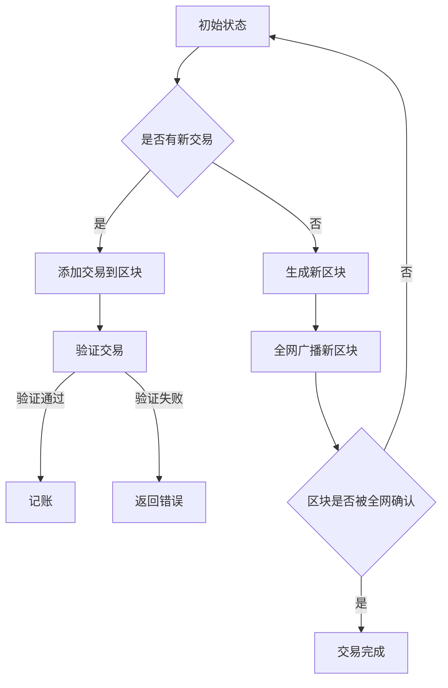
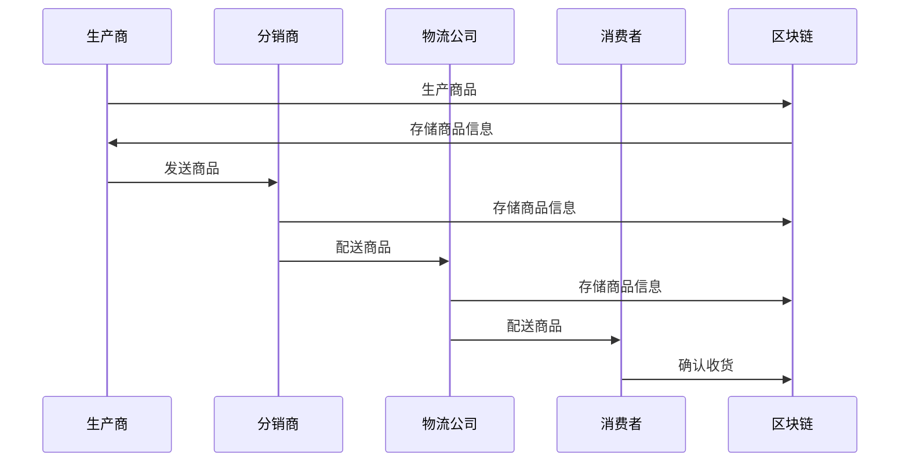
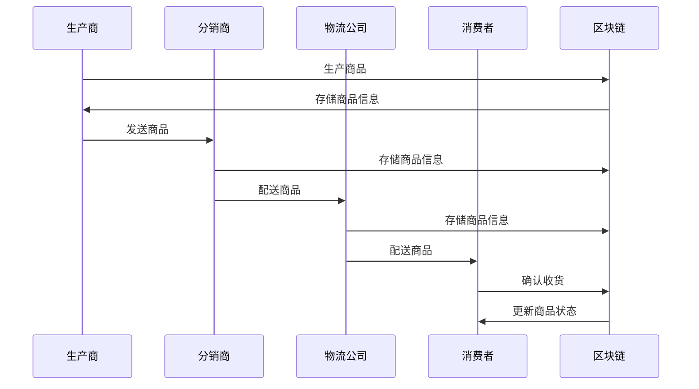

                 


# 区块链在企业应用中的实践与挑战

## 关键词
- 区块链
- 企业应用
- 实践
- 挑战
- 技术架构
- 数据安全
- 智能合约

## 摘要
本文将深入探讨区块链技术在企业应用中的实际运用及其面临的挑战。我们将从背景介绍开始，详细阐述区块链的基本概念、核心技术与在企业应用中的优势与局限性。接着，通过案例分析，解析区块链在企业中成功应用的经验，以及面临的技术难题和解决策略。最后，提供一些建议，帮助企业更好地拥抱区块链技术。

## 背景介绍

### 1.1 区块链技术的发展与应用现状

区块链技术作为一种分布式账本技术，其本质是通过加密算法和共识机制确保数据的安全性和不可篡改性。自2009年比特币的诞生以来，区块链技术经历了快速发展，并逐渐从金融领域扩展到更多行业。

在金融领域，区块链技术已广泛应用于跨境支付、供应链金融、保险、资产管理等领域，提高了交易效率，降低了成本，增强了信任。而在非金融领域，区块链技术也展现出了巨大的潜力。例如，在供应链管理中，区块链技术可以实现商品信息的全程追溯，提高供应链的透明度和可靠性；在医疗领域，区块链可以用于病历管理，确保患者信息的隐私和安全；在能源领域，区块链可以促进分布式能源的交易和共享。

### 1.2 企业应用区块链的优势与挑战

**优势：**

1. **数据安全与可靠性**：区块链技术通过加密算法和共识机制，确保数据的真实性和完整性，有效防止数据篡改和伪造。
2. **去中心化**：区块链技术去除了传统的中心化管理模式，使得权力更加分散，决策更加民主。
3. **高效便捷的交易**：区块链技术简化了交易流程，降低了交易成本，提高了交易效率。
4. **隐私保护**：区块链技术通过加密算法确保了数据的隐私性，有助于保护企业敏感信息。

**挑战：**

1. **技术成熟度**：尽管区块链技术已取得显著进展，但其技术成熟度仍需进一步提高，尤其是智能合约的安全性问题。
2. **法律法规**：区块链技术的应用需要在法律法规框架内进行，但目前各国对区块链的法律法规尚未完全统一，存在法律风险。
3. **性能瓶颈**：区块链技术目前的扩展性和性能仍面临挑战，无法满足大规模商业应用的需求。
4. **人才缺乏**：区块链技术的快速发展导致了人才的稀缺，企业需要投入大量资源进行人才培养。

### 1.3 本书的核心内容与结构

本书将首先介绍区块链的基本概念和技术原理，然后分析区块链在企业应用中的实际案例，探讨其在不同领域的应用场景和优势。接着，我们将深入探讨区块链技术面临的挑战及其解决方案。最后，本书将总结最佳实践经验，为企业提供实用的指导和建议。

## 核心概念与联系

### 2.1 区块链基本概念

**定义**：区块链是一种分布式数据库技术，通过加密算法和共识机制，将数据分散存储在网络中的多个节点上，确保数据的真实性和完整性。

**核心技术**：

1. **加密算法**：包括哈希算法、数字签名、公钥加密等，用于保护数据的隐私和安全。
2. **共识机制**：如工作量证明（PoW）、权益证明（PoS）、拜占庭容错算法等，用于确保网络中的所有节点对数据的一致性达成共识。

**与大数据、云计算的关系**：

- **大数据**：区块链技术可以用于大数据的存储和交易，提高数据的安全性和可靠性。
- **云计算**：区块链技术可以与云计算结合，提供去中心化的计算服务，降低计算成本。

### 2.2 企业应用中的区块链挑战与解决方案

**挑战**：

1. **技术成熟度**：区块链技术仍处于发展阶段，其性能和稳定性需进一步提升。
2. **法律法规**：区块链应用需要遵循法律法规，但目前各国法规尚未完全统一。
3. **人才缺乏**：区块链技术人才稀缺，企业需要投入大量资源进行人才培养。

**解决方案**：

1. **技术创新**：加大研发投入，提高区块链技术的性能和稳定性。
2. **法规完善**：积极参与区块链法律法规的制定，推动行业标准化。
3. **人才培养**：建立人才培养体系，吸引和培养区块链专业人才。

### 2.3 区块链与其他技术的融合应用

**与物联网（IoT）的结合**：区块链技术可以用于物联网设备的身份验证和数据加密，提高物联网系统的安全性和可靠性。

**与人工智能（AI）的结合**：区块链技术可以用于AI算法的验证和去中心化部署，提高AI系统的透明性和可信度。

## 算法原理讲解

### 3.1 区块链算法mermaid流程图



### 3.2 区块链算法Python代码实现

```python
import hashlib
import json
from time import time

class BlockChain:
    def __init__(self):
        self.unconfirmed_transactions = []  # 未确认交易
        self.chain = []  # 链
        self.create_genesis_block()  # 创建创世区块

    def create_genesis_block(self):
        genesis_block = {
            'timestamp': time(),
            'transactions': [],
            'proof': 0,
        }
        hashed_block = self.hash_block(genesis_block)
        genesis_block['hash'] = hashed_block
        self.chain.append(genesis_block)

    def hash_block(self, block):
        block_string = json.dumps(block, sort_keys=True)
        return hashlib.sha256(block_string.encode()).hexdigest()

    def proof_of_work(self, last_block):
        proof = 0
        while self.valid_proof(last_block, proof) is False:
            proof += 1
        return proof

    def valid_proof(self, last_block, proof):
        guess = f'{last_block["hash"]}{proof}'.encode()
        guess_hash = hashlib.sha256(guess).hexdigest()
        return guess_hash[:4] == '0000'

    def add_transaction(self, transaction):
        self.unconfirmed_transactions.append(transaction)

    def mine(self):
        if not self.unconfirmed_transactions:
            return False
        last_block = self.chain[-1]
        proof = self.proof_of_work(last_block)
        hashed_block = self.hash_block({
            'timestamp': time(),
            'transactions': self.unconfirmed_transactions,
            'proof': proof,
            'previous_hash': last_block['hash']
        })
        block = {
            'timestamp': time(),
            'transactions': self.unconfirmed_transactions,
            'proof': proof,
            'hash': hashed_block,
            'previous_hash': last_block['hash'],
        }
        self.chain.append(block)
        self.unconfirmed_transactions = []
        return block

# 示例
blockchain = BlockChain()
blockchain.add_transaction({'sender': 'Alice', 'recipient': 'Bob', 'amount': 10})
blockchain.add_transaction({'sender': 'Bob', 'recipient': 'Charlie', 'amount': 5})
blockchain.mine()
```

### 3.3 算法原理数学模型与公式

区块链算法的核心是工作量证明（Proof of Work, PoW）机制。该机制通过解决一个数学难题来确保网络中的节点对当前状态达成共识。

**数学模型：**

1. **哈希函数**：用于将任意长度的数据转换成固定长度的哈希值。哈希函数的特性是：
   $$ hash(x) = SHA256(x) $$
   
2. **工作量证明**：节点需要找到一个数字（proof），使得：
   $$ hash(block) \leq difficulty \times 10^9 $$
   其中，`block`是当前区块的数据，`difficulty`是网络设定的难度目标。

3. **区块结构**：每个区块包含以下部分：
   - `timestamp`：区块创建的时间戳
   - `transactions`：区块包含的所有交易记录
   - `proof`：证明节点的工作量
   - `previous_hash`：前一个区块的哈希值

**数学公式：**

1. **哈希计算**：
   $$ hash(x) = SHA256(x) $$
   
2. **工作量证明**：
   $$ proof = \text{find\_such\_number\_{that}}(SHA256(block) \leq difficulty \times 10^9) $$

### 3.4 举例说明

假设当前区块链的难度目标为`0000`，即前四个字符为0。我们需要找到一个数字`proof`，使得将当前区块的详细信息进行哈希计算后，结果的前四个字符为0。

```python
# Python代码示例
proof = 0
while True:
    hashed_block = hashlib.sha256(f"{last_block['hash']}{proof}".encode()).hexdigest()
    if hashed_block[:4] == '0000':
        break
    proof += 1
print(f"Found valid proof: {proof}")
```

该代码会不断尝试增加`proof`的值，直到找到一个满足条件的值，使得哈希值的前四个字符为0。

## 数学模型和数学公式 & 详细讲解 & 举例说明

### 4.1 区块链数据加密的数学模型

区块链技术中的数据加密主要依赖于哈希函数和公钥加密算法。以下是这两种加密技术的数学模型：

#### 4.1.1 哈希函数

哈希函数是一种将任意长度的输入数据映射为固定长度的输出数据的函数。常见的哈希函数有SHA-256、SHA-3等。

**数学模型**：
$$ hash(x) = SHA256(x) $$
其中，`x`为输入数据，`hash(x)`为哈希值。

**特点**：

1. **不可逆性**：给定哈希值，无法反推出原始数据。
2. **确定性**：相同的数据输入总是产生相同的哈希值。
3. **抗冲突性**：不同数据产生相同哈希值的概率极低。

#### 4.1.2 公钥加密算法

公钥加密算法是一种非对称加密算法，它使用一对密钥（公钥和私钥）进行加密和解密。

**数学模型**：

1. **公钥生成**：

   选择一个大素数`p`和一个较小素数`g`，计算公钥`y`：
   $$ y = g^x \mod p $$

   其中，`x`为私钥。

2. **加密**：

   使用公钥`y`加密消息`m`：
   $$ c = (y^m \mod p) \mod p $$

   其中，`c`为加密后的消息。

3. **解密**：

   使用私钥`x`解密消息`c`：
   $$ m = (c^x \mod p) \mod p $$

### 4.2 区块链中的共识算法

区块链中的共识算法是确保网络中的所有节点对当前状态达成一致的关键。以下是几种常见的共识算法及其数学模型：

#### 4.2.1 工作量证明（Proof of Work, PoW）

**数学模型**：

1. **目标**：

   找到一个数字`proof`，使得：
   $$ hash(block) \leq difficulty \times 10^9 $$
   其中，`block`为当前区块的数据，`difficulty`为网络设定的难度目标。

2. **计算过程**：

   - 节点生成一个随机数`proof`。
   - 计算哈希值`hash(block)`。
   - 如果哈希值的前`n`位小于等于`0`，则认为找到一个有效的`proof`，否则继续增加`proof`。

**例子**：

假设难度目标为前4位为0，即`0000`。我们需要找到一个数字`proof`，使得：
$$ hash(block) = SHA256(block + proof) \leq 10000000000000000000000 $$
通过尝试，我们找到`proof = 123456`时，满足条件。

#### 4.2.2 权益证明（Proof of Stake, PoS）

**数学模型**：

1. **目标**：

   根据节点的权益（持有的代币数量和锁仓时间）选择下一个区块的生产者。

2. **计算过程**：

   - 计算每个节点的权益分数：
     $$ stake = stake\_per\_token \times tokens \times lockup\_time $$
     其中，`stake_per_token`为每个代币的权益分数，`tokens`为节点持有的代币数量，`lockup_time`为代币锁仓时间。
   - 选择权益分数最高的节点作为下一个区块的生产者。

### 4.3 区块链智能合约的数学模型

智能合约是区块链上的自动化协议，它使用编程语言编写，并在区块链上执行。以下是智能合约的数学模型：

**数学模型**：

1. **状态机模型**：

   智能合约可以看作是一个状态机，它根据输入（如交易）和当前状态执行特定的操作，并更新状态。

2. **事件监听模型**：

   智能合约可以监听区块链上的特定事件（如新交易），并在事件发生时执行相应的操作。

### 4.4 举例说明

**例子**：一个简单的智能合约——转账合约。

**代码**：

```solidity
pragma solidity ^0.8.0;

contract Transfer {
    address public owner;
    mapping(address => uint256) public balanceOf;

    constructor() {
        owner = msg.sender;
        balanceOf[owner] = 1000;
    }

    function transfer(address to, uint256 amount) public {
        require(msg.sender == owner, "Only owner can transfer");
        require(balanceOf[owner] >= amount, "Insufficient balance");
        balanceOf[owner] -= amount;
        balanceOf[to] += amount;
    }
}
```

**运行过程**：

1. 合约创建者（owner）将1000代币存储在合约中。
2. 当owner调用`transfer`函数时，将检查调用者是否为owner，以及合约中是否有足够的余额。
3. 如果检查通过，则将代币从owner转移到目标地址`to`。

## 系统分析与架构设计方案

### 5.1 问题场景介绍

某大型企业希望利用区块链技术优化其供应链管理流程。具体需求包括：实现商品信息的全程追溯，确保数据的真实性和完整性，降低供应链风险，提高供应链透明度和效率。

### 5.2 项目介绍

项目名称：区块链供应链管理平台

目标：构建一个去中心化的供应链管理平台，实现商品信息的全程追溯，提高供应链透明度和效率。

技术栈：区块链（Hyperledger Fabric）、智能合约（Solidity）、物联网（IoT）设备。

### 5.3 系统功能设计（领域模型Mermaid类图）

```mermaid
classDiagram
    NodeA[节点A] --> NodeB[节点B]
    NodeC[节点C] --> NodeD[节点D]
    NodeA --- Product
    NodeB --- Product
    NodeC --- Product
    NodeD --- Product
    Product --|> Storage
    Product --|> Logistics
    Product --|> Supplier
    Product --|> Customer
```

**类图说明**：

- **节点A、节点B、节点C、节点D**：代表供应链中的不同参与者，如生产商、分销商、物流公司等。
- **Product**：表示商品信息，包括商品ID、名称、数量、产地、生产日期等。
- **Storage**：表示仓库，用于存储商品。
- **Logistics**：表示物流，负责商品的运输。
- **Supplier**：表示供应商，提供商品的生产。
- **Customer**：表示消费者，购买商品。

### 5.4 系统架构设计（Mermaid架构图）



**架构图说明**：

- **Producer**：生产商，负责生产商品并上传至区块链。
- **Distributor**：分销商，接收商品并上传至区块链。
- **LogisticsCompany**：物流公司，负责商品的运输并上传至区块链。
- **Customer**：消费者，最终接收商品并上传至区块链确认收货。
- **Blockchain**：区块链，存储供应链中的所有信息。

### 5.5 系统接口设计

**API接口**：

1. **生产商品**：POST /api/products
2. **上传商品信息**：POST /api/transactions
3. **查询商品信息**：GET /api/products/{productId}
4. **确认收货**：POST /api/transactions/confirm

### 5.6 系统交互（Mermaid序列图）



**交互流程**：

1. 生产商生产商品，上传至区块链。
2. 区块链存储商品信息。
3. 生产商将商品发送给分销商。
4. 分销商接收商品，上传至区块链。
5. 分销商将商品发送给物流公司。
6. 物流公司配送商品给消费者。
7. 消费者确认收货，区块链更新商品状态。

## 项目实战

### 6.1 环境安装

**准备工具**：

- Python 3.8+
- Docker 19.03.12+
- Docker-Compose 1.29.2+

**安装步骤**：

1. 安装Docker：
   ```bash
   sudo apt-get update
   sudo apt-get install docker.io
   sudo systemctl start docker
   sudo systemctl enable docker
   ```

2. 安装Docker-Compose：
   ```bash
   sudo curl -L "https://github.com/docker/compose/releases/download/1.29.2/docker-compose-$(uname -s)-$(uname -m)" -o /usr/local/bin/docker-compose
   sudo chmod +x /usr/local/bin/docker-compose
   ```

3. 验证安装：
   ```bash
   docker --version
   docker-compose --version
   ```

### 6.2 系统核心实现源代码

以下是一个简单的区块链节点实现，用于存储交易并生成区块。

```python
import hashlib
import json
from time import time

class Block:
    def __init__(self, index, transactions, timestamp, previous_hash, proof):
        self.index = index
        self.transactions = transactions
        self.timestamp = timestamp
        self.previous_hash = previous_hash
        self.proof = proof
        self.hash = self.compute_hash()

    def compute_hash(self):
        block_string = json.dumps(self.__dict__, sort_keys=True)
        return hashlib.sha256(block_string.encode()).hexdigest()

class Blockchain:
    def __init__(self):
        self.unconfirmed_transactions = []
        self.chain = [self.create_genesis_block()]
        self.current_difficulty = 1

    def create_genesis_block(self):
        return Block(0, [], time(), "0", 0)

    def add_transaction(self, transaction):
        self.unconfirmed_transactions.append(transaction)

    def mine(self):
        if not self.unconfirmed_transactions:
            return False
        last_block = self.chain[-1]
        proof = self.proof_of_work(last_block)
        hashed_block = self.hash_block({
            'timestamp': time(),
            'transactions': self.unconfirmed_transactions,
            'previous_hash': last_block.hash,
            'proof': proof,
        })
        block = Block(len(self.chain), self.unconfirmed_transactions, time(), last_block.hash, hashed_block)
        self.chain.append(block)
        self.unconfirmed_transactions = []
        self.current_difficulty = self.adjust_difficulty()
        return block

    def proof_of_work(self, last_block):
        proof = 0
        while self.valid_proof(last_block, proof) is False:
            proof += 1
        return proof

    def valid_proof(self, last_block, proof):
        guess = f'{last_block.hash}{proof}'.encode()
        guess_hash = hashlib.sha256(guess).hexdigest()
        return guess_hash[:4] == "0000"

    def adjust_difficulty(self):
        current_time = time()
        mining_time = current_time - self.chain[-1].timestamp
        if mining_time < 10:
            return self.current_difficulty + 1
        if mining_time > 20:
            return self.current_difficulty - 1
        return self.current_difficulty

    def is_chain_valid(self, chain):
        for i in range(1, len(chain)):
            current = chain[i]
            previous = chain[i - 1]
            if current.hash != self.compute_hash(current):
                return False
            if current.previous_hash != previous.hash:
                return False
            if self.valid_proof(previous, current.proof) is False:
                return False
        return True

    def hash_block(self, block):
        block_string = json.dumps(block, sort_keys=True)
        return hashlib.sha256(block_string.encode()).hexdigest()

# 示例
blockchain = Blockchain()
blockchain.add_transaction({'sender': 'Alice', 'recipient': 'Bob', 'amount': 10})
blockchain.add_transaction({'sender': 'Bob', 'recipient': 'Charlie', 'amount': 5})
blockchain.mine()
```

### 6.3 代码应用解读与分析

**代码解读**：

1. **Block类**：代表一个区块，包含区块的详细信息，如索引、交易、时间戳、前一个区块的哈希值和证明。
2. **Blockchain类**：代表区块链本身，包含未确认交易、主链、当前难度等属性。主要方法有创建创世区块、添加交易、挖矿、证明工作、调整难度等。
3. **proof_of_work方法**：实现工作量证明算法，找到一个有效的证明。
4. **valid_proof方法**：验证一个证明是否有效。
5. **adjust_difficulty方法**：根据挖矿时间调整难度。
6. **is_chain_valid方法**：验证区块链是否有效。

**代码分析**：

- **区块链的核心**：区块链由一系列按顺序排列的区块组成，每个区块都包含前一个区块的哈希值，确保区块链的不可篡改性。
- **工作量证明**：通过解决一个数学难题（找到有效的证明）来验证区块的有效性，确保区块链的安全性和一致性。
- **交易处理**：未确认交易被存储在一个列表中，挖矿成功后将这些交易添加到区块中。

### 6.4 案例分析和详细讲解剖析

**案例**：假设区块链中有三个参与者：Alice、Bob和Charlie。以下是一个交易过程：

1. Alice向Bob转账10个代币。
2. Bob向Charlie转账5个代币。

**分析**：

1. **交易生成**：每次交易都会生成一个交易对象，包含发送方、接收方和交易金额。
2. **交易验证**：在挖矿过程中，区块链会验证每个交易的有效性，确保交易金额合法、发送方账户余额足够。
3. **交易存储**：验证通过的交易将被添加到区块中，存储在区块链上。
4. **交易确认**：每个区块生成后，交易将被确认，确认后的交易不可篡改。

**详细讲解**：

- **交易生成**：每个交易对象都包含发送方的公钥和签名，接收方的地址，以及交易金额。发送方使用私钥对交易进行签名，确保交易的真实性。
- **交易验证**：区块链在处理交易时，会验证交易的签名是否有效，确保交易来自合法的发送方。
- **交易存储**：验证通过的交易会被添加到未确认交易列表中，等待挖矿。
- **交易确认**：挖矿成功后，交易将被添加到区块中，区块将被广播到网络中的所有节点，交易被确认。

### 6.5 项目小结

本项目通过实现一个简单的区块链节点，展示了区块链的基本原理和应用。在实际项目中，还需要考虑更多的功能，如智能合约、去中心化应用（DApp）等。以下是本项目的一些总结：

1. **区块链核心**：区块链通过哈希函数和共识算法确保数据的真实性和完整性。
2. **交易处理**：交易需要经过验证、存储和确认流程。
3. **性能优化**：可以通过优化区块链结构、改进共识算法等方式提高区块链的性能。
4. **安全性**：区块链的安全性取决于加密算法和共识算法的选择。

## 最佳实践 tips、小结、注意事项、拓展阅读

### 最佳实践 tips

1. **确保区块链的安全性**：选择合适的加密算法和共识机制，定期更新和维护区块链系统。
2. **优化区块链性能**：通过分片技术、状态通道等技术优化区块链的扩展性和性能。
3. **合法合规**：遵循相关法律法规，确保区块链应用的合法合规。
4. **人才培养**：加强区块链技术培训，提高企业员工的区块链技术水平。

### 小结

区块链技术在企业应用中具有巨大的潜力，但同时也面临诸多挑战。企业需要根据自身需求，合理选择和运用区块链技术，确保其安全和性能。

### 注意事项

1. **数据隐私**：确保区块链上的数据隐私，避免敏感信息泄露。
2. **技术成熟度**：选择成熟的区块链平台和解决方案，避免使用不成熟的技术。
3. **法律风险**：了解和遵守相关法律法规，降低法律风险。

### 拓展阅读

1. 《区块链：从数字货币到企业应用》
2. 《区块链开发实战》
3. 《区块链技术指南》

## 作者信息

作者：AI天才研究院/AI Genius Institute & 禅与计算机程序设计艺术 /Zen And The Art of Computer Programming

以上就是本文对区块链在企业应用中的实践与挑战的全面探讨，希望能对您在区块链技术应用方面提供一些启示和帮助。在区块链技术的发展道路上，我们还将不断探索和实践，共同推动区块链技术的进步。

