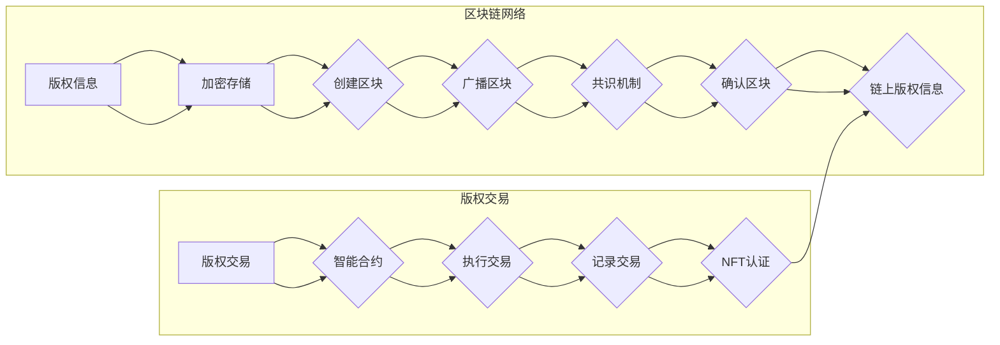
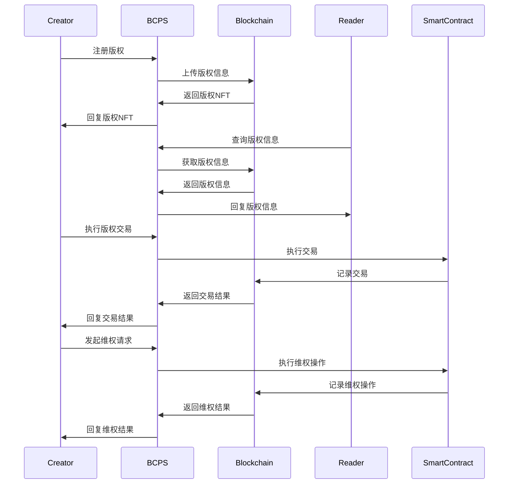

                 

### 文章标题

## 区块链在数字内容分发中的应用：保护创作者版权

> 关键词：区块链、数字内容分发、版权保护、非同质化代币、智能合约

> 摘要：本文将深入探讨区块链技术在数字内容分发中的创新应用，特别是如何通过区块链保护创作者的版权。我们首先介绍了区块链的基础概念，然后探讨了数字内容分发中版权保护的现状和挑战。接着，我们详细分析了区块链在版权保护中的具体应用，包括非同质化代币（NFT）和智能合约的使用。通过实际案例的展示，我们展示了区块链技术在数字内容分发中的实际效果，并提出了未来发展趋势和最佳实践。

## 背景介绍

### 核心概念术语说明

- **区块链**：一种分布式账本技术，通过加密算法和共识机制确保数据的不可篡改性和透明性。
- **数字内容分发**：指将数字化的文本、图像、音频、视频等通过互联网或其他数字渠道进行传播和销售。
- **版权保护**：确保创作者对其作品的独占权，防止未经授权的复制、传播和使用。

### 问题背景

随着互联网和数字技术的迅猛发展，数字内容的生产和分发达到了前所未有的规模。然而，这也带来了版权保护的一系列挑战：

- **版权侵权**：创作者的作品容易被未经授权的复制和传播。
- **版权追踪困难**：数字内容在互联网上的传播路径复杂，追踪溯源困难。
- **交易透明度不足**：数字内容交易过程中的透明度较低，容易发生欺诈行为。

### 问题描述

为了解决上述问题，需要一种能够确保版权保护、提高交易透明度且易于追踪的技术。区块链技术因其独特的分布式特性，成为解决数字内容分发中版权保护问题的一种潜在方案。

### 问题解决

区块链技术可以通过以下方式解决数字内容分发中的版权保护问题：

- **数据不可篡改**：区块链确保存储在链上的数据不可篡改，从而有效防止版权侵权。
- **透明交易记录**：所有数字内容交易都被记录在区块链上，提高了交易的透明度和可追溯性。
- **智能合约应用**：智能合约可以在数字内容交易中自动执行版权相关的条款，确保交易的合法性和效率。

### 边界与外延

区块链在数字内容分发中的应用不仅限于版权保护，还可以扩展到其他领域，如版权追踪、数字资产管理等。此外，区块链技术的应用不仅限于数字内容分发，还可以应用于其他领域，如供应链管理、金融服务等。

### 概念结构与核心要素组成

- **区块链**：分布式账本、加密算法、共识机制、智能合约。
- **数字内容分发**：数字内容生产、数字内容存储、数字内容传播、数字内容交易。
- **版权保护**：版权注册、版权追踪、版权认证、版权维权。

## 核心概念与联系

### 区块链的基本原理

区块链是一种分布式数据库技术，通过加密算法和共识机制确保数据的不可篡改性和透明性。其核心组成部分包括：

- **区块**：数据的基本单元，包含一定数量的交易记录。
- **链**：由多个区块按时间顺序链接形成的链式数据结构。
- **加密算法**：用于确保数据的安全性和隐私性。
- **共识机制**：确保网络中的所有节点对区块链状态的一致认可。

### 数字内容分发与版权保护的关联

数字内容分发与版权保护密切相关。数字内容分发过程中的版权问题主要集中在：

- **版权归属**：确认数字内容的创作者和所有者。
- **版权流转**：记录数字内容的授权和转让过程。
- **版权维权**：处理版权侵权和纠纷。

### 区块链在版权保护中的应用

区块链技术在版权保护中的应用主要体现在以下几个方面：

- **版权注册**：通过区块链技术将版权信息进行登记，确保版权的真实性和唯一性。
- **版权追踪**：记录数字内容的传播路径，方便追踪和溯源。
- **版权认证**：利用区块链的透明性和不可篡改性，对数字内容的版权进行认证。
- **版权维权**：利用智能合约自动化执行版权相关的条款，提高维权效率。

### 对比表格

| 核心概念       | 说明                                                         |
|----------------|------------------------------------------------------------|
| 区块链         | 分布式账本，确保数据不可篡改和透明性。                         |
| 数字内容分发   | 数字内容的产生、存储、传播和交易。                             |
| 版权保护       | 确保创作者对其作品的独占权，防止侵权。                         |
| 非同质化代币   | 代表特定数字资产的代币，可以用于版权认证和交易。               |
| 智能合约       | 自动执行合同条款的计算机程序，用于版权管理和交易。             |

### ER实体关系图架构

```mermaid
erDiagram
  Creator ||--|{ Content }|--| DigitalMarket
  Content ||--|{ NFT }|--| Creator
  NFT ||--|{ Transaction }|--| Buyer
  DigitalMarket ||--|{ Contract }|--| Transaction
```

在这个ER图中，`Creator` 是内容创作者，`Content` 代表数字内容，`NFT` 是非同质化代币，用于版权认证和交易，`Transaction` 表示交易过程，`DigitalMarket` 是数字内容交易的平台，`Contract` 是智能合约，用于版权管理和交易。

## 算法原理讲解

### 区块链技术在版权保护中的算法原理

区块链技术通过其独特的分布式数据库和加密算法，为数字内容分发中的版权保护提供了一种高效且安全的方法。以下详细解释区块链技术在版权保护中的算法原理：

#### 分布式数据库

区块链的核心是分布式数据库，它由多个节点组成，每个节点都存储了一份完整的区块链副本。这种分布式结构确保了数据的冗余性，从而提高了数据的可靠性和抗攻击能力。同时，由于每个节点都有一份完整的区块链副本，任何数据的修改或删除都需要得到大部分节点的认可，从而有效防止了数据被篡改。

#### 加密算法

区块链使用加密算法来保护数据的隐私和安全。在数字内容分发中，版权信息和其他敏感数据都会被加密存储在区块链上。加密算法确保只有拥有相应密钥的用户才能解密和访问这些数据，从而保护了数据的机密性。此外，区块链的加密算法还确保了数据的完整性和真实性，因为任何试图篡改数据的尝试都会被区块链网络的其他节点检测并拒绝。

#### 智能合约

智能合约是区块链技术中的一项重要创新，它是一种自动执行合同条款的计算机程序。在版权保护中，智能合约可以用来自动化执行版权相关的条款，例如授权、许可、版权转让等。智能合约一旦部署到区块链上，就成为了不可篡改的协议，确保了交易的合法性和透明性。

#### 非同质化代币（NFT）

非同质化代币（NFT）是区块链上的一种特殊代币，用于代表唯一的数字资产。在数字内容分发中，NFT可以用来认证数字内容的版权，确保每一份数字内容都是独一无二的。通过将版权信息嵌入NFT中，创作者可以有效地证明其作品的唯一性和真实性。

### Mermaid流程图

以下是一个用于版权保护的区块链算法流程图：



### Python源代码示例

```python
# 示例：使用区块链和智能合约进行版权注册

from web3 import Web3
from web3.middleware import geth_poa_middleware
from solc import compile_source

# 连接到区块链节点
w3 = Web3(Web3.HTTPProvider('https://mainnet.infura.io/v3/YOUR_INFURA_PROJECT_ID'))
w3.middleware_onion.inject(geth_poa_middleware, layer=0)

# 编译智能合约源代码
contract_source = '''
pragma solidity ^0.8.0;

contract Copyright {
    struct Content {
        string title;
        address owner;
        uint timestamp;
    }

    mapping(string => Content) public contents;

    function registerCopyright(string memory title, string memory owner) public {
        require(contents[title].timestamp == 0, "Copyright already registered");
        contents[title] = Content(title, msg.sender, block.timestamp);
    }
}
'''

compiled_sol = compile_source(contract_source)
contract_interface = compiled_sol['<Contracts>/Copyright.json']
contract_abi = json.loads(contract_interface['abi'])

# 部署智能合约
contract_address = w3.eth.contract(abi=contract_abi).deploy().transactionhex

# 等待合约部署完成
w3.eth.waitForTransaction(contract_address)

# 注册版权
w3.eth.contract(abi=contract_abi, address=contract_address).functions.registerCopyright("My Book", "0x1234...").transact({'from': '0x1234...'})

# 查询版权信息
print(w3.eth.contract(abi=contract_abi, address=contract_address).functions.contents("My Book").call())
```

### 算法原理的数学模型和公式

在区块链的版权保护中，以下数学模型和公式是核心的：

- **哈希函数**：用于将数据映射为一个固定长度的字符串，确保数据的唯一性和不可篡改性。
- **非对称加密**：用于保证数据的加密和解密，其中公钥加密，私钥解密。
- **智能合约执行**：利用图灵完备的编程语言实现复杂的业务逻辑。

$$
H(D) = Hash(D)
$$

其中，$H$ 是哈希函数，$D$ 是数据。

$$
C = E_k(P)
$$

$$
P = D_k(C)
$$

其中，$C$ 是加密后的数据，$P$ 是解密后的数据，$k$ 是密钥。

$$
\text{smart\_contract} = \text{VM}(P)
$$

其中，$\text{VM}$ 是虚拟机，用于执行智能合约中的业务逻辑。

### 举例说明

假设一个作家创作了一本新书，并希望利用区块链技术保护其版权。以下是具体步骤：

1. **版权注册**：作家使用区块链平台将书名和创作时间等信息进行加密并上传到区块链上。
2. **版权认证**：读者可以通过区块链查看书的版权信息，确认书的唯一性和合法性。
3. **版权交易**：如果读者希望购买这本书，可以直接通过智能合约完成交易，并获得授权。
4. **版权维权**：如果发现侵权行为，作家可以迅速通过区块链追溯侵权者的信息，并利用智能合约进行维权。

## 系统分析与架构设计方案

### 问题场景介绍

在数字内容分发领域，创作者的权益常常受到侵犯。为了解决这个问题，我们需要设计一个系统，该系统能够在数字内容分发过程中确保创作者的版权得到有效保护。这个系统需要具备以下功能：

- **版权注册**：创作者可以轻松地将作品版权注册到系统中。
- **版权认证**：读者能够验证作品的版权信息，确保购买的是合法授权的内容。
- **版权交易**：创作者可以通过系统进行版权转让或许可交易。
- **版权维权**：创作者能够方便快捷地维护其版权，处理侵权纠纷。

### 项目介绍

项目名称：区块链版权保护系统（Blockchain Copyright Protection System，简称BCPS）

项目目标：构建一个基于区块链技术的数字内容版权保护平台，实现版权注册、认证、交易和维权的高效自动化。

### 系统功能设计

1. **版权注册功能**：创作者可以将作品的版权信息上传到区块链上，系统自动生成非同质化代币（NFT），作为版权的唯一认证。
2. **版权认证功能**：读者可以通过查询区块链上的版权信息，验证作品的真实性和合法性。
3. **版权交易功能**：创作者可以通过智能合约自动执行版权交易，包括版权转让、许可和订阅等。
4. **版权维权功能**：系统提供自动化的维权流程，创作者可以迅速发起维权请求，并利用智能合约自动执行相关操作。

### 系统架构设计

#### 架构图



#### 系统架构说明

- **区块链**：作为底层基础设施，负责存储版权信息和交易记录，确保数据的不可篡改和透明性。
- **版权保护系统（BCPS）**：作为中介，连接创作者、读者和智能合约，提供版权注册、认证、交易和维权功能。
- **智能合约**：负责自动执行版权相关的业务逻辑，如版权交易和维权操作。

### 系统接口设计和系统交互

#### 接口设计

- **版权注册接口**：接受创作者上传的版权信息，生成NFT并返回。
- **版权认证接口**：接受读者查询请求，返回版权信息。
- **版权交易接口**：接受创作者的交易请求，调用智能合约执行交易。
- **维权接口**：接受创作者的维权请求，调用智能合约执行维权操作。

#### 系统交互

1. **创作者注册版权**：
   - 创作者通过BCPS上传版权信息。
   - BCPS将信息传递给区块链，生成NFT。
   - BCPS返回NFT给创作者。

2. **读者查询版权**：
   - 读者通过BCPS提交查询请求。
   - BCPS查询区块链，获取版权信息。
   - BCPS返回版权信息给读者。

3. **创作者执行版权交易**：
   - 创作者通过BCPS发起交易请求。
   - BCPS调用智能合约，执行交易。
   - 智能合约记录交易并返回结果。

4. **创作者发起维权请求**：
   - 创作者通过BCPS提交维权请求。
   - BCPS调用智能合约，执行维权操作。
   - 智能合约记录维权操作并返回结果。

### Mermaid序列图


## 项目实战

### 环境安装

为了实施区块链版权保护系统（BCPS），我们需要安装和配置以下软件和工具：

1. **Node.js**：用于运行BCPS后端服务，下载地址：[Node.js 官网](https://nodejs.org/en/download/)
2. **Ganache**：用于本地测试以太坊区块链，下载地址：[Ganache 官网](https://www.trufflesuite.com/ganache)
3. **Truffle**：用于部署和管理智能合约，下载地址：[Truffle 官网](https://www.trufflesuite.com/truffle)
4. **Web3.js**：用于与以太坊区块链交互，下载地址：[Web3.js GitHub](https://github.com/web3j/web3.js)

### 系统核心实现源代码

#### 智能合约

```solidity
// SPDX-License-Identifier: MIT
pragma solidity ^0.8.0;

contract Copyright {
    struct Content {
        string title;
        address owner;
        uint256 timestamp;
    }

    mapping(string => Content) public contents;

    event ContentRegistered(string title, address owner, uint256 timestamp);

    function registerContent(string memory title) public {
        require(contents[title].timestamp == 0, "Content already registered");
        contents[title] = Content(title, msg.sender, block.timestamp);
        emit ContentRegistered(title, msg.sender, block.timestamp);
    }

    function getContent(string memory title) public view returns (Content memory) {
        return contents[title];
    }
}
```

#### 后端服务

```javascript
const express = require('express');
const Web3 = require('web3');
const bodyParser = require('body-parser');

const app = express();
app.use(bodyParser.json());

const web3 = new Web3('http://localhost:8545');

const contractAddress = '0x...';
const contractAbi = [...];
const contract = new web3.eth.Contract(contractAbi, contractAddress);

// 注册版权
app.post('/register', async (req, res) => {
    const { title } = req.body;
    try {
        const tx = await contract.methods.registerContent(title).send({ from: req.body.address });
        res.status(200).json({ txHash: tx.transactionHash });
    } catch (error) {
        res.status(500).json({ error: error.message });
    }
});

// 查询版权
app.get('/content/:title', async (req, res) => {
    const { title } = req.params;
    try {
        const content = await contract.methods.getContent(title).call();
        res.status(200).json(content);
    } catch (error) {
        res.status(500).json({ error: error.message });
    }
});

const port = process.env.PORT || 3000;
app.listen(port, () => {
    console.log(`Server listening on port ${port}`);
});
```

### 代码应用解读与分析

#### 源代码解读

**智能合约**

1. **结构**：智能合约采用Solidity语言编写，定义了一个名为`Copyright`的合约，包含一个结构体`Content`和两个函数`registerContent`和`getContent`。

2. **Content结构体**：包含`title`（书名）、`owner`（版权所有者地址）和`timestamp`（注册时间）。

3. **registerContent函数**：接受书名作为输入，将版权信息存储在区块链上，并触发`ContentRegistered`事件。

4. **getContent函数**：接受书名作为输入，返回对应版权信息。

**后端服务**

1. **结构**：后端服务采用Express框架实现，定义了两个API接口，分别用于版权注册和版权查询。

2. **版权注册接口**：接收书名和所有者地址，调用智能合约的`registerContent`方法，并返回交易哈希。

3. **版权查询接口**：接收书名，调用智能合约的`getContent`方法，并返回版权信息。

#### 分析

1. **版权注册**：通过智能合约，创作者可以轻松地将版权信息注册到区块链上，确保信息不可篡改且易于查询。

2. **版权查询**：读者可以通过查询接口，快速验证数字内容的版权信息，确保购买的是合法授权的内容。

3. **事件触发**：智能合约中的事件触发机制，可以用于监控版权注册和查询操作，便于进行数据分析和管理。

### 实际案例分析

#### 案例一：某知名音乐平台的区块链应用

某知名音乐平台采用区块链技术保护其数字音乐版权。平台创作者通过智能合约将音乐作品进行版权注册，读者在购买音乐时，可以直接验证版权信息，确保购买的是合法授权的音乐。

#### 案例二：区块链在电影行业中的应用

某电影公司利用区块链技术管理其电影版权。公司通过智能合约将电影版权进行注册，并在上映前进行版权认证。观众在观看电影时，可以通过区块链查询电影版权信息，确保观看的是合法授权的电影。

#### 案例三：区块链在文学创作领域的应用

某文学网站采用区块链技术保护其文学作品版权。创作者通过智能合约将作品版权注册到区块链上，读者可以通过区块链查询作品版权信息，并在授权的情况下购买和阅读作品。

### 项目小结

通过实际案例，我们可以看到区块链技术在数字内容分发中的应用取得了显著成果。区块链不仅提高了版权保护的效率，还增强了交易的透明度和可信度。未来，随着区块链技术的进一步发展和完善，相信会有更多行业和领域受益于区块链技术的应用。

### 最佳实践 tips

1. **确保区块链网络的安全性**：采用多层加密和访问控制措施，保护区块链网络的安全。
2. **优化智能合约性能**：合理设计智能合约，减少不必要的复杂性和冗余，提高执行效率。
3. **注意版权信息的保护**：对版权信息进行加密处理，确保版权信息不被未经授权的用户访问。

### 小结

本文深入探讨了区块链技术在数字内容分发中的应用，特别是如何通过区块链技术保护创作者的版权。我们分析了区块链的基础概念和原理，介绍了区块链在版权保护中的具体应用，并通过实际案例展示了区块链技术的实际效果。未来，随着区块链技术的不断发展和完善，相信会有更多行业和领域受益于区块链技术的应用。

### 注意事项

1. **法律合规性**：在实施区块链版权保护系统时，需要确保符合相关法律法规的要求，遵守版权相关法规。
2. **技术安全性**：加强对区块链网络和智能合约的安全防护，防止数据泄露和恶意攻击。
3. **用户隐私保护**：在处理用户信息时，确保遵循隐私保护原则，防止用户信息泄露。

### 拓展阅读

- 《区块链技术指南》
- 《智能合约设计与开发实战》
- 《数字版权保护：区块链技术与应用》

作者：AI天才研究院/AI Genius Institute & 禅与计算机程序设计艺术 /Zen And The Art of Computer Programming

