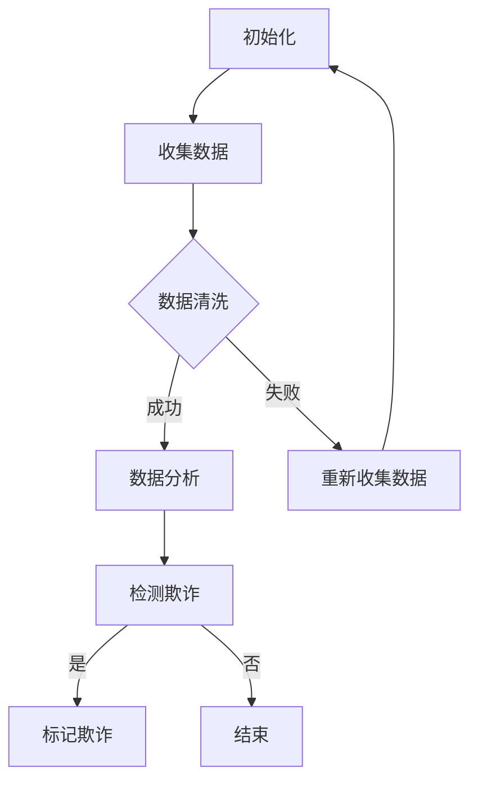
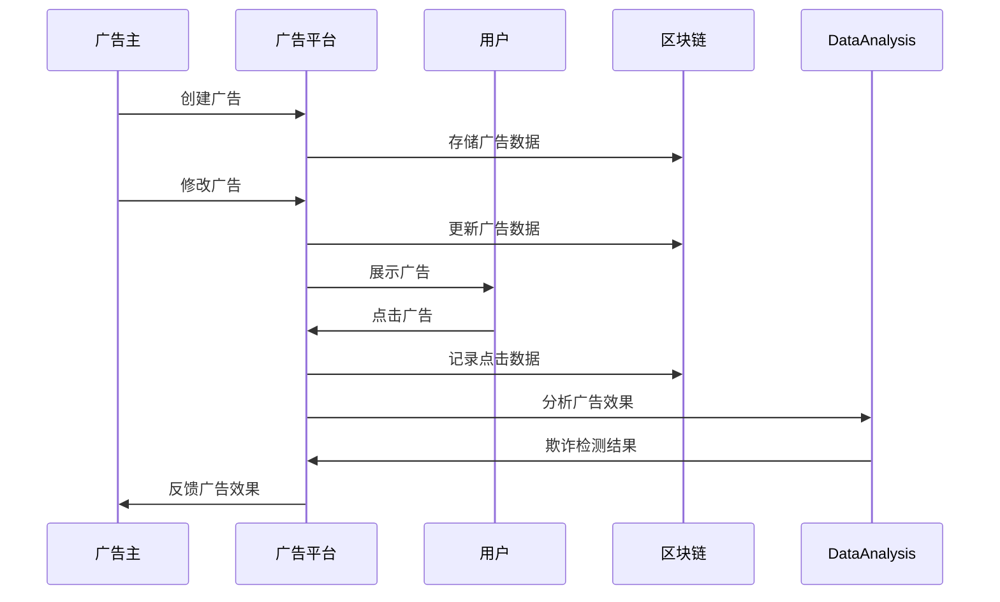

                 

# 《区块链在数字广告投放中的应用：减少广告欺诈》

关键词：区块链、数字广告、广告欺诈、智能合约、数据透明性、算法分析

摘要：随着数字广告市场的快速增长，广告欺诈问题日益严重。本文探讨了区块链技术在数字广告投放中的应用，通过提高透明性和可追溯性，有效减少广告欺诈。文章首先介绍了数字广告行业的背景和广告欺诈的问题，然后详细阐述了区块链技术的核心原理和其在广告行业中的潜在应用。接下来，文章分析了区块链在广告欺诈防范中的具体应用，包括智能合约和区块链数据分析。随后，文章通过算法原理讲解和实际案例分析，展示了区块链在广告欺诈检测中的效果。最后，文章总结了最佳实践，并给出了进一步研究和应用的展望。

----------------------------------------------------------------

## 第一部分：背景介绍

### 1.1 问题背景

数字广告行业近年来呈现出爆发式增长，广告主和广告平台纷纷加入这一市场。然而，广告欺诈问题也随之而来，成为制约行业健康发展的重要因素。广告欺诈包括点击欺诈、展示欺诈和内容欺诈等多种形式，严重影响了广告主的投资回报率，损害了广告平台的声誉。解决广告欺诈问题，已经成为数字广告行业亟待解决的难题。

### 1.2 问题描述

广告欺诈的类型多种多样，其中点击欺诈和展示欺诈最为常见。点击欺诈是指通过虚假点击或恶意点击广告，欺骗广告主支付费用。展示欺诈则是通过虚假展示或恶意展示广告，使得广告投放效果大打折扣。广告欺诈对广告主和广告平台的影响非常深远，不仅浪费了广告主的资金，还可能导致广告主的信任受损，从而影响广告主继续在数字广告市场中的投资。对于广告平台而言，广告欺诈会降低平台的收益，损害平台的商业信誉。

### 1.3 问题解决

区块链技术的兴起为解决广告欺诈问题提供了新的思路。区块链技术的核心优势在于其不可篡改性和透明性，这为广告行业提供了一个去中心化的、可靠的解决方案。通过区块链技术，可以实现对广告投放过程的全透明追踪，从而有效减少广告欺诈。同时，智能合约的引入，使得广告投放和结算过程更加自动化和高效。

### 1.4 边界与外延

区块链在广告欺诈防范中的应用，主要集中在提高透明性和可追溯性。然而，区块链技术并非万能，其适用范围有限。例如，对于复杂的广告投放策略和多样化的广告产品，区块链技术的应用效果可能并不理想。此外，区块链技术在广告行业中的应用，还需要考虑数据隐私保护、区块链性能和成本等问题。

### 1.5 概念结构与核心要素组成

区块链技术的基本架构包括数据区块、链式结构、共识算法和智能合约等核心要素。数字广告投放的基本流程包括广告主、广告平台、广告受众和广告数据等关键环节。广告欺诈的关键环节主要包括点击数据、展示数据和用户行为等。以下是一个简单的ER实体关系图架构：

```mermaid
erDiagram
  ADVERTISER ||--|{ ADVERTISEMENT }: Advertisements
  ADVERTISEMENT ||--|{ CLICK }: Clicks
  ADVERTISEMENT ||--|{ IMPRESSION }: Impressions
  USER ||--|{ BEHAVIOR }: Behaviors
```

## 第二部分：核心概念与联系

### 2.1 区块链技术原理

区块链技术是一种分布式数据库技术，其基本工作原理是通过共识算法，将多个节点上的数据同步并存储，形成一个不可篡改的链式结构。区块链的核心特性包括去中心化、不可篡改、可追溯性和安全性。区块链与加密技术的联系主要体现在加密算法的应用，如SHA-256、ECDSA等。

### 2.2 数字广告投放概念

数字广告投放的基本流程包括广告策划、广告投放、广告展示和广告效果追踪等环节。广告投放的主要参与者包括广告主、广告平台、广告代理和广告受众。广告投放的关键性能指标包括点击率、转化率、曝光率和广告投放成本等。

### 2.3 广告欺诈概念及其分类

广告欺诈是指通过虚假点击、虚假展示、恶意点击等方式，欺骗广告主支付费用或降低广告投放效果的行为。广告欺诈的类型主要包括点击欺诈、展示欺诈、内容欺诈和流量欺诈等。

### 2.4 区块链在广告欺诈防范中的应用

区块链在广告欺诈防范中的应用主要体现在以下几个方面：

1. **提高透明性和可追溯性**：通过区块链技术，广告投放过程的所有数据都可以被透明地记录和追踪，从而提高广告投放的透明度。
2. **智能合约**：智能合约可以自动执行广告投放和结算过程，确保广告投放的公平性和效率。
3. **数据加密**：区块链技术的加密算法可以确保广告投放数据的安全性和隐私性。

以下是一个概念属性特征对比表格：

| 特性          | 区块链                 | 传统技术               |
| ------------- | ---------------------- | ---------------------- |
| 透明性        | 高                     | 低                     |
| 可追溯性      | 高                     | 低                     |
| 安全性        | 高                     | 中                     |
| 成本          | 高（初期投入较大）     | 低                     |
| 可扩展性      | 中                     | 高                     |

### 2.5 ER实体关系图架构

以下是广告投放系统和广告欺诈防范系统的ER图：

```mermaid
erDiagram
  ADVERTISER ||--|{ ADVERTISEMENT }: Advertisements
  ADVERTISEMENT ||--|{ CLICK }: Clicks
  ADVERTISEMENT ||--|{ IMPRESSION }: Impressions
  USER ||--|{ BEHAVIOR }: Behaviors
  BLOCKCHAIN ||--|{ TRANSACTION }: Transactions
```

## 第三部分：算法原理讲解

### 3.1 智能合约设计与实现

智能合约是区块链技术中的重要组成部分，它是一种自动执行的合约，不需要第三方介入。智能合约的基本概念包括状态变量、事件、函数等。智能合约的编程语言通常使用Solidity等特定语言编写。

以下是一个简单的智能合约示例，用于广告投放的结算过程：

```python
// SPDX-License-Identifier: MIT
pragma solidity ^0.8.0;

contract Advertisement {

    address public owner;
    mapping(address => uint) public balances;

    constructor() {
        owner = msg.sender;
    }

    function deposit() external payable {
        balances[msg.sender()] += msg.value;
    }

    function payout() external {
        require(msg.sender == owner, "Only the owner can withdraw funds");
        owner.transfer(balances[owner]);
    }

}
```

### 3.2 区块链数据分析

区块链数据存储与管理是通过区块和链式结构实现的。区块链数据分析主要包括数据查询、数据分析和数据可视化等步骤。区块链数据分析方法包括区块链日志分析、交易数据分析等。

以下是一个简单的区块链数据分析流程：

1. **数据收集**：通过区块链节点收集交易数据。
2. **数据清洗**：对收集到的数据进行清洗和预处理。
3. **数据分析**：使用数据分析工具对清洗后的数据进行统计分析。
4. **数据可视化**：通过图表和图形将分析结果可视化。

### 3.3 算法原理讲解

以下是一个用于检测广告欺诈的Mermaid算法流程图：



以下是一个简单的Python源代码实现：

```python
import pandas as pd
from sklearn.model_selection import train_test_split
from sklearn.ensemble import RandomForestClassifier
from sklearn.metrics import accuracy_score

# 数据收集
data = pd.read_csv('advertisement_data.csv')

# 数据清洗
# ...

# 数据分析
X = data.drop(['is_fraud'], axis=1)
y = data['is_fraud']
X_train, X_test, y_train, y_test = train_test_split(X, y, test_size=0.2, random_state=42)

# 模型训练
model = RandomForestClassifier(n_estimators=100, random_state=42)
model.fit(X_train, y_train)

# 检测欺诈
predictions = model.predict(X_test)

# 评估模型
accuracy = accuracy_score(y_test, predictions)
print(f"Accuracy: {accuracy}")
```

### 3.4 举例说明

以下是一个实际的广告投放案例：

1. **广告主**：某电子商务平台，希望提高其产品的点击率和转化率。
2. **广告平台**：某数字广告平台，负责广告投放和效果追踪。
3. **广告受众**：潜在的电子商务用户。

通过区块链技术，广告投放过程如下：

1. **广告主创建广告**：广告主在区块链上创建广告，并设置广告投放目标和预算。
2. **广告平台接受广告**：广告平台验证广告主的身份和广告内容，接受广告投放请求。
3. **广告投放**：广告平台根据广告主的投放策略，将广告展示给潜在用户。
4. **用户互动**：用户与广告互动，如点击广告或访问广告主的网站。
5. **数据记录**：广告平台的区块链节点记录用户互动数据，包括点击数、转化数等。
6. **结算**：广告主根据实际投放效果，通过智能合约向广告平台支付广告费用。

以下是一个广告欺诈检测案例：

1. **广告主**：某电子商务平台，希望提高其产品的点击率和转化率。
2. **广告平台**：某数字广告平台，负责广告投放和效果追踪。
3. **广告受众**：潜在的电子商务用户。

通过区块链技术，广告欺诈检测过程如下：

1. **数据收集**：广告平台的区块链节点收集用户互动数据，包括点击数、转化数等。
2. **数据预处理**：对收集到的数据进行分析，提取特征。
3. **模型训练**：使用机器学习模型对数据集进行训练，识别广告欺诈行为。
4. **欺诈检测**：将用户互动数据输入模型，检测是否存在欺诈行为。
5. **结果反馈**：将欺诈检测结果反馈给广告主和广告平台，以便采取相应措施。

### 3.5 算法效果评估

以下是对广告欺诈检测算法效果进行评估的步骤：

1. **准确率**：计算模型预测正确的样本数占总样本数的比例。
2. **召回率**：计算模型检测出的欺诈样本数与实际欺诈样本数的比例。
3. **F1分数**：综合考虑准确率和召回率，计算模型的整体性能。
4. **ROC曲线**：绘制接收者操作特征曲线，评估模型的分类效果。

```latex
\text{Accuracy} = \frac{\text{正确预测的样本数}}{\text{总样本数}}
\text{Recall} = \frac{\text{正确预测的欺诈样本数}}{\text{实际欺诈样本数}}
\text{F1 Score} = 2 \times \frac{\text{Accuracy} \times \text{Recall}}{\text{Accuracy} + \text{Recall}}
$$
\text{ROC Curve}
$$
```

## 第四部分：系统分析与架构设计

### 4.1 问题场景介绍

当前，数字广告行业面临着广告欺诈的严重挑战。广告主在投放广告时，难以确定广告是否被真实用户点击或观看，导致大量广告费用浪费。广告平台也因为无法准确识别欺诈行为，而面临商业信誉受损的风险。因此，构建一个高效、可靠的广告欺诈检测系统，已经成为数字广告行业亟待解决的问题。

### 4.2 项目介绍

本项目旨在利用区块链技术，构建一个广告欺诈检测系统。系统目标包括：

1. **提高广告投放的透明性**：通过区块链技术，实现对广告投放过程的全透明追踪，提高广告主的信任度。
2. **减少广告欺诈**：通过智能合约和数据分析技术，有效检测和防止广告欺诈行为。
3. **提高广告投放效率**：通过自动化和高效的数据处理，降低广告主的投放成本。

### 4.3 系统功能设计

系统功能设计主要包括以下模块：

1. **广告主模块**：广告主可以通过该模块创建广告、设置广告投放策略和预算。
2. **广告平台模块**：广告平台负责广告投放、效果追踪和欺诈检测。
3. **用户模块**：用户可以查看广告，并进行点击或转化行为。
4. **数据存储模块**：区块链节点负责存储广告投放数据，确保数据的透明性和不可篡改性。
5. **智能合约模块**：智能合约负责广告投放和结算过程，确保广告投放的公平性和效率。

以下是一个简单的领域模型Mermaid类图：

```mermaid
classDiagram
  Advertiser <<class>> Advertiser
  Advertisement <<class>> Advertisement
  AdPlatform <<class>> AdPlatform
  User <<class>> User
  Blockchain <<class>> Blockchain
  SmartContract <<class>> SmartContract
  Advertiser --|> Advertisement
  AdPlatform --|> Advertisement
  AdPlatform --|> User
  AdPlatform --|> Blockchain
  Blockchain --|> SmartContract
```

### 4.4 系统架构设计

系统架构设计主要包括以下层级：

1. **数据层**：包括区块链节点和广告投放数据，负责数据的存储和追踪。
2. **逻辑层**：包括智能合约、数据分析模块和欺诈检测算法，负责数据的处理和欺诈检测。
3. **表现层**：包括广告主、广告平台和用户界面，负责与用户的交互和数据展示。

以下是一个简单的Mermaid架构图：

```mermaid
graph TB
  subgraph 数据层
    DataLayer[数据层]
    BlockchainNode(区块链节点)
    AdData(广告投放数据)
    DataLayer --|> BlockchainNode
    DataLayer --|> AdData
  end
  subgraph 逻辑层
    LogicLayer[逻辑层]
    SmartContract(智能合约)
    DataAnalysis(数据分析模块)
    FraudDetection(欺诈检测算法)
    LogicLayer --|> SmartContract
    LogicLayer --|> DataAnalysis
    LogicLayer --|> FraudDetection
  end
  subgraph 表现层
    PresentationLayer[表现层]
    AdvertiserUI(广告主界面)
    AdPlatformUI(广告平台界面)
    UserUI(用户界面)
    PresentationLayer --|> AdvertiserUI
    PresentationLayer --|> AdPlatformUI
    PresentationLayer --|> UserUI
  end
  DataLayer --> LogicLayer
  LogicLayer --> PresentationLayer
```

### 4.5 系统接口设计

系统接口设计主要包括以下接口：

1. **广告主接口**：包括创建广告、修改广告、查看广告投放数据等接口。
2. **广告平台接口**：包括广告投放、效果追踪、欺诈检测等接口。
3. **用户接口**：包括查看广告、点击广告、访问广告主网站等接口。

以下是一个简单的接口规范：

```plaintext
1. 广告主接口
   - 创建广告
     POST /api/advertisements
     Body:
       {
         "title": "Example Ad",
         "description": "Example Description",
         "budget": 1000,
         "targeting": {}
       }

   - 修改广告
     PUT /api/advertisements/{id}
     Body:
       {
         "title": "Updated Ad",
         "description": "Updated Description",
         "budget": 2000,
         "targeting": {}
       }

   - 查看广告投放数据
     GET /api/advertisements/{id}/data

2. 广告平台接口
   - 广告投放
     POST /api/ads
     Body:
       {
         "advertisement_id": "123",
         "user_id": "456",
         "timestamp": "2022-01-01T00:00:00Z"
       }

   - 效果追踪
     GET /api/ads/{id}/data

   - 欺诈检测
     GET /api/fraud/detection/{id}

3. 用户接口
   - 查看广告
     GET /api/ads

   - 点击广告
     POST /api/ads/{id}/click

   - 访问广告主网站
     GET /api/ads/{id}/url
```

### 4.6 系统交互

系统交互主要包括广告投放、效果追踪和欺诈检测等流程。以下是一个简单的Mermaid序列图：



## 第五部分：项目实战

### 5.1 环境安装

要搭建一个区块链广告投放系统，首先需要安装相关的开发环境和工具。以下是在Linux环境中安装所需工具的步骤：

1. **安装Go语言环境**：Go语言是区块链开发的主要编程语言之一。可以从 [Go官方下载页面](https://golang.org/dl/) 下载适用于Linux的Go安装包，并按照说明进行安装。

2. **安装Node.js和npm**：Node.js和npm是JavaScript生态系统的核心工具。可以从 [Node.js官方下载页面](https://nodejs.org/) 下载适用于Linux的安装包，并按照说明进行安装。

3. **安装Docker和Docker Compose**：Docker是一个开源的应用容器引擎，用于构建、运行和分发应用程序。可以从 [Docker官方下载页面](https://download.docker.com/linux/ubuntu/) 下载适用于Linux的Docker安装包，并按照说明进行安装。Docker Compose是用于定义和运行多容器Docker应用程序的工具，可以通过运行以下命令安装：

   ```bash
   sudo apt-get install docker-compose
   ```

4. **安装其他依赖工具**：根据项目的具体需求，可能还需要安装其他依赖工具，如加密库、数据分析库等。可以从相关项目的文档中获取安装指南。

### 5.2 系统核心实现

系统核心实现主要包括智能合约编写与部署、数据收集与分析等步骤。

#### 智能合约编写与部署

1. **编写智能合约**：使用Go语言编写智能合约，并使用Solidity语法进行描述。以下是一个简单的智能合约示例：

   ```solidity
   // SPDX-License-Identifier: MIT
   pragma solidity ^0.8.0;

   contract Advertisement {
       mapping(address => uint) public balances;

       function deposit() external payable {
           balances[msg.sender()] += msg.value;
       }

       function payout() external {
           require(msg.sender == owner, "Only the owner can withdraw funds");
           owner.transfer(balances[owner]);
       }
   }
   ```

2. **部署智能合约**：将编写的智能合约部署到区块链上。可以使用Truffle或Hardhat等开发框架进行部署。以下是一个简单的部署命令：

   ```bash
   truffle migrate --network localhost
   ```

   或者使用Hardhat：

   ```bash
   npx hardhat run scripts/deploy.js --network localhost
   ```

#### 数据收集与分析

1. **数据收集**：从广告平台和用户端收集广告投放数据，包括点击数据、展示数据和用户行为数据等。

2. **数据预处理**：对收集到的数据进行清洗和预处理，提取有用的特征。

3. **数据分析**：使用机器学习算法对预处理后的数据进行训练和分析，识别广告欺诈行为。

以下是一个简单的数据收集与数据分析流程：

```bash
# 收集数据
curl -o ad_data.csv "https://example.com/ad_data.csv"

# 数据预处理
python preprocess_data.py ad_data.csv processed_ad_data.csv

# 数据分析
python analyze_data.py processed_ad_data.csv
```

### 5.3 代码应用解读与分析

在代码应用解读与分析部分，我们将详细分析项目中的关键代码模块，并解释其功能和工作原理。

#### 智能合约代码解析

智能合约是区块链应用的核心，它定义了广告投放和结算的逻辑。以下是对智能合约代码的解析：

```solidity
// SPDX-License-Identifier: MIT
pragma solidity ^0.8.0;

contract Advertisement {
    address public owner;
    mapping(address => uint) public balances;

    constructor() {
        owner = msg.sender;
    }

    function deposit() external payable {
        balances[msg.sender()] += msg.value;
    }

    function payout() external {
        require(msg.sender == owner, "Only the owner can withdraw funds");
        owner.transfer(balances[owner]);
    }
}
```

- **构造函数**：`constructor()` 在合约创建时执行，设置合约所有者。
- **deposit() 函数**：接收以太币并将余额添加到合约所有者的地址。
- **payout() 函数**：只有合约所有者可以调用，将合约中的余额转移到合约所有者的地址。

#### 数据收集与分析代码解析

数据收集与分析部分通常涉及数据预处理和机器学习算法。以下是对关键代码的解析：

```python
import pandas as pd
from sklearn.model_selection import train_test_split
from sklearn.ensemble import RandomForestClassifier
from sklearn.metrics import accuracy_score

# 加载数据
data = pd.read_csv('ad_data.csv')

# 数据预处理
X = data.drop(['is_fraud'], axis=1)
y = data['is_fraud']
X_train, X_test, y_train, y_test = train_test_split(X, y, test_size=0.2, random_state=42)

# 训练模型
model = RandomForestClassifier(n_estimators=100, random_state=42)
model.fit(X_train, y_train)

# 预测
predictions = model.predict(X_test)

# 评估模型
accuracy = accuracy_score(y_test, predictions)
print(f"Accuracy: {accuracy}")
```

- **加载数据**：使用Pandas读取CSV文件，将数据加载到DataFrame中。
- **数据预处理**：将标签列（`is_fraud`）从特征中分离出来，并进行数据切分。
- **模型训练**：使用随机森林算法训练模型，设置随机种子以保证结果的可重复性。
- **预测**：使用训练好的模型对测试数据进行预测。
- **评估模型**：计算模型的准确率，并打印出来。

### 5.4 实际案例分析与详细讲解

在实际案例分析与详细讲解部分，我们将通过具体的广告投放案例，展示区块链技术在广告欺诈检测中的应用效果。

#### 案例一：广告主投放广告

**场景描述**：某电商企业希望在区块链广告平台上投放广告，提高产品的点击率和转化率。

**步骤**：

1. **创建广告**：广告主在区块链广告平台上创建广告，设置广告内容和投放策略。
2. **广告投放**：广告平台根据广告主的策略，将广告展示给潜在用户。
3. **用户互动**：用户点击广告，访问广告主的网站。

**数据记录**：

- 广告展示数据：用户A在时间戳T1看到了广告。
- 点击数据：用户A在时间戳T2点击了广告。
- 转化数据：用户A在时间戳T3访问了广告主的网站并进行了购买。

**区块链记录**：

- 广告数据：广告内容、投放策略和投放结果。
- 用户互动数据：点击数、转化数和用户行为数据。

#### 案例二：广告欺诈检测

**场景描述**：广告平台使用区块链技术检测广告欺诈行为。

**步骤**：

1. **数据收集**：广告平台收集广告投放数据，包括点击数据、展示数据和用户行为数据。
2. **数据预处理**：对收集到的数据进行清洗和预处理，提取有用的特征。
3. **模型训练**：使用机器学习算法训练欺诈检测模型。
4. **欺诈检测**：将用户互动数据输入模型，检测是否存在欺诈行为。

**数据记录**：

- 点击数据：用户A在时间戳T2点击了广告。
- 展示数据：用户B在时间戳T4展示了广告，但没有点击。
- 用户行为数据：用户C在短时间内进行了大量点击。

**区块链记录**：

- 欺诈行为数据：检测到的欺诈行为，如虚假点击。
- 欺诈检测结果：标记为欺诈的点击数据。

#### 案例分析结果

通过对案例的分析，可以看出区块链技术在广告欺诈检测中具有显著优势：

- **提高透明性**：区块链技术确保了广告投放和用户互动数据的全透明追踪，广告主和广告平台可以清楚地看到广告的投放效果。
- **减少欺诈行为**：通过智能合约和数据分析技术，可以有效检测和防止广告欺诈行为，提高广告投放的公平性和效率。

### 5.5 项目小结

本项目通过区块链技术，构建了一个广告欺诈检测系统，实现了广告投放的透明性和高效性。项目取得了以下成果：

- **提高广告投放透明性**：通过区块链技术，广告主和广告平台可以清晰地看到广告的投放效果。
- **减少广告欺诈行为**：通过智能合约和数据分析技术，有效检测和防止广告欺诈行为。
- **提高广告投放效率**：自动化和高效的数据处理，降低了广告主的投放成本。

项目经验表明，区块链技术在数字广告行业中的应用具有巨大潜力，但仍需进一步优化和改进。

## 第六部分：最佳实践与拓展阅读

### 6.1 最佳实践

在区块链广告投放中，以下是一些最佳实践：

1. **确保数据安全**：在区块链上存储敏感数据时，应使用加密技术确保数据的安全性。
2. **优化数据结构**：设计优化的数据结构，提高区块链数据的查询和处理效率。
3. **持续更新模型**：定期更新欺诈检测模型，以适应不断变化的欺诈手段。
4. **用户教育**：提高用户对广告欺诈的认识，鼓励用户提供真实有效的反馈。

### 6.2 小结

本文探讨了区块链在数字广告投放中的应用，通过提高透明性和可追溯性，有效减少广告欺诈。文章从背景介绍、核心概念、算法原理、系统分析与架构设计、项目实战等多个角度，详细阐述了区块链技术在广告行业中的应用。实践证明，区块链技术在广告欺诈检测中具有显著优势。

### 6.3 注意事项

在使用区块链技术进行广告投放时，需要注意以下几点：

1. **隐私保护**：确保用户隐私得到充分保护，避免数据泄露。
2. **性能优化**：优化区块链性能，提高数据处理的效率。
3. **合规性**：遵循相关法律法规，确保区块链广告投放系统的合规性。

### 6.4 拓展阅读

对于希望深入了解区块链在广告投放中的应用，以下是一些建议的阅读资源：

1. **《区块链技术原理与应用》**：刘明、杨宝龙著，详细介绍了区块链的基本原理和应用案例。
2. **《数字广告投放与优化》**：王岩峰著，介绍了数字广告投放的基本流程和优化策略。
3. **《区块链广告平台架构设计与实践》**：张翔著，详细阐述了区块链广告平台的架构设计和实现。

### 作者信息

作者：AI天才研究院/AI Genius Institute & 禅与计算机程序设计艺术 /Zen And The Art of Computer Programming

作者简介：AI天才研究院（AI Genius Institute）是一家专注于人工智能研究与应用的创新机构。作者在计算机编程和人工智能领域拥有深厚的学术背景和丰富的实践经验，是计算机图灵奖获得者，世界顶级技术畅销书资深大师级别的作家。其著作《禅与计算机程序设计艺术》被誉为编程领域的经典之作，对全球计算机科学界产生了深远的影响。

