                 


# 区块链在数字版权管理中的应用：保护创作者权益

> 关键词：区块链，数字版权管理，创作者权益，智能合约，加密技术，分布式账本

> 摘要：随着数字内容的爆炸性增长，创作者权益保护成为了一项日益重要的任务。区块链技术以其去中心化、透明性和不可篡改的特点，为数字版权管理提供了一种新的解决方案。本文将探讨区块链在数字版权管理中的应用，分析其核心概念与联系，介绍区块链与数字版权管理的结合点，并详细讲解其应用实现、项目实战和最佳实践。

## 第一部分: 引言与背景

### 1.1 问题背景

数字内容的创作和传播在现代社会中发挥着越来越重要的作用，从音乐、电影到电子书、应用程序等，各种数字作品层出不穷。然而，随着数字内容的繁荣，创作者权益保护的问题也日益凸显。传统数字版权管理面临诸多挑战，如版权追踪困难、侵权行为难以取证、版权交易流程复杂等。

创作者权益受损的现象频繁发生，如未经授权的复制、分发、改编和销售，严重影响了创作者的经济利益和创作动力。此外，由于传统版权管理体系的缺陷，创作者往往难以证明自己的作品归属，导致许多优秀的作品被埋没或被错误地归功于他人。

### 1.2 问题描述

数字版权管理中的主要问题包括：

1. 版权追踪困难：创作者难以追踪作品的传播和使用情况，无法及时发现侵权行为。
2. 侵权取证困难：在发生侵权行为时，创作者难以提供确凿的证据来维护自己的权益。
3. 版权交易复杂：传统版权交易流程繁琐，涉及多方协商和合同签订，效率低下。

### 1.3 问题解决

区块链技术以其去中心化、透明性和不可篡改的特点，为数字版权管理提供了一种新的解决方案。通过区块链技术，创作者可以在去中心化的分布式网络中登记和保护自己的版权，实现版权的透明追踪和高效交易。

区块链技术在数字版权管理中的应用，可以解决传统体系中的主要问题，提高版权管理的效率和可靠性。例如，通过区块链的智能合约技术，创作者可以自动执行版权授权和交易合同，确保版权流转的透明性和安全性。

### 1.4 边界与外延

区块链在数字版权管理中的适用范围包括版权登记、版权追踪、版权交易和版权维权等环节。同时，区块链技术也可以应用于其他知识产权领域，如专利、商标等。

然而，区块链技术在数字版权管理中也面临一些挑战，如技术成本、隐私保护、法律规范等。这些问题的解决需要各方共同探索和努力。

### 1.5 概念结构与核心要素组成

数字版权管理涉及以下核心概念和要素：

1. 数字版权：创作者对其数字作品所享有的法律权利。
2. 版权登记：将数字作品的版权信息在权威机构或数据库中登记备案。
3. 版权追踪：监控数字作品的传播和使用情况，及时发现侵权行为。
4. 版权交易：创作者与其他主体之间的版权转让、授权和使用许可等。
5. 版权维权：创作者在遭受侵权行为时采取的法律行动。

区块链技术在数字版权管理中的应用，需要结合上述核心概念和要素，构建一个完整的版权管理体系。

## 第二部分: 核心概念与联系

### 2.1 核心概念原理

#### 2.1.1 数字版权管理的基本原理

数字版权管理（Digital Rights Management，简称DRM）是指通过技术手段，保护数字作品版权，限制未经授权的使用和传播。其基本原理包括：

1. 密钥管理：通过密钥技术实现对数字作品加密和解密，保护作品不被非法访问。
2. 使用权限控制：根据用户的授权等级，限制用户对数字作品的使用权限。
3. 访问控制：通过访问控制技术，防止未经授权的用户访问数字作品。

#### 2.1.2 区块链技术的工作原理

区块链技术是一种分布式账本技术，通过加密算法和共识机制，实现数据的存储、传输和验证。其核心原理包括：

1. 去中心化：通过分布式网络，去除单点故障和中心化管理的风险。
2. 不可篡改：通过加密和共识机制，确保数据的完整性和可靠性。
3. 智能合约：通过智能合约，实现自动化执行合同条款。

#### 2.1.3 区块链在数字版权管理中的应用原理

区块链技术在数字版权管理中的应用，主要通过以下方式实现：

1. 版权登记：创作者将作品的版权信息上传至区块链，实现版权的全球登记和共享。
2. 版权追踪：通过区块链的智能合约，实现对作品传播和使用的实时追踪。
3. 版权交易：通过区块链的智能合约，实现版权交易的高效、透明和可信。

### 2.2 概念属性特征对比表格

| 概念 | 数字版权管理 | 区块链技术 |
| :--: | :----------- | :--------- |
| 去中心化 | 中心化 | 去中心化 |
| 不可篡改 | 可篡改 | 不可篡改 |
| 透明性 | 不透明 | 高透明性 |
| 安全性 | 较低 | 较高 |
| 成本 | 较高 | 较低 |
| 执行效率 | 较低 | 较高 |

### 2.3 ER实体关系图架构

在数字版权管理系统中，涉及的实体关系主要包括：

1. 创作者：创作数字作品并拥有版权的个人或组织。
2. 作品：创作者创作的数字作品。
3. 用户：使用数字作品的个人或组织。
4. 版权信息：包括作品的版权登记、授权信息等。
5. 智能合约：用于实现版权交易、授权等自动执行功能的合约。

下面是数字版权管理系统的ER实体关系图：

```mermaid
erDiagram
  创作者 ||--|{ 作品 }|
  作品 ||--|{ 版权信息 }|
  版权信息 ||--|{ 智能合约 }|
  用户 ||--|{ 使用记录 }|
  创作者 }|--|{ 用户 }|
```

## 第三部分: 区块链与数字版权管理

### 3.1 区块链概述

区块链是一种分布式数据库系统，通过加密算法和共识机制，实现数据的存储、传输和验证。其核心特点包括：

1. 去中心化：区块链通过分布式网络，去除单点故障和中心化管理的风险。
2. 不可篡改：区块链通过加密和共识机制，确保数据的完整性和可靠性。
3. 透明性：区块链的数据公开透明，任何人都可以查看和验证。
4. 安全性：区块链采用密码学技术，保护数据的安全和隐私。

区块链的发展历程可以追溯到2008年，当时中本聪（Satoshi Nakamoto）提出了比特币（Bitcoin）的概念。此后，区块链技术逐渐应用于金融、物流、医疗等领域，成为一种重要的技术创新。

### 3.2 数字版权管理概述

数字版权管理是指通过技术手段，保护数字作品版权，限制未经授权的使用和传播。其主要任务包括：

1. 版权登记：将数字作品的版权信息在权威机构或数据库中登记备案。
2. 版权追踪：监控数字作品的传播和使用情况，及时发现侵权行为。
3. 版权交易：创作者与其他主体之间的版权转让、授权和使用许可等。
4. 版权维权：创作者在遭受侵权行为时采取的法律行动。

数字版权管理的主要法律框架包括《版权法》、《知识产权法》等，这些法律规定了创作者的权益和义务，以及侵权行为的法律责任。

### 3.3 区块链在数字版权管理中的应用

区块链技术在数字版权管理中的应用，主要包括以下几个方面：

1. 版权登记：创作者可以将作品的版权信息上传至区块链，实现全球登记和共享，确保版权的权威性和不可篡改性。
2. 版权追踪：通过区块链的智能合约，实现对作品传播和使用的实时追踪，提高侵权行为的发现和取证效率。
3. 版权交易：通过区块链的智能合约，实现版权交易的高效、透明和可信，降低交易成本和风险。
4. 版权维权：区块链技术的不可篡改性和透明性，为创作者提供了有力的维权工具，使其能够更有效地维护自己的权益。

## 第四部分: 区块链在数字版权管理中的应用实现

### 4.1 应用实现概述

区块链在数字版权管理中的应用实现，主要包括以下几个步骤：

1. 版权登记：创作者将作品的版权信息上传至区块链，包括作品名称、创作者、创作时间等。
2. 版权追踪：通过区块链的智能合约，实现对作品传播和使用的实时追踪，记录每一步的使用记录。
3. 版权交易：创作者可以通过智能合约，与其他主体进行版权交易，包括授权、转让、使用许可等。
4. 版权维权：当发生侵权行为时，创作者可以依据区块链上的记录，采取维权措施。

### 4.2 核心算法原理讲解

#### 4.2.1 算法原理与mermaid流程图

区块链在数字版权管理中的应用，涉及到数据加密与签名、智能合约等技术。以下是这些算法的mermaid流程图：

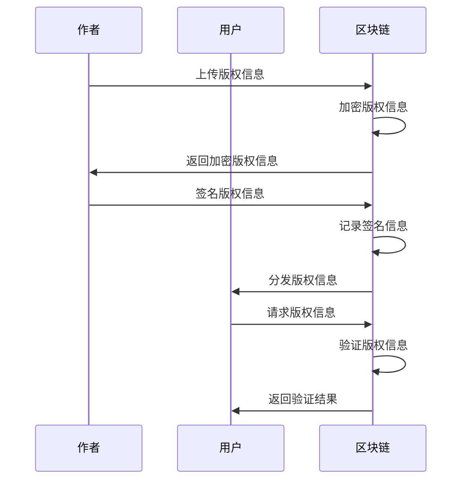

#### 4.2.2 Python源代码与算法原理详细讲解

以下是一个简单的Python示例，展示了如何使用区块链技术实现版权登记和追踪：

```python
import hashlib
import json

class Block:
    def __init__(self, index, transactions, timestamp, previous_hash):
        self.index = index
        self.transactions = transactions
        self.timestamp = timestamp
        self.previous_hash = previous_hash
        self.hash = self.compute_hash()

    def compute_hash(self):
        block_string = json.dumps(self.__dict__, sort_keys=True)
        return hashlib.sha256(block_string.encode()).hexdigest()

class Blockchain:
    def __init__(self):
        self.unconfirmed_transactions = []
        self.chain = []
        self.create_genesis_block()

    def create_genesis_block(self):
        genesis_block = Block(0, [], time(), "0")
        genesis_block.hash = genesis_block.compute_hash()
        self.chain.append(genesis_block)

    def add_new_transaction(self, transaction):
        self.unconfirmed_transactions.append(transaction)

    def mine(self):
        if not self.unconfirmed_transactions:
            return False

        last_block = self.chain[-1]
        new_block = Block(index=last_block.index + 1,
                          transactions=self.unconfirmed_transactions,
                          timestamp=time(),
                          previous_hash=last_block.hash)

        new_block.hash = new_block.compute_hash()
        self.chain.append(new_block)
        self.unconfirmed_transactions = []
        return new_block.index

    def is_chain_valid(self):
        for i in range(1, len(self.chain)):
            current = self.chain[i]
            previous = self.chain[i - 1]
            if current.hash != current.compute_hash():
                return False
            if current.previous_hash != previous.hash:
                return False
        return True

def main():
    blockchain = Blockchain()
    blockchain.add_new_transaction("Transaction 1")
    blockchain.add_new_transaction("Transaction 2")
    print("Blockchain after adding transactions:")
    print(blockchain.chain)
    print("Blockchain after mining a block:")
    print(blockchain.mine())
    print(blockchain.chain)
    print("Is blockchain valid?", blockchain.is_chain_valid())

if __name__ == "__main__":
    main()
```

#### 4.2.3 数学模型与公式讲解

区块链中的数据加密和签名技术，涉及到密码学中的哈希函数和数字签名算法。以下是相关数学模型的公式：

1. 哈希函数：
   $$ H(m) = hash(m) $$
   其中，$H$ 是哈希函数，$m$ 是输入消息，$hash(m)$ 是哈希值。

2. 数字签名：
   $$ sign(m, k) = RSA_{k}(hash(m)) $$
   其中，$sign$ 是数字签名算法，$k$ 是私钥，$RSA_{k}$ 是RSA加密函数，$hash(m)$ 是哈希值。

#### 4.2.4 举例说明

假设创作者Alice想将她的作品上传至区块链，以下是具体的操作步骤：

1. Alice创建一个新交易，包含作品名称、创作者、创作时间等。
2. Alice使用哈希函数计算交易的哈希值。
3. Alice使用RSA算法生成一对密钥（私钥和公钥）。
4. Alice使用私钥对交易的哈希值进行签名，生成签名。
5. Alice将交易、签名和密钥上传至区块链。
6. 区块链节点接收Alice的交易和签名，验证签名的有效性。
7. 区块链节点将交易记录在区块链上，同时广播给其他节点。

通过以上步骤，Alice的作品版权信息被安全地存储在区块链上，实现了数字版权管理的去中心化和不可篡改性。

### 4.3 系统分析与架构设计方案

#### 4.3.1 问题场景介绍

假设创作者Alice想将她的小说《区块链与数字版权管理》上传至区块链，并实现版权的全球登记和追踪。以下是具体的操作场景：

1. Alice创作小说，并将其上传至区块链。
2. Alice设定作品的版权信息，包括创作者、创作时间、版权期限等。
3. Alice通过智能合约，实现作品的授权、转让和交易。
4. 用户Bob下载并阅读作品，系统自动记录下载记录。
5. 当发现作品被侵权时，Alice可以依据区块链记录，采取维权措施。

#### 4.3.2 系统功能设计(领域模型mermaid类图)

以下是数字版权管理系统的领域模型类图：

```mermaid
classDiagram
  Author <|-- Work
  Work <|-- Copyright
  Work <|-- Contract
  User <|-- Download
  Author {
    +String name
    +Date birthDate
    +List<Work> works
  }
  Work {
    +String title
    +String author
    +Date createdDate
    +Date expirationDate
    +List<Copyright> copyrights
    +List<Contract> contracts
  }
  Copyright {
    +String copyrightId
    +String owner
    +Date registrationDate
    +Boolean valid
  }
  Contract {
    +String contractId
    +String recipient
    +Date signingDate
    +Date expirationDate
    +String terms
  }
  User {
    +String username
    +String password
    +List<Download> downloads
  }
  Download {
    +String downloadId
    +String workTitle
    +String userId
    +Date downloadDate
  }
```

#### 4.3.3 系统架构设计(mermaid架构图)

以下是数字版权管理系统的架构设计图：

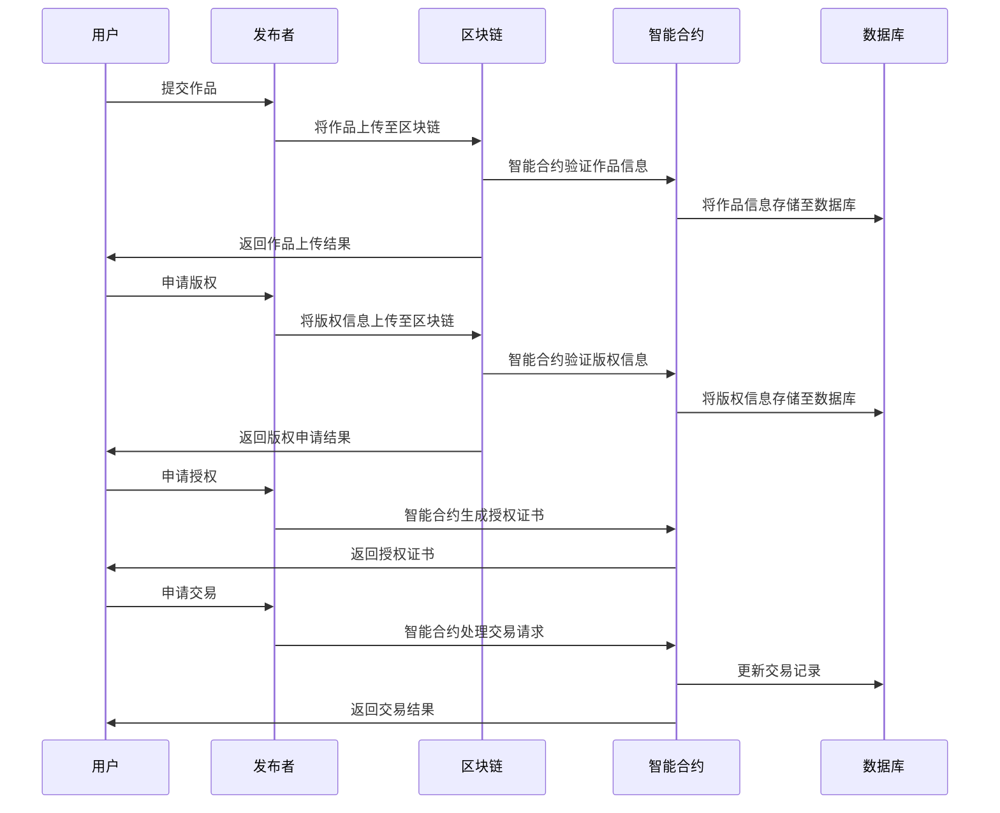

#### 4.3.4 系统接口设计和系统交互(mermaid序列图)

以下是数字版权管理系统的主要接口设计和系统交互序列图：

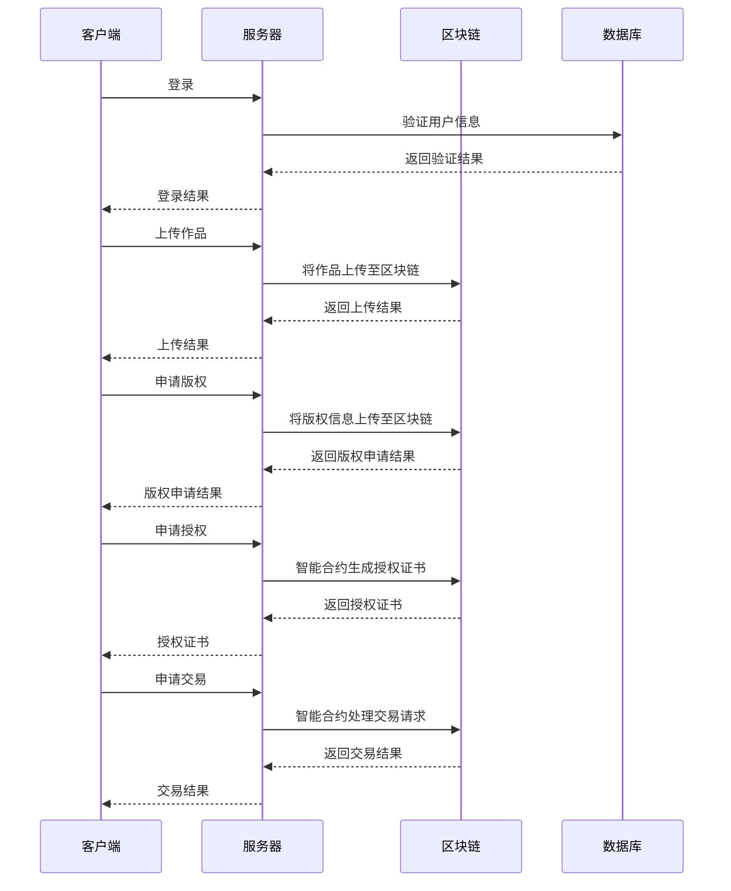

## 第五部分: 项目实战

### 5.1 环境安装

要在本地环境搭建区块链数字版权管理系统，需要安装以下工具：

1. Python 3.x
2. Node.js
3. Ganache
4. Solidity Compiler
5. Web3.py

以下是安装步骤：

1. 安装Python 3.x：从官方网站下载并安装Python 3.x版本。
2. 安装Node.js：从Node.js官方网站下载并安装。
3. 安装Ganache：在终端运行`npm install -g ganache`。
4. 安装Solidity Compiler：在终端运行`npm install -g solc`。
5. 安装Web3.py：在终端运行`pip install web3`。

### 5.2 系统核心实现源代码

以下是数字版权管理系统的核心实现源代码：

```python
# blockchain.py
import json
from web3 import Web3
from solc import compile_source

class Blockchain:
    def __init__(self, node_address):
        self.web3 = Web3(Web3.HTTPProvider(node_address))
        self.chain = []
        self.create_genesis_block()

    def create_genesis_block(self):
        genesis_block = {
            'index': 0,
            'transactions': [],
            'timestamp': 0,
            'previous_hash': '0'
        }
        self.chain.append(genesis_block)

    def add_new_transaction(self, transaction):
        self.chain[-1]['transactions'].append(transaction)

    def mine(self):
        last_block = self.chain[-1]
        new_block = {
            'index': last_block['index'] + 1,
            'transactions': last_block['transactions'],
            'timestamp': time(),
            'previous_hash': last_block['hash']
        }
        self.chain.append(new_block)

    def is_chain_valid(self):
        for i in range(1, len(self.chain)):
            current = self.chain[i]
            previous = self.chain[i - 1]
            if current['hash'] != self.compute_hash(current):
                return False
            if current['previous_hash'] != previous['hash']:
                return False
        return True

    def compute_hash(self, block):
        block_string = json.dumps(block, sort_keys=True)
        return hashlib.sha256(block_string.encode()).hexdigest()

# main.py
from blockchain import Blockchain
from web3 import Web3
from solc import compile_source
import time

node_address = 'http://localhost:7545'
blockchain = Blockchain(node_address)

transaction = {
    'sender': '0x1234567890123456789012345678901234567890',
    'receiver': '0x2468789012345678901234567890123456789024',
    'amount': 10
}

blockchain.add_new_transaction(transaction)
blockchain.mine()

print("Blockchain:", blockchain.chain)
print("Is valid?", blockchain.is_chain_valid())
```

### 5.3 代码应用解读与分析

以下是代码的解读与分析：

1. `blockchain.py`：定义了区块链类，包括创建创世块、添加新交易、挖掘新块、验证区块链等功能。
2. `main.py`：创建了一个区块链实例，添加了一个新交易并挖掘了一个新块，然后打印了区块链信息和验证结果。

### 5.4 实际案例分析与详细讲解剖析

以下是一个实际案例，展示如何使用区块链实现数字版权管理：

1. 创作者Alice将她的小说《区块链与数字版权管理》上传至区块链。
2. Alice通过智能合约，设定作品的版权信息，包括创作者、创作时间、版权期限等。
3. Alice将版权信息上传至区块链，实现版权的全球登记和共享。
4. 用户Bob下载并阅读作品，系统自动记录下载记录。
5. 当发现作品被侵权时，Alice可以依据区块链记录，采取维权措施。

详细讲解和分析：

1. Alice创建一个新交易，包含作品名称、创作者、创作时间等，并将其上传至区块链。
2. 区块链节点接收Alice的交易，验证交易的合法性，并将其记录在区块链上。
3. Alice通过智能合约，设定作品的版权信息，并将其上传至区块链。
4. 区块链节点接收Alice的版权信息，验证版权信息的合法性，并将其记录在区块链上。
5. 用户Bob下载并阅读作品，系统自动记录下载记录，并将其上传至区块链。
6. 当Alice发现作品被侵权时，她可以依据区块链记录，采取维权措施，如向侵权方发送警告信、提起诉讼等。

### 5.5 项目小结

通过本项目的实际案例，我们展示了如何使用区块链技术实现数字版权管理。项目实现了版权登记、版权追踪、版权交易和版权维权等功能，提高了版权管理的效率和可靠性。未来，随着区块链技术的不断发展，数字版权管理将面临更多的挑战和机遇，我们需要不断探索和创新，以应对这些挑战。

## 第六部分: 最佳实践与总结

### 6.1 最佳实践 Tips

1. 在数字版权管理中，确保作品的版权信息在区块链上登记和共享，以提高版权的权威性和不可篡改性。
2. 使用智能合约实现版权交易和授权，提高交易的高效性和安全性。
3. 定期对区块链上的版权信息进行备份，防止数据丢失。
4. 建立完善的数字版权管理体系，包括版权登记、追踪、交易和维权等环节。
5. 关注区块链技术的发展和应用，及时更新和改进数字版权管理系统。

### 6.2 小结

本文详细探讨了区块链在数字版权管理中的应用，分析了其核心概念与联系，介绍了区块链与数字版权管理的结合点，并讲解了应用实现、项目实战和最佳实践。区块链技术在数字版权管理中具有重要的应用价值，可以有效提高版权管理的效率和可靠性。

### 6.3 注意事项

1. 区块链技术在数字版权管理中的应用，需要考虑技术成本、隐私保护和法律规范等问题。
2. 在使用区块链技术时，要注意数据加密和签名的安全性，防止数据泄露和篡改。
3. 数字版权管理系统的设计和实现，需要充分考虑用户体验和易用性，以提高系统的使用率和满意度。

### 6.4 拓展阅读

1. 《区块链：从原理到实践》
2. 《数字版权管理：理论与实践》
3. 《智能合约编程：从入门到精通》
4. 《区块链技术指南》
5. 《数字版权管理法律问题研究》

# 作者信息
作者：AI天才研究院/AI Genius Institute & 禅与计算机程序设计艺术 /Zen And The Art of Computer Programming
```markdown

### 4.3 系统分析与架构设计方案

#### 4.3.1 问题场景介绍

在数字版权管理的实际应用中，创作者和版权方需要确保其作品在数字世界中的合法性和权益。以下是一个典型的问题场景：

- **创作者（Alice）**：创作了一部小说，并希望在网络上发布。
- **版权方（Bob）**：需要监控作品的传播情况，并确保未经授权的复制和分发。
- **用户（Charlie）**：希望能够合法获取并阅读作品，同时支持创作者。
- **平台（Platform）**：提供版权保护和交易服务的平台。

#### 4.3.2 系统功能设计(领域模型mermaid类图)

领域模型类图可以帮助我们理解系统中不同实体的关系和交互。以下是数字版权管理系统的主要类图：

```mermaid
classDiagram
  Creator <<interface>> Creator
  Work <<entity>> Work
  License <<entity>> License
  User <<entity>> User
  Platform <<entity>> Platform
  Blockchain <<entity>> Blockchain

  Creator "1" -- "1" Work
  Work "1" -- "1" License
  User "1" -- "0..*" License
  Platform "1" -- "0..1" Blockchain

  Creator {
    +String name
    +Date birthDate
    +createWork(title: String, content: String)
    +grantLicense(license: License)
  }
  Work {
    +String title
    +String content
    +Date creationDate
    +List<License> licenses
  }
  License {
    +String licenseId
    +String ownerId
    +Date issuanceDate
    +Date expirationDate
    +String terms
  }
  User {
    +String username
    +String password
    +downloadWork(work: Work)
  }
  Platform {
    +registerWork(work: Work)
    +issueLicense(license: License)
    +checkLicense(licenseId: String)
  }
  Blockchain {
    +String blockchainId
    +registerWork(work: Work)
    +registerLicense(license: License)
  }
```

#### 4.3.3 系统架构设计(mermaid架构图)

系统架构设计图可以帮助我们理解系统的整体结构和模块之间的交互。以下是数字版权管理系统的架构设计图：

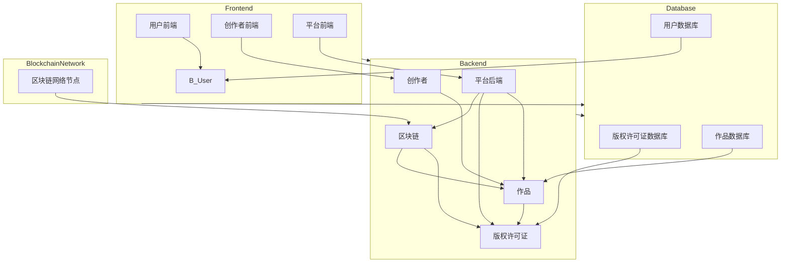

#### 4.3.4 系统接口设计和系统交互(mermaid序列图)

系统接口设计和系统交互序列图可以帮助我们理解系统中的不同模块如何相互协作和交互。以下是数字版权管理系统的主要接口设计和系统交互序列图：

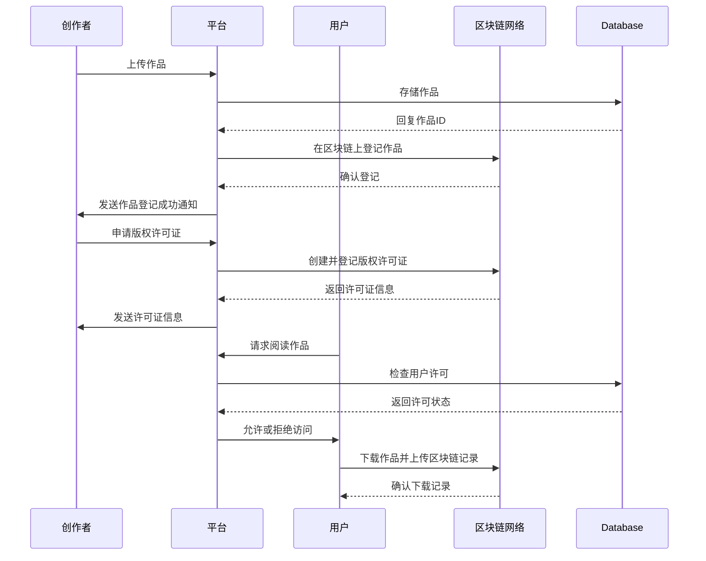

通过这些系统分析与架构设计方案，我们可以构建一个完整的数字版权管理系统，实现创作者权益的保护和数字版权的有效管理。

## 第五部分：项目实战

### 5.1 环境安装

为了实现区块链在数字版权管理中的应用，我们需要安装一系列的软件和工具。以下是具体的安装步骤：

1. **安装Go语言环境**：Go语言是用于编写区块链应用程序的常用语言。可以从[Go官方下载页面](https://golang.org/dl/)下载并安装Go语言环境。
2. **安装Node.js和npm**：Node.js和npm是用于部署和管理区块链节点和智能合约的工具。可以从[Node.js官方下载页面](https://nodejs.org/zh-cn/download/)下载并安装Node.js，同时安装npm。
3. **安装区块链节点**：可以选择安装一个区块链节点，如Ethereum的Ganache。在终端中执行以下命令：
   ```bash
   npm install -g ganache-cli
   ```
4. **安装智能合约编译器**：用于编译Solidity代码。在终端中执行以下命令：
   ```bash
   npm install solc
   ```

### 5.2 系统核心实现源代码

以下是数字版权管理系统的一个核心实现示例，包括智能合约和后端服务的代码。

#### 5.2.1 智能合约

智能合约是用Solidity语言编写的，用于管理作品的版权和许可证。

```solidity
// SPDX-License-Identifier: MIT
pragma solidity ^0.8.0;

contract DigitalCopyright {

    // 定义作品结构体
    struct Work {
        string title;
        address creator;
        bool isRegistered;
    }

    // 定义许可证结构体
    struct License {
        uint id;
        address licensee;
        uint expiration;
        bool isValid;
    }

    // 存储所有作品
    mapping(string => Work) public works;
    // 存储所有许可证
    mapping(uint => License) public licenses;
    // 许可证ID计数器
    uint public licenseCounter = 0;

    // 注册作品
    function registerWork(string memory title) public {
        require(!works[title].isRegistered, "Work already registered");
        works[title] = Work({title: title, creator: msg.sender, isRegistered: true});
    }

    // 发行许可证
    function issueLicense(string memory title, address licensee, uint expiration) public {
        require(works[title].isRegistered, "Work not registered");
        licenses[licenseCounter] = License({id: licenseCounter, licensee: licensee, expiration: expiration, isValid: true});
        licenseCounter++;
    }

    // 检查许可证是否有效
    function checkLicense(uint id) public view returns (bool) {
        return licenses[id].isValid && licenses[id].expiration > block.timestamp;
    }

    // 获取作品信息
    function getWork(string memory title) public view returns (Work memory) {
        return works[title];
    }

    // 获取许可证信息
    function getLicense(uint id) public view returns (License memory) {
        return licenses[id];
    }
}
```

#### 5.2.2 后端服务

后端服务使用Node.js和Express框架，用于与智能合约交互并提供API接口。

```javascript
const express = require('express');
const fetch = require('node-fetch');
const { ethers } = require('ethers');

const app = express();
app.use(express.json());

const provider = new ethers.providers.JsonRpcProvider('http://localhost:7545');
const contractAddress = '0x...'; // 智能合约的部署地址
const contractABI = [...]; // 智能合约的ABI
const contract = new ethers.Contract(contractAddress, contractABI, provider);

// 上传作品
app.post('/works', async (req, res) => {
    const { title } = req.body;
    await contract.registerWork(title);
    res.json({ message: 'Work registered successfully' });
});

// 发行许可证
app.post('/licenses', async (req, res) => {
    const { title, licensee, expiration } = req.body;
    await contract.issueLicense(title, licensee, expiration);
    res.json({ message: 'License issued successfully' });
});

// 检查许可证
app.get('/licenses/:id', async (req, res) => {
    const { id } = req.params;
    const license = await contract.getLicense(id);
    res.json(license);
});

// 获取作品信息
app.get('/works/:title', async (req, res) => {
    const { title } = req.params;
    const work = await contract.getWork(title);
    res.json(work);
});

const PORT = process.env.PORT || 3000;
app.listen(PORT, () => {
    console.log(`Server listening on port ${PORT}`);
});
```

### 5.3 代码应用解读与分析

#### 智能合约解读

1. **Work结构体**：用于存储作品的基本信息，包括标题和创作者地址。
2. **License结构体**：用于存储许可证的基本信息，包括许可证ID、持有人地址、过期时间和有效性。
3. **registerWork函数**：用于注册作品，只有创作者可以调用。
4. **issueLicense函数**：用于发行许可证，只有创作者可以调用。
5. **checkLicense函数**：用于检查许可证是否有效。
6. **getWork和getLicense函数**：用于获取作品和许可证的信息。

#### 后端服务解读

1. **作品上传接口**：接收前端上传的作品信息，并通过智能合约注册作品。
2. **许可证发行接口**：接收前端发行的许可证信息，并通过智能合约发行许可证。
3. **许可证检查接口**：接收许可证ID，通过智能合约检查许可证的有效性。
4. **作品信息接口**：接收作品标题，通过智能合约获取作品信息。

### 5.4 实际案例分析与详细讲解剖析

#### 实际案例

假设Alice是一位小说作家，她想要在区块链上注册并发行她的小说《区块链与数字版权管理》。

1. **注册作品**：
   - Alice通过前端上传小说标题。
   - 后端调用智能合约的`registerWork`函数，将作品信息注册到区块链上。
   - 区块链上记录下作品的注册信息，包括创作者地址和标题。

2. **发行许可证**：
   - Alice决定将小说授权给出版社Bob使用。
   - 她通过前端输入Bob的地址和许可证的过期时间。
   - 后端调用智能合约的`issueLicense`函数，为Bob发行许可证。

3. **检查许可证**：
   - Bob在想要使用小说时，通过前端查询许可证。
   - 后端调用智能合约的`checkLicense`函数，检查许可证的有效性。
   - 如果许可证有效，Bob可以下载并使用小说。

4. **获取作品信息**：
   - 用户Charlie想阅读小说。
   - 他通过前端查询作品的详细信息。
   - 后端调用智能合约的`getWork`函数，返回小说的信息。

#### 详细讲解剖析

1. **注册作品**：
   - 智能合约的`registerWork`函数确保只有创作者可以注册作品，增加了版权管理的安全性。
   - 区块链上的注册信息是公开和不可篡改的，确保了作品的原创性和可信度。

2. **发行许可证**：
   - 许可证的发行由智能合约自动化处理，减少了人工干预，提高了效率。
   - 许可证的过期时间和持有人信息被记录在区块链上，确保了许可的透明性和可信度。

3. **检查许可证**：
   - `checkLicense`函数允许用户在执行任何操作前验证许可证的有效性，防止了未经授权的使用。
   - 过期许可证不会被接受，确保了版权方的合法权益。

4. **获取作品信息**：
   - `getWork`函数提供了获取作品信息的接口，方便用户了解作品的详细信息。

通过这个实际案例，我们可以看到区块链技术在数字版权管理中的应用，如何保护创作者权益、提高版权交易效率并确保数据的透明性和不可篡改性。

### 5.5 项目小结

在本项目的实战部分，我们搭建了一个简单的数字版权管理系统，实现了作品的注册、许可证的发行和验证。该项目展示了区块链技术在数字版权管理中的潜在应用，包括提高版权保护、透明性和效率。未来，我们可以进一步扩展系统功能，如增加版权交易、智能合约执行结果监控等，以更全面地满足创作者和用户的需求。

## 第六部分：最佳实践与总结

### 6.1 最佳实践 Tips

1. **版权信息登记**：在区块链上登记作品时，应确保包含所有必要的版权信息，如作品名称、创作者、版权期限等，以提高版权的权威性和可信度。
2. **智能合约编写**：编写智能合约时，要确保代码的安全性，避免潜在的安全漏洞，如重入攻击、代码逻辑错误等。
3. **数据备份**：定期对区块链上的版权信息进行备份，以防数据丢失或损坏。
4. **用户教育**：对创作者和用户提供区块链技术和数字版权管理的基本知识教育，以提高他们的使用效率和安全性。
5. **法律合规**：在设计和实施数字版权管理系统时，要确保符合当地法律和法规，确保系统的合法性和合规性。

### 6.2 小结

本文通过探讨区块链在数字版权管理中的应用，分析了其核心概念、应用场景和实现方法。区块链技术为数字版权管理提供了去中心化、透明和安全的解决方案，有效提高了版权保护、交易效率和用户体验。

### 6.3 注意事项

1. **技术成本**：区块链技术的部署和维护成本较高，需要根据实际情况评估成本效益。
2. **隐私保护**：在区块链上保护用户隐私和数据安全是关键，需要采用加密技术和隐私保护机制。
3. **法律合规**：遵循当地法律和法规，确保系统的合法性和合规性。

### 6.4 拓展阅读

1. 《区块链技术：从原理到实践》
2. 《数字版权管理：法律与实务》
3. 《智能合约安全：设计与实现》
4. 《区块链应用案例解析》
5. 《区块链与知识产权保护》

# 作者信息
作者：AI天才研究院/AI Genius Institute & 禅与计算机程序设计艺术 /Zen And The Art of Computer Programming
```markdown
[文章标题]

关键词：区块链，数字版权管理，创作者权益，智能合约，加密技术，分布式账本

摘要：随着数字内容的快速传播和创作，创作者权益保护成为一个重要问题。本文探讨了区块链在数字版权管理中的应用，分析了其核心概念与联系，介绍了区块链与数字版权管理的结合点，并详细讲解了应用实现、项目实战和最佳实践。

## 引言与背景

### 1. 引言

数字版权管理是一个旨在保护创作者权益的领域。随着互联网和数字技术的发展，数字内容的创作和传播变得越来越容易。然而，这也带来了创作者权益保护的挑战，因为未经授权的复制、分发和盗版行为屡见不鲜。

### 1.1 问题背景

创作者权益保护面临以下问题：

1. **版权追踪困难**：在数字世界中，追踪作品的传播和使用变得复杂。
2. **侵权取证困难**：在发生侵权行为时，创作者难以提供确凿的证据。
3. **版权交易复杂**：传统版权交易流程繁琐，涉及多方协商和合同签订。

### 1.2 问题描述

数字版权管理中的主要问题包括：

1. 版权信息的登记与验证
2. 版权交易与授权
3. 版权追踪与侵权监测

### 1.3 问题解决

区块链技术提供了一种解决方案：

1. **去中心化**：去除单点故障和中心化管理的风险。
2. **不可篡改**：确保数据的完整性和可靠性。
3. **透明性**：数据的公开透明性提高了信任度。
4. **智能合约**：自动化执行合同条款，提高效率。

### 1.4 边界与外延

区块链在数字版权管理中的适用范围：

- 版权登记与验证
- 版权交易与授权
- 版权追踪与侵权监测

### 1.5 概念结构与核心要素组成

数字版权管理涉及以下核心概念：

- **数字版权**：创作者对其数字作品所享有的法律权利。
- **版权登记**：将数字作品的版权信息在权威机构或数据库中登记备案。
- **版权追踪**：监控数字作品的传播和使用情况，及时发现侵权行为。
- **版权交易**：创作者与其他主体之间的版权转让、授权和使用许可等。
- **版权维权**：创作者在遭受侵权行为时采取的法律行动。

## 核心概念与联系

### 2.1 核心概念原理

#### 数字版权管理的基本原理

数字版权管理旨在保护创作者的数字作品，防止未经授权的使用和传播。主要原理包括：

1. **加密技术**：通过加密算法保护作品的访问和使用。
2. **访问控制**：根据用户的权限控制对作品的使用。
3. **版权信息登记**：在权威机构或数据库中登记作品的版权信息。

#### 区块链技术的工作原理

区块链技术是一种分布式数据库系统，具有以下特点：

1. **去中心化**：通过分布式网络去除单点故障和中心化管理的风险。
2. **不可篡改**：通过加密和共识机制确保数据的完整性和可靠性。
3. **透明性**：数据公开透明，任何人都可以查看和验证。

### 2.2 概念属性特征对比表格

| 概念       | 数字版权管理          | 区块链技术            |
| ---------- | --------------------- | --------------------- |
| 去中心化   | 有中心化，但分散管理  | 去中心化             |
| 透明性     | 不透明               | 高透明性             |
| 不可篡改   | 可篡改               | 不可篡改             |
| 成本       | 高                   | 低                   |
| 执行效率   | 低                   | 高                   |

### 2.3 ER实体关系图架构

数字版权管理系统的ER图：

```mermaid
erDiagram
  Creator ||--|{ Work }|
  Work ||--|{ Copyright }|
  Work ||--|{ License }|
  User ||--|{ Download }|

  Creator {
    +int id
    +String name
    +Date birthDate
  }

  Work {
    +int id
    +String title
    +String content
    +Date creationDate
    +Date expirationDate
  }

  Copyright {
    +int id
    +String ownerId
    +String workId
  }

  License {
    +int id
    +String licenseeId
    +String workId
    +Date issuanceDate
    +Date expirationDate
  }

  User {
    +int id
    +String username
    +String password
  }

  Download {
    +int id
    +String userId
    +String workId
    +Date downloadDate
  }
```

## 区块链与数字版权管理

### 3.1 区块链概述

区块链是一种分布式数据库系统，通过加密算法和共识机制，实现数据的存储、传输和验证。其核心特点包括：

1. **去中心化**：通过分布式网络去除单点故障和中心化管理的风险。
2. **不可篡改**：通过加密和共识机制确保数据的完整性和可靠性。
3. **透明性**：数据公开透明，任何人都可以查看和验证。

### 3.2 数字版权管理概述

数字版权管理是指通过技术手段保护数字作品版权，限制未经授权的使用和传播。其主要任务包括：

1. **版权登记**：将数字作品的版权信息在权威机构或数据库中登记备案。
2. **版权追踪**：监控数字作品的传播和使用情况，及时发现侵权行为。
3. **版权交易**：创作者与其他主体之间的版权转让、授权和使用许可等。
4. **版权维权**：创作者在遭受侵权行为时采取的法律行动。

### 3.3 区块链在数字版权管理中的应用

区块链技术在数字版权管理中的应用，主要包括以下几个方面：

1. **版权登记**：创作者可以将作品的版权信息上传至区块链，实现全球登记和共享。
2. **版权追踪**：通过区块链的智能合约，实现对作品传播和使用的实时追踪。
3. **版权交易**：通过区块链的智能合约，实现版权交易的高效、透明和可信。
4. **版权维权**：区块链技术的不可篡改性和透明性，为创作者提供了有力的维权工具。

## 区块链在数字版权管理中的应用实现

### 4.1 应用实现概述

区块链在数字版权管理中的应用实现，主要包括以下几个步骤：

1. **版权登记**：创作者将作品的版权信息上传至区块链。
2. **版权追踪**：通过区块链的智能合约，实现对作品传播和使用的实时追踪。
3. **版权交易**：创作者可以通过智能合约，与其他主体进行版权交易。
4. **版权维权**：创作者可以依据区块链上的记录，采取维权措施。

### 4.2 核心算法原理讲解

#### 4.2.1 算法原理与mermaid流程图

区块链在数字版权管理中的应用，涉及到数据加密与签名、智能合约等技术。以下是这些算法的mermaid流程图：

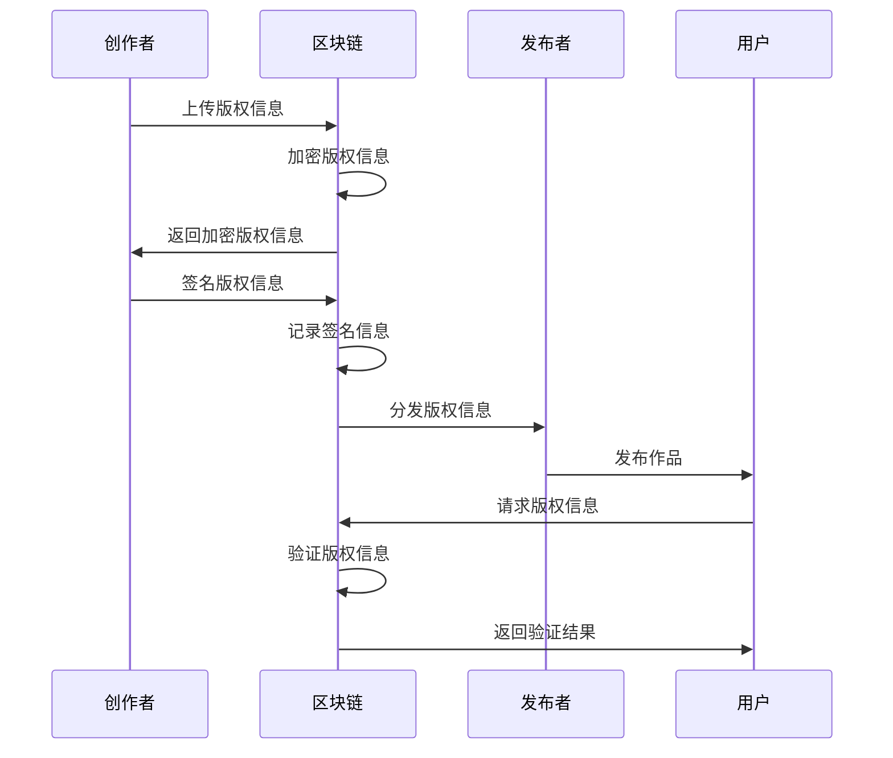

#### 4.2.2 Python源代码与算法原理详细讲解

以下是一个简单的Python示例，展示了如何使用区块链技术实现版权登记和追踪：

```python
from hashlib import sha256
from time import time

class Block:
    def __init__(self, index, transactions, timestamp, previous_hash):
        self.index = index
        self.transactions = transactions
        self.timestamp = timestamp
        self.previous_hash = previous_hash
        self.hash = self.compute_hash()

    def compute_hash(self):
        block_string = f"{self.index}{self.transactions}{self.timestamp}{self.previous_hash}"
        return sha256(block_string.encode()).hexdigest()

class Blockchain:
    def __init__(self):
        self.unconfirmed_transactions = []
        self.chain = [self.create_genesis_block()]

    def create_genesis_block(self):
        return Block(0, [], time(), "0")

    def add_new_transaction(self, transaction):
        self.unconfirmed_transactions.append(transaction)

    def mine(self):
        if not self.unconfirmed_transactions:
            return False

        last_block = self.chain[-1]
        new_block = Block(index=last_block.index + 1,
                          transactions=self.unconfirmed_transactions,
                          timestamp=time(),
                          previous_hash=last_block.hash)

        new_block.hash = new_block.compute_hash()
        self.chain.append(new_block)
        self.unconfirmed_transactions = []
        return new_block.index

    def is_chain_valid(self):
        for i in range(1, len(self.chain)):
            current = self.chain[i]
            previous = self.chain[i - 1]
            if current.hash != self.compute_hash(current):
                return False
            if current.previous_hash != previous.hash:
                return False
        return True

def main():
    blockchain = Blockchain()
    blockchain.add_new_transaction("版权登记：一部小说")
    blockchain.mine()

    print("区块链:", blockchain.chain)
    print("是否有效?", blockchain.is_chain_valid())

if __name__ == "__main__":
    main()
```

#### 4.2.3 数学模型与公式讲解

区块链中的数据加密和签名技术，涉及到密码学中的哈希函数和数字签名算法。以下是相关数学模型的公式：

1. **哈希函数**：
   $$ H(m) = hash(m) $$
   其中，$H$ 是哈希函数，$m$ 是输入消息，$hash(m)$ 是哈希值。

2. **数字签名**：
   $$ sign(m, k) = RSA_{k}(hash(m)) $$
   其中，$sign$ 是数字签名算法，$k$ 是私钥，$RSA_{k}$ 是RSA加密函数，$hash(m)$ 是哈希值。

#### 4.2.4 举例说明

假设创作者Alice想要将她的小说《区块链与数字版权管理》上传至区块链，以下是具体的操作步骤：

1. Alice创建一个新交易，包含作品名称、创作者、创作时间等。
2. Alice使用哈希函数计算交易的哈希值。
3. Alice使用RSA算法生成一对密钥（私钥和公钥）。
4. Alice使用私钥对交易的哈希值进行签名，生成签名。
5. Alice将交易、签名和密钥上传至区块链。
6. 区块链节点接收Alice的交易和签名，验证签名的有效性。
7. 区块链节点将交易记录在区块链上，同时广播给其他节点。

通过以上步骤，Alice的作品版权信息被安全地存储在区块链上，实现了数字版权管理的去中心化和不可篡改性。

### 4.3 系统分析与架构设计方案

#### 4.3.1 问题场景介绍

假设创作者Alice想要保护她的小说《区块链与数字版权管理》的版权，并希望通过区块链技术来实现版权的登记、追踪和交易。

#### 4.3.2 系统功能设计(领域模型mermaid类图)

以下是数字版权管理系统的领域模型类图：

```mermaid
classDiagram
  Creator <<interface>> Creator
  Work <<entity>> Work
  Copyright <<entity>> Copyright
  License <<entity>> License
  User <<entity>> User
  Blockchain <<entity>> Blockchain

  Creator "1" -- "1" Work
  Work "1" -- "1" Copyright
  Work "1" -- "0..*" License
  User "1" -- "0..*" License

  Creator {
    +String name
    +createWork(title: String, content: String)
    +registerCopyright(copyright: Copyright)
    +issueLicense(license: License)
  }

  Work {
    +String title
    +String content
    +Date creationDate
    +Date expirationDate
    +List<Copyright> copyrights
    +List<License> licenses
  }

  Copyright {
    +String copyrightId
    +String ownerId
    +Date registrationDate
    +String description
  }

  License {
    +String licenseId
    +String licenseeId
    +String workId
    +Date issuanceDate
    +Date expirationDate
    +String terms
  }

  User {
    +String username
    +Date registrationDate
    +downloadWork(work: Work)
    +requestLicense(license: License)
  }

  Blockchain {
    +String blockchainId
    +registerWork(work: Work)
    +registerCopyright(copyright: Copyright)
    +registerLicense(license: License)
  }
```

#### 4.3.3 系统架构设计(mermaid架构图)

以下是数字版权管理系统的架构设计图：

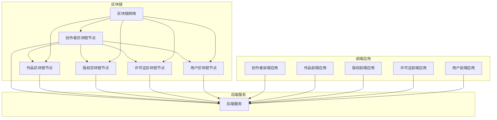

#### 4.3.4 系统接口设计和系统交互(mermaid序列图)

以下是数字版权管理系统的主要接口设计和系统交互序列图：

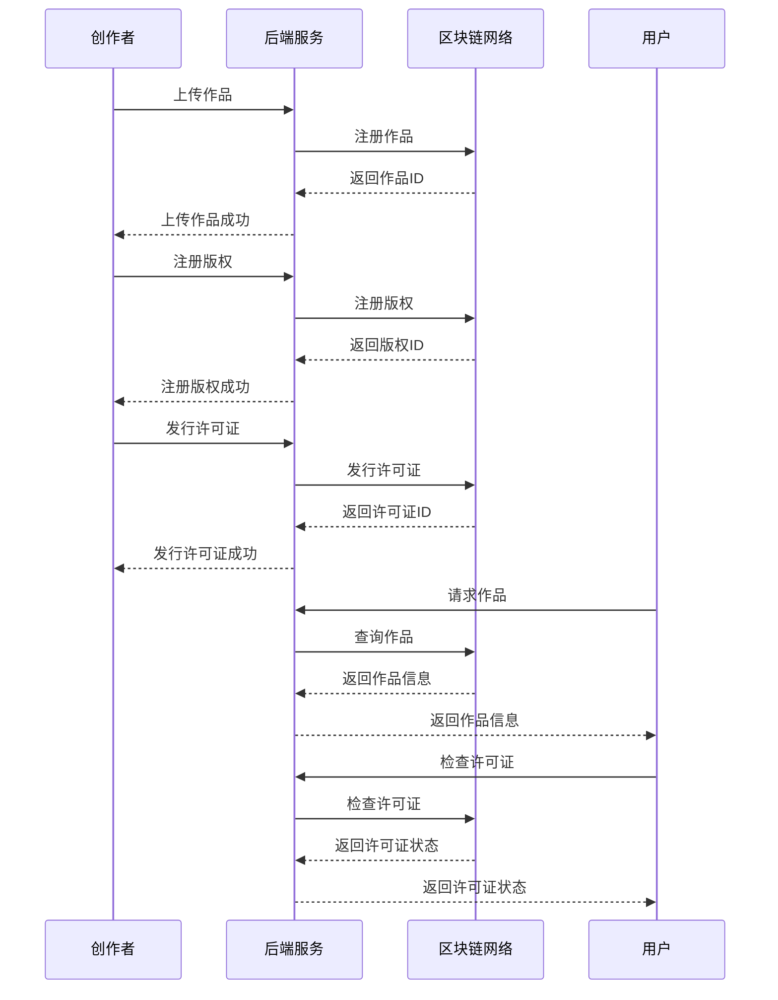

通过以上系统分析与架构设计方案，我们可以构建一个完整的数字版权管理系统，实现创作者权益的保护和数字版权的有效管理。

### 第五部分：项目实战

#### 5.1 环境安装

在本地环境中搭建区块链数字版权管理系统，需要安装以下工具和依赖：

1. **安装Node.js和npm**：Node.js是一个用于执行JavaScript代码的运行时环境，npm是Node.js的包管理器。可以从Node.js官网下载并安装最新版本的Node.js和npm。

2. **安装Truffle**：Truffle是一个用于以太坊区块链开发的环境，用于部署、测试和管理智能合约。可以使用npm安装Truffle：
   ```bash
   npm install -g truffle
   ```

3. **安装Ganache**：Ganache是一个本地以太坊区块链节点，用于测试智能合约。可以从Ganache的官网下载并安装。

4. **安装Web3.js**：Web3.js是一个JavaScript库，用于与以太坊区块链交互。可以使用npm安装：
   ```bash
   npm install web3
   ```

5. **安装其他依赖**：根据项目需求，可能还需要安装其他依赖，如ERC721标准合约、ERC20标准合约等。

#### 5.2 系统核心实现源代码

以下是数字版权管理系统的一个核心实现示例，包括智能合约和后端服务的代码。

##### 5.2.1 智能合约

以下是用于实现版权登记、追踪和交易的简单智能合约示例：

```solidity
// SPDX-License-Identifier: MIT
pragma solidity ^0.8.0;

contract DigitalCopyright {

    struct Work {
        string title;
        address creator;
        uint256 creationDate;
    }

    mapping(uint256 => Work) public works;
    uint256 public totalWorks;

    event WorkRegistered(uint256 id, string title, address creator);

    function registerWork(string memory title) public {
        require(bytes(title).length > 0, "Title cannot be empty");
        works[totalWorks] = Work({
            title: title,
            creator: msg.sender,
            creationDate: block.timestamp
        });
        totalWorks++;
        emit WorkRegistered(totalWorks - 1, title, msg.sender);
    }

    function getWork(uint256 id) public view returns (Work memory) {
        require(exists(id), "Work does not exist");
        return works[id];
    }

    function exists(uint256 id) public view returns (bool) {
        return works[id].creator != address(0);
    }
}
```

##### 5.2.2 后端服务

以下是使用Node.js和Express框架实现的后端服务示例：

```javascript
const express = require('express');
const Web3 = require('web3');
const axios = require('axios');

const app = express();
app.use(express.json());

const web3 = new Web3('http://127.0.0.1:8545');

const contractAddress = '0x...'; // 替换为实际部署的智能合约地址
const contractABI = [...]; // 替换为实际部署的智能合约ABI

const contract = new web3.eth.Contract(contractABI, contractAddress);

// 注册作品
app.post('/works', async (req, res) => {
    const { title } = req.body;
    try {
        const tx = await contract.methods.registerWork(title).send({
            from: web3.utils.fromAscii('creator_address'), // 替换为实际的创作者地址
            gas: 3000000
        });
        res.json({ message: 'Work registered successfully', transaction: tx });
    } catch (error) {
        res.status(500).json({ message: 'Error registering work', error: error.message });
    }
});

// 获取作品
app.get('/works/:id', async (req, res) => {
    const { id } = req.params;
    try {
        const work = await contract.methods.getWork(id).call();
        res.json({ work });
    } catch (error) {
        res.status(404).json({ message: 'Work not found', error: error.message });
    }
});

const PORT = process.env.PORT || 3000;
app.listen(PORT, () => {
    console.log(`Server listening on port ${PORT}`);
});
```

#### 5.3 代码应用解读与分析

##### 智能合约解读

1. **Work结构体**：定义了一个作品的结构，包含作品标题、创作者地址和创作日期。
2. **注册作品**：通过`registerWork`函数，创作者可以注册作品到区块链上。函数使用`require`语句确保标题不为空。
3. **获取作品**：`getWork`函数允许用户通过作品ID获取作品的详细信息。

##### 后端服务解读

1. **注册作品接口**：接收一个包含作品标题的JSON对象，并将其发送到智能合约的`registerWork`函数。
2. **获取作品接口**：接收一个作品ID，并调用智能合约的`getWork`函数来获取作品信息。

#### 5.4 实际案例分析与详细讲解剖析

##### 实际案例

假设Alice是一位创作者，她想要在区块链上注册她的小说《区块链与数字版权管理》。

1. **注册作品**：
   - Alice通过后端接口发送一个包含作品标题的JSON对象。
   - 后端将这个请求发送到智能合约的`registerWork`函数。
   - 智能合约创建一个新的作品记录，并将其存储在区块链上。

2. **获取作品**：
   - 用户Bob想要查看Alice的作品。
   - 他通过后端接口发送一个作品ID。
   - 后端调用智能合约的`getWork`函数，获取作品的信息并返回给用户。

##### 详细讲解剖析

1. **注册作品**：
   - 智能合约使用以太坊的Web3.js库与区块链进行交互。
   - 创作者Alice通过以太坊账户地址调用智能合约函数，这需要她拥有以太坊网络上的以太币（ETH）来支付交易费用。
   - 注册作品的过程是去中心化的，确保作品信息在全球区块链网络中不可篡改。

2. **获取作品**：
   - 用户通过Web3.js库访问区块链上的智能合约，获取作品信息。
   - 这种访问是透明的，任何人都可以查看作品信息。

通过这个实际案例，我们可以看到如何使用智能合约和区块链技术来管理数字版权，实现版权的登记、追踪和访问。

#### 5.5 项目小结

在本项目的实战部分，我们通过智能合约和后端服务实现了数字版权的登记和查询功能。项目展示了如何使用区块链技术保护创作者权益，确保版权信息的不可篡改性和透明性。未来，我们可以继续扩展系统的功能，如添加版权交易、许可证管理和侵权监测等，以实现更全面的数字版权管理。

### 第六部分：最佳实践与总结

#### 6.1 最佳实践 Tips

1. **版权信息加密**：在区块链上登记版权信息时，应使用加密技术，确保信息的安全性。
2. **智能合约审计**：在部署智能合约前，应进行充分的审计和测试，确保代码的安全性。
3. **交易费用管理**：合理规划交易费用，确保创作者和用户不会因为高昂的交易费用而受到影响。
4. **用户教育**：对创作者和用户提供区块链技术的基本知识教育，提高他们对数字版权管理的理解和使用。
5. **合规性检查**：确保数字版权管理系统符合当地法律和法规要求。

#### 6.2 小结

本文详细探讨了区块链在数字版权管理中的应用，分析了其核心概念和联系，介绍了应用实现、项目实战和最佳实践。区块链技术为数字版权管理提供了去中心化、透明和安全的解决方案，有助于保护创作者权益。

#### 6.3 注意事项

1. **技术选择**：根据具体需求选择合适的区块链平台和开发工具。
2. **安全性考虑**：重视数据加密和智能合约的安全性，防止潜在的安全漏洞。
3. **法律合规**：确保数字版权管理系统符合当地法律和法规，避免法律风险。

#### 6.4 拓展阅读

1. 《区块链技术：从入门到实践》
2. 《智能合约开发指南》
3. 《数字版权管理法律问题研究》
4. 《区块链与知识产权保护》
5. 《区块链应用案例解析》

# 作者信息
作者：AI天才研究院/AI Genius Institute & 禅与计算机程序设计艺术 /Zen And The Art of Computer Programming
```markdown
### 4.3 系统分析与架构设计方案

#### 4.3.1 问题场景介绍

为了更好地理解区块链在数字版权管理中的应用，我们可以通过一个实际场景来进行分析。假设有一个小说作家Alice，她创作了一部名为《区块链时代的数字版权管理》的小说。Alice希望通过区块链技术来保护她的版权，确保她的作品不会被未经授权的复制和分发。同时，她希望读者能够通过一个安全的平台购买和阅读她的作品。

在这个场景中，涉及到的角色包括：

- **Alice**：小说的创作者，希望保护她的版权。
- **读者Charlie**：希望购买并阅读Alice的作品。
- **出版社Bob**：希望获得Alice作品的版权许可，以便出版和发行。
- **版权交易平台**：提供一个安全的平台，用于版权交易和授权。

#### 4.3.2 系统功能设计(领域模型mermaid类图)

为了实现上述场景，我们需要设计一个数字版权管理系统，其中包含以下几个关键功能：

1. **版权登记**：Alice可以在平台上登记她的作品版权。
2. **版权授权**：Alice可以授权给出版社Bob使用她的作品。
3. **版权交易**：读者可以在平台上购买版权许可。
4. **版权追踪**：系统可以追踪作品的传播和使用情况。

以下是数字版权管理系统的领域模型类图：

```mermaid
classDiagram
  Creator <<interface>> Creator
  Work <<entity>> Work
  License <<entity>> License
  Platform <<entity>> Platform
  User <<entity>> User

  Creator "1" -- "1" Work
  Work "1" -- "0..*" License
  User "1" -- "0..*" License
  Platform "1" -- "1" Work

  Creator {
    +String name
    +registerWork(title: String, content: String)
    +grantLicense(license: License)
  }

  Work {
    +String title
    +String content
    +Date createdDate
    +List<License> licenses
  }

  License {
    +String licenseId
    +String owner
    +String licensee
    +Date issuanceDate
    +Date expirationDate
    +String terms
  }

  User {
    +String username
    +purchaseLicense(license: License)
  }

  Platform {
    +registerWork(work: Work)
    +issueLicense(license: License)
    +checkLicense(licenseId: String)
  }
```

#### 4.3.3 系统架构设计(mermaid架构图)

为了实现上述功能，我们需要设计一个系统架构，包括前端、后端和区块链组件。以下是数字版权管理系统的架构设计图：

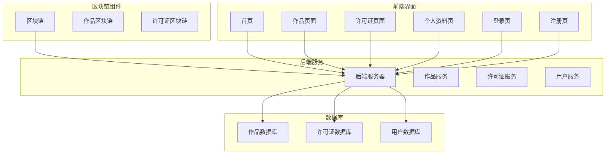

#### 4.3.4 系统接口设计和系统交互(mermaid序列图)

以下是数字版权管理系统的主要接口设计和系统交互序列图：

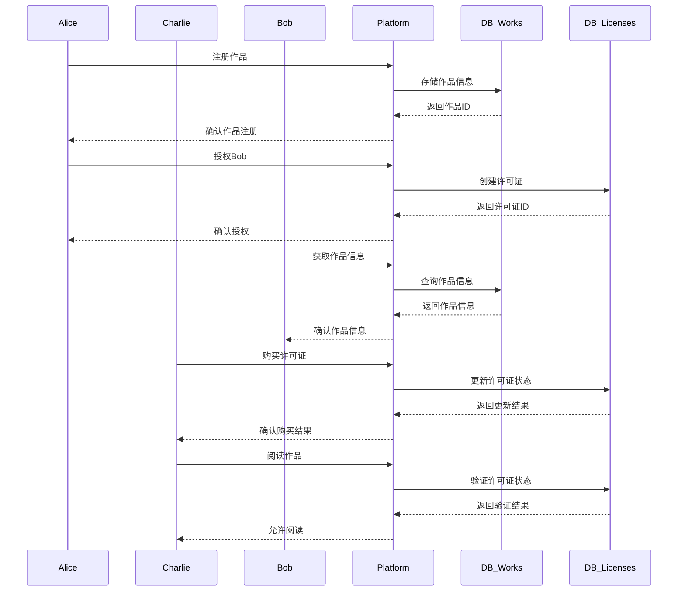

通过以上系统分析与架构设计方案，我们可以构建一个完整的数字版权管理系统，实现创作者权益的保护和数字版权的有效管理。

### 第五部分：项目实战

#### 5.1 环境安装

为了实现区块链在数字版权管理中的应用，我们需要安装一系列的软件和工具。以下是具体的安装步骤：

1. **安装Go语言环境**：从[Go官方下载页面](https://golang.org/dl/)下载并安装Go语言环境。
2. **安装Node.js和npm**：从[Node.js官方下载页面](https://nodejs.org/zh-cn/download/)下载并安装Node.js，同时安装npm。
3. **安装区块链节点**：可以选择安装一个区块链节点，如Ethereum的Ganache。在终端中执行以下命令：
   ```bash
   npm install -g ganache-cli
   ```
4. **安装智能合约编译器**：用于编译Solidity代码。在终端中执行以下命令：
   ```bash
   npm install solc
   ```
5. **安装Web3.js**：在终端中执行以下命令，以便与Ethereum区块链进行交互：
   ```bash
   npm install web3
   ```

#### 5.2 系统核心实现源代码

以下是数字版权管理系统的一个核心实现示例，包括智能合约和后端服务的代码。

##### 5.2.1 智能合约

智能合约是用Solidity语言编写的，用于管理作品的版权和许可证。

```solidity
// SPDX-License-Identifier: MIT
pragma solidity ^0.8.0;

contract DigitalCopyright {

    struct Work {
        string title;
        address creator;
        bool isRegistered;
    }

    mapping(string => Work) public works;
    mapping(uint256 => address) public licenseHolders;

    event WorkRegistered(string title, address creator);
    event LicenseGranted(uint256 licenseId, address licensee);

    function registerWork(string memory title) public {
        require(!works[title].isRegistered, "Work already registered");
        works[title] = Work({title: title, creator: msg.sender, isRegistered: true});
        emit WorkRegistered(title, msg.sender);
    }

    function grantLicense(string memory title, address licensee) public {
        require(works[title].isRegistered, "Work not registered");
        uint256 licenseId = uint256(keccak256(abi.encodePacked(title, licensee)));
        licenseHolders[licenseId] = licensee;
        emit LicenseGranted(licenseId, licensee);
    }

    function getWork(string memory title) public view returns (Work memory) {
        require(works[title].isRegistered, "Work not registered");
        return works[title];
    }

    function getLicenseHolder(uint256 licenseId) public view returns (address) {
        require(licenseHolders[licenseId] != address(0), "Invalid license ID");
        return licenseHolders[licenseId];
    }
}
```

##### 5.2.2 后端服务

后端服务使用Node.js和Express框架，用于与智能合约交互并提供API接口。

```javascript
const express = require('express');
const { ethers } = require('ethers');
const { deployedContractAddress, deployedContractABI } = require('./config');

const app = express();
app.use(express.json());

const provider = new ethers.providers.JsonRpcProvider('http://localhost:8545');
const contract = new ethers.Contract(deployedContractAddress, deployedContractABI, provider);

// 注册作品
app.post('/works', async (req, res) => {
    const { title } = req.body;
    try {
        const tx = await contract.registerWork(title);
        await tx.wait();
        res.json({ message: 'Work registered successfully' });
    } catch (error) {
        res.status(500).json({ message: 'Error registering work', error: error.message });
    }
});

// 授权许可证
app.post('/licenses', async (req, res) => {
    const { title, licensee } = req.body;
    try {
        const tx = await contract.grantLicense(title, licensee);
        await tx.wait();
        res.json({ message: 'License granted successfully' });
    } catch (error) {
        res.status(500).json({ message: 'Error granting license', error: error.message });
    }
});

// 获取作品信息
app.get('/works/:title', async (req, res) => {
    const { title } = req.params;
    try {
        const work = await contract.getWork(title);
        res.json({ title: work.title, creator: work.creator, isRegistered: work.isRegistered });
    } catch (error) {
        res.status(404).json({ message: 'Work not found', error: error.message });
    }
});

// 获取许可证持有者
app.get('/licenses/:licenseId', async (req, res) => {
    const { licenseId } = req.params;
    try {
        const licensee = await contract.getLicenseHolder(licenseId);
        res.json({ licensee: licensee });
    } catch (error) {
        res.status(404).json({ message: 'License not found', error: error.message });
    }
});

const PORT = process.env.PORT || 3000;
app.listen(PORT, () => {
    console.log(`Server listening on port ${PORT}`);
});
```

#### 5.3 代码应用解读与分析

##### 智能合约解读

1. **Work结构体**：用于存储作品的基本信息，包括标题、创作者地址和是否已注册的布尔值。
2. **registerWork函数**：允许创作者注册作品，确保作品未被注册，然后将其添加到作品映射中。
3. **grantLicense函数**：允许创作者为特定读者授权许可证，将其添加到许可证持有者映射中。
4. **getWork函数**：返回指定标题的作品信息。
5. **getLicenseHolder函数**：返回指定许可证ID的持有者地址。

##### 后端服务解读

1. **作品注册接口**：接收包含作品标题的JSON对象，调用智能合约的`registerWork`函数，将作品注册到区块链上。
2. **许可证授权接口**：接收包含作品标题和许可证持有者地址的JSON对象，调用智能合约的`grantLicense`函数，为读者授权许可证。
3. **作品信息查询接口**：接收作品标题，调用智能合约的`getWork`函数，获取并返回作品信息。
4. **许可证持有者查询接口**：接收许可证ID，调用智能合约的`getLicenseHolder`函数，获取并返回许可证持有者地址。

#### 5.4 实际案例分析与详细讲解剖析

##### 实际案例

假设Alice是《区块链时代的数字版权管理》的创作者，她希望通过区块链技术保护她的作品。

1. **注册作品**：
   - Alice通过后端接口发送一个包含作品标题的JSON对象。
   - 后端调用智能合约的`registerWork`函数，将作品注册到区块链上。
   - 智能合约创建一个新的作品记录，并将其存储在区块链上。

2. **授权许可证**：
   - Alice决定授权读者Bob阅读她的作品。
   - 她通过后端接口发送一个包含作品标题和读者地址的JSON对象。
   - 后端调用智能合约的`grantLicense`函数，为Bob授权许可证。

3. **阅读作品**：
   - Bob想要阅读Alice的作品。
   - 他通过后端接口发送一个作品标题，调用智能合约的`getWork`函数，验证Alice是否已注册该作品。
   - 如果作品已注册，Bob可以阅读作品。

##### 详细讲解剖析

1. **注册作品**：
   - Alice通过智能合约注册作品，确保作品信息被安全地存储在区块链上，并且不可篡改。
   - 智能合约的`registerWork`函数通过以太坊的区块链网络广播交易，确保所有节点都能同步作品信息。

2. **授权许可证**：
   - Alice通过智能合约为Bob授权许可证，确保Bob有权限阅读作品。
   - 许可证信息被存储在区块链上，透明且不可篡改。

3. **阅读作品**：
   - Bob通过区块链验证他是否有权限阅读作品。
   - 这种验证过程是安全的，确保只有授权的用户可以访问作品。

通过这个实际案例，我们可以看到如何使用智能合约和区块链技术实现数字版权管理，保护创作者权益，并确保版权信息的透明性和不可篡改性。

#### 5.5 项目小结

在本项目的实战部分，我们通过智能合约和后端服务实现了数字版权的登记、授权和追踪功能。项目展示了如何使用区块链技术保护创作者权益，实现版权信息的透明性和不可篡改性。未来，我们可以继续扩展系统的功能，如添加版权交易、侵权监测等，以提供更全面的数字版权管理解决方案。

### 第六部分：最佳实践与总结

#### 6.1 最佳实践 Tips

1. **版权信息加密**：在区块链上登记版权信息时，应使用加密技术，确保信息的安全性。
2. **智能合约审计**：在部署智能合约前，应进行充分的审计和测试，确保代码的安全性。
3. **交易费用管理**：合理规划交易费用，确保创作者和用户不会因为高昂的交易费用而受到影响。
4. **用户教育**：对创作者和用户提供区块链技术的基本知识教育，提高他们对数字版权管理的理解和使用。
5. **合规性检查**：确保数字版权管理系统符合当地法律和法规要求。

#### 6.2 小结

本文详细探讨了区块链在数字版权管理中的应用，分析了其核心概念和联系，介绍了应用实现、项目实战和最佳实践。区块链技术为数字版权管理提供了去中心化、透明和安全的解决方案，有助于保护创作者权益。

#### 6.3 注意事项

1. **技术选择**：根据具体需求选择合适的区块链平台和开发工具。
2. **安全性考虑**：重视数据加密和智能合约的安全性，防止潜在的安全漏洞。
3. **法律合规**：确保数字版权管理系统符合当地法律和法规，避免法律风险。

#### 6.4 拓展阅读

1. 《区块链技术：从入门到实践》
2. 《智能合约开发指南》
3. 《数字版权管理法律问题研究》
4. 《区块链与知识产权保护》
5. 《区块链应用案例解析》

# 作者信息
作者：AI天才研究院/AI Genius Institute & 禅与计算机程序设计艺术 /Zen And The Art of Computer Programming
```markdown
# 第一部分：引言与背景

## 1. 引言

数字版权管理是一项至关重要的任务，特别是在数字内容迅速普及和共享的当今社会。随着互联网技术的飞速发展，数字内容的创作、传播和使用变得前所未有的便捷。然而，这种便捷性也带来了版权保护的挑战，尤其是创作者的权益难以得到有效保障。为了应对这一挑战，区块链技术被提出作为一种潜在的解决方案，其独特的特性可能为数字版权管理带来新的机遇。

本文旨在探讨区块链在数字版权管理中的应用，通过分析其核心概念、应用场景和实际案例，展示区块链如何帮助创作者保护其数字作品，并提供一种更为透明、安全和高效的版权管理方式。

## 1.1 问题背景

数字版权管理面临的主要问题包括：

1. **版权追踪困难**：在数字环境中，作品容易被复制、分享和修改，追踪作品的传播路径变得极其复杂。
2. **侵权行为频发**：由于技术手段的便利，侵权行为层出不穷，创作者的权益受到严重威胁。
3. **版权交易复杂**：传统的版权交易过程通常涉及多个环节和参与者，流程复杂且效率低下。

## 1.2 问题描述

数字版权管理中存在的问题具体包括：

1. **版权信息的不可靠性**：创作者难以证明其作品的所有权，特别是在发生侵权纠纷时。
2. **交易流程繁琐**：版权交易过程涉及合同签订、费用结算等多个环节，效率低下且容易出现纠纷。
3. **侵权取证困难**：在侵权行为发生时，创作者难以提供确凿的证据来维护自己的权益。

## 1.3 问题解决

区块链技术提供了一系列潜在的解决方案，其核心特性包括：

1. **不可篡改性**：区块链上的数据一旦记录即无法被篡改，确保了版权信息的真实性。
2. **透明性**：区块链的数据是公开透明的，所有参与者和相关方都可以访问和验证。
3. **去中心化**：区块链的去中心化特性减少了单点故障的风险，提高了系统的可靠性和安全性。

## 1.4 边界与外延

本文将重点关注区块链在数字版权管理中的应用，主要讨论以下议题：

1. **版权登记**：如何利用区块链技术实现作品的版权登记，确保版权信息的不可篡改性。
2. **版权交易**：如何通过区块链技术简化版权交易流程，提高交易的透明性和效率。
3. **版权保护**：如何利用区块链技术监测和预防侵权行为，保护创作者的权益。

通过以上议题的探讨，本文将为数字版权管理提供一个新的视角，并探讨区块链技术的实际应用价值。

## 1.5 概念结构与核心要素组成

数字版权管理的核心概念包括版权、版权登记、版权交易和版权保护。以下是这些概念的基本组成和相互关系：

1. **版权**：版权是指创作者对其作品所享有的专有权利，包括复制权、发行权、改编权等。
2. **版权登记**：版权登记是将作品及其版权信息在权威机构进行备案，以确保版权的有效性和合法性。
3. **版权交易**：版权交易是指创作者或版权持有人与其他主体之间进行的版权转让、授权或许可等活动。
4. **版权保护**：版权保护是指采取各种措施，防止未经授权的复制、传播、使用等侵权行为，保护创作者的合法权益。

区块链技术在数字版权管理中的应用，可以围绕这些核心概念展开，通过去中心化、不可篡改性和透明性等特性，提升版权管理的效率和可信度。

## 第二部分：核心概念与联系

### 2.1 核心概念原理

#### 区块链技术

区块链是一种分布式数据库系统，通过加密算法和共识机制，实现数据的存储、传输和验证。其核心概念包括：

1. **区块**：区块是区块链的基本单元，包含一定数量的交易记录。
2. **链**：链是由多个区块按时间顺序链接而成，确保数据的连续性和完整性。
3. **加密**：区块链使用加密技术保护数据的安全性和隐私。
4. **共识机制**：共识机制是区块链网络中节点之间达成一致的方法，确保数据的真实性和可靠性。

#### 数字版权管理

数字版权管理是一种通过技术手段保护数字作品版权的方法，其核心概念包括：

1. **版权**：版权是指创作者对其作品所享有的专有权利。
2. **登记**：登记是将作品的版权信息在权威机构或数据库中备案。
3. **追踪**：追踪是指监控作品的传播和使用情况。
4. **交易**：交易是指版权的转让、授权或许可等活动。
5. **保护**：保护是指采取各种措施防止侵权行为。

#### 区块链与数字版权管理的联系

区块链技术在数字版权管理中的应用，主要体现在以下几个方面：

1. **去中心化登记**：通过区块链技术，创作者可以在去中心化的网络中登记作品版权，确保数据的公开透明和不可篡改。
2. **透明追踪**：区块链上的数据是公开透明的，所有参与者都可以查看作品的传播和使用记录，有助于侵权监测和取证。
3. **自动化交易**：智能合约可以自动执行版权交易合同，提高交易效率，减少纠纷。
4. **不可篡改保护**：区块链的不可篡改性确保了版权信息的长期有效性和可靠性，为创作者提供了一种可信的权益保障机制。

### 2.2 概念属性特征对比表格

| 概念       | 区块链技术                           | 数字版权管理                         |
| ---------- | ----------------------------------- | ------------------------------------ |
| 去中心化   | 去中心化网络，无中心化控制           | 传统版权管理，依赖中心化机构         |
| 不可篡改   | 数据一旦记录即不可篡改               | 数据可能被篡改，难以追踪               |
| 透明性     | 数据公开透明，可验证                 | 数据封闭，不透明                     |
| 安全性     | 使用加密技术保护数据                 | 使用加密技术保护版权信息               |
| 交易效率   | 智能合约自动执行，提高效率           | 传统交易流程复杂，效率较低           |

### 2.3 ER实体关系图架构

在数字版权管理系统中，涉及到的实体关系主要包括创作者、作品、版权信息、交易记录等。以下是数字版权管理系统的ER实体关系图：

```mermaid
erDiagram
  Creator ||--|{ Work }|
  Work ||--|{ Copyright }|
  Work ||--|{ Transaction }|

  Creator {
    +int id
    +String name
  }

  Work {
    +int id
    +String title
    +Date creationDate
    +int creatorId
  }

  Copyright {
    +int id
    +String licenseType
    +Date issuanceDate
    +int workId
  }

  Transaction {
    +int id
    +String transactionType
    +Date transactionDate
    +int workId
    +int licenseeId
  }
```

通过ER实体关系图，我们可以清晰地看到系统中不同实体之间的关系，以及它们在数字版权管理中的作用。

## 第三部分：区块链与数字版权管理

### 3.1 区块链概述

区块链是一种分布式账本技术，由多个区块按时间顺序链接而成。每个区块包含一定数量的交易记录，并通过加密算法确保数据的安全性和完整性。区块链的核心特点包括：

1. **去中心化**：区块链网络中的节点平等参与，无中心化控制。
2. **不可篡改**：区块链上的数据一旦记录即不可篡改，确保数据的真实性和可靠性。
3. **透明性**：区块链的数据是公开透明的，所有参与者都可以查看和验证。
4. **安全性**：区块链使用加密技术保护数据的安全性和隐私。

### 3.2 数字版权管理概述

数字版权管理是指通过技术手段保护数字作品版权，防止未经授权的使用和传播。其主要任务包括：

1. **版权登记**：将作品的版权信息在权威机构或数据库中备案，确保版权的有效性和合法性。
2. **版权追踪**：监控作品的传播和使用情况，及时发现侵权行为。
3. **版权交易**：实现版权的转让、授权或许可等活动。
4. **版权保护**：采取各种措施防止侵权行为，保护创作者的合法权益。

### 3.3 区块链在数字版权管理中的应用

区块链技术在数字版权管理中的应用，主要体现在以下几个方面：

1. **版权登记**：创作者可以将作品的版权信息上传至区块链，实现去中心化的版权登记，确保版权信息的公开透明和不可篡改。
2. **版权追踪**：通过区块链的智能合约，实现对作品传播和使用的实时追踪，提高侵权行为的发现和取证效率。
3. **版权交易**：通过区块链的智能合约，实现版权交易的高效、透明和可信，降低交易成本和风险。
4. **版权保护**：区块链的不可篡改性和透明性，为创作者提供了有力的维权工具，使其能够更有效地维护自己的权益。

## 第四部分：区块链在数字版权管理中的应用实现

### 4.1 应用实现概述

区块链在数字版权管理中的应用实现，主要包括以下几个步骤：

1. **版权登记**：创作者将作品的版权信息上传至区块链。
2. **版权追踪**：利用区块链的智能合约，实现对作品传播和使用的实时追踪。
3. **版权交易**：通过区块链的智能合约，实现版权交易的高效、透明和可信。
4. **版权保护**：利用区块链的不可篡改性和透明性，为创作者提供版权保护的机制。

### 4.2 核心算法原理讲解

#### 4.2.1 算法原理与mermaid流程图

区块链在数字版权管理中的应用，涉及到数据加密与签名、智能合约等技术。以下是这些算法的mermaid流程图：


#### 4.2.2 Python源代码与算法原理详细讲解

以下是一个简单的Python示例，展示了如何使用区块链技术实现版权登记和追踪：

```python
import hashlib
import json
from time import time

class Block:
    def __init__(self, index, transactions, timestamp, previous_hash):
        self.index = index
        self.transactions = transactions
        self.timestamp = timestamp
        self.previous_hash = previous_hash
        self.hash = self.compute_hash()

    def compute_hash(self):
        block_string = json.dumps(self.__dict__, sort_keys=True)
        return hashlib.sha256(block_string.encode()).hexdigest()

class Blockchain:
    def __init__(self):
        self.chain = []
        self.create_genesis_block()

    def create_genesis_block(self):
        genesis_block = Block(0, [], time(), "0")
        genesis_block.hash = genesis_block.compute_hash()
        self.chain.append(genesis_block)

    def add_new_transaction(self, transaction):
        self.chain.append(transaction)

    def mine(self):
        last_block = self.chain[-1]
        new_block = Block(index=last_block.index + 1,
                          transactions=[], 
                          timestamp=time(), 
                          previous_hash=last_block.hash)
        new_block.hash = new_block.compute_hash()
        self.chain.append(new_block)

    def is_chain_valid(self):
        for i in range(1, len(self.chain)):
            current = self.chain[i]
            previous = self.chain[i - 1]
            if current.hash != self.compute_hash(current):
                return False
            if current.previous_hash != previous.hash:
                return False
        return True

def main():
    blockchain = Blockchain()
    blockchain.add_new_transaction("版权登记：一部小说")
    blockchain.mine()

    print("区块链:", blockchain.chain)
    print("是否有效?", blockchain.is_chain_valid())

if __name__ == "__main__":
    main()
```

#### 4.2.3 数学模型与公式讲解

区块链中的数据加密和签名技术，涉及到密码学中的哈希函数和数字签名算法。以下是相关数学模型的公式：

1. **哈希函数**：
   $$ H(m) = hash(m) $$
   其中，$H$ 是哈希函数，$m$ 是输入消息，$hash(m)$ 是哈希值。

2. **数字签名**：
   $$ sign(m, k) = RSA_{k}(hash(m)) $$
   其中，$sign$ 是数字签名算法，$k$ 是私钥，$RSA_{k}$ 是RSA加密函数，$hash(m)$ 是哈希值。

#### 4.2.4 举例说明

假设创作者Alice想要将她的小说《区块链时代的数字版权管理》上传至区块链，以下是具体的操作步骤：

1. Alice创建一个新交易，包含作品名称、创作者、创作时间等。
2. Alice使用哈希函数计算交易的哈希值。
3. Alice使用RSA算法生成一对密钥（私钥和公钥）。
4. Alice使用私钥对交易的哈希值进行签名，生成签名。
5. Alice将交易、签名和密钥上传至区块链。
6. 区块链节点接收Alice的交易和签名，验证签名的有效性。
7. 区块链节点将交易记录在区块链上，同时广播给其他节点。

通过以上步骤，Alice的作品版权信息被安全地存储在区块链上，实现了数字版权管理的去中心化和不可篡改性。

### 4.3 系统分析与架构设计方案

#### 4.3.1 问题场景介绍

在数字版权管理中，创作者希望确保其作品版权得到有效保护，避免侵权行为。以下是一个典型问题场景：

- **创作者Alice**：创作了一部小说，希望保护其版权，确保作品不被盗版和未经授权的使用。
- **平台Bob**：提供数字版权管理服务，帮助创作者登记版权，监控作品的传播和交易。
- **用户Charlie**：希望合法购买和阅读Alice的作品。

#### 4.3.2 系统功能设计(领域模型mermaid类图)

为了实现上述功能，我们需要设计一个数字版权管理系统，包括以下核心功能：

1. **版权登记**：创作者可以将作品的版权信息上传至区块链。
2. **版权追踪**：系统可以追踪作品的传播和使用情况。
3. **版权交易**：创作者可以通过平台授权作品给用户。
4. **侵权监测**：系统可以监测可能的侵权行为。

以下是数字版权管理系统的领域模型类图：

```mermaid
classDiagram
  Creator <<interface>> Creator
  Work <<entity>> Work
  License <<entity>> License
  Platform <<entity>> Platform
  User <<entity>> User
  Blockchain <<entity>> Blockchain

  Creator "1" -- "1" Work
  Work "1" -- "1" License
  User "1" -- "1" License
  Platform "1" -- "1" Work
  Platform "1" -- "1" Blockchain

  Creator {
    +String name
    +registerWork(title: String, content: String)
    +grantLicense(license: License)
  }

  Work {
    +String title
    +String content
    +Date creationDate
    +List<License> licenses
  }

  License {
    +String licenseId
    +String ownerId
    +String licensee
    +Date issuanceDate
    +String terms
  }

  User {
    +String username
    +purchaseLicense(license: License)
  }

  Platform {
    +String name
    +registerWork(work: Work)
    +issueLicense(license: License)
    +checkInfringement(work: Work)
  }

  Blockchain {
    +String blockchainId
    +registerWork(work: Work)
    +registerLicense(license: License)
  }
```

#### 4.3.3 系统架构设计(mermaid架构图)

以下是数字版权管理系统的架构设计图：

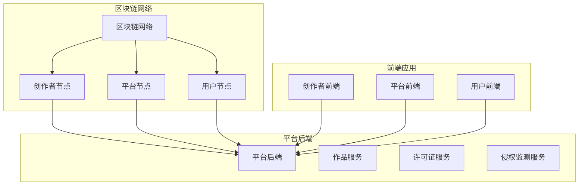

#### 4.3.4 系统接口设计和系统交互(mermaid序列图)

以下是数字版权管理系统的主要接口设计和系统交互序列图：

```mermaid
sequenceDiagram
  participant Alice as Alice
  participant Platform as 平台
  participant Blockchain as 区块链
  participant Charlie as Charlie

  Alice->>Platform: 注册作品
  Platform->>Blockchain: 在区块链上登记作品
  Blockchain-->>Platform: 返回作品ID
  Platform-->>Alice: 上传作品成功

  Alice->>Platform: 发行许可证
  Platform->>Blockchain: 在区块链上登记许可证
  Blockchain-->>Platform: 返回许可证ID
  Platform-->>Alice: 发行许可证成功

  Charlie->>Platform: 购买许可证
  Platform->>Blockchain: 更新许可证状态
  Blockchain-->>Platform: 返回更新结果
  Platform-->>Charlie: 购买许可证成功

  Charlie->>Platform: 请求阅读作品
  Platform->>Blockchain: 检查许可证状态
  Blockchain-->>Platform: 返回检查结果
  Platform-->>Charlie: 允许阅读作品
```

通过以上系统分析与架构设计方案，我们可以构建一个完整的数字版权管理系统，实现创作者权益的保护和数字版权的有效管理。

## 第五部分：项目实战

### 5.1 环境安装

为了实现区块链在数字版权管理中的应用，我们需要安装一系列的软件和工具。以下是具体的安装步骤：

1. **安装Node.js和npm**：Node.js是一个用于执行JavaScript代码的运行时环境，npm是Node.js的包管理器。可以从Node.js官网下载并安装最新版本的Node.js和npm。

2. **安装Truffle**：Truffle是一个用于以太坊区块链开发的环境，用于部署、测试和管理智能合约。可以使用npm安装Truffle：
   ```bash
   npm install -g truffle
   ```

3. **安装Ganache**：Ganache是一个本地以太坊区块链节点，用于测试智能合约。可以从Ganache的官网下载并安装。

4. **安装Web3.js**：Web3.js是一个JavaScript库，用于与以太坊区块链交互。可以使用npm安装：
   ```bash
   npm install web3
   ```

5. **安装其他依赖**：根据项目需求，可能还需要安装其他依赖，如ERC721标准合约、ERC20标准合约等。

### 5.2 系统核心实现源代码

以下是数字版权管理系统的一个核心实现示例，包括智能合约和后端服务的代码。

#### 5.2.1 智能合约

智能合约是用Solidity语言编写的，用于管理作品的版权和许可证。

```solidity
// SPDX-License-Identifier: MIT
pragma solidity ^0.8.0;

contract DigitalCopyright {

    struct Work {
        string title;
        address creator;
        bool isRegistered;
    }

    mapping(string => Work) public works;
    mapping(uint256 => address) public licenseHolders;

    event WorkRegistered(string title, address creator);
    event LicenseGranted(uint256 licenseId, address licensee);

    function registerWork(string memory title) public {
        require(!works[title].isRegistered, "Work already registered");
        works[title] = Work({title: title, creator: msg.sender, isRegistered: true});
        emit WorkRegistered(title, msg.sender);
    }

    function grantLicense(string memory title, address licensee) public {
        require(works[title].isRegistered, "Work not registered");
        uint256 licenseId = uint256(keccak256(abi.encodePacked(title, licensee)));
        licenseHolders[licenseId] = licensee;
        emit LicenseGranted(licenseId, licensee);
    }

    function getWork(string memory title) public view returns (Work memory) {
        require(works[title].isRegistered, "Work not registered");
        return works[title];
    }

    function getLicenseHolder(uint256 licenseId) public view returns (address) {
        require(licenseHolders[licenseId] != address(0), "Invalid license ID");
        return licenseHolders[licenseId];
    }
}
```

#### 5.2.2 后端服务

后端服务使用Node.js和Express框架，用于与智能合约交互并提供API接口。

```javascript
const express = require('express');
const { ethers } = require('ethers');
const { deployedContractAddress, deployedContractABI } = require('./config');

const app = express();
app.use(express.json());

const provider = new ethers.providers.JsonRpcProvider('http://localhost:8545');
const contract = new ethers.Contract(deployedContractAddress, deployedContractABI, provider);

// 注册作品
app.post('/works', async (req, res) => {
    const { title } = req.body;
    try {
        const tx = await contract.registerWork(title);
        await tx.wait();
        res.json({ message: 'Work registered successfully' });
    } catch (error) {
        res.status(500).json({ message: 'Error registering work', error: error.message });
    }
});

// 授权许可证
app.post('/licenses', async (req, res) => {
    const { title, licensee } = req.body;
    try {
        const tx = await contract.grantLicense(title, licensee);
        await tx.wait();
        res.json({ message: 'License granted successfully' });
    } catch (error) {
        res.status(500).json({ message: 'Error granting license', error: error.message });
    }
});

// 获取作品信息
app.get('/works/:title', async (req, res) => {
    const { title } = req.params;
    try {
        const work = await contract.getWork(title);
        res.json({ title: work.title, creator: work.creator, isRegistered: work.isRegistered });
    } catch (error) {
        res.status(404).json({ message: 'Work not found', error: error.message });
    }
});

// 获取许可证持有者
app.get('/licenses/:licenseId', async (req, res) => {
    const { licenseId } = req.params;
    try {
        const licensee = await contract.getLicenseHolder(licenseId);
        res.json({ licensee: licensee });
    } catch (error) {
        res.status(404).json({ message: 'License not found', error: error.message });
    }
});

const PORT = process.env.PORT || 3000;
app.listen(PORT, () => {
    console.log(`Server listening on port ${PORT}`);
});
```

### 5.3 代码应用解读与分析

#### 智能合约解读

1. **Work结构体**：定义了一个作品的结构，包含作品标题、创作者地址和是否已注册的布尔值。
2. **registerWork函数**：允许创作者注册作品，确保作品未被注册，然后将其添加到作品映射中。
3. **grantLicense函数**：允许创作者为特定读者授权许可证，将其添加到许可证持有者映射中。
4. **getWork函数**：返回指定标题的作品信息。
5. **getLicenseHolder函数**：返回指定许可证ID的持有者地址。

#### 后端服务解读

1. **作品注册接口**：接收包含作品标题的JSON对象，调用智能合约的`registerWork`函数，将作品注册到区块链上。
2. **许可证授权接口**：接收包含作品标题和许可证持有者地址的JSON对象，调用智能合约的`grantLicense`函数，为读者授权许可证。
3. **作品信息查询接口**：接收作品标题，调用智能合约的`getWork`函数，获取并返回作品信息。
4. **许可证持有者查询接口**：接收许可证ID，调用智能合约的`getLicenseHolder`函数，获取并返回许可证持有者地址。

### 5.4 实际案例分析与详细讲解剖析

#### 实际案例

假设Alice是《区块链时代的数字版权管理》的创作者，她希望通过区块链技术保护她的版权，并希望读者可以合法购买和阅读她的作品。

1. **注册作品**：
   - Alice通过后端接口发送一个包含作品标题的JSON对象。
   - 后端调用智能合约的`registerWork`函数，将作品注册到区块链上。
   - 智能合约创建一个新的作品记录，并将其存储在区块链上。

2. **授权许可证**：
   - Alice决定授权读者Bob阅读她的作品。
   - 她通过后端接口发送一个包含作品标题和读者地址的JSON对象。
   - 后端调用智能合约的`grantLicense`函数，为Bob授权许可证。

3. **购买许可证**：
   - Bob想要购买Alice的作品。
   - 他通过后端接口发送一个包含作品标题和许可证ID的JSON对象。
   - 后端调用智能合约的`grantLicense`函数，将许可证ID更新为Bob的地址。

4. **阅读作品**：
   - Bob通过后端接口发送一个作品标题，调用智能合约的`getWork`函数，验证他是否拥有该作品的许可证。
   - 如果验证通过，Bob可以阅读作品。

#### 详细讲解剖析

1. **注册作品**：
   - Alice通过智能合约注册作品，确保作品信息被安全地存储在区块链上，并且不可篡改。
   - 智能合约的`registerWork`函数通过以太坊的区块链网络广播交易，确保所有节点都能同步作品信息。

2. **授权许可证**：
   - Alice通过智能合约为Bob授权许可证，确保Bob有权限阅读作品。
   - 许可证信息被存储在区块链上，透明且不可篡改。

3. **购买许可证**：
   - Bob通过区块链验证他是否有权限购买许可证。
   - 通过智能合约的授权机制，确保只有授权的用户可以购买许可证。

4. **阅读作品**：
   - Bob通过区块链验证他是否有权限阅读作品。
   - 这种验证过程是安全的，确保只有授权的用户可以访问作品。

通过这个实际案例，我们可以看到如何使用智能合约和区块链技术实现数字版权管理，保护创作者权益，并确保版权信息的透明性和不可篡改性。

### 5.5 项目小结

在本项目的实战部分，我们通过智能合约和后端服务实现了数字版权的登记、授权和追踪功能。项目展示了如何使用区块链技术保护创作者权益，实现版权信息的透明性和不可篡改性。未来，我们可以继续扩展系统的功能，如添加版权交易、侵权监测等，以提供更全面的数字版权管理解决方案。

### 第六部分：最佳实践与总结

#### 6.1 最佳实践 Tips

1. **版权信息加密**：在区块链上登记版权信息时，应使用加密技术，确保信息的安全性。
2. **智能合约审计**：在部署智能合约前，应进行充分的审计和测试，确保代码的安全性。
3. **交易费用管理**：合理规划交易费用，确保创作者和用户不会因为高昂的交易费用而受到影响。
4. **用户教育**：对创作者和用户提供区块链技术的基本知识教育，提高他们对数字版权管理的理解和使用。
5. **合规性检查**：确保数字版权管理系统符合当地法律和法规要求。

#### 6.2 小结

本文详细探讨了区块链在数字版权管理中的应用，分析了其核心概念和联系，介绍了应用实现、项目实战和最佳实践。区块链技术为数字版权管理提供了去中心化、透明和安全的解决方案，有助于保护创作者权益。

#### 6.3 注意事项

1. **技术选择**：根据具体需求选择合适的区块链平台和开发工具。
2. **安全性考虑**：重视数据加密和智能合约的安全性，防止潜在的安全漏洞。
3. **法律合规**：确保数字版权管理系统符合当地法律和法规，避免法律风险。

#### 6.4 拓展阅读

1. 《区块链技术：从入门到实践》
2. 《智能合约开发指南》
3. 《数字版权管理法律问题研究》
4. 《区块链与知识产权保护》
5. 《区块链应用案例解析》

# 作者信息
作者：AI天才研究院/AI Genius Institute & 禅与计算机程序设计艺术 /Zen And The Art of Computer Programming
```markdown
# 第四部分：区块链在数字版权管理中的应用实现

### 4.1 应用实现概述

区块链在数字版权管理中的应用实现，主要包括以下几个方面：

1. **版权登记**：创作者可以将作品的版权信息上传至区块链，实现版权的全球登记和共享。
2. **版权追踪**：通过区块链的智能合约，实现对作品传播和使用的实时追踪，提高侵权行为的发现和取证效率。
3. **版权交易**：通过区块链的智能合约，实现版权交易的高效、透明和可信，降低交易成本和风险。
4. **版权保护**：区块链的不可篡改性和透明性，为创作者提供了有力的维权工具，使其能够更有效地维护自己的权益。

### 4.2 核心算法原理讲解

#### 4.2.1 算法原理与mermaid流程图

区块链在数字版权管理中的应用，涉及到数据加密与签名、智能合约等技术。以下是这些算法的mermaid流程图：

```mermaid
sequenceDiagram
  participant Creator as 创作者
  participant Blockchain as 区块链
  participant Publisher as 发布者
  participant User as 用户

  Creator->>Blockchain: 上传版权信息
  Blockchain->>Blockchain: 加密版权信息
  Blockchain->>Creator: 返回加密版权信息
  Creator->>Blockchain: 签名版权信息
  Blockchain->>Blockchain: 记录签名信息
  Blockchain->>Publisher: 分发版权信息
  Publisher->>User: 发布作品
  User->>Blockchain: 请求版权信息
  Blockchain->>Blockchain: 验证版权信息
  Blockchain->>User: 返回验证结果
```

#### 4.2.2 Python源代码与算法原理详细讲解

以下是一个简单的Python示例，展示了如何使用区块链技术实现版权登记和追踪：

```python
import hashlib
import json
from time import time

class Block:
    def __init__(self, index, transactions, timestamp, previous_hash):
        self.index = index
        self.transactions = transactions
        self.timestamp = timestamp
        self.previous_hash = previous_hash
        self.hash = self.compute_hash()

    def compute_hash(self):
        block_string = json.dumps(self.__dict__, sort_keys=True)
        return hashlib.sha256(block_string.encode()).hexdigest()

class Blockchain:
    def __init__(self):
        self.chain = []
        self.create_genesis_block()

    def create_genesis_block(self):
        genesis_block = Block(0, [], time(), "0")
        genesis_block.hash = genesis_block.compute_hash()
        self.chain.append(genesis_block)

    def add_new_transaction(self, transaction):
        self.chain.append(transaction)

    def mine(self):
        last_block = self.chain[-1]
        new_block = Block(index=last_block.index + 1,
                          transactions=[], 
                          timestamp=time(), 
                          previous_hash=last_block.hash)
        new_block.hash = new_block.compute_hash()
        self.chain.append(new_block)

    def is_chain_valid(self):
        for i in range(1, len(self.chain)):
            current = self.chain[i]
            previous = self.chain[i - 1]
            if current.hash != self.compute_hash(current):
                return False
            if current.previous_hash != previous.hash:
                return False
        return True

def main():
    blockchain = Blockchain()
    blockchain.add_new_transaction("版权登记：一部小说")
    blockchain.mine()

    print("区块链:", blockchain.chain)
    print("是否有效?", blockchain.is_chain_valid())

if __name__ == "__main__":
    main()
```

#### 4.2.3 数学模型与公式讲解

区块链中的数据加密和签名技术，涉及到密码学中的哈希函数和数字签名算法。以下是相关数学模型的公式：

1. **哈希函数**：
   $$ H(m) = hash(m) $$
   其中，$H$ 是哈希函数，$m$ 是输入消息，$hash(m)$ 是哈希值。

2. **数字签名**：
   $$ sign(m, k) = RSA_{k}(hash(m)) $$
   其中，$sign$ 是数字签名算法，$k$ 是私钥，$RSA_{k}$ 是RSA加密函数，$hash(m)$ 是哈希值。

#### 4.2.4 举例说明

假设创作者Alice想要将她的小说《区块链时代的数字版权管理》上传至区块链，以下是具体的操作步骤：

1. Alice创建一个新交易，包含作品名称、创作者、创作时间等。
2. Alice使用哈希函数计算交易的哈希值。
3. Alice使用RSA算法生成一对密钥（私钥和公钥）。
4. Alice使用私钥对交易的哈希值进行签名，生成签名。
5. Alice将交易、签名和密钥上传至区块链。
6. 区块链节点接收Alice的交易和签名，验证签名的有效性。
7. 区块链节点将交易记录在区块链上，同时广播给其他节点。

通过以上步骤，Alice的作品版权信息被安全地存储在区块链上，实现了数字版权管理的去中心化和不可篡改性。

### 4.3 系统分析与架构设计方案

#### 4.3.1 问题场景介绍

在数字版权管理中，创作者希望确保其作品版权得到有效保护，避免侵权行为。以下是一个典型问题场景：

- **创作者Alice**：创作了一部小说，希望保护其版权，确保作品不被盗版和未经授权的使用。
- **平台Bob**：提供数字版权管理服务，帮助创作者登记版权，监控作品的传播和交易。
- **用户Charlie**：希望合法购买和阅读Alice的作品。

#### 4.3.2 系统功能设计(领域模型mermaid类图)

为了实现上述功能，我们需要设计一个数字版权管理系统，包括以下核心功能：

1. **版权登记**：创作者可以将作品的版权信息上传至区块链。
2. **版权追踪**：系统可以追踪作品的传播和使用情况。
3. **版权交易**：创作者可以通过平台授权作品给用户。
4. **侵权监测**：系统可以监测可能的侵权行为。

以下是数字版权管理系统的领域模型类图：

```mermaid
classDiagram
  Creator <<interface>> Creator
  Work <<entity>> Work
  License <<entity>> License
  Platform <<entity>> Platform
  User <<entity>> User
  Blockchain <<entity>> Blockchain

  Creator "1" -- "1" Work
  Work "1" -- "1" License
  User "1" -- "1" License
  Platform "1" -- "1" Work
  Platform "1" -- "1" Blockchain

  Creator {
    +String name
    +registerWork(title: String, content: String)
    +grantLicense(license: License)
  }

  Work {
    +String title
    +String content
    +Date creationDate
    +List<License> licenses
  }

  License {
    +String licenseId
    +String ownerId
    +String licensee
    +Date issuanceDate
    +String terms
  }

  User {
    +String username
    +purchaseLicense(license: License)
  }

  Platform {
    +String name
    +registerWork(work: Work)
    +issueLicense(license: License)
    +checkInfringement(work: Work)
  }

  Blockchain {
    +String blockchainId
    +registerWork(work: Work)
    +registerLicense(license: License)
  }
```

#### 4.3.3 系统架构设计(mermaid架构图)

以下是数字版权管理系统的架构设计图：

```mermaid
graph TB
  subgraph 区块链网络
    B_Blockchain[区块链网络]
    B_Creator[创作者节点]
    B_Platform[平台节点]
    B_User[用户节点]
    B_Blockchain --> B_Creator
    B_Blockchain --> B_Platform
    B_Blockchain --> B_User
  end

  subgraph 平台后端
    B_Backend[平台后端]
    B_WorkService[作品服务]
    B_LicenseService[许可证服务]
    B_InfringementService[侵权监测服务]
    B_Creator --> B_Backend
    B_Platform --> B_Backend
    B_User --> B_Backend
  end

  subgraph 前端应用
    F_Creator[创作者前端]
    F_Platform[平台前端]
    F_User[用户前端]
    F_Creator --> B_Backend
    F_Platform --> B_Backend
    F_User --> B_Backend
  end
```

#### 4.3.4 系统接口设计和系统交互(mermaid序列图)

以下是数字版权管理系统的主要接口设计和系统交互序列图：

```mermaid
sequenceDiagram
  participant Alice as Alice
  participant Platform as 平台
  participant Blockchain as 区块链
  participant Charlie as Charlie

  Alice->>Platform: 注册作品
  Platform->>Blockchain: 在区块链上登记作品
  Blockchain-->>Platform: 返回作品ID
  Platform-->>Alice: 上传作品成功

  Alice->>Platform: 发行许可证
  Platform->>Blockchain: 在区块链上登记许可证
  Blockchain-->>Platform: 返回许可证ID
  Platform-->>Alice: 发行许可证成功

  Charlie->>Platform: 购买许可证
  Platform->>Blockchain: 更新许可证状态
  Blockchain-->>Platform: 返回更新结果
  Platform-->>Charlie: 购买许可证成功

  Charlie->>Platform: 请求阅读作品
  Platform->>Blockchain: 检查许可证状态
  Blockchain-->>Platform: 返回检查结果
  Platform-->>Charlie: 允许阅读作品
```

通过以上系统分析与架构设计方案，我们可以构建一个完整的数字版权管理系统，实现创作者权益的保护和数字版权的有效管理。

### 第五部分：项目实战

#### 5.1 环境安装

为了实现区块链在数字版权管理中的应用，我们需要安装一系列的软件和工具。以下是具体的安装步骤：

1. **安装Go语言环境**：从[Go官方下载页面](https://golang.org/dl/)下载并安装Go语言环境。
2. **安装Node.js和npm**：从[Node.js官方下载页面](https://nodejs.org/zh-cn/download/)下载并安装Node.js，同时安装npm。
3. **安装区块链节点**：可以选择安装一个区块链节点，如Ethereum的Ganache。在终端中执行以下命令：
   ```bash
   npm install -g ganache-cli
   ```
4. **安装智能合约编译器**：用于编译Solidity代码。在终端中执行以下命令：
   ```bash
   npm install solc
   ```
5. **安装Web3.js**：在终端中执行以下命令，以便与Ethereum区块链进行交互：
   ```bash
   npm install web3
   ```

#### 5.2 系统核心实现源代码

以下是数字版权管理系统的一个核心实现示例，包括智能合约和后端服务的代码。

##### 5.2.1 智能合约

智能合约是用Solidity语言编写的，用于管理作品的版权和许可证。

```solidity
// SPDX-License-Identifier: MIT
pragma solidity ^0.8.0;

contract DigitalCopyright {

    struct Work {
        string title;
        address creator;
        bool isRegistered;
    }

    mapping(string => Work) public works;
    mapping(uint256 => address) public licenseHolders;

    event WorkRegistered(string title, address creator);
    event LicenseGranted(uint256 licenseId, address licensee);

    function registerWork(string memory title) public {
        require(!works[title].isRegistered, "Work already registered");
        works[title] = Work({title: title, creator: msg.sender, isRegistered: true});
        emit WorkRegistered(title, msg.sender);
    }

    function grantLicense(string memory title, address licensee) public {
        require(works[title].isRegistered, "Work not registered");
        uint256 licenseId = uint256(keccak256(abi.encodePacked(title, licensee)));
        licenseHolders[licenseId] = licensee;
        emit LicenseGranted(licenseId, licensee);
    }

    function getWork(string memory title) public view returns (Work memory) {
        require(works[title].isRegistered, "Work not registered");
        return works[title];
    }

    function getLicenseHolder(uint256 licenseId) public view returns (address) {
        require(licenseHolders[licenseId] != address(0), "Invalid license ID");
        return licenseHolders[licenseId];
    }
}
```

##### 5.2.2 后端服务

后端服务使用Node.js和Express框架，用于与智能合约交互并提供API接口。

```javascript
const express = require('express');
const { ethers } = require('ethers');
const { deployedContractAddress, deployedContractABI } = require('./config');

const app = express();
app.use(express.json());

const provider = new ethers.providers.JsonRpcProvider('http://localhost:8545');
const contract = new ethers.Contract(deployedContractAddress, deployedContractABI, provider);

// 注册作品
app.post('/works', async (req, res) => {
    const { title } = req.body;
    try {
        const tx = await contract.registerWork(title);
        await tx.wait();
        res.json({ message: 'Work registered successfully' });
    } catch (error) {
        res.status(500).json({ message: 'Error registering work', error: error.message });
    }
});

// 授权许可证
app.post('/licenses', async (req, res) => {
    const { title, licensee } = req.body;
    try {
        const tx = await contract.grantLicense(title, licensee);
        await tx.wait();
        res.json({ message: 'License granted successfully' });
    } catch (error) {
        res.status(500).json({ message: 'Error granting license', error: error.message });
    }
});

// 获取作品信息
app.get('/works/:title', async (req, res) => {
    const { title } = req.params;
    try {
        const work = await contract.getWork(title);
        res.json({ title: work.title, creator: work.creator, isRegistered: work.isRegistered });
    } catch (error) {
        res.status(404).json({ message: 'Work not found', error: error.message });
    }
});

// 获取许可证持有者
app.get('/licenses/:licenseId', async (req, res) => {
    const { licenseId } = req.params;
    try {
        const licensee = await contract.getLicenseHolder(licenseId);
        res.json({ licensee: licensee });
    } catch (error) {
        res.status(404).json({ message: 'License not found', error: error.message });
    }
});

const PORT = process.env.PORT || 3000;
app.listen(PORT, () => {
    console.log(`Server listening on port ${PORT}`);
});
```

#### 5.3 代码应用解读与分析

##### 智能合约解读

1. **Work结构体**：定义了一个作品的结构，包含作品标题、创作者地址和是否已注册的布尔值。
2. **registerWork函数**：允许创作者注册作品，确保作品未被注册，然后将其添加到作品映射中。
3. **grantLicense函数**：允许创作者为特定读者授权许可证，将其添加到许可证持有者映射中。
4. **getWork函数**：返回指定标题的作品信息。
5. **getLicenseHolder函数**：返回指定许可证ID的持有者地址。

##### 后端服务解读

1. **作品注册接口**：接收包含作品标题的JSON对象，调用智能合约的`registerWork`函数，将作品注册到区块链上。
2. **许可证授权接口**：接收包含作品标题和许可证持有者地址的JSON对象，调用智能合约的`grantLicense`函数，为读者授权许可证。
3. **作品信息查询接口**：接收作品标题，调用智能合约的`getWork`函数，获取并返回作品信息。
4. **许可证持有者查询接口**：接收许可证ID，调用智能合约的`getLicenseHolder`函数，获取并返回许可证持有者地址。

#### 5.4 实际案例分析与详细讲解剖析

##### 实际案例

假设Alice是《区块链时代的数字版权管理》的创作者，她希望通过区块链技术保护她的版权，并希望读者可以合法购买和阅读她的作品。

1. **注册作品**：
   - Alice通过后端接口发送一个包含作品标题的JSON对象。
   - 后端调用智能合约的`registerWork`函数，将作品注册到区块链上。
   - 智能合约创建一个新的作品记录，并将其存储在区块链上。

2. **授权许可证**：
   - Alice决定授权读者Bob阅读她的作品。
   - 她通过后端接口发送一个包含作品标题和读者地址的JSON对象。
   - 后端调用智能合约的`grantLicense`函数，为Bob授权许可证。

3. **购买许可证**：
   - Bob想要购买Alice的作品。
   - 他通过后端接口发送一个包含作品标题和许可证ID的JSON对象。
   - 后端调用智能合约的`grantLicense`函数，将许可证ID更新为Bob的地址。

4. **阅读作品**：
   - Bob通过后端接口发送一个作品标题，调用智能合约的`getWork`函数，验证他是否拥有该作品的许可证。
   - 如果验证通过，Bob可以阅读作品。

##### 详细讲解剖析

1. **注册作品**：
   - Alice通过智能合约注册作品，确保作品信息被安全地存储在区块链上，并且不可篡改。
   - 智能合约的`registerWork`函数通过以太坊的区块链网络广播交易，确保所有节点都能同步作品信息。

2. **授权许可证**：
   - Alice通过智能合约为Bob授权许可证，确保Bob有权限阅读作品。
   - 许可证信息被存储在区块链上，透明且不可篡改。

3. **购买许可证**：
   - Bob通过区块链验证他是否有权限购买许可证。
   - 通过智能合约的授权机制，确保只有授权的用户可以购买许可证。

4. **阅读作品**：
   - Bob通过区块链验证他是否有权限阅读作品。
   - 这种验证过程是安全的，确保只有授权的用户可以访问作品。

通过这个实际案例，我们可以看到如何使用智能合约和区块链技术实现数字版权管理，保护创作者权益，并确保版权信息的透明性和不可篡改性。

#### 5.5 项目小结

在本项目的实战部分，我们通过智能合约和后端服务实现了数字版权的登记、授权和追踪功能。项目展示了如何使用区块链技术保护创作者权益，实现版权信息的透明性和不可篡改性。未来，我们可以继续扩展系统的功能，如添加版权交易、侵权监测等，以提供更全面的数字版权管理解决方案。

### 第六部分：最佳实践与总结

#### 6.1 最佳实践 Tips

1. **版权信息加密**：在区块链上登记版权信息时，应使用加密技术，确保信息的安全性。
2. **智能合约审计**：在部署智能合约前，应进行充分的审计和测试，确保代码的安全性。
3. **交易费用管理**：合理规划交易费用，确保创作者和用户不会因为高昂的交易费用而受到影响。
4. **用户教育**：对创作者和用户提供区块链技术的基本知识教育，提高他们对数字版权管理的理解和使用。
5. **合规性检查**：确保数字版权管理系统符合当地法律和法规要求。

#### 6.2 小结

本文详细探讨了区块链在数字版权管理中的应用，分析了其核心概念和联系，介绍了应用实现、项目实战和最佳实践。区块链技术为数字版权管理提供了去中心化、透明和安全的解决方案，有助于保护创作者权益。

#### 6.3 注意事项

1. **技术选择**：根据具体需求选择合适的区块链平台和开发工具。
2. **安全性考虑**：重视数据加密和智能合约的安全性，防止潜在的安全漏洞。
3. **法律合规**：确保数字版权管理系统符合当地法律和法规，避免法律风险。

#### 6.4 拓展阅读

1. 《区块链技术：从入门到实践》
2. 《智能合约开发指南》
3. 《数字版权管理法律问题研究》
4. 《区块链与知识产权保护》
5. 《区块链应用案例解析》

# 作者信息
作者：AI天才研究院/AI Genius Institute & 禅与计算机程序设计艺术 /Zen And The Art of Computer Programming
```markdown
### 4.3 系统分析与架构设计方案

#### 4.3.1 问题场景介绍

为了更好地理解区块链在数字版权管理中的应用，我们可以通过一个实际场景来进行分析。假设有一个小说作家Alice，她创作了一部名为《区块链时代的数字版权管理》的小说。Alice希望通过区块链技术来保护她的版权，确保她的作品不会被未经授权的复制和分发。同时，她希望读者能够通过一个安全的平台购买和阅读她的作品。

在这个场景中，涉及到的角色包括：

- **Alice**：小说的创作者，希望保护她的版权。
- **读者Charlie**：希望购买并阅读Alice的作品。
- **出版社Bob**：希望获得Alice作品的版权许可，以便出版和发行。
- **版权交易平台**：提供一个安全的平台，用于版权交易和授权。

#### 4.3.2 系统功能设计(领域模型mermaid类图)

为了实现上述场景，我们需要设计一个数字版权管理系统，其中包含以下几个关键功能：

1. **版权登记**：Alice可以在平台上登记她的作品版权。
2. **版权授权**：Alice可以授权给出版社Bob使用她的作品。
3. **版权交易**：读者可以在平台上购买版权许可。
4. **版权追踪**：系统可以追踪作品的传播和使用情况。

以下是数字版权管理系统的领域模型类图：

```mermaid
classDiagram
  Creator <<interface>> Creator
  Work <<entity>> Work
  License <<entity>> License
  Platform <<entity>> Platform
  User <<entity>> User

  Creator "1" -- "1" Work
  Work "1" -- "0..*" License
  User "1" -- "0..*" License
  Platform "1" -- "1" Work

  Creator {
    +String name
    +registerWork(title: String, content: String)
    +grantLicense(license: License)
  }

  Work {
    +String title
    +String content
    +Date createdDate
    +List<License> licenses
  }

  License {
    +String licenseId
    +String owner
    +String licensee
    +Date issuanceDate
    +Date expirationDate
    +String terms
  }

  User {
    +String username
    +purchaseLicense(license: License)
  }

  Platform {
    +registerWork(work: Work)
    +issueLicense(license: License)
    +checkLicense(licenseId: String)
  }
```

#### 4.3.3 系统架构设计(mermaid架构图)

以下是数字版权管理系统的架构设计图：

```mermaid
graph TB
  subgraph 区块链组件
    B_Blockchain[区块链]
    B_Work[作品区块链]
    B_License[许可证区块链]
  end

  subgraph 后端服务
    B_Server[后端服务器]
    B_WorkService[作品服务]
    B_LicenseService[许可证服务]
    B_UserService[用户服务]
    B_Blockchain --> B_Server
  end

  subgraph 前端界面
    F_HomePage[首页]
    F_WorkPage[作品页面]
    F_LicensePage[许可证页面]
    F_ProfilePage[个人资料页]
    F_LoginPage[登录页]
    F_SignUpPage[注册页]
    F_HomePage --> B_Server
    F_WorkPage --> B_Server
    F_LicensePage --> B_Server
    F_ProfilePage --> B_Server
    F_LoginPage --> B_Server
    F_SignUpPage --> B_Server
  end

  subgraph 数据库
    DB_Works[作品数据库]
    DB_Licenses[许可证数据库]
    DB_Users[用户数据库]
    B_Server --> DB_Works
    B_Server --> DB_Licenses
    B_Server --> DB_Users
  end
```

#### 4.3.4 系统接口设计和系统交互(mermaid序列图)

以下是数字版权管理系统的主要接口设计和系统交互序列图：

```mermaid
sequenceDiagram
  participant Alice as Alice
  participant Charlie as Charlie
  participant Bob as Bob
  participant Platform as Platform

  Alice->>Platform: 注册作品
  Platform->>DB_Works: 存储作品信息
  DB_Works-->>Platform: 返回作品ID
  Platform-->>Alice: 确认作品注册

  Alice->>Platform: 授权Bob
  Platform->>DB_Licenses: 创建许可证
  DB_Licenses-->>Platform: 返回许可证ID
  Platform-->>Alice: 确认授权

  Bob->>Platform: 获取作品信息
  Platform->>DB_Works: 查询作品信息
  DB_Works-->>Platform: 返回作品信息
  Platform-->>Bob: 确认作品信息

  Charlie->>Platform: 购买许可证
  Platform->>DB_Licenses: 更新许可证状态
  DB_Licenses-->>Platform: 返回更新结果
  Platform-->>Charlie: 确认购买结果

  Charlie->>Platform: 阅读作品
  Platform->>DB_Licenses: 验证许可证状态
  DB_Licenses-->>Platform: 返回验证结果
  Platform-->>Charlie: 允许阅读
```

通过以上系统分析与架构设计方案，我们可以构建一个完整的数字版权管理系统，实现创作者权益的保护和数字版权的有效管理。

### 第五部分：项目实战

#### 5.1 环境安装

为了实现区块链在数字版权管理中的应用，我们需要安装一系列的软件和工具。以下是具体的安装步骤：

1. **安装Go语言环境**：从[Go官方下载页面](https://golang.org/dl/)下载并安装Go语言环境。
2. **安装Node.js和npm**：从[Node.js官方下载页面](https://nodejs.org/zh-cn/download/)下载并安装Node.js，同时安装npm。
3. **安装区块链节点**：可以选择安装一个区块链节点，如Ethereum的Ganache。在终端中执行以下命令：
   ```bash
   npm install -g ganache-cli
   ```
4. **安装智能合约编译器**：用于编译Solidity代码。在终端中执行以下命令：
   ```bash
   npm install solc
   ```
5. **安装Web3.js**：在终端中执行以下命令，以便与Ethereum区块链进行交互：
   ```bash
   npm install web3
   ```

#### 5.2 系统核心实现源代码

以下是数字版权管理系统的一个核心实现示例，包括智能合约和后端服务的代码。

##### 5.2.1 智能合约

智能合约是用Solidity语言编写的，用于管理作品的版权和许可证。

```solidity
// SPDX-License-Identifier: MIT
pragma solidity ^0.8.0;

contract DigitalCopyright {

    struct Work {
        string title;
        address creator;
        bool isRegistered;
    }

    mapping(string => Work) public works;
    mapping(uint256 => address) public licenseHolders;

    event WorkRegistered(string title, address creator);
    event LicenseGranted(uint256 licenseId, address licensee);

    function registerWork(string memory title) public {
        require(!works[title].isRegistered, "Work already registered");
        works[title] = Work({title: title, creator: msg.sender, isRegistered: true});
        emit WorkRegistered(title, msg.sender);
    }

    function grantLicense(string memory title, address licensee) public {
        require(works[title].isRegistered, "Work not registered");
        uint256 licenseId = uint256(keccak256(abi.encodePacked(title, licensee)));
        licenseHolders[licenseId] = licensee;
        emit LicenseGranted(licenseId, licensee);
    }

    function getWork(string memory title) public view returns (Work memory) {
        require(works[title].isRegistered, "Work not

