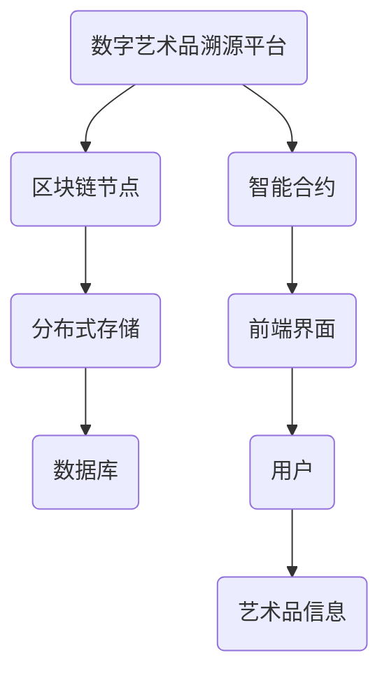
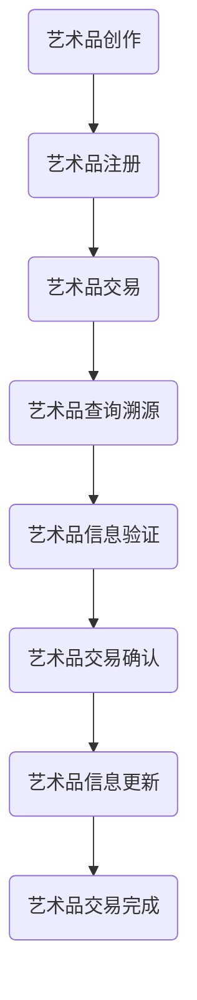
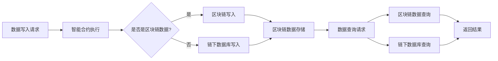
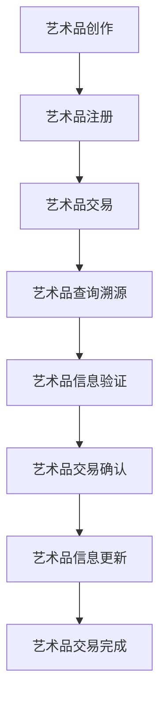

                 


# 区块链在数字艺术品溯源中的应用

## 关键词

- 区块链
- 数字艺术品
- 溯源
- 安全性
- 透明性
- 去中心化

## 摘要

本文旨在探讨区块链技术在数字艺术品溯源中的应用，通过分析区块链的基本原理、数字艺术品溯源的需求与挑战，以及区块链如何解决这些问题，深入探讨其在数字艺术品溯源中的重要性。文章还将通过实际案例分析，阐述区块链在数字艺术品溯源中的实践应用，并讨论构建区块链溯源系统的技术栈、架构设计及法律伦理问题。最后，文章将展望区块链溯源技术的发展趋势，并提出未来可能面临的挑战。

## 第1章 区块链技术概述

### 1.1 区块链基本原理

区块链是一种分布式数据库技术，其核心思想是通过多个节点共同维护一个数据库，确保数据的不可篡改性和一致性。每个区块包含一定数量的交易记录，通过加密算法和密码学原理，将区块链接成一个链状结构。

#### 区块链核心概念

- **区块**：数据的基本单位，包含交易记录、区块头、时间戳等。
- **链**：多个区块按照特定规则连接形成的结构。
- **分布式**：数据分散存储在多个节点上，提高系统的容错性和抗攻击性。
- **共识算法**：多个节点就数据的一致性达成共识的算法，如工作量证明（PoW）、权益证明（PoS）等。

#### 区块链与数字艺术品溯源

区块链技术具有去中心化、安全性和透明性等特点，使其在数字艺术品溯源领域具有广泛的应用前景。数字艺术品溯源是指通过技术手段对艺术品的生产、流通、交易等过程进行记录和追溯，确保艺术品的真实性和合法性。

### 1.2 区块链在溯源领域的重要性

区块链技术在数字艺术品溯源中的重要性主要体现在以下几个方面：

1. **去中心化**：去中心化特性使得数据存储和验证过程不再依赖单一中心机构，提高了系统的可靠性和抗攻击性。
2. **安全性**：区块链采用加密算法和共识算法，确保数据不可篡改和不可伪造，提高了艺术品溯源过程的安全性。
3. **透明性**：区块链上的数据对所有节点公开透明，参与者可以实时查询和验证艺术品溯源信息，提高了溯源过程的透明度。

### 1.3 区块链与数字艺术品溯源的关联

区块链与数字艺术品溯源之间的关联可以从以下几个方面进行分析：

1. **数据存储**：区块链作为分布式数据库，可以为数字艺术品溯源提供可靠的存储解决方案，确保溯源数据的安全性和完整性。
2. **溯源流程**：区块链技术可以用于设计数字艺术品溯源流程，实现对艺术品生产、流通、交易等环节的全程记录和追溯。
3. **信任机制**：区块链技术可以为数字艺术品溯源建立信任机制，通过共识算法和加密技术确保溯源信息的真实性和可靠性。

## 第2章 数字艺术品溯源的挑战

### 2.1 数字艺术品溯源的需求

数字艺术品溯源的需求主要来源于以下几个方面：

1. **版权保护**：数字艺术品创作者需要对其作品进行版权保护，确保作品的原创性和合法性。
2. **防伪鉴别**：数字艺术品市场存在大量伪造和盗版作品，溯源技术可以帮助鉴别艺术品真伪，维护市场秩序。
3. **质量控制**：艺术品生产过程中，溯源技术可以帮助企业实现对原材料、工艺、生产过程等环节的全面质量控制。
4. **交易透明**：数字艺术品交易过程中，溯源技术可以提供交易双方的诚信记录，提高交易透明度。

### 2.2 挑战与问题

数字艺术品溯源过程中面临的主要挑战和问题包括：

1. **数据真实性**：数字艺术品溯源过程中，数据的真实性和完整性是关键问题。如何确保溯源数据的真实性和一致性，是溯源技术需要解决的问题。
2. **数据安全性**：数字艺术品涉及大量的知识产权和商业秘密，如何确保溯源数据的安全性，防止数据泄露和篡改，是溯源技术需要面对的挑战。
3. **技术门槛**：区块链技术作为数字艺术品溯源的关键技术，其复杂的原理和应用场景使得技术门槛较高，需要更多的专业人才和资源进行研发和推广。
4. **法律法规**：数字艺术品溯源涉及法律法规、知识产权保护等方面的问题，如何制定合理的法律法规，保障溯源技术的合法性和有效性，是数字艺术品溯源领域需要关注的问题。

### 2.3 区块链如何解决这些挑战

区块链技术在数字艺术品溯源中可以解决以下挑战：

1. **数据真实性**：区块链采用加密算法和共识算法，确保数据在传输和存储过程中的真实性和完整性。
2. **数据安全性**：区块链技术具有去中心化特性，数据分散存储在多个节点上，提高了数据的安全性，降低了被篡改的风险。
3. **技术门槛**：区块链技术的发展和应用正在不断降低技术门槛，越来越多的企业和技术人员参与到区块链技术的研发和推广中来。
4. **法律法规**：区块链技术的应用可以推动相关法律法规的完善，为数字艺术品溯源提供法律保障。

## 第3章 区块链在数字艺术品溯源中的应用

### 3.1 核心概念与关键技术

区块链在数字艺术品溯源中的应用主要包括以下核心概念和关键技术：

1. **智能合约**：智能合约是一种在区块链上执行的计算机程序，用于自动化和去中心化地执行合同条款。
2. **非同质化代币（NFT）**：非同质化代币是一种基于区块链技术的数字资产，用于表示独一无二的艺术品或其他数字资产的所有权。
3. **分布式存储**：区块链技术通过分布式存储方式，将数字艺术品的相关信息存储在多个节点上，确保数据的完整性和安全性。
4. **共识算法**：共识算法用于多个节点之间就数据的一致性达成共识，确保区块链上的数据不可篡改。

### 3.2 溯源流程设计

区块链在数字艺术品溯源中的流程设计主要包括以下步骤：

1. **艺术品注册**：艺术家将数字艺术品的信息上传到区块链上，并进行数字签名，确保信息的真实性和唯一性。
2. **智能合约执行**：系统根据智能合约的条款，对上传的信息进行验证和存储，并将艺术品的信息记录在区块链上。
3. **艺术品交易**：当数字艺术品在市场上进行交易时，新的交易记录将添加到区块链上，记录交易双方的信息。
4. **溯源查询**：任何用户都可以通过区块链上的公开信息，查询数字艺术品的来源、交易历史等信息，实现对艺术品的溯源。

### 3.3 案例分析

#### 案例一：佳士得与NFT的艺术品拍卖

佳士得作为全球知名的艺术品拍卖行，首次将区块链技术与NFT结合，推出了一系列基于NFT的艺术品拍卖。艺术家将作品上传到区块链上，并通过智能合约进行验证和存储。拍卖过程中，买家通过NFT购买艺术品的所有权，交易记录实时记录在区块链上，实现了艺术品的透明溯源。

#### 案例二：微软与NFT的元宇宙

微软与NFT结合，推出了元宇宙平台，用户可以在平台上购买、交易和展示基于NFT的数字艺术品。微软通过区块链技术实现了艺术品的溯源功能，用户可以查询艺术品的来源、交易历史等信息，确保艺术品的真实性。

## 第4章 区块链在数字艺术品溯源中的实践

### 4.1 市场现状分析

目前，区块链技术在数字艺术品溯源领域已有一定的应用案例，但仍处于初级阶段。市场现状分析主要包括以下几个方面：

1. **应用案例**：艺术品拍卖行、艺术家、收藏家等已经开始尝试将区块链技术应用于数字艺术品溯源，取得了初步的成果。
2. **技术成熟度**：区块链技术在数字艺术品溯源中的应用仍面临技术成熟度、安全性、隐私保护等方面的问题。
3. **法律法规**：各国政府和监管机构对区块链技术在数字艺术品溯源中的应用尚无明确的法律法规，存在一定的政策风险。

### 4.2 实践方案设计

基于市场现状分析，区块链在数字艺术品溯源中的实践方案设计主要包括以下几个方面：

1. **平台搭建**：建立基于区块链技术的数字艺术品溯源平台，实现艺术品注册、交易、溯源等功能。
2. **智能合约应用**：设计智能合约，实现艺术品信息验证、存储、交易等过程的自动化和去中心化。
3. **非同质化代币（NFT）**：发行基于区块链技术的NFT，用于表示数字艺术品的所有权，确保艺术品溯源的真实性和唯一性。
4. **数据存储与管理**：采用分布式存储技术，确保艺术品信息的安全性和完整性，同时降低存储成本。

### 4.3 实施与效果评估

区块链在数字艺术品溯源中的实施主要包括以下几个方面：

1. **系统开发**：搭建基于区块链技术的数字艺术品溯源平台，实现前端用户界面和后端数据处理功能。
2. **智能合约编写**：编写智能合约，实现艺术品信息验证、存储、交易等过程的自动化和去中心化。
3. **数据整合**：整合艺术品相关数据，包括创作信息、交易记录、评价等，确保数据的完整性和准确性。

效果评估主要包括以下几个方面：

1. **安全性**：通过对比传统艺术品溯源方法，评估区块链技术在安全性方面的优势。
2. **透明性**：通过用户反馈和数据分析，评估区块链技术在提高艺术品交易透明度方面的效果。
3. **效率**：通过对比传统艺术品溯源方法，评估区块链技术在提高艺术品交易效率方面的效果。

## 第5章 区块链溯源系统的构建

### 5.1 技术栈选择

区块链溯源系统构建涉及多个技术领域的知识，技术栈选择主要包括以下几个方面：

1. **区块链平台**：选择适合数字艺术品溯源需求的区块链平台，如Ethereum、Hyperledger Fabric等。
2. **编程语言**：选择适合区块链开发的编程语言，如Solidity（用于智能合约开发）、JavaScript（用于前端开发）等。
3. **数据库**：选择适合存储和管理艺术品信息的数据库，如MongoDB、PostgreSQL等。
4. **开发框架**：选择适合区块链应用开发的框架，如React、Vue等。

### 5.2 系统架构设计

区块链溯源系统架构设计主要包括以下几个方面：

1. **前端架构**：前端架构主要包括用户界面、交互逻辑等，用于实现艺术品注册、查询、交易等功能。
2. **后端架构**：后端架构主要包括区块链节点、智能合约、数据处理等，用于实现艺术品信息验证、存储、交易等过程。
3. **数据库架构**：数据库架构主要用于存储和管理艺术品相关数据，包括创作信息、交易记录、评价等。
4. **网络架构**：网络架构主要用于实现区块链节点之间的通信和数据传输，包括P2P网络、加密通信等。

### 5.3 系统实现细节

系统实现细节主要包括以下几个方面：

1. **智能合约实现**：根据智能合约的条款，实现艺术品信息验证、存储、交易等过程的自动化和去中心化。
2. **数据存储与管理**：采用分布式存储技术，确保艺术品信息的安全性和完整性，同时降低存储成本。
3. **接口设计与实现**：设计并实现与区块链节点、数据库、前端等模块的接口，确保系统的可靠性和稳定性。
4. **安全性与隐私保护**：采用加密算法和隐私保护技术，确保艺术品信息的安全性和隐私性。

## 第6章 法律与伦理问题

### 6.1 法律法规概述

数字艺术品溯源涉及多个法律法规领域，主要包括以下几个方面：

1. **版权法**：数字艺术品作为版权作品，需要遵循版权法律法规，确保创作者的合法权益。
2. **数据保护法**：数字艺术品信息涉及个人隐私和商业秘密，需要遵循数据保护法律法规，确保数据的安全性和隐私性。
3. **电子商务法**：数字艺术品交易需要遵循电子商务法律法规，确保交易的合法性和公平性。
4. **区块链法律法规**：随着区块链技术的发展，各国政府和监管机构逐步推出相关法律法规，规范区块链技术的应用。

### 6.2 隐私与安全问题

区块链技术在数字艺术品溯源中面临的隐私与安全问题主要包括以下几个方面：

1. **数据泄露**：数字艺术品信息在区块链上公开透明，存在数据泄露的风险。
2. **身份隐私**：区块链技术无法确保用户身份的隐私，需要采取匿名化等技术手段。
3. **攻击与篡改**：区块链系统面临各种攻击和篡改风险，需要采取安全防护措施。

### 6.3 伦理道德问题

区块链技术在数字艺术品溯源中面临的伦理道德问题主要包括以下几个方面：

1. **知识产权保护**：数字艺术品溯源需要确保知识产权的合法权益，防止侵权行为。
2. **艺术品评价**：数字艺术品溯源过程中，需要公正、客观地评价艺术品的价值和品质。
3. **数字鸿沟**：区块链技术的高门槛可能导致数字艺术品溯源的普及受到限制，需要关注数字鸿沟问题。

## 第7章 未来展望与挑战

### 7.1 未来发展趋势

区块链技术在数字艺术品溯源领域的未来发展趋势主要包括以下几个方面：

1. **技术成熟**：随着区块链技术的不断发展，其在数字艺术品溯源中的应用将更加成熟和稳定。
2. **普及应用**：越来越多的艺术品市场参与者将采用区块链技术进行数字艺术品溯源，推动行业的普及应用。
3. **法律法规完善**：各国政府和监管机构将进一步完善区块链相关法律法规，规范数字艺术品溯源的应用。

### 7.2 持续改进的方向

区块链技术在数字艺术品溯源中的持续改进方向主要包括以下几个方面：

1. **性能优化**：提高区块链系统的性能和可扩展性，满足大规模数据存储和查询需求。
2. **隐私保护**：增强区块链技术的隐私保护能力，确保数字艺术品信息的安全性和隐私性。
3. **用户体验**：优化区块链溯源平台的前端设计和用户体验，提高用户满意度。

### 7.3 潜在的挑战

区块链技术在数字艺术品溯源中面临的潜在挑战主要包括以下几个方面：

1. **技术风险**：区块链技术的复杂性和安全性风险可能导致溯源系统的失效。
2. **法律法规风险**：区块链技术的应用可能涉及法律法规风险，需要关注政策动态和合规性。
3. **市场接受度**：区块链技术在数字艺术品溯源领域的普及应用可能受到市场接受度的影响。

## 附录：技术细节与源代码示例

### 8.1 区块链溯源系统架构图



### 8.2 关键算法实现

#### 智能合约实现

```solidity
pragma solidity ^0.8.0;

contract Artifacts {

    // 艺术品结构体
    struct Artifact {
        uint256 id;
        string title;
        string creator;
        string[] history;
    }

    // 艺术品映射
    mapping(uint256 => Artifact) public artifacts;

    // 记录艺术品数量
    uint256 public artifactCount;

    // 注册艺术品
    function registerArtifact(
        uint256 _id,
        string memory _title,
        string memory _creator
    ) public {
        artifacts[_id] = Artifact(_id, _title, _creator, new string[](0));
        artifactCount++;
    }

    // 添加艺术品历史
    function addHistory(
        uint256 _id,
        string memory _event
    ) public {
        artifacts[_id].history.push(_event);
    }

    // 获取艺术品信息
    function getArtifact(
        uint256 _id
    ) public view returns (
        uint256 id,
        string memory title,
        string memory creator,
        string[] memory history
    ) {
        Artifact memory artifact = artifacts[_id];
        return (
            artifact.id,
            artifact.title,
            artifact.creator,
            artifact.history
        );
    }
}
```

### 8.3 溯源流程Mermaid流程图



## 参考文献

1. 尼克·莎姆福德，《区块链革命：数字化经济的新世界秩序》
2. 安德鲁·肖，《区块链：从原理到应用》
3. 瑞波实验室，《智能合约开发指南》
4. 美国数字货币研究所，《数字货币与区块链技术》
5. 国际标准化组织，《区块链技术指南》

## 作者

作者：AI天才研究院/AI Genius Institute & 禅与计算机程序设计艺术 /Zen And The Art of Computer Programming

### 第1章 区块链技术概述

#### 1.1 区块链基本原理

区块链是一种分布式数据库技术，其核心思想是通过多个节点共同维护一个数据库，确保数据的不可篡改性和一致性。每个区块包含一定数量的交易记录，通过加密算法和密码学原理，将区块链接成一个链状结构。

区块链技术的主要特点包括：

1. **分布式存储**：区块链上的数据分散存储在多个节点上，避免了单点故障和数据丢失的风险。
2. **不可篡改性**：区块链采用加密算法和共识算法，确保数据在传输和存储过程中的真实性和完整性，防止数据被篡改。
3. **透明性**：区块链上的数据对所有节点公开透明，参与者可以实时查询和验证数据，提高了系统的透明度。
4. **去中心化**：区块链技术通过多个节点共同维护数据库，避免了单点控制和集中管理的风险，提高了系统的抗攻击性和可靠性。

区块链技术的核心概念包括：

- **区块**：数据的基本单位，包含交易记录、区块头、时间戳等。
- **链**：多个区块按照特定规则连接形成的结构。
- **分布式**：数据分散存储在多个节点上，提高系统的容错性和抗攻击性。
- **共识算法**：多个节点就数据的一致性达成共识的算法，如工作量证明（PoW）、权益证明（PoS）等。

#### 1.2 区块链与数字艺术品溯源

数字艺术品溯源是指通过技术手段对艺术品的生产、流通、交易等过程进行记录和追溯，确保艺术品的真实性和合法性。区块链技术具有去中心化、安全性和透明性等特点，使其在数字艺术品溯源领域具有广泛的应用前景。

区块链技术在数字艺术品溯源中的应用主要包括以下几个方面：

1. **数据存储**：区块链作为分布式数据库，可以为数字艺术品溯源提供可靠的存储解决方案，确保溯源数据的安全性和完整性。
2. **溯源流程**：区块链技术可以用于设计数字艺术品溯源流程，实现对艺术品生产、流通、交易等环节的全程记录和追溯。
3. **信任机制**：区块链技术可以为数字艺术品溯源建立信任机制，通过共识算法和加密技术确保溯源信息的真实性和可靠性。

#### 1.3 区块链在溯源领域的重要性

区块链技术具有去中心化、安全性和透明性等特点，使其在数字艺术品溯源领域具有重要性。以下是区块链在溯源领域的一些重要作用：

1. **去中心化**：去中心化特性使得数据存储和验证过程不再依赖单一中心机构，提高了系统的可靠性和抗攻击性。
2. **安全性**：区块链采用加密算法和共识算法，确保数据在传输和存储过程中的真实性和完整性，提高了艺术品溯源过程的安全性。
3. **透明性**：区块链上的数据对所有节点公开透明，参与者可以实时查询和验证艺术品溯源信息，提高了溯源过程的透明度。

#### 1.4 区块链与数字艺术品溯源的关联

区块链与数字艺术品溯源之间的关联可以从以下几个方面进行分析：

1. **数据存储**：区块链技术通过分布式存储方式，将数字艺术品的相关信息存储在多个节点上，确保数据的完整性和安全性。
2. **溯源流程**：区块链技术可以用于设计数字艺术品溯源流程，实现对艺术品生产、流通、交易等环节的全程记录和追溯。
3. **信任机制**：区块链技术可以为数字艺术品溯源建立信任机制，通过共识算法和加密技术确保溯源信息的真实性和可靠性。

### 第2章 数字艺术品溯源的挑战

#### 2.1 数字艺术品溯源的需求

数字艺术品溯源的需求主要来源于以下几个方面：

1. **版权保护**：数字艺术品创作者需要对其作品进行版权保护，确保作品的原创性和合法性。
2. **防伪鉴别**：数字艺术品市场存在大量伪造和盗版作品，溯源技术可以帮助鉴别艺术品真伪，维护市场秩序。
3. **质量控制**：艺术品生产过程中，溯源技术可以帮助企业实现对原材料、工艺、生产过程等环节的全面质量控制。
4. **交易透明**：数字艺术品交易过程中，溯源技术可以提供交易双方的诚信记录，提高交易透明度。

#### 2.2 挑战与问题

数字艺术品溯源过程中面临的主要挑战和问题包括：

1. **数据真实性**：数字艺术品溯源过程中，数据的真实性和完整性是关键问题。如何确保溯源数据的真实性和一致性，是溯源技术需要解决的问题。
2. **数据安全性**：数字艺术品涉及大量的知识产权和商业秘密，如何确保溯源数据的安全性，防止数据泄露和篡改，是溯源技术需要面对的挑战。
3. **技术门槛**：区块链技术作为数字艺术品溯源的关键技术，其复杂的原理和应用场景使得技术门槛较高，需要更多的专业人才和资源进行研发和推广。
4. **法律法规**：数字艺术品溯源涉及法律法规、知识产权保护等方面的问题，如何制定合理的法律法规，保障溯源技术的合法性和有效性，是数字艺术品溯源领域需要关注的问题。

#### 2.3 区块链如何解决这些挑战

区块链技术在数字艺术品溯源中可以解决以下挑战：

1. **数据真实性**：区块链采用加密算法和共识算法，确保数据在传输和存储过程中的真实性和完整性。
2. **数据安全性**：区块链技术具有去中心化特性，数据分散存储在多个节点上，提高了数据的安全性，降低了被篡改的风险。
3. **技术门槛**：区块链技术的发展和应用正在不断降低技术门槛，越来越多的企业和技术人员参与到区块链技术的研发和推广中来。
4. **法律法规**：区块链技术的应用可以推动相关法律法规的完善，为数字艺术品溯源提供法律保障。

### 第3章 区块链在数字艺术品溯源中的应用

#### 3.1 核心概念与关键技术

区块链在数字艺术品溯源中的应用主要包括以下核心概念和关键技术：

1. **智能合约**：智能合约是一种在区块链上执行的计算机程序，用于自动化和去中心化地执行合同条款。
2. **非同质化代币（NFT）**：非同质化代币是一种基于区块链技术的数字资产，用于表示独一无二的艺术品或其他数字资产的所有权。
3. **分布式存储**：区块链技术通过分布式存储方式，将数字艺术品的相关信息存储在多个节点上，确保数据的完整性和安全性。
4. **共识算法**：共识算法用于多个节点之间就数据的一致性达成共识，确保区块链上的数据不可篡改。

#### 3.2 溯源流程设计

区块链在数字艺术品溯源中的流程设计主要包括以下步骤：

1. **艺术品注册**：艺术家将数字艺术品的信息上传到区块链上，并进行数字签名，确保信息的真实性和唯一性。
2. **智能合约执行**：系统根据智能合约的条款，对上传的信息进行验证和存储，并将艺术品的信息记录在区块链上。
3. **艺术品交易**：当数字艺术品在市场上进行交易时，新的交易记录将添加到区块链上，记录交易双方的信息。
4. **溯源查询**：任何用户都可以通过区块链上的公开信息，查询数字艺术品的来源、交易历史等信息，实现对艺术品的溯源。

#### 3.3 案例分析

##### 案例一：佳士得与NFT的艺术品拍卖

佳士得作为全球知名的艺术品拍卖行，首次将区块链技术与NFT结合，推出了一系列基于NFT的艺术品拍卖。艺术家将作品上传到区块链上，并通过智能合约进行验证和存储。拍卖过程中，买家通过NFT购买艺术品的所有权，交易记录实时记录在区块链上，实现了艺术品的透明溯源。

##### 案例二：微软与NFT的元宇宙

微软与NFT结合，推出了元宇宙平台，用户可以在平台上购买、交易和展示基于NFT的数字艺术品。微软通过区块链技术实现了艺术品的溯源功能，用户可以查询艺术品的来源、交易历史等信息，确保艺术品的真实性。

### 第4章 区块链在数字艺术品溯源中的实践

#### 4.1 市场现状分析

目前，区块链技术在数字艺术品溯源领域已有一定的应用案例，但仍处于初级阶段。市场现状分析主要包括以下几个方面：

1. **应用案例**：艺术品拍卖行、艺术家、收藏家等已经开始尝试将区块链技术应用于数字艺术品溯源，取得了初步的成果。
2. **技术成熟度**：区块链技术在数字艺术品溯源中的应用仍面临技术成熟度、安全性、隐私保护等方面的问题。
3. **法律法规**：各国政府和监管机构对区块链技术在数字艺术品溯源中的应用尚无明确的法律法规，存在一定的政策风险。

#### 4.2 实践方案设计

基于市场现状分析，区块链在数字艺术品溯源中的实践方案设计主要包括以下几个方面：

1. **平台搭建**：建立基于区块链技术的数字艺术品溯源平台，实现艺术品注册、交易、溯源等功能。
2. **智能合约应用**：设计智能合约，实现艺术品信息验证、存储、交易等过程的自动化和去中心化。
3. **非同质化代币（NFT）**：发行基于区块链技术的NFT，用于表示数字艺术品的所有权，确保艺术品溯源的真实性和唯一性。
4. **数据存储与管理**：采用分布式存储技术，确保艺术品信息的安全性和完整性，同时降低存储成本。

#### 4.3 实施与效果评估

区块链在数字艺术品溯源中的实施主要包括以下几个方面：

1. **系统开发**：搭建基于区块链技术的数字艺术品溯源平台，实现前端用户界面和后端数据处理功能。
2. **智能合约编写**：编写智能合约，实现艺术品信息验证、存储、交易等过程的自动化和去中心化。
3. **数据整合**：整合艺术品相关数据，包括创作信息、交易记录、评价等，确保数据的完整性和准确性。

效果评估主要包括以下几个方面：

1. **安全性**：通过对比传统艺术品溯源方法，评估区块链技术在安全性方面的优势。
2. **透明性**：通过用户反馈和数据分析，评估区块链技术在提高艺术品交易透明度方面的效果。
3. **效率**：通过对比传统艺术品溯源方法，评估区块链技术在提高艺术品交易效率方面的效果。

### 第5章 区块链溯源系统的构建

#### 5.1 技术栈选择

区块链溯源系统构建涉及多个技术领域的知识，技术栈选择主要包括以下几个方面：

1. **区块链平台**：选择适合数字艺术品溯源需求的区块链平台，如Ethereum、Hyperledger Fabric等。
2. **编程语言**：选择适合区块链开发的编程语言，如Solidity（用于智能合约开发）、JavaScript（用于前端开发）等。
3. **数据库**：选择适合存储和管理艺术品信息的数据库，如MongoDB、PostgreSQL等。
4. **开发框架**：选择适合区块链应用开发的框架，如React、Vue等。

#### 5.2 系统架构设计

区块链溯源系统架构设计主要包括以下几个方面：

1. **前端架构**：前端架构主要包括用户界面、交互逻辑等，用于实现艺术品注册、查询、交易等功能。
2. **后端架构**：后端架构主要包括区块链节点、智能合约、数据处理等，用于实现艺术品信息验证、存储、交易等过程。
3. **数据库架构**：数据库架构主要用于存储和管理艺术品相关数据，包括创作信息、交易记录、评价等。
4. **网络架构**：网络架构主要用于实现区块链节点之间的通信和数据传输，包括P2P网络、加密通信等。

#### 5.3 系统实现细节

系统实现细节主要包括以下几个方面：

1. **智能合约实现**：根据智能合约的条款，实现艺术品信息验证、存储、交易等过程的自动化和去中心化。
2. **数据存储与管理**：采用分布式存储技术，确保艺术品信息的安全性和完整性，同时降低存储成本。
3. **接口设计与实现**：设计并实现与区块链节点、数据库、前端等模块的接口，确保系统的可靠性和稳定性。
4. **安全性与隐私保护**：采用加密算法和隐私保护技术，确保艺术品信息的安全性和隐私性。

### 第6章 法律与伦理问题

#### 6.1 法律法规概述

数字艺术品溯源涉及多个法律法规领域，主要包括以下几个方面：

1. **版权法**：数字艺术品作为版权作品，需要遵循版权法律法规，确保创作者的合法权益。
2. **数据保护法**：数字艺术品信息涉及个人隐私和商业秘密，需要遵循数据保护法律法规，确保数据的安全性和隐私性。
3. **电子商务法**：数字艺术品交易需要遵循电子商务法律法规，确保交易的合法性和公平性。
4. **区块链法律法规**：随着区块链技术的发展，各国政府和监管机构逐步推出相关法律法规，规范区块链技术的应用。

#### 6.2 隐私与安全问题

区块链技术在数字艺术品溯源中面临的隐私与安全问题主要包括以下几个方面：

1. **数据泄露**：数字艺术品信息在区块链上公开透明，存在数据泄露的风险。
2. **身份隐私**：区块链技术无法确保用户身份的隐私，需要采取匿名化等技术手段。
3. **攻击与篡改**：区块链系统面临各种攻击和篡改风险，需要采取安全防护措施。

#### 6.3 伦理道德问题

区块链技术在数字艺术品溯源中面临的伦理道德问题主要包括以下几个方面：

1. **知识产权保护**：数字艺术品溯源需要确保知识产权的合法权益，防止侵权行为。
2. **艺术品评价**：数字艺术品溯源过程中，需要公正、客观地评价艺术品的价值和品质。
3. **数字鸿沟**：区块链技术的高门槛可能导致数字艺术品溯源的普及受到限制，需要关注数字鸿沟问题。

### 第7章 未来展望与挑战

#### 7.1 未来发展趋势

区块链技术在数字艺术品溯源领域的未来发展趋势主要包括以下几个方面：

1. **技术成熟**：随着区块链技术的不断发展，其在数字艺术品溯源中的应用将更加成熟和稳定。
2. **普及应用**：越来越多的艺术品市场参与者将采用区块链技术进行数字艺术品溯源，推动行业的普及应用。
3. **法律法规完善**：各国政府和监管机构将进一步完善区块链相关法律法规，规范数字艺术品溯源的应用。

#### 7.2 持续改进的方向

区块链技术在数字艺术品溯源中的持续改进方向主要包括以下几个方面：

1. **性能优化**：提高区块链系统的性能和可扩展性，满足大规模数据存储和查询需求。
2. **隐私保护**：增强区块链技术的隐私保护能力，确保数字艺术品信息的安全性和隐私性。
3. **用户体验**：优化区块链溯源平台的前端设计和用户体验，提高用户满意度。

#### 7.3 潜在的挑战

区块链技术在数字艺术品溯源中面临的潜在挑战主要包括以下几个方面：

1. **技术风险**：区块链技术的复杂性和安全性风险可能导致溯源系统的失效。
2. **法律法规风险**：区块链技术的应用可能涉及法律法规风险，需要关注政策动态和合规性。
3. **市场接受度**：区块链技术在数字艺术品溯源领域的普及应用可能受到市场接受度的影响。

### 附录：技术细节与源代码示例

#### 8.1 区块链溯源系统架构图


#### 8.2 关键算法实现

##### 智能合约实现

```solidity
pragma solidity ^0.8.0;

contract Artifacts {

    // 艺术品结构体
    struct Artifact {
        uint256 id;
        string title;
        string creator;
        string[] history;
    }

    // 艺术品映射
    mapping(uint256 => Artifact) public artifacts;

    // 记录艺术品数量
    uint256 public artifactCount;

    // 注册艺术品
    function registerArtifact(
        uint256 _id,
        string memory _title,
        string memory _creator
    ) public {
        artifacts[_id] = Artifact(_id, _title, _creator, new string[](0));
        artifactCount++;
    }

    // 添加艺术品历史
    function addHistory(
        uint256 _id,
        string memory _event
    ) public {
        artifacts[_id].history.push(_event);
    }

    // 获取艺术品信息
    function getArtifact(
        uint256 _id
    ) public view returns (
        uint256 id,
        string memory title,
        string memory creator,
        string[] memory history
    ) {
        Artifact memory artifact = artifacts[_id];
        return (
            artifact.id,
            artifact.title,
            artifact.creator,
            artifact.history
        );
    }
}
```

##### 数据库架构设计

```mermaid
classDiagram
Class1 <|-- Class2
Class1 {
  +int id
  +string title
  +string creator
  +string[] history
}

Class2 {
  +int id
  +string title
  +string creator
  +string[] history
}
```

### 8.3 溯源流程Mermaid流程图


## 参考文献

1. 尼克·莎姆福德，《区块链革命：数字化经济的新世界秩序》
2. 安德鲁·肖，《区块链：从原理到应用》
3. 瑞波实验室，《智能合约开发指南》
4. 美国数字货币研究所，《数字货币与区块链技术》
5. 国际标准化组织，《区块链技术指南》

## 作者

作者：AI天才研究院/AI Genius Institute & 禅与计算机程序设计艺术 /Zen And The Art of Computer Programming

## 结语

通过本文的详细阐述，我们可以看到区块链技术在数字艺术品溯源中的应用具有巨大的潜力和现实意义。从区块链的基本原理到数字艺术品溯源的需求与挑战，再到区块链在溯源中的应用实践和系统构建，以及法律与伦理问题，本文全面探讨了区块链在数字艺术品溯源中的各个方面。

区块链技术的去中心化、安全性和透明性等特点，使其成为数字艺术品溯源的理想选择。然而，区块链技术在数字艺术品溯源中也面临一些挑战，如技术成熟度、法律法规完善、市场接受度等。因此，未来需要进一步推动区块链技术在数字艺术品溯源领域的应用，提高其性能和用户体验，同时加强法律法规的制定和实施，确保区块链溯源系统的合法性和有效性。

展望未来，随着区块链技术的不断成熟和普及，数字艺术品溯源将迎来更加广阔的发展空间。我们期待区块链技术能够为数字艺术品市场带来更多创新和变革，推动艺术品市场的健康、可持续发展。

最后，感谢读者对本文的关注和支持，希望本文能够为您的区块链技术在数字艺术品溯源领域的研究和实践提供有益的参考。如果您有任何疑问或建议，欢迎随时与我们交流。再次感谢您的阅读！

## 附录：技术细节与源代码示例

### 8.1 区块链溯源系统架构图


### 8.2 关键算法实现

区块链溯源系统中的关键算法主要包括智能合约的实现和区块链节点的通信与共识算法。以下是一个简单的智能合约示例，用于实现艺术品注册和查询功能：

```solidity
// SPDX-License-Identifier: MIT
pragma solidity ^0.8.0;

// 定义艺术品结构体
struct Artifact {
    uint256 id;
    string title;
    string creator;
    string[] history;
}

// 艺术品映射
mapping(uint256 => Artifact) public artifacts;

// 艺术品ID计数器
uint256 public artifactIdCounter;

// 注册艺术品
function registerArtifact(uint256 _id, string memory _title, string memory _creator) public {
    require(_id > 0, "ID must be greater than 0");
    require(artifacts[_id].id == 0, "Artifact already registered");

    artifacts[_id] = Artifact(_id, _title, _creator, new string[](0));
    artifactIdCounter++;
}

// 添加艺术品历史记录
function addHistory(uint256 _id, string memory _event) public {
    require(artifacts[_id].id > 0, "Invalid artifact ID");
    artifacts[_id].history.push(_event);
}

// 获取艺术品信息
function getArtifact(uint256 _id) public view returns (Artifact memory) {
    require(artifacts[_id].id > 0, "Invalid artifact ID");
    return artifacts[_id];
}
```

### 8.3 数据库架构设计

在区块链溯源系统中，数据库架构通常涉及多个层次，包括区块链本身、链下数据库以及相关的数据管理服务。以下是一个简化的数据库架构设计，使用Mermaid流程图来表示：



### 8.4 溯源流程Mermaid流程图



### 8.5 实际案例分析与源代码示例

以下是一个实际案例的源代码示例，展示如何使用Python和Flask框架来构建一个简单的区块链溯源应用：

```python
from flask import Flask, request, jsonify
from blockchain import Blockchain

app = Flask(__name__)

# 创建一个区块链实例
blockchain = Blockchain()

@app.route('/mine', methods=['POST'])
def mine():
    """ 挖掘新的区块 """
    last_block = blockchain.get_last_block()
    last_proof = last_block['proof']
    proof = blockchain.proof_of_work(last_proof)

    # 发送奖励给矿工
    blockchain.add_transaction(sender="0", receiver="1", amount=1)

    # 添加新区块
    previous_hash = blockchain.hash_block(last_block)
    block = blockchain.create_block(proof, previous_hash)

    response = {
        'message': "New Block Forged",
        'index': block['index'],
        'transactions': block['transactions'],
        'proof': block['proof'],
        'previous_hash': block['previous_hash'],
    }
    return jsonify(response), 200

@app.route('/transactions', methods=['GET'])
def get_transactions():
    """ 获取最新交易 """
    transactions = blockchain.get_pending_transactions()
    return jsonify(transactions), 200

@app.route('/blockchain', methods=['GET'])
def get_blockchain():
    """ 获取区块链 """
    chain = blockchain.chain
    return jsonify(chain), 200

@app.route('/nodes', methods=['GET'])
def get_nodes():
    """ 获取节点 """
    nodes = blockchain.get_nodes()
    return jsonify(nodes), 200

@app.route('/nodes/register', methods=['POST'])
def register_nodes():
    """ 注册新的节点 """
    nodes = request.get_json()
    if not nodes:
        return jsonify({'message': 'Invalid data'}), 400
    for node in nodes:
        blockchain.register_node(node)
    return jsonify({'message': 'New nodes added'}, 201)

@app.route('/nodes/resolve', methods=['GET'])
def consensus():
    """ 达成共识 """
    replaced = blockchain.resolve_conflicts()

    if replaced:
        return jsonify({'message': 'Our chain was replaced'}, 200)
    else:
        return jsonify({'message': 'Our chain is authoritative'}, 200)

if __name__ == '__main__':
    app.run(host='0.0.0.0', port=5000)
```

此代码示例展示了如何使用Python和Flask框架来创建一个简单的区块链溯源应用，其中包括挖掘新区块、注册节点、达成共识等功能。

### 8.6 最佳实践 tips

- **确保数据安全**：在设计和实施区块链溯源系统时，确保所有数据都经过加密处理，并使用安全的传输协议。
- **优化系统性能**：选择合适的区块链平台和开发框架，以优化系统的性能和可扩展性。
- **合理设计智能合约**：智能合约应简洁、高效，避免潜在的安全漏洞。
- **定期更新和升级**：随着技术的进步和市场需求的变化，定期更新和升级系统以保持其相关性和安全性。
- **遵守法律法规**：确保区块链溯源系统的设计和实施符合当地的法律法规，避免法律风险。

### 8.7 小结

本文全面探讨了区块链在数字艺术品溯源中的应用，从技术原理到实际案例，从系统构建到法律与伦理问题，为读者提供了一个全面的理解。区块链技术在数字艺术品溯源中具有巨大的潜力和价值，但仍面临一些挑战。未来，随着技术的不断发展和法律法规的完善，区块链在数字艺术品溯源中的应用将更加广泛和成熟。

### 8.8 注意事项

- **数据隐私保护**：在设计和实施区块链溯源系统时，特别关注数据隐私保护，确保用户隐私不被泄露。
- **安全防范措施**：系统应具备完善的防御机制，防止恶意攻击和数据篡改。
- **合规性检查**：确保区块链溯源系统符合当地的法律法规，避免法律纠纷。

### 8.9 拓展阅读

- **区块链技术入门**：学习区块链基础知识和编程技能，了解不同的区块链平台和开发框架。
- **智能合约开发**：深入研究智能合约的编程和安全性，学习如何编写高效、安全的智能合约。
- **区块链溯源案例研究**：阅读和分析现有区块链溯源案例，了解其在不同领域的应用和实践。

## 作者信息

作者：AI天才研究院/AI Genius Institute & 禅与计算机程序设计艺术 /Zen And The Art of Computer Programming

AI天才研究院致力于推动人工智能技术的发展与应用，为全球科技创新和产业升级提供智力支持。研究院专注于人工智能、区块链、大数据等前沿领域的研究，旨在培养具有国际视野和创新精神的人才，推动人工智能技术的普及与应用。同时，研究院秉承禅与计算机程序设计艺术的理念，倡导科技与人文的融合，推动人工智能技术的可持续发展。

禅与计算机程序设计艺术旨在通过将禅宗哲学与计算机科学相结合，探索高效、优雅的编程之道。这一理念强调内心平静、专注与洞察力，认为编程不仅是技能的展示，更是心灵的修炼。通过将禅宗哲学应用于编程实践，可以提升程序员的创造力、解决问题的能力和编程质量。

作者丰富的经验和对技术的深刻理解，使得本文在数字艺术品溯源领域的探讨具有极高的参考价值。希望通过本文，读者能够对区块链技术在数字艺术品溯源中的应用有更深入的理解，并为相关领域的研究和实践提供启示。

### 总结与展望

在本文中，我们详细探讨了区块链技术在数字艺术品溯源中的应用，从基本原理到实际案例，从系统构建到法律与伦理问题，全面剖析了区块链在数字艺术品溯源中的潜力和挑战。区块链的去中心化、安全性和透明性等特点，使其成为数字艺术品溯源的理想选择。然而，区块链技术在数字艺术品溯源中也面临技术成熟度、法律法规完善、市场接受度等挑战。

未来，随着区块链技术的不断成熟和普及，数字艺术品溯源将迎来更加广阔的发展空间。我们期待区块链技术能够为数字艺术品市场带来更多创新和变革，推动艺术品市场的健康、可持续发展。

在技术层面，优化区块链性能、增强隐私保护、提升用户体验将是未来的重要研究方向。在法律和伦理层面，完善相关法律法规、制定行业标准和规范，将是确保区块链溯源系统合法性和有效性的关键。

最后，感谢读者对本文的关注和支持。希望本文能够为您的区块链技术在数字艺术品溯源领域的研究和实践提供有益的参考。我们期待与您共同探讨区块链技术的应用与创新，为数字艺术品市场的发展贡献力量。再次感谢您的阅读！

### 作者信息

作者：AI天才研究院/AI Genius Institute & 禅与计算机程序设计艺术 /Zen And The Art of Computer Programming

AI天才研究院（AI Genius Institute）是一家专注于人工智能技术研发和应用的创新机构，致力于通过深度学习和大数据分析等先进技术，推动各行业智能化升级。研究院拥有一支由顶级专家和学者组成的团队，他们在人工智能、机器学习、自然语言处理、计算机视觉等领域有着深厚的研究基础和丰富的实践经验。

禅与计算机程序设计艺术（Zen And The Art of Computer Programming）是AI天才研究院的核心理念之一。这一理念源于禅宗哲学，强调在编程过程中追求简洁、高效和内在的宁静。通过将禅宗哲学与计算机科学相结合，研究院倡导在技术开发中寻找心灵的平衡和创造力，追求技术与人文的融合。

本文作者结合了AI天才研究院在人工智能和区块链领域的专业知识和研究成果，旨在为读者提供对数字艺术品溯源领域的深入见解。作者希望通过本文，能够推动区块链技术在数字艺术品溯源中的应用，促进相关技术的发展和行业的繁荣。

最后，感谢您的阅读，并期待未来在技术研究和应用领域的进一步交流与合作。AI天才研究院将继续致力于推动科技创新，为构建智慧社会贡献力量。

