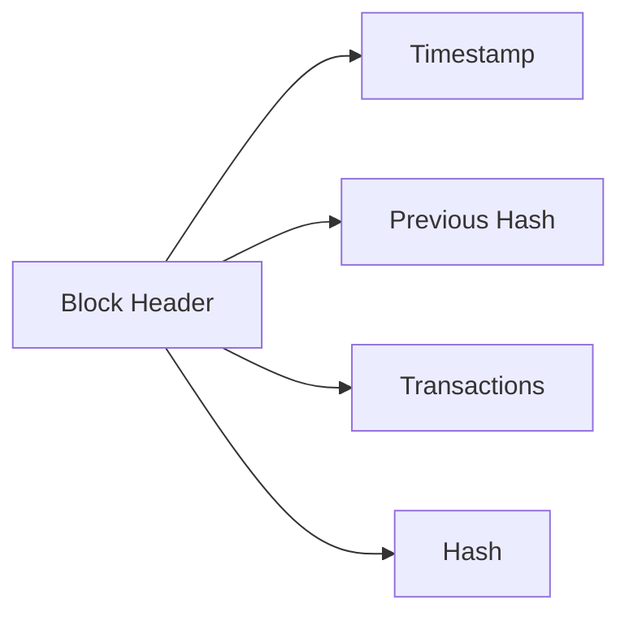

                 

### 引言与背景

**关键词：区块链，去中心化，设计原则，实践应用**

区块链技术，自2008年比特币的诞生以来，逐渐成为全球关注的焦点。它不仅改变了金融行业，还为众多领域带来了去中心化系统的全新思路。这本书《区块链技术：去中心化系统的设计原则与实践》旨在深入探讨区块链技术的核心原理、设计原则及其在各个领域的实际应用。本文将按照以下结构展开：

1. **区块链技术简介**
   - 历史与发展
   - 核心优势

2. **去中心化系统概述**
   - 定义
   - 特点

3. **设计原则与最佳实践**
   - 设计关键原则
   - 案例分析

4. **核心概念与技术原理**
   - 基础概念
   - 算法原理
   - 数学模型讲解

5. **应用实践**
   - 金融领域
   - 其他领域
   - 案例分析

6. **设计原则与最佳实践**
   - 设计原则
   - 最佳实践
   - 小结与展望

**摘要：**本文将详细介绍区块链技术的基本概念、去中心化系统的特点、设计原则与最佳实践，并通过具体案例分析，展示区块链技术在各个领域的应用实践。读者将深入了解区块链技术的核心原理和实际应用，为未来技术创新和行业应用提供参考。

----------------------------------------------------------------

## 1.1 区块链技术简介

### 1.1.1 区块链技术的历史与发展

区块链技术的起源可以追溯到2008年，当时一位名为中本聪（Satoshi Nakamoto）的匿名人物发布了比特币白皮书，正式提出了区块链的概念。比特币作为一种去中心化的数字货币，利用区块链技术实现了去中心化的交易验证和记账功能，从而打破了传统金融体系的垄断，引起了全球的关注。

**比特币的诞生**是区块链技术的第一次重要应用。比特币通过分布式网络实现了价值的转移，每一笔交易都会被记录在区块链上，这些记录是不可篡改的。这一特性保证了比特币交易的安全性，同时也降低了交易的成本。

随着比特币的成功，区块链技术开始受到更多领域和研究者的关注。2015年，以太坊（Ethereum）的诞生标志着区块链技术的又一次重大发展。以太坊不仅支持智能合约，还提供了一个去中心化的应用平台，使得开发者可以在这个平台上创建和部署各种去中心化应用（DApps）。

**以太坊的崛起**为区块链技术的发展注入了新的活力。智能合约使得区块链不再只是简单的交易记录工具，而成为了一个具有计算能力的平台。开发者可以利用智能合约实现各种复杂的业务逻辑，从而推动了区块链技术在金融、供应链、物联网等多个领域的应用。

**其他区块链项目**也在不断涌现，如瑞波币（Ripple）、EOS、Hyperledger Fabric等，这些项目都在不同层面上对区块链技术进行了优化和创新，推动了区块链技术的快速发展。

**历史发展**过程中，区块链技术从最初的比特币，到以太坊的智能合约，再到各种公链和联盟链，逐步形成了一个庞大的生态系统。这一过程不仅展示了区块链技术的创新潜力，也为未来区块链技术的应用奠定了基础。

### 1.1.2 区块链技术的核心优势

**去中心化**是区块链技术最核心的优势之一。在传统的集中式系统中，数据存储和计算能力集中在少数中心化的机构或服务器上，这些中心化的节点容易成为攻击的目标。而区块链技术通过分布式网络实现了数据的去中心化存储和计算，每个节点都保存了一份完整的区块链数据，从而提高了系统的安全性。

**不可篡改**是区块链技术的另一大优势。区块链上的数据一旦被记录，就难以被篡改。这是因为区块链采用了加密算法和共识机制，确保了数据的完整性和可靠性。任何对数据的篡改都会被其他节点检测到，从而被拒绝。

**透明性**也是区块链技术的一个重要特性。区块链上的每一笔交易都是公开透明的，任何人都可以查询和验证。这使得区块链技术非常适合需要透明性和公正性的应用场景，如金融、供应链管理等。

**可扩展性**是区块链技术的挑战之一，但也是一个重要的优势。随着区块链技术的发展，各种优化方案不断涌现，如分层架构、状态通道、Sharding等，这些方案都有助于提高区块链系统的可扩展性。

**低成本**是区块链技术的另一大优势。在传统的集中式系统中，交易费用通常较高，尤其是跨国交易，而区块链技术通过去中心化的方式，降低了交易的成本。

**自主性**是区块链技术的一个新兴优势。通过智能合约，用户可以在没有第三方干预的情况下执行合同，实现自动化和去中心化的业务流程。

### 1.1.3 区块链技术的未来发展趋势

随着区块链技术的不断发展和成熟，其应用场景也在不断扩展。以下是一些区块链技术的未来发展趋势：

**金融领域的深化应用**：区块链技术已经在金融领域得到了广泛的应用，如数字货币、跨境支付、供应链金融等。未来，区块链技术在金融领域的应用将进一步深化，特别是在支付清算、信用评估、风险管理等方面。

**供应链管理**：区块链技术可以为供应链管理提供透明的、不可篡改的记录，从而提高供应链的效率和透明度。未来，区块链技术在供应链管理中的应用将更加普及。

**物联网**：区块链技术可以为物联网设备提供安全、可靠的通信和数据存储方案。未来，区块链技术与物联网的结合将推动物联网的发展，实现更高效、更安全的设备互联。

**医疗健康**：区块链技术可以为医疗健康行业提供安全的病历记录和数据管理方案，从而提高医疗服务的质量和效率。

**政府与公共管理**：区块链技术可以为政府提供透明、高效的公共服务，如身份验证、选举投票等。未来，区块链技术在政府与公共管理中的应用将越来越广泛。

**数字身份**：区块链技术可以为用户提供安全的数字身份解决方案，从而实现跨平台的身份认证和数据交换。

**游戏与娱乐**：区块链技术可以为游戏和娱乐行业提供去中心化的内容创造和版权保护方案，从而激发更多的创新和创意。

**数字资产与数字货币**：随着数字货币的崛起，区块链技术将在数字资产和数字货币领域发挥重要作用，推动金融体系的变革。

总之，区块链技术的未来充满了无限可能。随着技术的不断进步和应用的不断拓展，区块链技术将为各行各业带来深远的影响。

----------------------------------------------------------------

## 1.2 去中心化系统概述

### 1.2.1 去中心化系统的定义

去中心化系统（Decentralized System），顾名思义，是一种不依赖于单一中心节点进行控制和管理的系统。在传统的集中式系统中，所有的数据和控制都集中在少数中心节点上，这些中心节点是系统运行的核心，一旦这些节点出现故障或被攻击，整个系统都可能瘫痪。而去中心化系统通过分布式的网络结构，实现了去中心化的控制和管理，从而提高了系统的可靠性、安全性和透明度。

去中心化系统的核心在于其去中心化的网络结构。在这个系统中，所有的参与者都可以平等地参与网络的运行和管理，没有一个节点具有特殊的权力。每个节点都可以保存一份完整的系统数据，并通过共识算法达成一致，从而实现数据的同步和更新。

### 1.2.2 去中心化系统的特点

去中心化系统具有以下几个显著的特点：

**去中心化控制**：在去中心化系统中，没有单一的中央控制机构或权威节点，所有节点都是平等的，并通过共识算法共同维护系统的运行。

**分布式数据存储**：去中心化系统将数据分散存储在多个节点上，而不是集中在一个中心节点。这使得系统具有较高的容错性和抗攻击性。

**高度透明**：去中心化系统的数据是公开透明的，所有的交易记录和系统状态都可以被所有节点查看和验证，从而提高了系统的透明度和可信度。

**安全性**：去中心化系统采用了加密算法和共识机制，确保了数据的安全性和完整性。任何对数据的篡改都会被其他节点检测到，从而被拒绝。

**可扩展性**：去中心化系统可以通过增加节点来扩展其处理能力，从而提高了系统的可扩展性。

**去中心化决策**：去中心化系统中的决策是通过所有节点共同参与和协商达成的，而不是由单一的中央机构做出。这使得系统的决策过程更加民主和公正。

### 1.2.3 区块链与去中心化系统

区块链技术是去中心化系统的一种典型实现。区块链通过分布式网络结构实现了去中心化的数据存储和计算，其核心特点与去中心化系统的特点高度契合。

**区块链的核心机制**：

- **去中心化控制**：区块链的运行不依赖于中心化的控制机构，而是通过网络中的所有节点共同维护。
- **分布式数据存储**：区块链上的数据被分散存储在各个节点上，确保了数据的不可篡改性和高度透明。
- **加密算法**：区块链采用了加密算法，确保了数据的隐私和安全。
- **共识算法**：区块链通过共识算法实现了节点之间的数据同步和一致性。

**去中心化系统的应用领域**：

- **金融领域**：区块链技术在金融领域的应用，如数字货币、跨境支付、智能合约等，极大地提高了金融服务的效率和安全性。
- **供应链管理**：区块链技术可以为供应链管理提供透明、不可篡改的记录，从而提高供应链的效率和透明度。
- **物联网**：区块链技术可以为物联网设备提供安全、可靠的通信和数据存储方案。
- **医疗健康**：区块链技术可以为医疗健康行业提供安全的病历记录和数据管理方案。
- **政府与公共管理**：区块链技术可以为政府提供透明、高效的公共服务。

总之，去中心化系统具有显著的优越性，其在金融、供应链、物联网、医疗健康等领域的应用正在不断拓展。随着区块链技术的不断发展和成熟，去中心化系统的应用前景将更加广阔。

----------------------------------------------------------------

## 1.3 设计原则与最佳实践

### 1.3.1 区块链系统设计的关键原则

在设计区块链系统时，必须遵循一系列关键原则，以确保系统的安全性、可靠性和高效性。以下是一些主要的设计原则：

**安全性**：区块链系统必须能够抵御各种形式的攻击，包括51%攻击、双花攻击、DDoS攻击等。为了实现这一目标，系统需要采用先进的加密算法和共识机制。

**去中心化**：区块链系统的设计应该避免中心化的风险，通过分布式网络结构确保所有节点具有平等的权利和责任。这不仅可以提高系统的抗攻击性，还可以提高系统的透明度和公平性。

**可扩展性**：区块链系统需要具备良好的可扩展性，以支持不断增长的用户和数据量。这可以通过优化网络架构、引入分片技术、状态通道等方式实现。

**透明性**：区块链系统的设计应该确保数据的透明性，所有节点都可以访问和验证系统的状态和交易记录，从而提高系统的可信度。

**可靠性**：区块链系统必须确保数据的完整性和一致性。通过采用高效的共识算法和冗余机制，可以确保系统在面临各种故障时仍然能够稳定运行。

**效率**：区块链系统的设计应该关注系统的运行效率，包括交易处理速度和数据传输速度。通过优化网络协议、减少冗余计算等方式，可以提高系统的效率。

**可恢复性**：区块链系统需要具备一定的可恢复性，以应对潜在的系统故障和错误。通过备份机制、恢复策略等，可以确保系统能够快速恢复到正常状态。

**隐私保护**：在区块链系统中，隐私保护是一个重要的挑战。系统设计时需要考虑如何保护用户的隐私，避免敏感信息被泄露。

**合规性**：区块链系统必须符合相关法律法规和行业标准，确保系统的合法性和合规性。

### 1.3.2 最佳实践案例分析

在实际的区块链系统设计中，遵循最佳实践是确保系统成功的关键。以下是一些典型的最佳实践案例：

**比特币**：比特币是第一个成功的区块链项目，其设计遵循了去中心化、安全性、透明性等原则。比特币采用了工作量证明（PoW）共识机制，确保了网络的安全性和去中心化。同时，比特币通过UTXO模型实现了简洁且安全的交易记录。

**以太坊**：以太坊不仅在区块链上实现了智能合约，还提供了一个去中心化的应用平台。以太坊采用了权益证明（PoS）共识机制，相比PoW具有更高的能效和安全性。以太坊的EVM（以太坊虚拟机）使得智能合约的开发和部署变得更加便捷。

**Hyperledger Fabric**：Hyperledger Fabric是IBM主导的一个开源区块链框架，主要用于企业级应用。Hyperledger Fabric采用了混合共识机制，结合了PoW和PoS的优点，同时引入了权限控制和链码（Chaincode）等创新设计，提高了系统的灵活性和安全性。

**Ripple**：Ripple是一个旨在改善跨境支付和汇款流程的区块链项目。Ripple采用了Ripple Protocol Consensus Algorithm（RPCA），能够在保证安全性的同时，实现高速的交易处理。Ripple的账本结构（Ledger）和路由算法（Payment Channel）设计都体现了高效性和可扩展性。

**案例一：医疗健康领域的应用**

某医疗健康项目采用Hyperledger Fabric作为底层区块链框架，实现了患者健康记录的去中心化管理和共享。项目设计遵循以下最佳实践：

- **数据加密**：患者健康记录在区块链上进行加密存储，确保数据隐私和安全。
- **权限控制**：通过Hyperledger Fabric的权限控制机制，确保只有授权的医疗工作人员可以访问和修改健康记录。
- **智能合约**：使用智能合约实现了医疗记录的自动审核和更新，提高了医疗服务的效率。
- **混合共识机制**：结合了PoW和PoS的共识机制，提高了系统的安全性和效率。

**案例二：供应链管理**

某供应链管理项目采用Ripple的区块链技术，实现了供应链上下游企业的透明、高效协作。项目设计遵循以下最佳实践：

- **透明性**：所有供应链交易记录都记录在区块链上，所有参与者都可以查看和验证。
- **高效性**：通过Ripple的账本结构和路由算法，实现了快速、低成本的交易处理。
- **可追溯性**：通过区块链的不可篡改性，确保供应链上每个环节的数据都是可追溯的，从而提高了供应链的透明度和可信度。
- **智能合约**：使用智能合约实现了供应链金融的自动化和去中心化，提高了供应链融资的效率。

### 1.3.3 小结与展望

区块链系统的设计原则和最佳实践是确保系统成功的关键。在实际应用中，我们需要根据具体场景和需求，灵活运用这些原则和实践，以实现系统的高效、安全、透明运行。随着区块链技术的不断发展和成熟，未来将有更多的应用场景和最佳实践涌现，为区块链技术的广泛应用提供坚实的基础。

----------------------------------------------------------------

## 2.1 区块链基础概念

### 2.1.1 区块与链结构

区块链技术的基本组成单元是“块”（Block）和“链”（Chain）。每个区块都包含一定数量的交易记录，这些交易记录经过验证后，被追加到区块链上，从而形成一条不断延长的链。

**块**：块是区块链的基本数据单元，每个块都包含一个时间戳、一个唯一标识符（通常为哈希值）、上一个块的哈希值、交易数据等。块的结构如下图所示：



**链**：链是多个区块按照时间顺序连接起来的结构。每个区块都包含一个指向其上一个区块的哈希值，从而形成一条单向链接的链结构。链的结构如下图所示：

```mermaid
sequenceDiagram
    A1->>A2: A2.previousHash = A1.hash
    A1->>A2: A2.timestamp = current time
    A1->>A2: A2.hash = compute hash of A2
    A1->>A3: A3.previousHash = A2.hash
    A2->>A3: A3.timestamp = current time
    A2->>A3: A3.hash = compute hash of A3
    A2->>A4: A4.previousHash = A3.hash
    A3->>A4: A4.timestamp = current time
    A3->>A4: A4.hash = compute hash of A4
    ...
```

每个新区块的生成都需要经过一系列的计算和验证过程，这通常包括：

1. **交易收集**：将网络中的交易数据收集到一个临时区块中。
2. **区块验证**：对区块中的交易数据进行验证，确保其合法性和有效性。
3. **区块生成**：通过计算找到一个满足特定难度的哈希值，将其作为区块的标识符。
4. **区块广播**：将新生成的区块广播到网络中的其他节点，进行共识和验证。

### 2.1.2 加密算法在区块链中的应用

加密算法是区块链技术的重要组成部分，用于确保数据的安全性和完整性。以下是一些常用的加密算法及其在区块链中的应用：

**哈希函数**：哈希函数是一种将任意长度的输入数据映射为固定长度的输出数据的函数。在区块链中，哈希函数主要用于生成区块的唯一标识符，确保数据的一致性和不可篡改性。常见的哈希函数包括SHA-256、SHA-3等。

**数字签名**：数字签名是一种用于验证消息来源和完整性的加密技术。在区块链中，数字签名用于确保交易数据的合法性和唯一性。每个参与者都有一对密钥（公钥和私钥），私钥用于生成签名，公钥用于验证签名。

**椭圆曲线加密**：椭圆曲线加密（ECC）是一种基于椭圆曲线数学的加密算法，相比传统的RSA加密算法，具有更高的安全性和效率。在区块链中，ECC常用于实现数字签名和加密通信。

**加密货币**：加密货币是区块链技术的典型应用之一。比特币和以太币等加密货币采用了哈希函数、数字签名和椭圆曲线加密等多种加密算法，确保了货币交易的安全性和匿名性。

### 2.1.3 智能合约原理

智能合约是区块链技术的另一个重要应用，它是一种在区块链上执行的自动执行合同。智能合约通过预先定义的规则和条件，自动执行合同条款，从而实现去中心化的业务流程。

**智能合约的工作原理**：

1. **编写合约**：开发者使用智能合约编程语言（如Solidity、Vyper等）编写智能合约代码，定义合约的功能和行为。
2. **部署合约**：将智能合约部署到区块链上，通过交易将合约代码和初始状态记录在区块链上。
3. **调用合约**：当满足合约中的条件时，外部参与者可以通过区块链网络调用合约函数，执行预定义的操作。
4. **执行结果**：合约执行的结果会被记录在区块链上，确保其不可篡改性和透明性。

**智能合约的应用场景**：

- **金融应用**：如去中心化交易平台、智能投资组合、数字货币等。
- **供应链管理**：如自动支付、质量验证、供应链融资等。
- **身份认证**：如电子身份验证、信用评分等。
- **法律和契约**：如智能合同、版权保护等。
- **其他应用**：如去中心化投票系统、去中心化存储等。

### 2.1.4 区块链的安全性和共识机制

区块链的安全性和共识机制是确保数据一致性和系统可靠性的关键。以下是一些主要的共识机制：

**工作量证明（PoW）**：PoW是一种通过计算工作量来达成共识的机制。节点需要通过解决复杂的数学问题来竞争生成新区块，从而获得记账权利。比特币采用的是PoW机制。

**权益证明（PoS）**：PoS通过持有代币的数量和时间来决定节点的记账权利。持有代币越多的节点或持有时间越长的节点，越有可能被选中生成新区块。以太坊2.0计划采用PoS机制。

**委托权益证明（DPoS）**：DPoS是一种改进的PoS机制，通过选举出若干个超级节点来生成区块，这些超级节点拥有更高的记账权利。

**实用拜占庭容错（PBFT）**：PBFT是一种基于多节点共识的机制，能够在拜占庭错误发生时，确保系统达成一致性。Hyperledger Fabric等企业级区块链平台常采用PBFT机制。

**其他共识机制**：如授权股权证明（PoSR）、验证权益证明（PoSRP）、混合共识机制等，这些机制在保证安全性和效率方面都有所改进。

通过以上对区块链基础概念的介绍，读者可以了解到区块链的核心组成部分及其工作原理。在接下来的章节中，我们将进一步探讨区块链的技术原理和应用实践。

----------------------------------------------------------------

## 2.2 区块链算法原理

### 2.2.1 共识算法

共识算法是区块链系统的核心，用于确保所有节点对区块链状态的一致性。不同的共识算法在安全、性能和去中心化程度上各有优劣。以下介绍几种主要的共识算法：

**1. 工作量证明（PoW）**

PoW是最早的共识算法，由比特币采用。其基本思想是节点通过计算找到满足特定条件的哈希值来竞争生成新区块。具体过程如下：

- **节点随机生成随机数**：每个节点都会尝试生成一个随机数。
- **计算哈希值**：对随机数和区块头（包含时间戳、上一个区块哈希值等）进行哈希运算。
- **检查哈希值是否符合条件**：如果哈希值的前若干位为0，则说明找到了一个有效的随机数，节点将尝试下一个随机数。
- **广播新区块**：一旦找到有效随机数，节点将广播新区块给网络中的其他节点。

**优点**：高度去中心化，安全可靠。

**缺点**：计算资源消耗巨大，能源消耗高，效率较低。

**2. 权益证明（PoS）**

PoS通过持有代币的数量和时间来决定节点的记账权利。持有代币越多或持有时间越长的节点，被选为验证者的概率越大。具体过程如下：

- **选举验证者**：根据节点的权益值（通常为代币数量乘以持有时间）进行排序，选取前若干名节点作为验证者。
- **验证区块**：验证者对区块进行验证，如果验证通过，则生成新区块。
- **奖励和惩罚**：如果验证者成功生成区块，将获得奖励；如果验证者作弊或验证失败，将面临惩罚。

**优点**：能源消耗低，效率较高。

**缺点**：可能存在“富者愈富”的问题，去中心化程度相对较低。

**3. 委托权益证明（DPoS）**

DPoS是对PoS的改进，通过选举产生超级节点来生成区块。具体过程如下：

- **选举超级节点**：节点投票选举出若干个超级节点。
- **超级节点轮流生成区块**：超级节点轮流生成区块，每个超级节点在一个特定时间段内负责生成区块。
- **奖励和惩罚**：超级节点成功生成区块后，获得奖励；如果作弊或验证失败，将面临惩罚。

**优点**：去中心化程度较高，效率较高。

**缺点**：选举机制可能导致权力过于集中。

**4. 实用拜占庭容错（PBFT）**

PBFT是一种多节点共识算法，能够在拜占庭错误发生时，确保系统达成一致性。具体过程如下：

- **选举主节点**：节点选举出一个主节点负责生成区块。
- **主节点生成区块**：主节点生成区块，并将区块发送给其他节点。
- **节点验证和确认**：其他节点对区块进行验证，如果验证通过，则发送确认消息给主节点。
- **达成共识**：当超过2/3的节点确认区块后，系统达成共识。

**优点**：高效、安全，适用于企业级应用。

**缺点**：需要至少3/4的节点诚实，否则系统可能无法达成共识。

### 2.2.2 哈希函数与 Merkle 树

哈希函数是区块链技术中的基础组件，用于生成区块的唯一标识符和确保数据的完整性。哈希函数具有以下特点：

- **单向性**：无法从哈希值反推出原始数据。
- **抗碰撞性**：不同的输入数据生成不同的哈希值。
- **抗篡改性**：一旦数据发生变化，哈希值也会发生变化。

**Merkle 树**（也称为哈希树）是一种基于哈希函数的数据结构，用于确保数据的完整性和验证数据块的根哈希。Merkle 树的构建过程如下：

1. **生成哈希值**：将数据块中的每个元素（如交易）计算其哈希值。
2. **构建树**：将哈希值两两组合，再次计算其哈希值，直到生成根哈希值。每层的哈希值都存储在上层节点上。
3. **验证**：当需要验证数据块的完整性时，可以计算数据的哈希值，并与Merkle 树的根哈希值进行比较，从而确保数据的完整性和一致性。

**Merkle 树的优点**：

- **高效验证**：通过Merkle 树，可以快速验证单个数据元素是否在数据块中，而不需要下载整个数据块。
- **数据压缩**：Merkle 树将大量数据压缩为单个根哈希值，从而减少了数据传输和存储的需求。

### 2.2.3 数据存储与网络通信

区块链的数据存储和网络通信是确保系统高效运行的重要环节。以下介绍相关技术和原理：

**数据存储**：

- **链式存储**：区块链采用链式存储结构，每个区块包含一个指向上一个区块的哈希值，从而形成一个链式结构。这种结构确保了数据的完整性和不可篡改性。
- **分片存储**：分片技术将区块链数据分成多个片段存储在分布式节点上，从而提高了数据的读取和写入速度。每个分片都有自己的哈希值，通过Merkle 树进行验证。

**网络通信**：

- **P2P网络**：区块链采用P2P（点对点）网络结构，每个节点都可以与其他节点直接通信，从而形成一个分布式网络。P2P网络确保了区块链的去中心化和高可用性。
- **Gossip协议**：Gossip协议是一种用于在P2P网络中广播消息的算法，通过随机选择邻居节点进行消息传播，从而快速扩散信息。

通过以上对区块链算法原理的介绍，读者可以了解到区块链系统的核心机制和工作原理。在接下来的章节中，我们将进一步探讨区块链的应用实践。

----------------------------------------------------------------

## 2.3 数学模型与公式讲解

### 2.3.1 区块链安全性的数学基础

区块链的安全性在很大程度上依赖于数学原理，尤其是密码学。以下是区块链安全性的一些核心数学基础：

**1. 非对称加密**

非对称加密是一种密码学技术，它使用一对密钥：公钥和私钥。公钥可以公开，而私钥必须保密。非对称加密的基本过程如下：

- **加密**：使用公钥对数据进行加密，只有相应的私钥可以解密。
- **解密**：使用私钥对加密数据进行解密，只有相应的公钥可以加密。

数学公式如下：

$$
c = E_k(p)
$$

$$
p = D_k(c)
$$

其中，$c$ 是加密后的数据，$p$ 是原始数据，$k$ 是密钥。

**2. 对称加密**

对称加密使用相同的密钥进行加密和解密。常见的方法有AES等。

数学公式如下：

$$
c = E_k(p)
$$

$$
p = D_k(c)
$$

**3. 哈希函数**

哈希函数将任意长度的输入数据映射为固定长度的输出数据。常见的哈希函数有SHA-256、SHA-3等。

数学公式如下：

$$
H = hash(data)
$$

**4. 数字签名**

数字签名是一种确保数据完整性和来源验证的密码学技术。它使用私钥对数据进行签名，公钥可以验证签名。

数学公式如下：

$$
s = sign(m, k)
$$

$$
v = verify(m, s, k)
$$

其中，$s$ 是签名，$m$ 是原始数据，$k$ 是私钥，$v$ 是验证结果。

### 2.3.2 智能合约的数学模型

智能合约是区块链上自动执行合同条款的计算机程序。其数学模型主要包括以下部分：

**1. 状态机模型**

智能合约可以被视为一个状态机，每个状态代表合约的一个特定状态。合约的转移规则定义了在特定条件下合约如何从一个状态转移到另一个状态。

数学模型如下：

$$
S = \{s_0, s_1, ..., s_n\}
$$

$$
T = \{(s_i, s_j) | 条件C_i\}
$$

其中，$S$ 是状态集，$T$ 是转移规则集。

**2. 事件触发模型**

智能合约通过事件触发来执行特定的操作。每个事件都包含一个触发条件和一系列的操作。

数学模型如下：

$$
E = \{e_1, e_2, ..., e_m\}
$$

$$
O_e = \{o_{e1}, o_{e2}, ..., o_{ek}\}
$$

其中，$E$ 是事件集，$O_e$ 是事件 $e$ 的操作集。

### 2.3.3 区块链网络模型的数学模型

区块链网络模型主要涉及节点、链和共识机制等方面。以下是一个简化的数学模型：

**1. 节点模型**

节点是区块链网络的基本组成单元，每个节点维护一份完整的区块链数据。

数学模型如下：

$$
N = \{n_1, n_2, ..., n_k\}
$$

其中，$N$ 是节点集。

**2. 链模型**

区块链是一个链式结构，每个区块包含一个指向上一个区块的哈希值。

数学模型如下：

$$
B = \{b_1, b_2, ..., b_n\}
$$

$$
b_i.previousHash = hash(b_{i-1})
$$

其中，$B$ 是区块集。

**3. 共识模型**

共识模型用于确保所有节点对区块链状态的一致性。常见模型有PoW、PoS、PBFT等。

数学模型如下：

$$
Consensus(N, B) = True
$$

其中，$Consensus(N, B)$ 表示网络 $N$ 对区块链 $B$ 的一致性。

通过以上数学模型的讲解，读者可以更深入地理解区块链的安全性和智能合约的工作原理。这些数学原理和模型是区块链技术的基础，对于设计和分析区块链系统具有重要意义。

### 2.3.4 数学公式讲解与示例

为了更好地理解区块链中数学模型的应用，下面通过具体示例进行讲解。

**示例1：非对称加密**

假设有一个消息 $m = "Hello, World!"$，私钥为 $k_p$，公钥为 $k_e$。

- **加密过程**：

  $$c = E_{k_e}(m)$$

  假设加密结果为 $c = "加密后的消息"$。

- **解密过程**：

  $$p = D_{k_p}(c)$$

  解密结果为 $p = "Hello, World!"$。

**示例2：数字签名**

假设有一个消息 $m = "交易记录"$，私钥为 $k_s$。

- **签名过程**：

  $$s = sign(m, k_s)$$

  假设签名结果为 $s = "签名"$。

- **验证过程**：

  $$v = verify(m, s, k_e)$$

  假设验证结果为 $v = True$，说明签名有效。

**示例3：智能合约状态机模型**

假设智能合约有一个初始状态 $s_0$，以及两个事件 $e_1$ 和 $e_2$。

- **状态转移规则**：

  $$
  T = \{(s_0, s_1) | e_1\}
  $$
  $$
  T = \{(s_1, s_2) | e_2\}
  $$

- **事件触发**：

  $$
  O_{e_1} = \{操作1, 操作2\}
  $$
  $$
  O_{e_2} = \{操作3, 操作4\}
  $$

通过以上示例，读者可以更直观地理解区块链中数学模型的应用。

---

通过以上对区块链数学模型和公式的讲解，读者可以更好地理解区块链技术中的关键数学原理。这些原理为区块链系统的安全性和智能合约的实现提供了坚实的理论基础。在后续章节中，我们将继续探讨区块链的应用实践。

----------------------------------------------------------------

## 3.1 区块链在金融领域的应用

区块链技术在金融领域引发了深远的变革，其去中心化、透明性和安全性特性为传统金融体系带来了新的解决方案。以下将详细探讨区块链在金融领域的几个关键应用。

### 3.1.1 数字货币

数字货币是区块链技术在金融领域的最典型应用之一。比特币是最早的数字货币，它通过区块链网络实现了去中心化的货币发行和交易。数字货币的几个关键特性如下：

**去中心化发行**：数字货币的发行不依赖于中央银行或政府，而是通过共识算法在分布式网络中进行。这使得货币发行过程更加透明和公正。

**透明性**：区块链上的每一笔交易都是公开透明的，任何人都可查看和验证。这提高了金融交易的透明度，减少了欺诈和腐败的风险。

**安全性**：区块链采用了先进的加密算法，确保了交易数据的完整性和安全性。任何篡改交易记录的行为都会被其他节点检测并拒绝。

**可追溯性**：区块链上的交易记录具有高度的可追溯性，每个交易都可以追溯到具体的参与者和时间点。这有助于追踪资金流向，提高金融监管的效率。

数字货币的应用不仅限于支付和汇款，还扩展到了资产管理、证券交易等多个领域。以太坊的智能合约技术使得开发者可以在区块链上创建和部署各种去中心化金融应用（DeFi），进一步推动了数字货币的发展。

### 3.1.2 跨境支付

跨境支付一直是金融领域的一个痛点，因为传统的跨境支付系统通常需要经过多个中介机构，耗时且成本高昂。区块链技术的引入极大地改善了这一状况。

**高效性**：区块链通过点对点网络直接进行交易，无需经过多个中介，从而显著提高了支付速度。比特币网络可以实现几乎实时的跨境支付，而以太坊的智能合约技术使得支付过程更加自动化和高效。

**低成本**：传统跨境支付系统需要支付大量的中介费用，而区块链支付通过去中心化的方式大大降低了交易成本。以太坊上的智能合约支付甚至可以实现零手续费。

**透明性**：区块链上的支付记录是公开透明的，所有参与者和监管机构都可以查看和验证。这提高了跨境支付的可追溯性和透明度。

**安全性**：区块链的加密算法确保了支付数据的安全性和完整性，任何篡改支付记录的行为都会被检测和拒绝。

### 3.1.3 供应链金融

区块链技术在供应链金融中的应用，旨在提高供应链的透明度和效率，减少金融风险。

**透明性**：区块链技术为供应链上的每一个环节都提供了透明的记录，从原材料采购到产品交付，所有交易和物流信息都可以被记录和追踪。这有助于确保供应链的透明度和可追溯性，减少欺诈和错误。

**可追溯性**：区块链上的数据具有高度的可追溯性，可以追溯到每个环节的具体参与者和时间点。这有助于金融机构更好地评估风险，提高信贷决策的准确性。

**效率**：通过区块链技术，供应链金融中的贷款和支付过程可以实现自动化和去中心化。智能合约可以根据预设的条件自动执行贷款和支付操作，大大提高了效率。

**风险降低**：区块链技术通过去中心化和透明性，降低了供应链金融中的信息不对称和金融风险。金融机构可以更准确地评估借款人的信用状况，减少信贷风险。

### 3.1.4 其他金融应用

除了上述应用，区块链技术在金融领域还有许多其他应用，如：

- **智能合约**：通过智能合约，可以自动执行复杂的金融交易，如期权、期货等，减少了人工干预和操作风险。
- **股权代币化**：将公司的股权代币化，使其可以像数字货币一样进行交易和流通，提高了股权的流动性。
- **资产追踪**：利用区块链技术，可以实现对各种资产（如房地产、艺术品等）的追踪和认证，提高了资产的安全性和透明度。
- **数字身份验证**：通过区块链技术，可以实现更安全、更便捷的数字身份验证，减少欺诈和身份盗窃的风险。

总之，区块链技术在金融领域的应用不仅提高了金融服务的效率和安全性，还推动了金融体系的创新和发展。随着技术的不断进步和应用场景的拓展，区块链在金融领域的潜力将更加巨大。

----------------------------------------------------------------

## 3.2 区块链在其他领域的应用

区块链技术以其去中心化、透明性、不可篡改等特性，正在逐渐渗透到各个行业，改变着传统业务模式和操作流程。以下将详细介绍区块链在物联网、艺术品鉴定、智慧城市等领域的应用。

### 3.2.1 物联网

物联网（IoT）是指通过传感器、设备和其他智能设备相互连接，实现数据交换和通信的系统。区块链技术在物联网中的应用，主要解决了数据安全性、可信性和数据共享等问题。

**数据安全性**：在物联网中，设备产生的数据量庞大且实时性强。传统的中心化存储和处理方式存在单点故障和易受攻击的风险。区块链通过分布式存储和加密算法，确保数据的安全性和完整性。每个设备都可以在区块链上存储其数据，并且这些数据无法被篡改。

**数据可信性**：区块链的透明性和不可篡改性，使得数据来源和数据真实性得到了保障。在物联网中，设备之间的通信和数据交换可以通过区块链进行验证，确保数据的可信性。例如，在智能家居系统中，可以通过区块链验证设备的操作是否来自合法用户。

**数据共享**：区块链提供了数据共享的新模式，不同的设备和平台可以共享同一份数据，避免了重复采集和存储。通过智能合约，物联网设备可以实现自动化的数据交换和协作，提高了系统的效率和灵活性。

**实际应用**：例如，在智能电网中，区块链技术可以用于电力交易和能源管理。每个电力交易都被记录在区块链上，确保交易的可追溯性和透明性。此外，区块链还可以用于车联网，实现车辆之间的实时通信和数据共享，提高交通管理的效率和安全性。

### 3.2.2 艺术品鉴定

艺术品鉴定一直是一个复杂且容易引发争议的领域。区块链技术的应用，为艺术品鉴定提供了新的解决方案。

**数据存证**：区块链可以作为艺术品数据的存证平台，记录艺术品的历史信息，如创作者、交易记录、展览记录等。这些数据一旦记录在区块链上，就无法被篡改，从而确保了艺术品的历史真实性和完整性。

**透明性**：区块链上的艺术品数据是公开透明的，所有相关方都可以查看和验证。这有助于消除艺术品鉴定过程中的信息不对称，提高交易的透明度和可信度。

**不可篡改性**：区块链的不可篡改性确保了艺术品数据的真实性。任何对数据的篡改都会被其他节点检测到，从而被拒绝。

**智能合约**：通过智能合约，艺术品的所有权转移可以自动化进行。一旦艺术品交易成功，智能合约将自动更新所有权信息，确保交易的合法性和安全性。

**实际应用**：例如，区块链技术已经应用于一些知名艺术品的鉴定和交易，如英国国家美术馆使用区块链技术记录艺术品的交易历史，从而提高其真实性认证。此外，区块链技术还应用于二手艺术品交易，确保交易过程的透明和公正。

### 3.2.3 智慧城市

智慧城市是指通过先进的信息技术，实现城市资源的高效管理和利用，提高居民生活质量。区块链技术在智慧城市中的应用，主要体现在数据管理、公共服务和城市管理等方面。

**数据管理**：区块链可以用于智慧城市中的数据管理和共享。例如，交通数据、环境数据、能源数据等都可以在区块链上进行存储和共享，确保数据的安全性和透明性。智能合约可以用于自动化数据交换和协作，提高数据处理效率。

**公共服务**：区块链技术可以用于智慧城市的公共服务，如身份验证、电子投票、智能合约等。通过区块链，可以提供更安全、更便捷的公共服务，提高政府与居民之间的互动效率。

**城市管理**：区块链技术可以用于智慧城市的城市管理，如智能交通管理、环境保护、能源管理等。通过区块链，可以实时监控和管理城市资源，提高城市管理的效率和透明度。

**实际应用**：例如，新加坡政府正在使用区块链技术进行电子投票，以提高选举的透明度和可信度。在纽约市，区块链技术被用于管理交通信号灯，通过智能合约实现交通灯的自动化调节，提高了交通效率。此外，区块链技术在水资源管理、能源管理等方面的应用也在不断拓展。

总之，区块链技术在物联网、艺术品鉴定、智慧城市等领域的应用，不仅提高了各行业的效率和透明度，还为这些领域带来了新的发展机遇。随着技术的不断进步，区块链的应用前景将更加广阔。

### 3.2.4 案例分析

以下是一些区块链在不同领域应用的案例，以展示其实际效果和影响。

**案例一：沃尔玛的食品溯源**

沃尔玛利用区块链技术建立了食品溯源系统，从农田到餐桌的全过程都可以在区块链上进行记录。消费者可以通过扫描商品二维码，查看食品的生产、加工、运输等详细信息。这不仅提高了食品的安全性和透明度，还增强了消费者的信任。

**案例二：泛泰（Pan Tao）艺术品交易平台**

泛泰艺术品交易平台利用区块链技术进行艺术品交易，确保交易过程的透明和公正。平台通过智能合约自动化执行交易协议，减少了人工干预和纠纷。此外，区块链记录了艺术品的完整交易历史，有助于确保艺术品的真实性和价值。

**案例三：爱丁堡智慧城市项目**

爱丁堡智慧城市项目利用区块链技术进行能源管理和公共服务的优化。通过智能合约，居民可以方便地购买和出售电力，实现能源的优化利用。此外，区块链技术还用于管理交通信号灯，实现交通的智能调控，提高了交通效率。

**案例四：微软的物联网平台**

微软的物联网平台利用区块链技术进行设备数据的管理和共享。通过区块链，设备可以安全地传输和存储数据，避免了数据泄露和篡改的风险。此外，区块链还用于设备之间的通信和协作，提高了物联网系统的效率和可靠性。

**案例五：荷兰土地注册处**

荷兰土地注册处使用区块链技术进行土地登记和交易。区块链上的土地登记信息具有高度透明性和不可篡改性，确保了土地交易的合法性和安全性。此外，区块链技术简化了土地登记流程，提高了登记效率。

通过以上案例分析，可以看出区块链技术在各个领域的应用，不仅提高了效率和透明度，还为传统业务模式带来了深刻的变革。

----------------------------------------------------------------

## 4.1 区块链系统设计原则

在设计区块链系统时，必须遵循一系列关键原则，以确保系统的安全性、可靠性、可扩展性和用户体验。以下是区块链系统设计中的一些主要原则：

### 4.1.1 可扩展性设计

区块链系统需要能够应对不断增长的用户和数据量，因此可扩展性是一个重要的设计原则。以下是一些实现可扩展性的方法：

**1. 分片技术**：分片技术将区块链数据分成多个片段，每个片段由不同的节点维护。这样可以提高数据处理的并行度，从而提高系统的吞吐量。

**2. 状态通道**：状态通道是一种在链下进行交易的机制，通过预付押金和链上结算的方式，减少了链上交易的数量，从而提高了系统的性能。

**3. 跨链技术**：跨链技术允许不同区块链之间的数据交换和协作，从而实现更大范围的可扩展性。

**4. 高效共识算法**：选择高效且安全的共识算法，可以减少节点间通信的成本和时间，提高系统的可扩展性。

### 4.1.2 安全性设计

区块链系统的安全性是确保数据完整性和系统可靠性的关键。以下是一些实现安全性的方法：

**1. 加密算法**：使用先进的加密算法（如椭圆曲线加密、SHA-256等）来保护数据的安全性和隐私。

**2. 共识机制**：选择合适的共识机制，如工作量证明（PoW）、权益证明（PoS）等，确保系统在面临攻击时仍然能够保持一致性。

**3. 防御常见攻击**：设计系统时，需要考虑并防御常见攻击，如双花攻击、DDoS攻击、51%攻击等。

**4. 智能合约安全性**：智能合约是区块链系统中的关键组件，需要确保其安全性。可以通过形式化验证、代码审计等方式提高智能合约的安全性。

### 4.1.3 去中心化设计

去中心化是区块链技术的一个核心优势，也是设计原则之一。以下是一些实现去中心化的方法：

**1. 节点分布式**：确保区块链系统的节点分布广泛，避免中心化节点的出现。

**2. 权限控制**：通过权限控制机制，确保所有节点都具有平等的权利和义务，避免权力过于集中。

**3. 共识算法**：选择适合的去中心化共识算法，确保系统能够在去中心化的网络环境中保持一致性。

**4. 防止恶意节点**：设计系统时，需要考虑如何防止恶意节点的影响，如通过去中心化治理机制、惩罚机制等。

### 4.1.4 透明性设计

透明性是区块链系统的另一个重要原则，它提高了系统的可信度和用户的信任度。以下是一些实现透明性的方法：

**1. 数据公开**：将区块链上的交易记录、状态信息等数据公开，使所有用户都可以查看和验证。

**2. API接口**：提供开放的API接口，方便开发者和其他系统接入区块链，实现数据的共享和协作。

**3. 智能合约审计**：智能合约的代码应该公开，并进行第三方审计，确保其透明性和安全性。

**4. 账本浏览**：提供用户友好的账本浏览工具，方便用户查看区块链上的数据，提高系统的透明度。

### 4.1.5 可恢复性设计

区块链系统需要具备一定的容错能力和恢复能力，以应对潜在的故障和错误。以下是一些实现可恢复性的方法：

**1. 数据备份**：定期备份区块链数据，确保在系统故障时能够快速恢复。

**2. 集群部署**：通过集群部署，实现高可用性和负载均衡，提高系统的容错能力。

**3. 异地备份**：将数据备份到异地服务器，防止数据因本地故障而丢失。

**4. 恢复策略**：设计合理的恢复策略，如自动恢复、人工干预等，确保系统能够快速恢复到正常状态。

通过遵循这些设计原则，区块链系统可以实现更高的安全性、可靠性、可扩展性和用户体验。这些原则不仅适用于区块链系统的设计，也为其他分布式系统的设计提供了有益的参考。

### 4.1.6 小结与展望

区块链系统设计需要综合考虑安全性、去中心化、透明性、可扩展性和可恢复性等多个方面。每个设计原则都有其独特的重要性，且相互关联。例如，去中心化和安全性相互依赖，一个真正去中心化的系统必须能够抵御各种攻击和故障，同时保持数据的一致性和完整性。

未来的区块链系统设计将更加注重用户体验和系统性能的优化。随着技术的发展，我们可以期待更多的创新设计，如更高性能的共识算法、更高效的加密算法、更智能的智能合约等。此外，跨链技术和多链系统也将成为研究的重点，以实现不同区块链之间的无缝协作和资源共享。

总之，区块链系统设计是一个复杂且不断发展的领域，需要持续的创新和优化。通过遵循设计原则，我们可以构建出高效、安全、可靠的区块链系统，为未来的数字经济和智慧社会提供坚实的基础。

----------------------------------------------------------------

## 4.2 最佳实践与案例分析

### 4.2.1 设计最佳实践

在设计区块链系统时，遵循最佳实践是确保系统成功的关键。以下是一些值得遵循的最佳实践：

**1. 明确系统目标**：在系统设计之初，明确系统的目标和应用场景。这有助于确定系统所需的功能、性能和安全要求。

**2. 选择合适的共识机制**：根据系统需求，选择适合的共识机制，如PoW、PoS、DPoS等。每种机制都有其优缺点，需要根据实际情况进行选择。

**3. 优化网络架构**：设计高效的网络架构，如采用P2P网络、优化传输协议等，以提高系统的性能和可靠性。

**4. 确保数据安全**：使用先进的加密算法和隐私保护技术，确保数据在传输和存储过程中的安全性。

**5. 智能合约安全**：对智能合约进行严格的审计和测试，避免潜在的安全漏洞。可以考虑使用形式化验证工具进行安全验证。

**6. 系统测试与优化**：在系统上线前进行充分的测试，包括功能测试、性能测试和安全测试，确保系统在各种场景下都能稳定运行。

**7. 持续维护与更新**：区块链系统需要持续维护和更新，以应对新技术和新需求。定期进行系统检查和优化，确保系统的长期稳定性和安全性。

### 4.2.2 案例分析：以太坊与EOS

以太坊和EOS是两个备受关注的区块链平台，它们在设计和应用上都有许多值得借鉴的经验。

**以太坊（Ethereum）**

以太坊是一个开源的区块链平台，以其智能合约功能而闻名。以下是几个以太坊的最佳实践：

- **分层架构**：以太坊采用了分层架构，将核心共识层、智能合约层和应用层分离，提高了系统的灵活性和可扩展性。
- **GAS机制**：以太坊引入了GAS机制，用于支付智能合约执行所需的计算资源。这确保了系统的资源分配公平，并防止恶意攻击。
- **去中心化治理**：以太坊通过去中心化治理机制，使社区成员可以参与系统的决策，提高了系统的透明度和公正性。

**EOS**

EOS是一个高性能的区块链平台，旨在实现高效的去中心化应用。以下是EOS的一些最佳实践：

- **拜占庭容错（PBFT）**：EOS采用PBFT共识机制，确保了系统的高性能和高可用性。PBFT能够在少数拜占庭错误情况下保持一致性。
- **资源限制**：EOS通过资源限制，确保每个节点都能公平地获得计算资源和存储空间，从而避免了资源滥用和中心化。
- **权限控制**：EOS引入了权限控制机制，确保只有授权的用户可以执行特定操作，提高了系统的安全性。

**案例分析小结**

以太坊和EOS在区块链系统设计上各有特色，分别展示了不同设计原则的应用。以太坊的分层架构和智能合约功能为去中心化应用提供了丰富的可能性，而EOS的高性能和资源限制则为实际应用场景提供了高效解决方案。通过这些案例，我们可以看到遵循最佳实践对于构建成功区块链系统的重要性。

### 4.2.3 小结与展望

最佳实践和案例分析为我们提供了宝贵的经验和启示。在设计区块链系统时，需要根据具体需求和场景，灵活运用这些最佳实践，确保系统的安全性、可靠性、可扩展性和用户体验。随着区块链技术的不断发展和应用场景的拓展，未来的区块链系统设计将更加复杂和多样化。

持续关注新技术和新趋势，结合最佳实践，我们可以构建出更加高效、安全、可靠的区块链系统，为数字经济和智慧社会的发展贡献力量。未来，区块链技术将在金融、供应链、物联网、医疗健康等领域发挥更加重要的作用，推动社会进步和创新发展。

----------------------------------------------------------------

## 5.1 区块链技术的发展现状

### 5.1.1 技术成熟度评估

区块链技术自2008年比特币诞生以来，已经经历了十余年的发展。目前，区块链技术已从概念验证阶段逐步走向实际应用，并在多个领域取得了显著成果。

**成熟度评估**：

1. **基础技术**：区块链的基础技术，如加密算法、共识机制、智能合约等，已经相对成熟。这些技术为区块链系统的安全性和功能性提供了坚实的基础。
2. **应用场景**：区块链技术在金融、供应链、物联网、医疗健康等领域的应用已经相对广泛。许多企业已经开始部署区块链系统，解决传统业务模式中的痛点。
3. **性能优化**：虽然区块链系统在性能上仍有待提升，但通过分片技术、状态通道、跨链技术等优化方案，系统的性能正在不断改进。
4. **安全性**：区块链系统的安全性仍然是关键问题。随着攻击手段的日益复杂，系统需要持续改进和完善，以确保数据的安全性和系统的可靠性。
5. **用户体验**：区块链系统的用户体验仍有待提高。用户界面、操作流程等需要进一步优化，以降低用户使用门槛。

### 5.1.2 行业应用现状

区块链技术在各个行业的应用现状如下：

**金融领域**：区块链技术已经在金融领域得到广泛应用，如数字货币、跨境支付、供应链金融、信用评估等。比特币和以太坊等区块链平台已经成为金融科技的重要组成部分。

**供应链管理**：区块链技术为供应链管理提供了透明、高效、安全的解决方案。通过区块链，企业可以实现供应链全过程的追踪和验证，提高供应链的透明度和可信度。

**物联网**：区块链技术为物联网设备提供了安全、可靠的通信和数据存储方案。通过区块链，物联网设备可以实现数据的去中心化存储和共享，提高系统的安全性和效率。

**医疗健康**：区块链技术在医疗健康领域应用广泛，如病历管理、药品溯源、健康数据共享等。通过区块链，可以实现医疗数据的安全存储和共享，提高医疗服务的质量和效率。

**政府与公共管理**：区块链技术为政府与公共管理提供了透明、高效的解决方案。例如，区块链技术可以用于身份验证、选举投票、公共服务等，提高政府的运作效率和公信力。

**艺术与版权**：区块链技术为艺术品鉴定和版权保护提供了新的手段。通过区块链，艺术家和版权持有者可以确保作品的真实性和唯一性，提高版权保护的水平。

**其他领域**：区块链技术在房地产、能源管理、教育认证等领域也表现出巨大的潜力。随着技术的不断发展和应用场景的拓展，区块链技术的应用领域将更加广泛。

### 5.1.3 技术发展趋势

未来，区块链技术将在以下几个方面继续发展：

**1. 性能优化**：随着区块链应用场景的扩大，性能优化将成为重要的发展方向。通过分片技术、状态通道、跨链技术等，区块链系统的性能将得到显著提升。

**2. 安全性提升**：随着区块链技术的普及，安全性问题将日益凸显。未来，区块链技术将在安全性方面进行更多研究和改进，以应对各种潜在的安全威胁。

**3. 跨链协作**：跨链技术将实现不同区块链之间的数据交换和协作，从而打破孤岛效应，提高区块链系统的整体效能。

**4. 智能合约发展**：智能合约技术将在未来得到进一步发展，包括更复杂的逻辑处理、更好的安全性等。智能合约的应用场景将更加广泛，推动区块链技术的创新。

**5. 用户体验改善**：随着区块链技术的普及，用户体验将得到更多关注。未来，区块链系统的用户界面、操作流程等将更加友好，降低用户使用门槛。

**6. 法规与标准化**：随着区块链技术的应用扩大，相关法规和标准化工作也将逐步完善。这将为区块链技术的应用提供更加明确的法律框架，促进其健康发展。

总之，区块链技术正处于快速发展阶段，未来将在更多领域发挥重要作用。通过不断优化和完善，区块链技术将为社会带来更多创新和变革。

----------------------------------------------------------------

## 5.2 未来展望

### 5.2.1 技术创新趋势

随着区块链技术的不断成熟，未来区块链技术将在多个方面迎来重要创新：

**1. 高性能区块链**：通过优化共识算法、分片技术、状态通道等，未来区块链系统将实现更高的性能和吞吐量，以满足大规模商业应用的需求。

**2. 跨链互操作性**：跨链技术将进一步发展，实现不同区块链之间的无缝协作和数据交换，打破孤岛效应，构建更加统一的区块链生态系统。

**3. 去中心化身份（DID）**：去中心化身份技术将提供更安全、更便捷的身份验证解决方案，有望在数字身份管理、隐私保护等领域发挥重要作用。

**4. 智能合约进化**：智能合约技术将朝着更智能、更安全的方向发展，包括支持复杂业务逻辑、增强安全验证等，为去中心化应用提供更强有力的支持。

**5. 区块链与人工智能（AI）融合**：区块链与人工智能技术的融合将推动新应用场景的出现，如智能合约自动化执行、去中心化人工智能网络等。

### 5.2.2 行业发展机遇与挑战

区块链技术在未来发展中，将带来诸多机遇，同时也面临一定的挑战：

**1. 机遇**

- **金融科技**：区块链技术将为金融科技带来革命性变革，如数字货币、跨境支付、智能投顾等，提高金融服务的效率和安全。
- **供应链管理**：区块链技术将提高供应链的透明度和可信度，推动供应链金融和物流管理等领域的创新。
- **物联网**：区块链技术将提高物联网设备的数据安全和可信性，促进物联网生态系统的发展。
- **医疗健康**：区块链技术将提高医疗健康数据的安全存储和共享，推动个性化医疗和健康管理的创新。
- **政府与公共管理**：区块链技术将为政府与公共管理提供透明、高效的解决方案，如电子投票、公共服务等。

**2. 挑战**

- **技术成熟度**：虽然区块链技术已经取得一定成果，但其在性能、安全性、易用性等方面仍有待提高。
- **法律法规**：当前全球对区块链技术的法律法规尚不完善，如何规范区块链技术的发展和应用是一个重要挑战。
- **用户接受度**：区块链技术的普及度仍然较低，用户接受度和使用习惯需要进一步培养。
- **生态建设**：区块链技术需要建立完善的生态体系，包括开发者社区、技术服务提供商、行业联盟等。

### 5.2.3 未来展望

未来，区块链技术将在多个领域发挥重要作用，成为数字经济和智慧社会的重要基础设施：

**1. 经济领域**：区块链技术将重塑金融体系，推动数字货币、智能投资、供应链金融等领域的创新发展。

**2. 社会治理**：区块链技术将提高公共服务的透明度和效率，如电子投票、公共服务记录等。

**3. 物联网与智能城市**：区块链技术将为物联网和智能城市提供安全、可靠的解决方案，推动智能交通、智能能源等领域的创新。

**4. 医疗健康**：区块链技术将提高医疗健康数据的共享和安全，推动个性化医疗和健康管理的进步。

**5. 文艺与版权**：区块链技术将保护艺术作品和版权，推动数字艺术和版权经济的繁荣。

总之，区块链技术具有巨大的发展潜力，未来将在多个领域带来深刻的变革。通过技术创新、政策支持和产业协同，区块链技术有望成为推动社会进步和经济发展的重要力量。

----------------------------------------------------------------

## 总结

本文系统地探讨了区块链技术的核心概念、设计原则、应用实践以及未来发展趋势。从区块链的基本组成单元“块”和“链”，到加密算法、共识机制、智能合约等关键技术，我们深入分析了区块链系统的运作原理和安全性保障。同时，通过金融领域、物联网、艺术品鉴定、智慧城市等多个应用案例，展示了区块链技术在实际中的应用效果和潜在价值。

区块链技术的去中心化、透明性和不可篡改性，使其在金融、供应链、医疗健康、政府与公共管理等领域展现出巨大的应用潜力。随着技术的不断成熟和创新，区块链将为数字经济和智慧社会的发展提供强有力的支持。

我们强调，在设计区块链系统时，需要遵循安全性、去中心化、透明性、可扩展性和可恢复性等设计原则，以确保系统的稳定性和可靠性。同时，通过最佳实践和案例分析，我们可以借鉴成功的经验，为区块链系统的设计提供有益的指导。

未来，随着区块链技术的不断进步，我们期待其在更多领域的广泛应用，为社会的创新发展注入新的活力。通过持续的技术创新和政策支持，区块链技术有望成为推动社会进步和经济发展的重要引擎。

---

**作者：AI天才研究院/AI Genius Institute & 禅与计算机程序设计艺术 /Zen And The Art of Computer Programming** 

感谢您的阅读，希望本文能够为您的区块链技术学习和应用提供有价值的参考。在探索区块链技术的道路上，我们共同前行。如果您有任何疑问或建议，欢迎留言交流。让我们共同推动区块链技术的发展，共创美好未来！

