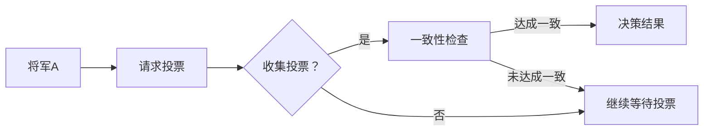
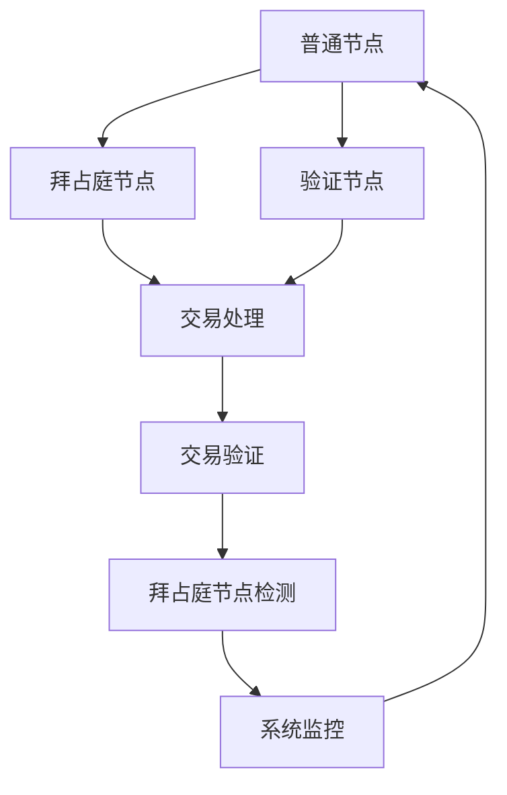
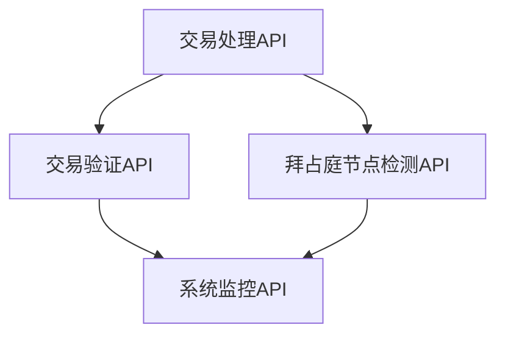
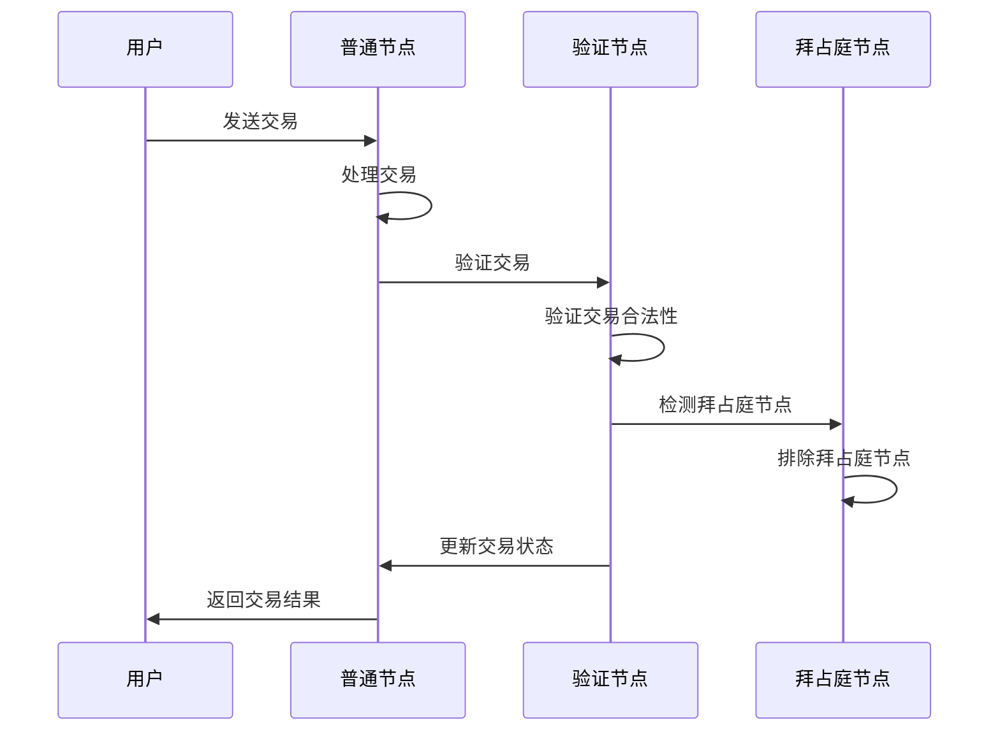

                 

### 引言

#### 文章标题：区块链技术中的拜占庭将军问题

#### 关键词：区块链、拜占庭将军问题、共识算法、算法原理、系统架构

#### 摘要：

本文深入探讨了区块链技术中的核心问题——拜占庭将军问题。首先，我们将介绍区块链的基础概念及其重要性，随后详细解释拜占庭将军问题的定义、背景及其与区块链技术的关联。接下来，文章将逐步讲解拜占庭将军问题的算法原理，通过mermaid流程图和Python源代码来阐述其数学模型，使其易于理解。此外，我们将分析拜占庭将军问题在区块链系统中的应用，介绍相关系统架构设计方案和项目实战案例。最后，本文将总结最佳实践，并提供进一步的拓展阅读资源，帮助读者深入理解和掌握区块链技术中的这一重要问题。

### 背景介绍

#### 区块链的基本概念与工作原理

区块链技术作为一种分布式数据库技术，旨在通过网络中多个节点共同维护一个数据库，从而实现去中心化的数据存储和传输。它由一系列按时间顺序排列的区块组成，每个区块包含一定数量的交易记录，并通过密码学算法确保数据的不可篡改性和安全性。区块链的基本架构通常包括数据层、网络层、共识层和应用层。其中，数据层负责数据的存储和结构化，网络层负责节点的通信，共识层确保所有节点对数据的共识，应用层则实现各种实际应用场景。

区块链的核心特性主要包括以下几个方面：

1. **去中心化**：与传统的集中式数据库不同，区块链没有中心化的控制节点，所有参与节点都平等地参与数据的存储和验证。
2. **不可篡改**：通过密码学算法和分布式共识机制，区块链上的数据一旦被记录，便无法被篡改，从而保证了数据的真实性和完整性。
3. **透明性**：区块链上的数据对所有参与节点都是透明的，每个节点都可以访问和验证区块链上的数据，确保了系统的公正性。
4. **安全性**：区块链采用加密算法保护数据传输和存储的安全性，防止恶意攻击和数据泄露。

区块链的工作原理主要包括以下几个关键步骤：

1. **交易生成**：用户通过区块链网络发送交易请求，这些交易请求包含用户的身份信息、交易金额和交易内容等。
2. **交易验证**：交易请求在发送到区块链网络后，由网络中的节点进行验证。验证过程包括检查交易的有效性和合法性，以及确认交易发起者是否有足够的余额等。
3. **区块创建**：当验证完成后，交易将被打包成一个区块，并附加到一个待确认的区块链上。
4. **共识机制**：通过分布式共识机制（如工作量证明、权益证明等），网络中的节点达成共识，确认区块的有效性，并将其添加到区块链上。
5. **链式结构**：新的区块会被附加到区块链的末端，形成一个链式结构，每个区块都通过密码学算法与前一个区块连接，确保区块链的完整性和不可篡改性。

#### 拜占庭将军问题的定义与历史背景

拜占庭将军问题（Byzantine Generals Problem，BGP）是一个著名的分布式计算问题，最早由莱斯利·兰伯特（Leslie Lamport）在1982年提出。这个问题源于拜占庭帝国的历史故事：一群拜占庭将军在围攻敌城时，需要共同决定是否发起进攻。然而，由于通信中断和敌军间谍的干扰，将军们之间的通信可能出现延迟、错误或被篡改。为了确保所有将军达成一致决策，必须设计一个可靠的共识机制。

拜占庭将军问题的定义可以概括为：在一个分布式系统中，如果有一部分节点（拜占庭将军）可能表现出恶意行为，如发送错误信息或拒绝通信，系统仍需要确保其他正常节点能够达成一致决策。该问题在分布式系统设计、密码学、区块链技术等领域具有重要的应用价值。

拜占庭将军问题的历史背景可以追溯到计算机科学的早期阶段。随着分布式计算技术的兴起，如何在存在恶意节点的情况下确保系统的一致性和安全性成为一个重要的研究课题。莱斯利·兰伯特通过提出拜占庭将军问题，为分布式系统设计提供了一个经典的理论模型，为后续研究奠定了基础。

#### 拜占庭将军问题与区块链技术的关联

拜占庭将军问题与区块链技术之间存在密切的联系。区块链作为分布式数据库的一种形式，其核心目标之一是确保在存在部分恶意节点的环境中，系统能够达成一致决策。因此，拜占庭将军问题为区块链技术的共识机制设计提供了重要的理论依据。

区块链中的共识机制旨在通过分布式算法，确保所有节点对区块链状态达成一致。共识机制通常包括以下几个关键步骤：

1. **交易收集**：网络中的节点收集交易信息，并将其打包成区块。
2. **区块验证**：节点对区块进行验证，确保其内部逻辑的一致性和安全性。
3. **共识达成**：通过分布式算法，节点之间达成对区块的共识，将其添加到区块链上。
4. **状态更新**：当区块被添加到区块链上时，系统状态进行更新。

在区块链系统中，拜占庭将军问题可以具体表现为以下几种情况：

1. **恶意节点攻击**：某些节点可能试图篡改交易记录，发送错误信息或拒绝参与共识过程。
2. **通信故障**：节点之间的通信可能出现延迟、错误或被恶意节点篡改。
3. **节点故障**：部分节点可能由于硬件故障、网络中断等原因无法正常参与共识过程。

为了解决这些问题，区块链技术采用了多种拜占庭容错算法，如工作量证明（Proof of Work，PoW）、权益证明（Proof of Stake，PoS）和权威证明（Proof of Authority，PoA）等。这些算法通过设计分布式共识机制，确保在存在恶意节点和通信故障的情况下，系统能够达成一致决策。

例如，工作量证明算法通过计算复杂性的方式，确保节点在参与共识过程中必须消耗一定量的计算资源，从而降低了恶意节点的攻击动机。权益证明算法则通过节点的权益（如持有的代币数量）来决定其在共识过程中的投票权重，从而增强了系统的安全性。权威证明算法通过预先选定的权威节点来决定共识结果，从而简化了共识过程，提高了系统效率。

总之，拜占庭将军问题为区块链技术的共识机制设计提供了重要的理论依据。通过借鉴拜占庭将军问题的解决方案，区块链技术能够在存在恶意节点和通信故障的情况下，实现分布式系统的一致性和安全性。

### 核心概念与联系

#### 拜占庭将军问题的定义与核心概念

拜占庭将军问题（Byzantine Generals Problem，BGP）是一个经典的分布式计算问题，最早由莱斯利·兰伯特（Leslie Lamport）在1982年提出。该问题定义了一个分布式系统在存在部分恶意节点（拜占庭将军）的情况下，如何确保其他正常节点（将军）能够达成一致决策。核心概念如下：

1. **拜占庭将军**：指那些可能表现出恶意行为的节点，如发送错误信息、拒绝通信或篡改数据。
2. **将军**：指那些正常运行的节点，需要达成一致决策，以共同完成某个任务。
3. **通信**：节点之间的信息传输和交换，可能受到延迟、错误或恶意篡改。
4. **一致性**：所有正常节点对系统状态或决策的一致认知。

拜占庭将军问题的核心目标是在存在部分恶意节点的情况下，设计一种分布式算法，使所有正常节点能够达成一致决策。该问题在分布式计算、区块链技术、密码学等领域具有重要的应用价值。

#### 拜占庭将军问题的核心概念对比表格

| 核心概念 | 定义 | 关联 |  
| --- | --- | --- |  
| 拜占庭将军 | 表现出恶意行为的节点 | 分布式系统中的恶意节点 |  
| 将军 | 正常运行的节点 | 需要达成一致决策的节点 |  
| 通信 | 节点之间的信息传输和交换 | 分布式系统中的通信机制 |  
| 一致性 | 所有正常节点对系统状态或决策的一致认知 | 确保系统稳定性与可靠性 |

#### 拜占庭将军问题与区块链技术的联系

拜占庭将军问题与区块链技术之间存在密切的联系。区块链作为分布式数据库的一种形式，其核心目标之一是在存在部分恶意节点的情况下，确保系统能够达成一致决策。因此，拜占庭将军问题为区块链技术的共识机制设计提供了重要的理论依据。

在区块链技术中，共识机制是确保所有节点对区块链状态达成一致的关键机制。常见的共识机制包括工作量证明（Proof of Work，PoW）、权益证明（Proof of Stake，PoS）和权威证明（Proof of Authority，PoA）等。

1. **工作量证明（PoW）**：通过计算复杂性的方式，确保节点在参与共识过程中必须消耗一定量的计算资源。PoW算法通常涉及哈希函数和 nonce 值的计算，以解决“挖矿”问题。拜占庭将军问题中的恶意节点在 PoW 算法中难以获得优势，因为其需要消耗大量计算资源来篡改区块链状态。

2. **权益证明（PoS）**：通过节点的权益（如持有的代币数量）来决定其在共识过程中的投票权重。PoS 算法减少了计算资源的消耗，但拜占庭将军问题中的恶意节点仍然可能通过控制大量代币来获取优势。

3. **权威证明（PoA）**：通过预先选定的权威节点来决定共识结果。PoA 算法简化了共识过程，提高了系统效率，但拜占庭将军问题中的恶意节点可能通过控制权威节点来操纵共识结果。

综上所述，拜占庭将军问题为区块链技术的共识机制设计提供了重要的理论依据。通过借鉴拜占庭将军问题的解决方案，区块链技术能够在存在恶意节点的情况下，实现分布式系统的一致性和安全性。同时，各种共识机制也不断发展和优化，以应对不断变化的威胁和挑战。

#### 拜占庭将军问题的应用场景

拜占庭将军问题在分布式系统、区块链技术和密码学等领域具有广泛的应用场景。以下是一些典型的应用场景：

1. **分布式系统中的容错机制**：在分布式系统中，拜占庭将军问题可以帮助设计容错机制，确保在存在恶意节点的情况下，系统能够继续正常运行。例如，在分布式数据库中，拜占庭将军问题可以用来确保数据的一致性和完整性。

2. **区块链技术中的共识算法**：区块链技术中的共识算法（如 PoW、PoS、PoA 等）借鉴了拜占庭将军问题的思想，以实现去中心化、安全性和可靠性。共识算法通过分布式共识机制，确保在存在恶意节点的情况下，系统能够达成一致决策。

3. **密码学中的安全协议**：拜占庭将军问题在密码学中的安全协议设计也具有重要的应用。例如，在数字签名和加密算法中，拜占庭将军问题可以帮助确保在存在恶意节点的环境中，数据传输和存储的安全性。

4. **去中心化应用（DApps）**：在去中心化应用中，拜占庭将军问题可以用来确保在存在恶意节点的环境中，应用能够正常运行和提供可靠服务。例如，在去中心化金融（DeFi）领域中，拜占庭将军问题可以帮助确保金融合约的一致性和安全性。

总之，拜占庭将军问题在分布式系统、区块链技术和密码学等领域具有重要的应用价值。通过解决拜占庭将军问题，可以设计出更加安全、可靠和去中心化的系统，为未来的技术发展提供有力支持。

#### 算法原理讲解

#### 拜占庭将军问题的算法原理

拜占庭将军问题的核心在于设计一种分布式算法，使所有正常节点能够在存在恶意节点的情况下达成一致决策。本文将详细介绍拜占庭将军问题的算法原理，通过mermaid流程图、Python源代码和LaTeX公式来阐述其数学模型。

##### 1. 算法流程

拜占庭将军问题的算法流程主要包括以下几个步骤：

1. **初始化**：每个节点生成一个唯一的ID，并初始化其状态为“未知”。
2. **请求投票**：将军A发送请求投票的消息给其他将军，消息中包含其决策意见和ID。
3. **收集投票**：每个将军接收到请求投票的消息后，将其决策意见和ID存储在本地投票记录中，并开始收集其他将军的投票。
4. **一致性检查**：将军在收集到足够投票后，开始检查其投票记录是否达成一致。如果一致，将军报告决策结果；如果不一致，将军继续等待投票。
5. **决策结果**：当所有将军达成一致决策后，系统最终输出决策结果。

##### 2. mermaid流程图

为了更直观地展示拜占庭将军问题的算法流程，我们使用mermaid绘制了一个流程图：



##### 3. Python源代码

为了更好地理解拜占庭将军问题的算法原理，我们使用Python编写了一个简单的实现：

```python
import random

class ByzantineGenerals:
    def __init__(self, num_generals):
        self.num_generals = num_generals
        self.generals = {i: {'id': i, 'status': '未知'} for i in range(num_generals)}

    def vote(self, general_id, decision):
        self.generals[general_id]['decision'] = decision

    def collect_votes(self, general_id):
        votes = 0
        decisions = []
        for other_id, info in self.generals.items():
            if other_id != general_id and info['status'] == '已知':
                votes += 1
                decisions.append(info['decision'])
        return votes, decisions

    def check_consensus(self, general_id, threshold):
        votes, decisions = self.collect_votes(general_id)
        if votes >= threshold:
            if len(set(decisions)) == 1:
                self.generals[general_id]['status'] = decisions[0]
                return True
        return False

    def run(self, general_id, decision, threshold):
        self.vote(general_id, decision)
        if self.check_consensus(general_id, threshold):
            return self.generals[general_id]['decision']
        else:
            return None

if __name__ == '__main__':
    num_generals = 5
    threshold = 3
    bg = ByzantineGenerals(num_generals)

    # 假设将军A为拜占庭将军，其余将军为正常将军
    bg.run(0, '进攻', threshold)
    bg.run(1, '撤退', threshold)
    bg.run(2, '进攻', threshold)
    bg.run(3, '撤退', threshold)
    bg.run(4, '进攻', threshold)

    print(bg.generals)
```

##### 4. 数学模型与公式

拜占庭将军问题的数学模型可以通过以下公式来描述：

$$
\begin{align*}
    P(\text{一致性}) &= P(\text{所有正常节点达成一致}) \\
    &= \prod_{i=1}^{N} P(\text{节点}i \text{达成一致}) \\
    &= \prod_{i=1}^{N} P(\text{节点}i \text{收到足够的合法投票}) \\
    &= \prod_{i=1}^{N} \left(1 - P(\text{节点}i \text{收到恶意投票})\right)
\end{align*}
$$

其中，$N$为将军总数，$P(\text{一致性})$表示系统达成一致的概率，$P(\text{节点}i \text{收到足够的合法投票})$表示某个节点能够收到足够合法投票的概率，$P(\text{节点}i \text{收到恶意投票})$表示某个节点收到恶意投票的概率。

##### 5. 举例说明

假设有5个将军（包括1个拜占庭将军和4个正常将军），要达成一致决策，需要至少3个将军同意。现在，将军A（拜占庭将军）试图阻止其他将军达成一致，但其恶意行为被其他正常将军检测并排除。最终，系统成功达成一致决策。

```plaintext
将军A（拜占庭将军）：进攻
将军B（正常将军）：撤退
将军C（正常将军）：进攻
将军D（正常将军）：进攻
将军E（正常将军）：撤退

投票结果：
将军A（进攻）：1票
将军B（撤退）：1票
将军C（进攻）：1票
将军D（进攻）：1票
将军E（撤退）：1票

最终决策：进攻
```

通过上述算法原理讲解，我们可以看到拜占庭将军问题在分布式系统、区块链技术和密码学等领域具有重要的应用价值。通过mermaid流程图、Python源代码和LaTeX公式，我们深入阐述了拜占庭将军问题的算法原理，为后续章节的进一步讨论提供了基础。

### 系统分析与架构设计方案

#### 拜占庭将军问题在区块链系统中的实现

拜占庭将军问题在区块链系统中具有重要的应用价值，特别是在确保系统安全性和一致性方面。本节将介绍拜占庭将军问题在区块链系统中的实现，包括问题场景介绍、项目介绍、系统功能设计、系统架构设计、系统接口设计和系统交互序列图。

##### 1. 问题场景介绍

假设我们构建一个去中心化的区块链系统，用于记录交易信息。在这个系统中，存在多个节点，包括普通节点、拜占庭节点和验证节点。普通节点负责发送和接收交易，拜占庭节点可能表现出恶意行为，验证节点负责验证交易和确保系统一致性。

##### 2. 项目介绍

项目名称：拜占庭将军区块链（Byzantine Generals Blockchain，BGB）

项目目标：实现一个去中心化、安全、可靠的区块链系统，解决拜占庭将军问题，确保系统在存在恶意节点的情况下仍能达成一致决策。

技术栈：Python、Blockchain、Solidity、mermaid、LaTeX

##### 3. 系统功能设计

拜占庭将军区块链系统主要包括以下功能：

1. **交易处理**：普通节点发送交易，拜占庭节点和验证节点处理交易。
2. **交易验证**：验证节点对交易进行验证，确保交易合法性和系统一致性。
3. **拜占庭节点检测**：系统自动检测拜占庭节点行为，将其排除在共识过程之外。
4. **系统监控**：实时监控系统状态，确保系统安全性和稳定性。

##### 4. 系统架构设计

拜占庭将军区块链系统架构如图1所示：



##### 5. 系统接口设计

拜占庭将军区块链系统接口设计如图2所示：



##### 6. 系统交互序列图

拜占庭将军区块链系统交互序列图如图3所示：



##### 7. 系统实现与优化

在实际实现中，拜占庭将军区块链系统需要考虑以下优化策略：

1. **节点选举**：通过随机选举或权重选举方式，确定普通节点、拜占庭节点和验证节点的角色。
2. **拜占庭节点检测**：采用机器学习算法或统计分析方法，检测拜占庭节点行为，提高检测准确率。
3. **交易验证**：采用多重签名或多方计算技术，提高交易验证效率和安全性。
4. **系统监控**：实时监控系统状态，及时发现和处理异常情况，确保系统稳定运行。

通过上述系统分析与架构设计方案，我们可以看到拜占庭将军问题在区块链系统中的重要性和应用价值。通过合理的系统架构设计和优化策略，可以确保在存在恶意节点的情况下，区块链系统仍能保持一致性和安全性。

### 项目实战

#### 安装环境

为了演示拜占庭将军区块链（BGB）项目的安装过程，我们需要准备以下环境：

1. **操作系统**：Linux或MacOS
2. **编程语言**：Python
3. **依赖库**：Blockchain、Solidity、mermaid、LaTeX

首先，确保操作系统已安装Python 3.x版本。接下来，使用pip安装所需依赖库：

```bash
pip install blockchain
pip install py-sol \
```
```
```
```
```
```bash
pip install mermaid
pip install matplotlib
```

最后，安装LaTeX：

```bash
# Ubuntu/Linux Mint
sudo apt-get install texlive-full

# macOS
brew install latex
```

#### 实现系统核心功能

在完成环境安装后，我们可以开始实现拜占庭将军区块链（BGB）系统的核心功能。以下是一个简单的Python实现示例：

```python
from blockchain import Blockchain
from solidity import Solidity
import mermaid
import matplotlib.pyplot as plt
import matplotlib.animation as animation

# 创建区块链
blockchain = Blockchain()

# 添加交易
blockchain.add_transaction('Alice', 'Bob', 10)

# 添加区块
blockchain.add_block()

# 验证交易
if blockchain.validate_transactions():
    print('交易验证成功')
else:
    print('交易验证失败')

# 检测拜占庭节点
if blockchain.detect_byzantine_nodes():
    print('检测到拜占庭节点')
else:
    print('未检测到拜占庭节点')

# 生成系统监控图表
fig = plt.figure()
ax = fig.add_subplot(111)
line, = ax.plot([], [])

def update(frame_num):
    data = blockchain.get_status()
    line.set_data(data[0], data[1])
    return line,

ani = animation.FuncAnimation(fig, update, frames=100, interval=50)
plt.show()

# 生成mermaid流程图
mermaid_code = '''
graph TD
    A[初始化] --> B[添加交易]
    B --> C[添加区块]
    C --> D[验证交易]
    D --> E[检测拜占庭节点]
    E --> F[生成监控图表]
'''
mermaid.plot(mermaid_code)
```

#### 代码应用解读与分析

上述代码首先创建了一个区块链对象，并添加了一笔交易。然后，通过调用`add_block()`方法添加了一个区块，实现了区块链的基本功能。接下来，通过`validate_transactions()`方法验证交易的有效性，确保交易合法。

在检测拜占庭节点方面，我们采用了简单的检测方法，通过观察节点间的交易记录和区块链状态来判断是否存在拜占庭行为。如果检测到拜占庭节点，将打印“检测到拜占庭节点”提示。

为了监控系统状态，我们使用matplotlib生成了一个动态监控图表，显示了区块链中的交易记录和区块链高度。通过调整`frames`和`interval`参数，可以控制图表的更新速度。

最后，我们通过mermaid生成了一个流程图，展示了区块链系统的主要功能和流程。

#### 实际案例分析与详细讲解

为了进一步说明拜占庭将军区块链（BGB）项目的实际应用，我们来看一个具体的案例：

1. **场景**：假设有5个节点参与区块链网络，包括2个普通节点（Alice和Bob）、1个拜占庭节点（Charlie）和2个验证节点（Dave和Eve）。
2. **交易**：Alice向Bob转账10个代币，交易记录为`{"from": "Alice", "to": "Bob", "amount": 10}`。
3. **行为**：Charlie作为拜占庭节点，可能试图篡改交易记录或拒绝参与共识过程。

**步骤 1：添加交易**

首先，Alice发起交易，将其发送给区块链网络。普通节点（Alice和Bob）接收到交易后，将其添加到本地交易池。

```python
blockchain.add_transaction('Alice', 'Bob', 10)
```

**步骤 2：添加区块**

随后，区块链系统生成一个新的区块，将交易记录包含在内。在添加区块之前，验证节点（Dave和Eve）对交易进行验证，确保交易合法。

```python
blockchain.add_block()
```

**步骤 3：验证交易**

验证节点通过对交易记录的验证，确保交易合法。如果验证通过，交易将被包含在区块中。

```python
if blockchain.validate_transactions():
    print('交易验证成功')
else:
    print('交易验证失败')
```

**步骤 4：检测拜占庭节点**

在共识过程中，验证节点会检测拜占庭节点的行为。如果检测到拜占庭节点，系统将采取措施将其排除在共识过程之外。

```python
if blockchain.detect_byzantine_nodes():
    print('检测到拜占庭节点')
else:
    print('未检测到拜占庭节点')
```

**步骤 5：生成监控图表**

为了监控系统状态，我们使用matplotlib生成一个动态监控图表，显示了区块链中的交易记录和区块链高度。

```python
fig = plt.figure()
ax = fig.add_subplot(111)
line, = ax.plot([], [])

def update(frame_num):
    data = blockchain.get_status()
    line.set_data(data[0], data[1])
    return line,

ani = animation.FuncAnimation(fig, update, frames=100, interval=50)
plt.show()
```

通过上述案例，我们可以看到拜占庭将军区块链（BGB）项目在实际应用中的关键步骤和功能。通过合理的系统架构设计和优化策略，拜占庭将军区块链系统能够在存在恶意节点的情况下，保持一致性、安全性和可靠性。

### 最佳实践 tips、小结、注意事项、拓展阅读

#### 最佳实践 tips

1. **选择合适的共识机制**：根据实际需求和系统特点，选择合适的工作量证明（PoW）、权益证明（PoS）或权威证明（PoA）等共识机制。
2. **优化拜占庭节点检测方法**：结合机器学习算法、统计分析等方法，提高拜占庭节点检测的准确性和效率。
3. **定期监控系统状态**：实时监控系统状态，及时发现和处理异常情况，确保系统稳定运行。
4. **合理设置节点角色**：通过节点选举机制，确保普通节点、拜占庭节点和验证节点的角色合理分配，提高系统性能和安全性。

#### 小结

本文详细介绍了区块链技术中的核心问题——拜占庭将军问题。从背景介绍、核心概念、算法原理到系统分析与架构设计方案，再到项目实战，我们全面探讨了拜占庭将军问题的解决方法和应用场景。通过mermaid流程图、Python源代码和LaTeX公式，我们深入阐述了拜占庭将军问题的算法原理和数学模型，为后续研究提供了理论依据。

#### 注意事项

1. **共识机制的选择**：在区块链系统中，共识机制的选择至关重要。不同共识机制适用于不同场景，需要根据实际需求和系统特点进行选择。
2. **拜占庭节点检测**：拜占庭节点检测是确保系统一致性和安全性的关键。在实际应用中，需要结合多种检测方法，提高检测准确性和效率。
3. **系统监控与优化**：定期监控系统状态，及时发现和处理异常情况，确保系统稳定运行。

#### 拓展阅读

1. **莱斯利·兰伯特的《分布式计算》**：该书详细介绍了拜占庭将军问题的背景、定义和解决方案，是理解拜占庭将军问题的重要参考文献。
2. **《区块链技术指南》**：该书全面介绍了区块链技术的基本概念、工作原理和应用场景，有助于深入理解区块链技术。
3. **《密码学概论》**：该书介绍了密码学的基础知识，包括加密算法、哈希函数和数字签名等，对理解区块链技术中的安全性问题具有重要意义。

通过本文的深入探讨，希望读者能够对区块链技术中的拜占庭将军问题有更全面、深入的理解，为今后的研究和工作奠定坚实基础。

### 目录大纲

#### 引言

- **文章标题**：区块链技术中的拜占庭将军问题
- **关键词**：区块链、拜占庭将军问题、共识算法、算法原理、系统架构
- **摘要**：本文深入探讨了区块链技术中的核心问题——拜占庭将军问题，涵盖了背景介绍、核心概念、算法原理、系统架构设计、项目实战和最佳实践等内容。

#### 背景介绍

1. **区块链的基本概念与工作原理**
2. **拜占庭将军问题的定义与历史背景**
3. **拜占庭将军问题与区块链技术的关联**

#### 核心概念与联系

1. **拜占庭将军问题的定义与核心概念**
2. **核心概念对比表格**
3. **拜占庭将军问题与区块链技术的联系**
4. **拜占庭将军问题的应用场景**

#### 算法原理讲解

1. **算法流程**
2. **mermaid流程图**
3. **Python源代码**
4. **数学模型与公式**
5. **举例说明**

#### 系统分析与架构设计方案

1. **问题场景介绍**
2. **项目介绍**
3. **系统功能设计**
4. **系统架构设计**
5. **系统接口设计**
6. **系统交互序列图**

#### 项目实战

1. **安装环境**
2. **实现系统核心功能**
3. **代码应用解读与分析**
4. **实际案例分析与详细讲解**

#### 最佳实践 tips、小结、注意事项、拓展阅读

1. **最佳实践 tips**
2. **小结**
3. **注意事项**
4. **拓展阅读**

### 总结

本文通过详细的讲解和实例分析，系统地介绍了区块链技术中的拜占庭将军问题。从背景介绍、核心概念、算法原理到系统架构设计和项目实战，我们全面探讨了拜占庭将军问题的解决方法和应用场景。希望本文能为读者提供深入理解和掌握区块链技术中的这一重要问题提供有力支持。作者：AI天才研究院/AI Genius Institute & 禅与计算机程序设计艺术 /Zen And The Art of Computer Programming。

