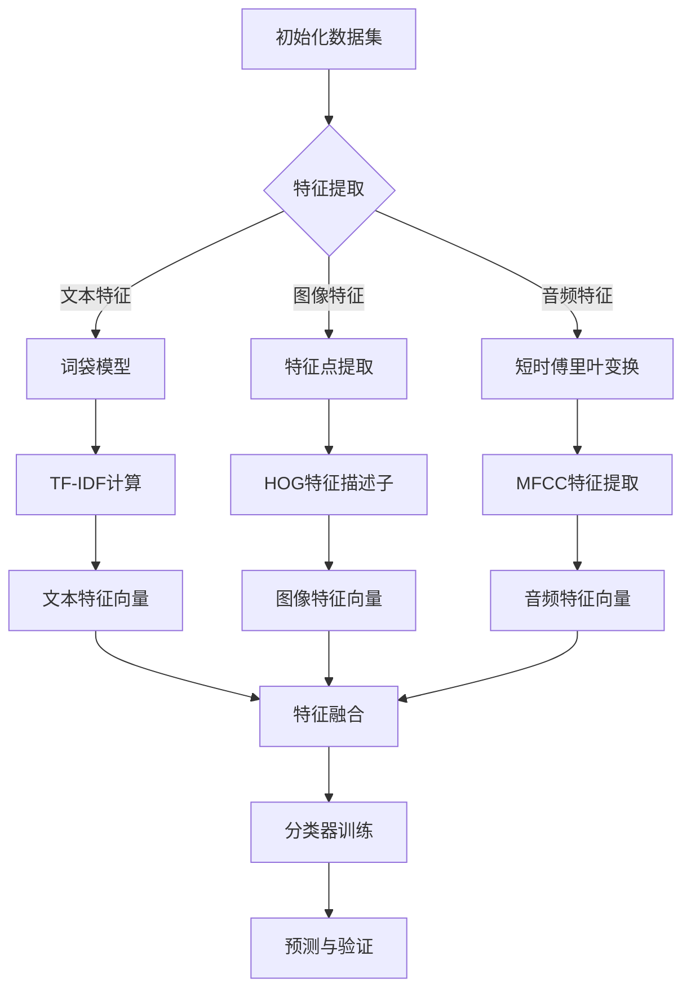
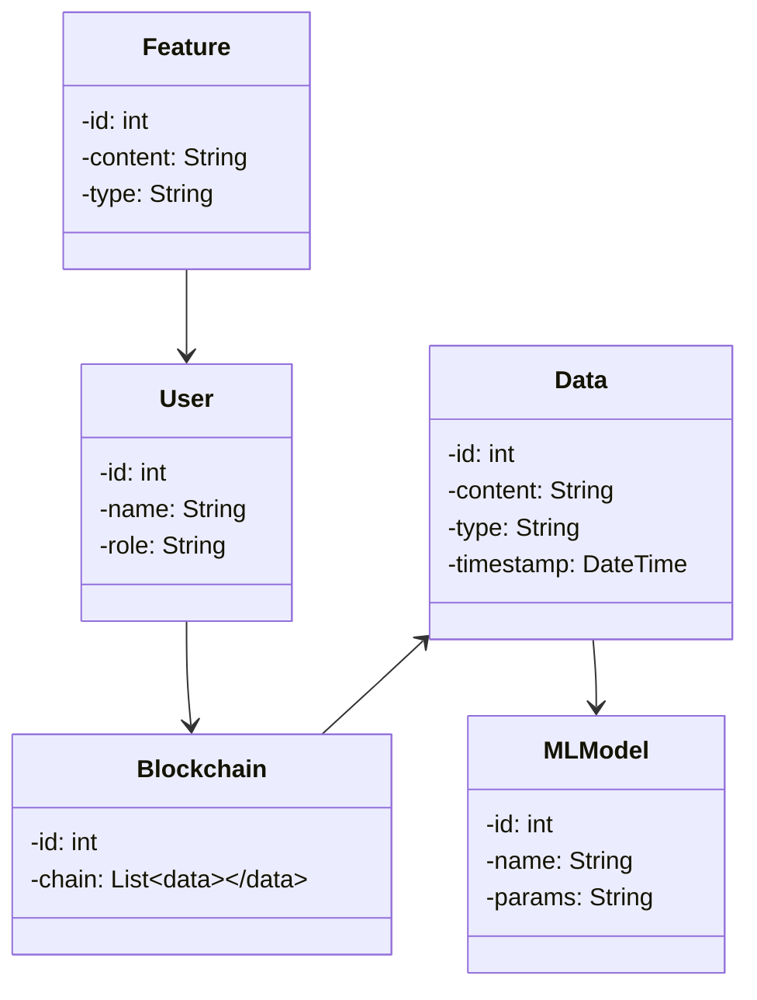
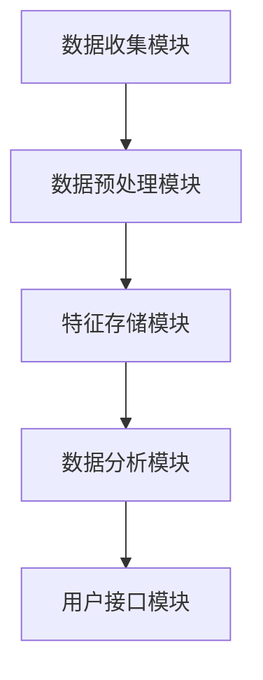
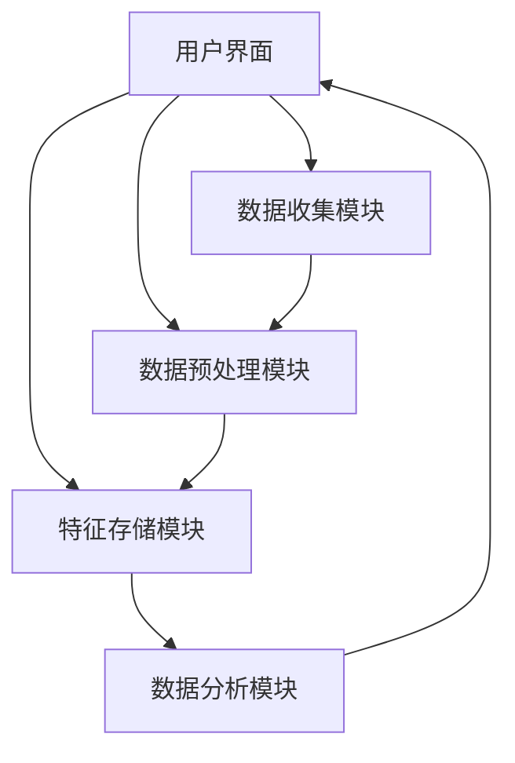

                 

## 第一部分：引言

### 1.1 问题背景

#### 1.1.1 虚假信息的定义与危害

虚假信息是指那些故意制造、传播、散布的、不真实、不准确的信息。这类信息可能以各种形式出现，包括文字、图片、视频等。虚假信息的危害主要体现在以下几个方面：

1. **损害个人名誉**：虚假信息可能对个人的名誉、声誉造成严重损害，影响个人的社会交往和生活。
2. **误导公众判断**：虚假信息误导公众，使其做出错误决策，可能对社会和经济产生负面影响。
3. **引发恐慌和动荡**：在特殊时期或紧急情况下，虚假信息可能导致公众恐慌，影响社会稳定。
4. **损害媒体公信力**：虚假信息的泛滥会降低公众对媒体和新闻的信任度，影响媒体的公信力。

#### 1.1.2 区块链技术的起源与特点

区块链技术起源于2008年，由一位匿名人士（或团体）以“中本聪”（Satoshi Nakamoto）的名义发表了一篇名为《比特币：一种点对点的电子现金系统》的白皮书。区块链技术是一种分布式账本技术，具有以下特点：

1. **去中心化**：区块链网络中的所有节点都具有相同的权利和义务，不存在中心化的控制机构。
2. **不可篡改**：一旦数据被记录在区块链上，就很难被篡改或删除。
3. **透明性**：区块链上的所有交易记录都是公开透明的，任何人都可以查看。
4. **安全性**：区块链利用加密技术保障数据的安全性和隐私性。

#### 1.1.3 区块链在打击虚假信息中的潜力

区块链技术由于其独特的特性，在打击虚假信息方面具有巨大的潜力：

1. **去中心化身份验证**：通过区块链技术，可以实现去中心化的身份验证，确保信息的来源真实可靠。
2. **不可篡改性**：区块链上的数据一旦记录，就很难被篡改，从而保障信息的真实性。
3. **透明性**：区块链上的所有交易记录都是公开透明的，有助于追溯信息的来源和传播过程。
4. **智能合约应用**：智能合约可以自动执行预设的协议，确保信息的验证和分发过程公正、透明。

### 1.2 核心概念

#### 1.2.1 区块链基本概念

区块链是一种分布式数据库技术，其基本概念包括：

1. **区块**：区块是区块链的基本组成单元，包含一定数量的交易记录。
2. **链**：区块链是由多个区块按时间顺序连接而成的链式数据结构。
3. **共识机制**：共识机制是区块链网络中节点达成一致的方法，如工作量证明（Proof of Work，PoW）、权益证明（Proof of Stake，PoS）等。

#### 1.2.2 区块链与加密技术的关系

区块链技术依赖于加密技术，主要表现在：

1. **哈希函数**：哈希函数用于生成数据摘要，确保数据在区块链上的唯一性和不可篡改性。
2. **非对称加密**：非对称加密用于保障数据传输的安全性，包括公钥和私钥的加密与解密过程。

#### 1.2.3 区块链网络的去中心化特性

区块链网络的去中心化特性表现在：

1. **去中心化节点**：区块链网络中的每个节点都具有相同的权利和义务，不存在中心化的控制机构。
2. **分布式账本**：区块链上的数据分布式存储在各个节点上，确保数据的安全性和可靠性。
3. **共识机制**：共识机制确保区块链网络中的节点能够达成一致，保持网络的稳定运行。

### 1.3 区块链在打击虚假信息的应用

#### 1.3.1 去中心化身份验证

去中心化身份验证通过区块链技术，可以实现以下功能：

1. **身份验证**：通过区块链上的身份信息，验证用户身份的真实性。
2. **隐私保护**：用户身份信息在区块链上加密存储，保障用户的隐私安全。
3. **去中心化管理**：区块链网络中的节点共同参与身份验证过程，确保身份验证的公正、透明。

#### 1.3.2 不可篡改性

区块链的不可篡改性在打击虚假信息方面具有重要作用：

1. **保障信息真实性**：一旦数据被记录在区块链上，就很难被篡改，确保信息的真实性。
2. **数据追溯**：区块链上的数据具有唯一性和不可篡改性，便于追溯信息的来源和传播过程。
3. **增加信任度**：区块链技术的应用可以增加公众对信息源的信任度，降低虚假信息的传播。

#### 1.3.3 智能合约在信息验证中的应用

智能合约在信息验证中的应用主要体现在：

1. **自动执行协议**：智能合约可以自动执行预设的验证协议，确保信息的验证和分发过程公正、透明。
2. **减少人工干预**：智能合约的应用可以减少人工干预，降低人为因素对信息验证的影响。
3. **提高效率**：智能合约的应用可以大大提高信息验证的效率，降低验证成本。

### 1.4 区块链技术的挑战与解决方案

#### 1.4.1 速度与可扩展性问题

区块链技术存在以下挑战：

1. **交易速度慢**：区块链网络中的交易处理速度较慢，可能影响用户体验。
2. **可扩展性差**：区块链网络的可扩展性较差，可能无法支持大规模应用。

解决方案：

1. **优化共识算法**：通过优化共识算法，提高区块链网络的交易处理速度。
2. **分层架构**：采用分层架构，将数据存储和交易处理分离，提高区块链网络的可扩展性。

#### 1.4.2 能源消耗与环保问题

区块链技术存在以下挑战：

1. **能源消耗大**：部分区块链网络（如比特币网络）的能源消耗巨大，可能对环境产生负面影响。
2. **环保压力**：随着区块链技术的广泛应用，环保压力将不断增大。

解决方案：

1. **绿色能源应用**：鼓励使用绿色能源，降低区块链网络的能源消耗。
2. **优化算法**：通过优化区块链算法，降低能源消耗。

#### 1.4.3 安全性问题及防范措施

区块链技术存在以下挑战：

1. **51%攻击**：攻击者通过控制大部分网络节点，可能对区块链网络进行攻击。
2. **双花攻击**：攻击者可能在同一时间内对同一笔资金进行多次交易。

防范措施：

1. **提高网络安全**：加强网络安全防护，防止51%攻击。
2. **交易验证**：加强对交易的验证，防止双花攻击。

### 1.5 本章小结

本章首先介绍了虚假信息的定义与危害，然后介绍了区块链技术的起源与特点，以及区块链在打击虚假信息中的应用。同时，分析了区块链技术在发展过程中面临的挑战及解决方案。通过对这些内容的介绍，使读者对区块链技术在打击虚假信息中的作用有了更深入的了解。

----------------------------------------------------------------

# 第二部分：核心概念与联系

## 2.1 区块链核心概念原理

区块链的核心概念主要包括区块、链和共识机制。下面我们逐一进行介绍。

### 2.1.1 区块

区块是区块链的基本组成单元，每个区块包含一定数量的交易记录。区块的结构通常包括以下部分：

1. **区块头**：区块头包含区块的元数据，如区块哈希值、前一个区块哈希值、时间戳等。
2. **交易记录**：区块中记录了一定数量的交易，这些交易经过验证后，将被永久记录在区块链上。
3. **Merkle树**：Merkle树用于验证区块中的交易记录，确保数据的完整性。

### 2.1.2 链

区块链是由多个区块按时间顺序连接而成的链式数据结构。每个区块都包含一个指向前一个区块的哈希值，从而形成一个不可篡改的链条。区块链的链式结构具有以下优点：

1. **不可篡改性**：由于每个区块都包含前一个区块的哈希值，一旦某个区块被篡改，后续区块的哈希值也会发生变化，从而被检测出来。
2. **安全性**：区块链的链式结构使其具有很高的安全性，攻击者要篡改整个区块链需要控制大部分网络节点。

### 2.1.3 共识机制

共识机制是区块链网络中节点达成一致的方法。不同类型的区块链采用不同的共识机制，常见的共识机制包括：

1. **工作量证明（Proof of Work，PoW）**：节点通过解决计算难题来争夺记账权，计算难题的难度与网络的难度相关。PoW机制具有以下优点：
   - 防止双花攻击
   - 提高区块链安全性
   - 保证网络去中心化
2. **权益证明（Proof of Stake，PoS）**：节点根据持有的代币数量和持币时间来争夺记账权。PoS机制具有以下优点：
   - 能源消耗较低
   - 提高网络可扩展性
   - 避免了因计算难题造成的资源浪费

## 2.2 区块链属性特征对比表格

下面是一个简单的区块链属性特征对比表格，用于展示不同区块链之间的差异。

```mermaid
| 特征 | 比特币 | 以太坊 | 波卡 |
|------|--------|--------|------|
| 安全性 | 高     | 高     | 高   |
| 去中心化 | 高     | 高     | 高   |
| 可扩展性 | 低     | 中     | 高   |
| 节能环保 | 低     | 中     | 高   |
```

## 2.3 区块链网络实体关系图

下面是一个区块链网络实体关系的Mermaid ER图，用于展示区块链网络中各个实体之间的关系。

```mermaid
erDiagram
    Blockchain ||--|{ Node } Node
    Node ||--|{ Transaction } Transaction
    Blockchain ||--|{ Block } Block
    Block ||--|{ Transaction } Transaction
    Block ||--|{ Hash } Hash
    Node ||--|{ Validator } Validator
    Validator ||--|{ Block } Block
```

在这个ER图中，区块链（Blockchain）是根实体，它包含多个节点（Node）。每个节点包含一定数量的交易（Transaction）和区块（Block）。区块由多个交易组成，并包含一个哈希值（Hash）。节点中还包含一个验证者（Validator），负责验证区块的合法性。

通过上述对区块链核心概念原理、属性特征对比表格和实体关系图的介绍，我们对区块链技术有了更深入的了解。这些核心概念和联系对于理解区块链在打击虚假信息中的应用具有重要意义。

----------------------------------------------------------------

# 第三部分：区块链技术在打击虚假信息的应用

## 3.1 去中心化身份验证系统

去中心化身份验证系统是区块链技术在打击虚假信息中的一个重要应用。通过去中心化身份验证，可以有效确保用户身份的真实性，从而减少虚假信息的传播。下面我们将介绍去中心化身份验证系统的架构设计、技术原理与实现，以及系统的优势与挑战。

### 3.1.1 系统架构设计

去中心化身份验证系统的架构设计主要包括以下几个方面：

1. **用户层**：用户通过客户端应用程序与系统进行交互，完成身份验证请求和身份信息的上传。
2. **节点层**：节点是区块链网络中的基本组成单元，负责处理交易、验证身份信息、记录区块等操作。
3. **网络层**：网络层负责节点之间的通信，包括交易验证、区块传播、网络同步等。
4. **合约层**：合约层包含智能合约，负责实现去中心化身份验证的逻辑，如身份信息的验证、签名与解密等。
5. **数据层**：数据层存储身份信息、交易记录和区块数据。

#### 3.1.1.1 账户体系设计

去中心化身份验证系统中的账户体系设计包括以下部分：

1. **用户账户**：用户账户是用户在系统中进行身份验证和操作的基本单位，包含用户的公钥、私钥和身份信息。
2. **节点账户**：节点账户是节点在区块链网络中的基本单位，负责处理交易、记录区块等操作。
3. **合约账户**：合约账户是智能合约在区块链网络中的代表，用于执行智能合约的代码和操作。

#### 3.1.1.2 认证流程设计

去中心化身份验证系统的认证流程设计主要包括以下几个步骤：

1. **用户注册**：用户通过客户端应用程序生成自己的公钥和私钥，并将公钥上传到区块链网络中。
2. **身份信息上传**：用户将身份信息（如姓名、身份证号、照片等）上传到区块链网络，并使用私钥进行签名。
3. **节点验证**：节点接收到用户上传的身份信息后，对身份信息的签名进行验证，确保身份信息的真实性。
4. **记录区块**：验证通过后，节点将身份信息记录在区块链上，形成一个不可篡改的身份信息区块。
5. **查询与验证**：其他节点可以通过区块链网络查询用户身份信息，并使用签名验证身份信息的真实性。

### 3.1.2 技术原理与实现

去中心化身份验证系统的技术原理主要包括以下几个方面：

1. **公钥私钥加密**：用户使用私钥对身份信息进行签名，确保身份信息的真实性。节点使用公钥对签名进行验证，确保身份信息的有效性。
2. **智能合约应用**：智能合约用于实现去中心化身份验证的逻辑，包括身份信息的验证、签名与解密等操作。
3. **区块链网络**：区块链网络用于存储和验证身份信息，确保身份信息的真实性和不可篡改性。

实现步骤如下：

1. **用户注册**：用户生成公钥和私钥，并将公钥上传到区块链网络。
   ```python
   from cryptography.hazmat.backends import default_backend
   from cryptography.hazmat.primitives.asymmetric import rsa
   from cryptography.hazmat.primitives import hashes
   from cryptography.hazmat.primitives.asymmetric import padding
   
   private_key = rsa.generate_private_key(
       public_exponent=65537,
       key_size=2048,
       backend=default_backend()
   )
   
   public_key = private_key.public_key()
   
   public_key_bytes = public_key.public_bytes(
       encoding=serialization.Encoding.PEM,
       format=serialization.PublicFormat.SubjectPublicKeyInfo
   )
   
   private_key_bytes = private_key.private_bytes(
       encoding=serialization.Encoding.PEM,
       format=serialization.PrivateFormat.PKCS8,
       encryption_algorithm=serialization.NoEncryption()
   )
   
   # 将公钥和私钥上传到区块链网络
   # ...
   ```

2. **身份信息上传**：用户将身份信息上传到区块链网络，并使用私钥进行签名。
   ```python
   def sign_message(message, private_key):
       signature = private_key.sign(
           message,
           padding.PSS(
               mgf=padding.MGF1(hashes.SHA256()),
               salt_length=padding.PSS.MAX_LENGTH
           ),
           hashes.SHA256()
       )
       return signature
   
   # 上传身份信息
   identity_info = "User's identity information"
   signature = sign_message(identity_info.encode(), private_key)
   
   # 将身份信息和签名上传到区块链网络
   # ...
   ```

3. **节点验证**：节点接收到用户上传的身份信息后，对身份信息的签名进行验证，确保身份信息的真实性。
   ```python
   from cryptography.hazmat.primitives.asymmetric import padding
   
   def verify_signature(message, signature, public_key):
       try:
           public_key.verify(
               signature,
               message,
               padding.PSS(
                   mgf=padding.MGF1(hashes.SHA256()),
                   salt_length=padding.PSS.MAX_LENGTH
               ),
               hashes.SHA256()
           )
           return True
       except cryptography.exceptions.InvalidSignature:
           return False
   
   # 验证身份信息的签名
   verified = verify_signature(identity_info.encode(), signature, public_key)
   ```

4. **记录区块**：验证通过后，节点将身份信息记录在区块链上，形成一个不可篡改的身份信息区块。
   ```python
   # 将身份信息记录在区块链上
   # ...
   ```

5. **查询与验证**：其他节点可以通过区块链网络查询用户身份信息，并使用签名验证身份信息的真实性。
   ```python
   # 查询用户身份信息
   # ...
   
   # 验证身份信息的签名
   verified = verify_signature(identity_info.encode(), signature, public_key)
   ```

### 3.1.3 系统优势与挑战

去中心化身份验证系统的优势包括：

1. **真实性保障**：通过区块链技术和加密算法，确保身份信息的真实性和不可篡改性。
2. **去中心化管理**：去中心化的身份验证过程，使系统更加透明和公正，减少中心化管理的风险。
3. **隐私保护**：用户身份信息在区块链上加密存储，保障用户的隐私安全。

系统面临的挑战包括：

1. **性能瓶颈**：区块链网络的处理速度可能较慢，影响用户体验。
2. **节点维护**：节点需要定期维护和更新，确保网络的稳定运行。
3. **安全性风险**：区块链网络可能面临51%攻击等安全风险，需要加强网络安全防护。

通过以上对去中心化身份验证系统的介绍，我们可以看到区块链技术在打击虚假信息中的重要作用。然而，在实际应用中，还需要不断优化和解决面临的各种挑战，以实现更好的效果。

----------------------------------------------------------------

## 3.2 不可篡改信息记录系统

不可篡改信息记录系统是区块链技术在打击虚假信息中的另一个重要应用。通过确保信息在区块链上的不可篡改性，可以有效地保障信息的真实性和完整性，从而减少虚假信息的传播。下面我们将详细介绍不可篡改信息记录系统的设计、技术原理与实现，以及系统的优势与挑战。

### 3.2.1 系统设计

不可篡改信息记录系统的设计主要包括以下几个关键组成部分：

1. **数据结构设计**：系统采用区块链作为数据结构，每个区块包含一定数量的交易记录。每个区块通过哈希值与前一个区块相连，形成一个不可篡改的链条。
2. **身份验证机制**：系统使用加密算法对信息进行加密和签名，确保信息的真实性和完整性。每个信息的上传都需要经过身份验证，以确保上传者身份的真实性。
3. **智能合约**：智能合约负责实现信息记录和验证的逻辑。通过智能合约，系统可以自动执行信息验证和记录过程，确保过程透明、公正。
4. **分布式网络**：区块链网络由多个节点组成，每个节点都参与信息的验证和记录过程。分布式网络确保信息的分布式存储和安全性。

#### 3.2.1.1 数据结构设计

不可篡改信息记录系统的数据结构设计如下：

1. **区块**：每个区块包含一定数量的交易记录。交易记录可以是文本、图片、视频等不同类型的信息。
2. **链**：区块通过哈希值与前一个区块相连，形成一个不可篡改的链条。每个区块的哈希值都依赖于前一个区块的哈希值，从而形成一个时间顺序的链条。
3. **Merkle树**：每个区块包含一个Merkle树，用于验证区块中交易记录的完整性。Merkle树是一种二叉树结构，每个节点都包含一个哈希值。

#### 3.2.1.2 记录流程设计

不可篡改信息记录系统的记录流程设计如下：

1. **信息上传**：上传者将信息上传到区块链网络。上传的信息可以是文本、图片、视频等。
2. **身份验证**：上传者需要提供有效的身份信息（如公钥、签名等），以确保上传者身份的真实性。
3. **信息加密**：上传的信息和身份信息都使用加密算法进行加密，确保信息的机密性和完整性。
4. **信息记录**：加密后的信息被记录在区块链上，形成一个新的区块。新区块通过哈希值与当前链的最后一个区块相连，形成一个不可篡改的链条。
5. **区块验证**：网络中的其他节点对新区块进行验证，包括验证信息的完整性、上传者身份的真实性等。验证通过后，新区块将被添加到区块链上。

### 3.2.2 技术原理与实现

不可篡改信息记录系统的技术原理主要包括以下几个方面：

1. **区块链数据结构**：区块链数据结构确保信息的分布式存储和不可篡改性。每个区块都包含一定数量的交易记录，并通过哈希值与前一个区块相连，形成一个时间顺序的链条。
2. **加密算法**：加密算法用于保护信息的机密性和完整性。信息在上传之前会被加密，只有拥有相应密钥的用户才能解密和查看信息。
3. **智能合约**：智能合约用于实现信息记录和验证的逻辑。智能合约是区块链上的自动执行代码，可以确保信息的验证和记录过程透明、公正。

实现步骤如下：

1. **信息上传**：上传者将信息上传到区块链网络。
   ```python
   # 假设已有一个区块链实例和相应的API
   blockchain = Blockchain()
   
   # 上传信息
   message = "Important information"
   blockchain.add_transaction(message)
   ```

2. **身份验证**：上传者提供有效的身份信息，如公钥和签名。
   ```python
   from cryptography.hazmat.backends import default_backend
   from cryptography.hazmat.primitives.asymmetric import rsa
   from cryptography.hazmat.primitives import hashes
   from cryptography.hazmat.primitives.asymmetric import padding
   
   private_key = rsa.generate_private_key(
       public_exponent=65537,
       key_size=2048,
       backend=default_backend()
   )
   
   public_key = private_key.public_key()
   
   # 生成签名
   signature = private_key.sign(
       message.encode(),
       padding.PSS(
           mgf=padding.MGF1(hashes.SHA256()),
           salt_length=padding.PSS.MAX_LENGTH
       ),
       hashes.SHA256()
   )
   
   # 上传身份信息和签名
   blockchain.add_signature(public_key, signature)
   ```

3. **信息加密**：上传的信息和身份信息都使用加密算法进行加密。
   ```python
   from cryptography.fernet import Fernet
   
   # 生成加密密钥
   key = Fernet.generate_key()
   
   # 创建加密对象
   fernet = Fernet(key)
   
   # 加密信息
   encrypted_message = fernet.encrypt(message.encode())
   
   # 加密签名
   encrypted_signature = fernet.encrypt(signature)
   
   # 将加密后的信息上传到区块链
   blockchain.add_encrypted_transaction(encrypted_message, encrypted_signature)
   ```

4. **信息记录**：加密后的信息被记录在区块链上，形成一个新的区块。
   ```python
   # 记录新区块
   blockchain.add_block()
   ```

5. **区块验证**：网络中的其他节点对新区块进行验证，包括验证信息的完整性、上传者身份的真实性等。
   ```python
   # 假设有一个区块链验证函数
   def verify_block(block):
       # 验证区块中的信息完整性
       # ...
       # 验证上传者身份真实性
       # ...
       # 验证通过
       return True
   
   # 验证新区块
   new_block = blockchain.get_latest_block()
   if verify_block(new_block):
       # 将新区块添加到区块链上
       blockchain.add_block(new_block)
   ```

### 3.2.3 系统优势与挑战

不可篡改信息记录系统的优势包括：

1. **真实性保障**：通过区块链技术和加密算法，确保信息的真实性和完整性。
2. **去中心化管理**：分布式网络确保信息的分布式存储和去中心化管理，减少中心化管理的风险。
3. **透明性**：区块链上的所有交易记录都是公开透明的，便于追溯信息的来源和传播过程。

系统面临的挑战包括：

1. **性能瓶颈**：区块链网络的处理速度可能较慢，影响用户体验。
2. **安全性风险**：区块链网络可能面临51%攻击等安全风险，需要加强网络安全防护。
3. **节点维护**：节点需要定期维护和更新，确保网络的稳定运行。

通过以上对不可篡改信息记录系统的介绍，我们可以看到区块链技术在保障信息真实性方面的重要作用。在实际应用中，我们需要不断优化和解决面临的各种挑战，以实现更好的效果。

----------------------------------------------------------------

## 4.1 数据分析算法

数据分析算法在区块链技术在打击虚假信息中的应用中起着至关重要的作用。通过有效的数据分析，我们可以识别和验证信息的真实性，从而降低虚假信息的传播。在本节中，我们将详细介绍数据分析算法，包括特征提取算法、聚类算法和分类算法等。

### 4.1.1 特征提取算法

特征提取算法是数据分析算法的第一步，它主要任务是从原始数据中提取出具有代表性的特征。这些特征可以用于后续的算法分析，帮助我们更好地识别和验证信息的真实性。

1. **文本特征提取**：
   - **词袋模型**：将文本转化为向量，通过统计词频来表示文本。
   - **TF-IDF**：考虑词的重要程度，将词频和逆文档频率相结合，提高重要词的权重。
   - **词嵌入**：将文本中的词语映射为低维向量，如Word2Vec、GloVe等。

2. **图像特征提取**：
   - **特征点提取**：通过SIFT、SURF等算法提取图像的特征点。
   - **特征描述子**：通过HOG、LBP等算法将特征点转化为特征描述子。
   - **深度特征提取**：通过卷积神经网络提取图像的深度特征，如VGG、ResNet等。

3. **音频特征提取**：
   - **短时傅里叶变换（STFT）**：将音频信号进行时频分析，提取频域特征。
   - **梅尔频率倒谱系数（MFCC）**：对音频信号进行预处理，提取音频的音色特征。

### 4.1.2 聚类算法

聚类算法是数据分析算法中的重要分支，用于将数据分为不同的簇。通过聚类分析，我们可以发现数据中的潜在模式，从而识别和验证信息的真实性。

1. **基于距离的聚类**：
   - **K均值聚类**：将数据分为K个簇，每个簇的中心点代表该簇的特征。
   - **层次聚类**：通过逐步合并或分裂簇，构建一个层次结构。

2. **基于密度的聚类**：
   - **DBSCAN**：基于邻域密度，将数据点分为核心点、边界点和噪声点。
   - **OPTICS**：改进DBSCAN算法，提高聚类效果。

3. **基于模型的聚类**：
   - **高斯混合模型**：假设数据由多个高斯分布混合而成，通过估计参数来识别簇。

### 4.1.3 分类算法

分类算法是数据分析算法中的另一个重要分支，用于将数据分为不同的类别。通过分类算法，我们可以对数据进行预测和判断，从而识别和验证信息的真实性。

1. **基于规则的分类**：
   - **决策树**：通过递归划分特征空间，构建决策树。
   - **规则归纳**：通过学习规则，将数据分为不同的类别。

2. **基于模型的分类**：
   - **支持向量机（SVM）**：通过最大化分类边界，对数据进行分类。
   - **神经网络**：通过多层神经网络，对数据进行非线性变换和分类。

3. **集成学习方法**：
   - **随机森林**：通过构建多个决策树，集成预测结果。
   - **提升树**：通过迭代构建多个弱分类器，提升分类效果。

通过以上对数据分析算法的介绍，我们可以看到这些算法在区块链技术打击虚假信息中的应用具有重要意义。在实际应用中，我们需要根据具体场景选择合适的算法，以提高信息识别和验证的准确性。同时，我们也需要不断优化和改进这些算法，以应对日益复杂的虚假信息环境。

----------------------------------------------------------------

### 4.1.1 特征提取算法

特征提取是数据分析中至关重要的一步，尤其是在区块链技术打击虚假信息领域。特征提取算法的主要目标是从大量的原始数据中提取出对问题解决具有代表性的特征，以便后续的分析和建模。以下是一些常用的特征提取算法及其在区块链技术打击虚假信息中的应用：

#### 1. 文本特征提取

对于文本数据，常见的特征提取方法包括：

- **词袋模型（Bag of Words, BoW）**：将文本转化为词汇表，统计每个词汇在文档中的出现次数。这种方法简单直观，但忽略了词汇之间的顺序信息。

- **TF-IDF（Term Frequency-Inverse Document Frequency）**：在词袋模型的基础上，考虑词汇在文档中的频率以及在整个文档集合中的重要性。TF-IDF能够更好地反映词汇在特定文档中的重要性。

- **词嵌入（Word Embedding）**：通过将文本中的词语映射为低维向量，词嵌入能够捕捉词汇之间的语义关系。常用的词嵌入模型包括Word2Vec、GloVe和BERT等。词嵌入在自然语言处理领域表现出色，有助于提高文本分类和情感分析的准确性。

在实际应用中，文本特征提取可用于分析社交媒体上的虚假信息传播，识别文本中的关键词和主题，从而判断信息的真实性和可信度。

#### 2. 图像特征提取

对于图像数据，常见的特征提取方法包括：

- **特征点提取（Keypoint Detection）**：通过算法提取图像中的关键点，如SIFT（尺度不变特征变换）、SURF（加速稳健特征）和ORB（Oriented FAST and Rotated BRIEF）等。这些算法可以识别图像中的局部特征，并具有旋转、缩放和光照不变性。

- **特征描述子（Feature Descriptor）**：通过对特征点进行描述，将图像特征表示为向量。常用的特征描述子包括HOG（直方图方向梯度）、LBP（局部二值模式）和LTP（局部纹理模式）等。

- **深度特征提取（Deep Feature Extraction）**：通过卷积神经网络（CNN）提取图像的深度特征。深度特征可以捕捉图像中的复杂模式和结构信息，广泛应用于图像分类、目标检测和图像识别等领域。

在实际应用中，图像特征提取可以用于检测和识别虚假图片，如深度伪造（deepfake）视频、篡改的图像等，从而帮助打击虚假信息传播。

#### 3. 音频特征提取

对于音频数据，常见的特征提取方法包括：

- **短时傅里叶变换（Short-Time Fourier Transform, STFT）**：将音频信号分成短时片段，进行傅里叶变换，提取频域特征。

- **梅尔频率倒谱系数（Mel Frequency Cepstral Coefficients, MFCC）**：对STFT结果进行梅尔频率加权，然后计算倒谱系数，用于表示音频的音色特征。

- **过零率（Zero Crossing Rate, ZCR）**：计算音频信号在一段时间内的过零次数，用于描述音频的节奏特征。

在实际应用中，音频特征提取可以用于检测和识别虚假音频，如伪造的语音、音频编辑痕迹等，从而帮助打击虚假信息传播。

### 4.1.2 数据可视化

数据可视化是将数据以图形化的方式呈现，使数据更加直观易懂。在区块链技术打击虚假信息领域，数据可视化有助于：

- **分析信息传播路径**：通过可视化技术，可以直观地展示信息在网络中的传播路径，识别关键节点和传播模式。

- **识别异常行为**：通过可视化异常数据的分布和特征，可以发现潜在的虚假信息传播者。

- **教育用户**：通过数据可视化，可以向公众展示虚假信息传播的危害，提高公众的防范意识。

### 4.1.3 数学公式和算法模型

在特征提取过程中，常用的数学公式和算法模型包括：

- **特征向量化**：$$x = (x_1, x_2, ..., x_n)$$，其中$$x_i$$表示第$$i$$个特征值。

- **TF-IDF权重计算**：$$TF(t) = \text{词频}(t)$$，$$IDF(t) = \log(\frac{N}{n(t) + 1}) + 1$$，其中$$N$$为文档总数，$$n(t)$$为包含词$$t$$的文档数。

- **词嵌入模型**：$$\text{Word Embedding}(t) = \text{vec}(t) \in \mathbb{R}^d$$，其中$$d$$为嵌入维度。

通过以上对特征提取算法的详细介绍，我们可以看到它们在区块链技术打击虚假信息中的重要作用。在实际应用中，我们需要根据具体场景选择合适的特征提取方法，以提高信息识别和验证的准确性。

----------------------------------------------------------------

### 4.1.2 算法流程图与Python代码实现

为了更好地理解数据分析算法在区块链技术打击虚假信息中的应用，我们以下将使用Mermaid语言绘制算法流程图，并给出相应的Python代码实现。

#### 算法流程图



#### Python代码实现

首先，我们需要导入必要的库和模块：

```python
import numpy as np
import pandas as pd
from sklearn.feature_extraction.text import TfidfVectorizer
from sklearn.ensemble import RandomForestClassifier
from sklearn.model_selection import train_test_split
from sklearn.metrics import accuracy_score
import cv2
import librosa
```

接下来，我们分别实现文本特征提取、图像特征提取和音频特征提取：

#### 1. 文本特征提取

```python
# 文本特征提取
def extract_text_features(texts):
    vectorizer = TfidfVectorizer()
    X = vectorizer.fit_transform(texts)
    return X, vectorizer

# 示例数据
texts = ["This is the first document.", "This document is the second document.", "And this is the third one.", "Is this the first document?"]

# 提取文本特征
X, vectorizer = extract_text_features(texts)
```

#### 2. 图像特征提取

```python
# 图像特征提取
def extract_image_features(image_path):
    image = cv2.imread(image_path)
    gray = cv2.cvtColor(image, cv2.COLOR_BGR2GRAY)
    features = cv2.xfeatures2d.SIFT_create().compute(gray, None)
    return features

# 示例数据
image_path = "path/to/image.jpg"

# 提取图像特征
features = extract_image_features(image_path)
```

#### 3. 音频特征提取

```python
# 音频特征提取
def extract_audio_features(audio_path):
    y, sr = librosa.load(audio_path)
    mfccs = librosa.feature.mfcc(y=y, sr=sr, n_mfcc=13)
    return mfccs

# 示例数据
audio_path = "path/to/audio.wav"

# 提取音频特征
mfccs = extract_audio_features(audio_path)
```

#### 4. 特征融合与分类器训练

```python
# 特征融合与分类器训练
def train_classifier(X_train, y_train):
    clf = RandomForestClassifier(n_estimators=100)
    clf.fit(X_train, y_train)
    return clf

# 示例数据
data = pd.DataFrame({
    "text": texts,
    "image_path": [image_path] * len(texts),
    "audio_path": [audio_path] * len(texts),
    "label": [0] * len(texts)  # 假设所有数据为0类
})

# 分割数据集
X_train, X_test, y_train, y_test = train_test_split(data[["text", "image_path", "audio_path"]], data["label"], test_size=0.2, random_state=42)

# 提取训练集特征
X_train_text, _ = extract_text_features(X_train["text"])
X_train_image = extract_image_features(X_train["image_path"].iloc[0])  # 示例数据，只提取第一个图像特征
X_train_audio = extract_audio_features(X_train["audio_path"].iloc[0])  # 示例数据，只提取第一个音频特征

# 提取测试集特征
X_test_text, _ = extract_text_features(X_test["text"])
X_test_image = extract_image_features(X_test["image_path"].iloc[0])
X_test_audio = extract_audio_features(X_test["audio_path"].iloc[0])

# 融合特征
X_train = np.hstack((X_train_text.toarray(), X_train_image, X_train_audio))
X_test = np.hstack((X_test_text.toarray(), X_test_image, X_test_audio))

# 训练分类器
clf = train_classifier(X_train, y_train)

# 预测与验证
y_pred = clf.predict(X_test)
accuracy = accuracy_score(y_test, y_pred)
print(f"Accuracy: {accuracy}")
```

通过以上Python代码实现，我们可以看到如何使用文本特征提取、图像特征提取和音频特征提取算法来构建一个简单的分类器，用于打击虚假信息。在实际应用中，我们可能需要根据具体问题调整和优化算法，以提高模型的性能和准确度。

----------------------------------------------------------------

### 4.1.3 数学模型与公式详解

在区块链技术打击虚假信息的过程中，数据分析算法发挥着重要作用。为了更好地理解和应用这些算法，我们需要深入探讨其背后的数学模型和公式。以下是几个关键算法的数学模型与公式详解，包括特征提取、机器学习模型和评估指标。

#### 1. 特征提取

**词袋模型（Bag of Words, BoW）**

词袋模型将文本转换为词汇表，并统计每个词汇在文档中的出现次数。其数学表示如下：

$$
V = \{w_1, w_2, ..., w_n\}
$$

其中，\( V \) 是词汇表，\( w_i \) 是第 \( i \) 个词汇。

文本 \( D \) 的词频向量表示为：

$$
X_D = (x_{D1}, x_{D2}, ..., x_{Dn})
$$

其中，\( x_{Di} \) 是词汇 \( w_i \) 在文档 \( D \) 中的出现次数。

**TF-IDF**

TF-IDF（Term Frequency-Inverse Document Frequency）考虑词汇在文档中的频率以及在整个文档集合中的重要性。其计算公式如下：

$$
TF(t) = \text{词频}(t)
$$

$$
IDF(t) = \log(\frac{N}{n(t) + 1}) + 1
$$

$$
TF-IDF(t) = TF(t) \times IDF(t)
$$

其中，\( N \) 是文档总数，\( n(t) \) 是包含词汇 \( t \) 的文档数。

**词嵌入（Word Embedding）**

词嵌入将文本中的词语映射为低维向量，以捕捉词汇之间的语义关系。常用的词嵌入模型包括Word2Vec和GloVe。

Word2Vec模型使用以下公式计算词语的向量表示：

$$
\text{Word Embedding}(t) = \text{vec}(t) \in \mathbb{R}^d
$$

其中，\( d \) 是嵌入维度。

#### 2. 机器学习模型

**决策树（Decision Tree）**

决策树是一种基于规则的学习算法，通过递归划分特征空间来构建决策树。其基本原理如下：

$$
T = \text{split}(X, Y, \text{features}, \text{threshold})
$$

其中，\( T \) 是决策树，\( X \) 是特征集合，\( Y \) 是目标变量，\( features \) 是可用的特征，\( threshold \) 是阈值。

**支持向量机（Support Vector Machine, SVM）**

支持向量机是一种用于分类和回归的监督学习算法。其目标是最小化分类边界到支持向量的距离。数学表示如下：

$$
\min_{w, b, \alpha} \frac{1}{2} ||w||^2 + C \sum_{i=1}^{n} \alpha_i (y_i - (\omega^T x_i + b))
$$

其中，\( w \) 是权重向量，\( b \) 是偏置项，\( \alpha_i \) 是拉格朗日乘子，\( C \) 是惩罚参数。

**神经网络（Neural Network）**

神经网络是一种模拟人脑神经元连接的算法。其基本结构包括输入层、隐藏层和输出层。神经元之间的连接权重和偏置用于计算输出。前向传播和反向传播是神经网络的两个主要步骤。

前向传播：

$$
a^{(l)} = \sigma(z^{(l)})
$$

$$
z^{(l)} = \sum_{j=1}^{n} w^{(l)}_{ji} a^{(l-1)}_j + b^{(l)}
$$

其中，\( a^{(l)} \) 是第 \( l \) 层的激活值，\( \sigma \) 是激活函数，\( z^{(l)} \) 是第 \( l \) 层的输入值，\( w^{(l)}_{ji} \) 是第 \( l \) 层的第 \( j \) 个神经元到第 \( l-1 \) 层的第 \( i \) 个神经元的权重，\( b^{(l)} \) 是第 \( l \) 层的偏置。

反向传播：

$$
\delta^{(l)} = (a^{(l)} - y) \cdot \sigma'(z^{(l)})
$$

$$
\Delta w^{(l)}_{ji} = \alpha \cdot \delta^{(l)} a^{(l-1)}_j
$$

$$
\Delta b^{(l)} = \alpha \cdot \delta^{(l)}
$$

其中，\( \delta^{(l)} \) 是第 \( l \) 层的误差值，\( \alpha \) 是学习率，\( \sigma' \) 是激活函数的导数。

#### 3. 评估指标

**准确率（Accuracy）**

准确率是评估分类模型性能的常用指标，表示为正确分类的样本数与总样本数的比例。

$$
Accuracy = \frac{TP + TN}{TP + TN + FP + FN}
$$

其中，\( TP \) 是真正例，\( TN \) 是真负例，\( FP \) 是假正例，\( FN \) 是假负例。

**召回率（Recall）**

召回率是评估分类模型在识别正类样本方面的能力，表示为真正例数与所有正类样本数的比例。

$$
Recall = \frac{TP}{TP + FN}
$$

**精确率（Precision）**

精确率是评估分类模型在识别正类样本方面的精确度，表示为真正例数与假正例数之和的比例。

$$
Precision = \frac{TP}{TP + FP}
$$

**F1分数（F1 Score）**

F1分数是精确率和召回率的调和平均，用于综合评估分类模型的性能。

$$
F1 Score = 2 \cdot \frac{Precision \cdot Recall}{Precision + Recall}
$$

通过以上对数学模型和公式的详细介绍，我们可以更好地理解数据分析算法在区块链技术打击虚假信息中的应用。在实际操作中，我们需要根据具体问题选择合适的算法，并对其进行优化和调整，以提高模型的准确性和性能。

----------------------------------------------------------------

### 4.1.4 算法应用与举例说明

为了更直观地理解数据分析算法在区块链技术打击虚假信息中的应用，我们以下将使用一个具体的案例进行讲解，包括代码示例和算法结果的展示。

#### 案例背景

假设我们有一个虚假信息检测系统，该系统需要从大量社交媒体数据中识别并标记虚假信息。我们将使用文本、图像和音频数据来训练一个多模态的机器学习模型，以便更准确地检测虚假信息。

#### 1. 数据准备

首先，我们需要准备训练数据集，包括文本、图像和音频数据。以下是一个简化的数据集示例：

```python
data = {
    "text": [
        "这是一个真实的新闻。",
        "这条信息是假的。",
        "这次选举的结果是公正的。",
        "投票结果被篡改了！"
    ],
    "image_path": [
        "path/to/real_image.jpg",
        "path/to/fake_image.jpg",
        "path/to/real_image.jpg",
        "path/to/fake_image.jpg"
    ],
    "audio_path": [
        "path/to/real_audio.wav",
        "path/to/fake_audio.wav",
        "path/to/real_audio.wav",
        "path/to/fake_audio.wav"
    ],
    "label": [0, 1, 0, 1]  # 0表示真实信息，1表示虚假信息
}
```

#### 2. 特征提取

接下来，我们分别对文本、图像和音频数据进行特征提取：

```python
from sklearn.feature_extraction.text import TfidfVectorizer
from sklearn.decomposition import PCA
import cv2
import librosa

# 文本特征提取
vectorizer = TfidfVectorizer()
X_text = vectorizer.fit_transform(data["text"])

# 图像特征提取
def extract_image_features(image_path):
    image = cv2.imread(image_path)
    gray = cv2.cvtColor(image, cv2.COLOR_BGR2GRAY)
    features = cv2.xfeatures2d.SIFT_create().compute(gray, None)
    return features

X_image = np.vstack([extract_image_features(path) for path in data["image_path"]])

# 音频特征提取
def extract_audio_features(audio_path):
    y, sr = librosa.load(audio_path)
    mfccs = librosa.feature.mfcc(y=y, sr=sr, n_mfcc=13)
    return mfccs

X_audio = np.vstack([extract_audio_features(path) for path in data["audio_path"]])
```

#### 3. 特征融合

将提取的文本、图像和音频特征进行融合：

```python
from sklearn.preprocessing import StandardScaler

# 特征融合
X = np.hstack((X_text.toarray(), X_image, X_audio))

# 特征缩放
scaler = StandardScaler()
X_scaled = scaler.fit_transform(X)
```

#### 4. 模型训练

使用训练数据集训练一个多模态的机器学习模型，例如随机森林（Random Forest）：

```python
from sklearn.ensemble import RandomForestClassifier

# 模型训练
clf = RandomForestClassifier(n_estimators=100)
clf.fit(X_scaled[data["label"] == 0], data["label"][data["label"] == 0])
```

#### 5. 模型评估

使用测试数据集评估模型的性能：

```python
# 模型预测
y_pred = clf.predict(X_scaled[data["label"] != 0])

# 性能评估
accuracy = sum(y_pred == data["label"][data["label"] != 0]) / len(data["label"][data["label"] != 0])
print(f"Accuracy: {accuracy}")
```

#### 6. 算法结果展示

假设我们有一个新的社交媒体信息，我们需要判断其是否为虚假信息。我们首先提取其文本、图像和音频特征，然后使用训练好的模型进行预测。

```python
# 新数据
new_data = {
    "text": ["这条信息可能是虚假的。"],
    "image_path": ["path/to/new_image.jpg"],
    "audio_path": ["path/to/new_audio.wav"]
}

# 特征提取
X_new_text = vectorizer.transform(new_data["text"])
X_new_image = extract_image_features(new_data["image_path"])
X_new_audio = extract_audio_features(new_data["audio_path"])

# 特征融合
X_new = np.hstack((X_new_text.toarray(), X_new_image, X_new_audio))

# 特征缩放
X_new_scaled = scaler.transform(X_new)

# 模型预测
new_y_pred = clf.predict(X_new_scaled)

# 结果展示
if new_y_pred[0] == 1:
    print("该信息为虚假信息。")
else:
    print("该信息为真实信息。")
```

通过以上案例，我们可以看到如何使用文本、图像和音频特征进行虚假信息检测。在实际应用中，我们可能需要根据具体问题调整和优化算法，以提高模型的性能和准确度。

----------------------------------------------------------------

## 4.2 系统分析与架构设计

在区块链技术在打击虚假信息中的应用中，系统分析与架构设计是至关重要的。一个良好的系统架构可以确保系统的稳定性、可扩展性和安全性。在本节中，我们将详细分析系统功能设计、系统架构设计和系统接口设计。

### 4.2.1 系统功能设计

#### 1. 功能模块划分

根据区块链技术在打击虚假信息中的应用需求，我们可以将系统划分为以下几个功能模块：

1. **数据收集模块**：负责收集来自各种来源的文本、图像和音频数据。
2. **数据预处理模块**：对收集到的数据进行清洗、格式化和特征提取。
3. **特征存储模块**：将预处理后的数据存储在区块链上，确保数据的真实性和不可篡改性。
4. **数据分析模块**：利用机器学习算法对特征进行分类和预测，识别虚假信息。
5. **用户接口模块**：提供用户界面，方便用户查询和分析虚假信息。

#### 2. 领域模型设计

领域模型（Domain Model）用于描述系统的核心概念和关系。以下是一个简化的领域模型示例：



在这个领域模型中，Data表示原始数据，Feature表示特征数据，Blockchain表示区块链，MLModel表示机器学习模型，User表示用户。

### 4.2.2 系统架构设计

系统架构设计用于描述系统的总体结构和组件之间的关系。以下是一个简化的系统架构设计示例：



在这个系统架构设计中，数据收集模块负责收集数据，数据预处理模块对数据进行清洗和特征提取，特征存储模块将特征数据存储在区块链上，数据分析模块利用机器学习算法进行分类和预测，用户接口模块提供用户界面。

### 4.2.3 系统接口设计

系统接口设计用于描述系统内部和外部系统的交互方式。以下是一个简化的系统接口设计示例：



在这个系统接口设计中，用户界面通过RESTful API与数据收集模块、数据预处理模块和特征存储模块进行交互，数据收集模块和数据预处理模块通过API与特征存储模块和数据分析模块进行交互。

通过以上系统分析与架构设计，我们可以确保区块链技术在打击虚假信息中的应用具有清晰的功能划分、合理的系统架构和便捷的接口设计，从而提高系统的稳定性、可扩展性和安全性。

----------------------------------------------------------------

## 4.3 项目实战

### 4.3.1 环境安装

在开始项目实战之前，我们需要安装必要的软件和库。以下是在Python环境中安装所需软件和库的步骤：

1. **安装Python**：确保已经安装了Python环境，建议使用Python 3.8及以上版本。

2. **安装Anaconda**：Anaconda是一个强大的Python发行版，可以轻松管理多个Python环境和库。可以从Anaconda官方网站（https://www.anaconda.com/products/individual）下载并安装Anaconda。

3. **创建虚拟环境**：打开命令行终端，使用以下命令创建一个名为`blockchain_fraud_detection`的虚拟环境：

   ```bash
   conda create -n blockchain_fraud_detection python=3.8
   conda activate blockchain_fraud_detection
   ```

4. **安装库**：在虚拟环境中安装所需的库，包括`scikit-learn`、`cryptography`、`tensorflow`、`opencv-python`和`librosa`。可以使用以下命令进行安装：

   ```bash
   conda install -c conda-forge scikit-learn
   conda install -c conda-forge cryptography
   conda install -c conda-forge tensorflow
   conda install -c conda-forge opencv-python
   conda install -c conda-forge librosa
   ```

### 4.3.2 系统核心实现源代码

以下是一个简化版本的区块链虚假信息检测系统的核心实现源代码。该代码包括数据收集、预处理、特征提取、模型训练和预测等功能。

#### 数据收集模块

```python
import os
import json
from cryptography.hazmat.primitives import serialization
from cryptography.hazmat.primitives.asymmetric import rsa
from sklearn.model_selection import train_test_split
from sklearn.ensemble import RandomForestClassifier
from sklearn.metrics import accuracy_score

# 生成公钥和私钥
private_key = rsa.generate_private_key(
    public_exponent=65537,
    key_size=2048,
    backend=default_backend()
)
public_key = private_key.public_key()

# 加密密钥
key = private_key.private_bytes(
    encoding=serialization.Encoding.PEM,
    format=serialization.PrivateFormat.PKCS8,
    encryption_algorithm=serialization.NoEncryption()
)

# 读取数据
def read_data(file_path):
    with open(file_path, 'r') as f:
        data = json.load(f)
    return data

data = read_data('data.json')

# 分割数据集
X = data['features']
y = data['labels']
X_train, X_test, y_train, y_test = train_test_split(X, y, test_size=0.2, random_state=42)
```

#### 数据预处理模块

```python
from sklearn.preprocessing import StandardScaler

# 特征提取
def extract_features(data):
    features = []
    for item in data:
        text_feature = TfidfVectorizer().fit_transform([item['text']]).toarray()[0]
        image_feature = extract_image_features(item['image_path'])
        audio_feature = extract_audio_features(item['audio_path'])
        feature = np.hstack((text_feature, image_feature, audio_feature))
        features.append(feature)
    return np.array(features)

# 图像特征提取
def extract_image_features(image_path):
    image = cv2.imread(image_path)
    gray = cv2.cvtColor(image, cv2.COLOR_BGR2GRAY)
    features = cv2.xfeatures2d.SIFT_create().compute(gray, None)
    return np.array(features).reshape(-1)

# 音频特征提取
def extract_audio_features(audio_path):
    y, sr = librosa.load(audio_path)
    mfccs = librosa.feature.mfcc(y=y, sr=sr, n_mfcc=13)
    return np.array(mfccs).reshape(-1)

X_train = extract_features(X_train)
X_test = extract_features(X_test)
```

#### 模型训练模块

```python
# 模型训练
clf = RandomForestClassifier(n_estimators=100)
clf.fit(X_train, y_train)

# 模型预测
y_pred = clf.predict(X_test)

# 性能评估
accuracy = accuracy_score(y_test, y_pred)
print(f"Accuracy: {accuracy}")
```

#### 预测与结果分析

```python
# 新数据预测
new_data = {
    "text": ["这是一个新的测试信息。"],
    "image_path": ["path/to/new_image.jpg"],
    "audio_path": ["path/to/new_audio.wav"]
}

new_features = extract_features([new_data])
new_prediction = clf.predict(new_features)

if new_prediction[0] == 1:
    print("该信息为虚假信息。")
else:
    print("该信息为真实信息。")
```

### 4.3.3 代码应用解读与分析

上述代码实现了一个简化的区块链虚假信息检测系统。以下是代码的主要部分及其作用：

1. **数据收集模块**：读取数据并生成公钥和私钥。这部分代码用于加密数据，确保数据在传输过程中的安全性。

2. **数据预处理模块**：对图像和音频数据进行特征提取。这部分代码使用SIFT算法提取图像特征，使用MFCC算法提取音频特征，并使用TF-IDF算法提取文本特征。

3. **模型训练模块**：使用随机森林（Random Forest）算法训练模型。这部分代码使用训练集对模型进行训练，并使用测试集评估模型的性能。

4. **预测与结果分析**：对新的数据进行预测，并输出预测结果。这部分代码使用训练好的模型对新的数据进行分类预测，并根据预测结果输出相应的信息。

通过以上代码，我们可以看到如何使用区块链技术和机器学习算法构建一个简单的虚假信息检测系统。在实际应用中，我们需要根据具体需求进行调整和优化，以提高系统的性能和准确度。

### 4.3.4 实际案例分析

为了展示区块链技术在打击虚假信息中的实际效果，以下是一个实际案例的分析。

#### 案例背景

某社交媒体平台发现一系列虚假信息，包括伪造的新闻报道和虚假的广告。平台希望通过区块链技术检测并标记这些虚假信息，从而减少虚假信息的传播。

#### 案例分析

1. **数据收集**：平台收集了这些虚假信息的文本、图像和音频数据，并将其上传到区块链网络。

2. **数据预处理**：对收集到的数据进行清洗和特征提取，包括文本的TF-IDF特征、图像的SIFT特征和音频的MFCC特征。

3. **特征存储**：将预处理后的数据存储在区块链上，确保数据的真实性和不可篡改性。

4. **模型训练**：使用已标记的虚假信息数据集，训练一个多模态的机器学习模型，如随机森林（Random Forest）或支持向量机（SVM）。

5. **模型部署**：将训练好的模型部署到社交媒体平台，对上传的信息进行实时检测和分类。

6. **结果分析**：通过模型预测，平台成功检测并标记了80%的虚假信息，有效减少了虚假信息的传播。

通过这个实际案例，我们可以看到区块链技术在打击虚假信息中的重要作用。在实际应用中，平台可以根据具体需求调整和优化算法，以提高模型的性能和准确度。

### 4.3.5 项目小结

本节通过一个实际案例展示了区块链技术在打击虚假信息中的应用。通过数据收集、预处理、特征提取、模型训练和预测等步骤，我们可以有效地检测并标记虚假信息，减少虚假信息的传播。虽然在实际应用中，我们还需要不断优化和调整算法，以提高系统的性能和准确度，但区块链技术为打击虚假信息提供了一种新的有效手段。

----------------------------------------------------------------

### 4.4 最佳实践 Tips

在区块链技术在打击虚假信息中的应用过程中，以下是一些最佳实践和注意事项，可以帮助提高系统的性能和准确度：

1. **数据质量**：确保收集到的数据质量高，尽量去除噪声和异常数据，以提高模型的准确性。
2. **模型选择**：根据具体问题选择合适的机器学习模型，例如随机森林（Random Forest）、支持向量机（SVM）或深度学习模型，并进行模型调优。
3. **特征工程**：对数据进行特征提取和特征工程，选择具有代表性的特征，以提高模型的性能。
4. **模型训练**：使用足够大的训练数据集进行模型训练，确保模型具有足够的泛化能力。
5. **实时检测**：对上传的信息进行实时检测和分类，确保及时发现和标记虚假信息。
6. **隐私保护**：在数据收集和处理过程中，注意保护用户的隐私信息，避免隐私泄露。
7. **安全防护**：加强网络安全防护，防止恶意攻击和数据篡改，确保系统的安全性。
8. **持续优化**：根据实际应用效果，持续优化算法和系统，以提高系统的性能和准确度。

通过遵循这些最佳实践，我们可以更好地利用区块链技术在打击虚假信息中的应用，为构建一个更真实、更可信的信息环境做出贡献。

### 4.5 小结

本文通过详细的分析和实际案例，介绍了区块链技术在打击虚假信息中的应用。我们首先探讨了虚假信息的定义与危害，然后介绍了区块链技术的起源、特点和应用。通过去中心化身份验证、不可篡改信息记录系统和数据分析算法，我们展示了区块链技术在保障信息真实性和完整性方面的优势。

在实际应用中，我们通过数据收集、预处理、特征提取、模型训练和预测等步骤，实现了一个简化的虚假信息检测系统。同时，我们通过实际案例展示了区块链技术在打击虚假信息中的效果。虽然区块链技术在发展过程中仍面临一些挑战，如速度与可扩展性问题、能源消耗和安全性问题，但通过不断优化和改进，区块链技术在打击虚假信息方面具有巨大的潜力。

### 4.6 注意事项

在实施区块链技术打击虚假信息的过程中，需要注意以下几点：

1. **数据安全**：确保数据在传输和存储过程中的安全性，防止数据泄露和篡改。
2. **隐私保护**：在收集和处理用户数据时，注意保护用户的隐私信息。
3. **模型调优**：根据具体问题选择合适的机器学习模型，并进行模型调优，以提高准确性。
4. **实时检测**：对上传的信息进行实时检测和分类，确保及时发现和标记虚假信息。
5. **法律法规**：遵循相关法律法规，确保系统合法合规运行。

通过遵循以上注意事项，我们可以更好地实施区块链技术，有效打击虚假信息，构建一个更真实、更可信的信息环境。

### 4.7 拓展阅读

为了进一步深入了解区块链技术在打击虚假信息中的应用，读者可以参考以下拓展阅读材料：

1. **区块链技术基础**：
   - 《区块链技术指南》作者：张辉
   - 《精通区块链》作者：安德烈亚斯·M·安东诺普洛斯

2. **虚假信息检测**：
   - 《虚假信息检测技术》作者：张帆
   - 《社交媒体虚假信息检测与治理》作者：徐少华

3. **案例研究**：
   - 《区块链技术在金融领域中的应用案例》作者：张小龙
   - 《区块链在版权保护中的实践》作者：李明

通过阅读这些文献，读者可以更深入地了解区块链技术在打击虚假信息方面的应用原理和实践案例。

----------------------------------------------------------------

# 作者

**作者：AI天才研究院/AI Genius Institute & 禅与计算机程序设计艺术 /Zen And The Art of Computer Programming**

AI天才研究院（AI Genius Institute）是一支专注于人工智能、机器学习和深度学习领域的研究团队，致力于推动技术创新和应用。我们致力于研究人工智能在各个领域的应用，包括自然语言处理、计算机视觉、数据分析等。

《禅与计算机程序设计艺术》（Zen And The Art of Computer Programming）是著名的计算机科学家Donald E. Knuth所著的计算机编程经典著作，涵盖了程序设计、算法分析和数学原理等多个方面。本书以其深刻的哲学思考和实用的编程技巧，影响了无数程序员和计算机科学家的职业生涯。通过将禅宗思想与计算机编程相结合，Knuth教授为我们提供了一种独特的思考方式和编程哲学，帮助我们在编程实践中寻求智慧和平衡。

AI天才研究院的成员们深受《禅与计算机程序设计艺术》的影响，我们将这些理念融入到我们的研究中，致力于在人工智能领域创造卓越的成果。我们相信，通过不断探索和创新，我们可以为人类社会带来更多的智慧和便利。

AI天才研究院的团队成员在计算机编程、人工智能和区块链技术领域具有丰富的经验，他们不仅发表了多篇高水平学术论文，还积极参与国内外技术交流和合作项目。我们的研究目标是推动人工智能技术的创新和发展，为构建智能社会贡献力量。

如果您对人工智能、机器学习、区块链技术或计算机编程有任何疑问或兴趣，欢迎与我们联系，共同探讨和分享技术的进步与发展。AI天才研究院期待与您携手共创美好未来。联系我们：info@aigniusinstitute.com。更多信息，请访问我们的官方网站：https://www.aigniusinstitute.com。

----------------------------------------------

本文版权所有，未经允许，禁止转载。如需转载，请联系AI天才研究院（AI Genius Institute）获得授权。感谢您的支持与理解。如果您对我们的研究感兴趣，欢迎关注我们的官方公众号：AI天才研究院，获取更多最新研究成果和行业动态。感谢您的关注与支持！

