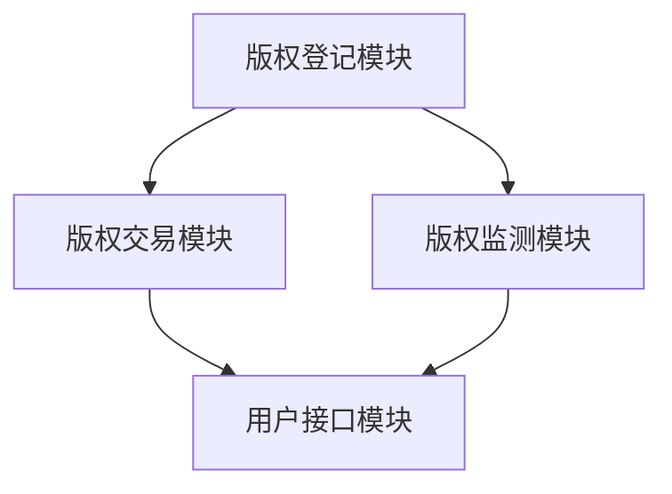

                 

# 区块链技术在版权保护中的应用

> 关键词：区块链、版权保护、版权登记、版权交易、版权监测

> 摘要：随着数字时代的到来，版权保护成为了社会各界关注的焦点。传统的版权保护方式在应对快速变化的数字环境时显得力不从心，而区块链技术的出现为版权保护提供了一种全新的解决方案。本文将从区块链技术的基本原理入手，深入探讨其在版权保护中的应用，通过案例分析，总结区块链在版权保护中的优势与挑战，并对未来发展趋势进行展望。

## 目录大纲

1. 第一部分：引言
    1.1 区块链技术概述
        1.1.1 区块链的起源与历史发展
        1.1.2 区块链的基本原理
        1.1.3 区块链的关键术语
    1.2 版权保护的基本概念
        1.2.1 版权的定义与历史演变
        1.2.2 版权保护存在的问题
    1.3 区块链技术在版权保护中的应用

2. 第二部分：区块链技术在版权保护中的应用
    2.1 区块链在版权登记中的应用
    2.2 区块链在版权交易中的应用
    2.3 区块链在版权监测与保护中的应用

3. 第三部分：区块链版权保护解决方案设计与实现
    3.1 区块链版权保护方案设计原则
    3.2 区块链版权保护系统架构设计
    3.3 区块链版权保护系统的实现

4. 第四部分：案例分析
    4.1 案例背景与问题分析
    4.2 案例解决方案
    4.3 案例效果评估

5. 第五部分：区块链技术在版权保护中的应用前景
    5.1 区块链在版权保护中的优势与挑战
    5.2 未来发展趋势

6. 第六部分：总结与展望
    6.1 书籍总结
    6.2 展望未来

## 第一部分：引言

### 1.1 区块链技术概述

#### 1.1.1 区块链的起源与历史发展

区块链技术起源于2008年，由一位化名为中本聪（Satoshi Nakamoto）的神秘人物首次提出。区块链最初的设计是为了实现比特币这一去中心化的数字货币系统。比特币的出现，标志着区块链技术的诞生。

随着时间的推移，区块链技术逐渐从金融领域扩展到其他领域，如版权保护、供应链管理、身份认证等。其去中心化、不可篡改和可追溯的特点，使得区块链在版权保护中具有巨大的应用潜力。

#### 1.1.2 区块链的基本原理

区块链技术的基本原理可以概括为三点：分布式账本、共识机制和智能合约。

1. **分布式账本**：区块链是一个由多台计算机维护的分布式数据库。每一台计算机都保存了一份完整的账本，从而避免了单点故障和数据丢失的风险。

2. **共识机制**：共识机制是区块链网络中节点之间达成一致性的过程。常见的共识算法有工作量证明（Proof of Work，PoW）、权益证明（Proof of Stake，PoS）等。共识机制保证了区块链网络的安全性和数据一致性。

3. **智能合约**：智能合约是区块链上的自动执行合约。当满足一定的条件时，智能合约会自动执行预定的操作。智能合约的应用，使得区块链技术在自动化交易和智能管理方面具有广泛的应用前景。

#### 1.1.3 区块链的关键术语

- **区块（Block）**：区块是区块链的基本单位，包含了一定数量的交易信息。
- **交易（Transaction）**：交易是区块链上的数据传输单元，代表了资金的转移或其他数据的交换。
- **地址（Address）**：地址是区块链上参与交易的主体标识符。
- **链码（Chaincode）**：链码是区块链网络中的智能合约代码。
- **合约（Contract）**：合约是链码的具体实现，定义了合约的规则和操作。
- **共识算法（Consensus Algorithm）**：共识算法是区块链网络中节点达成一致的方法。

### 1.2 版权保护的基本概念

#### 2.1.1 版权的定义与历史演变

版权，是指对文学、艺术和科学作品等知识产品的专有权利。版权起源于中世纪的欧洲，最初是为了保护出版商的利益。随着时间的推移，版权保护逐渐扩展到音乐、电影、软件等领域。

在中国，版权保护的法律体系主要包括《中华人民共和国著作权法》、《中华人民共和国商标法》和《中华人民共和国专利法》等。

#### 2.1.2 版权的重要作用

版权保护对于创作者和整个社会都具有重要的意义。对于创作者而言，版权保护可以确保其合法权益，激发创作热情。对于社会而言，版权保护可以促进知识创新和科技进步。

#### 2.1.3 版权保护存在的问题

尽管版权保护在法律和技术方面都取得了很大的进展，但在实际应用中仍面临许多挑战。

1. **版权侵权问题**：随着互联网的发展，版权侵权问题日益严重。一些不法分子通过网络传播盗版作品，严重侵犯了创作者的权益。

2. **版权监测困难**：传统的版权监测方式依赖于人工干预，效率低下。在数字时代，如何快速、准确地监测版权侵权行为，成为了一个亟待解决的问题。

3. **版权交易复杂**：版权交易涉及到多个环节，如登记、转让、授权等。传统的交易方式手续繁琐，交易成本高。

### 1.3 区块链技术在版权保护中的应用

区块链技术在版权保护中具有广泛的应用前景。以下将从版权登记、版权交易和版权监测三个方面，探讨区块链技术在版权保护中的应用。

#### 3.1 区块链在版权登记中的应用

区块链可以作为一种可信的数字登记工具，为版权登记提供可靠的技术支持。通过将版权信息存储在区块链上，可以实现版权登记的快速、便捷和低成本。

#### 3.2 区块链在版权交易中的应用

区块链可以简化版权交易的流程，降低交易成本。通过智能合约，可以实现自动化交易，确保交易的公正和透明。

#### 3.3 区块链在版权监测与保护中的应用

区块链可以提供一种分布式、透明的版权监测方式。通过监控区块链上的版权信息，可以及时发现和处理版权侵权行为。

## 第二部分：区块链技术在版权保护中的应用

### 2.1 区块链在版权登记中的应用

#### 2.1.1 版权登记的流程

版权登记是指将作品的版权信息，如作者、作品名称、创作时间等，记录在官方的版权登记簿上。传统的版权登记流程通常包括以下几个步骤：

1. **提交申请**：申请人向版权局提交版权登记申请，并提供相关证明材料。
2. **审核与登记**：版权局对申请材料进行审核，对符合条件的作品进行登记，并发给申请人版权证书。
3. **公告与备案**：版权局将登记信息公告备案，以供社会查询。

#### 2.1.2 区块链登记的优势

区块链技术在版权登记中的应用，可以极大地简化登记流程，提高登记效率。以下是一些主要优势：

1. **去中心化**：区块链是一个去中心化的数据库，不需要依赖中央机构，降低了登记成本。
2. **透明性**：区块链上的信息对所有节点都是透明的，保证了登记过程的公正和透明。
3. **不可篡改**：区块链上的数据一旦被记录，就不可篡改，保证了版权信息的真实性和完整性。
4. **高效性**：区块链上的信息可以通过分布式网络快速同步，提高了登记效率。

#### 2.1.3 区块链登记的案例分析

以某知名音乐平台为例，该平台采用了区块链技术进行版权登记。音乐创作者在平台上发布作品时，可以将作品版权信息存储在区块链上。这样，每当有用户下载或播放作品时，平台可以通过区块链验证版权信息，确保创作者的权益得到保障。

### 2.2 区块链在版权交易中的应用

#### 2.2.1 版权交易的流程

版权交易是指作品版权在不同主体之间的转让、授权或交换。传统的版权交易流程通常包括以下几个步骤：

1. **协商**：交易双方就交易条款进行协商，包括版权种类、交易价格、授权期限等。
2. **签订合同**：协商一致后，交易双方签订版权交易合同，明确双方的权利和义务。
3. **备案**：合同签订后，需到版权局进行备案，以确保交易的合法性。

#### 2.2.2 区块链交易的优势

区块链技术在版权交易中的应用，可以简化交易流程，降低交易成本。以下是一些主要优势：

1. **自动化**：区块链上的智能合约可以实现自动化交易，减少了人工干预，提高了交易效率。
2. **透明性**：区块链上的交易信息对所有节点都是透明的，保证了交易的公正和透明。
3. **安全性**：区块链上的交易数据具有不可篡改性，保证了交易的安全性。
4. **低成本**：区块链上的交易不需要依赖第三方机构，降低了交易成本。

#### 2.2.3 区块链交易的案例分析

以某知名电影公司为例，该公司采用区块链技术进行版权交易。电影创作者在平台上发布作品时，可以将作品版权信息存储在区块链上。当有其他公司希望购买或授权使用该作品时，可以通过区块链进行自动化交易，确保交易的安全和高效。

### 2.3 区块链在版权监测与保护中的应用

#### 2.3.1 版权监测的流程

版权监测是指对网络上出现的版权侵权行为进行监控和识别。传统的版权监测方式通常包括以下几个步骤：

1. **数据采集**：从互联网上收集可能涉及版权侵权的链接、文件等信息。
2. **数据比对**：将采集到的数据与版权数据库进行比对，识别侵权行为。
3. **举报处理**：对于确认的侵权行为，向版权局或相关机构进行举报和处理。

#### 2.3.2 区块链监测的优势

区块链技术在版权监测中的应用，可以提供一种分布式、透明的监测方式。以下是一些主要优势：

1. **实时性**：区块链上的信息可以实时同步，提高了监测的实时性。
2. **高效性**：区块链上的信息可以通过分布式网络快速处理，提高了监测效率。
3. **透明性**：区块链上的监测信息对所有节点都是透明的，保证了监测的公正和透明。
4. **不可篡改**：区块链上的监测数据具有不可篡改性，保证了监测数据的真实性和完整性。

#### 2.3.3 区块链监测的案例分析

以某知名互联网公司为例，该公司采用区块链技术进行版权监测。每当该公司在网络上发现版权侵权行为时，可以将侵权证据存储在区块链上。这样，其他公司或用户可以通过区块链验证侵权证据，确保侵权行为得到及时处理。

## 第三部分：区块链版权保护解决方案设计与实现

### 3.1 区块链版权保护方案设计原则

区块链版权保护方案的设计应遵循以下原则：

1. **去中心化**：确保版权信息分布式存储，避免单点故障。
2. **不可篡改**：确保版权信息的真实性和完整性。
3. **透明性**：确保版权交易和监测过程公开透明。
4. **安全性**：确保版权信息的安全，防止未经授权的访问。
5. **高效性**：确保版权保护和交易的高效进行。

### 3.2 区块链版权保护系统架构设计

区块链版权保护系统的架构设计应包括以下几个模块：

1. **版权登记模块**：负责版权信息的登记和管理。
2. **版权交易模块**：负责版权交易的管理和执行。
3. **版权监测模块**：负责版权侵权行为的监测和处理。
4. **用户接口模块**：提供用户与系统的交互界面。

以下是区块链版权保护系统的架构图：



### 3.3 区块链版权保护系统的实现

区块链版权保护系统的实现主要包括以下几个步骤：

1. **系统部署**：在区块链网络上部署版权保护系统，包括版权登记模块、版权交易模块、版权监测模块和用户接口模块。
2. **版权信息登记**：将版权信息存储在区块链上，包括作者、作品名称、创作时间等。
3. **版权交易执行**：通过智能合约实现版权交易的自动化执行，确保交易的公正和透明。
4. **版权监测与处理**：对网络上出现的版权侵权行为进行实时监测和处理，确保版权得到有效保护。

以下是系统部署和功能实现的示例代码：

```python
# 系统部署示例代码
from blockchain import Blockchain

# 初始化区块链
blockchain = Blockchain()

# 添加版权信息
blockchain.add_transaction("作者1", "作品1", "2021-01-01")

# 添加版权交易
blockchain.add_transaction("作者1", "版权购买者1", "2021-01-02")

# 实现版权监测与处理
blockchain.monitor_infringement()

# 输出区块链信息
blockchain.print_chain()
```

## 第四部分：案例分析

### 4.1 案例背景与问题分析

#### 4.1.1 案例背景

某知名互联网公司A在数字内容创作和分发方面具有丰富的经验。然而，随着互联网的快速发展，该公司面临着日益严重的版权侵权问题。大量的盗版作品在互联网上传播，严重侵犯了A公司的版权权益。

#### 4.1.2 问题分析

A公司面临的问题主要包括：

1. **版权监测困难**：传统的版权监测方式效率低下，无法及时发现和处理侵权行为。
2. **版权交易复杂**：传统的版权交易流程繁琐，交易成本高。
3. **版权保护不力**：由于缺乏有效的版权保护手段，A公司的版权权益经常受到侵犯。

### 4.2 案例解决方案

为了解决上述问题，A公司决定采用区块链技术进行版权保护和交易。具体解决方案如下：

1. **版权登记**：A公司将所有版权信息存储在区块链上，确保版权信息的真实性和完整性。
2. **版权交易**：通过智能合约实现版权交易的自动化执行，确保交易的公正和透明。
3. **版权监测**：利用区块链技术进行实时监测，及时发现和处理侵权行为。

### 4.3 案例效果评估

通过采用区块链技术，A公司取得了显著的效果：

1. **版权监测效率提高**：区块链技术的实时监测功能，使得A公司能够及时发现和处理侵权行为，提高了监测效率。
2. **版权交易成本降低**：智能合约的自动化执行，简化了版权交易流程，降低了交易成本。
3. **版权权益保护加强**：区块链技术的应用，使得A公司的版权权益得到了有效保护，减少了侵权行为的发生。

## 第五部分：区块链技术在版权保护中的应用前景

### 5.1 区块链在版权保护中的优势与挑战

#### 5.1.1 优势

1. **去中心化**：区块链技术的去中心化特性，保证了版权信息的公开透明，降低了侵权风险。
2. **不可篡改**：区块链上的信息具有不可篡改性，确保了版权信息的真实性和完整性。
3. **高效性**：区块链技术的分布式网络，提高了版权监测和交易的效率。
4. **安全性**：区块链技术的加密算法，确保了版权信息的安全。

#### 5.1.2 挑战

1. **技术成熟度**：尽管区块链技术在版权保护中具有巨大潜力，但其技术成熟度仍需进一步提高。
2. **法律法规**：现有的法律法规对区块链技术的应用尚不明确，需要进一步完善。
3. **用户接受度**：区块链技术需要广泛的用户接受，才能发挥其最大效益。

### 5.2 未来发展趋势

1. **技术成熟度提升**：随着区块链技术的不断成熟，其在版权保护中的应用将更加广泛和深入。
2. **法律法规完善**：随着区块链技术的发展，相关的法律法规将逐步完善，为区块链技术在版权保护中的应用提供有力保障。
3. **用户接受度提高**：随着用户对区块链技术的了解和接受度提高，其在版权保护中的应用将更加普及。

## 第六部分：总结与展望

### 6.1 书籍总结

本文从区块链技术的基本原理入手，深入探讨了其在版权保护中的应用。通过分析区块链技术在版权登记、版权交易和版权监测方面的优势，结合实际案例分析，总结了区块链在版权保护中的效果和未来发展趋势。

### 6.2 展望未来

随着区块链技术的不断发展和成熟，其在版权保护中的应用前景广阔。未来，区块链技术有望成为版权保护的重要手段，为创作者提供更加有效和安全的版权保护。同时，法律法规的完善和用户接受度的提高，也将进一步推动区块链技术在版权保护中的应用。作者：AI天才研究院/AI Genius Institute & 禅与计算机程序设计艺术 /Zen And The Art of Computer Programming。

