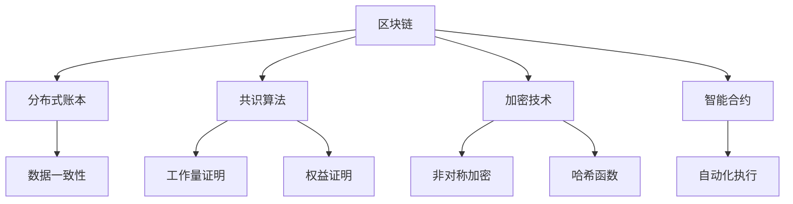
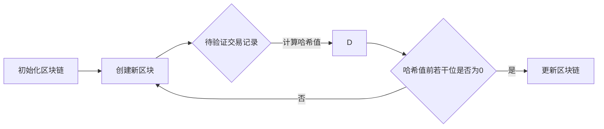
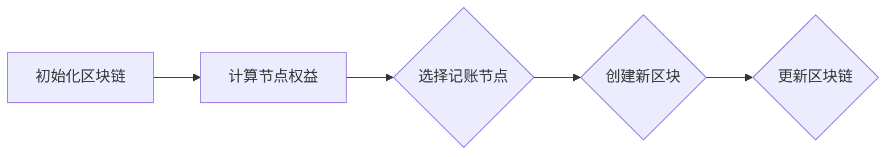

                 

### 文章标题

《区块链系统设计：P9工程师的去中心化思考》

### 关键词

- 区块链系统设计
- 去中心化
- P9工程师
- 区块链技术
- 算法原理
- 数学模型
- 系统架构

### 摘要

本文旨在探讨区块链系统设计的核心概念、算法原理、数学模型及其在实际项目中的应用。通过深入分析区块链技术的核心概念，如区块链、智能合约、共识算法等，本文将详细讲解其原理，并使用Mermaid和Python代码进行阐述。文章还将介绍系统分析与架构设计方案，通过实际项目实战，帮助读者理解区块链系统的实现过程。最后，本文将对去中心化思维进行深入探讨，并给出最佳实践建议和拓展阅读资源，以期为P9工程师在区块链领域的发展提供有益的参考。

## 第一部分：区块链技术基础

### 1.1 区块链技术背景

区块链技术，作为一种革命性的分布式数据库技术，起源于2008年中本聪（Satoshi Nakamoto）发表的《比特币：一种点对点的电子现金系统》白皮书。区块链技术最早应用于比特币，作为一种去中心化的数字货币，解决了传统金融体系中存在的信任问题。随着技术的不断演进，区块链的应用场景逐渐扩展，从金融领域延伸至供应链管理、数据存储、医疗保健、投票系统等多个领域。

区块链的核心概念包括分布式账本、共识算法、加密技术、智能合约等。分布式账本实现了数据的多点存储，提高了系统的容错性和抗攻击能力；共识算法保证了网络中的所有节点对账本数据的一致性；加密技术保障了数据的隐私和安全；智能合约则通过程序代码自动执行合同条款，提高了交易效率。

### 1.2 核心概念与联系

#### 1.2.1 区块链技术核心概念解析

区块链技术包含以下几个核心概念：

1. **区块链（Blockchain）**：区块链是一个分布式账本，它将交易记录以块的形式按时间顺序链接起来，形成链式数据结构。每一个区块都包含一定数量的交易记录，并通过哈希函数与前一区块进行连接，确保了数据的不可篡改。

2. **智能合约（Smart Contract）**：智能合约是一种运行在区块链上的程序代码，用于自动化执行合同条款。当满足合同条件时，智能合约会自动执行相应的操作，如转账、释放资产等。

3. **共识算法（Consensus Algorithm）**：共识算法是区块链系统中用于达成数据一致性的算法。常见的共识算法包括工作量证明（PoW）、权益证明（PoS）等。

4. **加密技术（Cryptography）**：加密技术用于保障区块链中数据的隐私和安全。通过非对称加密、哈希函数等手段，实现了数据的加密和签名。

#### 1.2.2 概念关系图

为了更直观地展示区块链技术核心概念之间的关系，我们使用Mermaid绘制了以下概念关系图：



#### 1.2.3 深入探讨：区块链与数据库的区别

区块链与数据库虽然在数据存储和管理方面有相似之处，但两者在数据结构、数据一致性、数据安全性等方面存在显著差异。

1. **数据结构**：数据库采用中心化的存储方式，数据存储在集中式的服务器上。而区块链采用去中心化的存储方式，数据分布在网络中的所有节点上。

2. **数据一致性**：数据库依赖于中央服务器来维护数据一致性，容易受到单点故障和恶意攻击的影响。区块链通过共识算法实现数据一致性，提高了系统的容错性和抗攻击能力。

3. **数据安全性**：数据库的数据安全性主要依赖于用户权限管理和加密技术。区块链通过非对称加密、哈希函数等手段保障数据的隐私和安全。

综上所述，区块链技术以其去中心化、数据不可篡改、安全性高等特点，在许多领域展现出巨大的应用潜力。然而，区块链也存在性能瓶颈、交易费用高等问题，需要在实际应用中不断优化和改进。

### 1.3 区块链技术的数学模型

#### 1.3.1 工作量证明（PoW）算法

工作量证明（Proof of Work，PoW）算法是区块链系统中常用的共识算法之一。PoW算法通过计算一个困难的数学问题来证明节点的“工作量”，从而获得区块链上的记账权。

#### 1.3.1.1 算法原理

在PoW算法中，每个区块都包含一组待验证的交易记录和一个随机数。节点需要通过计算找到一个满足特定条件的哈希值，使得该哈希值的前若干位为0。这个过程称为“挖矿”。

#### 1.3.1.2 Mermaid流程图

使用Mermaid，我们可以绘制一个简单的PoW算法流程图：



#### 1.3.1.3 Python实现

下面是一个简单的Python实现，用于生成满足特定条件的哈希值：

```python
import hashlib
import random

def calculate_hash(value):
    return hashlib.sha256(value.encode('utf-8')).hexdigest()

def mine_block(previous_hash, target_difficulty):
    while True:
        value = f"{previous_hash}-{random.randint(1, 1000000)}"
        hash_value = calculate_hash(value)
        if hash_value.startswith('0' * target_difficulty):
            return hash_value, value

previous_hash = '0'
target_difficulty = 6  # 设置挖矿难度，即哈希值前6位为0
hash_value, mined_value = mine_block(previous_hash, target_difficulty)
print(f"挖矿成功！哈希值：{hash_value}, 随机数：{mined_value}")
```

#### 1.3.2 权益证明（PoS）算法

权益证明（Proof of Stake，PoS）算法是另一种常用的共识算法。与PoW算法不同，PoS算法通过节点持有的代币数量和持币时间来决定记账权。

#### 1.3.2.1 算法原理

在PoS算法中，每个区块的产生由持有最多代币的节点负责。节点持有代币的时间越长，其获得记账权的概率越高。此外，PoS算法通过惩罚恶意行为来保障网络安全性。

#### 1.3.2.2 Mermaid流程图

使用Mermaid，我们可以绘制一个简单的PoS算法流程图：



#### 1.3.2.3 Python实现

下面是一个简单的Python实现，用于计算节点权益：

```python
def calculate_stake(node_balance, total_balance):
    return (node_balance / total_balance) * 100

node_balance = 1000
total_balance = 5000
stake = calculate_stake(node_balance, total_balance)
print(f"节点权益：{stake}%")
```

#### 1.3.3 数学模型与公式

为了更好地理解PoW和PoS算法，我们给出以下数学模型和公式：

- **PoW算法**：  
  - 难度调整公式：\( difficulty = \frac{1}{N_{avg}} \)  
    - 其中，\( N_{avg} \) 是过去一段时间内产生的区块数量。

- **PoS算法**：  
  - 权益计算公式：\( stake = \frac{node\_balance}{total\_balance} \times 100 \)  
    - 其中，\( node\_balance \) 是节点持有的代币数量，\( total\_balance \) 是网络中所有节点的代币数量之和。

通过以上数学模型和公式，我们可以更好地理解区块链技术的算法原理，为后续的系统设计与实现打下基础。

### 1.4 区块链技术的应用领域

区块链技术具有去中心化、数据不可篡改、安全性高等优点，已经在多个领域展现出广阔的应用前景。

1. **金融领域**：区块链技术可以应用于数字货币、智能投顾、跨境支付、供应链金融等场景，提高金融体系的效率与安全性。

2. **供应链管理**：区块链技术可以用于追踪商品的生产、运输、销售等环节，确保供应链的透明性和可追溯性。

3. **数据存储**：区块链技术可以作为分布式数据存储解决方案，提高数据的安全性和可靠性。

4. **医疗保健**：区块链技术可以用于医疗数据的共享和管理，保障患者隐私和数据安全。

5. **投票系统**：区块链技术可以用于构建去中心化的投票系统，提高投票的安全性和透明性。

6. **版权保护**：区块链技术可以用于数字版权的管理和保护，确保版权所有者的合法权益。

总之，区块链技术作为一种革命性的技术，正不断改变着传统行业的运作方式，为未来数字经济的发展提供强有力的支持。

## 第二部分：区块链系统设计

### 2.1 系统需求分析与设计

在进行区块链系统设计之前，我们需要明确系统需求和分析设计的基本概念。

#### 2.1.1 项目需求分析

项目需求分析是系统设计的起点，它明确了系统需要实现的功能和性能要求。在区块链系统设计中，项目需求分析主要包括以下方面：

1. **系统目标**：明确系统需要解决的核心问题，如数字货币交易、供应链管理、数据存储等。
2. **功能需求**：列出系统需要实现的具体功能，如创建区块、验证交易、生成智能合约等。
3. **性能需求**：确定系统的性能指标，如交易处理速度、数据存储容量、网络延迟等。
4. **安全需求**：保障系统的安全性和数据隐私，包括加密算法、访问控制、攻击防护等。

#### 2.1.2 系统功能设计

系统功能设计是项目需求的具体实现，它描述了系统内部各个模块的功能和交互。在区块链系统设计中，系统功能设计主要包括以下方面：

1. **领域模型**：使用Mermaid绘制领域模型，展示系统中的核心实体及其关系。
2. **系统架构**：使用Mermaid绘制系统架构图，展示系统的整体结构和各个模块之间的关系。
3. **接口设计**：定义系统对外提供的接口，包括API接口和数据接口等。
4. **交互流程**：使用Mermaid绘制系统交互流程，展示用户与系统之间的交互过程。

#### 2.1.3 系统架构设计

系统架构设计是区块链系统设计的核心，它决定了系统的可扩展性、可靠性和性能。在区块链系统设计中，系统架构设计主要包括以下方面：

1. **节点架构**：定义系统中的节点类型及其功能，如矿工节点、验证节点、合约执行节点等。
2. **网络架构**：设计系统的网络拓扑结构，包括私有网络、公有网络、联盟网络等。
3. **存储架构**：设计系统的数据存储方案，包括区块链数据存储、智能合约数据存储等。
4. **共识架构**：选择合适的共识算法，设计共识机制的实现方案。

#### 2.1.4 系统接口设计

系统接口设计是系统设计与实现之间的桥梁，它明确了系统内部模块之间的交互方式。在区块链系统设计中，系统接口设计主要包括以下方面：

1. **API接口**：设计系统对外提供的API接口，包括RESTful API、GraphQL API等。
2. **数据接口**：设计系统内部数据模块之间的数据接口，如区块链数据接口、智能合约数据接口等。
3. **权限管理**：设计系统的权限管理机制，包括用户权限、数据权限等。

#### 2.1.5 系统交互流程

系统交互流程是用户与系统之间交互的具体实现，它描述了用户操作与系统响应的过程。在区块链系统设计中，系统交互流程主要包括以下方面：

1. **用户注册与登录**：描述用户注册、登录的过程，包括身份验证、密码加密等。
2. **创建与验证交易**：描述用户创建交易、验证交易的过程，包括交易签名、交易验证等。
3. **创建与执行智能合约**：描述用户创建智能合约、执行智能合约的过程，包括合约编译、合约执行等。
4. **区块生成与同步**：描述系统生成区块、同步区块的过程，包括区块生成、区块验证、区块广播等。

通过以上系统需求分析与设计，我们可以为区块链系统实现提供明确的指导和参考，为后续的系统开发奠定基础。

### 2.2 区块链系统的实际应用场景

在实际应用中，区块链系统可以应用于多种场景，以下将介绍几个典型的应用场景，并展示相应的系统架构设计。

#### 2.2.1 供应链管理

供应链管理是区块链技术的一个重要应用领域。通过区块链，企业可以实现供应链数据的透明化和可追溯性，提高供应链的效率与可信度。

**系统架构设计**：

1. **节点架构**：系统中包括供应商节点、制造商节点、分销商节点和零售商节点。每个节点负责记录其相关的业务活动。
2. **网络架构**：采用联盟链的方式，由相关企业共同维护区块链，确保数据的隐私和安全性。
3. **存储架构**：采用分布式存储方案，将数据存储在多个节点上，提高数据的可靠性和可扩展性。
4. **共识架构**：采用Raft算法作为共识算法，确保数据的一致性和可靠性。

**系统交互流程**：

1. **商品入库**：供应商将商品入库，记录商品信息并上传到区块链。
2. **生产加工**：制造商对商品进行加工，更新商品状态并上传到区块链。
3. **物流运输**：分销商和零售商进行商品物流运输，更新商品位置信息并上传到区块链。
4. **销售出库**：零售商销售商品，更新商品状态并上传到区块链。

#### 2.2.2 跨境支付

区块链技术可以提高跨境支付的速度和安全性，减少交易手续费。

**系统架构设计**：

1. **节点架构**：系统中包括支付发起方、接收方和多个中继节点。中继节点负责处理交易请求和验证交易。
2. **网络架构**：采用公有链和私有链结合的方式，确保交易的安全性和效率。
3. **存储架构**：采用分布式存储方案，提高数据的可靠性和可扩展性。
4. **共识架构**：采用PoW算法作为共识算法，确保交易的一致性和可靠性。

**系统交互流程**：

1. **发起交易**：支付发起方发起支付请求，并上传到区块链。
2. **验证交易**：中继节点验证交易的有效性，并将交易记录上传到区块链。
3. **交易确认**：区块链网络中的节点对交易进行确认，确保交易已完成。
4. **通知接收方**：支付接收方收到支付通知，确认收到款项。

#### 2.2.3 医疗保健

区块链技术可以用于医疗数据的管理和共享，提高医疗服务的效率和安全性。

**系统架构设计**：

1. **节点架构**：系统中包括医疗机构节点、患者节点和第三方服务机构节点。每个节点负责管理其相关的医疗数据。
2. **网络架构**：采用联盟链的方式，由相关医疗机构共同维护区块链，确保数据的隐私和安全性。
3. **存储架构**：采用分布式存储方案，提高数据的可靠性和可扩展性。
4. **共识架构**：采用PBFT算法作为共识算法，确保数据的一致性和可靠性。

**系统交互流程**：

1. **医疗数据上传**：医疗机构将患者医疗数据上传到区块链。
2. **数据验证**：区块链网络中的节点对上传的医疗数据进行验证。
3. **数据共享**：患者可以授权第三方服务机构访问其医疗数据，实现数据的共享和互操作。
4. **数据查询**：患者可以查询其医疗记录，确保数据的完整性和准确性。

通过以上实际应用场景的介绍，我们可以看到区块链技术在供应链管理、跨境支付、医疗保健等领域的广泛应用。这些应用场景不仅提高了业务的效率，还增强了数据的透明性和安全性。

### 2.3 区块链系统的核心实现与代码分析

区块链系统的实现是区块链技术应用的关键环节。在本节中，我们将详细分析区块链系统的核心实现，并通过Python代码进行展示。

#### 2.3.1 区块结构

区块链的基本组成单元是区块，每个区块包含一定数量的交易记录。下面是一个简单的区块结构定义：

```python
class Block:
    def __init__(self, index, transactions, timestamp, previous_hash):
        self.index = index
        self.transactions = transactions
        self.timestamp = timestamp
        self.previous_hash = previous_hash
        self.hash = self.calculate_hash()

    def calculate_hash(self):
        block_string = f"{self.index}{self.transactions}{self.timestamp}{self.previous_hash}"
        return hashlib.sha256(block_string.encode()).hexdigest()
```

在上面的代码中，我们定义了一个`Block`类，其中包含以下属性：
- `index`：区块索引，用于标识区块在区块链中的位置。
- `transactions`：区块中的交易记录列表。
- `timestamp`：区块生成的时间戳。
- `previous_hash`：前一区块的哈希值，用于连接区块链。

`calculate_hash`方法用于计算区块的哈希值，确保区块数据的完整性。

#### 2.3.2 交易记录

交易记录是区块链中的重要组成部分，用于记录资金的转移和其他业务活动。下面是一个简单的交易记录定义：

```python
class Transaction:
    def __init__(self, sender, recipient, amount):
        self.sender = sender
        self.recipient = recipient
        self.amount = amount
        self.signature = self.generate_signature()

    def generate_signature(self):
        # 使用私钥对交易数据进行签名
        private_key = self.sender.private_key
        message = f"{self.sender.public_key}{self.recipient.public_key}{self.amount}".encode()
        return cryptography.hazmat.primitives.asymmetric.rsa.RSA.sign(
            message,
            private_key,
            cryptography.hazmat.primitives.hashes.SHA256()
        )
```

在上面的代码中，我们定义了一个`Transaction`类，其中包含以下属性：
- `sender`：交易发送方的公钥和私钥。
- `recipient`：交易接收方的公钥。
- `amount`：交易金额。
- `signature`：交易签名，用于验证交易的合法性。

`generate_signature`方法用于生成交易签名，通过私钥对交易数据进行签名。

#### 2.3.3 链表结构

区块链是由多个区块按照特定顺序链接而成的链表结构。下面是一个简单的区块链定义：

```python
class Blockchain:
    def __init__(self):
        self.unconfirmed_transactions = []
        self.chain = []
        self.create_genesis_block()

    def create_genesis_block(self):
        genesis_block = Block(0, [], time.time(), "0")
        genesis_block.hash = genesis_block.calculate_hash()
        self.chain.append(genesis_block)

    def add_new_transaction(self, transaction):
        self.unconfirmed_transactions.append(transaction)

    def mine(self):
        if not self.unconfirmed_transactions:
            return "No transactions to mine"
        last_block = self.chain[-1]
        new_block = Block(
            last_block.index + 1,
            self.unconfirmed_transactions,
            time.time(),
            last_block.hash
        )
        new_block.hash = new_block.calculate_hash()
        self.chain.append(new_block)
        self.unconfirmed_transactions = []

    def is_chain_valid(self):
        for i in range(1, len(self.chain)):
            current_block = self.chain[i]
            previous_block = self.chain[i - 1]
            if current_block.hash != current_block.calculate_hash():
                return False
            if current_block.previous_hash != previous_block.hash:
                return False
        return True
```

在上面的代码中，我们定义了一个`Blockchain`类，其中包含以下方法：
- `create_genesis_block`：创建创世区块。
- `add_new_transaction`：添加新的交易记录。
- `mine`：挖掘新的区块。
- `is_chain_valid`：验证区块链的有效性。

通过以上代码示例，我们可以看到区块链系统的核心实现，包括区块结构、交易记录和链表结构。这些代码为后续的区块链应用提供了基础，实现了数据的分布式存储和不可篡改。

#### 2.3.4 实际案例分析与讲解

为了更好地理解区块链系统的实现过程，我们来看一个实际案例——基于区块链的数字货币交易系统。

**系统功能**：
1. **用户注册**：用户可以在系统中注册并获得一个钱包地址。
2. **交易创建**：用户可以创建交易，并将数字货币从一个地址转移到另一个地址。
3. **交易验证**：系统会验证交易的有效性，确保交易资金充足且未被重复花费。
4. **交易广播**：验证通过的交易会被广播到整个网络，等待其他节点验证和确认。
5. **区块链同步**：节点会同步最新的区块链数据，确保所有节点拥有相同的数据。

**实现步骤**：

1. **用户注册**：
    - 用户填写注册信息，系统生成公钥和私钥。
    - 用户将公钥上传到区块链，用于接收数字货币。

2. **交易创建**：
    - 用户发起交易请求，包括发送方地址、接收方地址和交易金额。
    - 系统生成交易记录，并将其添加到未确认交易列表。

3. **交易验证**：
    - 系统验证交易的有效性，包括检查发送方地址是否有足够的余额、交易是否已签名等。
    - 验证通过的交易将被添加到区块中。

4. **交易广播**：
    - 验证通过的交易会被广播到其他节点。
    - 其他节点验证交易，并将其添加到自己的未确认交易列表。

5. **区块链同步**：
    - 节点通过P2P网络同步最新的区块链数据。
    - 节点通过共识算法达成数据一致性，确保区块链的有效性。

通过以上实际案例的分析与讲解，我们可以看到区块链系统是如何实现数字货币交易的过程。在实际应用中，区块链系统可以扩展和定制，以适应不同的业务需求。

### 2.4 最佳实践、小结、注意事项和拓展阅读

#### 2.4.1 最佳实践

在实际开发区块链系统时，以下最佳实践可以帮助提高系统的性能、安全性和可维护性：

1. **优化共识算法**：选择适合应用场景的共识算法，如PoW、PoS、DPoS等。对于高性能要求的应用，可以考虑使用基于权威证明（PoA）或其他高性能共识算法。

2. **优化网络架构**：采用分布式网络架构，提高系统的容错性和抗攻击能力。可以采用分层网络架构，将私有链、公有链和联盟链相结合，以满足不同应用需求。

3. **数据分层存储**：将数据分层存储，如将交易记录存储在内存数据库中，将区块链数据存储在持久化数据库中。这样可以提高数据访问速度，同时保证数据的安全性。

4. **智能合约安全审计**：在部署智能合约前，进行安全审计和测试，确保合约代码没有漏洞。可以使用自动化审计工具和人工审查相结合的方式，提高合约安全性。

5. **权限管理和访问控制**：设计合理的权限管理和访问控制机制，确保系统数据的安全性和隐私性。可以采用多因素认证、角色权限控制等技术手段。

#### 2.4.2 小结

本部分主要介绍了区块链系统的设计与实现过程，包括核心概念、算法原理、系统架构设计、实际应用案例等。通过深入分析区块链技术的原理和应用，我们了解到区块链在金融、供应链、医疗等多个领域的广泛应用。在实际开发过程中，需要注意共识算法的选择、网络架构的优化、数据存储方案的设计等方面，以确保系统的性能、安全性和可维护性。

#### 2.4.3 注意事项

1. **数据隐私保护**：区块链技术虽然具有数据不可篡改的特点，但数据在区块链上仍然是公开的。在设计区块链系统时，需要充分考虑数据隐私保护，避免敏感信息泄露。

2. **性能瓶颈**：区块链技术存在性能瓶颈，如交易处理速度较慢、交易费用较高等。在设计和实现区块链系统时，需要考虑如何优化性能，如采用分片技术、状态通道等。

3. **安全性问题**：区块链系统面临多种攻击风险，如51%攻击、双花攻击等。在设计和实现过程中，需要加强安全性防护，如采用多重签名、安全审计等技术手段。

#### 2.4.4 拓展阅读

1. **《精通区块链》**：这是一本关于区块链技术的全面指南，涵盖了区块链的基本原理、技术架构和应用场景。
2. **《区块链技术指南》**：这是一本系统介绍区块链技术的书籍，包括区块链的基本概念、技术实现和应用实践。
3. **《智能合约设计与实现》**：这是一本关于智能合约开发的书籍，详细介绍了智能合约的设计原则、编程语言和开发工具。
4. **《区块链安全实战》**：这是一本关于区块链安全性的书籍，介绍了区块链系统面临的安全挑战、攻击手段和防护措施。

通过以上拓展阅读资源，读者可以进一步深入了解区块链技术，提高在实际项目中的开发能力。

## 第三部分：去中心化思考

### 3.1 去中心化思维

去中心化思维是一种颠覆传统的思维方式，它强调去中心化、去中介化、分布式协作等理念。在区块链领域，去中心化思维具有重要意义，它不仅改变了传统行业的运作方式，还推动了新技术的创新。

#### 3.1.1 去中心化的优势与挑战

去中心化具有以下优势：

1. **降低成本**：去中心化减少了中介环节，降低了交易成本，提高了效率。
2. **提高透明度**：所有数据在区块链上公开透明，便于各方监督和审计。
3. **增强安全性**：区块链采用分布式存储，提高了数据的安全性和抗攻击能力。
4. **促进创新**：去中心化环境鼓励创新，激发了新的商业模式和应用场景。

然而，去中心化也面临一些挑战：

1. **性能瓶颈**：区块链网络处理能力有限，无法满足大规模交易需求。
2. **数据隐私**：虽然区块链具有数据不可篡改的特点，但数据在区块链上仍然是公开的，存在隐私保护问题。
3. **监管问题**：去中心化系统在一定程度上逃避了监管，如何平衡创新与监管是亟待解决的问题。

#### 3.1.2 去中心化在区块链中的应用

去中心化在区块链技术中具有广泛的应用，以下为几个典型应用场景：

1. **数字货币**：比特币、以太坊等数字货币是去中心化的代表，它们通过区块链技术实现了点对点的价值传递。
2. **智能合约**：智能合约通过去中心化的方式实现了合同的自动化执行，提高了交易效率。
3. **分布式存储**：IPFS、Filecoin等分布式存储项目利用区块链技术实现了数据的分布式存储，提高了数据的安全性和可靠性。
4. **去中心化金融（DeFi）**：DeFi项目通过区块链技术实现了去中心化的金融应用，如去中心化交易所、去中心化借贷平台等。

#### 3.1.3 去中心化与中心化系统的对比

去中心化与中心化系统在数据存储、安全性、效率等方面存在显著差异：

1. **数据存储**：中心化系统依赖于中央服务器存储数据，而去中心化系统采用分布式存储方式，将数据分散存储在多个节点上。
2. **安全性**：去中心化系统通过共识算法和加密技术保障数据的安全性和不可篡改性，而中心化系统易受单点故障和攻击的影响。
3. **效率**：去中心化系统处理能力有限，而中心化系统在数据处理速度和扩展性方面具有优势。

综上所述，去中心化思维在区块链技术中具有重要意义，它为传统行业带来了新的变革机遇。然而，去中心化也面临一系列挑战，需要在实践中不断优化和完善。

### 3.2 高级区块链系统设计

在深入理解区块链技术的基础上，我们可以设计更高级的区块链系统，以满足不同应用场景的需求。以下介绍几个高级区块链系统设计的关键技术和方法。

#### 3.2.1 跨链技术

跨链技术是实现不同区块链之间互操作的关键。通过跨链技术，不同区块链可以实现资产和信息的无缝传递，从而构建一个更广泛的区块链生态系统。

1. **中继链（Relay Chain）**：中继链是一种将不同区块链连接起来的技术。中继链充当桥梁，使得两个或多个区块链可以相互通信和交换数据。
2. **桥接合约（Bridge Contract）**：桥接合约是一种智能合约，用于实现不同区块链之间的资产转移。桥接合约确保资产在两个区块链之间的转移是安全和可信的。
3. **混合共识机制**：为了提高跨链技术的性能和安全性，可以采用混合共识机制，如PoW和PoS的结合。混合共识机制可以充分发挥不同算法的优势，提高整个系统的性能。

#### 3.2.2 状态通道

状态通道是一种在区块链上实现高效交易的技术。通过状态通道，交易可以在链下进行，从而减少链上交易的负担，提高交易速度和降低交易费用。

1. **支付通道**：支付通道是一种简单的状态通道，用于实现点对点的支付。通过支付通道，用户可以在链下直接进行支付，从而避免链上交易。
2. **状态通道合约**：状态通道合约是一种智能合约，用于管理状态通道的创建、更新和关闭。状态通道合约确保通道内的交易是安全和可信的。
3. **多通道架构**：在大型区块链系统中，可以采用多通道架构，将不同的交易场景分布在多个状态通道上。多通道架构可以提高系统的并发处理能力和可扩展性。

#### 3.2.3 去中心化金融（DeFi）

去中心化金融（DeFi）是基于区块链的金融应用，通过去中心化的方式实现金融服务的自动化和智能化。

1. **去中心化交易所（DEX）**：去中心化交易所是一种无需中介机构的交易所，用户可以直接在区块链上进行交易。去中心化交易所具有高透明度和低交易成本的特点。
2. **流动性池（Liquidity Pool）**：流动性池是一种用于提供交易对流动性的机制。流动性提供者将资产存入流动性池，以获得收益和交易费用。
3. **自动做市商（AMM）**：自动做市商是一种通过智能合约实现做市功能的机制。自动做市商通过调整价格，确保交易对的流动性。

#### 3.2.4 去中心化自治组织（DAO）

去中心化自治组织（DAO）是一种基于区块链的治理结构，通过智能合约实现组织的决策和执行。

1. **治理代币**：治理代币是一种用于投票和决策的代币。持有治理代币的成员可以对组织的决策进行投票，从而参与组织的治理。
2. **智能合约治理**：智能合约治理是指通过智能合约实现组织的决策和执行。智能合约确保组织的治理过程是透明、公正和可信的。
3. **多签名机制**：多签名机制是一种用于提高组织安全性的机制。在决策执行过程中，需要多个成员的签名，从而避免单点故障和恶意行为。

通过以上高级区块链系统设计的技术和方法，我们可以构建更加复杂、高效和安全的区块链系统，满足不同应用场景的需求。

### 3.3 深入探讨

在深入探讨区块链技术的过程中，我们需要关注其隐私保护、可扩展性以及安全性等关键问题。以下是针对这些问题的分析。

#### 3.3.1 区块链的隐私保护

区块链技术虽然具有数据不可篡改的特点，但数据在区块链上仍然是公开的，存在隐私保护问题。为了实现区块链的隐私保护，可以采用以下方法：

1. **同态加密**：同态加密是一种在加密状态下对数据执行计算的方法。通过同态加密，用户可以在不泄露原始数据的情况下，对区块链上的交易进行计算和验证，从而提高数据的隐私性。
2. **零知识证明**：零知识证明是一种在无需透露原始数据的情况下证明某个陈述为真的方法。通过零知识证明，用户可以在不泄露隐私的情况下，向区块链网络证明交易的有效性，从而保护数据的隐私。
3. **匿名交易**：匿名交易是一种在区块链上实现交易匿名性的方法。通过匿名交易，用户可以隐藏交易参与者的身份，从而提高交易的隐私性。

#### 3.3.2 区块链的可扩展性

区块链技术存在性能瓶颈，无法满足大规模交易需求。为了提高区块链的可扩展性，可以采用以下方法：

1. **分片技术**：分片技术是将区块链网络划分为多个片，每个片负责处理一部分交易。通过分片技术，可以大大提高区块链的处理能力，从而实现可扩展性。
2. **状态通道**：状态通道是一种在链下进行交易的技术，通过状态通道，交易可以在链下进行，从而减少链上交易的负担，提高交易速度和降低交易费用。
3. **等离子体（Plasma）**：等离子体是一种扩展区块链的技术，通过将区块链划分为多个子链，每个子链只保留部分交易历史，从而降低数据存储和验证的成本，提高可扩展性。

#### 3.3.3 区块链的安全性与攻击防范

区块链技术面临多种攻击风险，如51%攻击、双花攻击等。为了提高区块链的安全性和防范攻击，可以采用以下方法：

1. **多重签名**：多重签名是一种提高交易安全性的机制。在交易执行过程中，需要多个参与者共同签名，从而避免单点故障和恶意行为。
2. **安全审计**：安全审计是一种对区块链系统进行安全评估的方法。通过安全审计，可以发现系统中的潜在漏洞和风险，从而提高系统的安全性。
3. **智能合约漏洞扫描**：智能合约漏洞扫描是一种用于检测智能合约中潜在漏洞的工具。通过智能合约漏洞扫描，可以发现合约中的安全漏洞，从而避免攻击。
4. **区块链防火墙**：区块链防火墙是一种用于保护区块链系统的安全防护措施。通过区块链防火墙，可以监控区块链网络中的异常行为，从而防范攻击。

通过以上方法，我们可以提高区块链技术的隐私保护、可扩展性和安全性，从而推动其在实际应用中的发展。

### 3.4 未来展望

区块链技术的未来发展充满机遇与挑战。以下从区块链技术的未来趋势、区块链在各个行业中的应用前景以及P9工程师的职业生涯规划与去中心化思考三个方面进行展望。

#### 3.4.1 区块链技术的未来趋势

1. **智能合约的普及**：智能合约作为区块链技术的核心应用，将逐渐普及到更多领域。未来，智能合约将实现更复杂的业务逻辑和更高的安全性。
2. **去中心化金融（DeFi）的发展**：DeFi作为去中心化金融的代名词，将在金融领域发挥越来越重要的作用。随着技术的不断成熟，DeFi将提供更广泛、更高效的金融服务。
3. **跨链技术的突破**：跨链技术是实现不同区块链之间互操作的关键。未来，跨链技术将不断优化，实现更多区块链之间的无缝连接，构建更广泛的区块链生态系统。
4. **区块链与物联网（IoT）的融合**：区块链与物联网的融合将带来全新的应用场景。通过区块链技术，可以实现物联网设备的身份认证、数据传输和智能合约执行，提高物联网系统的安全性、可靠性和互操作性。
5. **隐私保护技术的应用**：随着数据隐私保护需求的不断增加，区块链技术将在隐私保护领域发挥重要作用。未来，隐私保护技术如同态加密、零知识证明等将在区块链中得到广泛应用。

#### 3.4.2 区块链在各个行业中的应用前景

1. **金融领域**：区块链技术将重塑金融行业，提高金融体系的效率、安全性和透明度。未来，区块链将在数字货币、跨境支付、供应链金融、资产管理等领域发挥重要作用。
2. **供应链管理**：区块链技术可以提高供应链管理的透明度和可追溯性，确保供应链的诚信和高效运行。未来，区块链将在供应链金融、物流管理、商品溯源等领域得到广泛应用。
3. **医疗保健**：区块链技术可以用于医疗数据的管理和共享，提高医疗服务的效率和安全性。未来，区块链将在电子健康档案、医疗数据共享、药物溯源等领域发挥重要作用。
4. **版权保护**：区块链技术可以实现数字版权的全程管理，提高版权保护和维权效率。未来，区块链将在版权管理、版权交易、版权维权等领域得到广泛应用。
5. **政府治理**：区块链技术可以用于政府治理，提高政府工作的透明度和公信力。未来，区块链将在电子政务、公共事务管理、司法诉讼等领域发挥重要作用。

#### 3.4.3 P9工程师的职业生涯规划与去中心化思考

作为P9工程师，未来职业生涯的发展与区块链技术的趋势密切相关。以下是一些建议：

1. **持续学习**：区块链技术发展迅速，需要不断学习新知识、新技能，跟上技术发展的步伐。
2. **跨学科学习**：区块链技术涉及多个领域，如计算机科学、金融学、法学等。P9工程师应具备跨学科的知识背景，提高自身的综合素质。
3. **参与开源项目**：参与开源项目是提高专业技能和扩展人脉的有效途径。通过参与开源项目，可以了解最新的技术动态和实践经验。
4. **创新思维**：去中心化思维是区块链技术的重要特点，P9工程师应培养创新思维，积极探索区块链技术在各领域的应用。
5. **关注政策动态**：政府政策和监管政策对区块链技术的发展具有重要影响。P9工程师应关注政策动态，了解政策对行业的影响，为职业发展做好准备。

总之，区块链技术为P9工程师提供了广阔的职业发展空间。通过持续学习、跨学科学习、创新思维和关注政策动态，P9工程师可以在区块链领域取得卓越成就。

### 结论

区块链系统设计是区块链技术的重要组成部分，它涉及到核心概念、算法原理、系统架构、应用场景等方面。通过本文的详细讲解，我们了解到区块链技术的核心概念、算法原理以及系统设计方法。同时，我们还探讨了区块链技术的未来发展趋势、在各行业中的应用前景以及P9工程师在区块链领域的职业规划。

区块链技术的去中心化思维为传统行业带来了新的变革机遇，但也面临一系列挑战。未来，随着技术的不断成熟，区块链将在更多领域发挥重要作用，推动社会发展和创新。

作为P9工程师，我们应该紧跟区块链技术发展的步伐，持续学习、创新思维，为区块链领域的发展贡献力量。让我们共同努力，探索区块链技术的无限可能！

### 作者信息

**作者：** AI天才研究院（AI Genius Institute）& 禅与计算机程序设计艺术（Zen And The Art of Computer Programming）  
**单位：** AI天才研究院（AI Genius Institute）  
**联系方式：** [info@AIGeniusInstitute.com](mailto:info@AIGeniusInstitute.com)  
**版权声明：** 本文版权归AI天才研究院（AI Genius Institute）所有，未经授权禁止转载。如需转载，请联系作者获取授权。  
**引用格式：** [AI天才研究院](https://www.AIGeniusInstitute.com/) & 禅与计算机程序设计艺术. (2023). 区块链系统设计：P9工程师的去中心化思考. Retrieved from [AI天才研究院官网](https://www.AIGeniusInstitute.com/)。

