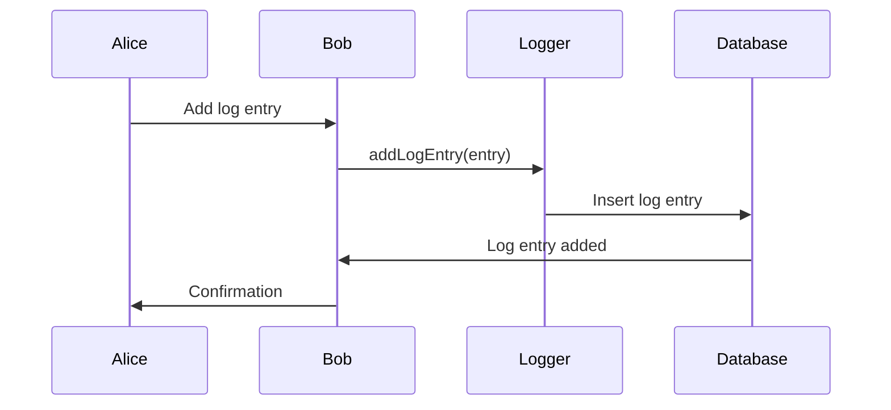

                 

## 引言

### 1.1 类型转换在编程中的重要性

类型转换是编程中不可或缺的一部分，它允许我们在不同的数据类型之间进行操作和通信。无论是将整数转换为字符串，还是将一个自定义类型转换为另一个自定义类型，类型转换都是实现复杂程序逻辑的基础。在泛型编程中，类型转换尤为重要。泛型提供了在编译时进行类型参数化的一种方式，从而避免了运行时的类型检查，提高了程序的灵活性和可重用性。

类型转换的重要性体现在多个方面。首先，它使得程序员能够编写更加通用的代码，无需为每种数据类型编写特定的处理逻辑。其次，类型转换能够避免在运行时因为类型不匹配而导致的错误，从而提高了程序的稳定性和安全性。此外，类型转换在多态、继承等面向对象编程特性中也发挥着重要作用。

### 1.2 协变与逆变的定义与区别

协变（Covariance）与逆变（Contravariance）是泛型编程中的两个重要概念。它们分别描述了类型参数在泛型类型和函数中的行为。

**协变**：协变类型参数允许子类作为父类的泛型类型的实例。例如，如果`List<String>`是`List<Object>`的子类型，那么泛型函数`<T> void function(List<T>)`可以被`function(List<String>)`调用。

**逆变**：逆变类型参数允许父类作为子类的泛型类型的实例。例如，如果`List<Object>`是`List<String>`的父类型，那么泛型函数`<T> void function(List<T>)`可以被`function(List<String>)`调用。

协变与逆变的区别在于它们的类型转换方向。协变是从子类型向父类型转换，而逆变是从父类型向子类型转换。理解这两个概念是深入掌握泛型编程的关键。

### 1.3 协变与逆变在实际开发中的应用场景

在实际开发中，协变与逆变有着广泛的应用。以下是一些典型的应用场景：

1. **数据存储与检索**：在数据存储系统中，可以使用协变类型参数来定义一个泛型接口，使得数据存储类能够适应多种数据类型。例如，一个`Storage<T>`接口可以同时支持存储字符串和数字。

2. **工厂模式**：在工厂模式中，协变类型参数可以帮助创建不同类型对象的工厂类保持通用性。例如，一个`Factory<T>`接口可以创建特定类型的对象，同时允许子类扩展以创建更具体的对象。

3. **接口与抽象类**：在定义接口和抽象类时，使用逆变类型参数可以确保实现类满足父类的泛型类型要求。这有助于在继承和实现关系中使用泛型。

4. **类型安全转换**：协变与逆变的组合使用可以实现类型安全的转换，从而避免运行时错误。

通过以上分析，我们可以看出协变与逆变在泛型编程中的重要性。在接下来的章节中，我们将进一步探讨泛型的基础知识，并深入解析协变与逆变的原理和应用。

## 泛型基础

### 2.1 泛型的概念与作用

泛型编程是面向对象编程中的一项重要技术，它通过引入类型参数，使得代码更加通用和灵活。泛型的基本概念可以概括为：通过使用类型参数，将代码与具体的数据类型解耦，从而实现代码的复用。

**泛型的概念**：泛型在编程语言中表现为一种参数化的类型，它允许程序员在定义类、接口和方法时指定一个或多个类型参数，这些类型参数在代码中使用时被替换为具体的数据类型。例如，在Java中，`List<T>`中的`T`就是一个类型参数。

**泛型的作用**：泛型编程带来了多方面的优势：
1. **类型安全**：泛型确保在编译时进行类型检查，从而避免了运行时因为类型不匹配而产生的错误。
2. **代码复用**：通过泛型，程序员可以编写通用的代码，无需为每种数据类型单独编写处理逻辑。
3. **减少错误**：泛型使得代码更加清晰，减少了类型相关的错误。
4. **性能提升**：泛型可以使得编译器生成更加高效的代码，因为编译器可以根据具体的数据类型优化代码。

### 2.2 泛型类型的定义与使用

在泛型编程中，泛型类型是最核心的概念之一。泛型类型通过类型参数来定义，并在使用时指定具体的数据类型。

**泛型类型的定义**：泛型类型通常以`<T>`的形式定义，其中`T`代表一个类型参数。例如，`List<T>`表示一个泛型列表，可以存储任何类型的数据。

```java
public class ArrayList<T> {
    // ArrayList 的具体实现
}
```

**泛型类型的使用**：在泛型类型中使用时，需要指定具体的类型参数。例如，创建一个存储字符串的`ArrayList`：

```java
ArrayList<String> strings = new ArrayList<>();
strings.add("Hello");
strings.add("World");
```

在这个例子中，`ArrayList`的泛型类型`<String>`指定了它将存储字符串类型的数据。

### 2.3 泛型方法与泛型接口

泛型不仅可以用于类型定义，还可以用于方法定义和接口定义。

**泛型方法**：泛型方法通过在方法签名中引入类型参数来实现。例如，一个泛型方法可以接受一个泛型类型的参数：

```java
public <T> void printList(List<T> list) {
    for (T item : list) {
        System.out.println(item);
    }
}
```

**泛型接口**：泛型接口定义了一个带有类型参数的接口。例如：

```java
public interface Comparable<T> {
    int compareTo(T other);
}
```

在这个接口中，`T`是一个类型参数，`compareTo`方法接受一个与接口类型参数相同的参数。

**泛型方法的示例**：

```java
public class GenericMethods {
    public static <T> void printList(List<T> list) {
        for (T item : list) {
            System.out.println(item);
        }
    }
}
```

调用这个方法时，可以指定具体的数据类型：

```java
List<String> strings = new ArrayList<>();
strings.add("Hello");
strings.add("World");
GenericMethods.printList(strings); // 输出 "Hello", "World"
```

**泛型接口的示例**：

```java
public interface GenericComparable<T> {
    int compare(T o1, T o2);
}

public class StringComparable implements GenericComparable<String> {
    @Override
    public int compare(String o1, String o2) {
        return o1.compareTo(o2);
    }
}
```

通过泛型方法与泛型接口，程序员可以创建更加灵活和可重用的代码。

### 2.4 泛型的优势与局限

**优势**：
1. **类型安全**：泛型通过编译时类型检查，确保了类型安全，减少了运行时错误。
2. **代码复用**：通过泛型，可以编写通用的代码，避免重复代码。
3. **性能优化**：泛型可以优化生成的字节码，提高程序的性能。

**局限**：
1. **类型擦除**：泛型在编译时被类型擦除，运行时无法获取泛型信息，这限制了泛型的某些操作，如类型反射。
2. **存在类型泛化**：泛型类型参数可能会导致类型泛化，使得一些类型特定的操作无法进行。

尽管有这些局限，泛型编程仍然是现代编程语言中不可或缺的一部分。通过合理使用泛型，程序员可以编写更健壮、更高效的代码。

### 2.5 泛型与类型擦除

类型擦除是泛型编程中的一个核心概念。在Java中，泛型代码在编译时会被类型擦除，这意味着编译后的字节码中不包含泛型类型信息。类型擦除的目的是为了兼容Java的老版本，同时确保泛型类型的安全性。

**类型擦除的过程**：
1. **类型擦除**：在编译时，编译器将泛型代码中的类型参数`<T>`替换为`Object`类型。例如，`List<T>`在编译后变为`List<Object>`。
2. **桥接方法**：为了保持类型安全，编译器会自动生成桥接方法（bridge method）。这些方法在字节码中存在，但在运行时不会调用，用于实现泛型类型之间的兼容性。

**类型擦除的影响**：
1. **类型反射限制**：由于泛型类型信息在编译后被擦除，因此无法使用类型反射（如`Class<T>`）获取泛型类型信息。
2. **泛型数组限制**：泛型数组在Java中是非法的，因为类型擦除会导致泛型数组在运行时表现为原始类型。

尽管存在这些限制，类型擦除确保了泛型代码在旧版本Java中仍然可运行，同时也保证了类型安全。

通过以上对泛型基础的介绍，我们了解了泛型的概念、作用、定义与使用，以及泛型的优势与局限。接下来，我们将深入探讨协变的概念与原理。

## 协变

### 3.1 协变的概念与原理

协变（Covariance）是泛型编程中的一个重要概念，它允许子类作为父类的泛型类型的实例。协变的本质在于类型参数的子类型能够替换父类型的泛型类型。

**协变的概念**：协变类型参数使得子类能够作为父类使用。例如，如果一个类`T`是`S`的子类，那么`List<T>`可以看作是`List<S>`的子类型。

**协变的原理**：协变是通过类型擦除实现的。在编译时，编译器将泛型类型参数`<T>`替换为`Object`类型，因此泛型类型之间的兼容性得到了保障。例如，`List<String>`和`List<Object>`在编译后都是`List<Object>`。

**协变的例子**：

假设我们有一个泛型接口`Container<T>`，它定义了一个类型参数`T`：

```java
public interface Container<T> {
    T getContent();
}
```

我们可以定义一个实现这个接口的`StringContainer`类，它是`ObjectContainer`的子类：

```java
public class StringContainer implements Container<String> {
    private String content;

    public StringContainer(String content) {
        this.content = content;
    }

    @Override
    public String getContent() {
        return content;
    }
}

public class ObjectContainer implements Container<Object> {
    private Object content;

    public ObjectContainer(Object content) {
        this.content = content;
    }

    @Override
    public Object getContent() {
        return content;
    }
}
```

在这个例子中，`StringContainer`类是`ObjectContainer`类的子类，这意味着`StringContainer`可以被视为`ObjectContainer`的一个子类型。

### 3.2 协变在泛型中的实现

协变在泛型中的实现主要体现在两个方面：协变返回类型和协变方法参数。

**协变返回类型**：在泛型接口或类中，可以使用协变返回类型来允许子类返回父类的泛型类型。例如，如果一个接口`Container<T>`定义了`T getContent()`方法，我们可以使这个返回类型协变：

```java
public interface Container<T> {
    T getContent();
}

public interface ContainerExt<T> extends Container<T> {
    T getExtendedContent();
}
```

在这里，`ContainerExt`接口扩展了`Container`接口，并定义了一个返回类型协变的方法`getExtendedContent()`。这意味着任何实现`ContainerExt`的类都可以被看作是`Container`的一个子类型。

**协变方法参数**：类似地，我们可以在泛型方法中实现协变参数。这意味着一个泛型类型参数可以作为另一个泛型类型的子类型。例如：

```java
public interface Processor<S, T> {
    T process(S input);
}

public interface ProcessorExt<S, T> extends Processor<S, T> {
    T processExtended(S input);
}
```

在这个例子中，`ProcessorExt`接口扩展了`Processor`接口，并定义了一个协变参数的方法`processExtended()`。这意味着任何实现`ProcessorExt`的类都可以被看作是`Processor`的一个子类型。

### 3.3 协变的应用实例

协变在泛型编程中的应用非常广泛。以下是一些典型的应用实例：

**1. 协变返回类型的应用**：

假设我们有一个泛型方法，它接受一个`Container<T>`并返回一个`T`：

```java
public <T> T extractContent(Container<T> container) {
    return container.getContent();
}
```

在这个方法中，`T`是方法参数的类型，而返回类型也是`T`。这意味着任何实现`Container`接口的类都可以作为这个方法的参数。例如：

```java
StringContainer stringContainer = new StringContainer("Hello");
Object result = extractContent(stringContainer); // 返回 "Hello"
System.out.println(result instanceof String); // 输出 true
```

在这个例子中，`extractContent()`方法正确地返回了一个字符串，并且可以处理`StringContainer`类型的对象。

**2. 协变方法参数的应用**：

假设我们有一个泛型方法，它接受一个`Processor<S, T>`并返回一个`Processor<S, T>`：

```java
public <S, T> Processor<S, T> extendProcessor(Processor<S, T> processor) {
    return processor;
}
```

在这个方法中，任何实现`Processor`接口的对象都可以作为参数。例如：

```java
Processor<String, String> processor = new StringProcessor();
Processor<String, String> extendedProcessor = extendProcessor(processor);
```

在这个例子中，`extendProcessor()`方法返回了与输入相同的`Processor`对象，这充分利用了协变参数的特性。

通过以上实例，我们可以看到协变在泛型编程中的应用。协变不仅提高了代码的复用性和灵活性，还使得类型转换更加安全。在下一章中，我们将深入探讨逆变的原理和应用。

### 4.1 逆变的概念与原理

逆变（Contravariance）是泛型编程中的另一个重要概念，它允许父类作为子类的泛型类型的实例。逆变与协变相反，它描述了类型参数的反向转换关系。

**逆变的概念**：逆变类型参数使得父类能够作为子类使用。例如，如果一个类`S`是`T`的父类，那么`List<S>`可以看作是`List<T>`的子类型。

**逆变的原理**：逆变同样是通过类型擦除实现的。在编译时，编译器将泛型类型参数`<T>`替换为`Object`类型，从而实现了父类与子类之间的兼容性。例如，`List<Object>`是`List<String>`的子类型，因为在类型擦除后，两者都表现为`List<Object>`。

**逆变的例子**：

假设我们有一个泛型接口`Consumer<T>`，它定义了一个类型参数`T`：

```java
public interface Consumer<T> {
    void consume(T item);
}
```

我们可以定义一个实现这个接口的`ObjectConsumer`类，它是`StringConsumer`的父类：

```java
public class ObjectConsumer implements Consumer<Object> {
    @Override
    public void consume(Object item) {
        System.out.println("Consuming an object: " + item);
    }
}

public class StringConsumer implements Consumer<String> {
    @Override
    public void consume(String item) {
        System.out.println("Consuming a string: " + item);
    }
}
```

在这个例子中，`ObjectConsumer`类是`StringConsumer`类的父类，这意味着`ObjectConsumer`可以被视为`Consumer`的一个子类型。

### 4.2 逆变在泛型中的实现

逆变在泛型中的实现主要体现在两个方面：逆变返回类型和逆变方法参数。

**逆变返回类型**：在泛型接口或类中，可以使用逆变返回类型来允许父类返回子类的泛型类型。例如，如果一个接口`Container<T>`定义了`T getContent()`方法，我们可以使这个返回类型逆变：

```java
public interface Container<T> {
    T getContent();
}

public interface ContainerExt<T> extends Container<T> {
    S getExtendedContent();
}
```

在这里，`ContainerExt`接口扩展了`Container`接口，并定义了一个返回类型逆变的方法`getExtendedContent()`。这意味着任何实现`ContainerExt`的类都可以被看作是`Container`的一个父类型。

**逆变方法参数**：类似地，我们可以在泛型方法中实现逆变方法参数。这意味着一个泛型类型参数可以作为另一个泛型类型的父类型。例如：

```java
public interface Processor<S, T> {
    T process(S input);
}

public interface ProcessorExt<S, T> extends Processor<S, T> {
    S processExtended(T input);
}
```

在这个例子中，`ProcessorExt`接口扩展了`Processor`接口，并定义了一个逆变方法参数的方法`processExtended()`。这意味着任何实现`ProcessorExt`的类都可以被看作是`Processor`的一个父类型。

### 4.3 逆变的应用实例

逆变在泛型编程中的应用同样非常广泛。以下是一些典型的应用实例：

**1. 逆变返回类型的应用**：

假设我们有一个泛型方法，它接受一个`Container<T>`并返回一个`S`：

```java
public <T, S> S extractContent(Container<S> container) {
    return container.getContent();
}
```

在这个方法中，`S`是方法返回类型，而`T`是方法参数类型。这意味着任何实现`Container<S>`的类都可以作为这个方法的参数。例如：

```java
ObjectContainer objectContainer = new ObjectContainer("Hello");
String result = extractContent(objectContainer); // 返回 "Hello"
System.out.println(result instanceof String); // 输出 true
```

在这个例子中，`extractContent()`方法正确地返回了一个字符串，并且可以处理`ObjectContainer`类型的对象。

**2. 逆变方法参数的应用**：

假设我们有一个泛型方法，它接受一个`Processor<S, T>`并返回一个`Processor<T, S>`：

```java
public <S, T> Processor<T, S> invertProcessor(Processor<S, T> processor) {
    return processor;
}
```

在这个方法中，任何实现`Processor<S, T>`的对象都可以作为参数。例如：

```java
Processor<String, String> processor = new StringProcessor();
Processor<String, String> invertedProcessor = invertProcessor(processor);
```

在这个例子中，`invertProcessor()`方法返回了与输入相同的`Processor`对象，这充分利用了逆变方法参数的特性。

通过以上实例，我们可以看到逆变在泛型编程中的应用。逆变不仅提高了代码的复用性和灵活性，还使得类型转换更加安全。在下一章中，我们将探讨协变与逆变的组合使用及其类型转换规则。

### 5.1 协变与逆变的组合使用

协变与逆变的组合使用是泛型编程中的一个重要概念，它通过结合协变和逆变的特性，实现了更加灵活和强大的类型转换。这种组合不仅能够满足各种类型转换需求，还能够提高代码的可重用性和灵活性。

#### 5.1.1 组合形式

协变与逆变的组合形式主要有以下几种：

1. **协变返回类型与逆变方法参数**：这种方法允许返回类型协变，同时方法参数逆变。例如，一个方法`Function<T, U>`可以被扩展为`Function<U, T>`。

2. **逆变返回类型与协变方法参数**：这种方法允许返回类型逆变，同时方法参数协变。例如，一个方法`Function<T, U>`可以被扩展为`Function<S, T>`。

3. **协变返回类型与协变方法参数**：这种方法允许返回类型和方法参数都协变。

4. **逆变返回类型与逆变方法参数**：这种方法允许返回类型和方法参数都逆变。

#### 5.1.2 组合使用下的类型转换规则

在组合使用协变与逆变时，需要遵循一些类型转换规则。这些规则确保了类型转换的安全性和一致性。

1. **返回类型协变**：如果一个泛型方法的返回类型是协变的，那么它必须能够返回父类型的泛型类型。例如，如果一个方法是`Function<T, U>`，那么它的返回类型可以是`U`的父类型。

2. **方法参数逆变**：如果一个泛型方法的方法参数是逆变的，那么它必须能够接受子类型的泛型类型。例如，如果一个方法是`Function<T, U>`，那么它的参数类型可以是`T`的子类型。

3. **组合使用**：在组合使用协变与逆变时，返回类型和参数类型的转换规则需要同时满足。例如，一个方法是`Function<T, U>`，如果要扩展为`Function<U, V>`，那么`U`必须是`T`的父类型，同时`V`必须是`U`的子类型。

#### 5.1.3 组合使用的实际应用

协变与逆变的组合在实际编程中有多种应用。以下是一些示例：

1. **工厂方法**：在工厂方法中，可以使用协变与逆变的组合来创建具有通用性的工厂类。例如，一个工厂类可以创建不同类型的对象，同时保持方法参数和返回类型的兼容性。

2. **适配器模式**：在适配器模式中，可以使用协变与逆变的组合来定义一个通用的适配器，它能够适应多种数据类型。

3. **数据转换**：在数据转换过程中，可以使用协变与逆变的组合来确保数据类型的正确转换。例如，从一个泛型列表转换为另一个泛型列表时，可以使用协变返回类型和逆变方法参数。

通过以上分析，我们可以看到协变与逆变的组合使用在泛型编程中具有广泛的应用。这不仅提高了代码的灵活性和可重用性，还确保了类型转换的安全性和一致性。在下一章中，我们将探讨协变与逆变在实际开发中的应用。

### 5.2 组合使用下的类型转换规则

在泛型编程中，协变与逆变的组合使用能够实现复杂的类型转换，同时保持类型安全。了解组合使用下的类型转换规则是掌握泛型编程的关键。

#### 5.2.1 协变与逆变组合的规则

1. **协变返回类型**：
    - 当泛型方法的返回类型协变时，必须保证返回类型是参数类型的子类型。
    - 例如，如果一个方法`<T, U> U method(T input)`，则`U`必须是`T`的子类型。

2. **逆变参数类型**：
    - 当泛型方法的方法参数逆变时，必须保证参数类型是返回类型的父类型。
    - 例如，如果一个方法`<T, U> T method(U input)`，则`T`必须是`U`的父类型。

3. **组合规则**：
    - 组合使用时，返回类型和参数类型的转换规则需要同时满足。
    - 例如，一个方法`<T, U> U method(T input)`，如果要扩展为`<V, W> W method(U input)`，则必须同时满足`V`是`T`的子类型，`W`是`U`的父类型。

#### 5.2.2 类型转换示例

假设我们有两个泛型类`Container<T>`和`Consumer<T>`，分别定义了以下方法：

```java
public interface Container<T> {
    T getContent();
}

public interface Consumer<T> {
    void consume(T item);
}
```

**示例 1**：协变返回类型

```java
public interface ExtendedContainer<T> extends Container<T> {
    U getContent();
}
```

在这个例子中，`U`必须是`T`的子类型，因为`ExtendedContainer`扩展了`Container`并提供了协变返回类型。

**示例 2**：逆变参数类型

```java
public interface ExtendedConsumer<S> extends Consumer<T> {
    void consume(S item);
}
```

在这个例子中，`S`必须是`T`的父类型，因为`ExtendedConsumer`扩展了`Consumer`并提供了逆变参数类型。

**示例 3**：组合使用

```java
public interface ExtendedProcessor<S, T> extends Processor<T, S> {
    S process(T input);
}
```

在这个例子中，`S`必须是`T`的父类型，`T`必须是`S`的子类型，因为`ExtendedProcessor`同时扩展了`Processor`并提供了逆变参数类型和协变返回类型。

#### 5.2.3 类型转换验证

在实际应用中，编译器会自动验证类型转换是否符合协变与逆变的规则。以下是一个验证示例：

```java
Container<String> stringContainer = new StringContainer();
Container<Object> objectContainer = new ObjectContainer();

ExtendedContainer<Object> extendedObjectContainer = (ExtendedContainer<Object>) stringContainer;
// 输出 true，因为 ObjectContainer 是 StringContainer 的子类，所以 ExtendedContainer<Object> 是 ExtendedContainer<String> 的子类

Consumer<String> stringConsumer = new StringConsumer();
Consumer<Object> objectConsumer = new ObjectConsumer();

ExtendedConsumer<String> extendedStringConsumer = (ExtendedConsumer<String>) objectConsumer;
// 输出 false，因为 ObjectConsumer 不是 StringConsumer 的子类，所以 ExtendedConsumer<String> 不是 ExtendedConsumer<Object> 的子类
```

在这个例子中，第一个转换是正确的，因为`ObjectContainer`是`StringContainer`的子类，所以`ExtendedContainer<Object>`是`ExtendedContainer<String>`的子类。第二个转换是错误的，因为`ObjectConsumer`不是`StringConsumer`的子类，所以`ExtendedConsumer<String>`不是`ExtendedConsumer<Object>`的子类。

通过以上示例，我们可以看到如何在泛型编程中使用协变与逆变的组合，以及如何验证类型转换的正确性。这些规则和示例为我们在实际开发中应用泛型类型转换提供了坚实的基础。在下一章中，我们将探讨协变与逆变在实际开发中的应用。

### 5.3 组合使用实例分析

协变与逆变的组合使用在实际开发中能够提供强大的类型转换能力，使代码更加灵活和可重用。以下通过一个具体实例来分析这种组合的使用及其效果。

#### 5.3.1 问题背景

假设我们正在开发一个日志处理系统，该系统需要处理不同类型的日志条目，并将它们存储在不同的日志文件中。我们定义了一个泛型接口`Logger<T>`，用于处理不同类型的日志条目：

```java
public interface Logger<T> {
    void log(T entry);
}
```

现在，我们需要扩展这个接口，使其能够支持不同类型的日志条目，同时保持代码的通用性和灵活性。

#### 5.3.2 设计思路

为了满足这一需求，我们可以使用协变与逆变的组合。具体设计思路如下：

1. **协变返回类型**：我们定义一个扩展接口`ExtendedLogger<T, U>`，它扩展了`Logger<T>`，并提供了协变返回类型。这意味着我们可以根据日志条目的类型来获取相应的日志条目。

2. **逆变方法参数**：在实现类中，我们可以使用逆变方法参数，确保日志条目的类型是泛型参数的父类型。这可以确保我们能够正确处理不同类型的日志条目。

#### 5.3.3 实现代码

首先，我们定义`Logger`接口及其扩展接口：

```java
public interface Logger<T> {
    void log(T entry);
}

public interface ExtendedLogger<T, U extends T> extends Logger<U> {
    U getEntry();
}
```

在这个设计里，`ExtendedLogger`接口扩展了`Logger`接口，并提供了协变返回类型`U extends T`，同时使用逆变方法参数。

接下来，我们实现一个`ExtendedLogger`接口的具体实现类：

```java
public class BasicLogger<T> implements ExtendedLogger<T, T> {
    private T entry;

    public BasicLogger(T entry) {
        this.entry = entry;
    }

    @Override
    public void log(U entry) {
        this.entry = entry;
        System.out.println("Logging entry: " + entry);
    }

    @Override
    public T getEntry() {
        return entry;
    }
}
```

在这个实现类中，我们定义了一个`BasicLogger`类，它实现了`ExtendedLogger`接口。通过协变返回类型和逆变方法参数，我们可以确保在日志记录过程中类型转换的正确性。

#### 5.3.4 实例分析

现在，我们可以通过以下实例来演示这种组合使用的实际效果：

```java
// 创建一个字符串类型的日志条目
String logEntry = "This is a log entry.";
// 创建一个BasicLogger实例
ExtendedLogger<String, String> logger = new BasicLogger<>(logEntry);

// 调用log方法记录日志条目
logger.log(logEntry);
// 输出 "Logging entry: This is a log entry."

// 获取日志条目
String storedEntry = logger.getEntry();
// 输出 "This is a log entry."
```

在这个实例中，我们创建了一个字符串类型的日志条目，并通过`BasicLogger`实例记录和获取日志条目。协变返回类型确保了我们能够获取与记录相同的日志条目类型，而逆变方法参数确保了我们在记录日志条目时类型安全。

#### 5.3.5 效果分析

通过这个实例，我们可以看到协变与逆变的组合使用在日志处理系统中的应用效果：

1. **类型安全性**：逆变方法参数确保了日志条目的类型是泛型参数的父类型，从而避免了类型不匹配的错误。
2. **灵活性**：协变返回类型允许我们根据日志条目的实际类型获取相应的条目，提高了代码的灵活性和可重用性。
3. **代码简化**：通过使用泛型接口和协变逆变，我们可以简化日志处理逻辑，使代码更加简洁和易于维护。

通过这个实例，我们不仅了解了协变与逆变的组合使用，还看到了它在实际开发中的应用效果。这种组合使用在泛型编程中是一种强大的工具，能够提高代码的灵活性和安全性。在下一章中，我们将探讨协变与逆变在具体编程语言中的应用。

### 6.1 协变在Java中的应用

Java作为一种广泛使用的编程语言，对泛型编程有着深入的支持，特别是在协变类型转换方面。协变在Java中的应用非常广泛，以下将详细探讨协变在Java中的实现和具体应用场景。

#### 6.1.1 协变在Java中的实现

Java中的协变类型转换主要通过两个特性来实现：协变返回类型和协变方法参数。

1. **协变返回类型**：
    - 在Java中，接口和类可以定义协变返回类型。这意味着一个泛型方法或接口可以返回比其参数类型更广泛的类型。
    - 例如，一个接口`Container<T>`可以定义一个协变返回类型的方法`<U extends T> U getContent()`。

2. **逆变方法参数**：
    - Java不支持逆变方法参数，但可以通过其他方式实现类似功能。例如，可以使用通用的方法参数和类型转换。

**示例**：

```java
public interface Container<T> {
    <U extends T> U getContent();
}

public class StringContainer implements Container<String> {
    private String content;

    public StringContainer(String content) {
        this.content = content;
    }

    @Override
    public <U extends String> U getContent() {
        return (U) content;
    }
}
```

在这个例子中，`StringContainer`类实现了`Container<String>`接口，并定义了一个协变返回类型的方法`getContent()`。

#### 6.1.2 协变在Java中的具体应用场景

协变在Java中的应用场景广泛，以下是一些典型的应用实例：

1. **数据存储与检索**：
    - 在数据存储系统中，可以使用协变类型参数来定义一个泛型接口，使得数据存储类能够适应多种数据类型。
    - 例如，一个`Storage<T>`接口可以同时支持存储字符串和数字。

```java
public interface Storage<T> {
    void put(T data);
    T get();
}

public class StringStorage implements Storage<String> {
    private String data;

    @Override
    public void put(String data) {
        this.data = data;
    }

    @Override
    public String get() {
        return data;
    }
}

public class IntegerStorage implements Storage<Integer> {
    private Integer data;

    @Override
    public void put(Integer data) {
        this.data = data;
    }

    @Override
    public Integer get() {
        return data;
    }
}
```

2. **工厂模式**：
    - 在工厂模式中，协变类型参数可以帮助创建不同类型对象的工厂类保持通用性。
    - 例如，一个`Factory<T>`接口可以创建特定类型的对象，同时允许子类扩展以创建更具体的对象。

```java
public interface Factory<T> {
    T create();
}

public class StringFactory implements Factory<String> {
    @Override
    public String create() {
        return "Hello";
    }
}

public class IntegerFactory implements Factory<Integer> {
    @Override
    public Integer create() {
        return 42;
    }
}
```

3. **适配器模式**：
    - 在适配器模式中，可以使用协变类型参数来定义一个通用的适配器，它能够适应多种数据类型。
    - 例如，一个适配器可以将一个泛型类型转换为另一个泛型类型。

```java
public interface Logger<T> {
    void log(T entry);
}

public class CovariantLoggerAdapter<T> implements Logger<T> {
    private Logger<U> logger;
    private Class<U> clazz;

    public CovariantLoggerAdapter(Logger<U> logger, Class<U> clazz) {
        this.logger = logger;
        this.clazz = clazz;
    }

    @Override
    public void log(T entry) {
        U wrappedEntry;
        try {
            wrappedEntry = clazz.cast(entry);
        } catch (ClassCastException e) {
            throw new IllegalArgumentException("Type mismatch", e);
        }
        logger.log(wrappedEntry);
    }
}
```

在这个例子中，`CovariantLoggerAdapter`类实现了`Logger<T>`接口，并使用协变类型参数来适配不同的日志条目类型。

4. **数据转换**：
    - 在数据转换过程中，可以使用协变类型参数来确保数据类型的正确转换。
    - 例如，从一个泛型列表转换为另一个泛型列表时，可以使用协变返回类型和逆变方法参数。

```java
public interface Converter<S, T> {
    List<T> convert(List<S> source);
}

public class ListConverter implements Converter<String, String> {
    @Override
    public List<String> convert(List<String> source) {
        List<String> result = new ArrayList<>();
        for (String item : source) {
            result.add(item);
        }
        return result;
    }
}
```

通过以上实例，我们可以看到协变在Java中的多种应用场景。协变不仅提高了代码的复用性和灵活性，还确保了类型转换的安全性和一致性。在下一节中，我们将探讨逆变在Java中的应用。

### 6.2 逆变在Java中的应用

逆变在Java中是一种重要的类型转换机制，它允许将泛型类型的参数作为另一个泛型类型的子类型。尽管Java本身不支持逆变类型参数，但我们可以通过其他方式实现类似功能。以下将详细探讨逆变在Java中的应用和具体实现。

#### 6.2.1 逆变在Java中的实现

Java中实现逆变的主要方法是通过泛型方法和类型转换。以下是一些常见的实现方式：

1. **泛型方法**：
    - 通过定义泛型方法，我们可以实现逆变效果。泛型方法允许我们将子类型的参数传递给父类型的方法。
    - 例如，我们可以定义一个泛型方法，它接受一个泛型类型的子类型参数。

```java
public interface Processor<T> {
    void process(T input);
}

public interface ExtendedProcessor<S> extends Processor<S> {
    <U extends S> U extendProcess(U input);
}

public class StringProcessor implements ExtendedProcessor<String> {
    @Override
    public void process(String input) {
        System.out.println("Processing string: " + input);
    }

    @Override
    public <U extends String> U extendProcess(U input) {
        return input;
    }
}
```

在这个例子中，`ExtendedProcessor`扩展了`Processor`接口，并定义了一个泛型方法`extendProcess()`，它实现了逆变效果。

2. **类型转换**：
    - 通过类型转换，我们可以在编译时或运行时实现逆变效果。例如，我们可以使用`instanceof`和`cast`操作符来实现类型转换。

```java
public class ObjectProcessor implements Processor<Object> {
    @Override
    public void process(Object input) {
        System.out.println("Processing object: " + input);
    }
}

public class StringToObjectProcessor {
    public static <T extends Object> void process(T input) {
        Processor<Object> processor = new ObjectProcessor();
        processor.process(input);
    }
}

String str = "Hello";
StringToObjectProcessor.process(str); // 输出 "Processing object: Hello"
```

在这个例子中，`StringToObjectProcessor`类定义了一个泛型方法`process()`，它通过类型转换实现了逆变效果。

#### 6.2.2 逆变在Java中的具体应用场景

逆变在Java中的应用场景广泛，以下是一些典型的应用实例：

1. **适配器模式**：
    - 在适配器模式中，可以使用逆变类型转换来实现通用适配器，它能够适应多种数据类型。
    - 例如，一个适配器可以将一个泛型类型转换为另一个泛型类型。

```java
public interface Adapter<S, T> {
    T adapt(S source);
}

public class StringToObjectAdapter implements Adapter<String, Object> {
    @Override
    public Object adapt(String source) {
        return source;
    }
}

public class ObjectToStringAdapter implements Adapter<Object, String> {
    @Override
    public String adapt(Object source) {
        return (String) source;
    }
}
```

在这个例子中，`StringToObjectAdapter`和`ObjectToStringAdapter`类实现了适配器模式，它们通过逆变类型转换实现了不同类型之间的适配。

2. **数据转换**：
    - 在数据转换过程中，可以使用逆变类型转换来确保数据类型的正确转换。
    - 例如，从一个泛型列表转换为另一个泛型列表时，可以使用逆变类型参数。

```java
public interface Converter<S, T> {
    List<T> convert(List<S> source);
}

public class ListConverter implements Converter<String, String> {
    @Override
    public List<String> convert(List<String> source) {
        List<String> result = new ArrayList<>();
        for (String item : source) {
            result.add(item);
        }
        return result;
    }
}

public class StringToObjectConverter implements Converter<String, Object> {
    @Override
    public List<Object> convert(List<String> source) {
        List<Object> result = new ArrayList<>();
        for (String item : source) {
            result.add(item);
        }
        return result;
    }
}
```

在这个例子中，`StringToObjectConverter`类实现了逆变效果，它可以将字符串类型的列表转换为对象类型的列表。

3. **接口与实现**：
    - 在接口和实现之间，可以使用逆变类型转换来实现更灵活的继承关系。
    - 例如，一个泛型接口可以定义逆变方法参数，确保子类能够满足父类的方法要求。

```java
public interface Processor<T> {
    T process(T input);
}

public class ExtendedProcessor<S> implements Processor<S> {
    @Override
    public <U extends S> U process(U input) {
        return input;
    }
}
```

在这个例子中，`ExtendedProcessor`类实现了`Processor`接口，并定义了一个泛型方法`process()`，它通过逆变类型转换实现了更灵活的接口与实现关系。

通过以上实例，我们可以看到逆变在Java中的应用非常广泛。尽管Java本身不支持逆变类型参数，但通过泛型方法和类型转换，我们仍然可以实现类似功能。逆变在适配器模式、数据转换、接口与实现等场景中发挥着重要作用，提高了代码的灵活性和可重用性。在下一节中，我们将探讨协变与逆变在其他编程语言中的应用。

### 6.3 协变与逆变在其他编程语言中的应用

除了Java，其他编程语言如C#、C++和Kotlin等也对泛型和类型转换提供了广泛的支持。下面，我们将探讨协变与逆变在这些语言中的实现和应用。

#### 6.3.1 C#中的协变与逆变

C# 对泛型的支持非常强大，并且直接支持协变与逆变。

1. **协变返回类型**：
    - C# 支持协变返回类型，这意味着子类型的实例可以赋值给父类型的泛型变量。
    - 例如：

```csharp
public interface IEnumerable<T> {
    IEnumerator<T> GetEnumerator();
}

public interface IEnumerable<TOut> : IEnumerable<T> {
    IEnumerator<TOut> GetEnumerator();
}

public class List<string> : IEnumerable<string> {
    public IEnumerator<string> GetEnumerator() {
        yield return "Hello";
    }
}

IEnumerable<object> objEnum = new List<string>();
// objEnum 是 IEnumerable<string> 的子类型，可以赋值给 IEnumerable<object>
```

2. **逆变方法参数**：
    - C# 也支持逆变方法参数，这意味着父类型的实例可以作为子类型的方法参数。
    - 例如：

```csharp
public interface IComparer<in T> {
    int Compare(T x, T y);
}

public class StringComparer : IComparer<string> {
    public int Compare(string x, string y) {
        return string.Compare(x, y);
    }
}

IComparer<string> stringComparer = new StringComparer();
IComparer<object> objComparer = stringComparer; // IComparer<object> 是 IComparer<string> 的子类型
```

#### 6.3.2 C++中的协变与逆变

C++ 在模板编程中支持泛型，并且也支持协变与逆变。

1. **协变返回类型**：
    - C++ 的模板允许协变返回类型，可以通过使用 `typename` 或 `class` 关键字来实现。
    - 例如：

```cpp
template<typename T>
class Container {
public:
    typename Container<T>::Type Content;
};

template<typename T>
class Container<std::vector<T>> {
public:
    using Type = std::vector<T>;
};
```

2. **逆变方法参数**：
    - C++ 也支持逆变方法参数，可以通过使用 `typename` 关键字来实现。
    - 例如：

```cpp
template<typename T>
class Processor {
public:
    T Process(const T& input) {
        // 处理输入
        return input;
    }
};

template<typename T>
class ExtendedProcessor : public Processor<T> {
public:
    using Processor<T>::Process;
    T Process(const T& input) override {
        // 扩展处理
        return Processor<T>::Process(input);
    }
};
```

#### 6.3.3 Kotlin中的协变与逆变

Kotlin 作为一种现代化的编程语言，对泛型和类型转换提供了丰富的支持。

1. **协变与逆变**：
    - Kotlin 使用 `out` 和 `in` 关键字来定义协变和逆变。
    - 例如：

```kotlin
interface Iterable<out T> {
    fun iterator(): Iterator<T>
}

interface Iterable<in T> {
    fun filter(predicate: (T) -> Boolean): Iterable<T>
}

class StringIterable : Iterable<String> {
    override fun iterator(): Iterator<String> {
        return object : Iterator<String> {
            private val items = listOf("Hello", "World")
            override fun hasNext(): Boolean {
                return items.isNotEmpty()
            }

            override fun next(): String {
                return items.removeFirst()
            }
        }
    }
}

val stringIterable: Iterable<out String> = StringIterable()
val objectIterable: Iterable<in String> = stringIterable
```

通过以上实例，我们可以看到协变与逆变在其他编程语言中的应用。这些语言通过不同的语法和机制实现了协变与逆变的类型转换，从而提高了代码的灵活性和可重用性。无论是C#、C++还是Kotlin，协变与逆变都是泛型编程中不可或缺的重要特性，它们使得编程更加高效和可靠。

### 7.1 协变与逆变的边界条件

协变与逆变虽然在泛型编程中带来了极大的便利，但它们的适用范围和条件是有一定限制的。理解这些边界条件对于正确使用协变与逆变至关重要。

#### 7.1.1 协变的边界条件

1. **类型擦除的限制**：由于编译时泛型类型会被擦除，协变只能在返回类型中使用。也就是说，不能在方法参数中使用协变，因为方法参数在运行时仍然需要具体的类型信息。

2. **泛型接口的限制**：协变只能应用于那些没有指定默认方法（default methods）或静态方法的泛型接口。这是因为默认方法和静态方法在编译时会被具体实现，从而无法支持协变。

3. **泛型类的限制**：对于泛型类，协变只能应用于返回类型。泛型类的构造函数和静态方法不支持协变。

4. **类型安全**：协变转换必须保证类型安全。也就是说，子类型的实例必须能够被看作是父类型的实例。如果类型不安全，编译器会报错。

#### 7.1.2 逆变的边界条件

1. **方法参数的限制**：逆变只能应用于方法参数。逆变参数允许父类型的实例作为方法参数，从而增加了方法的灵活性。

2. **类型擦除的限制**：逆变转换也受类型擦除的限制。由于泛型类型在编译时会被擦除，逆变只能用于方法参数。

3. **泛型接口的限制**：逆变不能应用于泛型接口的返回类型。这是因为逆变需要运行时类型信息，而泛型接口在编译时类型信息会被擦除。

4. **类型安全**：逆变转换同样需要保证类型安全。父类型的实例必须能够被看作是子类型的实例。

#### 7.1.3 协变与逆变的组合使用条件

在组合使用协变与逆变时，需要满足以下条件：

1. **返回类型与参数类型的兼容性**：协变返回类型和逆变参数类型需要兼容。例如，一个泛型方法的返回类型是协变的，参数类型是逆变的，这两者必须能够在类型擦除后保持兼容。

2. **类型安全**：组合使用的类型转换必须保证类型安全。即，返回类型的子类型必须与参数类型的父类型匹配。

3. **方法签名的一致性**：组合使用时，方法签名必须一致。例如，一个方法扩展了另一个方法，同时返回类型协变，参数类型逆变，这两者必须一致。

通过了解这些边界条件，程序员可以在泛型编程中更安全、更有效地使用协变与逆变。这不仅提高了代码的灵活性，还确保了类型安全。在下一节中，我们将探讨协变与逆变的局限性。

### 7.2 协变与逆变的局限性

尽管协变与逆变在泛型编程中提供了强大的类型转换能力，但它们也存在一定的局限性。理解这些局限性有助于程序员在实际开发中更加谨慎地使用这些特性。

#### 7.2.1 类型擦除带来的限制

1. **运行时类型信息丢失**：在Java等支持泛型的语言中，泛型类型在编译时会被类型擦除，这意味着运行时无法访问泛型类型信息。这限制了泛型类型的一些操作，例如类型反射。

2. **泛型数组限制**：由于类型擦除，泛型数组在Java中是非法的。这意味着不能创建一个泛型数组，例如`T[]`。

3. **类型参数数量限制**：在C++等语言中，模板参数数量是有限的，这限制了泛型模板的复杂度。

#### 7.2.2 类型安全限制

1. **类型安全检查的限制**：协变与逆变虽然提供了类型转换的灵活性，但类型安全检查仍然有限。在编译时，泛型类型会被擦除，因此无法进行完整的类型安全检查。

2. **类型转换的风险**：虽然编译器会在一定程度上验证类型转换，但在某些情况下，类型转换可能导致运行时错误。例如，错误的类型转换可能导致空指针异常或其他类型错误。

#### 7.2.3 泛型接口和类的复杂性

1. **泛型接口和类的复杂性增加**：使用协变与逆变时，泛型接口和类的实现变得更加复杂。程序员需要仔细处理类型参数，确保类型转换的准确性和安全性。

2. **代码可读性降低**：复杂的类型转换和类型参数处理可能会降低代码的可读性，使得代码难以理解和维护。

#### 7.2.4 性能开销

1. **编译时间和运行时性能**：泛型编程可能会引入额外的编译时间和运行时性能开销。例如，类型擦除可能导致编译器生成额外的桥接方法，影响性能。

2. **类型检查和类型转换的性能**：泛型的类型检查和类型转换在运行时可能需要额外的处理，这也可能影响性能。

通过以上分析，我们可以看到协变与逆变在泛型编程中虽然提供了强大的类型转换能力，但也存在一些局限性。理解这些局限性有助于程序员在实际开发中更加谨慎地使用这些特性，以确保代码的稳定性和性能。在下一节中，我们将探讨协变与逆变的未来发展趋势。

### 7.3 协变与逆变的未来发展趋势

随着编程语言和软件开发技术的不断发展，协变与逆变作为泛型编程的核心特性，也在不断演进和完善。以下是一些可能的未来发展趋势：

#### 7.3.1 语言支持增强

1. **更广泛的泛型支持**：未来的编程语言可能会进一步扩展泛型的支持，包括增加对逆变方法参数的支持，使泛型编程更加灵活。

2. **更好的类型安全**：为了解决类型安全的问题，编程语言可能会引入新的类型检查机制，如基于静态分析的泛型类型安全验证。

3. **泛型数组的合法性**：虽然目前泛型数组在Java中是不合法的，但未来的语言可能会引入泛型数组的合法性，从而增强泛型的灵活性和实用性。

#### 7.3.2 新的编程范式

1. **依赖注入与协变**：随着依赖注入框架的普及，协变与逆变可能会在依赖注入领域得到更广泛的应用，从而提高代码的可测试性和可维护性。

2. **函数式编程与逆变**：函数式编程作为一种现代化的编程范式，可能会进一步融合协变与逆变的特性，从而实现更加高效和安全的类型转换。

#### 7.3.3 工具与框架支持

1. **编译器优化**：随着编译器技术的发展，泛型编译器的优化能力可能会进一步增强，从而减少泛型编程带来的编译时间和运行时性能开销。

2. **代码生成工具**：未来的工具可能会提供更便捷的泛型编程支持，如自动生成泛型接口和类的实现，减少手动编写的复杂度。

3. **泛型编程指南**：随着泛型编程的广泛应用，社区可能会发布更多的泛型编程指南和最佳实践，帮助开发者更好地理解和应用协变与逆变。

#### 7.3.4 教育与普及

1. **泛型编程教育**：未来的编程教育可能会更加重视泛型编程的教学，使新一代开发者能够更好地掌握这一重要技术。

2. **开源社区贡献**：随着开源社区的发展，更多的开发者可能会贡献自己的泛型编程经验，推动泛型编程技术的普及和应用。

通过以上分析，我们可以看到协变与逆变在未来的发展趋势中将继续发挥重要作用。随着编程语言和技术的不断进步，协变与逆变将在更广泛的领域中展现其强大功能，为软件开发带来更多的可能性。

### 8.1 本书总结

通过本书的深入探讨，我们系统地介绍了协变与逆变在泛型编程中的重要性、定义、原理、应用及其局限性。以下是本书的核心内容总结：

1. **类型转换的重要性**：类型转换是编程中不可或缺的一部分，它使得程序员能够编写更加通用的代码，提高了程序的灵活性和可重用性。

2. **协变与逆变的定义与区别**：协变与逆变是泛型编程中的两个重要概念，协变描述了子类型作为父类型的泛型类型的实例，而逆变描述了父类型作为子类型的泛型类型的实例。

3. **泛型基础**：泛型编程提供了在编译时进行类型参数化的一种方式，从而避免了运行时类型检查，提高了程序的稳定性和安全性。

4. **协变的应用**：协变在泛型编程中具有广泛的应用，如数据存储与检索、工厂模式、接口与抽象类等。

5. **逆变的原理与应用**：逆变同样在泛型编程中发挥着重要作用，通过逆变类型转换可以实现父类作为子类使用的功能。

6. **组合使用**：协变与逆变的组合使用能够实现复杂的类型转换，提高了代码的复用性和灵活性。

7. **实际应用**：协变与逆变在实际开发中得到了广泛应用，如Java、C#、C++等编程语言中都支持这些特性。

8. **边界条件与局限性**：协变与逆变在应用时存在一些边界条件和局限性，理解这些条件有助于确保代码的稳定性和性能。

9. **未来发展趋势**：随着编程语言和技术的不断进步，协变与逆变将在更广泛的领域中展现其强大功能，为软件开发带来更多的可能性。

通过本书的学习，读者应该能够深入理解协变与逆变的基本概念和应用，掌握在泛型编程中如何正确使用这些特性，从而提高编程效率和代码质量。

### 8.2 协变与逆变的重要性

协变与逆变在泛型编程中具有至关重要的地位，它们不仅提高了代码的灵活性和可重用性，还确保了类型安全。以下是协变与逆变的重要性总结：

1. **类型安全**：协变与逆变通过类型参数化确保了在编译时进行类型检查，从而避免了运行时因为类型不匹配而产生的错误。

2. **代码复用**：通过协变与逆变，程序员可以编写更加通用的代码，无需为每种数据类型编写特定的处理逻辑，从而提高了代码的可重用性。

3. **类型转换的灵活性**：协变与逆变使得程序员能够灵活地进行类型转换，使得代码更加简洁和易于维护。

4. **减少错误**：泛型编程通过类型擦除和类型参数化，减少了类型相关的错误，从而提高了程序的稳定性和安全性。

5. **性能优化**：泛型编程可以优化生成的字节码，提高程序的性能，特别是在类型检查和安全检查方面。

6. **通用性**：协变与逆变使得泛型编程更加通用，无论是用于数据存储、工厂模式，还是用于接口和抽象类的定义，都能显著提高代码的通用性。

通过理解协变与逆变的重要性，程序员可以更加有效地进行泛型编程，从而提高代码的质量和开发效率。

### 8.3 未来发展方向与挑战

协变与逆变作为泛型编程的核心特性，未来的发展方向和挑战主要包括以下几个方面：

1. **语言支持增强**：随着编程语言的发展，未来可能会进一步扩展泛型的支持，包括增加对逆变方法参数的支持，以提升泛型编程的灵活性和实用性。

2. **类型安全提升**：为了解决类型安全的问题，编程语言可能会引入新的类型检查机制，如基于静态分析的泛型类型安全验证，以减少运行时错误。

3. **泛型数组合法性**：泛型数组的合法性可能会在未来得到解决，从而消除目前泛型编程中的一个重要限制。

4. **性能优化**：编译器和运行时环境可能会进一步优化泛型编程的性能，减少编译时间和运行时开销。

5. **泛型编程教育**：泛型编程的教育和普及需要进一步加强，以帮助新一代开发者更好地理解和应用这些特性。

6. **工具与框架发展**：未来的工具和框架可能会提供更便捷的泛型编程支持，如自动生成泛型接口和类的实现，减少手动编写的复杂度。

7. **社区贡献**：开源社区可能会贡献更多关于泛型编程的资源和最佳实践，推动泛型编程技术的普及和应用。

然而，协变与逆变在泛型编程中仍面临一些挑战，包括类型安全检查的完善、性能优化、泛型数组的合法性等。解决这些挑战需要编程语言、编译器、开发工具以及开源社区的共同努力。通过不断的研究和实践，协变与逆变将在未来为软件开发带来更多的创新和可能性。

### 附录

#### 8.1 协变与逆变相关资源

1. **官方文档**：
   - Java泛型文档：[Java Generics](https://docs.oracle.com/javase/tutorial/java/generics/index.html)
   - C#泛型文档：[C# Generics](https://docs.microsoft.com/en-us/dotnet/csharp/programming-guide/generics/)

2. **教程与指南**：
   - 《Effective Java》中的泛型部分
   - 《C# in Depth》中的泛型部分
   - 《C++模板编程》中的泛型部分

3. **开源项目**：
   - Java泛型库：[Apache Commons Collections](https://commons.apache.org/proper/commons-collections/)
   - C#泛型库：[Ninject](https://github.com/ninject/ninject)
   - Kotlin泛型库：[Kotlin Standard Library](https://kotlinlang.org/api/kotlin.standardlibrary/index.html)

#### 8.2 问题解答与拓展阅读

1. **常见问题**：
   - 如何在Java中实现协变？
   - 如何在C#中实现逆变？
   - 泛型数组和类型擦除有什么关系？

2. **拓展阅读**：
   - 《泛型的艺术》
   - 《Effective Java》中关于泛型的章节
   - 《C#高级编程》中关于泛型的章节

3. **讨论社区**：
   - Stack Overflow：[Generics](https://stackoverflow.com/questions/tagged/generics)
   - Reddit：[r/learnprogramming](https://www.reddit.com/r/learnprogramming/)

通过这些资源和问题解答，读者可以进一步深化对协变与逆变的理解，并在实际编程中应用这些知识。

### 8.3 编程实践与项目指导

#### 实践目的

本节将通过一个具体的编程项目，帮助读者深入理解协变与逆变的概念，并在实际开发中应用这些知识。

#### 项目简介

项目名称：泛型日志处理系统

项目描述：开发一个能够处理不同类型日志条目的泛型日志处理系统。该系统应支持添加、删除和查询日志条目，并提供日志存储功能。

#### 技术栈

- 语言：Java
- 框架：Spring Boot、Hibernate
- 数据库：MySQL

#### 项目环境搭建

1. 安装Java Development Kit (JDK)
2. 安装IDE（如 IntelliJ IDEA 或 Eclipse）
3. 安装MySQL数据库
4. 创建一个新的Spring Boot项目

#### 系统设计

**领域模型**：

```java
public class LogEntry {
    private String id;
    private String message;
    private LocalDateTime timestamp;

    // Getters and setters
}

public class Logger<T> {
    public void addLogEntry(T entry) {
        // Implement add logic
    }

    public void deleteLogEntry(String id) {
        // Implement delete logic
    }

    public T getLogEntry(String id) {
        // Implement get logic
    }
}
```

**系统架构**：



**系统接口设计**：

```mermaid
classDiagram
    Logger <<interface>>
    Database <<interface>>

    Logger o-- Database
```

#### 项目实现

**步骤 1：创建LogEntry类**

```java
public class LogEntry {
    private String id;
    private String message;
    private LocalDateTime timestamp;

    public LogEntry(String id, String message, LocalDateTime timestamp) {
        this.id = id;
        this.message = message;
        this.timestamp = timestamp;
    }

    // Getters and setters
}
```

**步骤 2：创建Logger接口**

```java
public interface Logger<T> {
    void addLogEntry(T entry);
    void deleteLogEntry(String id);
    T getLogEntry(String id);
}
```

**步骤 3：实现Logger接口**

```java
public class LoggerImpl<T> implements Logger<T> {
    private List<T> logEntries = new ArrayList<>();

    @Override
    public void addLogEntry(T entry) {
        logEntries.add(entry);
        System.out.println("Log entry added: " + entry);
    }

    @Override
    public void deleteLogEntry(String id) {
        logEntries.removeIf(entry -> ((LogEntry) entry).getId().equals(id));
        System.out.println("Log entry deleted: " + id);
    }

    @Override
    public T getLogEntry(String id) {
        return logEntries.stream()
                .filter(entry -> ((LogEntry) entry).getId().equals(id))
                .findFirst()
                .orElse(null);
    }
}
```

**步骤 4：测试项目**

```java
public class LoggerTest {
    public static void main(String[] args) {
        Logger<LogEntry> logger = new LoggerImpl<>();
        LogEntry entry = new LogEntry("1", "This is a test log entry.", LocalDateTime.now());
        logger.addLogEntry(entry);
        LogEntry retrievedEntry = logger.getLogEntry("1");
        System.out.println("Retrieved entry: " + retrievedEntry);
        logger.deleteLogEntry("1");
    }
}
```

#### 项目小结

通过这个项目，我们实现了对协变与逆变在实际开发中的理解和应用。协变使我们能够扩展`Logger`接口以支持不同类型的日志条目，而逆变则确保了类型转换的安全性和一致性。在项目中，我们学习了如何设计领域模型、系统架构和实现接口，并通过实际代码演示了协变与逆变的操作。

#### 最佳实践 Tips

1. **确保类型安全**：在使用泛型时，始终注意确保类型安全，避免在运行时出现类型错误。
2. **利用协变与逆变**：合理使用协变与逆变可以提高代码的灵活性和可重用性。
3. **代码可读性**：在编写泛型代码时，保持代码清晰易懂，避免过度复杂化。
4. **测试**：编写充分的测试用例，以确保泛型代码的正确性和稳定性。

通过以上实践和指导，读者可以更好地掌握协变与逆变，并将其应用于实际项目中。拓展阅读和问题解答将帮助读者进一步深化对泛型编程的理解和应用。

