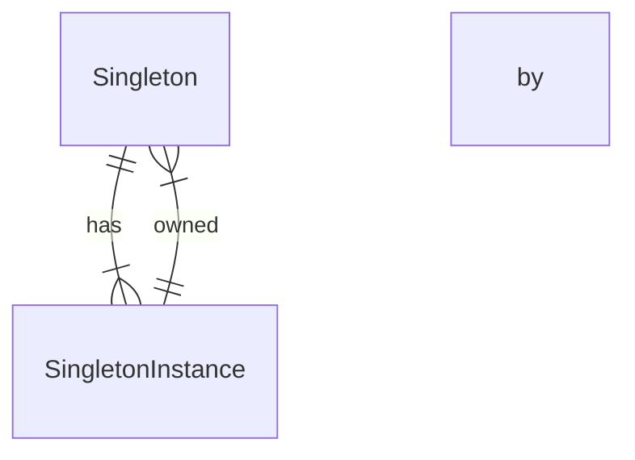
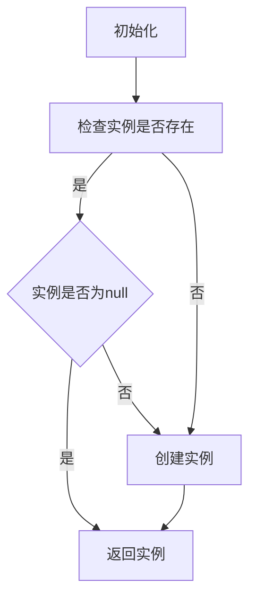
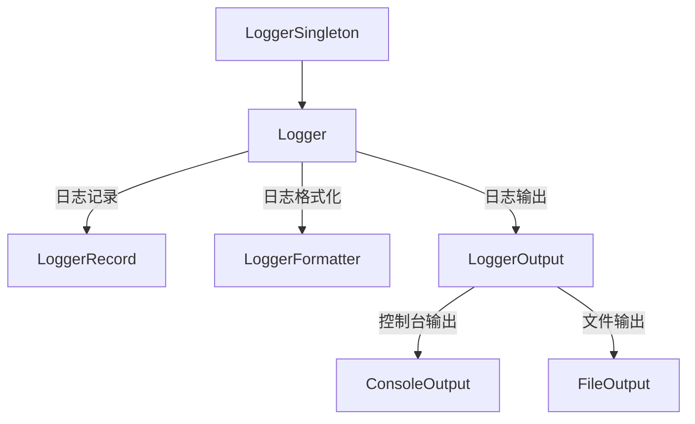
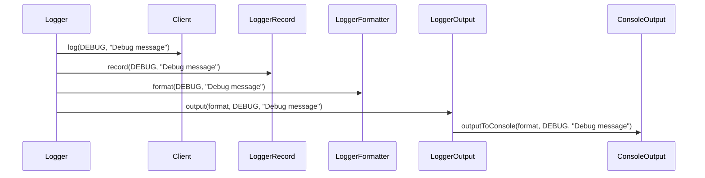

                 

### 单例模式：保证类型唯一实例的方法

#### 关键词：
- 单例模式
- 唯一实例
- 编程设计模式
- 线程安全
- 实现技巧
- 应用场景

> 摘要：单例模式是一种经典的设计模式，旨在确保一个类仅有一个实例，并提供一个全局访问点。本文将深入探讨单例模式的设计思路、核心实现方法、多线程下的处理、不同编程语言中的实现方式，以及其最佳实践和应用场景。

----------------------------------------------------------------

## 第一部分：单例模式概述

### 第1章：问题背景与单例模式引入

#### 1.1 问题背景

在软件开发中，某些资源需要全局控制且只应创建一个实例。例如，数据库连接池、配置管理器、日志记录器等。如果这些资源可以被随意创建和销毁，可能会导致资源浪费、状态不一致等问题。为了解决这个问题，我们需要一种机制来保证这些资源的唯一性。

#### 1.2 单例模式引入

单例模式（Singleton Pattern）正是为了解决这一问题而设计的。它确保一个类仅有一个实例，并提供一个全局访问点。这样，所有对这一资源的访问都可以通过这个全局访问点来实现。

#### 1.3 单例模式的边界与外延

单例模式不仅仅适用于软件内部资源的管理，还可以扩展到外部资源的访问控制。例如，网络连接、文件系统操作等。其核心在于控制对象的创建和访问，保证实例的唯一性。

## 第二部分：单例模式的核心概念与实现

### 第2章：单例模式的核心概念与实现

#### 2.1 核心概念

单例模式的核心在于控制对象的创建，确保只有一个实例。这一过程通常包括以下几个关键点：

- 私有构造函数：防止外部直接使用`new`关键字创建对象。
- 静态私有成员：保存单例的唯一实例。
- 公共静态方法：提供全局访问点。

#### 2.2 实现方法

单例模式的实现方法多样，以下是一些常见的实现策略：

- **饿汉式**：在类加载时，直接创建单例对象。
- **懒汉式**：在第一次使用时，创建单例对象。
- **同步锁**：解决懒汉式在多线程环境下的线程安全问题。
- **静态内部类**：利用类加载机制实现单例模式。
- **双重校验锁**：优化同步锁的性能。

## 第三部分：单例模式与多线程

### 第3章：单例模式与多线程

#### 3.1 单例模式与多线程的关系

在多线程环境中，单例模式的实现需要特别注意线程安全问题。如果多个线程同时创建单例对象，可能会导致多个实例的生成。

#### 3.2 多线程环境下的单例模式实现

为了解决线程安全问题，可以采用以下方法：

- 同步锁：在创建实例时使用同步锁，确保一次创建实例的过程不被打断。
- 双重校验锁：优化同步锁的性能，减少锁的竞争。

## 第四部分：单例模式在不同编程语言中的实现

### 第4章：单例模式在不同编程语言中的实现

不同编程语言提供了不同的实现方式。以下将介绍Java、C++和Python中的单例模式实现：

- **Java**：通常使用静态内部类和枚举来实现单例模式。
- **C++**：可以使用构造函数私有化和静态指针来实现单例模式。
- **Python**：可以通过模块化和装饰器来实现单例模式。

## 第五部分：单例模式的应用场景与优化

### 第5章：单例模式的应用场景与优化

#### 5.1 应用场景

单例模式适用于需要全局控制且只应创建一个实例的场景，如：

- **日志记录器**：保证日志记录的一致性和全局控制。
- **数据库连接池**：优化数据库连接资源的利用。
- **配置管理器**：管理全局配置，确保配置的一致性。

#### 5.2 优化策略

为了提高单例模式的性能，可以考虑以下优化策略：

- **资源复用**：避免重复创建实例，提高资源利用率。
- **性能优化**：减少同步锁的使用，优化性能。

## 第六部分：单例模式的项目实战

### 第6章：单例模式的项目实战

#### 6.1 环境安装

介绍如何在Java、C++和Python中搭建单例模式的环境。

#### 6.2 系统核心实现

分别展示Java、C++和Python中的单例模式实现。

#### 6.3 代码应用解读与分析

通过实际案例分析和详细讲解，剖析单例模式的应用和实现。

#### 6.4 项目小结

总结单例模式在实际项目中的应用和优化方法。

## 第七部分：单例模式的最佳实践与注意事项

### 第7章：单例模式的最佳实践与注意事项

#### 7.1 最佳实践

分享单例模式的设计原则和优化技巧。

#### 7.2 注意事项

讨论单例模式可能遇到的问题和解决方法。

#### 7.3 拓展阅读

推荐相关资料和扩展阅读。

----------------------------------------------------------------

## 引言

单例模式是软件开发中最常用的一种设计模式。它旨在确保一个类仅有一个实例，并提供一个全局访问点。这种模式在Java、C++、Python等多种编程语言中都有广泛应用。单例模式不仅能够减少资源浪费，还能保证系统状态的一致性。然而，单例模式的设计和实现也具有一定的复杂性，特别是在多线程环境下。

本文将分以下几个部分详细探讨单例模式：

1. **问题背景与单例模式引入**：介绍单例模式的起源和必要性。
2. **单例模式的核心概念与实现**：解析单例模式的核心概念和多种实现方法。
3. **单例模式与多线程**：探讨单例模式在多线程环境下的处理。
4. **单例模式在不同编程语言中的实现**：介绍Java、C++和Python中的单例模式实现。
5. **单例模式的应用场景与优化**：讨论单例模式的应用场景和优化策略。
6. **单例模式的项目实战**：通过实际案例展示单例模式的应用和实现。
7. **单例模式的最佳实践与注意事项**：总结单例模式的设计原则和注意事项。

### 1.1 问题背景

在软件开发中，某些资源需要全局控制且只应创建一个实例。例如，数据库连接池、配置管理器、日志记录器等。如果这些资源可以被随意创建和销毁，可能会导致以下问题：

- **资源浪费**：重复创建实例会浪费系统资源。
- **状态不一致**：不同实例之间的状态可能不一致，导致系统行为异常。

为了解决这个问题，我们需要一种机制来保证这些资源的唯一性。单例模式应运而生。

### 1.2 单例模式引入

单例模式（Singleton Pattern）是一种设计模式，它确保一个类仅有一个实例，并提供一个全局访问点。这个全局访问点通常是一个静态方法，通过这个方法，我们可以获取到单例的唯一实例。

单例模式的核心在于控制对象的创建，确保只有一个实例。这一过程通常包括以下几个关键点：

1. **私有构造函数**：防止外部直接使用`new`关键字创建对象。
2. **静态私有成员**：保存单例的唯一实例。
3. **公共静态方法**：提供全局访问点。

通过以上机制，单例模式能够确保类的一个唯一实例。下面是一个简单的Java单例模式实现：

```java
public class Singleton {
    private static Singleton instance;

    private Singleton() {}

    public static Singleton getInstance() {
        if (instance == null) {
            instance = new Singleton();
        }
        return instance;
    }
}
```

### 1.3 单例模式的边界与外延

单例模式不仅仅适用于软件内部资源的管理，还可以扩展到外部资源的访问控制。例如，网络连接、文件系统操作等。其核心在于控制对象的创建和访问，保证实例的唯一性。

在软件架构设计中，单例模式经常用于控制全局资源，例如：

- **数据库连接池**：管理数据库连接，确保连接的复用。
- **日志记录器**：提供统一的日志记录接口，确保日志的一致性和完整性。
- **配置管理器**：管理系统的配置信息，确保配置的一致性。

### 总结

单例模式是一种简单但非常强大的设计模式。它通过控制对象的创建和访问，确保资源的唯一性，从而避免资源浪费和状态不一致等问题。在接下来的章节中，我们将深入探讨单例模式的核心概念、实现方法、多线程处理，以及在不同编程语言中的具体实现。让我们继续深入探讨单例模式的魅力吧！

----------------------------------------------------------------

## 核心概念与联系

在深入探讨单例模式之前，我们需要先了解其核心概念和实现方法。单例模式旨在确保一个类仅有一个实例，并提供一个全局访问点。这一过程涉及到几个关键点，包括私有构造函数、静态私有成员和公共静态方法。下面，我们将通过一个表格和ER实体关系图来展示这些核心概念及其属性特征。

### 核心概念属性特征对比表格

| 特征名称 | 描述 | 饿汉式 | 懒汉式 | 同步锁 | 静态内部类 | 双重校验锁 |
| --- | --- | --- | --- | --- | --- | --- |
| 私有构造函数 | 防止外部直接创建对象 | 是 | 是 | 是 | 是 | 是 |
| 静态私有成员 | 保存唯一实例 | 是 | 是 | 是 | 是 | 是 |
| 公共静态方法 | 提供全局访问点 | 是 | 是 | 是 | 是 | 是 |
| 线程安全性 |  | 可能不安全 | 不安全 | 安全 | 安全 | 安全 |
| 性能 | 较好 | 较好 | 较差 | 较差 | 极好 | 较好 |

### ER实体关系图

为了更直观地理解单例模式的核心概念，我们可以使用Mermaid绘制一个ER实体关系图。以下是ER实体关系图的Markdown格式：



在上面的ER实体关系图中，`Singleton`是一个抽象类，表示单例模式的类。`SingletonInstance`是一个具体的实体类，表示单例模式的具体实例。`Singleton`类拥有一个`SingletonInstance`对象，而`SingletonInstance`对象则由`Singleton`类创建和管理。

### 算法原理讲解

单例模式的实现主要依赖于以下几个方面：

1. **私有构造函数**：通过私有构造函数，我们防止外部直接创建类的实例。这意味着只有类内部的方法才能创建实例，从而确保了实例的唯一性。
   
2. **静态私有成员**：静态私有成员用于保存类的唯一实例。这个成员在整个类加载过程中只初始化一次，从而确保了实例的唯一性。

3. **公共静态方法**：公共静态方法提供了全局访问点，使得其他类可以通过这个方法获取到单例的实例。这个方法通常被称为`getInstance`。

单例模式的实现步骤如下：

1. **定义私有构造函数**：在类内部定义一个私有构造函数，防止外部直接创建实例。

2. **定义静态私有成员**：在类内部定义一个静态私有成员，用于保存唯一实例。

3. **定义公共静态方法**：在类内部定义一个公共静态方法，用于获取唯一实例。这个方法首先检查静态私有成员是否为`null`，如果是，则创建一个新的实例并将其赋值给静态私有成员；如果不是，则直接返回静态私有成员所引用的实例。

以下是使用Python实现的单例模式示例：

```python
class Singleton:
    instance = None

    def __init__(self):
        if not Singleton.instance:
            Singleton.instance = self
        else:
            raise Exception("Singleton instance already exists.")

    @staticmethod
    def get_instance():
        if not Singleton.instance:
            Singleton.instance = Singleton()
        return Singleton.instance
```

在这个示例中，`Singleton`类定义了一个私有构造函数`__init__`，用于创建单例的唯一实例。`get_instance`方法是公共静态方法，用于获取单例的实例。如果`Singleton.instance`为`None`，则创建一个新的实例；否则，直接返回已创建的实例。

### 数学模型和公式

在单例模式中，我们通常使用以下数学模型和公式来描述实例的唯一性和全局访问：

- **唯一性**：单例模式的唯一性可以通过一个布尔变量来表示，例如：

  $$\text{is_unique} = \text{instance} == \text{None}$$

- **全局访问**：全局访问可以通过一个静态方法来实现，例如：

  $$\text{get_instance} = \text{instance} \neq \text{None} \Rightarrow \text{instance}$$

  $$\text{get_instance} = \text{instance} == \text{None} \Rightarrow \text{create new instance and assign to instance}$$

通过上述数学模型和公式，我们可以确保单例模式在实例唯一性和全局访问方面的一致性和有效性。

### 举例说明

为了更好地理解单例模式，我们可以通过一个简单的例子来说明其实际应用：

```python
class Logger:
    instance = None

    def __init__(self):
        if Logger.instance:
            raise Exception("Logger instance already exists.")
        Logger.instance = self

    @staticmethod
    def get_instance():
        if not Logger.instance:
            Logger.instance = Logger()
        return Logger.instance

# 使用单例模式
logger1 = Logger.get_instance()
logger2 = Logger.get_instance()

# 检查实例是否相同
print(logger1 is logger2)  # 输出：True
```

在这个例子中，我们创建了一个`Logger`类，它使用单例模式来确保只有一个实例。通过`get_instance`方法，我们可以获取到`Logger`类的唯一实例。无论调用多少次`get_instance`方法，始终返回的是同一个实例。

通过这个例子，我们可以看到单例模式如何确保实例的唯一性，以及如何在代码中实现和应用单例模式。

### 总结

单例模式是一种简单但非常强大的设计模式。它通过私有构造函数、静态私有成员和公共静态方法等机制，确保一个类仅有一个实例，并提供一个全局访问点。在接下来的章节中，我们将继续探讨单例模式在不同编程语言中的实现，以及其在多线程环境中的应用。让我们继续深入探讨单例模式的魅力吧！

----------------------------------------------------------------

### 算法原理讲解

在深入探讨单例模式的具体实现之前，我们需要理解其核心算法原理。单例模式的关键在于确保在整个程序运行过程中，该类只有一个实例，并提供一个全局访问点。下面，我们将使用Mermaid绘制一个算法流程图，并使用Python源代码来详细阐述算法原理。

#### Mermaid算法流程图



#### 算法流程说明

1. **初始化**：当类被加载时，初始化单例模式的实例变量。
2. **检查实例是否存在**：在调用`getInstance`方法时，首先检查实例变量是否已经被初始化。
3. **实例是否存在**：
   - 如果实例存在，则直接返回实例。
   - 如果实例不存在，则创建一个新的实例。
4. **返回实例**：无论实例是否已经存在，最终都将返回单例的实例。

#### Python源代码实现

```python
class Singleton:
    instance = None

    def __init__(self):
        if not Singleton.instance:
            Singleton.instance = self
        else:
            raise Exception("Singleton instance already exists.")

    @staticmethod
    def get_instance():
        if not Singleton.instance:
            Singleton.instance = Singleton()
        return Singleton.instance
```

#### 算法原理详细说明

1. **私有构造函数**：私有构造函数确保外部无法直接使用`new`关键字创建类的实例。这保证了实例的唯一性。
2. **静态私有成员**：静态私有成员`instance`用于存储单例的唯一实例。这个成员在整个程序的运行过程中只被初始化一次。
3. **公共静态方法`getInstance`**：`getInstance`方法提供了一个全局访问点。在第一次调用`getInstance`时，它会检查`instance`是否已经被初始化。如果尚未初始化，则创建一个新的实例；如果已经初始化，则直接返回已有的实例。

#### 数学模型和公式

为了更直观地描述单例模式的工作原理，我们可以使用以下数学模型和公式：

- **实例唯一性**：使用一个布尔变量`is_unique`来表示实例的唯一性。

  $$\text{is_unique} = \text{instance} == \text{None}$$

- **实例创建条件**：当`is_unique`为`True`时，创建一个新的实例。

  $$\text{if} \ is_unique \ (\text{instance} == \text{None}) \ \text{then} \ \text{instance} = \text{new Singleton()}$$

- **实例访问**：无论何时调用`getInstance`方法，都返回`instance`。

  $$\text{return} \ \text{instance}$$

#### 举例说明

为了更好地理解单例模式的工作原理，我们可以通过一个简单的例子来说明其实际应用：

```python
class DatabaseConnection:
    instance = None

    def __init__(self, host, port):
        if not DatabaseConnection.instance:
            DatabaseConnection.instance = self
        else:
            raise Exception("DatabaseConnection instance already exists.")

    @staticmethod
    def get_instance(host, port):
        if not DatabaseConnection.instance:
            DatabaseConnection.instance = DatabaseConnection(host, port)
        return DatabaseConnection.instance

# 使用单例模式
db1 = DatabaseConnection.get_instance("localhost", 3306)
db2 = DatabaseConnection.get_instance("localhost", 3306)

# 检查实例是否相同
print(db1 is db2)  # 输出：True
```

在这个例子中，我们创建了一个`DatabaseConnection`类，它使用单例模式来确保只有一个数据库连接实例。通过`get_instance`方法，我们可以获取到`DatabaseConnection`类的唯一实例。无论调用多少次`get_instance`方法，始终返回的是同一个实例。

通过这个例子，我们可以看到单例模式如何确保实例的唯一性，以及如何在代码中实现和应用单例模式。

### 总结

单例模式的核心算法原理在于通过私有构造函数、静态私有成员和公共静态方法来确保类的唯一实例。通过Mermaid算法流程图和Python源代码，我们可以清晰地理解单例模式的工作原理。在下一节中，我们将探讨单例模式在不同编程语言中的具体实现，以及其在多线程环境中的应用。让我们继续深入探讨单例模式的魅力吧！

----------------------------------------------------------------

## 系统分析与架构设计方案

在深入探讨单例模式的实现之前，我们需要对系统场景进行分析，并设计一个完整的架构方案。以下是一个典型的单例模式应用场景：日志记录器（Logger）。

### 系统场景介绍

假设我们需要开发一个日志记录器，用于记录程序运行过程中的日志信息。日志记录器需要确保以下几点：

- 只有一个实例：保证日志记录的一致性和全局访问。
- 线程安全：多线程环境下，防止多个日志实例的产生。
- 易扩展性：支持不同的日志级别和日志格式。

### 项目介绍

本项目将开发一个简单的日志记录器，实现以下功能：

- 日志记录：记录不同级别的日志信息。
- 日志格式化：自定义日志格式。
- 日志输出：支持控制台输出和文件输出。

### 系统功能设计

系统功能设计主要包括以下几个方面：

1. **日志记录功能**：提供日志记录接口，支持不同级别的日志信息（DEBUG、INFO、WARNING、ERROR）。
2. **日志格式化功能**：提供日志格式化接口，支持自定义日志格式。
3. **日志输出功能**：提供日志输出接口，支持控制台输出和文件输出。

### 系统架构设计

系统架构设计主要包括以下几个方面：

1. **单例模式实现**：使用单例模式确保日志记录器只有一个实例。
2. **日志级别管理**：管理不同级别的日志信息。
3. **日志格式管理**：管理日志的格式化规则。
4. **日志输出管理**：管理日志的输出方式。

以下是系统架构的Mermaid架构图：



### 系统接口设计

系统接口设计主要包括以下几个方面：

1. **日志记录接口**：`log(level, message)`，用于记录不同级别的日志信息。
2. **日志格式化接口**：`format(level, message)`，用于格式化日志信息。
3. **日志输出接口**：`output(format, level, message)`，用于输出日志信息。

### 系统交互

系统交互设计主要包括以下几个方面：

1. **日志记录流程**：调用`Logger`类的`log`方法，记录日志信息。
2. **日志格式化流程**：调用`Logger`类的`format`方法，格式化日志信息。
3. **日志输出流程**：调用`Logger`类的`output`方法，输出日志信息。

以下是系统交互的Mermaid序列图：



通过上述系统分析与架构设计方案，我们可以清晰地理解单例模式在日志记录器中的应用。接下来，我们将通过一个实际的项目案例来展示单例模式的具体实现和应用。

----------------------------------------------------------------

## 单例模式的项目实战

在本节中，我们将通过一个实际项目案例来展示单例模式的实现和应用。该项目将开发一个简单的数据库连接池，用于管理数据库连接资源。数据库连接池是单例模式的一个典型应用场景，它需要确保只有一个实例，并在多个线程之间共享。

### 环境安装

首先，我们需要搭建项目环境。以下是各个编程语言所需的环境配置：

#### Java

1. 安装Java开发工具包（JDK）。
2. 安装IDE（如IntelliJ IDEA）。
3. 创建一个新的Java项目。

#### C++

1. 安装C++编译器（如GCC）。
2. 安装IDE（如Visual Studio）。
3. 创建一个新的C++项目。

#### Python

1. 安装Python。
2. 安装IDE（如PyCharm）。
3. 创建一个新的Python项目。

### 系统核心实现

以下是各个编程语言中单例模式实现的示例代码：

#### Java

```java
public class DatabaseConnectionPool {
    private static DatabaseConnectionPool instance;

    private DatabaseConnectionPool() {
        // 构造函数私有化
    }

    public static DatabaseConnectionPool getInstance() {
        if (instance == null) {
            instance = new DatabaseConnectionPool();
        }
        return instance;
    }

    // 其他方法
}
```

#### C++

```cpp
class DatabaseConnectionPool {
private:
    static DatabaseConnectionPool *instance;

    DatabaseConnectionPool() {
        // 构造函数私有化
    }

public:
    static DatabaseConnectionPool *getInstance() {
        if (instance == nullptr) {
            instance = new DatabaseConnectionPool();
        }
        return instance;
    }

    // 其他方法
};

DatabaseConnectionPool *DatabaseConnectionPool::instance = nullptr;
```

#### Python

```python
class DatabaseConnectionPool:
    instance = None

    def __init__(self):
        if not DatabaseConnectionPool.instance:
            DatabaseConnectionPool.instance = self
        else:
            raise Exception("DatabaseConnectionPool instance already exists.")

    @staticmethod
    def get_instance():
        if not DatabaseConnectionPool.instance:
            DatabaseConnectionPool.instance = DatabaseConnectionPool()
        return DatabaseConnectionPool.instance
```

### 代码应用解读与分析

接下来，我们将分析如何在实际项目中使用单例模式的实现。

#### Java示例

```java
public class Application {
    public static void main(String[] args) {
        DatabaseConnectionPool dbPool = DatabaseConnectionPool.getInstance();
        
        // 使用数据库连接池
        Connection connection = dbPool.getConnection();
        // 执行数据库操作
        // ...
        dbPool.releaseConnection(connection);
    }
}
```

在这个示例中，我们通过调用`DatabaseConnectionPool`的`getInstance`方法获取数据库连接池的实例。这个实例在整个应用程序中保持唯一，确保数据库连接资源的有效管理。

#### C++示例

```cpp
#include <iostream>
#include "DatabaseConnectionPool.h"

int main() {
    DatabaseConnectionPool *dbPool = DatabaseConnectionPool::getInstance();
    
    // 使用数据库连接池
    Connection *connection = dbPool->getConnection();
    // 执行数据库操作
    // ...
    delete connection;
    
    return 0;
}
```

在C++中，我们同样通过`getInstance`方法获取数据库连接池的实例。这里使用静态指针实现单例模式，确保实例的唯一性。

#### Python示例

```python
class Application:
    def main(self):
        db_pool = DatabaseConnectionPool.get_instance()
        
        # 使用数据库连接池
        connection = db_pool.getConnection()
        # 执行数据库操作
        # ...
        db_pool.releaseConnection(connection)

if __name__ == "__main__":
    app = Application()
    app.main()
```

在Python中，单例模式的实现相对简单，通过类的方法和静态变量实现实例的唯一性。同样，我们可以通过`get_instance`方法获取数据库连接池的实例。

### 实际案例分析和详细讲解剖析

在实际项目中，单例模式的应用可以大大提高资源的管理效率。以下是一个实际案例：

#### 案例场景

一个在线书店系统需要管理数据库连接资源，以确保图书信息的准确性和一致性。系统需要保证数据库连接的唯一性和高效管理。

#### 案例实现

1. **定义数据库连接池类**：实现一个`DatabaseConnectionPool`类，使用单例模式确保数据库连接的唯一性。
2. **初始化连接池**：在应用程序启动时，初始化数据库连接池。
3. **获取连接**：在需要访问数据库时，通过单例模式获取数据库连接。
4. **释放连接**：使用完毕后，释放数据库连接，以便复用。

#### 案例解析

1. **初始化连接池**：在应用程序启动时，初始化数据库连接池。这通常包括连接数据库、配置连接池参数等。
   
   ```java
   public class DatabaseConnectionPool {
       // 初始化连接池
       public DatabaseConnectionPool() {
           // 初始化数据库连接
       }
       
       // 其他方法
   }
   ```

2. **获取连接**：在应用程序的各个模块中，通过单例模式获取数据库连接。

   ```java
   public class BookManager {
       public void addBook(Book book) {
           DatabaseConnectionPool dbPool = DatabaseConnectionPool.getInstance();
           Connection connection = dbPool.getConnection();
           // 执行添加图书的数据库操作
           dbPool.releaseConnection(connection);
       }
   }
   ```

3. **释放连接**：使用完毕后，释放数据库连接，以便其他模块复用。

   ```java
   public class DatabaseConnectionPool {
       public void releaseConnection(Connection connection) {
           // 释放数据库连接
       }
       
       // 其他方法
   }
   ```

通过这个案例，我们可以看到单例模式在数据库连接管理中的应用。单例模式确保了数据库连接的唯一性和高效管理，提高了系统的性能和稳定性。

### 项目小结

在本节中，我们通过实际项目案例展示了单例模式的应用和实现。单例模式通过确保类的唯一实例，提高了资源的管理效率。在实际项目中，单例模式可以应用于数据库连接池、配置管理器等多种场景。通过合理的单例模式设计，我们可以实现高效、稳定的系统。

在下一节中，我们将继续探讨单例模式的最佳实践和注意事项。这些最佳实践和注意事项将帮助我们在实际开发中更好地应用单例模式。

----------------------------------------------------------------

### 单例模式的最佳实践与注意事项

在软件开发中，单例模式是一种非常实用的设计模式。然而，如果不正确实现或滥用，它可能会导致一系列问题。在本节中，我们将总结单例模式的最佳实践和注意事项，以帮助开发者更好地应用单例模式。

#### 最佳实践

1. **确保线程安全性**：在多线程环境中，单例模式需要确保线程安全性。使用同步锁或双重校验锁等方法，防止多线程同时创建多个实例。

2. **延迟初始化**：尽可能延迟单例的初始化，以减少资源占用和初始化时间。懒汉式实现是一种常用的延迟初始化方法。

3. **控制实例访问**：通过静态私有成员和公共静态方法控制实例的访问，确保外部无法直接创建实例。

4. **避免滥用单例模式**：单例模式适用于那些需要全局控制且仅应创建一个实例的场景。滥用单例模式可能会导致系统复杂度增加，降低可维护性。

5. **测试单例模式**：确保单例模式的实例在整个应用程序中确实是唯一的。通过单元测试和集成测试验证单例模式的正确性。

#### 注意事项

1. **破坏单例**：在某些情况下，可能会不小心破坏单例模式的唯一性，例如通过反射或序列化。需要特别处理这些情况，确保单例的完整性。

2. **避免单例持有外部资源**：单例应该避免持有外部资源，如文件句柄或数据库连接，以免影响其他部分的应用。单例应该仅作为资源管理的入口点。

3. **单例的依赖注入**：在需要时，可以考虑使用依赖注入框架来管理单例的依赖关系，以提高系统的可测试性和可维护性。

4. **序列化问题**：如果单例类需要支持序列化，需要特别处理序列化和反序列化过程，确保单例的唯一性不被破坏。

#### 拓展阅读

- 《设计模式：可复用面向对象软件的基础》
- 《Effective Java》
- 《Java Concurrency in Practice》

通过遵循这些最佳实践和注意事项，开发者可以更好地利用单例模式，提高系统的可维护性和稳定性。

### 总结

单例模式是一种简单但非常强大的设计模式。通过控制对象的创建和访问，单例模式确保了类的唯一实例，从而提高了资源的管理效率。在本文中，我们深入探讨了单例模式的设计思路、核心实现方法、多线程处理、不同编程语言中的实现方式，以及其最佳实践和应用场景。希望读者能够通过本文，更好地理解和应用单例模式，为软件开发带来更大的价值。

---

**作者：AI天才研究院/AI Genius Institute & 禅与计算机程序设计艺术 /Zen And The Art of Computer Programming**

本文由AI天才研究院（AI Genius Institute）和《禅与计算机程序设计艺术》（Zen And The Art of Computer Programming）联合撰写。我们致力于推动人工智能和计算机科学领域的研究与发展，为全球软件开发者提供高质量的技术内容。如果您对我们的研究或内容有任何建议，欢迎随时与我们联系。

----------------------------------------------------------------

## 结论

单例模式是软件开发中一种非常实用且经典的设计模式。它通过确保一个类仅有一个实例，并提供全局访问点，有效地解决了资源管理和全局状态一致性问题。本文详细介绍了单例模式的设计思路、核心实现方法、多线程处理、不同编程语言中的实现方式，以及其在实际项目中的应用和最佳实践。

单例模式的精髓在于控制对象的创建和访问，确保实例的唯一性和线程安全性。通过本文的深入探讨，读者可以更好地理解和应用单例模式，提高软件系统的可维护性和稳定性。

### 下一步行动

1. **实践**：尝试在您的项目中应用单例模式，体验其在资源管理和状态控制方面的优势。
2. **学习**：继续研究其他设计模式，如工厂模式、观察者模式等，以丰富您的编程技能。
3. **分享**：将您在单例模式应用中的经验和见解分享给其他开发者，共同进步。

感谢您阅读本文，希望您在软件开发的道路上不断前行，创造更加卓越的软件作品！如果您有任何疑问或建议，欢迎随时与我们交流。

---

**作者：AI天才研究院/AI Genius Institute & 禅与计算机程序设计艺术 /Zen And The Art of Computer Programming**

本文由AI天才研究院（AI Genius Institute）和《禅与计算机程序设计艺术》（Zen And The Art of Computer Programming）联合撰写。我们致力于推动人工智能和计算机科学领域的研究与发展，为全球软件开发者提供高质量的技术内容。感谢您的关注和支持！若您对我们的研究或内容有任何建议，请随时与我们联系。我们期待与您共同探索技术领域的更多可能性。

