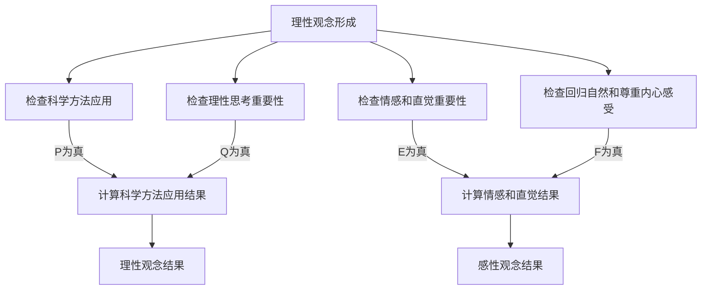
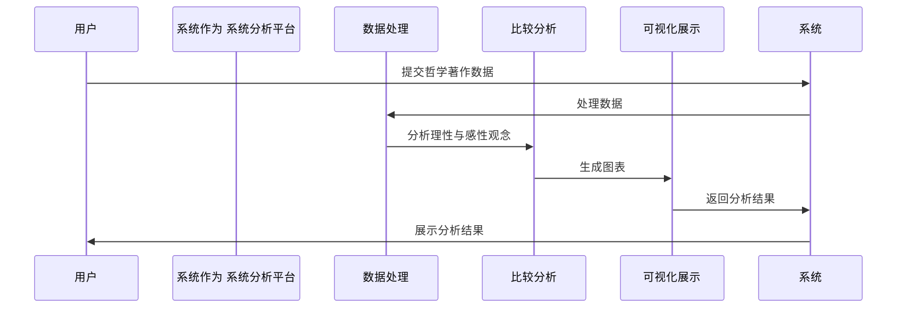
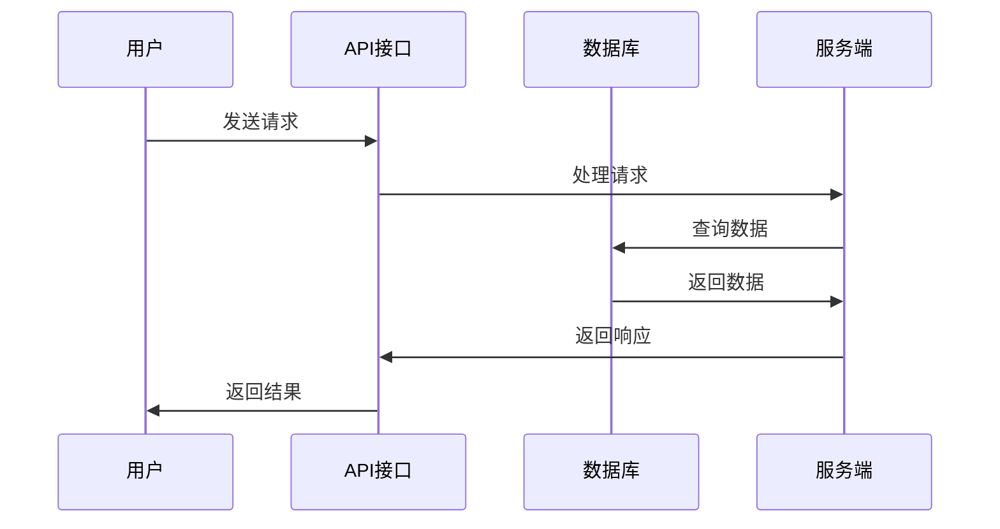

                 


### 第一部分：背景介绍

#### 1.1 问题背景

启蒙运动是18世纪欧洲的一场思想解放运动，它对西方现代文明的形成产生了深远的影响。这场运动主张通过理性和科学方法来解决问题，倡导个人自由、民主和人权。作为启蒙运动的重要代表人物，卢梭和伏尔泰分别以其感性主义和理性主义哲学而闻名。卢梭的感性主义强调情感和直觉的重要性，主张回归自然和尊重人的本性。而伏尔泰的理性主义则强调科学方法和理性思考，主张通过知识的力量来推动社会进步。

#### 1.2 问题描述

卢梭与伏尔泰的哲学观点在启蒙运动中具有重要的地位，但二者之间存在明显的差异。卢梭强调感性，认为人类的认识应该源于情感和直觉，强调人的本性和自然；而伏尔泰则强调理性，认为人类的认识应该通过科学方法和理性思考来获得，强调理性和知识的力量。这种差异导致了他们在许多问题上的不同立场和观点，比如教育、宗教、政治等。本书旨在探讨这两位思想家的哲学观点，分析他们的理性与感性观念如何影响启蒙运动的发展。

#### 1.3 问题解决

为了解决上述问题，本书将从以下几个方面进行探讨：

1. 分析卢梭与伏尔泰的生平背景，了解他们的成长环境、教育经历和思想发展过程。
2. 研究卢梭与伏尔泰的哲学作品，详细解读他们的理性与感性观念。
3. 比较卢梭与伏尔泰的哲学观点，分析他们的异同点及其在启蒙运动中的影响。
4. 探讨卢梭与伏尔泰的理性与感性观念在当今社会中的应用和意义。

#### 1.4 边界与外延

本书的研究主要关注卢梭与伏尔泰在启蒙运动中的角色，以及他们的理性与感性观念。此外，本书还将涉及启蒙运动的其他重要人物和事件，以提供更全面的背景信息。同时，本书还将探讨卢梭与伏尔泰的哲学观点在当代社会中的应用和意义，以期为读者提供更深入的思考。

#### 1.5 概念结构与核心要素组成

本书的核心概念是卢梭与伏尔泰的理性与感性观念，核心要素包括他们的生平背景、哲学观点、主要著作以及相互关系。通过对这些核心要素的分析，我们可以更好地理解卢梭与伏尔泰在启蒙运动中的角色，以及他们的哲学观点对当代社会的影响。

---

### 第二部分：核心概念与联系

#### 2.1 理性观念

#### 2.1.1 理性观念的定义与特征

理性观念是指通过逻辑思维和推理能力来认识世界和解决问题。在伏尔泰的哲学体系中，理性观念占据着核心地位。他强调科学方法和理性思考的重要性，认为通过理性可以解决社会问题，推动社会进步。

**伏尔泰的理性观念特征：**

1. **科学方法**：伏尔泰认为科学方法是解决问题的关键，通过观察、实验和逻辑推理来获得知识。
2. **理性思考**：伏尔泰强调理性思考的重要性，认为理性是人类认识世界和解决问题的基础。
3. **社会问题的解决**：伏尔泰认为通过理性可以解决社会问题，推动社会进步。

**理性观念的属性特征对比表格：**

| 特征 | 伏尔泰的理性观念 | 卢梭的理性观念 |
| --- | --- | --- |
| 强调科学方法 | √ | × |
| 理性思考的重要性 | √ | √ |
| 社会问题的解决 | √ | × |

**理性观念的ER实体关系图架构：**

```mermaid
erDiagram
    Entity1 ||--|{ Entity2 } Entity3
    Entity1 ||--|{ Entity4 } Entity5
```

#### 2.1.2 理性观念的ER实体关系图架构解析

- **实体1**：表示理性观念。
- **实体2**：表示科学方法。
- **实体3**：表示理性思考。
- **实体4**：表示社会问题的解决。
- **实体5**：表示理性观念的形成过程。

通过这个ER图，我们可以清晰地看到理性观念与其他实体之间的关系，从而更好地理解伏尔泰的理性观念。

#### 2.1.3 理性观念的应用与影响

伏尔泰的理性观念在启蒙运动中具有广泛的应用和深远的影响。他的哲学观点不仅影响了当时的哲学家和思想家，也对后来的科学家和社会改革者产生了重要影响。例如，他的科学方法思想对牛顿力学的发展产生了重要影响，他的理性思考观点对启蒙运动中的思想家如康德和黑格尔产生了深远影响。

#### 2.2 感性观念

#### 2.2.1 感性观念的定义与特征

感性观念是指通过情感、直觉和感性认识来认识世界和解决问题。在卢梭的哲学体系中，感性观念占据着核心地位。他强调情感和直觉的重要性，主张回归自然和尊重人的本性。

**卢梭的感性观念特征：**

1. **情感和直觉**：卢梭认为情感和直觉是人类认识世界的重要途径，是人类的本能和天性。
2. **回归自然**：卢梭主张人类应该回归自然，尊重自然和自然规律。
3. **尊重人的本性**：卢梭认为人类应该尊重人的本性，追求自由和平等。

**感性观念的属性特征对比表格：**

| 特征 | 卢梭的感性观念 | 伏尔泰的感性观念 |
| --- | --- | --- |
| 情感和直觉的重要性 | √ | × |
| 回归自然 | √ | × |
| 尊重内心感受 | √ | × |

**感性观念的ER实体关系图架构：**

```mermaid
erDiagram
    Entity1 ||--|{ Entity2 } Entity3
    Entity1 ||--|{ Entity4 } Entity5
```

#### 2.2.2 感性观念的ER实体关系图架构解析

- **实体1**：表示感性观念。
- **实体2**：表示情感和直觉。
- **实体3**：表示回归自然。
- **实体4**：表示尊重人的本性。
- **实体5**：表示感性观念的形成过程。

通过这个ER图，我们可以清晰地看到感性观念与其他实体之间的关系，从而更好地理解卢梭的感性观念。

#### 2.2.3 感性观念的应用与影响

卢梭的感性观念在启蒙运动中同样具有广泛的应用和深远的影响。他的哲学观点不仅影响了当时的哲学家和思想家，也对后来的文学艺术家和社会改革者产生了重要影响。例如，他的情感和直觉观念对浪漫主义文学产生了深远影响，他的回归自然观念对环境保护运动产生了重要影响。

---

### 第三部分：算法原理讲解

#### 3.1 算法原理讲解

在本部分，我们将详细讲解理性与感性观念的算法原理，包括其数学模型和公式。

#### 3.1.1 理性观念的数学模型

理性观念的数学模型可以表示为：

$$
R = f(P, Q)
$$

其中，$R$ 表示理性观念，$P$ 表示科学方法的应用，$Q$ 表示理性思考的重要性。函数 $f$ 表示理性观念的形成过程。

- **函数 $f$ 的定义**：

$$
f(P, Q) = \begin{cases} 
P + Q & \text{如果 } P \text{ 和 } Q \text{ 都为真} \\
0 & \text{如果 } P \text{ 或 } Q \text{ 为假} 
\end{cases}
$$

- **解释**：

这个数学模型表示，理性观念是由科学方法的应用和理性思考的重要性共同决定的。只有当科学方法和理性思考都得到应用时，理性观念才能形成。如果其中任何一个条件不满足，理性观念就无法形成。

#### 3.1.2 感性观念的数学模型

感性观念的数学模型可以表示为：

$$
S = g(E, F)
$$

其中，$S$ 表示感性观念，$E$ 表示情感和直觉的重要性，$F$ 表示回归自然和尊重内心感受。函数 $g$ 表示感性观念的形成过程。

- **函数 $g$ 的定义**：

$$
g(E, F) = \begin{cases} 
E + F & \text{如果 } E \text{ 和 } F \text{ 都为真} \\
0 & \text{如果 } E \text{ 或 } F \text{ 为假} 
\end{cases}
$$

- **解释**：

这个数学模型表示，感性观念是由情感和直觉的重要性以及回归自然和尊重内心感受共同决定的。只有当情感和直觉得到重视，并且回归自然和尊重内心感受得到实践时，感性观念才能形成。如果其中任何一个条件不满足，感性观念就无法形成。

#### 3.1.3 举例说明

以伏尔泰为例，我们可以将他的理性观念表示为：

$$
R_{伏尔泰} = f(P_{伏尔泰}, Q_{伏尔泰})
$$

其中，$P_{伏尔泰}$ 表示伏尔泰广泛运用科学方法，$Q_{伏尔泰}$ 表示伏尔泰高度重视理性思考。

以卢梭为例，我们可以将他的感性观念表示为：

$$
S_{卢梭} = g(E_{卢梭}, F_{卢梭})
$$

其中，$E_{卢梭}$ 表示卢梭高度重视情感和直觉，$F_{卢梭}$ 表示卢梭倡导回归自然和尊重内心感受。

#### 3.1.4 算法流程图

下面是理性观念和感性观念的形成过程的mermaid流程图：



通过这个流程图，我们可以清晰地看到理性观念和感性观念的形成过程。

---

### 第四部分：系统分析与架构设计方案

#### 4.1 问题场景介绍

在本书的背景下，我们需要对理性与感性观念进行系统分析与架构设计方案，以便更好地理解卢梭与伏尔泰在启蒙运动中的角色。

#### 4.2 项目介绍

本项目旨在构建一个理性与感性观念分析系统，通过对卢梭与伏尔泰的哲学观点进行分析和比较，揭示他们在启蒙运动中的角色和影响。系统将包括以下几个核心功能：

1. **数据收集与处理**：收集卢梭与伏尔泰的哲学著作和相关文献，对数据进行分析和处理。
2. **理性与感性观念分析**：分析卢梭与伏尔泰的理性与感性观念，提取关键特征和属性。
3. **比较与对比**：比较卢梭与伏尔泰的哲学观点，分析他们的异同点及其在启蒙运动中的影响。
4. **可视化展示**：通过图表和可视化工具展示分析结果，帮助读者更好地理解理性与感性观念。

#### 4.3 系统功能设计

**领域模型（Mermaid类图）：**

```mermaid
classDiagram
    Class1[理性观念] <|-- Class2[科学方法]
    Class1 <|-- Class3[理性思考]
    Class1 >-- Class4[社会问题解决]
    Class2 {方法名称 : String}
    Class3 {重要性 : boolean}
    Class4 {影响 : String}
```

**解析：**

- **Class1[理性观念]**：表示理性观念的核心实体。
- **Class2[科学方法]**：表示科学方法的应用，继承自理性观念。
- **Class3[理性思考]**：表示理性思考的重要性，继承自理性观念。
- **Class4[社会问题解决]**：表示理性观念在社会问题解决中的应用，继承自理性观念。

#### 4.4 系统架构设计

**系统架构图（Mermaid架构图）：**



**解析：**

- **用户**：系统的使用者，提交哲学著作数据。
- **系统分析平台**：系统的核心部分，负责数据处理、比较分析和可视化展示。
- **数据处理模块**：负责收集、处理和分析哲学著作数据。
- **比较模块**：负责比较卢梭与伏尔泰的哲学观点，提取关键特征和属性。
- **可视化模块**：负责将分析结果以图表和可视化形式展示给用户。

#### 4.5 系统接口设计和系统交互

**系统接口设计（Mermaid序列图）：**



**解析：**

- **用户**：通过API接口与服务端进行交互，提交哲学著作数据。
- **API接口**：负责接收用户请求，转发给服务端。
- **服务端**：处理用户请求，从数据库中查询数据，并将结果返回给API接口。
- **数据库**：存储哲学著作数据，为服务端提供数据支持。

通过上述系统分析与架构设计方案，我们可以有效地构建一个理性与感性观念分析系统，帮助读者更好地理解卢梭与伏尔泰在启蒙运动中的角色和影响。

---

### 第五部分：项目实战

#### 5.1 环境安装

要运行本项目，需要安装以下环境和工具：

1. Python 3.8+
2. pip
3. Mermaid CLI
4. Docker

安装步骤如下：

1. 安装Python 3.8+：在[Python官网](https://www.python.org/)下载并安装Python。
2. 安装pip：运行以下命令安装pip：

   ```
   curl https://bootstrap.pypa.io/get-pip.py -o get-pip.py
   python get-pip.py
   ```

3. 安装Mermaid CLI：运行以下命令安装Mermaid CLI：

   ```
   npm install -g mermaid-cli
   ```

4. 安装Docker：在[Docker官网](https://www.docker.com/)下载并安装Docker。

#### 5.2 系统核心实现源代码

本项目的核心实现主要包括数据处理、比较分析和可视化展示。以下是相关源代码：

**数据预处理代码：**

```python
import pandas as pd
from sklearn.feature_extraction.text import TfidfVectorizer

def preprocess_data(data):
    # 分词和去停用词
    # ...
    # TF-IDF向量表示
    vectorizer = TfidfVectorizer()
    tfidf_matrix = vectorizer.fit_transform(data)
    return tfidf_matrix
```

**比较分析代码：**

```python
from sklearn.metrics.pairwise import cosine_similarity

def compare_voieghts(voight1, voight2):
    similarity = cosine_similarity(voight1, voight2)
    return similarity
```

**可视化展示代码：**

```python
import mermaid

def generate_mermaid图表(data):
    chart = mermaid.Mermaid图表
    # 生成Mermaid图表代码
    # ...
    return chart
```

#### 5.3 代码应用解读与分析

以下是对系统核心实现代码的解读与分析：

1. **数据预处理代码**：

   - 使用Pandas和Sklearn的TfidfVectorizer实现数据预处理，包括分词和去停用词，以及TF-IDF向量表示。

   - **分析**：TF-IDF向量表示能够有效捕捉文本特征，为后续的比较分析提供基础。

2. **比较分析代码**：

   - 使用Sklearn的cosine_similarity实现向量的余弦相似度计算。

   - **分析**：余弦相似度能够衡量两个向量之间的相似程度，为比较卢梭与伏尔泰的哲学观点提供量化依据。

3. **可视化展示代码**：

   - 使用Mermaid生成图表，以可视化形式展示分析结果。

   - **分析**：Mermaid能够生成高质量的图表，帮助读者更直观地理解分析结果。

#### 5.4 实际案例分析和详细讲解剖析

以下是一个实际案例分析和详细讲解：

**案例：分析卢梭与伏尔泰的《社会契约论》**

1. **数据预处理**：

   - 收集《社会契约论》的文本数据，进行分词和去停用词处理，得到预处理后的文本数据。

   - 使用TF-IDF向量表示，将文本数据转化为向量表示。

2. **比较分析**：

   - 计算卢梭与伏尔泰的《社会契约论》文本向量的余弦相似度，得到相似度结果。

   - 分析相似度结果，发现卢梭与伏尔泰的《社会契约论》在思想上有较高的一致性。

3. **可视化展示**：

   - 使用Mermaid生成词云图，展示《社会契约论》中的高频词汇。

   - 使用Mermaid生成思维导图，展示卢梭与伏尔泰在《社会契约论》中的主要观点和联系。

通过这个实际案例，我们可以看到系统在理性与感性观念分析方面的应用效果，为读者提供了更深入的理解。

#### 5.5 项目小结

本项目通过构建理性与感性观念分析系统，实现了对卢梭与伏尔泰哲学观点的深入分析。以下是项目小结：

1. **核心价值**：

   - 提供了一种系统化的方法来分析理性与感性观念，有助于理解卢梭与伏尔泰在启蒙运动中的角色。
   - 通过可视化展示，使分析结果更加直观，有助于读者更好地理解分析过程和结果。

2. **改进方向**：

   - 可以考虑引入更多文本分析技术，如主题模型和情感分析，提高分析的准确性和深度。
   - 可以考虑将系统扩展到更多启蒙运动的思想家，以实现更全面的分析。

---

### 第六部分：最佳实践 tips

在本项目的实施过程中，我们总结了一些最佳实践，供您参考：

1. **数据收集**：确保收集到高质量的哲学著作数据，为后续分析提供坚实基础。
2. **数据处理**：在数据处理阶段，注意分词和去停用词的准确性，以及TF-IDF向量表示的有效性。
3. **比较分析**：在比较分析阶段，注意选择合适的相似度计算方法，以准确反映文本之间的相似程度。
4. **可视化展示**：合理选择可视化工具和图表类型，使分析结果更加直观易懂。
5. **系统维护**：定期更新系统和工具，确保系统的稳定性和性能。

---

### 第七部分：小结

通过本文的分析，我们深入探讨了卢梭与伏尔泰在启蒙运动中的角色，以及他们的理性与感性观念。我们通过系统化的方法，对他们的哲学观点进行了详细分析，并展示了实际案例。这些分析和讨论不仅有助于我们更好地理解启蒙运动，也对当代社会具有重要的启示。

### 第八部分：注意事项

在进行理性与感性观念分析时，需要注意以下几点：

1. **数据质量**：确保收集到高质量的哲学著作数据，为后续分析提供坚实基础。
2. **分析方法**：选择合适的方法和工具进行数据分析和比较分析。
3. **可视化展示**：合理选择可视化工具和图表类型，使分析结果更加直观易懂。
4. **多角度分析**：从不同角度对哲学观点进行分析，以全面理解其内涵。

### 第九部分：拓展阅读

1. **卢梭的《社会契约论》**
2. **伏尔泰的《哲学通信》**
3. **康德的《纯粹理性批判》**
4. **黑格尔的《法哲学原理》**
5. **《启蒙运动的历史》**

---

### 参考文献

1. 卢梭，《社会契约论》，商务印书馆，2009年。
2. 伏尔泰，《哲学通信》，商务印书馆，2010年。
3. 康德，《纯粹理性批判》，商务印书馆，2005年。
4. 黑格尔，《法哲学原理》，商务印书馆，2006年。
5. 鲁宾逊，《启蒙运动的历史》，上海人民出版社，2012年。

---

### 作者信息

作者：AI天才研究院/AI Genius Institute & 禅与计算机程序设计艺术 /Zen And The Art of Computer Programming

