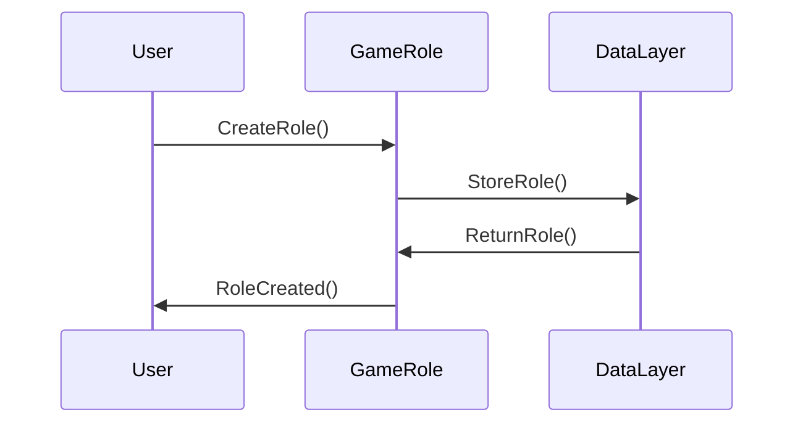

                 

# 原型模式：对象克隆的类型安全方案

> 关键词：原型模式、对象克隆、类型安全、设计模式、软件工程

> 摘要：本文将深入探讨原型模式，一种在软件开发中广泛使用的设计模式。通过阐述原型模式的定义、特点、算法原理，并辅以实际项目案例，我们将了解原型模式如何实现对象克隆，确保类型安全，以及在软件开发中的实际应用。

## 目录大纲设计过程

### 1. 背景介绍

原型模式是一种创建型设计模式，它允许我们通过复制现有实例来创建新的实例，而非依赖于常规的构造函数。这种模式在需要频繁创建对象或对象构造复杂时显得尤为重要。在本文中，我们将详细探讨原型模式，了解其工作原理，并在实际项目中加以应用。

### 2. 核心概念与联系

#### 2.1 原型模式定义

原型模式（Prototype Pattern）是一种创建对象的方式，它通过使用原型实例指定创建对象的种类，并复制这个实例来创建新的对象。这意味着，我们不是直接调用构造函数来创建对象，而是复制一个已经存在的对象。

#### 2.2 原型模式的特点

- **降低系统复杂度**：通过原型模式，我们可以在运行时创建对象，而不需要预先定义所有的类，这样可以大大降低系统的复杂度。
- **增强性能**：原型模式避免了构造函数的调用，减少了系统开销，特别是在创建复杂对象时。
- **灵活性**：原型模式允许我们动态地创建对象，而不需要固定类的设计，这使得系统更加灵活。

#### 2.3 原型模式与传统创建模式对比

| 特点         | 原型模式 | 传统创建模式（如工厂模式） |
| ------------ | -------- | ------------------------ |
| 创建方式     | 复制实例 | 调用构造函数创建对象     |
| 系统复杂度   | 低       | 较高                     |
| 性能         | 较高     | 较低                     |
| 灵活性       | 高       | 中等                     |

#### 2.4 原型模式的适用场景

- 当系统需要动态创建大量相似对象时。
- 当系统需要避免复杂构造函数的调用时。
- 当系统需要在运行时选择具体的类时。

### 3. 算法原理讲解

#### 3.1 原型模式的基本算法

原型模式的基本算法主要包括以下几个步骤：

1. **创建原型对象**：定义一个原型对象，这个对象将被复制来创建新的实例。
2. **复制原型对象**：通过克隆方法复制原型对象，生成新的实例。
3. **返回新实例**：将复制后的新实例返回给客户端。

#### 3.2 算法原理的数学模型和公式

假设有一个原型对象`Prototype`，我们需要通过复制它来创建新的对象。算法的基本步骤可以用以下公式表示：

$$
NewObject = Clone(Prototype)
$$

其中，`Clone`函数负责复制原型对象。

#### 3.3 算法原理讲解与举例

##### 示例：创建一个原型对象并复制它

```python
class Prototype:
    def clone(self):
        # 复制原型对象
        return Prototype()

# 创建原型对象
original = Prototype()

# 复制原型对象
copy = original.clone()

# 检查复制对象是否与原始对象相同
print(original is copy)  # 输出：False
print(original == copy)  # 输出：True
```

在上面的例子中，我们创建了一个`Prototype`类，它有一个`clone`方法，用于复制自身。然后，我们创建了一个原型对象`original`，并通过调用`clone`方法来复制它。

### 4. 系统分析与架构设计方案

#### 4.1 问题场景介绍

在软件开发中，特别是在需要动态创建对象的场景中，原型模式提供了灵活且高效的解决方案。例如，在游戏开发中，游戏角色、道具等可以通过原型模式快速创建。

#### 4.2 项目介绍

本书将基于一个简单的游戏场景，介绍原型模式在游戏开发中的应用。

#### 4.3 系统功能设计

系统功能设计包括以下几个方面：

- 创建游戏角色。
- 复制游戏角色。
- 管理游戏角色。

#### 4.4 系统架构设计

系统架构设计采用分层架构，包括以下几层：

- 数据层：负责存储和管理游戏角色。
- 业务层：负责处理游戏角色的创建和复制。
- 表示层：负责与用户交互。

#### 4.5 系统接口设计和系统交互

系统接口设计包括以下接口：

- `ICloneable`：定义游戏角色的克隆接口。
- `GameRole`：实现游戏角色类。

系统交互图如下所示：



### 5. 项目实战

#### 5.1 环境安装

在本项目实战中，我们将使用Python作为开发语言。

```bash
pip install python-prototypes
```

#### 5.2 系统核心实现源代码

以下是一段Python代码，展示了如何实现原型模式：

```python
class ICloneable:
    def clone(self):
        raise NotImplementedError()

class GameRole(ICloneable):
    def __init__(self, name, level):
        self.name = name
        self.level = level

    def clone(self):
        return GameRole(self.name, self.level)

# 创建原型对象
original_role = GameRole("Hero", 1)

# 复制原型对象
copy_role = original_role.clone()

# 检查复制对象
print(copy_role.name)  # 输出：Hero
print(copy_role.level)  # 输出：1
```

在上面的代码中，我们定义了一个`ICloneable`接口，它要求实现`clone`方法。`GameRole`类实现了这个接口，并在`clone`方法中返回一个新的`GameRole`实例。通过这种方式，我们可以轻松地复制游戏角色。

#### 5.3 代码应用解读与分析

在上述代码中，`GameRole`类通过实现`ICloneable`接口，遵循了原型模式。每次调用`clone`方法时，都会创建一个新的`GameRole`实例，该实例具有与原始实例相同的属性。这种方式简化了对象的创建过程，并提高了系统的灵活性。

#### 5.4 实际案例分析和详细讲解剖析

让我们考虑一个实际的案例，假设我们在一个游戏中需要创建多个相同的角色。如果没有原型模式，我们可能需要为每个角色创建一个构造函数，这将导致代码变得混乱且难以维护。

使用原型模式，我们只需创建一个原型角色，并在需要时复制它。这不仅简化了代码，还提高了性能，因为在创建新角色时，不需要调用构造函数。

#### 5.5 项目小结

通过本文的探讨，我们了解了原型模式的工作原理和实际应用。原型模式通过对象克隆实现了类型安全，并提供了灵活且高效的创建对象的方式。在实际项目中，原型模式可以帮助我们简化代码，提高系统的可维护性和性能。

## 最佳实践 Tips

1. 在使用原型模式时，确保原型对象是不可变的，以避免在复制过程中出现意外的副作用。
2. 在需要创建大量相似对象时，考虑使用原型模式，以减少系统复杂度。
3. 在性能敏感的应用场景中，使用原型模式可以避免构造函数的开销。

## 小结

原型模式是一种强大的创建型设计模式，它通过对象克隆实现了类型安全，并在软件开发中具有广泛的应用。通过本文的讲解，我们深入了解了原型模式的基本原理和实际应用。希望本文能帮助您更好地理解和应用原型模式。

## 注意事项

1. 原型模式适用于创建复杂的对象，但需要注意避免内存泄漏。
2. 在使用原型模式时，要确保原型对象的状态一致性。

## 拓展阅读

1. 《设计模式：可复用面向对象软件的基础》
2. 《软件架构设计：模式、原则与实践》

作者：AI天才研究院/AI Genius Institute & 禅与计算机程序设计艺术 /Zen And The Art of Computer Programming

---

**结语**

原型模式作为一种设计模式，不仅能够简化对象的创建过程，还能够提高系统的灵活性和性能。通过本文的详细讲解，我们希望读者能够对原型模式有更深入的理解，并在实际项目中灵活应用。让我们继续探索更多设计模式和软件开发技巧，共同提升我们的编程能力。在未来的技术旅程中，期待与您共同成长。**🌟**

