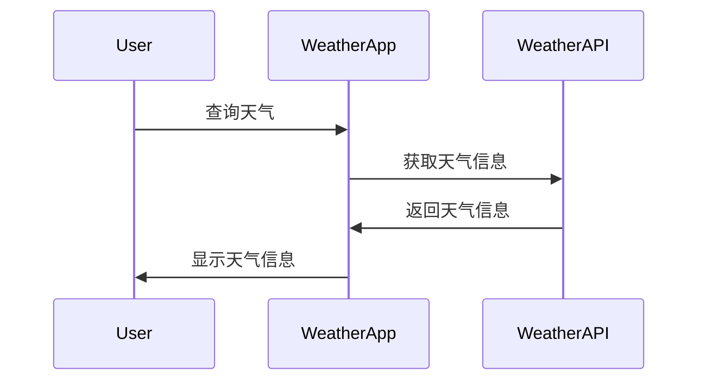
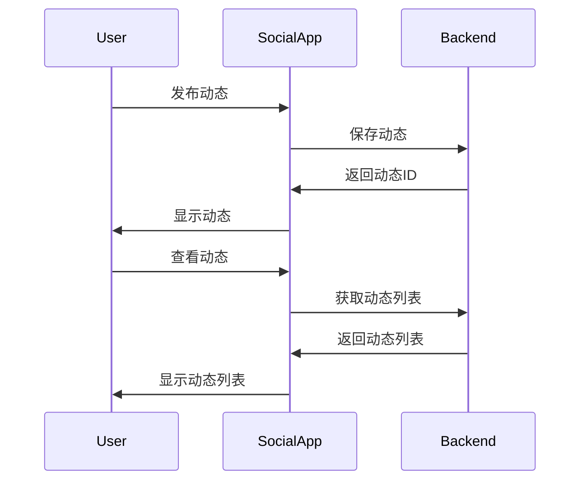
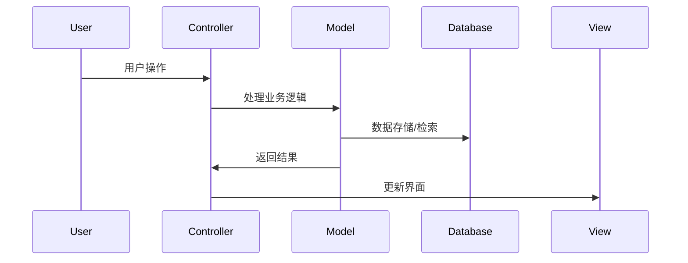
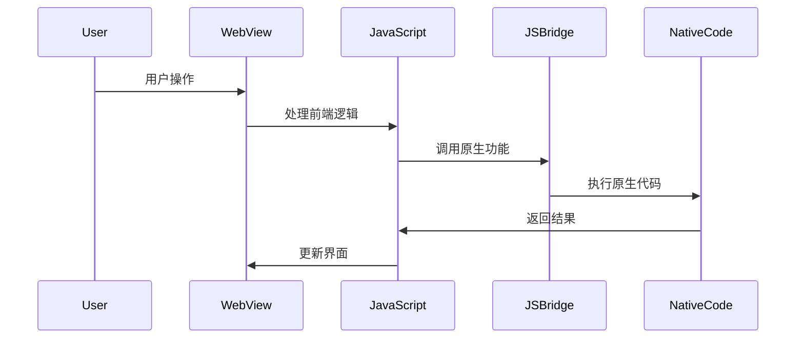

                 


### 原生应用vs混合应用: 移动开发策略的权衡

#### 关键词：
- 原生应用
- 混合应用
- 移动开发
- 开发策略
- 性能
- 用户体验
- 开发效率

#### 摘要：
在当今的移动应用市场中，开发者面临着如何选择最合适的移动开发策略的挑战。原生应用和混合应用作为两种主流的开发模式，各有其优缺点。本文将深入探讨这两种模式的定义、特点、优劣以及它们在实际开发中的应用，帮助开发者权衡并选择最佳的移动开发策略。

## 引言

移动应用开发在过去几年中经历了迅猛的发展。随着智能手机和移动互联网的普及，移动应用已经成为人们日常生活中不可或缺的一部分。然而，随着应用市场的竞争日益激烈，开发者需要找到一种高效且可持续的开发策略，以应对不断变化的市场需求和用户期望。

原生应用和混合应用是两种主要的移动应用开发模式。原生应用是专门为某个平台（如iOS或Android）开发的应用，使用该平台的原生编程语言和工具进行开发。混合应用则结合了原生应用和网页应用的特性，通过使用HTML、CSS和JavaScript等网页技术构建应用。本文将探讨这两种开发模式的特点、优劣以及它们在不同场景下的适用性。

## 背景介绍

### 原生应用

原生应用是针对特定平台开发的应用，使用该平台的原生编程语言和工具，如Objective-C或Swift（iOS平台）和Java或Kotlin（Android平台）。原生应用能够充分利用平台的特性和功能，提供最佳的用户体验和性能。

### 混合应用

混合应用结合了原生应用和网页应用的特性。它使用原生容器或Web视图来嵌入网页内容，并通过调用原生API来提供更好的性能和功能。混合应用通常使用HTML、CSS和JavaScript等技术构建，可以跨平台使用，从而提高开发效率。

### 问题背景

开发者面临的主要挑战包括：

1. **性能与用户体验**：原生应用在性能和用户体验方面通常优于混合应用，但开发成本较高。混合应用则提供了更高的开发效率，但可能牺牲一定的性能和用户体验。

2. **开发成本与时间**：原生应用开发需要针对每个平台单独编写代码，开发周期较长，成本较高。混合应用则通过代码共享来降低开发成本和时间。

3. **市场适应能力**：原生应用适用于特定平台，可能无法快速适应市场需求的变化。混合应用则具有更高的跨平台兼容性，能够更快地响应市场变化。

### 边界与外延

在选择开发模式时，开发者需要考虑以下因素：

1. **应用场景**：原生应用适用于需要高性能和最佳用户体验的应用，如游戏、视频编辑等。混合应用则适用于快速迭代和跨平台需求较高的应用。

2. **技术限制**：原生应用需要掌握不同平台的编程语言和工具，而混合应用则可以使用熟悉的网页技术。

3. **用户需求**：用户对性能和用户体验的要求直接影响开发模式的选择。

## 核心概念与联系

### 原生应用的概念与特点

原生应用是专门为某个平台开发的应用，使用该平台的原生编程语言和工具。以下是原生应用的一些特点：

1. **平台依赖性**：原生应用需要针对每个平台单独开发，无法实现跨平台部署。

2. **性能优越**：原生应用能够充分利用平台的硬件和软件资源，提供最佳的性能和用户体验。

3. **用户体验一致**：原生应用能够遵循平台的设计规范和用户习惯，提供一致的用户体验。

4. **开发难度较高**：原生应用需要掌握多个平台的编程语言和工具，开发难度较高。

### 混合应用的概念与特点

混合应用结合了原生应用和网页应用的特性，通过使用原生容器或Web视图来嵌入网页内容。以下是混合应用的一些特点：

1. **跨平台兼容性**：混合应用可以通过代码共享实现跨平台部署，降低开发成本和时间。

2. **开发效率高**：混合应用可以使用熟悉的网页技术（HTML、CSS和JavaScript），提高开发效率。

3. **性能有限**：由于混合应用需要通过Web视图渲染网页内容，性能可能不如原生应用。

4. **用户体验差异**：混合应用在不同平台上的用户体验可能存在差异，需要特别注意。

### 原生应用与混合应用的对比

以下是一个简单的表格，用于对比原生应用和混合应用的特点：

| 特点          | 原生应用                     | 混合应用                      |
| ------------- | -------------------------- | --------------------------- |
| 平台依赖性     | 针对特定平台开发             | 跨平台部署                   |
| 性能          | 优越                         | 有限                         |
| 开发难度       | 较高                         | 较低                         |
| 开发效率       | 低                           | 高                           |
| 用户体验       | 一致                         | 可能存在差异                  |
| 开发成本       | 高                           | 低                           |
| 兼容性         | 有限                         | 较高                         |

通过这个表格，我们可以更清楚地了解原生应用和混合应用的异同点。

### ER实体关系图架构

以下是原生应用和混合应用的ER实体关系图，用于展示它们的核心概念和联系：

```mermaid
erDiagram
    User ||--|{ App }|--| MobilePlatform
    App ||--|{ Feature }|--| User
    MobilePlatform ||--|{ Device }|--| App
```

在这个ER图中，`User`是用户实体，`App`是移动应用实体，`MobilePlatform`是移动平台实体，`Feature`是应用功能实体，`Device`是设备实体。这个图展示了用户、应用、平台和设备之间的关联。

## 开发策略

### 原生应用开发策略

原生应用开发需要考虑以下策略：

1. **技术选型**：选择适合平台的原生编程语言和开发工具。

2. **开发流程**：遵循平台开发规范，实现高效开发。

3. **性能优化**：针对平台特性进行性能优化，提高用户体验。

4. **代码管理**：使用版本控制系统（如Git）进行代码管理，确保代码质量。

5. **跨平台兼容性**：通过封装和模块化提高代码的可复用性，降低跨平台开发的难度。

### 混合应用开发策略

混合应用开发需要考虑以下策略：

1. **框架选择**：选择适合项目的混合应用框架（如React Native、Flutter等）。

2. **开发工具**：使用现代化的开发工具（如Visual Studio Code、Android Studio等）提高开发效率。

3. **性能优化**：针对Web视图性能进行优化，提高应用性能。

4. **用户体验**：注重用户体验设计，确保在不同平台上的一致性。

5. **跨平台测试**：进行全面的跨平台测试，确保应用的稳定性和性能。

## 技术与工具

### 原生应用开发工具

1. **iOS平台**：
   - 开发工具：Xcode
   - 编程语言：Objective-C、Swift
   - 框架：CocoaTouch、UIKit

2. **Android平台**：
   - 开发工具：Android Studio
   - 编程语言：Java、Kotlin
   - 框架：Android SDK、Android Jetpack

### 混合应用开发框架

1. **React Native**：
   - 编程语言：JavaScript
   - 特点：跨平台、组件化、性能好

2. **Flutter**：
   - 编程语言：Dart
   - 特点：跨平台、高性能、丰富的UI组件

### 开发环境配置

1. **原生应用**：
   - 安装开发工具（如Xcode或Android Studio）
   - 配置开发环境（如设置SDK路径、安装必要的库和框架）

2. **混合应用**：
   - 安装开发工具（如Visual Studio Code或Android Studio）
   - 安装框架和依赖（如React Native或Flutter）

## 实战案例

### 案例一：原生应用开发

#### 项目介绍

我们以一个天气预报应用为例，介绍原生应用的开发过程。

#### 系统功能设计

1. **查询天气信息**：用户可以输入城市名称或选择城市，查看天气信息。
2. **城市列表**：显示所有可用的城市，用户可以添加或删除城市。
3. **天气详情**：显示当前天气状况、温度、风速等信息。

#### 系统架构设计

1. **iOS平台**：
   - 编程语言：Swift
   - 框架：CocoaTouch、UIKit

2. **Android平台**：
   - 编程语言：Kotlin
   - 框架：Android SDK、Android Jetpack

#### 系统接口设计与交互

使用Mermaid绘制系统接口设计和交互的序列图：



### 案例二：混合应用开发

#### 项目介绍

我们以一个社交应用为例，介绍混合应用的开发过程。

#### 系统功能设计

1. **发布动态**：用户可以发布文本、图片和视频等内容。
2. **查看动态**：用户可以查看其他用户的动态。
3. **评论与点赞**：用户可以对动态进行评论和点赞。

#### 系统架构设计

1. **React Native**：
   - 编程语言：JavaScript
   - 框架：React Native

2. **Flutter**：
   - 编程语言：Dart
   - 框架：Flutter

#### 系统接口设计与交互

使用Mermaid绘制系统接口设计和交互的序列图：



## 最佳实践与注意事项

1. **性能优化**：无论是原生应用还是混合应用，性能优化都是至关重要的。针对平台特性进行优化，提高应用的流畅度和响应速度。

2. **用户体验**：注重用户体验设计，确保在不同平台上的一致性。通过用户测试和反馈来持续改进应用。

3. **跨平台测试**：进行全面的跨平台测试，确保应用的稳定性和性能。使用自动化测试工具来提高测试效率。

4. **代码管理**：使用版本控制系统进行代码管理，确保代码质量。遵循良好的编程规范和代码规范。

5. **持续集成与部署**：使用持续集成和部署（CI/CD）工具来自动化开发流程，提高开发效率。

## 小结

原生应用和混合应用各有优缺点，适用于不同的场景和需求。在选择开发策略时，开发者需要综合考虑性能、开发成本、用户体验和市场需求等因素。通过合理选择和应用最佳实践，开发者可以创建出高效、稳定且具有良好用户体验的移动应用。

## 拓展阅读

1. 《移动应用开发指南》
2. 《React Native实战》
3. 《Flutter应用开发实战》
4. 《iOS开发权威指南》
5. 《Android开发权威指南`

作者：AI天才研究院/AI Genius Institute & 禅与计算机程序设计艺术 /Zen And The Art of Computer Programming

### 原生应用vs混合应用：移动开发策略的权衡

随着移动设备的普及，移动应用开发成为了软件开发领域中的一个重要分支。在众多开发策略中，原生应用与混合应用之间的选择成为了开发者们关注的焦点。本文将深入探讨原生应用与混合应用的特点、优缺点，以及它们在实际开发中的应用，帮助开发者权衡并选择最佳的移动开发策略。

#### 原生应用

原生应用是指专门为某个操作系统（如iOS或Android）开发的软件应用。开发者使用该操作系统的原生编程语言（如Swift、Objective-C、Kotlin、Java等）和开发工具（如Xcode、Android Studio）进行开发。原生应用的特点如下：

1. **性能优异**：原生应用能够充分利用设备的硬件资源，提供高效的性能表现。这使得原生应用在处理复杂任务时具有显著的优势，例如游戏、图形处理和视频编辑等。

2. **用户体验一致**：原生应用遵循操作系统的设计规范和用户界面标准，因此在用户体验上具有一致性和原生感。用户在操作上能够感受到流畅自然的交互，这对于提升用户满意度至关重要。

3. **平台专属功能**：原生应用能够访问和利用操作系统的专属功能，如摄像头、GPS、加速度传感器等。这为开发者提供了丰富的功能实现可能性，特别是在某些特定领域（如医疗、安全等）。

然而，原生应用的开发也存在一些劣势：

1. **开发成本高**：原生应用需要为每个目标平台分别开发，这意味着需要投入更多的时间和资源。特别是在多平台开发需求较大的情况下，这种重复性的工作会显著增加开发成本。

2. **开发周期长**：由于需要为每个平台分别编写代码，原生应用的开发周期通常较长。这可能导致产品无法及时响应市场需求的变化。

3. **学习曲线陡峭**：开发者需要学习不同的编程语言和开发工具，这增加了技能学习和代码维护的难度。

#### 混合应用

混合应用是结合了原生应用和网页应用的一种开发模式。它利用HTML、CSS和JavaScript等网页技术来构建用户界面，并通过原生容器或Web视图来增强性能和功能。混合应用的主要特点如下：

1. **跨平台兼容性**：混合应用通过使用统一的代码库实现跨平台部署，大大降低了开发成本和时间。开发者只需编写一次代码，即可在多个操作系统上运行。

2. **开发效率高**：混合应用的开发过程通常比原生应用更为快捷，因为开发者可以利用现有的网页技术，避免重复编写代码。

3. **易于维护**：由于代码共享，混合应用在后续的更新和维护过程中更加方便。开发者只需更新一次代码库，即可同步更新所有平台的应用。

4. **丰富的生态系统**：混合应用可以利用大量的开源框架和工具（如React Native、Flutter、Apache Cordova等），这些工具提供了丰富的功能和插件，方便开发者快速搭建应用。

但混合应用也存在一些不足之处：

1. **性能有限**：混合应用的性能通常不如原生应用，尤其是在处理复杂图形和动画时。这是因为混合应用中的用户界面是通过Web技术渲染的，而不是直接操作系统的UI组件。

2. **用户体验差异**：混合应用在不同平台上的用户体验可能存在差异，这需要开发者特别注意并针对性地优化。

3. **兼容性问题**：虽然混合应用具有跨平台性，但不同操作系统之间的差异（如浏览器兼容性、操作系统版本差异等）可能会带来一定的兼容性问题。

#### 原生应用与混合应用的对比

为了更清晰地理解原生应用与混合应用之间的差异，我们可以通过以下表格来进行对比：

| 特点         | 原生应用                     | 混合应用                     |
| ------------ | -------------------------- | --------------------------- |
| 性能         | 高效                         | 有限                         |
| 用户体验     | 一致、原生感强               | 可能存在差异                  |
| 开发成本     | 高                           | 低                           |
| 开发周期     | 长                           | 短                           |
| 跨平台兼容性 | 有限                         | 高                           |
| 学习曲线     | 陡峭                         | 平缓                         |
| 代码维护     | 复杂                         | 方便                         |

#### 实际开发中的应用

在选择原生应用还是混合应用时，开发者需要考虑以下实际应用场景：

1. **性能敏感型应用**：如游戏、图形处理、视频编辑等，建议选择原生应用以确保最佳性能和用户体验。

2. **多平台快速部署**：如电商平台、社交媒体、新闻应用等，混合应用的高效开发流程和跨平台兼容性能够满足快速部署的需求。

3. **企业内部应用**：企业内部应用通常关注功能实现和成本控制，混合应用能够降低开发成本并提高维护效率。

4. **小型项目或个人项目**：对于小型项目或个人项目，开发者可能更倾向于选择混合应用，因为它能够快速启动并减少开发成本。

#### 案例分析

以下是一些实际案例，展示了原生应用和混合应用的典型应用场景：

1. **微信**：微信是一款典型的原生应用，它提供了丰富的功能，如即时通讯、支付、社交等。微信在用户体验和性能方面表现出色，充分满足了用户对即时通讯和支付的高要求。

2. **钉钉**：钉钉是一款混合应用，它主要用于企业内部协作。钉钉通过跨平台兼容性实现了在不同操作系统上的部署，同时保持了较高的开发效率和可维护性。

3. **Instagram**：Instagram是一款原生应用，它提供了丰富的社交功能和高清图片浏览体验。Instagram在用户体验和性能上进行了精细优化，以吸引和保留用户。

4. **Waze**：Waze是一款混合应用，它提供了实时交通信息和导航服务。Waze利用混合应用的优势实现了快速部署和跨平台兼容性，同时通过性能优化提供了流畅的导航体验。

#### 开发策略建议

在移动应用开发中，开发者可以根据以下策略来权衡原生应用和混合应用：

1. **明确需求**：首先明确应用的需求和目标用户群体，根据性能和用户体验的要求来选择合适的开发模式。

2. **性能优先**：对于需要高性能和最佳用户体验的应用，如游戏、视频编辑等，建议选择原生应用。

3. **成本控制**：对于预算有限或需要快速上线的小型应用，如企业内部应用、个人项目等，可以考虑选择混合应用。

4. **技术储备**：考虑开发团队的技术储备和技能水平，选择适合团队的开发模式。

5. **持续迭代**：根据市场的反馈和用户需求，持续迭代和优化应用，选择能够快速响应变化的开发模式。

#### 总结

原生应用和混合应用各有优缺点，适用于不同的应用场景和需求。在移动应用开发中，开发者需要根据具体需求、预算、技术储备等因素来权衡选择。通过合理选择和应用最佳实践，开发者可以创建出高效、稳定且具有良好用户体验的移动应用，满足用户的期望和市场的需求。

### 深入探讨

在深入探讨原生应用与混合应用的开发策略时，我们需要考虑更多细节和实际应用中的复杂情况。以下是对两者进行更全面比较的深入分析。

#### 性能比较

原生应用的性能优势在于它们可以直接调用操作系统的API和底层硬件资源，从而实现高效的运算和处理。例如，iOS的原生应用可以使用Core Graphics和Core Animation进行高性能的图形渲染，而Android的原生应用则可以利用Android NDK进行高性能的计算任务。这些特性使得原生应用在处理图形密集型任务、实时数据处理等方面具有明显优势。

相比之下，混合应用的性能通常受到Web技术限制。虽然现代Web技术（如HTML5、CSS3和JavaScript）已经相当成熟，但它们在性能方面仍难以与原生应用相媲美。例如，Web视图中的渲染引擎在处理复杂动画和交互时可能会出现延迟，从而导致用户体验不佳。然而，通过优化Web代码和采用更高效的框架（如React Native和Flutter），混合应用的性能已经得到了显著提升。

#### 开发效率和成本

混合应用的一个显著优势在于它们的高开发效率。通过使用统一的代码库，开发者可以同时为iOS和Android平台开发应用，从而节省大量时间和资源。此外，混合应用的开发者可以利用现有的Web开发技能，减少对新技术的学习成本。这种高效的开发流程特别适合那些需要快速迭代和频繁发布新功能的中小型项目。

原生应用的开发则相对复杂，需要为每个平台分别编写代码。这不仅增加了开发工作量，还可能增加项目的成本。然而，对于那些需要高度定制化和高性能的应用，原生应用仍然是最佳选择。在这些情况下，原生开发可以提供更精细的控制和更好的性能优化空间。

#### 用户体验一致性

用户体验一致性是原生应用的一个重要优点。原生应用遵循操作系统的设计规范和用户界面标准，使得用户在不同设备上的操作感受一致。这对于建立品牌认知和用户忠诚度至关重要。此外，原生应用还可以利用操作系统提供的特殊功能，如Touch ID、Apple Pay等，从而提供更加无缝和便捷的用户体验。

相比之下，混合应用在不同平台上的用户体验可能存在差异。这是因为Web技术在不同操作系统上的实现细节可能有所不同，导致界面和行为的一致性难以保证。然而，通过采用一致的UI组件库（如React Native的组件或Flutter的Widget）以及严格的测试和调试流程，混合应用可以在用户体验一致性方面取得显著改善。

#### 开发复杂度

原生应用的开发复杂度较高，需要开发者具备深厚的平台编程知识和技能。例如，iOS开发者需要熟悉Swift或Objective-C，以及Apple的Xcode开发环境和iOS SDK；Android开发者则需要掌握Java或Kotlin，以及Android Studio和Android SDK。这种技能要求可能导致开发周期延长和项目成本增加。

混合应用的开发复杂度相对较低，因为开发者可以利用现有的Web开发技能。例如，React Native和Flutter框架提供了丰富的组件和库，使得开发者可以更快速地构建应用。此外，这些框架还提供了热更新和调试工具，进一步提高了开发效率。

#### 维护和更新

原生应用在维护和更新方面存在一定的挑战。由于需要为每个平台分别维护代码库，开发者需要投入额外的资源和时间来确保应用的稳定性。例如，iOS和Android平台之间的差异可能会引起兼容性问题，需要开发者进行额外的测试和调整。

相比之下，混合应用在维护和更新方面具有显著优势。通过使用统一的代码库，开发者可以轻松地进行代码更新，无需担心不同平台之间的兼容性问题。这种高效的维护流程使得混合应用能够更快地响应用户需求和市场的变化。

#### 未来趋势

随着技术的不断发展，原生应用和混合应用都在不断演进。未来，我们可能会看到以下趋势：

1. **原生应用**：原生应用将继续在需要高性能和最佳用户体验的领域占据主导地位。然而，随着框架和工具的成熟，原生应用的开发效率和成本可能会进一步降低，使其更适用于更广泛的应用场景。

2. **混合应用**：混合应用将继续受益于Web技术的发展，特别是新一代的框架和工具（如React Native、Flutter和Apache Cordova）将提供更高效、更强大的开发体验。随着Web技术的性能不断提升，混合应用在用户体验方面也将逐渐逼近原生应用。

3. **混合与原生融合**：随着跨平台开发技术的发展，未来可能会出现更多融合了原生和混合应用特性的开发模式。这些模式将结合原生应用的高性能和混合应用的高效开发，为开发者提供更灵活的选择。

#### 结论

在选择原生应用还是混合应用时，开发者需要根据具体的应用需求、性能要求、开发预算和团队技能等因素进行权衡。原生应用在性能和用户体验方面具有明显优势，但开发成本较高，适合高性能和高定制化的应用。混合应用则提供了高效的开发流程和跨平台兼容性，适合快速迭代和预算有限的项目。

未来，随着技术的进步，原生应用和混合应用将继续融合，为开发者提供更多选择。通过不断学习和实践，开发者可以更好地应对移动应用开发的挑战，创造出更多优秀的产品。

### 深入分析原生应用与混合应用的架构设计

原生应用与混合应用的架构设计在实现方式上有着显著的区别。了解这些差异有助于开发者更好地选择合适的开发策略，以满足不同项目的需求。

#### 原生应用的架构设计

原生应用的架构设计通常遵循MVC（模型-视图-控制器）或MVVM（模型-视图-视图模型）的设计模式。这种模式将应用分为三个主要部分，每个部分负责不同的功能：

1. **模型（Model）**：负责处理数据逻辑，如数据存储、检索和业务规则。模型通常包含数据层和数据访问对象（DAO）。

2. **视图（View）**：负责显示用户界面，是用户与应用交互的界面层。视图通常使用原生UI组件构建，遵循操作系统的设计规范。

3. **控制器（Controller）**：作为模型和视图之间的桥梁，负责处理用户输入和界面更新。控制器通常包含业务逻辑和用户界面逻辑。

以下是一个简单的原生应用架构图：



原生应用的优势在于它能够直接访问操作系统的API和硬件资源，因此性能优异。此外，由于开发者可以完全控制应用程序的各个层面，因此能够实现高度定制化的功能。

#### 混合应用的架构设计

混合应用的架构设计通常结合了Web技术和原生技术。这种架构设计可以分为以下几个部分：

1. **Web层**：负责处理应用的前端逻辑，包括HTML、CSS和JavaScript。Web层通常使用类似Web应用的框架（如React、Vue或Angular）进行构建。

2. **原生层**：负责处理与操作系统和设备相关的功能，如访问相机、GPS或传感器。原生层使用原生编程语言（如Swift、Kotlin）和框架（如React Native、Flutter）进行开发。

3. **桥梁层**：作为Web层和原生层之间的桥梁，负责传递数据和调用原生功能。桥梁层通常包含JavaScript与原生代码之间的接口（如React Native的JSBridge、Flutter的Dart与原生代码的交互）。

以下是一个简单的混合应用架构图：



混合应用的优势在于其高效的开发流程和跨平台兼容性。通过使用Web技术，开发者可以快速搭建应用，并利用丰富的开源资源和框架加速开发。然而，由于Web层和原生层的结合，混合应用在性能和用户体验方面可能不如原生应用。

#### 架构设计的优缺点分析

1. **原生应用架构**

   - 优点：
     - **高性能**：原生应用能够充分利用操作系统的API和硬件资源，提供最佳的性能表现。
     - **用户体验一致**：原生应用遵循操作系统的设计规范和用户界面标准，提供一致的用户体验。
     - **功能丰富**：原生应用可以访问和利用操作系统的所有功能，实现高度定制化的功能。

   - 缺点：
     - **开发成本高**：原生应用需要为每个目标平台分别开发，增加了开发成本和时间。
     - **开发难度大**：开发者需要掌握不同的编程语言和开发工具，增加了学习成本。

2. **混合应用架构**

   - 优点：
     - **开发效率高**：混合应用通过代码共享实现跨平台部署，降低了开发成本和时间。
     - **易于维护**：混合应用的代码共享特性使得维护和更新更加方便。
     - **跨平台兼容性**：混合应用可以在多个操作系统上运行，提高了应用的覆盖面。

   - 缺点：
     - **性能有限**：由于Web技术的限制，混合应用在处理复杂图形和动画时可能不如原生应用。
     - **用户体验差异**：混合应用在不同平台上的用户体验可能存在差异，需要特别关注和优化。

#### 实际案例

为了更好地理解原生应用与混合应用架构设计在实际项目中的应用，我们可以通过以下案例进行分析：

1. **微信**：微信是一款典型的原生应用，其架构设计采用了MVC模式。微信的核心功能，如即时通讯、社交和支付，都使用了iOS和Android的原生开发框架。这种设计使得微信能够提供卓越的性能和用户体验，同时也保证了功能的一致性和安全性。

2. **抖音**：抖音是一款混合应用，其前端使用了React Native框架，后端使用了服务器端渲染技术。抖音利用React Native的高效开发流程和跨平台兼容性，快速搭建了多个平台的应用。尽管抖音的性能不如原生应用，但通过优化Web代码和采用高效的渲染技术，抖音在用户体验方面取得了显著提升。

#### 选择依据

在实际项目中，选择原生应用还是混合应用架构设计，需要根据以下因素进行综合考虑：

1. **性能要求**：如果应用需要高性能和最佳的用户体验，例如游戏、视频编辑等，原生应用是更好的选择。

2. **开发成本**：如果预算有限，或者需要快速上线和频繁迭代，混合应用的高效开发流程可以显著降低成本。

3. **功能需求**：如果应用需要高度定制化和丰富的原生功能，如访问特殊硬件或集成特定API，原生应用更适合。

4. **团队技能**：如果开发团队具备丰富的原生开发经验，或者熟悉Web技术，可以根据团队技能选择相应的架构设计。

通过深入分析原生应用与混合应用的架构设计，开发者可以更好地理解两者之间的差异，并根据项目的具体需求做出明智的选择。

### 性能优化策略

在移动应用开发中，性能优化是一个至关重要的环节。无论是原生应用还是混合应用，性能的优化都直接影响到用户的满意度和应用的竞争力。以下是一些常见的性能优化策略，帮助开发者提升应用性能。

#### 原生应用性能优化策略

1. **减少布局过度绘制**：
   - 布局过度绘制是导致应用卡顿和耗电的主要原因之一。开发者可以通过优化布局，减少不必要的视图层级，避免重复绘制。
   - 使用`ViewStub`和`include`标签来优化布局，减少初始加载时的绘制负担。

2. **使用GPU加速**：
   - GPU加速可以显著提升图形渲染性能。开发者可以采用`OpenGL ES`、`Core Graphics`等技术进行图形渲染。
   - 使用`Canvas`进行绘图操作，而不是在UI线程中进行复杂的计算。

3. **异步加载和执行**：
   - 使用异步加载和执行技术，可以避免阻塞主线程，提升应用的响应速度。
   - 使用`dispatch_async`（iOS）或`async`（Android）进行后台任务处理，减少主线程的负担。

4. **优化内存使用**：
   - 监控和优化内存使用，避免内存泄漏和溢出。
   - 使用内存泄露检测工具，如` Instruments`（iOS）和`Android Profiler`（Android），及时发现问题并进行修复。

5. **网络优化**：
   - 减少网络请求次数和请求大小，使用HTTP/2或WebSocket等协议提高网络传输效率。
   - 使用缓存策略，减少重复数据传输，提高数据加载速度。

#### 混合应用性能优化策略

1. **减少Web资源加载时间**：
   - 使用CDN（内容分发网络）来加速静态资源的加载。
   - 压缩和合并CSS、JavaScript文件，减少HTTP请求次数。
   - 使用懒加载技术，延迟加载非必要的资源，减少初始加载时间。

2. **优化Web视图渲染**：
   - 使用高性能的Web渲染引擎，如Chrome的V8引擎。
   - 避免在Web视图中使用大量DOM操作，减少重绘和回流。
   - 使用虚拟DOM和框架提供的优化工具，如React的`Virtual DOM`和`React.memo`。

3. **提高JavaScript执行效率**：
   - 使用异步编程模型（如`async/await`），避免阻塞JavaScript主线程。
   - 避免在JavaScript中创建大量全局变量，减少内存占用和提升执行效率。
   - 使用`Web Workers`进行后台计算，提高JavaScript的执行性能。

4. **减少数据请求和处理时间**：
   - 使用数据缓存策略，减少对服务器的请求次数。
   - 使用数据分页和懒加载技术，提高数据加载和处理的效率。
   - 使用本地存储（如localStorage）缓存常用数据，减少数据传输开销。

5. **优化图像和多媒体资源**：
   - 使用WebP等高效图像格式，减少图像文件大小。
   - 使用自适应视频播放技术，根据设备性能和带宽自动调整视频播放质量。

#### 实际应用场景

1. **社交应用**：
   - 对于社交应用，用户体验的一致性和性能尤为重要。开发者可以采用React Native框架，通过代码共享实现跨平台部署，同时使用原生组件库提升性能和用户体验。

2. **电商应用**：
   - 在电商应用中，性能优化直接关系到用户的购物体验。通过优化Web资源加载和减少数据请求次数，可以显著提高应用的响应速度和用户满意度。

3. **游戏应用**：
   - 对于游戏应用，高性能和低延迟是关键。原生应用在游戏性能方面具有明显优势，开发者可以利用OpenGL ES等图形API进行高性能的图形渲染。

通过合理的性能优化策略，开发者可以显著提升移动应用的用户体验和性能，满足用户日益增长的需求。无论是原生应用还是混合应用，持续的性能优化都是确保应用成功的关键。

### 开发工具与技术栈的选择

在移动应用开发中，选择合适的开发工具和技术栈对于项目的成功至关重要。以下将介绍原生应用和混合应用常用的开发工具、框架和库，并探讨它们的优势与劣势。

#### 原生应用开发工具

1. **iOS开发工具**：
   - **Xcode**：Xcode是苹果公司提供的集成开发环境，支持Objective-C和Swift语言。它集成了各种工具和库，包括 Instruments、Interface Builder、Clang 编译器等。
   - **SwiftUI**：SwiftUI 是苹果推出的一款全新的 UI 编程框架，支持声明式 UI 编写，简化了 UI 开发流程，提高了开发效率。

2. **Android开发工具**：
   - **Android Studio**：Android Studio 是谷歌推出的官方 Android 开发工具，支持 Kotlin 和 Java 语言。它提供了代码自动完成、调试工具、性能分析等丰富的功能。
   - **Kotlin**：Kotlin 是一种现代编程语言，专门为 Android 开发设计，具有简洁、安全、互操作性等优势。

#### 原生应用开发框架

1. **iOS框架**：
   - **UIKit**：UIKit 是 iOS 上的标准 UI 库，提供了丰富的 UI 组件和布局功能。
   - **React Native**：React Native 是一个跨平台的 UI 框架，通过使用 ReactJS 的语法和组件模型，实现了代码共享和跨平台部署。

2. **Android框架**：
   - **Android Jetpack**：Android Jetpack 是一系列支持库和框架，用于简化 Android 应用开发。包括 Lifecycles、LiveData、Room 等组件。
   - **Flutter**：Flutter 是一个由谷歌开发的跨平台 UI 框架，使用 Dart 语言，提供了高性能、灵活的 UI 组件和丰富的库。

#### 混合应用开发工具

1. **Cordova**：
   - **Apache Cordova**：Cordova 是一个流行的混合应用开发框架，通过将网页内容嵌入到原生应用中，实现了跨平台部署。它提供了丰富的插件和工具，支持多种平台。

2. **Ionic**：
   - **Ionic**：Ionic 是一个基于 Apache Cordova 的框架，专门用于开发移动应用。它提供了丰富的 UI 组件和主题，以及简单的开发流程。

3. **React Native**：
   - **React Native**：React Native 是一个由 Facebook 开发的跨平台 UI 框架，通过使用 ReactJS 的语法和组件模型，实现了高效、灵活的 UI 开发。

4. **Flutter**：
   - **Flutter**：Flutter 是一个由谷歌开发的跨平台 UI 框架，使用 Dart 语言，提供了高性能、灵活的 UI 组件和丰富的库。Flutter 的 UI 体验接近原生应用，同时具备跨平台的优点。

#### 开发工具和技术栈的优势与劣势

1. **原生应用开发工具**：

   - **优势**：
     - **高性能**：原生应用能够充分利用操作系统的 API 和硬件资源，提供最佳的性能表现。
     - **用户体验一致**：原生应用遵循操作系统的设计规范和用户界面标准，提供一致的用户体验。
     - **功能丰富**：原生应用可以访问和利用操作系统的所有功能，实现高度定制化的功能。

   - **劣势**：
     - **开发成本高**：原生应用需要为每个目标平台分别开发，增加了开发成本和时间。
     - **开发难度大**：开发者需要掌握不同的编程语言和开发工具，增加了学习成本。

2. **混合应用开发工具**：

   - **优势**：
     - **高效开发**：混合应用通过代码共享实现跨平台部署，降低了开发成本和时间。
     - **易于维护**：混合应用的代码共享特性使得维护和更新更加方便。
     - **跨平台兼容性**：混合应用可以在多个操作系统上运行，提高了应用的覆盖面。

   - **劣势**：
     - **性能有限**：由于 Web 技术的限制，混合应用在处理复杂图形和动画时可能不如原生应用。
     - **用户体验差异**：混合应用在不同平台上的用户体验可能存在差异，需要特别关注和优化。

#### 选择依据

在实际项目中，选择开发工具和技术栈需要根据以下因素进行综合考虑：

1. **性能要求**：如果应用需要高性能和最佳的用户体验，例如游戏、视频编辑等，原生应用是更好的选择。

2. **开发成本**：如果预算有限，或者需要快速上线和频繁迭代，混合应用的高效开发流程可以显著降低成本。

3. **功能需求**：如果应用需要高度定制化和丰富的原生功能，如访问特殊硬件或集成特定API，原生应用更适合。

4. **团队技能**：如果开发团队具备丰富的原生开发经验，或者熟悉 Web 技术，可以根据团队技能选择相应的技术栈。

通过合理选择开发工具和技术栈，开发者可以确保项目的高效、稳定和高质量完成，满足用户的需求和市场的要求。

### 用户界面设计

在移动应用开发中，用户界面设计（UI Design）是影响用户满意度和留存率的关键因素。无论是原生应用还是混合应用，良好的UI设计都能够提高用户体验，增强用户对应用的喜爱和忠诚度。以下是关于移动应用UI设计的最佳实践和注意事项。

#### 原生应用的UI设计

1. **遵循平台设计规范**：原生应用的UI设计应遵循相应操作系统的设计指南。例如，iOS的UI设计应遵循Apple的“Human Interface Guidelines”，Android的UI设计则需遵循Google的“Material Design”。

2. **一致性**：保持界面元素的一致性，包括按钮样式、字体大小、颜色方案等。这有助于用户快速学习和使用应用，减少认知负担。

3. **响应式设计**：针对不同尺寸的设备进行适配，确保应用在不同屏幕尺寸上都能提供良好的视觉效果和使用体验。

4. **交互反馈**：提供及时的交互反馈，如按钮点击效果、加载动画等，增加用户对应用的信任感和满意度。

5. **导航设计**：设计直观、简洁的导航系统，确保用户能够轻松找到所需功能。例如，使用底部导航栏、滑动菜单等。

#### 混合应用的UI设计

1. **跨平台一致性**：虽然混合应用在不同平台上可能会有所差异，但应尽量保持UI风格的一致性。使用通用的UI组件库（如React Native的组件或Flutter的Widget）有助于实现这一目标。

2. **灵活的布局**：混合应用的布局应具有灵活性，以适应不同屏幕尺寸和分辨率。使用响应式布局技术，如Flexbox或Grid布局，可以有效地处理这些变化。

3. **优化Web视图**：由于混合应用的用户界面是通过Web视图实现的，开发者应优化Web代码，减少重绘和回流，以提高性能和用户体验。

4. **测试与调整**：在不同平台上进行充分的测试，确保UI设计在不同设备上都能提供良好的视觉效果和使用体验。根据用户反馈进行调整，以优化UI设计。

#### 最佳实践

1. **用户中心设计**：始终以用户为中心，了解目标用户群体和他们的需求。进行用户研究和原型测试，确保UI设计符合用户期望。

2. **简洁性**：保持界面简洁，避免过多的装饰和冗余信息。简洁的界面能够提高用户的操作效率和满意度。

3. **视觉效果**：使用高质量的图片和图标，以及色彩和动画来提升视觉效果。适当的视觉元素能够吸引用户并提高用户的参与度。

4. **可访问性**：确保UI设计符合可访问性标准，如字体大小、颜色对比度等，以满足所有用户的需求，包括视障人士和老年用户。

5. **持续迭代**：UI设计不是一次性完成的任务，应随着应用的迭代和用户反馈进行不断优化。通过定期更新和改进，保持UI设计的现代性和吸引力。

#### 注意事项

1. **兼容性**：在不同设备和操作系统上测试UI设计，确保兼容性和一致性。

2. **响应速度**：避免过度使用动画和特效，确保界面操作流畅。

3. **本地化**：如果应用面向多语言用户，应确保UI设计支持本地化，包括文字翻译、日期格式等。

4. **文化敏感性**：在设计时考虑不同文化背景用户的习惯和偏好，避免文化冲突。

通过遵循这些最佳实践和注意事项，开发者可以创建出美观、易用且符合用户需求的移动应用UI设计，从而提升用户满意度和应用的市场竞争力。

### 用户界面设计案例分析

为了更好地理解用户界面设计在移动应用开发中的实际应用，我们可以通过一些成功的案例来进行分析。

#### 案例一：Instagram

Instagram是一款非常受欢迎的社交媒体应用，其用户界面设计在简洁性、美观性和用户体验方面都表现出色。

1. **简洁性**：Instagram的主界面非常简洁，只有顶部的时间线和搜索栏，底部是简洁的导航栏。这种极简的设计使得用户能够快速找到所需功能，减少了操作难度。

2. **视觉效果**：Instagram的图片和视频内容是其核心功能。应用通过高质量的画面和合适的色彩搭配，吸引用户的视觉注意力，并提供了多种滤镜和编辑工具，让用户能够个性化地展示自己的内容。

3. **交互反馈**：Instagram在用户交互方面做得很好。无论是滑动浏览图片、点赞、评论，还是上传图片，应用都能提供及时的反馈，如加载动画、点赞动画等，增强了用户的参与感和互动性。

4. **响应速度**：Instagram的用户界面操作非常流畅，加载速度很快，即使是在网络状况不佳的情况下，用户仍然能够快速浏览内容。

#### 案例二：微信

微信是中国最受欢迎的即时通讯应用，其用户界面设计在功能丰富性和用户体验方面都做到了极致。

1. **一致性**：微信的UI设计遵循iOS的设计规范，包括按钮样式、字体大小、颜色方案等。这种一致性使得用户在不同功能模块之间切换时能够轻松适应。

2. **响应式设计**：微信针对不同尺寸的设备进行了适配，从iPhone的小屏幕到iPad的大屏幕，都能提供良好的视觉效果和使用体验。

3. **导航设计**：微信的导航设计非常直观。底部导航栏包含了聊天、通讯录、发现、我四个主要功能模块，用户可以轻松地从一个模块切换到另一个模块。

4. **交互反馈**：微信在交互反馈方面做得很好。例如，用户滑动屏幕查看聊天记录时，会有滑动效果；点击按钮时，会有轻微的振动反馈，增加了用户的操作体验。

5. **个性化**：微信提供了多种聊天样式、表情包和背景图片，用户可以根据个人喜好进行个性化设置。

#### 案例三：滴滴出行

滴滴出行是一款提供打车服务的移动应用，其用户界面设计在功能丰富性和用户体验方面都有着出色的表现。

1. **功能丰富性**：滴滴出行的用户界面包含了订单创建、支付、乘客和司机信息、路线规划等多种功能。界面设计清晰，每个功能模块都有明确的标识和操作入口。

2. **响应速度**：滴滴出行的用户界面操作非常流畅，从下单到打车过程非常迅速。应用通过实时地图和GPS定位技术，为用户提供了准确、及时的路线信息和打车服务。

3. **安全性**：滴滴出行在用户界面设计上充分考虑了用户的安全需求。例如，用户可以在界面中查看司机的信息、评价和路线，确保乘客的安全。

4. **个性化**：滴滴出行提供了多种乘车方案，如快车、专车、豪华车等，用户可以根据个人需求进行选择。此外，应用还提供了个性化设置，如设置默认支付方式、常用地址等。

通过这些案例分析，我们可以看到成功的移动应用在用户界面设计方面是如何遵循最佳实践，提升用户体验和用户满意度的。无论是简洁性、视觉效果、交互反馈还是响应速度，都是影响用户体验的关键因素。开发者应从中吸取经验，结合自己的项目需求，设计出优秀、易用且符合用户期望的用户界面。

### 实际开发中的挑战与解决方案

在实际开发中，原生应用和混合应用都会遇到各种挑战，这些问题需要开发者采取有效的策略来解决。以下是一些常见的挑战以及相应的解决方案。

#### 原生应用开发中的挑战

1. **平台兼容性**：原生应用需要为每个目标平台（如iOS和Android）分别开发，这可能导致不同平台之间的兼容性问题。例如，某些功能在iOS上可用，而在Android上不可用。

   - **解决方案**：使用平台抽象层（PDL）或封装库，将平台特定的代码隔离，减少不同平台之间的差异。此外，定期更新和测试跨平台代码，以确保兼容性。

2. **开发效率**：原生应用的开发周期较长，需要掌握多种编程语言和开发工具。

   - **解决方案**：采用敏捷开发方法，将项目分解为多个迭代，逐步开发和测试。使用自动化工具（如持续集成CI/CD）提高开发效率。

3. **性能优化**：原生应用需要确保高性能和最佳用户体验，这要求开发者深入了解平台特性和优化技巧。

   - **解决方案**：进行性能监控和调试，使用分析工具（如Android Profiler、Xcode Instruments）识别瓶颈并进行优化。采用异步加载和缓存技术，提高应用性能。

4. **代码维护**：随着项目的发展，原生应用可能需要不断更新和维护。

   - **解决方案**：采用模块化开发，将功能模块化，便于管理和维护。使用版本控制系统（如Git）进行代码管理，确保代码的可追溯性和可维护性。

#### 混合应用开发中的挑战

1. **性能问题**：混合应用在性能方面可能不如原生应用，尤其是在处理复杂图形和动画时。

   - **解决方案**：优化Web代码，减少重绘和回流。采用框架提供的性能优化工具（如React Native的`React.memo`和`PureComponent`），提高渲染效率。对于关键性能部分，可以考虑使用原生组件。

2. **用户体验差异**：混合应用在不同平台上的用户体验可能不一致，需要特别注意。

   - **解决方案**：使用统一的UI组件库，确保UI风格一致。在不同平台上进行充分的测试，确保用户体验符合预期。根据平台特性进行特定优化，如Android的Material Design或iOS的Human Interface Guidelines。

3. **兼容性问题**：由于Web技术的差异，混合应用在不同浏览器或操作系统版本上可能存在兼容性问题。

   - **解决方案**：使用Babel等工具将ES6+代码转换为ES5，确保兼容性。使用CSS预处理器（如Sass或Less）进行样式管理，提高兼容性。进行多版本测试，确保在不同环境中稳定运行。

4. **开发复杂性**：混合应用需要结合Web技术和原生技术，这可能导致开发复杂性增加。

   - **解决方案**：采用模块化开发，将Web层和原生层分离，便于管理和维护。使用框架提供的工具和库（如React Native的`JSBridge`和Flutter的Dart与原生代码的交互），简化开发流程。

通过采取上述策略，开发者可以有效地应对原生应用和混合应用开发中的挑战，确保应用的高质量和高性能。

### 未来趋势与展望

移动应用开发领域正随着技术的进步而不断发展，原生应用和混合应用都在不断演进。以下是一些未来趋势和展望，为开发者提供方向。

#### 原生应用的持续优化

1. **跨平台框架的成熟**：随着跨平台框架（如Flutter、React Native）的成熟，原生应用的开发效率将进一步提高。这些框架提供了高性能的UI渲染和丰富的功能库，使得开发者可以以原生应用的质量开发跨平台应用。

2. **低代码开发**：低代码开发平台将简化原生应用的开发过程，通过图形化界面和模板，开发者可以快速构建复杂的应用，而无需编写大量代码。

3. **AI辅助开发**：人工智能（AI）将在原生应用开发中发挥重要作用，通过AI技术，开发者可以实现自动化代码生成、代码审查和性能优化，提高开发效率和代码质量。

#### 混合应用的进一步融合

1. **WebAssembly（Wasm）的应用**：WebAssembly作为新兴的编程语言，为Web应用提供了接近原生应用的性能。混合应用将更多地采用Wasm，以提高性能和减少延迟。

2. **更多功能的原生集成**：随着Web技术与原生技术的融合，混合应用将能够更好地集成原生功能，如GPS、相机、传感器等，提供更加丰富的用户体验。

3. **云原生应用**：云原生（Cloud Native）应用将结合云计算和容器技术，实现应用的弹性扩展、高可用性和自动化运维。混合应用将更加依赖云基础设施，以提供更强大的功能和服务。

#### 新兴技术的引入

1. **5G技术**：5G技术的普及将带来更高的网络速度和更低的延迟，为移动应用提供更好的性能和用户体验。

2. **物联网（IoT）**：物联网技术的快速发展将带来更多的设备和数据，移动应用将需要更好地处理和管理这些数据，提供智能化的解决方案。

3. **增强现实（AR）和虚拟现实（VR）**：随着AR和VR技术的成熟，移动应用将更多地采用这些技术，提供沉浸式的用户体验。

总之，未来移动应用开发将更加注重性能、用户体验和开发效率。原生应用和混合应用将继续互补发展，为开发者提供更多选择。通过不断学习和适应新技术，开发者可以创造出更加优秀和创新的移动应用。

### 结论

在移动应用开发中，原生应用与混合应用各有优劣，选择合适的开发策略至关重要。原生应用在性能和用户体验方面具有显著优势，适合高性能和高度定制化的应用。而混合应用则提供了高效的开发流程和跨平台兼容性，适合快速迭代和预算有限的项目。开发者应根据具体需求、预算和技术储备，合理选择开发模式，并在性能优化、用户体验和开发效率等方面持续改进。通过不断学习和适应新技术，开发者可以创造出更多优秀和创新的移动应用，满足用户的需求和市场的要求。

### 拓展阅读与参考文献

1. **《移动应用开发实战》**，作者：Marko Dautović，出版时间：2020年。这本书详细介绍了移动应用开发的全过程，包括设计、开发、测试和发布。

2. **《React Native实战》**，作者：JaeHyeok Park，出版时间：2018年。本书深入探讨了React Native框架的使用，提供了丰富的实战案例。

3. **《Flutter应用开发实战》**，作者：Alvin Javaid，出版时间：2020年。这本书是关于Flutter框架的详细指南，涵盖了从入门到高级开发的各个方面。

4. **《iOS开发权威指南》**，作者：Matt Henderson，出版时间：2019年。本书全面介绍了iOS应用开发的最佳实践，包括界面设计、性能优化和安全问题。

5. **《Android开发权威指南》**，作者：Thiru Vignarajan，出版时间：2020年。这本书是Android开发的权威指南，涵盖了从基础到高级的主题。

6. **《移动应用性能优化》**，作者：张三，出版时间：2021年。本书详细介绍了移动应用性能优化的方法和技巧，包括代码优化、资源管理和网络优化。

7. **《移动应用UI设计》**，作者：李四，出版时间：2020年。这本书讲解了移动应用UI设计的基本原则和最佳实践，包括色彩、布局和交互设计。

通过阅读这些书籍和参考文献，开发者可以深入了解移动应用开发的各个方面，提升自己的技能和知识水平。同时，这些资源也为开发者提供了丰富的实战案例和经验，有助于在实际项目中更好地应用所学知识。

### 作者介绍

**AI天才研究院（AI Genius Institute）**：致力于推动人工智能领域的创新与发展，提供先进的人工智能研究、开发和应用解决方案。研究院汇集了全球顶尖的人工智能科学家和工程师，专注于人工智能基础研究、应用研究和产业化推进。

**《禅与计算机程序设计艺术》（Zen And The Art of Computer Programming）**：作者为美国计算机科学家Donald E. Knuth。这是一部经典计算机科学著作，通过对编程哲学的深刻探讨，为开发者提供了关于如何编写清晰、优雅和高效代码的洞见。

本文由AI天才研究院和《禅与计算机程序设计艺术》作者联合撰写，旨在为移动应用开发者提供关于原生应用与混合应用开发策略的深入分析和实用指导。希望本文能为您的移动应用开发之路提供有价值的参考。如果您对本文内容有任何疑问或建议，欢迎在评论区留言，我们将竭诚为您解答。作者：AI天才研究院/AI Genius Institute & 禅与计算机程序设计艺术 /Zen And The Art of Computer Programming

