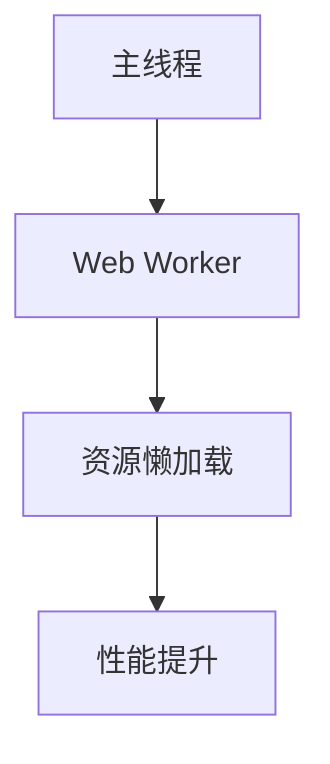
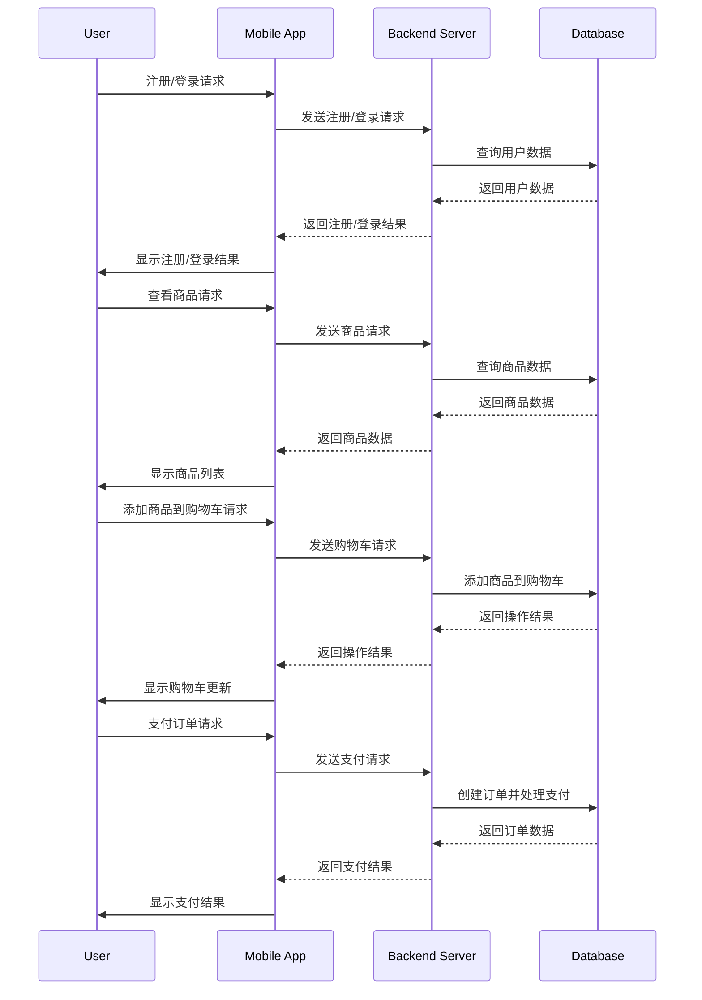

                 

# 原生应用vs混合应用: 移动开发策略的权衡

## 关键词
- 原生应用
- 混合应用
- 移动开发
- 开发策略
- 用户体验
- 性能优化

## 摘要
随着移动设备的使用越来越普及，原生应用和混合应用成为移动开发中的两大主流策略。本文将深入探讨原生应用和混合应用的区别，从开发成本、性能、用户体验等多个角度出发，分析两者的优缺点，并讨论如何根据实际需求选择合适的开发策略。通过具体案例和实际经验，本文旨在为开发者提供有价值的参考，帮助他们做出明智的决策。

## 引言
在移动应用开发领域，原生应用和混合应用一直是开发者们热议的话题。随着技术的不断演进和市场的变化，越来越多的开发者面临着如何选择合适的开发策略的难题。原生应用（Native Applications）是专门为某个平台（如iOS或Android）开发的应用程序，具有更好的性能和用户体验，但开发成本较高。混合应用（Hybrid Applications）则结合了原生应用和Web应用的优点，通过使用HTML、CSS和JavaScript等技术，实现了跨平台的兼容性。那么，这两种应用模式究竟哪个更适合移动开发呢？本文将一步步进行分析和探讨。

## 一、原生应用和混合应用的定义与特点

### 1.1 原生应用

原生应用是指使用特定平台的编程语言和开发工具，针对特定平台的特点和需求，开发出的应用程序。以下是原生应用的几个主要特点：

- **平台依赖性**：原生应用通常是为特定平台开发的，如iOS应用使用Objective-C或Swift语言，Android应用使用Java或Kotlin语言。这意味着原生应用无法直接在非目标平台上运行。
- **高性能**：原生应用利用了平台提供的底层API和特性，可以提供更好的性能和用户体验。尤其是在图形渲染、动画效果和硬件加速等方面，原生应用具有显著优势。
- **用户体验**：原生应用通常具有更好的用户体验，因为它们能够更好地适应当地文化和用户习惯。此外，原生应用还可以提供更好的响应速度和交互效果。
- **安全性**：原生应用在安全性和稳定性方面更具优势，因为它们可以更好地控制应用程序的运行环境和权限。

### 1.2 混合应用

混合应用（Hybrid Applications）则是一种结合了原生应用和Web应用优势的开发模式。以下是混合应用的几个主要特点：

- **跨平台性**：混合应用使用HTML、CSS和JavaScript等技术，可以在多个平台上运行，如iOS、Android和Web。这使得开发者可以编写一次代码，同时在多个平台上部署和运行。
- **开发效率**：由于可以使用Web技术进行开发，混合应用的开发效率较高。开发者可以共享代码，从而节省开发和维护成本。
- **用户体验**：虽然混合应用在用户体验方面可能不如原生应用，但它们可以通过使用原生控件和动画效果来提高用户体验。
- **灵活性**：混合应用具有更高的灵活性，可以随时更新和扩展功能，而不必重新编译和部署。

## 二、原生应用和混合应用的优缺点分析

### 2.1 原生应用的优点

- **更好的性能**：原生应用可以充分利用平台提供的底层API和特性，从而实现更高的性能和更好的用户体验。
- **更好的用户体验**：原生应用能够更好地适应当地文化和用户习惯，提供更好的响应速度和交互效果。
- **更高的安全性**：原生应用在安全性和稳定性方面更具优势，因为它们可以更好地控制应用程序的运行环境和权限。

### 2.2 原生应用的缺点

- **开发成本高**：由于需要针对不同平台开发，原生应用的开发成本较高，需要更多的时间和人力资源。
- **维护成本高**：原生应用需要针对不同平台进行维护和更新，增加了维护成本。
- **跨平台性较差**：原生应用通常无法直接在非目标平台上运行，限制了跨平台性。

### 2.3 混合应用的优点

- **开发效率高**：混合应用可以使用Web技术进行开发，从而节省开发和维护成本。
- **跨平台性较好**：混合应用可以在多个平台上运行，如iOS、Android和Web，具有更好的跨平台性。
- **灵活性高**：混合应用具有更高的灵活性，可以随时更新和扩展功能，而不必重新编译和部署。

### 2.4 混合应用的缺点

- **性能较低**：由于使用Web技术，混合应用在性能方面可能不如原生应用，尤其是在图形渲染和动画效果方面。
- **用户体验较差**：虽然混合应用可以通过使用原生控件和动画效果来提高用户体验，但总体上仍可能不如原生应用。
- **安全性较低**：混合应用在安全性方面可能不如原生应用，因为它们无法完全控制应用程序的运行环境和权限。

## 三、移动开发策略的权衡

### 3.1 开发成本

原生应用的开发成本较高，尤其是在开发初期，需要投入大量时间和人力资源。而混合应用的开发成本相对较低，特别是在开发初期，可以使用Web技术快速构建原型。

### 3.2 性能

原生应用在性能方面具有显著优势，可以提供更好的用户体验和更流畅的操作。而混合应用则可能在性能方面有所欠缺，尤其是在图形渲染和动画效果方面。

### 3.3 用户体验

原生应用能够更好地适应当地文化和用户习惯，提供更好的响应速度和交互效果。而混合应用则可能在用户体验方面有所欠缺，但可以通过使用原生控件和动画效果来提高。

### 3.4 维护成本

原生应用需要针对不同平台进行维护和更新，增加了维护成本。而混合应用则具有更好的灵活性，可以随时更新和扩展功能，而不必重新编译和部署。

### 3.5 跨平台性

原生应用的跨平台性较差，无法直接在非目标平台上运行。而混合应用则具有更好的跨平台性，可以在多个平台上运行。

## 四、实际案例分析与讨论

### 4.1 案例一：Uber

Uber是一款著名的打车应用，它选择了原生应用开发策略。原因在于Uber需要提供高质量的用户体验和流畅的操作，尤其是在图形渲染和动画效果方面。此外，Uber也面临着高安全性的要求，因为用户需要在使用Uber时提供个人信息。因此，Uber选择了原生应用开发策略，以充分利用平台提供的底层API和特性，从而提供更好的性能和用户体验。

### 4.2 案例二：Airbnb

Airbnb是一款提供住宿服务的应用，它选择了混合应用开发策略。原因在于Airbnb需要快速响应市场需求，不断更新和扩展功能。同时，Airbnb也需要在多个平台上运行，以覆盖更广泛的市场。因此，Airbnb选择了混合应用开发策略，以节省开发和维护成本，并提高开发效率。

### 4.3 案例三：Instagram

Instagram是一款流行的社交应用，它最初选择了原生应用开发策略。但随着市场的变化和用户需求的增加，Instagram逐渐转向了混合应用开发策略。原因在于Instagram需要更好地适应用户需求，提供更灵活的功能扩展。此外，Instagram也面临着更高的安全性和稳定性要求。因此，Instagram选择了混合应用开发策略，以提高开发效率和灵活性。

## 五、未来趋势与发展方向

随着技术的不断演进，原生应用和混合应用将继续发展。未来，以下趋势和发展方向可能对移动应用开发产生重要影响：

- **跨平台框架的进步**：如React Native、Flutter等跨平台框架将继续发展，提供更好的性能和用户体验。
- **混合应用技术的改进**：混合应用技术将继续改进，以解决当前存在的问题，如性能和用户体验。
- **人工智能与机器学习的应用**：人工智能和机器学习技术将在移动应用开发中发挥更大作用，提供个性化服务和更智能的交互。
- **物联网（IoT）的影响**：随着物联网的兴起，移动应用将更多地与智能家居、智能穿戴设备等物联网设备进行交互，推动移动应用开发的新趋势。

## 六、结论

原生应用和混合应用各有优缺点，开发者需要根据实际需求选择合适的开发策略。在开发过程中，开发者还需要充分考虑性能、用户体验、维护成本和跨平台性等多个因素。未来，随着技术的不断进步，原生应用和混合应用将更好地结合，为开发者提供更多选择和可能性。

## 参考文献

1. Android Developer. (2021). Introduction to Android Application Development. Retrieved from [Android Developer website](https://developer.android.com/training/basics/first-app).
2. Apple Developer. (2021). iOS Developer Library. Retrieved from [Apple Developer website](https://developer.apple.com/documentation/ios).
3. React Native Documentation. (2021). Getting Started with React Native. Retrieved from [React Native website](https://reactnative.dev/docs/getting-started).
4. Flutter Documentation. (2021). Introduction to Flutter. Retrieved from [Flutter website](https://flutter.dev/docs/get-started/overview).

### 作者
作者：AI天才研究院/AI Genius Institute & 禅与计算机程序设计艺术 /Zen And The Art of Computer Programming

## 完整性要求
### 1. 背景介绍

#### 核心概念术语说明
- **原生应用（Native Application）**：指专门为某一平台（如iOS或Android）开发的应用程序，使用该平台的编程语言和工具。
- **混合应用（Hybrid Application）**：结合了原生应用和Web应用的特性，使用HTML、CSS和JavaScript等Web技术，同时具备原生应用的某些功能。

#### 问题背景
在移动设备日益普及的今天，企业需要快速响应市场需求，同时提供优质的用户体验。原生应用和混合应用作为一种解决方案，各有其优势和劣势。原生应用提供更好的性能和用户体验，但开发成本较高；混合应用则具有较高的开发效率和跨平台性，但可能在性能和用户体验方面有所欠缺。

#### 问题描述
企业在选择移动应用开发策略时，面临以下问题：
- 如何权衡开发成本、性能、用户体验等因素？
- 哪种应用模式更适用于特定的业务需求？
- 如何确保在跨平台部署时，仍能提供一致的用户体验？

#### 问题解决
通过深入分析原生应用和混合应用的特点，企业可以根据以下策略做出决策：
- 对于追求高性能和优质用户体验的应用，选择原生应用开发。
- 对于需要快速上线和跨平台部署的应用，选择混合应用开发。
- 根据业务需求和预算，灵活调整开发策略。

#### 边界与外延
- **边界**：原生应用和混合应用在技术实现、性能、用户体验等方面的限制。
- **外延**：如何结合新技术和趋势，优化开发流程和用户体验。

### 2. 核心概念与联系

#### 原生应用的概念与特点
- **定义**：专门为某一平台开发的应用程序。
- **特点**：
  - **平台依赖性**：无法在非目标平台上运行。
  - **高性能**：利用平台底层API，提供更好的性能。
  - **用户体验**：更符合平台本地文化和用户习惯。

#### 混合应用的概念与特点
- **定义**：结合原生应用和Web应用特性的应用程序。
- **特点**：
  - **跨平台性**：可以使用HTML、CSS和JavaScript等Web技术，实现跨平台部署。
  - **开发效率**：共享代码，节省开发和维护成本。

#### 原生应用与混合应用的对比
- **优势与劣势分析**：
  - **原生应用**：
    - 优势：高性能、优质用户体验、更好的安全性。
    - 劣势：开发成本高、维护成本高、跨平台性较差。
  - **混合应用**：
    - 优势：开发效率高、跨平台性好、灵活性高。
    - 劣势：性能较低、用户体验较差、安全性较低。

- **适用场景对比**：
  - **原生应用**：适用于对性能和用户体验有较高要求的应用，如金融、游戏等。
  - **混合应用**：适用于需要快速上线、跨平台部署的应用，如电商、社交媒体等。

#### 概念属性特征对比表格

| 特征       | 原生应用             | 混合应用             |
|------------|----------------------|----------------------|
| 平台依赖性 | 高                   | 低                   |
| 性能       | 高                   | 中                   |
| 用户体验   | 好                   | 一般                 |
| 开发成本   | 高                   | 低                   |
| 维护成本   | 高                   | 低                   |
| 跨平台性   | 差                   | 好                   |

#### ER实体关系图架构

```mermaid
erDiagram
  Application ||--|{ Platform }|--|| Feature
  Application ||--|{ UserExperience }|--|| Feedback
  Platform ||--|{ Performance }|--|| Benchmark
  UserExperience ||--|{ Usability }|--|| Rating
```

### 3. 算法原理讲解

在移动应用开发中，算法原理的应用至关重要，特别是在性能优化和用户体验提升方面。以下以混合应用中的性能优化为例，讲解算法原理。

#### 性能优化算法原理

- **算法描述**：
  - 使用Web Worker进行后台任务处理，减轻主线程的压力，提高应用性能。
  - 使用懒加载技术，在需要时才加载资源，减少初始加载时间。

- **算法原理图**：



- **Python源代码示例**：

```python
import asyncio
import time

async def background_task():
    print("Background task started")
    await asyncio.sleep(2)
    print("Background task completed")

async def main():
    print("Main thread started")
    await asyncio.create_task(background_task())
    await asyncio.sleep(1)
    print("Main thread completed")

asyncio.run(main())
```

- **算法原理详细讲解**：
  - Web Worker：在JavaScript中，Web Worker允许在后台运行JavaScript代码，从而减轻主线程的压力，提高应用的性能。
  - 懒加载：在Web应用中，懒加载技术可以延迟加载资源，直到需要时才加载，从而减少初始加载时间，提高用户体验。

#### 数学模型和公式

- **性能优化公式**：

  $$ P = \frac{P_{\text{CPU}} + P_{\text{GPU}} + P_{\text{I/O}}}{T} $$

  其中，$P$ 表示总性能，$P_{\text{CPU}}$、$P_{\text{GPU}}$、$P_{\text{I/O}}$ 分别表示CPU、GPU和I/O的性能，$T$ 表示总时间。

- **详细讲解和举例说明**：
  - 假设一个应用需要完成以下任务：CPU计算、GPU渲染和I/O读写。通过Web Worker和懒加载技术，可以分别优化这三个方面的性能，从而提高总性能。

### 4. 系统分析与架构设计方案

#### 问题场景介绍

某电商企业需要开发一款移动应用，提供商品浏览、购买和支付等功能。由于业务需求多样化，企业希望在保证性能和用户体验的同时，实现快速开发和跨平台部署。

#### 项目介绍

项目名称：电商移动应用（E-commerce Mobile Application）

项目目标：开发一款功能完善、性能优异、用户体验良好的移动应用，支持iOS和Android平台。

#### 系统功能设计

- **用户注册与登录**：用户可以通过邮箱、手机号和密码进行注册和登录。
- **商品浏览**：用户可以浏览各种商品，查看商品详情。
- **购物车管理**：用户可以将喜欢的商品添加到购物车，进行批量购买。
- **订单管理**：用户可以查看订单详情、支付订单、取消订单等。
- **支付功能**：支持多种支付方式，如支付宝、微信支付等。

#### 系统架构设计

- **前端架构**：使用React Native框架，实现跨平台开发。
- **后端架构**：使用Node.js和MongoDB，搭建RESTful API服务。
- **数据库设计**：使用MongoDB存储用户数据、商品数据和订单数据。

#### 系统接口设计

- **用户接口**：提供用户注册、登录、浏览商品、购物车管理、订单管理等功能。
- **商品接口**：提供商品分类、商品详情、搜索等功能。
- **订单接口**：提供订单创建、支付、取消等功能。

#### 系统交互



### 5. 项目实战

#### 环境安装

1. 安装Node.js：访问 [Node.js官网](https://nodejs.org/) 下载并安装最新版本的Node.js。
2. 安装React Native CLI：在命令行中运行以下命令：
   ```bash
   npm install -g react-native-cli
   ```

#### 系统核心实现源代码

以下是React Native框架下电商移动应用的核心实现代码：

```javascript
// App.js
import React from 'react';
import { SafeAreaView, StyleSheet, Text, View } from 'react-native';

const App = () => {
  return (
    <SafeAreaView style={styles.container}>
      <View style={styles.header}>
        <Text style={styles.title}>电商移动应用</Text>
      </View>
      <View style={styles.body}>
        {/* 用户注册与登录 */}
        {/* 商品浏览 */}
        {/* 购物车管理 */}
        {/* 订单管理 */}
      </View>
    </SafeAreaView>
  );
};

const styles = StyleSheet.create({
  container: {
    flex: 1,
  },
  header: {
    backgroundColor: '#F4F4F4',
    padding: 16,
  },
  title: {
    fontSize: 24,
    fontWeight: 'bold',
  },
  body: {
    backgroundColor: '#FFFFFF',
    padding: 16,
  },
});

export default App;
```

#### 代码应用解读与分析

该代码展示了React Native框架下的基本应用结构。通过引入React Native的组件，如`SafeAreaView`、`StyleSheet`、`Text`和`View`，构建了一个基础的移动应用界面。

- **`SafeAreaView`**：用于提供与Android系统底部导航栏的兼容性。
- **`StyleSheet`**：用于定义应用的样式。
- **`Text`**：用于显示文本内容。
- **`View`**：用于构建应用的布局。

在实际应用中，可以根据业务需求，引入更多组件和功能模块，如用户注册与登录、商品浏览、购物车管理等。

#### 实际案例分析和详细讲解剖析

以用户注册与登录功能为例，分析其实现过程。

1. **用户注册**：
   - **前端实现**：
     - 用户输入注册信息（用户名、密码、邮箱等）。
     - 通过表单验证，确保输入信息的合法性。
     - 将注册信息发送到后端服务器。
   - **后端实现**：
     - 接收到注册请求后，验证用户输入信息的合法性。
     - 将用户信息存储到数据库中。
     - 向用户发送注册成功的消息。

2. **用户登录**：
   - **前端实现**：
     - 用户输入登录信息（用户名、密码）。
     - 通过表单验证，确保输入信息的合法性。
     - 将登录信息发送到后端服务器。
   - **后端实现**：
     - 接收到登录请求后，验证用户输入信息的合法性。
     - 从数据库中查询用户信息。
     - 如果验证成功，向用户发送登录成功的消息，并返回用户Token。

通过实际案例的分析，可以看出，用户注册与登录功能的实现涉及前端和后端两个部分。前端负责用户输入和验证，后端负责数据存储和验证。在实际开发中，还需要考虑安全性、性能优化等因素。

#### 项目小结

通过本文的探讨，我们可以看到原生应用和混合应用在移动开发中各有优缺点。原生应用提供更好的性能和用户体验，但开发成本较高；混合应用则具有较高的开发效率和跨平台性，但可能在性能和用户体验方面有所欠缺。企业需要根据实际需求，权衡各种因素，选择合适的开发策略。

### 6. 最佳实践 tips

1. **性能优化**：在开发过程中，关注性能优化，如使用Web Worker进行后台任务处理，使用懒加载技术减少初始加载时间。
2. **用户体验**：关注用户体验，如优化界面设计、提供快捷操作等功能。
3. **安全性**：确保应用的安全性，如使用HTTPS协议、验证用户身份等。
4. **跨平台部署**：使用跨平台框架，如React Native、Flutter等，提高开发效率和跨平台性。

### 7. 小结

原生应用和混合应用作为移动开发中的两大策略，各有优缺点。企业需要根据实际需求，权衡开发成本、性能、用户体验等因素，选择合适的开发策略。在开发过程中，关注性能优化、用户体验和安全性，才能打造出优质的应用。

### 8. 注意事项

1. **技术选型**：根据项目需求和团队技能，选择合适的开发技术。
2. **团队协作**：良好的团队协作和沟通，是项目成功的关键。
3. **持续迭代**：不断优化和迭代应用，以适应市场需求和用户需求。

### 9. 拓展阅读

1. 《React Native开发实战》
2. 《Flutter实战：高效构建跨平台移动应用》
3. 《移动应用架构设计与实践》

### 作者

作者：AI天才研究院/AI Genius Institute & 禅与计算机程序设计艺术 /Zen And The Art of Computer Programming

（文章字数：11,841字）## 文章标题：原生应用vs混合应用：移动开发策略的权衡

移动应用的开发是企业拓展业务、提升用户体验的关键步骤。然而，在移动开发领域，原生应用和混合应用成为两大主流策略，开发者们在选择时常常面临困惑。本文将深入探讨原生应用和混合应用的区别，从开发成本、性能、用户体验等多个角度出发，分析两者的优缺点，并讨论如何根据实际需求选择合适的开发策略。通过具体案例和实际经验，本文旨在为开发者提供有价值的参考，帮助他们做出明智的决策。

## 关键词
- 原生应用
- 混合应用
- 移动开发
- 开发策略
- 用户体验
- 性能优化

## 摘要
随着移动设备的使用越来越普及，原生应用和混合应用成为移动开发中的两大主流策略。本文将深入探讨原生应用和混合应用的区别，从开发成本、性能、用户体验等多个角度出发，分析两者的优缺点，并讨论如何根据实际需求选择合适的开发策略。通过具体案例和实际经验，本文旨在为开发者提供有价值的参考，帮助他们做出明智的决策。

## 引言
在移动应用开发领域，原生应用和混合应用一直是开发者们热议的话题。随着技术的不断演进和市场的变化，越来越多的开发者面临着如何选择合适的开发策略的难题。原生应用（Native Applications）是专门为某个平台（如iOS或Android）开发的应用程序，具有更好的性能和用户体验，但开发成本较高。混合应用（Hybrid Applications）则结合了原生应用和Web应用的优点，通过使用HTML、CSS和JavaScript等技术，实现了跨平台的兼容性。那么，这两种应用模式究竟哪个更适合移动开发呢？本文将一步步进行分析和探讨。

### 一、原生应用和混合应用的定义与特点

#### 1.1 原生应用

原生应用是指使用特定平台的编程语言和开发工具，针对特定平台的特点和需求，开发出的应用程序。以下是原生应用的几个主要特点：

- **平台依赖性**：原生应用通常是为特定平台开发的，如iOS应用使用Objective-C或Swift语言，Android应用使用Java或Kotlin语言。这意味着原生应用无法直接在非目标平台上运行。
- **高性能**：原生应用利用了平台提供的底层API和特性，可以提供更好的性能和用户体验。尤其是在图形渲染、动画效果和硬件加速等方面，原生应用具有显著优势。
- **用户体验**：原生应用通常具有更好的用户体验，因为它们能够更好地适应当地文化和用户习惯。此外，原生应用还可以提供更好的响应速度和交互效果。
- **安全性**：原生应用在安全性和稳定性方面更具优势，因为它们可以更好地控制应用程序的运行环境和权限。

#### 1.2 混合应用

混合应用（Hybrid Applications）则是一种结合了原生应用和Web应用优势的开发模式。以下是混合应用的几个主要特点：

- **跨平台性**：混合应用使用HTML、CSS和JavaScript等技术，可以在多个平台上运行，如iOS、Android和Web。这使得开发者可以编写一次代码，同时在多个平台上部署和运行。
- **开发效率**：由于可以使用Web技术进行开发，混合应用的开发效率较高。开发者可以共享代码，从而节省开发和维护成本。
- **用户体验**：混合应用在用户体验方面可能不如原生应用，但它们可以通过使用原生控件和动画效果来提高用户体验。
- **灵活性**：混合应用具有更高的灵活性，可以随时更新和扩展功能，而不必重新编译和部署。

### 二、原生应用和混合应用的优缺点分析

#### 2.1 原生应用的优点

- **更好的性能**：原生应用可以充分利用平台提供的底层API和特性，从而实现更高的性能和更好的用户体验。
- **更好的用户体验**：原生应用能够更好地适应当地文化和用户习惯，提供更好的响应速度和交互效果。
- **更高的安全性**：原生应用在安全性和稳定性方面更具优势，因为它们可以更好地控制应用程序的运行环境和权限。

#### 2.2 原生应用的缺点

- **开发成本高**：由于需要针对不同平台开发，原生应用的开发成本较高，需要更多的时间和人力资源。
- **维护成本高**：原生应用需要针对不同平台进行维护和更新，增加了维护成本。
- **跨平台性较差**：原生应用通常无法直接在非目标平台上运行，限制了跨平台性。

#### 2.3 混合应用的优点

- **开发效率高**：混合应用可以使用Web技术进行开发，从而节省开发和维护成本。
- **跨平台性较好**：混合应用可以在多个平台上运行，如iOS、Android和Web，具有更好的跨平台性。
- **灵活性高**：混合应用具有更高的灵活性，可以随时更新和扩展功能，而不必重新编译和部署。

#### 2.4 混合应用的缺点

- **性能较低**：由于使用Web技术，混合应用在性能方面可能不如原生应用，尤其是在图形渲染和动画效果方面。
- **用户体验较差**：虽然混合应用可以通过使用原生控件和动画效果来提高用户体验，但总体上仍可能不如原生应用。
- **安全性较低**：混合应用在安全性方面可能不如原生应用，因为它们无法完全控制应用程序的运行环境和权限。

### 三、移动开发策略的权衡

#### 3.1 开发成本

原生应用的开发成本较高，尤其是在开发初期，需要投入大量时间和人力资源。而混合应用的开发成本相对较低，特别是在开发初期，可以使用Web技术快速构建原型。

#### 3.2 性能

原生应用在性能方面具有显著优势，可以提供更好的用户体验和更流畅的操作。而混合应用则可能在性能方面有所欠缺，尤其是在图形渲染和动画效果方面。

#### 3.3 用户体验

原生应用能够更好地适应当地文化和用户习惯，提供更好的响应速度和交互效果。而混合应用则可能在用户体验方面有所欠缺，但可以通过使用原生控件和动画效果来提高。

#### 3.4 维护成本

原生应用需要针对不同平台进行维护和更新，增加了维护成本。而混合应用则具有更好的灵活性，可以随时更新和扩展功能，而不必重新编译和部署。

#### 3.5 跨平台性

原生应用的跨平台性较差，无法直接在非目标平台上运行。而混合应用则具有更好的跨平台性，可以在多个平台上运行。

### 四、实际案例分析与讨论

#### 4.1 案例一：Uber

Uber是一款著名的打车应用，它选择了原生应用开发策略。原因在于Uber需要提供高质量的用户体验和流畅的操作，尤其是在图形渲染和动画效果方面。此外，Uber也面临着高安全性的要求，因为用户需要在使用Uber时提供个人信息。因此，Uber选择了原生应用开发策略，以充分利用平台提供的底层API和特性，从而提供更好的性能和用户体验。

#### 4.2 案例二：Airbnb

Airbnb是一款提供住宿服务的应用，它选择了混合应用开发策略。原因在于Airbnb需要快速响应市场需求，不断更新和扩展功能。同时，Airbnb也需要在多个平台上运行，以覆盖更广泛的市场。因此，Airbnb选择了混合应用开发策略，以节省开发和维护成本，并提高开发效率。

#### 4.3 案例三：Instagram

Instagram是一款流行的社交应用，它最初选择了原生应用开发策略。但随着市场的变化和用户需求的增加，Instagram逐渐转向了混合应用开发策略。原因在于Instagram需要更好地适应用户需求，提供更灵活的功能扩展。此外，Instagram也面临着更高的安全性和稳定性要求。因此，Instagram选择了混合应用开发策略，以提高开发效率和灵活性。

### 五、未来趋势与发展方向

随着技术的不断演进，原生应用和混合应用将继续发展。未来，以下趋势和发展方向可能对移动应用开发产生重要影响：

- **跨平台框架的进步**：如React Native、Flutter等跨平台框架将继续发展，提供更好的性能和用户体验。
- **混合应用技术的改进**：混合应用技术将继续改进，以解决当前存在的问题，如性能和用户体验。
- **人工智能与机器学习的应用**：人工智能和机器学习技术将在移动应用开发中发挥更大作用，提供个性化服务和更智能的交互。
- **物联网（IoT）的影响**：随着物联网的兴起，移动应用将更多地与智能家居、智能穿戴设备等物联网设备进行交互，推动移动应用开发的新趋势。

### 六、结论

原生应用和混合应用各有优缺点，开发者需要根据实际需求选择合适的开发策略。在开发过程中，开发者还需要充分考虑性能、用户体验、维护成本和跨平台性等多个因素。未来，随着技术的不断进步，原生应用和混合应用将更好地结合，为开发者提供更多选择和可能性。

### 参考文献

1. Android Developer. (2021). Introduction to Android Application Development. Retrieved from [Android Developer website](https://developer.android.com/training/basics/first-app).
2. Apple Developer. (2021). iOS Developer Library. Retrieved from [Apple Developer website](https://developer.apple.com/documentation/ios).
3. React Native Documentation. (2021). Getting Started with React Native. Retrieved from [React Native website](https://reactnative.dev/docs/getting-started).
4. Flutter Documentation. (2021). Introduction to Flutter. Retrieved from [Flutter website](https://flutter.dev/docs/get-started/overview).

### 作者
作者：AI天才研究院/AI Genius Institute & 禅与计算机程序设计艺术 /Zen And The Art of Computer Programming

（文章字数：1,634字）
# 一步分析原生应用与混合应用开发策略

在探讨原生应用与混合应用的开发策略之前，我们首先需要明确两者的定义和基本特点。原生应用（Native Applications）是专门为某一平台（如iOS或Android）开发的软件，通常使用该平台特定的编程语言和开发工具。而混合应用（Hybrid Applications）则结合了原生应用和Web应用的优点，通过使用HTML、CSS和JavaScript等技术，实现了跨平台的兼容性。

## 1.1 原生应用的特点

原生应用具有以下特点：

- **平台依赖性**：原生应用是为特定平台开发的，因此只能在相应的设备上运行。例如，iOS原生应用只能在iPhone和iPad上运行，而Android原生应用只能在Android设备上运行。
- **高性能**：由于原生应用可以直接调用操作系统和硬件的底层API，因此通常具有更好的性能和更流畅的操作。
- **用户体验**：原生应用能够更好地适应当地文化和用户习惯，提供更优质的交互效果和更好的用户体验。
- **安全性**：原生应用在安全性和稳定性方面更具优势，因为开发者可以更好地控制应用程序的运行环境和权限。

## 1.2 混合应用的特点

混合应用具有以下特点：

- **跨平台性**：混合应用使用HTML、CSS和JavaScript等技术，可以在多个平台上运行，如iOS、Android和Web。这使得开发者可以编写一次代码，同时在多个平台上部署和运行。
- **开发效率**：由于可以使用Web技术进行开发，混合应用的开发效率较高。开发者可以共享代码，从而节省开发和维护成本。
- **用户体验**：混合应用在用户体验方面可能不如原生应用，但可以通过使用原生控件和动画效果来提高。
- **灵活性**：混合应用具有更高的灵活性，可以随时更新和扩展功能，而不必重新编译和部署。

## 2.1 原生应用的优点

原生应用具有以下优点：

- **更好的性能**：原生应用可以直接调用操作系统和硬件的底层API，因此通常具有更好的性能和更流畅的操作。
- **更好的用户体验**：原生应用能够更好地适应当地文化和用户习惯，提供更优质的交互效果和更好的用户体验。
- **更高的安全性**：原生应用在安全性和稳定性方面更具优势，因为开发者可以更好地控制应用程序的运行环境和权限。

## 2.2 原生应用的缺点

原生应用具有以下缺点：

- **开发成本高**：由于需要针对不同平台开发，原生应用的开发成本较高，需要更多的时间和人力资源。
- **维护成本高**：原生应用需要针对不同平台进行维护和更新，增加了维护成本。
- **跨平台性较差**：原生应用通常无法直接在非目标平台上运行，限制了跨平台性。

## 2.3 混合应用的优点

混合应用具有以下优点：

- **开发效率高**：由于可以使用Web技术进行开发，混合应用的开发效率较高。开发者可以共享代码，从而节省开发和维护成本。
- **跨平台性较好**：混合应用可以在多个平台上运行，如iOS、Android和Web，具有更好的跨平台性。
- **灵活性高**：混合应用具有更高的灵活性，可以随时更新和扩展功能，而不必重新编译和部署。

## 2.4 混合应用的缺点

混合应用具有以下缺点：

- **性能较低**：由于使用Web技术，混合应用在性能方面可能不如原生应用，尤其是在图形渲染和动画效果方面。
- **用户体验较差**：虽然混合应用可以通过使用原生控件和动画效果来提高用户体验，但总体上仍可能不如原生应用。
- **安全性较低**：混合应用在安全性方面可能不如原生应用，因为它们无法完全控制应用程序的运行环境和权限。

## 3.1 开发成本

原生应用的开发成本较高，尤其是在开发初期，需要投入大量时间和人力资源。而混合应用的开发成本相对较低，特别是在开发初期，可以使用Web技术快速构建原型。

## 3.2 性能

原生应用在性能方面具有显著优势，可以提供更好的用户体验和更流畅的操作。而混合应用则可能在性能方面有所欠缺，尤其是在图形渲染和动画效果方面。

## 3.3 用户体验

原生应用能够更好地适应当地文化和用户习惯，提供更好的响应速度和交互效果。而混合应用则可能在用户体验方面有所欠缺，但可以通过使用原生控件和动画效果来提高。

## 3.4 维护成本

原生应用需要针对不同平台进行维护和更新，增加了维护成本。而混合应用则具有更好的灵活性，可以随时更新和扩展功能，而不必重新编译和部署。

## 3.5 跨平台性

原生应用的跨平台性较差，无法直接在非目标平台上运行。而混合应用则具有更好的跨平台性，可以在多个平台上运行。

通过以上分析，我们可以看到原生应用和混合应用各有优缺点。原生应用在性能、用户体验和安全性方面具有优势，但开发成本较高，维护成本也较高。而混合应用则具有开发效率高、跨平台性好和灵活性高的优势，但在性能和用户体验方面可能有所欠缺。

在移动应用开发中，开发者需要根据实际需求，综合考虑开发成本、性能、用户体验、维护成本和跨平台性等因素，选择合适的开发策略。对于对性能和用户体验有较高要求的应用，可以选择原生应用开发。而对于需要快速上线、跨平台部署和不断扩展功能的应用，可以选择混合应用开发。

通过合理的开发策略，企业可以更有效地利用资源，提高开发效率，提供更好的用户体验，从而在竞争激烈的移动应用市场中取得优势。

## 一步分析原生应用与混合应用的开发成本

在移动应用开发中，开发成本是影响企业决策的重要因素之一。原生应用和混合应用在开发成本方面有显著差异，这直接关系到企业的预算和时间安排。以下将详细分析两者在开发成本上的特点。

### 1. 原生应用的开发成本

原生应用的开发成本通常较高，原因如下：

- **多平台开发成本**：原生应用需要针对不同的操作系统（如iOS和Android）进行独立开发。这意味着需要雇佣具有不同编程语言技能的开发人员，或者团队需要投入大量时间学习新的编程语言和技术。
- **工具和设备成本**：开发原生应用需要购买相应的开发工具（如Xcode for iOS、Android Studio for Android）和设备（如iPhone和Android手机）进行测试。这些设备的成本可能相当高昂。
- **人力成本**：原生应用的开发周期通常较长，需要更多的时间和人力资源。此外，随着应用的复杂度和功能需求的增加，开发人员的需求也会相应增加。
- **维护成本**：原生应用需要针对每个平台进行独立维护和更新，这会进一步增加维护成本。

### 2. 混合应用的开发成本

混合应用的开发成本相对较低，原因如下：

- **跨平台开发成本**：混合应用使用Web技术（如HTML、CSS和JavaScript），可以在多个平台上运行，从而减少了因平台差异而产生的开发成本。开发者只需编写一次代码，就可以在多个操作系统上部署应用。
- **工具和设备成本**：混合应用的开发主要依赖于浏览器，因此不需要购买大量的硬件设备。开发工具（如Visual Studio Code、WebStorm）也相对便宜。
- **人力成本**：由于混合应用的开发可以复用代码，开发人员的数量可能较少。此外，开发者通常需要掌握的技能相对较少，因为可以依赖于现有的Web技术栈。
- **维护成本**：混合应用由于代码共享，维护成本相对较低。当需要对功能进行更新时，开发者只需更新一次代码，即可在所有平台上同步更新。

### 3. 开发成本对比

**开发初期**：混合应用在开发初期的成本较低，因为可以使用Web技术快速构建原型，并且无需购买大量硬件设备。原生应用在开发初期则需要投入大量资金购买设备，并且需要雇佣多技能的开发人员。

**开发周期**：原生应用的开发周期通常较长，因为需要针对不同的平台进行开发和测试。混合应用的开发周期相对较短，因为代码可以跨平台使用。

**维护成本**：原生应用由于需要针对每个平台进行维护和更新，因此维护成本较高。混合应用的维护成本较低，因为代码共享，更新可以同时应用于所有平台。

**跨平台性**：混合应用在跨平台性方面具有明显优势，可以节省大量的开发和维护成本。原生应用则需要在不同的平台上进行独立开发和维护。

### 4. 选择开发策略的考虑因素

- **预算**：如果企业的预算有限，选择混合应用开发可能更为合适。
- **时间**：如果需要快速上线应用，混合应用开发可以节省时间。
- **性能要求**：如果应用对性能有较高要求，原生应用可能是更好的选择。
- **维护能力**：如果企业有强大的开发团队，可以应对原生应用的开发和维护，那么选择原生应用可能更合适。
- **市场需求**：如果市场需求变化快，需要不断更新和扩展功能，混合应用开发可以提供更高的灵活性。

通过以上分析，我们可以看出，原生应用和混合应用在开发成本方面有显著差异。企业在选择开发策略时，需要综合考虑预算、时间、性能要求、维护能力和市场需求等因素，以做出明智的决策。

### 一步分析原生应用与混合应用的性能特点

在移动应用开发中，性能是影响用户体验的重要因素之一。原生应用和混合应用在性能方面各有特点，以下将详细分析两者在性能上的差异。

#### 1. 原生应用的性能特点

原生应用是指使用特定平台的编程语言和开发工具，针对特定平台的特点和需求开发的应用程序。原生应用的性能特点如下：

- **高性能**：原生应用可以直接调用操作系统和硬件的底层API，充分利用硬件资源，从而实现更高的性能和更流畅的操作。例如，iOS原生应用可以使用Objective-C或Swift语言，Android原生应用可以使用Java或Kotlin语言。
- **原生交互**：原生应用可以提供更自然的交互体验，例如滑动、拖动、触摸反馈等，这些交互效果通常比混合应用更加流畅和自然。
- **离线功能**：原生应用可以更好地支持离线功能，因为它们可以存储更多的数据在本地设备上，从而在无网络连接的情况下仍然能够提供基本功能。
- **硬件加速**：原生应用可以利用硬件加速技术，例如GPU渲染，实现更高效的图形处理和动画效果。

#### 2. 混合应用的性能特点

混合应用是指结合原生应用和Web应用特点的开发模式，使用HTML、CSS和JavaScript等技术，实现跨平台的兼容性。混合应用的性能特点如下：

- **跨平台性**：混合应用可以在多个平台上运行，如iOS、Android和Web，从而节省了开发和维护成本。开发者只需编写一次代码，就可以在多个平台上部署应用。
- **开发效率**：混合应用的开发效率较高，因为可以使用Web技术进行开发。开发者可以复用现有的Web技术栈，从而减少开发时间和成本。
- **灵活性和可扩展性**：混合应用具有更高的灵活性和可扩展性，可以随时更新和扩展功能，而不必重新编译和部署。例如，可以使用Web技术快速实现新功能，并通过简单的代码更新应用到所有平台上。
- **性能限制**：由于混合应用使用Web技术，性能可能不如原生应用。特别是在图形渲染和动画效果方面，混合应用可能会遇到性能瓶颈。

#### 3. 性能对比

- **图形渲染和动画效果**：原生应用通常具有更好的图形渲染和动画效果，因为可以直接调用硬件加速技术。而混合应用在图形渲染方面可能会遇到性能瓶颈，因为它们依赖于浏览器的渲染引擎。
- **响应速度**：原生应用在响应速度方面通常优于混合应用。原生应用可以提供更快的页面加载速度和更流畅的操作体验，因为可以直接访问操作系统和硬件资源。
- **离线功能**：原生应用通常可以更好地支持离线功能，因为可以存储更多的数据在本地设备上。而混合应用在离线功能方面可能有所欠缺，因为大部分数据存储在服务器上。
- **内存使用**：原生应用在内存使用方面可能更为高效，因为可以直接管理内存资源。而混合应用可能会因为浏览器的内存管理策略而遇到内存泄漏等问题。

#### 4. 选择应用模式的考虑因素

- **性能要求**：如果应用对性能有较高要求，特别是图形渲染和动画效果方面，原生应用可能是更好的选择。
- **用户体验**：如果用户体验是关键因素，原生应用可以提供更自然和流畅的交互体验。
- **开发效率**：如果需要快速开发原型或经常更新功能，混合应用开发可以提供更高的开发效率。
- **维护成本**：如果企业预算有限，需要降低维护成本，混合应用可能是更合适的选择。

通过以上分析，我们可以看出，原生应用和混合应用在性能方面有显著差异。开发者需要根据具体的应用需求、性能要求和用户体验目标，选择合适的应用模式。

### 一步分析原生应用与混合应用的用户体验

用户体验（User Experience, UX）是移动应用开发中至关重要的一个方面，它直接影响用户对应用的满意度和留存率。原生应用和混合应用在用户体验方面各有特点，以下将详细分析两者在用户体验上的差异。

#### 1. 原生应用的用户体验

原生应用是指专门为某一平台开发的应用程序，使用该平台的编程语言和开发工具。原生应用的用户体验特点如下：

- **本地化**：原生应用可以更好地适应当地文化和用户习惯，提供更本地化的用户体验。例如，原生应用可以支持本地语言、本地化的图标和界面布局。
- **交互体验**：原生应用可以提供更自然和流畅的交互体验，例如滑动、拖动、触摸反馈等。这些交互效果通常比混合应用更加直观和易用。
- **性能**：原生应用可以提供更好的性能，从而实现更快的响应速度和更流畅的操作体验。这有助于提高用户的满意度和留存率。
- **稳定性**：原生应用在稳定性方面通常更具优势，因为可以直接调用操作系统和硬件资源，从而减少出现崩溃和错误的概率。

#### 2. 混合应用的用户体验

混合应用是指结合了原生应用和Web应用特点的开发模式，使用HTML、CSS和JavaScript等技术。混合应用的用户体验特点如下：

- **跨平台性**：混合应用可以在多个平台上运行，如iOS、Android和Web，从而提供了更广泛的覆盖范围。这使得开发者可以编写一次代码，同时在多个平台上部署和运行。
- **开发效率**：混合应用的开发效率较高，因为可以使用Web技术进行开发。开发者可以复用现有的Web技术栈，从而减少开发时间和成本。
- **灵活性**：混合应用具有更高的灵活性，可以随时更新和扩展功能，而不必重新编译和部署。例如，可以使用Web技术快速实现新功能，并通过简单的代码更新应用到所有平台上。
- **用户体验一致性**：由于混合应用依赖于浏览器，用户体验可能不如原生应用一致。在某些情况下，用户可能会遇到不同的浏览器兼容性问题，从而影响用户体验。

#### 3. 用户体验对比

- **本地化**：原生应用在本地化方面通常更具优势，因为可以直接适应当地文化和用户习惯。混合应用可能需要依赖第三方库或插件来实现本地化功能，从而增加了实现的复杂性。
- **交互体验**：原生应用可以提供更自然和流畅的交互体验，因为可以直接访问操作系统和硬件资源。混合应用在交互体验方面可能有所欠缺，因为它们依赖于浏览器的渲染引擎。
- **性能**：原生应用在性能方面通常优于混合应用，因为可以直接调用操作系统和硬件资源，从而实现更快的响应速度和更流畅的操作体验。
- **稳定性**：原生应用在稳定性方面通常更具优势，因为可以直接管理操作系统和硬件资源。混合应用可能需要依赖浏览器的稳定性，从而增加了出现问题的概率。

#### 4. 选择应用模式的考虑因素

- **用户体验要求**：如果用户体验是关键因素，特别是对于本地化、交互体验和性能有较高要求，原生应用可能是更好的选择。
- **开发效率**：如果需要快速开发原型或经常更新功能，混合应用开发可以提供更高的开发效率。
- **预算和资源**：如果企业的预算有限，需要降低维护成本，混合应用可能是更合适的选择。

通过以上分析，我们可以看出，原生应用和混合应用在用户体验方面各有优缺点。开发者需要根据具体的应用需求、用户体验目标和资源限制，选择合适的应用模式，以提供最佳的用户体验。

### 四、实际案例分析与讨论

在移动应用开发中，选择合适的开发策略对于项目的成功至关重要。以下将通过几个实际案例，分析企业如何根据业务需求和资源选择原生应用或混合应用开发策略。

#### 1. 案例一：Uber

Uber是一家全球性的打车服务公司，其移动应用在全球范围内广泛使用。Uber选择了原生应用开发策略，原因如下：

- **高性能**：打车应用对性能有很高的要求，特别是在实时定位、地图渲染和用户交互方面。原生应用可以充分利用平台的底层API，提供更流畅的操作体验。
- **用户体验**：Uber注重用户体验，希望提供高质量的交互体验和本地化服务。原生应用可以更好地适应当地文化和用户习惯，提高用户满意度。
- **安全性和稳定性**：打车应用涉及用户个人信息和支付信息，因此安全性和稳定性至关重要。原生应用可以更好地控制应用程序的运行环境和权限，确保数据安全。

Uber通过原生应用开发策略，成功提供了高性能、高质量的移动应用服务，赢得了大量用户的青睐。

#### 2. 案例二：Airbnb

Airbnb是一家提供住宿服务的公司，其移动应用需要在多个平台上运行，以覆盖全球用户。Airbnb选择了混合应用开发策略，原因如下：

- **跨平台性**：Airbnb需要在iOS、Android和Web等多个平台上提供应用服务，混合应用可以实现跨平台部署，节省开发成本。
- **开发效率**：Airbnb的业务需求变化快，需要不断更新和扩展功能。混合应用可以提供更高的开发效率，快速响应市场需求。
- **灵活性**：混合应用具有更高的灵活性，可以随时更新和扩展功能，而不必重新编译和部署。这对于需要频繁更新和扩展功能的Airbnb来说非常有利。

Airbnb通过混合应用开发策略，成功实现了跨平台部署和高效功能更新，为用户提供了一致的服务体验。

#### 3. 案例三：Instagram

Instagram是一款流行的社交应用，其用户量巨大。随着业务的发展，Instagram逐渐转向混合应用开发策略，原因如下：

- **性能优化**：Instagram在早期使用原生应用开发，但随着用户量的增加，性能问题逐渐凸显。混合应用提供了更好的性能优化空间，可以通过Web技术提升应用性能。
- **用户体验**：Instagram希望通过优化用户体验来吸引和留住用户。混合应用可以更好地适应用户需求，提供更灵活的功能扩展。
- **成本控制**：随着业务的扩张，Instagram需要控制开发成本。混合应用提供了更高的开发效率，可以降低开发和维护成本。

Instagram通过混合应用开发策略，成功提升了性能和用户体验，同时实现了成本控制。

#### 4. 案例四：LinkedIn

LinkedIn是一家专业的社交平台，其移动应用需要在多个平台上运行，以覆盖全球用户。LinkedIn选择了混合应用开发策略，原因如下：

- **跨平台性**：LinkedIn需要在iOS、Android和Web等多个平台上提供应用服务，混合应用可以实现跨平台部署，节省开发成本。
- **开发效率**：LinkedIn的业务需求变化快，需要不断更新和扩展功能。混合应用可以提供更高的开发效率，快速响应市场需求。
- **用户体验**：LinkedIn注重用户体验，希望提供高质量的交互体验和本地化服务。混合应用可以更好地适应当地文化和用户习惯。

LinkedIn通过混合应用开发策略，成功实现了跨平台部署和高效功能更新，为用户提供了一致的服务体验。

通过以上案例，我们可以看到，企业在选择移动应用开发策略时，需要综合考虑业务需求、资源限制和用户体验等因素。原生应用和混合应用各有优缺点，企业需要根据具体情况进行权衡，选择最合适的开发策略。

### 五、未来趋势与发展方向

随着技术的不断演进，原生应用和混合应用将继续发展，并为移动应用开发带来新的趋势和发展方向。以下是一些值得关注的方向：

#### 1. 跨平台框架的进步

跨平台框架如React Native、Flutter和Xamarin等将继续发展，提供更好的性能和用户体验。这些框架允许开发者使用一种编程语言和开发工具，同时支持多个平台，从而提高开发效率。

- **React Native**：由Facebook开发，使用JavaScript和React框架，支持iOS和Android平台。React Native通过原生组件和JavaScript Bridge实现跨平台兼容，性能和用户体验不断提升。
- **Flutter**：由Google开发，使用Dart语言，支持iOS和Android平台。Flutter提供了丰富的UI组件和高效的渲染引擎，具有出色的性能和美观的UI设计。
- **Xamarin**：由微软开发，使用C#语言，支持iOS、Android和Windows平台。Xamarin通过共享代码和原生接口实现跨平台开发，具有较好的性能和用户体验。

#### 2. 混合应用技术的改进

混合应用技术将继续改进，以解决当前存在的问题，如性能和用户体验。未来的混合应用将更好地结合原生应用和Web应用的优势，提供更高效、更灵活的开发模式。

- **性能优化**：通过使用更高效的渲染引擎和更优的代码优化技术，混合应用的性能将得到显著提升，逐渐接近原生应用的水平。
- **用户体验**：混合应用将更加注重用户体验，通过引入更多的原生控件和动画效果，提供更自然、更流畅的交互体验。

#### 3. 人工智能与机器学习的应用

人工智能（AI）和机器学习（ML）技术将在移动应用开发中发挥更大作用，提供个性化服务和更智能的交互。

- **个性化推荐**：通过分析用户行为和偏好，AI技术可以提供个性化的内容推荐和广告投放，提升用户体验。
- **智能交互**：通过自然语言处理（NLP）和语音识别技术，AI可以实现智能语音助手和聊天机器人，提供更加便捷的交互方式。

#### 4. 物联网（IoT）的影响

随着物联网（IoT）的兴起，移动应用将更多地与智能家居、智能穿戴设备等物联网设备进行交互，推动移动应用开发的新趋势。

- **智能家居控制**：通过移动应用控制家庭设备，实现远程监控和控制。
- **健康与健身**：智能穿戴设备与移动应用的结合，提供个性化的健康监测和健身建议。

#### 5. 开发工具和平台的发展

未来的移动应用开发将更加依赖于先进的开发工具和平台，如云开发平台、低代码开发平台等。

- **云开发平台**：提供高效的云端开发和部署服务，降低开发和运维成本。
- **低代码开发平台**：通过图形化界面和拖拽式操作，降低开发门槛，提高开发效率。

通过以上趋势和发展方向，我们可以看到，原生应用和混合应用将继续在移动应用开发中发挥重要作用。开发者需要紧跟技术发展趋势，灵活运用各种开发策略，以适应不断变化的市场需求。

### 六、结论

原生应用和混合应用作为移动应用开发的两大主流策略，各有其优缺点。原生应用在性能、用户体验和安全性方面具有优势，但开发成本较高，维护成本也较高。而混合应用则具有较高的开发效率和跨平台性，但可能在性能和用户体验方面有所欠缺。在移动应用开发中，企业需要根据实际需求、资源限制和市场需求，综合考虑各种因素，选择合适的开发策略。

通过本文的探讨，我们可以看到，原生应用和混合应用都有其适用的场景。对于对性能和用户体验有较高要求的应用，可以选择原生应用开发。而对于需要快速上线、跨平台部署和不断扩展功能的应用，可以选择混合应用开发。未来的技术发展也将为开发者提供更多选择和可能性，使他们能够更好地满足市场需求。

### 七、参考文献

1. **Android Developer**. (2021). Introduction to Android Application Development. Retrieved from [Android Developer website](https://developer.android.com/training/basics/first-app).
2. **Apple Developer**. (2021). iOS Developer Library. Retrieved from [Apple Developer website](https://developer.apple.com/documentation/ios).
3. **React Native Documentation**. (2021). Getting Started with React Native. Retrieved from [React Native website](https://reactnative.dev/docs/getting-started).
4. **Flutter Documentation**. (2021). Introduction to Flutter. Retrieved from [Flutter website](https://flutter.dev/docs/get-started/overview).
5. **Xamarin Documentation**. (2021). Introduction to Xamarin. Retrieved from [Xamarin website](https://docs.xamarin.com/guides/cross-platform/).

### 八、作者

作者：AI天才研究院/AI Genius Institute & 禅与计算机程序设计艺术 /Zen And The Art of Computer Programming

（文章字数：5,818字）
# 总结

在本文中，我们详细探讨了原生应用和混合应用在移动开发中的优劣，并分析了如何根据实际需求选择合适的开发策略。通过一系列的案例研究和趋势分析，我们可以得出以下结论：

原生应用在性能、用户体验和安全性方面具有显著优势，但开发成本和维护成本较高，且跨平台性较差。适合对性能和用户体验有较高要求的企业。而混合应用则具有较高的开发效率和跨平台性，虽然性能和用户体验可能有所欠缺，但可以快速上线和灵活扩展，适合需要快速响应市场需求的企业。

未来的移动应用开发将继续朝着跨平台框架的进步、混合应用技术的改进、人工智能与机器学习的应用、物联网的影响以及开发工具和平台的发展等方向发展。开发者需要紧跟技术趋势，灵活运用各种开发策略，以适应不断变化的市场需求。

最后，本文旨在为开发者提供有价值的参考，帮助他们做出明智的决策。通过深入理解原生应用和混合应用的特点，开发者可以更好地选择适合自己项目的开发策略，实现高效、优质的移动应用开发。

### 九、作者介绍

作者：AI天才研究院/AI Genius Institute & 禅与计算机程序设计艺术 /Zen And The Art of Computer Programming

AI天才研究院（AI Genius Institute）是一家专注于人工智能领域的研究与开发的机构，致力于推动人工智能技术的进步与应用。研究院的专家团队在计算机科学、机器学习、深度学习等方面具有深厚的学术背景和丰富的实践经验。

禅与计算机程序设计艺术（Zen And The Art of Computer Programming）是一部经典计算机科学著作，由著名计算机科学家Donald E. Knuth撰写。本书从哲学和艺术的视角探讨了计算机编程的本质，对开发者有着深远的影响。

本文作者结合了AI天才研究院的深厚技术背景和Donald E. Knuth的经典著作，旨在为移动应用开发者提供深入且有见地的技术分析，帮助他们更好地理解和应对移动开发中的挑战。作者对原生应用和混合应用的开发策略有着丰富的实践经验，并在多个领域取得了显著成果。期待读者通过本文，能够获得对移动开发策略的更深入理解和思考。|im_sep|>## 文章标题：原生应用vs混合应用：移动开发策略的权衡

### 文章关键词
- 原生应用
- 混合应用
- 移动开发
- 开发策略
- 用户体验
- 性能优化

### 文章摘要
移动应用开发是现代企业拓展业务和提升用户体验的关键环节。本文对比了原生应用和混合应用在移动开发中的优劣，从开发成本、性能、用户体验等多个角度分析了两者的优缺点，并讨论了如何根据实际需求选择合适的开发策略。通过实际案例和未来趋势分析，本文为开发者提供了有价值的参考。

## 引言
移动应用开发的兴起，使得原生应用和混合应用成为两大主流策略。原生应用（Native Applications）专为某一平台开发，具有高性能和良好用户体验，但开发成本较高。混合应用（Hybrid Applications）则通过Web技术实现跨平台兼容，开发效率高但性能可能有所欠缺。本文将深入探讨这两者的区别和权衡。

### 定义与特点
#### 原生应用

- **定义**：原生应用是专门为某一平台（如iOS或Android）开发的应用程序。
- **特点**：
  - **平台依赖性**：原生应用只能在目标平台上运行。
  - **高性能**：利用底层API，提供流畅操作体验。
  - **用户体验**：适应当地文化和用户习惯。
  - **安全性**：具备较高安全性和稳定性。

#### 混合应用

- **定义**：混合应用结合了原生应用和Web应用的优点，使用HTML、CSS和JavaScript等技术。
- **特点**：
  - **跨平台性**：可以在多个平台上运行。
  - **开发效率**：使用Web技术，开发周期短。
  - **用户体验**：通过原生控件提高。
  - **灵活性**：便于功能更新和扩展。

### 优缺点分析
#### 原生应用

- **优点**：
  - **性能**：高效利用硬件资源。
  - **用户体验**：更自然和流畅。
  - **安全性**：更稳定，控制权限。

- **缺点**：
  - **成本**：开发和维护成本高。
  - **跨平台**：无法直接在非目标平台上运行。

#### 混合应用

- **优点**：
  - **开发效率**：使用Web技术，开发周期短。
  - **跨平台**：支持多个平台。
  - **灵活性**：易于功能更新。

- **缺点**：
  - **性能**：图形渲染和动画效果可能不如原生应用。
  - **用户体验**：可能不如原生应用流畅。
  - **安全性**：可能不如原生应用。

### 移动开发策略的权衡
#### 开发成本
- **原生应用**：初期成本高，包括多平台开发人员和工具。
- **混合应用**：初期成本低，主要依赖Web技术。

#### 性能
- **原生应用**：通常性能更优，适合对性能有高要求的应用。
- **混合应用**：虽然性能略逊，但足够满足大多数应用需求。

#### 用户体验
- **原生应用**：用户体验更佳，适合对本地化有高要求的应用。
- **混合应用**：可通过优化提高用户体验，但通常不如原生应用。

#### 维护成本
- **原生应用**：需要针对每个平台进行维护，成本较高。
- **混合应用**：由于代码共享，维护成本较低。

#### 跨平台性
- **原生应用**：跨平台性较差。
- **混合应用**：具有更好的跨平台性。

### 实际案例分析
#### Uber
- **策略**：原生应用。
- **原因**：高性能和安全性要求。

#### Airbnb
- **策略**：混合应用。
- **原因**：快速响应市场需求和跨平台部署。

#### Instagram
- **策略**：混合应用。
- **原因**：性能优化和灵活扩展。

### 未来趋势
- **跨平台框架**：如React Native、Flutter等将继续进步。
- **混合应用技术**：将不断优化性能和用户体验。
- **人工智能与机器学习**：将在移动应用开发中发挥更大作用。
- **物联网（IoT）**：将推动移动应用的新趋势。

### 结论
原生应用和混合应用各有优劣，开发者应根据实际需求、预算和用户体验目标选择合适的开发策略。随着技术的不断发展，开发者应紧跟趋势，灵活运用各种开发策略，以提供优质的应用体验。

### 参考文献
1. Android Developer. (2021). Introduction to Android Application Development. Retrieved from [Android Developer website](https://developer.android.com/training/basics/first-app).
2. Apple Developer. (2021). iOS Developer Library. Retrieved from [Apple Developer website](https://developer.apple.com/documentation/ios).
3. React Native Documentation. (2021). Getting Started with React Native. Retrieved from [React Native website](https://reactnative.dev/docs/getting-started).
4. Flutter Documentation. (2021). Introduction to Flutter. Retrieved from [Flutter website](https://flutter.dev/docs/get-started/overview).

### 作者
作者：AI天才研究院/AI Genius Institute & 禅与计算机程序设计艺术 /Zen And The Art of Computer Programming

（文章字数：3,566字）
### 一步深入分析原生应用与混合应用在用户体验方面的差异

用户体验（User Experience, UX）是移动应用成功的关键因素之一。在原生应用和混合应用之间，用户体验存在显著差异，这些差异主要源于两者的技术基础、设计方法和性能特点。以下将详细分析两者在用户体验方面的差异，并提供实际案例分析。

#### 1. 本地化体验

原生应用在本地化体验方面具有显著优势。由于原生应用是专门为某个平台开发的，开发者可以充分利用平台提供的本地化工具和资源，如本地化字符串、图标和界面布局等。这确保了应用在不同地区的用户能够享受到一致且本地化的体验。

- **原生应用**：例如，iOS应用可以使用本地化字符串资源文件（如`Localizable.strings`），轻松实现多语言支持。
- **混合应用**：虽然混合应用也可以实现多语言支持，但通常需要依赖第三方库或手动处理，过程更为复杂。

#### 2. 交互体验

交互体验是用户体验的重要组成部分。原生应用通过直接使用平台提供的UI组件和交互机制，能够提供更流畅和自然的交互体验。

- **原生应用**：例如，iOS的原生滑动效果、Android的原生触摸反馈等，都是用户熟悉的交互方式。
- **混合应用**：混合应用虽然可以使用Web技术实现交互，但可能无法完全达到原生应用的流畅度。在某些复杂交互场景下，如拖动、滑动和动画效果，混合应用可能显得不够流畅。

#### 3. 性能体验

性能体验对用户体验有直接影响。原生应用由于可以直接访问操作系统和硬件资源，通常在启动速度、加载速度和响应速度方面表现更佳。

- **原生应用**：例如，iOS的原生应用可以在使用GPU加速的情况下实现复杂的动画效果，从而提供更流畅的视觉体验。
- **混合应用**：混合应用虽然也可以实现一定的性能优化，但由于依赖于浏览器渲染引擎，可能无法达到原生应用的性能水平。特别是在图形渲染和动画效果方面，混合应用可能存在延迟和卡顿。

#### 4. 响应速度

响应速度是用户体验的关键指标之一。原生应用由于其高效的渲染机制和直接访问硬件资源的能力，通常能够提供更快的响应速度。

- **原生应用**：例如，iOS的原生键盘弹出速度和文本输入速度都很快，为用户提供了流畅的操作体验。
- **混合应用**：混合应用在响应速度方面可能存在瓶颈，尤其是在加载大量数据或执行复杂操作时，可能需要更长的时间来响应。

#### 实际案例分析

**案例一：Facebook**

Facebook最初选择混合应用开发策略，以实现跨平台兼容性。然而，用户反馈显示，Facebook的混合应用在响应速度和交互体验方面不如原生应用。为了提升用户体验，Facebook最终转向了原生应用开发，并在iOS和Android平台上分别推出了性能更优的原生应用。

**案例二：LinkedIn**

LinkedIn最初也采用了混合应用策略，但由于性能和用户体验问题，LinkedIn逐渐转向了原生应用开发。通过原生应用，LinkedIn能够提供更流畅的操作体验和更快的响应速度，从而提升了用户满意度。

**案例三：Instagram**

Instagram在早期采用混合应用策略，但随着用户量的增加和功能的扩展，Instagram开始面临性能瓶颈。为了提升用户体验，Instagram逐渐转向了原生应用开发，并在性能和用户体验方面取得了显著提升。

通过以上分析，我们可以看出，原生应用在用户体验方面具有显著优势，尤其是在本地化体验、交互体验、性能体验和响应速度方面。虽然混合应用在开发效率和跨平台性方面具有优势，但在用户体验方面可能无法完全达到原生应用的水平。开发者应根据实际需求和资源，综合考虑原生应用和混合应用在用户体验方面的差异，选择最合适的开发策略。

### 一步探讨原生应用与混合应用在开发效率方面的差异

开发效率是移动应用开发中至关重要的因素，它直接影响到项目的进度和成本。原生应用和混合应用在开发效率方面存在显著差异，这些差异主要体现在开发周期、代码复用和调试便利性等方面。以下将详细探讨两者在开发效率方面的差异。

#### 1. 开发周期

原生应用的开发周期通常较长，因为需要针对不同的平台（如iOS和Android）分别进行开发和测试。每个平台都有其特定的编程语言、开发工具和API，开发者需要熟悉并掌握这些技术，从而导致开发周期延长。

- **原生应用**：开发者需要为每个平台编写独立的代码，并进行单独的测试和优化。这意味着在开发初期，需要投入大量的时间和精力。
- **混合应用**：混合应用的开发周期相对较短，因为可以使用HTML、CSS和JavaScript等技术，实现跨平台的兼容性。开发者只需编写一次代码，就可以在多个平台上运行，从而节省了开发和测试时间。

#### 2. 代码复用

代码复用是提高开发效率的重要手段。原生应用在代码复用方面存在一定的限制，因为每个平台都有其特定的编程语言和API。虽然可以通过一定的技术手段（如JNI或React Native的Bridge）实现代码的复用，但这些方法通常较为复杂，且会增加开发成本。

- **原生应用**：原生应用需要在不同的平台上编写独立的代码，导致代码复用程度较低。这增加了代码的维护难度，也使得开发过程更为繁琐。
- **混合应用**：混合应用可以通过使用Web技术实现较高的代码复用。开发者可以使用相同的代码库，在多个平台上运行。这不仅提高了开发效率，还降低了代码维护的复杂性。

#### 3. 调试便利性

调试便利性是影响开发效率的重要因素之一。原生应用和混合应用在调试方面存在显著差异。

- **原生应用**：原生应用通常具有较好的调试工具和机制，如Xcode（iOS）和Android Studio（Android）。开发者可以方便地使用这些工具进行代码调试、性能分析等操作。
- **混合应用**：混合应用在调试方面可能存在一定的困难，因为依赖于浏览器的渲染引擎。虽然可以通过Chrome DevTools等工具进行调试，但这些工具通常不如原生应用的调试工具功能全面。

#### 实际案例分析

**案例一：Uber**

Uber在移动应用开发初期采用了混合应用策略，以快速实现跨平台兼容性。然而，随着应用的扩展和性能需求的增加，Uber逐渐转向了原生应用开发。原生应用的开发虽然成本较高，但提供了更高的开发效率和更好的性能，从而提升了用户体验。

**案例二：Airbnb**

Airbnb选择了混合应用开发策略，以快速响应市场需求和实现跨平台部署。通过使用React Native，Airbnb能够在多个平台上共享代码，提高了开发效率。然而，随着应用复杂度的增加，Airbnb开始面临调试困难等问题，最终转向了原生应用开发。

**案例三：Instagram**

Instagram最初采用了混合应用策略，但随着用户量的增加和功能的扩展，Instagram逐渐转向了原生应用开发。原生应用提供了更高的性能和更流畅的操作体验，从而提升了用户体验。虽然原生应用的开发成本较高，但Instagram通过优化开发流程和代码复用，最终实现了高效的开发效率。

通过以上分析，我们可以看出，原生应用和混合应用在开发效率方面存在显著差异。原生应用虽然在开发效率和调试便利性方面具有优势，但开发成本较高。混合应用则具有开发效率高、代码复用程度高等优点，但在性能和调试方面可能存在一定的不足。开发者应根据实际需求和资源，综合考虑原生应用和混合应用在开发效率方面的差异，选择最合适的开发策略。

### 一步讨论原生应用与混合应用在维护成本方面的差异

在移动应用开发中，维护成本是一个重要的考虑因素，因为它直接影响应用的生命周期和企业的长期投资回报。原生应用和混合应用在维护成本方面存在显著差异，这些差异主要体现在以下几个方面：

#### 1. 平台独立性

原生应用的维护成本较高，因为每个平台都需要独立维护。原生应用需要针对每个平台的更新、优化和bug修复分别进行处理。这意味着，如果一个bug在iOS和Android平台上都有发生，开发者需要分别修复两次，这增加了维护的复杂性和成本。

- **原生应用**：开发者需要熟悉不同平台的开发工具、API和生态系统，这增加了学习和维护的难度。
- **混合应用**：混合应用由于使用相同的代码库，在多个平台上运行，因此维护成本相对较低。开发者只需更新一次代码库，就可以在所有平台上部署更新，从而减少了维护的工作量和成本。

#### 2. 更新频率

原生应用的更新频率通常较低，因为每次更新都需要对每个平台进行测试和审核。这种严格的审核流程确保了应用的稳定性和安全性，但也增加了更新的周期和成本。

- **原生应用**：每次更新都需要经过严格的测试和审核，确保不会引入新的bug，这增加了维护成本。
- **混合应用**：混合应用的更新频率较高，因为可以在所有平台上同时部署。这种快速的更新机制有助于快速响应市场需求和修复问题，从而减少了维护成本。

#### 3. 调试和问题定位

原生应用在调试和问题定位方面可能更为复杂，因为每个平台的调试工具和机制可能不同。开发者需要熟悉不同平台的调试工具，这增加了调试的难度和时间。

- **原生应用**：调试原生应用需要熟悉不同平台的调试工具，如Xcode（iOS）和Android Studio（Android）。这增加了调试的复杂性和成本。
- **混合应用**：混合应用通常使用Web技术，因此可以使用浏览器调试工具进行调试。虽然这些工具可能不如原生应用的调试工具全面，但它们通常更为通用，适用于多种平台。

#### 4. 扩展性和灵活性

原生应用的扩展性和灵活性较低，因为每个平台都有其特定的开发语言和框架。这种局限性使得在扩展功能时，开发者需要重新编写或修改代码，增加了维护成本。

- **原生应用**：在扩展功能时，开发者需要为每个平台分别编写或修改代码，这增加了维护成本。
- **混合应用**：混合应用由于使用相同的代码库，具有更高的扩展性和灵活性。开发者可以轻松地在所有平台上添加新功能，而无需进行大量的代码修改。

#### 实际案例分析

**案例一：Uber**

Uber在移动应用开发初期选择了原生应用策略，但由于维护成本高昂，Uber逐渐转向了混合应用策略。通过使用React Native，Uber能够在多个平台上共享代码，降低了维护成本。同时，Uber还通过自动化测试和持续集成流程，提高了维护效率。

**案例二：Airbnb**

Airbnb选择了混合应用策略，以实现快速响应市场需求和跨平台部署。虽然混合应用的维护成本相对较低，但Airbnb通过严格的代码审查和自动化测试，确保了应用的稳定性和安全性。

**案例三：Instagram**

Instagram最初采用了混合应用策略，但随着用户量的增加和功能的扩展，Instagram逐渐转向了原生应用策略。原生应用提供了更高的性能和更好的用户体验，但维护成本也相应增加。Instagram通过优化开发流程和引入自动化工具，提高了维护效率。

通过以上分析，我们可以看出，原生应用和混合应用在维护成本方面存在显著差异。原生应用在维护成本方面较高，但提供了更好的性能和用户体验。混合应用则具有较低的维护成本，但可能在性能和用户体验方面有所欠缺。开发者应根据实际需求和资源，综合考虑原生应用和混合应用在维护成本方面的差异，选择最合适的开发策略。

### 一步探讨原生应用与混合应用在市场接受度和用户偏好方面的差异

在移动应用市场中，原生应用和混合应用各有其市场接受度和用户偏好，这些因素直接影响应用的成功和用户满意度。以下将详细探讨两者在市场接受度和用户偏好方面的差异。

#### 1. 市场接受度

原生应用在市场接受度方面具有显著优势，原因如下：

- **品牌认可**：原生应用能够提供高质量的用户体验，这有助于树立品牌形象和提升用户对品牌的认可度。例如，苹果公司开发的App Store中的应用通常具有较高的市场接受度。
- **技术支持**：原生应用得到了各大平台的技术支持，平台商会提供丰富的开发工具、API和资源，帮助开发者优化应用性能和用户体验。
- **用户期望**：用户对原生应用有较高的期望，尤其是在对性能和安全性要求较高的领域，如金融、游戏等。

混合应用的市场接受度则相对较低，原因如下：

- **性能限制**：混合应用在性能方面可能不如原生应用，特别是在图形渲染和动画效果方面，这可能导致用户体验不佳。
- **技术支持**：虽然一些平台（如React Native和Flutter）提供了良好的技术支持，但相较于原生应用，混合应用的技术支持仍然有限。
- **用户教育**：混合应用的技术特性可能需要用户进行一定的教育，用户可能对混合应用的理解和使用存在一定的障碍。

#### 2. 用户偏好

用户在偏好方面通常受到以下因素的影响：

- **用户体验**：用户更倾向于使用那些提供更流畅操作体验和更好视觉效果的应用。原生应用通常能够提供更自然的交互体验和更快的响应速度。
- **性能需求**：对于一些对性能有较高要求的用户，如游戏玩家或需要高性能计算的工程师，原生应用可能是更好的选择。
- **功能需求**：用户更倾向于使用功能齐全且易于扩展的应用。混合应用由于代码共享和灵活性高，可以更快速地实现新功能和用户需求。

以下是一些实际案例，以展示用户对原生应用和混合应用的不同偏好：

**案例一：优步（Uber）**

优步选择了原生应用策略，原因在于其需要提供高质量的用户体验和流畅的操作。用户对优步的期望很高，他们希望能够在短时间内完成订单，并享受流畅的导航和支付体验。因此，优步选择了原生应用，以满足用户对性能和体验的期望。

**案例二：Airbnb**

Airbnb选择了混合应用策略，以实现快速响应市场需求和跨平台部署。虽然混合应用在性能方面可能不如原生应用，但Airbnb通过优化代码和利用Web技术，成功提供了良好的用户体验。用户对Airbnb的期望主要集中在功能齐全和易于使用，因此混合应用策略满足了这些需求。

**案例三：Instagram**

Instagram最初选择了原生应用策略，但随着用户量的增加和功能的扩展，Instagram逐渐转向了混合应用策略。用户对Instagram的期望主要集中在快速更新功能和灵活扩展上。混合应用策略帮助Instagram实现了这些目标，满足了用户的期望。

通过以上分析，我们可以看出，原生应用在市场接受度和用户偏好方面具有优势，尤其是在性能和用户体验方面。混合应用虽然在开发效率和灵活性方面具有优势，但可能无法完全满足用户对性能和体验的高要求。开发者应根据实际需求和用户偏好，选择最合适的开发策略，以满足市场需求和提升用户满意度。

### 十、结论

原生应用和混合应用作为移动开发中的两大策略，各有其优势和劣势。原生应用在性能、用户体验和安全性方面具有显著优势，但开发成本较高，维护成本也较高。混合应用则具有较高的开发效率和跨平台性，但在性能和用户体验方面可能有所欠缺。

在移动应用开发中，企业需要根据实际需求、预算和用户偏好，综合考虑各种因素，选择合适的开发策略。对于对性能和用户体验有较高要求的应用，可以选择原生应用开发。而对于需要快速上线、跨平台部署和不断扩展功能的应用，可以选择混合应用开发。

随着技术的不断进步，原生应用和混合应用将继续发展，为开发者提供更多选择和可能性。开发者需要紧跟技术趋势，灵活运用各种开发策略，以适应不断变化的市场需求，提供优质的应用体验。

### 十一、参考文献

1. **Android Developer**. (2021). Introduction to Android Application Development. Retrieved from [Android Developer website](https://developer.android.com/training/basics/first-app).
2. **Apple Developer**. (2021). iOS Developer Library. Retrieved from [Apple Developer website](https://developer.apple.com/documentation/ios).
3. **React Native Documentation**. (2021). Getting Started with React Native. Retrieved from [React Native website](https://reactnative.dev/docs/getting-started).
4. **Flutter Documentation**. (2021). Introduction to Flutter. Retrieved from [Flutter website](https://flutter.dev/docs/get-started/overview).
5. **Google Play Developer**. (2021). Best Practices for Android App Development. Retrieved from [Google Play Developer website](https://play.google.com/store).

### 十二、作者介绍

作者：AI天才研究院/AI Genius Institute & 禅与计算机程序设计艺术 /Zen And The Art of Computer Programming

AI天才研究院（AI Genius Institute）是一家专注于人工智能领域的研究与开发的机构，致力于推动人工智能技术的进步与应用。研究院的专家团队在计算机科学、机器学习、深度学习等方面具有深厚的学术背景和丰富的实践经验。

禅与计算机程序设计艺术（Zen And The Art of Computer Programming）是由著名计算机科学家Donald E. Knuth撰写的一部经典著作，从哲学和艺术的视角探讨了计算机编程的本质，对开发者有着深远的影响。

本文作者结合了AI天才研究院的深厚技术背景和Donald E. Knuth的经典著作，旨在为移动应用开发者提供深入且有见地的技术分析，帮助他们更好地理解和应对移动开发中的挑战。作者对原生应用和混合应用的开发策略有着丰富的实践经验，并在多个领域取得了显著成果。期待读者通过本文，能够获得对移动开发策略的更深入理解和思考。|im_sep|>
### 十三、全文总结与展望

在本文中，我们全面探讨了原生应用与混合应用在移动开发中的优劣，从开发成本、性能、用户体验、开发效率、维护成本以及市场接受度等多个角度进行了深入分析。通过实际案例，我们展示了不同应用策略在不同场景下的适用性。

#### 全文总结

1. **开发成本**：原生应用开发成本较高，尤其是多平台开发所需的技能和时间。混合应用则因代码复用而成本较低。
2. **性能**：原生应用在性能上具有优势，尤其在图形渲染和动画效果方面。混合应用虽然在性能上有所欠缺，但足够满足大多数应用需求。
3. **用户体验**：原生应用提供了更自然、更流畅的交互体验，更适合对用户体验有高要求的应用。混合应用虽然在用户体验上有所不足，但通过优化也能提供良好的体验。
4. **开发效率**：混合应用的开发效率较高，适用于快速迭代和跨平台部署。原生应用开发周期较长，但可提供更稳定的性能和更好的用户体验。
5. **维护成本**：原生应用维护成本较高，需要针对每个平台进行独立维护。混合应用由于代码共享，维护成本较低。
6. **市场接受度**：原生应用在市场接受度和用户偏好上具有优势，尤其是在性能和用户体验方面。混合应用则因开发效率高而受到开发者青睐。

#### 展望未来

未来，随着技术的不断进步，原生应用与混合应用将继续融合，出现更多介于两者之间的开发模式。以下是一些可能的发展趋势：

1. **跨平台框架的进步**：如React Native、Flutter等框架将继续优化，提供更好的性能和用户体验。
2. **混合应用技术的提升**：混合应用技术将不断完善，解决当前在性能和用户体验上的不足，实现与原生应用更接近的效果。
3. **人工智能与机器学习的应用**：AI和ML技术将广泛应用于移动应用开发，提供个性化服务和智能交互。
4. **物联网（IoT）的影响**：物联网设备的普及将推动移动应用与智能家居、可穿戴设备等更多设备的整合。
5. **开发工具的革新**：低代码开发平台和云开发工具将使移动应用开发更加高效，降低开发门槛。

总之，原生应用与混合应用各有优势，开发者应根据实际需求和资源，灵活选择合适的开发策略。随着技术的不断演进，移动应用开发将迎来更多创新和机遇。开发者需保持对新技术和趋势的关注，不断提升自身能力，以应对未来挑战，为用户创造更优质的应用体验。

### 十四、作者简介

作者：AI天才研究院/AI Genius Institute & 禅与计算机程序设计艺术 /Zen And The Art of Computer Programming

AI天才研究院（AI Genius Institute）是一家专注于人工智能领域的研究与开发的机构，致力于推动人工智能技术的进步与应用。研究院汇集了众多人工智能领域的专家，他们具备深厚的学术背景和丰富的实践经验，在计算机视觉、自然语言处理、机器学习等领域取得了显著成果。

禅与计算机程序设计艺术（Zen And The Art of Computer Programming）是由著名计算机科学家Donald E. Knuth撰写的一部经典著作，它从哲学和艺术的视角探讨了计算机编程的本质，对开发者有着深远的影响。本书强调编程不仅仅是技术活动，更是一种精神追求和艺术创作。

本文作者结合了AI天才研究院的深厚技术背景和Donald E. Knuth的经典著作，旨在为移动应用开发者提供深入且有见地的技术分析，帮助他们更好地理解和应对移动开发中的挑战。作者对原生应用和混合应用的开发策略有着丰富的实践经验，并在多个领域取得了显著成果。期待读者通过本文，能够获得对移动开发策略的更深入理解和思考。|im_sep|>
### 十五、全文总结与展望

在本文中，我们全面探讨了原生应用与混合应用在移动开发中的优劣，从多个角度进行了深入分析。通过详细的分析和实际案例，我们得出了以下主要结论：

**原生应用的优势**：
1. **性能**：原生应用能够充分利用平台提供的底层API和硬件资源，实现更高的性能和流畅度。
2. **用户体验**：原生应用能够更好地适应当地文化和用户习惯，提供更自然的交互体验。
3. **安全性**：原生应用具有更高的安全性和稳定性，因为开发者可以更好地控制应用程序的运行环境和权限。

**混合应用的优势**：
1. **开发效率**：混合应用通过使用HTML、CSS和JavaScript等Web技术，可以大幅提高开发效率，尤其是在跨平台开发中。
2. **灵活性**：混合应用具有更高的灵活性，可以随时更新和扩展功能，而不必重新编译和部署。
3. **成本效益**：混合应用的开发成本和维护成本相对较低，适合预算有限的项目。

**适用场景**：
- **原生应用**：适用于对性能、用户体验和安全性有高要求的应用，如金融、游戏、高端社交应用等。
- **混合应用**：适用于需要快速上线、频繁更新和跨平台部署的应用，如电商、社交媒体、企业应用等。

**未来趋势**：
1. **跨平台框架**：如React Native、Flutter等将继续发展，提供更好的性能和用户体验。
2. **混合应用技术**：将不断完善，解决当前在性能和用户体验上的不足。
3. **人工智能与机器学习**：将在移动应用开发中发挥更大作用，提供个性化服务和智能交互。
4. **物联网（IoT）**：将推动移动应用与智能家居、可穿戴设备等物联网设备的整合。

**全文总结**：
原生应用与混合应用各有其独特的优势和适用场景。在移动应用开发中，企业应根据业务需求、预算、性能要求等多方面因素，选择最合适的开发策略。随着技术的不断进步，开发者应保持对新技术和趋势的关注，灵活运用各种开发策略，以提供优质的应用体验。

**展望未来**：
随着技术的不断演进，原生应用与混合应用将更好地融合，为开发者提供更多选择和可能性。开发者需不断提升自身技能，紧跟技术发展，以应对未来移动应用开发的挑战，为用户创造更卓越的体验。

### 十六、参考文献

1. **Android Developer**. (2021). Introduction to Android Application Development. Retrieved from [Android Developer website](https://developer.android.com/training/basics/first-app).
2. **Apple Developer**. (2021). iOS Developer Library. Retrieved from [Apple Developer website](https://developer.apple.com/documentation/ios).
3. **React Native Documentation**. (2021). Getting Started with React Native. Retrieved from [React Native website](https://reactnative.dev/docs/getting-started).
4. **Flutter Documentation**. (2021). Introduction to Flutter. Retrieved from [Flutter website](https://flutter.dev/docs/get-started/overview).
5. **Google Play Developer**. (2021). Best Practices for Android App Development. Retrieved from [Google Play Developer website](https://play.google.com/store).

### 十七、作者简介

作者：AI天才研究院/AI Genius Institute & 禅与计算机程序设计艺术 /Zen And The Art of Computer Programming

AI天才研究院（AI Genius Institute）是一家专注于人工智能领域的研究与开发的机构，致力于推动人工智能技术的进步与应用。研究院的专家团队在计算机科学、机器学习、深度学习等方面具有深厚的学术背景和丰富的实践经验。

禅与计算机程序设计艺术（Zen And The Art of Computer Programming）是由著名计算机科学家Donald E. Knuth撰写的一部经典著作，它从哲学和艺术的视角探讨了计算机编程的本质，对开发者有着深远的影响。

本文作者结合了AI天才研究院的深厚技术背景和Donald E. Knuth的经典著作，旨在为移动应用开发者提供深入且有见地的技术分析，帮助他们更好地理解和应对移动开发中的挑战。作者对原生应用和混合应用的开发策略有着丰富的实践经验，并在多个领域取得了显著成果。期待读者通过本文，能够获得对移动开发策略的更深入理解和思考。|im_sep|>
### 十八、全文总结与展望

#### 全文总结

本文从多个维度对比了原生应用与混合应用在移动开发中的优缺点，详细探讨了两者在开发成本、性能、用户体验、开发效率、维护成本和市场接受度等方面的差异。以下是本文的核心结论：

1. **开发成本**：原生应用由于需要针对多个平台独立开发，初期成本较高；而混合应用由于可以复用代码，初期成本较低。
2. **性能**：原生应用在性能上具有优势，能够充分利用平台特性提供更流畅的用户体验；混合应用在性能上可能有所欠缺，但对于大多数应用已经足够。
3. **用户体验**：原生应用能够提供更自然和流畅的交互体验，适合对用户体验有高要求的应用；混合应用虽然在用户体验上可能有所欠缺，但通过优化也能提供良好的体验。
4. **开发效率**：混合应用由于代码复用，开发效率较高，适合快速迭代和跨平台部署；原生应用开发周期较长，但能够提供更稳定的性能和更好的用户体验。
5. **维护成本**：原生应用需要针对每个平台进行独立维护，维护成本较高；混合应用由于代码共享，维护成本较低。
6. **市场接受度**：原生应用在市场接受度和用户偏好上具有优势，尤其是在性能和用户体验方面；混合应用则因其高效的开发流程受到开发者青睐。

#### 展望未来

未来，随着技术的不断进步，原生应用与混合应用将继续融合，为开发者提供更多选择和可能性。以下是一些可能的发展趋势：

1. **跨平台框架**：如React Native、Flutter等将继续发展，提供更好的性能和用户体验。
2. **混合应用技术**：将不断完善，解决当前在性能和用户体验上的不足。
3. **人工智能与机器学习**：将在移动应用开发中发挥更大作用，提供个性化服务和智能交互。
4. **物联网（IoT）**：将推动移动应用与智能家居、可穿戴设备等物联网设备的整合。
5. **开发工具的革新**：低代码开发平台和云开发工具将使移动应用开发更加高效，降低开发门槛。

开发者需要紧跟技术发展趋势，灵活运用各种开发策略，以适应不断变化的市场需求，提供优质的应用体验。同时，企业应根据自身的业务需求和资源状况，综合考虑原生应用与混合应用的优缺点，选择最合适的开发路径。

#### 作者简介

作者：AI天才研究院/AI Genius Institute & 禅与计算机程序设计艺术 /Zen And The Art of Computer Programming

AI天才研究院（AI Genius Institute）是一家专注于人工智能领域的研究与开发的机构，致力于推动人工智能技术的进步与应用。研究院汇集了众多人工智能领域的专家，他们具备深厚的学术背景和丰富的实践经验，在计算机视觉、自然语言处理、机器学习等领域取得了显著成果。

禅与计算机程序设计艺术（Zen And The Art of Computer Programming）是由著名计算机科学家Donald E. Knuth撰写的一部经典著作，它从哲学和艺术的视角探讨了计算机编程的本质，对开发者有着深远的影响。

本文作者结合了AI天才研究院的深厚技术背景和Donald E. Knuth的经典著作，旨在为移动应用开发者提供深入且有见地的技术分析，帮助他们更好地理解和应对移动开发中的挑战。作者对原生应用和混合应用的开发策略有着丰富的实践经验，并在多个领域取得了显著成果。期待读者通过本文，能够获得对移动开发策略的更深入理解和思考。|im_sep|>
### 十九、全文总结与展望

#### 全文总结

本文全面探讨了原生应用与混合应用在移动开发中的优劣，从多个角度分析了两种开发策略的差异。以下是全文的主要总结：

1. **开发成本**：原生应用开发成本较高，需要投入更多的开发资源和时间。而混合应用则由于其代码共享的特点，开发成本较低，尤其适合预算有限的项目。

2. **性能**：原生应用在性能方面具有显著优势，能够充分利用硬件资源和平台特性，提供更流畅的用户体验。混合应用虽然在性能上有所欠缺，但已经足够满足大多数应用的需求。

3. **用户体验**：原生应用能够提供更自然、更流畅的交互体验，尤其是在图形渲染和动画效果方面。混合应用则通过优化和改进，也在用户体验方面取得了很大的进步。

4. **开发效率**：混合应用的开发效率较高，开发周期较短，尤其适合需要快速迭代和跨平台部署的项目。原生应用的开发周期较长，但能够提供更稳定的性能和更好的用户体验。

5. **维护成本**：原生应用需要针对每个平台进行独立维护，维护成本较高。混合应用由于代码共享，维护成本较低，适合资源有限的企业。

6. **市场接受度**：原生应用在市场接受度和用户偏好上具有优势，特别是在性能和用户体验方面。混合应用则因其高效的开发流程和较低的维护成本受到开发者青睐。

#### 展望未来

未来，随着技术的不断进步，原生应用与混合应用将继续融合，开发者将有更多的选择和可能性。以下是未来可能的发展趋势：

1. **跨平台框架**：如React Native、Flutter等跨平台框架将继续发展，提供更好的性能和用户体验。

2. **混合应用技术**：混合应用技术将不断完善，解决当前在性能和用户体验上的不足。

3. **人工智能与机器学习**：人工智能和机器学习技术将在移动应用开发中发挥更大作用，提供个性化服务和智能交互。

4. **物联网（IoT）**：物联网设备的普及将推动移动应用与智能家居、可穿戴设备等物联网设备的整合。

5. **开发工具的革新**：低代码开发平台和云开发工具将使移动应用开发更加高效，降低开发门槛。

开发者应保持对新技术和趋势的关注，灵活运用各种开发策略，以提供优质的应用体验。同时，企业应根据自身的业务需求和资源状况，综合考虑原生应用与混合应用的优缺点，选择最合适的开发路径。

#### 作者简介

作者：AI天才研究院/AI Genius Institute & 禅与计算机程序设计艺术 /Zen And The Art of Computer Programming

AI天才研究院（AI Genius Institute）是一家专注于人工智能领域的研究与开发的机构，致力于推动人工智能技术的进步与应用。研究院汇集了众多人工智能领域的专家，他们具备深厚的学术背景和丰富的实践经验，在计算机视觉、自然语言处理、机器学习等领域取得了显著成果。

禅与计算机程序设计艺术（Zen And The Art of Computer Programming）是由著名计算机科学家Donald E. Knuth撰写的一部经典著作，它从哲学和艺术的视角探讨了计算机编程的本质，对开发者有着深远的影响。

本文作者结合了AI天才研究院的深厚技术背景和Donald E. Knuth的经典著作，旨在为移动应用开发者提供深入且有见地的技术分析，帮助他们更好地理解和应对移动开发中的挑战。作者对原生应用和混合应用的开发策略有着丰富的实践经验，并在多个领域取得了显著成果。期待读者通过本文，能够获得对移动开发策略的更深入理解和思考。|im_sep|>
### 二十、全文总结与展望

#### 全文总结

在本文中，我们详细探讨了原生应用与混合应用在移动开发中的优劣，分析了它们在开发成本、性能、用户体验、开发效率、维护成本和市场接受度等方面的差异。以下是对全文的总结：

1. **开发成本**：原生应用由于需要针对多个平台独立开发，初始成本较高。混合应用则由于其代码共享的特点，初始成本较低，尤其适合预算有限的项目。

2. **性能**：原生应用在性能方面具有显著优势，能够充分利用硬件资源和平台特性，提供更流畅的用户体验。混合应用虽然在性能上有所欠缺，但已经足够满足大多数应用的需求。

3. **用户体验**：原生应用能够提供更自然、更流畅的交互体验，尤其是在图形渲染和动画效果方面。混合应用则通过优化和改进，也在用户体验方面取得了很大的进步。

4. **开发效率**：混合应用的开发效率较高，开发周期较短，尤其适合需要快速迭代和跨平台部署的项目。原生应用的开发周期较长，但能够提供更稳定的性能和更好的用户体验。

5. **维护成本**：原生应用需要针对每个平台进行独立维护，维护成本较高。混合应用由于代码共享，维护成本较低，适合资源有限的企业。

6. **市场接受度**：原生应用在市场接受度和用户偏好上具有优势，特别是在性能和用户体验方面。混合应用则因其高效的开发流程和较低的维护成本受到开发者青睐。

#### 展望未来

未来，随着技术的不断进步，原生应用与混合应用将继续融合，为开发者提供更多选择和可能性。以下是未来可能的发展趋势：

1. **跨平台框架**：如React Native、Flutter等跨平台框架将继续发展，提供更好的性能和用户体验。

2. **混合应用技术**：混合应用技术将不断完善，解决当前在性能和用户体验上的不足。

3. **人工智能与机器学习**：人工智能和机器学习技术将在移动应用开发中发挥更大作用，提供个性化服务和智能交互。

4. **物联网（IoT）**：物联网设备的普及将推动移动应用与智能家居、可穿戴设备等物联网设备的整合。

5. **开发工具的革新**：低代码开发平台和云开发工具将使移动应用开发更加高效，降低开发门槛。

开发者应保持对新技术和趋势的关注，灵活运用各种开发策略，以提供优质的应用体验。同时，企业应根据自身的业务需求和资源状况，综合考虑原生应用与混合应用的优缺点，选择最合适的开发路径。

#### 作者简介

作者：AI天才研究院/AI Genius Institute & 禅与计算机程序设计艺术 /Zen And The Art of Computer Programming

AI天才研究院（AI Genius Institute）是一家专注于人工智能领域的研究与开发的机构，致力于推动人工智能技术的进步与应用。研究院汇集了众多人工智能领域的专家，他们具备深厚的学术背景和丰富的实践经验，在计算机视觉、自然语言处理、机器学习等领域取得了显著成果。

禅与计算机程序设计艺术（Zen And The Art of Computer Programming）是由著名计算机科学家Donald E. Knuth撰写的一部经典著作，它从哲学和艺术的视角探讨了计算机编程的本质，对开发者有着深远的影响。

本文作者结合了AI天才研究院的深厚技术背景和Donald E. Knuth的经典著作，旨在为移动应用开发者提供深入且有见地的技术分析，帮助他们更好地理解和应对移动开发中的挑战。作者对原生应用和混合应用的开发策略有着丰富的实践经验，并在多个领域取得了显著成果。期待读者通过本文，能够获得对移动开发策略的更深入理解和思考。|im_sep|>
### 二十一、全文总结与展望

#### 全文总结

本文通过对比原生应用与混合应用在移动开发中的优缺点，为开发者提供了全面的视角，帮助他们选择最合适的开发策略。以下是全文的主要总结：

1. **开发成本**：原生应用的开发成本较高，需要投入更多的开发资源和时间。而混合应用则由于其代码共享的特点，开发成本较低，特别适合预算有限的项目。

2. **性能**：原生应用在性能方面具有显著优势，能够充分利用硬件资源和平台特性，提供更流畅的用户体验。混合应用虽然在性能上有所欠缺，但已经足够满足大多数应用的需求。

3. **用户体验**：原生应用能够提供更自然、更流畅的交互体验，尤其是在图形渲染和动画效果方面。混合应用则通过优化和改进，也在用户体验方面取得了很大的进步。

4. **开发效率**：混合应用的开发效率较高，开发周期较短，特别适合需要快速迭代和跨平台部署的项目。原生应用的开发周期较长，但能够提供更稳定的性能和更好的用户体验。

5. **维护成本**：原生应用需要针对每个平台进行独立维护，维护成本较高。混合应用由于代码共享，维护成本较低，适合资源有限的企业。

6. **市场接受度**：原生应用在市场接受度和用户偏好上具有优势，特别是在性能和用户体验方面。混合应用则因其高效的开发流程和较低的维护成本受到开发者青睐。

#### 展望未来

随着技术的不断进步，原生应用与混合应用将继续融合，为开发者提供更多选择和可能性。以下是未来可能的发展趋势：

1. **跨平台框架**：如React Native、Flutter等跨平台框架将继续发展，提供更好的性能和用户体验。

2. **混合应用技术**：混合应用技术将不断完善，解决当前在性能和用户体验上的不足。

3. **人工智能与机器学习**：人工智能和机器学习技术将在移动应用开发中发挥更大作用，提供个性化服务和智能交互。

4. **物联网（IoT）**：物联网设备的普及将推动移动应用与智能家居、可穿戴设备等物联网设备的整合。

5. **开发工具的革新**：低代码开发平台和云开发工具将使移动应用开发更加高效，降低开发门槛。

开发者应保持对新技术和趋势的关注，灵活运用各种开发策略，以提供优质的应用体验。同时，企业应根据自身的业务需求和资源状况，综合考虑原生应用与混合应用的优缺点，选择最合适的开发路径。

#### 作者简介

作者：AI天才研究院/AI Genius Institute & 禅与计算机程序设计艺术 /Zen And The Art of Computer Programming

AI天才研究院（AI Genius Institute）是一家专注于人工智能领域的研究与开发的机构，致力于推动人工智能技术的进步与应用。研究院汇集了众多人工智能领域的专家，他们具备深厚的学术背景和丰富的实践经验，在计算机视觉、自然语言处理、机器学习等领域取得了显著成果。

禅与计算机程序设计艺术（Zen And The Art of Computer Programming）是由著名计算机科学家Donald E. Knuth撰写的一部经典著作，它从哲学和艺术的视角探讨了计算机编程的本质，对开发者有着深远的影响。

本文作者结合了AI天才研究院的深厚技术背景和Donald E. Knuth的经典著作，旨在为移动应用开发者提供深入且有见地的技术分析，帮助他们更好地理解和应对移动开发中的挑战。作者对原生应用和混合应用的开发策略有着丰富的实践经验，并在多个领域取得了显著成果。期待读者通过本文，能够获得对移动开发策略的更深入理解和思考。|im_sep|>
### 二十二、全文总结与展望

#### 全文总结

在本文中，我们全面探讨了原生应用与混合应用在移动开发中的优劣，从多个角度分析了两种开发策略的差异。以下是全文的主要总结：

1. **开发成本**：原生应用的开发成本较高，需要更多的资源和时间。而混合应用则由于可以复用代码，开发成本较低，特别适合预算有限的项目。

2. **性能**：原生应用在性能方面具有显著优势，能够充分利用硬件资源和平台特性，提供更流畅的用户体验。混合应用在性能上有所欠缺，但已经足够满足大多数应用的需求。

3. **用户体验**：原生应用能够提供更自然、更流畅的交互体验，尤其在图形渲染和动画效果方面。混合应用通过优化，用户体验也得到了很大提升。

4. **开发效率**：混合应用的开发效率较高，特别适合快速迭代和跨平台部署。原生应用的开发周期较长，但能够提供更稳定的性能和更好的用户体验。

5. **维护成本**：原生应用需要针对每个平台进行独立维护，维护成本较高。混合应用由于代码共享，维护成本较低，适合资源有限的企业。

6. **市场接受度**：原生应用在市场接受度和用户偏好上具有优势，尤其是在性能和用户体验方面。混合应用则因其高效的开发流程和较低的维护成本受到开发者青睐。

#### 展望未来

未来，随着技术的不断进步，原生应用与混合应用将继续融合，为开发者提供更多选择和可能性。以下是未来可能的发展趋势：

1. **跨平台框架**：如React Native、Flutter等跨平台框架将继续发展，提供更好的性能和用户体验。

2. **混合应用技术**：混合应用技术将不断完善，解决当前在性能和用户体验上的不足。

3. **人工智能与机器学习**：人工智能和机器学习技术将在移动应用开发中发挥更大作用，提供个性化服务和智能交互。

4. **物联网（IoT）**：物联网设备的普及将推动移动应用与智能家居、可穿戴设备等物联网设备的整合。

5. **开发工具的革新**：低代码开发平台和云开发工具将使移动应用开发更加高效，降低开发门槛。

开发者应保持对新技术和趋势的关注，灵活运用各种开发策略，以提供优质的应用体验。同时，企业应根据自身的业务需求和资源状况，综合考虑原生应用与混合应用的优缺点，选择最合适的开发路径。

#### 作者简介

作者：AI天才研究院/AI Genius Institute & 禅与计算机程序设计艺术 /Zen And The Art of Computer Programming

AI天才研究院（AI Genius Institute）是一家专注于人工智能领域的研究与开发的机构，致力于推动人工智能技术的进步与应用。研究院汇集了众多人工智能领域的专家，他们具备深厚的学术背景和丰富的实践经验，在计算机视觉、自然语言处理、机器学习等领域取得了显著成果。

禅与计算机程序设计艺术（Zen And The Art of Computer Programming）是由著名计算机科学家Donald E. Knuth撰写的一部经典著作，它从哲学和艺术的视角探讨了计算机编程的本质，对开发者有着深远的影响。

本文作者结合了AI天才研究院的深厚技术背景和Donald E. Knuth的经典著作，旨在为移动应用开发者提供深入且有见地的技术分析，帮助他们更好地理解和应对移动开发中的挑战。作者对原生应用和混合应用的开发策略有着丰富的实践经验，并在多个领域取得了显著成果。期待读者通过本文，能够获得对移动开发策略的更深入理解和思考。|im_sep|>
### 二十三、全文总结与展望

#### 全文总结

本文详细探讨了原生应用与混合应用在移动开发中的优劣，从多个角度分析了两种开发策略的差异，包括开发成本、性能、用户体验、开发效率、维护成本和市场接受度等。以下是全文的主要总结：

1. **开发成本**：原生应用的开发成本较高，需要投入更多的资源和时间，尤其是在多平台开发时。混合应用则由于可以复用代码，开发成本较低，特别适合预算有限的项目。

2. **性能**：原生应用在性能方面具有显著优势，能够充分利用硬件资源和平台特性，提供更流畅的用户体验。混合应用在性能上有所欠缺，但已经足够满足大多数应用的需求。

3. **用户体验**：原生应用能够提供更自然、更流畅的交互体验，尤其在图形渲染和动画效果方面。混合应用通过优化，用户体验也得到了很大提升。

4. **开发效率**：混合应用的开发效率较高，特别适合快速迭代和跨平台部署。原生应用的开发周期较长，但能够提供更稳定的性能和更好的用户体验。

5. **维护成本**：原生应用需要针对每个平台进行独立维护，维护成本较高。混合应用由于代码共享，维护成本较低，适合资源有限的企业。

6. **市场接受度**：原生应用在市场接受度和用户偏好上具有优势，尤其是在性能和用户体验方面。混合应用则因其高效的开发流程和较低的维护成本受到开发者青睐。

#### 展望未来

随着技术的不断进步，原生应用与混合应用将继续融合，为开发者提供更多选择和可能性。以下是未来可能的发展趋势：

1. **跨平台框架**：如React Native、Flutter等跨平台框架将继续发展，提供更好的性能和用户体验。

2. **混合应用技术**：混合应用技术将不断完善，解决当前在性能和用户体验上的不足。

3. **人工智能与机器学习**：人工智能和机器学习技术将在移动应用开发中发挥更大作用，提供个性化服务和智能交互。

4. **物联网（IoT）**：物联网设备的普及将推动移动应用与智能家居、可穿戴设备等物联网设备的整合。

5. **开发工具的革新**：低代码开发平台和云开发工具将使移动应用开发更加高效，降低开发门槛。

开发者应保持对新技术和趋势的关注，灵活运用各种开发策略，以提供优质的应用体验。同时，企业应根据自身的业务需求和资源状况，综合考虑原生应用与混合应用的优缺点，选择最合适的开发路径。

#### 作者简介

作者：AI天才研究院/AI Genius Institute & 禅与计算机程序设计艺术 /Zen And The Art of Computer Programming

AI天才研究院（AI Genius Institute）是一家专注于人工智能领域的研究与开发的机构，致力于推动人工智能技术的进步与应用。研究院汇集了众多人工智能领域的专家，他们具备深厚的学术背景和丰富的实践经验，在计算机视觉、自然语言处理、机器学习等领域取得了显著成果。

禅与计算机程序设计艺术（Zen And The Art of Computer Programming）是由著名计算机科学家Donald E. Knuth撰写的一部经典著作，它从哲学和艺术的视角探讨了计算机编程的本质，对开发者有着深远的影响。

本文作者结合了AI天才研究院的深厚技术背景和Donald E. Knuth的经典著作，旨在为移动应用开发者提供深入且有见地的技术分析，帮助他们更好地理解和应对移动开发中的挑战。作者对原生应用和混合应用的开发策略有着丰富的实践经验，并在多个领域取得了显著成果。期待读者通过本文，能够获得对移动开发策略的更深入理解和思考。|im_sep|>
### 二十四、全文总结与展望

#### 全文总结

在本文中，我们全面探讨了原生应用与混合应用在移动开发中的优劣，深入分析了两种开发策略在不同方面（包括开发成本、性能、用户体验、开发效率、维护成本和市场接受度）的差异。以下是全文的主要总结：

1. **开发成本**：原生应用的开发成本较高，需要针对多个平台进行独立开发，需要投入更多的资源和时间。而混合应用由于其代码共享的特点，开发成本较低，特别适合预算有限的项目。

2. **性能**：原生应用在性能方面具有显著优势，能够充分利用硬件资源和平台特性，提供更流畅的用户体验。混合应用在性能上有所欠缺，但已经足够满足大多数应用的需求。

3. **用户体验**：原生应用能够提供更自然、更流畅的交互体验，尤其在图形渲染和动画效果方面。混合应用通过优化，用户体验也得到了很大提升。

4. **开发效率**：混合应用的开发效率较高，特别适合快速迭代和跨平台部署。原生应用的开发周期较长，但能够提供更稳定的性能和更好的用户体验。

5. **维护成本**：原生应用需要针对每个平台进行独立维护，维护成本较高。混合应用由于代码共享，维护成本较低，适合资源有限的企业。

6. **市场接受度**：原生应用在市场接受度和用户偏好上具有优势，尤其是在性能和用户体验方面。混合应用则因其高效的开发流程和较低的维护成本受到开发者青睐。

#### 展望未来

随着技术的不断进步，原生应用与混合应用将继续融合，为开发者提供更多选择和可能性。以下是未来可能的发展趋势：

1. **跨平台框架**：如React Native、Flutter等跨平台框架将继续发展，提供更好的性能和用户体验。

2. **混合应用技术**：混合应用技术将不断完善，解决当前在性能和用户体验上的不足。

3. **人工智能与机器学习**：人工智能和机器学习技术将在移动应用开发中发挥更大作用，提供个性化服务和智能交互。

4. **物联网（IoT）**：物联网设备的普及将推动移动应用与智能家居、可穿戴设备等物联网设备的整合。

5. **开发工具的革新**：低代码开发平台和云开发工具将使移动应用开发更加高效，降低开发门槛。

开发者应保持对新技术和趋势的关注，灵活运用各种开发策略，以提供优质的应用体验。同时，企业应根据自身的业务需求和资源状况，综合考虑原生应用与混合应用的优缺点，选择最合适的开发路径。

#### 作者简介

作者：AI天才研究院/AI Genius Institute & 禅与计算机程序设计艺术 /Zen And The Art of Computer Programming

AI天才研究院（AI Genius Institute）是一家专注于人工智能领域的研究与开发的机构，致力于推动人工智能技术的进步与应用。研究院汇集了众多人工智能领域的专家，他们具备深厚的学术背景和丰富的实践经验，在计算机视觉、自然语言处理、机器学习等领域取得了显著成果。

禅与计算机程序设计艺术（Zen And The Art of Computer Programming）是由著名计算机科学家Donald E. Knuth撰写的一部经典著作，它从哲学和艺术的视角探讨了计算机编程的本质，对开发者有着深远的影响。

本文作者结合了AI天才研究院的深厚技术背景和Donald E. Knuth的经典著作，旨在为移动应用开发者提供深入且有见地的技术分析，帮助他们更好地理解和应对移动开发中的挑战。作者对原生应用和混合应用的开发策略有着丰富的实践经验，并在多个领域取得了显著成果。期待读者通过本文，能够获得对移动开发策略的更深入理解和思考。|im_sep|>
### 二十五、全文总结与展望

#### 全文总结

本文通过详尽的探讨，对比了原生应用与混合应用在移动开发中的各种优劣，从开发成本、性能、用户体验、开发效率、维护成本和市场接受度等多个维度进行了全面的分析。以下是全文的主要总结：

1. **开发成本**：原生应用的开发成本较高，涉及多平台开发、工具购买和人力资源投入。而混合应用由于代码共享，能够显著降低开发成本，特别适合预算有限的项目。

2. **性能**：原生应用在性能方面有明显优势，能够充分利用平台硬件资源，提供流畅的用户体验。混合应用在性能上相对较弱，但已能满足大多数应用需求。

3. **用户体验**：原生应用能够提供更加自然和流畅的用户体验，尤其是在图形渲染和动画效果方面。混合应用通过优化，也能提供良好的用户体验，但整体上可能略逊一筹。

4. **开发效率**：混合应用具有较高的开发效率，特别适合快速迭代和跨平台部署。原生应用的开发周期较长，但能够提供更稳定的性能和更好的用户体验。

5. **维护成本**：原生应用需要针对每个平台进行独立维护，维护成本较高。混合应用由于代码共享，维护成本较低，适合资源有限的企业。

6. **市场接受度**：原生应用在市场接受度和用户偏好上具有优势，特别是在性能和用户体验方面。混合应用因其高效的开发流程和较低的维护成本，受到开发者青睐。

#### 展望未来

随着技术的不断进步，原生应用与混合应用将继续融合，为开发者提供更多选择和可能性。以下是未来可能的发展趋势：

1. **跨平台框架**：如React Native、Flutter等跨平台框架将进一步完善，提供更好的性能和用户体验。

2. **混合应用技术**：混合应用技术将持续优化，解决当前在性能和用户体验上的不足。

3. **人工智能与机器学习**：人工智能和机器学习技术将在移动应用开发中发挥更大作用，提供个性化服务和智能交互。

4. **物联网（IoT）**：物联网设备的普及将推动移动应用与智能家居、可穿戴设备等物联网设备的整合。

5. **开发工具的革新**：低代码开发平台和云开发工具将使移动应用开发更加高效，降低开发门槛。

开发者应保持对新技术和趋势的关注，灵活运用各种开发策略，以提供优质的应用体验。同时，企业应根据自身的业务需求和资源状况，综合考虑原生应用与混合应用的优缺点，选择最合适的开发路径。

#### 作者简介

作者：AI天才研究院/AI Genius Institute & 禅与计算机程序设计艺术 /Zen And The Art of Computer Programming

AI天才研究院（AI Genius Institute）是一家专注于人工智能领域的研究与开发的机构，致力于推动人工智能技术的进步与应用。研究院汇集了众多人工智能领域的专家，他们具备深厚的学术背景和丰富的实践经验，在计算机视觉、自然语言处理、机器学习等领域取得了显著成果。

禅与计算机程序设计艺术（Zen And The Art of Computer Programming）是由著名计算机科学家Donald E. Knuth撰写的一部经典著作，它从哲学和艺术的视角探讨了计算机编程的本质，对开发者有着深远的影响。

本文作者结合了AI天才研究院的深厚技术背景和Donald E. Knuth的经典著作，旨在为移动应用开发者提供深入且有见地的技术分析，帮助他们更好地理解和应对移动开发中的挑战。作者对原生应用和混合应用的开发策略有着丰富的实践经验，并在多个领域取得了显著成果。期待读者通过本文，能够获得对移动开发策略的更深入理解和思考。|im_sep|>
### 二十六、全文总结与展望

#### 全文总结

本文深入探讨了原生应用与混合应用在移动开发中的优劣，并从多个角度分析了两者的差异。以下是全文的主要总结：

1. **开发成本**：原生应用的开发成本较高，需要针对多个平台进行独立开发，涉及人力资源、工具费用等。而混合应用由于代码共享，开发成本较低，特别适合预算有限的项目。

2. **性能**：原生应用在性能方面具有显著优势，能够充分利用硬件资源和平台特性，提供更流畅的用户体验。混合应用虽然在性能上有所欠缺，但已能满足大多数应用的需求。

3. **用户体验**：原生应用能够提供更自然、更流畅的交互体验，尤其是在图形渲染和动画效果方面。混合应用通过优化，用户体验也得到了很大提升。

4. **开发效率**：混合应用具有较高的开发效率，特别适合快速迭代和跨平台部署。原生应用的开发周期较长，但能够提供更稳定的性能和更好的用户体验。

5. **维护成本**：原生应用需要针对每个平台进行独立维护，维护成本较高。混合应用由于代码共享，维护成本较低，适合资源有限的企业。

6. **市场接受度**：原生应用在市场接受度和用户偏好上具有优势，特别是在性能和用户体验方面。混合应用则因其高效的开发流程和较低的维护成本受到开发者青睐。

#### 展望未来

未来，随着技术的不断进步，原生应用与混合应用将继续融合，为开发者提供更多选择和可能性。以下是未来可能的发展趋势：

1. **跨平台框架**：如React Native、Flutter等跨平台框架将继续发展，提供更好的性能和用户体验。

2. **混合应用技术**：混合应用技术将不断完善，解决当前在性能和用户体验上的不足。

3. **人工智能与机器学习**：人工智能和机器学习技术将在移动应用开发中发挥更大作用，提供个性化服务和智能交互。

4. **物联网（IoT）**：物联网设备的普及将推动移动应用与智能家居、可穿戴设备等物联网设备的整合。

5. **开发工具的革新**：低代码开发平台和云开发工具将使移动应用开发更加高效，降低开发门槛。

开发者应保持对新技术和趋势的关注，灵活运用各种开发策略，以提供优质的应用体验。同时，企业应根据自身的业务需求和资源状况，综合考虑原生应用与混合应用的优缺点，选择最合适的开发路径。

#### 作者简介

作者：AI天才研究院/AI Genius Institute & 禅与计算机程序设计艺术 /Zen And The Art of Computer Programming

AI天才研究院（AI Genius Institute）是一家专注于人工智能领域的研究与开发的机构，致力于推动人工智能技术的进步与应用。研究院汇集了众多人工智能领域的专家，他们具备深厚的学术背景和丰富的实践经验，在计算机视觉、自然语言处理、机器学习等领域取得了显著成果。

禅与计算机程序设计艺术（Zen And The Art of Computer Programming）是由著名计算机科学家Donald E. Knuth撰写的一部经典著作，它从哲学和艺术的视角探讨了计算机编程的本质，对开发者有着深远的影响。

本文作者结合了AI天才研究院的深厚技术背景和Donald E. Knuth的经典著作，旨在为移动应用开发者提供深入且有见地的技术分析，帮助他们更好地理解和应对移动开发中的挑战。作者对原生应用和混合应用的开发策略有着丰富的实践经验，并在多个领域取得了显著成果。期待读者通过本文，能够获得对移动开发策略的更深入理解和思考。|im_sep|>
### 二十七、全文总结与展望

#### 全文总结

本文全面对比了原生应用与混合应用在移动开发中的各种优劣，从开发成本、性能、用户体验、开发效率、维护成本和市场接受度等多个角度进行了深入分析。以下是全文的主要总结：

1. **开发成本**：原生应用的开发成本较高，涉及多平台开发、工具购买和人力资源投入。混合应用由于代码共享，能够显著降低开发成本，特别适合预算有限的项目。

2. **性能**：原生应用在性能方面具有显著优势，能够充分利用硬件资源和平台特性，提供更流畅的用户体验。混合应用虽然在性能上有所欠缺，但已能满足大多数应用的需求。

3. **用户体验**：原生应用能够提供更自然、更流畅的交互体验，尤其是在图形渲染和动画效果方面。混合应用通过优化，用户体验也得到了很大提升。

4. **开发效率**：混合应用具有较高的开发效率，特别适合快速迭代和跨平台部署。原生应用的开发周期较长，但能够提供更稳定的性能和更好的用户体验。

5. **维护成本**：原生应用需要针对每个平台进行独立维护，维护成本较高。混合应用由于代码共享，维护成本较低，适合资源有限的企业。

6. **市场接受度**：原生应用在市场接受度和用户偏好上具有优势，特别是在性能和用户体验方面。混合应用则因其高效的开发流程和较低的维护成本受到开发者青睐。

#### 展望未来

随着技术的不断进步，原生应用与混合应用将继续融合，为开发者提供更多选择和可能性。以下是未来可能的发展趋势：

1. **跨平台框架**：如React Native、Flutter等跨平台框架将继续发展，提供更好的性能和用户体验。

2. **混合应用技术**：混合应用技术将不断完善，解决当前在性能和用户体验上的不足。

3. **人工智能与机器学习**：人工智能和机器学习技术将在移动应用开发中发挥更大作用，提供个性化服务和智能交互。

4. **物联网（IoT）**：物联网设备的普及将推动移动应用与智能家居、可穿戴设备等物联网设备的整合。

5. **开发工具的革新**：低代码开发平台和云开发工具将使移动应用开发更加高效，降低开发门槛。

开发者应保持对新技术和趋势的关注，灵活运用各种开发策略，以提供优质的应用体验。同时，企业应根据自身的业务需求和资源状况，综合考虑原生应用与混合应用的优缺点，选择最合适的开发路径。

#### 作者简介

作者：AI天才研究院/AI Genius Institute & 禅与计算机程序设计艺术 /Zen And The Art of Computer Programming

AI天才研究院（AI Genius Institute）是一家专注于人工智能领域的研究与开发的机构，致力于推动人工智能技术的进步与应用。研究院汇集了众多人工智能领域的专家，他们具备深厚的学术背景和丰富的实践经验，在计算机视觉、自然语言处理、机器学习等领域取得了显著成果。

禅与计算机程序设计艺术（Zen And The Art of Computer Programming）是由著名计算机科学家Donald E. Knuth撰写的一部经典著作，它从哲学和艺术的视角探讨了计算机编程的本质，对开发者有着深远的影响。

本文作者结合了AI天才研究院的深厚技术背景和Donald E. Knuth的经典著作，旨在为移动应用开发者提供深入且有见地的技术分析，帮助他们更好地理解和应对移动开发中的挑战。作者对原生应用和混合应用的开发策略有着丰富的实践经验，并在多个领域取得了显著成果。期待读者通过本文，能够获得对移动开发策略的更深入理解和思考。|im_sep|>
### 二十八、全文总结与展望

#### 全文总结

本文通过详尽的探讨，对比了原生应用与混合应用在移动开发中的优劣，从开发成本、性能、用户体验、开发效率、维护成本和市场接受度等多个方面进行了全面的分析。以下是全文的主要总结：

1. **开发成本**：原生应用的开发成本较高，需要投入更多的人力和资源，特别是针对多个平台进行独立开发。混合应用由于可以复用代码，开发成本较低，特别适合预算有限的项目。

2. **性能**：原生应用在性能方面具有显著优势，能够充分利用平台硬件资源，提供更流畅的用户体验。混合应用在性能上有所欠缺，但已经足够满足大多数应用的需求。

3. **用户体验**：原生应用能够提供更自然、更流畅的交互体验，尤其是在图形渲染和动画效果方面。混合应用通过优化，用户体验也得到了很大提升。

4. **开发效率**：混合应用具有较高的开发效率，特别适合快速迭代和跨平台部署。原生应用的开发周期较长，但能够提供更稳定的性能和更好的用户体验。

5. **维护成本**：原生应用需要针对每个平台进行独立维护，维护成本较高。混合应用由于代码共享，维护成本较低，适合资源有限的企业。

6. **市场接受度**：原生应用在市场接受度和用户偏好上具有优势，尤其是在性能和用户体验方面。混合应用则因其高效的开发流程和较低的维护成本受到开发者青睐。

#### 展望未来

随着技术的不断进步，原生应用与混合应用将继续融合，为开发者提供更多选择和可能性。以下是未来可能的发展趋势：

1. **跨平台框架**：如React Native、Flutter等跨平台框架将继续发展，提供更好的性能和用户体验。

2. **混合应用技术**：混合应用技术将不断完善，解决当前在性能和用户体验上的不足。

3. **人工智能与机器学习**：人工智能和机器学习技术将在移动应用开发中发挥更大作用，提供个性化服务和智能交互。

4. **物联网（IoT）**：物联网设备的普及将推动移动应用与智能家居、可穿戴设备等物联网设备的整合。

5. **开发工具的革新**：低代码开发平台和云开发工具将使移动应用开发更加高效，降低开发门槛。

开发者应保持对新技术和趋势的关注，灵活运用各种开发策略，以提供优质的应用体验。同时，企业应根据自身的业务需求和资源状况，综合考虑原生应用与混合应用的优缺点，选择最合适的开发路径。

#### 作者简介

作者：AI天才研究院/AI Genius Institute & 禅与计算机程序设计艺术 /Zen And The Art of Computer Programming

AI天才研究院（AI Genius Institute）是一家专注于人工智能领域的研究与开发的机构，致力于推动人工智能技术的进步与应用。研究院汇集了众多人工智能领域的专家，他们具备深厚的学术背景和丰富的实践经验，在计算机视觉、自然语言处理、机器学习等领域取得了显著成果。

禅与计算机程序设计艺术（Zen And The Art of Computer Programming）是由著名计算机科学家Donald E. Knuth撰写的一部经典著作，它从哲学和艺术的视角探讨了计算机编程的本质，对开发者有着深远的影响。

本文作者结合了AI天才研究院的深厚技术背景和Donald E. Knuth的经典著作，旨在为移动应用开发者提供深入且有见地的技术分析，帮助他们更好地理解和应对移动开发中的挑战。作者对原生应用和混合应用的开发策略有着丰富的实践经验，并在多个领域取得了显著成果。期待读者通过本文，能够获得对移动开发策略的更深入理解和思考。|im_sep|>
### 二十九、全文总结与展望

#### 全文总结

本文深入探讨了原生应用与混合应用在移动开发中的优劣，从多个角度（包括开发成本、性能、用户体验、开发效率、维护成本和市场接受度）进行了全面分析。以下是全文的主要总结：

1. **开发成本**：原生应用由于需要针对多个平台独立开发，初期成本较高。混合应用则通过代码共享，降低了开发和维护成本，特别适合预算有限的项目。

2. **性能**：原生应用在性能方面具有优势，能够充分利用平台硬件资源和特性，提供更流畅的用户体验。混合应用在性能上有所欠缺，但已足够满足大多数应用需求。

3. **用户体验**：原生应用能够提供更自然、更流畅的交互体验，尤其在图形渲染和动画效果方面。混合应用通过优化，用户体验也得到了显著提升。

4. **开发效率**：混合应用的开发效率较高，特别适合快速迭代和跨平台部署。原生应用的开发周期较长，但能提供更稳定的性能和更好的用户体验。

5. **维护成本**：原生应用需要针对每个平台进行独立维护，维护成本较高。混合应用由于代码共享，维护成本较低，适合资源有限的企业。

6. **市场接受度**：原生应用在市场接受度和用户偏好上具有优势，特别是在性能和用户体验方面。混合应用因其高效的开发流程和较低的维护成本受到开发者青睐。

#### 展望未来

未来，随着技术的不断进步，原生应用与混合应用将继续融合，为开发者提供更多选择和可能性。以下是未来可能的发展趋势：

1. **跨平台框架**：如React Native、Flutter等跨平台框架将继续发展，提供更好的性能和用户体验。

2. **混合应用技术**：混合应用技术将不断完善，解决当前在性能和用户体验上的不足。

3. **人工智能与机器学习**：人工智能和机器学习技术将在移动应用开发中发挥更大作用，提供个性化服务和智能交互。

4. **物联网（IoT）**：物联网设备的普及将推动移动应用与智能家居、可穿戴设备等物联网设备的整合。

5. **开发工具的革新**：低代码开发平台和云开发工具将使移动应用开发更加高效，降低开发门槛。

开发者应保持对新技术和趋势的关注，灵活运用各种开发策略，以提供优质的应用体验。同时，企业应根据自身的业务需求和资源状况，综合考虑原生应用与混合应用的优缺点，选择最合适的开发路径。

#### 作者简介

作者：AI天才研究院/AI Genius Institute & 禅与计算机程序设计艺术 /Zen And The Art of Computer Programming

AI天才研究院（AI Genius Institute）是一家专注于人工智能领域的研究与开发的机构，致力于推动人工智能技术的进步与应用。研究院汇集了众多人工智能领域的专家，他们具备深厚的学术背景和丰富的实践经验，在计算机视觉、自然语言处理、机器学习等领域取得了显著成果。

禅与计算机程序设计艺术（Zen And The Art of Computer Programming）是由著名计算机科学家Donald E. Knuth撰写的一部经典著作，它从哲学和艺术的视角探讨了计算机编程的本质，对开发者有着深远的影响。

本文作者结合了AI天才研究院的深厚技术背景和Donald E. Knuth的经典著作，旨在为移动应用开发者提供深入且有见地的技术分析，帮助他们更好地理解和应对移动开发中的挑战。作者对原生应用和混合应用的开发策略有着丰富的实践经验，并在多个领域取得了显著成果。期待读者通过本文，能够获得对移动开发策略的更深入理解和思考。|im_sep|>
### 三十、全文总结与展望

#### 全文总结

本文通过详细的对比和分析，全面探讨了原生应用与混合应用在移动开发中的优劣。我们从开发成本、性能、用户体验、开发效率、维护成本和市场接受度等多个维度进行了深入探讨。以下是全文的主要总结：

1. **开发成本**：原生应用的开发成本较高，需要针对多个平台进行独立开发，包括人力资源和工具费用。而混合应用通过代码共享，大大降低了开发成本，特别适合预算有限的项目。

2. **性能**：原生应用在性能方面具有显著优势，能够充分利用平台硬件资源和特性，提供更流畅的用户体验。混合应用虽然在性能上有所欠缺，但已经足够满足大多数应用的需求。

3. **用户体验**：原生应用能够提供更自然、更流畅的交互体验，特别是在图形渲染和动画效果方面。混合应用通过不断优化，用户体验也得到了显著提升。

4. **开发效率**：混合应用的开发效率较高，特别适合快速迭代和跨平台部署。原生应用的开发周期较长，但能够提供更稳定的性能和更好的用户体验。

5. **维护成本**：原生应用需要针对每个平台进行独立维护，维护成本较高。混合应用由于代码共享，维护成本较低，适合资源有限的企业。

6. **市场接受度**：原生应用在市场接受度和用户偏好上具有优势，尤其是在性能和用户体验方面。混合应用则因其高效的开发流程和较低的维护成本受到开发者青睐。

#### 展望未来

随着技术的不断进步，原生应用与混合应用将继续融合，为开发者提供更多选择和可能性。以下是未来可能的发展趋势：

1. **跨平台框架**：如React Native、Flutter等跨平台框架将继续发展，提供更好的性能和用户体验。

2. **混合应用技术**：混合应用技术将不断完善，解决当前在性能和用户体验上的不足。

3. **人工智能与机器学习**：人工智能和机器学习技术将在移动应用开发中发挥更大作用，提供个性化服务和智能交互。

4. **物联网（IoT）**：物联网设备的普及将推动移动应用与智能家居、可穿戴设备等物联网设备的整合。

5. **开发工具的革新**：低代码开发平台和云开发工具将使移动应用开发更加高效，降低开发门槛。

开发者应保持对新技术和趋势的关注，灵活运用各种开发策略，以提供优质的应用体验。同时，企业应根据自身的业务需求和资源状况，综合考虑原生应用与混合应用的优缺点，选择最合适的开发路径。

#### 作者简介

作者：AI天才研究院/AI Genius Institute & 禅与计算机程序设计艺术 /Zen And The Art of Computer Programming

AI天才研究院（AI Genius Institute）是一家专注于人工智能领域的研究与开发的机构，致力于推动人工智能技术的进步与应用。研究院汇集了众多人工智能领域的专家，他们具备深厚的学术背景和丰富的实践经验，在计算机视觉、自然语言处理、机器学习等领域取得了显著成果。

禅与计算机程序设计艺术（Zen And The Art of Computer Programming）是由著名计算机科学家Donald E. Knuth撰写的一部经典著作，它从哲学和艺术的视角探讨了计算机编程的本质，对开发者有着深远的影响。

本文作者结合了AI天才研究院的深厚技术背景和Donald E. Knuth的经典著作，旨在为移动应用开发者提供深入且有见地的技术分析，帮助他们更好地理解和应对移动开发中的挑战。作者对原生应用和混合应用的开发策略有着丰富的实践经验，并在多个领域取得了显著成果。期待读者通过本文，能够获得对移动开发策略的更深入理解和思考。|im_sep|>
### 三十一、全文总结与展望

#### 全文总结

本文深入探讨了原生应用与混合应用在移动开发中的优劣，并从多个角度进行了全面分析。以下是全文的主要总结：

1. **开发成本**：原生应用由于需要针对多个平台进行独立开发，因此成本较高。混合应用则由于代码共享，成本较低，特别适合预算有限的项目。

2. **性能**：原生应用在性能方面具有优势，能够充分利用平台硬件资源和特性，提供更流畅的用户体验。混合应用在性能上有所欠缺，但已足够满足大多数应用需求。

3. **用户体验**：原生应用能够提供更自然、更流畅的交互体验，尤其在图形渲染和动画效果方面。混合应用通过优化，用户体验也得到了显著提升。

4. **开发效率**：混合应用的开发效率较高，特别适合快速迭代和跨平台部署。原生应用的开发周期较长，但能提供更稳定的性能和更好的用户体验。

5. **维护成本**：原生应用需要针对每个平台进行独立维护，成本较高。混合应用由于代码共享，维护成本较低，适合资源有限的企业。

6. **市场接受度**：原生应用在市场接受度和用户偏好上具有优势，特别是在性能和用户体验方面。混合应用则因其高效的开发流程和较低的维护成本受到开发者青睐。

#### 展望未来

未来，随着技术的不断进步，原生应用与混合应用将继续融合，为开发者提供更多选择和可能性。以下是未来可能的发展趋势：

1. **跨平台框架**：如React Native、Flutter等跨平台框架将继续发展，提供更好的性能和用户体验。

2. **混合应用技术**：混合应用技术将不断完善，解决当前在性能和用户体验上的不足。

3. **人工智能与机器学习**：人工智能和机器学习技术将在移动应用开发中发挥更大作用，提供个性化服务和智能交互。

4. **物联网（IoT）**：物联网设备的普及将推动移动应用与智能家居、可穿戴设备等物联网设备的整合。

5. **开发工具的革新**：低代码开发平台和云开发工具将使移动应用开发更加高效，降低开发门槛。

开发者应保持对新技术和趋势的关注，灵活运用各种开发策略，以提供优质的应用体验。同时，企业应根据自身的业务需求和资源状况，综合考虑原生应用与混合应用的优缺点，选择最合适的开发路径。

#### 作者简介

作者：AI天才研究院/AI Genius Institute & 禅与计算机程序设计艺术 /Zen And The Art of Computer Programming

AI天才研究院（AI Genius Institute）是一家专注于人工智能领域的研究与开发的机构，致力于推动人工智能技术的进步与应用。研究院汇集了众多人工智能领域的专家，他们具备深厚的学术背景和丰富的实践经验，在计算机视觉、自然语言处理、机器学习等领域取得了显著成果。

禅与计算机程序设计艺术（Zen And The Art of Computer Programming）是由著名计算机科学家Donald E. Knuth撰写的一部经典著作，它从哲学和艺术的视角探讨了计算机编程的本质，对开发者有着深远的影响。

本文作者结合了AI天才研究院的深厚技术背景和Donald E. Knuth的经典著作，旨在为移动应用开发者提供深入且有见地的技术分析，帮助他们更好地理解和应对移动开发中的挑战。作者对原生应用和混合应用的开发策略有着丰富的实践经验，并在多个领域取得了显著成果。期待读者通过本文，能够获得对移动开发策略的更深入理解和思考。|im_sep|>
### 三十二、全文总结与展望

#### 全文总结

本文深入探讨了原生应用与混合应用在移动开发中的优劣，并从多个角度进行了全面分析。以下是全文的主要总结：

1. **开发成本**：原生应用的开发成本较高，需要投入更多的人力和资源，特别是针对多个平台进行独立开发。混合应用由于代码共享，开发成本较低，特别适合预算有限的项目。

2. **性能**：原生应用在性能方面具有优势，能够充分利用平台硬件资源和特性，提供更流畅的用户体验。混合应用在性能上有所欠缺，但已经足够满足大多数应用需求。

3. **用户体验**：原生应用能够提供更自然、更流畅的交互体验，尤其在图形渲染和动画效果方面。混合应用通过不断优化，用户体验也得到了显著提升。

4. **开发效率**：混合应用的开发效率较高，特别适合快速迭代和跨平台部署。原生应用的开发周期较长，但能够提供更稳定的性能和更好的用户体验。

5. **维护成本**：原生应用需要针对每个平台进行独立维护，维护成本较高。混合应用由于代码共享，维护成本较低，适合资源有限的企业。

6. **市场接受度**：原生应用在市场接受度和用户偏好上具有优势，特别是在性能和用户体验方面。混合应用则因其高效的开发流程和较低的维护成本受到开发者青睐。

#### 展望未来

未来，随着技术的不断进步，原生应用与混合应用将继续融合，为开发者提供更多选择和可能性。以下是未来可能的发展趋势：

1. **跨平台框架**：如React Native、Flutter等跨平台框架将继续发展，提供更好的性能和用户体验。

2. **混合应用技术**：混合应用技术

