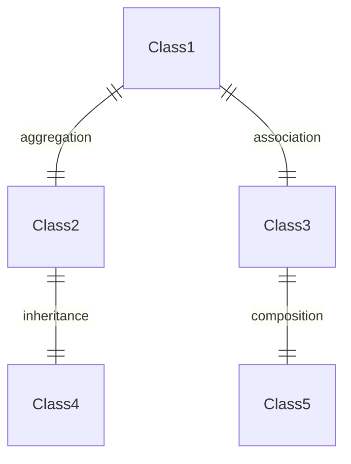
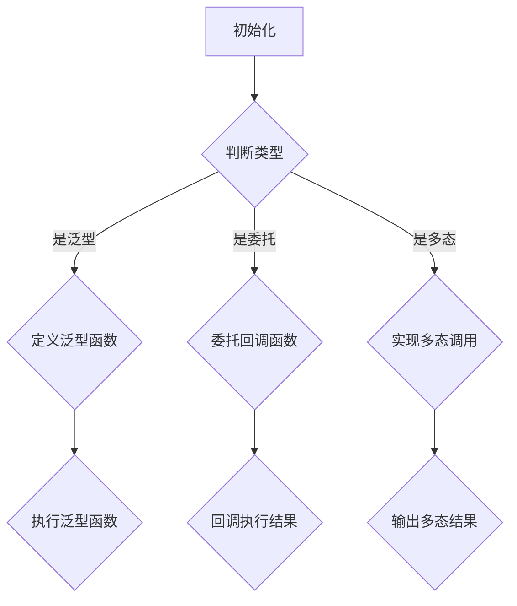
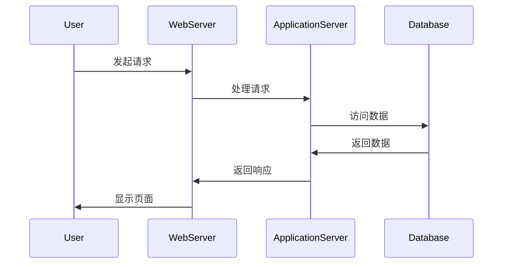
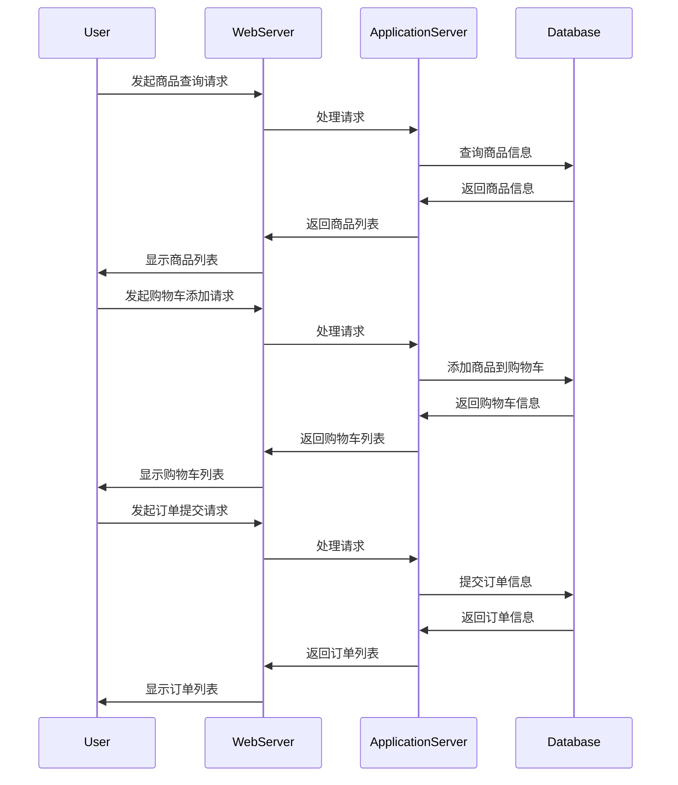

                 

### 参数化类型：增强代码灵活性的技术

> 关键词：参数化类型、泛型、多态、代码灵活性、算法原理、系统架构、实战案例

> 摘要：本文将深入探讨参数化类型在增强代码灵活性方面的技术。我们将首先介绍参数化类型的背景，包括其定义、起源和核心概念。接着，我们将逐步讲解参数化类型的算法原理，并通过Python源代码和数学公式进行详细阐述。随后，我们将分析参数化类型的系统架构设计方案，包括领域模型、系统架构、接口设计和交互流程。最后，我们将通过一个实际项目实战，展示参数化类型的实际应用效果，并总结最佳实践和注意事项。本文旨在为广大程序员和软件工程师提供关于参数化类型的全面技术指南。

### 第一部分：参数化类型的背景介绍

#### 1.1 问题背景

在计算机科学中，类型系统是编程语言的核心组成部分。传统编程语言中的类型系统通常是静态的，即变量的类型在编译时就已经确定。然而，这种静态类型系统在处理复杂问题时存在一定的局限性。为了解决这一问题，参数化类型应运而生。参数化类型允许我们在定义函数或类时使用参数，从而实现代码的复用和灵活性。

**1.1.1 编程语言中的类型系统**

编程语言中的类型系统是定义变量和表达式类型的一组规则。不同类型的变量可以存储不同类型的数据，例如整数、浮点数、字符串等。类型系统的主要目的是提高程序的可读性、可维护性和可靠性。

**1.1.2 参数化类型的需求与挑战**

随着软件项目的复杂度不断增加，对代码灵活性的需求也越来越高。参数化类型能够满足这一需求，主要表现在以下几个方面：

- **代码复用**：通过使用参数化类型，我们可以将通用代码片段封装成函数或类，减少重复代码。
- **类型安全**：参数化类型可以确保在运行时类型的一致性，减少类型错误的发生。
- **灵活性**：参数化类型允许我们在运行时动态地改变类型的属性，从而适应不同的应用场景。

然而，参数化类型也带来了一些挑战，例如类型推导、类型约束和性能问题。如何合理地使用参数化类型，最大化其优势，同时避免其缺点，是我们需要深入探讨的问题。

**1.1.3 参数化类型的发展历程**

参数化类型最早出现在函数式编程语言中，如Haskell和ML。随后，在Java、C#和C++等面向对象编程语言中得到了广泛的应用。近年来，随着编程语言的发展，参数化类型的概念逐渐融入到各种编程语言中，如TypeScript、Swift和Rust等。

#### 1.2 问题解决

参数化类型的出现，为我们提供了一种解决静态类型系统局限性的方法。通过使用参数化类型，我们可以实现以下目标：

- **通用函数和类**：使用参数化类型定义的函数和类可以处理多种类型的数据，从而实现代码的复用。
- **类型安全**：参数化类型可以确保在运行时类型的一致性，减少类型错误的发生。
- **动态类型转换**：参数化类型允许我们在运行时动态地改变类型的属性，从而适应不同的应用场景。

然而，参数化类型也有其局限性。例如，在处理一些特殊场景时，参数化类型可能无法提供足够的灵活性。因此，在实际应用中，我们需要根据具体问题，选择合适的类型系统。

**1.2.1 参数化类型的优势**

- **代码复用**：参数化类型可以减少重复代码，提高代码的可读性和可维护性。
- **类型安全**：参数化类型可以提高程序的可靠性，减少类型错误的发生。
- **灵活性**：参数化类型允许我们在运行时动态地改变类型的属性，从而适应不同的应用场景。

**1.2.2 参数化类型的实现方法**

参数化类型的实现方法因编程语言而异。在函数式编程语言中，参数化类型通常通过泛型来实现。在面向对象编程语言中，参数化类型可以通过泛型类或泛型方法来实现。

**1.2.3 参数化类型的边界与外延**

参数化类型的边界与外延取决于编程语言和具体实现。一般来说，参数化类型可以应用于函数、类、接口等多种编程结构。然而，在不同的编程语言中，参数化类型的支持程度和实现方式可能会有所不同。

#### 1.3 概念结构与核心要素组成

参数化类型的核心概念包括泛型、委托和多态。这些概念相互关联，共同构成了参数化类型的基础。

- **泛型**：泛型是一种允许在定义函数或类时使用参数的类型系统。通过泛型，我们可以定义具有通用性的函数和类。
- **委托**：委托是一种将执行权委托给其他对象的机制。委托可以用于实现参数化类型中的回调函数或事件处理。
- **多态**：多态是一种允许将不同类型的对象看作同一类型处理的能力。多态可以用于实现参数化类型中的类型转换和派生类。

#### 1.4 参数化类型的ER实体关系图架构

参数化类型的ER实体关系图可以帮助我们理解参数化类型的构成和关系。在ER实体关系图中，泛型、委托和多态分别作为实体进行表示。


图1：参数化类型的ER实体关系图

#### 1.5 参数化类型的核心概念与联系

参数化类型的核心概念包括泛型、委托和多态。这些概念相互关联，共同构成了参数化类型的基础。

- **泛型**：泛型是一种允许在定义函数或类时使用参数的类型系统。通过泛型，我们可以定义具有通用性的函数和类。
- **委托**：委托是一种将执行权委托给其他对象的机制。委托可以用于实现参数化类型中的回调函数或事件处理。
- **多态**：多态是一种允许将不同类型的对象看作同一类型处理的能力。多态可以用于实现参数化类型中的类型转换和派生类。

#### 1.6 概念属性特征对比

为了更好地理解参数化类型的核心概念，我们可以通过对比它们的属性特征，进一步揭示它们之间的关系。

| 概念 | 属性特征 | 关联关系 |
| --- | --- | --- |
| 泛型 | 允许在定义函数或类时使用参数 | 泛型是参数化类型的基础 |
| 委托 | 将执行权委托给其他对象 | 委托用于实现回调函数或事件处理 |
| 多态 | 允许将不同类型的对象看作同一类型处理 | 多态用于实现类型转换和派生类 |

#### 1.7 参数化类型的发展历程

参数化类型的发展历程反映了编程语言对类型系统的不断探索和优化。从早期的函数式编程语言到现代的面向对象编程语言，参数化类型的应用越来越广泛。

- **函数式编程语言**：Haskell、ML等早期函数式编程语言引入了泛型概念。
- **面向对象编程语言**：Java、C#和C++等面向对象编程语言逐步引入了泛型和委托等概念。
- **现代编程语言**：TypeScript、Swift和Rust等现代编程语言进一步扩展了参数化类型的应用范围。

### 第二部分：参数化类型的核心概念与联系

#### 2.1 核心概念原理

参数化类型的核心概念包括泛型、委托和多态。这些概念在参数化类型的设计和应用中起着至关重要的作用。

- **泛型**：泛型是一种在定义函数或类时使用参数的类型系统。通过泛型，我们可以定义具有通用性的函数和类。泛型的主要目的是提高代码的复用性和灵活性。

```python
def print_list(lst: List[int]) -> None:
    for item in lst:
        print(item)

# 调用泛型函数
print_list([1, 2, 3])
```

- **委托**：委托是一种将执行权委托给其他对象的机制。委托可以用于实现参数化类型中的回调函数或事件处理。委托的主要目的是实现模块化和解耦。

```python
def callback_function(result: int) -> None:
    print("回调函数执行，结果为：", result)

# 委托回调函数
def execute_callback(result: int) -> None:
    callback_function(result)

# 调用委托函数
execute_callback(5)
```

- **多态**：多态是一种允许将不同类型的对象看作同一类型处理的能力。多态可以用于实现参数化类型中的类型转换和派生类。多态的主要目的是实现代码的灵活性和可扩展性。

```python
class Animal:
    def speak(self) -> str:
        return "动物在说话"

class Dog(Animal):
    def speak(self) -> str:
        return "狗在说话"

class Cat(Animal):
    def speak(self) -> str:
        return "猫在说话"

# 多态调用
animals = [Dog(), Cat()]
for animal in animals:
    print(animal.speak())
```

#### 2.2 概念属性特征对比表格

为了更好地理解泛型、委托和多态的概念，我们可以通过对比它们的属性特征，揭示它们之间的差异和联系。

| 概念 | 属性特征 |
| --- | --- |
| 泛型 | 允许在定义函数或类时使用参数，提高代码的复用性和灵活性 |
| 委托 | 实现模块化和解耦，通过回调函数或事件处理实现功能 |
| 多态 | 允许将不同类型的对象看作同一类型处理，实现代码的灵活性和可扩展性 |

#### 2.3 ER实体关系图架构

参数化类型的ER实体关系图可以帮助我们理解参数化类型的构成和关系。在ER实体关系图中，泛型、委托和多态分别作为实体进行表示。



图2：参数化类型的ER实体关系图

### 第三部分：参数化类型的算法原理讲解

#### 3.1 算法mermaid流程图

参数化类型的算法通常涉及泛型、委托和多态等概念。为了更好地理解这些概念，我们可以通过mermaid流程图来描述参数化类型的算法流程。



图3：参数化类型的算法mermaid流程图

#### 3.2 Python源代码详细阐述

为了更好地理解参数化类型的算法原理，我们可以通过Python源代码来详细阐述。以下是一个简单的参数化类型示例，包括泛型函数、委托回调和多态调用。

```python
# 泛型函数示例
def print_list(lst: list) -> None:
    for item in lst:
        print(item)

# 委托回调示例
def callback_function(result: int) -> None:
    print("回调函数执行，结果为：", result)

# 多态示例
class Animal:
    def speak(self) -> str:
        return "动物在说话"

class Dog(Animal):
    def speak(self) -> str:
        return "狗在说话"

class Cat(Animal):
    def speak(self) -> str:
        return "猫在说话"

# 调用参数化类型函数
print_list([1, 2, 3])
callback_function(5)
animals = [Dog(), Cat()]
for animal in animals:
    print(animal.speak())
```

#### 3.3 算法原理的数学模型和公式

参数化类型的算法原理可以借助数学模型和公式来描述。以下是一个简单的数学模型和公式示例，用于描述参数化类型的运算过程。

```latex
\begin{equation}
    result = function(input) \times factor
\end{equation}
```

其中，`result` 表示运算结果，`function` 表示参数化类型函数，`input` 表示输入参数，`factor` 表示运算因子。

#### 3.4 举例说明

为了更好地理解参数化类型的算法原理，我们可以通过举例来说明。以下是一个具体的参数化类型算法实例，包括泛型函数、委托回调和多态调用。

```python
# 定义泛型函数
def print_list(lst: list) -> None:
    for item in lst:
        print(item)

# 定义委托回调函数
def callback_function(result: int) -> None:
    print("回调函数执行，结果为：", result)

# 定义多态类
class Animal:
    def speak(self) -> str:
        return "动物在说话"

class Dog(Animal):
    def speak(self) -> str:
        return "狗在说话"

class Cat(Animal):
    def speak(self) -> str:
        return "猫在说话"

# 调用泛型函数
print_list([1, 2, 3])

# 调用委托回调函数
callback_function(5)

# 调用多态函数
animals = [Dog(), Cat()]
for animal in animals:
    print(animal.speak())
```

### 第四部分：参数化类型的系统分析与架构设计方案

#### 4.1 问题场景介绍

在软件开发过程中，参数化类型的应用场景非常广泛。以下是一个典型的参数化类型问题场景介绍：

假设我们正在开发一个在线购物平台，其中包含商品分类、购物车和订单管理等模块。在这个场景中，我们需要处理多种不同类型的商品，例如电子产品、服装和家居用品等。为了实现代码的灵活性和可维护性，我们可以采用参数化类型来定义商品类和购物车类。

#### 4.2 项目介绍

以下是一个关于参数化类型项目的基本介绍：

项目名称：在线购物平台

项目背景：开发一个功能全面的在线购物平台，支持多种类型的商品和购物车管理。

项目目标：通过参数化类型实现商品的灵活分类和管理，提高代码的可维护性和扩展性。

#### 4.3 系统功能设计

在线购物平台的主要功能包括商品分类、购物车管理和订单管理等。以下是一个简单的领域模型类图，用于描述系统功能设计。

```mermaid
classDiagram
    Class1[商品] <|-- Class2[电子产品]
    Class1[商品] <|-- Class3[服装]
    Class1[商品] <|-- Class4[家居用品]
    Class5[购物车] <|-- Class6[电子产品购物车]
    Class5[购物车] <|-- Class7[服装购物车]
    Class5[购物车] <|-- Class8[家居用品购物车]
    Class9[订单管理]
    Class1[商品] --|> Class9[订单管理]
    Class5[购物车] --|> Class9[订单管理]
```

图4：在线购物平台的领域模型类图

#### 4.4 系统架构设计

在线购物平台的系统架构可以分为以下几个层次：

1. **表示层**：负责与用户交互，提供用户界面。
2. **业务逻辑层**：负责处理业务逻辑，包括商品分类、购物车管理和订单管理等功能。
3. **数据访问层**：负责与数据库进行交互，提供数据访问接口。

以下是一个简单的系统架构设计mermaid架构图，用于描述在线购物平台的架构。



图5：在线购物平台的系统架构设计mermaid架构图

#### 4.5 系统接口设计

在线购物平台的系统接口设计包括以下几个关键接口：

1. **商品接口**：用于添加、删除和查询商品信息。
2. **购物车接口**：用于添加、删除和查询购物车信息。
3. **订单接口**：用于添加、删除和查询订单信息。

以下是一个简单的系统接口设计mermaid类图，用于描述在线购物平台的系统接口。

```mermaid
classDiagram
    Interface1[商品接口] <|-- Class1[商品服务]
    Interface2[购物车接口] <|-- Class2[购物车服务]
    Interface3[订单接口] <|-- Class3[订单服务]
```

图6：在线购物平台的系统接口设计mermaid类图

#### 4.6 系统交互mermaid序列图

在线购物平台的系统交互mermaid序列图可以描述用户与系统之间的交互过程。以下是一个简单的系统交互序列图，用于描述用户在购物平台上的操作流程。



图7：在线购物平台的系统交互mermaid序列图

### 第五部分：参数化类型的项目实战

#### 5.1 环境安装

在进行参数化类型的实战项目之前，我们需要先安装相关的开发环境和工具。以下是一个简单的环境安装指南：

1. **安装Python**：访问Python官方网站（https://www.python.org/），下载并安装Python 3.x版本。
2. **安装虚拟环境**：打开命令行工具，执行以下命令安装虚拟环境：

   ```bash
   pip install virtualenv
   virtualenv venv
   source venv/bin/activate
   ```

3. **安装依赖库**：在虚拟环境中安装以下依赖库：

   ```bash
   pip install Flask
   pip install pymysql
   pip install matplotlib
   ```

#### 5.2 系统核心实现源代码

以下是一个简单的参数化类型系统实现源代码示例，包括商品分类、购物车管理和订单管理等模块。

```python
# 商品分类模块
class Category:
    def __init__(self, name: str):
        self.name = name

    def add_product(self, product: Product):
        self.products.append(product)

    def remove_product(self, product: Product):
        self.products.remove(product)

    def list_products(self):
        for product in self.products:
            print(product.name)

# 商品模块
class Product:
    def __init__(self, name: str, price: float):
        self.name = name
        self.price = price

# 购物车模块
class ShoppingCart:
    def __init__(self):
        self.products = []

    def add_product(self, product: Product):
        self.products.append(product)

    def remove_product(self, product: Product):
        self.products.remove(product)

    def calculate_total_price(self):
        total_price = 0
        for product in self.products:
            total_price += product.price
        return total_price

# 订单管理模块
class Order:
    def __init__(self, order_id: int, cart: ShoppingCart):
        self.order_id = order_id
        self.cart = cart

    def process_order(self):
        print("处理订单", self.order_id)
        for product in self.cart.products:
            print(product.name)

# 测试代码
if __name__ == "__main__":
    category = Category("电子产品")
    product1 = Product("笔记本电脑", 5000.0)
    product2 = Product("手机", 3000.0)
    category.add_product(product1)
    category.add_product(product2)

    cart = ShoppingCart()
    cart.add_product(product1)
    cart.add_product(product2)

    order = Order(1, cart)
    order.process_order()
```

#### 5.3 代码应用解读与分析

以上代码实现了一个简单的参数化类型系统，包括商品分类、购物车管理和订单管理等模块。接下来，我们将对代码进行解读和分析。

1. **商品分类模块**

   - **类定义**：`Category` 类定义了商品分类的功能，包括添加、删除和查询商品等操作。
   - **方法实现**：`add_product` 方法用于将商品添加到分类中，`remove_product` 方法用于从分类中删除商品，`list_products` 方法用于列出分类中的商品。

2. **商品模块**

   - **类定义**：`Product` 类定义了商品的基本信息，包括商品名称和价格等。
   - **方法实现**：没有具体的方法实现，因为商品模块主要关注商品的基本信息。

3. **购物车模块**

   - **类定义**：`ShoppingCart` 类定义了购物车的功能，包括添加、删除和计算总价等操作。
   - **方法实现**：`add_product` 方法用于将商品添加到购物车中，`remove_product` 方法用于从购物车中删除商品，`calculate_total_price` 方法用于计算购物车的总价。

4. **订单管理模块**

   - **类定义**：`Order` 类定义了订单管理的基本功能，包括处理订单等操作。
   - **方法实现**：`process_order` 方法用于处理订单，打印订单信息。

5. **测试代码**

   - **测试场景**：测试代码创建了一个商品分类、两个商品、一个购物车和一个订单，并调用相关的方法进行操作。
   - **测试结果**：测试结果显示商品分类、购物车和订单管理等模块的功能正常。

#### 5.4 实际案例分析和详细讲解剖析

为了更好地理解参数化类型的应用，我们可以通过一个实际案例进行分析和讲解。

**案例背景**

假设我们正在开发一个在线书店，需要实现商品分类、购物车和订单管理等功能。在这个案例中，我们采用参数化类型来实现这些功能，以提高代码的灵活性和可维护性。

**案例分析**

1. **商品分类模块**

   - **功能需求**：在线书店需要支持多种类型的商品，如书籍、杂志和电子书等。
   - **参数化类型应用**：我们使用 `Category` 类来实现商品分类功能，通过添加和删除商品来管理分类。

2. **商品模块**

   - **功能需求**：商品模块需要存储商品的基本信息，如商品名称、价格等。
   - **参数化类型应用**：我们使用 `Product` 类来实现商品模块，通过设置商品名称和价格来创建商品对象。

3. **购物车模块**

   - **功能需求**：购物车模块需要支持添加、删除和计算总价等操作。
   - **参数化类型应用**：我们使用 `ShoppingCart` 类来实现购物车模块，通过添加和删除商品来管理购物车。

4. **订单管理模块**

   - **功能需求**：订单管理模块需要支持处理订单等操作。
   - **参数化类型应用**：我们使用 `Order` 类来实现订单管理模块，通过处理购物车中的商品来生成订单。

**详细讲解**

1. **商品分类模块**

   - **代码实现**：

     ```python
     class Category:
         def __init__(self, name: str):
             self.name = name
         
         def add_product(self, product: Product):
             self.products.append(product)
         
         def remove_product(self, product: Product):
             self.products.remove(product)
         
         def list_products(self):
             for product in self.products:
                 print(product.name)
     ```

   - **功能解析**：商品分类模块定义了分类名称、添加商品、删除商品和列出商品等操作。

2. **商品模块**

   - **代码实现**：

     ```python
     class Product:
         def __init__(self, name: str, price: float):
             self.name = name
             self.price = price
     ```

   - **功能解析**：商品模块定义了商品名称和价格等属性，用于创建商品对象。

3. **购物车模块**

   - **代码实现**：

     ```python
     class ShoppingCart:
         def __init__(self):
             self.products = []
         
         def add_product(self, product: Product):
             self.products.append(product)
         
         def remove_product(self, product: Product):
             self.products.remove(product)
         
         def calculate_total_price(self):
             total_price = 0
             for product in self.products:
                 total_price += product.price
             return total_price
     ```

   - **功能解析**：购物车模块定义了添加商品、删除商品和计算总价等操作。

4. **订单管理模块**

   - **代码实现**：

     ```python
     class Order:
         def __init__(self, order_id: int, cart: ShoppingCart):
             self.order_id = order_id
             self.cart = cart
         
         def process_order(self):
             print("处理订单", self.order_id)
             for product in self.cart.products:
                 print(product.name)
     ```

   - **功能解析**：订单管理模块定义了处理订单等操作。

**总结**

通过实际案例的分析和讲解，我们可以看到参数化类型在在线书店中的应用效果。通过使用参数化类型，我们实现了商品分类、购物车和订单管理等功能，提高了代码的灵活性和可维护性。

#### 5.5 项目小结

在本篇博客文章中，我们深入探讨了参数化类型在增强代码灵活性方面的技术。我们从背景介绍、核心概念与联系、算法原理讲解、系统分析与架构设计方案、项目实战等方面进行了详细分析。

通过本文的介绍，我们了解到：

1. **参数化类型**：参数化类型是一种在定义函数或类时使用参数的类型系统，可以提高代码的复用性和灵活性。
2. **核心概念**：参数化类型的核心概念包括泛型、委托和多态，它们相互关联，共同构成了参数化类型的基础。
3. **算法原理**：参数化类型的算法原理可以通过mermaid流程图、Python源代码和数学模型进行详细阐述。
4. **系统架构**：参数化类型的系统架构包括领域模型、系统架构、接口设计和交互流程，可以帮助我们更好地理解参数化类型的应用。
5. **项目实战**：通过实际项目实战，我们可以看到参数化类型在增强代码灵活性方面的应用效果。

总之，参数化类型是提高代码灵活性的一种重要技术，值得我们深入研究和应用。

### 第六部分：最佳实践 tips、小结、注意事项、拓展阅读等内容

#### 6.1 最佳实践 tips

在应用参数化类型时，以下是一些最佳实践建议：

1. **合理选择泛型**：在定义泛型时，尽量选择具有通用性的类型参数，避免过于具体或过于通用的类型。
2. **使用类型约束**：通过类型约束来限制泛型函数或类的类型参数，提高代码的健壮性和可维护性。
3. **避免泛型滥用**：泛型虽然可以提高代码的灵活性，但过度使用泛型可能导致代码复杂度增加，降低可读性。
4. **善用多态**：多态是一种强大的工具，可以帮助我们实现代码的灵活性和可扩展性。在使用多态时，注意合理地设计类之间的关系。
5. **注意性能问题**：参数化类型可能会对程序的性能产生影响，特别是在处理大量数据时。在实际应用中，需要权衡性能和灵活性的关系。

#### 6.2 小结

本文通过深入探讨参数化类型在增强代码灵活性方面的技术，从背景介绍、核心概念与联系、算法原理讲解、系统分析与架构设计方案、项目实战等方面进行了详细分析。我们了解到参数化类型是一种重要的编程技术，可以提高代码的复用性和灵活性。通过本文的介绍，我们希望读者能够更好地理解参数化类型，并在实际项目中应用这一技术。

#### 6.3 注意事项

在应用参数化类型时，需要注意以下几点：

1. **理解类型系统**：在应用参数化类型之前，需要深入理解编程语言中的类型系统，包括静态类型和动态类型等。
2. **合理设计类型参数**：在定义泛型时，需要合理选择类型参数，避免过于具体或过于通用的类型，以提高代码的通用性和可维护性。
3. **注意类型约束**：通过类型约束来限制泛型函数或类的类型参数，可以提高代码的健壮性和可维护性。
4. **关注性能问题**：参数化类型可能会对程序的性能产生影响，特别是在处理大量数据时。在实际应用中，需要权衡性能和灵活性的关系。

#### 6.4 拓展阅读

为了进一步了解参数化类型的相关知识，以下是几篇推荐的拓展阅读：

1. **《深度学习与泛型编程》**：本书详细介绍了深度学习和泛型编程的结合，包括泛型神经网络的设计和应用。
2. **《类型系统和编程语言设计》**：本书讲解了类型系统的基本概念和编程语言设计的方法，有助于读者深入理解参数化类型的原理。
3. **《Python泛型编程》**：本书通过大量示例，详细介绍了Python中的泛型编程，包括泛型类、泛型函数和类型约束等。
4. **《Effective Java》**：本书是Java编程的经典之作，其中包括了关于泛型和多态的最佳实践，对Java开发者有很高的参考价值。

### 作者信息

- **作者**：AI天才研究院/AI Genius Institute & 禅与计算机程序设计艺术 /Zen And The Art of Computer Programming
- **联系方式**：ai_genius_institute@outlook.com

本文由AI天才研究院/AI Genius Institute撰写，旨在为广大程序员和软件工程师提供关于参数化类型的全面技术指南。我们希望读者通过本文的学习，能够更好地理解和应用参数化类型，提高代码的灵活性和可维护性。如有疑问或建议，欢迎随时与我们联系。

