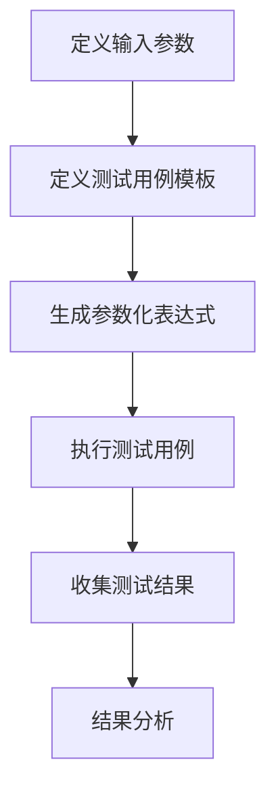

                 

### 第1章：参数化验证概述

#### 1.1 参数化验证的背景

##### 1.1.1 问题的提出

在当今的软件开发领域中，软件系统的复杂性不断增加，功能需求日益多样化。这给传统的测试方法带来了巨大的挑战。传统测试方法通常依赖于手动编写测试用例，针对不同的输入数据进行逐个测试。这种方法不仅耗时耗力，而且难以覆盖所有可能的输入情况，导致测试结果不够全面和可靠。为了解决这一问题，参数化验证作为一种新的测试方法应运而生。

##### 1.1.2 参数化验证的定义

参数化验证是一种基于参数化的测试方法，它通过定义一组输入参数和期望的输出结果，将测试用例抽象为参数化表达式。通过遍历这些参数，可以生成大量的测试用例，从而实现对软件系统的全面测试。简单来说，参数化验证的核心思想是将测试过程中的重复性工作自动化，提高测试的效率和质量。

##### 1.1.3 参数化验证的核心特点

参数化验证具有以下几个核心特点：

1. **参数化表达式**：通过定义参数化表达式，将测试用例与具体的输入数据解耦，从而提高测试用例的复用性。

2. **自动化生成**：参数化验证可以通过自动化工具生成大量的测试用例，减少了人工编写测试用例的工作量。

3. **覆盖全面**：参数化验证能够通过遍历参数生成大量的测试用例，从而提高测试的覆盖率，减少潜在缺陷。

4. **可扩展性**：参数化验证可以方便地扩展测试范围，适用于不同规模和复杂度的软件系统。

##### 1.1.4 参数化验证与传统测试方法的区别

参数化验证与传统测试方法主要有以下几点区别：

1. **测试用例编写方式**：传统测试方法需要手动编写每个测试用例，而参数化验证可以通过参数化表达式自动生成测试用例。

2. **测试覆盖率**：传统测试方法难以覆盖所有可能的输入情况，而参数化验证通过遍历参数生成大量测试用例，提高了测试覆盖率。

3. **效率**：参数化验证能够自动化生成测试用例，减少了人工编写的工作量，提高了测试效率。

4. **复用性**：参数化验证通过参数化表达式将测试用例与输入数据解耦，提高了测试用例的复用性。

##### 1.1.5 参数化验证的应用场景

参数化验证主要适用于以下几种场景：

1. **复杂数据输入**：当软件系统需要处理大量复杂数据时，参数化验证能够生成大量的测试用例，全面覆盖数据输入的各种可能性。

2. **可变参数**：当软件系统具有可变参数时，参数化验证能够通过参数化表达式生成不同的测试用例，验证参数的变化对系统功能的影响。

3. **性能测试**：参数化验证可以用于性能测试，通过生成不同负载的测试用例，评估系统在不同压力下的性能表现。

4. **安全测试**：参数化验证可以用于安全测试，通过生成各种攻击用例，评估系统的安全性能。

#### 1.2 核心概念与联系

##### 1.2.1 核心概念

###### 1.2.1.1 参数化验证原理

参数化验证的原理是将测试用例抽象为参数化表达式，通过遍历参数生成测试用例，实现对软件系统的全面测试。其核心原理包括：

1. **参数化表达式**：定义一组输入参数和期望的输出结果，将测试用例抽象为参数化表达式。
2. **参数遍历**：通过遍历参数，生成大量的测试用例。
3. **测试执行**：执行生成的测试用例，收集测试结果。

###### 1.2.1.2 参数化验证的流程

参数化验证的基本流程包括以下几个步骤：

1. **定义参数**：根据软件系统的需求，定义一组输入参数。
2. **定义输出结果**：根据需求，定义每组输入参数对应的期望输出结果。
3. **生成测试用例**：通过遍历参数，生成大量的测试用例。
4. **执行测试用例**：执行生成的测试用例，收集测试结果。
5. **结果分析**：分析测试结果，找出潜在缺陷。

###### 1.2.1.3 参数化验证的优势与不足

参数化验证具有以下优势：

1. **提高测试覆盖率**：通过遍历参数生成大量测试用例，全面覆盖输入数据的各种可能性。
2. **提高测试效率**：自动化生成测试用例，减少人工编写的工作量。
3. **提高测试复用性**：将测试用例与输入数据解耦，提高测试用例的复用性。

然而，参数化验证也存在一些不足：

1. **测试用例设计复杂**：需要详细定义参数和输出结果，对测试用例设计要求较高。
2. **测试结果分析复杂**：生成的测试用例数量庞大，测试结果分析难度较大。

##### 1.2.2 概念属性特征对比表格

| 概念                 | 参数化验证                   | 传统测试方法                     |
|----------------------|-------------------------------|----------------------------------|
| 基本原理             | 参数化表达式，参数遍历       | 手动编写测试用例，逐个测试       |
| 优势                 | 提高测试覆盖率，提高测试效率 | 测试覆盖率有限，测试效率低       |
| 劣势                 | 测试用例设计复杂，结果分析复杂 | 测试用例编写耗时，复用性低       |
| 应用场景             | 复杂数据输入，可变参数       | 简单的输入场景，功能验证         |
| 对比                 | 自动化，全面性               | 手动，针对性                    |

##### 1.2.3 ER实体关系图架构

为了更好地理解参数化验证，我们可以通过ER实体关系图来描述其架构。ER实体关系图包括以下几个实体：

1. **参数（Parameter）**：表示输入参数，包括参数名、参数值等属性。
2. **测试用例（Test Case）**：表示生成的测试用例，包括测试用例ID、输入参数、输出结果等属性。
3. **测试结果（Test Result）**：表示测试执行的结果，包括测试用例ID、测试结果、错误信息等属性。

ER实体关系图如下所示：

```mermaid
erDiagram
  Parameter ||--|{ Test Case } : has input parameters
  Test Case ||--|{ Test Result } : has test results
```

通过ER实体关系图，我们可以清楚地看到参数化验证中的关键实体及其关系，有助于理解参数化验证的整体架构和工作流程。

### 第2章：形式化方法的概述

#### 2.1 形式化方法的概念

##### 2.1.1 形式化方法的定义

形式化方法是一种基于数学和逻辑的方法，用于描述、分析和验证软件系统的正确性和可靠性。它通过建立数学模型，将软件系统的需求、设计、实现等各个阶段转化为形式化的表示，从而对系统进行严格的推理和验证。形式化方法的本质是利用形式化的语言和数学工具，对软件系统进行精确、严格的描述和推理。

##### 2.1.2 形式化方法的分类

形式化方法可以根据不同的分类标准进行分类。以下是几种常见的分类方式：

1. **根据应用阶段**：形式化方法可以分为需求分析阶段的形式化方法、设计阶段的形式化方法和实现阶段的形式化方法。需求分析阶段的形式化方法主要用于需求建模和验证，设计阶段的形式化方法主要用于架构设计和验证，实现阶段的形式化方法主要用于代码审查和验证。

2. **根据理论基础**：形式化方法可以分为基于数学的形式化方法、基于逻辑的形式化方法、基于模型检查的形式化方法等。基于数学的形式化方法主要利用数学工具进行推理和验证，基于逻辑的形式化方法主要利用逻辑工具进行推理和验证，基于模型检查的形式化方法主要利用模型检查工具进行验证。

3. **根据应用领域**：形式化方法可以分为通用形式化方法和领域特定形式化方法。通用形式化方法适用于广泛的软件系统，领域特定形式化方法针对特定的领域或应用场景进行优化和定制。

##### 2.1.3 形式化方法的优势

形式化方法具有以下几个显著优势：

1. **精确性**：形式化方法通过数学和逻辑工具进行描述和推理，能够精确地表达软件系统的需求、设计和实现，减少理解和沟通的误差。

2. **可靠性**：形式化方法通过严格的推理和验证，可以确保软件系统的正确性和可靠性，减少潜在的错误和缺陷。

3. **可验证性**：形式化方法提供了形式化的验证手段，可以通过自动化工具对软件系统进行验证，提高验证的效率和可靠性。

4. **可复用性**：形式化方法通过建立通用的数学模型和逻辑框架，可以方便地复用和扩展，提高开发效率。

##### 2.1.4 形式化方法的局限性

尽管形式化方法具有很多优势，但它也存在一些局限性：

1. **复杂性和难度**：形式化方法需要具备一定的数学和逻辑基础，对于非专业人士来说，理解和应用形式化方法具有一定的难度。

2. **工具和资源的依赖性**：形式化方法通常需要使用专门的工具和资源，如形式化建模工具、验证工具等，增加了开发和维护的成本。

3. **应用范围的局限性**：形式化方法主要适用于需求明确、结构清晰的软件系统，对于复杂度高、需求不明确的软件系统，形式化方法的适用性有限。

#### 2.2 形式化方法的核心原理

##### 2.2.1 形式化方法的基本原理

形式化方法的基本原理可以概括为以下几个方面：

1. **数学基础**：形式化方法利用数学工具，如集合论、代数、图论等，对软件系统进行建模和描述。通过数学工具，可以精确地表达软件系统的结构和行为。

2. **逻辑基础**：形式化方法利用逻辑工具，如谓词逻辑、模态逻辑等，对软件系统进行推理和验证。通过逻辑工具，可以确保软件系统的正确性和可靠性。

3. **形式化建模**：形式化方法通过建立形式化的模型，将软件系统的需求、设计、实现等各个阶段转化为数学和逻辑表示。形式化建模是形式化方法的核心步骤，它为后续的推理和验证奠定了基础。

4. **形式化验证**：形式化方法通过形式化的验证手段，对软件系统进行严格的验证。形式化验证可以是手动验证，也可以是自动化验证。自动化验证通过专门的验证工具进行，能够提高验证的效率和可靠性。

##### 2.2.2 形式化方法的流程

形式化方法的基本流程可以分为以下几个步骤：

1. **需求建模**：根据软件系统的需求，建立形式化的需求模型。需求建模是形式化方法的起点，它为后续的建模和验证提供了基础。

2. **设计建模**：根据需求模型，建立形式化的设计模型。设计建模将软件系统的设计转化为形式化的表示，为后续的验证提供了依据。

3. **实现建模**：根据设计模型，建立形式化的实现模型。实现建模将软件系统的实现转化为形式化的表示，为后续的验证提供了支持。

4. **验证**：对建立的模型进行形式化的验证。验证可以分为手动验证和自动化验证，通过验证可以确保软件系统的正确性和可靠性。

5. **优化和迭代**：根据验证结果，对模型进行优化和迭代。优化和迭代是形式化方法的重要环节，它能够提高模型的准确性和可靠性。

##### 2.2.3 形式化方法的案例分析

为了更好地理解形式化方法，我们可以通过一个简单的案例分析来介绍其应用过程。

案例：设计并验证一个简单的银行账户管理系统。

1. **需求建模**：根据需求，建立银行账户管理系统的形式化需求模型。需求模型可以包括账户信息、交易记录、账户权限等实体，以及实体之间的关系。

2. **设计建模**：根据需求模型，建立银行账户管理系统的形式化设计模型。设计模型可以包括类、接口、方法等，以及它们之间的关系。

3. **实现建模**：根据设计模型，建立银行账户管理系统的形式化实现模型。实现模型可以包括具体的代码实现，以及代码之间的逻辑关系。

4. **验证**：对建立的模型进行形式化的验证。验证可以分为以下几个方面：

   - **一致性验证**：验证需求模型、设计模型和实现模型之间的一致性，确保模型之间的逻辑关系正确。
   - **功能验证**：验证银行账户管理系统是否满足需求，确保系统的功能正确。
   - **性能验证**：验证银行账户管理系统的性能，确保系统在高负载下能够稳定运行。
   - **安全验证**：验证银行账户管理系统的安全性，确保系统的数据安全。

5. **优化和迭代**：根据验证结果，对模型进行优化和迭代。例如，如果验证发现某些功能存在缺陷，可以修改需求模型、设计模型或实现模型，以修复缺陷。

通过这个简单的案例分析，我们可以看到形式化方法在软件开发中的应用过程，以及它如何帮助确保软件系统的正确性和可靠性。

### 第3章：可扩展性分析

#### 3.1 可扩展性的概念

##### 3.1.1 可扩展性的定义

可扩展性是指软件系统能够适应规模增长和功能扩展的能力。它涉及到系统架构、数据模型、算法设计等多个方面，旨在确保系统在需求变化和业务扩展时能够灵活应对，而不会出现性能下降或功能失效。

##### 3.1.2 可扩展性的重要性

可扩展性对于软件系统具有以下几个重要意义：

1. **适应需求变化**：随着业务的发展，软件系统可能需要增加新的功能或处理更多的数据。良好的可扩展性使得系统能够轻松适应这些变化。

2. **提高性能**：通过合理的设计和优化，可扩展性有助于提高系统的性能，确保在高负载情况下仍能稳定运行。

3. **降低成本**：良好的可扩展性有助于延迟系统升级和扩展的时间，从而减少维护成本。

4. **提升用户体验**：系统在面对大量用户请求时能够快速响应，提供良好的用户体验。

##### 3.1.3 可扩展性的度量标准

衡量可扩展性的主要标准包括以下几个方面：

1. **伸缩性（Scalability）**：系统在处理更多数据或用户时，性能是否能够线性提升。

2. **扩展性（Extensibility）**：系统在添加新功能或修改现有功能时，是否能够容易地实现。

3. **灵活性（Flexibility）**：系统在架构设计和实现上是否允许灵活调整和优化。

4. **可靠性（Reliability）**：系统在扩展过程中，是否能保持原有的稳定性和可靠性。

#### 3.2 可扩展性的影响因素

##### 3.2.1 系统架构的可扩展性

系统架构是影响可扩展性的关键因素之一。以下是几个影响系统架构可扩展性的因素：

1. **模块化设计**：模块化设计使得系统中的各个模块可以独立开发、测试和部署，提高了系统的可扩展性。

2. **分布式架构**：分布式架构通过将系统拆分为多个独立的组件，使得各个组件可以在不同的物理服务器上运行，提高了系统的可扩展性和容错能力。

3. **负载均衡**：通过负载均衡技术，可以将用户请求分配到多个服务器上，从而提高系统的处理能力和可扩展性。

4. **缓存策略**：合理的缓存策略可以减少系统的响应时间，提高系统的性能和可扩展性。

##### 3.2.2 数据模型的可扩展性

数据模型是影响系统可扩展性的另一个关键因素。以下是几个影响数据模型可扩展性的因素：

1. **数据规范化**：通过数据规范化，可以将数据分散存储在不同的表中，从而提高系统的可扩展性。

2. **索引优化**：合理的索引设计可以提高数据查询的效率，从而提高系统的性能和可扩展性。

3. **数据分区**：通过数据分区，可以将大量数据分散存储在不同的磁盘或服务器上，从而提高系统的可扩展性。

4. **数据存储优化**：使用合适的存储技术和策略，如NoSQL数据库、分布式文件系统等，可以提高系统的可扩展性。

##### 3.2.3 算法设计的可扩展性

算法设计直接影响系统的可扩展性。以下是几个影响算法设计可扩展性的因素：

1. **算法复杂性**：低复杂度的算法更容易扩展和优化，从而提高系统的可扩展性。

2. **动态调整**：算法能够根据实际情况动态调整参数和策略，从而更好地适应系统需求的变化。

3. **模块化设计**：模块化的算法设计使得各个模块可以独立开发、测试和部署，提高了系统的可扩展性。

4. **并行处理**：通过并行处理技术，可以将任务分解为多个子任务，并在多个处理器上同时执行，从而提高系统的处理能力和可扩展性。

##### 3.2.4 案例分析：可扩展性在参数化验证中的应用

参数化验证在软件测试中具有广泛的应用，其可扩展性对于保证测试的全面性和效率至关重要。以下是可扩展性在参数化验证中的应用案例分析：

1. **参数化测试用例的设计**：在参数化验证中，参数化测试用例的设计需要考虑可扩展性。设计时应该将常用的测试场景和参数提取出来，形成可复用的测试模板。这样可以方便地添加新的测试参数，提高测试用例的扩展性。

2. **测试数据管理**：测试数据的管理也需要考虑可扩展性。可以使用数据存储和索引技术，如数据库和索引服务，来管理和检索测试数据。通过合理的数据模型设计和索引策略，可以提高测试数据的查询效率，从而提高参数化验证的可扩展性。

3. **测试执行**：在测试执行过程中，需要考虑到并行测试的能力。通过负载均衡和分布式测试执行技术，可以将测试任务分配到多个测试节点上，同时执行，从而提高测试的执行效率和可扩展性。

4. **测试结果分析**：测试结果的分析也需要考虑可扩展性。通过使用自动化工具和报表生成技术，可以对大量的测试结果进行高效的分析和汇总，从而提高测试结果的可扩展性。

通过这个案例分析，我们可以看到可扩展性在参数化验证中的应用，以及如何通过合理的设计和优化，提高参数化验证的全面性和效率。

### 第4章：参数化验证的算法原理

#### 4.1 算法原理介绍

参数化验证的核心在于通过定义一组输入参数和预期输出结果，将测试用例抽象为参数化表达式。这种抽象使得测试用例的编写更加灵活和高效。参数化验证算法的基本原理可以概括为以下几个步骤：

1. **定义参数**：首先，根据软件系统的需求，定义一组输入参数。这些参数可以是各种类型的输入数据，如整数、字符串、日期等。

2. **定义测试用例模板**：基于定义的参数，创建一个测试用例模板。这个模板通常包含测试的执行逻辑、输入参数的位置以及预期输出结果。

3. **参数化表达式**：将测试用例模板与具体的输入参数结合起来，形成参数化表达式。这个表达式可以通过编程语言实现，也可以使用专门的测试框架。

4. **生成测试用例**：通过遍历输入参数，生成一系列的测试用例。每个测试用例都是基于测试用例模板和特定参数生成的。

5. **执行测试用例**：执行生成的测试用例，并收集测试结果。测试结果可能包括成功或失败、具体的错误信息等。

6. **结果分析**：分析测试结果，确定软件系统的功能是否正确。如果发现缺陷，需要定位缺陷并修复。

#### 4.2 算法原理详解

##### 4.2.1 算法原理的数学模型

为了更深入地理解参数化验证的算法原理，我们可以将其转化为数学模型。参数化验证的数学模型主要包括以下几个部分：

1. **输入参数集合**：设 \(P\) 为输入参数集合，即 \(P = \{p_1, p_2, ..., p_n\}\)，其中每个参数 \(p_i\) 都有一个特定的类型和取值范围。

2. **测试用例模板**：设 \(T\) 为测试用例模板，它是一个函数，表示为 \(T: P \rightarrow \text{Test Case}\)，其中 \(\text{Test Case}\) 表示测试用例的数据结构，通常包含输入数据和预期输出结果。

3. **参数化表达式**：参数化表达式是一个映射，表示为 \(E: P \rightarrow \text{Expression}\)，其中 \(\text{Expression}\) 表示测试用例的具体实现。

4. **测试执行函数**：设 \(E\) 为测试执行函数，表示为 \(E: \text{Test Case} \rightarrow \text{Result}\)，其中 \(\text{Result}\) 表示测试结果的数据结构，通常包含测试状态（成功或失败）、错误信息等。

##### 4.2.1.1 数学公式

以下是参数化验证算法的数学公式：

$$
E(T(p_1, p_2, ..., p_n)) = \text{Result}
$$

其中：

- \(T(p_1, p_2, ..., p_n)\) 表示基于输入参数 \(p_1, p_2, ..., p_n\) 生成的测试用例。
- \(E(T(p_1, p_2, ..., p_n))\) 表示执行该测试用例的结果。

##### 4.2.1.2 数学模型解释

数学模型解释如下：

1. **输入参数集合 \(P\)**：输入参数集合 \(P\) 定义了测试用例的输入空间。每个参数 \(p_i\) 都有一个取值范围，这些取值范围决定了测试用例的覆盖范围。

2. **测试用例模板 \(T\)**：测试用例模板 \(T\) 是一个抽象的结构，它定义了测试用例的基本框架，包括输入数据和执行逻辑。这个模板可以根据具体的输入参数生成具体的测试用例。

3. **参数化表达式 \(E\)**：参数化表达式 \(E\) 是一个具体的映射，它将测试用例模板中的输入参数替换为具体的参数值，生成具体的测试用例。这个表达式通常使用编程语言实现。

4. **测试执行函数 \(E\)**：测试执行函数 \(E\) 是一个将测试用例转化为测试结果的函数。它通过执行测试用例，检查系统是否满足预期输出，并返回测试结果。

##### 4.2.2 算法原理的Mermaid流程图

为了更直观地展示参数化验证的算法原理，我们可以使用Mermaid流程图来表示。以下是一个简单的Mermaid流程图：



- **A[定义输入参数]**：定义一组输入参数。
- **B[定义测试用例模板]**：创建一个测试用例模板。
- **C[生成参数化表达式]**：基于输入参数，生成参数化表达式。
- **D[执行测试用例]**：执行生成的测试用例。
- **E[收集测试结果]**：收集测试结果。
- **F[结果分析]**：分析测试结果。

##### 4.2.3 算法原理举例说明

为了更好地理解参数化验证的算法原理，我们可以通过一个具体的例子来阐述。

**例子**：假设我们要验证一个简单的计算器程序，该程序能够计算两个整数的和。我们定义以下输入参数：

- \(a\)：整数，取值范围 \([-100, 100]\)
- \(b\)：整数，取值范围 \([-100, 100]\)

我们定义一个测试用例模板：

```
Test Case Template:
- input_a: {a}
- input_b: {b}
- expected_result: a + b
```

我们使用Python编写一个参数化表达式，生成一系列测试用例：

```python
import itertools

# 定义输入参数的范围
input_a_range = range(-100, 101)
input_b_range = range(-100, 101)

# 生成所有可能的输入参数组合
input_combinations = itertools.product(input_a_range, input_b_range)

# 生成测试用例
test_cases = []
for a, b in input_combinations:
    test_case = {
        'input_a': a,
        'input_b': b,
        'expected_result': a + b
    }
    test_cases.append(test_case)

# 执行测试用例
for test_case in test_cases:
    result = calculate_sum(test_case['input_a'], test_case['input_b'])
    assert result == test_case['expected_result'], f"Test case failed for input_a={test_case['input_a']}, input_b={test_case['input_b']}"

print("All test cases passed.")
```

在这个例子中，我们定义了两个输入参数 \(a\) 和 \(b\)，并生成所有可能的输入组合。然后，我们为每个组合创建一个测试用例，并执行这些测试用例。通过断言，我们验证每个测试用例的预期结果是否与实际结果相符。

通过这个例子，我们可以看到参数化验证的基本流程，以及如何使用Python实现参数化验证算法。这种参数化验证方法可以方便地应用于各种场景，确保软件系统的功能正确性和可靠性。

### 第5章：参数化验证在软件开发中的应用

#### 5.1 参数化验证在软件开发中的重要性

在软件开发的各个阶段，参数化验证都扮演着至关重要的角色。其重要性主要体现在以下几个方面：

1. **提升测试覆盖率**：随着软件系统的复杂性增加，传统的测试方法难以全面覆盖所有可能的输入情况。参数化验证通过生成大量的测试用例，可以显著提高测试覆盖率，从而确保软件系统的功能正确性和可靠性。

2. **提高测试效率**：参数化验证能够自动化生成测试用例，减少了人工编写测试用例的工作量，从而提高了测试效率。特别是在处理复杂数据输入的场景中，参数化验证能够显著减少测试时间和人力成本。

3. **复用测试用例**：参数化验证将测试用例与具体的输入数据解耦，使得测试用例可以方便地复用。这对于不同版本的软件系统或类似的软件项目来说，具有很高的价值。

4. **适应需求变化**：在软件开发过程中，需求可能会发生频繁变化。参数化验证可以灵活地调整测试用例，适应需求的变化，确保软件系统能够快速响应需求变更。

5. **保障软件质量**：参数化验证通过严格的测试流程，能够发现软件系统中的潜在缺陷和问题，从而提高软件的质量和可靠性。

#### 5.2 参数化验证在软件开发中的具体应用

参数化验证在软件开发中的应用非常广泛，下面将详细介绍其在各个阶段的具体应用。

##### 5.2.1 参数化测试用例的设计

参数化测试用例的设计是参数化验证的关键步骤。以下是参数化测试用例设计的主要方法和技巧：

1. **识别关键参数**：首先，需要识别出软件系统中关键的功能参数和输入参数。这些参数通常决定了软件系统的行为和功能。

2. **定义参数范围**：根据识别出的关键参数，定义每个参数的取值范围。参数的取值范围应该足够覆盖系统功能的各个方面，以确保测试用例的全面性。

3. **创建测试用例模板**：基于定义的参数范围，创建一个测试用例模板。测试用例模板通常包含输入参数、操作步骤、预期结果等部分。

4. **使用参数化表达式**：将测试用例模板与具体的输入参数结合起来，形成参数化表达式。参数化表达式可以通过编程语言或专门的测试工具实现。

5. **自动化生成测试用例**：使用自动化工具，如测试框架或脚本，遍历参数范围，生成一系列的参数化测试用例。

##### 5.2.2 参数化测试用例的实现

实现参数化测试用例主要包括以下几个步骤：

1. **安装测试框架**：首先，需要安装一个支持参数化测试的框架，如JUnit、TestNG等。

2. **编写测试类**：基于测试框架，编写一个测试类。测试类通常包含测试方法，每个测试方法对应一个参数化测试用例。

3. **参数化测试方法**：使用测试框架提供的注解或方法，将测试方法参数化。例如，在JUnit中，可以使用`@ParameterizedTest`和`@MethodSource`注解。

4. **执行测试用例**：运行测试类，测试框架会根据参数化表达式自动生成并执行测试用例。

5. **收集和报告测试结果**：测试执行完成后，收集测试结果，并生成测试报告。

##### 5.2.3 参数化测试用例的应用案例

以下是一个简单的参数化测试用例应用案例，用于验证一个简单的计算器程序。

**需求**：计算两个整数的和。

**参数化测试用例设计**：

1. 输入参数：`a`（整数，取值范围 \([-100, 100]\)），`b`（整数，取值范围 \([-100, 100]\)）。
2. 测试用例模板：
   ```
   Test Case Template:
   - input_a: {a}
   - input_b: {b}
   - expected_result: a + b
   ```

**参数化测试用例实现**：

```java
import org.junit.jupiter.params.ParameterizedTest;
import org.junit.jupiter.params.provider.MethodSource;

public class CalculatorTest {

    private static List<Arguments> data() {
        List<Arguments> testCases = new ArrayList<>();
        for (int a = -100; a <= 100; a++) {
            for (int b = -100; b <= 100; b++) {
                testCases.add(Arguments.of(a, b, a + b));
            }
        }
        return testCases;
    }

    @ParameterizedTest
    @MethodSource("data")
    void testAdd(int a, int b, int expectedResult) {
        int actualResult = Calculator.add(a, b);
        assertEquals(expectedResult, actualResult);
    }
}
```

在这个案例中，我们定义了两个输入参数 `a` 和 `b`，并创建了一个测试用例模板。然后，使用JUnit的参数化测试功能，自动生成并执行了所有可能的测试用例。通过断言，我们验证了每个测试用例的预期结果与实际结果是否一致。

通过这个案例，我们可以看到参数化测试用例的设计和实现过程，以及如何使用参数化验证确保软件系统的功能正确性和可靠性。

### 第6章：形式化方法在软件开发中的应用

#### 6.1 形式化方法在软件开发中的重要性

在软件开发的各个阶段，形式化方法都发挥着关键作用。其重要性主要体现在以下几个方面：

1. **提高软件质量**：形式化方法通过严格的数学和逻辑推理，确保软件系统的需求、设计和实现满足预期，从而提高软件的质量和可靠性。

2. **降低开发成本**：形式化方法可以提前发现和修复潜在的错误，减少后续的维护和调试成本。

3. **提高开发效率**：形式化方法通过建立通用的数学模型和逻辑框架，使得软件开发过程更加系统化和自动化，从而提高开发效率。

4. **支持复用**：形式化方法可以方便地复用数学模型和逻辑框架，减少重复劳动，提高开发效率。

5. **增强可维护性**：形式化方法使得软件系统的结构和逻辑更加清晰，便于后续的维护和升级。

#### 6.2 形式化方法在软件开发中的具体应用

形式化方法在软件开发中的具体应用可以分为需求分析、设计、实现和测试等各个阶段。以下是每个阶段的形式化方法应用：

##### 6.2.1 形式化方法在需求分析中的应用

在需求分析阶段，形式化方法主要用于需求建模和验证。以下是形式化方法在需求分析中的应用：

1. **需求建模**：使用形式化语言（如Z语言、VDM等）对软件系统的需求进行建模。形式化建模能够精确地表达需求，减少理解上的歧义。

2. **需求验证**：通过形式化验证技术，如模型检查、定理证明等，验证需求模型是否满足一致性、完整性等要求。形式化验证可以提前发现需求中的潜在错误。

3. **需求追踪**：形式化方法可以方便地建立需求追踪矩阵，确保每个需求都被实现，并且系统的每个部分都满足相应的需求。

##### 6.2.2 形式化方法在架构设计中的应用

在架构设计阶段，形式化方法主要用于系统架构建模和验证。以下是形式化方法在架构设计中的应用：

1. **系统架构建模**：使用形式化语言（如UML、SML等）对软件系统的架构进行建模。形式化建模能够清晰地表达系统组件之间的关系和交互。

2. **架构验证**：通过形式化验证技术，如模型检查、定理证明等，验证架构设计是否满足性能、安全性等要求。形式化验证可以确保架构设计的正确性和可靠性。

3. **架构重构**：形式化方法可以支持架构的重构，通过重新建模和验证，确保重构后的系统仍能满足需求。

##### 6.2.3 形式化方法在代码审查中的应用

在代码审查阶段，形式化方法主要用于代码验证和优化。以下是形式化方法在代码审查中的应用：

1. **代码验证**：使用形式化验证工具（如PVS、Coq等）对代码进行验证，确保代码的正确性和一致性。形式化验证可以提前发现代码中的潜在错误。

2. **代码优化**：通过分析代码的数学模型，形式化方法可以帮助开发者发现代码中的冗余、低效等问题，并提出优化建议。

3. **代码复用**：形式化方法可以方便地复用代码片段，减少重复劳动，提高开发效率。

##### 6.2.4 形式化方法在软件维护中的应用

在软件维护阶段，形式化方法主要用于软件重构、升级和更新。以下是形式化方法在软件维护中的应用：

1. **软件重构**：通过形式化方法，可以方便地识别和修改软件中的潜在错误，实现软件的重构。形式化方法可以确保重构后的系统仍能满足原有需求。

2. **软件升级**：形式化方法可以支持软件的升级和更新，通过形式化验证，确保升级后的系统仍能正确工作。

3. **版本控制**：形式化方法可以方便地管理软件的版本和控制变更，确保每个版本的软件都经过严格验证。

##### 6.2.5 形式化方法在软件开发中的应用案例

以下是一个简单的形式化方法在软件开发中的应用案例，用于验证一个简单的银行账户管理系统。

**需求分析阶段**：

1. **需求建模**：使用Z语言对银行账户管理系统的需求进行建模。以下是一个简化的Z语言模型：

   ```
   module BankAccount
   =
     variables
       balance : Integer
       
     functions
       deposit(amount : Integer) : Integer
         balance := balance + amount
         return balance
       
       withdraw(amount : Integer) : Integer
         if amount > balance then
           error "Insufficient funds"
         else
           balance := balance - amount
           return balance
   ```

2. **需求验证**：通过模型检查，验证需求模型是否满足一致性、完整性等要求。例如，可以验证存款和取款操作是否会正确修改账户余额。

**架构设计阶段**：

1. **系统架构建模**：使用UML对银行账户管理系统的架构进行建模。以下是一个简化的UML类图：

   ```mermaid
   classDiagram
     BankAccount <<class>>
     Bank <<class>>
     Customer <<class>>

     BankAccount --|> Bank
     BankAccount --|> Customer
   ```

2. **架构验证**：通过模型检查，验证架构设计是否满足性能、安全性等要求。例如，可以验证账户余额是否会在存款和取款操作后保持一致。

**代码审查阶段**：

1. **代码验证**：使用PVS工具对银行账户管理系统的代码进行验证。以下是一个简化的PVS验证：

   ```
   module BankAccount
   =
     assumptions
       balance >= 0

     axioms
       deposit_1: deposit(amount > 0) = balance + amount
       withdraw_1: withdraw(amount > 0) = balance - amount
   ```

2. **代码优化**：通过分析代码的数学模型，发现代码中的冗余、低效等问题，并提出优化建议。

通过这个案例，我们可以看到形式化方法在软件开发中的具体应用，以及如何通过形式化方法确保软件系统的正确性和可靠性。

### 第7章：可扩展性在软件开发中的应用

#### 7.1 可扩展性在软件开发中的重要性

在软件开发的各个阶段，可扩展性都是一项至关重要的设计原则。其重要性主要体现在以下几个方面：

1. **适应需求变化**：随着业务的发展和用户需求的增长，软件系统需要能够适应这些变化，灵活扩展其功能和服务。良好的可扩展性使得软件系统能够快速响应需求变化，保持稳定性和高效性。

2. **提高性能和可伸缩性**：通过设计可扩展的系统架构，软件系统可以在面对大量用户和数据处理时，保持良好的性能和响应速度。这有助于提供卓越的用户体验，并支持企业未来的业务增长。

3. **降低维护成本**：良好的可扩展性使得系统的维护和升级更加便捷。开发者可以更容易地对系统进行局部优化和更新，而不会影响到整个系统的稳定运行。

4. **支持模块化开发**：可扩展性鼓励模块化设计，使得系统的各个模块可以独立开发和部署。这有助于提高开发效率，并促进团队的协作。

#### 7.2 可扩展性在软件开发中的具体应用

可扩展性在软件开发中的具体应用涉及到系统架构、数据模型、算法设计等多个方面。以下是几个关键方面的具体应用：

##### 7.2.1 系统架构的可扩展性

系统架构的可扩展性是确保软件系统能够适应未来变化的基础。以下是实现系统架构可扩展性的几个策略：

1. **模块化设计**：将系统划分为多个独立的模块，每个模块负责特定的功能。模块之间通过清晰的接口进行通信，这样可以方便地增加、删除或替换模块，而不会影响系统的整体稳定性。

2. **分布式架构**：采用分布式架构，将系统分解为多个独立的节点，每个节点可以独立部署和扩展。这有助于提高系统的性能、可靠性和可伸缩性。

3. **负载均衡**：通过负载均衡技术，将用户请求分配到多个服务器或节点上，从而提高系统的处理能力和响应速度。负载均衡器可以根据不同的策略，如轮询、最小连接数等，动态调整请求的分配。

4. **缓存机制**：合理地使用缓存机制可以减少系统的响应时间，提高系统的性能。缓存可以存储常用的数据或结果，从而减少对后端数据库的访问频率。

##### 7.2.2 数据模型的可扩展性

数据模型的可扩展性对于软件系统的长期维护和扩展至关重要。以下是几个实现数据模型可扩展性的策略：

1. **规范化**：通过规范化数据模型，将数据分散存储在不同的表中，这样可以减少数据冗余，提高数据的灵活性和可扩展性。

2. **关系数据库与NoSQL数据库的结合**：在需要高扩展性的场景中，可以将关系数据库与NoSQL数据库结合起来使用。关系数据库适用于结构化数据的管理，而NoSQL数据库则适用于大量非结构化数据的存储和快速检索。

3. **分库分表**：对于大型系统，可以通过分库分表的方式，将数据分散存储在不同的数据库或表中，从而提高查询性能和数据访问速度。

4. **数据分区**：通过数据分区，可以将大量数据分散存储在不同的磁盘或服务器上，从而提高系统的读写性能和扩展能力。

##### 7.2.3 算法设计的可扩展性

算法设计的可扩展性对于系统的高效运行和扩展至关重要。以下是几个实现算法设计可扩展性的策略：

1. **动态调整**：算法应该能够根据实际运行情况动态调整参数和策略，从而适应不同的负载和场景。

2. **并行处理**：通过并行处理技术，可以将任务分解为多个子任务，并在多个处理器上同时执行。这有助于提高系统的处理能力和响应速度。

3. **模块化算法设计**：将算法设计为模块化结构，这样可以方便地替换或扩展算法的某个部分，而不会影响整个系统的稳定性。

4. **自适应算法**：使用自适应算法，可以根据系统的运行状态和性能指标，自动调整算法的执行策略，从而提高系统的效率。

##### 7.2.4 案例分析：可扩展性在电子商务平台中的应用

以下是一个简单的案例分析，展示可扩展性在电子商务平台中的应用。

**案例背景**：一个中等规模的电子商务平台需要处理成千上万的用户和商品数据。随着用户数量的增加和商品种类的扩展，平台需要具备良好的可扩展性。

**系统架构设计**：

1. **模块化设计**：将系统划分为多个模块，如用户管理模块、商品管理模块、订单管理模块等。每个模块独立开发、测试和部署。

2. **分布式架构**：采用分布式架构，将系统部署在多个服务器上。通过负载均衡器，将用户请求分配到不同的服务器上。

3. **缓存机制**：使用Redis等缓存技术，缓存用户经常访问的商品信息和页面，从而减少数据库访问压力。

4. **数据库分库分表**：使用MySQL数据库，通过分库分表的方式，将用户数据、商品数据、订单数据等分散存储在不同的数据库实例或表中。

**数据模型设计**：

1. **规范化**：对用户数据、商品数据、订单数据进行规范化处理，减少数据冗余，提高数据的灵活性。

2. **关系数据库与NoSQL数据库结合**：使用MySQL数据库存储结构化数据，如用户信息和订单信息；使用MongoDB等NoSQL数据库存储非结构化数据，如图像和文档。

**算法设计**：

1. **动态调整**：根据系统的负载情况，动态调整缓存刷新时间、数据库连接数等参数。

2. **并行处理**：使用Java的多线程技术，将用户请求分解为多个子任务，并行处理，提高系统响应速度。

3. **模块化算法设计**：将算法设计为模块化结构，方便后续的优化和扩展。

通过这个案例，我们可以看到如何通过设计可扩展的系统架构、数据模型和算法，确保电子商务平台在面对不断增长的用户和商品数据时，能够保持良好的性能和可扩展性。

### 总结与展望

在本文中，我们详细探讨了参数化验证、形式化方法以及可扩展性在软件开发中的应用。通过逐步分析，我们了解了参数化验证的基本原理和流程，形式化方法的核心概念和优势，以及可扩展性在系统架构、数据模型和算法设计中的关键作用。

**总结**：

1. **参数化验证**：参数化验证通过抽象测试用例，自动化生成大量测试数据，提高了测试的覆盖率和效率。它适用于处理复杂数据输入的场景，能够有效提升软件系统的可靠性。

2. **形式化方法**：形式化方法利用数学和逻辑工具，对软件系统的需求、设计和实现进行形式化描述和验证。它提高了软件系统的精确性和可靠性，适用于需求明确、结构清晰的软件项目。

3. **可扩展性**：可扩展性是软件系统应对未来需求变化和性能提升的关键。通过模块化设计、分布式架构和动态调整等策略，软件系统能够灵活适应变化，保持高性能和高可靠性。

**展望**：

随着软件系统的复杂性和业务需求的不断增长，参数化验证、形式化方法和可扩展性的研究和应用将会更加深入。未来的研究可以关注以下几个方面：

1. **参数化验证的智能化**：结合人工智能技术，开发智能化参数化测试工具，提高测试用例生成的效率和准确性。

2. **形式化方法的自动化**：进一步研究和开发自动化工具，实现形式化方法的自动化验证，降低开发门槛。

3. **可扩展性的自适应**：探索自适应算法和架构设计，使系统在运行过程中能够动态调整，以应对不断变化的需求和负载。

通过不断的研究和创新，参数化验证、形式化方法和可扩展性将在软件开发中发挥更加重要的作用，为构建高质量、可靠和灵活的软件系统提供有力支持。

### 最佳实践 tips

在参数化验证、形式化方法和可扩展性的应用过程中，以下是一些最佳实践，以帮助开发者更好地实施这些技术：

1. **参数化验证**：
   - **明确测试目标**：在开始参数化测试之前，明确测试目标和预期的测试结果。
   - **设计灵活的参数化表达式**：确保参数化表达式能够覆盖所有可能的输入情况，同时保持表达式的简洁性。
   - **充分利用自动化工具**：利用现有的自动化测试工具，如Selenium、JUnit等，提高测试效率和复用性。

2. **形式化方法**：
   - **建立完善的模型**：在需求分析和设计阶段，建立详细的数学模型和逻辑模型，确保模型能够准确表达软件系统的需求和设计。
   - **逐步验证**：在开发过程中，逐步验证模型的不同部分，确保每个部分都满足预期的正确性。
   - **持续维护**：随着软件系统的迭代和更新，持续维护和优化模型，确保其与实际系统的保持一致。

3. **可扩展性**：
   - **模块化设计**：在设计系统时，采用模块化设计原则，确保系统能够轻松扩展和更新。
   - **考虑性能和安全性**：在设计可扩展性策略时，不仅要考虑系统的扩展能力，还要考虑性能和安全性。
   - **测试可扩展性**：在系统开发和维护过程中，定期进行可扩展性测试，确保系统在扩展后仍能保持良好的性能和稳定性。

通过遵循这些最佳实践，开发者可以更有效地应用参数化验证、形式化方法和可扩展性，提高软件系统的质量、可靠性和可维护性。

### 注意事项

在应用参数化验证、形式化方法和可扩展性时，开发者需要注意以下几个关键点：

1. **测试覆盖率的平衡**：参数化验证虽然能够生成大量测试用例，但也要注意测试覆盖率的平衡，避免过度依赖某一类测试用例，导致其他重要测试场景被忽视。

2. **模型的一致性**：在形式化方法中，确保模型的一致性至关重要。不一致的模型可能导致错误的验证结果，影响软件系统的质量。

3. **可扩展性的边界**：在设计系统时，要明确可扩展性的边界，避免过度设计导致不必要的复杂性和性能损耗。

4. **性能和安全的考量**：在实现可扩展性时，要充分考虑系统的性能和安全性，确保扩展后的系统能够稳定、安全地运行。

5. **团队的沟通和协作**：在应用这些技术时，加强团队成员之间的沟通和协作，确保每个人都能理解并遵循相应的最佳实践。

通过关注这些注意事项，开发者可以更有效地利用参数化验证、形式化方法和可扩展性，提高软件系统的整体质量和开发效率。

### 拓展阅读

对于希望深入了解参数化验证、形式化方法和可扩展性的开发者，以下是一些推荐的高质量文献和资源：

1. **书籍推荐**：
   - 《软件测试的艺术》（The Art of Software Testing） by Glenford J. Myers
   - 《形式化方法导论》（Formal Methods: State of the Art and New Directions） by John Rushby
   - 《分布式系统设计》（Designing Data-Intensive Applications） by Martin Kleppmann

2. **在线资源和教程**：
   - JUnit官方文档：[https://junit.org/junit5/](https://junit.org/junit5/)
   - TestNG官方文档：[https://testng.org/doc](https://testng.org/doc)
   - Mermaid官方文档：[https://mermaid-js.github.io/mermaid/](https://mermaid-js.github.io/mermaid/)

3. **学术论文**：
   - “Model-Based Test Automation” by Jeff Offutt and Feng Xiong
   - “Formal Methods for Software Engineering” by Peter G. Absolutte
   - “Scalable and Flexible Architectural Styles for Software Systems” by Thomas R. Sullivan

这些资源将帮助开发者更深入地理解参数化验证、形式化方法和可扩展性的概念、技术和应用，提升软件开发的质量和效率。通过阅读和实践这些文献，开发者可以更好地应对复杂的软件开发挑战。

