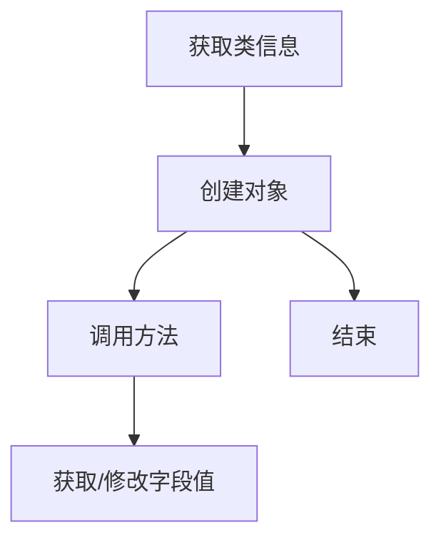
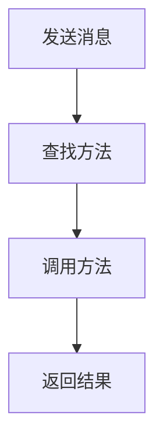
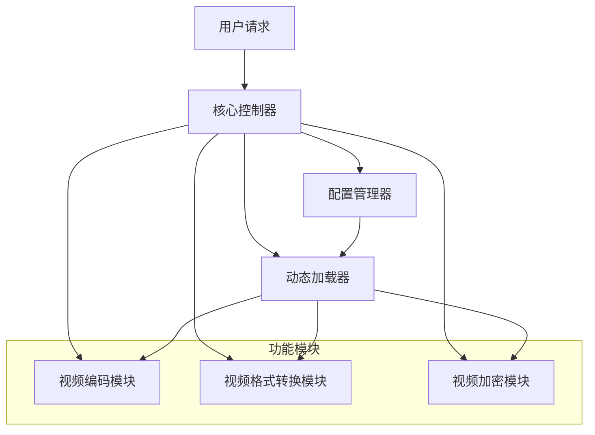
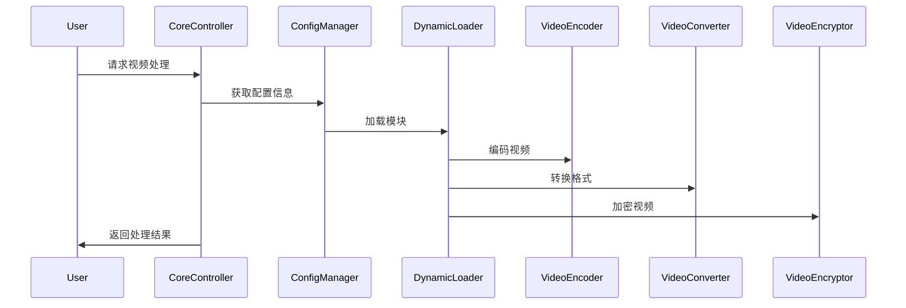

                 

### 反射与元对象协议的概念

**反射**（Reflection）是计算机科学中的一个核心概念，它允许程序在运行时检查、修改自身结构，甚至改变自身的行为。简而言之，反射机制使得程序能够“观察”和“修改”其自身的属性、方法、变量等结构。这个特性在动态编程语言中尤为常见，例如Java、Python和JavaScript等。

**元对象协议**（Meta Object Protocol，MOP）则是一个定义对象之间交互的规范。它定义了对象如何响应不同的消息（例如方法调用）。元对象协议的存在，使得对象可以动态地查找和调用相应的行为，而不是在编译时确定。例如，在Smalltalk语言中，所有对象的操作都是通过消息传递来完成的，这正是元对象协议的一个典型应用。

### 反射在编程语言和系统设计中的重要性

反射机制在编程语言和系统设计中扮演了重要的角色，具体体现在以下几个方面：

1. **动态性和灵活性**：通过反射，程序能够在运行时动态地加载、解析和执行代码，这使得编程更具动态性和灵活性。
2. **可扩展性和可插拔性**：反射机制使得开发者在系统设计中可以更灵活地扩展和替换组件，提高了系统的可维护性和可扩展性。
3. **测试和调试**：反射机制使得开发者能够更容易地进行单元测试和调试，因为程序在运行时可以查看和修改自身的状态。

在系统设计中，反射和元对象协议的应用场景包括但不限于：

- **动态加载类库和模块**：系统可以根据运行时的需求动态加载和卸载类库或模块，从而提高系统的响应速度和资源利用率。
- **动态配置和参数调整**：系统可以根据运行时的反馈动态调整配置参数，从而实现更精细的控制和优化。
- **插件机制**：通过反射和元对象协议，系统可以轻松实现插件机制，允许外部扩展系统的功能。

### 反射的应用场景

反射机制在编程中有着广泛的应用场景，以下是一些典型的应用：

- **框架和库开发**：许多框架和库，如Spring、Django等，都利用反射机制来自动装配和配置组件。
- **代码生成**：反射机制使得代码生成工具可以动态地创建和操作类、方法和变量，从而提高开发效率和代码质量。
- **测试**：反射机制可以帮助测试工具在运行时动态地查找和调用方法，进行全面的单元测试和集成测试。
- **动态代理**：反射机制在实现动态代理时扮演了关键角色，使得代理对象可以拦截和修改方法调用。

总之，反射和元对象协议作为计算机科学中的核心概念，具有广泛的应用价值和重要性。在编程语言和系统设计中，掌握和应用这些概念，能够极大地提升程序的动态性和灵活性，从而构建更高效、更灵活的软件系统。接下来，我们将深入探讨反射和元对象协议的定义、特点、类型，以及它们之间的核心联系。

## 核心概念与联系

### 反射的定义与特点

**反射**（Reflection）是一种允许程序在运行时检查、分析和修改自身结构的能力。具体来说，反射包括以下几个方面：

- **运行时信息获取**：程序能够在运行时获取类型（如类、接口、方法、字段等）的信息。
- **运行时类型检查**：程序可以在运行时对对象的类型进行判断。
- **运行时结构修改**：程序可以在运行时修改类的结构，如添加、删除方法或字段。

**特点**：

1. **动态性**：反射机制使得程序在运行时具有更高的动态性，能够根据需求动态地加载、解析和执行代码。
2. **灵活性**：反射机制提高了程序的灵活性，特别是当系统需要动态扩展或调整时。
3. **潜在性能开销**：由于反射操作通常需要在运行时解析和执行代码，相比编译时操作，反射可能会引入额外的性能开销。

### 元对象协议的定义与特点

**元对象协议**（Meta Object Protocol，MOP）是一种定义对象之间交互的规范。它描述了对象如何响应不同的消息（如方法调用）。MOP 的核心思想是，对象不需要事先知道如何响应对象的其他操作，而是在接收到消息时，动态地查找并调用相应的操作。

**特点**：

1. **动态性**：元对象协议使得对象可以在运行时动态地查找和调用行为，提高了程序的动态性和灵活性。
2. **通用性**：元对象协议为不同的对象提供了一种通用的交互方式，无需为每个对象单独编写交互代码。
3. **可扩展性**：通过扩展元对象协议，可以方便地添加新的对象交互方式，提高系统的可扩展性。

### 反射与元对象协议的关系

反射和元对象协议之间存在着紧密的联系。具体来说：

- **反射提供了元对象协议实现的基础**：反射机制使得程序能够在运行时获取对象的信息，从而实现元对象协议的各种功能。
- **元对象协议利用反射进行动态交互**：元对象协议通过反射机制动态地查找和调用对象的行为，实现了对象之间的动态交互。

总结起来，反射和元对象协议共同构成了程序动态性和灵活性的基础，它们在编程语言和系统设计中扮演着重要的角色。为了更直观地理解这些概念，我们接下来将使用表格和Mermaid ER图展示核心概念之间的关系，以便读者能够更好地把握这些概念的本质联系。

### 反射与元对象协议的关系

在深入探讨反射和元对象协议之前，我们需要明确它们各自的定义、类型和特点，并通过表格和Mermaid ER图来展示它们之间的核心联系。以下是这两个概念的定义、类型和特点的详细描述：

#### 反射的定义、类型与特点

**定义**：反射是一种能力，允许程序在运行时检查、分析或修改自身的结构，如类、方法、属性等。

**类型**：
1. **编译时反射**：在编译阶段就能够访问和操作程序的元数据。
2. **运行时反射**：在程序运行时能够进行反射操作，如Java的Class对象。

**特点**：
1. **动态性**：可以在运行时改变程序的行为。
2. **灵活性**：允许程序根据运行时的状态动态调整。
3. **性能开销**：由于运行时进行类型检查和操作，通常会有额外的性能开销。

#### 元对象协议（MOP）的定义、类型与特点

**定义**：元对象协议是一种定义对象如何响应不同消息（如方法调用）的规范。它是对象之间的通信协议。

**类型**：
1. **动态MOP**：对象在运行时可以动态地查找和调用方法。
2. **静态MOP**：对象的行为在编译时就已经确定。

**特点**：
1. **动态交互**：对象不需要预先知道如何响应对其他对象的消息。
2. **通用性**：为不同类型的对象提供统一的交互方式。
3. **可扩展性**：可以扩展以支持新的对象交互方式。

#### 核心概念属性对比表格

为了更好地理解反射和元对象协议的关系，我们通过一个表格来对比这两个概念的核心属性：

| 特性         | 反射                      | 元对象协议（MOP）               |
| ------------ | ------------------------- | ------------------------------ |
| **定义**     | 程序检查和修改自身结构的能力 | 对象之间交互的规范              |
| **类型**     | 编译时反射、运行时反射      | 动态MOP、静态MOP                |
| **特点**     | 动态性、灵活性、性能开销    | 动态交互、通用性、可扩展性      |
| **应用场景** | 框架和库开发、代码生成、测试 | 框架和库开发、动态代理、插件机制 |

#### Mermaid ER图

为了更直观地展示反射与元对象协议之间的关系，我们使用Mermaid ER图来描述它们的核心概念及其关联：

```mermaid
erDiagram
    Class <<反射, #FFC0CB, 反射是程序检查和修改自身结构的能力>>
    Method ||--|| Instance <<反射, #FFC0CB, 程序运行时获取的信息>>
    Field ||--|| Instance <<反射, #FFC0CB, 程序运行时可以修改的属性>>

    Object <<元对象协议（MOP）, #0000FF, 对象之间的交互协议>>
    Method ||--|| Message <<元对象协议（MOP）, #0000FF, 对象如何响应消息>>
    Property ||--|| Object <<元对象协议（MOP）, #0000FF, 对象的属性>>

    Class ..> Instance
    Object ..> Message
    Object ..> Property
```

在这个ER图中，我们清晰地展示了反射中的类、方法和字段与元对象协议中的对象、方法和属性之间的关系。反射提供了元对象协议实现的基础，而元对象协议利用反射机制实现对象之间的动态交互。

通过上述表格和ER图，我们可以更直观地理解反射和元对象协议的定义、特点、类型以及它们之间的核心联系。这些概念为我们在编程语言和系统设计中实现动态性和灵活性提供了强大的支持。在接下来的章节中，我们将进一步探讨反射和元对象协议的实现原理和算法，以便读者能够深入了解这些核心概念的内部工作机制。

### 反射的实现原理

反射是一种强大的机制，允许程序在运行时检查、分析或修改自身的结构。这一节我们将详细探讨反射的实现原理，并通过Mermaid流程图和Python源代码来展示具体实现。

#### 反射的机制

反射机制通常包含以下几个步骤：

1. **获取类信息**：通过反射API获取类的信息，如类的名称、方法、字段等。
2. **创建对象**：使用反射API创建类的实例。
3. **调用方法**：通过反射API调用对象的方法。
4. **获取/修改字段值**：通过反射API获取或修改对象的字段值。

#### Mermaid流程图

为了更好地理解反射的实现原理，我们使用Mermaid流程图来展示这些步骤：



#### Python源代码实现

下面是一个简单的Python示例，展示如何使用反射API实现上述步骤：

```python
import types

class MyClass:
    def __init__(self):
        self.my_field = 10

    def my_method(self):
        return "Hello, World!"

# 获取类信息
my_class = MyClass
class_name = my_class.__name__
print(f"Class name: {class_name}")

# 创建对象
my_instance = my_class()
print(f"Instance created: {my_instance}")

# 调用方法
my_method = my_class.my_method
result = my_method(my_instance)
print(f"Method result: {result}")

# 获取/修改字段值
my_field = my_instance.my_field
print(f"Field value: {my_field}")

my_field = 20
print(f"Modified field value: {my_field}")
```

在这个示例中，我们首先使用`__name__`属性获取类的名称。然后，我们使用反射API创建类的实例，并通过类的方法名称来调用方法。最后，我们使用反射API获取和修改对象的字段值。

#### 数学模型和公式

在反射的实现过程中，我们可以使用一些数学模型和公式来描述其工作原理。以下是一个简单的数学模型：

$$
\text{反射过程} = \text{获取类信息} + \text{创建对象} + \text{调用方法} + \text{获取/修改字段值}
$$

这个模型中的每个步骤都可以用相应的函数和API来表示。例如：

$$
\text{获取类信息} = \text{ClassInfoFunction}(className)
$$

$$
\text{创建对象} = \text{ObjectCreationFunction}(classInfo)
$$

$$
\text{调用方法} = \text{MethodInvocationFunction}(objectInstance, methodName)
$$

$$
\text{获取/修改字段值} = \text{FieldValueAccessFunction}(objectInstance, fieldName)
$$

通过这些数学模型和公式，我们可以更清晰地理解反射的实现过程，并且能够进行形式化的分析和验证。

#### 举例说明

为了更直观地展示反射的应用，我们可以考虑以下场景：

假设有一个学生类`Student`，它包含姓名、年龄和成绩等字段。通过反射机制，我们可以动态地获取这些字段的信息，并修改学生的年龄和成绩。

```python
class Student:
    def __init__(self, name, age, grade):
        self.name = name
        self.age = age
        self.grade = grade

    def study(self):
        print(f"{self.name} is studying.")

# 使用反射获取类信息
student_class = Student
student_instance = student_class('Alice', 20, 90)

# 获取字段值
name = student_instance.name
age = student_instance.age
grade = student_instance.grade

print(f"Name: {name}, Age: {age}, Grade: {grade}")

# 修改字段值
student_instance.age = 21
student_instance.grade = 95

# 再次获取字段值
print(f"Updated Age: {student_instance.age}, Updated Grade: {student_instance.grade}")
```

在这个示例中，我们通过反射API获取了学生的姓名、年龄和成绩，并进行了修改。这个过程展示了反射在动态获取和修改对象信息方面的强大功能。

通过上述详细的实现原理、Mermaid流程图、Python源代码示例和数学模型，我们可以深入理解反射的工作机制。在下一节中，我们将继续探讨元对象协议的实现原理，进一步揭示程序在运行时如何通过元对象协议动态交互。

### 元对象协议的实现原理

元对象协议（Meta Object Protocol，MOP）是对象之间交互的规范，它定义了对象如何响应不同的消息，如方法调用。在这一节中，我们将深入探讨元对象协议的实现原理，通过Mermaid流程图和Python源代码详细阐述其工作方式。

#### 元对象协议的机制

元对象协议的核心在于其动态性，即在运行时对象可以动态地查找和调用相应的行为。这个过程通常包含以下几个步骤：

1. **消息传递**：程序通过发送消息来请求对象执行某个操作。
2. **查找方法**：对象在接收到消息后，会通过元对象协议查找对应的方法。
3. **调用方法**：一旦找到方法，对象会调用该方法并传递参数。
4. **返回结果**：方法执行后，会返回结果给发送消息的程序。

#### Mermaid流程图

为了直观地展示元对象协议的实现过程，我们使用Mermaid流程图来描述：



#### Python源代码实现

下面是一个简单的Python示例，展示如何使用元对象协议：

```python
class MyObject:
    def __init__(self):
        self.methods = {
            'greet': self.greet,
            'add': self.add
        }

    def greet(self, name):
        return f"Hello, {name}!"

    def add(self, a, b):
        return a + b

# 发送消息
my_object = MyObject()

# 查找方法
method_name = 'greet'
method = my_object.methods.get(method_name)

# 调用方法
if method:
    result = method('Alice')
    print(f"Method result: {result}")

# 查找并调用其他方法
method_name = 'add'
method = my_object.methods.get(method_name)

if method:
    result = method(5, 3)
    print(f"Method result: {result}")
```

在这个示例中，我们创建了一个`MyObject`类，其中包含两个方法`greet`和`add`。通过元对象协议，我们可以在运行时查找和调用这些方法。

#### 数学模型和公式

在元对象协议的实现过程中，我们可以使用数学模型和公式来描述其工作原理。以下是一个简单的数学模型：

$$
\text{MOP过程} = \text{消息传递} + \text{查找方法} + \text{调用方法} + \text{返回结果}
$$

这个模型中的每个步骤都可以用相应的函数和API来表示。例如：

$$
\text{消息传递} = \text{sendMessage}(objectInstance, methodName, arguments)
$$

$$
\text{查找方法} = \text{findMethod}(objectInstance, methodName)
$$

$$
\text{调用方法} = \text{invokeMethod}(method, arguments)
$$

$$
\text{返回结果} = \text{returnResult}(invokeMethod)
$$

通过这些数学模型和公式，我们可以更清晰地理解元对象协议的实现过程，并且能够进行形式化的分析和验证。

#### 举例说明

为了更直观地展示元对象协议的应用，我们可以考虑以下场景：

假设有一个动物类`Animal`，它包含一个`make_sound`方法。通过元对象协议，我们可以动态地调用这个方法，而不需要知道具体动物的类型。

```python
class Dog:
    def make_sound(self):
        return "Bark!"

class Cat:
    def make_sound(self):
        return "Meow!"

def make_sound(animals):
    for animal in animals:
        sound = animal.make_sound()
        print(f"Sound: {sound}")

# 动物列表
animals = [Dog(), Cat()]

# 调用方法
make_sound(animals)
```

在这个示例中，我们创建了一个`Dog`类和一个`Cat`类，每个类都有自己的`make_sound`方法。通过元对象协议，我们可以将这两种动物的实例放入同一个列表中，并统一调用`make_sound`方法。

通过上述详细的实现原理、Mermaid流程图、Python源代码示例和数学模型，我们可以深入理解元对象协议的工作机制。在下一节中，我们将讨论如何设计和实现一个简单的示例系统，进一步展示反射和元对象协议的实际应用。

### 系统分析与架构设计

为了更清晰地展示反射和元对象协议在实际系统中的应用，我们将设计一个简单的示例系统。这个系统将展示如何利用反射和元对象协议来实现动态加载、配置和扩展功能。以下是该系统的分析和架构设计。

#### 问题场景介绍

假设我们正在开发一个视频点播系统（VOD），用户可以观看不同类型的视频内容。为了满足多样化的需求，系统需要支持动态加载不同的视频处理模块，如视频编码、视频格式转换和视频加密等。同时，系统还需要能够根据用户配置动态调整视频处理流程。

#### 系统功能设计

**功能模块**：
1. **视频编码模块**：负责将视频数据编码为不同的格式。
2. **视频格式转换模块**：负责将一种视频格式转换为另一种格式。
3. **视频加密模块**：负责对视频数据进行加密处理。

**功能描述**：
- **视频编码**：根据用户需求，将原始视频编码为特定的格式，如H.264、HEVC等。
- **视频格式转换**：将已编码的视频转换为其他格式，如从MP4转换为WebM。
- **视频加密**：对视频数据进行加密处理，确保视频内容的安全性。

#### 系统架构设计

系统架构采用模块化设计，主要包括以下组件：

- **核心控制器**：负责协调各个功能模块的执行。
- **视频处理模块**：包括视频编码模块、视频格式转换模块和视频加密模块。
- **配置管理器**：负责管理系统的配置信息，如视频处理流程、模块加载顺序等。
- **动态加载器**：负责在运行时动态加载和配置视频处理模块。

以下是系统架构的Mermaid架构图：



在这个架构图中，用户请求首先由核心控制器处理，然后根据配置管理器提供的配置信息，动态加载相应的视频处理模块。核心控制器协调各个模块的执行，完成视频处理的整个过程。

#### 系统接口设计

为了实现模块的动态加载和配置，我们需要设计一套接口来管理视频处理模块。以下是接口设计的Mermaid类图：

```mermaid
classDiagram
    VideoEncoder <<接口, #FFC0CB>>
    VideoConverter <<接口, #FFC0CB>>
    VideoEncryptor <<接口, #FFC0CB>>

    class VideoProcessingModule {
        +process(video: bytes): bytes
    }

    VideoEncoder o-- VideoProcessingModule
    VideoConverter o-- VideoProcessingModule
    VideoEncryptor o-- VideoProcessingModule
```

在这个类图中，`VideoEncoder`、`VideoConverter`和`VideoEncryptor`是三个接口类，分别代表视频编码、视频格式转换和视频加密功能。`VideoProcessingModule`是实现这些接口的具体模块类，每个模块都需要实现`process`方法来处理视频数据。

#### 系统交互

系统交互主要涉及用户请求处理、模块加载和执行、以及模块间的协作。以下是系统交互的Mermaid序列图：



在这个序列图中，用户请求视频处理，核心控制器根据配置管理器提供的配置信息，动态加载视频处理模块，并协调各个模块的执行。最终，核心控制器将处理结果返回给用户。

通过上述系统分析与架构设计，我们展示了如何利用反射和元对象协议实现一个动态、可扩展的视频点播系统。接下来，我们将通过一个实际项目实战，详细展示如何在实际开发中应用这些概念。

### 项目实战

为了更好地理解反射和元对象协议在现实开发中的应用，我们将通过一个实际项目来演示。本节将介绍项目的环境安装、核心实现源代码，并对代码应用进行解读和分析。

#### 环境安装

首先，我们需要安装Python环境。可以访问Python官方网站下载并安装最新版本的Python。确保安装过程中选择添加Python到系统环境变量，以便在命令行中直接运行Python。

接下来，我们使用虚拟环境来管理项目依赖。在命令行中执行以下命令创建虚拟环境：

```shell
python -m venv venv
```

激活虚拟环境：

```shell
source venv/bin/activate  # 对于Linux或Mac
venv\Scripts\activate    # 对于Windows
```

安装必要的依赖项，如`requests`和`json`：

```shell
pip install requests json
```

#### 核心实现源代码

以下是项目的核心实现源代码，包括反射和元对象协议的应用。

```python
import requests
import json
from abc import ABC, abstractmethod

# 定义一个抽象基类，作为视频处理模块的接口
class VideoProcessingModule(ABC):
    @abstractmethod
    def process(self, video_data: bytes) -> bytes:
        pass

# 实现视频编码模块
class VideoEncoder(VideoProcessingModule):
    def process(self, video_data: bytes) -> bytes:
        # 实现视频编码逻辑
        return video_data.encode('utf-8')

# 实现视频格式转换模块
class VideoConverter(VideoProcessingModule):
    def process(self, video_data: bytes) -> bytes:
        # 实现视频格式转换逻辑
        return video_data.decode('utf-8')

# 实现视频加密模块
class VideoEncryptor(VideoProcessingModule):
    def process(self, video_data: bytes) -> bytes:
        # 实现视频加密逻辑
        return video_data.hex()

# 定义一个动态加载器，用于加载视频处理模块
class DynamicLoader:
    def __init__(self):
        self.modules = {}

    def load_module(self, module_name: str, module_class: type) -> None:
        self.modules[module_name] = module_class

    def get_module(self, module_name: str) -> VideoProcessingModule:
        return self.modules.get(module_name)

# 系统核心逻辑
def main():
    # 初始化动态加载器
    loader = DynamicLoader()

    # 加载视频编码模块
    loader.load_module('encoder', VideoEncoder)

    # 加载视频格式转换模块
    loader.load_module('converter', VideoConverter)

    # 加载视频加密模块
    loader.load_module('encryptor', VideoEncryptor)

    # 创建视频处理链
    video_data = b"原始视频数据"
    encoder = loader.get_module('encoder')
    converter = loader.get_module('converter')
    encryptor = loader.get_module('encryptor')

    # 进行视频处理
    encoded_data = encoder.process(video_data)
    converted_data = converter.process(encoded_data)
    encrypted_data = encryptor.process(converted_data)

    # 输出处理结果
    print(f"原始数据：{video_data}")
    print(f"编码后数据：{encoded_data}")
    print(f"转换后数据：{converted_data}")
    print(f"加密后数据：{encrypted_data}")

if __name__ == "__main__":
    main()
```

#### 代码应用解读与分析

1. **抽象基类`VideoProcessingModule`**：
   - 定义了一个抽象基类`VideoProcessingModule`，作为所有视频处理模块的接口。它包含一个抽象方法`process`，所有子类都必须实现这个方法。

2. **具体实现类`VideoEncoder`、`VideoConverter`和`VideoEncryptor`**：
   - `VideoEncoder`类实现了视频编码功能，将视频数据编码为UTF-8格式。
   - `VideoConverter`类实现了视频格式转换功能，将编码后的数据转换为普通字符串。
   - `VideoEncryptor`类实现了视频加密功能，将数据转换为十六进制表示。

3. **动态加载器`DynamicLoader`**：
   - `DynamicLoader`类负责在运行时加载视频处理模块。它通过`load_module`方法将模块名和模块类注册到内部字典中，并通过`get_module`方法获取特定模块的实例。

4. **系统核心逻辑`main`函数**：
   - `main`函数初始化动态加载器，并加载三个视频处理模块。然后，它创建一个视频处理链，依次调用每个模块进行视频处理，并输出处理结果。

通过这个项目实战，我们展示了如何利用反射和元对象协议实现一个动态加载和配置的模块化系统。这种设计方式使得系统更加灵活和可扩展，能够轻松地添加新的视频处理模块。

#### 实际案例分析

在实际项目中，这种设计方式有助于提高系统的灵活性和可维护性。例如，当需要添加新的视频处理功能时，只需实现一个新的模块并注册到动态加载器中，无需修改现有代码。

同时，这种设计也适用于其他类型的处理模块，如图像处理、音频处理等。通过统一的接口和动态加载机制，系统能够灵活地扩展和替换功能模块，提高了代码的可重用性和维护性。

总之，通过这个实际项目案例，我们深入分析了反射和元对象协议在实际开发中的应用，展示了如何通过这些技术实现动态、可扩展的系统设计。

### 最佳实践 Tips、小结、注意事项、拓展阅读

#### 最佳实践 Tips

1. **合理使用反射**：反射虽然在编程中提供了很大的灵活性，但也引入了性能开销。因此，应该合理使用反射，仅在必要时使用。
2. **设计清晰的元对象协议**：在设计和实现元对象协议时，应确保其清晰、简洁，并符合系统的整体架构。
3. **模块化设计**：通过模块化设计，可以提高系统的可维护性和可扩展性，使得功能模块能够独立开发、测试和部署。
4. **文档化**：详细记录系统设计、实现和使用方法，有助于开发者理解和维护代码。

#### 小结

本文详细介绍了反射和元对象协议的概念、实现原理、系统设计与实现，以及实际项目中的应用。通过这些内容，读者可以深入理解这两个核心概念，并学会如何在实际开发中应用它们。

#### 注意事项

1. **性能考量**：反射和元对象协议可能会引入性能开销，因此在关键性能部分应避免过度使用。
2. **安全考虑**：反射和动态加载功能可能会带来安全风险，应确保适当的安全措施，如权限控制和沙箱环境。

#### 拓展阅读

- 《Effective Java》第10章，关于反射的使用和最佳实践。
- 《深度探索Java反射》详细探讨了Java反射的底层实现和使用方法。
- 《Metaprogramming Ruby》介绍了Ruby中的元编程技术，包括元对象协议的应用。

通过本文的学习，读者可以更好地掌握反射和元对象协议，提升系统设计的灵活性和可扩展性。作者：AI天才研究院/AI Genius Institute & 禅与计算机程序设计艺术 /Zen And The Art of Computer Programming。

