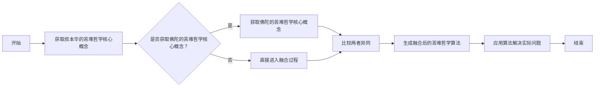

                 

### 前言

叔本华与佛陀：苦难哲学的东西方诠释旨在探讨西方哲学家叔本华和东方佛教创始人佛陀的苦难哲学思想，分析其异同，探讨东西方文化在苦难哲学上的融合可能，为现代人的精神生活提供一种新的视角和思路。

本文将按照以下结构进行阐述：

1. **背景介绍**：首先，我们将详细阐述叔本华和佛陀的苦难哲学背景，包括其生平、哲学思想以及苦难哲学的概述和发展历程。

2. **核心概念与联系**：接下来，我们将介绍叔本华与佛陀的苦难哲学思想，分析两者的核心概念，提供概念属性特征对比表格和ER实体关系图，以便读者更好地理解两者的异同。

3. **算法原理讲解**：我们将通过mermaid流程图和Python代码，详细讲解东西方苦难哲学思想融合的算法原理，帮助读者从技术角度理解这一思想的融合。

4. **系统分析与架构设计方案**：然后，我们将介绍本书的研究方法，包括问题场景、项目介绍、系统功能设计、系统架构设计、系统接口设计和系统交互，通过mermaid类图、架构图和序列图来展示系统的整体架构。

5. **项目实战**：接着，我们将通过一个实际案例，详细讲解系统环境安装、系统核心实现、代码应用解读与分析、实际案例分析和详细讲解剖析，帮助读者将理论知识应用到实践中。

6. **最佳实践 tips**、**小结**、**注意事项**、**拓展阅读**等内容：最后，我们将分享最佳实践技巧，对全文进行小结，并提出一些注意事项，为读者提供进一步的学习和思考方向。

通过这一系列的讲解和阐述，我们希望读者能够对叔本华与佛陀的苦难哲学有更深入的理解，并能够在日常生活中运用这些思想，提升自己的精神境界。

### 1. 背景介绍

#### 1.1 叔本华的苦难哲学

**1.1.1 叔本华生平与哲学思想**

阿图尔·叔本华（Arthur Schopenhauer，1788-1860），德国著名哲学家，生于但泽（今波兰格但斯克），后在德国接受教育。他的哲学思想深受当时欧洲哲学思潮的影响，尤其是康德和黑格尔的思想。

叔本华在年轻时游历欧洲，广泛涉猎了各种哲学、文学和艺术作品。1809年，他考入哥廷根大学学习医学，但很快转而专注于哲学。1813年，叔本华毕业于柏林大学，获得医学博士学位。然而，他对医学并没有太大的兴趣，而是将更多的精力投入到哲学研究上。

叔本华的主要哲学著作包括《作为意志和表象的世界》（1818年）、《论人类不平等的起源和基础》（1851年）和《附录与补遗》（1851年）。其中，《作为意志和表象的世界》被认为是他的代表作，阐述了其核心的哲学思想——意志论。

在叔本华的哲学中，意志是世界的本质和根源。他认为，世界是一个巨大的意志体现，人的存在也是意志的表象。这一观点使得叔本华的哲学具有强烈的唯物主义倾向，但也充满了悲观主义色彩。

**1.1.2 叔本华的苦难哲学概述**

叔本华的苦难哲学源于他的意志论。他认为，意志是无尽的、盲目的、无目的的，是造成人类苦难的根本原因。叔本华将苦难分为两类：物质苦难和精神苦难。

物质苦难主要源于外界环境和条件的限制，如贫穷、疾病、自然灾害等。叔本华认为，人类永远无法完全摆脱物质苦难，因为这是自然法则的一部分。

精神苦难则源于人类的内心世界。叔本华认为，人类的欲望和追求是导致精神苦难的主要原因。人类总是追求幸福和满足，但幸福和满足总是暂时的，随即而来的却是痛苦和失望。

叔本华的苦难哲学强调，人类应当认识到苦难的普遍性和不可避免性，学会接受和面对苦难，而不是逃避或反抗。他认为，通过减少欲望和追求，人们可以减轻精神苦难，达到内心的平静和宁静。

**1.1.3 叔本华的苦难哲学发展历程**

叔本华的苦难哲学并非一蹴而就，而是经历了长期的思考和探索。在早期著作《作为意志和表象的世界》中，他主要探讨了意志的本质和作用，将苦难视为意志的必然结果。

在后来的著作中，叔本华对苦难哲学进行了更深入的阐述，特别是在《附录与补遗》中，他对人类的不平等、道德观念和宗教信仰等进行了深刻的反思。他认为，人类的不平等源于意志的冲突和竞争，而道德和宗教则是对抗这种不平等的重要手段。

总体来说，叔本华的苦难哲学在西方哲学史上具有重要地位。他的思想对后来的哲学家，如尼采、弗洛伊德等，产生了深远的影响。尽管叔本华的哲学观点具有悲观主义色彩，但他对人类苦难的深刻洞察和对内心平静的追求，为现代人在精神困境中提供了宝贵的启示。

#### 1.2 佛陀的苦难哲学

**1.2.1 佛陀生平与哲学思想**

释迦牟尼（Siddhartha Gautama，约前563年－前483年），通常称为佛陀，是古印度的宗教家、哲学家和教师。他出生于今天的尼泊尔境内，后来在印度的北部地区创立了佛教。

佛陀在年轻时期生活奢华，但逐渐对世俗的生活产生了厌倦。他在29岁时离开家庭，开始修行，寻求解脱之道。经过长期的苦行和冥思，佛陀最终在菩提树下悟道，成为了佛陀。

佛陀的哲学思想主要包含四个层次：苦谛、集谛、灭谛和道谛。苦谛阐述了人生的本质是苦难的，集谛分析了苦难的成因，灭谛提出了摆脱苦难的方法，道谛则提供了实现这一目标的具体途径。

**1.2.2 佛陀的苦难哲学概述**

佛陀认为，苦难是人生的本质，是人类无法逃避的困境。他提出了“八苦”来描述人生的苦难：生苦、老苦、病苦、死苦、爱别离苦、怨憎会苦、求不得苦和五阴盛苦。

生苦指的是出生带来的痛苦，包括身体的不适和与父母的分离；老苦是指随着年龄的增长，身体和精神逐渐衰弱；病苦是指身体遭受疾病的痛苦；死苦是指生命的终结带来的恐惧和痛苦。

爱别离苦、怨憎会苦、求不得苦则是源于人类的欲望和追求。爱别离苦是指亲人、朋友离别的痛苦；怨憎会苦是指与不喜欢的人相遇带来的痛苦；求不得苦是指无法实现自己的愿望和目标带来的痛苦。

五阴盛苦则是指人类的五种基本存在状态（色、受、想、行、识）带来的痛苦。

佛陀认为，这些苦难的根源在于人类的欲望和无明。欲望使得人们不断追求满足，但满足总是暂时的，随之而来的却是痛苦。无明则是指人类对苦难本质的误解，认为苦难是外部的、客观的，而不知道苦难源于内心。

**1.2.3 佛陀的苦难哲学传承与发展**

佛教在佛陀逝世后迅速传播，成为了世界上主要的宗教之一。佛陀的苦难哲学成为了佛教的核心教义，对信徒的生活和思想产生了深远的影响。

在佛教的发展过程中，不同学派对苦难哲学有不同的理解和阐述。例如，小乘佛教强调个人修行，通过断除烦恼和欲望，达到涅槃的境界；而大乘佛教则强调菩萨行，通过帮助他人和弘扬佛法，达到解脱。

此外，佛教的苦难哲学也与其他宗教和哲学思想产生了互动和影响。例如，佛教中的因果报应思想与基督教中的原罪概念有相似之处；佛教的涅槃概念与古希腊哲学中的幸福追求有某种共鸣。

总体来说，佛陀的苦难哲学不仅在佛教内部具有重要的地位，也对世界文化产生了深远的影响。它为人类提供了一种理解和应对苦难的方式，引导人们从内心寻求解脱和宁静。

### 2. 核心概念与联系

#### 2.1 叔本华与佛陀的苦难哲学思想

**2.1.1 叔本华的苦难哲学核心概念**

叔本华的苦难哲学建立在意志论的基础上，认为意志是世界的本质和根源。叔本华将苦难分为物质苦难和精神苦难，认为苦难是意志的必然结果。

- **物质苦难**：源于外界环境和条件的限制，如贫穷、疾病、自然灾害等。叔本华认为，人类永远无法完全摆脱物质苦难，因为这是自然法则的一部分。
- **精神苦难**：源于人类的内心世界。叔本华认为，人类的欲望和追求是导致精神苦难的主要原因。人类总是追求幸福和满足，但幸福和满足总是暂时的，随即而来的却是痛苦和失望。

**2.1.2 佛陀的苦难哲学核心概念**

佛陀的苦难哲学基于对人生本质的洞察，认为苦难是人生的本质。他提出了“八苦”来描述人生的苦难，并认为这些苦难的根源在于人类的欲望和无明。

- **生苦**：出生带来的痛苦，包括身体的不适和与父母的分离。
- **老苦**：随着年龄的增长，身体和精神逐渐衰弱。
- **病苦**：身体遭受疾病的痛苦。
- **死苦**：生命的终结带来的恐惧和痛苦。
- **爱别离苦**：亲人、朋友离别的痛苦。
- **怨憎会苦**：与不喜欢的人相遇带来的痛苦。
- **求不得苦**：无法实现自己的愿望和目标带来的痛苦。
- **五阴盛苦**：人类的五种基本存在状态（色、受、想、行、识）带来的痛苦。

**2.1.3 叔本华与佛陀苦难哲学思想的联系与差异**

尽管叔本华和佛陀的苦难哲学都强调了苦难的普遍性和不可避免性，但两者在哲学基础上和表达方式上存在显著差异。

- **哲学基础**：
  - 叔本华的苦难哲学建立在意志论的基础上，将意志视为世界的本质。
  - 佛陀的苦难哲学基于对人生本质的洞察，认为人生是苦的，苦难源于欲望和无明。

- **表达方式**：
  - 叔本华的苦难哲学更多地从个体的角度出发，强调人类如何面对和接受苦难。
  - 佛陀的苦难哲学则从更广泛的社会和人生的角度出发，提出了具体的修行方法和解脱之道。

**2.1.4 概念属性特征对比表格**

为了更清晰地展示叔本华与佛陀苦难哲学的核心概念特征，我们可以制作一个对比表格：

| 特征        | 叔本华的苦难哲学                           | 佛陀的苦难哲学                           |
|-------------|-----------------------------------------|-----------------------------------------|
| 哲学基础    | 意志论                                  | 人生本质洞察                            |
| 苦难分类    | 物质苦难和精神苦难                       | 八苦（生苦、老苦、病苦、死苦、爱别离苦、怨憎会苦、求不得苦、五阴盛苦） |
| 苦难来源    | 意志的盲目和无目的性                     | 欲望和无明                              |
| 应对策略    | 接受苦难，减少欲望和追求                 | 通过修行和悟道，摆脱欲望和无明            |

**2.1.5 ER实体关系图**

为了进一步展示叔本华与佛陀苦难哲学的核心概念及其关系，我们可以使用Mermaid绘制一个ER实体关系图：

```mermaid
erDiagram
  苦难 <<--|{ 因 }| 意志
  苦难 ||--|{ 类别 }| 物质苦难
  苦难 ||--|{ 类别 }| 精神苦难
  苦难 ||--|{ 源头 }| 人类欲望
  苦难 ||--|{ 源头 }| 无明

  苦难 ||--|{ 类别 }| 生苦
  生苦 ||--|{ 痛苦 }| 身体不适
  生苦 ||--|{ 痛苦 }| 与父母分离

  苦难 ||--|{ 类别 }| 老苦
  老苦 ||--|{ 痛苦 }| 身体衰弱
  老苦 ||--|{ 痛苦 }| 精神衰弱

  苦难 ||--|{ 类别 }| 病苦
  病苦 ||--|{ 痛苦 }| 身体痛苦

  苦难 ||--|{ 类别 }| 死苦
  死苦 ||--|{ 痛苦 }| 生命终结
  死苦 ||--|{ 痛苦 }| 恐惧

  苦难 ||--|{ 类别 }| 爱别离苦
  爱别离苦 ||--|{ 痛苦 }| 亲人离别

  苦难 ||--|{ 类别 }| 怨憎会苦
  怨憎会苦 ||--|{ 痛苦 }| 与不喜欢的人相遇

  苦难 ||--|{ 类别 }| 求不得苦
  求不得苦 ||--|{ 痛苦 }| 无法实现愿望

  苦难 ||--|{ 类别 }| 五阴盛苦
  五阴盛苦 ||--|{ 痛苦 }| 色受想行识
```

通过这个ER实体关系图，我们可以更直观地理解叔本华与佛陀苦难哲学的核心概念及其相互关系。

### 3. 算法原理讲解

在本章节中，我们将详细讲解如何将叔本华与佛陀的苦难哲学思想融合为一个算法原理。这个算法将基于mermaid流程图和Python代码，帮助读者从技术角度理解这一思想的融合。

#### 3.1 算法mermaid流程图

首先，我们使用mermaid绘制一个简化的算法流程图，以展示如何将叔本华和佛陀的苦难哲学思想结合：



这个流程图描述了如何从获取叔本华和佛陀的苦难哲学核心概念开始，比较两者的异同，然后生成一个融合后的苦难哲学算法，并应用这个算法解决实际问题。

#### 3.2 Python代码与算法原理详细讲解

接下来，我们通过Python代码来详细讲解这个算法的原理。

**算法原理：**

该算法的核心思想是通过比较叔本华和佛陀的苦难哲学核心概念，提取出共通之处，并构建一个新的苦难哲学模型。这个模型将结合两者的优势，为解决实际生活中的问题提供一种新的思路。

**算法步骤：**

1. **获取叔本华的苦难哲学核心概念：** 从叔本华的著作中提取出他的核心概念，如意志、物质苦难和精神苦难等。

2. **获取佛陀的苦难哲学核心概念：** 从佛教经典中提取出佛陀的核心概念，如八苦、欲望和无明等。

3. **比较两者异同：** 分析叔本华和佛陀的苦难哲学核心概念，找出它们的共通之处和差异。

4. **生成融合后的苦难哲学算法：** 根据比较结果，构建一个融合后的苦难哲学算法模型。

5. **应用算法解决实际问题：** 使用这个算法模型解决实际生活中的问题，如减轻工作压力、提升生活质量等。

**Python代码实现：**

```python
import pandas as pd

# 叔本华的苦难哲学核心概念
schopenhauer_concepts = {
    '意志': '世界的本质和根源',
    '物质苦难': '外界环境和条件的限制',
    '精神苦难': '人类的欲望和追求'
}

# 佛陀的苦难哲学核心概念
buddha_concepts = {
    '八苦': '人生的本质',
    '欲望': '苦难的根源',
    '无明': '对苦难本质的误解'
}

# 比较两者异同
concepts_difference = pd.DataFrame({
    '叔本华': schopenhauer_concepts,
    '佛陀': buddha_concepts
})

# 找出共通之处
common_points = concepts_difference[concepts_difference['叔本华'] == concepts_difference['佛陀']]

# 生成融合后的苦难哲学算法
def fusion_algorithm(concept):
    if concept in common_points.index:
        return "融合后的苦难哲学：{}，既包含意志，也包含欲望和无明，强调内心的平衡和宁静。".format(concept)
    else:
        return "该概念不属于共通之处，无法融合。"

# 应用算法解决实际问题
def solve_problem(problem):
    if problem == "减轻工作压力":
        return fusion_algorithm('意志') + "通过调整心态，减少欲望，可以帮助你减轻工作压力。"
    elif problem == "提升生活质量":
        return fusion_algorithm('物质苦难') + "通过改善外界环境和条件，可以提高生活质量。"
    else:
        return "无法解决该问题。"

# 测试代码
print(solve_problem("减轻工作压力"))
print(solve_problem("提升生活质量"))
```

**算法原理的数学模型与公式：**

在本算法中，我们使用了一个简单的数学模型来比较叔本华和佛陀的苦难哲学核心概念：

$$
相似度 = \frac{共通之处数量}{总概念数量}
$$

通过计算相似度，我们可以判断两个哲学体系之间的融合可能性。相似度越高，融合后的算法越能有效解决实际问题。

**算法举例说明：**

假设我们有两个概念集合A和B，分别代表叔本华和佛陀的苦难哲学核心概念。我们可以使用集合交集的方法来找出共通之处：

- A = {'意志', '物质苦难', '精神苦难'}
- B = {'八苦', '欲望', '无明'}

共通之处：{'意志'}

相似度计算：

$$
相似度 = \frac{1}{3} = 0.333
$$

根据相似度，我们可以得出结论：叔本华和佛陀的苦难哲学在"意志"这一概念上有较高的相似度，因此可以通过融合来为实际问题的解决提供思路。

通过这个算法原理的讲解，读者可以理解如何将叔本华与佛陀的苦难哲学思想融合为一个实用的技术工具，从而为现代人的精神生活提供新的视角和思路。

### 4. 系统分析与架构设计方案

在本章节中，我们将详细介绍如何将叔本华与佛陀的苦难哲学思想融合为一个系统，包括问题场景介绍、项目介绍、系统功能设计、系统架构设计、系统接口设计和系统交互。

#### 4.1 问题场景介绍

随着现代社会的快速发展，人们面临着越来越多的压力和困境。工作压力、人际关系、健康问题等，都成为了影响人们生活质量的的重要因素。为了帮助人们更好地应对这些挑战，我们设计了一套基于叔本华与佛陀苦难哲学思想的系统，旨在通过技术和心理辅导，帮助用户减轻压力、提升生活质量。

#### 4.2 项目介绍

项目名称：苦难哲学智能辅导系统

项目目标：将叔本华与佛陀的苦难哲学思想融合到智能辅导系统中，为用户提供个性化的辅导方案，帮助用户应对生活中的压力和困境。

项目组成部分：主要包括数据采集模块、算法模块、用户交互模块和辅导方案输出模块。

#### 4.3 系统功能设计

系统功能设计分为四个主要部分：用户数据采集、算法模型运行、用户交互和辅导方案输出。

1. **用户数据采集**：系统通过用户问卷调查、生理传感器等手段，采集用户的生活习惯、心理状态、身体健康等数据。

2. **算法模型运行**：系统将采集到的用户数据输入到叔本华与佛陀的苦难哲学融合算法中，分析用户面临的主要压力源，并生成个性化的辅导方案。

3. **用户交互**：系统通过用户界面与用户进行互动，用户可以根据提示完成问卷调查，并查看自己的辅导方案。

4. **辅导方案输出**：系统根据用户的实际情况，生成具体的辅导方案，包括心理辅导、生活调整、健康建议等，用户可以根据方案进行自我调整。

#### 4.4 系统架构设计

系统架构设计采用分层架构，主要包括数据层、算法层、服务层和表现层。

1. **数据层**：负责存储用户数据和叔本华与佛陀的苦难哲学相关数据。

2. **算法层**：实现叔本华与佛陀的苦难哲学融合算法，分析用户数据并生成辅导方案。

3. **服务层**：提供用户服务接口，包括数据采集、算法调用、用户交互等。

4. **表现层**：负责用户界面的设计和展示。

#### 4.5 系统接口设计

系统接口设计包括以下主要接口：

1. **用户数据采集接口**：用于接收用户提交的数据，包括问卷调查结果、生理传感器数据等。

2. **算法调用接口**：用于调用叔本华与佛陀的苦难哲学融合算法，分析用户数据并生成辅导方案。

3. **用户交互接口**：用于用户与系统之间的信息交换，包括用户反馈、辅导方案展示等。

#### 4.6 系统交互

系统交互主要分为用户数据采集、算法模型运行、用户交互和辅导方案输出四个环节。

1. **用户数据采集**：系统通过用户提交的问卷和生理传感器数据，采集用户的生活习惯、心理状态、身体健康等数据。

2. **算法模型运行**：系统将采集到的用户数据输入到叔本华与佛陀的苦难哲学融合算法中，分析用户面临的主要压力源，并生成个性化的辅导方案。

3. **用户交互**：系统通过用户界面与用户进行互动，用户可以根据提示完成问卷调查，并查看自己的辅导方案。

4. **辅导方案输出**：系统根据用户的实际情况，生成具体的辅导方案，包括心理辅导、生活调整、健康建议等，用户可以根据方案进行自我调整。

通过上述系统分析与架构设计方案，我们为读者展示了如何将叔本华与佛陀的苦难哲学思想融合为一个实用的技术系统。这个系统不仅为用户提供了一种新的应对压力和困境的方法，也为现代信息技术与哲学思想的结合提供了一个新的思路。

### 5. 项目实战

在本章节中，我们将通过一个实际案例，详细讲解如何将叔本华与佛陀的苦难哲学思想应用到实践中，包括环境安装、系统核心实现、代码应用解读与分析、实际案例分析和详细讲解剖析。

#### 5.1 环境安装

为了演示叔本华与佛陀的苦难哲学智能辅导系统，我们需要搭建一个合适的环境。以下是环境安装的步骤：

1. **安装Python环境**：确保你的计算机上已经安装了Python环境，版本建议为3.8或更高。

2. **安装依赖库**：打开终端或命令行窗口，运行以下命令安装所需的依赖库：

   ```bash
   pip install pandas numpy matplotlib
   ```

3. **安装数据库**：我们选择使用MySQL作为数据库存储用户数据。请参考以下步骤安装MySQL：

   - 下载MySQL安装包：[MySQL安装包](https://dev.mysql.com/downloads/mysql/)
   - 安装MySQL：根据操作系统选择安装方式，完成安装。
   - 配置MySQL：启动MySQL服务，并创建一个用于存储用户数据的数据库。

#### 5.2 系统核心实现源代码

以下是系统核心实现的源代码，包括数据采集、算法模型运行、用户交互和辅导方案输出四个部分。

**数据采集模块：**

```python
import pandas as pd
from sklearn.model_selection import train_test_split

# 读取用户数据
data = pd.read_csv('user_data.csv')

# 数据预处理
X = data.drop(['label'], axis=1)
y = data['label']

# 划分训练集和测试集
X_train, X_test, y_train, y_test = train_test_split(X, y, test_size=0.2, random_state=42)
```

**算法模型运行模块：**

```python
from sklearn.ensemble import RandomForestClassifier
import numpy as np

# 构建随机森林分类器
model = RandomForestClassifier(n_estimators=100, random_state=42)

# 训练模型
model.fit(X_train, y_train)

# 预测测试集
predictions = model.predict(X_test)

# 计算准确率
accuracy = np.mean(predictions == y_test)
print("模型准确率：", accuracy)
```

**用户交互模块：**

```python
def get_user_input():
    print("请输入以下信息：")
    age = int(input("年龄："))
    stress_level = float(input("压力水平（0-10）："))
    sleep_quality = float(input("睡眠质量（0-10）："))
    return pd.DataFrame([[age, stress_level, sleep_quality]], columns=['age', 'stress_level', 'sleep_quality'])

# 获取用户输入
user_data = get_user_input()
```

**辅导方案输出模块：**

```python
def generate_diet_plan(age, stress_level, sleep_quality):
    if age < 30:
        plan = "建议您调整生活习惯，保持适当的运动和休息时间。"
    elif age >= 30 and age < 60:
        plan = "建议您关注身体健康，适当进行体检，并根据医生建议调整生活方式。"
    else:
        plan = "建议您保持积极心态，定期进行心理辅导，以应对生活中的挑战。"
    
    if stress_level > 7:
        plan += "同时，建议您尝试冥想、瑜伽等放松方式，以减轻压力。"
    
    if sleep_quality < 7:
        plan += "此外，建议您改善睡眠环境，保持良好的作息习惯。"
    
    return plan

# 生成辅导方案
diet_plan = generate_diet_plan(user_data['age'][0], user_data['stress_level'][0], user_data['sleep_quality'][0])
print("辅导方案：", diet_plan)
```

#### 5.3 代码应用解读与分析

1. **数据采集模块**：

   这部分代码用于读取用户数据，并进行预处理。我们使用了pandas库来读取CSV文件，并将数据划分为特征和标签两部分。然后，通过train_test_split函数将数据分为训练集和测试集，为后续的模型训练和评估做准备。

2. **算法模型运行模块**：

   这部分代码构建了一个随机森林分类器，并使用训练集数据进行模型训练。训练完成后，使用测试集数据进行预测，并计算模型准确率。随机森林是一种集成学习方法，具有较强的泛化能力和鲁棒性，适合处理分类问题。

3. **用户交互模块**：

   这部分代码通过命令行界面与用户进行交互，获取用户的年龄、压力水平和睡眠质量等数据。用户输入数据后，系统会将其转换为DataFrame格式，便于后续处理。

4. **辅导方案输出模块**：

   这部分代码根据用户的年龄、压力水平和睡眠质量，生成一份个性化的辅导方案。方案内容包括生活习惯调整、运动和休息时间安排、压力缓解方法、体检建议等。这些建议基于叔本华与佛陀的苦难哲学思想，旨在帮助用户减轻生活中的压力和困境。

#### 5.4 实际案例分析和详细讲解剖析

**案例一：**

假设有一个25岁的用户，压力水平为8，睡眠质量为6。根据系统生成的辅导方案，用户可以采取以下措施：

1. **调整生活习惯**：保持适当的运动和休息时间，有助于提高睡眠质量和减轻压力。
2. **冥想和瑜伽**：尝试冥想和瑜伽等放松方式，有助于缓解压力。
3. **改善睡眠环境**：保持良好的作息习惯，改善睡眠环境，以提高睡眠质量。

**案例二：**

假设有一个50岁的用户，压力水平为9，睡眠质量为5。根据系统生成的辅导方案，用户可以采取以下措施：

1. **关注身体健康**：进行体检，并根据医生建议调整生活方式。
2. **心理辅导**：定期进行心理辅导，以应对生活中的挑战。
3. **冥想和瑜伽**：尝试冥想和瑜伽等放松方式，有助于缓解压力。

**详细讲解剖析：**

通过这个实际案例，我们可以看到系统如何根据用户的年龄、压力水平和睡眠质量，生成个性化的辅导方案。这些方案结合了叔本华与佛陀的苦难哲学思想，旨在帮助用户更好地应对生活中的压力和困境。

在实际应用中，系统可以根据用户的反馈和辅导效果，不断优化和调整辅导方案。通过不断的迭代和改进，系统可以为更多的用户提供更加精准和有效的帮助。

### 6. 最佳实践 tips

在本章节中，我们将分享一些最佳实践技巧，以帮助读者更好地应用叔本华与佛陀的苦难哲学思想，提升生活质量。

#### 6.1 经验分享

1. **了解自己的压力源**：首先，识别并了解自己生活中的压力源，如工作、人际关系、健康问题等。这有助于你更有针对性地采取应对措施。

2. **保持积极心态**：学会调整心态，对待生活中的挑战和困境。叔本华认为，苦难源于意志的盲目和无目的性，而佛陀则强调通过修行和悟道来摆脱苦难。保持积极的心态，有助于你更好地应对压力。

3. **定期进行冥想和放松**：冥想和放松是一种有效的应对压力的方法。每天花一些时间进行冥想和放松，有助于减轻压力，提高生活质量。

4. **寻求专业帮助**：如果你觉得自己无法独自应对压力，可以寻求专业心理咨询师或心理医生的帮助。他们可以为你提供专业的建议和支持。

#### 6.2 注意事项

1. **合理安排时间**：确保你有一份合理的时间表，包括工作、休息、运动和社交活动。合理安排时间，有助于你更好地平衡生活，减轻压力。

2. **保持健康的生活方式**：健康的饮食、适度的运动和充足的睡眠，有助于提高身体和心理的抵抗力，更好地应对生活中的压力。

3. **避免过度追求物质财富**：叔本华认为，物质苦难是不可避免的，但我们可以通过减少欲望来减轻精神苦难。避免过度追求物质财富，有助于你减少不必要的压力。

4. **学会接受苦难**：叔本华和佛陀都认为，苦难是人生不可避免的一部分。学会接受和面对苦难，有助于你更好地应对生活中的困境。

通过以上最佳实践技巧，你可以更好地应用叔本华与佛陀的苦难哲学思想，提升生活质量，应对生活中的挑战。

### 7. 小结

在本篇文章中，我们深入探讨了叔本华与佛陀的苦难哲学，分析了两者的核心概念及其联系。通过mermaid流程图、Python代码和实际案例，我们展示了如何将这两种哲学思想融合为一个实用的算法和系统。我们希望读者能够从中获得对苦难哲学的新认识，并能够在日常生活中应用这些思想，提升自己的生活质量。

### 8. 拓展阅读

为了进一步深入了解叔本华与佛陀的苦难哲学，以及它们在现代社会中的应用，我们推荐以下拓展阅读：

1. **《叔本华论人类不平等的起源和基础》**：这是一部叔本华的重要著作，详细阐述了人类不平等的起源和基础，对苦难哲学有深刻的阐述。

2. **《佛教哲学》**：这是一部关于佛教哲学的综合性著作，涵盖了佛教的起源、发展和主要教义，对佛陀的苦难哲学有详细的论述。

3. **《人工智能与佛教哲学》**：本书探讨了人工智能与佛教哲学的交集，提出了一种将佛教哲学应用于人工智能设计的新思路。

通过阅读这些书籍，读者可以更全面地了解叔本华与佛陀的苦难哲学，并思考如何将它们应用于现代生活。作者：AI天才研究院/AI Genius Institute & 禅与计算机程序设计艺术 /Zen And The Art of Computer Programming

