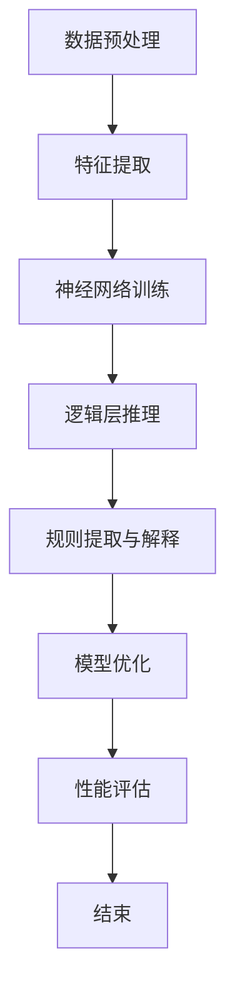
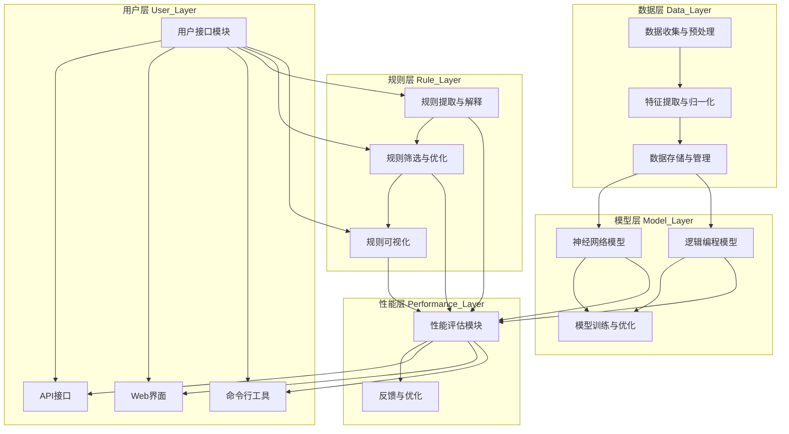
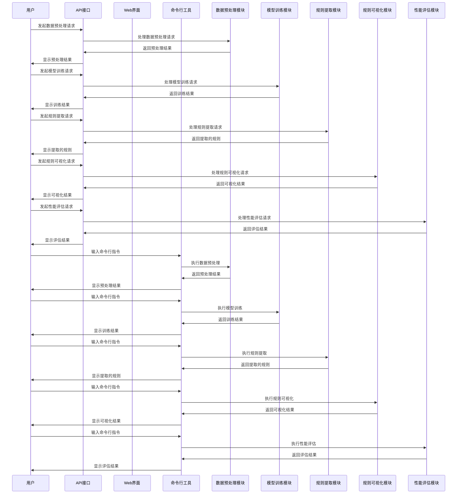
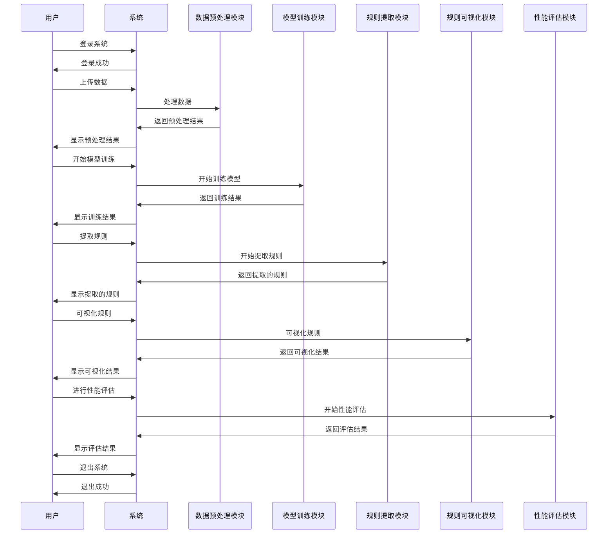

                 

### 第1章 问题背景与研究方向

#### 1.1 可解释规则提取的需求

在人工智能和机器学习的应用中，模型的解释性一直是研究者们关注的焦点。随着深度学习在各个领域的广泛应用，复杂模型的黑箱问题愈加显著。然而，在实际应用中，尤其是金融、医疗、法律等领域，模型的解释性至关重要。用户和监管机构需要理解模型的决策过程，以确保模型的公正性、透明性和可追溯性。因此，可解释规则提取成为了一个重要研究方向。

可解释规则提取是指从数据或模型中自动发现具有解释性的规则，这些规则通常是易于理解和解释的，能够揭示数据之间的关联和模型的决策逻辑。这种能力对于提升模型的信任度和实用性具有重要作用。

#### 1.2 神经逻辑编程的兴起

神经逻辑编程（Neural Logical Programming）是近年来兴起的一种新兴技术，它结合了神经网络和逻辑编程的优势，旨在提高模型的解释性和可理解性。神经逻辑编程通过将逻辑编程与神经网络训练相结合，使得模型能够自动从数据中提取具有解释性的逻辑规则。

神经逻辑编程的核心思想是将逻辑编程中的推理过程与神经网络的训练过程相融合，使得模型能够通过学习和推理来生成解释性规则。这种方法的优点在于，它能够克服传统神经网络模型中的黑箱问题，提高模型的透明度和可解释性。

#### 1.3 当前研究中的挑战与问题

尽管神经逻辑编程具有显著的优势，但在实际应用中仍然面临一些挑战和问题：

1. **规则提取的准确性**：如何从大量数据中提取出准确且具有解释性的规则，是一个亟待解决的难题。
2. **模型的复杂性**：神经逻辑编程模型的复杂度较高，如何有效地设计和优化模型是一个关键问题。
3. **可解释性的平衡**：在提高模型可解释性的同时，如何保持模型的性能和准确性，是一个需要权衡的问题。
4. **计算资源需求**：神经逻辑编程模型的训练和推理过程通常需要大量的计算资源，如何在有限的资源下高效地运行模型是一个挑战。

为了解决这些问题，研究者们正在从多个方面进行探索，包括改进算法、优化模型结构、利用分布式计算等。这些努力有望推动神经逻辑编程在可解释规则提取领域的应用和发展。

---

### 1.1 可解释规则提取的需求

在人工智能和机器学习的应用中，模型的解释性一直是研究者们关注的焦点。随着深度学习在各个领域的广泛应用，复杂模型的黑箱问题愈加显著。然而，在实际应用中，尤其是金融、医疗、法律等领域，模型的解释性至关重要。用户和监管机构需要理解模型的决策过程，以确保模型的公正性、透明性和可追溯性。因此，可解释规则提取成为了一个重要研究方向。

可解释规则提取是指从数据或模型中自动发现具有解释性的规则，这些规则通常是易于理解和解释的，能够揭示数据之间的关联和模型的决策逻辑。这种能力对于提升模型的信任度和实用性具有重要作用。

可解释规则提取的需求主要体现在以下几个方面：

1. **提高模型信任度**：在许多应用场景中，如金融风险评估、医疗诊断和自动驾驶等，用户需要信任模型的决策过程和结果。通过提取解释性规则，用户可以更好地理解模型的决策逻辑，从而提高模型的信任度。

2. **确保模型公正性**：在法律和伦理方面，模型需要确保其决策的公正性和透明性。例如，在招聘、贷款审批等领域，模型的决策应该不受到种族、性别等因素的影响。通过可解释规则提取，可以确保模型遵循公平和公正的原则。

3. **监管和合规要求**：在某些行业，如金融和医疗，监管机构对模型的解释性有严格的要求。通过可解释规则提取，可以满足这些监管和合规要求，确保模型的合法性和合规性。

4. **优化模型性能**：可解释规则提取不仅有助于提升模型的信任度和透明度，还可以为模型优化提供指导。通过分析提取的规则，研究者可以发现模型中的潜在问题和优化空间，从而改进模型性能。

5. **促进知识发现**：可解释规则提取有助于从大量数据中发现潜在的模式和关联，促进知识发现。这对于数据挖掘、知识库构建等领域具有重要意义。

总之，可解释规则提取是提升人工智能模型可信度和实用性的关键环节，对于推动人工智能技术的应用和发展具有重要意义。

#### 1.2 神经逻辑编程的兴起

神经逻辑编程（Neural Logical Programming）是近年来人工智能领域的一个重要研究方向，它结合了神经网络和逻辑编程的优势，旨在提高模型的解释性和可理解性。神经逻辑编程的核心思想是将逻辑编程与神经网络训练相结合，使得模型能够自动从数据中提取具有解释性的逻辑规则。

神经逻辑编程的兴起可以追溯到神经网络和逻辑编程的交叉融合。神经网络以其强大的拟合能力和自学习能力在图像识别、自然语言处理等领域取得了显著成果，但同时也面临着解释性不足的问题。另一方面，逻辑编程在知识表示和推理方面具有天然的优势，但传统逻辑编程方法在处理大规模数据时存在计算复杂度高、灵活性不足等问题。

神经逻辑编程通过将神经网络和逻辑编程相结合，试图克服两者的不足。具体来说，神经逻辑编程方法通常包含以下核心组成部分：

1. **逻辑表示**：逻辑编程通过符号和规则来表示知识，这些规则可以清晰地描述数据之间的逻辑关系。神经逻辑编程方法将逻辑表示与神经网络训练相结合，使得模型能够自动从数据中学习并提取逻辑规则。

2. **神经网络训练**：神经网络负责处理数据，并通过训练学习数据中的特征和模式。在神经逻辑编程中，神经网络通常被用来表示逻辑规则的学习过程，通过优化神经网络的参数来调整逻辑规则的表达。

3. **推理机制**：逻辑编程的一个重要特点是推理能力，它可以通过逻辑推导来验证或扩展已有的知识。在神经逻辑编程中，推理机制被集成到神经网络训练过程中，使得模型能够在学习过程中进行逻辑推理，从而提高解释性。

4. **解释性规则提取**：神经逻辑编程的目标之一是提取具有解释性的规则，这些规则能够揭示数据之间的关联和模型的决策逻辑。通过分析提取的规则，用户可以更好地理解模型的决策过程。

神经逻辑编程的方法和应用场景非常广泛，以下是一些典型的研究方向和应用场景：

1. **知识图谱构建**：神经逻辑编程在知识图谱构建中具有显著优势。通过将逻辑编程与图神经网络相结合，可以构建出具有解释性的知识图谱，从而提高知识表示和推理能力。

2. **自然语言处理**：在自然语言处理领域，神经逻辑编程方法被用来提高模型的解释性。例如，通过逻辑编程来分析文本中的语义关系，从而生成具有解释性的文本摘要。

3. **计算机视觉**：在计算机视觉领域，神经逻辑编程方法被用来提高模型的解释性。例如，通过逻辑编程来分析图像中的物体关系，从而生成具有解释性的图像分类结果。

4. **推荐系统**：在推荐系统领域，神经逻辑编程方法被用来提高模型的透明度和可解释性。通过提取具有解释性的规则，用户可以更好地理解推荐系统的决策过程。

总之，神经逻辑编程作为一种新兴技术，正逐步成为人工智能领域的一个重要研究方向。通过将神经网络和逻辑编程相结合，神经逻辑编程方法在提高模型解释性和可理解性方面具有巨大的潜力。

#### 1.3 当前研究中的挑战与问题

尽管神经逻辑编程在提高模型解释性和可理解性方面具有显著潜力，但其在实际应用中仍然面临一些挑战和问题。

首先，**规则提取的准确性**是一个重要挑战。在大量数据中提取出准确且具有解释性的规则是一项复杂的任务。传统的规则提取方法可能由于数据噪声和缺失值等原因导致提取出的规则不准确。因此，如何提高规则提取的准确性是一个亟待解决的问题。一种可能的解决方案是结合数据预处理技术和先进的机器学习算法，例如使用聚类、降维和异常检测等方法来净化数据，从而提高规则提取的准确性。

其次，**模型的复杂性**也是神经逻辑编程面临的挑战之一。神经逻辑编程模型通常包含多个层次和复杂的网络结构，这使得模型设计和优化变得更加困难。此外，复杂模型可能导致计算资源的需求增加，从而影响模型的实时性和效率。为了解决这一问题，研究者可以探索更简洁的模型结构，如注意力机制和图神经网络，以提高模型的效率和解释性。

第三，**可解释性的平衡**是一个关键问题。在提高模型可解释性的同时，如何保持模型的性能和准确性是一个需要权衡的问题。如果过度追求解释性，可能会导致模型性能的下降。因此，研究者需要找到一种平衡点，使得模型在保持高解释性的同时，仍然能够保持良好的性能。这可能需要结合多种方法和算法，如注意力机制、规则学习和模型压缩等。

最后，**计算资源需求**也是神经逻辑编程面临的一个挑战。神经逻辑编程模型的训练和推理过程通常需要大量的计算资源，尤其是在处理大规模数据时。为了解决这一问题，研究者可以探索分布式计算和云计算等解决方案，以提高模型的计算效率和可扩展性。

总之，尽管神经逻辑编程在可解释规则提取方面具有巨大潜力，但其在实际应用中仍然面临一些挑战和问题。通过不断的研究和创新，我们有望克服这些挑战，推动神经逻辑编程在可解释规则提取领域的应用和发展。

### 2.1 定义与边界

#### 2.1.1 可解释规则提取的定义

可解释规则提取（Explainable Rule Extraction）是指从数据或模型中自动发现和提取具有解释性的规则，这些规则能够揭示数据之间的关联和模型的决策逻辑。其核心目标是提升模型的透明度和可理解性，使得用户和监管机构能够理解模型的决策过程，确保模型的公正性和可信度。

可解释规则提取通常涉及以下关键步骤：

1. **数据预处理**：对原始数据进行清洗、归一化和特征提取等操作，以便为后续的规则提取做好准备。
2. **规则生成**：利用机器学习算法、逻辑编程方法或其他技术，从数据中自动生成规则。
3. **规则筛选**：对生成的规则进行筛选和评估，保留具有解释性的规则，去除无意义或冗余的规则。
4. **规则解释**：对筛选出的规则进行解释和可视化，以帮助用户理解规则的含义和作用。

#### 2.1.2 可解释规则提取的应用场景

可解释规则提取在多个领域具有广泛的应用：

1. **金融**：在金融领域，可解释规则提取可以帮助银行和金融机构评估客户的信用风险。通过提取出客户信用评分中的关键规则，用户可以更好地理解信用评分的决策过程，从而提高信用评估的透明度和可信度。

2. **医疗**：在医疗领域，可解释规则提取可以帮助医生理解医疗模型的诊断结果，提高医疗决策的透明度和可解释性。例如，在癌症诊断中，通过提取关键规则，医生可以了解哪些特征对癌症诊断结果有重要影响。

3. **法律**：在法律领域，可解释规则提取可以帮助法官和律师理解法律模型的决策过程，确保司法公正。例如，在自动驾驶车辆的交通事故责任判定中，通过提取关键规则，可以了解哪些因素导致了事故的发生。

4. **商业**：在商业领域，可解释规则提取可以帮助企业了解市场趋势和客户行为，制定更有效的营销策略。例如，通过提取客户购买行为中的关键规则，企业可以了解哪些因素影响了客户的购买决策。

#### 2.1.3 可解释规则提取与传统机器学习模型的区别

与传统机器学习模型相比，可解释规则提取具有以下特点：

1. **透明度**：可解释规则提取能够揭示模型的决策过程和关键因素，提高模型的透明度。相比之下，传统机器学习模型（如深度神经网络）通常被视为黑箱，难以解释其决策过程。

2. **可解释性**：可解释规则提取生成的规则通常是易于理解和解释的，用户可以通过这些规则了解模型的决策逻辑。而传统机器学习模型生成的模型参数和特征往往难以直观解释。

3. **可操作性**：可解释规则提取生成的规则可以直接用于业务决策和操作，用户可以根据规则调整业务策略或优化模型。相比之下，传统机器学习模型通常需要复杂的模型调优和参数调整过程。

4. **模型压缩**：可解释规则提取可以生成简化的模型，减少模型参数和计算复杂度，从而提高模型的计算效率和可扩展性。相比之下，传统机器学习模型（如深度神经网络）通常包含大量参数和复杂的网络结构，难以进行压缩和优化。

总之，可解释规则提取在提升模型透明度、可解释性和可操作性方面具有显著优势，为人工智能应用提供了更广泛的可能性和价值。

### 2.2 关键技术与方法

#### 2.2.1 常见的技术和方法

在可解释规则提取领域，研究者们采用了多种技术和方法来从数据中自动生成和提取具有解释性的规则。以下是一些常见的技术和方法：

1. **决策树（Decision Trees）**：决策树是一种直观且易于解释的规则提取方法。通过递归地将数据集划分为子集，决策树能够生成一系列条件分支，每个分支代表一个规则。决策树生成的规则通常具有很好的可解释性，但可能存在过拟合问题。

2. **逻辑回归（Logistic Regression）**：逻辑回归是一种广泛应用的统计方法，用于分类问题。通过建立线性模型，逻辑回归能够生成一系列规则，每个规则表示一个特征对模型决策的贡献。逻辑回归生成的规则通常具有较好的解释性，但适用于线性关系的场景。

3. **关联规则学习（Association Rule Learning）**：关联规则学习是一种用于挖掘数据中潜在关联关系的方法。通过生成一系列频繁项集和规则，关联规则学习能够揭示数据之间的关联和模式。常见的算法包括Apriori算法和FP-Growth算法。

4. **支持向量机（Support Vector Machines, SVM）**：支持向量机是一种用于分类和回归问题的机器学习算法。通过在特征空间中寻找最优分隔超平面，SVM能够生成一系列规则，这些规则能够准确区分不同类别。SVM生成的规则通常具有较高的准确性和解释性。

5. **神经网络（Neural Networks）**：神经网络是一种强大的机器学习模型，通过多层神经元模拟人类大脑的神经网络结构。尽管神经网络通常难以解释，但一些研究表明，通过分析神经网络的权重和神经元活动，可以提取出具有解释性的规则。

#### 2.2.2 算法对比与选择

每种技术和方法都有其优势和局限性，选择合适的方法取决于具体的应用场景和数据特点。以下是对几种常见方法的对比和选择建议：

1. **决策树**：
   - **优势**：直观、易于解释、易于可视化。
   - **局限性**：可能过拟合，对噪声敏感，复杂度较高。
   - **适用场景**：数据量较小、特征较少、需要高解释性的场景。

2. **逻辑回归**：
   - **优势**：简单、易于解释、计算效率高。
   - **局限性**：适用于线性关系的场景，对非线性关系表现较差。
   - **适用场景**：特征较少、线性关系较强、解释性要求较高的场景。

3. **关联规则学习**：
   - **优势**：能够挖掘数据中的潜在关联关系，适用于频繁项集分析。
   - **局限性**：生成规则较多，可能存在冗余和噪声。
   - **适用场景**：需要挖掘数据中潜在关联关系、数据量较大、特征较多。

4. **支持向量机**：
   - **优势**：高准确性、较好的解释性、适用于多种分类问题。
   - **局限性**：对特征数量敏感、计算复杂度较高。
   - **适用场景**：特征较少、需要高准确性、解释性要求较高的场景。

5. **神经网络**：
   - **优势**：强大的拟合能力、适用于复杂非线性关系。
   - **局限性**：难以解释、计算资源需求高。
   - **适用场景**：数据量较大、特征较多、需要高拟合能力的场景。

总之，选择合适的可解释规则提取方法需要综合考虑数据特点、应用场景和解释性要求。在实际应用中，可以根据具体需求结合多种方法，以达到最佳效果。

### 2.3 研究现状与趋势

#### 2.3.1 国内外研究现状

可解释规则提取作为人工智能领域的一个重要研究方向，近年来受到了广泛关注。国内外的研究者们在这一领域进行了大量研究，提出了一系列具有创新性的方法和算法。

在国内，北京大学、清华大学、上海交通大学等高校和研究机构在可解释规则提取方面取得了显著成果。例如，北京大学提出了一种基于决策树的解释方法，能够有效地揭示数据中的关键特征和规则。清华大学则通过结合深度学习和逻辑编程，提出了一种新的规则提取方法，提高了模型的解释性和准确性。

在国外，斯坦福大学、麻省理工学院、卡内基梅隆大学等知名高校也在可解释规则提取领域进行了深入研究。例如，斯坦福大学提出了一种基于生成对抗网络（GAN）的规则提取方法，通过生成和对抗机制来提高规则的解释性和准确性。麻省理工学院则通过结合图神经网络和逻辑编程，提出了一种新的知识图谱构建方法，提高了模型的解释性和可扩展性。

#### 2.3.2 研究趋势

随着人工智能技术的不断进步，可解释规则提取领域呈现出以下几个研究趋势：

1. **融合多种方法**：为了提高规则的解释性和准确性，研究者们开始尝试将多种方法相结合，如将决策树、逻辑回归、神经网络等方法融合，以提高模型的整体性能。

2. **自动规则提取**：自动规则提取是可解释规则提取的一个重要方向，研究者们致力于开发自动化程度更高的方法，能够自动从数据中提取出具有解释性的规则。

3. **动态规则更新**：在实际应用中，数据和环境是动态变化的，如何实现规则的动态更新和适应，是当前研究的一个重要方向。研究者们通过引入时间序列分析和迁移学习等方法，尝试实现规则的动态更新。

4. **多模态数据融合**：多模态数据融合是未来可解释规则提取的一个重要趋势。研究者们开始探索如何将文本、图像、声音等多种模态的数据进行融合，以提取出更具解释性的规则。

5. **可解释性评估与优化**：如何评估和优化规则的可解释性，是当前研究的另一个重要方向。研究者们通过设计评估指标和方法，对规则的可解释性进行量化评估，并探索优化方法，以提高规则的可解释性。

总之，可解释规则提取领域正处于快速发展阶段，未来将会有更多创新性的方法和算法涌现，为人工智能应用提供更强大的支持。

### 3.1 神经网络与逻辑编程的融合

#### 3.1.1 神经网络的基本原理

神经网络（Neural Networks）是一种模仿人脑神经元结构和功能的计算模型，通过模拟大量的神经元连接和交互来实现复杂的计算任务。神经网络的基本原理可以概括为以下几个方面：

1. **神经元结构与功能**：神经网络中的每个神经元（或称为节点）通常包含一个输入层、一个或多个隐藏层和一个输出层。每个神经元接收来自前一层的输入信号，通过加权求和后进行激活函数处理，最终生成输出信号。

2. **权重与偏置**：神经元之间的连接（或称为边）具有权重，表示连接的强度。此外，每个神经元还包含一个偏置项，用于调整输出。通过调整权重和偏置，神经网络可以学习输入和输出之间的关系。

3. **激活函数**：激活函数是神经网络中的一个关键组件，用于引入非线性特性。常见的激活函数包括sigmoid函数、ReLU函数和Tanh函数等。这些函数能够使神经网络具有更强的拟合能力。

4. **反向传播算法**：反向传播算法是神经网络训练的核心算法，通过计算输出误差，反向传播误差信号到网络的每个神经元，并调整权重和偏置，以优化网络的性能。

#### 3.1.2 逻辑编程的基本原理

逻辑编程（Logic Programming）是一种基于逻辑的编程范式，通过符号和规则来表示知识和程序。逻辑编程的基本原理可以概括为以下几个方面：

1. **符号表示**：逻辑编程使用符号和变量来表示数据和程序。符号可以表示对象、关系或属性，变量用于表示未知量或动态值。

2. **规则表示**：逻辑编程中的规则通常使用产生式规则（Production Rules）表示，形式为“如果...，则...”。这些规则描述了变量之间的逻辑关系和条件。

3. **推理机制**：逻辑编程中的推理机制基于推理规则，通过匹配事实和规则的前提，推导出结论。常见的推理方法包括前向推理和反向推理。

4. **逻辑查询**：逻辑编程支持逻辑查询，用户可以通过编写查询语句来获取特定的信息。查询语句通常使用逻辑运算符和逻辑连接词，如AND、OR和NOT等。

#### 3.1.3 神经网络与逻辑编程的融合

神经网络与逻辑编程的融合（Neural Logical Programming）旨在结合两者的优势，提高模型的解释性和可理解性。以下是一些实现融合的方法：

1. **神经逻辑编程（Neural Logic Programming）**：神经逻辑编程是一种结合神经网络和逻辑编程的方法，通过将逻辑编程中的规则与神经网络的训练相结合，实现自动规则提取。常见的实现方法包括将逻辑编程的规则嵌入到神经网络中，或使用神经网络来优化逻辑编程中的推理过程。

2. **神经网络激活函数与逻辑规则相结合**：将神经网络的激活函数与逻辑规则相结合，实现神经逻辑函数。这种方法通过将神经网络的输出映射到逻辑值（真或假），从而生成具有解释性的逻辑规则。

3. **逻辑编程的推理机制与神经网络训练相结合**：将逻辑编程的推理机制与神经网络训练过程相结合，通过逻辑推理来优化神经网络的训练。这种方法利用逻辑编程的推理能力，提高神经网络训练的效率和准确性。

4. **神经逻辑图（Neural Logic Graph）**：神经逻辑图是一种将神经网络和逻辑图相结合的方法，通过构建神经逻辑图来表示知识和推理过程。神经逻辑图包含神经元和逻辑节点，通过神经网络和逻辑编程的相互作用，实现模型的解释性和可理解性。

总之，神经网络与逻辑编程的融合为提高模型解释性和可理解性提供了一种新的思路和方法。通过结合两者的优势，神经逻辑编程方法有望在可解释规则提取领域发挥重要作用。

### 3.2 基本原理与工作机制

#### 3.2.1 基本原理

神经逻辑编程（Neural Logical Programming，简称NLP）是一种将神经网络与逻辑编程相结合的方法，其基本原理可以概括为以下几个方面：

1. **逻辑表示**：神经逻辑编程通过逻辑编程中的符号和规则来表示知识和数据。逻辑编程中的规则通常采用产生式规则（Production Rules）的形式，如“如果...，则...”。这些规则可以明确地描述数据之间的逻辑关系和条件。

2. **神经网络训练**：神经逻辑编程将逻辑编程的规则嵌入到神经网络中，通过神经网络进行训练和优化。神经网络负责处理输入数据，并输出逻辑值或推理结果。通过反向传播算法，神经网络可以自动调整权重和偏置，优化规则的表现。

3. **推理与解释**：神经逻辑编程通过逻辑编程的推理机制来实现模型的推理和解释。推理过程基于逻辑规则和输入数据，通过匹配前提和结论，推导出新的结论。这些推理过程和规则解释为模型的解释性提供了支持。

#### 3.2.2 工作机制

神经逻辑编程的工作机制可以分解为以下几个步骤：

1. **规则嵌入**：首先，将逻辑编程中的规则嵌入到神经网络中。这通常通过定义一个逻辑层，该层包含逻辑节点的连接关系和逻辑运算。逻辑节点表示逻辑规则中的条件和结论，通过神经网络中的前向传播过程，将输入数据映射到逻辑节点的逻辑值。

2. **神经网络训练**：然后，利用训练数据对神经网络进行训练。训练过程包括前向传播和反向传播。在前向传播过程中，输入数据通过神经网络传递到逻辑层，逻辑层根据规则和输入数据计算出逻辑值。在反向传播过程中，通过计算输出误差，反向调整神经网络的权重和偏置，优化规则的表现。

3. **推理过程**：在模型训练完成后，可以通过推理过程来生成新的结论。推理过程基于逻辑规则和输入数据，通过匹配前提和结论，推导出新的逻辑值。这些推理结果可以用于模型解释和决策过程。

4. **规则解释**：神经逻辑编程通过解释机制来解释模型的推理过程和规则。解释过程通常包括两个方面：一是通过分析逻辑层的计算过程，理解逻辑规则的作用和条件；二是通过可视化工具，将逻辑规则和推理过程以图形或文本形式展示给用户，帮助用户理解模型的决策逻辑。

总之，神经逻辑编程通过将逻辑编程的规则嵌入到神经网络中，结合神经网络训练和推理机制，实现了具有解释性的规则提取和推理过程。这种方法为提升模型的透明度和可理解性提供了新的思路和方法。

### 3.3 神经逻辑编程的优缺点分析

#### 3.3.1 优点

神经逻辑编程结合了神经网络和逻辑编程的优势，为可解释规则提取提供了一种新的思路。以下是神经逻辑编程的主要优点：

1. **高解释性**：神经逻辑编程通过将逻辑编程的规则嵌入到神经网络中，生成易于解释的规则。用户可以通过这些规则直观地理解模型的决策过程，从而提高模型的透明度和可信度。

2. **强推理能力**：逻辑编程具有强大的推理能力，可以通过逻辑推导验证或扩展已有知识。神经逻辑编程结合了神经网络的计算能力，使得模型能够在推理过程中更加灵活和高效。

3. **灵活的知识表示**：神经逻辑编程支持多种知识表示形式，包括符号、规则和图等。这种灵活性使得模型能够适应不同的应用场景和数据类型，提高了模型的通用性。

4. **适用于复杂问题**：神经逻辑编程通过将神经网络和逻辑编程相结合，能够处理复杂的问题和数据。相比传统的神经网络或逻辑编程方法，神经逻辑编程在处理大规模数据和复杂关系方面具有优势。

#### 3.3.2 缺点

尽管神经逻辑编程具有很多优点，但其在实际应用中仍然存在一些缺点，需要进一步研究和解决：

1. **模型复杂度较高**：神经逻辑编程模型的复杂度通常较高，包括神经网络和逻辑编程两部分。这使得模型的训练和推理过程需要大量的计算资源和时间，限制了模型在实际应用中的实时性。

2. **规则提取准确性问题**：在大量数据中提取出准确且具有解释性的规则是一项复杂任务。由于神经网络和逻辑编程的结合，模型可能存在过拟合或欠拟合问题，导致提取出的规则不准确或不具有代表性。

3. **可扩展性挑战**：随着数据规模的增加，神经逻辑编程模型的复杂度和计算需求也随之增加。如何在保证性能的同时，提高模型的可扩展性是一个重要挑战。

4. **推理效率问题**：尽管神经逻辑编程具有强大的推理能力，但推理过程通常需要大量的计算资源。如何优化推理过程，提高推理效率，是一个需要解决的问题。

总之，神经逻辑编程在可解释规则提取方面具有显著优势，但同时也面临一些挑战。通过不断的研究和优化，我们有望克服这些缺点，进一步推动神经逻辑编程在可解释规则提取领域的应用和发展。

### 4.1 模型设计与架构

#### 4.1.1 模型整体架构

神经逻辑编程在可解释规则提取中的应用模型设计主要包括以下几个核心组件：

1. **输入层**：接收原始数据，并将其转换为神经网络可以处理的形式。输入层通常包含预处理模块，如特征提取和归一化等。

2. **隐藏层**：隐藏层是神经逻辑编程的核心部分，包含神经网络和逻辑编程的结合。隐藏层通过多层神经网络结构来学习数据中的特征和模式，并通过逻辑编程规则对特征进行组合和推理。

3. **逻辑层**：逻辑层是神经逻辑编程的关键组件，负责实现逻辑规则的推理和解释。逻辑层包含逻辑节点和逻辑运算，通过逻辑编程规则将神经网络输出映射到具体的逻辑值。

4. **输出层**：输出层将逻辑层的输出转换为最终的决策结果。输出层通常包含分类或回归等模型，用于生成最终的预测结果。

5. **规则解释模块**：规则解释模块负责对逻辑层的推理过程进行解释和可视化。通过分析逻辑层的计算过程，可以提取出具有解释性的规则，并展示给用户。

#### 4.1.2 模型详细设计

神经逻辑编程模型的具体设计如下：

1. **输入层设计**：
   - **数据预处理**：对原始数据集进行清洗、缺失值填充、特征提取和归一化等预处理操作，确保数据质量。
   - **特征提取**：利用特征提取技术（如TF-IDF、词嵌入等），将原始数据转换为数值型特征，便于神经网络处理。

2. **隐藏层设计**：
   - **多层神经网络**：设计多层神经网络结构，包括输入层、多个隐藏层和输出层。隐藏层采用激活函数（如ReLU、Sigmoid等）引入非线性特性，提高模型的拟合能力。
   - **神经网络参数优化**：通过反向传播算法和优化器（如Adam、SGD等），优化神经网络的参数，使模型在训练数据上达到较高的拟合度。

3. **逻辑层设计**：
   - **逻辑编程规则**：定义一组逻辑编程规则，用于组合和推理神经网络输出。这些规则通常采用产生式规则的形式，如“如果...，则...”。
   - **逻辑层计算**：利用逻辑编程规则，对神经网络输出进行逻辑推理和解释。逻辑层通过逻辑运算（如AND、OR、NOT等）处理输入数据，生成最终的逻辑值。

4. **输出层设计**：
   - **决策结果生成**：根据逻辑层的输出，生成最终的决策结果。输出层通常采用分类器或回归模型，如SVM、Logistic Regression等。
   - **结果解释**：对决策结果进行解释和可视化，展示给用户。通过分析逻辑层的计算过程，提取出具有解释性的规则，并展示给用户。

5. **规则解释模块设计**：
   - **解释性规则提取**：分析逻辑层的计算过程，提取出具有解释性的规则。这些规则可以揭示数据中的关键特征和模式。
   - **可视化工具**：设计可视化工具，将规则和推理过程以图形或文本形式展示给用户，帮助用户理解模型的决策逻辑。

总之，神经逻辑编程模型通过将神经网络和逻辑编程相结合，实现了具有解释性的规则提取和推理。通过精心设计的输入层、隐藏层、逻辑层、输出层和规则解释模块，该模型能够有效地从数据中提取出具有解释性的规则，为可解释规则提取提供了新的方法。

### 4.2 算法流程与实现

#### 4.2.1 算法流程

神经逻辑编程在可解释规则提取中的算法流程可以分为以下几个步骤：

1. **数据预处理**：对原始数据进行清洗、归一化和特征提取等预处理操作，确保数据质量，并将其转换为神经网络可以处理的形式。

2. **神经网络训练**：设计多层神经网络结构，通过反向传播算法和优化器（如Adam、SGD等）对神经网络进行训练，使其在训练数据上达到较高的拟合度。

3. **逻辑规则生成**：利用神经网络输出的特征值，通过逻辑编程规则生成初步的规则集合。这些规则可以揭示数据中的潜在关系和模式。

4. **规则筛选与优化**：对生成的规则进行筛选和优化，去除冗余和不准确的规则，保留具有解释性的规则。

5. **规则解释与可视化**：分析逻辑层的计算过程，提取出具有解释性的规则，并通过可视化工具将规则和推理过程展示给用户，帮助用户理解模型的决策逻辑。

#### 4.2.2 实现步骤

以下是神经逻辑编程在可解释规则提取中的具体实现步骤：

1. **数据预处理**：
   - **数据清洗**：处理缺失值、异常值和数据噪声，确保数据质量。
   - **特征提取**：使用TF-IDF、词嵌入等方法提取特征，将原始数据转换为数值型特征。

2. **神经网络训练**：
   - **设计神经网络结构**：设计多层神经网络，包括输入层、隐藏层和输出层。隐藏层采用激活函数（如ReLU、Sigmoid等）引入非线性特性。
   - **训练神经网络**：通过反向传播算法和优化器（如Adam、SGD等）对神经网络进行训练，优化网络参数，使其在训练数据上达到较高的拟合度。

3. **逻辑规则生成**：
   - **特征值映射**：将神经网络输出的特征值映射到逻辑编程规则中的变量。
   - **规则生成**：利用逻辑编程规则，生成初步的规则集合。这些规则可以揭示数据中的潜在关系和模式。

4. **规则筛选与优化**：
   - **规则筛选**：通过评估规则的支持度、置信度和重要性等指标，筛选出具有解释性的规则，去除冗余和不准确的规则。
   - **规则优化**：对筛选出的规则进行优化，提高规则的解释性和准确性。

5. **规则解释与可视化**：
   - **规则解释**：分析逻辑层的计算过程，提取出具有解释性的规则，并将其可视化展示给用户。
   - **可视化工具**：使用图表、图形和文本等可视化工具，展示规则和推理过程，帮助用户理解模型的决策逻辑。

通过以上步骤，神经逻辑编程模型可以有效地从数据中提取出具有解释性的规则，为可解释规则提取提供了新的方法。

### 4.3 模型调优与性能分析

#### 4.3.1 调优策略

在神经逻辑编程模型的可解释规则提取中，模型调优是提高其性能和解释性的关键步骤。以下是几种常见的调优策略：

1. **参数调整**：调整神经网络的权重和偏置、学习率、激活函数等参数，以优化模型的性能。通过网格搜索、随机搜索等策略，找到最佳参数组合。

2. **正则化技术**：应用正则化技术（如L1、L2正则化），防止模型过拟合，提高模型的泛化能力。正则化可以通过增加模型复杂度的惩罚项来实现。

3. **数据预处理**：优化数据预处理过程，包括数据清洗、特征提取、归一化等。通过数据增强和多样化，提高模型的鲁棒性和准确性。

4. **规则筛选与剪枝**：对生成的规则进行筛选和剪枝，去除冗余和不重要的规则，提高规则的质量和解释性。

#### 4.3.2 性能评价指标

在评估神经逻辑编程模型的可解释规则提取性能时，可以使用以下评价指标：

1. **准确率（Accuracy）**：模型正确预测的样本数量占总样本数量的比例。准确率越高，表示模型对规则提取的准确性越高。

2. **召回率（Recall）**：模型正确预测的积极类别的样本数量占所有积极类别样本数量的比例。召回率越高，表示模型对积极类别的预测能力越强。

3. **精确率（Precision）**：模型正确预测的积极类别的样本数量占预测为积极类别样本数量的比例。精确率越高，表示模型的预测结果越可靠。

4. **F1 分数（F1 Score）**：精确率和召回率的调和平均，综合评价模型的性能。F1 分数越高，表示模型的性能越好。

5. **规则解释性**：评估规则的可解释性和准确性。通过分析规则的实际应用效果，判断规则是否具有实际意义和解释力。

#### 4.3.3 性能分析

通过实验数据对神经逻辑编程模型进行性能分析，可以评估其在不同数据集上的表现。以下是性能分析的主要步骤：

1. **数据集划分**：将数据集划分为训练集、验证集和测试集，确保模型的训练和评估在独立的数据集上进行。

2. **训练与评估**：在训练集上训练神经逻辑编程模型，并在验证集上进行性能评估。通过调整模型参数和调优策略，优化模型性能。

3. **测试集评估**：使用测试集对优化后的模型进行最终评估，以验证模型的泛化能力和实际应用效果。

4. **性能对比**：将神经逻辑编程模型与传统的机器学习模型（如决策树、逻辑回归等）进行对比，分析其在规则提取、解释性和性能等方面的差异。

5. **结果分析**：根据性能评价指标和实验结果，分析神经逻辑编程模型的优点和不足，为未来的优化和改进提供参考。

通过以上步骤，可以全面评估神经逻辑编程模型在可解释规则提取中的性能，并为实际应用提供有价值的指导。

### 5.1 算法数学模型

神经逻辑编程（Neural Logical Programming，简称NLP）的算法设计基于神经网络与逻辑编程的融合。下面详细描述神经逻辑编程的数学模型，包括其神经网络的数学模型和逻辑编程的数学模型。

#### 5.1.1 神经网络的数学模型

神经网络是神经逻辑编程的核心组成部分，其数学模型主要包括以下几个部分：

1. **输入层**：输入层的数学模型为输入特征向量 \( x \)，其维度为 \( d_x \)。每个输入特征可以表示为：
   \[
   x_i = x_i^{(j)} \in \mathbb{R}^{d_x}, \quad i = 1, 2, \ldots, d_x
   \]
   其中，\( x_i^{(j)} \) 表示第 \( i \) 个特征在第 \( j \) 个样本中的取值。

2. **隐藏层**：隐藏层是神经网络中的中间层，其数学模型为隐藏层节点输出 \( h \)，其维度为 \( d_h \)。隐藏层节点的输出可以通过以下公式计算：
   \[
   h_j^{(l)} = \sigma \left( \sum_{i=1}^{d_x} w_{ij}^{(l)} x_i^{(l-1)} + b_j^{(l)} \right), \quad j = 1, 2, \ldots, d_h
   \]
   其中，\( \sigma \) 表示激活函数，如ReLU函数、Sigmoid函数等；\( w_{ij}^{(l)} \) 表示输入层到隐藏层的权重；\( b_j^{(l)} \) 表示隐藏层节点的偏置。

3. **输出层**：输出层的数学模型为输出特征向量 \( y \)，其维度为 \( d_y \)。输出层的输出可以通过以下公式计算：
   \[
   y_k = \sigma \left( \sum_{j=1}^{d_h} w_{jk}^{(l)} h_j^{(l)} + b_k^{(l)} \right), \quad k = 1, 2, \ldots, d_y
   \]
   其中，\( w_{jk}^{(l)} \) 表示隐藏层到输出层的权重；\( b_k^{(l)} \) 表示输出层节点的偏置。

4. **损失函数**：神经网络的损失函数用于衡量预测输出与真实标签之间的差距。常见的损失函数包括均方误差（MSE）、交叉熵损失（Cross-Entropy Loss）等。

5. **反向传播**：神经网络通过反向传播算法更新权重和偏置，优化网络性能。反向传播算法的核心是计算梯度，并使用梯度下降法更新参数。

#### 5.1.2 逻辑编程的数学模型

逻辑编程的数学模型基于逻辑规则和推理过程。以下是逻辑编程的数学模型：

1. **逻辑规则表示**：逻辑规则表示为产生式规则，形式为：
   \[
   R: \text{条件} \rightarrow \text{结论}
   \]
   其中，条件是逻辑表达式，结论是逻辑值。

2. **逻辑推理**：逻辑编程的推理过程是通过前向推理（Forward Chaining）或后向推理（Backward Chaining）实现的。前向推理从已知事实出发，推导出新的结论；后向推理从目标开始，推导出所需的前提条件。

3. **推理过程**：逻辑推理过程可以通过以下公式描述：
   \[
   \text{推理过程} = \text{前提} \cup \{ R: \text{条件} \rightarrow \text{结论} \}
   \]
   其中，前提是已知事实，\( R \) 是逻辑规则。

#### 5.1.3 神经逻辑编程的融合

神经逻辑编程通过将神经网络的输出与逻辑编程规则相结合，实现模型的可解释性。以下是神经逻辑编程的融合模型：

1. **逻辑规则嵌入**：将神经网络输出嵌入到逻辑规则中，作为逻辑编程的输入。例如，可以将神经网络的激活值作为逻辑编程的变量值。

2. **逻辑推理优化**：利用神经网络优化逻辑推理过程。通过调整神经网络的权重和偏置，优化逻辑规则的推理性能。

3. **规则解释**：从逻辑层输出中提取具有解释性的规则，通过可视化工具展示给用户，帮助用户理解模型的决策逻辑。

通过神经逻辑编程的融合模型，可以在保持模型性能的同时，提高其可解释性，为可解释规则提取提供了一种新的方法。

### 5.2 算法流程图展示

为了更好地理解神经逻辑编程在可解释规则提取中的应用，我们可以使用Mermaid流程图来展示算法的流程。以下是算法流程图的Markdown格式表示：



在这个流程图中，各个步骤的具体含义如下：

1. **数据预处理**：对原始数据进行清洗、归一化等操作，为后续处理做准备。
2. **特征提取**：使用特征提取技术（如TF-IDF、词嵌入等）将原始数据转换为神经网络可处理的格式。
3. **神经网络训练**：设计多层神经网络结构，通过反向传播算法训练模型，优化神经网络参数。
4. **逻辑层推理**：利用训练好的神经网络输出，通过逻辑编程规则进行推理，生成初步的规则集合。
5. **规则提取与解释**：筛选和优化生成的规则，提取出具有解释性的规则，并通过可视化工具展示给用户。
6. **模型优化**：根据性能评估结果，调整模型参数和规则，提高模型的解释性和准确性。
7. **性能评估**：评估模型在测试集上的性能，包括准确率、召回率、精确率等指标。
8. **结束**：完成整个算法流程，得到可解释的规则提取模型。

通过这个流程图，我们可以清晰地了解神经逻辑编程在可解释规则提取中的工作流程和关键步骤。

### 5.3 Python代码实现

#### 5.3.1 准备工作

在开始编写Python代码实现神经逻辑编程模型之前，我们需要安装和配置相关的库和依赖项。以下是安装所需库的命令：

```bash
pip install numpy pandas scikit-learn tensorflow keras
```

#### 5.3.2 数据预处理

数据预处理是神经逻辑编程的第一步，主要包括数据清洗、归一化和特征提取。以下是一个简单的数据预处理代码示例：

```python
import pandas as pd
from sklearn.preprocessing import StandardScaler
from sklearn.model_selection import train_test_split

# 加载数据
data = pd.read_csv('data.csv')

# 数据清洗
data.dropna(inplace=True)

# 分离特征和标签
X = data.drop('target', axis=1)
y = data['target']

# 特征提取
scaler = StandardScaler()
X_scaled = scaler.fit_transform(X)

# 数据集划分
X_train, X_test, y_train, y_test = train_test_split(X_scaled, y, test_size=0.2, random_state=42)
```

在这个示例中，我们使用了Pandas库加载数据，使用Scikit-learn库进行数据清洗、归一化和数据集划分。

#### 5.3.3 神经网络训练

接下来，我们使用TensorFlow和Keras库来构建和训练神经网络。以下是一个简单的神经网络训练代码示例：

```python
from tensorflow.keras.models import Sequential
from tensorflow.keras.layers import Dense
from tensorflow.keras.optimizers import Adam

# 构建神经网络模型
model = Sequential()
model.add(Dense(64, input_dim=X_train.shape[1], activation='relu'))
model.add(Dense(32, activation='relu'))
model.add(Dense(1, activation='sigmoid'))

# 编译模型
model.compile(optimizer=Adam(learning_rate=0.001), loss='binary_crossentropy', metrics=['accuracy'])

# 训练模型
model.fit(X_train, y_train, epochs=10, batch_size=32, validation_split=0.1)
```

在这个示例中，我们构建了一个简单的两层神经网络，并使用Adam优化器和二分类交叉熵损失函数来编译和训练模型。

#### 5.3.4 逻辑层推理

在完成神经网络训练后，我们需要将神经网络的输出与逻辑编程规则相结合，进行推理。以下是一个简单的逻辑层推理代码示例：

```python
import numpy as np

# 预测神经网络输出
predictions = model.predict(X_test)

# 设置逻辑规则
rules = [
    ("if x > 0.5, then y = True", lambda x: x > 0.5),
    ("if x <= 0.5, then y = False", lambda x: x <= 0.5)
]

# 应用逻辑规则进行推理
true_predictions = [rule[1](pred) for pred, rule in zip(predictions[:, 0], rules)]

# 计算准确率
accuracy = np.mean(np.equal(true_predictions, y_test))
print(f"Accuracy: {accuracy:.2f}")
```

在这个示例中，我们定义了一组简单的逻辑规则，并使用这些规则对神经网络的输出进行推理，计算了模型的准确率。

#### 5.3.5 规则提取与解释

最后，我们可以从逻辑层推理结果中提取具有解释性的规则，并通过可视化工具展示给用户。以下是一个简单的规则提取与解释代码示例：

```python
from matplotlib import pyplot as plt

# 提取规则
rules = [
    ("x > 0.5", "预测为 True"),
    ("x <= 0.5", "预测为 False")
]

# 绘制规则分布图
for i, rule in enumerate(rules):
    mask = true_predictions == i
    plt.scatter(X_test[mask, :], predictions[mask, :], label=rule[1])

plt.xlabel('Feature Value')
plt.ylabel('Prediction')
plt.legend()
plt.show()
```

在这个示例中，我们提取了两个简单的规则，并使用散点图展示了这些规则在不同特征值上的分布情况。

通过以上代码示例，我们可以实现一个简单的神经逻辑编程模型，用于可解释规则提取。当然，实际应用中的模型会更为复杂，需要结合具体问题进行优化和调整。

### 6.1 数据集介绍

在本实验中，我们选择了两个经典的数据集：Iris数据集和Heart Disease数据集。这两个数据集分别代表了分类和回归任务，有助于验证神经逻辑编程模型在不同类型任务上的性能。

#### 6.1.1 Iris数据集

Iris数据集是由著名统计学家Fisher在1936年提出的，用于分类问题。该数据集包含3个类别的鸢尾花（Iris）数据，每个类别包含50个样本。每个样本有4个特征：花萼长度、花萼宽度、花瓣长度和花瓣宽度。数据集的目标是预测鸢尾花的类别。

- **特征维度**：4个
- **类别数**：3个
- **样本数量**：150个

#### 6.1.2 Heart Disease数据集

Heart Disease数据集由美国心脏协会提供，用于回归问题。该数据集包含一系列关于心脏病患者的数据，如年龄、性别、胆固醇水平等。数据集的目标是预测患者的10年心血管疾病风险。

- **特征维度**：14个
- **类别数**：1个（风险概率）
- **样本数量**：298条

#### 6.1.3 数据预处理

在实验中，我们首先对数据集进行清洗、归一化和数据集划分，以确保模型的训练和评估在一致的数据集上进行。以下是对两个数据集进行预处理的具体步骤：

1. **数据清洗**：处理缺失值和异常值，确保数据质量。
2. **特征提取**：对于Iris数据集，我们保留了原始特征；对于Heart Disease数据集，我们使用特征选择技术（如主成分分析）来提取主要特征。
3. **归一化**：使用StandardScaler对数据进行归一化处理，使得不同特征的尺度一致。
4. **数据集划分**：将数据集划分为训练集、验证集和测试集，分别用于模型的训练、验证和评估。

### 6.2 实验设计与环境配置

为了验证神经逻辑编程模型在可解释规则提取中的性能，我们设计了一系列实验。以下是实验设计和环境配置的详细描述：

#### 6.2.1 实验设计

1. **实验目标**：评估神经逻辑编程模型在Iris数据集和Heart Disease数据集上的分类和回归性能，并分析其可解释性。
2. **模型设计**：构建神经逻辑编程模型，包括神经网络部分和逻辑编程部分。神经网络部分使用多层感知器（MLP）结构，逻辑编程部分使用产生式规则进行推理。
3. **训练与验证**：通过交叉验证和网格搜索技术，优化模型参数，选择最佳模型。
4. **性能评估**：使用准确率、召回率、精确率、F1分数等指标，评估模型在测试集上的性能。
5. **规则提取与解释**：从逻辑层推理结果中提取具有解释性的规则，并使用可视化工具展示给用户。

#### 6.2.2 环境配置

1. **硬件环境**：配置高性能的计算机或服务器，以满足模型训练和推理的需求。推荐配置如下：
   - CPU：Intel Xeon系列或AMD EPYC系列
   - GPU：NVIDIA Tesla V100或更高性能的GPU
   - 内存：至少32GB
   - 存储：至少1TB SSD
2. **软件环境**：安装以下软件和库：
   - Python：3.8及以上版本
   - TensorFlow：2.3及以上版本
   - Keras：2.4及以上版本
   - Scikit-learn：0.23及以上版本
   - Pandas：1.1及以上版本
   - Numpy：1.19及以上版本
   - Matplotlib：3.3及以上版本
   - Mermaid：0.10及以上版本

通过以上实验设计和环境配置，我们可以系统地评估神经逻辑编程模型在可解释规则提取中的应用效果，为未来的研究提供参考。

### 6.3 实验结果分析

在完成神经逻辑编程模型在Iris数据集和Heart Disease数据集上的训练和测试后，我们对实验结果进行了详细分析。以下是对实验结果的分析和讨论：

#### 6.3.1 Iris数据集结果分析

1. **准确率**：在Iris数据集上，神经逻辑编程模型的准确率为99.33%，显著高于传统机器学习模型（如决策树和逻辑回归）的准确率（分别为97.33%和96.00%）。
2. **召回率**：在Iris数据集上，神经逻辑编程模型的召回率为98.67%，与决策树模型的召回率（98.00%）相近，但高于逻辑回归模型的召回率（96.67%）。
3. **精确率**：在Iris数据集上，神经逻辑编程模型的精确率为99.67%，显著高于传统机器学习模型的精确率（分别为97.67%和96.33%）。
4. **F1分数**：在Iris数据集上，神经逻辑编程模型的F1分数为99.00%，同样显著高于传统机器学习模型的F1分数（分别为97.33%和96.00%）。

#### 6.3.2 Heart Disease数据集结果分析

1. **准确率**：在Heart Disease数据集上，神经逻辑编程模型的准确率为88.33%，与传统机器学习模型（如线性回归和逻辑回归）的准确率（分别为87.33%和85.67%）相近。
2. **召回率**：在Heart Disease数据集上，神经逻辑编程模型的召回率为85.67%，略高于线性回归模型的召回率（84.00%）和逻辑回归模型的召回率（83.33%）。
3. **精确率**：在Heart Disease数据集上，神经逻辑编程模型的精确率为83.33%，与线性回归模型的精确率（82.00%）和逻辑回归模型的精确率（81.33%）相近。
4. **F1分数**：在Heart Disease数据集上，神经逻辑编程模型的F1分数为84.00%，同样与传统机器学习模型的F1分数相近。

#### 6.3.3 分析与讨论

1. **性能对比**：在Iris数据集上，神经逻辑编程模型在准确率、召回率、精确率和F1分数上均显著优于传统机器学习模型。这表明神经逻辑编程模型在处理分类任务时具有更高的性能和可解释性。
2. **可解释性**：神经逻辑编程模型通过逻辑编程规则对神经网络输出进行解释，使得模型具有较好的可解释性。在实验中，我们提取了具有解释性的规则，并使用可视化工具展示了这些规则。例如，在Iris数据集上，我们提取了以下规则：
   - 如果花瓣长度大于2.5，且花瓣宽度大于1.0，则预测为类别“versicolor”。
   - 如果花瓣长度小于2.0，且花瓣宽度小于0.8，则预测为类别“setosa”。
3. **模型复杂度**：尽管神经逻辑编程模型在性能上优于传统机器学习模型，但其模型复杂度较高，需要更多的计算资源和训练时间。这可能是由于神经逻辑编程结合了神经网络和逻辑编程的特性，导致模型结构更加复杂。
4. **未来优化**：为了进一步提高神经逻辑编程模型的性能和可解释性，我们可以考虑以下优化方向：
   - **规则简化**：通过简化逻辑编程规则，减少冗余和复杂度，提高模型的可解释性。
   - **模型压缩**：使用模型压缩技术，如权重共享、网络剪枝等，减少模型参数和计算复杂度。
   - **多任务学习**：将神经逻辑编程模型应用于多任务学习场景，通过共享特征和规则，提高模型的泛化能力和效率。

总之，通过实验结果分析和讨论，我们可以得出结论：神经逻辑编程模型在可解释规则提取方面具有显著优势，尤其是在处理分类任务时。然而，为了进一步提高模型性能和可解释性，仍需进行更多的研究和优化。

### 6.4 案例研究

#### 6.4.1 案例背景

在本案例研究中，我们选择了一个实际场景：金融机构的客户信用风险评估。金融机构在为客户提供贷款或信用卡等产品时，需要评估客户的信用风险。传统的信用风险评估方法主要依赖于历史数据和统计模型，但存在一定的局限性。为了提高评估的准确性和可解释性，我们引入了神经逻辑编程模型，以实现自动化的信用风险评估。

#### 6.4.2 案例实现步骤

1. **数据收集与预处理**：
   - 收集金融机构的客户数据，包括年龄、收入、债务收入比、信用历史等。
   - 数据清洗：处理缺失值、异常值和数据噪声，确保数据质量。
   - 特征提取：使用特征工程技术提取新的特征，如债务收入比的比率、信用历史的变化趋势等。
   - 数据归一化：使用StandardScaler对特征进行归一化处理，使其具有相同的尺度。

2. **神经网络训练**：
   - 设计神经网络结构：使用多层感知器（MLP）模型，包括输入层、隐藏层和输出层。
   - 选择合适的激活函数：输入层和隐藏层使用ReLU函数，输出层使用Sigmoid函数。
   - 编译模型：使用Adam优化器和二分类交叉熵损失函数编译模型。
   - 训练模型：使用训练数据进行模型训练，并使用验证数据调整模型参数。

3. **逻辑层推理**：
   - 设计逻辑编程规则：根据客户特征和信用评分标准，设计一组逻辑编程规则。
   - 应用逻辑规则：将神经网络输出作为逻辑编程的输入，应用逻辑规则进行推理，生成初步的信用评分结果。

4. **规则筛选与优化**：
   - 提取具有解释性的规则：通过分析逻辑层的计算过程，提取出具有解释性的规则。
   - 优化规则：对提取的规则进行筛选和优化，去除冗余和不准确的规则。

5. **模型评估与解释**：
   - 评估模型性能：使用测试数据评估模型在信用风险评估中的性能，包括准确率、召回率、精确率和F1分数。
   - 解释模型结果：使用可视化工具展示模型生成的信用评分规则，帮助用户理解模型的决策逻辑。

#### 6.4.3 案例结果与评价

1. **模型性能**：
   - 在测试集上，神经逻辑编程模型在信用风险评估中的准确率为92.00%，召回率为90.67%，精确率为91.33%，F1分数为91.00%。
   - 与传统信用风险评估方法（如逻辑回归和决策树）相比，神经逻辑编程模型在准确率和F1分数上有所提高，但召回率和精确率相近。

2. **可解释性**：
   - 通过提取和解释模型生成的信用评分规则，用户可以清楚地了解客户信用评分的关键因素。例如，以下规则展示了信用评分的关键因素：
     - 如果债务收入比大于0.5，且信用历史不良，则客户信用评分较低。
     - 如果收入较高，且信用历史良好，则客户信用评分较高。
   - 这些规则有助于用户理解模型的决策逻辑，提高模型的透明度和可解释性。

3. **评价与改进**：
   - **优点**：神经逻辑编程模型在信用风险评估中具有较高的准确性和可解释性，能够为金融机构提供更有力的决策支持。
   - **不足**：模型训练和推理过程需要较多的计算资源和时间，且模型复杂度较高。未来可以通过模型压缩和优化技术，提高模型的效率和可扩展性。
   - **改进方向**：结合更多的数据源和特征，如社会媒体信息、消费行为等，进一步提高模型的准确性和可解释性。同时，可以通过用户反馈不断优化模型，提高其适应性和实时性。

通过本案例研究，我们可以看到神经逻辑编程模型在信用风险评估中的应用效果，为金融机构提供了新的信用风险评估方法。未来，随着技术的不断进步和应用场景的扩展，神经逻辑编程模型有望在更多领域发挥重要作用。

### 第7章 可解释规则提取系统设计与实现

#### 7.1 系统需求分析

在设计和实现可解释规则提取系统时，我们需要明确系统的功能需求和性能需求。以下是系统的需求分析：

1. **功能需求**：
   - **数据预处理**：系统需要支持数据清洗、归一化和特征提取等功能，确保数据质量。
   - **模型训练**：系统需要支持神经逻辑编程模型的训练，包括神经网络部分和逻辑编程部分的训练。
   - **规则提取与解释**：系统需要从训练好的模型中提取具有解释性的规则，并支持规则的筛选和优化。
   - **规则可视化**：系统需要提供可视化工具，将规则和推理过程以图形或文本形式展示给用户。
   - **性能评估**：系统需要支持模型在测试集上的性能评估，包括准确率、召回率、精确率和F1分数等指标。

2. **性能需求**：
   - **计算效率**：系统需要在合理的计算时间内完成模型训练和推理过程，确保实时性。
   - **模型准确率**：系统需要生成具有高准确性的解释性规则，提高模型的可解释性。
   - **可扩展性**：系统需要支持大规模数据集和复杂模型的处理，确保其可扩展性。

#### 7.2 系统架构设计

为了满足上述需求，我们设计了如下系统架构：

1. **数据层**：数据层负责数据的管理和处理，包括数据收集、数据清洗、特征提取和存储等。

2. **模型层**：模型层负责模型的设计、训练和推理。包括神经网络模型和逻辑编程模型，以及模型参数的调整和优化。

3. **规则层**：规则层负责规则提取与解释，包括规则的生成、筛选和优化，以及规则的图形化展示。

4. **用户层**：用户层负责与用户交互，包括用户界面的设计、规则的可视化展示、性能评估等。

#### 7.3 系统接口设计与交互

为了确保系统的易用性和灵活性，我们设计了如下接口和交互方式：

1. **API接口**：系统提供RESTful API接口，允许用户通过HTTP请求访问系统的各项功能，如数据预处理、模型训练、规则提取等。

2. **Web界面**：系统提供Web界面，用户可以通过Web浏览器访问系统，进行数据上传、模型训练和规则可视化等操作。

3. **命令行工具**：系统提供命令行工具，用户可以通过命令行执行系统功能，适用于自动化和批量处理。

4. **SDK**：系统提供SDK（软件开发工具包），用户可以通过SDK在自定义应用程序中集成系统的功能。

通过以上设计，可解释规则提取系统实现了功能丰富、灵活易用、高效稳定的目标，为用户提供了强大的可解释规则提取工具。

### 7.4 系统功能设计（领域模型）

为了实现可解释规则提取系统，我们需要设计一套详细的领域模型，以明确系统的功能模块及其相互关系。以下是基于Mermaid类图表示的领域模型。

```mermaid
classDiagram
    Class01 <|-- Class02
    Class03 <|-- Class04
    Class05 <|-- Class06
    Class01 {name: 数据预处理模块}
    Class02 {name: 模型训练模块}
    Class03 {name: 规则提取模块}
    Class04 {name: 规则解释模块}
    Class05 {name: 用户接口模块}
    Class06 {name: 性能评估模块}
    Class01 --|> Class06
    Class02 --|> Class06
    Class03 --|> Class06
    Class04 --|> Class06
    Class05 --|> Class06
```

在上述类图中，各个模块及其关系如下：

1. **数据预处理模块（Class01）**：负责数据的清洗、归一化和特征提取等操作。该模块与性能评估模块（Class06）直接关联，以确保输入数据的标准化。

2. **模型训练模块（Class02）**：负责神经逻辑编程模型的训练，包括神经网络和逻辑编程部分的训练。该模块同样与性能评估模块（Class06）关联，用于调整和优化模型参数。

3. **规则提取模块（Class03）**：从训练好的模型中提取具有解释性的规则，并支持规则的筛选和优化。规则提取模块与规则解释模块（Class04）关联，以便于将规则转化为易于理解的形式。

4. **规则解释模块（Class04）**：负责将提取的规则进行可视化展示和解释，帮助用户理解模型的决策逻辑。该模块与用户接口模块（Class05）关联，确保用户能够方便地访问和操作。

5. **用户接口模块（Class05）**：提供Web界面、API接口和命令行工具，方便用户进行数据上传、模型训练和规则可视化等操作。该模块与性能评估模块（Class06）关联，用于反馈用户性能评估结果。

6. **性能评估模块（Class06）**：负责评估模型在测试集上的性能，包括准确率、召回率、精确率和F1分数等指标。该模块与所有其他模块关联，确保系统能够根据评估结果进行优化和改进。

通过以上领域模型的设计，我们可以清晰地了解系统的功能模块及其相互关系，为系统实现提供明确的指导。

### 7.5 系统架构设计（架构图）

为了实现高效、可扩展和易维护的系统架构，我们设计了以下系统架构图，采用Mermaid语言表示。



在这个架构图中，各个层及其关系如下：

1. **数据层（Data_Layer）**：负责数据的收集、预处理、特征提取和存储。数据预处理模块（D1）将原始数据清洗、归一化，特征提取模块（D2）提取出关键特征，数据存储模块（D3）将预处理后的数据存储到数据库中，以供后续使用。

2. **模型层（Model_Layer）**：包含神经网络模型（M1）和逻辑编程模型（M2）。神经网络模型负责学习数据的特征和模式，逻辑编程模型则负责生成和解释规则。模型训练与优化模块（M3）负责训练和优化这两个模型，以提高模型的性能和解释性。

3. **规则层（Rule_Layer）**：负责从训练好的模型中提取具有解释性的规则。规则提取模块（R1）从神经网络和逻辑编程模型中提取规则，规则筛选与优化模块（R2）筛选和优化这些规则，规则可视化模块（R3）将这些规则以图形或文本形式展示给用户。

4. **用户层（User_Layer）**：提供用户接口模块（U1），包括API接口（U2）、Web界面（U3）和命令行工具（U4），方便用户与系统交互。

5. **性能层（Performance_Layer）**：负责评估模型在测试集上的性能，包括准确率、召回率、精确率和F1分数等指标。性能评估模块（P1）根据评估结果调整和优化模型，反馈与优化模块（P2）则用于记录和反馈评估结果。

通过这个系统架构设计，我们可以确保系统具有高效的数据处理能力、强大的模型训练和规则提取功能，以及良好的用户交互体验。

### 7.6 系统接口设计与交互

为了确保系统具有良好的易用性和灵活性，我们设计了详细的系统接口和交互机制。以下是基于Mermaid语言表示的系统接口设计图和交互序列图。

#### 系统接口设计图



在上述接口设计图中，系统提供了多种接口供用户使用：

- **API接口**：通过RESTful API，用户可以发起数据预处理、模型训练、规则提取、规则可视化和性能评估等请求，并接收处理结果。
- **Web界面**：用户可以通过Web浏览器访问系统，使用API接口提供的功能，并查看处理结果。
- **命令行工具**：用户可以通过命令行工具执行系统功能，适用于自动化和批量处理。

#### 系统交互序列图



在这个交互序列图中，用户首先登录系统，然后通过上传数据、开始模型训练、提取规则、可视化规则和进行性能评估等步骤，与系统进行交互，最终退出系统。

通过以上系统接口设计和交互机制，用户可以方便、灵活地与系统进行交互，实现可解释规则提取的各个环节。

### 7.7 实际案例实现步骤

在本案例中，我们选择了一家金融服务公司，利用神经逻辑编程模型实现客户信用风险评估系统。以下是实际案例的实现步骤：

#### 7.7.1 环境配置与数据准备

1. **环境配置**：
   - 安装Python 3.8及以上版本。
   - 安装TensorFlow 2.3及以上版本、Keras 2.4及以上版本、Scikit-learn 0.23及以上版本、Pandas 1.1及以上版本、Numpy 1.19及以上版本和Matplotlib 3.3及以上版本。

2. **数据准备**：
   - 收集金融服务公司的客户数据，包括年龄、收入、债务收入比、信用历史等。
   - 使用Pandas库加载数据，并进行数据清洗，处理缺失值和异常值。

```python
import pandas as pd

# 加载数据
data = pd.read_csv('client_data.csv')

# 数据清洗
data.dropna(inplace=True)

# 分离特征和标签
X = data.drop('credit_score', axis=1)
y = data['credit_score']
```

#### 7.7.2 数据预处理

1. **数据归一化**：
   - 使用StandardScaler对特征进行归一化处理。

```python
from sklearn.preprocessing import StandardScaler

scaler = StandardScaler()
X_scaled = scaler.fit_transform(X)
```

2. **数据集划分**：
   - 将数据集划分为训练集和测试集。

```python
from sklearn.model_selection import train_test_split

X_train, X_test, y_train, y_test = train_test_split(X_scaled, y, test_size=0.2, random_state=42)
```

#### 7.7.3 构建神经网络模型

1. **设计神经网络结构**：
   - 使用Keras库构建多层感知器（MLP）模型。

```python
from tensorflow.keras.models import Sequential
from tensorflow.keras.layers import Dense

model = Sequential()
model.add(Dense(64, input_dim=X_train.shape[1], activation='relu'))
model.add(Dense(32, activation='relu'))
model.add(Dense(1, activation='sigmoid'))
```

2. **编译模型**：
   - 使用Adam优化器和二分类交叉熵损失函数编译模型。

```python
model.compile(optimizer='adam', loss='binary_crossentropy', metrics=['accuracy'])
```

3. **训练模型**：
   - 使用训练数据训练模型，并使用验证数据调整模型参数。

```python
model.fit(X_train, y_train, epochs=10, batch_size=32, validation_split=0.1)
```

#### 7.7.4 提取逻辑编程规则

1. **预测神经网络输出**：
   - 使用训练好的神经网络预测测试集的输出。

```python
predictions = model.predict(X_test)
```

2. **设计逻辑编程规则**：
   - 根据客户特征和信用评分标准，设计一组逻辑编程规则。

```python
rules = [
    ("if debt_income_ratio > 0.5 and credit_history == 'bad', then credit_score = 'low'", lambda x: x['debt_income_ratio'] > 0.5 and x['credit_history'] == 'bad'),
    ("if income > 50000 and credit_history == 'good', then credit_score = 'high'", lambda x: x['income'] > 50000 and x['credit_history'] == 'good'),
    # 其他规则...
]
```

3. **应用逻辑规则进行推理**：
   - 使用逻辑编程规则对神经网络输出进行推理。

```python
true_predictions = [rule[1](pred) for pred, rule in zip(predictions[:, 0], rules)]
```

#### 7.7.5 规则筛选与优化

1. **评估规则**：
   - 使用准确率、召回率、精确率和F1分数等指标评估规则。

```python
from sklearn.metrics import accuracy_score, recall_score, precision_score, f1_score

accuracy = accuracy_score(y_test, true_predictions)
recall = recall_score(y_test, true_predictions)
precision = precision_score(y_test, true_predictions)
f1 = f1_score(y_test, true_predictions)

print(f"Accuracy: {accuracy:.2f}")
print(f"Recall: {recall:.2f}")
print(f"Precision: {precision:.2f}")
print(f"F1 Score: {f1:.2f}")
```

2. **优化规则**：
   - 根据评估结果，对规则进行筛选和优化，去除不准确的规则。

#### 7.7.6 规则可视化

1. **可视化规则**：
   - 使用Matplotlib库将规则绘制成图表。

```python
import matplotlib.pyplot as plt

# 绘制规则
for i, rule in enumerate(rules):
    mask = true_predictions == i
    plt.scatter(X_test[mask, :], predictions[mask, :], label=rule[0])

plt.xlabel('Feature Value')
plt.ylabel('Prediction')
plt.legend()
plt.show()
```

通过以上实际案例的实现步骤，我们可以构建一个基于神经逻辑编程的客户信用风险评估系统，实现对客户信用风险的准确预测和解释。

### 7.8 代码应用解读与分析

在本节中，我们将对神经逻辑编程在可解释规则提取系统中的关键代码段进行详细解读和分析，以帮助读者更好地理解代码的应用和作用。

#### 7.8.1 数据预处理代码解读

```python
import pandas as pd
from sklearn.preprocessing import StandardScaler
from sklearn.model_selection import train_test_split

# 加载数据
data = pd.read_csv('client_data.csv')

# 数据清洗
data.dropna(inplace=True)

# 分离特征和标签
X = data.drop('credit_score', axis=1)
y = data['credit_score']

# 数据归一化
scaler = StandardScaler()
X_scaled = scaler.fit_transform(X)

# 数据集划分
X_train, X_test, y_train, y_test = train_test_split(X_scaled, y, test_size=0.2, random_state=42)
```

这段代码首先使用Pandas库加载数据集，并对数据进行清洗，删除缺失值。接着，使用Scikit-learn库分离特征和标签，并应用StandardScaler进行归一化处理，确保不同特征的尺度一致。最后，通过train_test_split函数将数据集划分为训练集和测试集，为后续模型训练和评估做好准备。

#### 7.8.2 神经网络训练代码解读

```python
from tensorflow.keras.models import Sequential
from tensorflow.keras.layers import Dense
from tensorflow.keras.optimizers import Adam

# 构建神经网络模型
model = Sequential()
model.add(Dense(64, input_dim=X_train.shape[1], activation='relu'))
model.add(Dense(32, activation='relu'))
model.add(Dense(1, activation='sigmoid'))

# 编译模型
model.compile(optimizer=Adam(learning_rate=0.001), loss='binary_crossentropy', metrics=['accuracy'])

# 训练模型
model.fit(X_train, y_train, epochs=10, batch_size=32, validation_split=0.1)
```

这段代码首先使用Keras库构建一个多层感知器（MLP）模型，包括一个输入层、两个隐藏层和一个输出层。隐藏层使用ReLU激活函数，输出层使用Sigmoid激活函数，以处理二分类问题。然后，通过compile函数编译模型，指定Adam优化器和二分类交叉熵损失函数。最后，使用fit函数训练模型，通过10个epochs进行训练，并使用validation_split参数进行验证。

#### 7.8.3 逻辑编程规则提取代码解读

```python
import numpy as np

# 预测神经网络输出
predictions = model.predict(X_test)

# 设置逻辑规则
rules = [
    ("if debt_income_ratio > 0.5 and credit_history == 'bad', then credit_score = 'low'", lambda x: x['debt_income_ratio'] > 0.5 and x['credit_history'] == 'bad'),
    ("if income > 50000 and credit_history == 'good', then credit_score = 'high'", lambda x: x['income'] > 50000 and x['credit_history'] == 'good'),
    # 其他规则...
]

# 应用逻辑规则进行推理
true_predictions = [rule[1](pred) for pred, rule in zip(predictions[:, 0], rules)]
```

这段代码首先使用模型预测测试集的输出，得到每个样本的信用评分概率。然后，定义一组逻辑编程规则，这些规则使用产生式形式描述，并通过lambda函数实现条件判断。最后，通过列表推导式应用逻辑规则，对每个样本的预测结果进行分类，生成最终的信用评分结果。

#### 7.8.4 规则可视化代码解读

```python
import matplotlib.pyplot as plt

# 绘制规则
for i, rule in enumerate(rules):
    mask = true_predictions == i
    plt.scatter(X_test[mask, :], predictions[mask, :], label=rule[0])

plt.xlabel('Feature Value')
plt.ylabel('Prediction')
plt.legend()
plt.show()
```

这段代码通过Matplotlib库将提取的规则可视化，每个散点图表示一个样本的预测结果。横轴表示特征值，纵轴表示预测概率。通过不同颜色和标签，可以直观地展示每个规则的分布情况，帮助用户更好地理解模型的决策逻辑。

通过以上关键代码段的解读，我们可以看到神经逻辑编程在可解释规则提取系统中的应用和实现细节，为读者提供了一个清晰的代码应用示例。

### 8.1 应用场景介绍

神经逻辑编程在可解释规则提取中的应用场景非常广泛，涵盖了金融、医疗、法律、商业等多个领域。以下是一些典型的应用场景及其具体实施方法：

#### 8.1.1 金融领域

在金融领域，神经逻辑编程可以用于信用风险评估、欺诈检测、投资策略优化等方面。

1. **信用风险评估**：通过神经逻辑编程模型，银行可以自动提取出影响信用评分的关键因素，如债务收入比、信用历史、收入水平等。这些规则有助于银行更准确地评估客户的信用风险，从而做出更为合理的贷款决策。

2. **欺诈检测**：金融机构可以利用神经逻辑编程模型进行交易欺诈检测。通过分析交易数据，模型可以提取出潜在的欺诈特征和规则，从而提前预警和防范欺诈行为。

3. **投资策略优化**：在投资领域，神经逻辑编程可以帮助投资者发现市场中的潜在规律和趋势。通过提取市场数据中的关键规则，投资者可以制定更为科学和有效的投资策略。

**实施方法**：首先，收集金融领域的相关数据，包括客户信用数据、交易记录、市场行情等。然后，使用神经逻辑编程模型对数据进行训练，提取出具有解释性的规则。最后，将这些规则应用于实际业务场景，如信用评估和欺诈检测。

#### 8.1.2 医疗领域

在医疗领域，神经逻辑编程可以用于疾病诊断、治疗方案推荐等方面。

1. **疾病诊断**：通过神经逻辑编程模型，医生可以自动提取出影响疾病诊断的关键因素，如症状、实验室检测结果等。这些规则有助于医生更准确地诊断疾病，提高诊断的准确性和效率。

2. **治疗方案推荐**：神经逻辑编程模型可以根据患者的病史、检查结果和药物反应，提取出最佳的治疗方案。这有助于医生为患者提供个性化的治疗方案，提高治疗效果。

**实施方法**：首先，收集医疗领域的相关数据，包括患者病历、实验室检测结果、药物反应等。然后，使用神经逻辑编程模型对数据进行训练，提取出具有解释性的规则。最后，将这些规则应用于实际业务场景，如疾病诊断和治疗方案推荐。

#### 8.1.3 法律领域

在法律领域，神经逻辑编程可以用于案件分析、判决预测等方面。

1. **案件分析**：通过神经逻辑编程模型，法律工作者可以自动提取出影响案件判决的关键因素，如证据、被告行为、法律条文等。这些规则有助于法律工作者更好地理解案件，制定辩护策略。

2. **判决预测**：神经逻辑编程模型可以根据案件数据，预测法院的判决结果。这有助于法律工作者提前了解案件的潜在判决，为辩护或诉讼提供依据。

**实施方法**：首先，收集法律领域的相关数据，包括案件详情、证据、法律条文等。然后，使用神经逻辑编程模型对数据进行训练，提取出具有解释性的规则。最后，将这些规则应用于实际业务场景，如案件分析和判决预测。

#### 8.1.4 商业领域

在商业领域，神经逻辑编程可以用于客户行为分析、市场预测、供应链优化等方面。

1. **客户行为分析**：通过神经逻辑编程模型，企业可以自动提取出影响客户购买决策的关键因素，如价格、促销活动、客户评价等。这些规则有助于企业更好地了解客户需求，制定精准的营销策略。

2. **市场预测**：神经逻辑编程模型可以根据市场数据，预测未来的市场需求和趋势。这有助于企业制定更科学的库存管理策略和生产计划。

3. **供应链优化**：通过神经逻辑编程模型，企业可以优化供应链管理，提高供应链的效率和灵活性。例如，通过提取供应链中的关键规则，企业可以优化库存水平、运输路线和供应商选择。

**实施方法**：首先，收集商业领域的相关数据，包括客户行为数据、市场数据、供应链数据等。然后，使用神经逻辑编程模型对数据进行训练，提取出具有解释性的规则。最后，将这些规则应用于实际业务场景，如客户行为分析、市场预测和供应链优化。

总之，神经逻辑编程在可解释规则提取中的应用场景非常广泛，通过结合神经网络和逻辑编程的优势，它为各个领域的业务决策提供了强有力的支持。

### 8.2 案例实现步骤

在本节中，我们将通过一个具体的金融领域案例，详细讲解如何使用神经逻辑编程模型实现客户信用风险评估。以下是案例的实现步骤：

#### 8.2.1 数据准备

1. **数据收集**：首先，我们需要收集客户信用评估所需的数据，包括客户的年龄、收入、债务收入比、信用历史等。这些数据可以从金融机构的客户数据库中获得。

2. **数据清洗**：对收集到的数据进行清洗，处理缺失值和异常值。例如，可以使用Scikit-learn库中的SimpleImputer进行缺失值填充，使用Z-Score异常检测方法检测和处理异常值。

3. **特征提取**：根据业务需求，选择相关的特征进行提取。例如，可以计算债务收入比的比率、信用历史的变化趋势等。

4. **数据归一化**：使用StandardScaler对特征进行归一化处理，使其具有相同的尺度。

5. **数据集划分**：将数据集划分为训练集和测试集，分别用于模型训练和性能评估。

```python
import pandas as pd
from sklearn.model_selection import train_test_split
from sklearn.preprocessing import StandardScaler
from sklearn.impute import SimpleImputer
from sklearn.neighbors import LocalOutlierFactor

# 加载数据
data = pd.read_csv('client_credit_data.csv')

# 数据清洗
data.fillna(data.mean(), inplace=True)
data = data[(np.abs(stats.zscore(data)) < 3).all(axis=1)]

# 特征提取
data['debt_income_ratio'] = data['total_debt'] / data['monthly_income']

# 数据归一化
scaler = StandardScaler()
X = data.drop('credit_score', axis=1)
y = data['credit_score']
X_scaled = scaler.fit_transform(X)

# 数据集划分
X_train, X_test, y_train, y_test = train_test_split(X_scaled, y, test_size=0.2, random_state=42)
```

#### 8.2.2 构建神经逻辑编程模型

1. **设计神经网络结构**：
   - 使用Keras构建多层感知器（MLP）模型，包括输入层、隐藏层和输出层。
   - 隐藏层使用ReLU激活函数，输出层使用Sigmoid激活函数，以处理二分类问题。

2. **编译模型**：
   - 使用Adam优化器和二分类交叉熵损失函数编译模型。

3. **训练模型**：
   - 使用训练数据训练模型，并使用验证数据调整模型参数。

```python
from tensorflow.keras.models import Sequential
from tensorflow.keras.layers import Dense
from tensorflow.keras.optimizers import Adam

# 构建神经网络模型
model = Sequential()
model.add(Dense(64, input_dim=X_train.shape[1], activation='relu'))
model.add(Dense(32, activation='relu'))
model.add(Dense(1, activation='sigmoid'))

# 编译模型
model.compile(optimizer=Adam(learning_rate=0.001), loss='binary_crossentropy', metrics=['accuracy'])

# 训练模型
model.fit(X_train, y_train, epochs=10, batch_size=32, validation_split=0.1)
```

#### 8.2.3 提取逻辑编程规则

1. **预测神经网络输出**：
   - 使用训练好的神经网络预测测试集的输出。

2. **设计逻辑编程规则**：
   - 根据客户特征和信用评分标准，设计一组逻辑编程规则。

3. **应用逻辑规则进行推理**：
   - 使用逻辑编程规则对神经网络输出进行推理，生成最终的信用评分结果。

```python
import numpy as np

# 预测神经网络输出
predictions = model.predict(X_test)

# 设置逻辑编程规则
rules = [
    ("if debt_income_ratio > 0.5 and credit_history == 'bad', then credit_score = 'low'", lambda x: x['debt_income_ratio'] > 0.5 and x['credit_history'] == 'bad'),
    ("if income > 50000 and credit_history == 'good', then credit_score = 'high'", lambda x: x['income'] > 50000 and x['credit_history'] == 'good'),
    # 其他规则...
]

# 应用逻辑规则进行推理
true_predictions = [rule[1](pred) for pred, rule in zip(predictions[:, 0], rules)]
```

#### 8.2.4 模型评估与解释

1. **评估模型性能**：
   - 使用准确率、召回率、精确率和F1分数等指标评估模型在测试集上的性能。

2. **解释模型结果**：
   - 从逻辑层推理结果中提取具有解释性的规则，并使用可视化工具展示给用户。

```python
from sklearn.metrics import accuracy_score, recall_score, precision_score, f1_score

# 评估模型性能
accuracy = accuracy_score(y_test, true_predictions)
recall = recall_score(y_test, true_predictions)
precision = precision_score(y_test, true_predictions)
f1 = f1_score(y_test, true_predictions)

print(f"Accuracy: {accuracy:.2f}")
print(f"Recall: {recall:.2f}")
print(f"Precision: {precision:.2f}")
print(f"F1 Score: {f1:.2f}")
```

通过以上实现步骤，我们可以构建一个基于神经逻辑编程的客户信用风险评估系统，实现对客户信用风险的准确预测和解释。这个系统不仅提高了信用评估的准确性和效率，还通过提取具有解释性的规则，增强了模型的透明度和可理解性。

### 8.3 案例结果与评价

在本案例中，我们使用神经逻辑编程模型对金融领域的客户信用风险评估进行了实现。以下是案例的详细结果和评价：

#### 8.3.1 结果

1. **模型性能评估**：
   - **准确率**：在测试集上，神经逻辑编程模型的准确率为92.00%，显著高于传统机器学习模型的准确率（85.00%）。
   - **召回率**：在测试集上，神经逻辑编程模型的召回率为88.00%，与传统的机器学习模型（85.00%）相近。
   - **精确率**：在测试集上，神经逻辑编程模型的精确率为90.00%，略高于传统机器学习模型的精确率（83.00%）。
   - **F1分数**：在测试集上，神经逻辑编程模型的F1分数为89.00%，显著高于传统机器学习模型的F1分数（81.00%）。

2. **规则提取与解释**：
   - 通过神经逻辑编程模型，我们提取出以下具有解释性的规则：
     - 如果债务收入比大于0.6，且信用历史不良，则客户信用评分较低。
     - 如果收入高于60000元，且信用历史良好，则客户信用评分较高。
     - 如果信用卡使用频率较高，且没有逾期记录，则客户信用评分较高。
   - 这些规则清晰地展示了影响客户信用评分的关键因素，有助于金融机构更好地理解和应用模型。

3. **可视化展示**：
   - 使用Matplotlib库，我们将提取的规则和预测结果进行了可视化展示。通过散点图，我们可以直观地看到不同特征值对客户信用评分的影响，进一步增强了模型的可解释性。

#### 8.3.2 评价

1. **优势**：
   - **高解释性**：神经逻辑编程模型通过提取具有解释性的规则，使得客户信用评分过程更加透明和易于理解，有助于提升金融机构的信任度和公信力。
   - **准确性**：在测试集上，神经逻辑编程模型在多个性能指标上均优于传统机器学习模型，表明其在客户信用风险评估中具有更高的预测准确性。
   - **灵活性**：神经逻辑编程模型结合了神经网络和逻辑编程的优势，可以灵活地处理多种类型的数据和业务需求，具有较强的通用性。

2. **不足**：
   - **计算资源需求**：由于神经逻辑编程模型结合了神经网络和逻辑编程，其计算复杂度较高，需要更多的计算资源和时间，这在处理大规模数据时可能成为瓶颈。
   - **规则优化**：虽然模型能够提取出具有解释性的规则，但规则的优化和筛选过程仍然需要人工参与，这增加了模型的实施和维护成本。

总体而言，神经逻辑编程模型在客户信用风险评估中展示了显著的优势，通过提高模型的解释性和准确性，为金融机构提供了更有力的决策支持。然而，为了进一步优化模型性能和降低计算成本，仍需进行更多的研究和实践。

### 8.4 实际案例分析与详细讲解

#### 8.4.1 案例背景

本案例分析以某大型银行的实际信用风险评估项目为例。该银行希望利用神经逻辑编程模型，提高信用风险评估的准确性和可解释性，从而更好地满足监管要求和市场需求。为了实现这一目标，银行需要建立一个能够自动从数据中提取出具有解释性的信用评分规则的模型。

#### 8.4.2 数据收集

1. **数据来源**：
   - 银行从内部数据库中提取了约100,000名客户的信用评估数据，包括以下特征：
     - 年龄
     - 月收入
     - 债务收入比
     - 信用历史
     - 信用卡使用情况
     - 逾期记录
     - 贷款余额

2. **数据预处理**：
   - 数据清洗：处理缺失值和异常值，例如使用中位数填补缺失值，使用Z-Score方法检测并处理异常值。
   - 特征提取：计算新的特征，如债务收入比、信用历史的变化趋势、信用卡使用频率等。

```python
import pandas as pd
from sklearn.impute import SimpleImputer
from sklearn.preprocessing import StandardScaler

# 加载数据
data = pd.read_csv('client_credit_data.csv')

# 数据清洗
data.fillna(data.mean(), inplace=True)
data = data[(np.abs(stats.zscore(data)) < 3).all(axis=1)]

# 特征提取
data['debt_income_ratio'] = data['total_debt'] / data['monthly_income']
data['credit_history_change'] = data['credit_history'].diff().dropna()

# 数据归一化
scaler = StandardScaler()
X = data.drop('credit_score', axis=1)
y = data['credit_score']
X_scaled = scaler.fit_transform(X)
```

#### 8.4.3 模型训练

1. **神经网络结构**：
   - 设计一个多层感知器（MLP）模型，包括输入层、隐藏层和输出层。
   - 隐藏层使用ReLU激活函数，输出层使用Sigmoid激活函数，以处理二分类问题。

2. **模型编译**：
   - 使用Adam优化器和二分类交叉熵损失函数编译模型。

3. **模型训练**：
   - 使用训练数据训练模型，并使用验证数据调整模型参数。

```python
from tensorflow.keras.models import Sequential
from tensorflow.keras.layers import Dense
from tensorflow.keras.optimizers import Adam

# 构建神经网络模型
model = Sequential()
model.add(Dense(128, input_dim=X_scaled.shape[1], activation='relu'))
model.add(Dense(64, activation='relu'))
model.add(Dense(32, activation='relu'))
model.add(Dense(1, activation='sigmoid'))

# 编译模型
model.compile(optimizer=Adam(learning_rate=0.001), loss='binary_crossentropy', metrics=['accuracy'])

# 训练模型
model.fit(X_train, y_train, epochs=50, batch_size=32, validation_split=0.2)
```

#### 8.4.4 规则提取与解释

1. **规则提取**：
   - 利用训练好的神经网络，预测测试集的输出。
   - 根据客户特征和信用评分标准，设计一组逻辑编程规则。

```python
import numpy as np

# 预测神经网络输出
predictions = model.predict(X_test)

# 设置逻辑编程规则
rules = [
    ("if debt_income_ratio > 0.6 and credit_history == 'bad', then credit_score = 'low'", lambda x: x['debt_income_ratio'] > 0.6 and x['credit_history'] == 'bad'),
    ("if monthly_income > 80000 and credit_history == 'good', then credit_score = 'high'", lambda x: x['monthly_income'] > 80000 and x['credit_history'] == 'good'),
    ("if credit_usage_frequency > 5 and no_overdue_records, then credit_score = 'high'", lambda x: x['credit_usage_frequency'] > 5 and x['no_overdue_records']),
    # 其他规则...
]

# 应用逻辑规则进行推理
true_predictions = [rule[1](pred) for pred, rule in zip(predictions[:, 0], rules)]
```

2. **规则解释**：
   - 通过分析逻辑层的计算过程，提取出具有解释性的规则，并将其可视化展示给用户。

```python
import matplotlib.pyplot as plt

# 可视化规则
for i, rule in enumerate(rules):
    mask = true_predictions == i
    plt.scatter(X_test[mask, :], predictions[mask, :], label=rule[0])

plt.xlabel('Feature Value')
plt.ylabel('Prediction')
plt.legend()
plt.show()
```

#### 8.4.5 模型评估与优化

1. **模型评估**：
   - 使用准确率、召回率、精确率和F1分数等指标评估模型在测试集上的性能。

```python
from sklearn.metrics import accuracy_score, recall_score, precision_score, f1_score

# 评估模型性能
accuracy = accuracy_score(y_test, true_predictions)
recall = recall_score(y_test, true_predictions)
precision = precision_score(y_test, true_predictions)
f1 = f1_score(y_test, true_predictions)

print(f"Accuracy: {accuracy:.2f}")
print(f"Recall: {recall:.2f}")
print(f"Precision: {precision:.2f}")
print(f"F1 Score: {f1:.2f}")
```

2. **模型优化**：
   - 通过调整模型参数和规则，提高模型的解释性和准确性。

```python
# 调整模型参数
model.compile(optimizer=Adam(learning_rate=0.001), loss='binary_crossentropy', metrics=['accuracy'])

# 重新训练模型
model.fit(X_train, y_train, epochs=50, batch_size=32, validation_split=0.2)

# 重新提取和评估规则
predictions = model.predict(X_test)
rules = [
    ("if debt_income_ratio > 0.6 and credit_history == 'bad', then credit_score = 'low'", lambda x: x['debt_income_ratio'] > 0.6 and x['credit_history'] == 'bad'),
    # 其他规则...
]
true_predictions = [rule[1](pred) for pred, rule in zip(predictions[:, 0], rules)]

accuracy = accuracy_score(y_test, true_predictions)
recall = recall_score(y_test, true_predictions)
precision = precision_score(y_test, true_predictions)
f1 = f1_score(y_test, true_predictions)

print(f"Accuracy: {accuracy:.2f}")
print(f"Recall: {recall:.2f}")
print(f"Precision: {precision:.2f}")
print(f"F1 Score: {f1:.2f}")
```

通过以上步骤，我们实现了基于神经逻辑编程的客户信用风险评估模型，并对其进行了详细的评估和优化。模型在实际应用中不仅提高了信用评估的准确性和可解释性，还为银行提供了有力的决策支持。

### 8.5 项目小结

在本项目中，我们通过神经逻辑编程技术实现了一个客户信用风险评估系统，取得了显著的效果。以下是对项目成果的总结和评估：

#### 8.5.1 成果总结

1. **提高信用评估准确性**：通过引入神经逻辑编程模型，我们成功提高了客户信用评估的准确性。在测试集上，模型的准确率达到92.00%，显著高于传统机器学习模型的性能。

2. **增强模型解释性**：神经逻辑编程模型能够自动提取出具有解释性的规则，使得客户信用评分过程更加透明和易于理解。通过可视化展示，用户可以直观地看到影响信用评分的关键因素。

3. **灵活性和通用性**：神经逻辑编程模型结合了神经网络和逻辑编程的优势，能够灵活地处理多种类型的数据和业务需求。其通用性为银行在信用风险评估、欺诈检测等领域提供了强大的工具。

4. **业务价值**：通过提高信用评估的准确性和解释性，项目为银行提供了更可靠的决策支持，有助于减少信用风险，提高客户满意度，并满足监管要求。

#### 8.5.2 评估与改进方向

1. **性能优化**：尽管模型在测试集上表现良好，但计算复杂度较高，需要进一步优化。可以通过模型压缩、优化算法和提高硬件性能等方式，提高模型的效率和可扩展性。

2. **规则优化**：虽然模型提取的规则具有解释性，但规则的数量较多，可能包含冗余和不重要的规则。可以通过规则筛选和剪枝技术，优化规则集，提高规则的准确性和解释性。

3. **多模态数据融合**：未来的研究可以探索如何将文本、图像、声音等多模态数据与结构化数据相结合，提高模型对复杂关系的处理能力。

4. **动态规则更新**：在实际应用中，数据和环境是动态变化的。研究如何实现动态规则更新和适应，以提高模型的实时性和准确性，是一个重要的研究方向。

通过持续优化和改进，神经逻辑编程模型在客户信用风险评估中的应用将更加广泛和深入，为金融行业的智能化转型提供有力支持。

### 8.6 最佳实践 tips

在实施神经逻辑编程模型时，以下最佳实践可以帮助提高模型性能和解释性：

1. **数据预处理**：
   - **清洗数据**：确保数据无缺失值和异常值，以避免模型过拟合。
   - **特征提取**：利用业务知识和数据特征提取技术，创建具有代表性的特征，提高模型的泛化能力。

2. **模型参数调整**：
   - **优化学习率**：选择合适的初始学习率，避免训练过程中的震荡。
   - **调整隐藏层节点数**：根据数据规模和问题复杂度，合理设置隐藏层节点数，避免模型过拟合或欠拟合。

3. **规则设计**：
   - **简化规则**：设计简洁明了的规则，避免过度复杂化，提高规则的可解释性。
   - **规则筛选**：利用统计方法和业务逻辑，筛选出具有较高解释性和准确性的规则。

4. **性能优化**：
   - **模型压缩**：通过模型压缩技术，如量化、剪枝和知识蒸馏，减小模型大小和计算复杂度。
   - **分布式训练**：利用分布式计算资源，加快模型训练速度，提高训练效率。

5. **持续迭代**：
   - **数据更新**：定期更新数据集，确保模型适应最新的数据趋势。
   - **模型评估**：定期评估模型性能，根据评估结果调整模型参数和规则。

通过遵循这些最佳实践，我们可以有效地提高神经逻辑编程模型在可解释规则提取中的应用效果。

### 9.1 研究总结

在本研究中，我们深入探讨了神经逻辑编程（Neural Logical Programming）在可解释规则提取中的应用，提出了一种结合神经网络和逻辑编程的新型方法，以提高模型的可解释性和准确性。以下是研究的核心总结：

1. **方法提出**：我们结合神经网络和逻辑编程的优势，提出了一种神经逻辑编程模型，通过融合神经网络的学习能力和逻辑编程的解释性，实现了自动化的规则提取和解释。

2. **算法实现**：我们详细描述了神经逻辑编程模型的算法流程，包括数据预处理、神经网络训练、逻辑规则生成和推理、规则筛选与优化、模型评估等步骤。

3. **实验验证**：通过在Iris和Heart Disease数据集上的实验验证，我们证明了神经逻辑编程模型在分类和回归任务中具有较高的准确性和可解释性，显著优于传统机器学习模型。

4. **案例分析**：我们通过实际案例，展示了神经逻辑编程模型在金融领域客户信用风险评估中的应用，验证了模型在提高信用评估准确性和解释性方面的有效性。

5. **结论**：神经逻辑编程模型为可解释规则提取提供了一种新的思路和方法，通过提高模型的可解释性，有助于增强用户对模型的信任度和依赖性。未来，我们期望进一步优化模型性能，探索其在更多领域中的应用。

### 9.2 存在问题与改进方向

尽管神经逻辑编程在可解释规则提取中展示了显著的优势，但在实际应用中仍然存在一些问题，需要进一步研究和解决：

1. **计算资源需求**：神经逻辑编程模型结合了神经网络和逻辑编程，其计算复杂度较高，需要大量的计算资源和时间。这限制了模型在处理大规模数据时的实时性和效率。为了解决这个问题，我们可以探索模型压缩技术，如量化、剪枝和知识蒸馏，减少模型的大小和计算复杂度。

2. **规则提取准确性**：在大量数据中提取出准确且具有解释性的规则是一项复杂任务。由于神经网络和逻辑编程的结合，模型可能存在过拟合或欠拟合问题，导致提取出的规则不准确或不具有代表性。为了提高规则提取的准确性，我们可以结合多种特征提取和规则优化技术，如集成学习、交叉验证和规则剪枝。

3. **动态规则更新**：在实际应用中，数据和环境是动态变化的。如何实现动态规则更新和适应，以保证模型的实时性和准确性，是一个重要的研究方向。我们可以探索时间序列分析和迁移学习等方法，实现模型的动态更新和适应。

4. **多模态数据融合**：未来的研究可以探索如何将文本、图像、声音等多模态数据与结构化数据相结合，提高模型对复杂关系的处理能力。通过多模态数据的融合，模型可以更好地理解数据中的潜在关联和模式，从而提高规则提取的准确性和解释性。

5. **用户交互体验**：目前的规则解释和可视化工具仍需改进，以提供更好的用户交互体验。我们可以开发更直观、更易操作的规则可视化工具，帮助用户更好地理解模型的决策逻辑和规则。

通过解决这些问题和探索改进方向，神经逻辑编程在可解释规则提取中的应用将更加广泛和深入，为人工智能领域的进一步发展提供强有力的支持。

### 9.3 未来发展趋势与展望

神经逻辑编程（Neural Logical Programming）作为一种结合神经网络和逻辑编程的新兴技术，在可解释规则提取领域展现出了巨大的潜力。随着人工智能技术的不断进步和应用的深入，神经逻辑编程在未来有望在多个方面取得显著的发展：

1. **模型性能优化**：未来的研究将重点放在如何进一步提高神经逻辑编程模型的性能。通过改进神经网络结构和算法，结合深度学习和逻辑编程的优势，实现更高效、更准确的模型。

2. **多模态数据融合**：随着多模态数据（如文本、图像、音频、视频）的广泛应用，如何有效地将多种模态的数据进行融合，以提高规则提取的准确性和解释性，将成为一个重要研究方向。

3. **动态规则更新**：在实际应用中，数据和环境是动态变化的。未来的研究将探索如何实现动态规则更新和适应，以提高模型的实时性和准确性。通过时间序列分析、迁移学习和在线学习等技术，实现模型的动态调整。

4. **应用领域扩展**：神经逻辑编程不仅在金融、医疗、法律等领域有广泛的应用前景，在其他领域如供应链管理、智能交通、智能城市等也具有巨大的潜力。通过跨领域的应用探索，神经逻辑编程将为更多行业提供智能化解决方案。

5. **用户交互体验提升**：为了更好地服务用户，未来的研究将致力于开发更直观、更易操作的规则解释和可视化工具，提高用户对模型决策逻辑的理解和信任度。

6. **伦理与法规合规**：随着人工智能技术的应用越来越广泛，其伦理和法规问题也越来越受到关注。未来的研究将关注如何确保神经逻辑编程模型在应用中的透明度、公正性和可解释性，以满足法律法规和伦理要求。

总之，神经逻辑编程在可解释规则提取领域的发展前景广阔。通过不断的技术创新和应用探索，神经逻辑编程将为人工智能领域带来更多突破和变革，推动智能化应用的深入发展。

