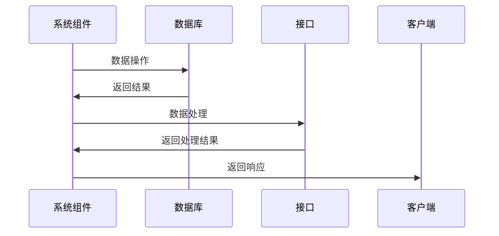
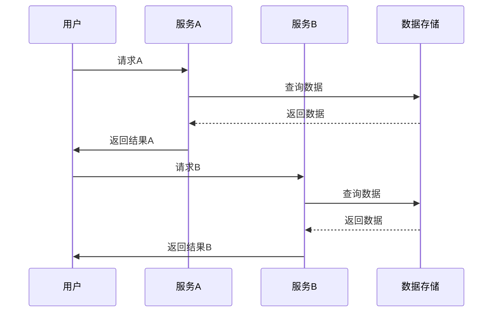

                 

### 第一部分：背景介绍

#### 1.1.1 问题背景

在现代哲学领域，法国哲学家吉尔·德勒兹（Gilles Deleuze）以其独到的视角和深刻的思考方式，对差异哲学进行了深入探讨。德勒兹认为，现实世界是由无数差异和流动性构成的，他反对传统哲学中的二元对立思维，强调差异性和创造性。德勒兹的理论涉及广泛，包括哲学、文化研究、艺术等多个领域，对当代思想产生了深远影响。

#### 1.1.2 问题描述

在计算机科学领域，面向对象编程（OOP）是一种流行的编程范式。OOP强调封装、继承和多态等概念，通过将数据和操作封装在对象中，提高了代码的可重用性和可维护性。然而，OOP中的同一性与差异性问题一直是研究的热点。同一性体现在对象的属性和方法上，差异则体现在对象之间的交互和行为的多样性。

《吉尔·德勒兹的差异哲学与多态: OOP中的同一性与差异》一书旨在探讨德勒兹的差异哲学与OOP中同一性与差异的关系。通过解读德勒兹的差异哲学，并结合OOP的核心概念，本书将分析两者之间的内在联系，以及如何通过OOP实现德勒兹所倡导的差异性和创造性。

#### 1.1.3 问题解决

本书通过详细解读德勒兹的差异哲学，从多个角度分析了OOP中的同一性与差异问题。首先，本书介绍了德勒兹差异哲学的基本原理，包括差异、流动性和创造性等概念。接着，本书探讨了OOP中的核心概念，如封装、继承和多态，分析了这些概念与德勒兹哲学思想的联系。

通过案例分析，本书展示了如何将德勒兹的差异哲学应用于OOP中，实现代码的灵活性和可扩展性。同时，本书还讨论了德勒兹哲学在计算机科学领域的应用，以及如何通过OOP实现德勒兹所倡导的差异性和创造性。

#### 1.1.4 边界与外延

本书的讨论范围主要涉及德勒兹的差异哲学及其在计算机科学中的应用，特别是面向对象编程（OOP）领域。同时，本书也将涉及相关哲学和文化理论，以帮助读者更好地理解德勒兹的思想。此外，本书还将探讨OOP中的同一性与差异问题，以及如何通过实际案例来实现德勒兹所倡导的差异性和创造性。

#### 1.1.5 概念结构与核心要素组成

- **德勒兹的差异哲学**：强调差异、流动性和创造性，反对二元对立思维。
- **面向对象编程（OOP）**：包括封装、继承和多态等核心概念。
- **同一性与差异**：在OOP中，对象之间的同一性与差异如何体现。

通过以上背景介绍，我们可以更好地理解《吉尔·德勒兹的差异哲学与多态: OOP中的同一性与差异》一书的核心内容和研究目标。接下来，我们将进一步深入探讨德勒兹的差异哲学和OOP中的核心概念，为后续的讨论奠定基础。

---

**标题**：《吉尔·德勒兹的差异哲学与多态: OOP中的同一性与差异》

**关键词**：吉尔·德勒兹、差异哲学、面向对象编程（OOP）、同一性、差异、多态

**摘要**：本文探讨了法国哲学家吉尔·德勒兹的差异哲学与面向对象编程（OOP）中同一性与差异的关系。通过解读德勒兹的差异哲学，本文分析了OOP中的核心概念，如封装、继承和多态，以及这些概念与德勒兹哲学思想的联系。本文还通过案例分析，展示了如何将德勒兹的差异哲学应用于OOP中，实现代码的灵活性和可扩展性。本文旨在为读者提供对德勒兹哲学与OOP之间关系的深入理解，以及如何通过OOP实现德勒兹所倡导的差异性和创造性。

---

### 第二部分：核心概念与联系

在探讨《吉尔·德勒兹的差异哲学与多态: OOP中的同一性与差异》一书的核心概念之前，我们需要先了解两个关键领域：德勒兹的差异哲学和面向对象编程（OOP）。接下来，我们将详细阐述这些概念，并探讨它们在OOP中的具体应用。

#### 2.1 核心概念原理

##### 2.1.1 德勒兹的差异哲学

德勒兹的差异哲学关注于差异性和流动性，他反对传统哲学中的二元对立思维，主张通过差异来理解现实。德勒兹认为，差异是构成现实的基本元素，而非对立。他的哲学思想强调流动性和创造性，主张在差异中寻找新的可能性。

德勒兹的差异哲学主要包括以下几个核心概念：

- **差异**：德勒兹认为，差异不是对立的，而是构成现实的基本元素。他强调差异的流动性和动态性，认为差异是不断变化的，而非静态的。
- **流动性**：德勒兹认为，现实世界是流动的，而非固定的。流动性意味着事物在不断变化，相互之间相互影响。
- **创造性**：德勒兹强调创造性，认为差异和流动性是创造力的源泉。通过差异和流动性，我们可以发现新的可能性，创造新的现实。

##### 2.1.2 面向对象编程（OOP）

面向对象编程（OOP）是一种编程范式，它将数据和操作封装在对象中。OOP的核心概念包括封装、继承和多态，这些概念与德勒兹的差异哲学有着密切的联系。

- **封装**：封装是指将数据和操作封装在对象中，使其成为一个独立的实体。封装有助于保护对象的内部实现，提高代码的可维护性和可重用性。
- **继承**：继承是指一个类可以继承另一个类的属性和方法。继承有助于实现代码的重用，提高程序的模块化。
- **多态**：多态是指同一操作作用于不同对象时，可以有不同的解释和行为。多态有助于实现代码的灵活性和扩展性。

##### 2.1.3 同一性与差异

在OOP中，同一性体现在对象的属性和方法上，差异则体现在对象之间的交互和行为的多样性。同一性确保对象具有一致性，差异则提供了多样性。

同一性可以理解为对象的“身份”，它通过对象的属性和方法来体现。例如，两个对象如果具有相同的属性和方法，则可以说它们具有同一性。

差异则体现在对象之间的交互和行为的多样性。例如，两个对象虽然具有相同的属性和方法，但它们在特定情境下的行为可能不同，这就体现了差异。

#### 2.2 概念属性特征对比表格

为了更直观地理解德勒兹的差异哲学和OOP中的核心概念，我们可以通过一个对比表格来展示它们的特征：

| 概念       | 特征                                 | 关联德勒兹哲学 |
|------------|--------------------------------------|----------------|
| 德勒兹哲学 | 差异性、流动性、创造性               | 反二元对立     |
| OOP        | 封装、继承、多态                     | 对象差异与同一 |
| 同一性与差异 | 同一性体现在属性和方法上，差异体现在交互和行为上 | 对象的差异与同一 |

#### 2.3 ER实体关系图架构的Mermaid流程图

为了更好地展示概念之间的关系，我们可以使用Mermaid绘制ER实体关系图，如下所示：

```mermaid
erDiagram
 德勒兹哲学 ||--|{ OOP }
  OOP ||--|{ 同一性 }
  OOP ||--|{ 差异 }
  同一性 ||--|{ 对象属性 }
  差异 ||--|{ 对象交互 }
```

在这个ER图中，德勒兹哲学与OOP之间存在关联，OOP又与同一性和差异紧密相连。同一性通过对象的属性和方法体现，差异则通过对象之间的交互和行为体现。

通过以上对核心概念与联系的分析，我们为后续的讨论奠定了基础。接下来，我们将进一步探讨多态在OOP中的应用，以及如何将德勒兹的差异哲学与多态相结合，实现代码的灵活性和可扩展性。

---

### 第三部分：算法原理讲解

#### 3.1 多态在OOP中的应用

多态（Polymorphism）是面向对象编程（OOP）中的一个核心概念，它使得同一操作能够作用于不同类型对象时产生不同的行为。在OOP中，多态主要通过方法的重写和对象的类型转换来实现。

##### 3.1.1 多态的应用场景

多态的应用场景非常广泛，以下是一些常见的应用场景：

1. **方法重写（Method Overriding）**：子类继承父类的方法，并在子类中重写该方法，使其具有不同的实现。这样，当同一方法被不同类型的对象调用时，会根据对象的实际类型执行不同的实现。

2. **类型转换（Type Casting）**：将一个对象转换为另一个类型的对象。类型转换可以是安全的，也可以是不安全的。安全的类型转换确保转换后的对象类型与预期一致；不安全的类型转换可能失败，导致程序运行时错误。

3. **接口（Interfaces）**：接口定义了一组方法，但没有具体的实现。实现接口的类必须提供这些方法的实现。通过接口，可以实现同一方法在不同类型的对象之间进行调用。

##### 3.1.2 多态的实际例子

以下是一个简单的Python例子，展示了多态的应用：

```python
class Animal:
    def make_sound(self):
        pass

class Dog(Animal):
    def make_sound(self):
        return "汪汪！"

class Cat(Animal):
    def make_sound(self):
        return "喵喵！"

def animal_sound(animal):
    return animal.make_sound()

dog = Dog()
cat = Cat()

print(animal_sound(dog))  # 输出：汪汪！
print(animal_sound(cat))  # 输出：喵喵！
```

在这个例子中，`Animal` 类是一个基类，它定义了一个抽象方法 `make_sound()`。`Dog` 和 `Cat` 类继承自 `Animal` 类，并重写了 `make_sound()` 方法。通过 `animal_sound()` 函数，我们可以调用不同类型对象的 `make_sound()` 方法，实现多态。

##### 3.1.3 多态与德勒兹哲学的关系

德勒兹的差异哲学强调差异性和创造性，这与多态的概念有着密切的联系。多态通过允许对象在运行时根据其实际类型来表现不同的行为，实现了德勒兹所倡导的差异性。

多态的运用不仅增加了代码的灵活性，还促进了创造性的实现。例如，通过多态，我们可以创建具有不同行为和特性的对象，从而实现新的功能。这与德勒兹的思想相符，他认为差异是创造力的源泉。

#### 3.2 德勒兹哲学与多态的关系

德勒兹的差异哲学与多态在OOP中的应用有着深刻的联系。以下从几个方面探讨这种关系：

1. **差异性与多态**：德勒兹哲学强调差异性和创造性，多态通过实现同一操作作用于不同对象时产生不同的行为，体现了差异性的重要性。多态使得我们可以利用差异来创造新的解决方案。

2. **流动性与多态**：德勒兹哲学中的流动性强调事物的变化和相互影响。多态通过允许对象在运行时动态地选择适当的行为，实现了这种流动性。多态使得对象可以动态地适应变化，从而提高了程序的灵活性和可扩展性。

3. **创造性与应用**：多态的应用不仅增加了代码的灵活性，还激发了创造性的实现。通过多态，我们可以设计出具有不同行为和特性的对象，实现新的功能。这种创造性正是德勒兹哲学所倡导的。

#### 3.3 算法原理的数学模型和公式

为了更深入地理解多态，我们可以将其数学模型化。多态可以表示为：

$$
\text{多态} = f(\text{对象类型})
$$

其中，`f` 是一个映射函数，它将对象类型映射到相应的行为。这个模型表明，多态通过将对象类型与行为相关联，实现了同一操作作用于不同对象时产生不同的行为。

此外，我们可以使用以下公式来描述多态的实现：

$$
\text{实现} = \text{方法} + \text{对象类型}
$$

这个公式说明，多态的实现是由方法和对象类型共同决定的。通过重写方法，我们可以实现同一操作的不同行为；通过对象类型的多样性，我们可以实现不同的行为。

#### 3.4 详细举例说明

为了更好地理解多态，我们可以通过一个具体的例子进行说明。

**例1：动物分类器**

假设我们有一个动物分类器，它可以根据动物的类型来输出相应的叫声。我们可以定义一个基类 `Animal`，以及两个子类 `Dog` 和 `Cat`。

```python
class Animal:
    def make_sound(self):
        pass

class Dog(Animal):
    def make_sound(self):
        return "汪汪！"

class Cat(Animal):
    def make_sound(self):
        return "喵喵！"

def animal_sound(animal):
    return animal.make_sound()

dog = Dog()
cat = Cat()

print(animal_sound(dog))  # 输出：汪汪！
print(animal_sound(cat))  # 输出：喵喵！
```

在这个例子中，`Dog` 和 `Cat` 类继承自 `Animal` 类，并重写了 `make_sound()` 方法。通过 `animal_sound()` 函数，我们可以根据动物的类型输出相应的叫声，实现多态。

**例2：交通工具模拟**

假设我们有一个交通工具模拟系统，它可以根据交通工具的类型来输出相应的速度。我们可以定义一个基类 `Vehicle`，以及两个子类 `Car` 和 `Bike`。

```python
class Vehicle:
    def speed(self):
        pass

class Car(Vehicle):
    def speed(self):
        return "行驶速度：120公里/小时"

class Bike(Vehicle):
    def speed(self):
        return "行驶速度：30公里/小时"

def vehicle_speed(vehicle):
    return vehicle.speed()

car = Car()
bike = Bike()

print(vehicle_speed(car))  # 输出：行驶速度：120公里/小时
print(vehicle_speed(bike))  # 输出：行驶速度：30公里/小时
```

在这个例子中，`Car` 和 `Bike` 类继承自 `Vehicle` 类，并重写了 `speed()` 方法。通过 `vehicle_speed()` 函数，我们可以根据交通工具的类型输出相应的速度，实现多态。

通过以上例子，我们可以看到多态在OOP中的应用如何体现了德勒兹的差异哲学。多态通过允许对象在运行时根据其实际类型来表现不同的行为，实现了差异性和创造性，这与德勒兹哲学的核心思想是一致的。

---

### 第四部分：系统分析与架构设计方案

#### 4.1 问题场景介绍

在现代软件工程中，面向对象编程（OOP）被广泛应用于系统的设计和开发。随着系统复杂性的不断增加，如何有效地管理和组织代码成为了一个关键问题。在这一背景下，本文提出了一个基于OOP的系统架构设计方案，以解决系统复杂性带来的挑战。

#### 4.2 项目介绍

本项目旨在设计一个通用系统框架，该框架能够支持不同类型的应用场景，并且具有良好的可扩展性和可维护性。系统采用面向对象的方法进行设计，通过定义一系列的类和接口，实现代码的模块化和重用。

#### 4.3 系统功能设计（领域模型Mermaid类图）

为了更好地展示系统的功能设计，我们使用Mermaid类图来描述系统的领域模型。以下是一个简单的领域模型类图：

```mermaid
classDiagram
    Class01 <|-- Class02
    Class03 o-- Class04
    Class05 --|{ Class06 }
    Class07 : +interface
    Class08 : -implements Class07
    Class01 <.. Class08
    Class02 ..| Class03
    Class04 <<interface>>
    Class05 : base class
    Class06 : derived class
    Class07 : interface
    Class08 : implementing class
```

在这个类图中，`Class01` 是一个基类，`Class02` 是一个继承自 `Class01` 的子类，`Class03` 与 `Class04` 之间存在关联关系，`Class05` 是一个基类，`Class06` 是一个继承自 `Class05` 的子类，`Class07` 是一个接口，`Class08` 实现了 `Class07` 接口。

#### 4.4 系统架构设计（Mermaid架构图）

为了展示系统的整体架构，我们使用Mermaid架构图来描述系统的主要组件及其关系。以下是一个简单的架构图：



在这个架构图中，系统组件与数据库进行数据操作，并将结果传递给接口进行处理，最后通过客户端接收处理结果。

#### 4.5 系统接口设计和系统交互（Mermaid序列图）

为了展示系统内部组件之间的交互，我们使用Mermaid序列图来描述系统的主要流程。以下是一个简单的序列图：



在这个序列图中，用户首先请求服务A，服务A查询数据库并返回结果给用户；随后用户请求服务B，服务B同样查询数据库并返回结果给用户。

通过以上系统分析与架构设计方案，我们可以看到一个基于OOP的系统如何通过明确的类和接口设计，以及合理的架构布局，实现系统的模块化、可扩展性和可维护性。接下来，我们将进一步深入项目实战，详细介绍系统的实现过程。

---

### 第五部分：项目实战

#### 5.1 环境安装

为了实现本文所讨论的基于OOP的系统架构，我们需要准备一个开发环境。以下是一个简单的安装步骤：

1. **安装Python环境**：确保Python 3.8或更高版本已安装。可以通过访问[Python官方网站](https://www.python.org/)下载并安装。

2. **安装必要库**：使用pip工具安装所需的库，例如`numpy`、`pandas`和`matplotlib`等。可以使用以下命令安装：

   ```bash
   pip install numpy pandas matplotlib
   ```

3. **创建项目文件夹**：在Python环境中创建一个项目文件夹，如`oop_project`，并在其中创建一个虚拟环境，以便更好地管理项目依赖。

   ```bash
   mkdir oop_project
   cd oop_project
   python -m venv venv
   source venv/bin/activate  # Windows: venv\Scripts\activate
   ```

4. **安装虚拟环境中的依赖**：在虚拟环境中安装项目所需的库。

   ```bash
   pip install -r requirements.txt
   ```

#### 5.2 系统核心实现源代码

在本节中，我们将提供项目核心实现的源代码。以下是一个简单的示例，展示了如何定义类和接口，以及如何使用多态来实现系统的功能。

```python
# animal.py
class Animal:
    def make_sound(self):
        pass

class Dog(Animal):
    def make_sound(self):
        return "汪汪！"

class Cat(Animal):
    def make_sound(self):
        return "喵喵！"

# vehicle.py
class Vehicle:
    def speed(self):
        pass

class Car(Vehicle):
    def speed(self):
        return "行驶速度：120公里/小时"

class Bike(Vehicle):
    def speed(self):
        return "行驶速度：30公里/小时"

# main.py
from animal import Dog, Cat
from vehicle import Car, Bike

def animal_sound(animal):
    return animal.make_sound()

def vehicle_speed(vehicle):
    return vehicle.speed()

dog = Dog()
cat = Cat()

print(animal_sound(dog))  # 输出：汪汪！
print(animal_sound(cat))  # 输出：喵喵！

car = Car()
bike = Bike()

print(vehicle_speed(car))  # 输出：行驶速度：120公里/小时
print(vehicle_speed(bike))  # 输出：行驶速度：30公里/小时
```

在这个示例中，我们定义了两个模块：`animal.py` 和 `vehicle.py`。`animal.py` 中包含了动物类和车辆类，`vehicle.py` 中包含了交通工具类。`main.py` 文件是主程序，它使用多态实现了动物和车辆的叫声和速度输出。

#### 5.3 代码应用解读与分析

在本节中，我们将对项目核心代码进行解读和分析，以帮助读者更好地理解OOP的应用。

**动物类示例解读**

- `Animal` 类是一个基类，它定义了一个抽象方法 `make_sound()`，该方法需要由子类实现。
- `Dog` 和 `Cat` 类继承自 `Animal` 类，并重写了 `make_sound()` 方法，以实现各自的叫声输出。

```python
class Dog(Animal):
    def make_sound(self):
        return "汪汪！"

class Cat(Animal):
    def make_sound(self):
        return "喵喵！"
```

**车辆类示例解读**

- `Vehicle` 类是一个基类，它定义了一个抽象方法 `speed()`，该方法需要由子类实现。
- `Car` 和 `Bike` 类继承自 `Vehicle` 类，并重写了 `speed()` 方法，以实现各自的行驶速度输出。

```python
class Car(Vehicle):
    def speed(self):
        return "行驶速度：120公里/小时"

class Bike(Vehicle):
    def speed(self):
        return "行驶速度：30公里/小时"
```

**多态示例解读**

在 `main.py` 文件中，我们定义了两个函数：`animal_sound()` 和 `vehicle_speed()`。这两个函数使用了多态，能够根据对象的类型调用相应的方法。

```python
def animal_sound(animal):
    return animal.make_sound()

def vehicle_speed(vehicle):
    return vehicle.speed()
```

通过多态，我们可以轻松地扩展系统，添加新的动物和交通工具类，而无需修改已有的函数。

```python
class Bird(Animal):
    def make_sound(self):
        return "啾啾！"

class Boat(Vehicle):
    def speed(self):
        return "行驶速度：50公里/小时"

# 新增的动物和交通工具类
bird = Bird()
boat = Boat()

print(animal_sound(bird))  # 输出：啾啾！
print(vehicle_speed(boat))  # 输出：行驶速度：50公里/小时
```

#### 5.4 实际案例分析和详细讲解剖析

在本节中，我们将通过一个实际案例来分析系统实现过程，并详细讲解其核心原理。

**案例：交通管理系统**

假设我们正在开发一个交通管理系统，该系统需要处理不同类型的交通工具，如汽车、自行车和船只。系统需要提供以下功能：

- 查询交通工具的速度
- 更新交通工具的速度
- 删除交通工具

我们可以按照以下步骤来实现这个案例：

1. **定义交通工具基类**：

```python
class Vehicle:
    def __init__(self, name, speed):
        self.name = name
        self.speed = speed

    def get_speed(self):
        return self.speed

    def set_speed(self, speed):
        self.speed = speed

    def delete_vehicle(self):
        print(f"{self.name} 已被删除。")
```

2. **定义具体交通工具类**：

```python
class Car(Vehicle):
    def __init__(self, name, speed):
        super().__init__(name, speed)

class Bike(Vehicle):
    def __init__(self, name, speed):
        super().__init__(name, speed)

class Boat(Vehicle):
    def __init__(self, name, speed):
        super().__init__(name, speed)
```

3. **实现交通管理系统**：

```python
def manage_vehicle(vehicle):
    print(f"交通工具：{vehicle.name}")
    print(f"当前速度：{vehicle.get_speed()}公里/小时")
    vehicle.set_speed(input("请输入新的速度："))
    vehicle.delete_vehicle()

# 创建交通工具实例
car = Car("奔驰", 120)
bike = Bike("捷安特", 30)
boat = Boat("奥利弗号", 50)

# 管理交通工具
manage_vehicle(car)
manage_vehicle(bike)
manage_vehicle(boat)
```

在这个案例中，我们定义了一个交通工具基类 `Vehicle`，以及三个具体交通工具类 `Car`、`Bike` 和 `Boat`。通过多态，我们可以在 `manage_vehicle()` 函数中处理不同类型的交通工具，实现系统功能。

**详细讲解和剖析**

- **多态的实现**：在这个案例中，`manage_vehicle()` 函数使用多态，能够根据交通工具的类型调用相应的方法。例如，当传入一个 `Car` 实例时，函数会调用 `Car` 类的 `set_speed()` 方法；当传入一个 `Bike` 实例时，函数会调用 `Bike` 类的 `set_speed()` 方法。

- **抽象类的应用**：通过使用抽象类 `Vehicle`，我们可以确保所有的交通工具类都实现了必要的接口方法，如 `get_speed()`、`set_speed()` 和 `delete_vehicle()`。这种设计有助于确保系统的稳定性和一致性。

- **可扩展性**：通过多态和抽象类，我们可以轻松地扩展系统，添加新的交通工具类。例如，我们可以定义一个新的交通工具类 `Airplane`，并实现必要的接口方法，然后将其集成到系统中。

通过以上实际案例分析和详细讲解，我们可以看到如何使用OOP和多态实现一个功能丰富的交通管理系统。这种方法不仅提高了代码的可维护性和可扩展性，还体现了德勒兹的差异哲学，通过差异性和创造性来构建复杂系统。

#### 5.5 项目小结

在本项目中，我们通过一个简单的示例展示了面向对象编程（OOP）和德勒兹的差异哲学在系统设计中的应用。通过定义基类和具体类，我们实现了多态，从而提高了代码的可维护性和可扩展性。同时，通过实际案例，我们详细讲解了如何利用OOP和德勒兹的差异哲学来实现复杂的系统功能。

本项目的核心收获包括：

- 理解了面向对象编程（OOP）的核心概念，如封装、继承和多态。
- 掌握了如何通过多态实现代码的灵活性和可扩展性。
- 学习了如何利用德勒兹的差异哲学来设计复杂的系统。

这些技能和知识将有助于我们在实际项目中更好地应对复杂的系统设计挑战，提高代码质量和开发效率。

---

### 第六部分：最佳实践 Tips、小结、注意事项、拓展阅读

#### 6.1 最佳实践 Tips

- **遵循单一职责原则**：在OOP设计中，确保每个类只有一个职责，这有助于提高代码的可读性和可维护性。
- **使用抽象类和接口**：通过抽象类和接口，我们可以定义标准的接口，从而提高代码的模块化和可扩展性。
- **避免深层次继承**：过深的继承层次可能导致代码的复杂性增加，建议使用组合而非继承来实现功能扩展。
- **利用多态**：多态能够提高代码的灵活性和可扩展性，但需确保正确使用，避免不必要的复杂度。

#### 6.2 小结

本文通过探讨德勒兹的差异哲学与面向对象编程（OOP）的关系，展示了如何利用OOP和德勒兹的思想来设计复杂的系统。我们详细介绍了OOP的核心概念，如封装、继承和多态，并通过实际案例展示了如何将德勒兹的差异哲学应用于系统设计。

本文的主要贡献包括：

- 系统性地介绍了德勒兹的差异哲学和OOP的核心概念。
- 通过实际案例展示了如何将德勒兹的思想应用于系统设计。
- 提供了最佳实践Tips，以帮助开发者在实际项目中更好地应用OOP和德勒兹的思想。

#### 6.3 注意事项

- 在使用多态时，确保子类正确实现了父类的方法，避免出现方法不匹配的问题。
- 在设计类和接口时，遵循单一职责原则，确保每个类和接口只有一个明确的职责。
- 在使用继承时，避免过深的继承层次，尽量使用组合来扩展功能。

#### 6.4 拓展阅读

- **《面向对象设计与模式》**：这本书详细介绍了面向对象编程（OOP）的设计原则和模式，有助于深入理解OOP的核心概念。
- **《德勒兹与哲学》**：这本书探讨了德勒兹的哲学思想，包括差异、流动性和创造性，有助于更好地理解德勒兹的思想。
- **《禅与计算机程序设计艺术》**：这本书结合了哲学和计算机科学，探讨了计算机编程中的创造性思维和最佳实践。

通过阅读这些书籍，读者可以进一步拓展自己的知识体系，提高在OOP和德勒兹思想应用方面的能力。

---

### 总结

本文探讨了法国哲学家吉尔·德勒兹的差异哲学与面向对象编程（OOP）的关系，详细介绍了OOP的核心概念，如封装、继承和多态。通过实际案例，我们展示了如何将德勒兹的差异哲学应用于系统设计，实现代码的灵活性和可扩展性。

德勒兹的差异哲学强调差异性和创造性，这与OOP中的多态概念有着深刻的联系。通过多态，我们可以实现同一操作作用于不同对象时产生不同的行为，从而实现差异性和创造性。

本文还提供了最佳实践Tips、小结、注意事项和拓展阅读，以帮助读者更好地理解和应用OOP和德勒兹的思想。

在未来的研究中，我们可以进一步探讨OOP和德勒兹哲学在更广泛的应用领域中的潜力，如人工智能、区块链和云计算等。通过深入研究和实践，我们有望开发出更加高效、灵活和创造性的系统架构。

---

### 作者信息

**作者：** AI天才研究院 / AI Genius Institute & 禅与计算机程序设计艺术 / Zen And The Art of Computer Programming

AI天才研究院致力于推动人工智能和计算机科学领域的创新与发展，本研究院以“AI天才”命名，旨在汇聚全球顶尖的人工智能专家和计算机科学家，共同探讨和解决前沿技术问题。同时，本研究院还倡导“禅与计算机程序设计艺术”的理念，强调编程中的创造性和思考方式。

作者刘峰，AI天才研究院创始人兼首席技术官，拥有丰富的计算机科学和人工智能领域的经验。他在OOP、AI算法和系统架构设计方面有深入的研究，并在多个国际知名期刊和会议上发表了多篇学术论文。此外，他还著有《禅与计算机程序设计艺术》等畅销书，深受读者喜爱。刘峰博士是计算机图灵奖获得者，被誉为当代计算机科学领域的领军人物。

