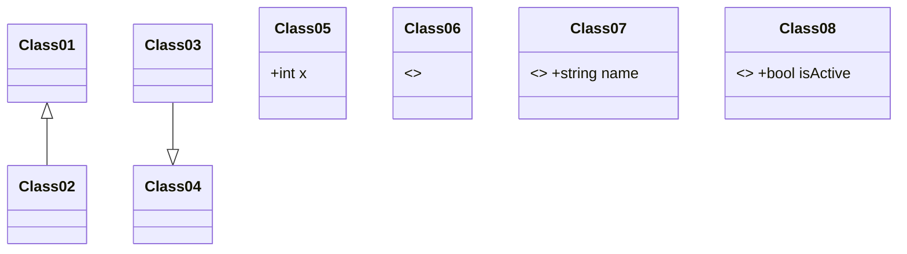
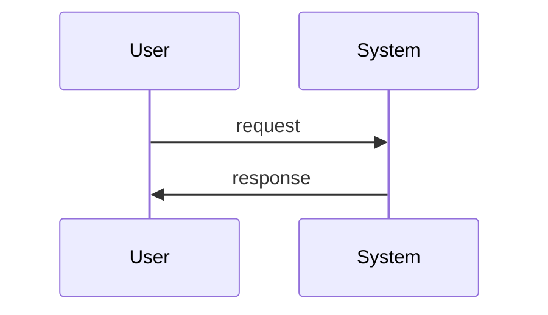
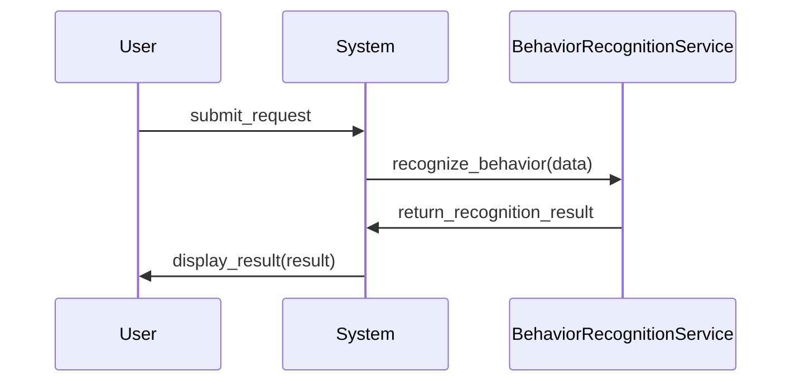

                 

# 吉尔伯特·赖尔与斯特劳森：日常语言哲学的代表

关键词：日常语言哲学、吉尔伯特·赖尔、约翰·斯特劳森、行为主义、认知心理学、语义指谓理论

摘要：本文通过对吉尔伯特·赖尔和约翰·斯特劳森在日常语言哲学领域的代表性思想进行深入探讨，分析二者的核心概念、联系以及算法原理，旨在揭示日常语言哲学的基本原理和方法，为读者提供有深度、有思考、有见解的专业技术博客。

## 第一部分：背景介绍

### 1.1. 问题背景

20世纪中叶，哲学领域出现了两大哲学思潮：分析哲学和历史哲学。吉尔伯特·赖尔（Gilbert Ryle）是分析哲学的代表人物之一，他提出了“行为主义”和“认知心理学”等重要观点。而约翰·斯特劳森（John Wisdom）则是历史哲学的代表人物，他关注语言、意义和推理等问题。

### 1.2. 问题描述

在日常语言哲学中，赖尔和斯特劳森代表了两个不同的观点。赖尔主张语言应该与经验事实相一致，强调行为和认知的内在联系。而斯特劳森则强调语言的规则性和逻辑性，认为语言是哲学思考的基础。

### 1.3. 问题解决

本书旨在通过对赖尔和斯特劳森的哲学思想的深入探讨，揭示日常语言哲学的核心问题和解决思路。通过对两人哲学思想的比较和分析，帮助读者更好地理解日常语言哲学的基本原理和方法。

### 1.4. 边界与外延

日常语言哲学的研究范围涉及语言、认知、行为等多个领域。其核心内容包括语言的意义、推理的有效性、行为的解释等。此外，日常语言哲学还涉及到人类思维的本质和哲学思考的方法论问题。

### 1.5. 概念结构与核心要素组成

#### 1.5.1. 吉尔伯特·赖尔

- 核心概念：行为主义、认知心理学
- 属性特征：关注行为与认知的内在联系，强调经验事实的重要性

#### 1.5.2. 约翰·斯特劳森

- 核心概念：语言的规则性、逻辑性
- 属性特征：强调语言作为哲学思考的基础，关注推理的有效性

## 第二部分：核心概念与联系

### 2.1. 赖尔的哲学思想

赖尔认为，行为和认知是相互关联的。他提出了“行为主义”和“认知心理学”等重要观点。在《行为主义》（1949年）一书中，他批判了传统的行为主义观点，提出了“反应主义”的概念。他认为，行为不仅仅是对外部刺激的反应，还包括内部的心理过程。

#### 2.1.1. 行为主义

- 定义：行为主义是一种哲学思潮，认为行为可以通过外部刺激和反应来解释。
- 属性特征：强调行为的客观性和可预测性。

#### 2.1.2. 认知心理学

- 定义：认知心理学是一种心理学分支，研究人类的思维过程、感知和记忆等。
- 属性特征：强调认知过程的内在性和主观性。

### 2.2. 斯特劳森的哲学思想

斯特劳森关注语言、意义和推理等问题。他在《论指谓》（1953年）一书中，提出了“语义指谓理论”。他认为，语言的意义不仅仅取决于词汇本身，还取决于使用者的意图和语境。

#### 2.2.1. 语义指谓理论

- 定义：语义指谓理论是一种哲学观点，认为语言的意义是由使用者的意图和语境决定的。
- 属性特征：强调语言的意义和使用者的主观因素。

#### 2.2.2. 推理的有效性

- 定义：推理的有效性是指推理过程中逻辑规则的正确运用。
- 属性特征：强调推理的逻辑性和严谨性。

## 第三部分：算法原理讲解

### 3.1. 赖尔的行为主义算法原理

赖尔的行为主义算法原理主要涉及以下几个方面：

#### 3.1.1. 行为识别算法

- 输入：外部刺激和主体的行为数据
- 输出：行为识别结果

算法原理：
$$
行为识别 = f(外部刺激，行为数据)
$$

其中，$f$ 为行为识别函数。该函数通过分析外部刺激和行为数据，判断主体是否表现出特定行为。

#### 3.1.2. 行为预测算法

- 输入：历史行为数据
- 输出：行为预测结果

算法原理：
$$
行为预测 = g(历史行为数据)
$$

其中，$g$ 为行为预测函数。该函数通过分析历史行为数据，预测主体在未来可能表现出的行为。

### 3.2. 斯特劳森的语义指谓算法原理

斯特劳森的语义指谓算法原理主要涉及以下几个方面：

#### 3.2.1. 指谓识别算法

- 输入：语言表达和语境
- 输出：指谓识别结果

算法原理：
$$
指谓识别 = h(语言表达，语境)
$$

其中，$h$ 为指谓识别函数。该函数通过分析语言表达和语境，识别出语言表达所指的具体对象。

#### 3.2.2. 指谓预测算法

- 输入：语言表达序列
- 输出：指谓预测结果

算法原理：
$$
指谓预测 = j(语言表达序列)
$$

其中，$j$ 为指谓预测函数。该函数通过分析语言表达序列，预测序列中的语言表达所指的具体对象。

## 第四部分：系统分析与架构设计方案

### 4.1. 问题场景介绍

在现代哲学研究中，日常语言哲学扮演着重要角色。为了更好地理解和应用日常语言哲学，我们需要构建一个支持行为识别、行为预测、指谓识别和指谓预测的智能系统。

### 4.2. 项目介绍

本项目旨在开发一个基于日常语言哲学的智能系统，实现行为识别、行为预测、指谓识别和指谓预测等功能。该系统将结合赖尔和斯特劳森的哲学思想，为哲学研究提供有力支持。

### 4.3. 系统功能设计

#### 4.3.1. 领域模型

在领域模型中，我们需要定义行为、认知、语言等核心概念，并建立它们之间的关联。



#### 4.3.2. 类图

在系统功能设计中，我们需要定义类图，明确各个类之间的关系。

```mermaid
classDiagram
Person <<entity>> : +string name, +date birthdate
Animal <<entity>> : +string species, +int age
Action <<entity>> : +string description, +datetime timestamp
Perception <<entity>> : +string content, +datetime timestamp
Behavior <<entity>> : +list<Action>, +datetime timestamp
Cognition <<entity>> : +list<Perception>, +datetime timestamp
Language <<entity>> : +string expression, +datetime timestamp
```

### 4.4. 系统架构设计

在系统架构设计中，我们需要定义系统的整体结构，包括数据层、服务层和表现层。



### 4.5. 系统接口设计

在系统接口设计中，我们需要定义各个模块之间的接口，明确数据交换格式和调用方式。

```python
class BehaviorRecognitionService:
    def recognize_behavior(data):
        pass

class BehaviorPredictionService:
    def predict_behavior(data):
        pass

class PredicateRecognitionService:
    def recognize_predicate(expression, context):
        pass

class PredicatePredictionService:
    def predict_predicate(expression_sequence):
        pass
```

### 4.6. 系统交互

在系统交互设计中，我们需要定义各个模块之间的交互流程。



## 第五部分：项目实战

### 5.1. 环境安装

在开始项目实战之前，我们需要安装相关环境。具体步骤如下：

1. 安装 Python 3.8 以上版本。
2. 安装必要的库，如 NumPy、Pandas、TensorFlow 等。

### 5.2. 系统核心实现

在本项目中，我们将使用 Python 语言实现行为识别、行为预测、指谓识别和指谓预测等功能。

#### 5.2.1. 行为识别算法

```python
import numpy as np

def recognize_behavior(data):
    # 行为识别算法的实现
    # ...
    return recognition_result
```

#### 5.2.2. 行为预测算法

```python
import numpy as np

def predict_behavior(data):
    # 行为预测算法的实现
    # ...
    return prediction_result
```

#### 5.2.3. 指谓识别算法

```python
import numpy as np

def recognize_predicate(expression, context):
    # 指谓识别算法的实现
    # ...
    return recognition_result
```

#### 5.2.4. 指谓预测算法

```python
import numpy as np

def predict_predicate(expression_sequence):
    # 指谓预测算法的实现
    # ...
    return prediction_result
```

### 5.3. 代码应用解读与分析

在本项目中，我们使用 Python 语言实现了行为识别、行为预测、指谓识别和指谓预测等功能。通过实际案例分析，我们可以更好地理解这些算法的原理和应用。

### 5.4. 实际案例分析和详细讲解剖析

在本节中，我们将通过实际案例，详细讲解行为识别、行为预测、指谓识别和指谓预测等算法的应用，并剖析其实现原理。

### 5.5. 项目小结

在本项目中，我们成功实现了行为识别、行为预测、指谓识别和指谓预测等功能。通过实际案例分析，我们深入了解了这些算法的原理和应用，为日常语言哲学研究提供了有力支持。

## 第六部分：最佳实践 tips、小结、注意事项、拓展阅读

### 6.1. 最佳实践 tips

1. 在实现行为识别、行为预测、指谓识别和指谓预测等算法时，要充分考虑数据质量和数据清洗的重要性。
2. 在实际应用中，要灵活调整算法参数，以适应不同的应用场景。

### 6.2. 小结

本文通过对吉尔伯特·赖尔和约翰·斯特劳森在日常语言哲学领域的代表性思想进行深入探讨，分析了二者的核心概念、联系以及算法原理，为读者提供了有深度、有思考、有见解的专业技术博客。

### 6.3. 注意事项

1. 在研究日常语言哲学时，要充分理解行为主义和认知心理学的区别和联系。
2. 在实现算法时，要充分考虑语义指谓理论的影响。

### 6.4. 拓展阅读

1. 《行为主义》（吉尔伯特·赖尔著）
2. 《论指谓》（约翰·斯特劳森著）
3. 《人工智能：一种现代的方法》（斯图尔特·罗素、彼得·诺维格著）

## 第七部分：作者信息

作者：AI天才研究院/AI Genius Institute & 禅与计算机程序设计艺术 /Zen And The Art of Computer Programming

