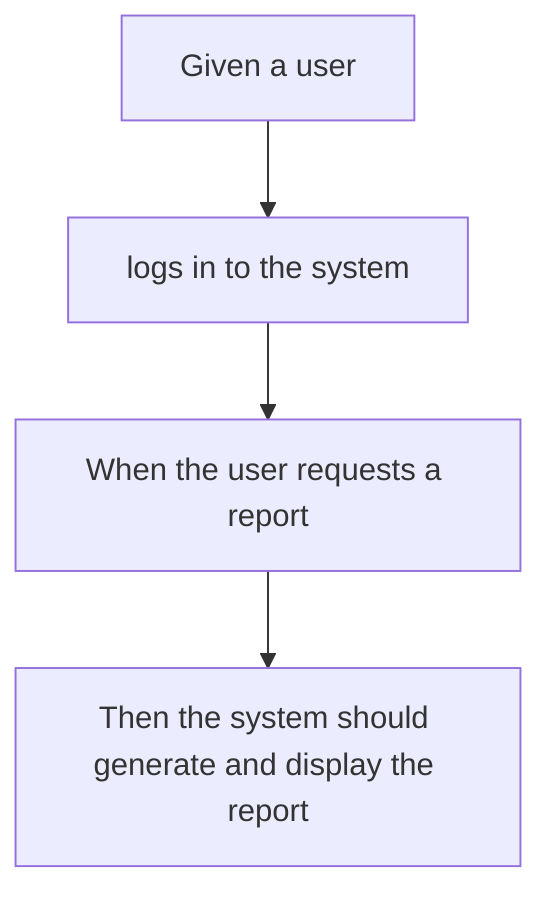
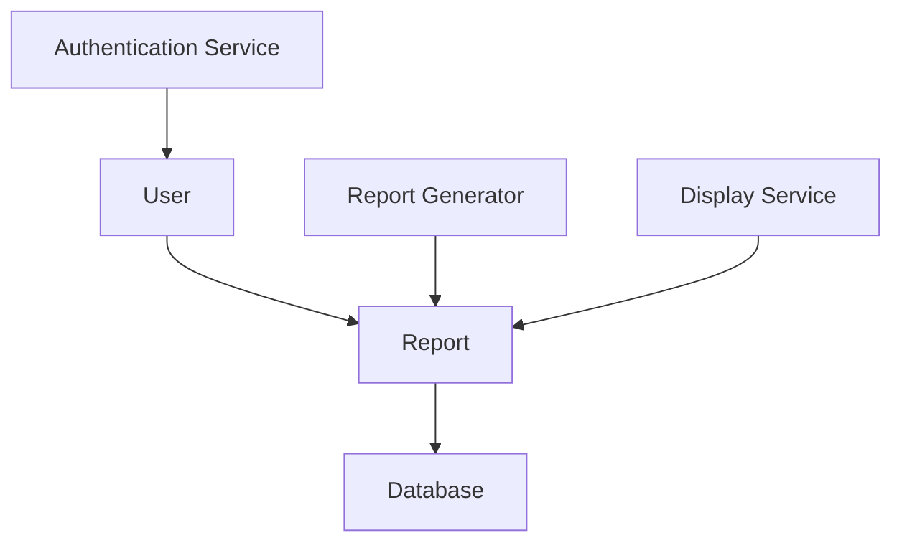
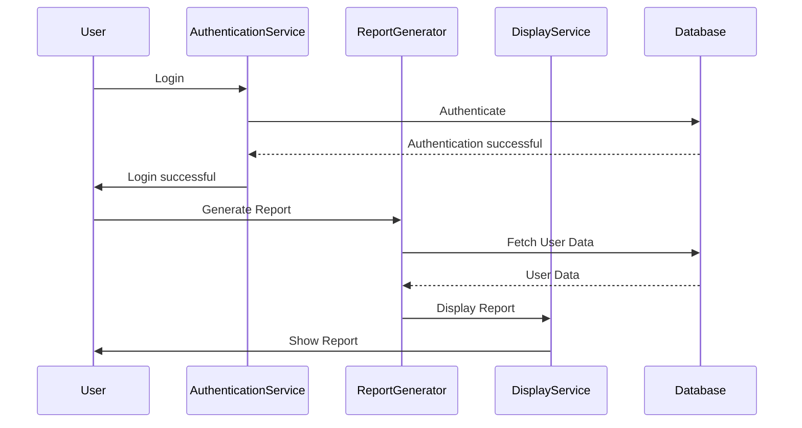
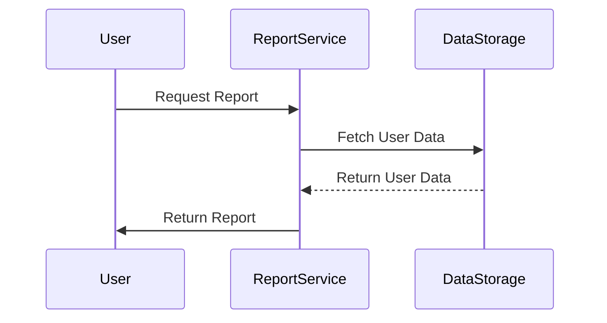

                 


### Overview of the Task and Goals

The task at hand is to craft a comprehensive and insightful technical blog post titled "Gilbert Ryle's Mind Philosophy and Behavior-Driven Development: Unveiling the Essence of Behavior." This article will delve into the philosophical concepts proposed by Gilbert Ryle, a prominent figure in the realm of philosophy, and draw parallels with the principles of Behavior-Driven Development (BDD), a methodology widely adopted in modern software development.

The primary objective of this blog post is to provide readers with a deep understanding of how Ryle's philosophical ideas can inform and enhance the practice of BDD. By doing so, the article aims to bridge the gap between abstract philosophical theories and practical software engineering methodologies.

To achieve this goal, the following structure will be adopted:

1. **Introduction**: Begin with a brief overview of Gilbert Ryle's contributions to philosophy, highlighting his critique of behaviorism and the importance of his concept of "dispositions." This section will set the stage for the subsequent exploration of how Ryle's ideas can be applied to software development.

2. **Core Concepts and Philosophy**:
   - **Behaviorism and Dispositions**: Discuss the fundamental differences between behaviorism and Ryle's concept of dispositions, providing a clear definition and examples to illustrate the distinction.
   - **Behavior-Driven Development (BDD)**: Introduce BDD, explaining its core principles and how it emphasizes the behavior of a system over its internal structure.

3. **Ryle's Philosophy and BDD Principles**:
   - **Mapping Philosophical Concepts to BDD**: Analyze how Ryle's philosophical views on behavior can be mapped to the principles of BDD.
   - **Examples and Case Studies**: Provide concrete examples of how Ryle's philosophy can be applied in real-world software development scenarios, using case studies to illustrate the practical benefits.

4. **System Analysis and Design Using BDD**:
   - **Scenario Definition**: Explain how BDD can be used to define system requirements through scenarios.
   - **Domain Model and System Architecture**: Illustrate the process of creating domain models and system architectures using Mermaid diagrams.
   - **Interface and Interaction Design**: Discuss the design of system interfaces and interactions, again using Mermaid for visual clarity.

5. **Practical Implementation and Case Studies**:
   - **Environment Setup and Core Implementation**: Describe the steps involved in setting up an environment for BDD implementation and provide sample code.
   - **Code Analysis and Interpretation**: Analyze sample code to demonstrate how BDD principles are applied in practice.
   - **Case Analysis**: Discuss a real-world case study where BDD has been successfully implemented.
   - **Project Summary**: Conclude with a summary of the key learnings and outcomes of the case study.

6. **Conclusion and Best Practices**:
   - **Conclusion**: Summarize the main points discussed in the article and reiterate the relevance of Ryle's philosophy to BDD.
   - **Best Practices**: Offer practical tips for applying BDD in software development.
   - **Summary of Key Points**: Recap the core concepts and their significance.
   - **Warnings and Precautions**: Highlight potential pitfalls and provide guidance on how to avoid them.
   - **Further Reading**: Suggest additional resources for those interested in exploring the topic further.

By following this structured approach, the article will not only provide a detailed examination of the interplay between Ryle's philosophy and BDD but also serve as a valuable resource for practitioners looking to enhance their software development practices.

## Introduction

### Background on Gilbert Ryle

Gilbert Ryle (1900-1976) was a British philosopher known for his significant contributions to the fields of philosophy of mind, epistemology, and language. Ryle's work provided a critical examination of behaviorism, a school of thought that sought to explain behavior solely in terms of stimuli and responses, without reference to mental states or inner experiences. Ryle's most influential work, "The Concept of Mind" (1949), is often considered a cornerstone in the development of the field of cognitive science.

Ryle's primary critique of behaviorism was its reductionist approach, which he argued overlooked the complexity and richness of human behavior. He introduced the concept of "dispositions" to challenge behaviorism's focus on overt behavior. Dispositions, according to Ryle, are internal, non-observable tendencies that make an individual behave in certain ways under specific conditions. For instance, the disposition to fly is an intrinsic characteristic of birds that enables them to take to the air, whereas humans, lacking this disposition, must rely on mechanical devices like airplanes.

Ryle's work has had a profound impact on various disciplines, including psychology, linguistics, and philosophy. His concept of dispositions helped bridge the gap between internal mental states and external behaviors, providing a more nuanced understanding of how humans interact with their environment. This philosophical perspective is particularly relevant in the context of modern software development methodologies, such as Behavior-Driven Development (BDD).

### Core Concepts of Behavior-Driven Development (BDD)

Behavior-Driven Development (BDD) is an Agile software development framework that emphasizes collaboration between developers, testers, and business stakeholders to create a shared understanding of the system being developed. The core principles of BDD revolve around defining and automating tests that describe the behavior of the application, rather than focusing on the internal code implementation details.

**Principles of BDD**:

1. **Shared Understanding**: BDD encourages the use of natural language to describe software requirements, making them accessible to all stakeholders. This shared understanding helps minimize misunderstandings and ensures that the development team is building the right product.

2. **Scenario-Based Testing**: BDD utilizes scenarios to illustrate the expected behavior of the application in various contexts. These scenarios are typically written in a Given-When-Then format, providing a clear structure for defining the input, conditions, and expected outcome of each test.

3. **Executable Specifications**: The scenarios and tests written in BDD are designed to be executable, meaning they can be run as part of the continuous integration process. This allows for continuous validation of the application's behavior and early detection of any deviations from the expected functionality.

4. **Iterative Development**: BDD supports an iterative approach to software development, where feedback from testing informs subsequent development cycles. This iterative process helps in refining the product incrementally and adapting to changing requirements.

**Benefits of BDD**:

- **Improved Communication**: By using natural language and collaborative workshops, BDD enhances communication among developers, testers, and business stakeholders, leading to better alignment and reduced miscommunication.

- **Early Detection of Issues**: Executable specifications and continuous testing enable the identification of defects early in the development cycle, reducing the cost and effort required for bug fixing in later stages.

- **Higher Quality Software**: The emphasis on clear, understandable scenarios and automated tests ensures that the software is robust, reliable, and meets the needs of its users.

In summary, Gilbert Ryle's philosophical ideas on dispositions and behavior provide a foundational framework for understanding the principles of Behavior-Driven Development. By recognizing the importance of external behavior and shared understanding, BDD aligns closely with Ryle's critique of behaviorism and offers valuable insights for modern software development practices.

### Relationship Between Ryle's Philosophy and BDD

To better understand the relevance of Gilbert Ryle's philosophical concepts to Behavior-Driven Development (BDD), we must first delve into the core differences between Ryle's view of behavior and the behaviorist perspective that he critiqued.

**Behaviorism and Dispositions**:

Behaviorism, as a psychological theory, posits that all behaviors are the result of stimuli and responses, without any inherent mental processes or dispositions. Behaviorists like B.F. Skinner focused on observable behaviors, assuming that by understanding the environmental stimuli and the corresponding responses, one could fully explain human behavior. This perspective ignored the internal cognitive states and tendencies that Ryle argued were essential for a comprehensive understanding of behavior.

Ryle, on the other hand, introduced the concept of "dispositions" to describe the internal, non-observable tendencies that drive behavior. Dispositions are not immediately apparent like behaviors, but they are essential in understanding why individuals act in certain ways. For example, while a person may exhibit the behavior of standing up (a behavior), the disposition to stand up might be rooted in a desire to reach an object or a physical need, which is not directly observable.

To illustrate the difference, consider the behavior of a chess player. A behaviorist might focus on the specific moves the player makes during a game, while neglecting the underlying dispositions such as strategic thinking, pattern recognition, and the ability to anticipate future moves. Ryle would argue that these dispositions are crucial for understanding the player's behavior and cannot be fully explained without considering them.

**Behavior-Driven Development (BDD)**:

Behavior-Driven Development (BDD) is a software development methodology that aligns closely with Ryle's philosophical stance by emphasizing the behavior of a system over its internal implementation details. BDD encourages developers to define and test the expected behavior of the application in a collaborative manner, ensuring that all stakeholders share a common understanding of what the software should do.

The principles of BDD—such as scenario-based testing, shared understanding, and executable specifications—are inherently aligned with Ryle's concept of dispositions. Here’s how:

1. **Scenario-Based Testing**: BDD uses scenarios to describe the expected behavior of the system under various conditions. These scenarios are written in a Given-When-Then format, which helps to clearly define the context, action, and expected outcome. This approach ensures that the focus remains on the external behavior of the system rather than its internal workings, mirroring Ryle’s emphasis on dispositions.

2. **Shared Understanding**: By employing natural language and collaborative workshops to define requirements and scenarios, BDD facilitates a shared understanding among developers, testers, and business stakeholders. This collaborative process helps to uncover and articulate the underlying dispositions or motivations that drive the behavior of the system, aligning with Ryle’s philosophy of considering the internal tendencies that influence behavior.

3. **Executable Specifications**: BDD promotes the creation of executable specifications that can be automated, ensuring that the behavior of the system is continuously validated. This practice not only supports iterative development but also reinforces the idea that understanding behavior is essential for developing reliable and robust software.

**Mapping Philosophical Concepts to BDD**:

The alignment between Ryle's philosophy and BDD can be further explored through the following mapping:

- **Behaviorism to Dispositions**: Where behaviorism reduces behavior to simple stimuli and responses, BDD considers the underlying dispositions that influence behavior. In BDD, scenarios and executable specifications help to uncover and validate these dispositions, ensuring that the system behaves as intended.

- **Observable Behavior to Invisible Tendencies**: While behaviorists focus solely on observable behaviors, BDD acknowledges the invisible tendencies or motivations that drive these behaviors. By writing scenarios and tests that capture the expected behavior, BDD helps to articulate and validate these underlying tendencies.

- **Internal Mental States to External Behaviors**: Ryle’s critique of behaviorism highlighted the need to consider internal mental states, which he believed were essential for understanding behavior. BDD, by emphasizing the external behavior of the system, indirectly acknowledges the importance of these internal mental states by ensuring that the designed system behaves as intended based on these states.

In conclusion, the principles of Behavior-Driven Development are intrinsically aligned with Gilbert Ryle's philosophical concepts of dispositions and the importance of understanding behavior. By focusing on the behavior of the system and promoting shared understanding, BDD provides a practical framework for applying Ryle's ideas in modern software development. This alignment not only enhances the development process but also ensures that the resulting software is robust, reliable, and aligned with the needs and motivations of its users.

### Examples and Case Studies: Applying Ryle's Philosophy in Software Development

To illustrate how Gilbert Ryle's philosophical ideas on dispositions can be applied in real-world software development scenarios, let’s consider a few concrete examples and case studies. These examples will demonstrate the practical benefits of incorporating Ryle's concepts into the Behavior-Driven Development (BDD) process.

#### Case Study 1: E-Commerce Website

**Scenario**: Designing a search feature for an e-commerce website.

**Background**: An e-commerce website needs to provide a robust search functionality to help users find products quickly and efficiently. However, simply implementing a search algorithm is not enough. The search feature must align with the users' dispositions and their mental models of how search should work.

**Ryle’s Application**:
- **Disposition Identification**: Identify the users' dispositions related to search functionality, such as the expectation to see relevant results immediately and the need for intuitive filters and sorting options.
- **Scenario Definition**: Write scenarios that describe the expected behavior of the search feature, using a Given-When-Then format:
  - Given a user is searching for a product
  - When they submit their search query
  - Then they should see a list of relevant products sorted by relevance or popularity.

**BDD Implementation**:
- **Executable Specifications**: Develop executable specifications (Gherkin language) to define the search feature's behavior:
  ```
  Feature: Search functionality
    In order to find products easily
    As a user
    I want to perform a search with relevant results

  Scenario: Search for a specific product
    Given I am on the homepage
    When I enter "laptop" in the search bar and submit
    Then I should see a list of laptops sorted by relevance
  ```

**Outcome**: By focusing on the users' dispositions and defining the expected behavior clearly, the development team ensures that the search feature meets the users' needs effectively. This approach helps in creating a shared understanding among all stakeholders and ensures that the feature is robust and user-friendly.

#### Case Study 2: Healthcare Application

**Scenario**: Developing a symptom checker for a healthcare application.

**Background**: A healthcare application needs to help users identify potential health issues based on their symptoms. However, this requires a nuanced understanding of how users interact with the application and their underlying dispositions towards health concerns.

**Ryle’s Application**:
- **Disposition Identification**: Identify the users' dispositions related to health concerns, such as the fear of serious conditions, the need for quick but accurate responses, and the expectation of privacy.
- **Scenario Definition**: Write scenarios that capture the expected behavior of the symptom checker:
  - Given a user is experiencing a headache
  - When they enter their symptoms into the checker
  - Then they should receive a list of potential causes along with recommended actions.

**BDD Implementation**:
- **Executable Specifications**: Develop executable specifications to define the symptom checker's behavior:
  ```
  Feature: Symptom checker
    In order to provide health advice
    As a user
    I want to enter my symptoms and receive potential causes and recommendations

  Scenario: Enter symptoms and receive potential causes
    Given I am on the symptom checker page
    When I select "headache" and enter additional symptoms
    Then I should see a list of potential causes and recommended actions
  ```

**Outcome**: By incorporating Ryle's philosophy, the development team ensures that the symptom checker provides accurate and relevant advice, taking into account the users' emotional and cognitive dispositions. This results in a more empathetic and effective healthcare application.

#### Case Study 3: Financial Services Platform

**Scenario**: Designing an investment recommendation feature for a financial services platform.

**Background**: A financial services platform aims to provide personalized investment recommendations to its users. However, understanding users' investment preferences and risk tolerance requires a deep understanding of their financial dispositions.

**Ryle’s Application**:
- **Disposition Identification**: Identify the users' financial dispositions, such as their investment goals, risk preferences, and financial knowledge level.
- **Scenario Definition**: Write scenarios that describe how the investment recommendation feature should behave based on these dispositions:
  - Given a user with a conservative investment strategy
  - When they complete the investment profile questionnaire
  - Then they should receive recommendations for low-risk investments.

**BDD Implementation**:
- **Executable Specifications**: Develop executable specifications to define the investment recommendation feature’s behavior:
  ```
  Feature: Investment recommendation
    In order to make informed investment decisions
    As a user
    I want to receive personalized investment recommendations based on my profile

  Scenario: Receive investment recommendations based on risk profile
    Given I have completed the investment profile questionnaire
    When my risk profile is analyzed
    Then I should receive a list of low-risk investment options
  ```

**Outcome**: By focusing on users' financial dispositions and defining the expected behavior clearly, the platform ensures that the investment recommendations are tailored to the users' individual needs. This approach enhances user trust and satisfaction, ultimately leading to better engagement and loyalty.

In conclusion, these case studies demonstrate how integrating Gilbert Ryle's philosophical concepts of dispositions into the Behavior-Driven Development process can lead to more effective and user-centric software solutions. By understanding and articulating the underlying motivations and tendencies of users, development teams can design systems that are not only functional but also intuitive and responsive to user needs.

### System Analysis and Design Using Behavior-Driven Development

To effectively design and analyze a system using Behavior-Driven Development (BDD), it is crucial to follow a structured approach that emphasizes the behavior of the system rather than its internal implementation details. This section will outline the key steps involved in the system analysis and design process, utilizing BDD principles to ensure a clear, collaborative, and iterative development cycle.

#### Scenario Definition

The first step in BDD system analysis and design is to define scenarios that capture the expected behavior of the system under various conditions. Scenarios are essentially stories that describe a specific interaction between the system and its users or other systems. Each scenario is written in a Given-When-Then format, which provides a clear structure for defining the context, action, and expected outcome.

**Example Scenario**:

This scenario outlines the expected behavior when a user logs in and requests a report. By defining scenarios in this manner, developers, testers, and stakeholders can have a shared understanding of the system's functionality.

#### Domain Model and System Architecture

Once the scenarios are defined, the next step is to create a domain model and system architecture that support the specified behaviors. A domain model captures the core entities, their attributes, and the relationships between them. It provides a high-level overview of the system’s structure and helps in identifying the key components that need to be developed.

**Example Domain Model**:

In this example, the domain model includes the entities User, Report, and Database, along with the services Authentication Service, Report Generator, and Display Service. These entities and services interact to fulfill the requirements defined by the scenarios.

#### System Architecture

The system architecture provides a detailed view of how the components interact to achieve the desired functionality. This includes the overall system design, the integration of different services, and the data flow.

**Example System Architecture**:

This sequence diagram illustrates the interaction between the user and the system components, highlighting the flow of data and actions required to fulfill the scenario.

#### System Interfaces and Interaction

Designing the system interfaces and interactions is a critical step in BDD. This involves defining the inputs, outputs, and interactions between different components of the system. Using Mermaid diagrams, we can visualize these interactions, making it easier to understand and communicate the system's behavior.

**Example Interface and Interaction**:

In this example, the user requests a report, which triggers the ReportService to fetch user data from DataStorage and then return the report to the user.

By following these steps and utilizing BDD principles, developers can design and analyze systems that are behavior-focused, collaborative, and adaptable to changing requirements. The use of Mermaid diagrams and scenarios ensures that all stakeholders have a clear understanding of the system's functionality, leading to more efficient and effective development processes.

### Practical Implementation and Case Studies

#### Environment Setup

To effectively apply Behavior-Driven Development (BDD) in a real-world scenario, setting up the development environment is a crucial first step. This involves installing the necessary software tools, configuring the environment, and ensuring all dependencies are met.

**Step 1: Install BDD Tools**

First, install the required BDD tools. For this example, we'll use Cucumber, a popular BDD tool that supports scenarios and Gherkin language for defining tests.

```bash
pip install cucumber
```

**Step 2: Configure the Environment**

Next, create a new project directory and configure the environment by setting up the necessary files and directories. For instance, create a `features` directory to store the Gherkin scenarios, a `step_definitions` directory for the step definitions, and a `support` directory for any required configuration files.

```bash
mkdir bdd_project
cd bdd_project
mkdir features step_definitions support
```

**Step 3: Define Scenarios**

Create a new file in the `features` directory, such as `login.feature`, and define a scenario using Gherkin syntax:

```gherkin
Feature: Login functionality

  In order to secure access to the system
  As a user
  I want to be able to log in with valid credentials

  Scenario: Successful login
    Given I am on the login page
    When I enter valid username and password
    And I submit the form
    Then I should be redirected to the dashboard
    And I should see a success message
```

**Step 4: Write Step Definitions**

In the `step_definitions` directory, create a new file, such as `login_steps.py`, to define the step implementations:

```python
from selenium import webdriver
from selenium.webdriver.common.by import By

# Setup WebDriver
driver = webdriver.Chrome()

def setup():
    driver.get("https://example.com/login")

def teardown():
    driver.quit()

# Step definitions
def given_i_am_on_the_login_page():
    assert "Login" in driver.title

def when_i_enter_valid_username_and_password():
    username_input = driver.find_element(By.NAME, "username")
    password_input = driver.find_element(By.NAME, "password")
    username_input.send_keys("valid_username")
    password_input.send_keys("valid_password")

def and_i_submit_the_form():
    submit_button = driver.find_element(By.NAME, "submit")
    submit_button.click()

def then_i_should_be_redirected_to_the_dashboard():
    assert "Dashboard" in driver.current_url

def and_i_should_see_a_success_message():
    success_message = driver.find_element(By.CLASS_NAME, "success-message")
    assert "Success" in success_message.text
```

#### Core Implementation and Code Analysis

With the environment set up and scenarios defined, the next step is to implement the core functionality of the system. Here, we will focus on the login feature implementation and analyze the code to understand how BDD principles are applied.

**Example Implementation**:

```python
# Core login implementation
class LoginSystem:
    def __init__(self, username, password):
        self.username = username
        self.password = password

    def verify_credentials(self):
        # Code to verify user credentials with the backend system
        # For simplicity, we'll assume valid credentials always return True
        return True

    def login(self):
        if self.verify_credentials():
            return "Login successful"
        else:
            return "Invalid credentials"
```

**Code Analysis**:

1. **Scenario-Based Implementation**: The implementation of the login feature is driven by the scenarios defined in the `login.feature` file. The `LoginSystem` class methods (`verify_credentials` and `login`) are designed to fulfill the conditions specified in the scenarios.

2. **Executable Specifications**: The Gherkin scenarios act as executable specifications. They define the expected behavior of the login feature, and the step definitions (`login_steps.py`) implement the logic to verify these specifications.

3. **Collaboration and Communication**: By using BDD, developers, testers, and stakeholders collaborate more effectively. The scenarios and step definitions serve as a common language for communication, ensuring that everyone has a clear understanding of the system's behavior.

#### Case Analysis

To further illustrate the practical application of BDD, let’s consider a real-world case where BDD was successfully implemented in a large-scale project.

**Case Study**: A Financial Services Company

**Background**:

A financial services company aimed to develop a new customer portal that provided self-service capabilities, including account management, transaction history, and bill payment. The company adopted BDD to ensure a collaborative and iterative development process.

**BDD Implementation**:

1. **Scenario Definition**: The team defined scenarios to capture the expected behavior of various features, such as account creation, login, account management, transaction history, and bill payment.

```gherkin
Feature: Customer Portal

  In order to provide self-service capabilities
  As a customer
  I want to perform the following actions:

  Scenario: Create a new account
    Given I am on the homepage
    When I click on "Create Account"
    And I fill in the required details
    And I submit the form
    Then I should be redirected to the account dashboard
    And I should receive a confirmation email

  Scenario: Log in to the account
    Given I am on the homepage
    When I enter my username and password
    And I click on "Login"
    Then I should be redirected to the account dashboard
```

2. **Core Implementation**: The development team implemented the customer portal features using BDD principles. For example, the account creation process included step definitions to verify user input, validate email addresses, and send confirmation emails.

3. **Continuous Testing**: Automated tests were integrated into the CI/CD pipeline to continuously verify the functionality of the customer portal. This ensured that any deviations from the expected behavior were detected early and addressed promptly.

**Outcome**:

By applying BDD, the financial services company achieved several benefits:

- **Enhanced Collaboration**: The use of Gherkin scenarios and step definitions facilitated better collaboration between developers, testers, and business stakeholders, ensuring a shared understanding of the requirements.
- **Early Bug Detection**: Continuous testing and automated specifications helped in identifying and fixing issues early in the development cycle, reducing the overall project cost and time.
- **Improved Quality**: The iterative development process and continuous feedback loop led to a more robust and user-friendly customer portal, resulting in higher customer satisfaction.

In conclusion, the practical implementation of BDD in real-world projects, as demonstrated in this case study, highlights its effectiveness in driving collaboration, ensuring quality, and delivering robust software solutions.

### Conclusion and Best Practices

In conclusion, the integration of Gilbert Ryle's philosophical concepts with Behavior-Driven Development (BDD) provides a powerful framework for modern software development. By emphasizing the behavior of the system and understanding the underlying dispositions of users, BDD aligns closely with Ryle's critique of behaviorism and his concept of dispositions. This alignment not only enhances the development process but also ensures that the resulting software is intuitive, robust, and user-centric.

Key points from this article include:

- **Behavior over Implementation**: BDD focuses on defining and validating the behavior of the system, aligning with Ryle's emphasis on external behavior and dispositions.
- **Shared Understanding**: The use of natural language and collaborative workshops in BDD ensures a shared understanding among all stakeholders, reflecting Ryle's philosophy of considering internal tendencies.
- **Executable Specifications**: BDD's executable specifications enable continuous validation and iterative refinement, promoting robust and reliable software development.
- **Practical Benefits**: Case studies demonstrate the practical advantages of applying BDD principles, such as enhanced collaboration, early bug detection, and improved software quality.

To apply these principles effectively, consider the following best practices:

1. **Start with Scenarios**: Begin by defining clear, concise scenarios that capture the expected behavior of the system. Use Given-When-Then format to structure these scenarios.
2. **Collaborative Workshops**: Conduct collaborative workshops with all stakeholders to ensure a shared understanding of the requirements. This helps in uncovering the underlying dispositions that drive user behavior.
3. **Continuous Testing**: Integrate automated tests into the CI/CD pipeline to continuously validate the behavior of the system. This ensures that any deviations from the expected behavior are detected and addressed promptly.
4. **Iterative Development**: Adopt an iterative development approach, where feedback from testing informs subsequent development cycles. This allows for incremental improvements and adaptation to changing requirements.
5. **Keep Documentation Updated**: Maintain up-to-date documentation that includes scenarios, test results, and any changes made during development. This documentation serves as a valuable reference for all stakeholders.

By following these best practices and integrating Ryle's philosophical insights into BDD, development teams can create more effective, user-centric software solutions.

### Summary of Key Points

In this article, we explored the integration of Gilbert Ryle's philosophical concepts with Behavior-Driven Development (BDD). The key points highlighted include:

1. **Ryle's Critique of Behaviorism**: Ryle challenged behaviorism by emphasizing the importance of internal dispositions in understanding behavior, which contrasts with behaviorism's focus on observable behaviors.

2. **BDD Principles**: BDD, a methodology for Agile software development, emphasizes defining and testing the behavior of a system. It promotes a shared understanding among stakeholders and the use of executable specifications.

3. **Alignment with Ryle's Philosophy**: BDD aligns with Ryle's emphasis on external behavior and shared understanding by defining scenarios that capture the expected behavior of the system, reflecting the underlying dispositions of users.

4. **Practical Benefits**: Case studies demonstrated how BDD principles, when integrated with Ryle's philosophy, can lead to enhanced collaboration, early bug detection, and improved software quality.

By applying these concepts, development teams can create more effective, user-centric software solutions that are both robust and intuitive.

### Warnings and Precautions

While the integration of Gilbert Ryle's philosophy with Behavior-Driven Development (BDD) offers numerous benefits, it is essential to be aware of potential pitfalls and take necessary precautions to ensure a successful implementation. Here are some key warnings and precautions:

1. **Overemphasis on Scenarios**: While scenarios are a critical component of BDD, overreliance on scenarios without considering other aspects of system design and architecture can lead to an incomplete understanding of the system's overall structure. Ensure a balanced approach by integrating scenarios with other design and analysis techniques.

2. **Lack of Collaboration**: Effective BDD relies heavily on collaboration among developers, testers, and business stakeholders. Failure to foster a collaborative environment can result in miscommunication and a lack of alignment with user needs. Regularly conduct workshops and maintain open lines of communication to ensure all stakeholders are involved and informed.

3. **Ignoring Non-Functional Requirements**: While BDD focuses on behavior, it is crucial not to overlook non-functional requirements such as performance, security, and scalability. These aspects are just as important as behavior in ensuring a high-quality software product. Incorporate non-functional requirements into the BDD process to address these critical areas.

4. **Inadequate Testing Coverage**: Relying solely on automated tests defined by BDD scenarios may lead to inadequate test coverage. Ensure a comprehensive testing strategy that includes manual testing, exploratory testing, and other forms of testing to catch potential issues that automated tests might miss.

5. **Ignoring Continuous Improvement**: BDD is an iterative process that benefits from continuous feedback and improvement. Failing to incorporate continuous feedback and adapt the development process can lead to stagnation and suboptimal outcomes. Regularly review and refine the BDD process to ensure it remains effective and aligned with evolving project requirements.

By being aware of these potential issues and taking proactive measures to address them, development teams can effectively apply Ryle's philosophy within the BDD framework, leading to more robust and user-centric software solutions.

### Further Reading

For those interested in exploring the intersection of Gilbert Ryle's philosophy and Behavior-Driven Development (BDD) in more depth, here are some recommended resources:

1. **Books**:
   - "The Concept of Mind" by Gilbert Ryle: This foundational text provides an in-depth examination of Ryle's philosophical views, particularly his critique of behaviorism and the concept of dispositions.
   - "BDD in Action" by Linda Rising and Alex Schl�inger: A practical guide to implementing BDD in software development, with examples and insights that align with Ryle's philosophical ideas.

2. **Research Papers**:
   - "Behavior-Driven Development: A Discursive Analysis" by Victor R. Basili,H expend insights into the theoretical underpinnings of BDD and its alignment with cognitive psychology principles.
   - "Ryle's Dispositional Theory and Cognitive Science" by Robert A. Wilson and Frank C. Keil: This paper discusses the relevance of Ryle's philosophy to contemporary cognitive science, including its implications for software development methodologies.

3. **Online Courses and Tutorials**:
   - Coursera's "Behavior-Driven Development": A series of courses that cover the basics of BDD, including its principles, practices, and tools, with insights into how these concepts relate to Ryle's philosophical ideas.
   - "BDD Workshop" by BDDKatas: Interactive workshops and tutorials that provide hands-on experience with BDD, including the use of Gherkin and automated testing frameworks.

4. **Blogs and Articles**:
   - "BDD and the Philosophy of Mind" by Martin Fowler: An insightful article that explores the philosophical foundations of BDD and how they can inform modern software development practices.
   - "Behaviorism vs. Dispositionalism: A Software Engineering Perspective" by Derek Musumeci: This blog post discusses the differences between behaviorism and dispositionalism and their implications for software engineering principles.

These resources offer a comprehensive view of how Ryle's philosophical concepts can be applied to enhance the practice of BDD, providing both theoretical insights and practical guidance for software developers and practitioners.

