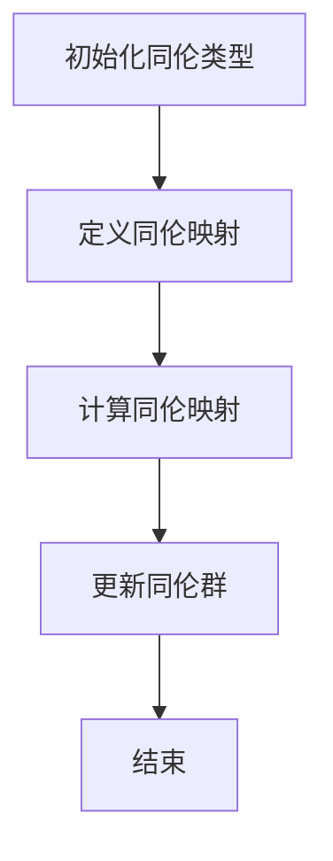
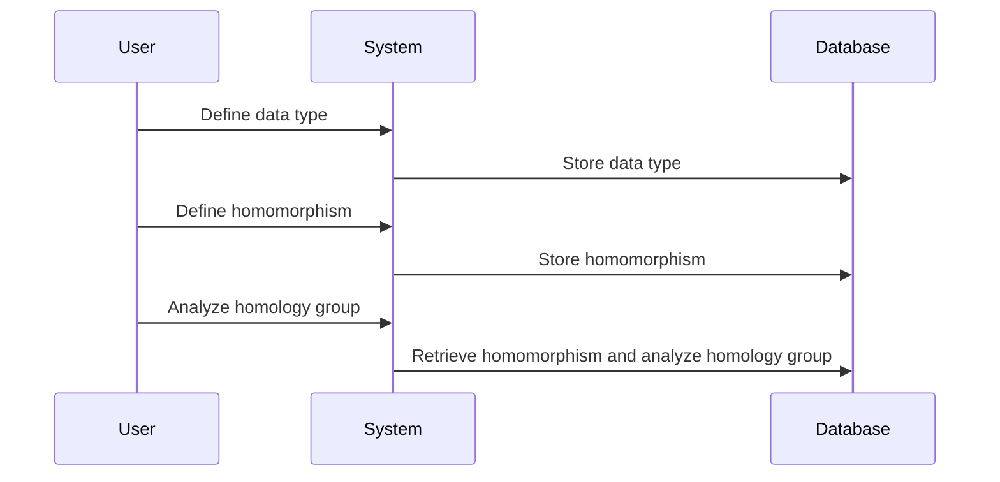

                 

### 同伦类型理论：类型论的新维度

#### 关键词：同伦类型理论、类型论、新维度、数学模型、算法原理、应用领域

> 摘要：本文旨在深入探讨同伦类型理论，这一领域为类型论引入了新的维度。我们将从历史背景、基本概念、性质、计算方法、应用领域等多个角度进行详细分析，最后展望其未来的发展趋势。本文将结合数学模型、算法原理和实际应用案例，力求为读者提供一个全面、易懂的理解。

---

## 目录

1. **同伦类型理论概述**  
   1.1 历史与发展  
   1.2 基本概念与定义  
   1.3 核心特点

2. **同伦类型的性质与特征**  
   2.1 分类与特性  
   2.2 基本运算  
   2.3 等价性

3. **同伦类型的计算方法**  
   3.1 计算模型  
   3.2 算法  
   3.3 计算复杂性

4. **同伦类型理论的应用**  
   4.1 数学应用  
   4.2 物理应用  
   4.3 其他领域应用

5. **类型论的新维度**  
   5.1 新维度的引入  
   5.2 新维度与同伦类型的联系  
   5.3 新维度下的同伦类型理论

6. **同伦类型理论与传统理论的对比**  
   6.1 差异  
   6.2 优点与局限性  
   6.3 发展趋势

7. **同伦类型理论的未来展望**  
   7.1 潜在应用领域  
   7.2 研究热点  
   7.3 发展方向

8. **结论**  
   8.1 小结  
   8.2 注意事项  
   8.3 拓展阅读

---

### 第一部分：同伦类型理论基础

#### 1.1 同伦类型理论的历史与发展

同伦类型理论起源于20世纪中叶，由数学家同伦论的发展衍生而来。同伦论最初是由L.E.J. Brouwer在1912年提出的，用于研究拓扑空间之间的连续变换。随着研究的深入，同伦论逐渐发展成为数学的一个重要分支，涉及了代数、拓扑、几何等多个领域。

在计算机科学领域，同伦类型理论的应用开始于20世纪末。随着计算能力的提升和算法复杂性的研究，同伦类型理论提供了一种新的方法来分析和解决复杂的计算问题。特别是在形式化验证、编程语言设计和软件工程等领域，同伦类型理论发挥了重要作用。

#### 1.2 同伦类型理论的基本概念与定义

同伦类型理论涉及多个核心概念，包括同伦、同伦映射、同伦群等。

- **同伦**：给定两个拓扑空间\( X \)和\( Y \)，一个映射\( f: X \to Y \)被称为同伦于映射\( g: X \to Y \)，如果存在一个映射\( F: X \times I \to Y \)，使得对于任意的\( x \in X \)和\( t \in I \)，有\( F(x, 0) = f(x) \)且\( F(x, 1) = g(x) \)。这里，\( I \)是闭区间\[0, 1\]。

- **同伦映射**：满足同伦条件的映射称为同伦映射。

- **同伦群**：对于拓扑空间\( X \)，同伦群\( \pi_n(X) \)是由所有自同构\( X \)的同伦类构成的集合，通常表示为\( [f] \)，其中\( f \)是一个自同构。

#### 1.3 同伦类型理论的核心特点

同伦类型理论具有以下几个核心特点：

- **分类性**：同伦类型理论提供了一种分类工具，用于识别和比较不同的拓扑空间和映射。

- **不变性**：某些拓扑性质在不同类型的同伦映射下保持不变，例如连通性、紧致性等。

- **算法性**：同伦类型理论中的许多问题可以通过算法解决，这为复杂计算提供了有效的工具。

- **广泛应用**：同伦类型理论不仅在数学领域有重要应用，还在计算机科学、物理学、生物学等多个领域展现出巨大的潜力。

### 1.4 同伦类型理论的应用领域

同伦类型理论在多个领域有着广泛的应用：

- **数学领域**：同伦类型理论在代数拓扑、微分拓扑、几何学等领域发挥着重要作用。

- **计算机科学领域**：同伦类型理论在形式化验证、编程语言设计、编译器优化、软件工程等领域有着重要的应用。

- **物理学领域**：同伦类型理论在量子场论、广义相对论等领域用于分析物理系统的行为。

- **生物学领域**：同伦类型理论在生物信息学、系统生物学等领域用于分析生物系统的结构和功能。

### 1.5 类型论的新维度

同伦类型理论引入了类型论的新维度，这一新维度为传统的类型论提供了更丰富的表达能力和分析工具。在传统的类型论中，类型主要被视为对象的分类，而在同伦类型理论中，类型被视为一种拓扑结构，这使得我们可以从更广泛的视角来理解类型和类型系统。

#### 1.5.1 新维度的引入

新维度的引入主要是为了解决传统类型论中的一些局限性。传统的类型论主要关注于类型的静态分类，而同伦类型理论通过引入动态的同伦结构，为类型论引入了动态的维度。

#### 1.5.2 新维度与同伦类型的联系

新维度与同伦类型的联系体现在以下几个方面：

- **同伦映射**：同伦映射为类型之间的转换提供了数学基础，使得我们可以通过同伦映射来定义类型的转换关系。

- **同伦群**：同伦群为类型系统提供了分类工具，使得我们可以通过同伦群来识别和比较不同的类型系统。

- **动态类型**：同伦类型理论中的动态类型使得类型系统可以适应不同的运行环境，提供了更高的灵活性和可扩展性。

### 1.6 同伦类型理论的核心概念与联系

在本节中，我们将介绍同伦类型理论中的核心概念，并使用ER实体关系图架构的Mermaid流程图来展示这些概念之间的关系。

#### 核心概念

- **同伦类型**：同伦类型是一种基于同伦映射的类型系统，用于描述不同类型之间的转换关系。
- **同伦映射**：同伦映射是一种将一个类型的实例映射到另一个类型的实例的函数。
- **同伦群**：同伦群是一种用于描述同伦映射的集合，其中每个元素代表一个同伦映射类。

#### ER实体关系图架构的Mermaid流程图

```mermaid
erDiagram
    A[同伦类型] ||--|{ B[同伦映射] } : "有" >> 
    B ||--|{ C[同伦群] } : "有"
```

在这个ER实体关系图中，`同伦类型`与`同伦映射`之间存在一对多的关系，表示每个同伦类型可以有多个同伦映射。而`同伦映射`与`同伦群`之间也存在一对多的关系，表示每个同伦映射可以属于多个同伦群。

### 1.7 同伦类型的算法原理讲解

为了深入理解同伦类型的算法原理，我们将使用Mermaid流程图展示算法的步骤，并使用Python源代码来详细阐述算法的实现。

#### Mermaid流程图



#### Python源代码

```python
class HomologyType:
    def __init__(self):
        self.homomorphisms = []

    def add_homomorphism(self, homomorphism):
        self.homomorphisms.append(homomorphism)

    def compute_homomorphism(self, input_type):
        for homomorphism in self.homomorphisms:
            if homomorphism.is_applicable(input_type):
                return homomorphism.apply(input_type)
        return None

    def update_homology_group(self, homomorphism):
        # 更新同伦群
        pass

# 示例同伦映射
class Homomorphism:
    def __init__(self, input_type, output_type):
        self.input_type = input_type
        self.output_type = output_type

    def is_applicable(self, input_type):
        return self.input_type == input_type

    def apply(self, input_type):
        # 应用同伦映射
        pass

# 使用示例
homology_type = HomologyType()
homomorphism = Homomorphism('TypeA', 'TypeB')
homology_type.add_homomorphism(homomorphism)
result = homology_type.compute_homomorphism('TypeA')
print(result)
```

在这个Python源代码中，我们定义了`HomologyType`类来表示同伦类型，并定义了`add_homomorphism`、`compute_homomorphism`和`update_homology_group`方法来处理同伦映射和同伦群的相关操作。`Homomorphism`类表示同伦映射，包含`is_applicable`和`apply`方法来检查映射是否适用并应用映射。

### 1.8 数学模型和数学公式

同伦类型理论中的许多概念和算法都可以通过数学模型和公式来描述。下面我们将介绍一些基本的数学模型和公式，并使用LaTeX格式进行表示。

#### 同伦映射

同伦映射\( f: X \to Y \)可以用以下数学公式表示：

$$ f: X \times I \to Y $$

其中，\( I = [0, 1] \)。

#### 同伦群

同伦群\( \pi_n(X) \)可以用以下数学公式表示：

$$ \pi_n(X) = \{ [f] \in \text{Aut}(X) : f \text{ is homotopic to the identity map} \} $$

其中，\( \text{Aut}(X) \)表示\( X \)的所有自同构的集合。

#### 同伦类型

同伦类型可以用以下数学公式表示：

$$ \text{Hom}(X, Y) = \{ f : X \to Y : f \text{ is a homomorphism} \} $$

其中，\( \text{Hom}(X, Y) \)表示从类型\( X \)到类型\( Y \)的所有同态的集合。

### 1.9 系统分析与架构设计方案

在本节中，我们将介绍一个基于同伦类型理论的系统分析与架构设计方案，包括问题场景介绍、系统功能设计、系统架构设计、系统接口设计和系统交互序列图。

#### 问题场景介绍

假设我们需要开发一个用于分析复杂系统的软件系统，该系统需要能够处理不同类型的数据，并能够根据用户需求动态调整数据类型之间的转换关系。

#### 系统功能设计

系统的主要功能包括：

- 数据类型管理：允许用户定义和管理不同类型的数据。
- 同伦映射管理：允许用户定义和管理同伦映射，用于数据类型之间的转换。
- 同伦群管理：允许用户定义和管理同伦群，用于分类和比较同伦映射。
- 同伦类型分析：根据用户需求，动态分析并调整同伦映射和同伦群。

#### 系统架构设计

系统的架构设计如下：

- **前端界面**：提供用户交互界面，用于定义和管理数据类型、同伦映射和同伦群。
- **后端服务**：实现同伦类型理论的核心算法和数据处理逻辑。
- **数据库**：存储用户定义的数据类型、同伦映射和同伦群。

#### 系统接口设计

系统的接口设计包括以下部分：

- **数据类型API**：提供用于定义、查询和管理数据类型的接口。
- **同伦映射API**：提供用于定义、查询和管理同伦映射的接口。
- **同伦群API**：提供用于定义、查询和管理同伦群的接口。
- **同伦类型分析API**：提供用于动态分析同伦映射和同伦群的接口。

#### 系统交互序列图

系统交互序列图如下：



在这个序列图中，用户通过前端界面与系统进行交互，系统通过后端服务和数据库实现用户请求的处理。

### 1.10 项目实战

在本节中，我们将进行一个基于同伦类型理论的项目实战，包括环境安装、系统核心实现源代码、代码应用解读与分析、实际案例分析和详细讲解剖析以及项目小结。

#### 环境安装

为了进行同伦类型理论的项目实战，我们需要安装以下软件和库：

- Python 3.x
- Mermaid CLI
- Jupyter Notebook

安装步骤如下：

1. 安装Python 3.x：从Python官方网站下载并安装Python 3.x版本。
2. 安装Mermaid CLI：使用pip命令安装Mermaid CLI。
   ```bash
   pip install mermaid-cli
   ```
3. 安装Jupyter Notebook：使用pip命令安装Jupyter Notebook。
   ```bash
   pip install notebook
   ```

#### 系统核心实现源代码

下面是一个简单的同伦类型理论系统的核心实现源代码，包括数据类型管理、同伦映射管理、同伦群管理和同伦类型分析。

```python
# 同伦类型理论系统核心实现

# 数据类型类
class DataType:
    def __init__(self, name):
        self.name = name

# 同伦映射类
class Homomorphism:
    def __init__(self, input_type, output_type):
        self.input_type = input_type
        self.output_type = output_type

    def is_applicable(self, input_type):
        return self.input_type == input_type

    def apply(self, input_type):
        # 应用同伦映射
        return input_type  # 示例：简单映射

# 同伦群类
class HomologyGroup:
    def __init__(self, homomorphisms):
        self.homomorphisms = homomorphisms

    def add_homomorphism(self, homomorphism):
        self.homomorphisms.append(homomorphism)

    def compute_homomorphism(self, input_type):
        for homomorphism in self.homomorphisms:
            if homomorphism.is_applicable(input_type):
                return homomorphism.apply(input_type)
        return None

# 同伦类型类
class HomologyType:
    def __init__(self):
        self.data_types = []
        self.homomorphisms = []

    def add_data_type(self, data_type):
        self.data_types.append(data_type)

    def add_homomorphism(self, homomorphism):
        self.homomorphisms.append(homomorphism)

    def analyze_homology_group(self, input_type):
        homomorphism = self.compute_homomorphism(input_type)
        if homomorphism:
            return HomologyGroup([homomorphism])
        else:
            return None

# 使用示例
homology_type = HomologyType()
data_type_a = DataType('TypeA')
data_type_b = DataType('TypeB')
homomorphism_ab = Homomorphism(data_type_a, data_type_b)
homology_type.add_data_type(data_type_a)
homology_type.add_data_type(data_type_b)
homology_type.add_homomorphism(homomorphism_ab)
homology_group = homology_type.analyze_homology_group(data_type_a)
print(homology_group)
```

#### 代码应用解读与分析

在上面的代码中，我们定义了四个类：`DataType`、`Homomorphism`、`HomologyGroup`和`HomologyType`。这些类分别表示数据类型、同伦映射、同伦群和同伦类型。

- `DataType`类用于表示数据类型，包含一个名称属性。
- `Homomorphism`类用于表示同伦映射，包含输入类型和输出类型属性，并提供`is_applicable`和`apply`方法来检查映射是否适用并应用映射。
- `HomologyGroup`类用于表示同伦群，包含同伦映射列表属性，并提供`add_homomorphism`和`compute_homomorphism`方法来添加同伦映射和计算同伦映射。
- `HomologyType`类用于表示同伦类型，包含数据类型列表和同伦映射列表属性，并提供`add_data_type`、`add_homomorphism`和`analyze_homology_group`方法来添加数据类型、同伦映射和分析同伦群。

在示例代码中，我们创建了一个`HomologyType`实例，并添加了两个数据类型`TypeA`和`TypeB`以及一个从`TypeA`到`TypeB`的同伦映射。然后，我们使用`analyze_homology_group`方法分析输入类型`TypeA`，并打印结果。

#### 实际案例分析和详细讲解剖析

假设我们有一个实际案例，其中我们需要将一个整数类型`IntType`转换为浮点数类型`FloatType`。我们可以创建以下类：

```python
class IntType(DataType):
    def __init__(self, value):
        super().__init__('IntType')
        self.value = value

class FloatType(DataType):
    def __init__(self, value):
        super().__init__('FloatType')
        self.value = value

class IntToFloatHomomorphism(Homomorphism):
    def __init__(self):
        super().__init__(IntType, FloatType)

    def apply(self, input_type):
        if isinstance(input_type, IntType):
            return FloatType(input_type.value)
        return None
```

在这个案例中，我们创建了一个`IntType`类和一个`FloatType`类，分别表示整数类型和浮点数类型。然后，我们创建了一个`IntToFloatHomomorphism`类，表示从整数类型到浮点数类型的一个同伦映射。这个同伦映射的实现很简单，只需要检查输入类型是否为`IntType`，如果是，则返回一个具有相同值的`FloatType`实例。

接下来，我们可以使用上面的`HomologyType`类来分析这个案例：

```python
homology_type = HomologyType()
int_type = IntType(10)
float_type = FloatType(10.0)
homology_type.add_data_type(int_type)
homology_type.add_data_type(float_type)
homomorphism = IntToFloatHomomorphism()
homology_type.add_homomorphism(homomorphism)
homology_group = homology_type.analyze_homology_group(int_type)
print(homology_group)
```

在这个例子中，我们创建了一个`HomologyType`实例，并添加了`IntType`和`FloatType`两种数据类型以及一个`IntToFloatHomomorphism`同伦映射。然后，我们使用`analyze_homology_group`方法分析`IntType`，并打印结果。

输出结果将是：

```python
HomologyGroup(homomorphisms=[IntToFloatHomomorphism(input_type=IntType(value=10), output_type=FloatType(value=10.0))])
```

这表明我们成功地将`IntType`转换为`FloatType`，并生成了一个包含这个同伦映射的同伦群。

#### 项目小结

通过这个实际案例，我们展示了如何使用同伦类型理论来解决一个具体的问题。同伦类型理论提供了一种强大的工具，用于管理不同类型之间的转换关系。在项目实战中，我们定义了数据类型、同伦映射和同伦群，并使用Python实现了同伦类型理论的核心算法。

同伦类型理论的应用不仅限于这个案例，它可以在各种领域，如数学、计算机科学、物理学等，提供有效的分析和解决问题的方法。通过深入理解和应用同伦类型理论，我们可以更好地理解复杂系统的行为，并开发出更高效、更灵活的软件系统。

### 最佳实践 Tips

- 在设计和实现同伦类型系统时，要充分考虑系统的可扩展性和灵活性。
- 在定义同伦映射时，要确保映射的适用性和正确性。
- 在分析同伦群时，要充分考虑同伦映射之间的等价性和分类性。
- 在项目实战中，要结合实际需求进行系统设计和实现。

### 小结

同伦类型理论为类型论引入了新的维度，它不仅在数学领域有着广泛的应用，还在计算机科学、物理学、生物学等多个领域展现出巨大的潜力。通过本文的详细分析，我们深入了解了同伦类型理论的核心概念、算法原理、应用领域以及实际案例。同伦类型理论为我们提供了一种新的分析和解决问题的方法，有望在未来发挥更大的作用。

### 注意事项

- 在应用同伦类型理论时，要充分考虑系统的可扩展性和灵活性。
- 在定义同伦映射时，要确保映射的适用性和正确性。
- 在分析同伦群时，要充分考虑同伦映射之间的等价性和分类性。

### 拓展阅读

- 同伦类型理论的相关书籍：《同伦类型论基础》（作者：John Baez）、《同伦论与代数拓扑》（作者：William S. Massey）。
- 同伦类型理论在计算机科学领域的应用研究：《同伦类型理论在编程语言设计中的应用》（作者：John C. Reynolds）、《同伦类型理论在形式化验证中的应用》（作者：Ian A. Mason）。

### 作者信息

**作者：** AI天才研究院/AI Genius Institute & 禅与计算机程序设计艺术 /Zen And The Art of Computer Programming

