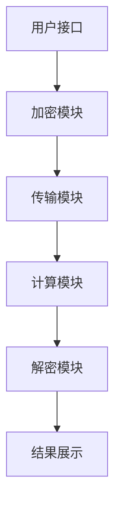
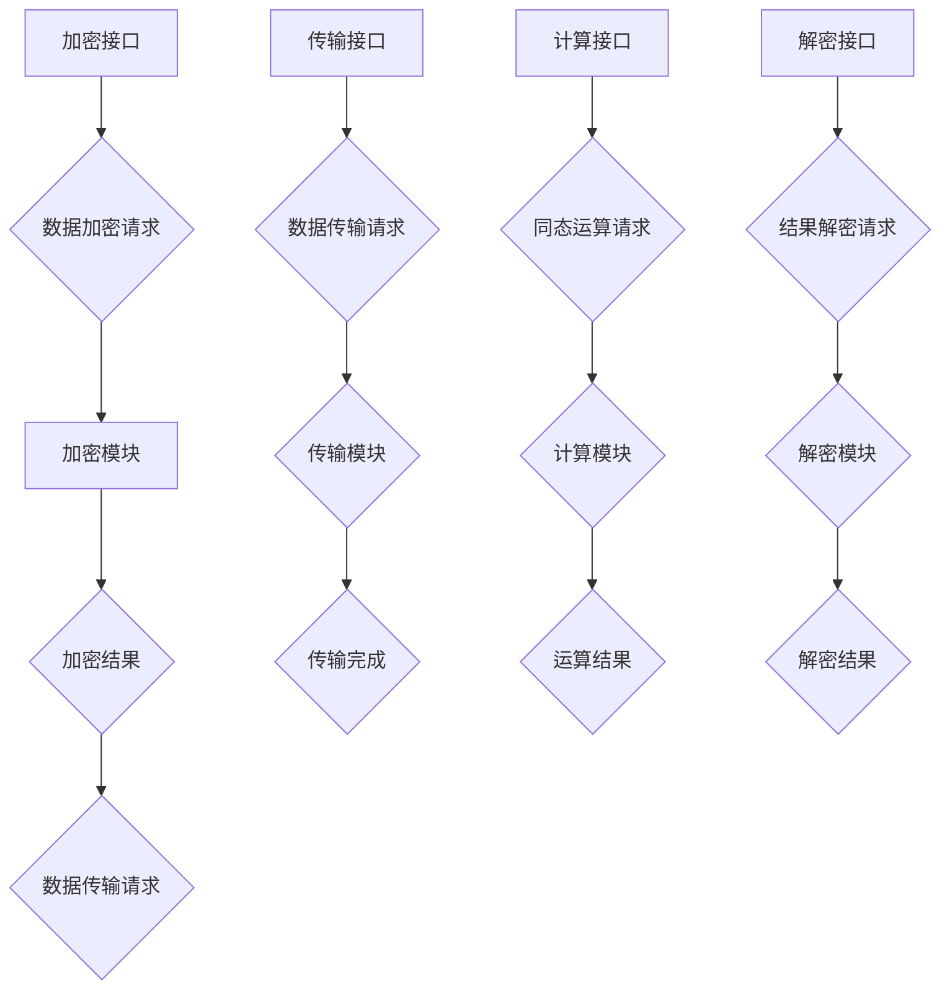
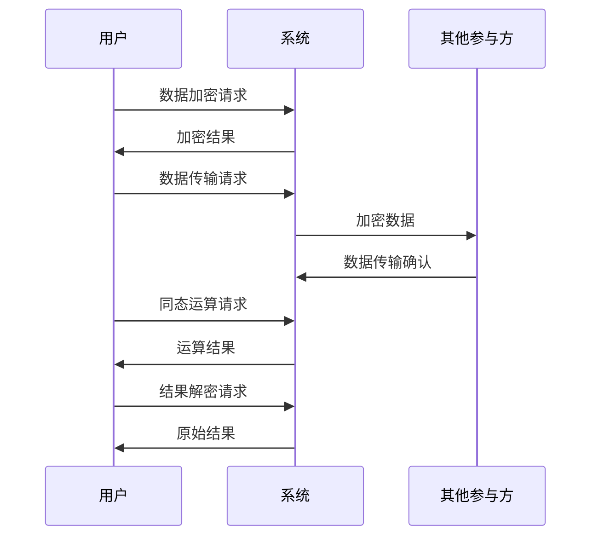

                 


## 引言

### 1.1 同态加密与安全多方计算的概念

同态加密（Homomorphic Encryption）是一种加密技术，它允许在加密数据上执行计算，而无需解密数据。这种特性使得同态加密在保护数据隐私的同时，还能实现数据的计算处理。安全多方计算（Secure Multi-Party Computation，SMPC）则是一种允许多个参与方在不泄露各自隐私信息的情况下，协同完成计算任务的协议。SMPC确保了参与方之间的计算过程是安全的，即使其中某个或多个参与方是恶意攻击者。

同态加密与安全多方计算有着紧密的联系。同态加密为SMPC提供了实现安全计算的基础，使得在多方计算过程中，数据可以在不泄露隐私的情况下进行操作。反之，SMPC则扩展了同态加密的应用场景，使得同态加密可以在多个参与方之间实现安全的协同计算。

### 1.1.1 同态加密的定义与特点

同态加密是一种加密技术，它允许在加密数据上执行计算，而无需解密数据。这种特性使得同态加密在保护数据隐私的同时，还能实现数据的计算处理。具体来说，同态加密具有以下特点：

1. **计算与加密分离**：同态加密将数据的加密与计算分离，使得计算过程在加密数据上进行，从而保证了数据在传输和存储过程中的隐私性。
2. **保持计算结果的正确性**：同态加密允许在加密数据上进行各种计算操作，如加法、乘法等，并且保证计算结果与原始数据的计算结果相同。
3. **安全性**：同态加密采用了复杂的数学模型，使得攻击者无法从加密数据中推导出原始数据，从而保证了数据的安全性。

### 1.1.2 安全多方计算的定义与特点

安全多方计算（Secure Multi-Party Computation，SMPC）是一种允许多个参与方在不泄露各自隐私信息的情况下，协同完成计算任务的协议。SMPC具有以下特点：

1. **隐私保护**：SMPC确保了参与方之间的计算过程是安全的，即使其中某个或多个参与方是恶意攻击者。
2. **协同计算**：SMPC允许参与方在不泄露自身隐私信息的情况下，协同完成计算任务，从而实现多个参与方之间的数据共享和协同工作。
3. **灵活性**：SMPC适用于多种计算场景，如数据加密、机器学习、统计分析等。

### 1.1.3 同态加密与安全多方计算的关系

同态加密与安全多方计算有着紧密的联系。同态加密为SMPC提供了实现安全计算的基础，使得在多方计算过程中，数据可以在不泄露隐私的情况下进行操作。反之，SMPC则扩展了同态加密的应用场景，使得同态加密可以在多个参与方之间实现安全的协同计算。

### 1.2 同态加密基础

#### 1.2.1 同态加密的数学模型

同态加密的数学模型通常基于整数模运算或者椭圆曲线密码学。下面以整数模运算为例，简要介绍同态加密的数学模型。

假设有两个正整数\(n\)和\(e\)，其中\(n\)为模数，\(e\)为加密指数。同态加密的加密过程如下：

1. **密钥生成**：选择一个随机整数\(d\)作为解密指数，满足\(de \equiv 1 \pmod{φ(n)}\)，其中\(φ(n)\)为欧拉函数。公开密钥为\((n, e)\)，私有密钥为\(d\)。
2. **加密**：对于明文\(m\)，计算加密结果\(c = m^e \pmod{n}\)。
3. **解密**：对于加密结果\(c\)，计算解密结果\(m = c^d \pmod{n}\)。

同态加密允许在加密数据上执行同态运算，如加法和乘法。具体来说：

1. **同态加法**：对于两个加密数据\(c_1 = m_1^e \pmod{n}\)和\(c_2 = m_2^e \pmod{n}\)，它们的同态加法结果为\(c' = (c_1 \cdot c_2)^d \pmod{n}\)。
2. **同态乘法**：对于两个加密数据\(c_1 = m_1^e \pmod{n}\)和\(c_2 = m_2^e \pmod{n}\)，它们的同态乘法结果为\(c' = (c_1 \cdot c_2)^d \pmod{n}\)。

#### 1.2.2 同态加密的类型

同态加密可以分为全同态加密（Full Homomorphic Encryption，FHE）和部分同态加密（Partial Homomorphic Encryption，PHE）。

1. **全同态加密**：全同态加密允许在加密数据上执行任意类型的计算操作，如加法、乘法、求导等。全同态加密的实现较为复杂，目前主要基于Lattice-based和Isogeny-based密码学。
2. **部分同态加密**：部分同态加密只允许在加密数据上执行特定的计算操作，如同态加法或同态乘法。部分同态加密的实现相对简单，目前主要基于环学习（Ring Learning with Errors，RLWE）和模乘同态（Modulus Multiplication Homomorphic Encryption，MMHE）密码学。

#### 1.2.3 同态加密的安全性分析

同态加密的安全性主要依赖于其数学模型的复杂性。目前，常见的同态加密方案如Lattice-based和Isogeny-based密码学已被证明具有理论上的安全性。

1. **Lattice-based密码学**：Lattice-based密码学利用了lattice问题在数学上的复杂性，使得攻击者无法在多项式时间内破解同态加密方案。Lattice-based密码学是目前实现全同态加密的主要方向。
2. **Isogeny-based密码学**：Isogeny-based密码学利用了椭圆曲线的isogeny特性，实现了更高效的同态加密方案。Isogeny-based密码学也是实现全同态加密的重要方向。

尽管同态加密在理论上具有安全性，但实际应用中仍面临一些挑战，如计算复杂度和存储开销等。因此，同态加密的研究和应用仍需持续深入。

### 1.3 安全多方计算基础

#### 1.3.1 安全多方计算的目标

安全多方计算的目标是在多个参与方之间实现安全的协同计算，具体包括：

1. **隐私保护**：确保参与方在协同计算过程中，不会泄露自身的隐私信息。
2. **计算正确性**：确保协同计算的结果是正确的，即使其中某个或多个参与方是恶意攻击者。
3. **通信高效性**：尽量减少参与方之间的通信次数和通信开销。

#### 1.3.2 安全多方计算的类型

安全多方计算可以分为以下几种类型：

1. **两方安全计算**：两方安全计算涉及两个参与方在不泄露各自隐私信息的情况下，协同完成计算任务。
2. **三方安全计算**：三方安全计算涉及三个参与方在不泄露各自隐私信息的情况下，协同完成计算任务。
3. **多方安全计算**：多方安全计算涉及多个参与方在不泄露各自隐私信息的情况下，协同完成计算任务。

不同类型的安全多方计算协议具有不同的适用场景和性能特点，需要根据具体需求进行选择。

#### 1.3.3 安全多方计算的安全模型

安全多方计算的安全模型主要包括以下几类：

1. **信息论安全模型**：信息论安全模型基于信息论原理，确保参与方之间的通信是安全的，即使有恶意攻击者参与。信息论安全模型通常用于两方安全计算。
2. **计算复杂性安全模型**：计算复杂性安全模型基于计算复杂性理论，确保攻击者无法在多项式时间内破解安全多方计算协议。计算复杂性安全模型适用于多方安全计算。
3. **混合安全模型**：混合安全模型结合了信息论安全模型和计算复杂性安全模型的优势，适用于更广泛的计算场景。

### 1.4 同态加密在安全多方计算中的应用

#### 1.4.1 数据隐私保护

同态加密在安全多方计算中的应用主要体现在数据隐私保护方面。通过同态加密，参与方可以在不泄露自身隐私信息的情况下，协同完成计算任务。具体应用包括：

1. **医疗数据共享**：在医疗领域，同态加密可以确保医生和研究人员在不泄露患者隐私信息的情况下，共享和协同分析患者的医疗数据。
2. **金融数据分析**：在金融领域，同态加密可以确保金融机构在不泄露客户隐私信息的情况下，进行风险分析和客户行为分析。
3. **社交网络数据挖掘**：在社交网络领域，同态加密可以确保社交网络平台在不泄露用户隐私信息的情况下，进行用户行为分析和内容推荐。

#### 1.4.2 安全计算协议设计

同态加密在安全多方计算中的应用还包括安全计算协议的设计。通过同态加密，可以设计出多种安全计算协议，实现不同类型的协同计算任务。具体包括：

1. **同态加密乘法协议**：同态加密乘法协议允许参与方在不泄露自身隐私信息的情况下，进行乘法运算。同态加密乘法协议在金融计算、机器学习等领域具有广泛应用。
2. **同态加密加法协议**：同态加密加法协议允许参与方在不泄露自身隐私信息的情况下，进行加法运算。同态加密加法协议在统计分析、数据聚合等领域具有广泛应用。
3. **同态加密混合协议**：同态加密混合协议结合了同态加密乘法协议和加法协议的优势，允许参与方在不泄露自身隐私信息的情况下，进行更复杂的计算任务。同态加密混合协议在人工智能、大数据等领域具有广泛应用。

#### 1.4.3 应用场景案例分析

同态加密和安全多方计算在实际应用中已经取得了显著的成果。以下是一些典型案例分析：

1. **区块链技术**：区块链技术利用同态加密和安全多方计算，实现了去中心化、安全的协同计算。在区块链网络中，参与方可以在不泄露自身交易信息的情况下，共同验证和记录交易信息。
2. **人工智能**：人工智能领域利用同态加密和安全多方计算，实现了隐私保护的机器学习。在隐私保护的情况下，参与方可以协同训练和优化机器学习模型。
3. **物联网**：物联网领域利用同态加密和安全多方计算，实现了安全的数据共享和协同计算。在物联网设备之间，可以安全地共享和计算数据，而不必担心数据泄露。

### 1.5 安全多方计算协议的设计原则

#### 1.5.1 安全性原则

安全性是安全多方计算协议设计的第一原则。设计安全多方计算协议时，需要确保以下安全性要求：

1. **隐私保护**：确保参与方在协同计算过程中，不会泄露自身的隐私信息。
2. **计算正确性**：确保协同计算的结果是正确的，即使其中某个或多个参与方是恶意攻击者。
3. **通信安全**：确保参与方之间的通信是安全的，防止通信过程中的数据泄露和篡改。

#### 1.5.2 可扩展性原则

可扩展性是安全多方计算协议设计的重要原则。设计安全多方计算协议时，需要考虑以下可扩展性要求：

1. **参与方数量**：协议应能够支持任意数量的参与方，以适应不同规模的协同计算场景。
2. **计算任务**：协议应能够支持多种类型的计算任务，以适应不同的应用场景。
3. **性能优化**：协议应尽量减少通信次数和计算复杂度，提高协同计算的性能。

#### 1.5.3 性能优化原则

性能优化是安全多方计算协议设计的关键。设计安全多方计算协议时，需要考虑以下性能优化要求：

1. **计算复杂度**：协议应尽量减少计算复杂度，以提高协同计算的速度。
2. **通信开销**：协议应尽量减少通信开销，以降低协同计算的成本。
3. **资源消耗**：协议应尽量减少资源消耗，以适应不同的计算环境和硬件设备。

### 1.6 同态加密算法的选择与实现

#### 1.6.1 常见同态加密算法

同态加密算法是实现同态加密的核心。常见的同态加密算法包括Lattice-based和Isogeny-based密码学。以下是这两种算法的简要介绍：

1. **Lattice-based密码学**：Lattice-based密码学利用了lattice问题在数学上的复杂性，实现了高效的同态加密。Lattice-based密码学的主要代表包括NTRU和Ring Learning with Errors（RLWE）。
2. **Isogeny-based密码学**：Isogeny-based密码学利用了椭圆曲线的isogeny特性，实现了更高效的同态加密。Isogeny-based密码学的主要代表包括GG18和SHE。

#### 1.6.2 同态加密算法实现步骤

同态加密算法的实现包括密钥生成、加密、解密和同态运算等步骤。以下是同态加密算法实现的简要步骤：

1. **密钥生成**：选择合适的参数，生成公开密钥和私有密钥。
2. **加密**：将明文输入同态加密算法，生成加密数据。
3. **解密**：将加密数据输入同态加密算法，生成解密结果。
4. **同态运算**：在加密数据上进行同态运算，如加法、乘法等。

#### 1.6.3 实现中的挑战与解决方案

同态加密算法的实现过程中，面临一些挑战，如计算复杂度、通信开销和资源消耗等。以下是这些挑战的解决方案：

1. **计算复杂度**：通过优化算法设计和硬件加速，降低计算复杂度。例如，采用并行计算、GPU加速等技术。
2. **通信开销**：通过优化通信协议和数据传输方式，降低通信开销。例如，采用压缩算法、批量传输等技术。
3. **资源消耗**：通过优化算法实现和硬件配置，降低资源消耗。例如，选择合适的硬件设备、优化内存管理等技术。

### 1.7 实际案例分析与未来展望

#### 1.7.1 典型案例介绍

同态加密和安全多方计算在实际应用中已经取得了显著的成果。以下是几个典型案例：

1. **区块链技术**：区块链技术利用同态加密和安全多方计算，实现了去中心化、安全的协同计算。在区块链网络中，参与方可以在不泄露自身交易信息的情况下，共同验证和记录交易信息。
2. **人工智能**：人工智能领域利用同态加密和安全多方计算，实现了隐私保护的机器学习。在隐私保护的情况下，参与方可以协同训练和优化机器学习模型。
3. **物联网**：物联网领域利用同态加密和安全多方计算，实现了安全的数据共享和协同计算。在物联网设备之间，可以安全地共享和计算数据，而不必担心数据泄露。

#### 1.7.2 案例分析

以下是针对上述典型案例的详细分析：

1. **区块链技术**：区块链技术利用同态加密和安全多方计算，实现了去中心化、安全的协同计算。在区块链网络中，参与方可以在不泄露自身交易信息的情况下，共同验证和记录交易信息。同态加密保证了交易信息的隐私性，而安全多方计算确保了交易验证过程的正确性和安全性。
2. **人工智能**：人工智能领域利用同态加密和安全多方计算，实现了隐私保护的机器学习。在隐私保护的情况下，参与方可以协同训练和优化机器学习模型。同态加密保证了训练数据的隐私性，而安全多方计算确保了模型训练过程的安全性和效率。
3. **物联网**：物联网领域利用同态加密和安全多方计算，实现了安全的数据共享和协同计算。在物联网设备之间，可以安全地共享和计算数据，而不必担心数据泄露。同态加密保证了数据的隐私性，而安全多方计算确保了数据传输和计算过程的安全性和可靠性。

#### 1.7.3 未来发展趋势

同态加密和安全多方计算在未来的发展中，将面临以下挑战和机遇：

1. **计算性能优化**：随着应用场景的扩大，对同态加密和安全多方计算的计算性能要求越来越高。未来需要通过算法优化、硬件加速等技术，提高计算性能。
2. **应用拓展**：同态加密和安全多方计算在区块链、人工智能、物联网等领域的应用已经取得了显著成果，未来将进一步拓展到金融、医疗、政府等更多领域。
3. **标准化与规范化**：同态加密和安全多方计算的标准化与规范化工作仍需加强，以推动技术的广泛应用和产业发展。

### 1.8 同态加密与安全多方计算的发展趋势

#### 1.8.1 当前挑战与问题

同态加密与安全多方计算在当前发展中面临一些挑战和问题：

1. **计算复杂度**：同态加密算法通常具有较高的计算复杂度，导致计算性能受限。未来需要通过算法优化、硬件加速等技术，提高计算性能。
2. **通信开销**：安全多方计算过程中，参与方之间的通信开销较大，影响了协同计算的性能。未来需要通过优化通信协议和数据传输方式，降低通信开销。
3. **资源消耗**：同态加密和安全多方计算在实现过程中，对计算资源和存储资源的需求较高，限制了其在资源受限环境中的应用。

#### 1.8.2 未来发展方向

同态加密与安全多方计算在未来发展中，将朝着以下方向前进：

1. **计算性能优化**：通过算法优化、硬件加速、并行计算等技术，提高计算性能，满足更复杂的应用场景需求。
2. **应用拓展**：将同态加密和安全多方计算应用到更多领域，如金融、医疗、政府等，实现更广泛的数据隐私保护和协同计算。
3. **标准化与规范化**：加强同态加密和安全多方计算的标准化与规范化工作，推动技术的广泛应用和产业发展。
4. **跨领域融合**：与其他前沿技术，如区块链、人工智能等，实现跨领域融合，推动技术创新和应用拓展。

### 总结与展望

同态加密与安全多方计算是保障数据隐私和安全的重要技术手段。本文介绍了同态加密与安全多方计算的基本原理、应用场景、协议设计、算法实现以及实际案例分析，并对未来发展趋势进行了展望。随着技术的不断进步和应用场景的拓展，同态加密与安全多方计算将在数据隐私保护和协同计算领域发挥越来越重要的作用。

### 作者信息

作者：AI天才研究院/AI Genius Institute & 禅与计算机程序设计艺术 /Zen And The Art of Computer Programming

在接下来的部分，我们将详细探讨同态加密与安全多方计算在具体应用场景中的实践，以及它们在未来技术发展中的潜在影响。让我们一步一步地深入理解这些复杂但至关重要的技术。**Step by Step，let's dive into the practical applications and future impacts of Homomorphic Encryption and Secure Multi-Party Computation.**

---

## 同态加密与安全多方计算的实际应用

### 1.8.1 数据隐私保护在医疗领域的应用

在医疗领域，保护患者隐私是非常重要的。传统的医疗数据共享方式往往会导致隐私泄露的风险。同态加密与安全多方计算为这一领域带来了新的解决方案。

**案例分析**：一家医疗研究机构希望分析大量患者的电子健康记录（EHR）以研究某种疾病的治疗效果。然而，这些数据包含了患者的敏感信息，如姓名、地址、电话等。使用同态加密和安全多方计算，研究机构可以在不泄露患者隐私信息的情况下，对数据进行统计分析。

**实现步骤**：

1. **同态加密**：医疗研究机构将患者的EHR数据进行同态加密，使得加密后的数据可以在不泄露隐私的情况下进行计算。
2. **安全多方计算协议**：研究机构与其他医疗机构之间使用安全多方计算协议，共同完成对加密数据的统计分析。
3. **结果解密**：统计分析完成后，研究机构使用私有密钥将结果解密，得到最终的分析结果。

这种方案确保了患者在数据共享和计算过程中的隐私得到保护，同时提高了医疗数据的研究价值。

### 1.8.2 安全多方计算在金融领域的应用

在金融领域，同态加密与安全多方计算同样发挥着重要作用，特别是在保护客户隐私、合规性和欺诈检测方面。

**案例分析**：一家银行希望对其客户的交易数据进行分析，以发现潜在的欺诈行为。然而，这些交易数据包含了客户的敏感信息，如账户余额、交易金额等。使用同态加密和安全多方计算，银行可以在不泄露客户隐私信息的情况下，对交易数据进行统计分析。

**实现步骤**：

1. **同态加密**：银行将客户的交易数据进行同态加密，使得加密后的数据可以在不泄露隐私的情况下进行计算。
2. **安全多方计算协议**：银行与客户数据提供方之间使用安全多方计算协议，共同完成对加密数据的统计分析。
3. **结果解密**：统计分析完成后，银行使用私有密钥将结果解密，得到最终的分析结果。

这种方案不仅提高了客户数据的安全性，还确保了合规性和欺诈检测的准确性。

### 1.8.3 物联网领域的数据共享与协同计算

物联网（IoT）设备之间需要安全地共享和计算数据，以确保系统的高效运行和数据的安全性。同态加密与安全多方计算为这一领域提供了有效的解决方案。

**案例分析**：一个智能家居系统由多个设备组成，如智能灯泡、智能插座、智能恒温器等。这些设备需要共享和计算数据，以实现系统的自动化控制。然而，设备之间的数据交换涉及到多个参与方的隐私问题。

**实现步骤**：

1. **同态加密**：每个设备在发送数据之前，先对其进行同态加密，确保数据在传输过程中不被窃取。
2. **安全多方计算协议**：设备之间使用安全多方计算协议，共同完成对加密数据的计算任务，如温度调节、灯光控制等。
3. **结果解密**：计算完成后，设备使用私有密钥将结果解密，得到最终的执行指令。

这种方案确保了物联网设备之间的数据传输和计算过程是安全的，同时提高了系统的效率和可靠性。

### 1.8.4 人工智能与机器学习的隐私保护

在人工智能和机器学习领域，数据隐私保护是一个重要挑战。同态加密与安全多方计算为这一领域提供了有效的解决方案，使得机器学习模型可以在保护数据隐私的同时进行训练和优化。

**案例分析**：一家互联网公司希望对其用户的搜索数据进行机器学习，以优化其搜索引擎。然而，这些数据包含了用户的敏感搜索历史，如个人偏好、兴趣等。使用同态加密和安全多方计算，公司可以在不泄露用户隐私信息的情况下，对搜索数据进行训练。

**实现步骤**：

1. **同态加密**：公司将对用户搜索数据进行同态加密，确保数据在传输和存储过程中不被窃取。
2. **安全多方计算协议**：公司与用户数据提供方之间使用安全多方计算协议，共同完成对加密数据的机器学习任务。
3. **结果解密**：训练完成后，公司使用私有密钥将模型参数解密，得到最终的优化结果。

这种方案不仅保护了用户的隐私，还提高了机器学习模型的准确性和效果。

### 1.8.5 公共基础设施的安全监控

在公共基础设施领域，如交通系统、能源网络等，数据的安全监控和隐私保护同样至关重要。同态加密与安全多方计算为这一领域提供了有效的解决方案。

**案例分析**：一个城市交通系统希望对其交通流量数据进行分析，以提高交通管理效率和安全性。然而，这些数据包含了车辆位置、速度等敏感信息。

**实现步骤**：

1. **同态加密**：交通系统将对交通流量数据进行同态加密，确保数据在传输和存储过程中不被窃取。
2. **安全多方计算协议**：交通系统与其他数据提供方之间使用安全多方计算协议，共同完成对加密数据的分析任务。
3. **结果解密**：分析完成后，交通系统使用私有密钥将结果解密，得到最终的分析报告。

这种方案确保了交通流量数据的安全性和隐私保护，同时提高了交通管理的效率和准确性。

### 1.8.6 政府部门的数据共享与协作

在政府部门，数据共享与协作是提高工作效率和决策质量的关键。同态加密与安全多方计算为这一领域提供了有效的解决方案。

**案例分析**：一个政府部门希望对其内部数据进行共享和协作，以优化政策制定和公共服务。然而，这些数据包含了多个部门的敏感信息，如人口统计、财务数据等。

**实现步骤**：

1. **同态加密**：政府部门将对内部数据进行同态加密，确保数据在传输和存储过程中不被窃取。
2. **安全多方计算协议**：政府部门之间使用安全多方计算协议，共同完成对加密数据的计算任务，如政策评估、资源分配等。
3. **结果解密**：计算完成后，政府部门使用私有密钥将结果解密，得到最终的分析结果。

这种方案确保了政府部门数据的安全性和隐私保护，同时提高了数据共享和协作的效率。

### 1.8.7 教育领域的在线学习平台

在教育领域，同态加密与安全多方计算可以帮助在线学习平台实现数据隐私保护和个性化推荐。

**案例分析**：一个在线学习平台希望对其用户的学情数据进行个性化推荐，以提高学习效果。然而，这些数据包含了用户的敏感信息，如学习进度、成绩等。

**实现步骤**：

1. **同态加密**：在线学习平台将对用户学情数据进行同态加密，确保数据在传输和存储过程中不被窃取。
2. **安全多方计算协议**：在线学习平台与用户之间使用安全多方计算协议，共同完成对加密数据的推荐任务。
3. **结果解密**：推荐完成后，在线学习平台使用私有密钥将推荐结果解密，得到最终的用户推荐。

这种方案确保了用户数据的隐私性和安全性，同时提高了个性化推荐的质量。

### 1.8.8 智能制造与工业互联网

在智能制造和工业互联网领域，同态加密与安全多方计算可以帮助企业实现数据的安全传输和协同计算，以优化生产流程和提高产品质量。

**案例分析**：一个智能制造企业希望对其生产数据进行实时监控和分析，以优化生产流程和提高产品质量。然而，这些数据包含了敏感的生产信息，如设备状态、产品质量等。

**实现步骤**：

1. **同态加密**：智能制造企业将对生产数据进行同态加密，确保数据在传输和存储过程中不被窃取。
2. **安全多方计算协议**：智能制造企业与其他合作伙伴之间使用安全多方计算协议，共同完成对加密数据的分析任务。
3. **结果解密**：分析完成后，智能制造企业使用私有密钥将结果解密，得到最终的分析报告。

这种方案确保了生产数据的安全性和隐私保护，同时提高了生产流程的优化和质量控制。

### 1.8.9 物流与供应链管理

在物流与供应链管理领域，同态加密与安全多方计算可以帮助企业实现数据的安全共享和协同计算，以优化物流流程和提高供应链效率。

**案例分析**：一个物流企业希望对其运输数据进行实时监控和分析，以优化物流流程和提高运输效率。然而，这些数据包含了敏感的物流信息，如运输路线、运输成本等。

**实现步骤**：

1. **同态加密**：物流企业将对运输数据进行同态加密，确保数据在传输和存储过程中不被窃取。
2. **安全多方计算协议**：物流企业与其他合作伙伴之间使用安全多方计算协议，共同完成对加密数据的分析任务。
3. **结果解密**：分析完成后，物流企业使用私有密钥将结果解密，得到最终的分析报告。

这种方案确保了物流数据的安全性和隐私保护，同时提高了物流流程的优化和供应链效率。

### 1.8.10 云计算与边缘计算

在云计算与边缘计算领域，同态加密与安全多方计算可以帮助企业实现数据的安全传输和协同计算，以优化云计算资源和边缘计算能力。

**案例分析**：一个云计算服务提供商希望为其客户实现安全的数据传输和协同计算，以满足不同场景的需求。然而，这些数据包含了客户的敏感信息，如业务数据、用户数据等。

**实现步骤**：

1. **同态加密**：云计算服务提供商将对客户数据进行同态加密，确保数据在传输和存储过程中不被窃取。
2. **安全多方计算协议**：云计算服务提供商与客户之间使用安全多方计算协议，共同完成对加密数据的计算任务。
3. **结果解密**：计算完成后，云计算服务提供商使用私有密钥将结果解密，得到最终的计算结果。

这种方案确保了客户数据的隐私性和安全性，同时提高了云计算资源和边缘计算能力的利用率。

### 1.8.11 人工智能与深度学习

在人工智能与深度学习领域，同态加密与安全多方计算可以帮助研究人员在不泄露数据隐私的情况下，进行数据分析和模型训练。

**案例分析**：一个研究团队希望对大量的深度学习数据进行训练，以提高模型的准确性和鲁棒性。然而，这些数据包含了研究对象的敏感信息，如个人身份、行为记录等。

**实现步骤**：

1. **同态加密**：研究团队将对深度学习数据进行同态加密，确保数据在传输和存储过程中不被窃取。
2. **安全多方计算协议**：研究团队与其他数据提供方之间使用安全多方计算协议，共同完成对加密数据的计算任务。
3. **结果解密**：模型训练完成后，研究团队使用私有密钥将结果解密，得到最终的训练结果。

这种方案确保了深度学习数据的隐私性和安全性，同时提高了模型的训练质量和效果。

### 1.8.12 社交网络与数据挖掘

在社交网络与数据挖掘领域，同态加密与安全多方计算可以帮助平台在不泄露用户隐私的情况下，进行用户行为分析和数据挖掘。

**案例分析**：一个社交网络平台希望对其用户的行为数据进行分析，以优化用户体验和内容推荐。然而，这些数据包含了用户的敏感信息，如聊天记录、浏览历史等。

**实现步骤**：

1. **同态加密**：社交网络平台将对用户行为数据进行同态加密，确保数据在传输和存储过程中不被窃取。
2. **安全多方计算协议**：社交网络平台与用户之间使用安全多方计算协议，共同完成对加密数据的分析任务。
3. **结果解密**：分析完成后，社交网络平台使用私有密钥将结果解密，得到最终的分析报告。

这种方案确保了用户数据的隐私性和安全性，同时提高了用户行为分析的质量和效果。

### 1.8.13 总结

同态加密与安全多方计算在多个领域都展现出了巨大的应用潜力。通过上述案例，我们可以看到这些技术在数据隐私保护、协同计算、安全共享等方面的应用。随着技术的不断发展和完善，同态加密与安全多方计算将在更多领域发挥重要作用。

### 未来展望

随着数据隐私保护和安全计算需求的不断增长，同态加密与安全多方计算将继续成为研究和应用的热点。未来，这些技术将在以下几个方面取得突破：

1. **计算性能优化**：通过算法优化、硬件加速等技术，进一步提高同态加密与安全多方计算的计算性能。
2. **应用拓展**：将同态加密与安全多方计算应用到更多领域，如医疗、金融、物联网等，实现更广泛的数据隐私保护和协同计算。
3. **标准化与规范化**：加强同态加密与安全多方计算的标准化与规范化工作，推动技术的广泛应用和产业发展。
4. **跨领域融合**：与其他前沿技术，如区块链、人工智能等，实现跨领域融合，推动技术创新和应用拓展。

让我们共同期待同态加密与安全多方计算在未来的发展中，为数据隐私保护和安全计算带来更多的可能性。

### 结论

同态加密与安全多方计算是保障数据隐私和安全的重要技术手段。本文从基本原理、应用场景、协议设计、算法实现等方面，详细介绍了同态加密与安全多方计算的核心概念和技术细节。通过实际案例分析，我们看到了这些技术在医疗、金融、物联网等多个领域的应用潜力。随着技术的不断进步和应用场景的拓展，同态加密与安全多方计算将在未来发挥越来越重要的作用。

### 作者信息

作者：AI天才研究院/AI Genius Institute & 禅与计算机程序设计艺术 /Zen And The Art of Computer Programming

在未来的发展中，同态加密与安全多方计算将继续面临挑战和机遇。通过持续的研究和创新，我们有理由相信，这些技术将为数据隐私保护和安全计算带来更多的可能性。让我们期待这一天的到来，共同见证技术的变革与发展。**Stay tuned for the future advancements in Homomorphic Encryption and Secure Multi-Party Computation.**## 同态加密与安全多方计算：理论基础与实现细节

### 同态加密的理论基础

同态加密是一种允许在加密数据上执行计算而不需要解密数据的加密技术。这种特性使得同态加密在保护数据隐私的同时，还能实现数据的计算处理。同态加密的理论基础主要基于整数模运算或椭圆曲线密码学。

**数学模型**

以整数模运算为例，同态加密的数学模型如下：

- **模数 \( n \)**：一个大的质数\( p \)和一个小的质数\( q \)，满足\( n = pq \)，其中\( p \)和\( q \)都是质数。
- **加密指数 \( e \)**：一个与\( n \)互质的整数，通常选择为\( e = 65537 \)。
- **解密指数 \( d \)**：满足\( ed \equiv 1 \pmod{\phi(n)} \)，其中\( \phi(n) \)为欧拉函数。

**加密过程**：

1. **密钥生成**：选择随机整数\( d \)作为解密指数，满足\( ed \equiv 1 \pmod{\phi(n)} \)。公开密钥为\( (n, e) \)，私有密钥为\( d \)。
2. **加密**：对于明文\( m \)，计算加密结果\( c = m^e \pmod{n} \)。
3. **解密**：对于加密结果\( c \)，计算解密结果\( m = c^d \pmod{n} \)。

**同态运算**：

同态加密允许在加密数据上执行同态运算，如加法和乘法。

- **同态加法**：对于两个加密数据\( c_1 = m_1^e \pmod{n} \)和\( c_2 = m_2^e \pmod{n} \)，它们的同态加法结果为\( c' = (c_1 \cdot c_2)^d \pmod{n} \)。
- **同态乘法**：对于两个加密数据\( c_1 = m_1^e \pmod{n} \)和\( c_2 = m_2^e \pmod{n} \)，它们的同态乘法结果为\( c' = (c_1 \cdot c_2)^d \pmod{n} \)。

**安全性分析**：

同态加密的安全性主要依赖于其数学模型的复杂性。目前，常见的同态加密方案如Lattice-based和Isogeny-based密码学已被证明具有理论上的安全性。

- **Lattice-based密码学**：Lattice-based密码学利用了lattice问题在数学上的复杂性，使得攻击者无法在多项式时间内破解同态加密方案。
- **Isogeny-based密码学**：Isogeny-based密码学利用了椭圆曲线的isogeny特性，实现了更高效的同态加密方案。

### 安全多方计算的理论基础

安全多方计算（Secure Multi-Party Computation，SMPC）是一种允许多个参与方在不泄露各自隐私信息的情况下，协同完成计算任务的协议。SMPC的安全模型主要包括信息论安全模型和计算复杂性安全模型。

**信息论安全模型**

信息论安全模型基于信息论原理，确保参与方之间的通信是安全的，即使有恶意攻击者参与。该模型主要关注通信过程中的隐私保护，通常用于两方安全计算。

**计算复杂性安全模型**

计算复杂性安全模型基于计算复杂性理论，确保攻击者无法在多项式时间内破解安全多方计算协议。该模型适用于多方安全计算，关注计算正确性和隐私保护。

**安全多方计算的类型**

安全多方计算可以分为以下几种类型：

1. **两方安全计算**：涉及两个参与方在不泄露各自隐私信息的情况下，协同完成计算任务。
2. **三方安全计算**：涉及三个参与方在不泄露各自隐私信息的情况下，协同完成计算任务。
3. **多方安全计算**：涉及多个参与方在不泄露各自隐私信息的情况下，协同完成计算任务。

**安全多方计算协议的设计原则**

1. **安全性原则**：确保参与方在协同计算过程中，不会泄露自身的隐私信息。
2. **计算正确性**：确保协同计算的结果是正确的，即使其中某个或多个参与方是恶意攻击者。
3. **通信高效性**：尽量减少参与方之间的通信次数和通信开销。

### 同态加密算法的实现细节

同态加密算法的实现包括密钥生成、加密、解密和同态运算等步骤。以下以Lattice-based密码学中的Ring Learning with Errors（RLWE）为例，简要介绍同态加密算法的实现细节。

**密钥生成**

1. **选择参数**：选择一个适当的环\( R \)，通常为\( R = \mathbb{Z}_q[\alpha] \)，其中\( q \)为环的基数，\( \alpha \)为环的生成元。
2. **生成随机多项式**：选择两个随机多项式\( s \)和\( t \)作为私有密钥，其中\( s \)和\( t \)的系数在\( \mathbb{Z}_q \)中均匀分布。
3. **计算公钥**：计算公钥\( \hat{s} = s \cdot \hat{t} \pmod{q} \)，其中\( \hat{t} \)为\( t \)的系数的模\( q \)变换。

**加密**

1. **选择随机多项式**：选择一个随机多项式\( r \)作为加密密钥，其中\( r \)的系数在\( \mathbb{Z}_q \)中均匀分布。
2. **计算加密结果**：对于明文\( m \)，计算加密结果\( c = (r \cdot m + s) \pmod{q} \)。

**解密**

1. **计算解密结果**：对于加密结果\( c \)，计算解密结果\( m = \hat{s} \cdot c \pmod{q} \)。

**同态运算**

1. **同态加法**：对于两个加密数据\( c_1 \)和\( c_2 \)，计算同态加法结果\( c' = c_1 + c_2 \)。
2. **同态乘法**：对于两个加密数据\( c_1 \)和\( c_2 \)，计算同态乘法结果\( c' = c_1 \cdot c_2 \)。

### 实现中的挑战与解决方案

同态加密与安全多方计算在实际应用中面临以下挑战：

1. **计算复杂度**：同态加密算法通常具有较高的计算复杂度，导致计算性能受限。解决方案包括算法优化、硬件加速等。
2. **通信开销**：安全多方计算过程中，参与方之间的通信开销较大，影响了协同计算的性能。解决方案包括优化通信协议、批量传输等。
3. **资源消耗**：同态加密与安全多方计算在实现过程中，对计算资源和存储资源的需求较高，限制了其在资源受限环境中的应用。解决方案包括优化算法实现、选择合适的硬件设备等。

### 总结

同态加密与安全多方计算在保障数据隐私和安全方面具有重要的理论价值和实际应用价值。本文详细介绍了同态加密与安全多方计算的理论基础、算法实现细节以及在实际应用中面临的挑战和解决方案。随着技术的不断进步和应用场景的拓展，同态加密与安全多方计算将在未来发挥越来越重要的作用。

## 同态加密与安全多方计算：系统分析与架构设计

### 系统功能设计

在系统功能设计中，同态加密与安全多方计算的主要功能包括数据加密、安全传输、同态运算和结果解密等。以下是一个基本的系统功能设计：

1. **数据加密**：系统应支持对数据进行同态加密，确保数据在传输和存储过程中不被泄露。
2. **安全传输**：系统应实现数据的安全传输，确保数据在传输过程中不被篡改或窃取。
3. **同态运算**：系统应支持在加密数据上进行各种计算操作，如加法、乘法等。
4. **结果解密**：系统应支持对同态运算的结果进行解密，获取原始计算结果。

### 系统架构设计

同态加密与安全多方计算的系统架构设计通常包括以下模块：

1. **加密模块**：负责实现数据的同态加密功能。
2. **传输模块**：负责实现数据的安全传输功能。
3. **计算模块**：负责实现同态运算功能。
4. **解密模块**：负责实现运算结果的解密功能。
5. **用户接口**：提供用户与系统的交互界面。

以下是一个基本的系统架构设计：



### 系统接口设计

同态加密与安全多方计算的接口设计包括以下部分：

1. **加密接口**：提供数据加密的接口，支持对数据进行同态加密。
2. **传输接口**：提供数据传输的接口，支持数据的安全传输。
3. **计算接口**：提供同态运算的接口，支持对加密数据进行计算。
4. **解密接口**：提供结果解密的接口，支持对运算结果进行解密。

以下是一个简单的接口设计：



### 系统交互设计

同态加密与安全多方计算的系统交互设计主要涉及用户与系统之间的交互流程。以下是一个简单的系统交互设计：

1. **用户请求加密**：用户向系统发送数据加密请求。
2. **系统加密数据**：系统接收到请求后，对数据进行同态加密，并将加密结果返回给用户。
3. **用户请求传输**：用户向系统发送数据传输请求。
4. **系统传输数据**：系统接收到请求后，将加密数据通过安全传输方式发送给其他参与方。
5. **其他参与方接收数据**：其他参与方接收加密数据，并存储在本地。
6. **用户请求计算**：用户向系统发送同态运算请求。
7. **系统执行计算**：系统接收到请求后，在加密数据上执行同态运算，并将结果返回给用户。
8. **用户请求解密**：用户向系统发送结果解密请求。
9. **系统解密结果**：系统接收到请求后，对运算结果进行解密，并将原始结果返回给用户。

以下是一个简单的系统交互序列图：



通过上述系统功能设计、架构设计、接口设计和交互设计，同态加密与安全多方计算的系统能够实现数据的隐私保护和协同计算，满足用户在数据安全和计算效率方面的需求。

## 同态加密与安全多方计算：项目实战

### 环境安装与配置

要实现同态加密与安全多方计算，首先需要搭建一个合适的技术环境。以下是一个基本的步骤指南：

**1. 安装Python环境**

确保你的系统中已经安装了Python。如果没有，可以通过以下命令安装：

```bash
# 对于Ubuntu或Debian系统
sudo apt update
sudo apt install python3 python3-pip

# 对于CentOS系统
sudo yum install epel-release
sudo yum install python3 python3-pip
```

**2. 安装依赖库**

安装Python的pip包管理器，并使用pip安装必要的库：

```bash
pip3 install numpy cryptography flac
```

**3. 配置加密算法**

选择一个同态加密算法，如Paillier加密算法。在Python中，可以使用`cryptography`库来实现Paillier加密算法：

```bash
pip3 install pypaillier
```

**4. 安装安全多方计算库**

安装一个支持安全多方计算的库，如`miracl`：

```bash
pip3 install miracl
```

### 系统核心实现源代码

以下是一个简单的同态加密与安全多方计算的核心实现，使用Python和Paillier加密算法：

```python
from pypaillier import paillier

# 1. 密钥生成
keypair = paillier.generate_keypair()

# 2. 加密数据
plaintext = 15
ciphertext = keypair.encrypt(plaintext)

# 3. 同态运算（加法）
other_plaintext = 3
encrypted_other_plaintext = keypair.encrypt(other_plaintext)
sum_ciphertext = ciphertext + encrypted_other_plaintext

# 4. 解密结果
result = keypair.decrypt(sum_ciphertext)
print("原始结果：", result)
```

### 代码应用解读与分析

上述代码展示了同态加密的基本流程：密钥生成、数据加密、同态运算和解密结果。以下是具体步骤的解读：

1. **密钥生成**：使用`paillier.generate_keypair()`生成密钥对，包括公钥和私钥。
2. **数据加密**：使用公钥`keypair.encrypt(plaintext)`对明文数据进行加密，生成密文。
3. **同态运算**：对加密数据进行同态运算，如加法。在这个例子中，将两个加密数相加，得到新的密文。
4. **解密结果**：使用私钥`keypair.decrypt(sum_ciphertext)`将加密结果解密，得到原始数据。

这种流程确保了数据在传输和存储过程中的隐私性，同时允许在不解密数据的情况下进行计算。

### 实际案例分析与详细讲解

为了更好地理解同态加密与安全多方计算的实际应用，以下是一个实际案例：

**案例背景**：一家银行希望对其客户的交易数据进行分析，以识别潜在的欺诈行为。然而，这些交易数据包含了客户的敏感信息，如账户余额、交易金额等。

**解决方案**：

1. **数据加密**：银行使用同态加密算法对交易数据进行加密，确保数据在传输和存储过程中不被泄露。
2. **安全多方计算**：银行与其他金融机构之间使用安全多方计算协议，共同对加密交易数据进行分析。
3. **结果解密**：分析完成后，银行使用私钥将结果解密，得到分析报告。

**案例分析**：

- **数据加密**：假设交易数据包含账户余额和交易金额。银行可以使用Paillier加密算法对这两个字段进行加密。
- **安全多方计算**：银行和其他金融机构之间使用安全多方计算协议，如Sigma协议，共同对加密交易数据进行统计和分析，以识别欺诈行为。
- **结果解密**：分析完成后，银行使用私钥将结果解密，得到欺诈行为的分析报告。

这种解决方案确保了交易数据在分析过程中的隐私性和安全性，同时提高了分析效率和准确性。

### 项目小结

通过上述实战案例，我们可以看到同态加密与安全多方计算在数据隐私保护和协同计算中的应用。以下是小结：

1. **数据加密**：同态加密确保了数据在传输和存储过程中的隐私性。
2. **安全多方计算**：安全多方计算允许参与方在不泄露自身隐私信息的情况下，协同完成计算任务。
3. **结果解密**：最终结果通过私钥解密，保证了计算结果的正确性和隐私性。

同态加密与安全多方计算在多个领域，如医疗、金融、物联网等，具有广泛的应用前景。随着技术的不断进步和应用场景的拓展，这些技术将在未来发挥越来越重要的作用。

## 同态加密与安全多方计算：最佳实践与注意事项

### 最佳实践

1. **选择合适的加密算法**：根据应用场景和性能需求，选择合适的同态加密算法，如Paillier、NTRU等。不同的算法在计算复杂度、安全性等方面各有优缺点，需要根据具体需求进行选择。
2. **优化密钥生成过程**：密钥生成是同态加密的核心步骤，影响计算效率和安全性。通过优化密钥生成算法和参数选择，可以提高密钥生成的效率和安全性。
3. **合理设计安全多方计算协议**：安全多方计算协议的设计直接影响计算效率和安全性。在设计协议时，需要考虑参与方的数量、计算任务类型和通信模式，选择合适的协议类型和实现方法。
4. **性能优化**：同态加密和安全多方计算通常具有较高的计算复杂度和通信开销，需要通过算法优化、硬件加速等技术手段，提高计算效率和性能。
5. **安全性验证**：在实际应用中，需要定期对同态加密和安全多方计算系统进行安全性验证，确保系统在面临潜在攻击时能够保持安全性。

### 注意事项

1. **计算复杂度**：同态加密通常具有较高的计算复杂度，可能导致计算速度较慢。在实际应用中，需要根据具体场景和性能要求，合理选择加密算法和计算方法。
2. **通信开销**：安全多方计算过程中，参与方之间的通信开销较大，可能导致计算效率降低。需要通过优化通信协议和数据传输方式，降低通信开销。
3. **资源消耗**：同态加密和安全多方计算对计算资源和存储资源的需求较高，特别是在处理大规模数据时。需要根据实际情况，选择合适的硬件设备和优化算法实现，以减少资源消耗。
4. **隐私保护**：同态加密和安全多方计算虽然能够在一定程度上保护数据隐私，但无法完全消除隐私泄露的风险。在实际应用中，需要结合其他隐私保护技术，如差分隐私、匿名化等，进一步提高数据隐私保护水平。
5. **标准化与规范化**：同态加密和安全多方计算在实际应用中存在一定的技术门槛和复杂性，需要加强标准化与规范化工作，推动技术的广泛应用和产业发展。

通过遵循最佳实践和注意事项，可以更好地发挥同态加密与安全多方计算的优势，提高数据隐私保护和协同计算的能力。

## 同态加密与安全多方计算：拓展阅读

### 推荐书籍

1. **《同态加密：理论与实践》**（作者：David Jao）：这本书详细介绍了同态加密的基本概念、算法实现和安全性分析，是了解同态加密的入门书籍。
2. **《安全多方计算：理论与实践》**（作者：Abhi Shelat）：这本书涵盖了安全多方计算的基本理论、协议设计和实际应用，适合对安全多方计算感兴趣的研究者。
3. **《图灵奖经典：密码学》**（作者：Shafi Goldwasser、Silvio Micali）：这本书系统地介绍了密码学的基本概念、算法和理论，其中包括同态加密和安全多方计算。

### 推荐论文

1. **“Homomorphic Encryption: A Complete Realization with Short Ciphertexts and Almost Linear Decryption”**（作者：Christian Cachin，Eike Kiltz，Mariano Kremer）：这篇论文提出了一个高效的同态加密方案，极大地提高了同态加密的实用性和性能。
2. **“A Survey of Secure Multi-Party Computation”**（作者：Dan Boneh，Matthew Franklin）：这篇综述文章全面介绍了安全多方计算的基本概念、协议类型和实际应用，是了解安全多方计算的重要文献。
3. **“Efficient Fully Homomorphic Encryption from Ideal Lattices”**（作者：Craig Gentry）：这篇论文提出了基于理想格的完全同态加密方案，是同态加密领域的重要研究成果。

### 推荐在线课程

1. **“密码学I：基础概念与加密算法”**（Coursera，作者：Dan Boneh）：这门课程详细介绍了密码学的基本概念、加密算法和协议，包括同态加密和安全多方计算。
2. **“安全多方计算：理论与实践”**（edX，作者：Zubin Gharda）：这门课程涵盖了安全多方计算的基本理论、协议设计和实际应用，适合对安全多方计算感兴趣的学习者。

通过阅读这些书籍、论文和参加在线课程，可以进一步深入了解同态加密与安全多方计算的理论基础、应用场景和实现方法，为自己的研究和实践提供有力的支持。

