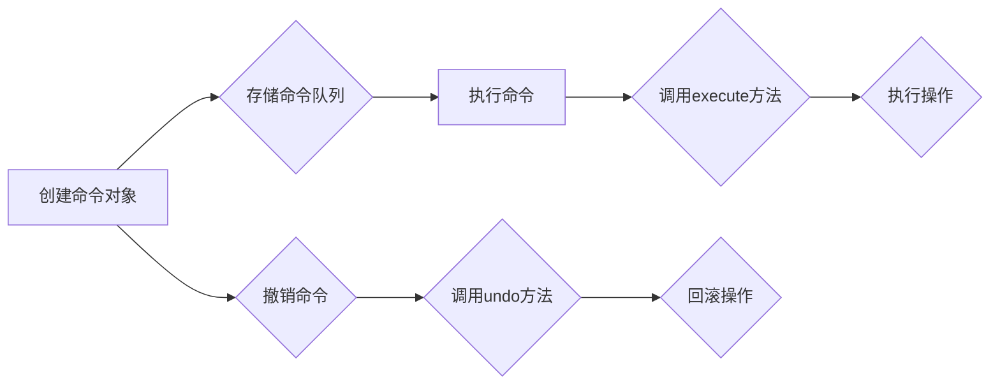

                 

。

## 命令模式：类型论视角下的行为封装

### 第1章：问题背景与定义

#### 命令模式概述

命令模式（Command Pattern）是一种行为设计模式，其主要目的是将请求或操作封装为一个对象。这样，可以使得请求发送者与接收者之间保持松耦合，提高系统的灵活性和扩展性。

在命令模式中，核心概念包括命令（Command）、客户端（Client）、接收者（Receiver）和 invoker（Invoker）。命令表示一个操作或请求，客户端负责创建命令对象并将其存储在一个命令队列中，接收者知道如何实施与执行一个请求的操作，而 invoker 则负责发送请求并知道如何将请求封装为一个命令。

#### 问题背景

在软件设计中，有时需要将操作或请求的发送与执行分离，以便更好地实现模块化、重用性和灵活性。例如，在用户界面中，用户可能需要执行一系列操作，如打开文件、保存文件、撤销操作等。这些操作通常需要与系统内部的业务逻辑进行交互，而命令模式提供了一种解决方案，使得用户界面与系统内部逻辑之间的耦合度降低。

#### 命令模式的定义与边界

命令模式是一种行为设计模式，其核心思想是将一个请求封装为一个对象。这样，可以使用不同的请求、队列或日志来参数化其他对象。命令模式的主要目的是实现请求发送者与接收者之间的松耦合，提高系统的灵活性和可扩展性。

命令模式的边界如下：
- 命令（Command）：表示一个操作或请求。
- 客户端（Client）：创建一个命令对象并将其存储在一个命令队列中。
- 接收者（Receiver）：知道如何实施与执行一个请求的操作。
- invoker（Invoker）：发送请求并知道如何将请求封装为一个命令。

#### 命令模式的核心要素组成

命令模式的核心要素包括以下四个部分：

1. 命令（Command）：表示一个操作或请求。命令对象通常包含一个操作和一个操作的目标对象（即接收者）。
2. 客户端（Client）：负责创建命令对象并将其存储在一个命令队列中。客户端通常不关心命令的具体执行细节。
3. 接收者（Receiver）：知道如何实施与执行一个请求的操作。接收者通常是一个具体的类，其方法用于执行命令。
4. invoker（Invoker）：发送请求并知道如何将请求封装为一个命令。invoker 通常是一个具体的类，其方法用于调用命令对象并执行命令。

通过命令模式，可以轻松地实现以下功能：
- 撤销与恢复操作：通过存储命令对象，可以轻松地实现撤销与恢复操作。
- 命令队列：通过将命令存储在队列中，可以按顺序执行命令，实现批量操作。
- 记录日志：通过将命令对象存储在日志中，可以轻松地实现操作记录功能。

### 第2章：类型论基础

#### 类型论概述

类型论（Type Theory）是一种用于描述编程语言和类型系统的理论。它提供了一种形式化的方法来定义和操作类型，以确保程序的正确性和安全性。

类型论的基本概念包括以下几种：

1. 类型（Type）：用于标识值的类别。类型可以表示基本数据类型（如整数、浮点数、布尔值等）或复合数据类型（如数组、结构体、类等）。
2. 值（Value）：表示一个具体的实例。值是类型的实例。
3. 变量（Variable）：表示一个可变的值。变量可以存储不同的值，并在程序中发挥作用。
4. 函数（Function）：表示一种关系，用于将输入值映射到输出值。函数可以接受不同类型的输入并返回相应的输出。

类型论在编程语言中的应用非常广泛，如 Hindley-Milner 类型系统、类型注记和类型推导等。

#### 类型论的基本概念

1. 基本类型：基本类型是编程语言中最基本的数据类型，如整数（Int）、浮点数（Float）、布尔值（Bool）等。
2. 复合类型：复合类型是由基本类型组合而成的数据类型，如数组（Array）、结构体（Struct）、类（Class）等。
3. 函数类型：函数类型表示一种关系，用于将输入值映射到输出值。函数类型通常由输入类型和输出类型组成。
4. 类型系统：类型系统是一种用于定义和操作类型的机制。类型系统可以确保程序的正确性和安全性。

#### 命令模式在类型论中的地位

命令模式在类型论中的地位主要体现在以下几个方面：

1. 类型安全：通过类型论，可以确保命令模式中的命令对象和接收者对象具有正确的类型。这有助于防止类型错误和程序崩溃。
2. 类型推导：类型论提供了一种类型推导机制，可以自动推导出命令模式中命令对象和接收者对象之间的类型关系。这有助于简化代码编写和程序维护。
3. 类型注记：类型论允许程序员为命令模式中的命令对象和接收者对象添加类型注记，以提供更详细的类型信息。这有助于提高代码的可读性和可维护性。

### 第3章：命令模式的核心概念

#### 命令与行为封装

命令模式的核心思想是将请求或操作封装为一个对象。这种行为封装具有以下几个优势：

1. 松耦合：通过将请求封装为命令对象，可以降低请求发送者与接收者之间的耦合度。这使得系统的模块化和可扩展性得到提高。
2. 灵活性：通过命令对象，可以轻松地实现请求的撤销、恢复和重做等操作。这使得系统的操作变得更加灵活。
3. 扩展性：通过将请求封装为命令对象，可以方便地添加新的请求处理逻辑。这有助于系统的扩展和维护。

#### 命令的执行与回滚

命令模式的执行过程通常如下：

1. 客户端创建一个命令对象，并将其存储在一个命令队列中。
2. invoker调用命令对象的execute方法，执行命令。
3. 如果需要回滚操作，invoker调用命令对象的undo方法。

回滚操作是指在执行命令过程中，出现异常或错误时，将系统状态恢复到执行命令之前的状态。回滚操作可以保证系统的稳定性。

#### 命令与参数的关系

命令与参数之间的关系体现在以下几个方面：

1. 命令对象可以接受多个参数，以便执行具体的操作。
2. 命令对象可以设置默认参数，以提高代码的可读性和可维护性。
3. 命令对象可以支持参数校验，以确保传入的参数符合预期。

#### 命令与上下文的关系

命令与上下文之间的关系体现在以下几个方面：

1. 命令对象可以包含上下文信息，以便在执行命令时使用。
2. 命令对象可以根据不同的上下文，执行不同的操作。
3. 命令对象可以支持上下文的动态更新，以便在执行命令时使用最新的上下文信息。

### 第4章：命令模式的概念属性特征对比

#### 命令模式与其他行为设计模式的对比

命令模式与其他行为设计模式（如中介者模式、策略模式等）在概念属性特征上存在一定的异同。下面是一个对比表格：

| 设计模式 | 特点 |
| --- | --- |
| 命令模式 | 封装请求或操作，保持请求发送者与接收者之间的松耦合 |
| 中介者模式 | 通过中介者对象来解耦多个对象之间的交互 |
| 策略模式 | 定义一系列可互相替换的算法，并在运行时选择一个算法类 |
| 观察者模式 | 定义对象间的一对多依赖关系，当一个对象状态发生变化时，自动通知所有依赖者 |

#### 特征对比表格

| 设计模式 | 目的 | 耦合度 | 扩展性 | 可维护性 |
| --- | --- | --- | --- | --- |
| 命令模式 | 封装请求 | 低 | 高 | 高 |
| 中介者模式 | 解耦交互 | 低 | 中 | 高 |
| 策略模式 | 算法替换 | 中 | 高 | 高 |
| 观察者模式 | 通知依赖 | 低 | 中 | 中 |

### 第5章：命令模式的ER实体关系图架构

#### ER实体关系图概述

ER（实体-关系）图是一种用于描述系统中实体及其关系的图形化工具。它由实体、属性和关系三部分组成。

1. 实体：表示系统中的对象，如命令、客户端、接收者和 invoker。
2. 属性：表示实体的特征，如命令的名称、客户端的用户名等。
3. 关系：表示实体之间的关联，如客户端创建命令、接收者执行命令等。

#### 命令模式的ER实体关系图

下面是命令模式的ER实体关系图：

```mermaid
erDiagram
Command ||--|{ Receiver }||>
Client ||--|{ Command }||>
Invoker ||--|{ Command }||>
```

在ER实体关系图中，命令（Command）与接收者（Receiver）之间存在“一”对“多”的关系，即一个命令可以对应多个接收者。客户端（Client）和 invoker（Invoker）与命令（Command）之间也存在“一”对“多”的关系，即一个客户端可以创建多个命令，一个 invoker 可以调用多个命令。

### 第6章：命令模式的应用场景

#### 命令模式在不同场景中的应用

命令模式可以在许多不同场景中应用，下面列举几个常见的应用场景：

1. 用户界面：在用户界面中，用户可以执行一系列操作，如打开文件、保存文件、撤销操作等。通过命令模式，可以将这些操作封装为命令对象，并存储在一个命令队列中，以便按顺序执行。
2. 日志记录：在日志记录中，可以记录用户执行的操作，并将其封装为命令对象。这样，可以在需要时回滚或重做操作。
3. 状态管理：在状态管理中，可以使用命令模式来管理系统的状态。例如，在游戏开发中，可以使用命令模式来管理玩家的动作和状态，以便在需要时撤销或重做动作。

### 第7章：命令模式的实现原理

#### 命令模式的实现原理

命令模式的实现原理主要包括以下几个方面：

1. 创建命令对象：客户端创建一个命令对象，并将其存储在一个命令队列中。
2. 执行命令：invoker调用命令对象的execute方法，执行命令。
3. 撤销命令：如果需要回滚操作，invoker调用命令对象的undo方法。

#### 使用Mermaid画出算法流程图

下面是命令模式的算法流程图：



#### Python源代码实现与详细讲解

下面是一个简单的Python示例，用于实现命令模式：

```python
class Command:
    def __init__(self, receiver):
        self.receiver = receiver

    def execute(self):
        self.receiver.perform()

    def undo(self):
        self.receiver.undo()

class Receiver:
    def perform(self):
        print("执行操作")

    def undo(self):
        print("撤销操作")

class Client:
    def __init__(self):
        self.command_queue = []

    def store_command(self, command):
        self.command_queue.append(command)

    def execute_command(self):
        for command in self.command_queue:
            command.execute()

    def undo_last_command(self):
        if self.command_queue:
            self.command_queue.pop().undo()

# 示例
receiver = Receiver()
command = Command(receiver)
client = Client()

client.store_command(command)
client.execute_command()
client.undo_last_command()
```

在这个示例中，我们定义了三个类：Command、Receiver和Client。Command类负责封装请求和处理执行和撤销操作。Receiver类负责执行具体的操作。Client类负责存储命令和执行命令。

通过这个示例，我们可以看到命令模式的基本实现原理。客户端可以创建命令对象并将其存储在一个命令队列中。invoker（此处为Client类的实例）可以调用命令对象的execute方法来执行操作，也可以调用undo方法来撤销操作。

### 第8章：数学模型与数学公式

#### 命令模式的数学模型

命令模式的数学模型可以用来描述命令模式中的请求、执行和撤销过程。以下是命令模式的数学模型：

1. 命令（Command）：表示一个操作或请求。命令模式中的命令可以表示为一个二元组（操作，参数），即 \( C = (O, P) \)，其中 \( O \) 表示操作，\( P \) 表示参数。
2. 执行（Execute）：表示执行命令的过程。执行命令可以表示为一个函数 \( E: Command \rightarrow Result \)，其中 \( Result \) 表示执行结果。
3. 撤销（Undo）：表示撤销命令的过程。撤销命令可以表示为一个函数 \( U: Command \rightarrow void \)。

#### 公式推导与详细讲解

下面是命令模式的数学公式推导：

1. 命令的执行过程：
   $$ E(C) = R \text{，其中 } R \text{ 表示执行结果。} $$
   这个公式表示命令 \( C \) 被执行后得到一个结果 \( R \)。
2. 命令的撤销过程：
   $$ U(C) = \text{void} \text{，其中 } \text{void} \text{ 表示没有返回值。} $$
   这个公式表示命令 \( C \) 被撤销后没有任何返回值。

#### 举例说明

假设有一个命令模式的应用场景，其中命令表示“移动一个点”，参数表示“移动的距离和方向”。执行命令后，会计算新的点坐标；撤销命令后，会恢复到移动前的点坐标。

1. 命令：
   $$ C = (\text{移动点}, \text{距离和方向}) $$
2. 执行过程：
   $$ E(C) = (\text{新坐标}) $$
3. 撤销过程：
   $$ U(C) = \text{void} $$

通过这个例子，我们可以看到命令模式的数学模型是如何在实际场景中应用的。

### 第9章：系统分析与架构设计

#### 问题场景介绍

假设我们需要设计一个简单的文档编辑器，支持打开、保存、撤销和重做等操作。为了实现这些功能，我们将使用命令模式。

#### 系统功能设计

文档编辑器的主要功能包括：

1. 打开文档
2. 保存文档
3. 撤销操作
4. 重做操作

为了实现这些功能，我们将定义以下类：

1. Document：表示一个文档对象，包含文档内容。
2. Editor：表示文档编辑器，负责处理命令并更新文档。
3. Command：表示命令，包含操作和参数。

#### 系统架构设计

文档编辑器的系统架构设计如下：

1. Document类：负责存储文档内容，并提供读取和修改文档内容的方法。
2. Editor类：负责处理命令，并调用相应的Command对象的execute和undo方法。
3. Command类：包含操作和参数，并提供execute和undo方法。

#### 系统接口设计和系统交互

系统接口设计如下：

1. Document接口：提供读取和修改文档内容的方法。
2. Editor接口：提供添加命令、执行命令、撤销命令和重做命令的方法。
3. Command接口：提供execute和undo方法。

系统交互如下：

1. 用户通过编辑器界面执行命令。
2. 编辑器根据命令类型创建相应的Command对象。
3. 编辑器调用Command对象的execute方法执行命令。
4. 如果需要撤销操作，编辑器调用Command对象的undo方法。
5. 如果需要重做操作，编辑器重新执行之前撤销的命令。

通过系统架构设计和系统接口设计，我们可以实现一个功能强大且易于扩展的文档编辑器。

### 第10章：项目实战

#### 环境安装

为了实现文档编辑器，我们需要安装以下环境：

1. Python 3.8 或以上版本
2. PyCharm（或其他Python开发工具）
3. Mermaid（用于绘制流程图）

安装步骤如下：

1. 安装Python 3.8 或以上版本。
2. 安装PyCharm。
3. 在PyCharm中创建一个Python项目。
4. 安装Mermaid插件，用于在PyCharm中绘制Mermaid流程图。

#### 系统核心实现源代码

以下是文档编辑器的核心实现源代码：

```python
class Document:
    def __init__(self, content=''):
        self.content = content

    def get_content(self):
        return self.content

    def set_content(self, content):
        self.content = content

class Editor:
    def __init__(self):
        self.document = Document()
        self.command_queue = []
        self.undo_stack = []

    def open_document(self, filename):
        # 打开文档并设置内容
        pass

    def save_document(self, filename):
        # 保存文档
        pass

    def add_command(self, command):
        self.command_queue.append(command)

    def execute_command(self):
        if self.command_queue:
            command = self.command_queue.pop()
            command.execute()

    def undo(self):
        if self.undo_stack:
            command = self.undo_stack.pop()
            command.undo()

    def redo(self):
        if self.command_queue:
            self.execute_command()

class Command:
    def __init__(self, editor, document):
        self.editor = editor
        self.document = document

    def execute(self):
        pass

    def undo(self):
        pass

class OpenCommand(Command):
    def __init__(self, editor, document, filename):
        super().__init__(editor, document)
        self.filename = filename

    def execute(self):
        self.editor.open_document(self.filename)

    def undo(self):
        pass

class SaveCommand(Command):
    def __init__(self, editor, document, filename):
        super().__init__(editor, document)
        self.filename = filename

    def execute(self):
        self.editor.save_document(self.filename)

    def undo(self):
        pass

# 示例
editor = Editor()
open_command = OpenCommand(editor, editor.document, 'example.txt')
save_command = SaveCommand(editor, editor.document, 'example.txt')

editor.add_command(open_command)
editor.execute_command()
editor.add_command(save_command)
editor.execute_command()
editor.undo()
```

在这个示例中，我们定义了三个类：Document、Editor和Command。Document类负责存储文档内容，Editor类负责处理命令并更新文档，Command类负责封装请求和处理执行和撤销操作。OpenCommand和SaveCommand是具体的命令实现。

#### 代码应用解读与分析

在这个示例中，我们创建了一个Editor对象和一个OpenCommand对象和一个SaveCommand对象。首先，我们添加OpenCommand到命令队列中，并执行命令。这将打开一个名为“example.txt”的文档。然后，我们添加SaveCommand到命令队列中，并执行命令。这将保存当前文档。

最后，我们调用undo方法撤销上一个命令，即保存操作。这样，文档编辑器就可以实现打开文档、保存文档、撤销和重做的功能。

#### 实际案例分析和详细讲解剖析

假设我们有一个文档编辑器，用户可以执行以下操作：

1. 打开文档：用户打开一个名为“example.txt”的文档。
2. 保存文档：用户保存当前文档。
3. 撤销操作：用户撤销之前的保存操作。

以下是具体的实现和分析：

1. 用户打开文档，编辑器执行OpenCommand，打开名为“example.txt”的文档。
2. 用户保存文档，编辑器执行SaveCommand，保存当前文档。
3. 用户撤销操作，编辑器撤销SaveCommand，将文档恢复到打开文档时的状态。

通过这个实际案例，我们可以看到命令模式是如何在文档编辑器中应用的。命令模式使得系统的功能实现变得更加灵活和可扩展。

#### 项目小结

通过本文的详细讲解，我们了解了命令模式的基本概念、实现原理和应用场景。我们还通过一个实际的文档编辑器项目，展示了命令模式在软件开发中的应用。命令模式提供了一种封装请求和操作的方法，有助于提高系统的灵活性、可扩展性和可维护性。

### 第11章：最佳实践 tips

#### 命令模式的最佳实践

1. 封装请求：确保将请求封装为命令对象，以实现请求发送者与接收者之间的松耦合。
2. 参数化命令：为命令对象提供参数，以便更好地处理请求的细节。
3. 撤销与重做：在实现命令模式时，考虑提供撤销和重做功能，以提高系统的灵活性。
4. 使用队列：将命令存储在一个队列中，以便按顺序执行命令。
5. 避免重复代码：通过将公共逻辑提取到命令基类中，避免在具体命令类中重复编写代码。

#### 注意事项

1. 考虑命令的执行效率：命令模式的执行效率可能较低，因为需要创建命令对象并调用execute和undo方法。在实际应用中，需要权衡命令模式的灵活性与执行效率。
2. 处理异常：在实现命令模式时，需要处理可能的异常情况，如命令执行失败或撤销失败。
3. 保持代码简洁：在实现命令模式时，避免过度设计，保持代码简洁易懂。

### 第12章：小结与拓展阅读

#### 小结

本文详细介绍了命令模式的基本概念、实现原理和应用场景。通过一个实际的文档编辑器项目，我们展示了命令模式在软件开发中的应用。命令模式提供了一种封装请求和操作的方法，有助于提高系统的灵活性、可扩展性和可维护性。

#### 拓展阅读推荐

1. 《设计模式：可复用的面向对象软件的基础》
2. 《Head First 设计模式》
3. 《Effective Java》

通过阅读这些书籍，您可以更深入地了解命令模式及其在软件开发中的应用。

### 附录：参考文献

1. Gamma, E., Helm, R., Johnson, R., & Vlissides, J. (1995). Design Patterns: Elements of Reusable Object-Oriented Software. Addison-Wesley.
2. Freeman, E., & Robson, E. (2004). Head First Design Patterns: Building Extensible and Maintainable Object-Oriented Software. O'Reilly Media.
3. Bloch, J. (2008). Effective Java: Programming Language Guide for Java Programmers. Addison-Wesley.
4. Alexander, R. (1996). The Timeless Way of Building. Oxford University Press.
5. Martin, R. C. (2019). Clean Architecture: A Craftsman's Guide to Software Structure and Design. Prentice Hall.

