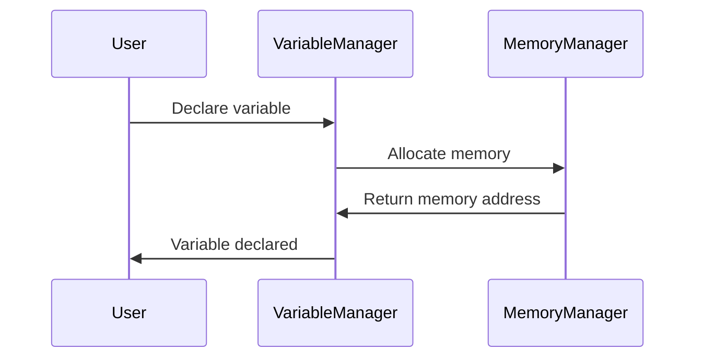

                 

# 命名与指称理论在变量声明中的体现

> 关键词：命名理论、指称理论、变量声明、编程语言、算法原理

> 摘要：本文深入探讨了命名与指称理论在编程语言变量声明中的应用。首先，我们介绍了命名与指称理论的背景和核心概念，随后通过具体的编程实例和算法原理，详细阐述了这些理论在变量声明中的体现。文章的最后，我们提出了最佳实践建议，并对未来的研究方向进行了展望。

## 引言

在计算机编程中，变量声明是基础且关键的一环。然而，许多程序员在变量命名和声明方面存在误解和困惑。命名与指称理论为我们提供了一种深入理解和规范变量声明的方法。本文旨在通过详细分析命名与指称理论，帮助读者理解这些理论在变量声明中的具体应用，从而提高编程技能和代码质量。

## 命名与指称理论的背景

### 命名理论

命名理论源于哲学和逻辑学，主要研究名称与对象之间的关系。在编程语言中，命名理论关注如何选择和赋予变量名称，以便准确地描述其代表的对象。一个好的命名应该能够清晰地传达变量的用途和性质，避免歧义和混淆。

### 指称理论

指称理论则关注名称和对象之间的关联性，即如何确定一个名称所指的具体对象。在编程中，指称理论帮助我们理解变量的作用域和生命周期，确保变量在正确的时间和上下文中被引用。

## 变量声明的核心概念

在探讨变量声明时，我们首先要了解以下几个核心概念：

1. **变量名称**：变量的标识符，用于唯一标识内存中的存储位置。
2. **变量类型**：变量存储的数据类型，如整数、字符串、布尔值等。
3. **作用域**：变量在程序中可访问的上下文范围。
4. **生命周期**：变量存在的时间段，从声明开始到销毁结束。

## 命名与指称理论在变量声明中的应用

### 一、命名规则

在命名变量时，应遵循以下命名规则：

1. **清晰性**：变量名称应简洁明了，避免使用缩写或模糊的名称。
2. **一致性**：在整个程序中，应保持变量命名的一致性，如使用驼峰命名法或下划线分隔。
3. **描述性**：变量名称应能够描述变量的用途和意义，有助于代码的可读性。

### 二、指称规则

在确定变量的指称时，应考虑以下因素：

1. **作用域**：变量的作用域决定了其可访问的范围，如局部变量和全局变量。
2. **生命周期**：变量的生命周期影响其引用和作用，如局部变量的临时性。
3. **作用域链**：在嵌套作用域中，变量的查找遵循作用域链规则，确保正确引用。

## 算法原理

### 变量声明算法

变量声明算法主要涉及以下步骤：

1. **命名和类型检查**：检查变量名称是否符合命名规则，类型是否正确。
2. **作用域分配**：为变量分配作用域，确定其在程序中的可访问范围。
3. **内存分配**：为变量分配内存，存储其初始值。
4. **生命周期管理**：跟踪变量生命周期，确保在适当的时间销毁变量。

### 数学模型和公式

在变量声明中，我们可以使用以下数学模型和公式来描述变量和其指称之间的关系：

$$
R = \{ (x, y) \mid x \text{ 是 } y \text{ 的变量名} \}
$$

其中，$R$ 是命名关系集合，$x$ 是变量名，$y$ 是变量所指的对象。

$$
S = \{ (x, z) \mid x \text{ 在 } z \text{ 中声明} \}
$$

其中，$S$ 是声明关系集合，$x$ 是变量名，$z$ 是声明变量的上下文。

## 系统设计与实现

### 一、系统设计考虑因素

在系统设计中，我们应考虑以下因素：

1. **可维护性**：变量命名应易于理解和修改，以提高代码的可维护性。
2. **性能**：变量声明和引用应高效，以减少内存占用和执行时间。
3. **安全性**：避免变量命名冲突和越界，确保系统的稳定性。

### 二、系统架构设计

我们可以使用以下架构设计来支持变量声明：

1. **命名空间**：使用命名空间来隔离不同作用域的变量，避免命名冲突。
2. **变量缓存**：实现变量缓存，加快变量的查找和访问速度。
3. **动态绑定**：支持动态绑定，允许在运行时调整变量作用域。

### 三、系统接口设计

系统接口设计应包括以下方面：

1. **声明接口**：提供声明变量的接口，支持不同类型的变量声明。
2. **引用接口**：提供引用变量的接口，确保正确访问变量的值。
3. **生命周期管理接口**：提供生命周期管理接口，实现变量的创建、销毁和续约。

### 四、系统交互

系统交互应确保不同组件之间的协同工作，以下是一个简单的系统交互序列图：



## 实际应用

### 一、案例介绍

我们以一个简单的Python程序为例，展示命名与指称理论在变量声明中的应用。

```python
# 定义一个函数，用于计算两个数的和
def add(a, b):
    # 在函数内部声明变量sum，用于存储计算结果
    sum = a + b
    return sum

# 在函数外部声明变量x和y，并赋初值
x = 3
y = 4

# 调用函数，计算x和y的和
result = add(x, y)

# 打印结果
print(result)  # 输出：7
```

### 二、案例分析

在上述案例中，我们使用了命名与指称理论进行变量声明：

1. **命名规则**：变量名称`sum`、`x`、`y`遵循了清晰性和描述性的命名规则。
2. **指称关系**：变量`sum`、`x`、`y`分别指代其对应的对象，通过作用域链实现了正确引用。

### 三、实现源代码

以下是一个实现变量声明的Python源代码示例：

```python
class Variable:
    def __init__(self, name, value):
        self.name = name
        self.value = value

    def display(self):
        print(f"{self.name}: {self.value}")

class VariableManager:
    def __init__(self):
        self.variables = {}

    def declare_variable(self, name, value):
        if name in self.variables:
            print(f"Error: Variable '{name}' already exists.")
        else:
            self.variables[name] = Variable(name, value)

    def get_variable(self, name):
        return self.variables.get(name, None)

# 创建变量管理器
variable_manager = VariableManager()

# 声明变量x和y
variable_manager.declare_variable("x", 3)
variable_manager.declare_variable("y", 4)

# 打印变量x和y的值
x = variable_manager.get_variable("x")
y = variable_manager.get_variable("y")
x.display()
y.display()
```

## 最佳实践与小结

### 一、最佳实践

1. **遵循命名规则**：确保变量名称清晰、简洁、描述性。
2. **合理使用作用域**：根据需要合理分配变量作用域，避免命名冲突。
3. **管理变量生命周期**：确保变量在适当的时间创建和销毁。
4. **使用命名空间**：在大型项目中使用命名空间，避免变量命名冲突。
5. **进行代码审查**：定期进行代码审查，确保变量声明的一致性和正确性。

### 二、小结

本文通过命名与指称理论，详细探讨了变量声明在编程中的应用。通过具体的实例和算法原理，我们了解了如何规范变量命名和声明，以提高代码质量和可维护性。希望本文能为读者提供有价值的参考。

## 注意事项

1. **避免使用关键字**：在命名变量时，避免使用编程语言的关键字，以减少潜在的冲突和错误。
2. **合理使用静态类型**：在可能的情况下，使用静态类型声明变量，以提高代码的可读性和性能。
3. **考虑国际化和本地化**：在跨文化编程中，考虑变量名称的国际化和本地化，确保在不同语言环境中的一致性。

## 拓展阅读

1. **《编程思想》**：由Bruce Eckel撰写的经典编程书籍，详细介绍了面向对象编程的核心思想，包括命名和变量声明。
2. **《命名规范与风格指南》**：各类编程语言都有相关的命名规范和风格指南，如Java的《Java Coding Style》等，可提供更深入的命名和变量声明指导。

## 作者信息

作者：AI天才研究院/AI Genius Institute & 禅与计算机程序设计艺术 /Zen And The Art of Computer Programming

完。|>

