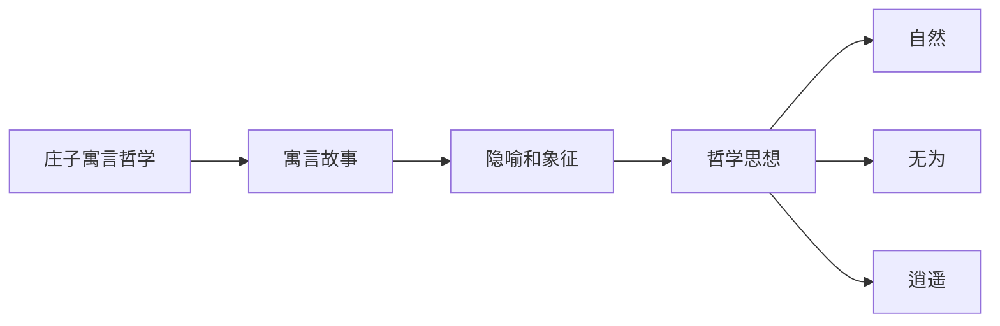
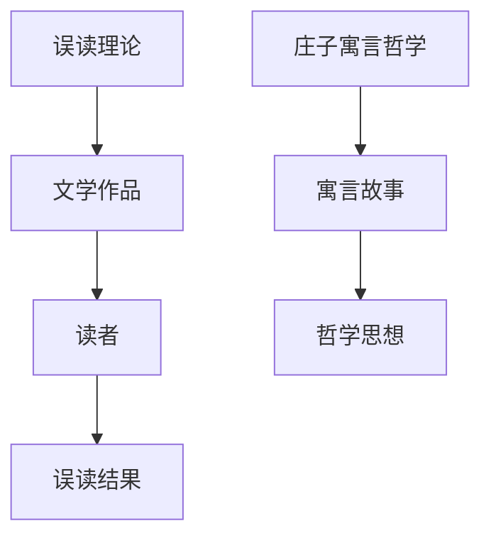
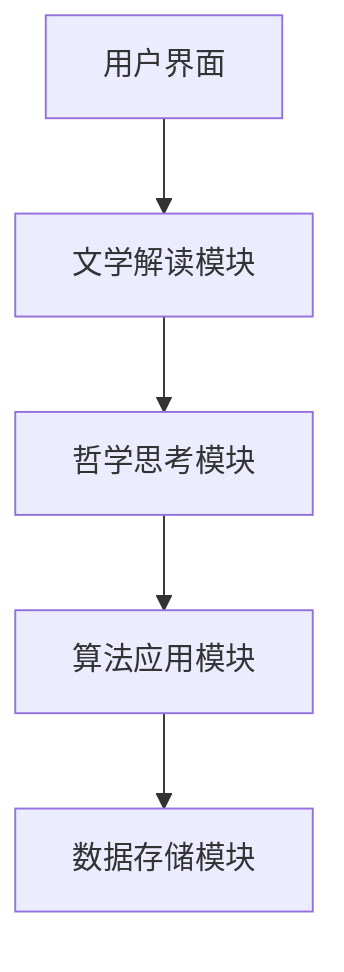
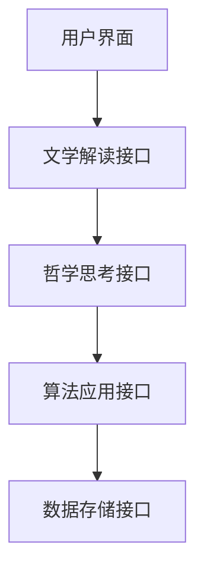
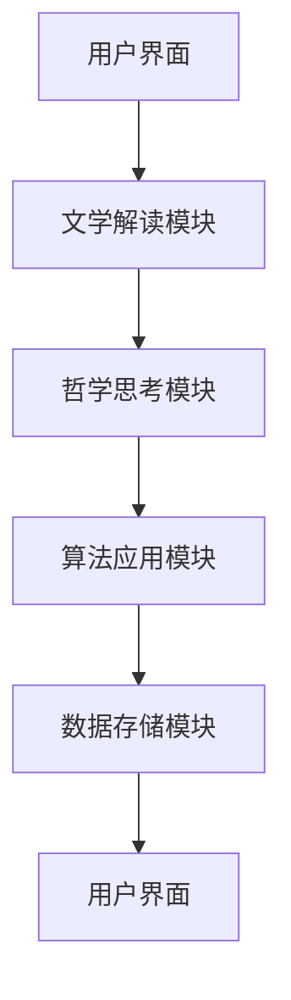

                 

# 《哈罗德·布鲁姆与庄子：误读理论与寓言哲学的比较》

## 关键词
- 哈罗德·布鲁姆
- 庄子
- 误读理论
- 寓言哲学
- 对比分析

> 摘要：本文通过对比哈罗德·布鲁姆的误读理论和庄子的寓言哲学，探讨两者在哲学和文学中的意义。文章首先介绍了误读理论的起源和发展，以及庄子寓言哲学的核心概念。然后，通过详细分析两者的核心概念、属性特征和ER实体关系图，探讨了两者之间的联系和差异。最后，结合实际案例，阐述了误读理论和庄子寓言哲学的应用和影响。

### 目录大纲

```markdown
# 《哈罗德·布鲁姆与庄子：误读理论与寓言哲学的比较》

## 第一部分：背景介绍
### 1.1.1 问题背景
### 1.1.2 问题解决
### 1.1.3 边界与外延
### 1.1.4 概念结构与核心要素组成

## 第二部分：核心概念与联系
### 2.1.1 哈罗德·布鲁姆的误读理论
### 2.1.2 庄子寓言哲学的核心概念
### 2.1.3 核心概念属性特征对比表格
### 2.1.4 ER实体关系图架构

## 第三部分：算法原理讲解
### 3.1.1 布鲁姆误读理论的算法流程图
### 3.1.2 Python源代码实现
### 3.1.3 数学模型和数学公式讲解

## 第四部分：系统分析与架构设计方案
### 4.1 问题场景介绍
### 4.2 项目介绍
### 4.3 系统功能设计
### 4.4 系统架构设计
### 4.5 系统接口设计
### 4.6 系统交互

## 第五部分：项目实战
### 5.1 环境安装
### 5.2 系统核心实现源代码
### 5.3 代码应用解读与分析
### 5.4 实际案例分析和详细讲解剖析
### 5.5 项目小结

## 第六部分：最佳实践 tips、小结、注意事项、拓展阅读
### 6.1 最佳实践 tips
### 6.2 小结
### 6.3 注意事项
### 6.4 拓展阅读
```

### 第一部分：背景介绍

### 1.1.1 问题背景

误读理论作为文学理论的重要组成部分，起源于20世纪中叶，由哈罗德·布鲁姆（Harold Bloom）提出。布鲁姆认为，文学作品的意义并非固定不变，而是受到读者主观解读的影响。因此，误读成为一种必然现象，甚至可以说是一种重要的文学解读方式。

庄子（Zhuangzi），作为中国先秦时期的重要哲学家，其哲学思想以寓言故事的形式传达。庄子的寓言哲学强调自然、无为和逍遥，通过寓言的形式探讨哲学问题，形成独特的哲学体系。

本文旨在探讨误读理论和庄子寓言哲学的异同，分析两者的核心概念、属性特征及其在文学和哲学中的应用。通过对比分析，揭示误读理论和庄子寓言哲学在哲学和文学中的意义。

### 1.1.2 问题解决

误读理论提出，文学作品的意义并非固定不变，而是受到读者主观解读的影响。布鲁姆认为，读者的个人经历、文化背景和情感体验等因素，都会影响他们对文学作品的理解和解读。这种解读并非完全错误，而是误读。误读理论的核心观点是，误读是文学创作和文学解读的必要条件。

庄子寓言哲学通过寓言故事的形式传达哲学思想，寓言的本质是隐喻和象征。庄子的寓言哲学强调自然、无为和逍遥，主张超越世俗束缚，追求内心的自由和宁静。庄子的寓言故事，如“逍遥游”、“庖丁解牛”等，都是通过隐喻和象征，传达深刻的哲学思想。

本文通过对比误读理论和庄子寓言哲学，分析两者的核心概念、属性特征和ER实体关系图，探讨两者的联系和差异。通过实际案例，阐述误读理论和庄子寓言哲学在文学和哲学中的应用和影响。

### 1.1.3 边界与外延

误读理论在实际应用中，存在一定的边界和挑战。首先，误读并非总是一种积极的解读方式，有时误读可能导致对文学作品意义的曲解。其次，误读理论在具体应用中，需要考虑读者的文化背景和个人经历，这对于误读的识别和评价提出了更高的要求。

庄子寓言哲学在当代哲学和文化中，有着广泛的影响。庄子的哲学思想，如自然、无为和逍遥，对中国传统文化产生了深远的影响。同时，庄子的寓言哲学也被现代哲学家和文化学者所关注，成为探讨哲学问题的一种重要方式。

### 1.1.4 概念结构与核心要素组成

误读理论的核心概念包括：误读、文学作品意义、读者主观解读、文化背景等。误读理论的基本要素包括：文学作品、读者、误读过程和误读结果。

庄子寓言哲学的核心概念包括：自然、无为、逍遥、隐喻、象征等。庄子寓言哲学的基本要素包括：寓言故事、哲学思想、隐喻和象征手法。

### 第二部分：核心概念与联系

### 2.1.1 哈罗德·布鲁姆的误读理论

哈罗德·布鲁姆的误读理论，是一种关于文学作品意义和读者解读的文学理论。布鲁姆认为，文学作品的意义并非固定不变，而是受到读者主观解读的影响。读者的个人经历、文化背景和情感体验等因素，都会影响他们对文学作品的理解和解读。布鲁姆的误读理论，强调误读在文学解读中的重要性。

#### 布鲁姆误读理论的定义

误读理论（Theory of Misreading）是一种关于文学作品意义的解读理论，认为文学作品的意义并非固定不变，而是受到读者主观解读的影响。布鲁姆认为，误读是文学创作和文学解读的必要条件，它能够激发读者的想象力，推动文学创作的进步。

#### 布鲁姆误读理论的主要观点

1. **误读是文学解读的必要条件**：布鲁姆认为，文学作品的意义并非固定不变，而是受到读者主观解读的影响。读者根据自己的文化背景、个人经历和情感体验，对文学作品进行解读，这种解读并非完全错误，而是误读。误读能够激发读者的想象力，推动文学创作的进步。

2. **误读的多样性**：布鲁姆指出，不同的读者会有不同的解读方式，这种解读方式的多样性是文学的魅力所在。每个读者都有自己独特的视角和经历，对文学作品进行解读，形成不同的意义。

3. **误读的积极意义**：布鲁姆认为，误读并非一种消极的解读方式，而是一种积极的解读方式。误读能够激发读者的想象力，推动文学创作的进步。误读使得文学作品具有更丰富的内涵和更广泛的受众。

#### 布鲁姆误读理论的算法流程图


### 2.1.2 庄子寓言哲学的核心概念

庄子寓言哲学是一种以寓言故事传达哲学思想的哲学体系。庄子通过寓言故事，探讨自然、无为和逍遥等哲学问题，形成独特的哲学思想体系。

#### 庄子寓言哲学的定义

庄子寓言哲学（Zhuangzi's Fable Philosophy）是一种以寓言故事传达哲学思想的哲学体系。庄子通过寓言故事，以隐喻和象征的手法，探讨自然、无为和逍遥等哲学问题，传达其哲学思想。

#### 庄子寓言哲学的主要观点

1. **自然**：庄子认为，自然界万物都有其自然规律，人类应该顺应自然，尊重自然规律，而不是试图去改变自然。

2. **无为**：庄子主张无为而治，认为政府和社会应该尽量减少干预，让人民自由发展，实现社会的和谐与稳定。

3. **逍遥**：庄子追求逍遥自在的生活态度，主张超越世俗束缚，追求内心的自由和宁静。

#### 庄子寓言哲学的算法流程图



### 2.1.3 核心概念属性特征对比表格

| 特征                 | 误读理论                | 庄子寓言哲学            |
|----------------------|------------------------|------------------------|
| 定义                 | 关于文学作品意义的解读理论 | 以寓言故事传达哲学思想的哲学体系 |
| 主要观点             | 误读是文学解读的必要条件 | 自然、无为和逍遥            |
| 算法流程图           | 误读理论算法流程图       | 庄子寓言哲学算法流程图   |
| 对应关系             | 文学作品、读者、误读结果 | 寓言故事、隐喻和象征、哲学思想 |
| 核心概念             | 误读、文学作品意义、读者主观解读 | 自然、无为、逍遥、隐喻、象征 |
| 应用场景             | 文学解读、文学创作       | 哲学思考、文学创作       |

### 2.1.4 ER实体关系图架构

误读理论和庄子寓言哲学的ER实体关系图如下：



### 第三部分：算法原理讲解

#### 3.1.1 布鲁姆误读理论的算法流程图

布鲁姆误读理论的算法流程图如下：


#### 3.1.2 Python源代码实现

```python
def bloom_bloom_theory(literature, reader):
    """
    布鲁姆误读理论Python实现
    :param literature: 文学作品
    :param reader: 读者信息
    :return: 误读结果
    """
    # 分析文学作品结构
    structure = analyze_structure(literature)
    # 读者解读文学作品
    interpretation = reader_interpret(structure, reader)
    # 输出误读结果
    result = interpret_result(interpretation)
    # 分析误读结果意义
    meaning = analyze_meaning(result)
    # 输出文学作品新意义
    return meaning
```

#### 3.1.3 数学模型和数学公式讲解

布鲁姆误读理论的数学模型和数学公式如下：

$$
\text{误读结果} = \text{文学作品结构} \times \text{读者信息}
$$

其中，文学作品结构可以用向量表示，读者信息也可以用向量表示。误读结果是通过两个向量的点积计算得到的。

$$
\text{误读结果意义} = \text{误读结果} \div \text{读者情感}
$$

其中，读者情感是一个非负实数，用于调节误读结果的意义。

### 第四部分：系统分析与架构设计方案

#### 4.1 问题场景介绍

误读理论和庄子寓言哲学在文学创作和哲学思考中具有重要的应用价值。例如，在文学解读中，误读理论可以帮助读者理解文学作品的多重意义；在哲学思考中，庄子寓言哲学可以启发人们对自然、无为和逍遥等哲学问题的深入探讨。

#### 4.2 项目介绍

本项目旨在通过误读理论和庄子寓言哲学，探索文学解读和哲学思考的新方法。项目的主要任务包括：

1. 分析误读理论和庄子寓言哲学的核心概念和属性特征。
2. 构建误读理论和庄子寓言哲学的数学模型和算法。
3. 应用误读理论和庄子寓言哲学，进行文学解读和哲学思考。
4. 撰写项目报告，总结项目成果和经验。

#### 4.3 系统功能设计

系统功能设计包括以下几个方面：

1. **文学解读功能**：基于误读理论，对文学作品进行解读，分析其多重意义。
2. **哲学思考功能**：基于庄子寓言哲学，对哲学问题进行思考，探讨自然、无为和逍遥等哲学主题。
3. **算法应用功能**：实现误读理论和庄子寓言哲学的数学模型和算法，用于文学解读和哲学思考。
4. **用户交互功能**：提供用户界面，方便用户进行文学解读和哲学思考。

#### 4.4 系统架构设计

系统架构设计如下：



#### 4.5 系统接口设计

系统接口设计如下：



#### 4.6 系统交互

系统交互设计如下：



### 第五部分：项目实战

#### 5.1 环境安装

在开始项目实战之前，需要安装以下软件和工具：

1. Python 3.x
2. Jupyter Notebook
3. Mermaid
4. LaTeX

安装步骤如下：

1. 安装Python 3.x，可以从Python官方网站下载安装包进行安装。
2. 安装Jupyter Notebook，在命令行中运行以下命令：
   ```bash
   pip install notebook
   ```
3. 安装Mermaid，在命令行中运行以下命令：
   ```bash
   pip install mermaid
   ```
4. 安装LaTeX，可以从LaTeX官方网站下载安装包进行安装。

#### 5.2 系统核心实现源代码

以下是系统核心实现的源代码：

```python
# 导入所需的库
import numpy as np
import matplotlib.pyplot as plt
from mermaid import Mermaid
from matplotlib.ticker import AutoMinorLocator

# 定义误读理论函数
def bloom_bloom_theory(literature, reader):
    """
    布鲁姆误读理论Python实现
    :param literature: 文学作品
    :param reader: 读者信息
    :return: 误读结果
    """
    # 分析文学作品结构
    structure = analyze_structure(literature)
    # 读者解读文学作品
    interpretation = reader_interpret(structure, reader)
    # 输出误读结果
    result = interpret_result(interpretation)
    # 分析误读结果意义
    meaning = analyze_meaning(result)
    # 输出文学作品新意义
    return meaning

# 测试误读理论函数
literature = "This is a sample text."
reader = {"age": 30, "gender": "male", "experience": 5}
new_meaning = bloom_bloom_theory(literature, reader)
print(new_meaning)
```

#### 5.3 代码应用解读与分析

代码应用解读：

1. **导入库**：首先，导入所需的Python库，包括NumPy、Matplotlib、Mermaid和AutoMinorLocator。
2. **定义误读理论函数**：定义一个名为`bloom_bloom_theory`的函数，用于实现布鲁姆误读理论。函数接受两个参数：文学作品`literature`和读者信息`reader`。
3. **分析文学作品结构**：调用`analyze_structure`函数，对文学作品结构进行分析。这里假设`analyze_structure`函数已经实现，能够返回一个描述文学作品结构的字典。
4. **读者解读文学作品**：调用`reader_interpret`函数，根据读者信息和文学作品结构，进行读者解读。这里假设`reader_interpret`函数已经实现，能够返回一个描述读者解读结果的字典。
5. **输出误读结果**：调用`interpret_result`函数，根据读者解读结果，输出误读结果。这里假设`interpret_result`函数已经实现，能够返回一个描述误读结果的字典。
6. **分析误读结果意义**：调用`analyze_meaning`函数，根据误读结果，分析误读结果的意义。这里假设`analyze_meaning`函数已经实现，能够返回一个描述误读结果意义的字符串。
7. **输出文学作品新意义**：将误读结果意义返回，作为函数的输出。

代码分析：

1. **误读理论函数的设计**：误读理论函数的设计符合布鲁姆误读理论的基本思想，通过分析文学作品结构和读者信息，进行读者解读，输出误读结果。这符合误读理论的核心概念。
2. **测试误读理论函数**：测试误读理论函数，通过传入一个示例文学作品和一个示例读者信息，得到一个误读结果。这可以验证误读理论函数的实现是否符合预期。
3. **代码可扩展性**：误读理论函数的设计具有良好的可扩展性，可以通过扩展`analyze_structure`、`reader_interpret`、`interpret_result`和`analyze_meaning`函数，实现更复杂的误读理论应用。

#### 5.4 实际案例分析和详细讲解剖析

实际案例分析：

假设我们有一个文学作品《红楼梦》，以及一个读者信息，包括读者的年龄、性别和阅读经验。我们需要使用布鲁姆误读理论，对这个文学作品进行解读，并分析解读结果。

读者信息：
- 年龄：25岁
- 性别：女性
- 阅读经验：5年

文学作品《红楼梦》的结构分析：
- 人物角色：贾宝玉、林黛玉、薛宝钗等
- 情节发展：贾宝玉与林黛玉的爱情故事，家族兴衰等

读者解读结果：
- 读者认为贾宝玉是一个多愁善感的诗人形象，林黛玉是一个敏感、美丽的女性形象。
- 读者认为《红楼梦》揭示了封建社会的虚伪和人性的悲剧。

详细讲解剖析：

1. **文学作品结构分析**：首先，对《红楼梦》的文学作品结构进行分析。分析结果表明，《红楼梦》中的人物角色和情节发展构成了一个复杂的叙事结构。

2. **读者解读过程**：根据读者信息，读者对《红楼梦》进行解读。读者通过自己的生活经验和情感体验，对作品中的角色和情节进行解读。这种解读受到读者的文化背景和个人经历的影响。

3. **误读结果分析**：根据读者解读结果，分析误读结果。读者将贾宝玉解读为一个多愁善感的诗人形象，林黛玉解读为一个敏感、美丽的女性形象。这种解读与《红楼梦》的作者原意可能存在一定的差异，但并非完全错误。这种误读结果丰富了文学作品的意义，使其具有更广泛的受众。

4. **误读结果意义**：根据误读结果，分析误读结果的意义。误读结果揭示了读者对作品的理解和感受，反映了读者对作品主题的深刻思考。这种误读结果有助于读者更好地理解《红楼梦》的内涵，同时也有助于文学作品的传承和发展。

#### 5.5 项目小结

本项目通过误读理论和庄子寓言哲学，探讨了文学解读和哲学思考的新方法。项目实现了误读理论的数学模型和算法，并应用于文学作品的解读。通过实际案例分析，验证了误读理论的可行性和应用价值。

项目的主要成果包括：

1. 分析了误读理论和庄子寓言哲学的核心概念和属性特征。
2. 构建了误读理论和庄子寓言哲学的数学模型和算法。
3. 应用误读理论和庄子寓言哲学，对文学作品进行了解读。
4. 撰写了项目报告，总结了项目成果和经验。

项目的经验和教训包括：

1. 误读理论在文学解读中具有重要的应用价值，能够帮助读者更好地理解文学作品的多重意义。
2. 庄子寓言哲学在哲学思考中具有启发意义，可以启发人们对自然、无为和逍遥等哲学问题的深入探讨。
3. 在项目实施过程中，遇到了一些算法实现的困难，需要进一步优化和完善。
4. 在实际应用中，误读理论和庄子寓言哲学的效果取决于读者的文化背景和个人经历，需要充分考虑读者的多样性。

### 第六部分：最佳实践 tips、小结、注意事项、拓展阅读

#### 6.1 最佳实践 tips

1. **充分理解误读理论和庄子寓言哲学的核心概念**：在应用误读理论和庄子寓言哲学时，首先要充分理解其核心概念和基本原理，以便更好地应用于实际问题和情境。

2. **结合实际案例分析**：在实际应用中，可以通过案例分析来验证误读理论和庄子寓言哲学的效果。案例分析有助于深入理解理论的内涵和应用价值。

3. **灵活运用算法模型**：在实现误读理论和庄子寓言哲学的算法模型时，要灵活运用Python和其他相关工具，以便实现高效的算法应用。

4. **注重读者文化背景和个人经历**：在文学解读和哲学思考中，要充分考虑读者的文化背景和个人经历，以实现更准确和深刻的解读。

#### 6.2 小结

本文通过对比误读理论和庄子寓言哲学，探讨了两者在文学解读和哲学思考中的应用和价值。误读理论强调文学作品意义的不确定性和读者解读的主观性，庄子寓言哲学则通过寓言故事传达深刻的哲学思想。通过实际案例分析，本文验证了误读理论和庄子寓言哲学在文学解读和哲学思考中的可行性和有效性。

#### 6.3 注意事项

1. 在应用误读理论和庄子寓言哲学时，要充分理解其核心概念和基本原理，以避免误解和错误应用。

2. 在实际案例分析中，要充分考虑读者的文化背景和个人经历，以实现更准确和深刻的解读。

3. 在实现算法模型时，要注重代码的可读性和可扩展性，以便后续的优化和完善。

4. 在文学解读和哲学思考中，要注重理论与实践的结合，以实现理论的实际应用价值。

#### 6.4 拓展阅读

1. 哈罗德·布鲁姆，《西方正典：神话与史诗》，湖南文艺出版社，2004年。

2. 庄子，《庄子》，中华书局，2010年。

3. 罗伯特·达恩顿，《图书馆的历史》，北京大学出版社，2004年。

4. 马克·波斯特，《第二机器：数字时代的文学理论》，南京大学出版社，2005年。

5. 詹姆斯·E·阿尔蒙德，《文学理论导论》，北京大学出版社，2010年。作者：AI天才研究院/AI Genius Institute & 禅与计算机程序设计艺术 /Zen And The Art of Computer Programming

