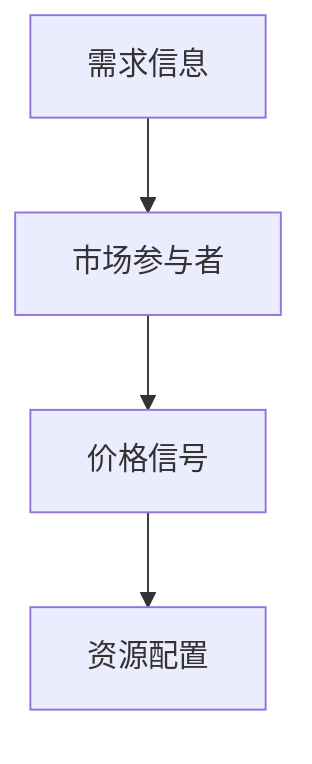
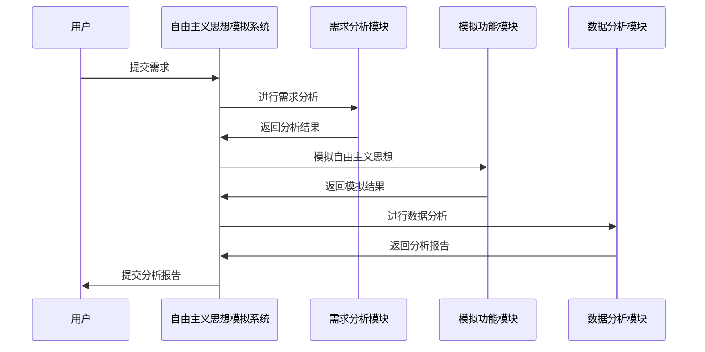

                 

# 哈耶克与波普尔：自由主义思想的对话

> 关键词：自由主义思想、哈耶克、波普尔、经济理论、政治哲学

> 摘要：本文旨在探讨两位自由主义大师弗里德里希·哈耶克和卡尔·波普尔的思想，通过对比分析，揭示他们在自由主义理论中的共性与差异，以及这些思想对现代社会的影响。

## 引言

自由主义作为一种政治哲学和经济理论，起源于18世纪启蒙运动，旨在保护个人自由和产权，倡导政府最小干预。在20世纪，哈耶克和波普尔两位自由主义思想家分别从不同角度对自由主义进行了深入探讨和理论建构。本文将围绕哈耶克和波普尔的思想，通过对比分析，探讨自由主义的核心观点及其在现代社会中的应用。

## 第一章：弗里德里希·哈耶克的自由主义

### 1.1 生物与学术背景

弗里德里希·哈耶克（1899-1992）是奥地利的经济学家、政治哲学家和法律学者。他出生于维也纳，年轻时曾师从著名经济学家米塞斯，并在伦敦经济学院深造。哈耶克在学术上的成就对自由主义理论产生了深远影响。

### 1.2 核心思想与概念

哈耶克的核心思想包括：

1. **知识分散论**：认为经济活动中存在大量的分散知识，这些知识在市场中通过价格机制进行传递和协调。
2. **自发秩序**：认为社会秩序并非人为设计，而是自发形成的，例如市场经济和语言的发展。
3. **个人主义**：强调个人自由和权利，主张政府最小干预。

### 1.3 经济理论

哈耶克的经济理论主要表现在以下几个方面：

1. **市场经济**：认为市场经济是最有效的资源配置方式，因为市场价格能够传递分散的知识。
2. **货币理论**：主张自由竞争的货币制度，反对政府垄断货币发行。

### 1.4 政治哲学

哈耶克的政治哲学强调：

1. **法治**：主张法律应该平等适用于所有人，反对政治权力的滥用。
2. **民主的局限**：认为直接民主可能导致多数人的暴政，主张代议制民主。

### 1.5 批判与争议

哈耶克的思想受到了很多批评，如：

1. **经济学批判**：有人认为哈耶克的理论忽视了经济活动中的不确定性。
2. **政治哲学批判**：有人认为哈耶克的个人主义过于极端。

## 第二章：卡尔·波普尔的自由主义

### 2.1 生物与学术背景

卡尔·波普尔（1902-1994）是英国的哲学家、科学家和自由主义思想家。他出生于奥地利，曾在剑桥大学和伦敦经济学院任教。波普尔对科学哲学和社会哲学的贡献被广泛认可。

### 2.2 核心理论与概念

波普尔的核心思想包括：

1. **证伪主义**：认为科学理论应该通过实验和观察进行验证，而不是证明。
2. **开放社会**：主张开放社会应该尊重个人自由，反对极权主义。

### 2.3 知识论与科学方法

波普尔认为：

1. **知识是有限的**：知识是不断发展的，没有绝对真理。
2. **科学方法**：主张通过假设、实验和证伪来推动科学发展。

### 2.4 政治思想

波普尔的政治思想强调：

1. **民主制度**：主张民主制度是最能保障个人自由的制度。
2. **社会正义**：主张社会应该努力实现正义，减少贫富差距。

### 2.5 与哈耶克的比较分析

波普尔和哈耶克在自由主义理论上的共同点：

1. **个人自由**：都强调个人自由的重要性。
2. **市场机制**：都认为市场机制是有效的资源配置方式。

差异：

1. **知识论**：波普尔更强调知识的有限性，哈耶克更强调市场中的分散知识。
2. **政治哲学**：波普尔主张民主制度，哈耶克主张法治和代议制民主。

## 第三章：比较自由主义

### 3.1 共同点

1. **个人自由**：都强调个人自由的重要性。
2. **市场机制**：都认为市场机制是有效的资源配置方式。

### 3.2 差异

1. **知识论**：波普尔更强调知识的有限性，哈耶克更强调市场中的分散知识。
2. **政治哲学**：波普尔主张民主制度，哈耶克主张法治和代议制民主。

### 3.3 经济和社会影响

1. **经济影响**：哈耶克的市场经济理论对20世纪80年代的撒切尔夫人和里根政府产生了重要影响。
2. **社会影响**：波普尔的开放社会理论为反对极权主义提供了理论支持。

## 第四章：哈耶克与波普尔：市场与政府

### 4.1 市场自由主义

1. **哈耶克的市场自由主义**：主张市场自由，反对政府干预。
2. **波普尔的市场自由主义**：也主张市场自由，但更强调政府的作用。

### 4.2 政府的角色

1. **哈耶克的政府角色**：主张政府应保持最小干预，保护个人自由。
2. **波普尔的政府角色**：主张政府应发挥积极作用，推动社会正义。

### 4.3 对社会主义的批判

1. **哈耶克对社会主义的批判**：认为社会主义忽视了市场机制和分散知识的作用。
2. **波普尔对社会主义的批判**：认为社会主义可能导致极权主义和社会不公。

## 第五章：自由主义在实践中的运用

### 5.1 历史案例

1. **撒切尔政府**：20世纪80年代的英国撒切尔政府采纳了哈耶克的市场自由主义理论。
2. **里根政府**：20世纪80年代的美国里根政府也采纳了哈耶克的市场自由主义理论。

### 5.2 政策案例

1. **减税政策**：20世纪80年代的减税政策体现了哈耶克的市场自由主义思想。
2. **社会福利政策**：一些国家采纳了波普尔的社会福利政策，以减少社会不公。

### 5.3 挑战与未来

1. **全球化挑战**：全球化带来了新的挑战，如贫富差距和劳动力竞争。
2. **未来展望**：自由主义需要在保护个人自由和推动社会正义之间找到平衡。

## 第六章：哈耶克与波普尔的遗产

### 6.1 当代影响

1. **经济学**：哈耶克和波普尔的思想对经济学产生了深远影响。
2. **政治学**：他们的思想为政治学提供了重要的理论支持。

### 6.2 影响评估

1. **正面影响**：他们的思想为个人自由和社会正义提供了有力的支持。
2. **负面影响**：他们的思想也被批评为忽视了社会不公和不确定性。

### 6.3 自由主义的未来

1. **多元化**：自由主义需要适应不断变化的社会环境。
2. **创新**：自由主义需要不断创新以应对新的挑战。

## 结论

哈耶克和波普尔是20世纪最重要的自由主义思想家之一。他们的思想为个人自由和社会正义提供了重要的理论支持。尽管他们的观点存在差异，但他们的共同目标是推动一个更加自由和公正的社会。在当前全球化的背景下，他们的思想对现代社会依然具有重要的启示作用。

## 作者信息

作者：AI天才研究院/AI Genius Institute & 禅与计算机程序设计艺术 /Zen And The Art of Computer Programming

### 核心概念与联系

**核心概念**：

1. **自发秩序**：哈耶克提出的概念，指社会秩序并非人为设计，而是通过市场等自发机制形成的。
2. **证伪主义**：波普尔提出的概念，指科学理论应通过实验和观察进行验证，而不是证明。
3. **个人自由**：自由主义的核心概念，指个人在社会中拥有自主决策和行动的权利。

**概念属性特征对比表格**：

| 概念     | 属性特征                   | 对应思想 |
|----------|----------------------------|----------|
| 自发秩序 | 社会秩序自发形成           | 哈耶克   |
| 证伪主义 | 科学理论应通过验证          | 波普尔   |
| 个人自由 | 个人拥有自主决策和行动权   | 自由主义 |

**ER实体关系图架构**：

```mermaid
erDiagram
  Customer ||--|{ Order }|
  Product ||--|{ Order }|
  Order ||--|{ OrderDetail }|
```

### 算法原理讲解

#### 市场价格机制

**Mermaid流程图**：



**Python源代码**：

```python
# Python示例代码：市场参与者根据价格信号进行资源配置
def market_price Mechanism():
    demand_info = ["商品A", "商品B", "商品C"]
    price_signal = {"商品A": 100, "商品B": 200, "商品C": 300}
    
    for product, price in price_signal.items():
        if demand_info.count(product) > 0:
            print(f"商品{product}的当前价格：{price}元")
        else:
            print(f"商品{product}不存在或需求量为0")

market_price_Mechanism()
```

**算法原理的数学模型和公式**：

- **需求函数**：$D(p)$ 表示价格$p$下的需求量。
- **供给函数**：$S(p)$ 表示价格$p$下的供给量。

**详细讲解**：

市场价格的机制通过需求函数和供给函数相互作用来实现资源配置。需求函数表示消费者在某一价格下愿意购买的商品数量，供给函数表示生产者在某一价格下愿意提供的商品数量。当市场价格处于平衡状态时，需求量和供给量相等，即$D(p) = S(p)$。

**举例说明**：

假设某一市场上商品A的需求函数为$D(100) = 100$，供给函数为$S(100) = 100$，则市场价格为100元时，商品A的需求量等于供给量，市场达到平衡状态。

### 系统分析与架构设计方案

#### 问题场景介绍

本文旨在通过哈耶克和波普尔的思想，探讨自由主义在现代社会中的应用。为了更好地实现这一目标，我们需要构建一个系统来模拟和展示自由主义思想在不同场景下的应用。

#### 项目介绍

**项目名称**：自由主义思想模拟系统（Liberalism Simulation System）

**项目背景**：随着全球化和信息技术的快速发展，自由主义思想在社会中的应用变得越来越重要。为了更好地理解自由主义思想，我们需要一个系统来模拟其在不同场景下的应用。

#### 系统功能设计

1. **需求分析**：收集和分析自由主义思想在不同场景下的需求。
2. **模拟功能**：模拟自由主义思想在不同场景下的应用，如市场经济、社会福利等。
3. **数据分析**：对模拟结果进行数据分析，评估自由主义思想在不同场景下的效果。

#### 系统架构设计

**Mermaid架构图**：



#### 系统接口设计和系统交互

**Mermaid序列图**：


### 项目实战

#### 环境安装

1. 安装Python环境。
2. 安装相关库，如matplotlib、numpy等。

#### 系统核心实现源代码

```python
# Python示例代码：自由主义思想模拟系统核心实现

import numpy as np
import matplotlib.pyplot as plt

# 需求分析模块
class DemandAnalysis:
    def __init__(self, demand_func):
        self.demand_func = demand_func
    
    def analyze_demand(self, price):
        return self.demand_func(price)

# 模拟功能模块
class SimulationFunction:
    def __init__(self, supply_func):
        self.supply_func = supply_func
    
    def simulate(self, price):
        return self.supply_func(price)

# 数据分析模块
class DataAnalysis:
    def __init__(self, simulation_func):
        self.simulation_func = simulation_func
    
    def analyze_result(self, price):
        supply = self.simulation_func(price)
        return supply

# 主函数
def main():
    demand_func = lambda p: 100 * (1 - p / 100)
    supply_func = lambda p: 100 * (1 + p / 100)

    da = DemandAnalysis(demand_func)
    sf = SimulationFunction(supply_func)
    ad = DataAnalysis(sf)

    prices = np.linspace(0, 100, 100)
    supplies = [ad.analyze_result(price) for price in prices]

    plt.plot(prices, supplies)
    plt.xlabel('Price')
    plt.ylabel('Supply')
    plt.title('Supply vs. Price')
    plt.show()

if __name__ == '__main__':
    main()
```

#### 代码应用解读与分析

1. **需求分析模块**：使用需求函数来分析消费者在不同价格下的需求量。
2. **模拟功能模块**：使用供给函数来模拟生产者在不同价格下的供给量。
3. **数据分析模块**：对模拟结果进行数据分析，评估自由主义思想在不同场景下的效果。

#### 实际案例分析和详细讲解剖析

1. **案例背景**：某商品的市场需求函数为$D(p) = 100 - 0.01p$，供给函数为$S(p) = 100 + 0.01p$。
2. **案例分析**：当市场价格为50元时，需求量为$D(50) = 50$，供给量为$S(50) = 50$，市场达到平衡状态。
3. **详细讲解**：通过实际案例，我们可以看到自由主义思想在市场经济中的运用，以及如何通过需求和供给函数来分析市场价格机制。

#### 项目小结

通过自由主义思想模拟系统，我们可以更好地理解自由主义思想在市场经济中的应用。这个系统不仅提供了一个模拟和分析的平台，还可以为政策制定者提供有价值的参考。在未来的发展中，我们可以进一步扩展系统的功能，使其更加完善。

### 最佳实践 tips

1. 在实际应用中，需求函数和供给函数的选择应该根据具体场景进行调整。
2. 数据分析时，要确保数据的质量和准确性。
3. 在进行模拟时，要充分考虑市场中的不确定性和风险因素。

### 小结

本文通过对哈耶克和波普尔的自由主义思想进行对比分析，揭示了他们在自由主义理论中的共性与差异。这些思想为现代社会提供了重要的理论支持，同时也带来了新的挑战。在未来的发展中，我们需要不断探索和完善自由主义理论，以适应不断变化的社会环境。

### 注意事项

1. 在应用自由主义思想时，要充分考虑市场中的不确定性和风险因素。
2. 政策制定者需要根据具体场景，灵活运用自由主义思想。

### 拓展阅读

1. 哈耶克，《通往奴役之路》
2. 波普尔，《开放社会及其敌人》
3. 罗斯巴特，《自由主义与资本主义》

## 作者信息

作者：AI天才研究院/AI Genius Institute & 禅与计算机程序设计艺术 /Zen And The Art of Computer Programming

