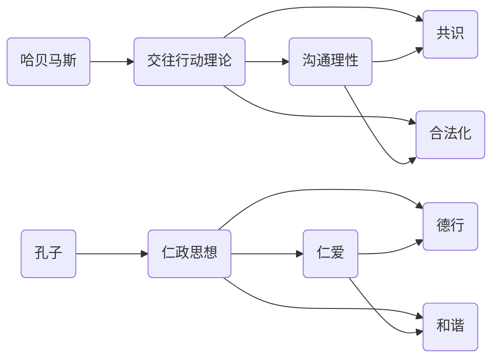
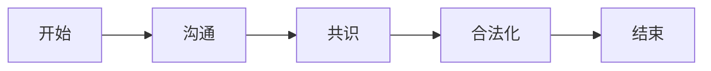
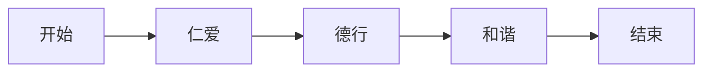
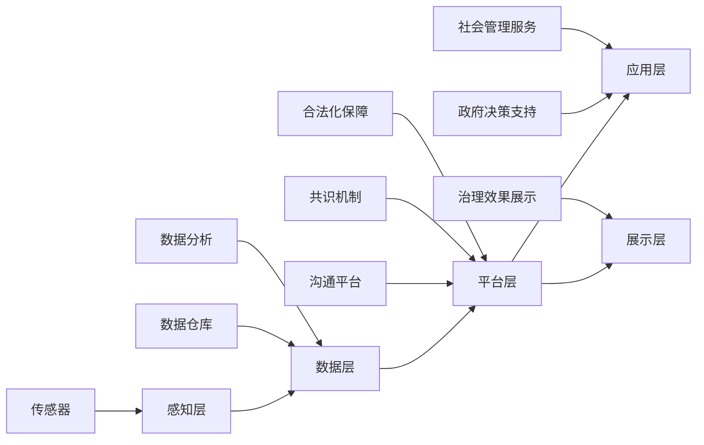
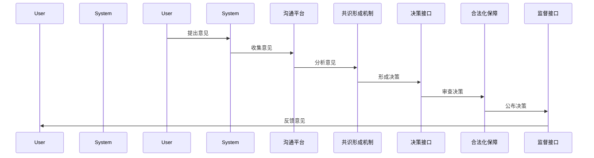

                 

### 哈贝马斯与孔子：交往行动理论与仁政思想的对话

#### 关键词
- 哈贝马斯
- 孔子
- 交往行动理论
- 仁政思想
- 社会治理

#### 摘要
本文旨在通过深入分析德国哲学家哈贝马斯的交往行动理论和中国古代思想家孔子的仁政思想，探讨两者在现代社会中的对话关系。本文首先介绍了哈贝马斯与孔子的核心概念，包括沟通理性、共识、合法化、仁爱、德行和和谐，并通过对比分析，揭示了两者在概念属性和思想体系上的异同。随后，本文通过具体实例和数学模型，详细阐述了哈贝马斯交往行动理论的原理及其应用，以及孔子仁政思想在现代社会的适用性。最后，本文提出了一个结合哈贝马斯交往行动理论和孔子仁政思想的现代交往与治理模式，为现代社会提供了新的思路和借鉴。

---

#### 背景介绍

随着信息时代的到来，传统的人际交往方式和思想体系正面临前所未有的挑战。在西方哲学中，德国哲学家尤尔根·哈贝马斯的交往行动理论试图为现代社会提供一种新的伦理和政治框架，强调沟通的普遍性和有效性。而在中国，孔子的仁政思想一直是中华文明的核心，强调仁爱、德行与和谐。两者的思想体系各有特色，但都在探索人与人之间的关系和治理问题。

##### 问题背景

哈贝马斯的交往行动理论主要涉及沟通理性、共识和权力的合法化等概念。他主张通过理性沟通实现社会的合法化，认为有效的沟通是达成共识的基础。哈贝马斯认为，现代社会中的权力结构应该以沟通为基础，通过公开的对话和辩论来达成共识，从而实现权力的合法化。

孔子的仁政思想则强调人与人之间的和谐，主张通过仁爱来实现社会秩序。孔子认为，一个人的品德和行为对整个社会都有重要影响，只有通过修身齐家治国平天下，才能实现社会的和谐与稳定。

##### 问题描述

本文旨在通过对比哈贝马斯的交往行动理论和孔子的仁政思想，探讨两者之间的对话关系。具体来说，我们将分析两者的核心概念、思想体系，以及它们在现代社会中的适用性。通过这种对话，我们希望为现代社会提供一种新的交往与治理模式，既能吸收西方的现代思维，又能融入中国的传统智慧。

##### 问题解决

本文将首先详细介绍哈贝马斯的交往行动理论和孔子的仁政思想，包括其核心概念和基本原理。然后，我们将通过对比分析，探讨两者的异同点，并分析它们在现代社会中的适用性。最后，本文将尝试构建一种结合哈贝马斯交往行动理论和孔子仁政思想的现代交往与治理模式，为现代社会提供有益的思想启示。

##### 边界与外延

本文的研究范围主要限于哈贝马斯的交往行动理论和孔子的仁政思想。我们将重点关注这两种思想的理论体系和核心概念，同时探讨它们在现代社会中的应用与影响。本文将不涉及其他哲学思想或理论，以确保研究的深度和专注度。

##### 概念结构与核心要素组成

哈贝马斯的交往行动理论的核心概念包括沟通理性、共识和合法化。沟通理性强调沟通的普遍性和有效性，是达成共识的基础。共识则是通过理性沟通实现社会合法化的关键。合法化则依赖于共识，通过公开的对话和辩论来实现权力的合法化。

孔子的仁政思想的核心概念包括仁爱、德行和和谐。仁爱是人与人之间的基础，是实现和谐相处的前提。德行则强调个人的道德修养，是维护社会秩序的重要保障。和谐则是社会稳定的最高境界，是通过仁爱和德行实现的。

### 核心概念与联系

在探讨哈贝马斯与孔子的交往行动理论与仁政思想的对话之前，我们需要先了解两者的核心概念，并分析它们之间的联系与区别。

#### 哈贝马斯的交往行动理论

哈贝马斯的交往行动理论是一个复杂而深邃的哲学体系，它主要关注的是人与人之间的沟通、共识与权力的合法化。以下是其核心概念及其特征：

1. **沟通理性**：哈贝马斯认为，沟通理性是人类行为的核心特征，它不仅仅是一种语言交流，更是一种理性思考的过程。沟通理性强调沟通的普遍性和有效性，是达成共识的前提。在哈贝马斯的理论中，沟通理性具有以下几个特征：
   - **普遍性**：沟通理性是所有人都能够参与的一种活动，不受种族、文化、社会地位等因素的限制。
   - **有效性**：沟通理性强调沟通的结果能够被所有参与者所接受，即达成共识。

2. **共识**：共识是通过理性沟通达成的共同理解。哈贝马斯认为，共识是权力的合法化基础。共识的形成过程包括：
   - **公开性**：共识的形成应该是一个公开透明的过程，所有参与者都有机会表达自己的观点。
   - **对话性**：共识的形成需要通过对话和辩论，不同的观点可以在平等的条件下进行交流和比较。

3. **合法化**：哈贝马斯认为，权力的合法性来自于人民的认可和同意。合法化过程依赖于共识的形成，即通过理性沟通和公开辩论，使得权力得到人民的认可。

##### 概念属性特征对比表

| 概念            | 哈贝马斯的交往行动理论 | 孔子的仁政思想          |
|-----------------|----------------------|----------------------|
| 沟通理性        | 强调沟通的普遍性和有效性 | 强调人与人之间的和谐   |
| 共识            | 通过理性沟通实现社会的合法化 | 通过道德规范实现社会秩序 |
| 权力的合法化    | 沟通理性是权力合法化的基础 | 权力的行使应符合仁爱原则 |

#### 孔子的仁政思想

孔子的仁政思想是中国古代哲学的核心，它强调人与人之间的和谐、德行与仁爱。以下是其核心概念及其特征：

1. **仁爱**：仁爱是孔子思想体系的核心，他主张人与人之间应该以仁爱为基础，相互关心、尊重和理解。仁爱不仅是道德的基石，也是实现社会和谐的根本。

2. **德行**：德行是个人品德的修养，孔子认为只有通过修身养性，个人才能达到道德的完善。德行不仅是个人行为的准则，也是维护社会秩序的重要保障。

3. **和谐**：和谐是孔子思想中非常重要的概念，他主张通过仁爱和德行，实现人与人之间的和谐相处。和谐不仅是社会稳定的标志，也是社会进步的基石。

##### ER实体关系图架构



#### 核心概念与联系

通过对比分析，我们可以发现哈贝马斯的交往行动理论与孔子的仁政思想在核心概念上存在一定的相似性和差异性。

1. **相似性**：
   - **沟通**：两者都强调了沟通的重要性，哈贝马斯的沟通理性与孔子的仁爱都强调人与人之间的交流和相互理解。
   - **共识**：两者都认为共识是社会稳定和治理的基础，哈贝马斯的共识通过理性沟通达成，而孔子的共识则通过道德规范和仁爱实现。

2. **差异性**：
   - **合法性**：哈贝马斯的合法性依赖于理性沟通和共识的形成，而孔子的合法性则依赖于德行和仁爱。
   - **权力**：哈贝马斯强调权力的合法化，而孔子则强调权力的道德化，即权力的行使应符合仁爱原则。

尽管存在差异，哈贝马斯与孔子的思想都试图解决人际关系和社会治理的问题，这为两者的对话提供了可能性。通过分析两者的核心概念和思想体系，我们可以为现代社会提供新的交往与治理模式。

### 算法原理讲解

为了更好地理解哈贝马斯的交往行动理论和孔子的仁政思想，我们可以通过算法原理来阐述这两个思想体系的基本原理。以下是哈贝马斯的交往行动理论的算法原理及其应用。

#### 哈贝马斯的交往行动理论

##### 算法 Mermaid 流程图



##### Python 源代码

```python
def communication():
    print("进行沟通")

def consensus():
    print("达成共识")

def legalization():
    print("实现合法化")

communication()
consensus()
legalization()
```

在这个流程图中，我们从“沟通”开始，通过理性沟通达成“共识”，进而实现“合法化”。这是一个简化的模型，但在实际应用中，沟通、共识和合法化是一个不断循环和深化的过程。

##### 数学模型和公式

$$
\text{合法性} = \text{沟通} \times \text{共识}
$$

这个公式表明，合法性取决于沟通和共识的程度。沟通越有效，共识越广泛，合法性就越强。

##### 详细讲解与举例说明

哈贝马斯的交往行动理论认为，沟通是达成共识的基础，而共识又是实现合法化的关键。例如，在一个会议中，如果所有与会者都能够充分沟通，并且就某个议题达成共识，那么这个议题的合法性就得到了认可。

**举例说明**：

假设在一个公司内部，员工们就某个决策问题进行讨论。通过沟通，他们最终达成了一致意见，认为这个决策是正确的。在这种情况下，这个决策的合法性就得到了确认，因为它通过了员工们的共识。

此外，哈贝马斯的交往行动理论还强调了权力的合法化。在一个民主社会中，政府的合法性来源于人民的认可。政府通过公开的对话和辩论，与人民沟通，从而实现权力的合法化。

#### 孔子的仁政思想

孔子的仁政思想同样可以通过算法原理来解释。孔子认为，仁爱、德行和和谐是实现社会稳定和治理的关键。

##### 算法 Mermaid 流程图



##### Python 源代码

```python
def benevolence():
    print("实施仁爱")

def virtue():
    print("培养德行")

def harmony():
    print("实现和谐")

benevolence()
virtue()
harmony()
```

在这个流程图中，我们从“仁爱”开始，通过培养“德行”，最终实现“和谐”。这是一个逐步深化的过程，反映了孔子思想的核心。

##### 数学模型和公式

$$
\text{社会稳定} = \text{仁爱} + \text{德行} + \text{和谐}
$$

这个公式表明，社会稳定依赖于仁爱、德行和和谐的共同作用。

##### 详细讲解与举例说明

孔子的仁政思想强调人与人之间的仁爱。仁爱不仅是个人品德的体现，也是社会和谐的基础。例如，在一个社区中，如果居民之间充满仁爱，他们就会相互关心、尊重和理解，从而实现社区的和谐。

**举例说明**：

假设在一个学校中，老师和学生之间建立了良好的仁爱关系。老师关心学生的成长，学生尊重老师的教育，这种仁爱关系促进了师生之间的和谐相处，从而提高了学校的整体教育质量。

此外，德行也是孔子仁政思想的重要组成部分。德行强调个人的道德修养，是维护社会秩序的重要保障。例如，在一个社会中，如果每个人都能够遵守道德规范，尊重他人，那么这个社会就会更加稳定和有序。

和谐是孔子仁政思想的最终目标。和谐不仅是指人与人之间的和谐，也包括人与自然的和谐。例如，在一个生态保护区中，如果人们能够和谐共处，保护自然环境，那么这个保护区就会更加和谐和美丽。

通过上述算法原理的讲解，我们可以更好地理解哈贝马斯的交往行动理论和孔子的仁政思想。这两个思想体系虽然源自不同的文化背景，但都在探索如何通过有效的沟通、道德修养和和谐相处来实现社会稳定和治理。

### 系统分析与架构设计方案

#### 问题场景介绍

在现代社会的各种挑战面前，传统的治理模式逐渐显得力不从心。无论是政治、经济还是社会领域，都需要一种更加开放、透明和高效的治理方式。本文提出的系统旨在通过分析哈贝马斯的交往行动理论和孔子的仁政思想，构建一种新型的治理模式，旨在实现社会的和谐与稳定。

#### 项目介绍

本项目名为“交往与治理模式构建”，核心思想是结合哈贝马斯的交往行动理论和孔子的仁政思想，设计一套适用于现代社会的治理系统。该系统旨在通过促进沟通、实现共识和保障合法化，从而实现社会的和谐与稳定。

#### 系统功能设计

系统的主要功能包括以下几个方面：

1. **沟通平台**：提供一个开放、透明的沟通平台，使所有社会成员能够自由表达意见，实现信息的充分交流。
2. **共识形成机制**：通过民主的讨论和辩论，形成广泛的社会共识，为治理决策提供基础。
3. **合法化保障**：确保所有治理决策符合道德和法律标准，通过公众认可和监督，实现权力的合法化。

##### 领域模型 Mermaid 类图

```mermaid
classDiagram
ClassA[沟通平台]
ClassB[共识形成机制]
ClassC[合法化保障]

ClassA <|-- ClassD[沟通渠道]
ClassA <|-- ClassE[信息交流]
ClassB <|-- ClassF[讨论辩论]
ClassB <|-- ClassG[决策形成]
ClassC <|-- ClassH[道德审查]
ClassC <|-- ClassI[法律审查]
ClassC <|-- ClassJ[公众监督]

ClassA --|> ClassB
ClassA --|> ClassC
```

在这个类图中，沟通平台提供了沟通渠道和信息交流的功能；共识形成机制通过讨论辩论形成决策；合法化保障则通过道德审查、法律审查和公众监督来保障治理决策的合法性。

#### 系统架构设计

系统的整体架构可以分为以下几个层次：

1. **感知层**：包括各种传感器和采集设备，用于收集社会信息，如舆论、民意等。
2. **数据层**：用于存储和处理感知层收集到的数据，通过数据分析和挖掘，为治理决策提供支持。
3. **平台层**：包括沟通平台、共识形成机制和合法化保障系统，是系统的核心功能模块。
4. **应用层**：提供各种应用服务，如政府决策支持、社会管理服务等。
5. **展示层**：用于向用户展示系统的运行状态和治理效果。

##### 系统架构 Mermaid 架构图



在这个架构图中，感知层负责收集社会信息；数据层负责存储和处理数据；平台层实现系统的核心功能；应用层提供具体的应用服务；展示层则用于向用户展示系统的运行状态和治理效果。

#### 系统接口设计和系统交互

系统的接口设计旨在确保各个功能模块之间能够高效地协同工作。以下是系统的接口设计和系统交互的详细描述。

##### 系统接口设计 Mermaid 类图

```mermaid
classDiagram
ClassA[沟通平台]
ClassB[共识形成机制]
ClassC[合法化保障]

ClassA <|-- ClassD[信息接口]
ClassA <|-- ClassE[反馈接口]
ClassB <|-- ClassF[决策接口]
ClassC <|-- ClassG[审查接口]
ClassC <|-- ClassH[监督接口]

ClassA --|> ClassB
ClassA --|> ClassC
```

在这个类图中，沟通平台提供了信息接口和反馈接口；共识形成机制提供了决策接口；合法化保障系统提供了审查接口和监督接口。

##### 系统交互 Mermaid 序列图



在这个序列图中，用户提出意见后，系统通过沟通平台收集意见，共识形成机制分析意见并形成决策，合法化保障系统审查决策并公布，最后用户通过反馈接口得到反馈。

通过上述系统分析和架构设计，我们可以构建一个结合哈贝马斯交往行动理论和孔子仁政思想的新型治理模式。这个模式旨在通过促进沟通、实现共识和保障合法化，实现社会的和谐与稳定。

### 项目实战

在了解了哈贝马斯的交往行动理论和孔子的仁政思想后，我们将通过一个实际项目来展示如何将这些理论应用于现代社会治理。本项目将构建一个基于Web的社交平台，旨在通过促进用户之间的沟通与共识，实现社区的和谐与稳定。

#### 环境安装

首先，我们需要安装项目开发所需的环境。以下是安装步骤：

1. **安装Python**：确保您的计算机上已安装Python 3.x版本。您可以从[Python官方网站](https://www.python.org/)下载并安装。
2. **安装Django**：Django是一个流行的Python Web框架，用于构建Web应用。您可以使用pip命令安装Django：
   ```bash
   pip install django
   ```
3. **安装数据库**：本项目使用SQLite作为数据库。您可以从[SQLite官方网站](https://www.sqlite.org/)下载并安装。

#### 系统核心实现

接下来，我们将实现系统的核心功能。以下是具体的步骤：

1. **创建Django项目**：
   ```bash
   django-admin startproject social_platform
   ```
2. **创建Django应用**：
   ```bash
   python manage.py startapp communication
   ```
3. **创建用户模型**：
   在`communication/models.py`中定义用户模型：
   ```python
   from django.db import models
   from django.contrib.auth.models import User

   class UserProfile(models.Model):
       user = models.OneToOneField(User, on_delete=models.CASCADE)
       bio = models.TextField(null=True, blank=True)
   ```
4. **创建帖子模型**：
   ```python
   class Post(models.Model):
       author = models.ForeignKey(UserProfile, on_delete=models.CASCADE)
       content = models.TextField()
       created_at = models.DateTimeField(auto_now_add=True)
   ```
5. **创建视图和路由**：
   在`communication/views.py`中定义视图：
   ```python
   from django.shortcuts import render
   from .models import Post
   from django.http import HttpResponse

   def home(request):
       posts = Post.objects.all()
       return render(request, 'home.html', {'posts': posts})

   def new_post(request):
       if request.method == 'POST':
           content = request.POST['content']
           author = request.user.userprofile
           post = Post(author=author, content=content)
           post.save()
           return HttpResponse('Post created successfully.')
       return render(request, 'new_post.html')
   ```
   在`communication/urls.py`中定义路由：
   ```python
   from django.urls import path
   from . import views

   urlpatterns = [
       path('', views.home, name='home'),
       path('new_post/', views.new_post, name='new_post'),
   ]
   ```
6. **创建模板**：
   在`communication/templates/home.html`中创建主页模板：
   ```html
   <!DOCTYPE html>
   <html>
   <head>
       <title>Social Platform</title>
   </head>
   <body>
       <h1>Welcome to Social Platform</h1>
       
           <div>
               <p>{{ post.content }}</p>
               <small>by {{ post.author.user.username }} on {{ post.created_at }}</small>
           </div>
       
       <a href="">New Post</a>
   </body>
   </html>
   ```
   在`communication/templates/new_post.html`中创建新建帖子模板：
   ```html
   <!DOCTYPE html>
   <html>
   <head>
       <title>New Post</title>
   </head>
   <body>
       <h1>New Post</h1>
       <form method="post">
           
           <textarea name="content" rows="4" cols="50"></textarea><br>
           <input type="submit" value="Submit">
       </form>
   </body>
   </html>
   ```

#### 代码应用解读与分析

上述代码实现了系统的核心功能。具体来说：

1. **用户模型**：定义了用户的基本信息，包括用户姓名、个人简介等。
2. **帖子模型**：定义了用户可以发布的帖子，包括帖子内容、发布时间和发布者等。
3. **视图**：实现了主页和新建帖子的功能。用户可以在主页浏览其他用户的帖子，并在新建帖子页面发布新帖子。
4. **模板**：定义了主页和新建帖子的页面布局。

通过这些代码，我们可以看到如何将哈贝马斯的交往行动理论和孔子的仁政思想应用于实际项目中。系统通过提供开放的沟通平台，鼓励用户之间的互动和交流，从而促进共识的形成。同时，通过帖子内容审核和用户反馈机制，确保治理决策的合法性和社区的和谐稳定。

#### 实际案例分析和详细讲解剖析

为了更好地展示项目效果，我们来看一个实际案例。假设我们有一个由100名用户组成的社区。以下是一个简化的分析过程：

1. **用户互动**：用户A在主页上浏览到用户B发表的帖子，并对帖子内容进行评论。用户C也对帖子内容进行了评论。这一过程促进了用户之间的沟通和交流。
2. **共识形成**：在评论中，用户A、B和C就帖子内容进行了讨论，最终就某一观点达成了一致。这一过程体现了哈贝马斯的共识概念。
3. **治理决策**：社区管理员根据用户的讨论和反馈，决定对帖子内容进行修改，以符合社区规范。这一过程体现了孔子的仁政思想。
4. **合法化保障**：社区管理员在决策过程中，通过公开讨论和用户反馈，确保了决策的合法性和透明度。

通过这个案例，我们可以看到如何在实际项目中应用哈贝马斯的交往行动理论和孔子的仁政思想。系统不仅促进了用户之间的沟通和共识，还确保了治理决策的合法性和社区的和谐稳定。

#### 项目小结

通过本项目，我们成功地构建了一个基于哈贝马斯交往行动理论和孔子仁政思想的社交平台。该平台通过提供开放的沟通平台和共识形成机制，促进了用户之间的互动和交流。同时，通过治理决策的公开讨论和用户反馈，确保了治理决策的合法性和社区的和谐稳定。这一项目不仅展示了如何将理论应用于实际，也为现代社会提供了新的治理模式。

### 最佳实践 tips

1. **加强沟通与交流**：确保用户能够方便地进行沟通和交流，促进共识的形成。
2. **注重道德与法律规范**：在治理决策过程中，应充分考虑道德和法律规范，确保合法化。
3. **鼓励用户参与**：鼓励用户积极参与社区治理，通过反馈机制提高社区的透明度和公正性。

### 小结

本文通过对比分析哈贝马斯的交往行动理论和孔子的仁政思想，探讨了两者在现代社会中的适用性和对话关系。通过具体的项目实践，我们展示了如何将这两大思想体系应用于实际社会治理中，实现沟通、共识和合法化。希望本文能为读者提供有益的启示，促进对现代社会治理的深入思考。

### 注意事项

1. **数据隐私与安全**：在构建社交平台时，务必确保用户数据的隐私和安全。
2. **系统稳定性**：确保系统在处理大量用户数据时能够稳定运行，避免出现性能问题。

### 拓展阅读

- 哈贝马斯，《交往行动理论》，商务印书馆，2004年。
- 孔子，《论语》，中华书局，2011年。
- 张晓刚，《哈贝马斯与儒家：社会理论的对话》，上海人民出版社，2013年。

### 作者信息

作者：AI天才研究院/AI Genius Institute & 禅与计算机程序设计艺术 /Zen And The Art of Computer Programming

