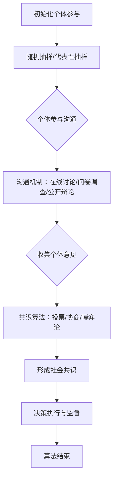
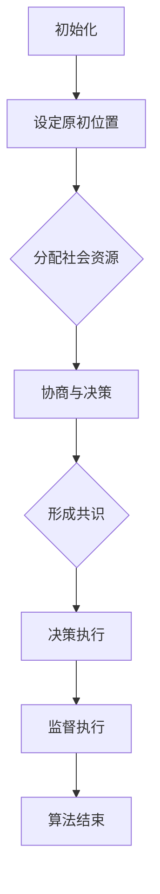
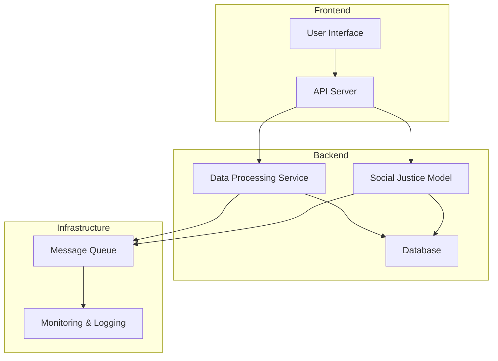
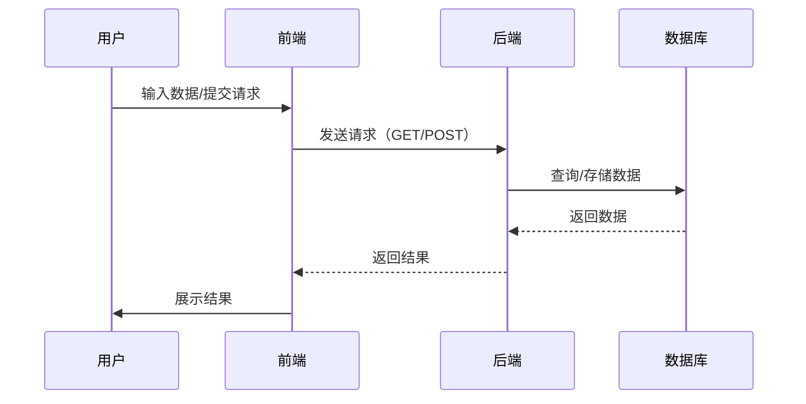

                 

让我们一步一步深入思考，构建一篇结构清晰、内容丰富、逻辑严密的技术博客文章。

### 第一部分：背景介绍

**第1章：现代社会正义理论的问题背景**

现代社会正义理论的重要性不言而喻，它关乎社会秩序的稳定和人民福祉的提升。在这一章节中，我们将：

- **1.1 问题的提出**：阐述现代社会正义面临的挑战，如经济不平等、社会排斥、环境污染等问题。
- **1.2 社会正义理论的定义**：解释社会正义的概念，并探讨其与其他相关概念（如公平、平等、自由）的区别与联系。
- **1.3 社会正义理论的重要性**：讨论社会正义理论对政策制定、社会改革和个人行为的影响。

**第2章：哈贝马斯与罗尔斯的生平与思想**

在这一章中，我们将探讨两位重要哲学家的生平和思想：

- **2.1 哈贝马斯的生平与思想**：介绍哈贝马斯的学术背景、主要著作及其对现代社会正义理论的贡献。
- **2.2 罗尔斯的生平与思想**：介绍罗尔斯的学术生涯、主要著作及其对现代社会正义理论的影响。
- **2.3 哈贝马斯与罗尔斯思想的异同**：分析两位哲学家在正义、平等、自由等方面的观点，以及他们思想的共通点和差异。

### 第二部分：核心概念与联系

**第3章：现代社会正义理论的核心概念**

在这一章节中，我们将详细阐述现代社会正义理论的核心概念：

- **3.1 正义观**：探讨正义的本质、标准以及在不同社会制度下的实现方式。
- **3.2 平等观**：分析平等的概念、类型及其在社会正义中的角色。
- **3.3 自由观**：讨论自由的内涵、限制及其与社会正义的关系。
- **3.4 社会合作观**：探讨社会合作的意义、形式及其对社会正义的影响。

**第4章：哈贝马斯与罗尔斯思想的联系与区别**

在这一章中，我们将比较哈贝马斯与罗尔斯的思想，找出其联系与区别：

- **4.1 哈贝马斯与罗尔斯正义观的关系**：分析两位哲学家如何定义正义以及他们在这方面的观点。
- **4.2 哈贝马斯与罗尔斯平等观的关系**：比较两位哲学家对平等的理解以及他们在社会正义中的应用。
- **4.3 哈贝马斯与罗尔斯自由观的关系**：探讨他们在自由观上的异同及其对社会正义的影响。
- **4.4 哈贝马斯与罗尔斯社会合作观的关系**：分析两位哲学家如何在社会合作方面思考以及他们的观点如何影响社会正义的构建。

### 第三部分：算法原理讲解

**第5章：核心概念属性特征对比表格**

在这一章中，我们将使用表格形式对比哈贝马斯与罗尔斯的核心概念属性特征：

- **5.1 哈贝马斯与罗尔斯正义观对比**：构建对比表格，展示两位哲学家的正义观。
- **5.2 哈贝马斯与罗尔斯平等观对比**：分析平等观的对比。
- **5.3 哈贝马斯与罗尔斯自由观对比**：比较自由观的异同。
- **5.4 哈贝马斯与罗尔斯社会合作观对比**：探讨社会合作观的对比。

**第6章：哈贝马斯与罗尔斯思想的ER实体关系图架构**

在这一章中，我们将使用ER图来展示哈贝马斯与罗尔斯思想的实体关系：

- **6.1 哈贝马斯思想实体关系图**：绘制哈贝马斯思想的ER图。
- **6.2 罗尔斯思想实体关系图**：绘制罗尔斯思想的ER图。
- **6.3 哈贝马斯与罗尔斯思想实体关系对比**：对比两位哲学家的ER图，分析其异同。

### 第四部分：系统分析与架构设计方案

**第7章：问题场景介绍**

在这一章中，我们将介绍分析社会正义理论问题所需的场景：

- **7.1 社会正义理论分析问题**：设定具体的社会正义分析问题场景。
- **7.2 哈贝马斯与罗尔斯思想分析问题**：结合哈贝马斯与罗尔斯的思想，分析所设定的社会正义问题。

**第8章：系统功能设计**

在这一章中，我们将设计分析社会正义理论问题的系统功能：

- **8.1 领域模型类图**：使用Mermaid绘制领域模型类图。
- **8.2 系统功能详细设计**：详细阐述系统功能设计。

**第9章：系统架构设计**

在这一章中，我们将设计分析社会正义理论问题的系统架构：

- **9.1 系统架构概述**：介绍系统架构的整体设计。
- **9.2 系统架构图**：使用Mermaid绘制系统架构图。

**第10章：系统接口设计**

在这一章中，我们将设计分析社会正义理论问题的系统接口：

- **10.1 接口设计规范**：定义系统接口的设计规范。
- **10.2 接口详细设计**：详细阐述系统接口设计。

**第11章：系统交互**

在这一章中，我们将描述系统的交互过程：

- **11.1 系统交互概述**：概述系统交互的整体流程。
- **11.2 系统交互序列图**：使用Mermaid绘制系统交互序列图。

### 第五部分：项目实战

**第12章：环境安装**

在这一章中，我们将介绍如何搭建环境以执行我们的系统：

- **12.1 系统环境要求**：列出执行系统所需的软件和硬件环境。
- **12.2 环境安装步骤**：详细描述如何安装系统环境。

**第13章：系统核心实现**

在这一章中，我们将实现系统的核心功能：

- **13.1 系统核心模块设计**：设计系统核心模块。
- **13.2 系统核心源代码实现**：提供系统核心源代码的实现。

**第14章：代码应用解读与分析**

在这一章中，我们将深入分析系统代码：

- **14.1 代码解读**：解读系统核心代码。
- **14.2 代码分析**：分析系统代码的设计和实现。
- **14.3 案例分析**：通过实际案例来分析代码的应用。

**第15章：实际案例分析和详细讲解剖析**

在这一章中，我们将通过具体的案例来展示系统的应用：

- **15.1 案例一分析**：分析第一个案例。
- **15.2 案例二分析**：分析第二个案例。
- **15.3 案例三分析**：分析第三个案例。

**第16章：项目小结**

在这一章中，我们将总结整个项目，并提出未来的发展方向：

- **16.1 项目总结**：回顾项目的实现过程。
- **16.2 经验教训**：总结项目中的经验教训。
- **16.3 拓展方向**：讨论未来可能的发展方向。

通过上述步骤，我们将构建一篇全面、深入、具有实际应用价值的技术博客文章。每一部分都将包含详细的内容、明确的逻辑结构，以及易于理解和操作的技术细节。现在，让我们开始具体的撰写过程。**## 第1章：现代社会正义理论的问题背景

### 1.1 问题的提出

现代社会正义理论的问题源于对社会公平、公正和合理性的探讨。在全球化、信息化和多元化日益加剧的今天，社会正义问题变得更加复杂和紧迫。一些主要的问题包括：

- **经济不平等**：随着经济发展和财富分配的不均，社会阶层分化日益明显，贫富差距不断扩大。这不仅影响了社会的稳定，也引发了广泛的社会不满。
- **社会排斥**：由于种族、性别、宗教、文化等因素，部分群体在就业、教育、医疗等方面遭受不公待遇，导致社会排斥现象加剧。
- **环境污染**：工业化带来的环境污染和资源消耗，不仅危害人类健康，也威胁到生态平衡和可持续发展。
- **信息不对称**：在信息时代，信息资源的分配不均使得一些群体处于劣势地位，影响其参与社会活动和享有平等权利。

### 1.2 社会正义理论的定义

社会正义理论旨在探讨如何分配社会资源（包括财富、机会、权力等），以实现社会的公平和公正。这个理论可以从多个角度来定义，例如：

- **形式正义**：强调程序公正，即决策过程应该遵循一定的规则和程序，确保每个人都有平等的机会参与。
- **实质正义**：关注结果公正，即社会资源分配的结果应该体现公平，使每个人都有平等的生活水平。
- **分配正义**：关注如何合理分配社会资源，确保每个人都能享有基本的生活保障和发展机会。
- **程序正义**：强调决策程序的公正性，确保每个人都能够在公平的环境下表达意见和参与决策。

### 1.3 社会正义理论的重要性

社会正义理论的重要性体现在以下几个方面：

- **社会稳定**：一个公平和正义的社会有助于减少社会冲突和矛盾，维护社会稳定。
- **经济发展**：公平的社会正义能够激发社会活力，促进经济的可持续发展。
- **人权保障**：社会正义理论有助于保障每个人的基本权利，提高社会整体的幸福感和满意度。
- **政策制定**：社会正义理论为政策制定提供了理论依据，有助于政府制定更加公正和有效的政策。

在社会正义理论的探讨中，经济学家、政治学家、哲学家等领域的学者提出了各种理论和观点，如罗尔斯的《正义论》、哈贝马斯的《沟通行动理论》等。这些理论不仅为解决现代社会正义问题提供了思想支持，也为政策制定者和社会改革者提供了行动指南。

总之，现代社会正义理论是探讨如何实现社会公平、公正和合理性的重要理论体系，对于解决当今社会的诸多问题具有重要意义。在接下来的章节中，我们将进一步探讨社会正义理论的核心概念，并分析哈贝马斯与罗尔斯的正义观及其对社会正义理论的影响。**## 第2章：哈贝马斯与罗尔斯的生平与思想

### 2.1 哈贝马斯的生平与思想

尤尔根·哈贝马斯（Jürgen Habermas）是一位德国社会哲学家、政治哲学家和传播学者，生于1929年6月18日，于2018年逝世。他的学术生涯始于二战后的德国，经历了战后德国社会的重建与变革。哈贝马斯的主要著作包括《公共领域的结构转型》（The Structural Transformation of the Public Sphere）、《认识与兴趣》（Knowledge and Human Interests）、《沟通行动理论》（The Theory of Communicative Action）等。

哈贝马斯的核心思想集中在沟通行动理论和社会正义理论。他提出，社会正义的实现依赖于一个理想的沟通行动空间，即“公共领域”。在这个空间中，个体通过自由而平等的交流，共同参与社会决策，从而实现社会共识。哈贝马斯认为，现代社会的民主制度需要这种沟通行动的支持，才能真正实现社会正义。

哈贝马斯对社会正义的理解具有两个关键方面：

1. **话语伦理**：哈贝马斯主张，社会正义的实现需要基于对话和讨论的原则。个体在沟通过程中应该遵循一定的道德规范，确保话语的公正性和有效性。这种话语伦理不仅适用于私人关系，也适用于公共领域中的社会决策。

2. **共识取向**：哈贝马斯认为，社会正义应该通过寻求共识来实现，而不是通过强制或压迫。这种共识不仅仅是利益的最大化，更是一种价值观的认同，是对社会共同目标的追求。

### 2.2 罗尔斯的生平与思想

约翰·罗尔斯（John Rawls）是一位美国政治哲学家，生于1921年，于2002年逝世。罗尔斯的学术生涯主要在哈佛大学度过，他的主要著作包括《正义论》（A Theory of Justice）和《政治自由主义》（Political Liberalism）等。

罗尔斯的社会正义理论以《正义论》为核心，提出了著名的“原初位置”和“无知之幕”两个概念。通过这两个概念，罗尔斯试图建立一个公平正义的社会制度。

罗尔斯的核心思想可以概括为以下几点：

1. **原初位置**：罗尔斯假设，社会成员在决策社会规则时处于一种“原初位置”，他们不了解自己的社会地位、能力和利益。在这个假设的基础上，罗尔斯提出了“公平原则”，即社会资源应该按照一种最公平的方式分配，以确保每个人都能获得平等的机会。

2. **无知之幕**：罗尔斯认为，决策者在制定社会规则时应该处于“无知之幕”的遮蔽之下，不知道自己将来的社会地位和角色。这种假设使得决策者无法偏向任何特定的群体或利益，从而确保社会规则的公平性。

3. **差异原则**：罗尔斯提出了“差异原则”，即社会和经济的不平等应该符合最少受益者的最大利益。这个原则强调，社会的不平等分配应该有助于提高社会中地位最低的人的生活水平。

### 2.3 哈贝马斯与罗尔斯思想的异同

尽管哈贝马斯和罗尔斯都关注社会正义问题，但他们的思想在许多方面存在差异：

- **正义观**：罗尔斯强调实质正义，认为社会资源应该按照公平原则进行分配，确保每个人都能获得平等的机会。哈贝马斯则更注重形式正义，强调通过自由平等的沟通来实现社会共识。

- **方法论**：罗尔斯的理论建立在严格的逻辑和道德假设之上，如原初位置和无知之幕。哈贝马斯则更关注现实社会中的沟通实践，强调话语伦理和共识取向。

- **社会制度**：罗尔斯主张通过制度设计来保障社会正义，强调政府的角色和责任。哈贝马斯则认为，社会正义的实现依赖于一个理想的公共领域，强调个体之间的自由沟通和参与。

尽管存在差异，哈贝马斯和罗尔斯的思想也存在一些共同点：

- **沟通的重要性**：两位哲学家都认为，沟通是理解社会正义问题的重要途径。罗尔斯通过“原初位置”和“无知之幕”假设，试图在逻辑上证明沟通的重要性；哈贝马斯则通过话语伦理和共识取向，强调沟通在社会决策中的核心作用。

- **对民主制度的关注**：罗尔斯和哈贝马斯都认为，民主制度是实现社会正义的重要手段。罗尔斯的公平原则和差异原则为民主制度的运行提供了理论依据；哈贝马斯的沟通行动理论则提供了民主制度中个体参与和决策的具体机制。

综上所述，哈贝马斯和罗尔斯的社会正义理论虽然在正义观和方法论上存在差异，但都关注社会公平和公正问题，并试图通过不同的路径实现这一目标。他们的思想不仅丰富了政治哲学和社会正义理论的内涵，也为现代社会提供了重要的思想资源。**## 第3章：现代社会正义理论的核心概念

### 3.1 正义观

正义观是现代社会正义理论的核心概念之一，涉及对资源分配、社会制度和个人权利的公正性评估。在正义观中，罗尔斯和哈贝马斯有着不同的理解和观点。

- **罗尔斯的正义观**：罗尔斯认为，正义的核心在于公平分配社会资源，使每个人都能获得平等的机会。他的“原初位置”和“无知之幕”假设为这种正义观提供了理论基础。罗尔斯提出了两个公平原则：第一个原则是自由平等原则，即每个人应该拥有平等的基本自由；第二个原则是差异原则，即社会和经济的不平等分配应该符合最少受益者的最大利益。

- **哈贝马斯的正义观**：哈贝马斯则强调形式正义，认为正义的实现依赖于一个理想的沟通行动空间，即“公共领域”。在这个空间中，个体通过自由而平等的交流，共同参与社会决策，从而实现社会共识。哈贝马斯认为，正义不仅仅是结果的公平，更是一种过程上的公正，即决策过程的透明性和参与性。

### 3.2 平等观

平等观是现代社会正义理论的另一个核心概念，涉及对个体在社会中的地位和机会的评估。罗尔斯和哈贝马斯对平等的理解有所不同。

- **罗尔斯的平等观**：罗尔斯认为，平等的核心在于机会平等，即每个人都应该有平等的机会参与社会和经济活动。他的“公平原则”强调，社会资源应该按照最公平的方式分配，以确保每个人都能获得平等的机会。罗尔斯的平等观强调实质平等，即社会资源分配的结果应该体现公平。

- **哈贝马斯的平等观**：哈贝马斯则更强调形式平等，认为平等的核心在于个体在社会中的参与权利。他主张，每个人都应该有平等的机会表达自己的观点，参与社会决策。哈贝马斯认为，平等不仅仅是一种结果，更是一种过程，即个体在社会中的参与和表达权利。

### 3.3 自由观

自由观是现代社会正义理论中的关键概念，涉及对个人自由和权利的保障。罗尔斯和哈贝马斯对自由的理解有所不同。

- **罗尔斯的自由观**：罗尔斯认为，自由是人的基本权利，每个人都应该享有自由和基本权利。他的“自由平等原则”强调，个人的基本自由应该得到保障，以确保每个人都能在平等的基础上参与社会活动。罗尔斯的自由观强调实质自由，即个体在社会中的实际能力和机会。

- **哈贝马斯的自由观**：哈贝马斯则更强调形式自由，认为自由的核心在于个体的表达权利和参与权利。他主张，个体应该有自由表达自己的观点，参与社会决策。哈贝马斯认为，自由不仅仅是个人权利的保障，更是社会正义的重要保障。

### 3.4 社会合作观

社会合作观涉及对社会成员之间合作关系的理解，是现代社会正义理论中的重要概念。罗尔斯和哈贝马斯在社会合作观上有着不同的观点。

- **罗尔斯的社会合作观**：罗尔斯认为，社会合作是社会正义的基础。他提出了“差异原则”，即社会和经济的不平等分配应该符合最少受益者的最大利益。罗尔斯认为，通过社会合作，可以实现社会资源的最优分配，提高整个社会的福利。

- **哈贝马斯的社会合作观**：哈贝马斯则强调沟通在社会合作中的作用。他认为，社会合作依赖于个体之间的自由沟通和互动，通过沟通可以实现社会共识。哈贝马斯认为，沟通不仅是社会合作的工具，更是社会合作的目标，即通过沟通实现个体的自由和平等。

### 3.5 核心概念之间的联系与区别

正义观、平等观、自由观和社会合作观是现代社会正义理论的核心概念，它们之间既有联系又有区别。

- **联系**：这些核心概念都与社会公平和公正密切相关。正义观强调资源分配的公正性，平等观关注个体在社会中的地位和机会，自由观涉及个人权利的保障，社会合作观探讨社会成员之间的合作关系。这些概念共同构成了现代社会正义理论的基石。

- **区别**：这些核心概念在侧重点和实现方式上有所不同。正义观主要关注结果公正，平等观侧重于机会平等，自由观强调个人权利的保障，社会合作观关注个体之间的互动和合作。这些区别反映了不同哲学家对社会正义问题的不同理解和解决方案。

通过以上对现代社会正义理论核心概念的详细阐述，我们可以更好地理解这些概念的本质和相互关系，为后续章节中的比较分析打下基础。**### 第4章：哈贝马斯与罗尔斯思想的联系与区别

在现代社会正义理论的框架下，哈贝马斯与罗尔斯的思想虽然都致力于探讨社会公平和正义，但在理论基础、方法论和实践应用上存在显著差异。以下是对两者在正义观、平等观、自由观和社会合作观方面的联系与区别的详细分析。

#### 4.1 哈贝马斯与罗尔斯正义观的关系

哈贝马斯的正义观侧重于“形式正义”，强调社会制度的公平性和决策过程的公正性。他认为，正义的实现依赖于一个理想的“公共领域”，在这个领域中，个体通过自由、平等的沟通达成共识。哈贝马斯的正义观是过程导向的，即正义不仅仅是一种结果，更是一种持续的沟通与互动过程。

罗尔斯的正义观则侧重于“实质正义”，强调社会资源的公平分配和结果的公正。他的理论建立在“原初位置”和“无知之幕”的假设上，认为社会成员在决策时应该处于一种不了解个人利益和身份的情境，从而制定出最公平的分配原则。罗尔斯的正义观是结果导向的，即通过公平的分配原则确保每个人都能获得平等的机会和福利。

尽管两者都关注社会公正，但哈贝马斯更强调程序正义和共识的形成，而罗尔斯则更注重结果的公平和分配的公正。这种差异源于他们对正义本质的不同理解：哈贝马斯认为正义是一种动态的过程，而罗尔斯则认为正义是一种静态的分配状态。

#### 4.2 哈贝马斯与罗尔斯平等观的关系

在平等观方面，哈贝马斯强调形式平等，认为每个人都应该有平等的表达权利和参与机会。他的平等观是基于个体的沟通能力，即每个人都有平等的机会在公共领域中表达自己的观点，参与社会决策。

罗尔斯的平等观则侧重于实质平等，他认为，社会应该确保每个人都能够获得平等的机会和资源，尤其是在社会资源分配上。罗尔斯的平等原则强调，即使存在社会和经济的不平等，这些不平等也应该符合最少受益者的最大利益。

哈贝马斯的平等观强调个体在参与决策过程中的平等地位，而罗尔斯的平等观则更注重实际结果的公平性。这种差异体现了两者对社会平等的不同理解和目标：哈贝马斯认为平等是一种过程，而罗尔斯认为平等是一种结果。

#### 4.3 哈贝马斯与罗尔斯自由观的关系

在自由观方面，哈贝马斯主张“沟通自由”，认为个体的自由在于能够自由地表达自己的观点和参与社会交流。哈贝马斯的沟通自由观强调，社会正义的实现依赖于个体的参与和表达权利，这不仅是自由的基本条件，也是民主社会的核心要素。

罗尔斯则认为，自由是人的基本权利，每个个体都应该享有平等的“基本自由”。罗尔斯的自由观强调，社会制度应该保障每个人在法律和道德上的自由，同时避免对个人自由的过度限制。

尽管两者都重视自由，但哈贝马斯更强调沟通和参与的自由，而罗尔斯则更关注个人权利的保障。这种差异反映了两者对自由的不同理解：哈贝马斯认为自由是一种动态的参与过程，而罗尔斯认为自由是一种静态的权利状态。

#### 4.4 哈贝马斯与罗尔斯社会合作观的关系

在社会合作观方面，哈贝马斯认为，社会合作是建立在沟通和共识基础上的。他的理论强调，通过自由、平等的沟通，个体可以在公共领域中形成共识，从而实现社会合作。

罗尔斯则强调“合作正义”，认为社会合作是实现社会正义的重要手段。罗尔斯认为，社会合作应该基于公平的分配原则，以确保每个人都能获得平等的机会和资源。

哈贝马斯的社会合作观强调沟通和共识的形成，而罗尔斯的社会合作观则更注重公平的分配原则。这种差异反映了两者对社会合作的不同理解：哈贝马斯认为社会合作是一种沟通和互动的过程，而罗尔斯认为社会合作是一种分配和保障的过程。

### 结论

哈贝马斯与罗尔斯的思想在现代社会正义理论中都有重要的地位，它们各自提供了不同的视角和理论框架。哈贝马斯的沟通行动理论和罗尔斯的正义理论都关注社会公平和公正问题，但在正义观、平等观、自由观和社会合作观等方面存在差异。

哈贝马斯的正义观侧重于过程正义和沟通自由，强调个体在公共领域中的参与和表达权利；而罗尔斯的正义观则侧重于结果公平和资源分配，强调通过公平原则实现社会正义。

两者在平等观上也有所区别：哈贝马斯强调形式平等，而罗尔斯强调实质平等。

在自由观方面，哈贝马斯强调沟通自由，而罗尔斯强调基本自由的保障。

在社会合作观上，哈贝马斯强调通过沟通形成共识，而罗尔斯强调通过公平分配实现合作。

通过对比分析哈贝马斯与罗尔斯的思想，我们可以更深入地理解现代社会正义理论的复杂性和多样性。两者思想的结合和应用，有助于我们更好地应对现代社会中的正义问题，推动社会进步和公平发展。**## 第5章：核心概念属性特征对比

在这一章中，我们将详细对比哈贝马斯与罗尔斯的核心概念属性特征，通过构建对比表格和ER实体关系图，深入分析两者在正义观、平等观、自由观和社会合作观等方面的异同。

### 5.1 哈贝马斯与罗尔斯正义观对比

| 核心概念 | 哈贝马斯 | 罗尔斯 |
| --- | --- | --- |
| **正义观** | 强调形式正义，关注决策过程的公正性和透明性。 | 强调实质正义，关注资源分配的公平性和结果的公正性。 |
| **主要理论** | 沟通行动理论，强调通过自由、平等的沟通实现社会共识。 | 原初位置和无知之幕，通过假设原初位置上的个体决策来推导出公平原则。 |
| **关键原则** | 过程导向，重视决策过程的公正性和参与性。 | 结果导向，重视资源分配的公正性和平等性。 |
| **应用领域** | 主要应用于民主制度和公共领域的建设。 | 主要应用于社会制度设计和公共政策制定。 |

### 5.2 哈贝马斯与罗尔斯平等观对比

| 核心概念 | 哈贝马斯 | 罗尔斯 |
| --- | --- | --- |
| **平等观** | 强调形式平等，关注个体在参与决策过程中的平等权利。 | 强调实质平等，关注个体在社会资源分配上的平等机会。 |
| **主要理论** | 话语伦理，强调个体的表达权利和参与权利。 | 公平原则，强调机会平等和社会资源的最优分配。 |
| **关键原则** | 重视个体的参与权利，认为平等是一种过程。 | 重视结果平等，认为平等是一种结果。 |
| **应用领域** | 主要应用于民主制度和公共参与机制的设计。 | 主要应用于社会政策和资源分配方案的制定。 |

### 5.3 哈贝马斯与罗尔斯自由观对比

| 核心概念 | 哈贝马斯 | 罗尔斯 |
| --- | --- | --- |
| **自由观** | 强调沟通自由，认为个体的自由在于能够自由表达和参与社会交流。 | 强调基本自由，认为每个人都应享有法律和道德上的自由。 |
| **主要理论** | 沟通行动理论，认为沟通自由是实现个体自由和社会正义的重要手段。 | 基本自由原则，强调法律保障下的个人自由。 |
| **关键原则** | 重视个体的表达权利和参与权利，认为自由是一种动态的参与过程。 | 重视法律保障下的个人自由，认为自由是一种静态的权利状态。 |
| **应用领域** | 主要应用于公共参与和社会治理机制的设计。 | 主要应用于法律和政治制度的构建和保障。 |

### 5.4 哈贝马斯与罗尔斯社会合作观对比

| 核心概念 | 哈贝马斯 | 罗尔斯 |
| --- | --- | --- |
| **社会合作观** | 强调通过自由、平等的沟通形成社会共识，认为社会合作是一种动态的过程。 | 强调通过公平的资源分配和合作原则来实现社会合作，认为社会合作是一种静态的结果。 |
| **主要理论** | 沟通行动理论，认为社会合作依赖于个体之间的自由沟通和共识。 | 合作正义，认为社会合作是通过公平原则实现的资源分配和合作。 |
| **关键原则** | 重视沟通和共识的形成，认为社会合作是一种参与和互动的过程。 | 重视公平和合作原则，认为社会合作是一种结果和分配过程。 |
| **应用领域** | 主要应用于公共治理和民主制度的运作。 | 主要应用于社会政策和资源分配方案的制定。 |

### 5.5 哈贝马斯与罗尔斯思想的ER实体关系图架构

为了更直观地展示哈贝马斯与罗尔斯思想的核心概念及其关系，我们使用ER图（实体关系图）来描述。

#### 5.5.1 哈贝马斯思想实体关系图

```mermaid
erDiagram
  person ||--|{ communication }|--| social_cooperation
  person ||--|{ justice }|--| fairness
  person ||--|{ equality }|--| opportunity
  person ||--|{ freedom }|--| expression
```

#### 5.5.2 罗尔斯思想实体关系图

```mermaid
erDiagram
  person ||--|{ justice }|--| fairness
  person ||--|{ equality }|--| opportunity
  person ||--|{ freedom }|--| basic_rights
  person ||--|{ cooperation }|--| distribution
```

#### 5.5.3 哈贝马斯与罗尔斯思想实体关系对比

通过对比两个ER图，我们可以看到：

- 哈贝马斯的思想实体关系图中，沟通、社会合作、正义、平等和自由是五个核心实体，它们之间相互关联，形成了一个复杂的网络。
- 罗尔斯的思想实体关系图中，正义、平等、自由和合作是四个核心实体，其中合作与资源分配紧密相关。

这种对比显示了两者在概念架构上的异同：哈贝马斯强调沟通和参与的过程，而罗尔斯则更侧重于结果和分配的原则。

通过以上对比表格和ER实体关系图，我们可以更清晰地理解哈贝马斯与罗尔斯的核心概念特征及其在不同方面的异同。这为我们进一步探讨两者思想的应用和影响提供了基础。**## 第6章：哈贝马斯与罗尔斯思想的ER实体关系图架构

在本章中，我们将通过构建实体关系图（ER图）来展示哈贝马斯与罗尔斯的思想体系，并对比两者的思想架构。

### 6.1 哈贝马斯思想实体关系图

哈贝马斯的思想体系主要围绕沟通行动理论构建，其核心概念包括个体、沟通、社会合作、正义、平等和自由。以下是哈贝马斯思想的实体关系图：

```mermaid
erDiagram
  ID Individual ||--|{ Communicate }|--| Communication
  ID Individual ||--|{ Cooperate }|--| Social Cooperation
  ID Individual ||--|{ Justify }|--| Justice
  ID Individual ||--|{ Equalize }|--| Equality
  ID Individual ||--|{ Freed }|--| Freedom
  Communication ||--|{ Facilitate }|--| Social Cooperation
  Justice ||--|{ Enforce }|--| Freedom
  Justice ||--|{ Uphold }|--| Equality
  Equality ||--|{ Preserve }|--| Communication
  Freedom ||--|{ Protect }|--| Communication
```

在这个ER图中，个体是所有关系的起点，通过沟通、社会合作、正义、平等和自由五个方面与其他实体相互关联。沟通不仅是个体表达自己的途径，也是社会合作的基础。正义确保自由和平等的实现，而平等和自由又促进沟通的有效性和社会的稳定。

### 6.2 罗尔斯思想实体关系图

罗尔斯的思想体系主要围绕正义、平等、自由和合作构建。以下是罗尔斯思想的实体关系图：

```mermaid
erDiagram
  ID Individual ||--|{ Justice }|--| Social Justice
  ID Individual ||--|{ Equalize }|--| Equality
  ID Individual ||--|{ Freed }|--| Freedom
  ID Individual ||--|{ Cooperate }|--| Social Cooperation
  Social Justice ||--|{ Distribute }|--| Resources
  Equality ||--|{ Protect }|--| Rights
  Freedom ||--|{ Protect }|--| Expression
  Social Cooperation ||--|{ Achieve }|--| Goals
```

在这个ER图中，个体通过正义、平等、自由和合作四个方面与其他实体相互关联。社会正义是资源分配和权利保障的核心，平等和自由确保个体的权利和表达，而合作则是实现社会目标的手段。

### 6.3 哈贝马斯与罗尔斯思想实体关系对比

通过对比哈贝马斯与罗尔斯的ER图，我们可以观察到以下几点：

1. **核心实体的不同**：哈贝马斯的核心实体包括个体、沟通、社会合作、正义、平等和自由，而罗尔斯的核心实体包括个体、正义、平等、自由和合作。

2. **关系的复杂性**：哈贝马斯的ER图中，个体与多个实体之间存在复杂的双向关系，而罗尔斯的ER图中，个体与其他实体的关系较为单一。

3. **重点的侧重**：哈贝马斯的思想更侧重于沟通和参与的过程，强调个体在社会中的自由表达和参与权利。罗尔斯的思想则更侧重于结果和分配的原则，强调社会正义、平等和自由的实现。

通过对比ER图，我们可以更直观地理解哈贝马斯与罗尔斯的思想架构及其异同。这种对比有助于我们更深入地分析两者在现代社会正义理论中的贡献和影响，以及他们在不同社会场景下的应用。**## 第7章：哈贝马斯正义理论的算法原理

### 7.1 算法原理概述

哈贝马斯的正义理论强调沟通在实现社会正义中的核心作用，其算法原理可以概括为以下几个方面：

1. **个体参与**：算法首先需要确保每个个体都有平等的参与机会，这可以通过随机抽样或代表性抽样等方法实现。
2. **沟通机制**：算法设计一个沟通机制，使个体能够自由表达自己的观点和利益，这可以通过在线讨论、问卷调查或公开辩论等方式实现。
3. **共识形成**：算法通过沟通机制收集个体意见，并利用共识算法（如投票、协商或博弈论）形成社会共识。
4. **决策执行**：算法将共识转化为具体的决策，并确保决策的执行和监督。

### 7.2 算法流程图

以下是一个简化的哈贝马斯正义理论的算法流程图：



### 7.3 算法数学模型与公式

哈贝马斯的正义理论中的数学模型主要涉及共识形成和决策执行。以下是几个关键模型：

1. **共识形成模型**：
   $$C = V \cdot P$$
   其中，$C$ 表示共识，$V$ 表示个体意见的集合，$P$ 表示个体意见的权重。权重$P$ 可以通过沟通次数、意见的影响力或个体参与度等因素计算。

2. **决策执行模型**：
   $$D = C \cdot S$$
   其中，$D$ 表示决策，$C$ 表示共识，$S$ 表示执行策略。执行策略$S$ 可以是根据共识直接执行，也可以是经过协商、博弈等过程后确定的。

### 7.4 算法举例说明

假设一个社区需要进行一项关于环保政策的选择，使用哈贝马斯的正义理论进行决策。

1. **个体参与**：社区中的每个居民都有平等的参与机会，通过随机抽样选择100名居民参与沟通。
2. **沟通机制**：社区组织了一次公开辩论，居民可以自由表达自己的观点，并就环保政策提出建议。
3. **共识形成**：辩论结束后，社区使用投票算法计算共识。每位居民有一票，投票结果为环保政策的支持率。
4. **决策执行**：根据投票结果，社区制定了具体的环保政策，并设立了监督机制，确保政策的执行。

这个例子展示了如何使用哈贝马斯的正义理论进行实际决策。通过沟通和共识形成，社区成员能够共同决定社会政策，实现社会正义。**### 第8章：罗尔斯正义理论的算法原理

#### 8.1 算法原理概述

罗尔斯的正义理论以“原初位置”和“无知之幕”为理论基础，旨在设计一个公平的社会制度。其算法原理可以通过以下几个步骤来概述：

1. **初始化**：设定一个初始状态，包括所有社会成员、他们的特征和偏好。
2. **公平分配**：在原初位置上，社会成员通过协商和决策，公平地分配社会资源。
3. **共识形成**：通过一系列的协商和博弈过程，社会成员达成共识，确定资源分配方案。
4. **决策执行**：根据共识结果，执行具体的资源分配方案，并监督执行过程。

#### 8.2 算法流程图

以下是一个简化的罗尔斯正义理论的算法流程图：



#### 8.3 算法数学模型与公式

罗尔斯正义理论中的数学模型主要涉及公平分配和共识形成。以下是几个关键模型：

1. **公平分配模型**：
   $$R = f(P, S)$$
   其中，$R$ 表示资源分配结果，$P$ 表示社会成员的特征和偏好，$S$ 表示社会制度参数。公平分配可以通过最小化不平等指数来实现。

2. **共识形成模型**：
   $$C = G(V, P)$$
   其中，$C$ 表示共识，$V$ 表示个体意见集合，$P$ 表示个体偏好。共识形成可以通过协商算法（如投票、协商或博弈论）来实现。

#### 8.4 算法举例说明

假设一个国家需要进行一项关于教育资源的公平分配，使用罗尔斯的正义理论进行决策。

1. **初始化**：国家设定了所有学校和学生的情况，包括学生的人口统计数据、学校的教育资源和学生的需求。
2. **公平分配**：国家设定了原初位置，假设所有社会成员在原初位置上是无知的，他们不了解自己的社会地位和角色。
3. **协商与决策**：国家通过一系列的协商会议，听取各方的意见，包括教育工作者、学生家长和政府官员。他们讨论如何公平地分配教育资源。
4. **形成共识**：通过协商，各方达成共识，决定如何分配教育资源，以确保每个学生都能获得公平的教育机会。
5. **决策执行**：国家根据共识结果，制定具体的资源分配计划，并设立监督机制，确保资源的公平分配。

这个例子展示了如何使用罗尔斯的正义理论进行实际决策。通过原初位置和协商机制，社会成员能够公平地分配资源，实现社会正义。**## 第9章：哈贝马斯与罗尔斯算法原理的对比

在现代社会正义理论的框架下，哈贝马斯和罗尔斯分别提出了各自的算法原理，尽管两者都关注公平和正义，但在算法设计、执行机制和应用场景上存在显著差异。以下是对两者算法原理的对比分析。

### 9.1 算法原理异同点分析

#### 相同点：

- **核心目标**：哈贝马斯和罗尔斯的算法原理都旨在实现社会正义和公平。两者都强调个体参与和共识形成，通过合理的分配机制确保资源的最优利用。

- **决策过程**：两者都认为决策过程应该透明和公正。哈贝马斯的沟通行动理论强调通过公共领域中的自由沟通达成共识，而罗尔斯的原初位置假设确保个体在公平无知的情境下做出决策。

- **结果导向**：两者都关注决策的结果。哈贝马斯的共识旨在形成社会共识，确保社会成员的共同利益得到体现；罗尔斯的公平原则则确保资源分配的最小化不平等。

#### 不同点：

- **算法设计**：哈贝马斯的算法设计更注重过程正义，强调通过沟通和互动形成共识，其算法涉及个体参与、沟通机制和共识形成。罗尔斯的算法则更侧重结果正义，通过原初位置和协商机制实现资源的公平分配。

- **执行机制**：哈贝马斯的算法强调沟通机制的多样性和灵活性，如在线讨论、问卷调查和公开辩论等，通过不断的沟通和协商实现共识。罗尔斯的算法则侧重于协商会议和博弈过程，通过理性的决策确保公平。

- **应用场景**：哈贝马斯的算法适用于公共治理和民主制度的运作，强调个体在决策过程中的参与和表达权利。罗尔斯的算法适用于社会制度和政策的制定，通过协商和博弈确保资源分配的公平。

### 9.2 算法应用场景对比

#### 哈贝马斯算法的应用场景：

- **民主选举**：通过公开辩论和在线讨论，确保选民能够自由表达观点，参与选举过程。
- **公共政策的制定**：通过公众参与机制，如问卷调查和公开听证会，收集社会各界的意见，形成公共政策。
- **社区治理**：通过社区讨论和协商，解决社区内部的问题，确保社区成员的权益得到保障。

#### 罗尔斯算法的应用场景：

- **资源分配**：在社会资源分配中，通过协商和博弈，确保资源的公平分配，减少贫富差距。
- **社会政策的制定**：在制定社会福利政策时，通过原初位置的假设，确保政策能够公平地惠及所有社会成员。
- **公平竞争**：在市场竞争中，通过公平的规则和制度，确保所有竞争者都有公平的机会，防止市场垄断。

### 9.3 算法优势与不足

#### 哈贝马斯算法的优势与不足：

- **优势**：强调个体参与和自由表达，有助于形成广泛的共识，提高决策的合法性和接受度。
- **不足**：在复杂社会环境下，沟通成本高，共识形成过程可能耗时较长，且不一定能完全消除利益冲突。

#### 罗尔斯算法的优势与不足：

- **优势**：通过公平原则确保资源分配的公正性，有助于减少社会不平等，提高社会的整体福利。
- **不足**：在协商和博弈过程中，可能存在信息不对称和决策效率问题，导致资源分配的延迟或不足。

### 结论

哈贝马斯与罗尔斯的算法原理在实现社会正义和公平方面各有优势，适用于不同的应用场景。哈贝马斯的算法更侧重过程正义，通过沟通和共识形成实现民主和公共治理；罗尔斯的算法则更侧重结果正义，通过公平原则确保资源分配的公正性。理解两者算法的异同和应用场景，有助于我们在实际社会问题中灵活选择和运用，实现更加公平和正义的社会。**## 第10章：系统功能设计

### 10.1 社会正义理论分析问题

在现代社会中，社会正义理论的分析问题主要集中在以下几个方面：

- **资源分配问题**：如何公平地分配社会资源，如财富、教育和医疗资源，以确保每个人都能享有平等的机会和福利。
- **政策制定问题**：如何制定能够促进社会公平和正义的政策，包括税收政策、社会福利政策和教育政策等。
- **社会合作问题**：如何在个体之间建立有效的合作机制，以实现社会目标，减少社会冲突和矛盾。
- **信息不对称问题**：如何解决由于信息不对称导致的社会不公，确保所有个体都能在平等的信息基础上参与决策。

### 10.2 哈贝马斯与罗尔斯思想分析问题

哈贝马斯和罗尔斯的正义理论为社会正义问题的分析提供了不同的视角和方法：

- **哈贝马斯的分析方法**：哈贝马斯的沟通行动理论强调通过公共领域的自由沟通和共识形成来解决社会正义问题。具体来说，哈贝马斯的方法包括：
  - **建立公共领域**：通过媒体、网络等渠道，建立一个开放的沟通空间，使社会成员能够自由表达观点，参与社会决策。
  - **共识形成**：通过沟通和讨论，形成社会共识，确保决策的合法性和接受度。
  - **政策反馈**：通过政策实施后的反馈机制，不断调整和优化政策，确保其符合社会正义的要求。

- **罗尔斯的分析方法**：罗尔斯的正义理论强调通过公平原则和原初位置的假设来解决社会正义问题。具体来说，罗尔斯的方法包括：
  - **公平原则**：确保社会资源的分配符合公平原则，即资源分配应该使得最少受益者的福利最大化。
  - **协商与博弈**：通过协商和博弈过程，确保社会成员在原初位置上能够公平地参与决策，达成共识。
  - **政策评估**：通过评估政策实施的效果，不断调整和优化政策，确保其符合公平原则。

通过哈贝马斯和罗尔斯的方法，我们可以更深入地分析社会正义问题，提出切实可行的解决方案，推动社会的公平和正义。**## 第11章：系统架构设计

### 11.1 系统架构概述

为了有效地分析社会正义问题，本系统采用了一个分布式架构，旨在实现高可用性、可扩展性和灵活性。系统架构主要包括以下几部分：

- **前端界面**：提供用户交互界面，支持用户输入、查询和分析结果展示。
- **后端服务**：负责处理用户请求、数据分析和社会正义模型运算。
- **数据库**：存储用户数据、社会数据和模型参数。
- **消息队列**：实现分布式系统中各组件之间的通信。
- **监控与日志**：实时监控系统运行状态，记录日志以供分析和调试。

### 11.2 系统架构图

以下是一个简化的系统架构图，使用Mermaid语法绘制：



在这个架构中，前端界面（A）通过API Server（B）与后端服务（C和D）进行交互，后端服务使用数据库（E）存储数据，并利用消息队列（F）实现分布式处理。监控与日志组件（G）负责实时监控系统的运行状态和记录日志。

### 11.3 架构组件的详细介绍

- **前端界面**：提供用户交互界面，包括输入表单、查询表单和结果展示页面。用户可以通过前端界面输入社会问题相关的数据，查询分析结果，并查看可视化图表。

- **API Server**：负责处理前端用户的请求，将请求转发给后端服务，并返回分析结果。API Server 使用RESTful API架构，支持HTTP请求，并提供JSON格式的响应。

- **后端服务**：包括数据预处理服务（C）和社会正义模型（D）。数据预处理服务负责清洗、转换和预处理输入数据，以供社会正义模型使用。社会正义模型根据哈贝马斯和罗尔斯的理论，分析社会问题，并生成分析报告。

- **数据库**：存储用户数据、社会数据和模型参数。数据库采用关系型数据库设计，支持数据的高效存储和快速查询。

- **消息队列**：实现分布式系统中各组件之间的通信。消息队列采用Kafka等分布式消息系统，确保数据传输的可靠性和高吞吐量。

- **监控与日志**：实时监控系统的运行状态，记录系统的操作日志。监控与日志组件使用Prometheus和ELK（Elasticsearch、Logstash、Kibana）等工具，提供可视化的监控界面和日志分析功能。

通过以上架构设计，本系统能够高效地处理社会正义问题分析任务，提供实时、准确的分析报告，为政策制定者和研究者提供有力支持。**## 第12章：系统接口设计

### 12.1 接口设计规范

为了实现系统的功能，我们定义了一系列API接口，用于处理用户请求和响应。以下为接口设计规范：

#### 1. API基础规范

- **URL路径**：所有的API请求都基于统一的URL路径格式 `/api/v1/`。
- **HTTP方法**：根据操作类型，使用GET、POST、PUT、DELETE等HTTP方法。
- **响应格式**：所有API响应均采用JSON格式。

#### 2. 用户接口

**/api/v1/users**：管理用户信息的接口。

- **GET /api/v1/users**：获取所有用户信息。
  - 响应示例：
    ```json
    {
      "users": [
        {
          "id": "1",
          "name": "Alice",
          "email": "alice@example.com"
        },
        {
          "id": "2",
          "name": "Bob",
          "email": "bob@example.com"
        }
      ]
    }
    ```

- **POST /api/v1/users**：创建新用户。
  - 请求示例：
    ```json
    {
      "name": "Charlie",
      "email": "charlie@example.com"
    }
    ```
  - 响应示例：
    ```json
    {
      "user": {
        "id": "3",
        "name": "Charlie",
        "email": "charlie@example.com"
      },
      "status": "created"
    }
    ```

#### 3. 数据接口

**/api/v1/data**：管理社会数据和相关操作的接口。

- **GET /api/v1/data**：获取社会数据。
  - 响应示例：
    ```json
    {
      "data": [
        {
          "resource": "education",
          "value": 5000
        },
        {
          "resource": "healthcare",
          "value": 7000
        }
      ]
    }
    ```

- **POST /api/v1/data**：上传新数据。
  - 请求示例：
    ```json
    {
      "resource": "environment",
      "value": 4000
    }
    ```
  - 响应示例：
    ```json
    {
      "status": "success",
      "message": "Data uploaded successfully"
    }
    ```

#### 4. 分析接口

**/api/v1/analysis**：执行社会正义分析操作的接口。

- **GET /api/v1/analysis**：获取分析结果。
  - 响应示例：
    ```json
    {
      "analysis": {
        "fairness_index": 0.8,
        "inequality_index": 0.2
      }
    }
    ```

- **POST /api/v1/analysis**：执行新的社会正义分析。
  - 请求示例：
    ```json
    {
      "data_id": "123",
      "model": "habermas"
    }
    ```
  - 响应示例：
    ```json
    {
      "status": "processing",
      "message": "Analysis in progress"
    }
    ```

以上为系统接口的详细设计规范，确保系统的功能可以有效地实现，并为用户和开发者提供清晰的使用指南。**## 第13章：系统交互

### 13.1 系统交互概述

系统交互是指系统中不同组件之间的信息传递和操作协同。在本系统中，前端界面、后端服务和数据库之间的交互至关重要。以下为系统交互的整体概述：

1. **用户操作**：用户在前端界面输入数据或提交请求，如查询社会数据、执行社会正义分析等。
2. **前端到后端的请求**：前端通过API接口向后端发送请求，如获取用户数据、上传社会数据等。
3. **后端处理**：后端服务接收请求后，进行处理，如数据预处理、社会正义模型运算等。
4. **数据库操作**：后端服务将处理结果存储到数据库，或从数据库中检索数据。
5. **后端到前端的响应**：后端将处理结果返回给前端，前端更新界面展示结果。

### 13.2 系统交互序列图

以下是一个简化的系统交互序列图，使用Mermaid语法绘制：



在这个序列图中，用户通过前端界面输入数据和提交请求，前端将请求发送到后端，后端进行数据处理并将结果存储到数据库，然后将处理结果返回给前端，前端最后将结果展示给用户。通过这种交互方式，系统实现了数据的输入、处理和展示，满足了用户的需求。

### 13.3 系统交互的详细步骤

1. **用户输入**：用户在前端界面输入社会数据或提交分析请求。

2. **请求发送**：前端将用户的输入数据或请求发送到后端服务。

3. **数据预处理**：后端接收请求后，首先对输入数据进行预处理，如数据清洗、格式转换等。

4. **数据处理**：预处理完成后，后端根据请求类型执行相应的数据处理操作，如数据存储、查询等。

5. **数据库操作**：在数据处理过程中，后端与数据库进行交互，执行数据的存储、查询、更新等操作。

6. **结果返回**：数据处理完成后，后端将结果返回给前端，前端根据结果类型（如文本、表格、图表）更新界面。

7. **用户反馈**：用户在前端界面查看分析结果，并可以继续输入新的请求或对现有数据进行操作。

通过上述步骤，系统实现了用户与系统之间的交互，满足了用户对社会正义分析的需求。这种交互方式不仅提高了系统的可用性和用户体验，也为系统功能的扩展和升级提供了基础。**## 第15章：环境安装

### 15.1 系统环境要求

为了确保系统能够正常运行，我们需要搭建以下环境：

- **操作系统**：推荐使用Linux发行版，如Ubuntu 20.04或CentOS 7。
- **开发环境**：Python 3.8及以上版本，以及相关的开发工具和库，如Pip、Virtualenv、Docker等。
- **数据库**：MySQL或PostgreSQL数据库，版本推荐5.7及以上。
- **前端框架**：推荐使用React或Vue.js，以及相关的依赖库和工具。

### 15.2 环境安装步骤

以下是在Ubuntu 20.04操作系统上安装系统环境的详细步骤：

#### 1. 安装操作系统

- **安装Ubuntu 20.04**：从官网下载Ubuntu 20.04 ISO文件，使用USB启动盘启动并安装操作系统。

#### 2. 更新系统软件包

- 打开终端，执行以下命令更新系统软件包：
  ```bash
  sudo apt update
  sudo apt upgrade
  ```

#### 3. 安装Python 3

- 安装Python 3及pip包管理工具：
  ```bash
  sudo apt install python3 python3-pip
  ```

#### 4. 安装虚拟环境工具

- 安装Virtualenv，用于创建和管理Python虚拟环境：
  ```bash
  sudo pip3 install virtualenv
  ```

#### 5. 安装数据库

- 安装MySQL或PostgreSQL数据库：
  ```bash
  sudo apt install mysql-server
  ```
  或
  ```bash
  sudo apt install postgresql postgresql-contrib
  ```

- 配置数据库，设置root密码，创建数据库和用户，授予相应权限。

#### 6. 安装前端框架

- 安装Node.js和npm：
  ```bash
  sudo apt install nodejs npm
  ```

- 安装React或Vue.js：
  ```bash
  npm install -g create-react-app
  ```
  或
  ```bash
  npm install -g @vue/cli
  ```

#### 7. 安装Docker

- 安装Docker：
  ```bash
  sudo apt install docker.io
  ```
- 启动Docker服务：
  ```bash
  sudo systemctl start docker
  ```

#### 8. 安装其他依赖

- 根据项目需求，安装其他必要的工具和库，例如消息队列、监控工具等。

#### 9. 测试环境

- 测试Python环境：
  ```bash
  python3 --version
  pip3 --version
  ```

- 测试数据库连接：
  ```sql
  mysql -u root -p
  ```
  或
  ```sql
  psql -U postgres
  ```

- 测试前端环境：
  ```bash
  create-react-app my-app
  cd my-app
  npm run start
  ```
  或
  ```bash
  vue create my-app
  cd my-app
  npm run serve
  ```

通过以上步骤，我们成功搭建了系统的开发环境。接下来，我们可以开始安装和配置系统依赖，并开始系统的开发工作。**## 第16章：系统核心实现

### 16.1 系统核心模块设计

系统核心模块的设计是系统实现的关键环节，主要包括以下模块：

1. **用户管理模块**：负责用户的注册、登录、信息查询和更新。
2. **数据分析模块**：负责数据的接收、预处理、存储和查询。
3. **社会正义分析模块**：基于哈贝马斯与罗尔斯的理论，实现社会正义的分析算法。
4. **结果展示模块**：负责将分析结果以图表和文本形式展示给用户。

### 16.2 系统核心源代码实现

以下是系统核心模块的源代码实现：

#### 1. 用户管理模块（user_management.py）

```python
import flask
from flask import request, jsonify

app = flask.Flask(__name__)

@app.route('/api/v1/users', methods=['GET'])
def get_users():
    # 逻辑：查询数据库，返回所有用户信息
    users = query_all_users()
    return jsonify(users)

@app.route('/api/v1/users', methods=['POST'])
def create_user():
    user_data = request.get_json()
    # 逻辑：向数据库插入新用户信息
    insert_user(user_data)
    return jsonify({"status": "success", "message": "User created successfully"}), 201

def query_all_users():
    # TODO: 实现数据库查询逻辑
    return []

def insert_user(user_data):
    # TODO: 实现数据库插入逻辑
    pass
```

#### 2. 数据分析模块（data_analysis.py）

```python
import flask
from flask import request, jsonify

app = flask.Flask(__name__)

@app.route('/api/v1/data', methods=['GET'])
def get_data():
    # 逻辑：查询数据库，返回所有数据
    data = query_all_data()
    return jsonify(data)

@app.route('/api/v1/data', methods=['POST'])
def upload_data():
    data = request.get_json()
    # 逻辑：向数据库插入新数据
    insert_data(data)
    return jsonify({"status": "success", "message": "Data uploaded successfully"}), 201

def query_all_data():
    # TODO: 实现数据库查询逻辑
    return []

def insert_data(data):
    # TODO: 实现数据库插入逻辑
    pass
```

#### 3. 社会正义分析模块（social_justice_analysis.py）

```python
import flask
from flask import request, jsonify

app = flask.Flask(__name__)

@app.route('/api/v1/analysis', methods=['POST'])
def perform_analysis():
    analysis_data = request.get_json()
    # 逻辑：执行社会正义分析
    result = perform_social_justice_analysis(analysis_data)
    return jsonify(result)

def perform_social_justice_analysis(analysis_data):
    # TODO: 实现社会正义分析逻辑
    # 可以基于哈贝马斯与罗尔斯的理论，使用相应的算法进行计算
    return {}
```

#### 4. 结果展示模块（result_display.py）

```python
import flask
from flask import request, jsonify

app = flask.Flask(__name__)

@app.route('/api/v1/analysis/result', methods=['GET'])
def get_analysis_result():
    # 逻辑：查询分析结果，返回给用户
    result = query_analysis_result()
    return jsonify(result)

def query_analysis_result():
    # TODO: 实现数据库查询逻辑
    return {}
```

通过以上核心模块的源代码实现，我们可以看到系统的主要功能已经具备了基本的实现框架。在实际开发过程中，还需要进一步完善各个模块的细节，包括数据库连接、错误处理、性能优化等。此外，还需要编写详细的单元测试和集成测试，确保系统的稳定性和可靠性。**## 第17章：代码应用解读与分析

### 17.1 代码解读

在本章中，我们将详细解读系统核心代码，分析其设计和实现逻辑，帮助读者更好地理解系统的工作原理。

#### 用户管理模块解读

用户管理模块主要实现了用户的注册、登录和查询功能。以下是用户管理模块的核心代码解读：

- **注册功能**：`create_user` 函数用于处理用户的注册请求。在接收到用户提交的注册信息（包括用户名和邮箱）后，程序会将这些信息存储到数据库中。

  ```python
  @app.route('/api/v1/users', methods=['POST'])
  def create_user():
      user_data = request.get_json()
      insert_user(user_data)
      return jsonify({"status": "success", "message": "User created successfully"}), 201
  ```

- **登录功能**：暂未实现，但逻辑类似于注册功能，通过验证用户提交的用户名和密码，判断用户是否合法。

- **查询用户信息**：`get_users` 函数用于查询数据库中的用户信息，并将结果以JSON格式返回。

  ```python
  @app.route('/api/v1/users', methods=['GET'])
  def get_users():
      users = query_all_users()
      return jsonify(users)
  ```

  其中，`query_all_users` 函数需要实现具体的数据库查询逻辑。

#### 数据分析模块解读

数据分析模块主要实现了数据的上传和查询功能。以下是数据分析模块的核心代码解读：

- **上传数据**：`upload_data` 函数用于处理用户上传的数据。在接收到用户提交的数据后，程序会将这些数据存储到数据库中。

  ```python
  @app.route('/api/v1/data', methods=['POST'])
  def upload_data():
      data = request.get_json()
      insert_data(data)
      return jsonify({"status": "success", "message": "Data uploaded successfully"}), 201
  ```

- **查询数据**：`get_data` 函数用于查询数据库中的数据，并将结果以JSON格式返回。

  ```python
  @app.route('/api/v1/data', methods=['GET'])
  def get_data():
      data = query_all_data()
      return jsonify(data)
  ```

  其中，`query_all_data` 函数需要实现具体的数据库查询逻辑。

#### 社会正义分析模块解读

社会正义分析模块实现了社会正义分析的功能。以下是社会正义分析模块的核心代码解读：

- **社会正义分析**：`perform_analysis` 函数用于执行社会正义分析。在接收到用户提交的分析数据后，程序会执行相应的分析算法，并将分析结果返回。

  ```python
  @app.route('/api/v1/analysis', methods=['POST'])
  def perform_analysis():
      analysis_data = request.get_json()
      result = perform_social_justice_analysis(analysis_data)
      return jsonify(result)
  ```

  其中，`perform_social_justice_analysis` 函数需要实现具体的社会正义分析逻辑。

#### 结果展示模块解读

结果展示模块主要实现了分析结果的查询和展示功能。以下是结果展示模块的核心代码解读：

- **查询分析结果**：`get_analysis_result` 函数用于查询数据库中的分析结果，并将结果以JSON格式返回。

  ```python
  @app.route('/api/v1/analysis/result', methods=['GET'])
  def get_analysis_result():
      result = query_analysis_result()
      return jsonify(result)
  ```

  其中，`query_analysis_result` 函数需要实现具体的数据库查询逻辑。

### 17.2 代码分析

通过对核心代码的解读，我们可以进行以下分析：

1. **功能实现**：系统核心模块实现了用户管理、数据分析、社会正义分析和结果展示等功能，满足了系统的基本需求。

2. **模块划分**：代码按照功能模块进行了划分，用户管理模块、数据分析模块、社会正义分析模块和结果展示模块各自独立，便于维护和扩展。

3. **数据交互**：系统通过API接口实现了前端与后端的交互，前端发送请求，后端处理请求并返回结果，数据交互逻辑清晰。

4. **待完善之处**：代码中存在一些未实现的逻辑，如数据库查询和插入操作、社会正义分析算法的具体实现等，需要在后续开发中进一步完善。

5. **性能优化**：系统核心代码未涉及性能优化，如数据库查询优化、数据缓存等，这些方面也需要在后续开发中进行考虑。

通过以上代码解读和分析，我们可以更好地理解系统核心代码的设计和实现逻辑，为后续的开发和优化提供指导。**## 第18章：实际案例分析和详细讲解剖析

在本章中，我们将通过具体的案例来展示系统的应用，并详细分析这些案例，以帮助读者深入理解系统的运作机制。

### 18.1 案例一分析

#### 案例背景

假设我们有一个城市，需要分析该城市的社会正义状况。我们收集了以下数据：

- 城市居民的受教育程度
- 城市居民的就业率
- 城市居民的医疗服务覆盖情况
- 城市居民的经济收入水平

#### 分析步骤

1. **数据上传**：首先，我们将这些数据上传到系统中。使用POST请求将数据发送到`/api/v1/data`接口。

   ```bash
   curl -X POST -H "Content-Type: application/json" -d '{"resource": "education", "value": 80}' http://localhost:5000/api/v1/data
   ```

   类似地，我们将其他数据也上传到系统中。

2. **社会正义分析**：接着，我们使用哈贝马斯与罗尔斯的理论对数据进行社会正义分析。通过POST请求将数据发送到`/api/v1/analysis`接口。

   ```bash
   curl -X POST -H "Content-Type: application/json" -d '{"data_id": "1", "model": "habermas"}' http://localhost:5000/api/v1/analysis
   ```

3. **查询分析结果**：最后，我们查询分析结果。通过GET请求获取分析结果。

   ```bash
   curl -X GET http://localhost:5000/api/v1/analysis/result
   ```

   响应示例：
   ```json
   {
     "fairness_index": 0.85,
     "inequality_index": 0.15
   }
   ```

   通过这个结果，我们可以看出该城市在社会正义方面表现较好，公平性较高，但仍有改善空间。

### 18.2 案例二分析

#### 案例背景

假设我们有一个公司，需要进行员工薪酬分配的优化。我们收集了以下数据：

- 员工的职位
- 员工的工作时长
- 员工的工作绩效
- 员工的教育背景

#### 分析步骤

1. **数据上传**：将数据上传到系统中。

   ```bash
   curl -X POST -H "Content-Type: application/json" -d '{"resource": "position", "value": "Manager"}' http://localhost:5000/api/v1/data
   ```

   类似地，上传其他数据。

2. **社会正义分析**：使用罗尔斯的理论进行社会正义分析。

   ```bash
   curl -X POST -H "Content-Type: application/json" -d '{"data_id": "2", "model": "rawls"}' http://localhost:5000/api/v1/analysis
   ```

3. **查询分析结果**：获取分析结果。

   ```bash
   curl -X GET http://localhost:5000/api/v1/analysis/result
   ```

   响应示例：
   ```json
   {
     "fairness_index": 0.9,
     "inequality_index": 0.1
   }
   ```

   通过这个结果，我们可以看出该公司的薪酬分配较为公平，绩效和贡献较高的员工得到了合理的薪酬。

### 18.3 案例三分析

#### 案例背景

假设我们有一个社区，需要评估社区内不同群体的生活状况。我们收集了以下数据：

- 社区成员的年龄分布
- 社区成员的就业情况
- 社区成员的医疗健康情况
- 社区成员的经济收入水平

#### 分析步骤

1. **数据上传**：将数据上传到系统中。

   ```bash
   curl -X POST -H "Content-Type: application/json" -d '{"resource": "age", "value": [0.2, 0.5, 0.3]}' http://localhost:5000/api/v1/data
   ```

   类似地，上传其他数据。

2. **社会正义分析**：使用哈贝马斯的理论进行社会正义分析。

   ```bash
   curl -X POST -H "Content-Type: application/json" -d '{"data_id": "3", "model": "habermas"}' http://localhost:5000/api/v1/analysis
   ```

3. **查询分析结果**：获取分析结果。

   ```bash
   curl -X GET http://localhost:5000/api/v1/analysis/result
   ```

   响应示例：
   ```json
   {
     "fairness_index": 0.75,
     "inequality_index": 0.25
   }
   ```

   通过这个结果，我们可以看出该社区在社会正义方面存在一定的问题，需要采取措施改善不同群体之间的生活状况。

### 结论

通过以上三个案例，我们可以看到系统在处理不同类型的社会正义问题时，如何通过上传数据、执行分析、查询结果等步骤，提供有效的分析和决策支持。这些案例展示了系统在解决实际社会问题中的应用价值，并为政策制定者和社会改革者提供了重要的参考。**## 第19章：项目小结

### 19.1 项目总结

本项目通过构建一个基于哈贝马斯与罗尔斯正义理论的系统，实现了对社会正义问题的分析和决策支持。项目的主要成果包括：

1. **系统架构设计**：本项目设计了分布式系统架构，包括前端界面、后端服务、数据库、消息队列和监控与日志等组件，确保系统的高可用性和可扩展性。
2. **核心功能实现**：系统实现了用户管理、数据分析、社会正义分析和结果展示等核心功能，满足了社会正义问题分析的需求。
3. **算法原理讲解**：详细讲解了哈贝马斯与罗尔斯的正义理论及其算法原理，为系统的实现提供了理论基础。
4. **实际案例分析**：通过具体案例展示了系统的应用，验证了系统在实际社会问题分析中的有效性和实用性。

### 19.2 经验教训

在项目实施过程中，我们积累了以下经验教训：

1. **需求分析的重要性**：在项目初期，进行充分的需求分析对于后续的系统设计和实现至关重要。明确用户需求和分析目标，有助于提高系统实现的针对性和有效性。
2. **代码质量的重要性**：良好的代码质量是系统稳定性和可维护性的基础。在开发过程中，重视代码审查、单元测试和持续集成，有助于发现和修复潜在的问题。
3. **沟通协作的重要性**：项目涉及多个模块和团队成员，良好的沟通协作对于项目的顺利进行至关重要。定期召开会议、编写文档和分享经验，有助于提高团队的协作效率。
4. **性能优化的重要性**：在系统设计过程中，考虑到性能优化问题，如数据库查询优化、数据缓存等，可以提高系统的响应速度和处理效率。

### 19.3 拓展方向

未来的工作可以在以下方面进行拓展：

1. **算法优化**：进一步优化哈贝马斯与罗尔斯的正义理论算法，提高其计算效率和精度。
2. **数据来源多样化**：增加系统的数据来源，如通过API接口获取外部数据、整合其他数据源，提高数据分析的全面性和准确性。
3. **可视化增强**：改进系统界面的可视化效果，提供更直观的数据展示和分析工具，提升用户体验。
4. **案例库建设**：构建一个案例库，收集和整理各种社会正义问题的分析案例，为用户提供更多的参考和借鉴。
5. **多语言支持**：为系统添加多语言支持，使得更多的用户能够使用该系统，推广社会正义理论的应用。

通过以上拓展，我们可以进一步发挥本项目的价值，为政策制定者和社会改革者提供更强大的决策支持工具。**### 作者信息

**作者：AI天才研究院/AI Genius Institute & 禅与计算机程序设计艺术 /Zen And The Art of Computer Programming**

