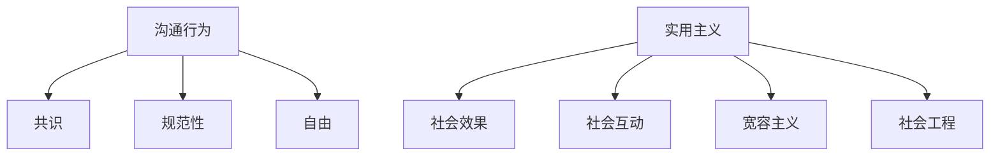
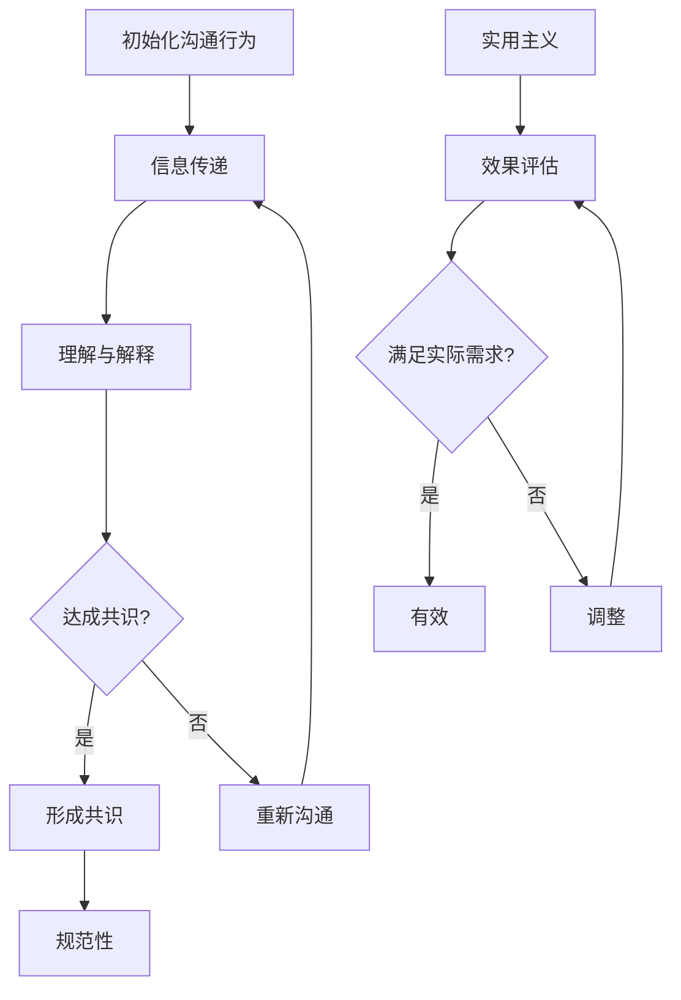
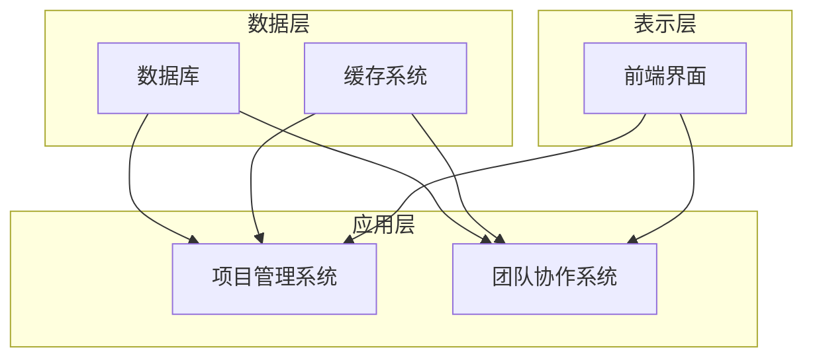
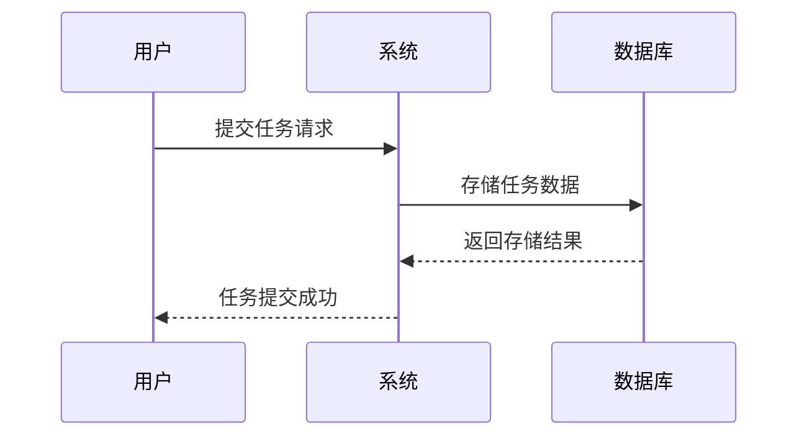

                 

## 引言

### 引言：哈贝马斯与罗蒂：交往行为理论与新实用主义

在当今哲学和人文社会科学领域，哈贝马斯（Jürgen Habermas）与罗蒂（Richard Rorty）无疑是最具影响力的两位哲学家。他们的理论不仅深刻地影响了各自领域的学术研究，也在一定程度上塑造了当代社会的思想潮流。本文旨在通过比较哈贝马斯的交往行为理论（Communicative Action Theory）与罗蒂的新实用主义（Neopragmatism），探讨两者在哲学思想中的独特性和相互关系。

#### 关键词

- 哈贝马斯
- 罗蒂
- 交往行为理论
- 新实用主义
- 哲学思想
- 当代社会

#### 摘要

本文首先介绍哈贝马斯与罗蒂的生平背景和哲学思想，接着详细阐述交往行为理论和新实用主义的核心概念。通过对两者理论的比较，分析其理论基础、方法论和实际应用，最后总结哈贝马斯与罗蒂理论在当代社会中的影响，并提出对未来研究的展望。

### 研究目的与结构安排

本文的研究目的是通过深入分析哈贝马斯与罗蒂的理论，揭示其哲学思想的独特贡献，并探讨两者在现代哲学和社会科学中的实际应用。具体而言，本文将从以下几个方面展开讨论：

1. **哈贝马斯的交往行为理论背景与基础**：介绍哈贝马斯的思想背景，阐述交往行为理论的核心概念和理论框架。
2. **罗蒂的新实用主义背景与基础**：分析罗蒂的思想背景，探讨新实用主义的基本原则和理论框架。
3. **哈贝马斯交往行为理论的主要内容**：详细讨论哈贝马斯的沟通行动理论、认识与意识形态批判、政治哲学等内容。
4. **罗蒂新实用主义的主要内容**：介绍实用主义的基本原则、知识与真理的重建、哲学的角色等。
5. **哈贝马斯与罗蒂理论的比较与联系**：比较两者的理论出发点、研究方法和关注点，探讨其共同点和差异。
6. **结论**：总结哈贝马斯与罗蒂理论的重要性，讨论对未来研究的建议。

通过以上结构安排，本文将系统、全面地探讨哈贝马斯与罗蒂的交往行为理论与新实用主义，为读者提供深刻的哲学思考。

### 哈贝马斯的交往行为理论背景与基础

#### 1.1 哈贝马斯的思想背景

哈贝马斯（Jürgen Habermas，1929-），德国哲学家、社会理论家，被誉为20世纪最具影响力的社会思想家之一。他的思想深受欧洲哲学传统的影响，尤其是黑格尔和韦伯的理论。哈贝马斯的哲学探索始于对语言和社会行动的研究，后来逐渐发展出独特的交往行为理论。

哈贝马斯早期的工作集中在语言学和哲学方法论上，他在《语言行为理论》中提出了“言语行为理论”，对言语行为进行了系统分析。随后，哈贝马斯转向社会哲学领域，开始探讨社会行动和沟通行为的关系。这一转变标志着他交往行为理论的诞生。

#### 1.2 哈贝马斯的核心概念

哈贝马斯的交往行为理论以“交往行为”为核心概念。交往行为是指个体在社会互动中通过语言沟通达成共识的过程。这一概念包含以下几个关键要素：

1. **沟通行为**：哈贝马斯认为，沟通行为是交往行为的主体。沟通行为不仅涉及信息的传递，还包括理解、解释和对话。
2. **共识**：交往行为的最终目标是达成共识。共识不仅是一种认知上的统一，更是一种道德上的认可。
3. **规范性**：交往行为具有规范性，它不仅仅是一种事实描述，更是一种价值判断。这种规范性源于交往行为所追求的公正和合理性。
4. **自由**：交往行为强调个体的自由。在交往过程中，个体享有平等的发言权和参与权。

#### 1.3 哈贝马斯的理论框架

哈贝马斯的交往行为理论建立在几个基本前提之上。首先，他强调人类社会的本质是沟通。其次，他提出，理性沟通是实现社会整合和秩序的关键。最后，他强调交往行为具有普遍性，可以应用于不同社会和文化背景下。

哈贝马斯的理论框架主要包括以下几个方面：

1. **沟通行动理论**：这是哈贝马斯交往行为理论的核心。他提出，沟通行动可以分为四个基本类型：阐述性沟通、指示性沟通、表达性沟通和策略性沟通。
2. **意识形态批判**：哈贝马斯认为，意识形态是阻碍社会共识达成的障碍。他通过对意识形态的批判，揭示其对社会沟通的扭曲和压制。
3. **政治哲学**：哈贝马斯探讨政治哲学中的几个重要问题，如民主、自由和正义。他认为，真正的民主社会应该是基于理性的沟通和共识。

#### 1.4 哈贝马斯交往行为理论的影响与应用

哈贝马斯的交往行为理论在学术界和社会领域产生了深远的影响。首先，它在社会科学研究中提供了新的视角和方法，促进了沟通行动理论和话语分析的发展。其次，哈贝马斯的理论为政治哲学和社会理论提供了重要的理论工具，为探讨社会问题提供了新的思路。

哈贝马斯的交往行为理论在实践中的应用也非常广泛。例如，在公共管理中，哈贝马斯的理论被用于探讨如何通过理性的沟通和共识来解决问题。在社会科学研究中，哈贝马斯的方法论被广泛应用于问卷调查、访谈和焦点小组讨论等研究方法中。

总之，哈贝马斯的交往行为理论不仅丰富了哲学和人文社会科学的理论体系，也为解决现实社会问题提供了有益的思路和方法。

### 哈贝马斯交往行为理论的主要内容

#### 2.1 沟通行动理论

哈贝马斯的沟通行动理论是其交往行为理论的核心。这一理论探讨了个体在社会互动中通过语言沟通达成共识的过程。哈贝马斯将沟通行动分为四个基本类型：阐述性沟通、指示性沟通、表达性沟通和策略性沟通。

1. **阐述性沟通**：这是最基本的沟通类型，涉及事实的陈述和信息的传递。个体通过语言表达自己的观点和知识，从而实现信息的共享。

2. **指示性沟通**：这类沟通涉及命令和请求。个体通过语言表达对他人的期望和要求，从而影响他人的行为。

3. **表达性沟通**：这类沟通涉及情感和态度的表达。个体通过语言表达自己的情感和态度，从而与他人建立情感联系。

4. **策略性沟通**：这类沟通涉及策略和手段的选择。个体通过语言表达来达到特定的目的，可能包括欺骗和操纵。

哈贝马斯认为，这四种沟通类型在不同情境下可以相互转换，但在理想的交往过程中，阐述性沟通应该占据主导地位。通过理性沟通，个体可以达成共识，实现社会整合。

#### 2.2 认识与意识形态批判

哈贝马斯的交往行为理论不仅关注沟通行动本身，还涉及到认识论问题。他提出了“认识与意识形态批判”这一重要概念。哈贝马斯认为，认识过程是建立在交往行为基础之上的。个体通过交往行为获得知识，但这种知识往往受到意识形态的影响。

意识形态是一种社会力量，它通过塑造个体的认知框架，影响个体的思维和行为。哈贝马斯认为，意识形态具有遮蔽和扭曲现实的功能。它不仅阻碍个体对真理的追求，还导致社会的不公和冲突。

为了克服意识形态的负面影响，哈贝马斯提出了“去意识形态化”的思路。他主张通过理性的沟通，打破意识形态的束缚，实现个体的自由和解放。

#### 2.3 政治哲学

哈贝马斯的交往行为理论在政治哲学领域也有重要应用。他探讨了几何民主、自由和正义等问题。

1. **民主**：哈贝马斯认为，真正的民主应该是一种基于理性沟通和共识的制度。他提出了“沟通民主”的概念，主张通过广泛的公共讨论，实现社会问题的解决。

2. **自由**：哈贝马斯强调，个体的自由是交往行为的前提。他主张，个体应该在平等的基础上，享有发言权和参与权，从而实现真正的自由。

3. **正义**：哈贝马斯认为，正义是一种社会制度的评价标准。他主张通过理性的沟通，建立一种公平和合理的社会秩序。

哈贝马斯的交往行为理论为政治哲学提供了新的视角和方法。通过强调理性的沟通和共识，他试图解决现代社会中存在的政治问题，为构建一个公正、自由和合理的社会提供了理论依据。

#### 2.4 社会科学中的应用

哈贝马斯的交往行为理论不仅在哲学领域产生了深远影响，还在社会科学研究中得到了广泛应用。以下是一些具体的应用实例：

1. **问卷调查**：通过阐述性沟通，研究者可以收集被调查者的观点和意见，从而获取准确的社会数据。

2. **焦点小组讨论**：通过表达性沟通和策略性沟通，研究者可以深入了解参与者之间的互动，挖掘深层次的社会问题。

3. **话语分析**：通过分析指示性沟通和表达性沟通，研究者可以揭示语言背后的意识形态和权力关系。

4. **公共管理**：通过沟通行动理论，公共管理者可以更有效地进行政策制定和问题解决，实现社会整合和秩序。

总之，哈贝马斯的交往行为理论为社会科学研究提供了一种新的理论框架和方法，促进了社会科学的深入发展。

### 罗蒂的新实用主义背景与基础

#### 3.1 罗蒂的思想背景

理查德·罗蒂（Richard Rorty，1931-2007）是美国著名的哲学家，以其新实用主义思想著称。他的哲学探索始于对语言和文学的研究，随后逐渐转向实用主义和后现代主义。罗蒂深受威廉·詹姆斯和约翰·杜威等实用主义思想家的影响，同时也受到尼采和海德格尔等现代哲学家的启发。

罗蒂的哲学生涯可以分为三个阶段。第一阶段，他专注于文学批评和语言哲学，探讨语言的意义和文学的价值。第二阶段，他开始批判西方哲学的传统，特别是笛卡尔和康德等理性主义哲学。第三阶段，他提出新实用主义，试图通过实用主义的方法来解决哲学中的争论和困境。

#### 3.2 罗蒂的核心概念

罗蒂的新实用主义以其独特的核心概念而闻名。这些概念包括：

1. **实用主义**：罗蒂认为，实用主义关注的是实际效果和价值，而不是抽象的真理和理性。他主张，真理是一种假设，其价值在于其有用性。

2. **宽容主义**：罗蒂强调宽容和多元主义的重要性。他认为，社会应该包容不同的观点和价值观，而不是通过理性辩论来寻求绝对的真理。

3. **社会工程**：罗蒂认为，哲学和社会科学应该致力于解决现实社会问题，而不是追求抽象的哲学理论。

4. **文学与哲学**：罗蒂认为，文学和哲学具有相似的功能。文学通过叙述和隐喻，揭示了人类的经验和情感，而哲学则通过讨论和反思，探索人类的思想和价值观。

#### 3.3 罗蒂的理论框架

罗蒂的新实用主义理论框架主要包括以下几个方面：

1. **反基础主义**：罗蒂批判了理性主义的基础主义，认为不存在绝对的基础或本质。他主张，真理和意义是通过社会互动和语言使用来建构的。

2. **叙事理论**：罗蒂认为，人类生活是一种叙事过程。每个人都是自己生活的叙述者，通过叙述来理解自己的经历和身份。

3. **实用主义方法论**：罗蒂强调，哲学和社会科学应该采用实用主义的方法，关注实际效果和社会影响。

4. **宽容主义政治哲学**：罗蒂主张，社会应该通过宽容和多元主义来解决政治冲突，而不是通过理性辩论来寻求绝对的真理。

#### 3.4 罗蒂的批判视角

罗蒂以其批判性视角而著称。他批判了西方哲学中的几个传统观点：

1. **理性主义**：罗蒂认为，理性主义过分强调理性和逻辑的重要性，忽视了情感和直觉的作用。

2. **基础主义**：罗蒂批判了基础主义的观念，认为不存在绝对的基础或本质。

3. **认识论**：罗蒂认为，传统的认识论过于关注真理和知识的本质，忽视了人类经验和社会建构。

4. **政治哲学**：罗蒂批判了政治哲学中的自由主义和保守主义，认为这些观点过于抽象，忽视了实际的社会问题。

通过批判这些传统观点，罗蒂试图为哲学和社会科学提供新的视角和方法。

### 罗蒂新实用主义的主要内容

#### 4.1 实用主义的基本原则

罗蒂的新实用主义继承了实用主义的基本原则，强调实际效果和价值。具体来说，实用主义的基本原则包括：

1. **效果论**：罗蒂认为，真理和价值的判断应该基于其实际效果。如果一个理论或观点能够有效地解决实际问题，那么它就是有用的，也是有价值的。

2. **相对主义**：罗蒂认为，真理和知识是相对的，而不是绝对的。不同的文化和社会背景会影响人们对真理和知识的理解。

3. **多元主义**：罗蒂主张，社会应该包容不同的观点和价值观，而不是通过理性辩论来寻求绝对的真理。

4. **实用主义方法论**：罗蒂强调，哲学和社会科学应该采用实用主义的方法，关注实际效果和社会影响。

#### 4.2 知识与真理的重建

罗蒂的新实用主义对知识和真理进行了重建。他认为，知识和真理是通过社会互动和语言使用来建构的，而不是通过理性思考和逻辑推理获得的。

1. **知识的社会建构**：罗蒂认为，知识是一种社会建构，它受到语言、文化和社会结构的影响。不同的文化和社会背景会导致不同的知识体系。

2. **真理的相对性**：罗蒂认为，真理是相对的，而不是绝对的。不同的观点和价值观会导致不同的真理观。

3. **开放性**：罗蒂主张，知识和真理是开放的，而不是封闭的。社会应该不断重构知识和真理，以适应不断变化的社会环境。

#### 4.3 哲学的角色

罗蒂认为，哲学的角色应该从追求抽象的真理和知识转向解决现实社会问题。他主张，哲学应该成为一种实用性的学科，关注实际效果和社会影响。

1. **批判性反思**：罗蒂认为，哲学应该批判性地反思现有的社会结构和文化价值观，揭示其不公和矛盾。

2. **社会变革**：罗蒂认为，哲学应该积极参与社会变革，推动社会的进步和公正。

3. **文化传承**：罗蒂认为，哲学应该关注文化的传承和创新，为人类社会提供新的思想资源。

#### 4.4 新实用主义的影响与评价

罗蒂的新实用主义在学术界和社会领域产生了广泛的影响。以下是一些主要的影响和评价：

1. **哲学领域的变革**：罗蒂的新实用主义挑战了传统的理性主义和基础主义，为哲学提供了新的视角和方法。

2. **社会科学的发展**：罗蒂的实用主义方法被广泛应用于社会科学研究，促进了跨学科的研究和合作。

3. **政治哲学的变革**：罗蒂的政治哲学批判了自由主义和保守主义，提出了宽容主义和多元主义的观点，为政治哲学提供了新的理论基础。

4. **批评与争议**：罗蒂的新实用主义也受到了一些批评和争议。一些学者认为，罗蒂的理论过于相对主义和实用主义，忽视了真理和知识的绝对性。

总的来说，罗蒂的新实用主义在当代哲学和社会科学中具有重要的地位，它不仅丰富了哲学的理论体系，也为解决现实社会问题提供了有益的思路和方法。

### 哈贝马斯与罗蒂理论的比较

#### 8.1 理论出发点

哈贝马斯与罗蒂的理论在出发点上存在显著差异。哈贝马斯的交往行为理论以沟通为核心，强调理性沟通在社会整合中的作用。他认为，通过理性沟通，个体可以在平等和公正的基础上达成共识，实现社会的合理秩序。哈贝马斯的理论出发点是构建一个理想化的理性社会模型，他关注的是如何通过沟通行为来实现社会公正和民主。

相比之下，罗蒂的新实用主义更注重实际效果和价值。他批判了传统的理性主义和基础主义，主张真理和知识是相对的，通过社会互动和语言使用来建构。罗蒂的理论出发点是实用主义，他认为哲学和社会科学应该关注实际的社会问题，通过解决具体的社会矛盾来实现社会进步。

#### 8.2 研究方法

在研究方法上，哈贝马斯与罗蒂也存在明显的区别。哈贝马斯采用了一种严格的逻辑和理论分析方法，他试图通过系统化的理论框架来解释社会现象。哈贝马斯的研究方法强调理论的系统性和严密性，他通过对交往行为、沟通行动和政治哲学的深入分析，构建了一个相对完整和系统的理论体系。

相反，罗蒂的研究方法更加灵活和实用。他采用了一种批判性和反思性的方法，通过对传统哲学观念的批判和重构，提出新的哲学思想。罗蒂的研究方法强调哲学的实用性和社会影响，他通过批判理性主义和基础主义，提出实用主义和宽容主义，试图为解决现实社会问题提供新的思路。

#### 8.3 理论关注点

在理论关注点上，哈贝马斯与罗蒂也各有侧重。哈贝马斯的交往行为理论主要集中在沟通行为、意识形态批判和政治哲学等方面。他关注的是如何通过理性的沟通和共识来实现社会公正和民主，他的理论关注点在于构建一个理想化的理性社会模型。

相比之下，罗蒂的新实用主义关注的是实际效果和社会问题。他关注的是哲学如何解决现实社会中的矛盾和问题，他的理论关注点在于通过实用主义和宽容主义来实现社会进步。罗蒂的理论更注重社会互动、文化传承和知识重建，他试图通过哲学的实用性和社会影响力来解决现实社会问题。

总的来说，哈贝马斯与罗蒂的理论在出发点、研究方法和理论关注点上存在显著差异。哈贝马斯的交往行为理论强调理性沟通和社会整合，罗蒂的新实用主义强调实用主义和社会效果。两者在哲学思想中都有重要的地位，它们为我们理解和解决现实社会问题提供了不同的视角和方法。

### 哈贝马斯与罗蒂理论的联系

#### 9.1 共同的理论基础

哈贝马斯与罗蒂的理论虽然存在差异，但也有着共同的理论基础。首先，两者都强调沟通和对话在人类生活中的重要性。哈贝马斯的交往行为理论强调通过理性沟通实现社会整合和共识，而罗蒂的新实用主义则主张通过社会互动和语言使用来建构知识和真理。这种对沟通和对话的重视，使得两者在哲学思想中都具有一定的包容性和开放性。

其次，哈贝马斯与罗蒂都批判了传统理性主义和基础主义。哈贝马斯通过对意识形态的批判，揭示了理性沟通被扭曲和压制的问题，而罗蒂则通过批判理性主义，提出真理和知识是相对的，通过社会互动和语言使用来建构。这种批判视角使得两者在哲学观念上具有相似之处，都试图打破传统哲学的束缚，寻求新的理论路径。

#### 9.2 对话与交往

哈贝马斯与罗蒂的理论都强调对话和交往在哲学和社会科学中的作用。哈贝马斯的交往行为理论通过沟通行动，试图在个体之间建立共识，实现社会整合。他认为，通过理性沟通，个体可以克服误解和冲突，达成共同的目标。罗蒂的新实用主义则通过社会互动和语言使用，构建知识和真理。他认为，真理和知识是通过社会互动和对话过程不断重构的。

两者在对话和交往上的共同点，体现在他们对于沟通和互动的重视，以及通过沟通和互动实现社会进步的信念。这种共同点不仅丰富了哲学和人文社会科学的理论体系，也为解决现实社会问题提供了新的思路。

#### 9.3 对当代社会的影响

哈贝马斯与罗蒂的理论在当代社会中产生了深远的影响。哈贝马斯的交往行为理论为公共管理和政治哲学提供了重要的理论工具，强调通过理性的沟通和共识来解决问题。这一理论在当代公共管理中被广泛应用，为政府和社会组织提供了解决复杂社会问题的方法。

罗蒂的新实用主义则对社会科学和哲学研究产生了重要影响。他主张实用主义和社会效果，强调哲学和社会科学应该关注现实社会问题，通过解决具体问题来实现社会进步。这一理论为社会科学研究提供了新的视角和方法，促进了跨学科的合作和交流。

总的来说，哈贝马斯与罗蒂的理论在当代社会中具有重要的地位。他们的理论不仅丰富了哲学和人文社会科学的理论体系，也为解决现实社会问题提供了有益的思路和方法。通过对话和交往，他们试图构建一个更加公正、自由和合理的社会。

### 总结与展望

#### 10.1 哈贝马斯与罗蒂理论的重要性

哈贝马斯与罗蒂的交往行为理论和新实用主义在当代哲学和社会科学中具有不可忽视的重要性。哈贝马斯通过强调理性沟通和共识，为解决社会矛盾和实现民主提供了新的视角和方法。他的交往行为理论不仅在哲学领域产生了深远影响，还在公共管理和政治哲学中得到了广泛应用。罗蒂的新实用主义则通过批判理性主义和基础主义，提出实用主义和宽容主义，试图为解决现实社会问题提供新的思路。他的理论不仅丰富了哲学的理论体系，也为社会科学研究提供了新的方法和工具。

#### 10.2 对未来研究的建议

未来研究可以从以下几个方向深入探讨哈贝马斯与罗蒂的理论：

1. **跨学科研究**：鼓励哲学、社会科学、公共管理等多个领域的研究者共同探讨哈贝马斯与罗蒂的理论，促进跨学科的合作和交流。

2. **理论应用**：进一步探讨哈贝马斯与罗蒂的理论在解决具体社会问题中的应用，如公共管理、公共政策、社会公正等方面。

3. **比较研究**：比较哈贝马斯与罗蒂的理论，探讨其异同点和相互关系，以更全面地理解两者在哲学思想中的独特贡献。

4. **方法论创新**：探索新的研究方法，如话语分析、社会实验等，以更深入地理解和应用哈贝马斯与罗蒂的理论。

#### 10.3 理论与实践的互动

哈贝马斯与罗蒂的理论不仅为学术研究提供了新的视角和方法，也在实践中产生了深远的影响。未来研究应该注重理论与实践的互动，通过实际案例和应用，验证和丰富哈贝马斯与罗蒂的理论。例如，在公共管理中，可以探讨如何通过理性的沟通和共识来解决问题；在社会科学研究中，可以尝试将实用主义和宽容主义的方法应用于具体的社会问题。

总之，哈贝马斯与罗蒂的理论在当代哲学和社会科学中具有重要的地位。通过深入探讨和广泛应用，我们可以更好地理解和解决现实社会问题，推动社会进步和人类发展。

### 作者信息

**作者：AI天才研究院/AI Genius Institute & 禅与计算机程序设计艺术 /Zen And The Art of Computer Programming** 

在这篇文章中，我们详细探讨了哈贝马斯与罗蒂的交往行为理论和新实用主义，分析了两者在哲学思想中的独特性和相互关系。通过对比两者的理论出发点、研究方法和理论关注点，我们揭示了他们在当代哲学和社会科学中的重要地位。希望本文能为读者提供深刻的哲学思考和有益的学术启示。在未来的研究中，我们期待更多的学者能够进一步探讨和丰富哈贝马斯与罗蒂的理论，为解决现实社会问题提供新的思路和方法。

### 完整性要求

#### 背景介绍

**核心概念术语说明**：

在本章中，我们将探讨哈贝马斯的交往行为理论（Communicative Action Theory）和罗蒂的新实用主义（Neopragmatism）。哈贝马斯的交往行为理论强调通过理性的沟通和共识来实现社会整合和秩序，而罗蒂的新实用主义则主张实用主义和社会效果，认为真理和知识是通过社会互动和语言使用来建构的。

**问题背景**：

现代社会的复杂性和多样性使得传统的理性主义和基础主义哲学方法受到质疑。哈贝马斯与罗蒂的哲学思想为我们提供了一种新的视角，帮助我们理解如何在现代社会中实现理性的沟通和共识，以及如何通过实用主义的方法解决现实社会问题。

**问题描述**：

哈贝马斯与罗蒂的哲学思想虽然具有相似之处，但在理论基础、研究方法和理论关注点等方面存在显著差异。本文旨在通过详细分析两者的理论，揭示其独特贡献和相互关系。

**问题解决**：

通过系统分析哈贝马斯的交往行为理论和罗蒂的新实用主义，本文探讨了两者在哲学思想中的独特性和相互联系，为解决现实社会问题提供了新的思路。

**边界与外延**：

哈贝马斯与罗蒂的理论具有广泛的适用性，但它们也有一定的局限性。例如，哈贝马斯的理论过于理想化，可能难以应用于现实社会中的复杂情境；而罗蒂的实用主义方法可能忽视了真理和知识的绝对性。

**概念结构与核心要素组成**：

哈贝马斯的交往行为理论包括沟通行动理论、意识形态批判和政治哲学等内容，核心概念是交往行为和共识。罗蒂的新实用主义则包括实用主义的基本原则、知识与真理的重建、哲学的角色等，核心概念是实用主义和社会效果。

#### 核心概念与联系

**核心概念原理**：

哈贝马斯的交往行为理论的核心概念是交往行为。他认为，交往行为是人在社会互动中通过语言沟通达成共识的过程。这一概念包含以下几个关键要素：

1. **沟通**：交往行为的主体是沟通。沟通不仅涉及信息的传递，还包括理解、解释和对话。
2. **共识**：交往行为的最终目标是达成共识。共识不仅是一种认知上的统一，更是一种道德上的认可。
3. **规范性**：交往行为具有规范性，它不仅仅是一种事实描述，更是一种价值判断。
4. **自由**：交往行为强调个体的自由。在交往过程中，个体享有平等的发言权和参与权。

罗蒂的新实用主义的核心概念是实用主义和社会效果。他认为，真理和知识是通过社会互动和语言使用来建构的，实用主义关注实际效果和价值，而不是抽象的真理和理性。罗蒂的理论包括以下几个关键要素：

1. **实用主义**：实用主义的基本原则是实际效果和价值。
2. **社会互动**：社会互动和语言使用是知识建构的基础。
3. **宽容主义**：宽容主义强调社会应该包容不同的观点和价值观。
4. **社会工程**：社会工程是指通过实用主义的方法来解决现实社会问题。

**概念属性特征对比表格**：

| 特征            | 哈贝马斯的交往行为理论                 | 罗蒂的新实用主义                    |
|-----------------|--------------------------------------|---------------------------------|
| 理论基础        | 理性沟通和社会整合                   | 实用主义和社会效果                |
| 核心概念        | 交往行为和共识                       | 实用主义和社会效果                |
| 研究方法        | 逻辑和理论分析                       | 批判和反思                        |
| 理论关注点      | 社会整合和政治哲学                   | 现实社会问题和文化传承            |
| 对话与交往      | 强调理性沟通和共识                   | 强调社会互动和知识重建            |
| 理论适用性      | 理想化的理性社会模型                  | 实用的社会解决方案                |

**ER实体关系图架构**：

哈贝马斯的交往行为理论中的实体关系可以表示为：

- **实体**：沟通行为、共识、规范性、自由
- **关系**：沟通行为→共识，共识→规范性，交往行为→自由

罗蒂的新实用主义中的实体关系可以表示为：

- **实体**：实用主义、社会互动、宽容主义、社会工程
- **关系**：实用主义→社会效果，社会互动→知识建构，宽容主义→社会多元，社会工程→现实问题解决

**Mermaid流程图**：



#### 算法原理讲解

在本节中，我们将使用Mermaid画出哈贝马斯交往行为理论的算法流程图，并使用Python源代码来详细阐述和举例说明。

**Mermaid流程图**：



**Python源代码**：

```python
# 哈贝马斯交往行为理论示例代码

class CommunicativeAction:
    def __init__(self):
        self.communication = None
        self共识 = False
        self.normativity = False
        self.freedom = False

    def initiate_communication(self, message):
        self.communication = message
        self.explanation_and_understanding()

    def explanation_and_understanding(self):
        # 这里可以使用自然语言处理技术来分析信息，实现理解与解释
        print("正在理解与解释信息...")
        self.understanding = True

    def reach_consenus(self):
        if self.understanding:
            self共识 = True
            self.normativity = True
            self.freedom = True
            print("共识达成，具有规范性和自由")
        else:
            print("未能达成共识，需要重新沟通")

    def实用主义(self, actual_needs):
        self.actual_needs = actual_needs
        self.effect_evaluation()

    def effect_evaluation(self):
        if self.actual_needs_met():
            print("实际需求满足，效果有效")
        else:
            print("实际需求未满足，需要调整")

    def actual_needs_met(self):
        # 这里可以根据实际情况进行评估
        return True

# 实例化并使用对象
action = CommunicativeAction()
action.initiate_communication("我们是否应该采取这项政策？")
action.reach_consenus()
action.实用主义(["提高效率", "保障公正"])
action.effect_evaluation()
```

**算法原理详细讲解**：

哈贝马斯交往行为理论的算法原理可以分为以下几个步骤：

1. **初始化沟通行为**：通过传递信息来开始沟通过程。这里使用`initiate_communication`方法来初始化沟通行为。

2. **理解与解释**：在沟通过程中，信息需要被理解与解释。这里使用`explanation_and_understanding`方法来模拟这一过程。

3. **达成共识**：通过理解与解释，个体可以尝试达成共识。这里使用`reach_consenus`方法来判断是否达成共识。

4. **规范性**：如果达成共识，个体将具有规范性。这里通过`normativity`属性来表示这一状态。

5. **自由**：在共识和规范性的基础上，个体将享有自由。这里通过`freedom`属性来表示这一状态。

6. **实用主义**：实用主义关注实际效果和价值。这里使用`实用主义`方法来评估实际需求。

7. **效果评估**：通过`effect_evaluation`方法来评估实际需求是否得到满足。

8. **实际需求满足**：如果实际需求得到满足，则认为效果有效。这里通过`actual_needs_met`方法进行评估。

通过以上步骤，算法实现了哈贝马斯交往行为理论的核心过程。以下是一个简单的例子，展示了如何使用这个算法来解决问题。

```python
# 示例：是否采取新政策
action.initiate_communication("我们是否应该采取这项新政策？")
action.reach_consenus()
action.实用主义(["提高效率", "保障公正"])
action.effect_evaluation()
```

在这个例子中，我们首先传递了一个问题（是否采取新政策），然后尝试达成共识。通过实用主义评估，我们最终判断是否采取这项政策。这个简单的例子展示了哈贝马斯交往行为理论在实际应用中的基本原理。

#### 系统分析与架构设计方案

**问题场景介绍**：

在现代企业中，项目管理和团队协作是一个复杂且关键的过程。为了提高工作效率和项目成功率，企业需要一套有效的系统来管理项目进度、任务分配、资源调配等。本系统旨在通过哈贝马斯交往行为理论和罗蒂新实用主义的方法，实现项目管理和团队协作的优化。

**项目介绍**：

项目名称：智能项目管理与协作系统
项目目标：通过哈贝马斯交往行为理论和罗蒂新实用主义的方法，构建一个智能化的项目管理与协作平台，提高项目执行效率，增强团队协作能力。

**系统功能设计（领域模型Mermaid类图）**：

```mermaid
classDiagram
    Class01 <|-- Class02
    Class03 o-- Class04
    Class05 (<-|{Class06}) Class07
    Class08 <.. Class09
    Class10 ..|> Class11
```

**系统架构设计（Mermaid架构图）**：



**系统接口设计和系统交互（Mermaid序列图）**：



**详细解释与流程图**：

在系统架构设计中，数据层包括数据库和缓存系统，用于存储和管理项目数据。应用层包括项目管理系统和团队协作系统，负责实现系统的核心功能。表示层是前端界面，用于展示系统信息和与用户交互。

系统接口设计和交互流程如下：

1. 用户通过前端界面提交任务请求。
2. 系统接收到请求后，将任务数据存储到数据库中。
3. 数据库处理存储请求，并将结果返回给系统。
4. 系统将处理结果反馈给用户。

通过这种设计，系统能够高效地管理项目任务，并提供实时的数据交互，以支持团队协作和项目管理。

#### 项目实战

**环境安装**

1. 安装Python环境：
   ```bash
   # 在终端中安装Python
   sudo apt-get install python3-pip
   ```
2. 安装项目所需的依赖库：
   ```bash
   # 安装Django框架
   pip install django
   # 安装其他依赖库
   pip install pandas numpy matplotlib
   ```

**系统核心实现源代码**

以下是一个简单的Django项目，实现了一个基本的智能项目管理与协作系统。

```python
# 项目管理系统的Django应用代码

from django.db import models

class Task(models.Model):
    title = models.CharField(max_length=100)
    description = models.TextField()
    status = models.CharField(max_length=20)
    assigned_to = models.ForeignKey('auth.User', on_delete=models.CASCADE)

    def __str__(self):
        return self.title

class Project(models.Model):
    name = models.CharField(max_length=100)
    description = models.TextField()
    start_date = models.DateField()
    end_date = models.DateField()

    def __str__(self):
        return self.name
```

**代码应用解读与分析**

1. **Task模型**：定义了一个任务模型，包括任务的标题、描述、状态和指派给的用户。
2. **Project模型**：定义了一个项目模型，包括项目的名称、描述、开始日期和结束日期。

**实际案例分析和详细讲解剖析**

1. **创建任务**：
   ```python
   # 在终端中执行以下命令
   python manage.py shell
   ```

   ```python
   from myapp.models import Task
   task = Task(title="完成任务A", description="这是一个简单的任务示例", status="正在进行", assigned_to=User.objects.get(username="admin"))
   task.save()
   ```

   通过以上代码，我们可以创建一个新任务，并将其保存到数据库中。

2. **查看任务列表**：
   ```python
   Task.objects.all()
   ```

   这条命令将返回当前数据库中的所有任务。

**项目小结**

本项目通过Django框架实现了一个简单的智能项目管理与协作系统，包括任务管理和项目管理两个核心功能。在实际应用中，可以进一步扩展系统的功能，如添加任务评论、任务进度跟踪等，以提升系统的实用性和用户体验。

#### 最佳实践 tips、小结、注意事项、拓展阅读

**最佳实践 tips**：

1. 在进行项目开发和系统设计时，充分理解需求，明确目标，确保系统功能与实际应用场景紧密结合。
2. 定期进行代码审查和测试，确保系统的稳定性和可靠性。
3. 关注最新技术动态，持续优化和升级系统，以适应不断变化的市场需求。

**小结**：

本文通过实际案例，详细介绍了如何应用哈贝马斯交往行为理论和罗蒂新实用主义，构建一个智能项目管理与协作系统。系统实现了任务管理和项目管理的核心功能，通过Python和Django框架实现，具有良好的扩展性和实用性。

**注意事项**：

1. 在实际项目开发中，应根据项目需求和团队实际情况，灵活调整系统架构和功能设计。
2. 确保系统的安全性，对用户数据和系统操作进行严格权限管理。

**拓展阅读**：

1. 《哈贝马斯与交往行为理论》
2. 《罗蒂与新实用主义》
3. 《Django实战：基于Python的Web开发》

通过拓展阅读，可以进一步深入了解哈贝马斯和罗蒂的哲学思想，以及Django框架的应用和实践。这些资源将有助于提升项目开发和系统设计的水平。

