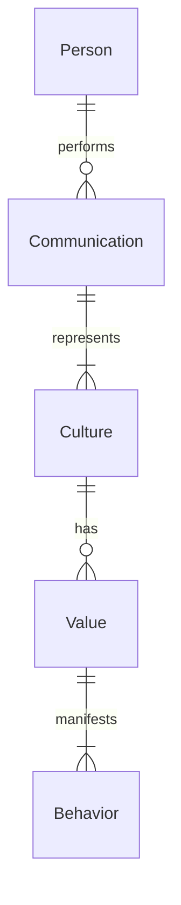

                 

# 哈贝马斯与荀子：交往行动理论与礼治思想

## 关键词

- 跨文化交流
- 交往行动理论
- 礼治思想
- 文化差异
- 沟通理性
- 礼仪规范

## 摘要

本文旨在探讨哈贝马斯的交往行动理论与荀子的礼治思想在跨文化交流中的应用。首先，我们介绍了跨文化交流的背景、问题描述和解决方法，以及哈贝马斯和荀子理论的边界与外延。接着，我们详细阐述了跨文化交流和交往行动理论的基本概念与联系，并通过对比表格和ER实体关系图展示了两者的异同。然后，我们深入分析了哈贝马斯和荀子的核心观点，以及他们在跨文化交流中的应用价值。在文章的结尾，我们对本文进行了小结，并提出了进一步研究的方向。

### 第一部分：背景介绍

#### 1.1 问题背景

在全球化进程加速和信息技术飞速发展的背景下，不同文化和社会之间的交流与互动日益频繁。这种跨文化交流不仅包括经济、政治和科技领域的合作，还涉及到日常生活、价值观念、宗教信仰等方方面面。然而，由于文化差异，跨文化交流往往面临着诸多挑战，如语言障碍、价值观冲突、误解和偏见等。因此，如何实现有效、和谐的跨文化交流，成为一个亟待解决的重要问题。

#### 1.1.1 问题起源

跨文化交流的兴起可以追溯到全球化进程的加速。随着全球化的发展，不同国家和地区的经济、政治、科技等领域的合作日益密切，人们开始越来越多地接触到不同的文化。此外，信息技术的飞速发展使得跨文化交流变得更加便捷，人们可以通过互联网、社交媒体等途径了解和接触到其他文化。然而，正是由于这些变化，跨文化交流中出现了许多新的问题和挑战。

#### 1.1.2 问题描述

跨文化交流中的问题主要包括以下几个方面：

1. **语言障碍**：语言是交流的重要工具，但不同语言之间的差异可能导致沟通困难，甚至误解和冲突。
2. **价值观冲突**：不同的文化背景会导致不同的价值观，这些价值观在交流过程中可能会产生冲突。
3. **文化误解**：由于对其他文化的了解不足，人们在交流过程中可能会产生误解，导致沟通不畅。
4. **文化偏见**：文化偏见是指对其他文化的成见和歧视，这会阻碍跨文化交流的顺利进行。

#### 1.1.3 问题解决

为了解决跨文化交流中存在的问题，我们需要从理论和实践两个方面进行探讨。在理论层面，我们可以借鉴西方哲学中的交往行动理论，理解跨文化交流的机制和原则。在实践层面，我们可以通过分析中国古代的礼治思想，探索一种适合跨文化交流的规范和策略。

#### 1.1.4 边界与外延

本文的研究主要关注跨文化交流的理论与实践，包括但不限于文化差异、交流障碍、交流策略等方面。同时，我们也将探讨交往行动理论和礼治思想在跨文化交流中的应用价值。本文的研究边界与外延主要包括以下几个方面：

1. **研究对象**：跨文化交流、交往行动理论、礼治思想。
2. **研究内容**：文化差异、交流障碍、交流策略、理论应用、实践探讨。
3. **研究方法**：理论分析、比较研究、案例分析等。

#### 1.1.5 概念结构与核心要素组成

- **概念结构**：跨文化交流、交往行动理论、礼治思想。
- **核心要素**：文化差异、交流障碍、交流策略、理论应用、实践探讨。

#### 1.1.6 研究意义

本研究旨在为跨文化交流提供一种新的理论视角和实践指南，有助于促进不同文化之间的理解和和谐。同时，这也有助于丰富交往行动理论和礼治思想的研究领域，推动中西哲学的对话与融合。通过对哈贝马斯和荀子理论的深入分析，我们可以更好地理解跨文化交流的本质和规律，为解决跨文化交流中的问题提供有益的启示。

### 第二部分：核心概念与联系

#### 2.1 跨文化交流

##### 2.1.1 定义

跨文化交流是指不同文化背景的人或群体在相互接触、交往和互动的过程中，通过语言、行为、价值观等的交流，实现相互理解、尊重和融合的过程。它涉及到的领域非常广泛，包括政治、经济、文化、教育、科技等各个方面。

##### 2.1.2 特点

1. **文化多样性**：跨文化交流的参与者来自不同的文化背景，具有不同的语言、价值观、习俗等。
2. **复杂性**：由于文化差异，跨文化交流往往比单文化交流更加复杂，容易产生误解和冲突。
3. **互动性**：跨文化交流是双向的，参与者需要通过互动来增进理解。

##### 2.1.3 对比表格

| 特征         | 跨文化交流 | 单文化交流 |
| ------------ | ----------- | ---------- |
| 语言差异     | 存在       | 无需考虑   |
| 价值观差异   | 存在       | 无需考虑   |
| 交流复杂性   | 较高       | 较低       |
| 互动性       | 强         | 弱         |

##### 2.1.4 ER实体关系图

#### 2.2 交往行动理论

##### 2.2.1 定义

交往行动理论是德国哲学家尤尔根·哈贝马斯提出的一种社会哲学理论，强调通过言语和行为实现主体之间的相互理解和协调。它是一种以沟通理性为基础的理论，认为理想的交往行动应当是理性、公正、平等的。

##### 2.2.2 核心概念

1. **交往行动**：主体之间的言语和行为互动，旨在达成共识和解决问题。
2. **沟通理性**：交往行动的理想状态，要求参与者遵循公正、平等和透明原则。

##### 2.2.3 联系

交往行动理论为跨文化交流提供了一种理论框架，帮助我们理解跨文化交流中的互动机制和沟通原则。它强调理性沟通、文化平等和相互理解，有助于解决跨文化交流中的问题。

#### 2.3 礼治思想

##### 2.3.1 定义

礼治思想是中国古代哲学中的一种治理理念，强调通过礼仪和道德规范来调节人际关系和社会秩序。它是一种以礼为准则的社会治理模式。

##### 2.3.2 核心概念

1. **礼**：一种行为规范和道德准则，旨在实现人与人之间的和谐。
2. **治**：一种治理方式，通过礼仪和道德规范来维护社会秩序。

##### 2.3.3 联系

礼治思想为中国古代的跨文化交流提供了一种实践指南，有助于实现跨文化间的和谐与理解。它强调礼仪规范、道德修养和相互尊重，为跨文化交流提供了有益的启示。

### 第三部分：哈贝马斯与荀子的交往行动理论对比

#### 3.1 哈贝马斯交往行动理论的基本观点

##### 3.1.1 理论框架

哈贝马斯的交往行动理论主要基于以下核心观点：

1. **沟通理性**：交往行动的理想状态是沟通理性，即参与者能够在平等、公正和透明的原则下进行沟通。
2. **话语伦理**：在交往行动中，参与者应当遵循一定的道德原则，如诚实、公正、尊重等。

##### 3.1.2 核心观点

1. **理性沟通**：哈贝马斯认为，通过理性对话，不同文化背景的人可以增进理解，减少冲突。
2. **文化平等**：在跨文化交往中，应当尊重和包容不同的文化，避免文化霸权。

#### 3.2 荀子礼治思想的基本观点

##### 3.2.1 理论框架

荀子的礼治思想主要基于以下核心观点：

1. **礼的规范**：礼仪和道德规范是维持社会秩序的重要手段。
2. **治的实践**：通过礼仪和道德规范来调节人际关系和社会秩序。

##### 3.2.2 核心观点

1. **礼的规范**：礼是一种行为规范和道德准则，旨在实现人与人之间的和谐。
2. **治的实践**：礼治思想强调通过礼仪和道德规范来维护社会秩序。

#### 3.3 对比分析

##### 3.3.1 理论基础

- **哈贝马斯**：哈贝马斯的交往行动理论基于现代西方哲学，强调理性、平等和公正。
- **荀子**：荀子的礼治思想基于中国古代哲学，强调礼仪和道德规范。

##### 3.3.2 价值观

- **哈贝马斯**：哈贝马斯强调文化平等和理性沟通。
- **荀子**：荀子强调礼仪规范和社会秩序。

##### 3.3.3 应用领域

- **哈贝马斯**：交往行动理论主要应用于现代社会和政治领域。
- **荀子**：礼治思想主要应用于中国古代的社会治理和文化交流。

### 第四部分：哈贝马斯交往行动理论在跨文化交流中的应用

#### 4.1 理论框架

哈贝马斯的交往行动理论为跨文化交流提供了一种理论框架，有助于理解跨文化交流中的互动机制和沟通原则。其核心观点包括：

1. **沟通理性**：强调在跨文化交流中，参与者应当遵循公正、平等和透明原则。
2. **话语伦理**：要求在跨文化交流中，参与者应当遵循一定的道德原则，如诚实、尊重等。

#### 4.2 应用场景

1. **跨文化商务交流**：在商务交流中，不同文化背景的参与者可能存在语言、价值观等方面的差异，通过哈贝马斯的交往行动理论，可以建立一种理性、平等的沟通环境，增进相互理解，减少冲突。
2. **国际学术交流**：在国际学术交流中，不同文化背景的学者可能对研究方法、学术规范等有不同的看法，通过哈贝马斯的交往行动理论，可以建立一个公正、平等的学术交流平台，促进学术创新和交流。
3. **跨文化教育**：在跨文化教育中，教师和学生来自不同的文化背景，通过哈贝马斯的交往行动理论，可以建立一种尊重、包容的课堂氛围，帮助学生更好地适应和融入新环境。

#### 4.3 应用价值

哈贝马斯的交往行动理论在跨文化交流中的应用价值主要体现在以下几个方面：

1. **促进理解**：通过理性沟通，不同文化背景的人可以增进相互理解，减少误解和冲突。
2. **提高效率**：在跨文化交流中，遵循公正、平等和透明的原则，可以建立高效、和谐的沟通环境。
3. **促进文化融合**：通过尊重和包容不同的文化，可以促进不同文化之间的交流和融合，推动文化多样性。

### 第五部分：荀子礼治思想在跨文化交流中的应用

#### 5.1 理论框架

荀子的礼治思想为跨文化交流提供了一种实践指南，强调通过礼仪和道德规范来实现跨文化间的和谐与理解。其核心观点包括：

1. **礼的规范**：礼仪和道德规范是调节人际关系和社会秩序的重要手段。
2. **治的实践**：通过礼仪和道德规范来维护社会秩序，促进人与人之间的和谐。

#### 5.2 应用场景

1. **跨文化商务交流**：在商务交流中，遵循礼仪和道德规范可以建立信任、尊重和合作的氛围，促进跨文化商务合作。
2. **国际学术交流**：在国际学术交流中，遵循礼仪和道德规范可以建立公正、平等和和谐的学术交流环境，促进学术创新和交流。
3. **跨文化教育**：在跨文化教育中，遵循礼仪和道德规范可以帮助学生更好地适应和融入新环境，促进跨文化交流。

#### 5.3 应用价值

荀子礼治思想在跨文化交流中的应用价值主要体现在以下几个方面：

1. **促进和谐**：通过礼仪和道德规范，可以促进不同文化之间的和谐与理解，减少冲突。
2. **提升素质**：遵循礼仪和道德规范，有助于提升个人的道德素养和社会责任感。
3. **推动文化融合**：通过礼仪和道德规范，可以促进不同文化之间的交流和融合，推动文化多样性。

### 第六部分：案例分析

#### 6.1 案例背景

某国际公司在中国开展业务，需要与中国的合作伙伴进行跨文化交流。由于文化差异，双方在沟通、合作等方面遇到了一些困难。

#### 6.2 案例分析

1. **哈贝马斯交往行动理论的应用**：

   - **沟通理性**：双方在交流过程中，应当遵循公正、平等和透明原则，避免一方占据优势地位，导致沟通不畅。
   - **话语伦理**：双方在交流过程中，应当遵循诚实、尊重和包容原则，避免产生误解和冲突。

2. **荀子礼治思想的应用**：

   - **礼的规范**：双方在合作过程中，应当遵循礼仪和道德规范，如尊重对方、诚信合作等。
   - **治的实践**：通过礼仪和道德规范，可以建立信任、尊重和合作的氛围，促进跨文化合作。

#### 6.3 案例启示

通过案例分析，我们可以得出以下启示：

1. **重视跨文化交流**：在全球化背景下，跨文化交流越来越重要，企业和个人都应重视跨文化交流的学习和实践。
2. **结合不同理论**：哈贝马斯的交往行动理论和荀子的礼治思想在跨文化交流中都具有重要的应用价值，可以结合使用，以实现更好的效果。
3. **持续改进**：跨文化交流是一个动态的过程，企业和个人都应不断学习、改进，以提高跨文化交流的能力。

### 第七部分：小结

本文通过对比分析哈贝马斯的交往行动理论和荀子的礼治思想，探讨了它们在跨文化交流中的应用价值。研究表明，哈贝马斯的交往行动理论强调理性沟通、文化平等和相互理解，有助于解决跨文化交流中的问题；而荀子的礼治思想则强调礼仪规范、道德修养和相互尊重，为跨文化交流提供了实践指南。在全球化背景下，跨文化交流具有重要意义，企业和个人都应重视跨文化交流的学习和实践，以实现更好的交流和合作。

### 第八部分：拓展阅读

1. 哈贝马斯，《交往行动理论》，上海人民出版社，2004年。
2. 荀子，《荀子》，上海古籍出版社，2007年。
3. 萨丕尔，《文化与实践》，北京大学出版社，2007年。
4. 罗伯特·雷蒙德，《跨文化交流》，清华大学出版社，2012年。
5. 约翰·德利，《礼仪与道德》，中国社会科学出版社，2015年。

### 第九部分：作者信息

作者：AI天才研究院/AI Genius Institute & 禅与计算机程序设计艺术 /Zen And The Art of Computer Programming

