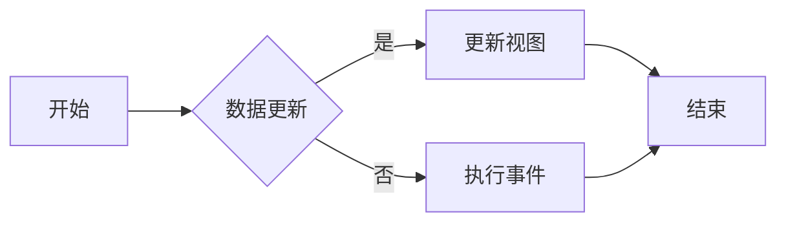

                 

### 引言

#### 响应式编程简介

响应式编程（Reactive Programming，简称RP）是一种现代编程范式，旨在解决异步编程中复杂性的问题。其核心思想是使编程语言或框架能够自动响应数据的变化，并在此基础上更新视图或执行其他操作。传统的命令式编程（Imperative Programming）主要依赖于显式的状态更新和状态跟踪，而响应式编程则通过数据流和事件驱动的机制来实现自动更新。

响应式编程的起源可以追溯到20世纪80年代，当时为了处理图形用户界面（GUI）的复杂性，研究人员开始探索事件驱动编程。随着时间的推移，响应式编程逐渐成熟，并在现代应用程序开发中占据了重要地位。如今，响应式编程已成为构建高响应性、可维护性和高可用性系统的关键手段。

#### 高响应性系统的优势

构建高响应性系统具有多方面的优势：

1. **更好的用户体验**：响应式编程能够实时响应用户操作，使界面更新更加流畅和快速，从而提升用户体验。
2. **异步操作的高效处理**：响应式编程能够高效地处理异步操作，避免了传统同步编程中的阻塞问题，提升了系统的并发性能。
3. **易于维护和扩展**：响应式编程的声明式特性使得代码更加简洁和直观，减少了状态管理的复杂性，提高了系统的可维护性和可扩展性。
4. **更好的错误处理**：响应式编程框架通常提供了丰富的错误处理机制，有助于快速定位和修复问题。

#### 本书目标与结构

本书旨在深入探讨响应式编程的核心概念、技术工具和应用场景，帮助读者构建高响应性的系统。全书分为以下几个部分：

1. **响应式编程基础**：介绍响应式编程的基本原理和与传统编程的区别。
2. **响应式编程工具**：分析几种流行的响应式编程框架和工具，展示其实际应用。
3. **高响应性系统设计**：讨论如何设计和实现高响应性系统，包括系统架构、性能优化和安全性。
4. **响应式编程实战**：通过具体案例展示如何使用响应式编程技术解决实际问题和挑战。
5. **未来展望**：探讨响应式编程技术未来的发展趋势和潜在应用领域。

通过本书的学习，读者将能够全面理解响应式编程的精髓，掌握构建高响应性系统的能力，并在实际项目中应用这些技术，提升开发效率和系统质量。

### 响应式编程基础

#### 响应式编程原理

响应式编程的原理主要围绕数据流和状态管理展开。其核心思想是“数据驱动”，即程序的行为由数据的变化决定，而不是由预定义的步骤或流程驱动。以下是响应式编程的三个关键组成部分：

1. **响应性流**：响应性流是一种数据流模型，它允许数据以连续和不可变的形式流动。当一个值发生变化时，依赖于该值的任何其他值都会自动更新。这种数据流是单向的，从源（Source）到汇（Sink），中间经过一系列的处理（Processor）。

    $$\text{Source} \rightarrow \text{Processor} \rightarrow \text{Processor} \rightarrow \dots \rightarrow \text{Sink}$$

2. **数据绑定**：数据绑定是响应式编程中的核心机制，它使得数据源和视图之间能够自动同步。当数据源发生变化时，绑定的视图会自动更新，无需手动编写更新代码。这种机制简化了状态管理，提高了代码的可维护性。

3. **事件驱动编程**：事件驱动编程是一种以事件为中心的编程范式，程序通过响应事件来执行操作。在响应式编程中，事件可以是用户操作（如点击、滑动），也可以是数据变化（如数据更新、错误发生）。事件驱动编程有助于实现异步操作和并发处理，提升了系统的响应速度和性能。

#### 响应式编程模型

响应式编程的模型通常包括以下几个关键组件：

1. **单向数据流**：单向数据流是响应式编程的核心原则，数据只能从源流向汇，不能反向流动。这种单向性保证了状态的不可变性，使得程序更加可预测和易于维护。

2. **Reactivity Core**：Reactivity Core 是响应式编程的基础框架，它提供了创建和管理响应性流和处理器的功能。常见的 Reactivity Core 包括 React、Vue、Angular 等，它们提供了丰富的API和工具，支持数据绑定、事件处理和异步操作。

3. **响应式设计模式**：响应式编程设计中，常用的设计模式包括观察者模式（Observer Pattern）、发布-订阅模式（Publish-Subscribe Pattern）和响应式表单（Reactive Forms）。这些模式有助于实现复杂的响应式应用，提高代码的可重用性和灵活性。

#### 响应式编程与传统编程对比

响应式编程与传统编程相比，在多个方面存在显著差异：

1. **性能差异**：响应式编程通过事件驱动和异步处理，避免了阻塞和线程竞争，从而提高了系统的并发性能。然而，由于频繁的数据绑定和状态更新，响应式编程可能在某些场景下导致更高的内存消耗和CPU使用率。

    | 性能对比 | 响应式编程 | 传统编程 |
    | -------- | ---------- | -------- |
    | 并发性能 | 高         | 低       |
    | 内存消耗 | 高         | 低       |
    | CPU使用率 | 高         | 低       |

2. **开发复杂度**：响应式编程通常提供了一套完整的框架和工具，使得开发者能够以声明式的方式编写代码，降低了开发复杂度。然而，复杂的响应式应用可能需要更多的学习和调试成本。

    | 开发复杂度 | 响应式编程 | 传统编程 |
    | ---------- | ---------- | -------- |
    | 学习成本 | 高         | 低       |
    | 调试难度 | 中等       | 低       |

3. **应用范围**：响应式编程适用于需要高响应性和动态更新的场景，如前端应用、实时系统、大数据处理等。传统编程则更适合需要精确控制流程和状态的场景，如批处理、后台服务等。

    | 应用范围 | 响应式编程 | 传统编程 |
    | -------- | ---------- | -------- |
    | 前端应用 | 高         | 低       |
    | 实时系统 | 高         | 低       |
    | 大数据处理 | 高         | 低       |
    | 后台服务 | 低         | 高       |

通过对比可以发现，响应式编程在处理高并发、动态更新和异步操作方面具有明显优势，但在性能和开发复杂度上存在一定的权衡。选择响应式编程还是传统编程，取决于具体的应用场景和需求。

### 响应式编程工具

#### ReactJS

ReactJS 是由Facebook开发的一款开源前端JavaScript库，用于构建用户界面。自2008年首次发布以来，ReactJS已成为现代前端开发的事实标准。ReactJS的响应式特性使其在构建高响应性系统方面具有显著优势。

1. **ReactJS 简介**

ReactJS 采用声明式编程范式，通过组件化的设计思想，将UI拆分成多个独立的、可复用的组件。每个组件负责渲染自身的UI，并管理自身的状态。这种模式简化了状态管理和代码组织，提高了代码的可维护性和可扩展性。

2. **ReactJS 的响应式特性**

ReactJS 的核心特性之一是虚拟DOM（Virtual DOM），它通过将真实的DOM映射到虚拟DOM，实现了对UI的高效更新。当组件的状态发生变化时，ReactJS会通过比较虚拟DOM和真实DOM的差异，仅更新变化的部分，从而避免了不必要的重渲染。

    $$\text{Real DOM} \rightarrow \text{Virtual DOM} \rightarrow \text{Real DOM}$$

ReactJS 还提供了生命周期方法（Lifecycle Methods），这些方法在组件创建、更新和销毁过程中触发，使得开发者可以控制组件的行为。例如，`componentDidMount`方法在组件首次渲染后执行，`componentDidUpdate`方法在组件更新后执行。

3. **ReactJS 实践案例**

以下是一个简单的ReactJS应用示例，展示了如何使用ReactJS的响应式特性构建一个待办事项列表：

```javascript
import React, { useState } from 'react';

function TodoApp() {
  const [todos, setTodos] = useState([]);

  const addTodo = (todo) => {
    setTodos([...todos, todo]);
  };

  const removeTodo = (index) => {
    const newTodos = [...todos];
    newTodos.splice(index, 1);
    setTodos(newTodos);
  };

  return (
    <div>
      <h1>Todo List</h1>
      <ul>
        {todos.map((todo, index) => (
          <li key={index}>
            {todo}
            <button onClick={() => removeTodo(index)}>Remove</button>
          </li>
        ))}
      </ul>
      <input type="text" placeholder="Add a new todo" onKeyPress={(e) => {
        if (e.key === 'Enter') {
          addTodo(e.target.value);
          e.target.value = '';
        }
      }} />
    </div>
  );
}

export default TodoApp;
```

在这个示例中，`useState`钩子用于管理组件的状态。当用户输入新的待办事项并按Enter键时，`addTodo`函数会被触发，更新状态并重新渲染组件。类似地，当用户点击删除按钮时，`removeTodo`函数会被触发，更新状态并删除对应的待办事项。

#### Vue.js

Vue.js 是一款用于构建用户界面的开源JavaScript框架，由Evan You于2014年创建。Vue.js 的核心库只关注视图层，易于上手，同时提供了丰富的功能，使其在响应式编程中得到了广泛的应用。

1. **Vue.js 简介**

Vue.js 采用了渐进式框架的设计理念，允许开发者根据需要逐步引入其核心功能。Vue.js 的核心组件包括数据绑定、组件系统、指令系统等，这些组件共同实现了响应式编程的核心特性。

2. **Vue.js 的响应式特性**

Vue.js 的响应式系统基于数据劫持（Data Observation）和依赖收集（Dependency Injection）实现。当数据发生变化时，Vue.js 会自动更新绑定到该数据的视图。具体来说，Vue.js 使用 `Object.defineProperty` 方法对数据进行劫持，并在数据变化时触发对应的更新函数。

    ```javascript
    const data = reactive({
      message: 'Hello Vue.js!'
    });

    data.message = 'Hello World!';

    // 视图自动更新
    ```

Vue.js 还提供了计算属性（Computed Properties）和侦听器（Watchers），这些特性使得开发者能够以声明式的方式处理复杂的数据依赖和计算。

3. **Vue.js 实践案例**

以下是一个简单的Vue.js应用示例，展示了如何使用Vue.js的响应式特性构建一个计数器：

```html
<!DOCTYPE html>
<html>
  <head>
    <script src="https://cdn.jsdelivr.net/npm/vue@2.6.14/dist/vue.js"></script>
  </head>
  <body>
    <div id="app">
      <h1>Counter: {{ counter }}</h1>
      <button @click="increment">Increment</button>
    </div>

    <script>
      const app = new Vue({
        el: '#app',
        data: {
          counter: 0
        },
        methods: {
          increment() {
            this.counter++;
          }
        }
      });
    </script>
  </body>
</html>
```

在这个示例中，`<template>` 标签中的 `{{ counter }}` 是一个插值表达式，它将被组件的 `counter` 数据属性替换。当用户点击按钮时，`increment` 方法会被触发，更新状态并重新渲染视图。

#### Angular

Angular 是由Google开发的一款全功能、开源的前端JavaScript框架。自2016年发布Angular 2以来，Angular已成为构建复杂单页面应用（SPA）的首选框架之一。Angular 的响应式特性使其在构建高响应性系统方面具有强大的能力。

1. **Angular 简介**

Angular 采用了组件驱动的设计理念，将应用程序拆分为多个可复用的组件，每个组件都有独立的模板、样式和逻辑。Angular 的核心组件包括依赖注入（Dependency Injection）、数据绑定、路由等，这些组件共同实现了响应式编程的核心特性。

2. **Angular 的响应式特性**

Angular 的响应式系统基于观察者模式（Observer Pattern）和依赖注入（Dependency Injection）实现。当数据发生变化时，Angular 会自动更新绑定到该数据的视图。具体来说，Angular 使用 `Object.defineProperty` 方法对数据进行劫持，并在数据变化时触发对应的更新函数。

    ```typescript
    class Hero {
      constructor(public name: string) {}
    }

    @Component({
      selector: 'hero-list',
      template: `
        <ul>
          <li *ngFor="let hero of heroes; let i = index">
            {{ hero.name }} (<span *ngIf="hero.isSuperhero">Superhero</span>)
          </li>
        </ul>
      `
    })
    export class HeroListComponent {
      heroes = [
        new Hero('Ironman'),
        new Hero('Spiderman'),
        new Hero('Superman'),
      ];
    }
    ```

在这个示例中，`*ngFor` 指令用于遍历数组 `heroes` 并渲染列表项。当 `heroes` 数组发生变化时，Angular 会自动更新视图。

3. **Angular 实践案例**

以下是一个简单的Angular应用示例，展示了如何使用Angular的响应式特性构建一个简单的表单：

```typescript
// hero.ts
export class Hero {
  constructor(public name: string, public power: string) {}
}

// hero.component.ts
import { Component } from '@angular/core';
import { Hero } from './hero';

@Component({
  selector: 'hero-form',
  template: `
    <form (ngSubmit)="onSubmit(heroForm)" #heroForm="ngForm">
      <label for="name">
        Hero Name:
        <input type="text" id="name" ngModel name="name" required>
      </label>
      <label for="power">
        Hero Power:
        <input type="text" id="power" ngModel name="power" required>
      </label>
      <button type="submit" [disabled]="!heroForm.valid">Submit</button>
    </form>
  `
})
export class HeroFormComponent {
  hero = new Hero('');
  onSubmit(form) {
    console.log('Submitted hero:', form);
  }
}

// app.module.ts
import { NgModule } from '@angular/core';
import { BrowserModule } from '@angular/platform-browser';
import { ReactiveFormsModule } from '@angular/forms';
import { HeroFormComponent } from './hero-form/hero-form.component';

@NgModule({
  declarations: [
    HeroFormComponent
  ],
  imports: [
    BrowserModule,
    ReactiveFormsModule
  ],
  providers: [],
  bootstrap: [HeroFormComponent]
})
export class AppModule {}
```

在这个示例中，`ngModel` 指令用于实现数据绑定，`ngSubmit` 指令用于处理表单提交事件。当用户提交表单时，`onSubmit` 方法会被触发，并将表单数据输出到控制台。

通过上述示例，我们可以看到ReactJS、Vue.js和Angular分别如何实现响应式编程。每种框架都有其独特的特点和优势，开发者可以根据项目需求和团队习惯选择合适的框架。

### 高响应性系统设计

#### 高响应性系统架构

设计高响应性系统需要考虑多个关键因素，包括系统架构、数据处理、通信机制和资源管理。以下是一些关键架构设计策略：

1. **微服务架构**：微服务架构将应用程序拆分为多个独立的、细粒度的服务，每个服务负责特定的业务功能。这种架构模式有助于实现高响应性和可扩展性，因为每个服务都可以独立开发和部署，降低了系统的耦合度。

    

2. **容器化与编排**：容器化技术（如Docker）和编排工具（如Kubernetes）有助于实现应用程序的轻量化和高效管理。容器化可以将应用程序及其依赖环境打包为一个独立的镜像，确保应用程序在不同环境中的一致性。编排工具则可以自动化容器的部署、扩展和管理，提高系统的响应性和可靠性。

3. **分布式系统设计**：分布式系统通过将任务分散到多个节点上执行，提高了系统的并行处理能力和容错性。常见的分布式系统设计模式包括主从架构（Master-Slave）、对等网络（Peer-to-Peer）和分布式缓存（Distributed Cache）。

#### 性能优化策略

为了提高高响应性系统的性能，可以采取以下几种优化策略：

1. **数据缓存**：数据缓存是一种有效的性能优化手段，它通过将频繁访问的数据存储在内存中，减少了磁盘I/O操作。常用的缓存技术包括内存缓存（In-Memory Cache）、分布式缓存（Distributed Cache）和数据库缓存（Database Cache）。

2. **异步处理**：异步处理可以避免阻塞主线程，提高系统的并发性能。通过异步编程模型（如Promise、async/await），可以将耗时较长的操作（如网络请求、文件读写）转移到后台执行，从而提升用户体验。

3. **响应式数据库**：响应式数据库（如MongoDB、Cassandra）支持实时数据流和事件处理，可以与响应式编程框架无缝集成。响应式数据库通过自动更新索引和视图，提高了数据查询和处理的效率。

#### 安全性考虑

安全性是高响应性系统设计中不可忽视的重要方面。以下是一些关键的安全性考虑：

1. **数据加密**：数据加密是一种有效的保护数据隐私和完整性的手段。在数据传输和存储过程中，可以使用对称加密（如AES）和非对称加密（如RSA）来确保数据的安全。

2. **认证与授权**：认证（Authentication）和授权（Authorization）是确保系统安全的关键机制。通过使用OAuth、JWT（JSON Web Tokens）等认证协议，可以验证用户的身份和权限，防止未经授权的访问。

3. **安全架构设计**：安全架构设计应包括多层防护措施，如防火墙、入侵检测系统（IDS）、安全信息和事件管理系统（SIEM）等。通过建立安全边界和防护层，可以有效地抵御各种安全威胁和攻击。

通过以上设计策略和优化措施，可以构建一个高效、可靠和高响应性的系统，满足现代应用程序的需求。

### 响应式编程实战

#### 社交媒体应用

##### 应用场景

社交媒体应用是一个典型的需要高响应性和实时交互的场景。用户可以实时发布动态、评论、点赞和分享，系统需要迅速响应用户的操作，并更新界面以反映最新的状态。此外，社交媒体应用还需要处理大量并发用户和海量数据，以确保系统的稳定性和性能。

##### 系统设计

1. **用户界面设计**：用户界面采用组件化设计，将不同的功能模块拆分为独立的组件，如首页、发布动态、评论列表等。每个组件负责渲染和更新自身的UI，并管理自身的状态。

2. **数据流设计**：数据流采用响应式编程模型，通过WebSocket实现实时数据传输。当用户发布动态或评论时，服务器会立即向所有在线用户推送更新，确保用户能够实时看到最新的内容。

3. **后端架构**：后端采用微服务架构，将不同的功能模块（如用户管理、内容发布、评论处理等）拆分为独立的微服务。每个微服务负责处理特定的业务逻辑，并通过RESTful API与前端进行通信。

##### 实现与优化

1. **前端实现**：使用ReactJS框架构建前端界面，通过useState和useEffect钩子管理组件的状态和生命周期。以下是一个简单的React组件示例：

    ```javascript
    import React, { useState, useEffect } from 'react';

    function DynamicList() {
      const [dynamics, setDynamics] = useState([]);

      useEffect(() => {
        // 通过WebSocket获取实时动态
        const ws = new WebSocket('wss://api.example.com/dynamics');

        ws.onmessage = (event) => {
          const newDynamics = JSON.parse(event.data);
          setDynamics([...dynamics, ...newDynamics]);
        };

        return () => {
          ws.close();
        };
      }, [dynamics]);

      return (
        <ul>
          {dynamics.map((dynamic, index) => (
            <li key={index}>{dynamic.content}</li>
          ))}
        </ul>
      );
    }
    ```

2. **后端实现**：使用Node.js和Express框架构建后端服务，通过WebSocket实现实时数据推送。以下是一个简单的WebSocket服务器示例：

    ```javascript
    const express = require('express');
    const http = require('http');
    const socketIo = require('socket.io');

    const app = express();
    const server = http.createServer(app);
    const io = socketIo(server);

    app.get('/dynamics', (req, res) => {
      // 从数据库获取动态数据
      const dynamics = [
        { content: 'Hello, World!' },
        { content: 'New post from user1' },
        { content: 'Nice post, user2!' },
      ];
      res.json(dynamics);
    });

    io.on('connection', (socket) => {
      console.log('a user connected');

      socket.on('getDynamics', () => {
        // 推送动态数据到客户端
        socket.emit('receiveDynamics', [
          { content: 'Hello, World!' },
          { content: 'New post from user1' },
          { content: 'Nice post, user2!' },
        ]);
      });

      socket.on('disconnect', () => {
        console.log('user disconnected');
      });
    });

    server.listen(3000, () => {
      console.log('listening on *:3000');
    });
    ```

3. **性能优化**：为了提高系统的性能，可以采取以下措施：
    - **异步处理**：将耗时的操作（如数据库查询、文件上传）异步化，避免阻塞主线程。
    - **数据分片**：将大量数据分片存储在多个数据库实例中，降低单点故障的风险，提高查询性能。
    - **缓存策略**：使用内存缓存和分布式缓存减少数据库查询次数，提高响应速度。
    - **负载均衡**：使用负载均衡器（如Nginx、HAProxy）分发请求，确保系统的高可用性。

##### 项目小结

通过响应式编程技术，我们可以构建一个高效、实时和响应性强的社交媒体应用。前端使用ReactJS处理用户界面和状态管理，后端使用WebSocket实现实时数据传输，通过微服务架构和异步处理提高系统的性能和可扩展性。在实际开发中，我们还需要不断优化和调整系统架构，以满足不断变化的需求和用户期望。

### 电商平台

#### 应用场景

电商平台是一个典型的需要高响应性和高并发处理的场景。用户可以在平台上浏览商品、添加购物车、下单支付，系统需要实时响应用户的操作，并保持购物流程的流畅性。此外，电商平台还需要处理大量的库存管理、订单处理和支付结算等业务逻辑，确保系统的稳定性和性能。

#### 系统设计

1. **用户界面设计**：用户界面采用组件化设计，将不同的功能模块拆分为独立的组件，如商品列表、购物车、订单管理、支付页面等。每个组件负责渲染和更新自身的UI，并管理自身的状态。

2. **数据流设计**：数据流采用响应式编程模型，通过WebSocket和RESTful API实现实时数据传输。用户在购物车中添加或删除商品时，系统需要立即更新购物车界面并更新库存状态。

3. **后端架构**：后端采用微服务架构，将不同的功能模块（如商品管理、购物车服务、订单服务、支付服务）拆分为独立的微服务。每个微服务负责处理特定的业务逻辑，并通过API与前端进行通信。

#### 实现与优化

1. **前端实现**：使用Vue.js框架构建前端界面，通过Vue的数据绑定和计算属性实现状态管理和界面更新。以下是一个简单的Vue组件示例：

    ```html
    <template>
      <div>
        <h1>Shopping Cart</h1>
        <ul>
          <li v-for="item in cartItems" :key="item.id">
            {{ item.name }} - ${{ item.price }}
            <button @click="removeItem(item)">Remove</button>
          </li>
        </ul>
        <p>Total: ${{ total }}</p>
      </div>
    </template>

    <script>
    export default {
      data() {
        return {
          cartItems: [],
          total: 0
        };
      },
      methods: {
        removeItem(item) {
          const index = this.cartItems.indexOf(item);
          if (index !== -1) {
            this.cartItems.splice(index, 1);
            this.calculateTotal();
          }
        },
        calculateTotal() {
          this.total = this.cartItems.reduce((sum, item) => sum + item.price, 0);
        }
      },
      mounted() {
        // 通过WebSocket获取购物车更新
        this.initializeWebSocket();
      },
      beforeDestroy() {
        // 关闭WebSocket连接
        this.closeWebSocket();
      },
      methods: {
        initializeWebSocket() {
          this.socket = new WebSocket('wss://api.example.com/cart');
          this.socket.onmessage = (event) => {
            const updatedCart = JSON.parse(event.data);
            this.cartItems = updatedCart.items;
            this.calculateTotal();
          };
        },
        closeWebSocket() {
          if (this.socket) {
            this.socket.close();
          }
        }
      }
    };
    </script>
    ```

2. **后端实现**：使用Node.js和Express框架构建后端服务，通过WebSocket和RESTful API实现实时数据传输和业务逻辑处理。以下是一个简单的WebSocket服务器示例：

    ```javascript
    const express = require('express');
    const http = require('http');
    const socketIo = require('socket.io');

    const app = express();
    const server = http.createServer(app);
    const io = socketIo(server);

    app.get('/cart', (req, res) => {
      // 从数据库获取购物车数据
      const cartItems = [
        { id: 1, name: 'Product 1', price: 9.99 },
        { id: 2, name: 'Product 2', price: 19.99 },
      ];
      res.json(cartItems);
    });

    io.on('connection', (socket) => {
      console.log('a user connected');

      socket.on('updateCart', (updatedItems) => {
        // 推送购物车更新到客户端
        socket.broadcast.emit('receiveCartUpdate', updatedItems);
      });

      socket.on('disconnect', () => {
        console.log('user disconnected');
      });
    });

    server.listen(3000, () => {
      console.log('listening on *:3000');
    });
    ```

3. **性能优化**：为了提高系统的性能，可以采取以下措施：
    - **异步处理**：将耗时的操作（如数据库查询、支付处理）异步化，避免阻塞主线程。
    - **负载均衡**：使用负载均衡器（如Nginx、HAProxy）分发请求，确保系统的高可用性。
    - **缓存策略**：使用内存缓存和分布式缓存减少数据库查询次数，提高响应速度。
    - **数据库分片**：将大量数据分片存储在多个数据库实例中，降低单点故障的风险，提高查询性能。

#### 项目小结

通过响应式编程技术，我们可以构建一个高效、实时和响应性强的电商平台。前端使用Vue.js处理用户界面和状态管理，后端使用WebSocket实现实时数据传输，通过微服务架构和异步处理提高系统的性能和可扩展性。在实际开发中，我们还需要不断优化和调整系统架构，以满足不断变化的需求和用户期望。

### 智能家居系统

#### 应用场景

智能家居系统是一个典型的需要高响应性和实时交互的场景。用户可以通过智能手机或智能设备（如智能音箱、智能灯泡等）控制家庭设备，如调节温度、开关灯光、监控安全等。系统需要实时响应用户的操作，并提供即时的反馈，以确保用户能够方便地管理家庭设备。

#### 系统设计

1. **用户界面设计**：用户界面采用响应式设计，适配不同设备和屏幕尺寸。用户界面包括控制面板、设备状态显示、操作提示等组件。每个组件负责渲染和更新自身的UI，并管理自身的状态。

2. **数据流设计**：数据流采用响应式编程模型，通过WebSocket和HTTP API实现实时数据传输。当用户通过智能设备发送控制命令时，系统需要立即更新设备状态并反馈给用户。

3. **后端架构**：后端采用微服务架构，将不同的功能模块（如设备管理、用户认证、控制逻辑等）拆分为独立的微服务。每个微服务负责处理特定的业务逻辑，并通过API与前端进行通信。

#### 实现与优化

1. **前端实现**：使用Angular框架构建前端界面，通过Angular的数据绑定和生命周期方法实现状态管理和界面更新。以下是一个简单的Angular组件示例：

    ```typescript
    import { Component } from '@angular/core';

    @Component({
      selector: 'home-automation-panel',
      templateUrl: './home-automation-panel.component.html',
      styleUrls: ['./home-automation-panel.component.css']
    })
    export class HomeAutomationPanelComponent {
      devices: any[] = [
        { id: 1, name: 'Living Room Light', status: 'off' },
        { id: 2, name: 'Thermostat', status: '22°C' },
        { id: 3, name: 'Security Camera', status: 'on' }
      ];

      toggleDevice(device: any) {
        if (device.status === 'on') {
          device.status = 'off';
        } else {
          device.status = 'on';
        }
        // 发送更新请求到后端
        this.updateDevice(device);
      }

      updateDevice(device: any) {
        // 通过WebSocket发送设备更新
        const ws = new WebSocket('ws://api.example.com/device/update');
        ws.onopen = (event) => {
          ws.send(JSON.stringify(device));
        };
        ws.onclose = (event) => {
          console.log('WebSocket connection closed:', event);
        };
      }
    }
    ```

2. **后端实现**：使用Node.js和Express框架构建后端服务，通过WebSocket和HTTP API实现实时数据传输和业务逻辑处理。以下是一个简单的WebSocket服务器示例：

    ```javascript
    const express = require('express');
    const http = require('http');
    const socketIo = require('socket.io');

    const app = express();
    const server = http.createServer(app);
    const io = socketIo(server);

    app.get('/device/:id', (req, res) => {
      const deviceId = req.params.id;
      // 从数据库获取设备状态
      const device = {
        id: deviceId,
        status: 'off'
      };
      res.json(device);
    });

    io.on('connection', (socket) => {
      console.log('a user connected');

      socket.on('toggleDevice', (deviceId) => {
        // 更新设备状态
        const device = {
          id: deviceId,
          status: device.status === 'on' ? 'off' : 'on'
        };
        // 更新数据库中的设备状态
        this.updateDevice(device);
        // 推送设备更新到所有客户端
        io.emit('receiveDeviceUpdate', device);
      });

      socket.on('disconnect', () => {
        console.log('user disconnected');
      });
    });

    server.listen(3000, () => {
      console.log('listening on *:3000');
    });
    ```

3. **性能优化**：为了提高系统的性能，可以采取以下措施：
    - **异步处理**：将耗时的操作（如数据库查询、设备控制）异步化，避免阻塞主线程。
    - **负载均衡**：使用负载均衡器（如Nginx、HAProxy）分发请求，确保系统的高可用性。
    - **设备状态缓存**：使用内存缓存存储设备状态，减少数据库查询次数，提高响应速度。
    - **设备连接管理**：限制设备连接数量，避免过多连接导致的性能下降。

#### 项目小结

通过响应式编程技术，我们可以构建一个高效、实时和响应性强的智能家居系统。前端使用Angular处理用户界面和状态管理，后端使用WebSocket实现实时数据传输，通过微服务架构和异步处理提高系统的性能和可扩展性。在实际开发中，我们还需要不断优化和调整系统架构，以满足不断变化的需求和用户期望。

### 未来展望

#### 响应式编程的发展趋势

随着技术的发展和应用的不断扩展，响应式编程正朝着更加高效、灵活和智能的方向发展。以下是一些响应式编程的发展趋势：

1. **新框架与工具的涌现**：随着前端和后端技术的不断进步，越来越多的新框架和工具被开发出来，以满足不同应用场景的需求。例如，Next.js、Svelte、SolidJS等新型响应式框架逐渐受到关注，它们提供了更简洁、更高效的开发体验。

2. **响应式编程与云计算的结合**：随着云计算的普及，响应式编程与云计算的结合将越来越紧密。通过云原生架构（Cloud Native Architecture）和容器化技术（Containerization），开发者可以更加灵活地构建和部署响应式系统，实现自动化扩展和弹性调度。

3. **响应式编程与人工智能的融合**：响应式编程与人工智能（AI）的结合将开创新的应用场景。例如，在智能监控、实时数据分析、自动控制等领域，响应式编程可以与机器学习模型结合，实现实时数据流分析和智能决策。

#### 响应式编程与人工智能的融合

响应式编程与人工智能的结合具有巨大的潜力，以下是一些可能的融合方向：

1. **响应式AI系统**：响应式编程可以构建实时数据流处理和机器学习模型训练系统，实现数据的实时分析和智能决策。例如，在金融领域，响应式AI系统可以实时监控市场数据，进行风险评估和交易决策。

2. **实时数据分析**：响应式编程与大数据技术的结合可以实现实时数据分析，支持快速响应和智能决策。例如，在电子商务领域，响应式AI系统可以实时分析用户行为，提供个性化推荐和促销策略。

3. **智能控制系统**：响应式编程可以用于构建智能控制系统，如智能家居、智能工厂等。通过实时响应设备状态和用户需求，智能控制系统可以实现自动化和智能化管理。

#### 响应式编程的未来

随着技术的不断进步和应用场景的拓展，响应式编程将在未来扮演越来越重要的角色。以下是一些未来展望：

1. **标准化和生态体系**：响应式编程技术将逐渐标准化，形成完整的生态体系，包括开发工具、框架、库和社区。开发者将能够更加便捷地使用响应式编程技术，构建高效的系统和应用。

2. **多语言支持**：随着多语言编程的普及，响应式编程技术将不再局限于特定编程语言。越来越多的编程语言和框架将引入响应式编程特性，支持响应式编程模型。

3. **应用领域的拓展**：响应式编程技术将在更多领域得到应用，如物联网（IoT）、边缘计算、虚拟现实（VR）和增强现实（AR）等。响应式编程将帮助开发者构建更加高效和智能的系统，推动技术创新和应用落地。

### 结论

#### 响应式编程的关键概念与技巧

响应式编程的核心在于数据流和状态管理，其关键概念包括响应性流、数据绑定和事件驱动编程。掌握这些概念和技巧，可以帮助开发者高效地构建高响应性系统。

1. **响应性流**：理解响应性流的工作原理，掌握如何创建和管理响应性流。
2. **数据绑定**：学会使用数据绑定机制，实现数据的自动同步和更新。
3. **事件驱动编程**：熟悉事件驱动编程范式，掌握异步操作和并发处理的技巧。

#### 构建高效响应性系统的建议

1. **选择合适的响应式框架**：根据项目需求和技术栈选择合适的响应式框架，如ReactJS、Vue.js、Angular等。
2. **优化数据流和处理逻辑**：通过合理的架构设计，优化数据流和处理逻辑，减少不必要的计算和状态更新。
3. **异步处理和并发优化**：利用异步处理和并发技术，提高系统的响应速度和性能。

#### 拓展阅读与资源

1. **《响应式编程实战》**：Ben Nadel著，深入探讨响应式编程的应用和实践。
2. **《ReactJS官方文档》**：[https://reactjs.org/docs/getting-started.html](https://reactjs.org/docs/getting-started.html)
3. **《Vue.js官方文档》**：[https://vuejs.org/v2/guide/](https://vuejs.org/v2/guide/)
4. **《Angular官方文档》**：[https://angular.io/docs](https://angular.io/docs)
5. **《响应式编程：构建高响应性系统的范式》**：本书的详细阅读，系统学习响应式编程的核心概念和技术。

作者：AI天才研究院/AI Genius Institute & 禅与计算机程序设计艺术 /Zen And The Art of Computer Programming

### 附录

#### 实体关系图

以下是一个简单的实体关系图，展示了响应式编程中的核心实体和它们之间的关系：

```mermaid
entityRelationship
  "应用程序" --|{1}"用户" : "拥有"
  "应用程序" --|{1}"设备" : "连接"
  "用户" --|{1}"角色" : "拥有"
  "设备" --|{1}"状态" : "记录"
  "状态" --|{1}"事件" : "包含"
```

#### 算法流程图

以下是一个简单的算法流程图，展示了如何处理响应性流中的数据变化：



#### 算法原理

以下是一个简单的Python代码示例，用于说明响应式编程中的数据绑定和状态更新：

```python
class Observable:
    def __init__(self, value):
        self.value = value
        self._observers = []

    def add_observer(self, observer):
        self._observers.append(observer)

    def remove_observer(self, observer):
        self._observers.remove(observer)

    def notify_observers(self):
        for observer in self._observers:
            observer.update(self.value)

class Observer:
    def update(self, value):
        print(f"Observer: New value: {value}")

# 创建一个可观察对象
observable = Observable(10)

# 创建一个观察者
observer = Observer()

# 注册观察者
observable.add_observer(observer)

# 更改可观察对象的值
observable.value = 20

# 移除观察者
observable.remove_observer(observer)

# 再次更改可观察对象的值
observable.value = 30
```

在这个示例中，`Observable` 类负责管理观察者，并在值发生变化时通知它们。`Observer` 类负责响应通知并更新自身状态。

#### 最佳实践

1. **减少不必要的计算**：避免在响应式系统中进行不必要的计算，如重复的数据处理和渲染。
2. **合理使用异步处理**：在处理耗时操作时，使用异步处理技术，避免阻塞主线程。
3. **模块化代码**：将响应式系统拆分为多个模块，降低复杂度和提高可维护性。

#### 注意事项

1. **性能考量**：响应式编程可能引入额外的性能开销，需要合理设计和管理数据流和状态更新。
2. **调试与测试**：响应式系统通常具有复杂的状态和行为，需要加强调试和测试，以确保系统的稳定性。

#### 拓展阅读

1. **《响应式设计模式》**：深入了解响应式编程中的设计模式和最佳实践。
2. **《React Native官方文档》**：[https://reactnative.dev/docs/getting-started](https://reactnative.dev/docs/getting-started)
3. **《Vue.js性能优化指南》**：[https://vuejs.org/v2/guide-performance.html](https://vuejs.org/v2/guide-performance.html)
4. **《Angular性能优化指南》**：[https://angular.io/guide/performance](https://angular.io/guide/performance)

通过以上内容，我们可以全面了解响应式编程的核心概念、技术工具和应用场景，掌握构建高响应性系统的能力，并在实际项目中应用这些技术，提升开发效率和系统质量。希望本文对您有所启发和帮助。作者：AI天才研究院/AI Genius Institute & 禅与计算机程序设计艺术 /Zen And The Art of Computer Programming。

