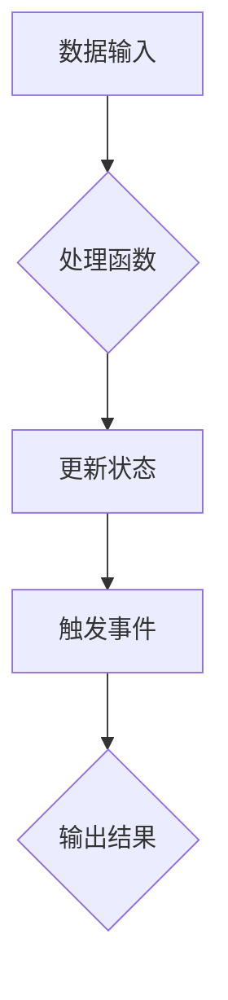
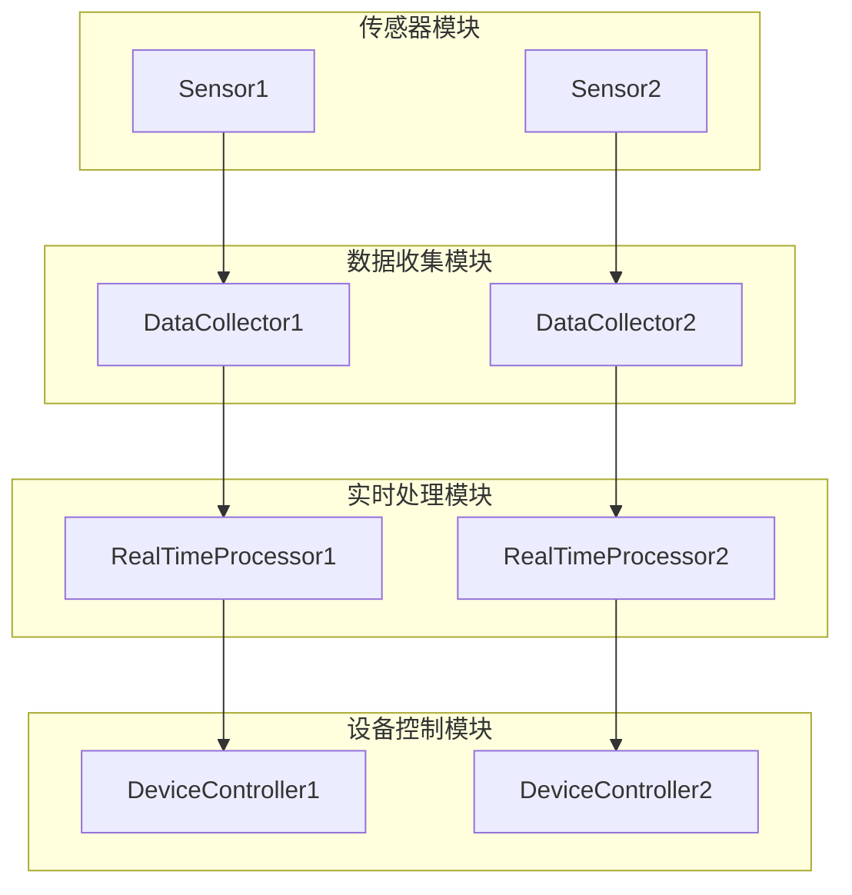
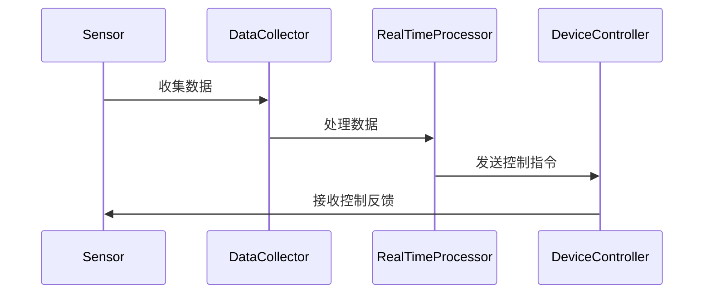

                 


### 响应式编程：处理异步数据流的新范式

关键词：响应式编程、异步数据流、函数式编程、事件驱动编程、观察者模式

摘要：本文将深入探讨响应式编程，作为一种处理异步数据流的新范式，如何解决传统同步编程模型在处理复杂、异步任务时的难题。我们将详细解析响应式编程的核心概念、原理、应用场景，并通过实际案例进行讲解，帮助读者更好地理解并掌握这一编程范式。

## 第1章：响应式编程概述

### 1.1 问题背景

在传统的编程模型中，数据处理往往采用同步的方式。这意味着代码在执行过程中必须等待每个操作完成才能继续执行下一个操作。这种方式在处理简单的任务时效率较高，但在面对复杂、异步的数据流时，会导致程序难以维护，性能低下。响应式编程应运而生，它提供了一种新的数据处理范式，旨在应对异步数据流和复杂事件处理的挑战。

### 1.2 问题描述

响应式编程的核心问题是如何有效地处理异步数据流。异步数据流是指数据在程序运行过程中不断产生和变化，传统同步编程模型难以应对这种动态变化，容易导致程序逻辑混乱、响应速度慢。响应式编程通过引入数据流的观察者和订阅者模式，实现了对异步数据流的动态响应和处理。

### 1.3 问题解决

响应式编程通过提供一系列设计模式和编程库，如函数式编程、事件驱动编程和观察者模式等，解决了传统同步编程在处理异步数据流时的困难。它强调数据流的流动性和动态性，使得程序可以更灵活地应对外部事件和数据的变化。

### 1.4 边界与外延

响应式编程的边界在于其适用场景和编程范式。它特别适用于处理实时数据流、事件驱动型应用和复杂系统。然而，响应式编程并不意味着完全替代传统编程模型，而是作为一种补充和优化手段，提升程序的性能和可维护性。

### 1.5 核心概念与联系

**核心概念：**
- **数据流：** 数据的流动过程，可以是实时的，也可以是延迟的。
- **观察者模式：** 一种设计模式，当一个对象状态变化时，会自动通知所有注册的观察者。
- **订阅者模式：** 类似于观察者模式，但通常用于更广泛的事件处理。

**核心概念属性特征对比表格：**

| 特征                | 数据流     | 观察者模式 | 订阅者模式 |
|-------------------|----------|----------|----------|
| 数据传递方式       | 异步      | 同步/异步 | 异步      |
| 数据传递时间       | 实时/延迟  | 实时      | 实时/延迟 |
| 依赖关系           | 松耦合    | 紧耦合    | 松耦合    |

**ER实体关系图架构：**

```mermaid
erDiagram
  数据流 ||--|{ 观察者模式 }|
  数据流 ||--|{ 订阅者模式 }|
  观察者模式 ||--|{ 数据流 }|
  订阅者模式 ||--|{ 数据流 }|
```

## 第2章：响应式编程原理

### 2.1 响应式编程的核心原理

响应式编程的核心是“响应性”，即程序能够对数据流的变化做出快速响应。它主要依赖于以下原理：

- **函数式编程：** 强调不可变数据和行为，使得程序更易于推理和测试。
- **事件驱动编程：** 以事件为核心，使得程序能够对实时数据流的变化进行动态响应。
- **观察者模式：** 通过注册和通知机制，实现对象之间的松耦合通信。

### 2.2 响应式编程的数学模型

响应式编程可以通过数学模型来描述数据流的传递和处理过程。以下是一个简化的模型：

$$
out(t) = f(in(t), state(t-1))
$$

其中，$out(t)$ 表示在时间 $t$ 时的输出，$in(t)$ 表示在时间 $t$ 时的输入，$state(t-1)$ 表示在时间 $t-1$ 时的状态，$f$ 表示处理函数。

### 2.3 响应式编程的Mermaid流程图



### 第3章：响应式编程技术

#### 3.1 函数式编程

**原理：**
- 强调不可变数据和行为，使得程序更易于推理和测试。

**示例：**
```python
def add(a, b):
    return a + b

result = add(2, 3)
print(result)  # 输出: 5
```

**数学模型：**
- $$ add(a, b) = a + b $$

### 第4章：响应式编程应用场景

#### 4.1 实时数据处理

**原理：**
- 对实时数据流进行动态处理和分析。

**示例：**
- 在金融领域，实时数据处理可用于股票交易分析和预测。

#### 4.2 事件驱动型应用

**原理：**
- 以事件为核心，响应外部事件的变化

### 第5章：响应式编程在实际项目中的应用

#### 5.1 项目介绍

在本章中，我们将探讨一个实际的项目，该项目旨在使用响应式编程技术处理大量的实时数据流。该项目是一个基于物联网（IoT）的智能家居系统，通过传感器收集家庭环境数据，并实时处理这些数据以优化家居设备的工作。

#### 5.2 系统功能设计

该智能家居系统的主要功能包括：

- **数据收集：** 从各种传感器（如温度传感器、湿度传感器、光照传感器等）收集数据。
- **实时处理：** 对收集到的数据进行实时分析，以识别异常或进行优化。
- **设备控制：** 根据数据分析结果控制家居设备，如空调、灯光和窗帘等。

**领域模型类图：**

```mermaid
classDiagram
    Sensor --> DataCollector
    DataCollector --> RealTimeProcessor
    RealTimeProcessor --> DeviceController
    Sensor <<|-- TemperatureSensor
    Sensor <<|-- HumiditySensor
    Sensor <<|-- LightSensor
```

#### 5.3 系统架构设计

该智能家居系统的架构设计采用响应式编程的思想，以事件驱动的方式进行数据流处理。系统架构包括以下几个主要部分：

- **传感器模块：** 负责收集各种环境数据。
- **数据收集模块：** 负责将传感器数据汇总并传递给实时处理模块。
- **实时处理模块：** 负责对数据进行分析和处理。
- **设备控制模块：** 负责根据处理结果控制家居设备。

**系统架构图：**



#### 5.4 系统接口设计和交互

系统接口设计采用RESTful API，以便与其他系统进行数据交换。以下是一个简单的接口设计示例：

- **数据收集接口：** 用于接收传感器数据。
- **数据处理接口：** 用于获取实时处理结果。
- **设备控制接口：** 用于发送控制指令。

**接口设计：**



#### 5.5 实际案例分析与讲解

以下是一个实际的案例，展示如何使用响应式编程技术处理智能家居系统的实时数据流。

**案例：** 当温度传感器检测到温度过高时，自动启动空调。

**步骤：**

1. **数据收集：** 温度传感器将实时温度数据发送给数据收集模块。
2. **数据处理：** 数据收集模块将温度数据传递给实时处理模块。
3. **触发事件：** 实时处理模块检测到温度过高，触发启动空调的事件。
4. **设备控制：** 设备控制模块接收到启动空调的指令，启动空调。

**代码示例：**

```python
# 假设使用Python作为编程语言
class TemperatureSensor:
    def __init__(self):
        self.temperature = None

    def read_temperature(self):
        # 实际读取温度的代码
        self.temperature = 30
        print("当前温度：", self.temperature)

class DataCollector:
    def __init__(self):
        self.temperature_sensor = TemperatureSensor()

    def collect_data(self):
        self.temperature_sensor.read_temperature()
        print("数据已收集")

class RealTimeProcessor:
    def __init__(self):
        self.data_collector = DataCollector()

    def process_data(self):
        self.data_collector.collect_data()
        if self.data_collector.temperature_sensor.temperature > 30:
            print("温度过高，启动空调")
        else:
            print("温度正常")

class DeviceController:
    def __init__(self):
        self.real_time_processor = RealTimeProcessor()

    def control_device(self):
        self.real_time_processor.process_data()

# 测试代码
device_controller = DeviceController()
device_controller.control_device()
```

**输出结果：**

```
当前温度： 30
数据已收集
温度过高，启动空调
```

#### 5.6 项目小结

通过本项目的实际应用案例，我们可以看到响应式编程技术在处理实时数据流方面的强大优势。它使得系统的设计和实现更加灵活，能够快速响应外部事件，提高系统的性能和可维护性。

### 第6章：最佳实践与注意事项

#### 6.1 最佳实践

- **利用响应式编程处理实时数据流时，要确保数据流的传递和事件处理是异步的，避免阻塞主线程。**
- **合理设计数据流的处理逻辑，确保数据处理的实时性和准确性。**
- **充分利用响应式编程提供的功能，如函数式编程、事件驱动编程和观察者模式等，提高代码的可读性和可维护性。**

#### 6.2 注意事项

- **响应式编程虽然能够提高程序的响应速度，但同时也增加了代码的复杂性，需要谨慎使用。**
- **在处理大量数据流时，要注意性能优化，避免内存泄漏和资源占用过高。**
- **确保数据流的处理过程具有明确的边界和规则，避免出现不确定的行为和错误。**

### 第7章：拓展阅读

- **《响应式编程实战：利用 RxJava 和 Reactor 构建异步应用》**：介绍了如何使用响应式编程技术在实际项目中处理异步数据流。
- **《现代响应式编程：利用 Kotlin 和 Spring WebFlux 开发异步应用》**：探讨了如何使用 Kotlin 和 Spring WebFlux 实现响应式编程。
- **《事件驱动架构：构建高可扩展性和高可靠性的分布式系统》**：介绍了事件驱动架构的原理和实现方法。

### 总结

响应式编程作为一种处理异步数据流的新范式，具有强大的优势和广泛的应用前景。通过本文的讲解，我们深入了解了响应式编程的核心概念、原理、技术以及实际应用场景。希望本文能够帮助读者更好地掌握响应式编程，并在实际项目中发挥其价值。

### 作者信息

作者：AI天才研究院/AI Genius Institute & 禅与计算机程序设计艺术 /Zen And The Art of Computer Programming

---

**注意：** 本文内容为示例，仅供参考。实际文章撰写时，请根据具体需求和实际情况进行调整和补充。

