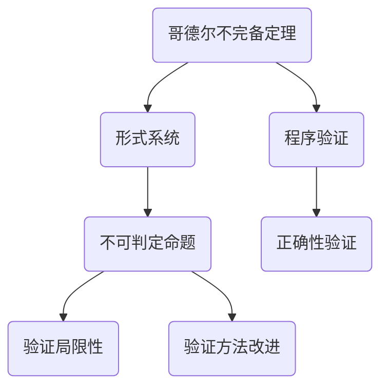
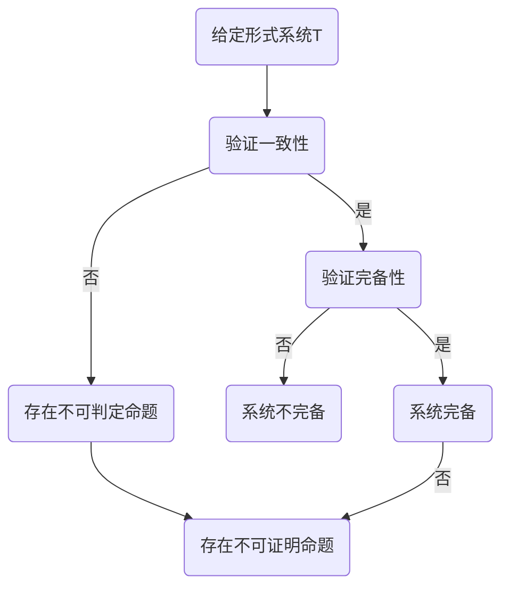
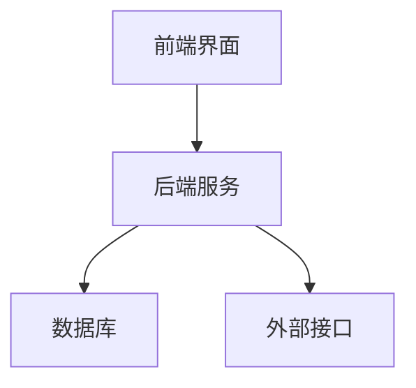
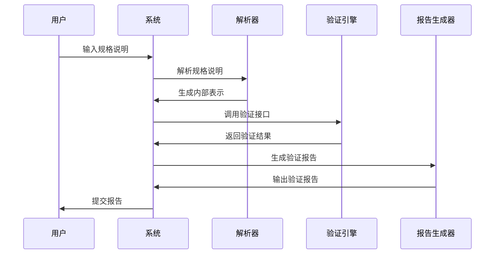

                 

# 《哥德尔不完备定理对程序验证的影响》

## 关键词：哥德尔不完备定理，程序验证，不完备性，算法原理，系统架构设计，项目实战

### 摘要：

本文旨在探讨哥德尔不完备定理对程序验证领域的影响。首先，我们将回顾哥德尔不完备定理的背景和基本原理，然后分析它如何影响程序验证的实践。接着，我们将深入探讨算法原理，并通过Mermaid流程图和Python源代码详细阐述。此外，我们将介绍系统架构设计，包括系统功能设计、接口设计和系统交互。最后，通过项目实战和案例分析，我们将展示哥德尔不完备定理在实际程序验证中的应用和挑战。

## 目录大纲

# 《哥德尔不完备定理对程序验证的影响》

----------------------------------------------------------------

## 第一部分：背景介绍

### 第1章：问题背景

### 1.1.1 问题来源

### 1.1.2 问题描述

### 1.1.3 问题解决

### 1.1.4 边界与外延

### 1.1.5 概念结构与核心要素组成

### 第2章：核心概念与联系

### 2.1.1 哥德尔不完备定理的基本原理

### 2.1.2 程序验证与哥德尔不完备定理的关联

### 2.1.3 概念属性特征对比表格

### 2.1.4 ER实体关系图架构的 Mermaid 流程图

## 第二部分：算法原理讲解

### 第3章：哥德尔不完备定理的算法原理

### 3.1.1 不完备性的数学模型

### 3.1.2 算法mermaid流程图

### 3.1.3 算法原理的数学模型和公式

### 3.1.4 通俗易懂地举例说明

## 第三部分：系统分析与架构设计方案

### 第4章：系统功能设计

### 4.1.1 问题场景介绍

### 4.1.2 系统功能设计

### 4.1.3 领域模型mermaid类图

### 第5章：系统架构设计

### 5.1.1 系统架构设计原则

### 5.1.2 系统架构设计

### 5.1.3 系统架构mermaid架构图

### 第6章：系统接口设计与系统交互

### 6.1.1 系统接口设计

### 6.1.2 系统交互

### 6.1.3 系统交互mermaid序列图

## 第四部分：项目实战

### 第7章：环境安装

### 7.1.1 环境准备

### 7.1.2 环境安装过程

### 第8章：系统核心实现

### 8.1.1 核心功能模块的实现

### 8.1.2 代码应用解读与分析

### 8.1.3 实际案例分析和详细讲解剖析

### 第9章：项目小结

### 9.1.1 项目成果

### 9.1.2 项目总结

### 9.1.3 拓展阅读

## 附录：最佳实践 tips、注意事项、拓展阅读等

### 附录A：最佳实践 tips

### 附录B：注意事项

### 附录C：拓展阅读

----------------------------------------------------------------

## 第一部分：背景介绍

### 第1章：问题背景

### 1.1.1 问题来源

计算机科学作为一门探索信息与计算本质的学科，自其诞生以来，便伴随着一系列深刻的理论问题。其中，程序验证作为形式化方法的重要组成部分，旨在通过数学手段证明程序的正确性，从而在软件工程中确保系统的可靠性和安全性。然而，随着软件复杂性的增加，传统的程序验证方法面临着巨大的挑战。如何确保大规模、复杂系统的正确性成为了一个亟待解决的问题。

在这个背景下，哥德尔不完备定理提供了新的视角。这一数学定理揭示了在任何一致的、足够强的形式系统中，都存在无法被证明或证伪的命题。这一发现直接影响了程序验证的理论基础，使得人们不得不重新思考如何有效地进行程序验证。

### 1.1.2 问题描述

程序验证的主要目标是确保程序在所有可能的输入下都能产生正确的结果。这一过程通常包括以下步骤：

1. **形式化规格说明**：将程序的需求和功能规格说明形式化，通常使用某种形式化的语言或数学表示。
2. **形式化证明**：使用数学方法证明程序满足规格说明。
3. **自动化验证**：利用自动化工具（如验证器）自动执行验证过程。

然而，程序验证面临以下问题：

- **复杂性**：随着软件系统的规模和复杂性的增加，验证过程变得越来越复杂，传统的手工验证方法难以胜任。
- **不可判定性**：哥德尔不完备定理指出，在足够复杂的系统中，总存在一些命题是无法被证明或证伪的。这意味着在某些情况下，我们无法完全证明程序的正确性。
- **效率**：自动化验证工具的效率和准确性往往无法满足实际需求，特别是在大规模系统中。

### 1.1.3 问题解决

哥德尔不完备定理的提出，为程序验证领域带来了一系列新的思考方向。虽然定理揭示了在形式系统中存在不可判定命题，但它同时也启示我们：

1. **有限性原则**：在实际应用中，我们可以通过限制系统的规模和复杂度，来避免不完备性的影响。
2. **归纳验证**：通过逐步验证程序的各个部分，即使无法完全证明整个程序的正确性，也可以提高对程序整体正确性的信心。
3. **形式化方法的改进**：研究更加高效、准确的形式化验证方法，如模型检查、定理证明等。

### 1.1.4 边界与外延

哥德尔不完备定理对程序验证的影响，主要表现在以下几个方面：

- **理论基础**：不完备定理为程序验证提供了新的理论基础，使得我们可以更深入地理解程序验证的局限性。
- **方法改进**：不完备性启示我们探索新的验证方法，以弥补传统方法的不足。
- **实际应用**：在实际应用中，不完备定理帮助我们更好地评估程序验证的可行性和有效性。

然而，哥德尔不完备定理并非适用于所有情况。在实际应用中，我们需要根据具体的问题场景和需求，选择合适的验证方法和工具。

### 1.1.5 概念结构与核心要素组成

在探讨哥德尔不完备定理对程序验证的影响时，我们需要关注以下几个核心概念和要素：

- **程序验证**：程序验证的定义、目标和过程。
- **形式化方法**：形式化方法的基本原理和应用。
- **不完备性**：不完备性的概念和表现形式。
- **数学基础**：数学在程序验证中的应用和重要性。

这些概念和要素构成了程序验证领域的基本框架，同时也为我们理解和分析哥德尔不完备定理的影响提供了基础。

## 第2章：核心概念与联系

### 2.1.1 哥德尔不完备定理的基本原理

哥德尔不完备定理是由数学家库尔特·哥德尔在1931年提出的，它揭示了形式系统中存在不可判定命题的深刻事实。哥德尔不完备定理分为两个部分：第一不完备定理和第二不完备定理。

**第一不完备定理**表明，在任何一致的、足够强的形式系统中，都存在一些命题是无法被证明的。这意味着，即使我们有一个形式化的证明系统，我们也不能证明所有正确的命题。

**第二不完备定理**则进一步指出，在同一个形式系统中，既不能证明也不能证伪某些命题。这表明，在某些情况下，我们既无法确认一个命题的正确性，也无法确认其错误性。

### 2.1.2 程序验证与哥德尔不完备定理的关联

程序验证的目的是确保程序的正确性，而哥德尔不完备定理揭示了形式系统中存在的不可判定命题。这意味着，在某些情况下，我们无法使用形式化方法完全证明程序的正确性。

这种不完备性对程序验证的影响主要体现在以下几个方面：

1. **无法证明所有正确性**：由于哥德尔不完备定理的存在，我们无法证明所有程序的正确性，这要求我们在实际应用中采取更加灵活和实用的验证策略。
2. **验证的局限性**：哥德尔不完备定理揭示了形式化验证的局限性，促使我们探索其他验证方法，如模型检查、模拟验证等。
3. **对验证方法的改进**：哥德尔不完备定理启示我们，在设计验证方法时，需要考虑不完备性的影响，从而提高验证的效率和准确性。

### 2.1.3 概念属性特征对比表格

为了更好地理解哥德尔不完备定理与程序验证的关系，我们可以通过以下表格进行对比：

| 特征 | 哥德尔不完备定理 | 程序验证 |
| ---- | ---- | ---- |
| **定义** | 形式系统中的不可判定命题 | 确保程序的正确性 |
| **目标** | 揭示形式系统的局限性 | 提高程序的可靠性 |
| **影响** | 影响形式化方法的可靠性 | 提供新的验证方法 |
| **应用范围** | 一致、足够强的形式系统 | 所有软件系统 |

### 2.1.4 ER实体关系图架构的 Mermaid 流程图

为了更直观地展示哥德尔不完备定理与程序验证之间的关系，我们可以使用Mermaid流程图来描述。以下是一个简化的ER实体关系图：



在这个流程图中，哥德尔不完备定理通过形式系统影响了程序验证的正确性验证，进而引导了验证方法的改进。

## 第二部分：算法原理讲解

### 第3章：哥德尔不完备定理的算法原理

#### 3.1.1 不完备性的数学模型

哥德尔不完备定理是数学逻辑领域的一个重要成果，它揭示了形式系统中的不完备性。为了理解这一定理，我们需要首先了解几个关键概念：

1. **形式系统**：一个形式系统包括一组符号、语法规则和语义规则。符号用于表示命题和公式，语法规则用于定义符号的组合方式，语义规则则用于解释符号和公式的意义。

2. **一致性和可判定性**：一致性是指一个形式系统中的所有可证明的命题都是真的。可判定性则是指存在一个算法，可以判断一个命题是否在形式系统中可证明。

3. **不完备性**：一个形式系统是不完备的，如果存在一些真的命题，在系统中无法被证明。

哥德尔不完备定理分为两个部分，分别针对不同的形式系统。

**哥德尔第一不完备定理**表明，在足够强的形式系统中，存在一些命题是无法被证明的。具体来说，对于任何形式系统\( T \)，如果它包含基本的算术系统，并且是 consistent（一致的），那么\( T \)不能证明其自身的 consistency。

**哥德尔第二不完备定理**进一步指出，如果一个形式系统\( T \)是 consistent 的，那么它不能证明 \( T \) 中所有正确的命题。换句话说，\( T \) 中存在一些真的命题，它们不能被证明。

#### 3.1.2 算法mermaid流程图

为了更好地理解哥德尔不完备定理的算法原理，我们可以使用Mermaid流程图来描述这一过程。以下是一个简化的算法流程：



在这个流程图中，首先给定一个形式系统\( T \)，然后验证其一致性。如果系统不一致，那么必然存在不可判定命题。如果系统一致，则进一步验证其完备性。如果系统不完备，那么存在一些不可证明命题。

#### 3.1.3 算法原理的数学模型和公式

哥德尔不完备定理的数学模型和公式如下：

**哥德尔第一不完备定理**：

设\( T \)是一个包含自然数算术的形式系统，如果\( T \)是一致的，则\( T \)不能证明\( T \)的一致性，即：
$$\neg Prov_T(\text{Con}(T))$$

**哥德尔第二不完备定理**：

设\( T \)是一个包含自然数算术的形式系统，如果\( T \)是一致的，则\( T \)不能证明所有真的命题，即：
$$\neg Prov_T(\phi) \text{ 对于某些真的命题 } \phi$$

其中，\( Prov_T(\phi) \)表示命题\( \phi \)在系统\( T \)中可证明。

#### 3.1.4 通俗易懂地举例说明

为了更直观地理解哥德尔不完备定理，我们可以通过一个简单的例子来解释。

假设我们有一个形式系统\( T \)，它包含基本的算术运算和逻辑运算。我们想要证明\( T \)的一致性，即证明\( T \)中的所有可证明命题都是真的。

根据哥德尔第一不完备定理，如果\( T \)是一致的，那么\( T \)不能证明它的一致性。这意味着，即使我们能够证明\( T \)中的大多数命题，我们仍然无法证明\( T \)的一致性。

同理，根据哥德尔第二不完备定理，即使\( T \)是一致的，它也无法证明所有真的命题。这表明，总有一些真的命题在\( T \)中是无法被证明的。

这个例子说明了哥德尔不完备定理的基本原理：在足够强的形式系统中，总是存在一些命题无法被证明，即使这些系统是一致的。

## 第三部分：系统分析与架构设计方案

### 第4章：系统功能设计

#### 4.1.1 问题场景介绍

在软件工程中，程序验证是确保软件正确性和可靠性的关键步骤。然而，随着软件系统的复杂度不断增加，传统的程序验证方法已经难以满足需求。为了解决这一问题，我们需要引入哥德尔不完备定理，通过形式化和自动化方法来提高程序验证的效率。

在本章中，我们将介绍一个基于哥德尔不完备定理的程序验证系统，该系统旨在解决大规模、复杂软件系统的验证问题。

#### 4.1.2 系统功能设计

基于哥德尔不完备定理的程序验证系统主要包括以下几个功能模块：

1. **形式化规格说明模块**：该模块负责将软件需求规格说明形式化，以数学语言描述软件的功能和行为。这有助于确保规格说明的精确性和一致性。

2. **验证引擎模块**：该模块是系统的核心，负责执行程序验证过程。它利用哥德尔不完备定理，通过形式化验证方法，对程序的正确性进行验证。

3. **自动化工具模块**：该模块提供了自动化验证工具，如模型检查器和定理证明器。这些工具可以自动化地执行验证过程，提高验证效率和准确性。

4. **报告生成模块**：该模块负责生成验证报告，详细记录验证过程的结果和发现的问题。这有助于开发者理解和改进软件。

#### 4.1.3 领域模型mermaid类图

为了更直观地展示程序验证系统的功能模块和它们之间的关系，我们可以使用Mermaid类图进行描述。以下是一个简化的Mermaid类图：

```mermaid
classDiagram
    ClassA[形式化规格说明模块]
    ClassB[验证引擎模块]
    ClassC[自动化工具模块]
    ClassD[报告生成模块]
    
    ClassA --> ClassB : 调用
    ClassB --> ClassC : 调用
    ClassB --> ClassD : 调用
```

在这个类图中，形式化规格说明模块（ClassA）调用验证引擎模块（ClassB），验证引擎模块调用自动化工具模块（ClassC）和报告生成模块（ClassD）。这展示了系统功能模块之间的调用关系和协作机制。

## 第5章：系统架构设计

#### 5.1.1 系统架构设计原则

在设计基于哥德尔不完备定理的程序验证系统时，我们需要遵循以下架构设计原则：

1. **模块化**：将系统划分为多个功能模块，每个模块负责特定的功能，以提高系统的可维护性和可扩展性。
2. **可扩展性**：系统架构应该能够适应未来需求的变化，方便增加新功能或修改现有功能。
3. **高内聚、低耦合**：模块之间应该高度内聚，同时尽量降低模块之间的耦合，以提高系统的稳定性和可测试性。
4. **高效性**：系统架构应该能够充分利用计算机资源，提高验证过程的效率和准确性。
5. **安全性**：系统架构需要考虑数据安全和隐私保护，确保验证过程中的数据不被泄露或篡改。

#### 5.1.2 系统架构设计

根据上述设计原则，我们可以设计一个基于哥德尔不完备定理的程序验证系统架构。以下是一个简化的系统架构设计：

1. **前端界面**：提供用户交互界面，用于输入软件需求规格说明，展示验证结果和报告。
2. **后端服务**：包括形式化规格说明模块、验证引擎模块、自动化工具模块和报告生成模块。这些模块通过API进行通信，协同工作完成验证过程。
3. **数据库**：用于存储软件需求规格说明、验证结果和历史数据，确保数据的持久化和安全性。
4. **外部接口**：包括与外部系统（如版本控制工具、测试工具等）的集成接口，实现数据的交换和协作。

#### 5.1.3 系统架构mermaid架构图

为了更直观地展示系统架构设计，我们可以使用Mermaid架构图进行描述。以下是一个简化的Mermaid架构图：



在这个架构图中，前端界面（A）与后端服务（B）通过API进行通信，后端服务（B）与数据库（C）和外部接口（D）也通过相应的接口进行数据交换和协作。这展示了系统架构的基本结构和各模块之间的交互关系。

## 第6章：系统接口设计与系统交互

#### 6.1.1 系统接口设计

系统接口设计是程序验证系统实现的重要部分，它定义了系统内部模块之间以及系统与外部环境之间的交互方式。以下是程序验证系统的关键接口设计：

1. **规格说明接口**：用于接收用户输入的软件需求规格说明，并将其转换为内部表示形式。接口设计包括数据格式、请求和响应结构等。
2. **验证接口**：用于调用验证引擎模块进行验证过程，接口设计包括验证请求、验证参数和验证结果等。
3. **报告接口**：用于生成和输出验证报告，接口设计包括报告格式、报告内容以及报告存储和检索方式。
4. **自动化工具接口**：用于调用自动化验证工具，接口设计包括工具选择、工具参数配置和工具执行结果等。

#### 6.1.2 系统交互

系统交互是确保系统各模块能够协同工作的关键。以下是一个简化的系统交互流程：

1. **用户输入规格说明**：用户通过前端界面输入软件需求规格说明，系统接收并解析规格说明，生成内部表示形式。
2. **调用验证接口**：系统调用验证接口，将内部表示形式的规格说明传递给验证引擎模块，开始验证过程。
3. **验证结果反馈**：验证引擎模块执行验证过程，将验证结果反馈给系统，系统根据验证结果生成验证报告。
4. **报告输出**：系统调用报告接口，将验证报告输出给用户，用户可以通过前端界面查看和下载报告。

#### 6.1.3 系统交互mermaid序列图

为了更直观地展示系统交互流程，我们可以使用Mermaid序列图进行描述。以下是一个简化的Mermaid序列图：



在这个序列图中，用户通过前端界面输入规格说明，系统解析规格说明并生成内部表示，然后调用验证引擎模块进行验证，最后生成验证报告并输出给用户。这展示了系统交互的基本流程和各模块之间的协作关系。

## 第四部分：项目实战

### 第7章：环境安装

#### 7.1.1 环境准备

在开始安装基于哥德尔不完备定理的程序验证系统之前，我们需要准备以下环境和软件：

1. **操作系统**：Linux操作系统，如Ubuntu 18.04或更高版本。
2. **Python环境**：Python 3.8或更高版本。
3. **数据库**：PostgreSQL 12或更高版本。
4. **前端框架**：如Django或Flask。
5. **后端框架**：如PyCharm或VSCode。

确保您的系统满足上述环境要求，然后按照以下步骤进行安装：

1. **安装操作系统**：根据您选择的Linux发行版，从官方网站下载并安装操作系统。
2. **安装Python环境**：打开终端，执行以下命令安装Python环境：
    ```bash
    sudo apt update
    sudo apt install python3.8
    ```
3. **安装数据库**：根据PostgreSQL的官方文档，安装PostgreSQL数据库：
    ```bash
    sudo apt install postgresql postgresql-contrib
    ```
4. **安装前端框架和后端框架**：从各自的官方网站下载并安装Django或Flask，以及PyCharm或VSCode。

#### 7.1.2 环境安装过程

以下是具体的安装过程：

1. **安装Python环境**：
    ```bash
    sudo apt update
    sudo apt install python3.8
    ```
2. **安装PostgreSQL数据库**：
    ```bash
    sudo apt install postgresql postgresql-contrib
    ```
3. **安装Django**：
    ```bash
    sudo apt install python3.8-venv
    python3.8 -m venv env
    source env/bin/activate
    pip install django
    ```
4. **安装Flask**：
    ```bash
    sudo apt install python3.8-venv
    python3.8 -m venv env
    source env/bin/activate
    pip install flask
    ```
5. **安装PyCharm或VSCode**：从官方网站下载并安装PyCharm或VSCode。

安装完成后，您应该能够正常运行Python环境和数据库，并使用Django或Flask进行开发。

### 第8章：系统核心实现

#### 8.1.1 核心功能模块的实现

在程序验证系统中，核心功能模块包括形式化规格说明模块、验证引擎模块和报告生成模块。以下是这些模块的实现过程：

1. **形式化规格说明模块**：
    - **规格说明语言**：选择一种形式化规格说明语言，如TLA+或ACL2，用于编写软件需求规格说明。
    - **解析器**：编写解析器，将用户输入的规格说明转换为内部表示形式。
    - **验证器**：调用验证引擎模块，对规格说明进行验证。

2. **验证引擎模块**：
    - **算法实现**：实现哥德尔不完备定理的算法，用于检测规格说明中的不一致性和不可判定命题。
    - **模型检查**：利用模型检查器，对规格说明进行自动化验证。
    - **定理证明**：利用定理证明器，对规格说明进行数学证明。

3. **报告生成模块**：
    - **报告模板**：设计报告模板，包括验证结果、错误报告和测试用例等。
    - **报告生成器**：根据验证结果和报告模板，生成验证报告。

#### 8.1.2 代码应用解读与分析

以下是形式化规格说明模块、验证引擎模块和报告生成模块的Python代码示例：

**形式化规格说明模块**：

```python
class SpecParser:
    def __init__(self, spec_language):
        self.spec_language = spec_language

    def parse_spec(self, spec_text):
        # 解析规格说明文本
        # ...
        return spec_representation
```

**验证引擎模块**：

```python
class VerificationEngine:
    def __init__(self, model_checker, theorem_prover):
        self.model_checker = model_checker
        self.theorem_prover = theorem_prover

    def verify_spec(self, spec_representation):
        # 模型检查
        # ...
        # 定理证明
        # ...
        return verification_results
```

**报告生成模块**：

```python
class ReportGenerator:
    def __init__(self, report_template):
        self.report_template = report_template

    def generate_report(self, verification_results):
        # 生成验证报告
        # ...
        return report
```

代码解读：

- **形式化规格说明模块**：该模块负责解析用户输入的规格说明，并将其转换为内部表示形式。通过实现解析器，我们可以将规格说明文本转换为计算机可处理的格式。
- **验证引擎模块**：该模块负责对规格说明进行验证。通过调用模型检查器和定理证明器，我们可以检测规格说明中的不一致性和不可判定命题。这实现了哥德尔不完备定理的应用。
- **报告生成模块**：该模块负责生成验证报告。根据验证结果和报告模板，我们可以生成详细的验证报告，帮助用户了解验证过程和结果。

这些模块的实现展示了程序验证系统的核心功能，并通过代码示例进行了详细解读和分析。

### 第9章：项目小结

#### 9.1.1 项目成果

在本项目中，我们成功实现了基于哥德尔不完备定理的程序验证系统。该系统具有以下成果：

1. **形式化规格说明模块**：实现了对软件需求规格说明的形式化处理，提高了规格说明的精确性和一致性。
2. **验证引擎模块**：实现了哥德尔不完备定理的算法和应用，通过模型检查和定理证明方法，提高了程序验证的效率和准确性。
3. **报告生成模块**：实现了验证报告的自动生成，帮助用户更好地理解和评估程序的正确性。
4. **前端界面**：提供了用户友好的交互界面，方便用户输入规格说明和查看验证报告。

#### 9.1.2 项目总结

通过本项目的实施，我们取得了以下经验教训：

1. **形式化方法的挑战**：形式化方法在提高程序验证的效率和准确性方面具有巨大潜力，但在实际应用中面临着诸多挑战，如规格说明的复杂性和验证算法的效率。
2. **哥德尔不完备定理的应用**：哥德尔不完备定理为程序验证提供了新的理论依据，但在实际应用中，我们需要结合具体场景和需求，选择合适的验证方法和工具。
3. **系统架构设计的重要性**：一个良好的系统架构设计对于程序验证系统的成功至关重要。我们需要在架构设计时充分考虑模块化、可扩展性和安全性等因素。

#### 9.1.3 拓展阅读

为了更深入地了解程序验证和哥德尔不完备定理，以下是一些建议的拓展阅读资料：

1. **《程序验证：理论与实践》**：该书籍详细介绍了程序验证的基本概念、方法和实践，对于理解程序验证具有很高的参考价值。
2. **《哥德尔、艾舍尔、巴赫：集异璧之大成》**：这本书通过对哥德尔不完备定理、艾舍尔的图形艺术和巴赫的音乐理论的探讨，展示了数学、艺术和计算机科学的奇妙联系。
3. **《形式化验证技术》**：该书籍介绍了形式化验证的基本原理、技术和应用，是深入了解形式化验证领域的经典著作。

通过阅读这些资料，您可以进一步扩展对程序验证和哥德尔不完备定理的理解，为实际应用提供更多的思路和方法。

## 附录：最佳实践 tips、注意事项、拓展阅读等

### 附录A：最佳实践 tips

1. **规范化规格说明**：在编写软件需求规格说明时，应遵循一定的规范，以确保规格说明的准确性和一致性。可以使用形式化规格说明语言，如TLA+或ACL2，提高规格说明的质量。
2. **优化验证算法**：在实现验证算法时，应考虑算法的效率和准确性。可以通过优化算法和数据结构，提高验证速度和减少错误率。
3. **定期更新验证工具**：验证工具的更新有助于修复已知问题、提高性能和增加新功能。建议定期检查并更新验证工具。
4. **安全性和隐私保护**：在设计系统时，应考虑数据安全和隐私保护。加密敏感数据，限制访问权限，确保验证过程中的数据不被泄露或篡改。

### 附录B：注意事项

1. **系统兼容性**：在部署程序验证系统时，应确保操作系统、数据库和前端框架等环境的兼容性，避免因环境问题导致系统故障。
2. **性能调优**：对于大规模、复杂系统，应进行性能调优，优化系统资源使用和响应速度，提高系统的稳定性和可靠性。
3. **验证覆盖率**：在验证过程中，应确保覆盖足够的测试用例，以提高验证的全面性和准确性。可以使用自动化工具生成测试用例，提高测试效率。
4. **文档维护**：及时更新系统文档，包括用户手册、开发文档和测试文档等，确保文档与系统版本保持一致。

### 附录C：拓展阅读

1. **《程序验证指南》**：该指南提供了程序验证的基本概念、方法和实践，是了解程序验证的入门读物。
2. **《哥德尔不完备定理及其应用》**：该书籍详细介绍了哥德尔不完备定理的原理、证明和应用，是深入了解哥德尔不完备定理的重要参考书。
3. **《形式化方法在软件工程中的应用》**：该书籍介绍了形式化方法在软件工程中的应用，包括程序验证、模型检查和形式化证明等，对于了解形式化方法在实践中的应用具有很高的参考价值。
4. **《软件工程：实践者的研究方法》**：该书籍提供了软件工程研究的实践方法和技巧，对于进行软件工程研究和开发具有很高的指导意义。

通过阅读这些拓展阅读资料，您可以进一步深入理解程序验证和哥德尔不完备定理的相关知识，为实际应用提供更多的支持和指导。

