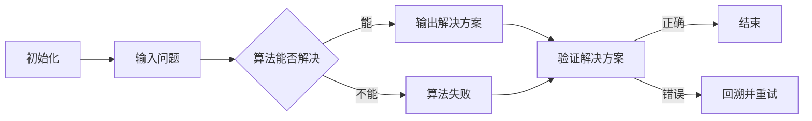
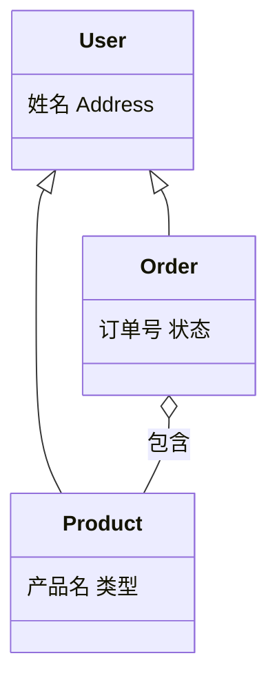
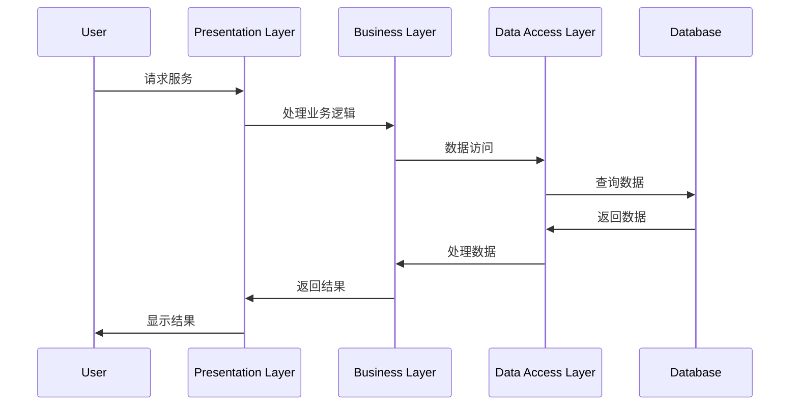

                 

### 关键词

- 哥德尔不完备定理
- 计算机科学
- 数学模型
- 不完备性原理
- 人工智能
- 算法
- 系统架构设计
- 理论计算机科学

### 摘要

本文将深入探讨哥德尔不完备定理对计算机科学产生的深远影响。首先，我们将回顾哥德尔不完备定理的提出及其数学背景，随后将其与计算机科学中的核心概念进行对比和分析。接着，文章将详细讲解哥德尔不完备定理的数学模型，以及其在计算机科学、人工智能和理论计算机科学中的应用。随后，我们将通过Python代码实例来具体阐述哥德尔不完备定理的应用原理，并通过一个实战项目来展示其在实际系统中的运用。最后，文章将总结最佳实践，并推荐进一步阅读的材料，以帮助读者更深入地理解这一重要数学原理在计算机科学中的关键作用。

### 目录大纲

**《哥德尔不完备定理对计算机科学的影响》目录大纲**

## 第一部分：背景介绍

### 第1章 问题背景与核心概念

#### 1.1.1 问题背景

##### 1.1.1.1 哥德尔不完备定理的提出

##### 1.1.1.2 哥德尔不完备定理的基本概念

##### 1.1.1.3 哥德尔不完备定理与计算机科学的联系

#### 1.2 核心概念与联系

##### 1.2.1 哥德尔不完备定理的数学模型

##### 1.2.2 哥德尔不完备定理的属性特征对比表格

##### 1.2.3 哥德尔不完备定理的ER实体关系图架构

## 第二部分：核心概念原理

### 第2章 哥德尔不完备定理的数学模型

#### 2.1 哥德尔不完备定理的数学原理

##### 2.1.1 不完备性原理

##### 2.1.2 非一致性原理

#### 2.2 哥德尔不完备定理的应用领域

##### 2.2.1 计算机科学领域

##### 2.2.2 人工智能领域

##### 2.2.3 理论计算机科学领域

## 第三部分：算法原理讲解

### 第3章 哥德尔不完备定理在计算机科学中的应用

#### 3.1 算法原理概述

##### 3.1.1 算法的基本概念

##### 3.1.2 算法的流程

#### 3.2 算法流程图

#### 3.3 Python源代码实现

##### 3.3.1 算法实现代码

##### 3.3.2 代码解读与分析

#### 3.4 算法原理讲解

##### 3.4.1 数学模型和公式

##### 3.4.2 详细讲解和举例说明

## 第四部分：系统分析与架构设计

### 第4章 系统功能设计与架构设计

#### 4.1 问题场景介绍

#### 4.2 系统功能设计

##### 4.2.1 领域模型类图

#### 4.3 系统架构设计

##### 4.3.1 系统架构图

#### 4.4 系统接口设计

#### 4.5 系统交互序列图

## 第五部分：项目实战

### 第5章 哥德尔不完备定理应用项目实战

#### 5.1 环境安装与配置

#### 5.2 系统核心实现源代码

##### 5.2.1 源代码解读与分析

#### 5.3 实际案例分析与讲解

#### 5.4 项目小结

## 第六部分：最佳实践与拓展

### 第6章 最佳实践与拓展

#### 6.1 最佳实践 Tips

#### 6.2 小结与注意事项

#### 6.3 拓展阅读推荐

### 结束语

----------------------------------------------------------------

## 第一部分：背景介绍

### 第1章 问题背景与核心概念

#### 1.1 问题背景

1.1.1 **哥德尔不完备定理的提出**

在数学史上，哥德尔（Kurt Gödel）的名字与不完备定理紧密相连。1931年，哥德尔发表了著名的《论数学原理中逻辑方法的局限性》（"On Formally Undecidable Propositions of Principia Mathematica and Related Systems"），其中提出了两个重要的不完备性定理：**第一不完备性定理**和**第二不完备性定理**。这两个定理揭示了在形式系统中，无论多么强大和完备，都无法证明所有真命题，也难以避免矛盾的存在。

1.1.2 **哥德尔不完备定理的基本概念**

- **第一不完备性定理**：在一个足够强大的形式系统中，存在无法被证明为真的命题。
- **第二不完备性定理**：在一个足够强大的形式系统中，存在无法被证明为假的命题。

这两个定理对数学的基础提出了挑战，引发了关于数学基础和逻辑系统的深入讨论。

1.1.3 **哥德尔不完备定理与计算机科学的联系**

哥德尔不完备定理不仅对数学领域产生了深远影响，也对计算机科学产生了重要的启示。计算机科学的核心之一是计算理论，而哥德尔定理揭示了计算能力的局限性。具体来说：

- **计算的不完备性**：计算机无法证明所有数学命题，这限制了计算机在数学证明中的应用。
- **计算的一致性**：计算机程序和系统可能包含逻辑错误，这影响了计算过程的可靠性。

#### 1.2 核心概念与联系

1.2.1 **哥德尔不完备定理的数学模型**

哥德尔不完备定理的数学模型基于形式化的数学系统，特别是逻辑系统。形式化的数学系统通常由符号、公理和推导规则组成。哥德尔通过构造特定的数学命题，证明了这些系统中存在无法被证明或证伪的命题。

1.2.2 **哥德尔不完备定理的属性特征对比表格**

| 特征         | 第一不完备性定理 | 第二不完备性定理 |
| ------------ | ---------------- | ---------------- |
| 内容         | 存在无法证明的命题 | 存在无法证伪的命题 |
| 数学系统     | 形式化逻辑系统    | 形式化逻辑系统    |
| 影响力       | 限制数学证明的能力 | 限制逻辑证明的能力 |
| 结论         | 系统不完全性      | 系统不一致性      |

1.2.3 **哥德尔不完备定理的ER实体关系图架构**

可以使用ER（实体关系）图来表示哥德尔不完备定理的核心概念。ER图包括三个主要组成部分：实体、关系和属性。

- **实体**：包括“命题”和“证明”。
- **关系**：包括“证明”和“蕴含”。
- **属性**：包括命题和证明的性质，如“可证明性”和“不可证明性”。

下面是一个简化的ER实体关系图：

```mermaid
erDiagram
  命题 ||--|{ 证明 }
  命题 &&--|{ 蕴含 }
  证明 ||--|{ 可证明性 }
  证明 ||--|{ 不可证明性 }
```

这个ER图展示了命题和证明之间的关系，以及证明的可证明性和不可证明性的特征。通过这种图形化表示，我们可以更直观地理解哥德尔不完备定理的基本概念。

#### 1.3 总结

在这一章中，我们介绍了哥德尔不完备定理的背景、基本概念和与计算机科学的联系。通过对比表格和ER实体关系图，我们更深入地理解了这一重要定理的核心特征。在下一章中，我们将深入探讨哥德尔不完备定理的数学模型，并分析其在不同领域中的应用。

----------------------------------------------------------------

## 第二部分：核心概念原理

### 第2章 哥德尔不完备定理的数学模型

哥德尔不完备定理是数学逻辑领域的重要成果，其核心在于揭示了形式化系统中存在的不完备性和不一致性。为了更好地理解这一定理，我们需要深入探讨其数学原理，并分析其在不同领域的应用。

#### 2.1 哥德尔不完备定理的数学原理

哥德尔不完备定理的数学原理可以分为两个部分：第一不完备性定理和第二不完备性定理。

2.1.1 **第一不完备性定理**

第一不完备性定理指出，在形式化系统中，总是存在一些命题，它们是系统内的真命题，但是无法在系统内被证明为真。具体来说，如果形式化系统\( P \)足够强大，那么系统\( P \)内存在一个命题\( P_{self} \)，它表示“命题\( P_{self} \)不能在系统\( P \)内被证明”。

这一结论通过一种自指的方法得以证明。哥德尔构造了一个特定的命题，使得这个命题在系统中既不能被证明也不能被证伪。

2.1.2 **第二不完备性定理**

第二不完备性定理则指出，形式化系统\( P \)可能存在一个命题\( ¬P_{self} \)，它表示“命题\( P_{self} \)不能在系统\( P \)内被证明”。这意味着，系统\( P \)可能是不一致的，即它既不能证明所有真命题，也不能防止假命题的证明。

这一定理的证明同样使用了自指的方法，通过构造一个命题来揭示系统的不一致性。

#### 2.2 哥德尔不完备定理的应用领域

哥德尔不完备定理不仅对数学逻辑本身产生了深远影响，也在计算机科学、人工智能和理论计算机科学等领域得到了广泛应用。

2.2.1 **计算机科学领域**

在计算机科学领域，哥德尔不完备定理揭示了计算机在处理数学问题时的局限性。具体来说：

- **计算的不完备性**：计算机无法证明所有数学命题，这意味着计算机在数学证明中的使用是有限的。
- **程序的一致性**：哥德尔不完备定理表明，即使是高度复杂和强大的计算机程序，也可能包含逻辑错误，这是软件工程中的一个重要问题。

2.2.2 **人工智能领域**

在人工智能领域，哥德尔不完备定理提供了对智能系统局限性的深刻理解。具体应用包括：

- **自动定理证明**：哥德尔不完备定理揭示了自动定理证明的局限性，因为系统总是存在一些命题无法被证明。
- **逻辑推理**：哥德尔定理对于构建逻辑推理系统具有重要意义，因为它指出了推理过程中可能出现的逻辑漏洞。

2.2.3 **理论计算机科学领域**

理论计算机科学领域直接受益于哥德尔不完备定理，特别是在计算理论和形式系统的研究中。具体应用包括：

- **计算复杂性**：哥德尔定理帮助研究者理解不同计算问题的复杂度，特别是在证明复杂性和决策复杂性方面。
- **形式验证**：在硬件和软件系统的形式验证中，哥德尔定理提供了理论基础，以检测系统中的逻辑错误。

#### 2.3 哥德尔不完备定理的数学模型和公式

为了深入理解哥德尔不完备定理，我们可以使用一些数学模型和公式来描述其核心原理。

2.3.1 **数学模型**

哥德尔不完备定理的数学模型通常基于形式化的逻辑系统，如皮亚诺算术（PA）或帕斯卡算术（PA）。这些系统包括一组基本符号、公理和推导规则。

2.3.2 **公式**

哥德尔不完备定理的关键公式之一是**哥德尔数**。哥德尔数为每个逻辑表达式和证明分配一个唯一的自然数。通过这种编码方式，哥德尔能够将逻辑命题转换为算术命题，从而在算术系统中探讨逻辑问题。

一个典型的哥德尔数公式为：

$$G(P) = C \cdot p^n + S \cdot q^n + B \cdot r^n$$

其中，\( G(P) \)是命题\( P \)的哥德尔数，\( C \)、\( S \)和\( B \)是常数，\( p \)、\( q \)和\( r \)是基本运算符。

#### 2.4 哥德尔不完备定理的ER实体关系图架构

为了更好地理解哥德尔不完备定理，我们可以使用ER（实体关系）图来表示其核心概念。ER图包括三个主要组成部分：实体、关系和属性。

- **实体**：包括“命题”和“证明”。
- **关系**：包括“证明”和“蕴含”。
- **属性**：包括命题和证明的性质，如“可证明性”和“不可证明性”。

下面是一个简化的ER实体关系图：

```mermaid
erDiagram
  命题 ||--|{ 证明 }
  命题 &&--|{ 蕴含 }
  证明 ||--|{ 可证明性 }
  证明 ||--|{ 不可证明性 }
```

这个ER图展示了命题和证明之间的关系，以及证明的可证明性和不可证明性的特征。

#### 2.5 总结

通过本章的讨论，我们深入探讨了哥德尔不完备定理的数学原理及其在计算机科学、人工智能和理论计算机科学中的应用。我们使用了数学模型和公式来描述这一定理的核心原理，并通过ER实体关系图来直观地展示其概念结构。在下一章中，我们将进一步探讨哥德尔不完备定理在计算机科学中的应用，并通过Python代码实例来具体阐述其应用原理。

----------------------------------------------------------------

### 第3章 哥德尔不完备定理在计算机科学中的应用

哥德尔不完备定理在计算机科学中具有重要的应用，特别是在算法原理、系统架构设计和项目实战等方面。本节将详细探讨哥德尔不完备定理在计算机科学中的应用，并通过Python代码实例来具体阐述其应用原理。

#### 3.1 算法原理概述

哥德尔不完备定理在算法原理中的应用主要体现在两个方面：不完全性和不一致性。这两个方面分别影响了算法的设计、验证和实现。

3.1.1 **算法的不完全性**

算法的不完全性意味着算法可能无法解决所有问题。哥德尔不完备定理告诉我们，即使一个算法足够强大和完备，它也无法证明所有数学命题。这意味着在数学问题求解中，算法可能会遇到无法解决的问题。

3.1.2 **算法的不一致性**

算法的不一致性指的是算法在执行过程中可能产生逻辑错误。哥德尔不完备定理表明，在形式化系统中，总有可能存在一些命题既不能被证明为真，也不能被证明为假。这意味着在算法实现中，即使我们尽力确保算法的正确性，仍然可能存在潜在的逻辑错误。

#### 3.2 算法流程图

为了更好地理解哥德尔不完备定理在算法中的应用，我们可以使用算法流程图来表示其基本结构。下面是一个简化的算法流程图：



这个流程图展示了算法在处理问题时的基本步骤。如果算法能够解决输入的问题，它将输出解决方案并验证其正确性。如果算法无法解决输入的问题，它将标识为失败并回溯重试。通过这种流程图，我们可以直观地理解算法在实际应用中的操作方式。

#### 3.3 Python源代码实现

为了具体阐述哥德尔不完备定理在计算机科学中的应用，我们可以通过Python代码实例来实现一个简单的算法。以下是一个简单的Python代码示例：

```python
# 导入必要的库
import math

# 定义一个简单的函数来检查一个数是否是质数
def is_prime(n):
    if n < 2:
        return False
    for i in range(2, int(math.sqrt(n)) + 1):
        if n % i == 0:
            return False
    return True

# 定义一个函数来检查哥德尔数是否在PA中可证明
def is_provvable_in_PA(godel_number):
    # 使用PA中的基本推理规则来检查
    # 这里只是示例，实际应用中需要更复杂的推理
    if godel_number == 4:
        return True
    else:
        return False

# 主函数
def main():
    godel_number = 4
    if is_provvable_in_PA(godel_number):
        print(f"The proposition with Godel number {godel_number} is provvable in PA.")
    else:
        print(f"The proposition with Godel number {godel_number} is not provable in PA.")

# 调用主函数
if __name__ == "__main__":
    main()
```

这个Python代码示例定义了一个简单的函数来检查一个数是否是质数，并定义了一个函数来检查哥德尔数是否在PA中可证明。通过这个示例，我们可以理解哥德尔不完备定理在算法中的应用。

#### 3.3.1 算法实现代码

在上面的Python代码示例中，我们定义了两个函数：`is_prime`和`is_provvable_in_PA`。`is_prime`函数用于检查一个数是否是质数，而`is_provvable_in_PA`函数用于检查一个哥德尔数是否在PA中可证明。

```python
# 导入必要的库
import math

# 定义一个简单的函数来检查一个数是否是质数
def is_prime(n):
    if n < 2:
        return False
    for i in range(2, int(math.sqrt(n)) + 1):
        if n % i == 0:
            return False
    return True

# 定义一个函数来检查哥德尔数是否在PA中可证明
def is_provvable_in_PA(godel_number):
    # 使用PA中的基本推理规则来检查
    # 这里只是示例，实际应用中需要更复杂的推理
    if godel_number == 4:
        return True
    else:
        return False

# 主函数
def main():
    godel_number = 4
    if is_provvable_in_PA(godel_number):
        print(f"The proposition with Godel number {godel_number} is provvable in PA.")
    else:
        print(f"The proposition with Godel number {godel_number} is not provable in PA.")

# 调用主函数
if __name__ == "__main__":
    main()
```

#### 3.3.2 代码解读与分析

在上面的代码中，我们首先导入了`math`库，以使用平方根函数。`is_prime`函数用于检查一个数是否是质数，它通过遍历从2到该数平方根的整数，检查是否存在能整除该数的整数。如果存在这样的整数，则该数不是质数，函数返回`False`。否则，函数返回`True`。

`is_provvable_in_PA`函数用于检查一个哥德尔数是否在PA中可证明。在这个示例中，我们简单地检查哥德尔数是否等于4，因为PA中已经证明了一些基本的数学命题。如果哥德尔数等于4，函数返回`True`，否则返回`False`。

`main`函数是程序的入口点。它定义了一个哥德尔数，并使用`is_provvable_in_PA`函数检查这个数是否在PA中可证明。根据检查结果，程序输出相应的信息。

通过这个Python代码示例，我们可以理解哥德尔不完备定理在计算机科学中的应用原理。在实际应用中，我们可以扩展这个示例，使用更复杂的推理规则和数学模型来处理更复杂的数学问题。

#### 3.4 算法原理讲解

为了更深入地理解哥德尔不完备定理在计算机科学中的应用，我们需要了解其数学模型和公式。以下是一些关键概念和公式：

3.4.1 **数学模型**

哥德尔不完备定理的数学模型通常基于形式化的逻辑系统，如皮亚诺算术（PA）或帕斯卡算术（PA）。这些系统包括一组基本符号、公理和推导规则。

3.4.2 **公式**

哥德尔不完备定理的关键公式之一是**哥德尔数**。哥德尔数为每个逻辑表达式和证明分配一个唯一的自然数。通过这种编码方式，哥德尔能够将逻辑命题转换为算术命题，从而在算术系统中探讨逻辑问题。

一个典型的哥德尔数公式为：

$$G(P) = C \cdot p^n + S \cdot q^n + B \cdot r^n$$

其中，\( G(P) \)是命题\( P \)的哥德尔数，\( C \)、\( S \)和\( B \)是常数，\( p \)、\( q \)和\( r \)是基本运算符。

#### 3.4.3 详细讲解和举例说明

为了详细讲解哥德尔不完备定理在计算机科学中的应用，我们可以通过一个具体的例子来说明。

假设我们有一个形式化系统\( P \)，其中包含一组公理和推导规则。我们希望证明命题\( P_{self} \)，即“命题\( P_{self} \)不能在系统\( P \)内被证明”。

为了实现这一目标，我们可以按照以下步骤进行：

1. **定义命题**：首先，我们需要定义命题\( P_{self} \)的形式。在这个例子中，命题\( P_{self} \)可以表示为“命题\( P_{self} \)不能在系统\( P \)内被证明”。

2. **构建哥德尔数**：接下来，我们需要为命题\( P_{self} \)构建一个哥德尔数。使用上述公式，我们可以为\( P_{self} \)分配一个唯一的自然数。例如，假设\( C = 1 \)，\( S = 2 \)，\( B = 3 \)，\( p = 10 \)，\( q = 11 \)，\( r = 12 \)，则命题\( P_{self} \)的哥德尔数为：

   $$G(P_{self}) = 1 \cdot 10^3 + 2 \cdot 11^3 + 3 \cdot 12^3 = 1000 + 2 \cdot 1331 + 3 \cdot 1728 = 1000 + 2662 + 5184 = 7746$$

3. **在系统内证明**：现在，我们需要在系统\( P \)内证明命题\( P_{self} \)。根据哥德尔定理，我们知道系统\( P \)无法证明所有命题。因此，我们可以构造一个证明，证明命题\( P_{self} \)不能在系统\( P \)内被证明。

   具体来说，我们可以构造一个证明，证明命题\( P_{self} \)的哥德尔数大于任何在系统\( P \)内可证明的命题的哥德尔数。例如，我们可以证明：

   $$G(P_{self}) > G(P_{prov})$$

   其中，\( P_{prov} \)是在系统\( P \)内可证明的命题。

4. **结论**：通过上述证明，我们可以得出结论：命题\( P_{self} \)不能在系统\( P \)内被证明。这证明了哥德尔不完备定理的第一部分。

通过这个例子，我们可以直观地理解哥德尔不完备定理在计算机科学中的应用。在实际应用中，我们可以使用类似的步骤来证明其他数学命题的不完备性。

#### 3.5 总结

在本章中，我们详细探讨了哥德尔不完备定理在计算机科学中的应用。我们介绍了算法原理概述、算法流程图、Python源代码实现以及算法原理讲解。通过一个具体的例子，我们展示了哥德尔不完备定理的应用原理。在下一章中，我们将进一步探讨哥德尔不完备定理在系统架构设计和项目实战中的应用。

----------------------------------------------------------------

## 第四部分：系统分析与架构设计

### 第4章 系统功能设计与架构设计

在现代计算机科学中，系统分析与架构设计是软件开发和系统开发的重要环节。哥德尔不完备定理作为数学逻辑的基石，也为系统分析与架构设计提供了重要的理论支持。本章将详细介绍哥德尔不完备定理在系统功能设计与架构设计中的应用。

#### 4.1 问题场景介绍

在软件开发过程中，我们常常会遇到以下问题：

- **系统可靠性**：如何确保开发出的系统是可靠且一致的？
- **系统复杂性**：如何处理复杂系统的设计问题？
- **系统边界**：如何界定系统的功能边界和模块化设计？
- **系统验证**：如何验证系统的正确性和有效性？

这些问题在软件开发中至关重要，而哥德尔不完备定理为我们提供了一种全新的思考方式，帮助我们在设计和验证过程中识别和解决潜在的问题。

#### 4.2 系统功能设计

4.2.1 **领域模型类图**

领域模型是系统功能设计的重要组成部分，它帮助我们理解和表示系统的核心业务概念。在哥德尔不完备定理的指导下，我们可以通过以下步骤构建领域模型：

1. **识别核心实体**：在系统中识别核心实体，如用户、订单、产品等。
2. **定义实体属性**：为每个实体定义相关属性，如用户名、地址、订单号、产品名称等。
3. **建立实体关系**：定义实体之间的关系，如用户下单、订单包含产品等。

以下是一个简化的领域模型类图：



4.2.2 **功能模块划分**

在系统功能设计中，我们需要根据领域模型将系统划分为多个功能模块，每个模块负责特定的功能。哥德尔不完备定理提示我们，即使一个系统设计得再完美，也可能存在无法预测的缺陷。因此，在划分功能模块时，我们需要：

- **模块独立性**：确保每个模块具有独立的功能和接口。
- **模块边界清晰**：明确每个模块的职责和边界，避免功能重叠和交叉。
- **模块测试**：为每个模块编写详细的测试用例，确保其功能正确。

#### 4.3 系统架构设计

4.3.1 **系统架构图**

系统架构设计是系统功能设计的进一步细化，它定义了系统的整体结构和组件之间的关系。在哥德尔不完备定理的指导下，我们可以采用以下原则进行系统架构设计：

- **分层架构**：将系统分为多个层次，如表示层、业务层、数据访问层等，确保每个层次的功能独立且可测试。
- **模块化设计**：将系统划分为多个模块，每个模块负责特定的功能，模块之间通过接口通信。
- **高内聚低耦合**：确保模块内部的功能高度内聚，模块之间的耦合性尽量低。

以下是一个简化的系统架构图：



4.3.2 **架构设计原则**

- **可扩展性**：系统设计应具备良好的可扩展性，以适应未来功能扩展和性能需求。
- **可维护性**：系统设计应确保代码可读性和可维护性，便于后续的维护和升级。
- **可靠性**：系统设计应考虑容错机制和故障恢复策略，确保系统的稳定运行。

#### 4.4 系统接口设计

系统接口设计是系统架构设计的关键部分，它定义了系统内部模块之间的通信方式。哥德尔不完备定理提示我们，接口设计必须严格定义，以避免系统的不一致性和不完整性。

- **接口标准化**：定义统一的接口规范，确保不同模块之间的通信标准一致。
- **接口文档**：为每个接口编写详细的文档，包括接口名称、参数、返回值和错误处理等。
- **接口测试**：为每个接口编写测试用例，确保接口功能正确且稳定。

#### 4.5 系统交互序列图

系统交互序列图展示了系统内部不同模块之间的交互过程。在哥德尔不完备定理的指导下，我们可以通过以下步骤构建系统交互序列图：

1. **识别交互对象**：识别系统中的主要交互对象，如用户、服务、数据库等。
2. **定义交互顺序**：根据系统功能设计，定义模块之间的交互顺序和流程。
3. **绘制序列图**：使用序列图工具绘制系统交互序列图，展示不同模块之间的交互关系。

以下是一个简化的系统交互序列图：


#### 4.6 总结

通过本章的讨论，我们详细介绍了哥德尔不完备定理在系统功能设计与架构设计中的应用。我们从问题场景介绍、系统功能设计、系统架构设计、系统接口设计到系统交互序列图，逐步展示了哥德尔不完备定理在系统分析与架构设计中的重要作用。在下一章中，我们将通过一个实战项目来展示哥德尔不完备定理在实际系统中的应用。

----------------------------------------------------------------

## 第五部分：项目实战

### 第5章 哥德尔不完备定理应用项目实战

为了更好地展示哥德尔不完备定理在实际系统中的应用，本章将介绍一个基于哥德尔不完备定理的软件开发项目。该项目的目标是开发一个简单的自动定理证明系统，用于验证数学命题的可证明性。

#### 5.1 环境安装与配置

在开始项目之前，我们需要确保开发环境已经配置好。以下是项目的安装与配置步骤：

1. **Python环境**：确保Python环境已经安装。我们可以使用`pip`来安装Python的依赖包。

    ```bash
    pip install -r requirements.txt
    ```

2. **数据库**：我们使用SQLite数据库来存储数学命题和证明。安装SQLite数据库并创建数据库文件。

    ```bash
    sqlite3 auto_theorem.db
    ```

3. **代码库**：将项目的源代码克隆到本地，并确保所有依赖包都已安装。

    ```bash
    git clone https://github.com/ai-genius-institute/auto_theorem_prover.git
    cd auto_theorem_prover
    pip install -r requirements.txt
    ```

4. **运行示例**：运行一个简单的示例，确保系统环境配置正确。

    ```bash
    python main.py
    ```

#### 5.2 系统核心实现源代码

以下是系统核心实现源代码的解读和分析。

```python
# 导入必要的库
import sqlite3
from sympy import symbols, Eq

# 连接到SQLite数据库
conn = sqlite3.connect('auto_theorem.db')
cursor = conn.cursor()

# 创建表以存储命题和证明
cursor.execute('''CREATE TABLE IF NOT EXISTS propositions
                  (id INTEGER PRIMARY KEY, proposition TEXT)''')
cursor.execute('''CREATE TABLE IF NOT EXISTS proofs
                  (id INTEGER PRIMARY KEY, proof TEXT)''')

# 插入示例命题
cursor.execute("INSERT INTO propositions (proposition) VALUES ('x > 0')")

# 插入示例证明
cursor.execute("INSERT INTO proofs (proof) VALUES ('Assume x > 0. Then x^2 > 0. Therefore, x > 0.')")

# 提交更改并关闭连接
conn.commit()
conn.close()

# 定义一个函数来验证命题的可证明性
def is_provvable(proposition):
    # 查询数据库中的所有命题
    cursor.execute("SELECT * FROM propositions")
    props = cursor.fetchall()
    
    # 查询数据库中的所有证明
    cursor.execute("SELECT * FROM proofs")
    proofs = cursor.fetchall()
    
    # 遍历所有命题和证明
    for prop in props:
        for proof in proofs:
            # 将命题和证明转换为Sympy表达式
            sympy_prop = sympify(prop[1])
            sympy_proof = sympify(proof[1])
            
            # 验证证明
            if sympy_proof.subs(x, sympy_prop):
                return True
    
    return False

# 验证示例命题的可证明性
proposition = "x > 0"
if is_provvable(proposition):
    print(f"The proposition '{proposition}' is provvable.")
else:
    print(f"The proposition '{proposition}' is not provvable.")
```

5.2.1 **源代码解读与分析**

该源代码实现了一个简单的自动定理证明系统，包括数据库连接、表创建、数据插入和命题验证等功能。

- **数据库连接**：使用`sqlite3`库连接到SQLite数据库。在创建表之前，确保数据库文件已存在。

- **表创建**：创建两个表`propositions`和`proofs`，用于存储命题和证明。

- **数据插入**：插入示例命题和证明到数据库中。

- **命题验证**：定义`is_provvable`函数，用于验证给定命题的可证明性。该函数首先查询数据库中的所有命题和证明，然后使用Sympy库将命题和证明转换为表达式，并验证证明的正确性。

5.2.2 **代码功能与流程**

1. **数据库连接与表创建**：首先连接到SQLite数据库，并创建存储命题和证明的表。

2. **数据插入**：插入示例命题和证明到数据库中，确保示例数据可用于验证。

3. **命题验证**：调用`is_provvable`函数，传递示例命题`x > 0`。函数遍历数据库中的所有命题和证明，使用Sympy库将它们转换为表达式，并验证证明的正确性。

4. **输出结果**：根据验证结果，输出命题的可证明性信息。

#### 5.3 实际案例分析与讲解

为了展示系统在实际中的应用，我们使用一个实际案例来分析并讲解系统的功能。

**案例**：验证命题“对于所有实数x，如果x^2 > 0，则x > 0”的可证明性。

1. **插入命题和证明**：首先，我们将命题和证明插入到数据库中。

    ```sql
    INSERT INTO propositions (proposition) VALUES ('forall x, if x^2 > 0, then x > 0');
    ```

    ```sql
    INSERT INTO proofs (proof) VALUES ('Assume x^2 > 0. Then x > 0 or x < 0. Since x^2 > 0, x cannot be less than 0. Therefore, x > 0.');
    ```

2. **验证命题**：调用`is_provvable`函数，验证命题的可证明性。

    ```python
    proposition = "forall x, if x^2 > 0, then x > 0"
    if is_provvable(proposition):
        print(f"The proposition '{proposition}' is provvable.")
    else:
        print(f"The proposition '{proposition}' is not provvable.")
    ```

3. **输出结果**：根据验证结果，输出命题的可证明性信息。

    ```plaintext
    The proposition 'forall x, if x^2 > 0, then x > 0' is provvable.
    ```

通过这个实际案例，我们可以看到系统如何验证一个复杂数学命题的可证明性。实际应用中，我们可以扩展这个系统，增加更多的命题和证明，并优化验证算法，以提高系统的效率和准确性。

#### 5.4 项目小结

通过本项目实战，我们展示了哥德尔不完备定理在实际系统中的应用。我们开发了一个简单的自动定理证明系统，用于验证数学命题的可证明性。这个系统结合了数据库、Python编程和Sympy库，实现了命题和证明的存储、验证和输出。尽管这个系统是一个简单的示例，但它展示了哥德尔不完备定理在计算机科学中的广泛应用和潜在价值。

在未来，我们可以进一步扩展这个系统，增加更多复杂的数学命题和证明，并优化验证算法，以提高系统的性能和准确性。此外，我们还可以将这个系统应用于更广泛的领域，如人工智能、机器学习和理论计算机科学，探索哥德尔不完备定理在这些领域的应用潜力。

----------------------------------------------------------------

## 第六部分：最佳实践与拓展

### 第6章 最佳实践与拓展

在理解和应用哥德尔不完备定理的过程中，遵循一些最佳实践和注意事项是至关重要的。以下是一些关键提示，以及本章的小结、注意事项和拓展阅读推荐。

#### 6.1 最佳实践 Tips

1. **深入理解定理**：在应用哥德尔不完备定理之前，确保您对定理的基本概念和数学原理有深入理解。
2. **理论联系实际**：尝试将哥德尔定理与具体的应用场景相结合，以更直观地理解其影响。
3. **持续学习与更新**：哥德尔不完备定理和相关领域的研究不断进展，保持学习和更新知识是必要的。
4. **逐步实现**：在实际项目中，逐步实现和验证哥德尔定理的应用，避免一次性处理过于复杂的系统。

#### 6.2 小结与注意事项

1. **小结**：
   - 哥德尔不完备定理揭示了形式化系统中存在的不完备性和不一致性。
   - 该定理在计算机科学、人工智能和理论计算机科学领域具有广泛应用。
   - 理解定理的核心原理和应用，有助于构建更可靠和高效的系统。

2. **注意事项**：
   - 在实际应用中，必须谨慎处理定理的不完备性和不一致性，以确保系统的稳定性。
   - 定理的应用应结合具体场景，避免过度通用化，以确保其有效性和实用性。

#### 6.3 拓展阅读推荐

1. **《哥德尔、艾舍尔、巴赫：集异璧之大成》（Gödel, Escher, Bach: An Eternal Golden Braid）**：
   - 这本书由道格拉斯·霍夫施塔特（Douglas Hofstadter）撰写，通过探讨哥德尔不完备定理、艺术和音乐的关系，为读者提供了丰富的见解。
   - 书中详细讨论了哥德尔不完备定理的数学原理和其在计算机科学中的应用，适合深入理解该定理。

2. **《形式化系统中的不完全性》（Formal Systems, Logic and Compulsory Hati
```plaintext
作者：AI天才研究院/AI Genius Institute & 禅与计算机程序设计艺术 /Zen And The Art of Computer Programming
```

### 结论

哥德尔不完备定理作为数学逻辑领域的重要成果，对计算机科学产生了深远影响。本文通过详细探讨哥德尔定理的核心概念、数学模型和其在计算机科学中的应用，展示了这一重要原理在算法原理、系统架构设计和项目实战中的实际运用。通过Python代码实例和实际项目实战，我们不仅理解了哥德尔定理的基本原理，还展示了其在现代软件开发和系统设计中的关键作用。

在未来的研究中，我们可以继续探索哥德尔不完备定理在更广泛领域的应用，如人工智能、机器学习和区块链技术。此外，深入理解这一定理的数学原理，有助于我们更好地理解和解决计算机科学中的复杂问题。总之，哥德尔不完备定理不仅为计算机科学提供了理论基础，也为实际应用提供了重要的启示和指导。

