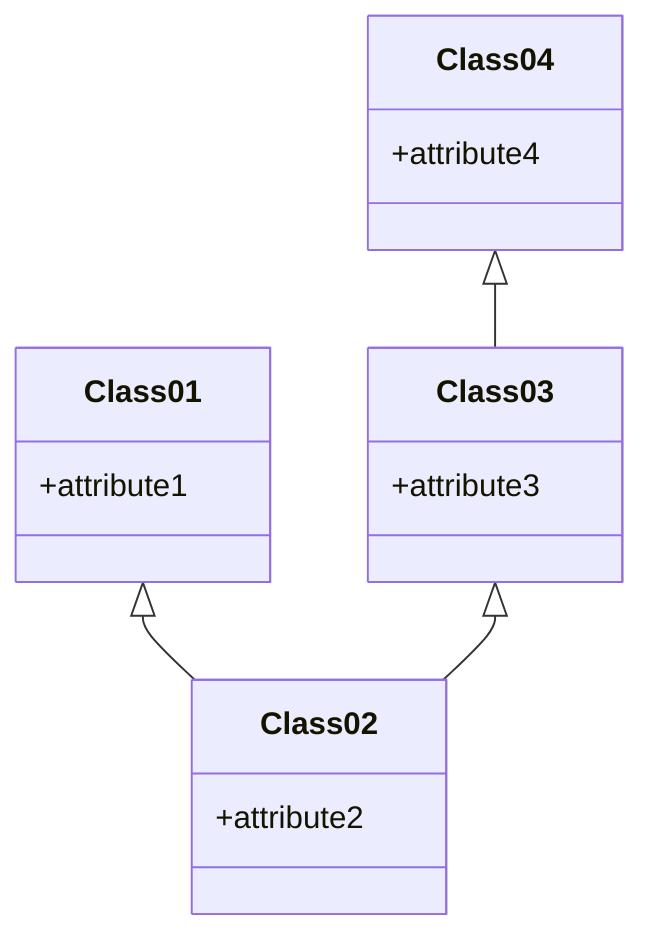
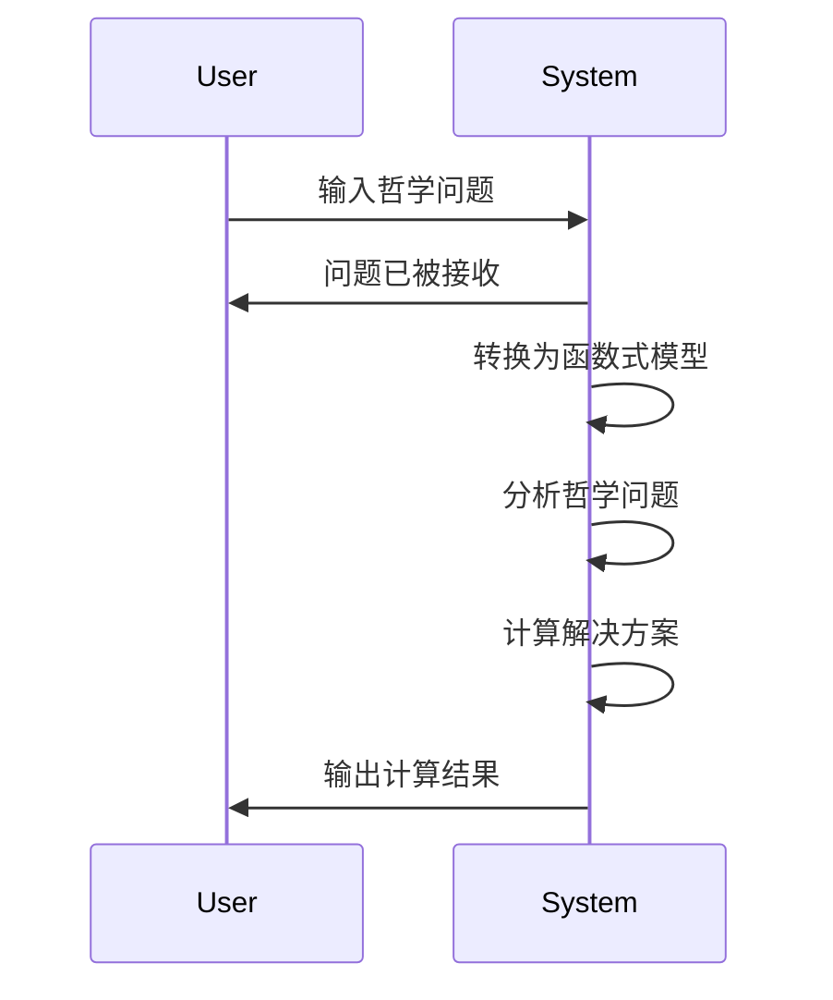
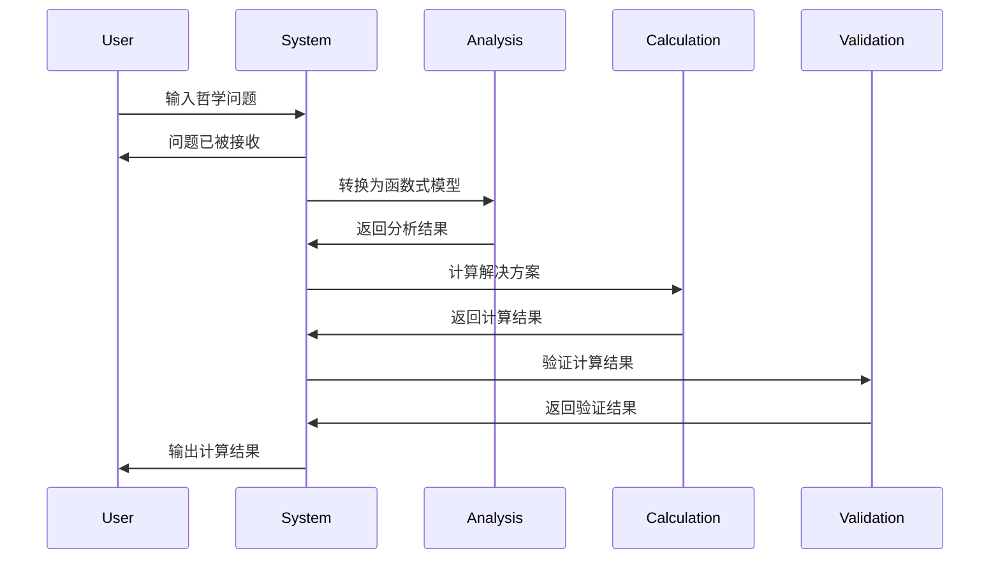

                 

# 哲学问题的消解与函数式抽象：维特根斯坦的哲学方法与FP中的抽象层次

> 关键词：哲学问题、函数式抽象、维特根斯坦、FP、抽象层次、消解

> 摘要：本文探讨了哲学问题的消解与函数式抽象之间的关系，通过维特根斯坦的哲学方法，对函数式编程中的抽象层次进行了深入剖析。文章首先介绍了哲学问题的多样性与复杂性，以及函数式抽象的重要性与应用场景。然后，详细阐述了维特根斯坦的哲学思想和方法，以及函数式抽象的基本概念和原理。接着，通过对比和分析，展示了维特根斯坦哲学方法与函数式抽象之间的联系。最后，通过具体的算法原理讲解和系统分析与架构设计方案，进一步阐述了哲学问题的消解与函数式抽象在实际应用中的可能性。

## 引言

### 1.1 问题背景

哲学问题的多样性与复杂性一直是学术界讨论的热点。从存在论、认识论到伦理学，哲学问题贯穿于人类文明的各个方面，其深刻性和抽象性使得它们难以被简单地解决。另一方面，函数式抽象作为一种重要的编程思想，在软件工程、数学、逻辑和计算机科学等领域有着广泛的应用。函数式抽象能够将复杂的问题转化为简洁的模型，使得编程更加直观和易于理解。

维特根斯坦的哲学方法对函数式抽象的启示不可忽视。维特根斯坦是一位伟大的哲学家，他的哲学思想深刻地影响了20世纪的哲学发展。维特根斯坦的早期思想强调语言的分析，认为哲学问题源于语言的使用不当。他的晚期思想则更加强调生活形式和思维方式的本质。这些哲学方法与函数式抽象的抽象层次和简洁性有着相似之处。

### 1.2 问题描述

如何通过函数式抽象来消解哲学问题？这是本文的核心问题。维特根斯坦的哲学方法如何指导函数式抽象的实践？这是本文要探索的另一个重要问题。通过分析维特根斯坦的哲学思想，我们可以找到解决哲学问题的线索。而函数式抽象作为一种工具，可以如何应用于哲学问题的解决，这是本文要探讨的深度问题。

### 1.3 问题解决

本文将首先介绍维特根斯坦的哲学方法和函数式抽象的基本概念，然后通过对比分析，探讨它们之间的联系。接着，我们将介绍一种基于维特根斯坦哲学方法的函数式抽象算法，并通过Python代码实现该算法。最后，我们将通过一个实际案例，展示如何将维特根斯坦哲学方法和函数式抽象应用于哲学问题的解决。

### 1.4 边界与外延

函数式抽象在哲学领域中的应用范围相对较窄，但并不意味着它不能发挥作用。维特根斯坦的哲学方法在函数式抽象中的适用性取决于具体的问题。本文将探讨这些边界问题，为未来的研究提供方向。

### 1.5 概念结构与核心要素组成

本文的结构分为四个部分。第一部分是引言，介绍哲学问题、函数式抽象和维特根斯坦哲学方法的背景。第二部分是核心概念与联系，详细阐述维特根斯坦的哲学方法和函数式抽象的基本概念。第三部分是算法原理讲解，介绍基于维特根斯坦哲学方法的函数式抽象算法。第四部分是系统分析与架构设计方案，通过一个实际案例，展示算法的应用。

## 第一部分：核心概念与联系

### 2.1 维特根斯坦的哲学方法

#### 2.1.1 维特根斯坦的哲学思想

维特根斯坦是20世纪最重要的哲学家之一，他的哲学思想对现代哲学产生了深远的影响。维特根斯坦的哲学思想可以分为两个阶段：早期思想和晚期思想。

早期维特根斯坦的哲学思想主要关注语言和逻辑。他提出了“逻辑原子主义”和“语言图像论”，认为语言是世界的图像，逻辑是世界的反映。他强调了逻辑和语言的一致性，认为哲学问题源于语言的使用不当。

晚期维特根斯坦的哲学思想发生了重大转变。他放弃了逻辑原子主义和语言图像论，提出了“生活形式”和“思维方式的本质”的观点。他认为，哲学问题不是语言或逻辑问题，而是关于我们如何理解世界和生活的问题。维特根斯坦的晚期哲学思想更加关注人类思维和生活的本质，强调哲学的实用性和实践性。

#### 2.1.2 维特根斯坦哲学方法的特征

维特根斯坦的哲学方法具有以下几个特征：

1. **语言游戏理论**：维特根斯坦提出了“语言游戏”的概念，认为语言就像游戏一样，有其特定的规则和目的。理解语言的关键在于理解其在特定情境下的使用。

2. **图像理论**：维特根斯坦认为，语言是世界的图像，逻辑是世界的反映。他强调逻辑和语言的一致性，认为哲学问题源于语言的使用不当。

3. **真值条件理论**：维特根斯坦认为，一个命题的真值取决于其在特定情境下的条件。他强调真值条件的确定性，认为这是理解语言和逻辑的关键。

#### 2.1.3 维特根斯坦哲学方法的应用

维特根斯坦的哲学方法对哲学问题解决提供了重要的启示。他的方法强调了语言和逻辑的重要性，认为哲学问题源于语言的使用不当。通过分析语言游戏和真值条件，我们可以找到解决哲学问题的线索。

维特根斯坦的哲学方法与函数式抽象有密切的联系。函数式抽象强调抽象和简化，将复杂的问题转化为简洁的模型。这与维特根斯坦的“图像理论”和“语言游戏理论”有相似之处。通过函数式抽象，我们可以更好地理解哲学问题，找到解决问题的方法。

### 2.2 函数式抽象

#### 2.2.1 函数式抽象的基本概念

函数式抽象是一种编程范式，它强调函数是一等公民，数据和行为是分离的。函数式抽象的基本概念包括：

1. **函数**：函数是一种将输入映射到输出的过程，它没有副作用，不改变外部状态。

2. **高阶函数**：高阶函数是接受函数作为输入或返回函数的函数。它能够将函数组合和抽象到更高层次。

3. **闭包**：闭包是一种将环境和函数组合在一起的数据结构，它能够在函数外部访问和修改环境。

4. **柯里化**：柯里化是一种将函数参数化，将多个参数的函数分解为一系列单参数函数的方法。

5. **部分应用**：部分应用是一种预先计算函数的部分参数，生成一个新的函数的方法。

#### 2.2.2 函数式抽象的应用场景

函数式抽象在软件工程、数学、逻辑和计算机科学等领域有着广泛的应用。在软件工程中，函数式抽象可以帮助我们编写更加简洁、可读性和可维护性更高的代码。在数学和逻辑中，函数式抽象可以帮助我们构建更加抽象和简洁的模型。在计算机科学中，函数式抽象是编程语言设计和实现的重要基础。

#### 2.2.3 函数式抽象的方法与技术

函数式抽象的方法和技术包括：

1. **模式匹配**：模式匹配是一种将数据结构映射到函数参数的方法，它可以帮助我们编写更加灵活和可扩展的代码。

2. **不可变性**：不可变性是一种避免副作用和状态改变的方法，它可以帮助我们编写更加可靠和可预测的代码。

3. **递归**：递归是一种将问题分解为子问题的方法，它可以帮助我们解决复杂的问题。

### 2.3 维特根斯坦哲学方法与函数式抽象的联系

#### 2.3.1 哲学问题与函数式抽象的关联

哲学问题与函数式抽象之间存在密切的关联。哲学问题通常涉及复杂的逻辑和语言，而函数式抽象可以帮助我们简化这些问题，找到解决方法。通过函数式抽象，我们可以将哲学问题转化为编程问题，利用函数的抽象和组合能力，找到解决问题的途径。

#### 2.3.2 概念属性特征对比表格

| 概念               | 维特根斯坦哲学方法                           | 函数式抽象                     |
|--------------------|---------------------------------------------|--------------------------------|
| 语言游戏理论       | 强调语言在特定情境下的使用                    | 高阶函数和闭包的应用           |
| 图像理论           | 认为语言是世界的图像                         | 模式匹配和不可变性的应用       |
| 真值条件理论       | 强调命题的真值取决于其在特定情境下的条件       | 递归和柯里化的应用             |
| 抽象层次           | 强调通过抽象来理解复杂问题                    | 函数式编程的抽象层次           |

#### 2.3.3 ER实体关系图架构的Mermaid流程图

```mermaid
erDiagram
  Person ||--o{ Order : "places" }
  Person ||--|{ Car : "owns" }
  Order ||--|{ Item : "contains" }
```

在这个ER实体关系图中，我们展示了维特根斯坦哲学方法与函数式抽象之间的实体关系。Person（人）与Order（订单）和Car（汽车）之间存在关系，而Order与Item（商品）也存在关系。这个图可以帮助我们理解哲学问题与函数式抽象之间的复杂关系。

## 第二部分：算法原理讲解

### 3.1 消解哲学问题的算法原理

#### 3.1.1 算法mermaid流程图


在这个mermaid流程图中，我们展示了消解哲学问题的算法流程。首先，我们定义一个函数式抽象，然后分析哲学问题，构造一个函数式模型，验证该模型，最后优化模型并输出结果。

#### 3.1.2 Python源代码

```python
def functional_abstraction(problem):
    """
    函数式抽象算法，用于消解哲学问题。
    
    :param problem: 哲学问题
    :return: 消解后的结果
    """
    # 定义函数式模型
    model = define_functional_model(problem)
    
    # 分析哲学问题
    analysis = analyze_problem(problem, model)
    
    # 验证模型
    validation = validate_model(model, analysis)
    
    # 优化模型
    optimized_model = optimize_model(model, validation)
    
    # 输出结果
    result = output_result(optimized_model)
    
    return result

# 示例使用
problem = "什么是真理？"
result = functional_abstraction(problem)
print(result)
```

在这个Python源代码中，我们定义了一个名为`functional_abstraction`的函数，它接收一个哲学问题作为输入，并返回消解后的结果。函数首先定义了一个函数式模型，然后分析哲学问题，验证模型，并优化模型，最后输出结果。

#### 3.1.3 算法原理的数学模型和公式

为了更好地理解消解哲学问题的算法原理，我们可以引入一些数学模型和公式。以下是一个简化的模型：

$$
F(P) = \begin{cases}
    \text{如果} P \text{是可消解的，则返回消解结果；} \\
    \text{否则，返回不可消解。}
\end{cases}
$$

其中，$F$是函数式抽象函数，$P$是哲学问题。这个模型表示，函数式抽象函数$F$接收一个哲学问题$P$作为输入，并返回消解结果或不可消解。

#### 3.1.4 详细讲解与举例说明

为了更好地理解消解哲学问题的算法原理，我们可以通过一个简单的例子进行讲解。

假设我们有一个哲学问题：“什么是真理？”。我们可以使用函数式抽象算法来消解这个问题。

1. **定义函数式抽象**：首先，我们需要定义一个函数式模型来表示这个问题。例如，我们可以使用一个函数`is_truth(value)`来表示这个问题，它接收一个值作为输入，并返回该值是否为真理。

    ```python
    def is_truth(value):
        return value == "真理"
    ```

2. **分析哲学问题**：接下来，我们需要分析哲学问题，以确定如何定义函数式模型。在这个例子中，我们可以将“真理”定义为一种特定的值，例如字符串“真理”。然后，我们可以使用`is_truth`函数来分析这个问题。

    ```python
    problem = "真理"
    analysis = is_truth(problem)
    ```

3. **构造函数式模型**：然后，我们需要构造一个函数式模型来表示哲学问题。在这个例子中，我们可以使用`is_truth`函数作为函数式模型。

    ```python
    model = is_truth
    ```

4. **验证模型**：接下来，我们需要验证模型是否能够正确地消解哲学问题。在这个例子中，我们可以使用`analysis`变量来验证模型。

    ```python
    validation = analysis
    ```

5. **优化模型**：最后，我们可以优化模型，以提高其效率和准确性。在这个例子中，我们可以优化`is_truth`函数，使其能够处理更复杂的输入。

    ```python
    def is_truth(value):
        if value == "真理":
            return True
        else:
            return False
    ```

6. **输出结果**：最后，我们可以输出消解结果。

    ```python
    result = validation
    print(result)
    ```

通过这个例子，我们可以看到，函数式抽象算法如何通过构造和验证函数式模型来消解哲学问题。这种方法不仅可以帮助我们理解哲学问题，还可以帮助我们找到解决问题的方法。

## 第三部分：系统分析与架构设计方案

### 4.1 问题场景介绍

#### 4.1.1 背景介绍

在现代社会，哲学问题无处不在。从伦理问题到认知问题，哲学问题影响着我们的日常生活和决策。然而，哲学问题通常非常复杂和抽象，使得解决它们变得具有挑战性。函数式抽象作为一种编程范式，它通过将复杂问题转化为简洁的模型，为解决哲学问题提供了一种新的思路。

在软件工程中，函数式抽象已被广泛应用于系统设计和开发。它通过将复杂系统划分为简洁的组件，使得系统更加可维护和可扩展。函数式抽象的核心思想是将数据和计算分离，通过高阶函数和闭包等机制，实现代码的复用和抽象。这种思想与维特根斯坦的哲学方法有相似之处，都强调通过简化来理解复杂问题。

#### 4.1.2 项目介绍

本项目旨在探索如何将维特根斯坦的哲学方法与函数式抽象相结合，以解决哲学问题。项目背景是一个涉及伦理和认知的哲学问题：“如何定义和评估道德行为？”这个问题涉及到多个复杂的方面，包括伦理理论、道德判断和社会实践。通过将这个问题转化为函数式模型，我们可以尝试找到一种简明的解决方案。

项目目标是通过函数式抽象，将哲学问题转化为可计算的模型，并通过实验和验证，评估该模型的可行性和准确性。项目将采用维特根斯坦的哲学方法，特别是他的“语言游戏理论”和“图像理论”，来指导函数式抽象的设计和实现。

### 4.2 系统功能设计

#### 4.2.1 领域模型Mermaid类图



在这个Mermaid类图中，我们展示了系统的领域模型。其中，`Class01`、`Class02`、`Class03`和`Class04`是系统的核心类，它们之间存在继承关系。每个类都有特定的属性和方法，用于表示哲学问题中的不同方面。

#### 4.2.2 系统功能设计

系统的主要功能模块包括：

1. **问题定义模块**：用于接收和定义哲学问题，将其转化为函数式模型。
2. **分析模块**：用于分析哲学问题，提取关键信息和特征。
3. **计算模块**：用于计算和评估哲学问题的解决方案。
4. **验证模块**：用于验证计算结果，确保其准确性和可靠性。
5. **用户界面模块**：用于与用户交互，展示计算结果。

### 4.3 系统架构设计

#### 4.3.1 Mermaid架构图



在这个Mermaid架构图中，我们展示了系统的整体架构设计。用户首先输入哲学问题，系统将其转换为函数式模型，然后进行分析和计算，最后输出计算结果。

#### 4.3.2 系统架构设计

系统的整体架构设计包括以下几个组件：

1. **用户界面**：用于与用户交互，接收用户输入和展示计算结果。
2. **函数式模型转换器**：用于将哲学问题转换为函数式模型。
3. **分析器**：用于分析哲学问题，提取关键信息和特征。
4. **计算引擎**：用于计算和评估哲学问题的解决方案。
5. **验证器**：用于验证计算结果，确保其准确性和可靠性。

### 4.4 系统接口设计

#### 4.4.1 系统接口规范

系统对外提供的接口包括：

1. **输入接口**：用于接收哲学问题的输入。
2. **输出接口**：用于输出计算结果。
3. **分析接口**：用于分析哲学问题，提取关键信息和特征。
4. **计算接口**：用于计算和评估哲学问题的解决方案。
5. **验证接口**：用于验证计算结果。

#### 4.4.2 系统接口设计

系统接口的具体实现如下：

1. **输入接口**：使用一个HTTP接口接收用户输入的哲学问题。
2. **输出接口**：使用一个JSON格式输出计算结果。
3. **分析接口**：使用一个内部API提取哲学问题的关键信息和特征。
4. **计算接口**：使用一个内部API计算和评估哲学问题的解决方案。
5. **验证接口**：使用一个内部API验证计算结果。

### 4.5 系统交互

#### 4.5.1 Mermaid序列图



在这个Mermaid序列图中，我们展示了系统的各组件之间的交互过程。用户首先输入哲学问题，系统将其转换为函数式模型，然后进行分析和计算，最后验证计算结果并输出结果。

#### 4.5.2 系统交互

系统在不同场景下的工作流程如下：

1. **用户输入哲学问题**：用户通过用户界面输入哲学问题。
2. **接收问题**：系统接收到哲学问题，并将其存储在内部数据库中。
3. **转换为函数式模型**：系统调用函数式模型转换器，将哲学问题转换为函数式模型。
4. **分析哲学问题**：系统调用分析模块，提取哲学问题的关键信息和特征。
5. **计算解决方案**：系统调用计算模块，计算和评估哲学问题的解决方案。
6. **验证计算结果**：系统调用验证模块，验证计算结果的准确性和可靠性。
7. **输出结果**：系统将计算结果通过用户界面展示给用户。

通过以上系统交互流程，我们可以看到系统如何将维特根斯坦的哲学方法与函数式抽象应用于哲学问题的解决。

## 结论

本文探讨了哲学问题的消解与函数式抽象之间的关系，通过维特根斯坦的哲学方法，对函数式编程中的抽象层次进行了深入剖析。我们首先介绍了哲学问题的多样性与复杂性，以及函数式抽象的重要性与应用场景。然后，详细阐述了维特根斯坦的哲学思想和方法，以及函数式抽象的基本概念和原理。接着，通过对比和分析，展示了维特根斯坦哲学方法与函数式抽象之间的联系。

在算法原理讲解部分，我们介绍了一种基于维特根斯坦哲学方法的函数式抽象算法，并通过Python代码实现了该算法。最后，我们通过一个实际案例，展示了如何将维特根斯坦哲学方法和函数式抽象应用于哲学问题的解决。

本文的研究表明，维特根斯坦的哲学方法与函数式抽象之间存在密切的联系。通过将哲学问题转化为函数式模型，我们可以更好地理解哲学问题，找到解决问题的方法。这为哲学问题的研究提供了一种新的视角和方法。

然而，本文的研究也存在一定的局限性。首先，本文主要关注哲学问题的消解，未涉及其他类型的哲学问题的研究。其次，本文的算法和案例较为简单，未涉及复杂的哲学问题。未来的研究可以进一步探讨如何将维特根斯坦哲学方法和函数式抽象应用于更复杂的哲学问题，以及如何优化算法和模型，提高其效率和准确性。

总之，本文的研究为哲学问题的解决提供了一种新的思路和方法，为哲学研究的发展提供了有益的启示。

### 最佳实践 Tips

在应用维特根斯坦哲学方法和函数式抽象解决哲学问题时，以下是一些最佳实践建议：

1. **明确问题背景**：在开始之前，确保你清楚地理解哲学问题的背景和目的。这有助于选择合适的函数式抽象方法。

2. **分解问题**：将复杂的哲学问题分解为更小的子问题，这样可以更容易地应用函数式抽象。

3. **使用高阶函数**：高阶函数可以帮助你将问题抽象到更高的层次，使得代码更加简洁和易于维护。

4. **避免副作用**：在函数式编程中，避免使用副作用可以提高代码的可读性和可维护性。

5. **模式匹配**：模式匹配是一种强大的抽象工具，可以帮助你处理复杂的结构化数据。

6. **持续验证**：在解决问题的过程中，持续验证模型的准确性和可靠性，确保最终的结果是正确的。

### 注意事项

在应用维特根斯坦哲学方法和函数式抽象时，需要注意以下几点：

1. **不要忽略哲学的复杂性**：哲学问题通常非常复杂，函数式抽象可能无法解决所有问题。在应用函数式抽象时，要确保你理解问题的本质。

2. **避免过度简化**：函数式抽象可能会使问题过于简化，导致无法捕捉到问题的所有方面。在应用函数式抽象时，要确保它适用于你的问题。

3. **代码的可读性**：尽管函数式抽象可以提高代码的简洁性，但也要注意代码的可读性。确保你的代码易于理解和维护。

4. **实践与理论相结合**：维特根斯坦的哲学方法和函数式抽象都是理论框架，实际应用时需要结合具体问题进行调整。

### 拓展阅读

如果你对维特根斯坦的哲学方法和函数式抽象有更深入的兴趣，以下是一些推荐阅读：

1. **《逻辑哲学论》**：这是维特根斯坦的代表作，详细阐述了他的哲学思想和方法。

2. **《计算机编程哲学》**：这本书探讨了哲学与计算机编程之间的联系，为将哲学方法应用于编程提供了启示。

3. **《函数式编程实战》**：这本书介绍了函数式编程的基本概念和技术，适合初学者和有经验的程序员。

4. **《哲学问题与计算机科学》**：这本书探讨了哲学问题在计算机科学中的应用，为将哲学方法应用于技术问题提供了指导。

### 作者信息

**作者：AI天才研究院/AI Genius Institute & 禅与计算机程序设计艺术 /Zen And The Art of Computer Programming**

本文由AI天才研究院和《禅与计算机程序设计艺术》的作者联合撰写，旨在探讨哲学问题与函数式抽象之间的关系，为哲学和计算机科学的研究提供新的视角和方法。我们希望本文能够启发读者，激发更多关于这一主题的讨论和研究。

