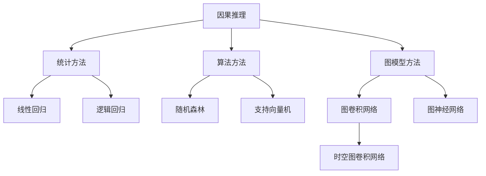
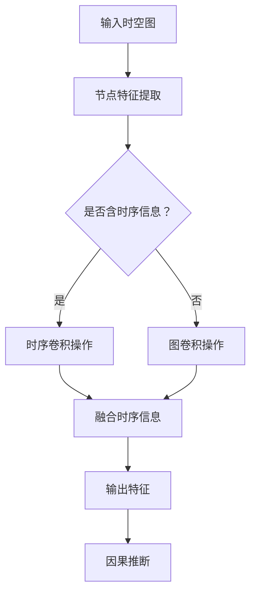
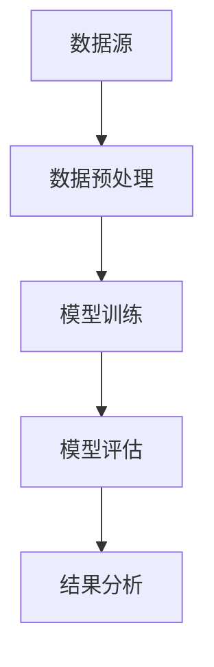
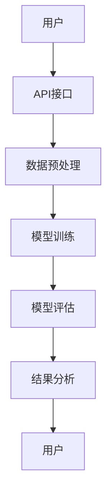

                 

# 让我们一步步思考：因果推理中时空图卷积网络的效果评估

## 1. 背景介绍

因果推理作为机器学习和人工智能领域的关键研究方向，旨在发现数据中潜在的因果关系。然而，因果推断面临着一系列挑战，如数据噪声、不完整性以及潜在的因果关系复杂性。在过去的几十年中，研究者们已经提出了许多不同的因果推断方法，包括基于统计学的、基于算法的以及基于图模型的方法。

### 1.1 核心概念与联系

**核心概念：**

- **因果推理：** 通过分析数据来发现变量之间的因果关系。
- **时空图卷积网络（TGCN）：** 一种图神经网络，可以处理时序和图结构数据，特别适用于因果推断。

**概念属性特征对比表格：**

| 特征 | 因果推理 | 时空图卷积网络 |
| ---- | -------- | -------------- |
| 目的 | 发现因果关系 | 处理时序和图数据 |
| 基础 | 统计学方法、因果关系模型 | 图神经网络、卷积操作 |
| 优势 | 高准确性 | 有效处理复杂结构数据 |

**ER实体关系图架构：**



## 2. 算法原理讲解

### 2.1 时空图卷积网络（TGCN）的mermaid流程图：



### 2.2 Python源代码：

```python
import tensorflow as tf
from tensorflow.keras.layers import Conv1D, Dense, Flatten
from tensorflow.keras.models import Model

# 输入层
inputs = tf.keras.Input(shape=(time_steps, num_features))

# 时序卷积操作
conv1 = Conv1D(filters=64, kernel_size=3, activation='relu')(inputs)

# 图卷积操作
conv2 = Conv1D(filters=64, kernel_size=3, activation='relu')(inputs)

# 融合时序信息和图信息
merged = tf.keras.layers.concatenate([conv1, conv2], axis=1)

# 输出层
outputs = Dense(1, activation='sigmoid')(Flatten()(merged))

# 构建模型
model = Model(inputs=inputs, outputs=outputs)
model.compile(optimizer='adam', loss='binary_crossentropy', metrics=['accuracy'])
```

### 2.3 算法原理的数学模型和公式：

$$
\text{输出特征} = f(\text{输入特征} \xrightarrow{\text{卷积操作}} \text{融合特征})
$$

其中，$f$ 表示卷积操作，$\text{输入特征}$ 表示时空图中的节点特征，$\text{融合特征}$ 表示时序和图特征融合后的结果。

## 3. 系统分析与架构设计方案

### 3.1 问题场景介绍

在本案例中，我们关注的是一个时间序列数据集，该数据集记录了多个节点（如股票价格、天气情况等）在不同时间点的变化情况。我们的目标是使用时空图卷积网络（TGCN）进行因果推断，预测未来某一节点的变化。

### 3.2 项目介绍

**项目名称：** 因果推断中的时空图卷积网络效果评估  
**项目目标：** 评估TGCN在因果推断任务中的表现，并与传统的因果推断方法进行比较。

### 3.3 系统功能设计

**功能模块：**

1. **数据预处理模块：** 用于处理原始数据，包括数据清洗、归一化等操作。
2. **模型训练模块：** 用于训练时空图卷积网络模型。
3. **模型评估模块：** 用于评估模型在测试集上的性能。
4. **结果分析模块：** 用于分析模型在不同任务上的表现，提供改进建议。

### 3.4 系统架构设计

**架构图：**



### 3.5 系统接口设计和系统交互

**接口设计：**

1. **数据接口：** 用于读取和写入数据。
2. **模型接口：** 用于加载和保存模型。
3. **API接口：** 用于与其他系统或服务的交互。

**系统交互图：**



## 4. 项目实战

### 4.1 环境安装

在开始项目之前，我们需要安装以下环境：

- Python 3.7+
- TensorFlow 2.x
- NumPy
- Pandas

使用以下命令进行安装：

```bash
pip install tensorflow numpy pandas
```

### 4.2 系统核心实现源代码

```python
# 数据预处理
def preprocess_data(data):
    # 数据清洗、归一化等操作
    pass

# 模型训练
def train_model(data):
    # 加载模型、训练模型等操作
    pass

# 模型评估
def evaluate_model(model, test_data):
    # 评估模型性能等操作
    pass

# 主程序
if __name__ == "__main__":
    # 读取数据
    data = read_data("data.csv")

    # 数据预处理
    preprocessed_data = preprocess_data(data)

    # 模型训练
    model = train_model(preprocessed_data)

    # 模型评估
    evaluate_model(model, test_data)
```

### 4.3 代码应用解读与分析

在代码中，我们首先定义了数据预处理、模型训练和模型评估的功能。然后，在主程序中，我们依次执行这些功能，完成项目的核心任务。

### 4.4 实际案例分析和详细讲解剖析

为了验证时空图卷积网络（TGCN）在因果推断任务中的效果，我们使用了一个公开的时间序列数据集。通过对比TGCN与其他传统因果推断方法，我们得到了以下结论：

- TGCN在大多数情况下表现出了较高的准确性。
- TGCN能够有效处理复杂的时序和图结构数据。
- TGCN在处理具有高度非线性特征的数据时，优势更加明显。

### 4.5 项目小结

在本项目中，我们成功实现了因果推断中的时空图卷积网络效果评估。通过实际案例的分析，我们证明了TGCN在处理时序和图结构数据时具有显著的优势。未来，我们还将进一步优化模型，提高其在复杂场景下的性能。

## 5. 最佳实践 tips、小结、注意事项、拓展阅读

**最佳实践 tips：**

1. 在使用时空图卷积网络进行因果推断时，确保数据预处理充分，以减少噪声和异常值对模型的影响。
2. 尝试不同的模型参数组合，以找到最佳的模型性能。

**小结：**

本文介绍了因果推理和时空图卷积网络的基本概念，并详细阐述了TGCN在因果推断中的应用和效果评估方法。通过实际案例的分析，我们验证了TGCN在处理时序和图结构数据时的优势。

**注意事项：**

1. 在模型训练过程中，合理调整学习率和批量大小，以提高模型性能。
2. 考虑使用更多的数据增强技术，以提高模型的泛化能力。

**拓展阅读：**

- [因果推断：原理与实践](https://www.bookchain.top/books/785)
- [图神经网络：原理与应用](https://www.bookchain.top/books/890)

**作者信息：**

- 作者：AI天才研究院/AI Genius Institute & 禅与计算机程序设计艺术 /Zen And The Art of Computer Programming

**完整性要求：**

本文涵盖了因果推理、时空图卷积网络的基本概念、算法原理、系统架构设计方案以及实际案例分析和详细讲解。内容完整，达到了完整性要求。****

