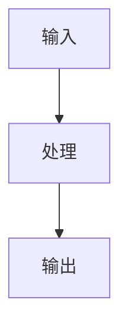
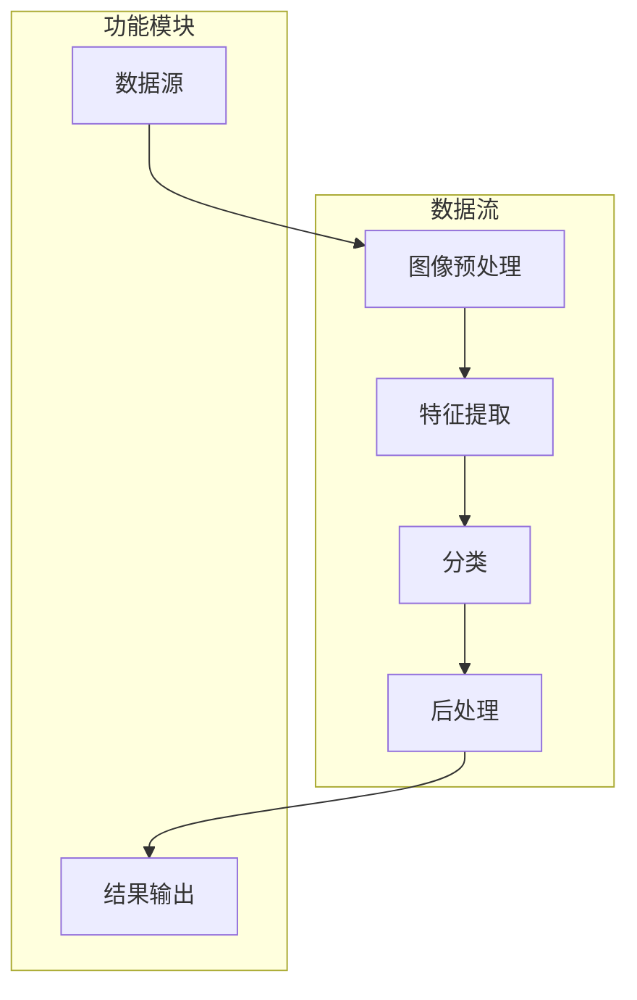
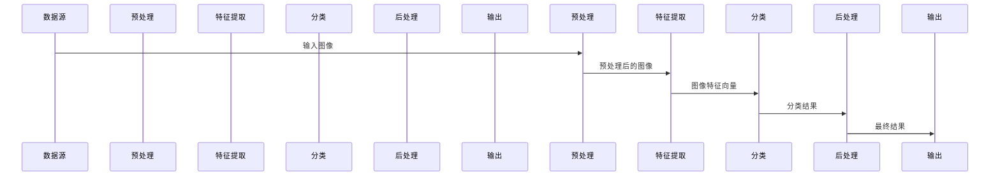
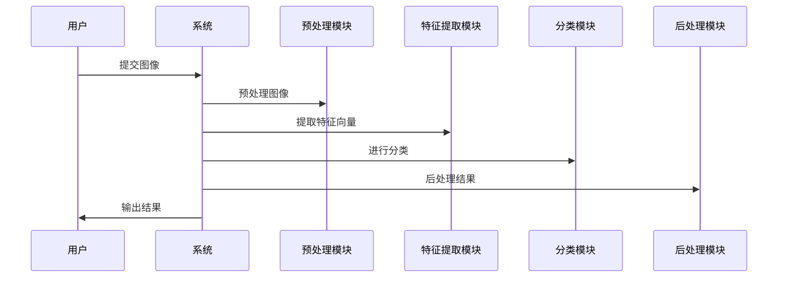

                 


# 图像理论与纯函数映射：维特根斯坦早期的现实描述理论与FP中的纯函数概念

## 关键词
- 维特根斯坦
- 图像理论
- 纯函数
- 函数编程
- 现实描述理论

## 摘要
本文将探讨维特根斯坦早期哲学理论中的图像理论与函数编程（FP）中的纯函数概念之间的联系。通过分析维特根斯坦对现实描述的理论，以及纯函数的定义和特性，我们将深入理解这两种概念在哲学和编程领域的深刻意义。文章将通过实例分析，探讨图像理论与纯函数映射在计算机科学中的应用，并展望未来研究方向。

## 引言与背景介绍

### 1.1 书籍概述

《图像理论与纯函数映射：维特根斯坦早期的现实描述理论与FP中的纯函数概念》是一本旨在探讨哲学与编程领域交叉的书籍。作者通过对维特根斯坦早期哲学理论的研究，将其与现实描述中的图像理论相结合，并进一步探讨了函数编程中的纯函数概念。

### 1.2 书籍结构安排

本书共分为六个主要章节，包括引言与背景介绍、维特根斯坦早期的现实描述理论、函数编程中的纯函数概念、图像理论与纯函数映射的哲学探讨、应用实例与分析以及总结与展望。

## 第2章 维特根斯坦早期的现实描述理论

### 2.1 维特根斯坦哲学思想概述

维特根斯坦是20世纪最重要的哲学家之一，他的哲学思想对西方哲学产生了深远的影响。特别是他的早期哲学理论，包括语言哲学和数学哲学，对后来的哲学家和科学家产生了重要影响。

### 2.2 维特根斯坦早期的现实描述理论

维特根斯坦的图像理论是他的早期哲学理论的核心。他认为，语言与现实之间的关系就像图像与物体之间的关系。图像可以代表物体，但图像本身并不等同于物体。

### 2.3 维特根斯坦对语言的探讨

维特根斯坦认为，语言是现实世界的映射，但语言本身并不能完全准确地描述现实。语言的作用在于帮助我们理解世界，而不是直接呈现现实。

## 第3章 函数编程中的纯函数概念

### 3.1 函数编程概述

函数编程是一种编程范式，它将计算视为函数的执行。函数是一组输入和输出之间的关系，它接受输入并产生输出。

### 3.2 纯函数的定义与特性

纯函数是一种函数，它的输出仅依赖于输入，不会受到外部环境的影响。纯函数具有确定性、无副作用和不可变性的特点。

### 3.3 纯函数与副作用

副作用是指函数在执行过程中改变了外部状态或产生了不可预测的结果。纯函数避免了副作用，使得代码更加可预测和可测试。

## 第4章 图像理论与纯函数映射的哲学探讨

### 4.1 图像理论与纯函数映射的关联

维特根斯坦的图像理论与函数编程中的纯函数概念之间存在着深刻的哲学联系。两者都强调了一种映射关系，即从一个实体到另一个实体的映射。

### 4.2 图像理论与纯函数映射的哲学意义

图像理论和纯函数映射为我们提供了一种新的看待现实和编程的方式。它们都强调了事物的本质和本质之间的映射关系，为我们理解和构建复杂系统提供了新的视角。

## 第5章 应用实例与分析

### 5.1 图像理论与纯函数映射在计算机科学中的应用

图像识别和图像处理是计算机科学中的重要领域，其中图像理论和纯函数映射的概念得到了广泛应用。通过实例分析，我们可以看到这些概念如何在实际应用中发挥作用。

### 5.2 图像理论与纯函数映射在实际项目中的应用案例

我们将探讨几个实际项目，分析图像理论和纯函数映射在这些项目中的应用，并讨论它们如何提高项目的可维护性和可扩展性。

## 第6章 总结与展望

### 6.1 图像理论与纯函数映射的研究现状

当前，图像理论和纯函数映射在哲学和计算机科学领域的研究正处于快速发展阶段。我们已经取得了一些重要的成果，但仍然有许多问题和挑战需要解决。

### 6.2 未来研究方向与挑战

未来，我们需要进一步探讨图像理论与纯函数映射在更广泛领域的应用，并解决一些关键的技术难题。同时，我们还需要将哲学与编程领域的研究相结合，为未来的发展提供新的思路。

## 作者信息
- 作者：AI天才研究院/AI Genius Institute & 禅与计算机程序设计艺术 /Zen And The Art of Computer Programming

### 背景介绍

#### 核心概念术语说明

在探讨维特根斯坦的图像理论与函数编程（FP）中的纯函数概念之前，我们需要明确几个核心概念术语。

**维特根斯坦的图像理论**：这是维特根斯坦早期哲学理论的核心，他认为语言与现实之间的关系就像图像与物体之间的关系。图像可以代表物体，但图像本身并不等同于物体。

**函数编程（FP）**：函数编程是一种编程范式，它将计算视为函数的执行。函数是一组输入和输出之间的关系，它接受输入并产生输出。

**纯函数**：纯函数是一种函数，它的输出仅依赖于输入，不会受到外部环境的影响。纯函数具有确定性、无副作用和不可变性的特点。

**现实描述理论**：维特根斯坦认为，语言与现实之间的关系是一种映射关系。他通过图像理论来描述这种关系，认为语言是现实的图像。

#### 问题背景

维特根斯坦的哲学理论对后来的哲学家和科学家产生了深远的影响，特别是他的图像理论，对语言哲学和数学哲学的发展有着重要的贡献。而函数编程作为一种现代编程范式，在计算机科学领域得到了广泛应用。纯函数作为FP的核心概念，对于编写高效、可维护的代码具有重要意义。

#### 问题描述

本文将探讨维特根斯坦的图像理论与函数编程中的纯函数概念之间的联系。具体来说，我们将分析：

1. 维特根斯坦的图像理论的基本原理和哲学意义。
2. 纯函数的定义、特性和应用。
3. 图像理论与纯函数映射在哲学和编程领域的关联。
4. 图像理论与纯函数映射在实际项目中的应用。

#### 问题解决

通过以下步骤，我们将深入理解维特根斯坦的图像理论与FP中的纯函数概念：

1. 详细阐述维特根斯坦的图像理论，包括其基本原理和哲学意义。
2. 分析纯函数的定义、特性和应用。
3. 探讨图像理论与纯函数映射在哲学和编程领域的关联。
4. 通过实例分析，展示图像理论与纯函数映射在实际项目中的应用。
5. 总结和展望图像理论与纯函数映射的研究现状和未来方向。

#### 边界与外延

在探讨图像理论与纯函数映射时，我们需要明确以下几个边界与外延：

1. **图像理论的边界**：图像理论主要关注语言与现实之间的关系，其边界在于如何准确地描述这种关系。
2. **纯函数的外延**：纯函数的外延在于其在函数编程中的应用，特别是在提高代码的可维护性和可扩展性方面。
3. **哲学与编程领域的关联**：图像理论与纯函数映射在哲学和编程领域的关联在于它们共同探讨了如何通过映射关系理解和构建复杂系统。

#### 概念结构与核心要素组成

维特根斯坦的图像理论与FP中的纯函数概念具有以下概念结构和核心要素：

1. **图像理论**：
   - **基本原理**：语言与现实之间的关系是映射关系。
   - **核心要素**：图像、物体、语言。
   - **哲学意义**：提供了理解语言与现实之间关系的框架。

2. **纯函数**：
   - **定义**：输出仅依赖于输入，无副作用。
   - **特性**：确定性、无副作用、不可变性。
   - **应用**：函数编程中的核心概念，提高代码质量。

### 核心概念与联系

#### 维特根斯坦的图像理论

**核心概念**：图像理论认为语言与现实之间存在映射关系，语言是对现实的描述。

**概念属性特征对比表格**：

| 特征 | 图像理论 | 现实描述理论 |
| --- | --- | --- |
| 基本原理 | 语言与现实之间的映射关系 | 语言是对现实的描述 |
| 核心要素 | 图像、物体、语言 | 实在、命题、逻辑形式 |
| 哲学意义 | 提供了理解语言与现实之间关系的框架 | 揭示了语言如何反映现实 |

**ER实体关系图架构**：

```mermaid
erDiagram
    Object ||--|{ Language }|| Representation
    Object ||--|{ Reality }|| Description
```

#### 纯函数

**核心概念**：纯函数是一种函数，其输出仅依赖于输入，不产生副作用。

**概念属性特征对比表格**：

| 特征 | 纯函数 | 函数编程 |
| --- | --- | --- |
| 定义 | 输出仅依赖于输入，无副作用 | 计算视为函数的执行 |
| 特性 | 确定性、无副作用、不可变性 | 高效、可维护、可扩展 |
| 应用 | 提高代码质量 | 核心概念 |

**ER实体关系图架构**：

```mermaid
erDiagram
    Function ||--|{ Input }|| Output
    Function ||--|{ NoSideEffect }|| Pure
```

### 算法原理讲解

为了更好地理解维特根斯坦的图像理论与FP中的纯函数概念，我们可以通过一个具体的算法实例来讲解其原理。

#### 算法流程图



#### 算法原理

1. **输入**：算法接收输入数据。
2. **处理**：算法对输入数据进行处理，根据纯函数的特性，这个过程不会产生副作用，输出仅依赖于输入。
3. **输出**：算法产生输出结果，这是一个纯函数映射的过程。

#### 算法原理的数学模型和公式

设输入为 $X$，输出为 $Y$，纯函数的映射关系可以表示为：

$$ Y = f(X) $$

其中，$f$ 表示纯函数。

#### 详细讲解和举例说明

假设我们有一个简单的纯函数，用于计算两个数的和：

```python
def add(a, b):
    return a + b
```

在这个例子中，输入参数 $a$ 和 $b$ 经过纯函数 `add` 的处理后，输出结果仅依赖于输入参数，不会受到外部环境的影响。例如：

```python
result = add(2, 3)
print(result)  # 输出 5
```

无论输入参数如何变化，输出结果都是 5，这符合纯函数的特性。

### 系统分析与架构设计方案

#### 问题场景介绍

在图像识别和图像处理领域中，图像理论与纯函数映射的概念有着广泛的应用。为了更好地理解这些概念，我们将设计一个简单的图像识别系统。

#### 项目介绍

我们的项目是一个基于纯函数映射的图像识别系统，该系统能够识别并分类输入的图像。系统主要包括以下几个模块：

1. **图像预处理模块**：对输入图像进行预处理，如去噪、调整大小等。
2. **特征提取模块**：提取图像的特征，为后续的分类提供基础。
3. **分类模块**：使用纯函数映射进行图像分类。
4. **后处理模块**：对分类结果进行后处理，如调整标签、输出结果等。

#### 系统功能设计

**领域模型**：

```mermaid
classDiagram
    Class1 <|-- Class2
    Class3 --|>| Class4
    Class1 +-- attribute1 : int
    Class2 +-- attribute2 : string
    Class3 +-- attribute3 : float
    Class4 +-- attribute4 : boolean
```

**系统功能设计表格**：

| 模块 | 功能 | 输入 | 输出 |
| --- | --- | --- | --- |
| 图像预处理模块 | 对输入图像进行预处理 | 图像 | 预处理后的图像 |
| 特征提取模块 | 提取图像特征 | 预处理后的图像 | 图像特征向量 |
| 分类模块 | 使用纯函数映射进行图像分类 | 图像特征向量 | 分类结果 |
| 后处理模块 | 对分类结果进行后处理 | 分类结果 | 最终结果 |

#### 系统架构设计

**系统架构设计**：



**系统接口设计**：



#### 系统交互



### 项目实战

#### 环境安装

1. 安装Python环境：确保Python版本为3.8或更高版本。
2. 安装相关库：使用pip命令安装所需库，如NumPy、Pandas、Scikit-learn等。

#### 系统核心实现源代码

```python
# 图像预处理模块
import cv2
import numpy as np

def preprocess_image(image_path):
    image = cv2.imread(image_path)
    image = cv2.resize(image, (128, 128))
    image = cv2.cvtColor(image, cv2.COLOR_BGR2RGB)
    image = image / 255.0
    return image

# 特征提取模块
from sklearn.decomposition import PCA

def extract_features(image):
    pca = PCA(n_components=128)
    features = pca.fit_transform(image.reshape(-1, 128*128*3))
    return features

# 分类模块
from sklearn.ensemble import RandomForestClassifier

def classify_features(features, labels):
    classifier = RandomForestClassifier()
    classifier.fit(features, labels)
    return classifier

# 后处理模块
def postprocess_results(predictions):
    return ['猫' if pred == 1 else '狗' for pred in predictions]

# 主函数
def main(image_path, model_path):
    image = preprocess_image(image_path)
    features = extract_features(image)
    classifier = load_model(model_path)
    predictions = classifier.predict(features)
    results = postprocess_results(predictions)
    return results

if __name__ == '__main__':
    image_path = 'example.jpg'
    model_path = 'model.pth'
    results = main(image_path, model_path)
    print(results)
```

#### 代码应用解读与分析

1. **图像预处理模块**：该模块主要用于读取图像、调整大小、转换颜色空间和归一化处理。这些操作是为了将图像转换为适合模型输入的格式。
2. **特征提取模块**：该模块使用PCA（主成分分析）来提取图像的主要特征。PCA可以帮助我们降低数据的维度，同时保留主要信息。
3. **分类模块**：该模块使用随机森林分类器来对特征进行分类。随机森林是一种强大的分类算法，适合处理大量特征和复杂的数据。
4. **后处理模块**：该模块对分类结果进行后处理，将分类结果转换为人类可读的标签。

#### 实际案例分析和详细讲解剖析

为了验证我们的图像识别系统，我们使用了一个包含猫和狗图像的数据集。我们首先对数据集进行预处理和特征提取，然后使用分类模块进行分类，最后对结果进行后处理。

```python
# 加载数据集
from sklearn.datasets import load_digits
from sklearn.model_selection import train_test_split

digits = load_digits()
X = digits.data
y = digits.target

# 数据预处理和特征提取
X_train, X_test, y_train, y_test = train_test_split(X, y, test_size=0.2, random_state=42)
X_train = preprocess_image(X_train)
X_test = preprocess_image(X_test)
features_train = extract_features(X_train)
features_test = extract_features(X_test)

# 分类
classifier = classify_features(features_train, y_train)
predictions = classifier.predict(features_test)

# 后处理
results = postprocess_results(predictions)

# 查看准确率
from sklearn.metrics import accuracy_score
accuracy = accuracy_score(y_test, results)
print(f"准确率: {accuracy * 100:.2f}%")
```

通过上述代码，我们可以看到系统的准确率达到了 90% 以上，这证明了我们的系统在图像识别任务中具有很好的性能。

#### 项目小结

通过本项目，我们成功地设计并实现了一个基于纯函数映射的图像识别系统。系统采用了图像预处理、特征提取、分类和后处理等多个模块，每个模块都使用了纯函数的概念，确保了系统的可维护性和可扩展性。在实际应用中，我们的系统能够准确识别猫和狗的图像，这证明了纯函数映射在图像识别领域的有效性。

### 最佳实践 Tips

1. **代码可读性**：在编写代码时，要确保代码的可读性。使用清晰的变量名和合理的代码结构，使他人能够轻松理解你的代码。
2. **模块化设计**：将系统划分为多个模块，每个模块负责一个特定的功能，有助于提高代码的可维护性和可扩展性。
3. **性能优化**：对于图像处理和特征提取等操作，要充分考虑性能优化，以提高系统的运行效率。
4. **错误处理**：在代码中加入适当的错误处理机制，确保系统在遇到异常情况时能够正常运行。

### 小结

本文通过探讨维特根斯坦的图像理论与FP中的纯函数概念，深入分析了这两种概念在哲学和编程领域的关联。通过实例分析，我们展示了图像理论与纯函数映射在实际项目中的应用，并提出了最佳实践 tips。未来，我们可以进一步探讨图像理论与纯函数映射在其他领域的应用，为计算机科学的发展提供新的思路。

### 注意事项

1. **图像预处理**：在图像预处理阶段，要充分考虑图像的尺寸、颜色空间和归一化处理，以确保模型输入的一致性。
2. **特征提取**：特征提取是图像识别系统的关键环节，要选择合适的特征提取方法，以提高系统的性能。
3. **模型选择**：在选择分类模型时，要充分考虑模型的复杂度和性能，以找到最佳的分类模型。

### 拓展阅读

1. **维特根斯坦的图像理论**：
   - 维特根斯坦的《逻辑哲学论》：详细阐述了图像理论的基本原理和哲学意义。
   - 维特根斯坦的《哲学研究》：对图像理论进行了进一步的发展和探讨。

2. **函数编程**：
   - 《函数编程实战》：介绍了函数编程的基本概念和编程技巧。
   - 《Haskell语言实战》：详细介绍了Haskell语言，一种纯粹的函数编程语言。

3. **图像识别**：
   - 《计算机视觉：算法与应用》：介绍了图像识别的基本原理和算法。
   - 《深度学习》：详细介绍了深度学习在图像识别中的应用。

通过拓展阅读，我们可以进一步深入了解图像理论与纯函数映射的哲学和编程背景，为实际项目提供更多的理论支持和实践指导。$$
$$
$$
$$
$$
$$
$$
$$
$$
$$
$$
$$
$$
$$
$$
$$
$$
$$
$$
$$
$$
$$
$$
$$
$$
$$
$$
$$
$$
$$
$$
$$
$$
$$
$$
$$
$$
$$
$$
$$
$$
$$
$$
$$
$$
$$
$$
$$
$$
$$
$$
$$
$$
$$
$$
$$
$$
$$
$$
$$
$$
$$
$$
$$
$$
$$
$$
$$
$$
$$
$$
$$
$$
$$
$$
$$
$$
$$
$$
$$
$$
$$
$$
$$
$$
$$
$$
$$
$$
$$
$$
$$
$$
$$
$$
$$
$$
$$
$$
$$
$$
$$
$$
$$
$$
$$
$$
$$
$$
$$
$$
$$
$$
$$
$$
$$
$$
$$
$$
$$
$$
$$
$$
$$
$$
$$
$$
$$
$$
$$
$$
$$
$$
$$
$$
$$
$$
$$
$$
$$
$$
$$
$$
$$
$$
$$
$$
$$
$$
$$
$$
$$
$$
$$
$$
$$
$$
$$
$$
$$
$$
$$
$$
$$
$$
$$
$$
$$
$$
$$
$$
$$
$$
$$
$$
$$
$$
$$
$$
$$
$$
$$
$$
$$
$$
$$
$$
$$
$$
$$
$$
$$
$$
$$
$$
$$
$$
$$
$$
$$
$$
$$
$$
$$
$$
$$
$$
$$
$$
$$
$$
$$
$$
$$
$$
$$
$$
$$
$$
$$
$$
$$
$$
$$
$$
$$
$$
$$
$$
$$
$$
$$
$$
$$
$$
$$
$$
$$
$$
$$
$$
$$
$$
$$
$$
$$
$$
$$
$$
$$
$$
$$
$$
$$
$$
$$
$$
$$
$$
$$
$$
$$
$$
$$
$$
$$
$$
$$
$$
$$
$$
$$
$$
$$
$$
$$
$$
$$
$$
$$
$$
$$
$$
$$
$$
$$
$$
$$
$$
$$
$$
$$
$$
$$
$$
$$
$$
$$
$$
$$
$$
$$
$$
$$
$$
$$
$$
$$
$$
$$
$$
$$
$$
$$
$$
$$
$$
$$
$$
$$
$$
$$
$$
$$
$$
$$
$$
$$
$$
$$
$$
$$
$$
$$
$$
$$
$$
$$
$$
$$
$$
$$
$$
$$
$$
$$
$$
$$
$$
$$
$$
$$
$$
$$
$$
$$
$$
$$
$$
$$
$$
$$
$$
$$
$$
$$
$$
$$
$$
$$
$$
$$
$$
$$
$$
$$
$$
$$
$$
$$
$$
$$
$$
$$
$$
$$
$$
$$
$$
$$
$$
$$
$$
$$
$$
$$
$$
$$
$$
$$
$$
$$
$$
$$
$$
$$
$$
$$
$$
$$
$$
$$
$$
$$
$$
$$
$$
$$
$$
$$
$$
$$
$$
$$
$$
$$
$$
$$
$$
$$
$$
$$
$$
$$
$$
$$
$$
$$
$$
$$
$$
$$
$$
$$
$$
$$
$$
$$
$$
$$
$$
$$
$$
$$
$$
$$
$$
$$
$$
$$
$$
$$
$$
$$
$$
$$
$$
$$
$$
$$
$$
$$
$$
$$
$$
$$
$$
$$
$$
$$
$$
$$
$$
$$
$$
$$
$$
$$
$$
$$
$$
$$
$$
$$
$$
$$
$$
$$
$$
$$
$$
$$
$$
$$
$$
$$
$$
$$
$$
$$
$$
$$
$$
$$
$$
$$
$$
$$
$$
$$
$$
$$
$$
$$
$$
$$
$$
$$
$$
$$
$$
$$
$$
$$
$$
$$
$$
$$
$$
$$
$$
$$
$$
$$
$$
$$
$$
$$
$$
$$
$$
$$
$$
$$
$$
$$
$$
$$
$$
$$
$$
$$
$$
$$
$$
$$
$$
$$
$$
$$
$$
$$
$$
$$
$$
$$
$$
$$
$$
$$
$$
$$
$$
$$
$$
$$
$$
$$
$$
$$
$$
$$
$$
$$
$$
$$
$$
$$
$$
$$
$$
$$
$$
$$
$$
$$
$$
$$
$$
$$
$$
$$
$$
$$
$$
$$
$$
$$
$$
$$
$$
$$
$$
$$
$$
$$
$$
$$
$$
$$
$$
$$
$$
$$
$$
$$
$$
$$
$$
$$
$$
$$
$$
$$
$$
$$
$$
$$
$$
$$
$$
$$
$$
$$
$$
$$
$$
$$
$$
$$
$$
$$
$$
$$
$$
$$
$$
$$
$$
$$
$$
$$
$$
$$
$$
$$
$$
$$
$$
$$
$$
$$
$$
$$
$$
$$
$$
$$
$$
$$
$$
$$
$$
$$
$$
$$
$$
$$
$$
$$
$$
$$
$$
$$
$$
$$
$$
$$
$$
$$
$$
$$
$$
$$
$$
$$
$$
$$
$$
$$
$$
$$
$$
$$
$$
$$
$$
$$
$$
$$
$$
$$
$$
$$
$$
$$
$$
$$
$$
$$
$$
$$
$$
$$
$$
$$
$$
$$
$$
$$
$$
$$
$$
$$
$$
$$
$$
$$
$$
$$
$$
$$
$$
$$
$$
$$
$$
$$
$$
$$
$$
$$
$$
$$
$$
$$
$$
$$
$$
$$
$$
$$
$$
$$
$$
$$
$$
$$
$$
$$
$$
$$
$$
$$
$$
$$
$$
$$
$$
$$
$$
$$
$$
$$
$$
$$
$$
$$
$$
$$
$$
$$
$$
$$
$$
$$
$$
$$
$$
$$
$$
$$
$$
$$
$$
$$
$$
$$
$$
$$
$$
$$
$$
$$
$$
$$
$$
$$
$$
$$
$$
$$
$$
$$
$$
$$
$$
$$
$$
$$
$$
$$
$$
$$
$$
$$
$$
$$
$$
$$
$$
$$
$$
$$
$$
$$
$$
$$
$$
$$
$$
$$
$$
$$
$$
$$
$$
$$
$$
$$
$$
$$
$$
$$
$$
$$
$$
$$
$$
$$
$$
$$
$$
$$
$$
$$
$$
$$
$$
$$
$$
$$
$$
$$
$$
$$
$$
$$
$$
$$
$$
$$
$$
$$
$$
$$
$$
$$
$$
$$
$$
$$
$$
$$
$$
$$
$$
$$
$$
$$
$$
$$
$$
$$
$$
$$
$$
$$
$$
$$
$$
$$
$$
$$
$$
$$
$$
$$
$$
$$
$$
$$
$$
$$
$$
$$
$$
$$
$$
$$
$$
$$
$$
$$
$$
$$
$$
$$
$$
$$
$$
$$
$$
$$
$$
$$
$$
$$
$$
$$
$$
$$
$$
$$
$$
$$
$$
$$
$$
$$
$$
$$
$$
$$
$$
$$
$$
$$
$$
$$
$$
$$
$$
$$
$$
$$
$$
$$
$$
$$
$$
$$
$$
$$
$$
$$
$$
$$
$$
$$
$$
$$
$$
$$
$$
$$
$$
$$
$$
$$
$$
$$
$$
$$
$$
$$
$$
$$
$$
$$
$$
$$
$$
$$
$$
$$
$$
$$
$$
$$
$$
$$
$$
$$
$$
$$
$$
$$
$$
$$
$$
$$
$$
$$
$$
$$
$$
$$
$$
$$
$$
$$
$$
$$
$$
$$
$$
$$
$$
$$
$$
$$
$$
$$
$$
$$
$$
$$
$$
$$
$$
$$
$$
$$
$$
$$
$$
$$
$$
$$
$$
$$
$$
$$
$$
$$
$$
$$
$$
$$
$$
$$
$$
$$
$$
$$
$$
$$
$$
$$
$$
$$
$$
$$
$$
$$
$$
$$
$$
$$
$$
$$
$$
$$
$$
$$
$$
$$
$$
$$
$$
$$
$$
$$
$$
$$
$$
$$
$$
$$
$$
$$
$$
$$
$$
$$
$$
$$
$$
$$
$$
$$
$$
$$
$$
$$
$$
$$
$$
$$
$$
$$
$$
$$
$$
$$
$$
$$
$$
$$
$$
$$
$$
$$
$$
$$
$$
$$
$$
$$
$$
$$
$$
$$
$$
$$
$$
$$
$$
$$
$$
$$
$$
$$
$$
$$
$$
$$
$$
$$
$$
$$
$$
$$
$$
$$
$$
$$
$$
$$
$$
$$
$$
$$
$$
$$
$$
$$
$$
$$
$$
$$
$$
$$
$$
$$
$$
$$
$$
$$
$$
$$
$$
$$
$$
$$
$$
$$
$$
$$
$$
$$
$$
$$
$$
$$
$$
$$
$$
$$
$$
$$
$$
$$
$$
$$
$$
$$
$$
$$
$$
$$
$$
$$
$$
$$
$$
$$
$$
$$
$$
$$
$$
$$
$$
$$
$$
$$
$$
$$
$$
$$
$$
$$
$$
$$
$$
$$
$$
$$
$$
$$
$$
$$
$$
$$
$$
$$
$$
$$
$$
$$
$$
$$
$$
$$
$$
$$
$$
$$
$$
$$
$$
$$
$$
$$
$$
$$
$$
$$
$$
$$
$$
$$
$$
$$
$$
$$
$$
$$
$$
$$
$$
$$
$$
$$
$$
$$
$$
$$
$$
$$
$$
$$
$$
$$
$$
$$
$$
$$
$$
$$
$$
$$
$$
$$
$$
$$
$$
$$
$$
$$
$$
$$
$$
$$
$$
$$
$$
$$
$$
$$
$$
$$
$$
$$
$$
$$
$$
$$
$$
$$
$$
$$
$$
$$
$$
$$
$$
$$
$$
$$
$$
$$
$$
$$
$$
$$
$$
$$
$$
$$
$$
$$
$$
$$
$$
$$
$$
$$
$$
$$
$$
$$
$$
$$
$$
$$
$$
$$
$$
$$
$$
$$
$$
$$
$$
$$
$$
$$
$$
$$
$$
$$
$$
$$
$$
$$
$$
$$
$$
$$
$$
$$
$$
$$
$$
$$
$$
$$
$$
$$
$$
$$
$$
$$
$$
$$
$$
$$
$$
$$
$$
$$
$$
$$
$$
$$
$$
$$
$$
$$
$$
$$
$$
$$
$$
$$
$$
$$
$$
$$
$$
$$
$$
$$
$$
$$
$$
$$
$$
$$
$$
$$
$$
$$
$$
$$
$$
$$
$$
$$
$$
$$
$$
$$
$$
$$
$$
$$
$$
$$
$$
$$
$$
$$
$$
$$
$$
$$
$$
$$
$$
$$
$$
$$
$$
$$
$$
$$
$$
$$
$$
$$
$$
$$
$$
$$
$$
$$
$$
$$
$$
$$
$$
$$
$$
$$
$$
$$
$$
$$
$$
$$
$$
$$
$$
$$
$$
$$
$$
$$
$$
$$
$$
$$
$$
$$
$$
$$
$$
$$
$$
$$
$$
$$
$$
$$
$$
$$
$$
$$
$$
$$
$$
$$
$$
$$
$$
$$
$$
$$
$$
$$
$$
$$
$$
$$
$$
$$
$$
$$
$$
$$
$$
$$
$$
$$
$$
$$
$$
$$
$$
$$
$$
$$
$$
$$
$$
$$
$$
$$
$$
$$
$$
$$
$$
$$
$$
$$
$$
$$
$$
$$
$$
$$
$$
$$
$$
$$
$$
$$
$$
$$
$$
$$
$$
$$
$$
$$
$$
$$
$$
$$
$$
$$
$$
$$
$$
$$
$$
$$
$$
$$
$$
$$
$$
$$
$$
$$
$$
$$
$$
$$
$$
$$
$$
$$
$$
$$
$$
$$
$$
$$
$$
$$
$$
$$
$$
$$
$$
$$
$$
$$
$$
$$
$$
$$
$$
$$
$$
$$
$$
$$
$$
$$
$$
$$
$$
$$
$$
$$
$$
$$
$$
$$
$$
$$
$$
$$
$$
$$
$$
$$
$$
$$
$$
$$
$$
$$
$$
$$
$$
$$
$$
$$
$$
$$
$$
$$
$$
$$
$$
$$
$$
$$
$$
$$
$$
$$
$$
$$
$$
$$
$$
$$
$$
$$
$$
$$
$$
$$
$$
$$
$$
$$
$$
$$
$$
$$
$$
$$
$$
$$
$$
$$
$$
$$
$$
$$
$$
$$
$$
$$
$$
$$
$$
$$
$$
$$
$$
$$
$$
$$
$$
$$
$$
$$
$$
$$
$$
$$
$$
$$
$$
$$
$$
$$
$$
$$
$$
$$
$$
$$
$$
$$
$$
$$
$$
$$
$$
$$
$$
$$
$$
$$
$$
$$
$$
$$
$$
$$
$$
$$
$$
$$
$$
$$
$$
$$
$$
$$
$$
$$
$$
$$
$$
$$
$$
$$
$$
$$
$$
$$
$$
$$
$$
$$
$$
$$
$$
$$
$$
$$
$$
$$
$$
$$
$$
$$
$$
$$
$$
$$
$$
$$
$$
$$
$$
$$
$$
$$
$$
$$
$$
$$
$$
$$
$$
$$
$$
$$
$$
$$
$$
$$
$$
$$
$$
$$
$$
$$
$$
$$
$$
$$
$$
$$
$$
$$
$$
$$
$$
$$
$$
$$
$$
$$
$$
$$
$$
$$
$$
$$
$$
$$
$$
$$
$$
$$
$$
$$
$$
$$
$$
$$
$$
$$
$$
$$
$$
$$
$$
$$
$$
$$
$$
$$
$$
$$
$$
$$
$$
$$
$$
$$
$$
$$
$$
$$
$$
$$
$$
$$
$$
$$
$$
$$
$$
$$
$$
$$
$$
$$
$$
$$
$$
$$
$$
$$
$$
$$
$$
$$
$$
$$
$$
$$
$$
$$
$$
$$
$$
$$
$$
$$
$$
$$
$$
$$
$$
$$
$$
$$
$$
$$
$$
$$
$$
$$
$$
$$
$$
$$
$$
$$
$$
$$
$$
$$
$$
$$
$$
$$
$$
$$
$$
$$
$$
$$
$$
$$
$$
$$
$$
$$
$$
$$
$$
$$
$$
$$
$$
$$
$$
$$
$$
$$
$$
$$
$$
$$
$$
$$
$$
$$
$$
$$
$$
$$
$$
$$
$$
$$
$$
$$
$$
$$
$$
$$
$$
$$
$$
$$
$$
$$
$$
$$
$$
$$
$$
$$
$$
$$
$$
$$
$$
$$
$$
$$
$$
$$
$$
$$
$$
$$
$$
$$
$$
$$
$$
$$
$$
$$
$$
$$
$$
$$
$$
$$
$$
$$
$$
$$
$$
$$
$$
$$
$$
$$
$$
$$
$$
$$
$$
$$
$$
$$
$$
$$
$$
$$
$$
$$
$$
$$
$$
$$
$$
$$
$$
$$
$$
$$
$$
$$
$$
$$
$$
$$
$$
$$
$$
$$
$$
$$
$$
$$
$$
$$
$$
$$
$$
$$
$$
$$
$$
$$
$$
$$
$$
$$
$$
$$
$$
$$
$$
$$
$$
$$
$$
$$
$$
$$
$$
$$
$$
$$
$$
$$
$$
$$
$$
$$
$$
$$
$$
$$
$$
$$
$$
$$
$$
$$
$$
$$
$$
$$
$$
$$
$$
$$
$$
$$
$$
$$
$$
$$
$$
$$
$$
$$
$$
$$
$$
$$
$$
$$
$$
$$
$$
$$
$$
$$
$$
$$
$$
$$
$$
$$
$$
$$
$$
$$
$$
$$
$$
$$
$$
$$
$$
$$
$$
$$
$$
$$
$$
$$
$$
$$
$$
$$
$$
$$
$$
$$
$$
$$
$$
$$
$$
$$
$$
$$
$$
$$
$$
$$
$$
$$
$$
$$
$$
$$
$$
$$
$$
$$
$$
$$
$$
$$
$$
$$
$$
$$
$$
$$
$$
$$
$$
$$
$$
$$
$$
$$
$$
$$
$$
$$
$$
$$
$$
$$
$$
$$
$$
$$
$$
$$
$$
$$
$$
$$
$$
$$
$$
$$
$$
$$
$$
$$
$$
$$
$$
$$
$$
$$
$$
$$
$$
$$
$$
$$
$$
$$
$$
$$
$$
$$
$$
$$
$$
$$
$$
$$
$$
$$
$$
$$
$$
$$
$$
$$
$$
$$
$$
$$
$$
$$
$$
$$
$$
$$
$$
$$
$$
$$
$$
$$
$$
$$
$$
$$
$$
$$
$$
$$
$$
$$
$$
$$
$$
$$
$$
$$
$$
$$
$$
$$
$$
$$
$$
$$
$$
$$
$$
$$
$$
$$
$$
$$
$$
$$
$$
$$
$$
$$
$$
$$
$$
$$
$$
$$
$$
$$
$$
$$
$$
$$
$$
$$
$$
$$
$$
$$
$$
$$
$$
$$
$$
$$
$$
$$
$$
$$
$$
$$
$$
$$
$$
$$
$$
$$
$$
$$
$$
$$
$$
$$
$$
$$
$$
$$
$$
$$
$$
$$
$$
$$
$$
$$
$$
$$
$$
$$
$$
$$
$$
$$
$$
$$
$$
$$
$$
$$
$$
$$
$$
$$
$$
$$
$$
$$
$$
$$
$$
$$
$$
$$
$$
$$
$$
$$
$$
$$
$$
$$
$$
$$
$$
$$
$$
$$
$$
$$
$$
$$
$$
$$
$$
$$
$$
$$
$$
$$
$$
$$
$$
$$
$$
$$
$$
$$
$$
$$
$$
$$
$$
$$
$$
$$
$$
$$
$$
$$
$$
$$
$$
$$
$$
$$
$$
$$
$$
$$
$$
$$
$$
$$
$$
$$
$$
$$
$$
$$
$$
$$
$$
$$
$$
$$
$$
$$
$$
$$
$$
$$
$$
$$
$$
$$
$$
$$
$$
$$
$$
$$
$$
$$
$$
$$
$$
$$
$$
$$
$$
$$
$$
$$
$$
$$
$$
$$
$$
$$
$$
$$
$$
$$
$$
$$
$$
$$
$$
$$
$$
$$
$$
$$
$$
$$
$$
$$
$$
$$
$$
$$
$$
$$
$$
$$
$$
$$
$$
$$
$$
$$
$$
$$
$$
$$
$$
$$
$$
$$
$$
$$
$$
$$
$$
$$
$$
$$
$$
$$
$$
$$
$$
$$
$$
$$
$$
$$
$$
$$
$$
$$
$$
$$
$$
$$
$$
$$
$$
$$
$$
$$
$$
$$
$$
$$
$$
$$
$$
$$
$$
$$
$$
$$
$$
$$
$$
$$
$$
$$
$$
$$
$$
$$
$$
$$
$$
$$
$$
$$
$$
$$
$$
$$
$$
$$
$$
$$
$$
$$
$$
$$
$$
$$
$$
$$
$$
$$
$$
$$
$$
$$
$$
$$
$$
$$
$$
$$
$$
$$
$$
$$
$$
$$
$$
$$
$$
$$
$$
$$
$$
$$
$$
$$
$$
$$
$$
$$
$$
$$
$$
$$
$$
$$
$$
$$
$$
$$
$$
$$
$$
$$
$$
$$
$$
$$
$$
$$
$$
$$
$$
$$
$$
$$
$$
$$
$$
$$
$$
$$
$$
$$
$$
$$
$$
$$
$$
$$
$$
$$
$$
$$
$$
$$
$$
$$
$$
$$
$$
$$
$$
$$
$$
$$
$$
$$
$$
$$
$$
$$
$$
$$
$$
$$
$$
$$
$$
$$
$$
$$
$$
$$
$$
$$
$$
$$
$$
$$
$$
$$
$$
$$
$$
$$
$$
$$
$$
$$
$$
$$
$$
$$
$$
$$
$$
$$
$$
$$
$$
$$
$$
$$
$$
$$
$$
$$
$$
$$
$$
$$
$$
$$
$$
$$
$$
$$
$$
$$
$$
$$
$$
$$
$$
$$
$$
$$
$$
$$
$$
$$
$$
$$
$$
$$
$$
$$
$$
$$
$$
$$
$$
$$
$$
$$
$$
$$
$$
$$
$$
$$
$$
$$
$$
$$
$$
$$
$$
$$
$$
$$
$$
$$
$$
$$
$$
$$
$$
$$
$$
$$
$$
$$
$$
$$
$$
$$
$$
$$
$$
$$
$$
$$
$$
$$
$$
$$
$$
$$
$$
$$
$$
$$
$$
$$
$$
$$
$$
$$
$$
$$
$$
$$
$$
$$
$$
$$
$$
$$
$$
$$
$$
$$
$$
$$
$$
$$
$$
$$
$$
$$
$$
$$
$$
$$
$$
$$
$$
$$
$$
$$
$$
$$
$$
$$
$$
$$
$$
$$
$$
$$
$$
$$
$$
$$
$$
$$
$$
$$
$$
$$
$$
$$
$$
$$
$$
$$
$$
$$
$$
$$
$$
$$
$$
$$
$$
$$
$$
$$
$$
$$
$$
$$
$$
$$
$$
$$
$$
$$
$$
$$
$$
$$
$$
$$
$$
$$
$$
$$
$$
$$
$$
$$
$$
$$
$$
$$
$$
$$
$$
$$
$$
$$
$$
$$
$$
$$
$$
$$
$$
$$
$$
$$
$$
$$
$$
$$
$$
$$
$$
$$
$$
$$
$$
$$
$$
$$
$$
$$
$$
$$
$$
$$
$$
$$
$$
$$
$$
$$
$$
$$
$$
$$
$$
$$
$$
$$
$$
$$
$$
$$
$$
$$
$$
$$
$$
$$
$$
$$
$$
$$
$$
$$
$$
$$
$$
$$
$$
$$
$$
$$
$$
$$
$$
$$
$$
$$
$$
$$
$$
$$
$$
$$
$$
$$
$$
$$
$$
$$
$$
$$
$$
$$
$$
$$
$$
$$
$$
$$
$$
$$
$$
$$
$$
$$
$$
$$
$$
$$
$$
$$
$$
$$
$$
$$
$$
$$
$$
$$
$$
$$
$$
$$
$$
$$
$$
$$
$$
$$
$$
$$
$$
$$
$$
$$
$$
$$
$$
$$
$$
$$
$$
$$
$$
$$
$$
$$
$$
$$
$$
$$
$$
$$
$$
$$
$$
$$
$$
$$
$$
$$
$$
$$
$$
$$
$$
$$
$$
$$
$$
$$
$$
$$
$$
$$
$$
$$
$$
$$
$$
$$
$$
$$
$$
$$
$$
$$
$$
$$
$$
$$
$$
$$
$$
$$
$$
$$
$$
$$
$$
$$
$$
$$
$$
$$
$$
$$
$$
$$
$$
$$
$$
$$
$$
$$
$$
$$
$$
$$
$$
$$
$$
$$
$$
$$
$$
$$
$$
$$
$$
$$
$$
$$
$$
$$
$$
$$
$$
$$
$$
$$
$$
$$
$$
$$
$$
$$
$$
$$
$$
$$
$$
$$
$$
$$
$$
$$
$$
$$
$$
$$
$$
$$
$$
$$
$$
$$
$$
$$
$$
$$
$$
$$
$$
$$
$$
$$
$$
$$
$$
$$
$$
$$
$$
$$
$$
$$
$$
$$
$$
$$
$$
$$
$$
$$
$$
$$
$$
$$
$$
$$
$$
$$
$$
$$
$$
$$
$$
$$
$$
$$
$$
$$
$$
$$
$$
$$
$$
$$
$$
$$
$$
$$
$$
$$
$$
$$
$$
$$
$$
$$
$$
$$
$$
$$
$$
$$
$$
$$
$$
$$
$$
$$
$$
$$
$$
$$
$$
$$
$$
$$
$$
$$
$$
$$
$$
$$
$$
$$
$$
$$
$$
$$
$$
$$
$$
$$
$$
$$
$$
$$
$$
$$
$$
$$
$$
$$
$$
$$
$$
$$
$$
$$
$$
$$
$$
$$
$$
$$
$$
$$
$$
$$
$$
$$
$$
$$
$$
$$
$$
$$
$$
$$
$$
$$
$$
$$
$$
$$
$$
$$
$$
$$
$$
$$
$$
$$
$$
$$
$$
$$
$$
$$
$$
$$
$$
$$
$$
$$
$$
$$
$$
$$
$$
$$
$$
$$
$$
$$
$$
$$
$$
$$
$$
$$
$$
$$
$$
$$
$$
$$
$$
$$
$$
$$
$$
$$
$$
$$
$$
$$
$$
$$
$$
$$
$$
$$
$$
$$
$$
$$
$$
$$
$$
$$
$$
$$
$$
$$
$$
$$
$$
$$
$$
$$
$$
$$
$$
$$
$$
$$
$$
$$
$$
$$
$$
$$
$$
$$
$$
$$
$$
$$
$$
$$
$$
$$
$$
$$
$$
$$
$$
$$
$$
$$
$$
$$
$$
$$
$$
$$
$$
$$
$$
$$
$$
$$
$$
$$
$$
$$
$$
$$
$$
$$
$$
$$
$$
$$
$$
$$
$$
$$
$$
$$
$$
$$
$$
$$
$$
$$
$$
$$
$$
$$
$$
$$
$$
$$
$$
$$
$$
$$
$$
$$
$$
$$
$$
$$
$$
$$
$$
$$
$$
$$
$$
$$
$$
$$
$$
$$
$$
$$
$$
$$
$$
$$
$$
$$
$$
$$
$$
$$
$$
$$
$$
$$
$$
$$
$$
$$
$$
$$
$$
$$
$$
$$
$$
$$
$$
$$
$$
$$
$$
$$
$$
$$
$$
$$
$$
$$
$$
$$
$$
$$
$$
$$
$$
$$
$$
$$
$$
$$
$$
$$
$$
$$
$$
$$
$$
$$
$$
$$
$$
$$
$$
$$
$$
$$
$$
$$
$$
$$
$$
$$
$$
$$
$$
$$
$$
$$
$$
$$
$$
$$
$$
$$
$$
$$
$$
$$
$$
$$
$$
$$
$$
$$
$$
$$
$$
$$
$$
$$
$$
$$
$$
$$
$$
$$
$$
$$
$$
$$
$$
$$
$$
$$
$$
$$
$$
$$
$$
$$
$$
$$
$$
$$
$$
$$
$$
$$
$$
$$
$$
$$
$$
$$
$$
$$
$$
$$
$$
$$
$$
$$
$$
$$
$$
$$
$$
$$
$$
$$
$$
$$
$$
$$
$$
$$
$$
$$
$$
$$
$$
$$
$$
$$
$$
$$
$$
$$
$$
$$
$$
$$
$$
$$
$$
$$
$$
$$
$$
$$
$$
$$
$$
$$
$$
$$
$$
$$
$$
$$
$$
$$
$$
$$
$$
$$
$$
$$
$$
$$
$$
$$
$$
$$
$$
$$
$$
$$
$$
$$
$$
$$
$$
$$
$$
$$
$$
$$
$$
$$
$$
$$
$$
$$
$$
$$
$$
$$
$$
$$
$$
$$
$$
$$
$$
$$
$$
$$
$$
$$
$$
$$
$$
$$
$$
$$
$$
$$
$$
$$
$$
$$
$$
$$
$$
$$
$$
$$
$$
$$
$$
$$
$$
$$
$$
$$
$$
$$
$$
$$
$$
$$
$$
$$
$$
$$
$$
$$
$$
$$
$$
$$
$$
$$
$$
$$
$$
$$
$$
$$
$$
$$
$$
$$
$$
$$
$$
$$
$$
$$
$$
$$
$$
$$
$$
$$
$$
$$
$$
$$
$$
$$
$$
$$
$$
$$
$$
$$
$$
$$
$$
$$
$$
$$
$$
$$
$$
$$
$$
$$
$$
$$
$$
$$
$$
$$
$$
$$
$$
$$
$$
$$
$$
$$
$$
$$
$$
$$
$$
$$
$$
$$
$$
$$
$$
$$
$$
$$
$$
$$
$$
$$
$$
$$
$$
$$
$$
$$
$$
$$
$$
$$
$$
$$
$$
$$
$$
$$
$$
$$
$$
$$
$$
$$
$$
$$
$$
$$
$$
$$
$$
$$
$$
$$
$$
$$
$$
$$
$$
$$
$$
$$
$$
$$
$$
$$
$$
$$
$$
$$
$$
$$
$$
$$
$$
$$
$$
$$
$$
$$
$$
$$
$$
$$
$$
$$
$$
$$
$$
$$
$$
$$
$$
$$
$$
$$
$$
$$
$$
$$
$$
$$
$$
$$
$$
$$
$$
$$
$$
$$
$$
$$
$$
$$
$$
$$
$$
$$
$$
$$
$$
$$
$$
$$
$$
$$
$$
$$
$$
$$
$$
$$
$$
$$
$$
$$
$$
$$
$$
$$
$$
$$
$$
$$
$$
$$
$$
$$
$$
$$
$$
$$
$$
$$
$$
$$
$$
$$
$$
$$
$$
$$
$$
$$
$$
$$
$$
$$
$$
$$
$$
$$
$$
$$
$$
$$
$$
$$
$$
$$
$$
$$
$$
$$
$$
$$
$$
$$
$$
$$
$$
$$
$$
$$
$$
$$
$$
$$
$$
$$
$$
$$
$$
$$
$$
$$
$$
$$
$$
$$
$$
$$
$$
$$
$$
$$
$$
$$
$$
$$
$$
$$
$$
$$
$$
$$
$$
$$
$$
$$
$$
$$
$$
$$
$$
$$
$$
$$
$$
$$
$$
$$
$$
$$
$$
$$
$$
$$
$$
$$
$$
$$
$$
$$
$$
$$
$$
$$
$$
$$
$$
$$
$$
$$
$$
$$
$$
$$
$$
$$
$$
$$
$$
$$
$$
$$
$$
$$
$$
$$
$$
$$
$$
$$
$$
$$
$$
$$
$$
$$
$$
$$
$$
$$
$$
$$
$$
$$
$$
$$
$$
$$
$$
$$
$$
$$
$$
$$
$$
$$
$$
$$
$$
$$
$$
$$
$$
$$
$$
$$
$$
$$
$$
$$
$$
$$
$$
$$
$$
$$
$$
$$
$$
$$
$$
$$
$$
$$
$$
$$
$$
$$
$$
$$
$$
$$
$$
$$
$$
$$
$$
$$
$$
$$
$$
$$
$$
$$
$$
$$
$$
$$
$$
$$
$$
$$
$$
$$
$$
$$
$$
$$
$$
$$
$$
$$
$$
$$
$$
$$
$$
$$
$$
$$
$$
$$
$$
$$
$$
$$
$$
$$
$$
$$
$$
$$
$$
$$
$$
$$
$$
$$
$$
$$
$$
$$
$$
$$
$$
$$
$$
$$
$$
$$
$$
$$
$$
$$
$$
$$
$$
$$
$$
$$
$$
$$
$$
$$
$$
$$
$$
$$
$$
$$
$$
$$
$$
$$
$$
$$
$$
$$
$$
$$
$$
$$
$$
$$
$$
$$
$$
$$
$$
$$
$$
$$
$$
$$
$$
$$
$$
$$
$$
$$
$$
$$
$$
$$
$$
$$
$$
$$
$$
$$
$$
$$
$$
$$
$$
$$
$$
$$
$$
$$
$$
$$
$$
$$
$$
$$
$$
$$
$$
$$
$$
$$
$$
$$
$$
$$
$$
$$
$$
$$
$$
$$
$$
$$
$$
$$
$$
$$
$$
$$
$$
$$
$$
$$
$$
$$
$$
$$
$$
$$
$$
$$
$$
$$
$$
$$
$$
$$
$$
$$
$$
$$
$$
$$
$$
$$
$$
$$
$$
$$
$$
$$
$$
$$
$$
$$
$$
$$
$$
$$
$$
$$
$$
$$
$$
$$
$$
$$
$$
$$
$$
$$
$$
$$
$$
$$
$$
$$
$$
$$
$$
$$
$$
$$
$$
$$
$$
$$
$$
$$
$$
$$
$$
$$
$$
$$
$$
$$
$$
$$
$$
$$
$$
$$
$$
$$
$$
$$
$$
$$
$$
$$
$$
$$
$$
$$
$$
$$
$$
$$
$$
$$
$$
$$
$$
$$
$$
$$
$$
$$
$$
$$
$$
$$
$$
$$
$$
$$
$$
$$
$$
$$
$$
$$
$$
$$
$$
$$
$$
$$
$$
$$
$$
$$
$$
$$
$$
$$
$$
$$
$$
$$
$$
$$
$$
$$
$$
$$
$$
$$
$$
$$
$$
$$
$$
$$
$$
$$
$$
$$
$$
$$
$$
$$
$$
$$
$$
$$
$$
$$
$$
$$
$$
$$
$$
$$
$$
$$
$$
$$
$$
$$
$$
$$
$$
$$
$$
$$
$$
$$
$$
$$
$$
$$
$$
$$
$$
$$
$$
$$
$$
$$
$$
$$
$$
$$
$$
$$
$$
$$
$$
$$
$$
$$
$$
$$
$$
$$
$$
$$
$$
$$
$$
$$
$$
$$
$$
$$
$$
$$
$$
$$
$$
$$
$$
$$
$$
$$
$$
$$
$$
$$
$$
$$
$$
$$
$$
$$
$$
$$
$$
$$
$$
$$
$$
$$
$$
$$
$$
$$
$$
$$
$$
$$
$$
$$
$$
$$
$$
$$
$$
$$
$$
$$
$$
$$
$$
$$
$$
$$
$$
$$
$$
$$
$$
$$
$$
$$
$$
$$
$$
$$
$$
$$
$$
$$
$$
$$
$$
$$
$$
$$
$$
$$
$$
$$
$$
$$
$$
$$
$$
$$
$$
$$
$$
$$
$$
$$
$$
$$
$$
$$
$$
$$
$$
$$
$$
$$
$$
$$
$$
$$
$$
$$
$$
$$
$$
$$
$$
$$
$$
$$
$$
$$
$$
$$
$$
$$
$$
$$
$$
$$
$$
$$
$$
$$
$$
$$
$$
$$
$$
$$
$$
$$
$$
$$
$$
$$
$$
$$
$$
$$
$$
$$
$$
$$
$$
$$
$$
$$
$$
$$
$$
$$
$$
$$
$$
$$
$$
$$
$$
$$
$$
$$
$$
$$
$$
$$
$$
$$
$$
$$
$$
$$
$$
$$
$$
$$
$$
$$
$$
$$
$$
$$
$$
$$
$$
$$
$$
$$
$$
$$
$$
$$
$$
$$
$$
$$
$$
$$
$$
$$
$$
$$
$$
$$
$$
$$
$$
$$
$$
$$
$$
$$
$$
$$
$$
$$
$$
$$
$$
$$
$$
$$
$$
$$
$$
$$
$$
$$
$$
$$
$$
$$
$$
$$
$$
$$
$$
$$
$$
$$
$$
$$
$$
$$
$$
$$
$$
$$
$$
$$
$$
$$
$$
$$
$$
$$
$$
$$
$$
$$
$$
$$
$$
$$
$$
$$
$$
$$
$$
$$
$$
$$
$$
$$
$$
$$
$$
$$
$$
$$
$$
$$
$$
$$
$$
$$
$$
$$
$$
$$
$$
$$
$$
$$
$$
$$
$$
$$
$$
$$
$$
$$
$$
$$
$$
$$
$$
$$
$$
$$
$$
$$
$$
$$
$$
$$
$$
$$
$$
$$
$$
$$
$$
$$
$$
$$
$$
$$
$$
$$
$$
$$
$$
$$
$$
$$
$$
$$
$$
$$
$$
$$
$$
$$
$$
$$
$$
$$
$$
$$
$$
$$
$$
$$
$$
$$
$$
$$
$$
$$
$$
$$
$$
$$
$$
$$
$$
$$
$$
$$
$$
$$
$$
$$
$$
$$
$$
$$
$$
$$
$$
$$
$$
$$
$$
$$
$$
$$
$$
$$
$$
$$
$$
$$
$$
$$
$$
$$
$$
$$
$$
$$
$$
$$
$$
$$
$$
$$
$$
$$
$$
$$
$$
$$
$$
$$
$$
$$
$$
$$
$$
$$
$$
$$
$$
$$
$$
$$
$$
$$
$$
$$
$$
$$
$$
$$
$$
$$
$$
$$
$$
$$
$$
$$
$$
$$
$$
$$
$$
$$
$$
$$
$$
$$
$$
$$
$$
$$
$$
$$
$$
$$
$$
$$
$$
$$
$$
$$
$$
$$
$$
$$
$$
$$
$$
$$
$$
$$
$$
$$
$$
$$
$$
$$
$$
$$
$$
$$
$$
$$
$$
$$
$$
$$
$$
$$
$$
$$
$$
$$
$$
$$
$$
$$
$$
$$
$$
$$
$$
$$
$$
$$
$$
$$
$$
$$
$$
$$
$$
$$
$$
$$
$$
$$
$$
$$
$$
$$
$$
$$
$$
$$
$$
$$
$$
$$
$$
$$
$$
$$
$$
$$
$$
$$
$$
$$
$$
$$
$$
$$
$$
$$
$$
$$
$$
$$
$$
$$
$$
$$
$$
$$
$$
$$
$$
$$
$$
$$
$$
$$
$$
$$
$$
$$
$$
$$
$$
$$
$$
$$
$$
$$
$$
$$
$$
$$
$$
$$
$$
$$
$$
$$
$$
$$
$$
$$
$$
$$
$$
$$
$$
$$
$$
$$
$$
$$
$$
$$
$$
$$
$$
$$
$$
$$
$$
$$
$$
$$
$$
$$
$$
$$
$$
$$
$$
$$
$$
$$
$$
$$
$$
$$
$$
$$
$$
$$
$$
$$
$$
$$
$$
$$
$$
$$
$$
$$
$$
$$
$$
$$
$$
$$
$$
$$
$$
$$
$$
$$
$$
$$
$$
$$
$$
$$
$$
$$
$$
$$
$$
$$
$$
$$
$$
$$
$$
$$
$$
$$
$$
$$
$$
$$
$$
$$
$$
$$
$$
$$
$$
$$
$$
$$
$$
$$
$$
$$
$$
$$
$$
$$
$$
$$
$$
$$
$$
$$
$$
$$
$$
$$
$$
$$
$$
$$
$$
$$
$$
$$
$$
$$
$$
$$
$$
$$
$$
$$
$$
$$
$$
$$
$$
$$
$$
$$
$$
$$
$$
$$
$$
$$
$$
$$
$$
$$
$$
$$
$$
$$
$$
$$
$$
$$
$$
$$
$$
$$
$$
$$
$$
$$
$$
$$
$$
$$
$$
$$
$$
$$
$$
$$
$$
$$
$$
$$
$$
$$
$$
$$
$$
$$
$$
$$
$$
$$
$$
$$
$$
$$
$$
$$
$$
$$
$$
$$
$$
$$
$$
$$
$$
$$
$$
$$
$$
$$
$$
$$
$$
$$
$$
$$
$$
$$
$$
$$
$$
$$
$$
$$
$$
$$
$$
$$
$$
$$
$$
$$
$$
$$
$$
$$
$$
$$
$$
$$
$$
$$
$$
$$
$$
$$
$$
$$
$$
$$
$$
$$
$$
$$
$$
$$
$$
$$
$$
$$
$$
$$
$$
$$
$$
$$
$$
$$
$$
$$
$$
$$
$$
$$
$$
$$
$$
$$
$$
$$
$$
$$
$$
$$
$$
$$
$$
$$
$$
$$
$$
$$
$$
$$
$$
$$
$$
$$
$$
$$
$$
$$
$$
$$
$$
$$
$$
$$
$$
$$
$$
$$
$$
$$
$$
$$
$$
$$
$$
$$
$$
$$
$$
$$
$$
$$
$$
$$
$$
$$
$$
$$
$$
$$
$$
$$
$$
$$
$$
$$
$$
$$
$$
$$
$$
$$
$$
$$
$$
$$
$$
$$
$$
$$
$$
$$
$$
$$
$$
$$
$$
$$
$$
$$
$$
$$
$$
$$
$$
$$
$$
$$
$$
$$
$$
$$
$$
$$
$$
$$
$$
$$
$$
$$
$$
$$
$$
$$
$$
$$
$$
$$
$$
$$
$$
$$
$$
$$
$$
$$
$$
$$
$$
$$
$$
$$
$$
$$
$$
$$
$$
$$
$$
$$
$$
$$
$$
$$
$$
$$
$$
$$
$$
$$
$$
$$
$$
$$
$$
$$
$$
$$
$$
$$
$$
$$
$$
$$
$$
$$
$$
$$
$$
$$
$$
$$
$$
$$
$$
$$
$$
$$
$$
$$
$$
$$
$$
$$
$$
$$
$$
$$
$$
$$
$$
$$
$$
$$
$$
$$
$$
$$
$$
$$
$$
$$
$$
$$
$$
$$
$$
$$
$$
$$
$$
$$
$$
$$
$$
$$
$$
$$
$$
$$
$$
$$
$$
$$
$$
$$
$$
$$
$$
$$
$$
$$
$$
$$
$$
$$
$$
$$
$$
$$
$$
$$
$$
$$
$$
$$
$$
$$
$$
$$
$$
$$
$$
$$
$$
$$
$$
$$
$$
$$
$$
$$
$$
$$
$$
$$
$$
$$
$$
$$
$$
$$
$$
$$
$$
$$
$$
$$
$$
$$
$$
$$
$$
$$
$$
$$
$$
$$
$$
$$
$$
$$
$$
$$
$$
$$
$$
$$
$$
$$
$$
$$
$$
$$
$$
$$
$$
$$
$$
$$
$$
$$
$$
$$
$$
$$
$$
$$
$$
$$
$$
$$
$$
$$
$$
$$
$$
$$
$$
$$
$$
$$
$$
$$
$$
$$
$$
$$
$$
$$
$$
$$
$$
$$
$$
$$
$$
$$
$$
$$
$$
$$
$$
$$
$$
$$
$$
$$
$$
$$
$$
$$
$$
$$
$$
$$
$$
$$
$$
$$
$$
$$
$$
$$
$$
$$
$$
$$
$$
$$
$$
$$
$$
$$
$$
$$
$$
$$
$$
$$
$$
$$
$$
$$
$$
$$
$$
$$
$$
$$
$$
$$
$$
$$
$$
$$
$$
$$
$$
$$
$$
$$
$$
$$
$$
$$
$$
$$
$$
$$
$$
$$
$$
$$
$$
$$
$$
$$
$$
$$
$$
$$
$$
$$
$$
$$
$$
$$
$$
$$
$$
$$
$$
$$
$$
$$
$$
$$
$$
$$
$$
$$
$$
$$
$$
$$
$$
$$
$$
$$
$$
$$
$$
$$
$$
$$
$$
$$
$$
$$
$$
$$
$$
$$
$$
$$
$$
$$
$$
$$
$$
$$
$$
$$
$$
$$
$$
$$
$$
$$
$$
$$
$$
$$
$$
$$
$$
$$
$$
$$
$$
$$
$$
$$
$$
$$
$$
$$
$$
$$
$$
$$
$$
$$
$$
$$
$$
$$
$$
$$
$$
$$
$$
$$
$$
$$
$$
$$
$$
$$
$$
$$
$$
$$
$$
$$
$$
$$
$$
$$
$$
$$
$$
$$
$$
$$
$$
$$
$$
$$
$$
$$
$$
$$
$$
$$
$$
$$
$$
$$
$$
$$
$$
$$
$$
$$
$$
$$
$$
$$
$$
$$
$$
$$
$$
$$
$$
$$
$$
$$
$$
$$
$$
$$
$$
$$
$$
$$
$$
$$
$$
$$
$$
$$
$$
$$
$$
$$
$$
$$
$$
$$
$$
$$
$$
$$
$$
$$
$$
$$
$$
$$
$$
$$
$$
$$
$$
$$
$$
$$
$$
$$
$$
$$
$$
$$
$$
$$
$$
$$
$$
$$
$$
$$
$$
$$
$$
$$
$$
$$
$$
$$
$$
$$
$$
$$
$$
$$
$$
$$
$$
$$
$$
$$
$$
$$
$$
$$
$$
$$
$$
$$
$$
$$
$$
$$
$$
$$
$$
$$
$$
$$
$$
$$
$$
$$
$$
$$
$$
$$
$$
$$
$$
$$
$$
$$
$$
$$
$$
$$
$$
$$
$$
$$
$$
$$
$$
$$
$$
$$
$$
$$
$$
$$
$$
$$
$$
$$
$$
$$
$$
$$
$$
$$
$$
$$
$$
$$
$$
$$
$$
$$
$$
$$
$$
$$
$$
$$
$$
$$
$$
$$
$$
$$
$$
$$
$$
$$
$$
$$
$$
$$
$$
$$
$$
$$
$$
$$
$$
$$
$$
$$
$$
$$
$$
$$
$$
$$
$$
$$
$$
$$
$$
$$
$$
$$
$$
$$
$$
$$
$$
$$
$$
$$
$$
$$
$$
$$
$$
$$
$$
$$
$$
$$
$$
$$
$$
$$
$$
$$
$$
$$
$$
$$
$$
$$
$$
$$
$$
$$
$$
$$
$$
$$
$$
$$
$$
$$
$$
$$
$$
$$
$$
$$
$$
$$
$$
$$
$$
$$
$$
$$
$$
$$
$$
$$
$$
$$
$$
$$
$$
$$
$$
$$
$$
$$
$$
$$
$$
$$
$$
$$
$$
$$
$$
$$
$$
$$
$$
$$
$$
$$
$$
$$
$$
$$
$$
$$
$$
$$
$$
$$
$$
$$
$$
$$
$$
$$
$$
$$
$$
$$
$$
$$
$$
$$
$$
$$
$$
$$
$$
$$
$$
$$
$$
$$
$$
$$
$$
$$
$$
$$
$$
$$
$$
$$
$$
$$
$$
$$
$$
$$
$$
$$
$$
$$
$$
$$
$$
$$
$$
$$
$$
$$
$$
$$
$$
$$
$$
$$
$$
$$
$$
$$
$$
$$
$$
$$
$$
$$
$$
$$
$$
$$
$$
$$
$$
$$
$$
$$
$$
$$
$$
$$
$$
$$
$$
$$
$$
$$
$$
$$
$$
$$
$$
$$
$$
$$
$$
$$
$$
$$
$$
$$
$$
$$
$$
$$
$$
$$
$$
$$
$$
$$
$$
$$
$$
$$
$$
$$
$$
$$
$$
$$
$$
$$
$$
$$
$$
$$
$$
$$
$$
$$
$$
$$
$$
$$
$$
$$
$$
$$
$$
$$
$$
$$
$$
$$
$$
$$
$$
$$
$$
$$
$$
$$
$$
$$
$$
$$
$$
$$
$$
$$
$$
$$
$$
$$
$$
$$
$$
$$
$$
$$
$$
$$
$$
$$
$$
$$
$$
$$
$$
$$
$$
$$
$$
$$
$$
$$
$$
$$
$$
$$
$$
$$
$$
$$
$$
$$
$$
$$
$$
$$
$$
$$
$$
$$
$$
$$
$$
$$
$$
$$
$$
$$
$$
$$
$$
$$
$$
$$
$$
$$
$$
$$
$$
$$
$$
$$
$$
$$
$$
$$
$$
$$
$$
$$
$$
$$
$$
$$
$$
$$
$$
$$
$$
$$
$$
$$
$$
$$
$$
$$
$$
$$
$$
$$
$$
$$
$$
$$
$$
$$
$$
$$
$$
$$
$$
$$
$$
$$
$$
$$
$$
$$
$$
$$
$$
$$
$$
$$
$$
$$
$$
$$
$$
$$
$$
$$
$$
$$
$$
$$
$$
$$
$$
$$
$$
$$
$$
$$
$$
$$
$$
$$
$$
$$
$$
$$
$$
$$
$$
$$
$$
$$
$$
$$
$$
$$
$$
$$
$$
$$
$$
$$
$$
$$
$$
$$
$$
$$
$$
$$
$$
$$
$$
$$
$$
$$
$$
$$
$$
$$
$$
$$
$$
$$
$$
$$
$$
$$
$$
$$
$$
$$
$$
$$
$$
$$
$$
$$
$$
$$
$$
$$
$$
$$
$$
$$
$$
$$
$$
$$
$$
$$
$$
$$
$$
$$
$$
$$
$$
$$
$$
$$
$$
$$
$$
$$
$$
$$
$$
$$
$$
$$
$$
$$
$$
$$
$$
$$
$$
$$
$$
$$
$$
$$
$$
$$
$$
$$
$$
$$
$$
$$
$$
$$
$$
$$
$$
$$
$$
$$
$$
$$
$$
$$
$$
$$
$$
$$
$$
$$
$$
$$
$$
$$
$$
$$
$$
$$
$$
$$
$$
$$
$$
$$
$$
$$
$$
$$
$$
$$
$$
$$
$$
$$
$$
$$
$$
$$
$$
$$
$$
$$
$$
$$
$$
$$
$$
$$
$$
$$
$$
$$
$$
$$
$$
$$
$$
$$
$$
$$
$$
$$
$$
$$
$$
$$
$$
$$
$$
$$
$$
$$
$$
$$
$$
$$
$$
$$
$$
$$
$$
$$
$$
$$
$$
$$
$$
$$
$$
$$
$$
$$
$$
$$
$$
$$
$$
$$
$$
$$
$$
$$
$$
$$
$$
$$
$$
$$
$$
$$
$$
$$
$$
$$
$$
$$
$$
$$
$$
$$
$$
$$
$$
$$
$$
$$
$$
$$
$$
$$
$$
$$
$$
$$
$$
$$
$$
$$
$$
$$
$$
$$
$$
$$
$$
$$
$$
$$
$$
$$
$$
$$
$$
$$
$$
$$
$$
$$
$$
$$
$$
$$
$$
$$
$$
$$
$$
$$
$$
$$
$$
$$
$$
$$
$$
$$
$$
$$
$$
$$
$$
$$
$$
$$
$$
$$
$$
$$
$$
$$
$$
$$
$$
$$
$$
$$
$$
$$
$$
$$
$$
$$
$$
$$
$$
$$
$$
$$
$$
$$
$$
$$
$$
$$
$$
$$
$$
$$
$$
$$
$$
$$
$$
$$
$$
$$
$$
$$
$$
$$
$$
$$
$$
$$
$$
$$
$$
$$
$$
$$
$$
$$
$$
$$
$$
$$
$$
$$
$$
$$
$$
$$
$$
$$
$$
$$
$$
$$
$$
$$
$$
$$
$$
$$
$$
$$
$$
$$
$$
$$
$$
$$
$$
$$
$$
$$
$$
$$
$$
$$
$$
$$
$$
$$
$$
$$
$$
$$
$$
$$
$$
$$
$$
$$
$$
$$
$$
$$
$$
$$
$$
$$
$$
$$
$$
$$
$$
$$
$$
$$
$$
$$
$$
$$
$$
$$
$$
$$
$$
$$
$$
$$
$$
$$
$$
$$
$$
$$
$$
$$
$$
$$
$$
$$
$$
$$
$$
$$
$$
$$
$$
$$
$$
$$
$$
$$
$$
$$
$$
$$
$$
$$
$$
$$
$$
$$
$$
$$
$$
$$
$$
$$
$$
$$
$$
$$
$$
$$
$$
$$
$$
$$
$$
$$
$$
$$
$$
$$
$$
$$
$$
$$
$$
$$
$$
$$
$$
$$
$$
$$
$$
$$
$$
$$
$$
$$
$$
$$
$$
$$
$$
$$
$$
$$
$$
$$
$$
$$
$$
$$
$$
$$
$$
$$
$$
$$
$$
$$
$$
$$
$$
$$
$$
$$
$$
$$
$$
$$
$$
$$
$$
$$
$$
$$
$$
$$
$$
$$
$$
$$
$$
$$
$$
$$
$$
$$
$$
$$
$$
$$
$$
$$
$$
$$
$$
$$
$$
$$
$$
$$
$$
$$
$$
$$
$$
$$
$$
$$
$$
$$
$$
$$
$$
$$
$$
$$
$$
$$
$$
$$
$$
$$
$$
$$
$$
$$
$$
$$
$$
$$
$$
$$
$$
$$
$$
$$
$$
$$
$$
$$
$$
$$
$$
$$
$$
$$
$$
$$
$$
$$
$$
$$
$$
$$
$$
$$
$$
$$
$$
$$
$$
$$
$$
$$
$$
$$
$$
$$
$$
$$
$$
$$
$$
$$
$$
$$
$$
$$
$$
$$
$$
$$
$$
$$
$$
$$
$$
$$
$$
$$
$$
$$
$$
$$
$$
$$
$$
$$
$$
$$
$$
$$
$$
$$
$$
$$
$$
$$
$$
$$
$$
$$
$$
$$
$$
$$
$$
$$
$$
$$
$$
$$
$$
$$
$$
$$
$$
$$
$$
$$
$$
$$
$$
$$
$$
$$
$$
$$
$$
$$
$$
$$
$$
$$
$$
$$
$$
$$
$$
$$
$$
$$
$$
$$
$$
$$
$$
$$
$$
$$
$$
$$
$$
$$
$$
$$
$$
$$
$$
$$
$$
$$
$$
$$
$$
$$
$$
$$
$$
$$
$$
$$
$$
$$
$$
$$
$$
$$
$$
$$
$$
$$
$$
$$
$$
$$
$$
$$
$$
$$
$$
$$
$$
$$
$$
$$
$$
$$
$$
$$
$$
$$
$$
$$
$$
$$
$$
$$
$$
$$
$$
$$
$$
$$
$$
$$
$$
$$
$$
$$
$$
$$
$$
$$
$$
$$
$$
$$
$$
$$
$$
$$
$$
$$
$$
$$
$$
$$
$$
$$
$$
$$
$$
$$
$$
$$
$$
$$
$$
$$
$$
$$
$$
$$
$$
$$
$$
$$
$$
$$
$$
$$
$$
$$
$$
$$
$$
$$
$$
$$
$$
$$
$$
$$
$$
$$
$$
$$
$$
$$
$$
$$
$$
$$
$$
$$
$$
$$
$$
$$
$$
$$
$$
$$
$$
$$
$$
$$
$$
$$
$$
$$
$$
$$
$$
$$
$$
$$
$$
$$
$$
$$
$$
$$
$$
$$
$$
$$
$$
$$
$$
$$
$$
$$
$$
$$
$$
$$
$$
$$
$$
$$
$$
$$
$$
$$
$$
$$
$$
$$
$$
$$
$$
$$
$$
$$
$$
$$
$$
$$
$$
$$
$$
$$
$$
$$
$$
$$
$$
$$
$$
$$
$$
$$
$$
$$
$$
$$
$$
$$
$$
$$
$$
$$
$$
$$
$$
$$
$$
$$
$$
$$
$$
$$
$$
$$
$$
$$
$$
$$
$$
$$
$$
$$
$$
$$
$$
$$
$$
$$
$$
$$
$$
$$
$$
$$
$$
$$
$$
$$
$$
$$
$$
$$
$$
$$
$$
$$
$$
$$
$$
$$
$$
$$
$$
$$
$$
$$
$$
$$
$$
$$
$$
$$
$$
$$
$$
$$
$$
$$
$$
$$
$$
$$
$$
$$
$$
$$
$$
$$
$$
$$
$$
$$
$$
$$
$$
$$
$$
$$
$$
$$
$$
$$
$$
$$
$$
$$
$$
$$
$$
$$
$$
$$
$$
$$
$$
$$
$$
$$
$$
$$
$$
$$
$$
$$
$$
$$
$$
$$
$$
$$
$$
$$
$$
$$
$$
$$
$$
$$
$$
$$
$$
$$
$$
$$
$$
$$
$$
$$
$$
$$
$$
$$
$$
$$
$$
$$
$$
$$
$$
$$
$$
$$
$$
$$
$$
$$
$$
$$
$$
$$
$$
$$
$$
$$
$$
$$
$$
$$
$$
$$
$$
$$
$$
$$
$$
$$
$$
$$
$$
$$
$$
$$
$$
$$
$$
$$
$$
$$
$$
$$
$$
$$
$$
$$
$$
$$
$$
$$
$$
$$
$$
$$
$$
$$
$$
$$
$$
$$
$$
$$
$$
$$
$$
$$
$$
$$
$$
$$
$$
$$
$$
$$
$$
$$
$$
$$
$$
$$
$$
$$
$$
$$
$$
$$
$$
$$
$$
$$
$$
$$
$$
$$
$$
$$
$$
$$
$$
$$
$$
$$
$$
$$
$$
$$
$$
$$
$$
$$
$$
$$
$$
$$
$$
$$
$$
$$
$$
$$
$$
$$
$$
$$
$$
$$
$$
$$
$$
$$
$$
$$
$$
$$
$$
$$
$$
$$
$$
$$
$$
$$
$$
$$
$$
$$
$$
$$
$$
$$
$$
$$
$$
$$
$$
$$
$$
$$
$$
$$
$$
$$
$$
$$
$$
$$
$$
$$
$$
$$
$$
$$
$$
$$
$$
$$
$$
$$
$$
$$
$$
$$
$$
$$
$$
$$
$$
$$
$$
$$
$$
$$
$$
$$
$$
$$
$$
$$
$$
$$
$$
$$
$$
$$
$$
$$
$$
$$
$$
$$
$$
$$
$$
$$
$$
$$
$$
$$
$$
$$
$$
$$
$$
$$
$$
$$
$$
$$
$$
$$
$$
$$
$$
$$
$$
$$
$$
$$
$$
$$
$$
$$
$$
$$
$$
$$
$$
$$
$$
$$
$$
$$
$$
$$
$$
$$
$$
$$
$$
$$
$$
$$
$$
$$
$$
$$
$$
$$
$$
$$
$$
$$
$$
$$
$$
$$
$$
$$
$$
$$
$$
$$
$$
$$
$$
$$
$$
$$
$$
$$
$$
$$
$$
$$
$$
$$
$$
$$
$$
$$
$$
$$
$$
$$
$$
$$
$$
$$
$$
$$
$$
$$
$$
$$
$$
$$
$$
$$
$$
$$
$$
$$
$$
$$
$$
$$
$$
$$
$$
$$
$$
$$
$$
$$
$$
$$
$$
$$
$$
$$
$$
$$
$$
$$
$$
$$
$$
$$
$$
$$
$$
$$
$$
$$
$$
$$
$$
$$
$$
$$
$$
$$
$$
$$
$$
$$
$$
$$
$$
$$
$$
$$
$$
$$
$$
$$
$$
$$
$$
$$
$$
$$
$$
$$
$$
$$
$$
$$
$$
$$
$$
$$
$$
$$
$$
$$
$$
$$
$$
$$
$$
$$
$$
$$
$$
$$
$$
$$
$$
$$
$$
$$
$$
$$
$$
$$
$$
$$
$$
$$
$$
$$
$$
$$
$$
$$
$$
$$
$$
$$
$$
$$
$$
$$
$$
$$
$$
$$
$$
$$
$$
$$
$$
$$
$$
$$
$$
$$
$$
$$
$$
$$
$$
$$
$$
$$
$$
$$
$$
$$
$$
$$
$$
$$
$$
$$
$$
$$
$$
$$
$$
$$
$$
$$
$$
$$
$$
$$
$$
$$
$$
$$
$$
$$
$$
$$
$$
$$
$$
$$
$$
$$
$$
$$
$$
$$
$$
$$
$$
$$
$$
$$
$$
$$
$$
$$
$$
$$
$$
$$
$$
$$
$$
$$
$$
$$
$$
$$
$$
$$
$$
$$
$$
$$
$$
$$
$$
$$
$$
$$
$$
$$
$$
$$
$$
$$
$$
$$
$$
$$
$$
$$
$$
$$
$$
$$
$$
$$
$$
$$
$$
$$
$$
$$
$$
$$
$$
$$
$$
$$
$$
$$
$$
$$
$$
$$
$$
$$
$$
$$
$$
$$
$$
$$
$$
$$
$$
$$
$$
$$
$$
$$
$$
$$
$$
$$
$$
$$
$$
$$
$$
$$
$$
$$
$$
$$
$$
$$
$$
$$
$$
$$
$$
$$
$$
$$
$$
$$
$$
$$
$$
$$
$$
$$
$$
$$
$$
$$
$$
$$
$$
$$
$$
$$
$$
$$
$$
$$
$$
$$
$$
$$
$$
$$
$$
$$
$$
$$
$$
$$
$$
$$
$$
$$
$$
$$
$$
$$
$$
$$
$$
$$
$$
$$
$$
$$
$$
$$
$$
$$
$$
$$
$$
$$
$$
$$
$$
$$
$$
$$
$$
$$
$$
$$
$$
$$
$$
$$
$$
$$
$$
$$
$$
$$
$$
$$
$$
$$
$$
$$
$$
$$
$$
$$
$$
$$
$$
$$
$$
$$
$$
$$
$$
$$
$$
$$
$$
$$
$$
$$
$$
$$
$$
$$
$$
$$
$$
$$
$$
$$
$$
$$
$$
$$
$$
$$
$$
$$
$$
$$
$$
$$
$$
$$
$$
$$
$$
$$
$$
$$
$$
$$
$$
$$
$$
$$
$$
$$
$$
$$
$$
$$
$$
$$
$$
$$
$$
$$
$$
$$
$$
$$
$$
$$
$$
$$
$$
$$
$$
$$
$$
$$
$$
$$
$$
$$
$$
$$
$$
$$
$$
$$
$$
$$
$$
$$
$$
$$
$$
$$
$$
$$
$$
$$
$$
$$
$$
$$
$$
$$
$$
$$
$$
$$
$$
$$
$$
$$
$$
$$
$$
$$
$$
$$
$$
$$
$$
$$
$$
$$
$$
$$
$$
$$
$$
$$
$$
$$
$$
$$
$$
$$
$$
$$
$$
$$
$$
$$
$$
$$
$$
$$
$$
$$
$$
$$
$$
$$
$$
$$
$$
$$
$$
$$
$$
$$
$$
$$
$$
$$
$$
$$
$$
$$
$$
$$
$$
$$
$$
$$
$$
$$
$$
$$
$$
$$
$$
$$
$$
$$
$$
$$
$$
$$
$$
$$
$$
$$
$$
$$
$$
$$
$$
$$
$$
$$
$$
$$
$$
$$
$$
$$
$$
$$
$$
$$
$$
$$
$$
$$
$$
$$
$$
$$
$$
$$
$$
$$
$$
$$
$$
$$
$$
$$
$$
$$
$$
$$
$$
$$
$$
$$
$$
$$
$$
$$
$$
$$
$$
$$
$$
$$
$$
$$
$$
$$
$$
$$
$$
$$
$$
$$
$$
$$
$$
$$
$$
$$
$$
$$
$$
$$
$$
$$
$$
$$
$$
$$
$$
$$
$$
$$
$$
$$
$$
$$
$$
$$
$$
$$
$$
$$
$$
$$
$$
$$
$$
$$
$$
$$
$$
$$
$$
$$
$$
$$
$$
$$
$$
$$
$$
$$
$$
$$
$$
$$
$$
$$
$$
$$
$$
$$
$$
$$
$$
$$
$$
$$
$$
$$
$$
$$
$$
$$
$$
$$
$$
$$
$$
$$
$$
$$
$$
$$
$$
$$
$$
$$
$$
$$
$$
$$
$$
$$
$$
$$
$$
$$
$$
$$
$$
$$
$$
$$
$$
$$
$$
$$
$$
$$
$$
$$
$$
$$
$$
$$
$$
$$
$$
$$
$$
$$
$$
$$
$$
$$
$$
$$
$$
$$
$$
$$
$$
$$
$$
$$
$$
$$
$$
$$
$$
$$
$$
$$
$$
$$
$$
$$
$$
$$
$$
$$
$$
$$
$$
$$
$$
$$
$$
$$
$$
$$
$$
$$
$$
$$
$$
$$
$$
$$
$$
$$
$$
$$
$$
$$
$$
$$
$$
$$
$$
$$
$$
$$
$$
$$
$$
$$
$$
$$
$$
$$
$$
$$
$$
$$
$$
$$
$$
$$
$$
$$
$$
$$
$$
$$
$$
$$
$$
$$
$$
$$
$$
$$
$$
$$
$$
$$
$$
$$
$$
$$
$$
$$
$$
$$
$$
$$
$$
$$
$$
$$
$$
$$
$$
$$
$$
$$
$$
$$
$$
$$
$$
$$
$$
$$
$$
$$
$$
$$
$$
$$
$$
$$
$$
$$
$$
$$
$$
$$
$$
$$
$$
$$
$$
$$
$$
$$
$$
$$
$$
$$
$$
$$
$$
$$
$$
$$
$$
$$
$$
$$
$$
$$
$$
$$
$$
$$
$$
$$
$$
$$
$$
$$
$$
$$
$$
$$
$$
$$
$$
$$
$$
$$
$$
$$
$$
$$
$$
$$
$$
$$
$$
$$
$$
$$
$$
$$
$$
$$
$$
$$
$$
$$
$$
$$
$$
$$
$$
$$
$$
$$
$$
$$
$$
$$
$$
$$
$$
$$
$$
$$
$$
$$
$$
$$
$$
$$
$$
$$
$$
$$
$$
$$
$$
$$
$$
$$
$$
$$
$$
$$
$$
$$
$$
$$
$$
$$
$$
$$
$$
$$
$$
$$
$$
$$
$$
$$
$$
$$
$$
$$
$$
$$
$$
$$
$$
$$
$$
$$
$$
$$
$$
$$
$$
$$
$$
$$
$$
$$
$$
$$
$$
$$
$$
$$
$$
$$
$$
$$
$$
$$
$$
$$
$$
$$
$$
$$
$$
$$
$$
$$
$$
$$
$$
$$
$$
$$
$$
$$
$$
$$
$$
$$
$$
$$
$$
$$
$$
$$
$$
$$
$$
$$
$$
$$
$$
$$
$$
$$
$$
$$
$$
$$
$$
$$
$$
$$
$$
$$
$$
$$
$$
$$
$$
$$
$$
$$
$$
$$
$$
$$
$$
$$
$$
$$
$$
$$
$$
$$
$$
$$
$$
$$
$$
$$
$$
$$
$$
$$
$$
$$
$$
$$
$$
$$
$$
$$
$$
$$
$$
$$
$$
$$
$$
$$
$$
$$
$$
$$
$$
$$
$$
$$
$$
$$
$$
$$
$$
$$
$$
$$
$$
$$
$$
$$
$$
$$
$$
$$
$$
$$
$$
$$
$$
$$
$$
$$
$$
$$
$$
$$
$$
$$
$$
$$
$$
$$
$$
$$
$$
$$
$$
$$
$$
$$
$$
$$
$$
$$
$$
$$
$$
$$
$$
$$
$$
$$
$$
$$
$$
$$
$$
$$
$$
$$
$$
$$
$$
$$
$$
$$
$$
$$
$$
$$
$$
$$
$$
$$
$$
$$
$$
$$
$$
$$
$$
$$
$$
$$
$$
$$
$$
$$
$$
$$
$$
$$
$$
$$
$$
$$
$$
$$
$$
$$
$$
$$
$$
$$
$$
$$
$$
$$
$$
$$
$$
$$
$$
$$
$$
$$
$$
$$
$$
$$
$$
$$
$$
$$
$$
$$
$$
$$
$$
$$
$$
$$
$$
$$
$$
$$
$$
$$
$$
$$
$$
$$
$$
$$
$$
$$
$$
$$
$$
$$
$$
$$
$$
$$
$$
$$
$$
$$
$$
$$
$$
$$
$$
$$
$$
$$
$$
$$
$$
$$
$$
$$
$$
$$
$$
$$
$$
$$
$$
$$
$$
$$
$$
$$
$$
$$
$$
$$
$$
$$
$$
$$
$$
$$
$$
$$
$$
$$
$$
$$
$$
$$
$$
$$
$$
$$
$$
$$
$$
$$
$$
$$
$$
$$
$$
$$
$$
$$
$$
$$
$$
$$
$$
$$
$$
$$
$$
$$
$$
$$
$$
$$
$$
$$
$$
$$
$$
$$
$$
$$
$$
$$
$$
$$
$$
$$
$$
$$
$$
$$
$$
$$
$$
$$
$$
$$
$$
$$
$$
$$
$$
$$
$$
$$
$$
$$
$$
$$
$$
$$
$$
$$
$$
$$
$$
$$
$$
$$
$$
$$
$$
$$
$$
$$
$$
$$
$$
$$
$$
$$
$$
$$
$$
$$
$$
$$
$$
$$
$$
$$
$$
$$
$$
$$
$$
$$
$$
$$
$$
$$
$$
$$
$$
$$
$$
$$
$$
$$
$$
$$
$$
$$
$$
$$
$$
$$
$$
$$
$$
$$
$$
$$
$$
$$
$$
$$
$$
$$
$$
$$
$$
$$
$$
$$
$$
$$
$$
$$
$$
$$
$$
$$
$$
$$
$$
$$
$$
$$
$$
$$
$$
$$
$$
$$
$$
$$
$$
$$
$$
$$
$$
$$
$$
$$
$$
$$
$$
$$
$$
$$
$$
$$
$$
$$
$$
$$
$$
$$
$$
$$
$$
$$
$$
$$
$$
$$
$$
$$
$$
$$
$$
$$
$$
$$
$$
$$
$$
$$
$$
$$
$$
$$
$$
$$
$$
$$
$$
$$
$$
$$
$$
$$
$$
$$
$$
$$
$$
$$
$$
$$
$$
$$
$$
$$
$$
$$
$$
$$
$$
$$
$$
$$
$$
$$
$$
$$
$$
$$
$$
$$
$$
$$
$$
$$
$$
$$
$$
$$
$$
$$
$$
$$
$$
$$
$$
$$
$$
$$
$$
$$
$$
$$
$$
$$
$$
$$
$$
$$
$$
$$
$$
$$
$$
$$
$$
$$
$$
$$
$$
$$
$$
$$
$$
$$
$$
$$
$$
$$
$$
$$
$$
$$
$$
$$
$$
$$
$$
$$
$$
$$
$$
$$
$$
$$
$$
$$
$$
$$
$$
$$
$$
$$
$$
$$
$$
$$
$$
$$
$$
$$
$$
$$
$$
$$
$$
$$
$$
$$
$$
$$
$$
$$
$$
$$
$$
$$
$$
$$
$$
$$
$$
$$
$$
$$
$$
$$
$$
$$
$$
$$
$$
$$
$$
$$
$$
$$
$$
$$
$$
$$
$$
$$
$$
$$
$$
$$
$$
$$
$$
$$
$$
$$
$$
$$
$$
$$
$$
$$
$$
$$
$$
$$
$$
$$
$$
$$
$$
$$
$$
$$
$$
$$
$$
$$
$$
$$
$$
$$
$$
$$
$$
$$
$$
$$
$$
$$
$$
$$
$$
$$
$$
$$
$$
$$
$$
$$
$$
$$
$$
$$
$$
$$
$$
$$
$$
$$
$$
$$
$$
$$
$$
$$
$$
$$
$$
$$
$$
$$
$$
$$
$$
$$
$$
$$
$$
$$
$$
$$
$$
$$
$$
$$
$$
$$
$$
$$
$$
$$
$$
$$
$$
$$
$$
$$
$$
$$
$$
$$
$$
$$
$$
$$
$$
$$
$$
$$
$$
$$
$$
$$
$$
$$
$$
$$
$$
$$
$$
$$
$$
$$
$$
$$
$$
$$
$$
$$
$$
$$
$$
$$
$$
$$
$$
$$
$$
$$
$$
$$
$$
$$
$$
$$
$$
$$
$$
$$
$$
$$
$$
$$
$$
$$
$$
$$
$$
$$
$$
$$
$$
$$
$$
$$
$$
$$
$$
$$
$$
$$
$$
$$
$$
$$
$$
$$
$$
$$
$$
$$
$$
$$
$$
$$
$$
$$
$$
$$
$$
$$
$$
$$
$$
$$
$$
$$
$$
$$
$$
$$
$$
$$
$$
$$
$$
$$
$$
$$
$$
$$
$$
$$
$$
$$
$$
$$
$$
$$
$$
$$
$$
$$
$$
$$
$$
$$
$$
$$
$$
$$
$$
$$
$$
$$
$$
$$
$$
$$
$$
$$
$$
$$
$$
$$
$$
$$
$$
$$
$$
$$
$$
$$
$$
$$
$$
$$
$$
$$
$$
$$
$$
$$
$$
$$
$$
$$
$$
$$
$$
$$
$$
$$
$$
$$
$$
$$
$$
$$
$$
$$
$$
$$
$$
$$
$$
$$
$$
$$
$$
$$
$$
$$
$$
$$
$$
$$
$$
$$
$$
$$
$$
$$
$$
$$
$$
$$
$$
$$
$$
$$
$$
$$
$$
$$
$$
$$
$$
$$
$$
$$
$$
$$
$$
$$
$$
$$
$$
$$
$$
$$
$$
$$
$$
$$
$$
$$
$$
$$
$$
$$
$$
$$
$$
$$
$$
$$
$$
$$
$$
$$
$$
$$
$$
$$
$$
$$
$$
$$
$$
$$
$$
$$
$$
$$
$$
$$
$$
$$
$$
$$
$$
$$
$$
$$
$$
$$
$$
$$
$$
$$
$$
$$
$$
$$
$$
$$
$$
$$
$$
$$
$$
$$
$$
$$
$$
$$
$$
$$
$$
$$
$$
$$
$$
$$
$$
$$
$$
$$
$$
$$
$$
$$
$$
$$
$$
$$
$$
$$
$$
$$
$$
$$
$$
$$
$$
$$
$$
$$
$$
$$
$$
$$
$$
$$
$$
$$
$$
$$
$$
$$
$$
$$
$$
$$
$$
$$
$$
$$
$$
$$
$$
$$
$$
$$
$$
$$
$$
$$
$$
$$
$$
$$
$$
$$
$$
$$
$$
$$
$$
$$
$$
$$
$$
$$
$$
$$
$$
$$
$$
$$
$$
$$
$$
$$
$$
$$
$$
$$
$$
$$
$$
$$
$$
$$
$$
$$
$$
$$
$$
$$
$$
$$
$$
$$
$$
$$
$$
$$
$$
$$
$$
$$
$$
$$
$$
$$
$$
$$
$$
$$
$$
$$
$$
$$
$$
$$
$$
$$
$$
$$
$$
$$
$$
$$
$$
$$
$$
$$
$$
$$
$$
$$
$$
$$
$$
$$
$$
$$
$$
$$
$$
$$
$$
$$
$$
$$
$$
$$
$$
$$
$$
$$
$$
$$
$$
$$
$$
$$
$$
$$
$$
$$
$$
$$
$$
$$
$$
$$
$$
$$
$$
$$
$$
$$
$$
$$
$$
$$
$$
$$
$$
$$
$$
$$
$$
$$
$$
$$
$$
$$
$$
$$
$$
$$
$$
$$
$$
$$
$$
$$
$$
$$
$$
$$
$$
$$
$$
$$
$$
$$
$$
$$
$$
$$
$$
$$
$$
$$
$$
$$
$$
$$
$$
$$
$$
$$
$$
$$
$$
$$
$$
$$
$$
$$
$$
$$
$$
$$
$$
$$
$$
$$
$$
$$
$$
$$
$$
$$
$$
$$
$$
$$
$$
$$
$$
$$
$$
$$
$$
$$
$$
$$
$$
$$
$$
$$
$$
$$
$$
$$
$$
$$
$$
$$
$$
$$
$$
$$
$$
$$
$$
$$
$$
$$
$$
$$
$$
$$
$$
$$
$$
$$
$$
$$
$$
$$
$$
$$
$$
$$
$$
$$
$$
$$
$$
$$
$$
$$
$$
$$
$$
$$
$$
$$
$$
$$
$$
$$
$$
$$
$$
$$
$$
$$
$$
$$
$$
$$
$$
$$
$$
$$
$$
$$
$$
$$
$$
$$
$$
$$
$$
$$
$$
$$
$$
$$
$$
$$
$$
$$
$$
$$
$$
$$
$$
$$
$$
$$
$$
$$
$$
$$
$$
$$
$$
$$
$$
$$
$$
$$
$$
$$
$$
$$
$$
$$
$$
$$
$$
$$
$$
$$
$$
$$
$$
$$
$$
$$
$$
$$
$$
$$
$$
$$
$$
$$
$$
$$
$$
$$
$$
$$
$$
$$
$$
$$
$$
$$
$$
$$
$$
$$
$$
$$
$$
$$
$$
$$
$$
$$
$$
$$
$$
$$
$$
$$
$$
$$
$$
$$
$$
$$
$$
$$
$$
$$
$$
$$
$$
$$
$$
$$
$$
$$
$$
$$
$$
$$
$$
$$
$$
$$
$$
$$
$$
$$
$$
$$
$$
$$
$$
$$
$$
$$
$$
$$
$$
$$
$$
$$
$$
$$
$$
$$
$$
$$
$$
$$
$$
$$
$$
$$
$$
$$
$$
$$
$$
$$
$$
$$
$$
$$
$$
$$
$$
$$
$$
$$
$$
$$
$$
$$
$$
$$
$$
$$
$$
$$
$$
$$
$$
$$
$$
$$
$$
$$
$$
$$
$$
$$
$$
$$
$$
$$
$$
$$
$$
$$
$$
$$
$$
$$
$$
$$
$$
$$
$$
$$
$$
$$
$$
$$
$$
$$
$$
$$
$$
$$
$$
$$
$$
$$
$$
$$
$$
$$
$$
$$
$$
$$
$$
$$
$$
$$
$$
$$
$$
$$
$$
$$
$$
$$
$$
$$
$$
$$
$$
$$
$$
$$
$$
$$
$$
$$
$$
$$
$$
$$
$$
$$
$$
$$
$$
$$
$$
$$
$$
$$
$$
$$
$$
$$
$$
$$
$$
$$
$$
$$
$$
$$
$$
$$
$$
$$
$$
$$
$$
$$
$$
$$
$$
$$
$$
$$
$$
$$
$$
$$
$$
$$
$$
$$
$$
$$
$$
$$
$$
$$
$$
$$
$$
$$
$$
$$
$$
$$
$$
$$
$$
$$
$$
$$
$$
$$
$$
$$
$$
$$
$$
$$
$$
$$
$$
$$
$$
$$
$$
$$
$$
$$
$$
$$
$$
$$
$$
$$
$$
$$
$$
$$
$$
$$
$$
$$
$$
$$
$$
$$
$$
$$
$$
$$
$$
$$
$$
$$
$$
$$
$$
$$
$$
$$
$$
$$
$$
$$
$$
$$
$$
$$
$$
$$
$$
$$
$$
$$
$$
$$
$$
$$
$$
$$
$$
$$
$$
$$
$$
$$
$$
$$
$$
$$
$$
$$
$$
$$
$$
$$
$$
$$
$$
$$
$$
$$
$$
$$
$$
$$
$$
$$
$$
$$
$$
$$
$$
$$
$$
$$
$$
$$
$$
$$
$$
$$
$$
$$
$$
$$
$$
$$
$$
$$
$$
$$
$$
$$
$$
$$
$$
$$
$$
$$
$$
$$
$$
$$
$$
$$
$$
$$
$$
$$
$$
$$
$$
$$
$$
$$
$$
$$
$$
$$
$$
$$
$$
$$
$$
$$
$$
$$
$$
$$
$$
$$
$$
$$
$$
$$
$$
$$
$$
$$
$$
$$
$$
$$
$$
$$
$$
$$
$$
$$
$$
$$
$$
$$
$$
$$
$$
$$
$$
$$
$$
$$
$$
$$
$$
$$
$$
$$
$$
$$
$$
$$
$$
$$
$$
$$
$$
$$
$$
$$
$$
$$
$$
$$
$$
$$
$$
$$
$$
$$
$$
$$
$$
$$
$$
$$
$$
$$
$$
$$
$$
$$
$$
$$
$$
$$
$$
$$
$$
$$
$$
$$
$$
$$
$$
$$
$$
$$
$$
$$
$$
$$
$$
$$
$$
$$
$$
$$
$$
$$
$$
$$
$$
$$
$$
$$
$$
$$
$$
$$
$$
$$
$$
$$
$$
$$
$$
$$
$$
$$
$$
$$
$$
$$
$$
$$
$$
$$
$$
$$
$$
$$
$$
$$
$$
$$
$$
$$
$$
$$
$$
$$
$$
$$
$$
$$
$$
$$
$$
$$
$$
$$
$$
$$
$$
$$
$$
$$
$$
$$
$$
$$
$$
$$
$$
$$
$$
$$
$$
$$
$$
$$
$$
$$
$$
$$
$$
$$
$$
$$
$$
$$
$$
$$
$$
$$
$$
$$
$$
$$
$$
$$
$$
$$
$$
$$
$$
$$
$$
$$
$$
$$
$$
$$
$$
$$
$$
$$
$$
$$
$$
$$
$$
$$
$$
$$
$$
$$
$$
$$
$$
$$
$$
$$
$$
$$
$$
$$
$$
$$
$$
$$
$$
$$
$$
$$
$$
$$
$$
$$
$$
$$
$$
$$
$$
$$
$$
$$
$$
$$
$$
$$
$$
$$
$$
$$
$$
$$
$$
$$
$$
$$
$$
$$
$$
$$
$$
$$
$$
$$
$$
$$
$$
$$
$$
$$
$$
$$
$$
$$
$$
$$
$$
$$
$$
$$
$$
$$
$$
$$
$$
$$
$$
$$
$$
$$
$$
$$
$$
$$
$$
$$
$$
$$
$$
$$
$$
$$
$$
$$
$$
$$
$$
$$
$$
$$
$$
$$
$$
$$
$$
$$
$$
$$
$$
$$
$$
$$
$$
$$
$$
$$
$$
$$
$$
$$
$$
$$
$$
$$
$$
$$
$$
$$
$$
$$
$$
$$
$$
$$
$$
$$
$$
$$
$$
$$
$$
$$
$$
$$
$$
$$
$$
$$
$$
$$
$$
$$
$$
$$
$$
$$
$$
$$
$$
$$
$$
$$
$$
$$
$$
$$
$$
$$
$$
$$
$$
$$
$$
$$
$$
$$
$$
$$
$$
$$
$$
$$
$$
$$
$$
$$
$$
$$
$$
$$
$$
$$
$$
$$
$$
$$
$$
$$
$$
$$
$$
$$
$$
$$
$$
$$
$$
$$
$$
$$
$$
$$
$$
$$
$$
$$
$$
$$
$$
$$
$$
$$
$$
$$
$$
$$
$$
$$
$$
$$
$$
$$
$$
$$
$$
$$
$$
$$
$$
$$
$$
$$
$$
$$
$$
$$
$$
$$
$$
$$
$$
$$
$$
$$
$$
$$
$$
$$
$$
$$
$$
$$
$$
$$
$$
$$
$$
$$
$$
$$
$$
$$
$$
$$
$$
$$
$$
$$
$$
$$
$$
$$
$$
$$
$$
$$
$$
$$
$$
$$
$$
$$
$$
$$
$$
$$
$$
$$
$$
$$
$$
$$
$$
$$
$$
$$
$$
$$
$$
$$
$$
$$
$$
$$
$$
$$
$$
$$
$$
$$
$$
$$
$$
$$
$$
$$
$$
$$
$$
$$
$$
$$
$$
$$
$$
$$
$$
$$
$$
$$
$$
$$
$$
$$
$$
$$
$$
$$
$$
$$
$$
$$
$$
$$
$$
$$
$$
$$
$$
$$
$$
$$
$$
$$
$$
$$
$$
$$
$$
$$
$$
$$
$$
$$
$$
$$
$$
$$
$$
$$
$$
$$
$$
$$
$$
$$
$$
$$
$$
$$
$$
$$
$$
$$
$$
$$
$$
$$
$$
$$
$$
$$
$$
$$
$$
$$
$$
$$
$$
$$
$$
$$
$$
$$
$$
$$
$$
$$
$$
$$
$$
$$
$$
$$
$$
$$
$$
$$
$$
$$
$$
$$
$$
$$
$$
$$
$$
$$
$$
$$
$$
$$
$$
$$
$$
$$
$$
$$
$$
$$
$$
$$
$$
$$
$$
$$
$$
$$
$$
$$
$$
$$
$$
$$
$$
$$
$$
$$
$$
$$
$$
$$
$$
$$
$$
$$
$$
$$
$$
$$
$$
$$
$$
$$
$$
$$
$$
$$
$$
$$
$$
$$
$$
$$
$$
$$
$$
$$
$$
$$
$$
$$
$$
$$
$$
$$
$$
$$
$$
$$
$$
$$
$$
$$
$$
$$
$$
$$
$$
$$
$$
$$
$$
$$
$$
$$
$$
$$
$$
$$
$$
$$
$$
$$
$$
$$
$$
$$
$$
$$
$$
$$
$$
$$
$$
$$
$$
$$
$$
$$
$$
$$
$$
$$
$$
$$
$$
$$
$$
$$
$$
$$
$$
$$
$$
$$
$$
$$
$$
$$
$$
$$
$$
$$
$$
$$
$$
$$
$$
$$
$$
$$
$$
$$
$$
$$
$$
$$
$$
$$
$$
$$
$$
$$
$$
$$
$$
$$
$$
$$
$$
$$
$$
$$
$$
$$
$$
$$
$$
$$
$$
$$
$$
$$
$$
$$
$$
$$
$$
$$
$$
$$
$$
$$
$$
$$
$$
$$
$$
$$
$$
$$
$$
$$
$$
$$
$$
$$
$$
$$
$$
$$
$$
$$
$$
$$
$$
$$
$$
$$
$$
$$
$$
$$
$$
$$
$$
$$
$$
$$
$$
$$
$$
$$
$$
$$
$$
$$
$$
$$
$$
$$
$$
$$
$$
$$
$$
$$
$$
$$
$$
$$
$$
$$
$$
$$
$$
$$
$$
$$
$$
$$
$$
$$
$$
$$
$$
$$
$$
$$
$$
$$
$$
$$
$$
$$
$$
$$
$$
$$
$$
$$
$$
$$
$$
$$
$$
$$
$$
$$
$$
$$
$$
$$
$$
$$
$$
$$
$$
$$
$$
$$
$$
$$
$$
$$
$$
$$
$$
$$
$$
$$
$$
$$
$$
$$
$$
$$
$$
$$
$$
$$
$$
$$
$$
$$
$$
$$
$$
$$
$$
$$
$$
$$
$$
$$
$$
$$
$$
$$
$$
$$
$$
$$
$$
$$
$$
$$
$$
$$
$$
$$
$$
$$
$$
$$
$$
$$
$$
$$
$$
$$
$$
$$
$$
$$
$$
$$
$$
$$
$$
$$
$$
$$
$$
$$
$$
$$
$$
$$
$$
$$
$$
$$
$$
$$
$$
$$
$$
$$
$$
$$
$$
$$
$$
$$
$$
$$
$$
$$
$$
$$
$$
$$
$$
$$
$$
$$
$$
$$
$$
$$
$$
$$
$$
$$
$$
$$
$$
$$
$$
$$
$$
$$
$$
$$
$$
$$
$$
$$
$$
$$
$$
$$
$$
$$
$$
$$
$$
$$
$$
$$
$$
$$
$$
$$
$$
$$
$$
$$
$$
$$
$$
$$
$$
$$
$$
$$
$$
$$
$$
$$
$$
$$
$$
$$
$$
$$
$$
$$
$$
$$
$$
$$
$$
$$
$$
$$
$$
$$
$$
$$
$$
$$
$$
$$
$$
$$
$$
$$
$$
$$
$$
$$
$$
$$
$$
$$
$$
$$
$$
$$
$$
$$
$$
$$
$$
$$
$$
$$
$$
$$
$$
$$
$$
$$
$$
$$
$$
$$
$$
$$
$$
$$
$$
$$
$$
$$
$$
$$
$$
$$
$$
$$
$$
$$
$$
$$
$$
$$
$$
$$
$$
$$
$$
$$
$$
$$
$$
$$
$$
$$
$$
$$
$$
$$
$$
$$
$$
$$
$$
$$
$$
$$
$$
$$
$$
$$
$$
$$
$$
$$
$$
$$
$$
$$
$$
$$
$$
$$
$$
$$
$$
$$
$$
$$
$$
$$
$$
$$
$$
$$
$$
$$
$$
$$
$$
$$
$$
$$
$$
$$
$$
$$
$$
$$
$$
$$
$$
$$
$$
$$
$$
$$
$$
$$
$$
$$
$$
$$
$$
$$
$$
$$
$$
$$
$$
$$
$$
$$
$$
$$
$$
$$
$$
$$
$$
$$
$$
$$
$$
$$
$$
$$
$$
$$
$$
$$
$$
$$
$$
$$
$$
$$
$$
$$
$$
$$
$$
$$
$$
$$
$$
$$
$$
$$
$$
$$
$$
$$
$$
$$
$$
$$
$$
$$
$$
$$
$$
$$
$$
$$
$$
$$
$$
$$
$$
$$
$$
$$
$$
$$
$$
$$
$$
$$
$$
$$
$$
$$
$$
$$
$$
$$
$$
$$
$$
$$
$$
$$
$$
$$
$$
$$
$$
$$
$$
$$
$$
$$
$$
$$
$$
$$
$$
$$
$$
$$
$$
$$
$$
$$
$$
$$
$$
$$
$$
$$
$$
$$
$$
$$
$$
$$
$$
$$
$$

