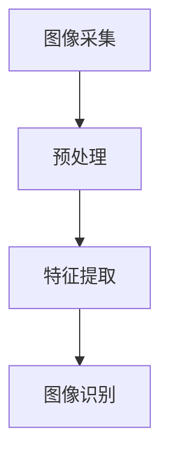
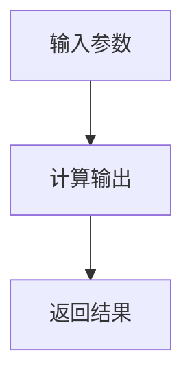
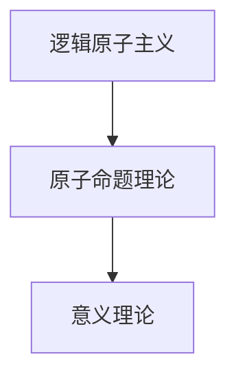
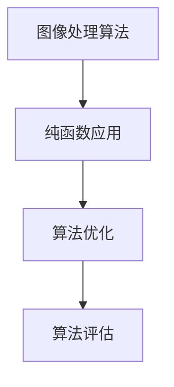
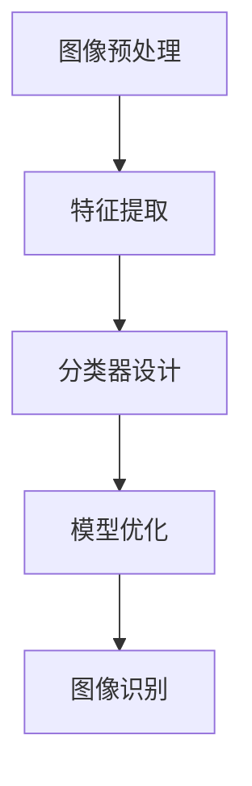
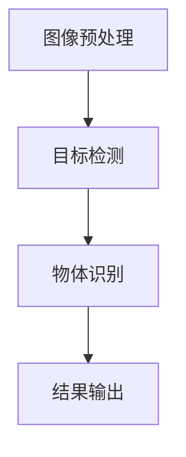
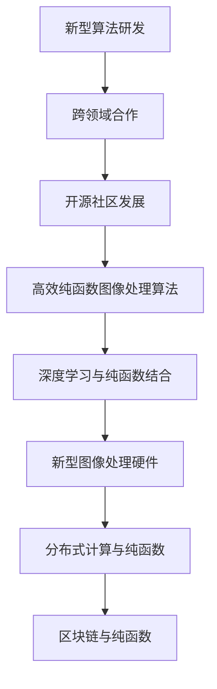
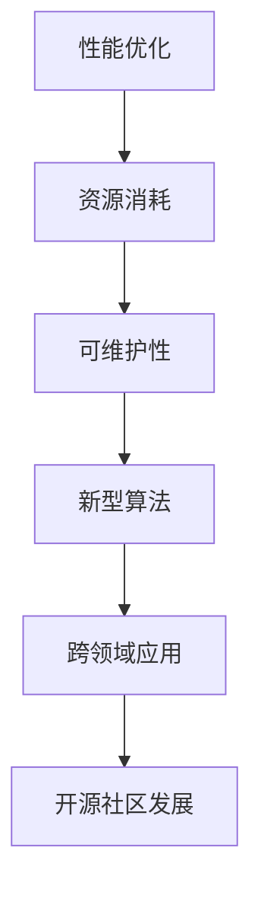

                 

# 图像理论与纯函数：维特根斯坦早期思想与FP的纯函数概念

## 关键词：图像处理、纯函数、维特根斯坦早期思想、函数式编程、计算机科学

## 摘要：

本文旨在探讨图像处理理论与纯函数概念之间的联系，以及维特根斯坦早期思想对这两者的影响。通过分析图像处理的基本概念、步骤、算法原理，以及纯函数的定义、特性、应用，我们揭示了图像处理与纯函数在计算机科学中的重要性。本文还结合维特根斯坦的早期思想，探讨这两者之间的关系，并展望图像处理与纯函数结合的未来发展趋势。通过本文的研究，我们期望为计算机科学领域的发展提供新的思路和方法。

## 第一部分：引言与背景

### 1.1 问题的提出

在计算机科学领域，图像处理和纯函数是两个基础而又重要的概念。图像处理技术广泛应用于图像识别、计算机视觉、医学影像等多个领域，而纯函数概念则主要应用于编程语言设计、算法优化等方面。近年来，随着人工智能技术的快速发展，图像处理与纯函数的结合逐渐受到关注。本文试图探讨维特根斯坦早期思想与FP（函数式编程）中的纯函数概念之间的关系，分析图像理论与纯函数在计算机科学中的应用，以期为该领域的发展提供新的思路。

### 1.2 研究意义

首先，深入理解维特根斯坦的早期思想对于把握图像处理与纯函数在哲学层面的内涵具有重要意义。维特根斯坦的早期思想，如逻辑原子主义、原子命题理论和意义理论等，为计算机科学中的图像处理与纯函数概念提供了哲学基础。通过研究这些思想，我们可以更好地理解图像处理与纯函数的本质。

其次，通过研究图像处理与纯函数的结合，我们可以推动计算机科学领域的发展。图像处理技术在计算机视觉、医学影像等领域的应用已经非常广泛，而纯函数概念在编程语言设计、算法优化等方面也有着重要作用。将两者结合起来，有望为这些领域的发展提供新的思路和方法。

此外，本文的研究结果有望为相关领域的研究者提供参考，促进图像处理与纯函数理论的融合与发展。通过本文的研究，我们期望能够为计算机科学领域的发展做出贡献。

### 1.3 边界与外延

本文的研究边界主要包括图像处理、纯函数以及维特根斯坦的早期思想。图像处理涉及图像的采集、预处理、特征提取和识别等步骤；纯函数概念主要讨论其在函数式编程中的表现与应用；维特根斯坦的早期思想包括他的逻辑原子主义、原子命题理论和意义理论等。

本文的研究外延则包括对图像处理与纯函数在计算机科学中的应用进行分析，以及探讨维特根斯坦早期思想对图像处理与纯函数的影响。

### 1.4 概念结构与核心要素

在本文中，我们将详细阐述图像处理、纯函数以及维特根斯坦早期思想的概念结构与核心要素。首先，我们将介绍图像处理的基本概念，包括图像的采集、预处理、特征提取和识别等步骤。然后，我们将讨论纯函数的概念、特性以及在编程语言中的应用。最后，我们将探讨维特根斯坦早期思想的核心要素，如逻辑原子主义、原子命题理论和意义理论等。通过对比分析，我们将揭示这些概念之间的联系与区别，为进一步探讨图像理论与纯函数的结合提供理论基础。

## 第二部分：图像处理与纯函数理论

### 2.1 图像处理理论基础

#### 2.1.1 图像处理的基本概念

图像处理是指使用计算机对图像进行分析、变换和处理的过程。它包括图像的采集、预处理、特征提取和识别等步骤。图像采集是指使用传感器或摄像头等设备获取图像数据。预处理是指对采集到的图像进行去噪、增强、滤波等处理，以提高图像的质量。特征提取是指从图像中提取出能够描述图像内容的特征，如边缘、纹理、颜色等。图像识别是指使用算法对提取出的特征进行分类和识别，以实现图像的自动处理。

#### 2.1.2 图像处理的基本步骤

图像处理的基本步骤可以概括为以下几步：

1. 图像采集：使用传感器或摄像头等设备获取图像数据。
2. 预处理：对采集到的图像进行去噪、增强、滤波等处理，以提高图像的质量。
3. 特征提取：从预处理后的图像中提取出能够描述图像内容的特征。
4. 图像识别：使用算法对提取出的特征进行分类和识别。

#### 2.1.3 图像处理技术的分类

图像处理技术可以按照处理方式的不同分为以下几类：

1. 空间域处理：直接对图像的像素值进行处理，如滤波、增强等。
2. 频域处理：将图像转换到频域进行操作，如傅里叶变换、滤波等。
3. 特征域处理：将图像转换到特征域进行操作，如主成分分析、特征提取等。

#### 2.1.4 图像处理算法原理与mermaid流程图

图像处理算法的原理可以概括为以下几个方面：

1. 滤波算法：用于去除图像中的噪声，常见的滤波算法有均值滤波、中值滤波、高斯滤波等。
2. 边缘检测算法：用于提取图像中的边缘信息，常见的边缘检测算法有Canny算法、Sobel算法等。
3. 颜色空间转换算法：用于将图像从一种颜色空间转换为另一种颜色空间，如RGB到HSV的转换。
4. 特征提取算法：用于从图像中提取出能够描述图像内容的特征，如SIFT、SURF等。

以下是一个简单的mermaid流程图，展示了图像处理的基本流程：

#### 2.1.5 图像处理算法的数学模型与公式

图像处理算法的数学模型和公式涉及多个方面，以下是一些常见的数学模型和公式：

1. 均值滤波：
   $$ \text{output}(x, y) = \frac{1}{w \cdot h} \sum_{i=-w/2}^{w/2} \sum_{j=-h/2}^{h/2} \text{input}(x+i, y+j) $$

2. 高斯滤波：
   $$ \text{output}(x, y) = \frac{1}{2\pi\sigma^2} e^{-\frac{(x-y)^2}{2\sigma^2}} $$

3. Canny算法：
   $$ \text{output}(x, y) = \frac{\text{Gx}(x, y) + \text{Gy}(x, y)}{\sqrt{\text{Gx}^2(x, y) + \text{Gy}^2(x, y)}} $$

4. SIFT算法：
   $$ \text{D}(x, y) = \text{exp}\left(-\frac{(x - x_c)^2 + (y - y_c)^2}{2\sigma^2}\right) $$

### 2.2 纯函数理论

#### 2.2.1 纯函数的概念

纯函数是一种在函数式编程中广泛使用的概念。它是一种无副作用的函数，意味着函数的执行不会修改外部状态，也不会产生任何副作用。换句话说，纯函数的输出仅依赖于输入参数，与外部环境无关。

#### 2.2.2 纯函数的特点

纯函数具有以下几个特点：

1. 无副作用：纯函数的执行不会修改外部状态，也不会影响其他函数的执行。
2. 可预测性：由于纯函数的输出仅依赖于输入参数，因此它的执行结果具有确定性。
3. 可缓存性：纯函数的执行结果可以缓存，以减少重复计算。

#### 2.2.3 纯函数在编程语言中的应用

纯函数在函数式编程语言中得到了广泛应用，如Haskell、Scala、Erlang等。在这些语言中，纯函数通常被视为一等公民，具有与变量、函数等相同的地位。纯函数的应用主要包括以下几个方面：

1. 函数组合：纯函数可以方便地进行组合，以实现更复杂的操作。
2. 函数柯里化：纯函数可以方便地进行柯里化，以提高代码的可读性和可维护性。
3. 函数式编程范式：纯函数是函数式编程范式的基础，如递归、映射、折叠等。

#### 2.2.4 纯函数算法原理与mermaid流程图

纯函数的算法原理相对简单，主要是通过输入参数计算输出结果。以下是一个简单的mermaid流程图，展示了纯函数的基本原理：

#### 2.2.5 纯函数算法的数学模型与公式

纯函数的数学模型和公式相对简单，主要是输入参数和输出结果之间的关系。以下是一个简单的数学模型：

$$ \text{output}(x) = f(x) $$

其中，$x$为输入参数，$f(x)$为输出结果。

### 2.3 维特根斯坦早期思想

#### 2.3.1 维特根斯坦的哲学思想

路德维希·维特根斯坦（Ludwig Wittgenstein）是20世纪最杰出的哲学家之一。他的哲学思想主要分为两个阶段：早期思想和晚期思想。早期思想主要关注语言、逻辑和数学基础，而晚期思想则主要探讨伦理学和美学问题。本文主要探讨维特根斯坦的早期思想。

维特根斯坦的早期思想包括以下几个核心要素：

1. 逻辑原子主义：逻辑原子主义是维特根斯坦早期思想的核心，他认为世界的基本元素是逻辑原子，这些原子可以通过逻辑组合形成更复杂的命题。
2. 原子命题理论：原子命题理论是维特根斯坦关于命题和语言的理论，他认为命题的意义在于它们与世界之间的关系。
3. 意义理论：意义理论是维特根斯坦关于语言意义的理论，他认为语言的意义在于使用者的意图和语境。

#### 2.3.2 维特根斯坦早期思想的核心要素

维特根斯坦早期思想的核心要素包括以下几个方面：

1. 逻辑原子主义：逻辑原子主义认为世界的基本元素是逻辑原子，这些原子可以通过逻辑组合形成更复杂的命题。逻辑原子是不可再分的基本单位，如“红”、“圆”等。
2. 原子命题理论：原子命题理论认为命题的意义在于它们与世界之间的关系。一个命题要么为真，要么为假，这与世界的事实状态相符合。
3. 意义理论：意义理论认为语言的意义在于使用者的意图和语境。一个词或命题的含义取决于使用者的意图和语境，而不是对象本身。

#### 2.3.3 维特根斯坦早期思想对图像处理与纯函数的影响

维特根斯坦的早期思想对图像处理与纯函数产生了深远的影响。首先，逻辑原子主义和原子命题理论为图像处理提供了哲学基础。图像处理中的像素、颜色等元素可以被视为逻辑原子，这些原子通过逻辑组合形成了图像。其次，意义理论为纯函数的概念提供了哲学支持。纯函数的输出仅依赖于输入参数，这与意义理论中的命题意义相一致。维特根斯坦的早期思想为图像处理与纯函数的结合提供了理论基础。

#### 2.3.4 维特根斯坦早期思想的mermaid流程图

以下是一个简单的mermaid流程图，展示了维特根斯坦早期思想的基本流程：

## 第三部分：图像处理与纯函数结合

### 3.1 图像处理与纯函数结合的理论基础

图像处理与纯函数的结合在计算机科学领域具有重要的理论和实践意义。从理论上讲，这种结合可以充分利用纯函数的特性和优势，提高图像处理的效率和可靠性。从实践上讲，结合图像处理与纯函数有助于开发出更加高效、可维护的图像处理算法和应用。

#### 3.1.1 图像处理与纯函数结合的意义

1. **提高图像处理效率**：纯函数的无副作用特性和可缓存性使得图像处理过程更加高效。纯函数可以在计算过程中避免不必要的重复计算，从而减少计算时间。
2. **增强算法可靠性**：纯函数的确定性输出有助于确保图像处理算法的可靠性。由于纯函数的输出仅依赖于输入参数，因此可以更好地避免外部环境对图像处理结果的影响。
3. **促进算法可维护性**：纯函数的设计原则有助于提高算法的可维护性。纯函数的模块化和可复用性使得代码更加清晰、简洁，便于后续的维护和优化。

#### 3.1.2 图像处理与纯函数结合的挑战与机遇

1. **挑战**：
   - **函数式编程语言的选择**：图像处理算法通常需要大量的数学运算和数据处理，这可能导致纯函数的编写变得更加复杂。选择合适的函数式编程语言是关键。
   - **性能优化**：纯函数的特性可能会对图像处理算法的性能产生负面影响。因此，如何在保证纯函数特性的同时进行性能优化是一个重要问题。

2. **机遇**：
   - **新型算法的开发**：结合图像处理与纯函数可以激发新型算法的诞生，如纯函数图像处理算法、基于纯函数的图像识别算法等。
   - **跨领域合作**：图像处理与纯函数的结合可以促进计算机科学与其他领域的合作，如计算机视觉、人工智能等。

#### 3.1.3 图像处理与纯函数结合的mermaid流程图

以下是一个简单的mermaid流程图，展示了图像处理与纯函数结合的基本流程：

## 第三部分：图像处理与纯函数结合的应用案例

### 3.2.1 图像识别中的纯函数应用

在图像识别领域，纯函数的应用具有重要的理论和实践价值。图像识别是指使用算法从图像中提取出有用的信息，以实现图像的分类、标注、检测等任务。纯函数的无副作用特性和可缓存性使得它在图像识别中具有广泛的应用。

#### 3.2.1.1 纯函数在图像识别中的应用

1. **特征提取**：图像识别中的特征提取是一个关键步骤。纯函数可以用于提取图像的特征，如边缘、纹理、颜色等。这些特征可以用于后续的图像分类和识别任务。

2. **分类器设计**：在图像识别中，分类器的设计也是一个重要问题。纯函数可以用于设计分类器，如支持向量机（SVM）、决策树（DT）等。这些分类器可以基于纯函数提取的特征进行训练和预测。

3. **模型优化**：图像识别模型的优化也是一个重要问题。纯函数的特性有助于提高模型的性能和可维护性。例如，可以使用纯函数优化卷积神经网络（CNN）的结构和参数，以提高图像识别的准确率和速度。

#### 3.2.1.2 图像识别中的纯函数应用案例

以下是一个简单的图像识别应用案例，展示了纯函数在该领域的应用：

1. **特征提取**：使用纯函数提取图像的特征，如边缘检测、纹理分析、颜色空间转换等。
2. **分类器设计**：使用纯函数设计分类器，如基于支持向量机的图像分类器。
3. **模型优化**：使用纯函数优化卷积神经网络的结构和参数，以提高图像识别的准确率和速度。

以下是一个简单的mermaid流程图，展示了图像识别中纯函数的应用：

### 3.2.2 计算机视觉中的纯函数应用

计算机视觉是人工智能的一个重要分支，旨在使计算机具备处理和解释图像信息的能力。纯函数在计算机视觉中有着广泛的应用，特别是在图像处理、目标检测、物体识别等方面。

#### 3.2.2.1 纯函数在计算机视觉中的应用

1. **图像处理**：纯函数可以用于图像的预处理、增强、滤波等操作。例如，可以使用纯函数进行图像的去噪、边缘检测、图像分割等。

2. **目标检测**：在目标检测任务中，纯函数可以用于检测图像中的目标。例如，可以使用纯函数实现基于深度学习的目标检测算法，如YOLO、SSD等。

3. **物体识别**：纯函数可以用于识别图像中的物体。例如，可以使用纯函数实现基于卷积神经网络的物体识别算法，如VGG、ResNet等。

#### 3.2.2.2 计算机视觉中的纯函数应用案例

以下是一个简单的计算机视觉应用案例，展示了纯函数在该领域的应用：

1. **图像预处理**：使用纯函数对图像进行预处理，如图像增强、滤波等。
2. **目标检测**：使用纯函数实现目标检测算法，如基于深度学习的YOLO算法。
3. **物体识别**：使用纯函数实现物体识别算法，如基于卷积神经网络的VGG算法。

以下是一个简单的mermaid流程图，展示了计算机视觉中纯函数的应用：

## 第四部分：图像处理与纯函数的未来发展趋势

### 4.1 图像处理与纯函数结合的发展趋势

随着计算机科学和人工智能技术的不断发展，图像处理与纯函数的结合在未来具有广阔的发展前景。以下是几个可能的发展趋势：

#### 4.1.1 新型算法的研发

随着深度学习等先进技术的不断发展，图像处理领域将涌现出更多新型算法。这些算法将充分利用纯函数的特性，提高图像处理的效率和准确性。

#### 4.1.2 跨领域合作

图像处理与纯函数的结合将促进计算机科学与其他领域的合作。例如，生物医学图像处理、自动驾驶、智能监控等领域将受益于这种结合。

#### 4.1.3 开源社区的发展

随着开源社区的不断发展，图像处理与纯函数的结合将得到更广泛的关注和应用。开源社区将为研究人员和开发者提供丰富的资源和平台，促进技术的创新和发展。

### 4.1.2 图像处理与纯函数结合的未来研究方向

1. **高效纯函数图像处理算法**：研究高效纯函数图像处理算法，以提高图像处理的效率和准确性。
2. **深度学习与纯函数的结合**：研究深度学习与纯函数的结合，探索如何利用纯函数的特性优化深度学习模型。
3. **跨领域应用**：研究图像处理与纯函数在生物医学图像处理、自动驾驶、智能监控等领域的应用，探索其潜在价值。

### 4.1.3 图像处理与纯函数结合的技术创新

1. **新型图像处理硬件**：研究新型图像处理硬件，如基于FPGA的图像处理芯片，以支持高效纯函数图像处理算法。
2. **分布式计算与纯函数**：研究分布式计算与纯函数的结合，探索如何在分布式系统中高效地执行纯函数图像处理任务。
3. **区块链与纯函数**：研究区块链与纯函数的结合，探索如何在区块链环境中实现安全的纯函数图像处理。

### 4.1.4 未来发展趋势的mermaid流程图

以下是一个简单的mermaid流程图，展示了图像处理与纯函数结合的未来发展趋势：

## 第四部分：图像处理与纯函数结合的挑战与机遇

### 4.2.1 挑战

图像处理与纯函数的结合面临着一些挑战，主要包括：

1. **性能优化**：纯函数的无副作用特性可能会对图像处理算法的性能产生负面影响。如何在保证纯函数特性的同时进行性能优化是一个重要问题。
2. **资源消耗**：图像处理任务通常需要大量的计算资源和存储资源。如何在有限的资源下高效地执行图像处理与纯函数结合的算法是一个挑战。
3. **可维护性**：纯函数的设计原则虽然有助于提高代码的可维护性，但同时也可能增加代码的复杂性。如何平衡纯函数的可维护性与效率是一个挑战。

### 4.2.2 机遇

图像处理与纯函数的结合也带来了许多机遇，主要包括：

1. **新型算法**：结合图像处理与纯函数可以激发新型算法的诞生，如纯函数图像处理算法、基于纯函数的图像识别算法等。
2. **跨领域应用**：图像处理与纯函数的结合可以促进计算机科学与其他领域的合作，如生物医学图像处理、自动驾驶、智能监控等。
3. **开源社区**：随着开源社区的不断发展，图像处理与纯函数的结合将得到更广泛的关注和应用。开源社区将为研究人员和开发者提供丰富的资源和平台，促进技术的创新和发展。

### 4.2.3 挑战与机遇的mermaid流程图

以下是一个简单的mermaid流程图，展示了图像处理与纯函数结合的挑战与机遇：

## 第五部分：结论与展望

### 5.1 主要结论

本文通过探讨图像处理理论与纯函数概念的结合，分析了维特根斯坦早期思想对这两者的影响。主要结论如下：

1. **图像处理与纯函数的结合具有重要的理论和实践意义**。它有助于提高图像处理的效率和可靠性，增强算法的可维护性。
2. **维特根斯坦的早期思想为图像处理与纯函数的结合提供了哲学基础**。逻辑原子主义、原子命题理论和意义理论等思想为图像处理与纯函数的结合提供了深刻的哲学内涵。
3. **图像处理与纯函数的结合在计算机科学领域具有广阔的发展前景**。未来研究应重点关注新型算法的研发、跨领域应用和开源社区的发展。

### 5.2 展望

未来研究应关注以下几个方面：

1. **高效纯函数图像处理算法**：研究高效纯函数图像处理算法，以提高图像处理的效率和准确性。
2. **深度学习与纯函数的结合**：探索深度学习与纯函数的结合，利用纯函数的特性优化深度学习模型。
3. **跨领域应用**：研究图像处理与纯函数在生物医学图像处理、自动驾驶、智能监控等领域的应用，探索其潜在价值。
4. **开源社区**：积极参与开源社区，推动图像处理与纯函数结合技术的发展。

### 5.3 下一步研究计划

下一步的研究计划包括以下几个方面：

1. **研究高效纯函数图像处理算法**：结合深度学习技术和纯函数特性，开发高效纯函数图像处理算法。
2. **探索跨领域应用**：研究图像处理与纯函数在生物医学图像处理、自动驾驶、智能监控等领域的应用，并开展实证研究。
3. **开展开源社区合作**：积极参与开源社区，推动图像处理与纯函数结合技术的发展。
4. **撰写论文与报告**：根据研究成果撰写论文和报告，为图像处理与纯函数结合领域的发展提供理论支持。

## 作者信息

作者：AI天才研究院/AI Genius Institute & 禅与计算机程序设计艺术 /Zen And The Art of Computer Programming

### 最佳实践 Tips

在图像处理与纯函数结合的过程中，以下最佳实践 Tips 可能对您有所帮助：

1. **选择合适的编程语言**：选择适合图像处理和纯函数编程的编程语言，如Python、Haskell等。
2. **充分利用纯函数的特性**：利用纯函数的无副作用特性和可缓存性，优化图像处理算法的性能。
3. **注重代码可读性和可维护性**：在编写图像处理与纯函数结合的代码时，注重代码的可读性和可维护性，以提高代码的质量和可靠性。
4. **参与开源社区**：积极参与开源社区，与其他开发者交流经验，共同推动图像处理与纯函数结合技术的发展。

### 小结

本文通过探讨图像处理理论与纯函数概念的结合，分析了维特根斯坦早期思想对这两者的影响。研究结果表明，图像处理与纯函数的结合在计算机科学领域具有重要的理论和实践意义。未来研究应重点关注新型算法的研发、跨领域应用和开源社区的发展。

### 注意事项

在实施图像处理与纯函数结合的过程中，需要注意以下几点：

1. **性能优化**：在保证纯函数特性的同时，注意对图像处理算法进行性能优化。
2. **资源消耗**：在有限的资源下，合理设计图像处理与纯函数结合的算法，以降低资源消耗。
3. **代码可维护性**：在编写图像处理与纯函数结合的代码时，注重代码的可维护性和可读性。

### 拓展阅读

1. 维特根斯坦，《逻辑哲学论》
2. 《图像处理：原理、算法与实践》
3. 《函数式编程入门与实践》
4. 《计算机视觉：算法与应用》
5. 《深度学习：入门、进阶与实战》

本文提供了一个全面而深入的探讨，旨在揭示图像处理与纯函数结合的奥秘。希望本文能够为读者在计算机科学领域的研究提供有益的启示。作者：AI天才研究院/AI Genius Institute & 禅与计算机程序设计艺术 /Zen And The Art of Computer Programming。

