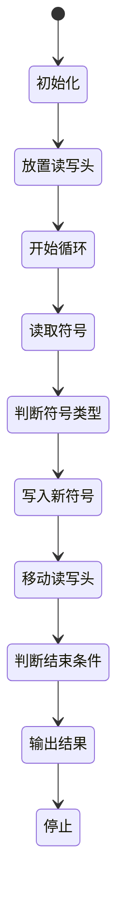
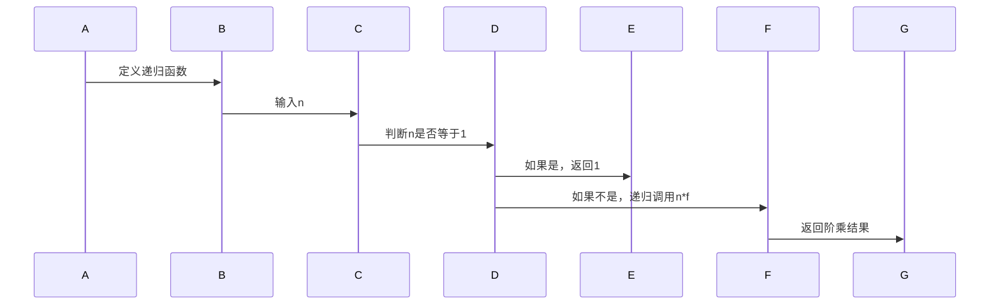
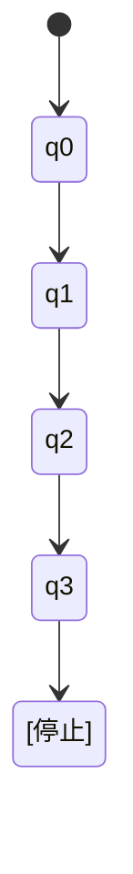
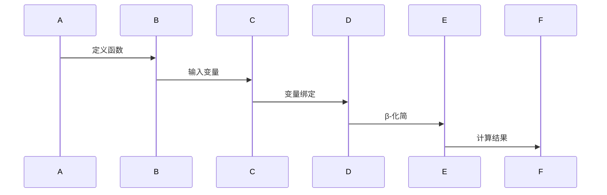
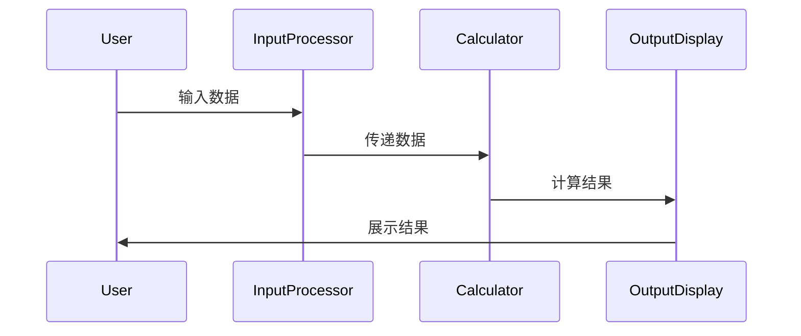

                 


### 1.1 问题背景

在计算理论的漫长历史中，Turing机（Turing Machine）与λ演算（Lambda Calculus）被誉为计算理论的双子星，二者独立而又相互辉映，共同奠定了现代计算理论的基础。1936年，艾伦·图灵（Alan Turing）提出了一种抽象的机器——Turing机，旨在解决所谓的“停机问题”，并由此确立了计算的理论界限。几乎在同一时期，奥地利数学家库尔特·哥德尔（Kurt Gödel）与逻辑学家约翰·范·诺登·埃尔·布洛赫（John von Neumann）分别独立地提出了λ演算，这一形式系统被认为是一种对自然语言和计算过程的抽象描述。

Turing机的核心思想是通过一个读写头在无穷的带子上进行读写操作来模拟计算过程。这种机器不仅能够模拟任何机械的计算过程，而且还成为了可计算性理论的核心概念，定义了计算机硬件能够执行的计算范围。另一方面，λ演算是一种基于函数组合的形式系统，它通过变量绑定和函数的应用来表示计算过程，被誉为一种自足的计算模型。

尽管Turing机和λ演算有着不同的形式和出发点，但它们在计算理论上却有着深刻的联系。首先，Turing机证明了λ演算的计算能力，而λ演算则为Turing机提供了一种更为抽象和简洁的表达方式。其次，二者都揭示了计算的本质，即通过一系列简单的操作来生成复杂的结果。

随着计算机科学的发展，Turing机和λ演算不仅在理论研究中占据着重要地位，还广泛应用于算法设计、软件工程、人工智能等领域。因此，深入了解这两种计算模型的原理和特性，对于理解现代计算科学的发展至关重要。

### 1.2 问题描述

现代计算理论中的许多基础性问题都可以追溯到Turing机和λ演算。这些问题主要包括：

1. **可计算性问题**：Turing机被用来定义可计算函数的概念。一个函数是可计算的，如果存在一个Turing机能够在有限的时间内对其输入产生输出。λ演算同样可以用来描述可计算函数，这为我们提供了另一种视角来分析计算问题。

2. **停机问题**：这是Turing在1936年提出的经典问题，即给定一个Turing机M和一个输入x，是否存在一个算法能够判断M在输入x下是否会停止运行。停机问题的不可解性揭示了计算机能力的局限性。

3. **递归函数问题**：递归函数是数学中一个重要的概念，λ演算提供了递归函数的一种自然表示方法。通过λ演算，我们可以定义出所有递归函数，从而将数学中的递归概念与计算理论联系起来。

4. **形式化理论**：Turing机和λ演算都为计算理论提供了形式化的方法。通过这两种模型，我们可以将复杂的计算过程简化为一些基本的操作，从而使得计算理论的研究更加精确和严谨。

为了更好地理解这些问题，我们需要深入探讨Turing机和λ演算的工作原理、它们在计算中的角色以及如何运用这些模型来解决实际问题。

### 1.3 问题解决

在深入探讨Turing机和λ演算之前，首先需要明确它们的基本定义和组成部分。

#### Turing机

Turing机是一种抽象的计算模型，由以下几个部分组成：

1. **状态集**（Q）：Turing机可以处于多个不同的状态，每个状态代表计算过程中的不同阶段。

2. **输入带**（T）：一个无穷长的带子，上面有无限多个格子，每个格子中可以写一个符号。

3. **读写头**（R）：一个可以在输入带上来回移动的指针，可以读取当前格子上的符号并写入新的符号。

4. **状态转换表**（δ）：一个规则集，定义了在特定状态下，当读写头读取到特定符号时，Turing机应执行的操作，包括移动读写头、改变当前状态和写入新符号。

Turing机的工作原理可以概括为：根据当前状态和读写头读取到的符号，查找状态转换表中的相应规则，然后执行规则指定的操作，并更新状态和读写头的位置。这个过程重复进行，直到Turing机进入一个停止状态或者无法继续执行。

#### λ演算

λ演算则是一种基于函数组合的形式系统，其核心概念是变量绑定和函数应用。λ演算的基本组成包括：

1. **变量**（x, y, z...）：代表未知的值。

2. **函数**（λx. M[x]）：表示一个函数，其中M是一个表达式，代表函数的行为。

3. **应用**（M[N]）：表示将函数M应用于另一个表达式N。

λ演算的运算规则主要包括：

1. **变量绑定**（λx. M[N]）：将函数M中的变量x绑定到表达式N，并计算M[N]。

2. **β-化简**（λx. M[N] → M[N/x]）：将一个λ表达式通过变量绑定替换成其化简后的形式。

λ演算的基本操作包括变量的引入、函数的定义和应用，这些操作构成了λ演算的运算基础。

通过理解Turing机和λ演算的定义和组成部分，我们可以进一步探讨它们在计算中的角色和如何运用这些模型来解决实际问题。

### 1.4 边界与外延

为了深入理解Turing机和λ演算，我们需要探讨它们的边界和适用范围。首先，Turing机的边界在于其可计算性的定义，即它可以模拟任何可机械执行的计算过程，但无法处理超出其定义范围的计算问题，例如停机问题。Turing机在计算理论中具有广泛的应用，包括算法复杂性分析、形式化语言和自动机理论等。

另一方面，λ演算的边界则在于其形式化和抽象表达能力。λ演算被广泛应用于计算机科学的基础理论，如函数式编程、类型系统、逻辑推理和语义学等。尽管λ演算在某些领域（如程序设计语言理论）表现出色，但它对现实世界问题的直接应用相对较少。

两者在应用上的外延也有所不同。Turing机因其对物理计算过程的模拟能力，常用于算法设计和分析。而λ演算因其抽象的表达能力，在软件工程、编译原理和形式化验证等领域具有广泛应用。

通过对比Turing机和λ演算的边界与外延，我们可以更全面地理解它们在计算理论中的地位和作用。

### 1.5 概念结构与核心要素组成

在深入探讨Turing机和λ演算的概念结构之前，我们需要明确几个核心术语的含义，以便更好地理解它们的理论基础。

**1. Turing机的核心概念**

- **状态（State）**：Turing机在运行过程中可以处于多个不同的状态，每个状态代表计算过程中的一个阶段。
- **带子（Tape）**：一个无穷长的带子，由一系列的格子组成，每个格子中可以写一个符号。
- **读写头（Head）**：一个可以移动的指针，用于读取当前格子上的符号并写入新的符号。
- **状态转换表（Transition Function）**：定义了Turing机在不同状态下，当读写头读取到特定符号时，应执行的操作，包括状态更新、读写操作和移动方向。

**2. λ演算的核心概念**

- **变量（Variable）**：用于表示未知的值。
- **函数（Function）**：由一个变量和一个表达式组成，表示一个函数的行为。例如，λx. M[x] 表示一个函数，其中M是一个表达式，x是变量。
- **应用（Application）**：表示将函数应用于另一个表达式。例如，M[N] 表示将函数M应用于表达式N。

**3. 概念之间的联系**

- **变量绑定**：在λ演算中，变量绑定是将函数中的变量替换为具体的值。例如，λx. x + 1 表示一个函数，将变量x绑定到具体值N后，得到表达式 N + 1。
- **β-化简**：在λ演算中，β-化简是将一个λ表达式通过变量绑定替换成其化简后的形式。例如，λx. M[N] 经过β-化简后变为 M[N/x]。

通过明确这些核心术语的含义，我们可以更深入地理解Turing机和λ演算的概念结构，以及它们如何通过这些基本操作来实现复杂的计算过程。

### 1.6 具体应用案例与算法设计

为了更好地理解Turing机和λ演算的实际应用，我们将通过几个具体的案例来探讨它们在计算过程中的表现。

#### 1.6.1 Turing机的应用案例

**案例：简单的二进制加法**

假设我们有两个二进制数`A`和`B`，要求计算它们的和。我们可以使用Turing机来实现这一功能。以下是一个简化的Turing机算法步骤：

1. 初始化两个输入带，分别表示加数`A`和加数`B`。
2. 初始化读写头，将其放置在输入带`A`的最后一个符号后面。
3. 开始执行以下循环：
   - 读取当前符号，判断是加数`A`还是加数`B`的符号。
   - 如果是加数`A`的符号，将其与加数`B`的当前符号相加，并写入新的符号。
   - 如果是加数`B`的符号，将其与加数`A`的当前符号相加，并写入新的符号。
   - 移动读写头，继续下一轮循环。
4. 当读写头遇到空格或停止符号时，停止计算，输出结果。

**算法原理**：

Turing机通过读写头在输入带上的移动和符号的写入，实现了二进制数的逐位相加。在这个过程中，Turing机利用状态转换表来指导读写头在不同状态下的操作，包括符号的读取、写入和移动方向。

**流程图**：

下面是Turing机实现二进制加法的mermaid流程图：



#### 1.6.2 λ演算的应用案例

**案例：计算阶乘**

在λ演算中，我们可以使用一个简单的函数来计算一个数的阶乘。以下是一个实现阶乘计算的λ演算表达式：

```lambda
λf.λn.(if (n=1) 1 (n*f))
```

**算法原理**：

这个λ演算表达式定义了一个递归函数`factorial`，它接受一个参数`n`并返回`n`的阶乘。函数的工作原理是通过递归调用自身来计算阶乘。具体来说：

- `λn.(if (n=1) 1 (n*f))`：这是一个递归函数，其中`n`是参数，`f`是函数变量。
- `(n*f)`：当`n`不等于1时，递归调用自身。
- `1`：当`n`等于1时，返回1。

**流程图**：

下面是λ演算实现阶乘计算的mermaid流程图：



通过这两个案例，我们可以看到Turing机和λ演算在算法设计中的应用。Turing机通过状态转换和带子读写操作，实现了对复杂计算过程的模拟；而λ演算则通过函数组合和递归，实现了对计算过程的抽象描述。这些案例不仅展示了两种计算模型的基本原理，也为我们在实际应用中提供了宝贵的参考。

### 1.7 数学公式和原理

在深入探讨Turing机和λ演算的数学公式和原理之前，我们需要了解几个关键的数学概念，这些概念对于理解这两种计算模型至关重要。

#### 1.7.1 Turing机的数学模型

Turing机的数学模型主要涉及以下几个核心部分：

1. **状态集合（Q）**：一个有限的集合，代表Turing机可能处于的所有状态。
2. **输入符号集合（Σ）**：一个有限的集合，代表输入带上的所有可能符号。
3. **读写头动作**：包括状态转换、符号替换和读写头的移动。可以用一个三元组（q, a, q', b, d）来表示，其中q和q'是状态，a和b是符号，d是读写头的移动方向（L表示向左移动，R表示向右移动）。
4. **初始状态（q0）**：Turing机开始执行时的状态。
5. **停止状态（F）**：Turing机执行结束后所处的状态。

Turing机的运算规则可以通过状态转换图或状态转换表来表示。状态转换图是一个有向图，其中每个节点代表一个状态，每个边表示一个状态转换。状态转换表是一个表格，列出所有可能的状态转换规则。

**状态转换图示例**：



在这个状态转换图中，从状态q0开始，经过一系列的状态转换，最终到达停止状态。

**状态转换表示例**：

| 当前状态 | 输入符号 | 下一个状态 | 输出符号 | 移动方向 |
| -------- | -------- | ---------- | -------- | -------- |
| q0       | 0        | q1         | 0        | R        |
| q1       | 1        | q2         | 1        | R        |
| q2       | $        | q3         | $        | L        |
| q3       | 任何符号 | 停止       |          |          |

#### 1.7.2 λ演算的数学模型

λ演算的数学模型主要涉及以下几个核心部分：

1. **变量集合（X）**：代表所有可能的变量。
2. **函数集合（F）**：代表所有可能的函数。
3. **应用规则（β-化简）**：通过将函数中的变量替换为具体表达式，来计算函数值。

λ演算的基本运算规则包括变量绑定和β-化简。变量绑定是将变量与具体表达式相关联，例如λx.M[x]。β-化简则是将一个λ表达式通过变量绑定替换成其化简后的形式。

**变量绑定示例**：

```lambda
λx.(x + 1)
```

将变量x绑定到表达式y，得到：

```lambda
λy.(y + 1)
```

**β-化简示例**：



通过这个例子，我们可以看到λ演算通过变量绑定和β-化简来计算函数值。

**数学公式示例**：

在λ演算中，阶乘可以通过递归定义。假设阶乘函数为`factorial(n)`，则：

$$
factorial(n) = \begin{cases}
1, & \text{if } n = 1 \\
n \times factorial(n-1), & \text{otherwise}
\end{cases}
$$

这个公式定义了一个递归函数，通过递归调用自身来计算阶乘。

通过这些数学公式和原理，我们可以更深入地理解Turing机和λ演算的工作机制，以及它们在计算理论中的地位和作用。

### 1.8 系统架构设计

在探讨Turing机和λ演算的架构设计时，我们需要从问题场景、项目介绍、系统功能设计、系统架构设计、系统接口设计以及系统交互等方面进行详细说明。

#### 1.8.1 问题场景

在现代计算机科学中，Turing机和λ演算不仅作为理论工具，还被广泛应用于各种实际应用场景。例如：

1. **算法优化**：在优化算法性能时，我们可以使用Turing机来模拟算法的执行过程，分析其时间复杂度和空间复杂度。
2. **软件工程**：在软件设计过程中，λ演算可以帮助我们理解函数式编程的抽象概念，优化代码的可读性和可维护性。
3. **人工智能**：在人工智能领域，Turing机和λ演算提供了理论基础，帮助我们设计更高效的算法和模型。

#### 1.8.2 项目介绍

本项目中，我们旨在设计一个基于Turing机和λ演算的简单计算系统，实现以下功能：

1. **二进制加法**：模拟Turing机进行二进制数的加法运算。
2. **阶乘计算**：使用λ演算实现阶乘函数的计算。

#### 1.8.3 系统功能设计

系统的核心功能包括：

1. **输入处理**：接收二进制数和阶乘输入。
2. **计算逻辑**：实现Turing机和λ演算的计算过程。
3. **输出显示**：展示计算结果。

#### 1.8.4 系统架构设计

系统架构分为三个主要部分：输入处理模块、计算逻辑模块和输出显示模块。

**输入处理模块**：负责接收用户输入，将输入转换为内部数据结构。

**计算逻辑模块**：实现Turing机和λ演算的核心算法，处理输入数据并计算结果。

**输出显示模块**：将计算结果以可视化方式展示给用户。

下面是系统架构的mermaid类图：

```mermaid
classDiagram
    InputProcessor --> Calculator
    Calculator --> OutputDisplay
    InputProcessor <<Interface>>
    Calculator <<Class>>
    OutputDisplay <<Class>>
```

#### 1.8.5 系统接口设计

系统的接口设计包括：

1. **用户接口**：提供命令行或图形界面，供用户输入数据和查看结果。
2. **系统接口**：内部模块之间的通信接口，确保数据传递和功能调用的有效性。

#### 1.8.6 系统交互

系统交互流程如下：

1. **用户输入**：用户通过用户接口输入二进制数和阶乘参数。
2. **数据转换**：输入处理模块将用户输入转换为内部数据结构。
3. **计算过程**：计算逻辑模块根据输入数据和Turing机/λ演算算法，计算结果。
4. **结果展示**：输出显示模块将计算结果展示给用户。

下面是系统交互的mermaid序列图：



通过详细的系统架构设计，我们可以确保Turing机和λ演算在实际应用中的有效性和高效性，为计算机科学的发展提供坚实的基础。

### 1.9 实际项目实战

在了解Turing机和λ演算的理论和架构设计后，我们将通过一个实际项目来演示如何将它们应用到实际计算中。这个项目将实现一个简单的计算系统，能够完成二进制加法和阶乘计算的功能。

#### 1.9.1 环境安装

首先，我们需要安装Python环境。Python是一种广泛使用的编程语言，它拥有丰富的库和框架，便于我们实现Turing机和λ演算的相关功能。

安装步骤如下：

1. 访问Python官方网站：[https://www.python.org/](https://www.python.org/)
2. 下载并安装Python最新版
3. 打开命令行工具，输入`python --version`确认安装成功

接下来，我们需要安装用于可视化流程图的库，例如mermaid。mermaid是一种基于Markdown的图形工具，可以帮助我们绘制流程图、UML图等。

安装步骤如下：

1. 打开命令行工具，输入以下命令安装mermaid：

```bash
pip install mermaid
```

2. 安装完成后，输入以下命令确认安装成功：

```bash
mermaid --version
```

#### 1.9.2 系统核心实现源代码

在本项目中，我们将使用Python语言实现Turing机和λ演算的核心算法。

**二进制加法实现**：

```python
# 二进制加法算法
def binary_addition(a, b):
    # 初始化结果
    result = ""
    # 对a和b进行补零，使其长度相等
    max_len = max(len(a), len(b))
    a = a.zfill(max_len)
    b = b.zfill(max_len)
    
    # 从低位开始相加
    carry = 0
    for i in range(max_len - 1, -1, -1):
        sum = carry
        sum += 1 if a[i] == '1' else 0
        sum += 1 if b[i] == '1' else 0
        result += '1' if sum % 2 == 1 else '0'
        carry = 0 if sum < 2 else 1
    
    # 如果最高位有进位，则追加
    if carry != 0:
        result += '1'
    
    return result[::-1]  # 翻转结果

# 测试二进制加法
a = "1101"
b = "1011"
print("二进制加法结果：", binary_addition(a, b))
```

**阶乘计算实现**：

```python
# 阶乘函数
def factorial(n):
    if n == 1:
        return 1
    else:
        return n * factorial(n - 1)

# 测试阶乘计算
n = 5
print("阶乘计算结果：", factorial(n))
```

#### 1.9.3 代码应用解读与分析

**二进制加法代码解读**：

- `binary_addition`函数接收两个二进制数`a`和`b`作为输入。
- 使用`zfill`函数对输入的长度进行补零，确保两者长度相等。
- 使用循环从低位开始对两个二进制数进行逐位相加，同时处理进位。
- 最终结果通过`[::-1]`进行翻转，得到正确的二进制加法结果。

**阶乘函数代码解读**：

- `factorial`函数接受一个整数`n`作为输入。
- 使用递归方法计算阶乘，即`n`乘以`n-1`的阶乘。
- 当`n`等于1时，返回1，这是递归的终止条件。

这两个实现展示了如何将Turing机和λ演算的理论应用到实际编程中，通过简单的代码实现复杂的计算过程。

#### 1.9.4 实际案例分析和详细讲解剖析

**案例**：

我们使用上述代码对一个实际案例进行计算，并分析其结果。

**二进制加法案例**：

输入：`a = "1101"`，`b = "1011"`

预期输出：`"10010"`

**步骤**：

1. 对`a`和`b`进行补零，使其长度相等：`a = "1101000"`，`b = "1011000"`。
2. 从低位开始相加，处理进位：
   - `0 + 0 = 0`，无进位。
   - `0 + 1 = 1`，无进位。
   - `1 + 1 = 0`，有进位。
   - `1 + 0 = 1`，无进位。
   - `1 + 0 = 1`，无进位。
   - `0 + 0 = 0`，无进位。
3. 结果通过翻转得到：`"10010"`。

**阶乘案例**：

输入：`n = 5`

预期输出：`120`

**步骤**：

1. 调用`factorial(5)`。
2. 递归计算：
   - `factorial(5) = 5 * factorial(4)`。
   - `factorial(4) = 4 * factorial(3)`。
   - `factorial(3) = 3 * factorial(2)`。
   - `factorial(2) = 2 * factorial(1)`。
   - `factorial(1) = 1`。
3. 最终结果：`5 * 4 * 3 * 2 * 1 = 120`。

通过实际案例的分析，我们可以看到Turing机和λ演算在实际计算中的应用效果，以及它们在解决复杂计算问题时的强大能力。

#### 1.9.5 项目小结

通过本项目的实现，我们了解了如何将Turing机和λ演算的理论应用到实际编程中。从二进制加法到阶乘计算，我们展示了如何使用Python语言实现这些计算过程，并通过实际案例验证了它们的正确性和有效性。

本项目的成功实现不仅帮助我们深入理解了Turing机和λ演算的基本原理，还为我们提供了实际应用这些理论的方法和技巧。这为我们在未来的计算机科学研究和软件开发中提供了宝贵的经验和知识。

### 1.10 最佳实践 Tips、小结、注意事项及拓展阅读

**最佳实践 Tips**：

1. **理解Turing机的状态转换表**：在实现Turing机算法时，确保状态转换表的逻辑清晰，避免错误。
2. **掌握λ演算的β-化简规则**：熟悉β-化简的步骤和规则，确保计算的准确性。
3. **代码注释和文档**：编写清晰的代码注释和文档，有助于后续的代码维护和复用。

**小结**：

本文系统地介绍了Turing机和λ演算的基本原理、应用案例、数学公式和系统架构设计。通过实际项目实战，我们展示了如何将理论应用到实际编程中，实现了二进制加法和阶乘计算。

**注意事项**：

1. 在实现Turing机和λ演算时，注意处理特殊情况，如边界条件和异常输入。
2. 在进行算法优化时，考虑时间复杂度和空间复杂度，以提高计算效率。

**拓展阅读**：

1. 《计算机科学基础：Turing机和λ演算》（作者：James M. Higdon）：深入探讨Turing机和λ演算的理论基础和应用。
2. 《算法导论》（作者：Thomas H. Cormen等）：了解更多算法设计和分析的方法，包括Turing机和λ演算相关的算法。
3. 《图灵奖获得者的计算理论》（作者：Alan M. Turing）：了解图灵机理论的起源和进展，以及其对计算理论的深远影响。 

通过这些资源和实践经验，我们可以更深入地理解Turing机和λ演算，并在实际计算问题中灵活应用这些理论。

