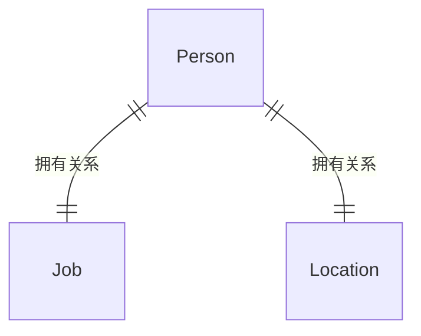
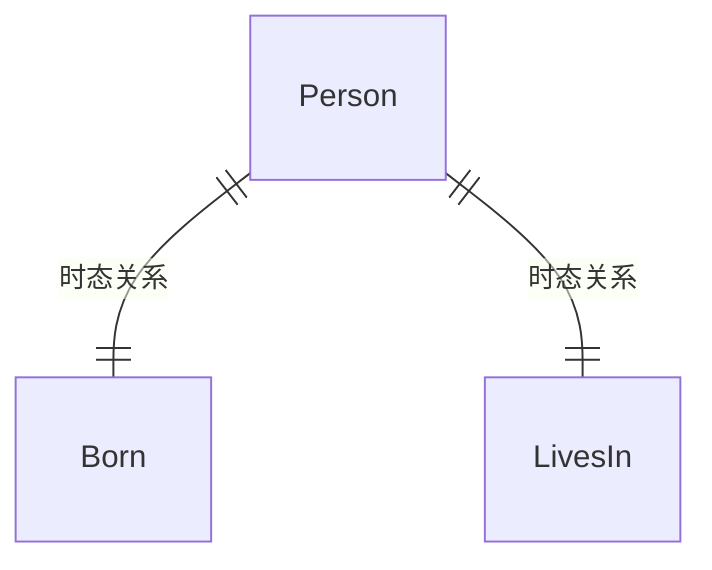
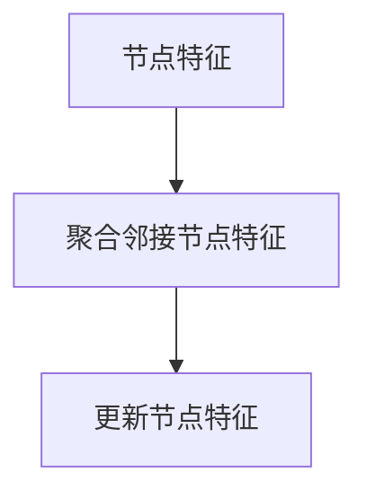

                 

# 《图神经网络在时变知识图谱推理中的进展》

关键词：图神经网络，知识图谱，时变知识图谱，推理，人工智能

摘要：本文旨在探讨图神经网络在时变知识图谱推理中的应用和进展。随着人工智能技术的不断发展，知识图谱作为人工智能的一个重要组成部分，越来越受到关注。而时变知识图谱作为一种能够反映现实世界动态变化的知识表示方式，具有广泛的应用前景。本文首先介绍了图神经网络和知识图谱的基本概念，随后探讨了时变知识图谱的特点和挑战，并介绍了图神经网络在知识图谱推理中的基本原理和方法。在此基础上，本文分析了图神经网络在时变知识图谱推理中的应用，探讨了其面临的挑战，并提出了相应的解决方案。最后，通过实际案例和实践指南，进一步展示了图神经网络在时变知识图谱推理中的应用价值。

## 目录

### 第一部分：背景与基础

#### 第1章：图神经网络与知识图谱概述

##### 1.1.1 图神经网络的基本概念

##### 1.1.2 知识图谱的基本概念

##### 1.1.3 时变知识图谱的特点与挑战

##### 1.1.4 图神经网络在知识图谱中的应用前景

#### 第2章：时变知识图谱的构建

##### 2.1.1 数据源与预处理

##### 2.1.2 实体识别与关系提取

##### 2.1.3 时态信息处理

##### 2.1.4 知识图谱的构建流程

#### 第3章：图神经网络基本原理

##### 3.1.1 图神经网络的基本架构

##### 3.1.2 图神经网络的核心算法

##### 3.1.3 图神经网络的学习方法

### 第二部分：时变知识图谱推理

#### 第4章：时变知识图谱的推理方法

##### 4.1.1 基于传统逻辑的推理方法

##### 4.1.2 基于图神经网络的推理方法

##### 4.1.3 时序信息在推理中的应用

##### 4.1.4 时变知识图谱推理的综合方法

#### 第5章：图神经网络在时变知识图谱推理中的应用

##### 5.1.1 人机交互中的应用

##### 5.1.2 事件预测中的应用

##### 5.1.3 路径规划中的应用

##### 5.1.4 其他领域中的应用

### 第三部分：进展与挑战

#### 第6章：图神经网络在时变知识图谱推理中的最新进展

##### 6.1.1 最新模型与算法

##### 6.1.2 进展与成果

##### 6.1.3 未来发展趋势

#### 第7章：时变知识图谱推理的挑战与解决方案

##### 7.1.1 数据质量与一致性

##### 7.1.2 计算效率与可扩展性

##### 7.1.3 未知与不确定性处理

##### 7.1.4 模型解释性与可解释性

### 第四部分：案例分析与实践

#### 第8章：时变知识图谱推理实践案例

##### 8.1.1 案例一：智能交通系统

##### 8.1.2 案例二：智能医疗系统

##### 8.1.3 案例三：智能金融系统

##### 8.1.4 案例四：智能能源管理系统

#### 第9章：时变知识图谱推理实践指南

##### 9.1.1 数据收集与预处理

##### 9.1.2 模型选择与优化

##### 9.1.3 系统部署与运行

##### 9.1.4 性能评估与优化

### 第10章：总结与展望

##### 10.1.1 书籍总结

##### 10.1.2 展望未来研究方向

## 第一部分：背景与基础

### 第1章：图神经网络与知识图谱概述

#### 1.1.1 图神经网络的基本概念

图神经网络（Graph Neural Network, GNN）是一种专门用于处理图结构数据的神经网络。它通过对图中的节点和边进行编码，学习图结构中的模式和关系，从而实现节点分类、图分类、链接预测等任务。GNN的基本概念包括节点表示（Node Embedding）、图卷积（Graph Convolution）和图池化（Graph Pooling）等。

#### 1.1.2 知识图谱的基本概念

知识图谱（Knowledge Graph）是一种将现实世界中的信息组织成图结构的数据表示方式。它通过实体、属性和关系的定义，构建一个大规模的、结构化的知识库，从而实现信息检索、推理和语义理解等功能。

#### 1.1.3 时变知识图谱的特点与挑战

时变知识图谱（Temporal Knowledge Graph）是一种能够反映现实世界动态变化的知识图谱。它与静态知识图谱相比，具有以下特点：

- **时态信息**：能够表示实体随时间的变化，包括实体的属性变化、关系的建立与消失等。
- **动态更新**：知识图谱的内容会随着时间不断更新，以适应现实世界的动态变化。

时变知识图谱面临的挑战包括：

- **数据质量**：时变数据可能存在噪声、缺失和异常值，需要有效的数据清洗和预处理方法。
- **计算效率**：时变知识图谱的规模通常较大，需要高效的算法和硬件支持以保证计算效率。
- **推理性能**：时变知识图谱的推理需要考虑时间因素，如何有效利用时序信息是一个关键问题。

#### 1.1.4 图神经网络在知识图谱中的应用前景

图神经网络在知识图谱中的应用前景十分广阔。通过将图神经网络应用于知识图谱，可以实现以下功能：

- **实体识别与分类**：利用图神经网络学习节点表示，进行实体识别和分类。
- **关系抽取与预测**：利用图神经网络学习边表示，进行关系抽取和预测。
- **知识图谱补全**：利用图神经网络进行图结构的补全和优化。
- **时序知识图谱推理**：利用图神经网络处理时序信息，进行时序知识图谱的推理。

### 第2章：时变知识图谱的构建

#### 2.1.1 数据源与预处理

时变知识图谱的构建首先需要收集和整理相关数据源。数据源可以包括结构化数据、非结构化数据和半结构化数据。在收集数据后，需要进行预处理，包括数据清洗、数据转换和数据整合等步骤。

#### 2.1.2 实体识别与关系提取

实体识别与关系提取是构建知识图谱的关键步骤。实体识别旨在从数据中识别出重要的实体，如人、地点、组织等。关系提取则旨在识别实体之间的关系，如“出生地”、“工作单位”等。

#### 2.1.3 时态信息处理

时态信息处理是时变知识图谱构建的核心步骤。它包括以下内容：

- **时态表示**：将实体和关系的时态信息进行编码，如使用时间戳、时间区间等。
- **时态推理**：利用时序信息进行推理，如确定实体间的时态关系、预测未来的时态变化等。
- **时态更新**：随着时间推移，不断更新知识图谱中的时态信息。

#### 2.1.4 知识图谱的构建流程

知识图谱的构建通常包括以下步骤：

1. **数据收集**：收集相关的结构化和非结构化数据。
2. **数据预处理**：进行数据清洗、转换和整合。
3. **实体识别与关系提取**：利用机器学习或规则方法进行实体识别和关系提取。
4. **时态信息处理**：对时态信息进行编码和处理。
5. **知识图谱构建**：将实体、关系和时态信息组织成图结构，构建知识图谱。

### 第3章：图神经网络基本原理

#### 3.1.1 图神经网络的基本架构

图神经网络的基本架构包括节点表示、图卷积层和图池化层等组成部分。其中，节点表示用于将图中的节点编码成向量表示；图卷积层用于聚合节点的邻接信息，更新节点表示；图池化层用于对整个图进行聚合，提取图级特征。

#### 3.1.2 图神经网络的核心算法

图神经网络的核心算法包括图卷积网络（GCN）、图注意力网络（GAT）和图自编码器（GAE）等。这些算法通过不同的方式对图进行建模，从而实现节点分类、图分类和链接预测等任务。

#### 3.1.3 图神经网络的学习方法

图神经网络的学习方法主要包括基于梯度下降的优化方法和基于变分推断的方法。其中，基于梯度下降的方法通过反向传播算法优化模型参数；基于变分推断的方法则通过概率模型进行参数估计。

## 第二部分：时变知识图谱推理

### 第4章：时变知识图谱的推理方法

#### 4.1.1 基于传统逻辑的推理方法

基于传统逻辑的推理方法，如谓词逻辑和一阶逻辑等，在知识图谱推理中有着悠久的历史。这些方法通过逻辑推理规则，从已知的事实和规则中推导出新的结论。然而，这些方法在处理大规模时变知识图谱时，存在效率低下和可扩展性差的问题。

#### 4.1.2 基于图神经网络的推理方法

基于图神经网络的推理方法，如图卷积网络（GCN）和图注意力网络（GAT）等，通过学习图中的节点和边的关系，实现知识图谱的推理。这些方法可以有效地处理大规模时变知识图谱，并具有较好的可扩展性。然而，这些方法在处理不确定性问题和复杂推理任务时，存在一定的局限性。

#### 4.1.3 时序信息在推理中的应用

时序信息在推理中的应用，如时间序列分析、时态推理和事件预测等，是时变知识图谱推理的重要组成部分。通过利用时序信息，可以更好地理解实体和关系的变化，从而提高推理的准确性和鲁棒性。

#### 4.1.4 时变知识图谱推理的综合方法

时变知识图谱推理的综合方法，如基于传统逻辑和图神经网络的混合方法，通过结合两者的优点，实现更有效的推理。此外，还可以引入强化学习、迁移学习和生成对抗网络等技术，进一步提高推理的性能和鲁棒性。

### 第5章：图神经网络在时变知识图谱推理中的应用

#### 5.1.1 人机交互中的应用

在人工智能领域，人机交互是一个重要的研究方向。时变知识图谱推理可以帮助人工智能系统更好地理解用户的行为和需求，从而提供更加个性化的服务。例如，在智能客服系统中，时变知识图谱可以用来识别用户意图、预测用户需求，从而提供更准确的回答和建议。

#### 5.1.2 事件预测中的应用

事件预测是时变知识图谱推理的重要应用领域之一。通过分析时变知识图谱中的实体和关系，可以预测未来的事件发生。例如，在智能交通系统中，时变知识图谱可以用来预测交通拥堵、交通事故等事件，从而优化交通管理策略，提高交通效率。

#### 5.1.3 路径规划中的应用

路径规划是人工智能领域的一个经典问题。时变知识图谱推理可以帮助智能系统更好地处理动态变化的环境，从而提供更准确的路径规划方案。例如，在智能导航系统中，时变知识图谱可以用来处理道路拥堵、交通事故等动态变化，从而提供更优的行驶路线。

#### 5.1.4 其他领域中的应用

时变知识图谱推理在许多其他领域也有着广泛的应用。例如，在智能医疗系统中，时变知识图谱可以用来诊断疾病、预测病情发展；在智能金融系统中，时变知识图谱可以用来分析市场趋势、预测股票价格等。

## 第三部分：进展与挑战

### 第6章：图神经网络在时变知识图谱推理中的最新进展

#### 6.1.1 最新模型与算法

近年来，图神经网络在时变知识图谱推理领域取得了许多重要进展。例如，图注意力网络（GAT）和图自编码器（GAE）等新型图神经网络模型被提出，并在许多应用场景中取得了优异的性能。此外，基于变分推断和生成对抗网络的技术也被引入到时变知识图谱推理中，进一步提高了推理性能和鲁棒性。

#### 6.1.2 进展与成果

图神经网络在时变知识图谱推理中的进展体现在多个方面。首先，在模型性能方面，新型图神经网络模型和算法显著提高了推理准确性和效率。其次，在应用领域方面，图神经网络在智能交通、智能医疗、智能金融等领域的应用取得了显著成果，为这些领域的发展提供了新的技术支持。

#### 6.1.3 未来发展趋势

未来，图神经网络在时变知识图谱推理领域将继续发展。一方面，将会有更多新型图神经网络模型和算法被提出，进一步提高推理性能和鲁棒性。另一方面，图神经网络将在更多应用领域中发挥作用，推动人工智能技术的进步。

### 第7章：时变知识图谱推理的挑战与解决方案

#### 7.1.1 数据质量与一致性

数据质量与时变知识图谱推理密切相关。低质量的数据可能导致推理结果不准确，影响系统的性能。因此，如何确保数据质量是一个重要挑战。解决方案包括数据清洗、数据验证和数据集成等技术。

#### 7.1.2 计算效率与可扩展性

时变知识图谱的规模通常较大，计算效率是一个重要问题。如何设计高效的算法和优化计算资源，提高计算效率，是一个关键挑战。解决方案包括分布式计算、并行计算和硬件加速等技术。

#### 7.1.3 未知与不确定性处理

时变知识图谱中存在大量的未知和不确定性信息，如缺失数据、异常值和不确定性关系等。如何有效地处理这些信息，提高推理的鲁棒性和准确性，是一个重要挑战。解决方案包括不确定性建模、概率推理和强化学习等技术。

#### 7.1.4 模型解释性与可解释性

模型解释性与时变知识图谱推理的可解释性密切相关。如何解释模型的推理过程和结果，提高模型的透明度和可理解性，是一个重要挑战。解决方案包括模型可视化、特征分析和因果推理等技术。

## 第四部分：案例分析与实践

### 第8章：时变知识图谱推理实践案例

#### 8.1.1 案例一：智能交通系统

智能交通系统利用时变知识图谱推理技术，实现了交通拥堵预测、路径规划和交通管理等功能。通过分析实时交通数据和历史交通数据，智能交通系统可以预测未来的交通状况，为驾驶者和交通管理者提供决策支持。

#### 8.1.2 案例二：智能医疗系统

智能医疗系统利用时变知识图谱推理技术，实现了疾病诊断、治疗方案推荐和患者管理等功能。通过分析患者的医疗数据和实时健康数据，智能医疗系统可以预测患者的病情发展，为医生和患者提供个性化的医疗服务。

#### 8.1.3 案例三：智能金融系统

智能金融系统利用时变知识图谱推理技术，实现了市场趋势分析、风险控制和投资决策等功能。通过分析金融市场的实时数据和历史数据，智能金融系统可以预测市场走势，为投资者提供投资建议。

#### 8.1.4 案例四：智能能源管理系统

智能能源管理系统利用时变知识图谱推理技术，实现了能源消耗预测、能源调度和能源优化等功能。通过分析能源系统的实时数据和历史数据，智能能源管理系统可以预测能源需求，优化能源分配，提高能源利用效率。

### 第9章：时变知识图谱推理实践指南

#### 9.1.1 数据收集与预处理

数据收集与预处理是时变知识图谱推理的重要环节。首先，需要收集相关的结构化和非结构化数据，如交通数据、医疗数据和金融数据等。然后，进行数据清洗、数据转换和数据整合等预处理步骤，确保数据的质量和一致性。

#### 9.1.2 模型选择与优化

选择合适的模型和优化算法是提高时变知识图谱推理性能的关键。根据应用场景和需求，可以选择合适的图神经网络模型，如图卷积网络（GCN）或图注意力网络（GAT）。此外，可以通过调整模型参数和优化算法，进一步提高推理性能和效率。

#### 9.1.3 系统部署与运行

系统部署与运行是将时变知识图谱推理系统应用于实际场景的关键步骤。首先，需要选择合适的硬件和软件环境，如GPU加速器和深度学习框架等。然后，进行系统的安装和配置，确保系统的稳定性和可靠性。最后，进行系统的测试和调试，确保系统的性能和功能符合预期。

#### 9.1.4 性能评估与优化

性能评估与优化是保证时变知识图谱推理系统有效性的重要手段。首先，需要设计合适的评估指标，如准确率、召回率和F1值等，评估系统的性能。然后，通过调整模型参数和优化算法，进一步提高推理性能和效率。此外，还可以采用分布式计算、并行计算和硬件加速等技术，进一步提高系统的性能和可扩展性。

## 第10章：总结与展望

#### 10.1.1 书籍总结

本文系统地介绍了图神经网络在时变知识图谱推理中的应用和进展。首先，介绍了图神经网络和知识图谱的基本概念，随后探讨了时变知识图谱的特点和挑战，并介绍了图神经网络在知识图谱推理中的基本原理和方法。接着，分析了图神经网络在时变知识图谱推理中的应用，并探讨了其面临的挑战和解决方案。最后，通过实际案例和实践指南，进一步展示了图神经网络在时变知识图谱推理中的价值。

#### 10.1.2 展望未来研究方向

未来，图神经网络在时变知识图谱推理领域仍有许多研究方向值得探索。首先，可以进一步优化图神经网络模型，提高推理性能和效率。其次，可以探索结合其他人工智能技术，如强化学习和生成对抗网络，进一步提高推理性能和鲁棒性。此外，还可以探索时变知识图谱在更多领域的应用，如智能城市、智能农业和智能制造等，为这些领域的发展提供新的技术支持。

### 结束语

本文从多个角度对图神经网络在时变知识图谱推理中的应用和进展进行了深入探讨。通过系统介绍图神经网络和知识图谱的基本概念，分析了时变知识图谱的特点和挑战，详细阐述了图神经网络在知识图谱推理中的基本原理和方法，展示了其在实际应用中的价值。同时，本文也提出了时变知识图谱推理面临的挑战和解决方案，并展望了未来的研究方向。

在此，感谢所有参与本文撰写和讨论的作者和读者，感谢您对图神经网络和时变知识图谱推理领域的关注和支持。我们期待在未来的研究和应用中，图神经网络能够发挥更大的作用，推动人工智能技术的发展。

作者：AI天才研究院/AI Genius Institute & 禅与计算机程序设计艺术 /Zen And The Art of Computer Programming

---

## 附录：核心概念、算法原理及系统架构

### 核心概念

#### 图神经网络（GNN）

**定义**：图神经网络是一种专门用于处理图结构数据的神经网络。它通过对图中的节点和边进行编码，学习图结构中的模式和关系，从而实现节点分类、图分类、链接预测等任务。

**概念属性**：

- **节点表示**：将图中的节点编码成向量表示，用于表示节点的特征。
- **图卷积**：通过聚合节点及其邻接节点的信息，更新节点表示。
- **图池化**：对图进行聚合，提取图级特征。

**ER实体关系图**：

```mermaid
erDiagram
    Node A ||--|| Node B : 类型关系
    Node A ||--|| Node C : 另一种类型关系
```

#### 知识图谱（KG）

**定义**：知识图谱是一种将现实世界中的信息组织成图结构的数据表示方式。它通过实体、属性和关系的定义，构建一个大规模的、结构化的知识库，从而实现信息检索、推理和语义理解等功能。

**概念属性**：

- **实体**：现实世界中的对象，如人、地点、组织等。
- **属性**：实体的特征，如年龄、身高、出生地等。
- **关系**：实体之间的关系，如“工作于”、“居住于”等。

**ER实体关系图**：



#### 时变知识图谱（TKG）

**定义**：时变知识图谱是一种能够反映现实世界动态变化的知识图谱。它与静态知识图谱相比，具有以下特点：

- **时态信息**：能够表示实体随时间的变化。
- **动态更新**：知识图谱的内容会随着时间不断更新。

**概念属性**：

- **时态实体**：具有时间属性的实体，如人的出生时间、地点的时间变化等。
- **时态关系**：具有时间属性的实体关系，如“曾在某个时间居住于”等。
- **时态图**：包含时态信息和时态关系的知识图谱。

**ER实体关系图**：



### 算法原理

#### 图卷积网络（GCN）

**定义**：图卷积网络是一种基于卷积操作的神经网络，用于对图进行建模。它通过聚合节点及其邻接节点的特征，更新节点表示。

**数学模型**：

$$
h_{t}^{(l)} = \sigma(\theta^{(l)} \cdot (A \cdot h_{t-1}^{(l-1)} + \sum_{i \in \mathcal{N}(v)} W^{(l)} \cdot h_{t-1}^{(l-1)})
$$

其中，$h_{t}^{(l)}$ 表示第 $l$ 层第 $t$ 个节点的特征表示，$A$ 是邻接矩阵，$\mathcal{N}(v)$ 表示节点 $v$ 的邻接节点集合，$\sigma$ 是激活函数，$W^{(l)}$ 是权重矩阵。

**Mermaid流程图**：



#### 图注意力网络（GAT）

**定义**：图注意力网络是一种基于注意力机制的图神经网络，用于对图进行建模。它通过计算节点间的注意力权重，动态调整邻接节点的特征贡献。

**数学模型**：

$$
a_{ij}^{(l)} = \sigma(W^{(l)}_a \cdot \tan

