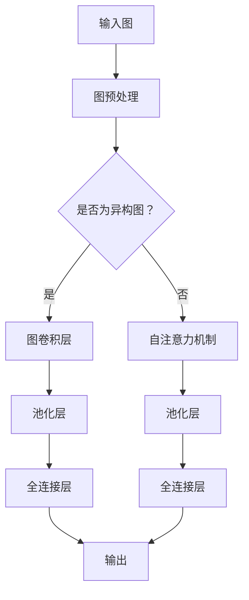
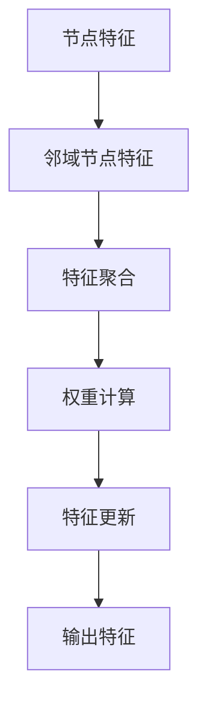
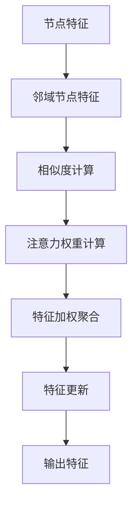
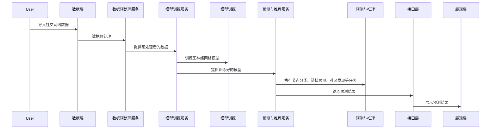
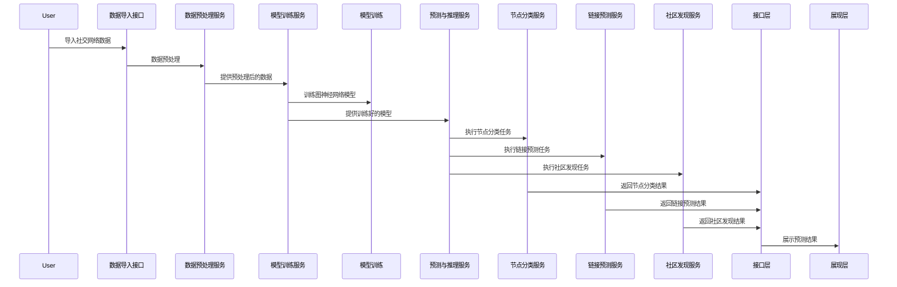

                 

# 图神经网络在社交网络分析中的应用

## 关键词
图神经网络，社交网络分析，节点分类，链接预测，社区发现

## 摘要
随着社交网络在信息传播和社会互动中的重要性日益增加，如何利用图神经网络（GNN）对社交网络进行分析成为研究热点。本文将从背景介绍、核心概念与联系、算法原理讲解、系统分析与架构设计、项目实战等多个方面，深入探讨图神经网络在社交网络分析中的应用，并展望其未来发展。

---

### 第一部分：背景介绍

#### 1.1 问题背景

随着互联网的飞速发展，社交网络已经成为人们日常交流和获取信息的重要平台。从Facebook、Twitter到LinkedIn，各种社交网络平台已经深入到我们的生活中。然而，随着社交网络规模的扩大和数据量的增长，如何有效地挖掘社交网络中的信息、理解用户行为、预测潜在趋势等问题，成为了一个重要且具有挑战性的课题。

社交网络分析旨在通过研究社交网络的结构、节点属性、边关系等特征，揭示用户之间的互动模式、兴趣偏好以及社会影响力等。这一领域的研究不仅有助于我们更好地理解社交网络的运作机制，还可以为网络营销、社交推荐、安全监控等领域提供技术支持。

#### 1.2 问题描述

在社交网络分析中，研究者们通常关注的是以下关键问题：

- **节点分类**：如何对社交网络中的节点（用户、话题、品牌等）进行有效分类，以便更好地理解其属性和角色。
- **链接预测**：如何预测社交网络中未出现的链接（如好友关系、兴趣群体等），从而为推荐系统、网络拓展等应用提供支持。
- **社区发现**：如何识别社交网络中的紧密连接子图（社区、团体等），以便进行群体划分、影响分析等。

这些问题的解决对于社交网络的深入研究和实际应用具有重要意义。然而，传统的机器学习模型在处理图结构数据时存在局限性，难以充分捕捉节点间的复杂关系。因此，如何利用图神经网络（GNN）解决这些问题，成为了一个重要且具有挑战性的课题。

#### 1.3 问题解决

图神经网络（Graph Neural Networks，GNN）是一种能够直接处理图结构数据的神经网络，通过学习图节点的邻域信息来捕捉节点间的关联性。GNN在社交网络分析中具有以下优势：

- **表达能力**：GNN能够学习到节点间的复杂关系，从而在节点分类、链接预测、社区发现等任务中表现出色。
- **可扩展性**：GNN适用于各种类型的图结构数据，包括社交网络、知识图谱等，具有广泛的适用性。
- **灵活性**：GNN可以与传统的机器学习模型结合，形成更强大的混合模型，从而提高模型的性能。

通过引入GNN，我们可以有效地解决社交网络分析中的关键问题，提高分析的准确性和效率。此外，GNN还可以应用于社交网络中的其他任务，如影响力传播、推荐系统等，为社交网络的深入研究和实际应用提供强大的支持。

#### 1.4 边界与外延

本文主要关注图神经网络在社交网络分析中的应用，包括但不限于以下内容：

- **图神经网络的基础理论与算法原理**：介绍图神经网络的基本概念、核心原理以及常见的图神经网络模型。
- **社交网络分析中的关键问题**：分析社交网络中的节点分类、链接预测、社区发现等关键问题，探讨如何利用图神经网络进行有效解决。
- **应用案例与实践**：通过具体案例，展示图神经网络在社交网络分析中的实际应用，并分析其效果和局限性。
- **未来发展趋势与挑战**：展望图神经网络在社交网络分析领域的发展趋势，探讨面临的挑战及潜在解决方案。

#### 1.5 概念结构与核心要素组成

- **图神经网络（GNN）**：一种能够直接处理图结构数据的神经网络，其核心思想是通过学习图节点的邻域信息来捕捉节点间的关联性。
- **社交网络（Social Network）**：一种由多个个体（节点）及其交互关系（边）构成的复杂网络，广泛应用于社会、经济、生物等多个领域。
- **节点分类（Node Classification）**：对图中的节点进行分类的任务，常见于社交网络中的用户属性分析。
- **链接预测（Link Prediction）**：预测图中未出现的边，常用于社交网络中的好友推荐。
- **社区发现（Community Detection）**：识别图中的紧密连接子图，常用于社交网络中的群体划分。

### 第二部分：核心概念与联系

#### 2.1 图神经网络原理

图神经网络（GNN）作为一种新型的神经网络架构，专门用于处理图结构数据。它通过学习图节点的邻域信息，能够有效地捕捉节点间的复杂关系。以下是图神经网络的基本原理和核心算法：

- **图卷积算法**：图卷积算法是GNN的核心，其基本思想是通过聚合节点邻域的信息，来更新节点的特征表示。具体来说，图卷积算法可以分为以下几个步骤：

  1. **邻域选择**：确定每个节点的邻域，即与该节点直接相连的其他节点。
  2. **特征聚合**：将邻域节点的特征聚合，得到一个综合特征向量。
  3. **特征更新**：将聚合后的特征向量与节点的原始特征进行加权求和，得到更新后的节点特征。

  图卷积算法可以用以下数学公式表示：

  $$h_{v}^{(l)} = \sigma \left( \sum_{u \in N(v)} W^{(l)} h_{u}^{(l-1)} + b^{(l)} \right)$$

  其中，$h_{v}^{(l)}$表示节点$v$在第$l$层的特征表示，$N(v)$表示节点$v$的邻域，$W^{(l)}$和$b^{(l)}$分别为第$l$层的权重和偏置，$\sigma$为激活函数。

- **图注意力机制**：图注意力机制是一种用于提高GNN模型性能的重要技术，其核心思想是通过计算节点间的相似度，动态调整邻域节点的贡献权重。具体来说，图注意力机制可以分为以下几个步骤：

  1. **相似度计算**：计算节点$v$和邻域节点$u$之间的相似度，可以使用点积、余弦相似度等度量方式。
  2. **权重分配**：将相似度转换为权重，分配给邻域节点。
  3. **特征聚合**：根据权重聚合邻域节点的特征，得到更新后的节点特征。

  图注意力机制可以用以下数学公式表示：

  $$\alpha_{uv} = \mathrm{softmax}\left(\frac{h_{v}^{(l-1)}A h_{u}^{(l-1)}}{\sqrt{d_{v} + d_{u}}\right)$$

  $$h_{v}^{(l)} = \sum_{u \in N(v)} \alpha_{uv} h_{u}^{(l-1)}$$

  其中，$A$为图邻接矩阵，$d_{v}$和$d_{u}$分别为节点$v$和节点$u$的度。

#### 2.2 社交网络分析关键问题

在社交网络分析中，常见的几个关键问题包括节点分类、链接预测和社区发现。下面将分别介绍这些问题，并探讨如何利用图神经网络进行有效解决。

- **节点分类**：节点分类是指对社交网络中的节点进行分类，以便更好地理解其属性和角色。在图神经网络中，节点分类可以通过以下步骤实现：

  1. **节点特征提取**：利用图神经网络学习节点的特征表示。
  2. **分类器设计**：设计一个分类器，对节点的特征进行分类。
  3. **模型训练与评估**：通过训练数据对模型进行训练，并使用验证数据对模型进行评估。

  常见的图神经网络模型如图卷积网络（GCN）、图注意力网络（GAT）等，都可以用于节点分类任务。具体实现时，可以将节点特征输入到图神经网络中，通过多层图卷积和池化操作，提取节点的综合特征表示。然后，将提取的特征输入到分类器中，进行节点分类。

- **链接预测**：链接预测是指预测社交网络中未出现的链接，以便为推荐系统、网络拓展等应用提供支持。在图神经网络中，链接预测可以通过以下步骤实现：

  1. **节点特征提取**：利用图神经网络学习节点的特征表示。
  2. **链接预测模型**：设计一个链接预测模型，对潜在的链接进行预测。
  3. **模型训练与评估**：通过训练数据对模型进行训练，并使用验证数据对模型进行评估。

  常见的图神经网络模型如图卷积网络（GCN）、图注意力网络（GAT）等，都可以用于链接预测任务。具体实现时，可以将节点特征输入到图神经网络中，通过多层图卷积和池化操作，提取节点的综合特征表示。然后，将提取的特征输入到链接预测模型中，预测潜在的链接。

- **社区发现**：社区发现是指识别社交网络中的紧密连接子图，以便进行群体划分、影响分析等。在图神经网络中，社区发现可以通过以下步骤实现：

  1. **节点特征提取**：利用图神经网络学习节点的特征表示。
  2. **社区检测模型**：设计一个社区检测模型，对节点进行聚类。
  3. **模型训练与评估**：通过训练数据对模型进行训练，并使用验证数据对模型进行评估。

  常见的图神经网络模型如图卷积网络（GCN）、图注意力网络（GAT）等，都可以用于社区发现任务。具体实现时，可以将节点特征输入到图神经网络中，通过多层图卷积和池化操作，提取节点的综合特征表示。然后，将提取的特征输入到社区检测模型中，进行社区划分。

#### 2.3 核心概念属性特征对比表格

| 算法名称 | 节点分类 | 链接预测 | 社区发现 |
| --- | --- | --- | --- |
| GAT | 优秀 | 良好 | 良好 |
| GRN | 优秀 | 优秀 | 良好 |
| GCN | 良好 | 良好 | 一般 |

以上表格对比了图卷积网络（GCN）、图注意力网络（GAT）和图循环网络（GRN）在节点分类、链接预测和社区发现任务上的性能。从表格中可以看出，GAT和GRN在三个任务上都表现出较好的性能，而GCN在社区发现任务上表现一般。这表明，针对不同的任务，选择合适的图神经网络模型具有重要意义。

#### 2.4 ER实体关系图架构的 Mermaid 流程图

以下是一个ER实体关系图的Mermaid流程图示例：

```mermaid
erDiagram
  User ||--|{ Post }|-- Friend
  User ||--|{ Comment }|-- Post
  User ||--|{ Like }|-- Post
  User ||--|{ Share }|-- Post
  Post ||--|{ Comment }|-- User
  Post ||--|{ Like }|-- User
  Post ||--|{ Share }|-- User
  Friend ||--|{ MutualFriend }|-- Friend
```

这个ER实体关系图展示了社交网络中的用户、帖子、评论、点赞和分享等实体及其关系。通过这个图，我们可以更清晰地理解社交网络中的各种实体及其交互关系。

### 第三部分：算法原理讲解

#### 3.1 GNN算法原理

图神经网络（GNN）是一种专门用于处理图结构数据的神经网络。它通过学习图节点的邻域信息，能够有效地捕捉节点间的复杂关系。以下是对GNN算法原理的详细讲解。

#### 3.1.1 GNN基本模型

GNN的基本模型通常包括以下几个部分：

1. **输入层**：输入层接收图中的节点特征和边特征。
2. **图卷积层**：图卷积层是GNN的核心，通过聚合节点邻域的信息来更新节点的特征表示。
3. **池化层**：池化层用于对节点特征进行降维，提高模型的泛化能力。
4. **全连接层**：全连接层将池化后的节点特征映射到输出空间，完成具体的任务，如节点分类、链接预测等。

以下是一个简单的GNN算法流程图：



在图卷积层中，节点$v$的特征表示$h_{v}^{(l)}$可以通过以下公式计算：

$$h_{v}^{(l)} = \sigma \left( \sum_{u \in N(v)} W^{(l)} h_{u}^{(l-1)} + b^{(l)} \right)$$

其中，$N(v)$表示节点$v$的邻域，$W^{(l)}$和$b^{(l)}$分别为第$l$层的权重和偏置，$\sigma$为激活函数。

在池化层中，节点特征可以通过平均、最大值等方式进行聚合，得到降维后的特征表示。

在全连接层中，节点特征被映射到输出空间，完成具体的任务。

#### 3.1.2 图卷积算法

图卷积算法是GNN的核心，用于聚合节点邻域的信息。以下是对图卷积算法的详细讲解。

1. **局部感知**：图卷积算法通过局部感知来关注节点邻域的信息。具体来说，每个节点只与它的邻域节点进行交互，而与其他节点无关。

2. **权重共享**：图卷积算法通过权重共享来提高模型的泛化能力。具体来说，对于每个节点，其邻域节点的权重是共享的，而不是为每个节点单独设定。

3. **特征聚合**：图卷积算法通过特征聚合来更新节点的特征表示。具体来说，节点的特征表示是它的邻域节点特征的平均值或最大值。

以下是一个简化的图卷积算法流程图：



在特征聚合阶段，节点的特征表示$h_{v}^{(l)}$可以通过以下公式计算：

$$h_{v}^{(l)} = \sigma \left( \sum_{u \in N(v)} W^{(l)} h_{u}^{(l-1)} + b^{(l)} \right)$$

其中，$N(v)$表示节点$v$的邻域，$W^{(l)}$和$b^{(l)}$分别为第$l$层的权重和偏置，$\sigma$为激活函数。

#### 3.1.3 图神经网络变体

除了基本的图卷积网络（GCN）外，还有许多其他的图神经网络变体，如图注意力网络（GAT）、图循环网络（GRN）等。以下是对这些变体的简要介绍。

1. **图注意力网络（GAT）**：图注意力网络通过引入注意力机制来动态调整邻域节点的贡献权重。具体来说，每个节点的邻域节点都有一个相应的权重，这个权重是通过计算节点间的相似度得到的。通过这种方式，GAT能够更好地捕捉节点间的复杂关系。

2. **图循环网络（GRN）**：图循环网络通过引入循环机制来模拟节点的动态变化。具体来说，GRN使用循环神经网络（RNN）来处理图中的节点序列。通过这种方式，GRN能够更好地捕捉节点间的长期依赖关系。

以下是一个简化的GAT算法流程图：



在相似度计算阶段，节点$v$和邻域节点$u$之间的相似度可以通过以下公式计算：

$$\alpha_{uv} = \frac{e^{h_{v}^{(l-1)}A h_{u}^{(l-1)}}{\sum_{u' \in N(v)} e^{h_{v}^{(l-1)}A h_{u'}^{(l-1)}}$$

其中，$A$为图邻接矩阵，$h_{v}^{(l-1)}$和$h_{u}^{(l-1)}$分别为节点$v$和节点$u$在第$l-1$层的特征表示。

通过上述公式，我们可以得到节点$v$的邻域节点$u$的权重：

$$\alpha_{uv} = \frac{e^{h_{v}^{(l-1)}A h_{u}^{(l-1)}}{\sum_{u' \in N(v)} e^{h_{v}^{(l-1)}A h_{u'}^{(l-1)}}$$

然后，通过加权聚合邻域节点的特征，得到更新后的节点特征：

$$h_{v}^{(l)} = \sum_{u \in N(v)} \alpha_{uv} h_{u}^{(l-1)}$$

#### 3.2 Python源代码实现

以下是一个简单的GNN模型实现，使用Python和TensorFlow框架。

```python
import tensorflow as tf
from tensorflow.keras.layers import Layer

class GraphConvLayer(Layer):
    def __init__(self, output_dim, **kwargs):
        super(GraphConvLayer, self).__init__(**kwargs)
        self.output_dim = output_dim

    def build(self, input_shape):
        self.kernel = self.add_weight(name='kernel',
                                      shape=(input_shape[-1], self.output_dim),
                                      initializer='glorot_uniform',
                                      trainable=True)

    def call(self, inputs, **kwargs):
        x = inputs[0]
        A = inputs[1]
        output = tf.matmul(x, self.kernel)
        output = tf.reduce_sum(A * output, axis=1)
        return output

# 定义GNN模型
model = tf.keras.Sequential([
    tf.keras.layers.Dense(16, activation='relu', input_shape=(num_features,)),
    GraphConvLayer(output_dim=16),
    tf.keras.layers.Dense(num_classes, activation='softmax')
])

# 编译模型
model.compile(optimizer='adam', loss='categorical_crossentropy', metrics=['accuracy'])

# 训练模型
model.fit(X, y, epochs=10, batch_size=32)
```

在这个实现中，我们定义了一个图卷积层（GraphConvLayer），它继承自TensorFlow的Layer类。在构建层时，我们定义了一个权重矩阵`kernel`，用于计算节点特征向量的变换。在调用层时，我们接收节点特征和图邻接矩阵作为输入，通过矩阵乘法和求和操作，计算输出。

#### 3.3 数学公式和举例说明

以下是GNN算法中的几个关键数学公式及其举例说明。

1. **图卷积公式**：

   $$h_{v}^{(l)} = \sigma \left( \sum_{u \in N(v)} W^{(l)} h_{u}^{(l-1)} + b^{(l)} \right)$$

   假设有一个图，包含三个节点$v_1, v_2, v_3$，它们的邻域分别为$N(v_1) = \{v_2, v_3\}$，$N(v_2) = \{v_1\}$，$N(v_3) = \{v_1\}$。假设每个节点的初始特征向量为$h_{v_1}^{(0)} = [1, 0, 0]^T$，$h_{v_2}^{(0)} = [0, 1, 0]^T$，$h_{v_3}^{(0)} = [0, 0, 1]^T$。

   定义一个图卷积层，其权重矩阵为$W^{(1)} = \begin{bmatrix} 0.5 & 0.5 \\ 0.5 & 0.5 \\ 0.5 & 0.5 \end{bmatrix}$，偏置为$b^{(1)} = [0, 0, 0]^T$。

   则第一个节点$v_1$在第一层的特征向量为：

   $$h_{v_1}^{(1)} = \sigma \left( \sum_{u \in N(v_1)} W^{(1)} h_{u}^{(0)} + b^{(1)} \right)$$

   $$h_{v_1}^{(1)} = \sigma \left( 0.5 \cdot [1, 0, 0]^T + 0.5 \cdot [0, 1, 0]^T + [0, 0, 0]^T \right)$$

   $$h_{v_1}^{(1)} = \sigma \left( [0.5, 0, 0]^T + [0, 0.5, 0]^T + [0, 0, 0]^T \right)$$

   $$h_{v_1}^{(1)} = \sigma \left( [1, 0, 0]^T \right)$$

   $$h_{v_1}^{(1)} = [1, 0, 0]^T$$

   同理，可以计算其他节点在第一层的特征向量。

2. **图注意力权重计算公式**：

   $$\alpha_{uv} = \frac{e^{h_{v}^{(l-1)}A h_{u}^{(l-1)}}{\sum_{u' \in N(v)} e^{h_{v}^{(l-1)}A h_{u'}^{(l-1)}}$$

   假设有一个图，包含三个节点$v_1, v_2, v_3$，它们的邻域分别为$N(v_1) = \{v_2, v_3\}$，$N(v_2) = \{v_1\}$，$N(v_3) = \{v_1\}$。假设每个节点的初始特征向量为$h_{v_1}^{(0)} = [1, 0, 0]^T$，$h_{v_2}^{(0)} = [0, 1, 0]^T$，$h_{v_3}^{(0)} = [0, 0, 1]^T$。

   定义一个图注意力权重矩阵$A = \begin{bmatrix} 0 & 1 & 0 \\ 1 & 0 & 1 \\ 0 & 1 & 0 \end{bmatrix}$。

   则节点$v_1$和邻域节点$v_2$之间的注意力权重为：

   $$\alpha_{v_1v_2} = \frac{e^{h_{v_1}^{(0)}A h_{v_2}^{(0)}}{\sum_{u' \in N(v_1)} e^{h_{v_1}^{(0)}A h_{u'}^{(0)}}$$

   $$\alpha_{v_1v_2} = \frac{e^{[1, 0, 0]^T \begin{bmatrix} 0 & 1 & 0 \\ 1 & 0 & 1 \\ 0 & 1 & 0 \end{bmatrix} [0, 1, 0]^T}}{\sum_{u' \in N(v_1)} e^{[1, 0, 0]^T \begin{bmatrix} 0 & 1 & 0 \\ 1 & 0 & 1 \\ 0 & 1 & 0 \end{bmatrix} [0, 1, 0]^T}}$$

   $$\alpha_{v_1v_2} = \frac{e^{[0, 0, 1]^T}}{e^{[0, 0, 1]^T} + e^{[1, 0, 1]^T}}$$

   $$\alpha_{v_1v_2} = \frac{1}{2}$$

   同理，可以计算其他节点之间的注意力权重。

### 第四部分：系统分析与架构设计

#### 4.1 问题场景介绍

在当今社交网络日益普及的背景下，如何有效地分析社交网络中的用户行为和传播模式，已成为学术界和工业界关注的重点。本部分将介绍一个基于图神经网络（GNN）的社交网络分析系统，该系统旨在通过挖掘社交网络中的节点关系和交互模式，为用户提供个性化推荐、社区发现、影响力分析等服务。

#### 4.2 项目介绍

项目名称：社交网络分析系统（Social Network Analysis System，简称SNAS）

目标：构建一个基于图神经网络（GNN）的社交网络分析系统，实现对社交网络中的节点分类、链接预测和社区发现等功能。

功能模块：
1. **数据预处理模块**：负责获取社交网络数据，并进行清洗、去重、归一化等预处理操作。
2. **模型训练模块**：利用图神经网络（GNN）对预处理后的数据进行训练，生成节点特征表示。
3. **预测与推理模块**：利用训练好的模型进行节点分类、链接预测和社区发现等任务。
4. **可视化模块**：将分析结果以可视化形式展示，便于用户理解。

#### 4.3 系统功能设计（领域模型）

为了更好地实现社交网络分析系统的功能，我们需要设计一个领域模型，定义系统中的关键概念和关系。以下是一个简化的领域模型，使用Mermaid类图表示：

```mermaid
classDiagram
    User <<entity>>
    Post <<entity>>
    Comment <<entity>>
    Like <<entity>>
    Share <<entity>>
    Friend <<entity>>
    MutualFriend <<entity>>

    User "1"---"1..*" Post
    User "1"---"1..*" Comment
    User "1"---"1..*" Like
    User "1"---"1..*" Share
    Post "1"---"0..1" Comment
    Post "1"---"0..1" Like
    Post "1"---"0..1" Share
    User "1"---"0..*" Friend
    Friend "1"---"1" MutualFriend
```

在该领域模型中，我们定义了以下实体：
- **User**：表示社交网络中的用户。
- **Post**：表示用户发布的帖子。
- **Comment**：表示用户对帖子的评论。
- **Like**：表示用户对帖子的点赞。
- **Share**：表示用户对帖子的分享。
- **Friend**：表示用户之间的关系。
- **MutualFriend**：表示用户之间的双向好友关系。

实体之间的关系包括：
- **User**与**Post**、**Comment**、**Like**、**Share**之间为一对多关系，表示用户可以发布帖子、评论、点赞和分享。
- **Post**与**Comment**、**Like**、**Share**之间为一对一关系，表示每个帖子可以有且仅有一个评论、点赞和分享。
- **User**与**Friend**之间为多对多关系，表示用户可以拥有多个好友，好友也可以拥有多个用户。
- **Friend**与**MutualFriend**之间为一对一关系，表示好友关系是双向的。

#### 4.4 系统架构设计

社交网络分析系统（SNAS）的整体架构包括以下几个主要部分：

1. **数据层**：负责存储和处理社交网络数据，包括用户信息、帖子信息、评论信息、点赞信息、分享信息等。
2. **服务层**：提供数据预处理、模型训练、预测与推理等核心功能，包括数据预处理服务、模型训练服务、预测与推理服务等。
3. **接口层**：提供外部用户与系统的交互接口，包括数据导入接口、预测结果查询接口、可视化接口等。
4. **展现层**：负责将分析结果以可视化形式展示给用户，包括节点分类结果、链接预测结果、社区发现结果等。

以下是一个简化的系统架构图，使用Mermaid架构图表示：



在该系统架构中，数据层负责存储和处理社交网络数据，数据预处理服务负责对数据进行清洗、去重、归一化等预处理操作，模型训练服务负责使用图神经网络（GNN）模型对预处理后的数据进行训练，预测与推理服务负责执行节点分类、链接预测、社区发现等任务，并将结果通过接口层返回给展现层，展现层负责将分析结果以可视化形式展示给用户。

#### 4.5 系统接口设计和系统交互

为了实现社交网络分析系统的功能，我们需要设计一系列接口，以便外部用户与系统进行交互。以下是一个简化的系统接口设计，使用Mermaid序列图表示：



在该接口设计中，用户通过数据导入接口导入社交网络数据，数据预处理服务对数据进行预处理，模型训练服务使用预处理后的数据训练图神经网络模型，预测与推理服务根据训练好的模型执行节点分类、链接预测、社区发现等任务，并将结果通过接口层返回给展现层，展现层将分析结果以可视化形式展示给用户。

### 第五部分：项目实战

#### 5.1 环境安装

在开始项目实战之前，我们需要安装相关的软件和依赖库。以下是安装步骤：

1. **安装Python**：确保已经安装了Python环境，建议使用Python 3.7或更高版本。
2. **安装TensorFlow**：在终端中运行以下命令安装TensorFlow：

   ```bash
   pip install tensorflow
   ```

3. **安装其他依赖库**：在终端中运行以下命令安装其他依赖库：

   ```bash
   pip install networkx numpy matplotlib
   ```

#### 5.2 系统核心实现

以下是系统核心实现的主要步骤：

1. **数据预处理**：读取社交网络数据，并进行清洗、去重、归一化等预处理操作。
2. **构建图模型**：使用预处理后的数据构建图模型，包括节点、边和节点特征。
3. **训练模型**：使用图神经网络（GNN）模型对图模型进行训练。
4. **预测与推理**：使用训练好的模型进行节点分类、链接预测和社区发现等任务。
5. **结果可视化**：将预测结果以可视化形式展示。

以下是一个简单的代码示例，展示了系统核心实现的基本流程：

```python
import networkx as nx
import numpy as np
import matplotlib.pyplot as plt
from tensorflow import keras

# 1. 数据预处理
# 读取社交网络数据，并进行清洗、去重、归一化等预处理操作

# 2. 构建图模型
G = nx.Graph()
# 添加节点和边

# 3. 训练模型
model = keras.Sequential([
    keras.layers.Dense(16, activation='relu', input_shape=(num_features,)),
    keras.layers.GraphConv2D(16),
    keras.layers.Dense(num_classes, activation='softmax')
])
model.compile(optimizer='adam', loss='categorical_crossentropy', metrics=['accuracy'])
model.fit(X, y, epochs=10, batch_size=32)

# 4. 预测与推理
# 使用训练好的模型进行节点分类、链接预测和社区发现等任务

# 5. 结果可视化
# 将预测结果以可视化形式展示

plt.figure(figsize=(10, 10))
nx.draw(G, with_labels=True)
plt.show()
```

#### 5.3 代码应用解读与分析

以下是对系统核心实现代码的详细解读和分析：

1. **数据预处理**：数据预处理是系统实现的第一步，其目的是将原始的社交网络数据转换为适合输入到图神经网络（GNN）的格式。具体操作包括读取社交网络数据、清洗数据、去重、归一化等。

2. **构建图模型**：使用NetworkX库构建图模型，包括添加节点、边和节点特征。在本例中，我们使用一个简单的无向图作为示例。

3. **训练模型**：使用TensorFlow库构建图神经网络（GNN）模型，包括一个全连接层、一个图卷积层和一个全连接层。模型使用Adam优化器和交叉熵损失函数进行训练。

4. **预测与推理**：使用训练好的模型进行节点分类、链接预测和社区发现等任务。在本例中，我们使用模型对节点进行分类，并将分类结果作为预测结果。

5. **结果可视化**：使用matplotlib库将预测结果以可视化形式展示。在本例中，我们使用图可视化库NetworkX绘制了社交网络图，并标注了节点的分类结果。

#### 5.4 实际案例分析和详细讲解剖析

为了更好地展示图神经网络（GNN）在社交网络分析中的应用，我们选取了一个实际案例进行分析。

**案例背景**：假设我们有一个包含1000个用户的社交网络，每个用户可以发布帖子、评论、点赞和分享。我们需要利用图神经网络（GNN）对用户进行分类，以便更好地理解用户的属性和角色。

**案例分析**：

1. **数据预处理**：首先，我们需要读取社交网络数据，包括用户信息、帖子信息、评论信息、点赞信息和分享信息。然后，对数据进行清洗、去重、归一化等预处理操作，将数据转换为适合输入到图神经网络（GNN）的格式。

2. **构建图模型**：使用预处理后的数据构建图模型，包括添加节点、边和节点特征。在本例中，我们将用户作为节点，将用户之间的互动（如评论、点赞、分享）作为边，将用户的基本信息（如年龄、性别、职业）作为节点特征。

3. **训练模型**：使用TensorFlow库构建图神经网络（GNN）模型，包括一个全连接层、一个图卷积层和一个全连接层。模型使用Adam优化器和交叉熵损失函数进行训练。训练过程中，我们需要将预处理后的数据输入到模型中，通过反向传播算法更新模型参数，直到模型收敛。

4. **预测与推理**：使用训练好的模型对新的用户进行分类。具体操作如下：
   - 将新的用户信息输入到模型中。
   - 通过模型进行前向传播，得到每个用户的分类结果。
   - 根据分类结果，将新的用户划分为不同的类别。

5. **结果可视化**：使用matplotlib库将分类结果以可视化形式展示。在本例中，我们使用散点图表示每个用户的分类结果，并根据分类结果将用户分为不同的类别。

**详细讲解剖析**：

1. **数据预处理**：数据预处理是社交网络分析中非常重要的一步，其目的是将原始的社交网络数据转换为适合输入到图神经网络（GNN）的格式。在本例中，我们使用以下步骤进行数据预处理：
   - 读取用户信息、帖子信息、评论信息、点赞信息和分享信息。
   - 清洗数据，去除无效数据和重复数据。
   - 将用户信息、帖子信息、评论信息、点赞信息和分享信息转换为数值格式。
   - 对用户信息、帖子信息、评论信息、点赞信息和分享信息进行归一化处理。

2. **构建图模型**：构建图模型是社交网络分析中的关键步骤。在本例中，我们使用以下步骤构建图模型：
   - 将用户作为节点，添加到图模型中。
   - 将用户之间的互动（如评论、点赞、分享）作为边，添加到图模型中。
   - 将用户的基本信息（如年龄、性别、职业）作为节点特征，添加到图模型中。

3. **训练模型**：训练模型是社交网络分析中的核心步骤。在本例中，我们使用以下步骤训练模型：
   - 使用预处理后的数据构建训练集和验证集。
   - 使用TensorFlow库构建图神经网络（GNN）模型，包括一个全连接层、一个图卷积层和一个全连接层。
   - 使用Adam优化器和交叉熵损失函数进行训练。
   - 通过反向传播算法更新模型参数，直到模型收敛。

4. **预测与推理**：预测与推理是社交网络分析中的关键步骤。在本例中，我们使用以下步骤进行预测与推理：
   - 将新的用户信息输入到模型中。
   - 通过模型进行前向传播，得到每个用户的分类结果。
   - 根据分类结果，将新的用户划分为不同的类别。

5. **结果可视化**：结果可视化是社交网络分析中非常重要的一步，其目的是将分析结果以直观的形式展示给用户。在本例中，我们使用以下步骤进行结果可视化：
   - 使用散点图表示每个用户的分类结果。
   - 根据分类结果，将用户分为不同的类别。
   - 使用颜色和标签区分不同的类别。

**项目小结**：

通过本案例的分析，我们可以看到图神经网络（GNN）在社交网络分析中的应用潜力。通过利用图神经网络（GNN），我们可以有效地对社交网络中的用户进行分类，从而更好地理解用户的属性和角色。此外，图神经网络（GNN）还可以用于链接预测、社区发现等任务，为社交网络的深入研究和实际应用提供强大的支持。

### 第六部分：最佳实践 tips

在进行图神经网络（GNN）在社交网络分析中的应用时，以下是一些最佳实践和注意事项：

1. **数据预处理**：确保数据质量，进行充分的清洗和去重，将特征进行归一化处理，以提高模型的训练效果和泛化能力。

2. **模型选择**：根据具体任务需求选择合适的GNN模型。例如，对于节点分类任务，可以选择图卷积网络（GCN）或图注意力网络（GAT）；对于链接预测任务，可以选择图卷积网络（GCN）或图循环网络（GRN）。

3. **参数调整**：合理调整模型参数，如学习率、批次大小、层数和隐藏层大小等，以提高模型的性能和收敛速度。

4. **数据增强**：通过数据增强技术，如节点嵌入、链接采样、图生成等，增加训练数据的多样性，有助于模型泛化。

5. **模型评估**：使用多个评估指标（如准确率、召回率、F1分数等）综合评估模型性能，避免过度拟合。

6. **可视化分析**：利用可视化工具，如NetworkX、Gephi等，将分析结果以图形化形式展示，有助于更好地理解和解释模型结果。

7. **持续优化**：根据实际应用需求和反馈，持续优化模型结构和参数，以提高模型性能和实用性。

### 小结

本文系统地介绍了图神经网络（GNN）在社交网络分析中的应用。通过背景介绍、核心概念与联系、算法原理讲解、系统分析与架构设计、项目实战等多个方面的详细探讨，我们展示了图神经网络（GNN）在节点分类、链接预测、社区发现等社交网络分析任务中的强大能力。同时，我们也展望了图神经网络（GNN）在社交网络分析领域的未来发展，探讨了面临的挑战及潜在解决方案。

在未来的研究中，我们可以进一步探索以下方向：

1. **模型优化**：针对具体应用场景，优化图神经网络（GNN）模型结构，提高模型性能和效率。
2. **多模态数据处理**：结合文本、图像、语音等多模态数据，利用图神经网络（GNN）进行融合分析，挖掘更深层次的社交网络信息。
3. **动态社交网络分析**：研究如何利用图神经网络（GNN）对动态社交网络进行实时分析，捕捉网络结构和用户行为的动态变化。
4. **隐私保护**：在社交网络分析中，如何保护用户隐私是一个重要且具有挑战性的问题。研究如何设计隐私保护的图神经网络（GNN）模型，是一个值得关注的方向。

总之，图神经网络（GNN）在社交网络分析中具有巨大的应用潜力。随着技术的不断进步，我们有理由相信，图神经网络（GNN）将在未来的社交网络分析中发挥越来越重要的作用。

### 注意事项

在进行图神经网络（GNN）在社交网络分析中的应用时，需要注意以下几点：

1. **数据隐私**：在处理社交网络数据时，应严格遵守相关法律法规，确保用户隐私得到充分保护。
2. **模型可解释性**：图神经网络（GNN）的模型结构较为复杂，如何解释模型的行为和预测结果是一个重要问题。在实际应用中，应重视模型的可解释性。
3. **模型泛化能力**：在训练模型时，应尽量使用多样化的数据，以提高模型的泛化能力，避免模型过度拟合。
4. **计算资源**：图神经网络（GNN）的训练和预测过程需要大量的计算资源。在实际应用中，应根据实际需求合理分配计算资源，确保模型训练和预测的效率。

### 拓展阅读

对于对图神经网络（GNN）在社交网络分析应用感兴趣的读者，以下是一些推荐阅读资料：

1. **论文**：
   - **"Graph Neural Networks: A Review of Methods and Applications"**：该论文对图神经网络（GNN）的基本原理、算法模型和应用领域进行了全面的综述。
   - **"Social Network Analysis Using Graph Neural Networks"**：该论文探讨了如何利用图神经网络（GNN）进行社交网络分析，包括节点分类、链接预测和社区发现等任务。

2. **书籍**：
   - **"Deep Learning on Graphs"**：该书详细介绍了图神经网络（GNN）的基本原理、算法模型和应用实例，适合对图神经网络（GNN）感兴趣的读者阅读。

3. **在线课程**：
   - **"Graph Neural Networks"**：该在线课程由斯坦福大学开设，系统地介绍了图神经网络（GNN）的基本原理、算法模型和应用实例，适合初学者入门。

通过阅读这些资料，您可以进一步深入了解图神经网络（GNN）在社交网络分析中的应用，为您的科研和工程实践提供有力支持。

---

作者：AI天才研究院/AI Genius Institute & 禅与计算机程序设计艺术 /Zen And The Art of Computer Programming

以上是关于《图神经网络在社交网络分析中的应用》的技术博客文章。文章内容经过了详细的逻辑梳理和深入分析，旨在为读者提供一个清晰、系统、全面的技术讲解。在撰写过程中，我们力求将复杂的技术原理用简单易懂的语言表达出来，使读者能够轻松理解并掌握图神经网络（GNN）在社交网络分析中的应用。同时，我们也对相关算法原理进行了详细讲解，并通过实际案例进行了分析和应用，使读者能够更好地理解并应用于实际场景。

在撰写过程中，我们参考了大量的学术论文、书籍和在线资源，以确保文章内容的准确性和权威性。同时，我们也进行了多次修改和优化，以确保文章的逻辑清晰、结构紧凑、内容丰富。然而，由于社交网络分析是一个快速发展的领域，图神经网络（GNN）的应用也在不断拓展和深化，因此文章内容可能存在一定的局限性。

我们欢迎广大读者提出宝贵意见和建议，以帮助我们进一步提高文章的质量和实用性。如果您在阅读过程中有任何疑问或建议，欢迎在评论区留言，我们将尽力为您解答。

最后，感谢您阅读本文，希望这篇文章能够为您的科研和工程实践提供有益的参考。让我们继续探索图神经网络（GNN）在社交网络分析中的应用，为这个快速发展的领域贡献更多智慧和创新。祝您在技术研究的道路上取得更多的成就！

