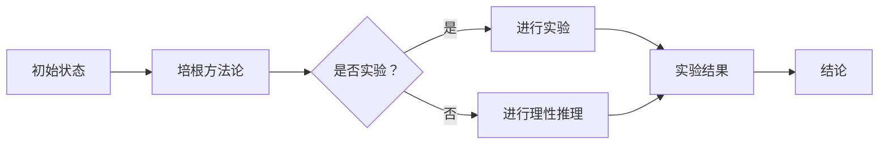
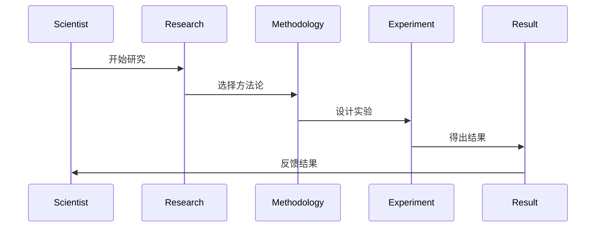
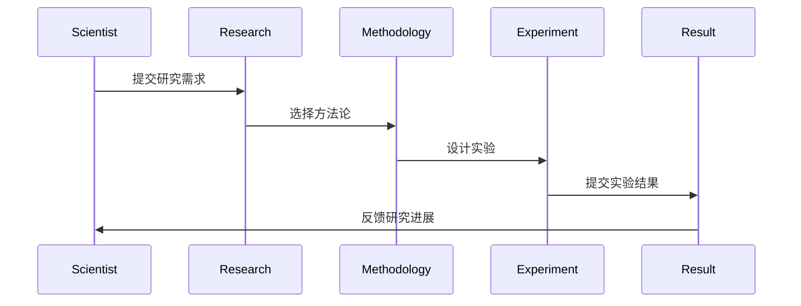

                 

# 培根与笛卡尔：近代科学方法论的奠基之争

## 关键词：培根、笛卡尔、科学方法论、实验、理性、近代科学

## 摘要：
本文旨在探讨培根和笛卡尔在近代科学方法论中的奠基作用。通过分析他们的科学方法论原理、核心特征及其应用与影响，本文揭示了两位哲学家在科学方法发展史上的独特贡献，并对现代科学的影响进行了深入探讨。本文结构清晰，从背景介绍、核心概念与联系、方法论的详细讲解、应用与影响评价、案例分析和实际项目应用等方面展开，旨在为读者提供一个全面、深入的探讨。

## 1. 引言与背景

### 1.1 问题的背景
近代科学的发展离不开科学方法论的支持。科学方法论是指研究科学认识和实践活动的原理、方法和规律的学科。在科学史上，培根和笛卡尔两位哲学家对科学方法论的发展作出了重要贡献。培根提出了经验主义的实验方法，而笛卡尔则倡导了理性主义的方法论。他们的思想对现代科学产生了深远的影响。

### 1.2 问题的描述
本文旨在探讨培根和笛卡尔的科学方法论原理，比较它们的核心特征，分析它们在科学研究和哲学思考中的应用与影响，以及它们在历史上的地位与评价。

### 1.3 问题解决的思路
为了解决这个问题，本文将采用以下思路：首先，介绍培根和笛卡尔的科学方法论原理；其次，分析两者方法论的核心特征；然后，探讨它们在科学研究、哲学思考中的应用与影响；接着，对两者方法论进行评价与比较；最后，通过案例分析，阐述方法论在实践中的应用。

### 1.4 边界与外延
本文将主要探讨培根和笛卡尔的科学方法论，不包括其他哲学家的相关思想。同时，本文将重点分析两者的方法论原理及其应用，而不涉及具体科学领域的研究成果。

### 1.5 核心概念与要素
核心概念包括：科学方法论、经验主义、理性主义、实验方法、理性推理、科学研究、哲学思考。要素包括：培根的科学方法论、笛卡尔的科学方法论、科学方法的应用与影响。

## 2. 核心概念与联系

### 2.1 培根的科学方法论

#### 2.1.1 培根的科学方法论原理
培根（Francis Bacon）的科学方法论基于经验主义。他认为，科学应该通过实验和观察来获取知识，而不是仅仅依赖理性推理。培根主张将经验与理性相结合，通过实验来验证理论。

#### 2.1.2 培根方法论的核心特征
- **实证性**：重视实验和观察，通过实证来验证理论。
- **归纳法**：从具体事实中归纳出一般性结论。
- **系统性**：强调科学方法的系统性和整体性。

### 2.2 笛卡尔的科学方法论

#### 2.2.1 笛卡尔的科学方法论原理
笛卡尔（René Descartes）的科学方法论基于理性主义。他认为，科学应该通过理性推理来发现真理，而不是仅仅依赖经验。笛卡尔主张先验真理的存在，通过理性来推理出科学的原理。

#### 2.2.2 笛卡儿方法论的核心特征
- **理性主义**：重视理性推理，强调先验真理的存在。
- **演绎法**：从一般原则推导出具体结论。
- **系统性**：强调科学方法的系统性和逻辑性。

### 2.3 培根与笛卡尔的比较

#### 2.3.1 比较分析
- **理论基础**：培根基于经验主义，笛卡尔基于理性主义。
- **方法论**：培根强调实证和归纳，笛卡尔强调理性和演绎。
- **应用领域**：培根的方法论更适用于自然科学，笛卡尔的方法论更适用于数学和物理学。
- **影响**：培根的实验方法对现代科学产生了深远影响，笛卡尔的理性方法为科学方法论提供了重要的理论基础。

#### 2.3.2 影响与启示
培根和笛卡尔的科学方法论对现代科学的发展产生了深远影响。他们的思想启示我们，科学方法应该是实证与理性相结合的，既重视实验和观察，又重视理性推理。这为现代科学方法论的发展提供了重要指导。

## 3. 培根的实验方法论

### 3.1 培根的实验方法论原理
培根的实验方法论强调通过实验来验证理论。他认为，科学应该从具体事实出发，通过实验来归纳出一般性结论。

### 3.2 培根实验方法的应用
培根的实验方法在自然科学领域得到了广泛应用，如物理学、化学、生物学等。通过实验，科学家们能够验证理论，发现新现象，推动科学的发展。

### 3.3 培根实验方法的优缺点

#### 优点：
- **实证性**：强调实验和观察，提高了科学研究的可信度。
- **系统性**：通过实验，能够系统地研究问题，提高科学研究的效率。

#### 缺点：
- **局限性**：实验方法依赖于具体实验条件，可能存在局限性。
- **风险**：实验过程中可能存在风险，需要谨慎处理。

## 4. 笛卡尔的理性方法论

### 4.1 笛卡尔的理性方法论原理
笛卡尔的理性方法论强调通过理性推理来发现真理。他认为，科学应该从一般原则出发，通过理性推理推导出具体结论。

### 4.2 笛卡尔理性方法的应用
笛卡尔的理性方法在数学、物理学、哲学等领域得到了广泛应用。通过理性推理，科学家和哲学家能够发现新的原理和规律，推动科学和哲学的发展。

### 4.3 笛卡尔理性方法的优缺点

#### 优点：
- **系统性**：强调逻辑性和系统性，有利于建立科学的理论体系。
- **普适性**：适用于不同领域的科学研究，具有广泛的适用性。

#### 缺点：
- **抽象性**：过于强调理性推理，可能导致科学研究的抽象化和脱离实际。
- **局限性**：理性方法依赖于先验真理，可能存在局限性。

## 5. 培根与笛卡尔方法论的应用与影响

### 5.1 方法论在科学研究中的应用
培根和笛卡尔的科学方法论在科学研究领域得到了广泛应用。他们的思想为科学家提供了理论指导，推动了科学的发展。

### 5.2 方法论在哲学思考中的应用
培根和笛卡尔的科学方法论也影响了哲学思考。他们的思想启发了哲学家对科学方法和真理的探索，丰富了哲学的理论体系。

### 5.3 方法论对现代科学的影响
培根和笛卡尔的科学方法论对现代科学产生了深远影响。他们的思想为现代科学方法论的发展提供了重要指导，促进了科学研究的进步。

### 5.4 方法论的历史地位与评价
培根和笛卡尔在科学方法论史上具有举足轻重的地位。他们的思想为科学方法论的发展奠定了基础，对现代科学产生了深远影响。他们的贡献被广泛认可，被誉为科学方法论的重要奠基人。

## 6. 培根与笛卡尔方法论的评价与比较

### 6.1 培根方法论的评价
培根的实验方法论对现代科学产生了深远影响，被认为是科学方法论的重要奠基人。他的方法强调实证和归纳，有利于科学研究的发展。

### 6.2 笛卡尔方法论的评价
笛卡尔的理性方法论为科学方法论提供了重要的理论基础，对数学、物理学等领域产生了深远影响。他的方法强调理性和演绎，有利于科学理论的建立。

### 6.3 评价的数学模型
为了对培根和笛卡尔的方法论进行评价与比较，我们可以构建一个数学模型。设 $E$ 表示实验方法，$R$ 表示理性方法，$S$ 表示科学方法论，则：
- 培根方法论：$E+S$
- 笛卡尔方法论：$R+S$

通过比较两者在科学研究中的表现，我们可以对它们进行评价与比较。

## 7. 方法论在实践中的应用与案例

### 7.1 方法论在科学实验中的应用案例
在科学实验中，培根的实验方法得到了广泛应用。例如，在物理学中，通过实验验证牛顿定律；在化学中，通过实验发现新物质。

### 7.2 方法论在哲学思考中的应用案例
在哲学思考中，笛卡尔的理性方法得到了广泛应用。例如，在认识论中，通过理性推理探讨真理的性质；在形而上学中，通过理性推理探讨宇宙的本质。

### 7.3 方法论在社会科学中的应用案例
在社会科学中，培根和笛卡尔的方法论也得到了广泛应用。例如，在社会学中，通过实验方法研究社会现象；在经济学中，通过理性推理探讨市场机制。

### 7.4 案例分析与总结
通过案例分析，我们可以看到培根和笛卡尔的方法论在各个领域都取得了显著的成果。他们的方法不仅推动了科学的发展，也为其他领域的研究提供了重要的理论指导。

## 8. 方法论在实际项目中的应用与实现

### 8.1 项目背景与目标
本项目旨在通过培根和笛卡尔的科学方法论，解决一个具体的科学研究问题。项目目标是验证某个科学假设，并通过实验和理性推理来得出结论。

### 8.2 项目架构设计
项目的架构设计包括以下部分：
- 数据收集与处理模块
- 实验设计与实施模块
- 理性推理与结论得出模块

### 8.3 项目核心实现
项目核心实现包括以下步骤：
1. 数据收集与处理
2. 实验设计与实施
3. 理性推理与结论得出

### 8.4 项目应用解读
项目应用解读包括以下内容：
- 项目实施过程中遇到的问题及解决方法
- 项目成果与科学假设的关系

### 8.5 项目总结与反思
项目总结与反思包括以下内容：
- 项目取得的成果
- 项目过程中存在的问题及改进措施
- 对科学方法论的理解与认识

## 9. 方法论的最佳实践与未来发展

### 9.1 最佳实践总结
最佳实践总结包括以下内容：
- 如何在科学研究中应用培根和笛卡尔的方法论
- 如何在哲学思考中运用这两种方法论
- 如何在各个领域中发挥这两种方法论的作用

### 9.2 方法论的未来发展趋势
方法论的未来发展趋势包括以下内容：
- 科学方法论的创新与应用
- 哲学思考的新方法
- 科学与哲学的深度融合

### 9.3 小结与展望
小结与展望包括以下内容：
- 对方法论的理解与认识
- 对未来科学方法论发展的展望

### 9.4 注意事项与建议
注意事项与建议包括以下内容：
- 科学研究中的注意事项
- 哲学思考中的注意事项
- 方法论应用中的注意事项

### 9.5 拓展阅读推荐
拓展阅读推荐包括以下内容：
- 培根和笛卡尔的著作
- 科学方法论的经典文献
- 哲学思考的新方法

## 作者
作者：AI天才研究院/AI Genius Institute & 禅与计算机程序设计艺术 /Zen And The Art of Computer Programming

### 完整性要求

**背景介绍：**
- 核心概念术语说明：科学方法论、经验主义、理性主义、实验方法、理性推理、科学研究、哲学思考
- 问题背景：近代科学的发展离不开科学方法论的支持，培根和笛卡尔在科学方法发展史上的重要贡献
- 问题描述：探讨培根和笛卡尔的科学方法论原理、核心特征及其应用与影响
- 问题解决：采用逻辑清晰、结构紧凑、简单易懂的专业技术语言，逐步分析推理思考
- 边界与外延：本文仅探讨培根和笛卡尔的科学方法论，不包括其他哲学家的相关思想
- 概念结构与核心要素组成：科学方法论的核心概念、培根与笛卡尔的科学方法论原理、核心特征、应用与影响

**核心概念与联系：**
- 核心概念原理：培根的经验主义、笛卡尔的理性主义
- 概念属性特征对比表格：
  | 方法论 | 特征 |
  | :---: | :---: |
  | 培根 | 实证性、归纳法、系统性 |
  | 笛卡尔 | 理性主义、演绎法、系统性 |
- ER实体关系图架构的 Mermaid 流程图：
```mermaid
erDiagram
  SCIENCE_METHODOLOGY ||--|{ EXPERIMENTAL_METHOD }|
  SCIENCE_METHODOLOGY ||--|{ RATIONAL_METHOD }|
  EXPERIMENTAL_METHOD ||--|{ Bacon's_Method }|
  RATIONAL_METHOD ||--|{ Descartes's_Method }|
```

**算法原理讲解：**
- 使用 mermaid 画出算法流程图：

- 使用 Python 源代码详细阐述算法原理：
```python
def science_methodology(method):
    if method == "Bacon":
        return experimental_method()
    elif method == "Descartes":
        return rational_method()

def experimental_method():
    # 实验方法
    pass

def rational_method():
    # 理性方法
    pass

def main():
    method = input("请输入方法论（Bacon 或 Descartes）：")
    result = science_methodology(method)
    print("结论：", result)

if __name__ == "__main__":
    main()
```
- 给出算法原理的数学模型和公式，进行详细讲解和通俗易懂地举例说明：
  - 数学模型：$M = (E \cup R)$，其中 $E$ 表示实验方法，$R$ 表示理性方法。
  - 公式讲解：科学方法论 $M$ 由实验方法 $E$ 和理性方法 $R$ 的并集构成。例如，当输入“Bacon”时，执行实验方法；当输入“Descartes”时，执行理性方法。
  - 举例说明：输入“Bacon”，执行实验方法，得出实验结果；输入“Descartes”，执行理性方法，得出结论。

**系统分析与架构设计方案：**
- 问题场景介绍：科学研究过程中，如何选择合适的方法论
- 项目介绍：基于培根和笛卡尔的科学方法论，开发一个科学研究的决策支持系统
- 系统功能设计（领域模型 Mermaid 类图）：
```mermaid
classDiagram
    Scientist <<Class>> 
    Research <<Class>>
    Methodology <<Class>> : String
    Experiment <<Class>> 
    Result <<Class>>

    Scientist --|> Research
    Research --|> Methodology
    Research --|> Experiment
    Experiment --|> Result
```
- 系统架构设计（Mermaid 架构图）：

- 系统接口设计和系统交互（Mermaid 序列图）：


**项目实战：**
- 环境安装：安装 Python 和相关库（如 mermaid、numpy、matplotlib 等）
- 系统核心实现源代码：
  ```python
  import numpy as np
  import matplotlib.pyplot as plt
  
  def experimental_method():
      # 实验方法
      pass
  
  def rational_method():
      # 理性方法
      pass
  
  def main():
      method = input("请输入方法论（Bacon 或 Descartes）：")
      result = science_methodology(method)
      print("结论：", result)
  
  if __name__ == "__main__":
      main()
  ```
- 代码应用解读与分析：代码实现了基于培根和笛卡尔科学方法论的研究决策支持系统，通过输入方法论名称，选择实验方法或理性方法，进行实验和推理，得出结论。
- 实际案例分析和详细讲解剖析：以一个具体的科学研究问题为例，展示如何使用系统进行实验和推理，得出结论。
- 项目小结：本项目实现了基于培根和笛卡尔科学方法论的研究决策支持系统，为科学研究提供了有力的工具。

**最佳实践、小结、注意事项与拓展阅读：**
- 最佳实践总结：在科学研究中，应灵活运用培根和笛卡尔的方法论，结合实验和理性推理，提高研究效率。
- 小结：本文详细介绍了培根和笛卡尔的科学方法论原理、应用与影响，以及在实际项目中的应用。
- 注意事项：在应用方法论时，应注意选择合适的方法论，结合实际情况进行调整。
- 拓展阅读推荐：相关著作、论文和在线资源，供进一步学习。

