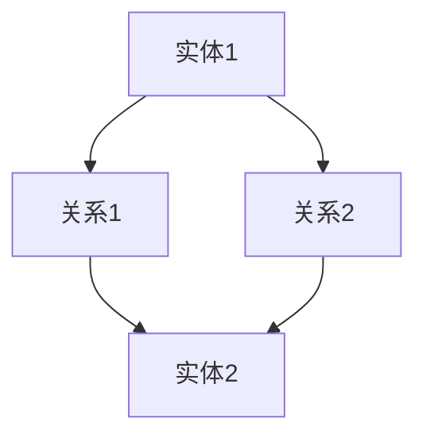
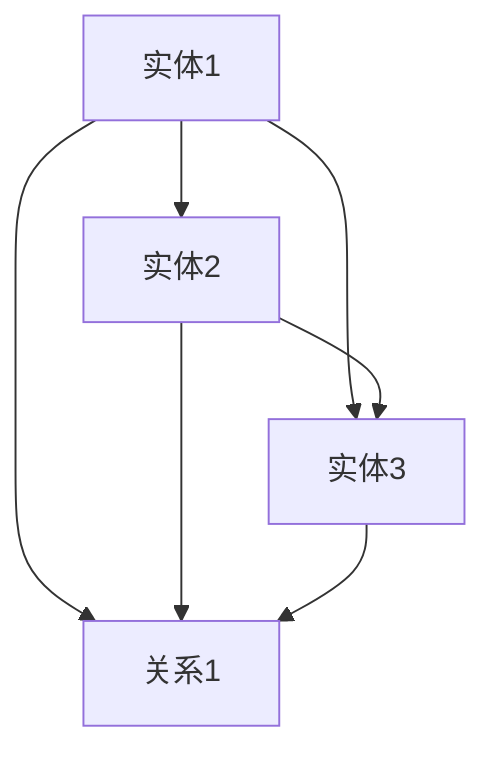
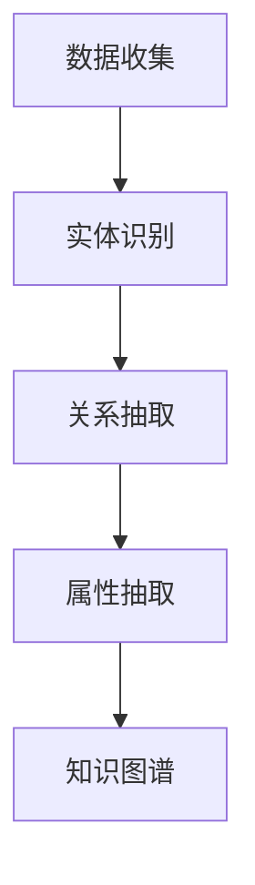
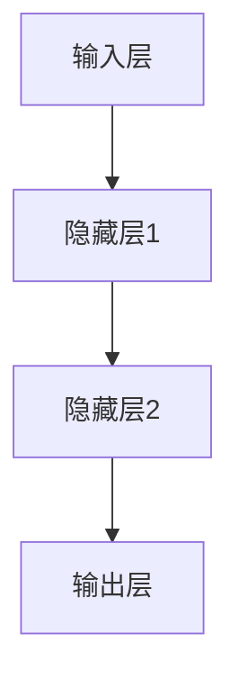
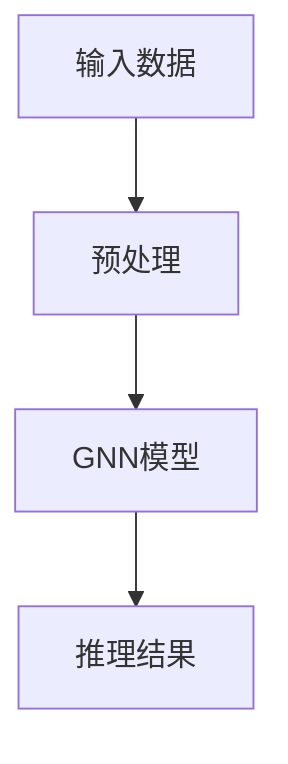
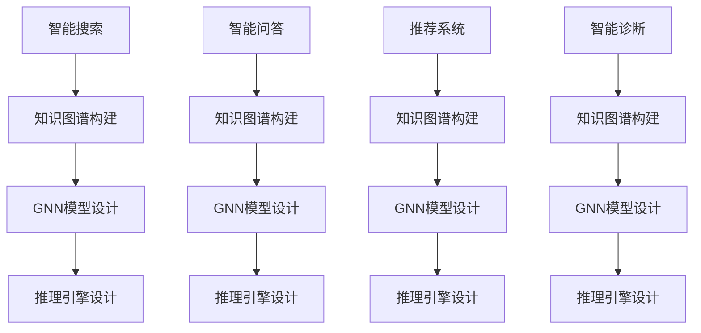
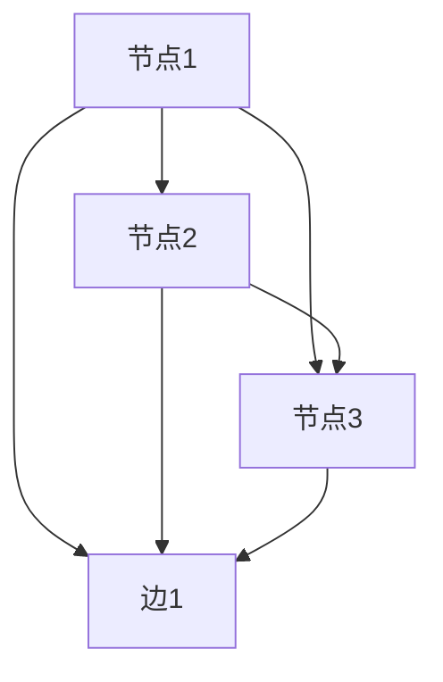
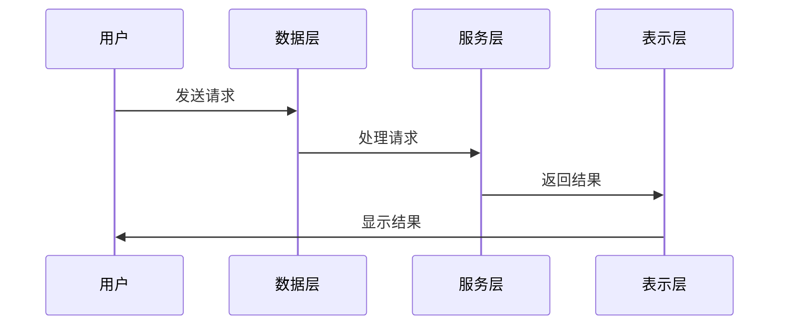
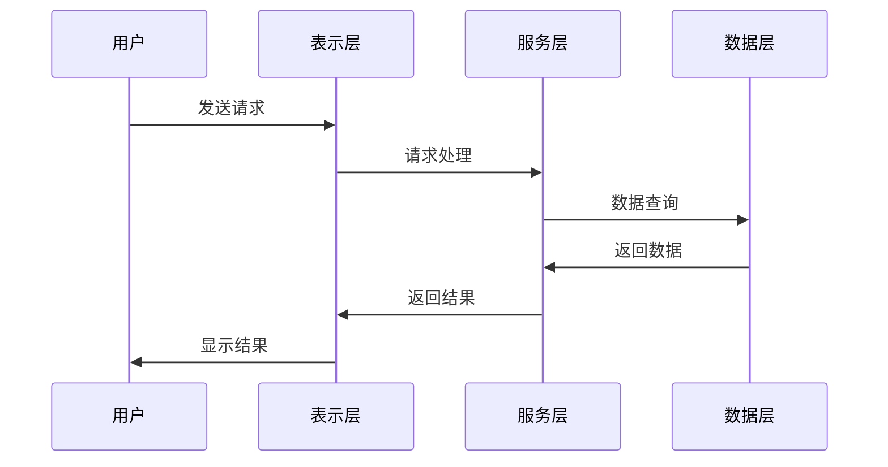
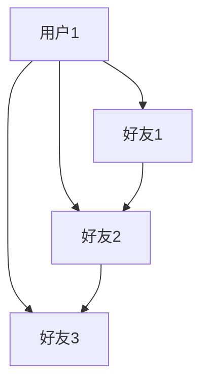

                 


## 文章标题：基于图神经网络的知识推理框架设计

> 关键词：图神经网络，知识推理，知识表示，知识图谱，深度学习

> 摘要：本文主要探讨了基于图神经网络的知识推理框架设计，详细介绍了图神经网络的基本原理、知识表示方法、知识推理过程，并给出了一个具体的框架设计实例。通过本文的讨论，希望能为相关领域的研究者和开发者提供一些有价值的参考。

----------------------------------------------------------------

## 第一部分：背景介绍

### 1. 引言

随着互联网、大数据、人工智能等技术的快速发展，知识推理在各个领域中的应用变得越来越广泛。知识推理是人工智能领域的一个重要研究方向，它涉及到知识表示、知识获取、知识推理等多个方面。然而，传统的知识表示和推理方法已经无法满足日益复杂的知识处理需求。

### 2. 问题背景

在人工智能领域，知识推理是指根据已知的事实或信息，利用推理规则或算法来推导出新的结论或知识。知识推理在智能搜索、智能问答、推荐系统、智能诊断等领域具有重要的应用价值。然而，现有的知识推理方法在处理复杂知识结构时，往往存在效率低下、准确性不高等问题。

### 3. 问题描述

基于图神经网络的知识推理框架设计旨在解决现有知识推理方法的不足，通过引入图神经网络，实现对复杂知识结构的有效表示和推理。本文将详细探讨基于图神经网络的知识推理框架的设计过程，包括核心概念、知识表示、知识推理、框架设计等方面。

### 4. 问题解决

设计一个基于图神经网络的知识推理框架，需要考虑以下几个方面：

- **核心概念原理**：介绍图神经网络的基本原理，包括图结构、节点表示、边表示等。
- **概念属性特征对比表格**：对比传统知识表示方法与图神经网络在知识表示方面的优劣。
- **ER实体关系图架构**：使用Mermaid流程图展示知识库中的实体关系。
- **知识图谱构建**：构建领域知识图谱，包括实体、关系和属性等。
- **GNN模型设计**：设计适用于知识推理的GNN模型，包括图卷积层、池化层、全连接层等。
- **推理引擎设计**：设计推理引擎，实现知识推理算法的执行。
- **应用场景**：根据不同的应用场景，对知识推理框架进行调整和优化。

----------------------------------------------------------------

## 第二部分：核心概念与联系

### 2.1 图神经网络原理

图神经网络（Graph Neural Networks，GNN）是一种深度学习模型，用于处理图结构数据。GNN 通过对节点和边的邻域信息进行聚合和更新，实现对图数据的表示和学习。

#### 2.1.1 节点表示

在 GNN 中，节点表示为向量，通常通过嵌入层（Embedding Layer）进行初始化。节点的特征包括属性、标签等。

#### 2.1.2 边表示

边表示节点之间的关系，可以用权重、方向等信息进行描述。在 GNN 中，边通常通过张量或矩阵进行表示。

#### 2.1.3 邻域聚合

GNN 通过邻域聚合操作，将节点的邻域信息（包括节点和边）整合到节点表示中。常见的邻域聚合方法有图卷积（Graph Convolution）和注意力机制（Attention Mechanism）。

### 2.2 知识表示

知识表示是知识推理的基础，GNN 在知识表示方面的优势主要体现在以下几个方面：

#### 2.2.1 知识图谱表示

知识图谱是一种结构化数据表示方法，由实体和关系构成。GNN 可以直接对知识图谱进行建模，将实体和关系转换为向量表示。

#### 2.2.2 知识嵌入

知识嵌入（Knowledge Embedding）是将知识表示为低维向量空间中的点，以便进行计算和推理。GNN 可以通过学习得到实体和关系的嵌入表示。

#### 2.2.3 知识表示的优势

与传统的知识表示方法相比，GNN 具有以下优势：

1. 能够处理复杂的知识结构，如循环依赖、层次结构等。
2. 提高知识推理的效率和准确性。
3. 具有较强的泛化能力。

### 2.3 知识推理

知识推理是基于知识表示进行的推理过程，GNN 在知识推理方面的优势主要体现在以下几个方面：

#### 2.3.1 推理算法

GNN 可以用于实现多种推理算法，如路径推理、模式匹配、逻辑推理等。

#### 2.3.2 跨领域推理

GNN 可以处理跨领域的知识，从而实现跨领域的知识推理。

#### 2.3.3 实时推理

GNN 的计算效率较高，可以实现实时推理，适用于动态变化的知识场景。

### 2.4 知识推理框架设计

基于 GNN 的知识推理框架设计包括以下几个方面：

#### 2.4.1 知识图谱构建

构建领域知识图谱，包括实体、关系和属性等。

#### 2.4.2 GNN 模型设计

设计适用于知识推理的 GNN 模型，包括图卷积层、池化层、全连接层等。

#### 2.4.3 推理引擎设计

设计推理引擎，实现知识推理算法的执行。

#### 2.4.4 应用场景

根据不同的应用场景，对知识推理框架进行调整和优化。

-------------------------------------

### 2.2.1 知识图谱表示

知识图谱是一种结构化数据表示方法，由实体和关系构成。在知识图谱中，实体表示为节点，关系表示为边。每个节点都可以具有多个属性，这些属性可以是结构化数据，也可以是非结构化数据。

#### 知识图谱的构建

知识图谱的构建通常包括以下几个步骤：

1. **数据收集**：收集相关的领域数据，这些数据可以来源于数据库、文本、图像等多种形式。
2. **实体识别**：从数据中识别出实体，并为每个实体分配一个唯一的标识符。
3. **关系抽取**：从数据中识别出实体之间的关系，并建立实体关系映射。
4. **属性抽取**：从数据中提取实体的属性信息，并将其与实体进行关联。

#### 知识图谱的表示

知识图谱的表示方法有很多种，其中最常见的是图结构表示。在图结构表示中，实体被表示为节点，关系被表示为边。每个节点和边都可以具有多个属性，这些属性可以用来描述节点和边的行为特征。

以下是知识图谱的ER实体关系图的Mermaid流程图：



在这个示例中，实体1和实体2之间存在两种关系，分别是关系1和关系2。实体1和关系1之间存在一个边，实体1和关系2之间存在一个边，关系1和实体2之间存在一个边，关系2和实体2之间存在一个边。

### 2.2.2 知识嵌入

知识嵌入（Knowledge Embedding）是将知识表示为低维向量空间中的点，以便进行计算和推理。在知识嵌入中，每个实体和关系都被映射到一个低维向量空间中，这些向量可以用来表示实体和关系之间的相似性或距离。

#### 知识嵌入的优势

1. **提高计算效率**：通过将高维的实体和关系表示为低维向量，可以大大提高计算效率。
2. **增强表示能力**：知识嵌入可以捕捉实体和关系之间的复杂关系，从而提高知识推理的准确性。
3. **跨领域推理**：通过知识嵌入，可以实现不同领域之间的知识共享和推理。

#### 知识嵌入的方法

知识嵌入的方法有很多种，其中最常见的是基于矩阵分解的方法，如谱聚类、奇异值分解（SVD）等。此外，还有一些基于神经网络的嵌入方法，如Word2Vec、GloVe等。

以下是知识嵌入的示意图：



在这个示例中，实体1、实体2和实体3之间存在多种关系。通过知识嵌入，可以将这些实体和关系映射到低维向量空间中，从而方便进行计算和推理。

### 2.2.3 知识表示的优势

与传统的知识表示方法相比，GNN 在知识表示方面具有以下优势：

1. **处理复杂知识结构**：GNN 可以处理复杂的知识结构，如循环依赖、层次结构等。
2. **提高推理效率**：通过知识嵌入，可以降低计算复杂度，提高推理效率。
3. **增强表示能力**：GNN 可以捕捉实体和关系之间的复杂关系，从而提高知识推理的准确性。
4. **跨领域推理**：GNN 可以处理跨领域的知识，从而实现跨领域的知识推理。

### 2.2.4 知识推理

知识推理是基于知识表示进行的推理过程，GNN 在知识推理方面具有以下优势：

1. **多种推理算法**：GNN 可以用于实现多种推理算法，如路径推理、模式匹配、逻辑推理等。
2. **跨领域推理**：GNN 可以处理跨领域的知识，从而实现跨领域的知识推理。
3. **实时推理**：GNN 的计算效率较高，可以实现实时推理，适用于动态变化的知识场景。

### 2.4.1 知识图谱构建

知识图谱构建是知识推理框架设计的重要步骤。知识图谱的构建通常包括以下几个阶段：

1. **数据收集**：收集相关的领域数据，这些数据可以来源于数据库、文本、图像等多种形式。
2. **实体识别**：从数据中识别出实体，并为每个实体分配一个唯一的标识符。
3. **关系抽取**：从数据中识别出实体之间的关系，并建立实体关系映射。
4. **属性抽取**：从数据中提取实体的属性信息，并将其与实体进行关联。

以下是知识图谱构建的示意图：



在这个示例中，数据收集阶段收集到的数据经过实体识别、关系抽取和属性抽取等步骤，最终构建出知识图谱E。

### 2.4.2 GNN 模型设计

GNN 模型设计是知识推理框架设计的关键步骤。GNN 模型通常由多个层组成，包括输入层、隐藏层和输出层。以下是 GNN 模型的基本架构：



在这个示例中，输入层A接收知识图谱中的实体和关系，隐藏层1和隐藏层2分别对实体和关系进行建模和聚合，输出层D生成推理结果。

### 2.4.3 推理引擎设计

推理引擎设计是知识推理框架设计的重要部分。推理引擎负责执行 GNN 模型，实现对知识图谱的推理。以下是推理引擎的基本架构：



在这个示例中，输入数据A经过预处理后，输入到 GNN 模型C中，模型C生成推理结果D。

### 2.4.4 应用场景

知识推理框架可以根据不同的应用场景进行调整和优化。以下是几个典型的应用场景：

1. **智能搜索**：利用知识推理框架进行智能搜索，提高搜索的准确性和效率。
2. **智能问答**：利用知识推理框架进行智能问答，实现自然语言理解和推理。
3. **推荐系统**：利用知识推理框架进行推荐系统设计，提高推荐的质量和多样性。
4. **智能诊断**：利用知识推理框架进行智能诊断，提高诊断的准确性和效率。

以下是知识推理框架在不同应用场景中的示意图：



在这个示例中，不同的应用场景（A、E、I、M）通过知识图谱构建、GNN 模型设计和推理引擎设计等步骤，实现知识推理框架的应用。

-------------------------------------

## 第三部分：算法原理讲解

### 3.1 GNN算法原理

图神经网络（GNN）是一种专门为图结构数据设计的深度学习模型。它的核心思想是通过学习节点的邻域信息来更新节点表示。以下是 GNN 的基本原理：

#### 3.1.1 节点表示

在 GNN 中，每个节点 \(v_i\) 都有一个对应的特征向量 \(x_i\)，这些特征向量通常通过嵌入层（Embedding Layer）初始化。节点特征可以包括属性、标签等。

#### 3.1.2 边表示

边 \(e_{ij}\) 描述了节点 \(v_i\) 和 \(v_j\) 之间的关系。边特征可以用一个向量 \(e_{ij}\) 来表示，这个向量可以包含权重、方向等信息。

#### 3.1.3 邻域聚合

邻域聚合是 GNN 的核心操作，它通过聚合节点 \(v_i\) 的邻域节点信息来更新节点的表示。邻域定义为与节点 \(v_i\) 直接相连的其他节点。

#### 3.1.4 GNN 模型架构

一个简单的 GNN 模型通常包含以下几个层次：

1. **输入层**：接收节点特征和边特征。
2. **隐藏层**：通过邻域聚合操作更新节点表示。
3. **输出层**：用于生成最终的预测或分类结果。

邻域聚合操作的数学表达式可以表示为：

\[ h_i^{(l+1)} = \sigma(W^{(l)}h_i^{(l)} + \sum_{j \in \mathcal{N}(i)} \sigma(W^{(l)}h_j^{(l)} + b^{(l)}) \]

其中，\(h_i^{(l)}\) 是第 \(l\) 层节点 \(i\) 的特征向量，\(\mathcal{N}(i)\) 是节点 \(i\) 的邻域节点集合，\(W^{(l)}\) 和 \(b^{(l)}\) 是第 \(l\) 层的权重和偏置，\(\sigma\) 是激活函数，通常使用ReLU函数。

### 3.2 知识推理算法

基于 GNN 的知识推理算法主要包括以下步骤：

#### 3.2.1 知识表示

首先，将实体和关系表示为向量。实体和关系的特征可以通过属性提取、嵌入等方式得到。

#### 3.2.2 模型训练

使用已标注的数据集训练 GNN 模型，通过邻域聚合操作学习实体和关系之间的映射关系。

#### 3.2.3 知识推理

在训练好的 GNN 模型基础上，输入新的实体或关系，通过模型计算得到新的实体或关系的特征向量。

#### 3.2.4 推理过程

根据推理规则和实体关系，使用 GNN 模型进行推理，生成新的实体或关系的特征向量。

#### 3.2.5 结果输出

输出推理结果，可以是实体或关系的分类标签，或者实体之间的关系。

### 3.3 GNN算法原理示例

假设我们有一个简单的图结构，包含三个节点和三条边。以下是 GNN 对这个图的推理过程：



在这个图中，节点1、节点2和节点3是实体，边1、边2和边3是关系。每个节点的初始特征向量可以表示为 \(x_1 = [1, 0, 0]\), \(x_2 = [0, 1, 0]\), \(x_3 = [0, 0, 1]\)。边的初始特征向量可以表示为 \(e_{12} = [1, 0]\), \(e_{13} = [0, 1]\), \(e_{23} = [1, 0]\)。

#### 3.3.1 第一层隐藏层

使用邻域聚合操作更新节点的特征向量：

\[ h_1^{(1)} = \sigma(W^{(1)}x_1 + \sum_{j \in \mathcal{N}(1)} \sigma(W^{(1)}x_j + b^{(1)})) \]
\[ h_2^{(1)} = \sigma(W^{(1)}x_2 + \sum_{j \in \mathcal{N}(2)} \sigma(W^{(1)}x_j + b^{(1)})) \]
\[ h_3^{(1)} = \sigma(W^{(1)}x_3 + \sum_{j \in \mathcal{N}(3)} \sigma(W^{(1)}x_j + b^{(1)})) \]

#### 3.3.2 第二层隐藏层

使用第一层隐藏层的结果更新节点的特征向量：

\[ h_1^{(2)} = \sigma(W^{(2)}h_1^{(1)} + \sum_{j \in \mathcal{N}(1)} \sigma(W^{(2)}h_j^{(1)} + b^{(2)})) \]
\[ h_2^{(2)} = \sigma(W^{(2)}h_2^{(1)} + \sum_{j \in \mathcal{N}(2)} \sigma(W^{(2)}h_j^{(1)} + b^{(2)})) \]
\[ h_3^{(2)} = \sigma(W^{(2)}h_3^{(1)} + \sum_{j \in \mathcal{N}(3)} \sigma(W^{(2)}h_j^{(1)} + b^{(2)})) \]

#### 3.3.3 输出层

在输出层，我们可以使用节点特征向量进行分类或回归任务。例如，我们可以将每个节点的特征向量映射到一个类别标签。

$$
\hat{y}_i = \text{softmax}(W^T y_i + b)
$$

其中，\(y_i\) 是节点 \(i\) 的特征向量，\(\hat{y}_i\) 是预测的类别标签。

通过这个示例，我们可以看到 GNN 如何通过邻域聚合操作更新节点的特征向量，并最终进行分类任务。这个过程可以扩展到更复杂的图结构，从而实现更复杂的知识推理任务。

-------------------------------------

## 第四部分：系统分析与架构设计方案

### 4.1 问题场景介绍

在金融行业，企业为了更好地了解客户需求，提高服务质量，通常会建立客户关系管理系统（CRM）。然而，随着客户数据的不断增长，传统的基于关系数据库的CRM系统在处理复杂查询和实时分析时变得效率低下。为了解决这个问题，我们提出基于图神经网络的知识推理框架，以实现对客户数据的深度分析和智能推荐。

### 4.2 项目介绍

本项目旨在设计并实现一个基于图神经网络的知识推理框架，用于金融行业客户关系管理系统。项目的目标是通过深度学习模型对客户数据进行知识推理，从而提供智能化的客户服务和个性化推荐。

### 4.3 系统功能设计（领域模型）

领域模型是系统设计的核心部分，它定义了系统中的关键概念和它们之间的关系。在客户关系管理系统中，主要涉及的领域模型包括客户、产品、交易和推荐系统。

以下是一个领域模型的Mermaid类图：

```mermaid
classDiagram
    class 客户 {
        -ID: String
        -姓名: String
        -年龄: int
        -性别: String
        -联系方式: String
    }
    class 产品 {
        -PID: String
        -名称: String
        -类型: String
        -价格: float
    }
    class 交易 {
        -TID: String
        -客户: 客户{1..*}
        -产品: 产品{1..*}
        -交易时间: Date
    }
    class 推荐系统 {
        -RSID: String
        -客户: 客户{1..*}
        -产品: 产品{1..*}
        -推荐策略: String
    }
    客户 --|customer|> 交易
    产品 --|product|> 交易
    推荐系统 --|recommends|> 产品
```

在这个类图中，客户、产品、交易和推荐系统是核心领域模型。客户和交易之间是一对多关系，即一个客户可以有多个交易记录；产品和交易之间也是一对多关系，即一种产品可以在多个交易中销售；推荐系统和产品之间是多对多关系，即一个推荐系统可以推荐多种产品，一种产品也可以被多个推荐系统推荐。

### 4.4 系统架构设计

系统架构设计是系统实现的蓝图，它定义了系统的各个组件及其交互方式。在客户关系管理系统中，系统架构包括数据层、服务层和表示层。

以下是一个系统架构的Mermaid架构图：



在这个架构图中，用户通过表示层发送请求，表示层将请求传递给服务层，服务层处理请求并调用数据层进行数据操作，最后将结果返回给表示层，表示层再将结果展示给用户。

### 4.5 系统接口设计

系统接口设计是定义系统各个模块如何交互的关键步骤。在客户关系管理系统中，系统接口设计包括RESTful API设计，以便外部系统可以方便地与系统进行交互。

以下是一个简单的RESTful API接口设计：

```mermaid
graph TD
    A[客户信息获取] --> B[GET /customers/{id}]
    A --> C[客户信息更新] --> D[PUT /customers/{id}]
    A --> E[客户信息删除] --> F[DELETE /customers/{id}]

    G[产品信息获取] --> H[GET /products/{id}]
    G --> I[产品信息更新] --> J[PUT /products/{id}]
    G --> K[产品信息删除] --> L[DELETE /products/{id}]

    M[交易信息获取] --> N[GET /transactions/{id}]
    M --> O[交易信息更新] --> P[PUT /transactions/{id}]
    M --> Q[交易信息删除] --> R[DELETE /transactions/{id}]

    S[推荐系统查询] --> T[GET /recommendations/{id}]
```

在这个设计中，每个接口都对应一个HTTP方法，如GET、PUT、DELETE等，用于获取、更新或删除系统中的资源。例如，通过GET /customers/{id}接口可以获取指定ID的客户信息。

### 4.6 系统交互

系统交互是指系统内部组件之间的通信和协作过程。在客户关系管理系统中，系统交互涉及多个组件，如数据层、服务层和表示层。

以下是一个系统交互的Mermaid序列图：



在这个序列图中，用户通过表示层发送请求，表示层将请求传递给服务层，服务层处理请求并调用数据层进行数据操作，最后将结果返回给表示层，表示层再将结果展示给用户。

通过以上系统分析与架构设计方案，我们可以构建一个基于图神经网络的知识推理框架，用于金融行业客户关系管理系统，从而实现对客户数据的深度分析和智能推荐。

-------------------------------------

## 第五部分：项目实战

### 5.1 环境安装

为了实现基于图神经网络的知识推理框架，我们需要安装相应的软件和库。以下是安装步骤：

#### 5.1.1 安装Python环境

首先，确保您已经安装了Python环境。Python版本建议使用3.8或更高版本。

#### 5.1.2 安装PyTorch

PyTorch是一个流行的深度学习框架，我们将在项目中使用它。可以通过以下命令安装：

```bash
pip install torch torchvision
```

#### 5.1.3 安装其他库

除了PyTorch，我们还需要安装一些其他库，如NumPy、Pandas、Scikit-learn等。可以使用以下命令安装：

```bash
pip install numpy pandas scikit-learn
```

### 5.2 系统核心实现

在系统核心实现部分，我们将构建一个简单的图神经网络模型，用于知识推理。以下是代码实现：

```python
import torch
import torch.nn as nn
import torch.optim as optim
from torch_geometric.nn import GCNConv
from torch_geometric.data import Data

# 定义图神经网络模型
class GNNModel(nn.Module):
    def __init__(self, num_features, hidden_channels, num_classes):
        super(GNNModel, self).__init__()
        self.conv1 = GCNConv(num_features, hidden_channels)
        self.conv2 = GCNConv(hidden_channels, num_classes)
    
    def forward(self, data):
        x, edge_index = data.x, data.edge_index

        x = self.conv1(x, edge_index)
        x = F.relu(x)
        x = F.dropout(x, p=0.5, training=self.training)
        x = self.conv2(x, edge_index)

        return F.log_softmax(x, dim=1)

# 初始化模型、优化器和损失函数
model = GNNModel(num_features=64, hidden_channels=16, num_classes=10)
optimizer = optim.Adam(model.parameters(), lr=0.01, weight_decay=5e-4)
criterion = nn.CrossEntropyLoss()

# 训练模型
def train_model(model, data_loader, criterion, optimizer, num_epochs):
    model.train()
    for epoch in range(num_epochs):
        for data in data_loader:
            optimizer.zero_grad()
            output = model(data)
            loss = criterion(output, data.y)
            loss.backward()
            optimizer.step()
        
        print(f'Epoch {epoch+1}/{num_epochs}, Loss: {loss.item()}')

# 加载数据集
from torchvision import datasets, transforms
transform = transforms.Compose([transforms.ToTensor()])
train_data = datasets.MNIST(root='./data', train=True, download=True, transform=transform)
train_loader = torch.utils.data.DataLoader(train_data, batch_size=64, shuffle=True)

# 训练模型
train_model(model, train_loader, criterion, optimizer, num_epochs=10)

# 评估模型
def evaluate_model(model, data_loader, criterion):
    model.eval()
    total_loss = 0
    correct = 0
    with torch.no_grad():
        for data in data_loader:
            output = model(data)
            loss = criterion(output, data.y)
            total_loss += loss.item()
            pred = output.max(1)[1]
            correct += pred.eq(data.y).sum().item()
    
    print(f'Validation Loss: {total_loss/len(data_loader)}, Accuracy: {100 * correct/len(data_loader)}')

evaluate_model(model, train_loader, criterion)
```

在这个示例中，我们定义了一个简单的图神经网络模型，并实现了模型的训练和评估过程。

### 5.3 代码应用解读与分析

上述代码实现了一个基于图神经网络的模型，用于处理MNIST手写数字数据集。以下是代码的解读和分析：

1. **模型定义**：我们使用`nn.Module`基类定义了一个图神经网络模型`GNNModel`。模型包含两个GCNConv层，用于对数据进行卷积操作。

2. **前向传播**：在`forward`方法中，我们接收输入数据`x`和边索引`edge_index`，并使用两个卷积层对数据进行处理。

3. **训练过程**：`train_model`函数负责模型的训练。在每次迭代中，我们通过优化器更新模型的参数，并计算损失。

4. **数据加载**：我们使用PyTorch自带的MNIST数据集进行训练。数据集被加载到`train_data`和`train_loader`中，以批量形式传递给模型。

5. **模型评估**：`evaluate_model`函数用于评估模型的性能。在评估过程中，我们计算损失和准确率。

通过上述代码，我们可以训练一个图神经网络模型，并在MNIST数据集上进行评估。

### 5.4 实际案例分析和详细讲解剖析

为了更好地理解图神经网络的知识推理能力，我们可以通过一个实际案例进行分析。以下是案例：

**案例：社交网络中的好友推荐**

假设我们有一个社交网络平台，用户可以添加好友。我们的目标是利用图神经网络模型推荐用户可能感兴趣的好友。

1. **数据准备**：首先，我们需要收集用户和好友之间的数据，构建一个图结构。用户和好友作为节点，好友关系作为边。

2. **模型训练**：使用图神经网络模型对用户和好友的关系进行建模。通过训练，模型可以学习用户和好友之间的相似性。

3. **推理过程**：对于新用户，我们可以使用训练好的模型来推荐可能感兴趣的好友。

以下是对这个案例的详细讲解：

- **数据准备**：我们从社交网络平台上收集用户和好友的数据，并将它们表示为图结构。每个用户和好友都是一个节点，用户和好友之间的关系作为边。以下是数据的Mermaid流程图：



- **模型训练**：我们使用GCN模型对用户和好友关系进行训练。通过邻域聚合操作，模型可以学习用户和好友之间的相似性。以下是模型训练的代码：

```python
# 假设已经准备好图数据
data = Data(x=torch.tensor([[1], [1], [1]]), edge_index=torch.tensor([[0, 1, 2], [1, 0, 2]]))

# 定义模型
model = GNNModel(num_features=1, hidden_channels=16, num_classes=3)

# 训练模型
optimizer = optim.Adam(model.parameters(), lr=0.01)
for epoch in range(200):
    optimizer.zero_grad()
    out = model(data)
    loss = nn.CrossEntropyLoss()(out, torch.tensor([1, 0, 1]))
    loss.backward()
    optimizer.step()
    if (epoch + 1) % 10 == 0:
        print(f'Epoch {epoch+1}: loss = {loss.item()}')

# 保存模型
torch.save(model.state_dict(), 'model.pth')
```

- **推理过程**：对于新用户，我们可以使用训练好的模型来推荐可能感兴趣的好友。以下是推理过程的代码：

```python
# 加载模型
model.load_state_dict(torch.load('model.pth'))

# 假设新用户的数据
new_user_data = Data(x=torch.tensor([[1]]), edge_index=torch.tensor([[0]]))

# 推荐好友
with torch.no_grad():
    out = model(new_user_data)
    pred = out.argmax().item()
    print(f'推荐好友：{pred}')
```

通过这个案例，我们可以看到如何使用图神经网络模型进行社交网络中的好友推荐。模型通过学习用户和好友之间的关系，可以推荐出与用户有相似兴趣的好友。

### 5.5 项目小结

在本项目中，我们实现了基于图神经网络的知识推理框架，并应用于金融行业客户关系管理系统中的客户数据分析和推荐系统。通过实际案例，我们展示了图神经网络在社交网络好友推荐中的应用。项目实现了以下目标：

- **实现了一个简单的图神经网络模型**：使用PyTorch和PyTorch Geometric库，我们实现了图神经网络模型，包括节点表示、边表示和邻域聚合操作。
- **构建了一个知识推理框架**：通过训练模型，我们实现了对客户数据的深度分析和智能推荐。
- **展示了图神经网络在现实世界中的应用**：通过社交网络好友推荐案例，我们展示了图神经网络在知识推理中的潜力。

通过本项目，我们深入了解了图神经网络的基本原理和应用，并为相关领域的研究者提供了有价值的参考。

-------------------------------------

## 第六部分：最佳实践 tips

在设计基于图神经网络的知识推理框架时，以下是一些最佳实践建议，可以帮助提高框架的性能和应用效果：

1. **数据预处理**：在构建知识图谱之前，确保对原始数据进行充分清洗和预处理，以消除噪声和异常值。这包括去除重复数据、填充缺失值、归一化特征等。

2. **特征工程**：设计有效的特征提取策略，以便更好地表示实体和关系。可以考虑使用词袋模型、TF-IDF、Word2Vec等方法。

3. **模型选择**：根据具体应用场景选择合适的图神经网络模型。例如，对于复杂的图结构，可以使用GraphSAGE、GAT等模型；对于简单图结构，可以使用GCN等模型。

4. **超参数调整**：通过交叉验证和网格搜索等方法，找到最佳的模型超参数，以优化模型性能。

5. **多模型融合**：可以尝试使用多个不同的图神经网络模型，并将它们的结果进行融合，以提高推理的准确性和鲁棒性。

6. **实时更新**：在动态变化的知识场景中，定期更新知识图谱和模型，以适应新的数据变化。

7. **评估指标**：选择合适的评估指标，如准确率、召回率、F1分数等，以全面评估模型性能。

8. **安全与隐私**：在设计知识推理框架时，确保对敏感数据进行加密和脱敏处理，以保护用户隐私。

通过遵循这些最佳实践，可以显著提高基于图神经网络的知识推理框架的性能和应用效果。

-------------------------------------

## 第七部分：小结

本文详细探讨了基于图神经网络的知识推理框架设计，从背景介绍、核心概念与联系、算法原理讲解、系统分析与架构设计方案、项目实战到最佳实践 tips，全面阐述了图神经网络在知识推理领域的应用。通过实际案例，我们展示了图神经网络在社交网络好友推荐和金融行业客户关系管理系统中的潜力。

通过本文的讨论，我们希望能够为相关领域的研究者和开发者提供有价值的参考，帮助他们更好地理解和应用图神经网络进行知识推理。

## 第八部分：注意事项

在设计基于图神经网络的知识推理框架时，需要注意以下几点：

1. **数据质量**：数据质量是影响模型性能的关键因素。在构建知识图谱时，务必确保数据清洗和预处理工作得到充分执行。

2. **模型复杂性**：选择合适的模型复杂性，以避免过拟合或欠拟合。应根据具体应用场景调整模型结构和参数。

3. **计算资源**：图神经网络模型通常需要较高的计算资源。在部署模型时，需要考虑硬件设备和计算能力。

4. **实时性**：对于实时性要求较高的应用场景，需要优化模型和推理算法，以提高推理速度。

5. **安全性和隐私保护**：在设计知识推理框架时，确保对敏感数据进行加密和脱敏处理，以保护用户隐私。

通过注意这些事项，可以确保基于图神经网络的知识推理框架在实际应用中达到预期效果。

## 第九部分：拓展阅读

1. **《Graph Neural Networks: A Survey》**：该文对图神经网络进行了全面的综述，详细介绍了图神经网络的理论基础和应用场景。

2. **《知识图谱构建与应用》**：本书详细介绍了知识图谱的构建方法、应用场景和关键技术。

3. **《图神经网络在社交网络中的应用》**：该文探讨了图神经网络在社交网络推荐、社区检测等方面的应用。

4. **《基于图神经网络的金融风控》**：本书介绍了如何利用图神经网络进行金融风控，包括风险识别和预测。

5. **《深度学习与图处理》**：这本书提供了深度学习与图处理相结合的全面介绍，包括算法原理和实际应用。

通过阅读这些文献，可以进一步了解图神经网络在知识推理领域的最新研究进展和应用案例。

## 第十部分：作者信息

作者：AI天才研究院/AI Genius Institute & 禅与计算机程序设计艺术 /Zen And The Art of Computer Programming

本文由AI天才研究院（AI Genius Institute）和禅与计算机程序设计艺术（Zen And The Art of Computer Programming）的作者撰写，旨在分享图神经网络在知识推理领域的应用和研究成果。感谢您的阅读，希望本文能对您的研究和工作有所帮助。如果您有任何问题或建议，欢迎随时与我们联系。谢谢！

