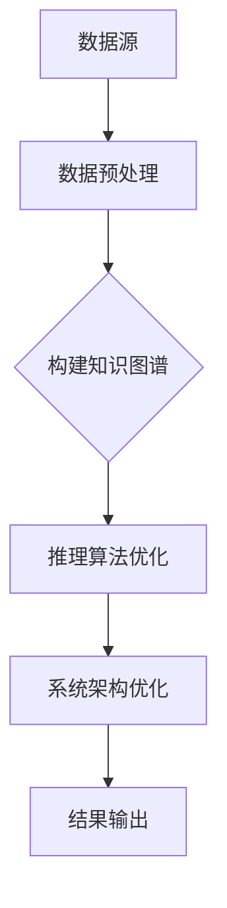
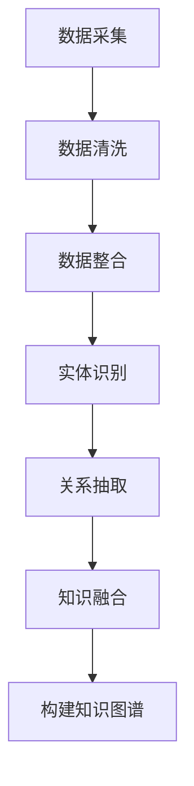
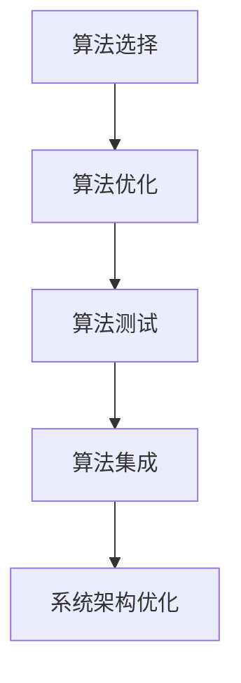
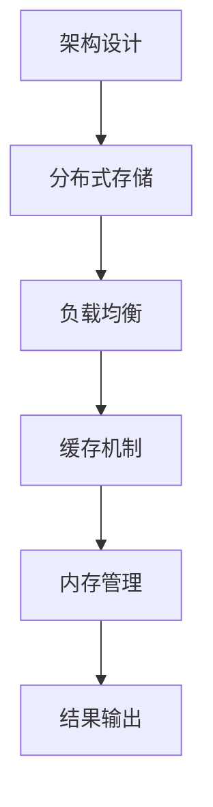

                 

### # 基于知识图谱的大规模推理系统优化技术

关键词：知识图谱、大规模推理、系统优化、算法、架构设计

摘要：本文深入探讨了基于知识图谱的大规模推理系统的优化技术。首先，我们介绍了大规模推理系统及其在人工智能应用中的重要地位，并详细阐述了知识图谱的核心概念和构建方法。接着，我们分析了大规模推理系统中的优化技术，包括推理算法优化和系统架构优化。最后，通过实际项目和最佳实践，我们展示了如何有效地设计和实施这些优化技术。本文旨在为读者提供一个全面的技术指南，帮助他们理解和应用知识图谱在大规模推理系统优化中的关键作用。

## 第一部分: 背景介绍与核心概念

### 第1章: 问题背景与定义

#### 1.1 问题背景

在大数据时代，信息量的爆炸式增长对数据处理和推理技术提出了前所未有的挑战。传统的关系数据库和简单的推理算法已经难以满足现代应用的需求。大规模推理系统因其能够处理海量数据和复杂的推理任务而成为人工智能领域的重要研究方向。然而，随着数据规模的增加，推理速度和效率的问题愈发突出。为了应对这一挑战，知识图谱作为一种结构化的知识表示方法，被广泛应用于大规模推理系统。

#### 1.1.1 大规模推理系统的重要性

大规模推理系统在多个领域具有重要应用，包括社交网络分析、金融风险评估、医疗信息处理等。这些应用需要高效、准确的推理能力来处理复杂的业务逻辑和海量数据。例如，在社交网络分析中，大规模推理系统可以用于用户兴趣识别、社区发现和推荐系统；在金融风险评估中，可以用于风险识别、欺诈检测和信用评分；在医疗信息处理中，可以用于疾病预测、个性化诊疗和药物研发。

#### 1.1.2 知识图谱在推理系统中的应用

知识图谱通过将实体和关系表示为图结构，为大规模推理提供了强大的支持。知识图谱可以存储海量的实体和关系，并且支持高效的图查询和推理操作。例如，在社交网络分析中，知识图谱可以表示用户及其关系，从而快速识别社区结构和传播路径；在金融风险评估中，知识图谱可以表示客户和交易关系，帮助识别潜在风险；在医疗信息处理中，知识图谱可以表示疾病、药物和患者之间的关系，用于疾病诊断和治疗建议。

#### 1.1.3 优化技术的需求与挑战

尽管知识图谱在大规模推理系统中具有巨大的潜力，但仍然面临着一系列挑战。首先，随着数据规模的增加，知识图谱的存储和查询效率成为关键问题。其次，推理算法的性能和可扩展性需要进一步提升。此外，系统架构的设计和优化也是确保推理系统能够高效运行的重要环节。因此，优化技术在大规模推理系统中至关重要。

### 1.2 核心概念

#### 1.2.1 大规模推理系统概述

大规模推理系统是一种用于处理大规模数据集的推理系统，它通过利用先进的算法和优化技术，能够快速、准确地处理复杂的推理任务。大规模推理系统通常包括数据预处理、知识图谱构建、推理算法执行和结果输出等主要模块。

#### 1.2.2 知识图谱原理

知识图谱是一种用于表示实体及其关系的图结构，它由节点（实体）、边（关系）和属性（标签）组成。知识图谱的核心思想是将现实世界中的各种实体和关系抽象为图结构，从而实现高效的数据存储和推理操作。知识图谱的表示方法包括基于属性图、基于三元组和基于图神经网络等。

#### 1.2.3 优化技术概念解析

优化技术是指通过改进算法、系统架构和数据存储方式等手段，提升大规模推理系统的性能和效率。常见的优化技术包括推理算法优化、系统架构优化和数据处理优化等。推理算法优化主要关注算法的复杂度和准确性；系统架构优化主要关注系统的可扩展性和可靠性；数据处理优化主要关注数据存储和查询的效率。

### 1.3 概念结构与核心要素

#### 1.3.1 大规模推理系统架构

大规模推理系统的架构通常包括数据源、数据预处理模块、知识图谱构建模块、推理算法执行模块和结果输出模块。每个模块都需要进行优化，以确保系统的整体性能。

#### 1.3.2 知识图谱要素分析

知识图谱的要素包括实体、关系和属性。实体是知识图谱中的基本单元，表示现实世界中的对象；关系表示实体之间的关联；属性则用于描述实体和关系的特征。知识图谱的优化主要关注如何高效地表示和存储这些要素，以及如何利用这些要素进行推理操作。

#### 1.3.3 优化技术分类与特征

优化技术可以根据其作用对象和目的进行分类。例如，推理算法优化主要关注算法的复杂度和准确性；系统架构优化主要关注系统的可扩展性和可靠性；数据处理优化主要关注数据存储和查询的效率。不同类型的优化技术具有不同的特征和应用场景，但它们共同的目标是提升大规模推理系统的性能和效率。

## 第二部分: 知识图谱在大规模推理系统中的应用

### 第2章: 知识图谱构建与更新

#### 2.1 知识图谱构建流程

知识图谱的构建过程通常包括数据采集、数据清洗、实体识别、关系抽取和知识融合等步骤。数据采集是从各种数据源中获取原始数据；数据清洗是去除噪声和不一致的数据；实体识别是识别出数据中的关键实体；关系抽取是确定实体之间的关系；知识融合是将分散的知识进行整合，形成完整的知识图谱。

#### 2.2 知识图谱表示方法

知识图谱的表示方法主要包括基于属性图、基于三元组和基于图神经网络等。基于属性图的方法能够较好地表示实体和关系的属性特征；基于三元组的方法简单直观，适合大规模数据存储和查询；基于图神经网络的方法能够自动学习实体和关系的特征，从而提高推理能力。

#### 2.3 知识图谱更新策略

知识图谱的更新策略包括增量更新和全量更新。增量更新是指在原有知识图谱的基础上，仅更新变化的部分；全量更新则是重新构建整个知识图谱。增量更新能够节省计算资源，但需要处理数据不一致性；全量更新能够保证知识图谱的完整性，但计算成本较高。

#### 2.4 应用案例分析

##### 2.4.1 案例一：电商推荐系统

电商推荐系统利用知识图谱来表示商品、用户和购买历史等数据。通过知识图谱，系统能够快速识别用户的兴趣和偏好，从而提供个性化的推荐。例如，如果一个用户最近购买了某种类型的商品，系统可以推荐同类型的其他商品，或者与该商品相关的商品。

##### 2.4.2 案例二：金融风险评估

金融风险评估利用知识图谱来表示金融机构、客户和交易等信息。通过知识图谱，系统能够快速识别潜在风险，如欺诈交易和信用风险。例如，如果一个客户与多个高风险客户存在交易关系，系统可以认为该客户具有较高的风险。

##### 2.4.3 案例三：智能问答系统

智能问答系统利用知识图谱来表示问题和答案。通过知识图谱，系统能够快速识别问题的语义和答案的关联关系，从而提供准确的回答。例如，当用户提出一个关于某个历史人物的问题时，系统可以通过知识图谱找到相关的历史事件和背景信息，从而给出详细的回答。

## 第三部分: 大规模推理系统优化技术

### 第3章: 推理算法优化

#### 3.1 推理算法概述

推理算法是大规模推理系统的核心组成部分，它负责处理数据中的逻辑关系和推理任务。常见的推理算法包括基于规则的推理、基于模型的推理和基于数据挖掘的推理等。优化推理算法的目标是提高推理速度和准确性，同时降低计算复杂度。

#### 3.2 优化算法原理

优化算法原理主要包括以下几种方法：

1. **并行计算**：通过将推理任务分解为多个子任务，并在多核处理器或分布式系统中并行执行，从而提高推理速度。
2. **分布式存储**：利用分布式数据库和存储系统，将数据分布到多个节点上，从而实现高效的存储和查询。
3. **图神经网络**：利用图神经网络自动学习实体和关系的特征，从而提高推理能力。
4. **模型压缩**：通过模型压缩技术，降低模型的大小和计算复杂度，从而提高推理速度。

#### 3.3 优化算法应用场景

优化算法在不同应用场景中有不同的应用。例如：

1. **社交网络分析**：在社交网络分析中，优化算法可以用于快速识别社区结构和传播路径。
2. **金融风险评估**：在金融风险评估中，优化算法可以用于快速识别潜在风险和欺诈交易。
3. **医疗信息处理**：在医疗信息处理中，优化算法可以用于疾病预测和个性化诊疗。

### 3.4 深度学习在推理系统中的应用

深度学习在推理系统中具有广泛的应用。深度学习模型，如神经网络和卷积神经网络，可以自动学习实体和关系的特征，从而提高推理能力。深度学习模型在图像识别、自然语言处理和推荐系统等领域取得了显著的成果，这些成果也为推理系统提供了强大的支持。

#### 3.5 基于并行计算的推理优化

基于并行计算的推理优化是提高大规模推理系统性能的重要手段。并行计算可以利用多核处理器、分布式系统和云计算等技术，将推理任务分解为多个子任务，并在多个处理器或节点上同时执行。这种优化方法可以显著提高推理速度，降低计算时间。

#### 3.6 应用案例分析

##### 3.6.1 案例一：社会网络分析

在社会网络分析中，优化算法可以用于快速识别社区结构和传播路径。例如，可以利用图神经网络自动学习用户之间的关系，从而识别出用户社区。这种优化方法可以应用于社交网络分析、市场营销和推荐系统等领域。

##### 3.6.2 案例二：金融风险评估

在金融风险评估中，优化算法可以用于快速识别潜在风险和欺诈交易。例如，可以利用深度学习模型自动学习交易特征，从而识别出可疑交易。这种优化方法可以应用于金融风险管理、反欺诈和信用评分等领域。

##### 3.6.3 案例三：交通流量预测

在交通流量预测中，优化算法可以用于快速预测未来的交通流量。例如，可以利用图神经网络自动学习交通流量特征，从而预测未来的交通状况。这种优化方法可以应用于智能交通系统、交通管理和物流规划等领域。

## 第四部分: 系统架构与性能优化

### 第4章: 系统架构设计

#### 4.1 大规模推理系统架构概述

大规模推理系统的架构设计是确保系统高效运行的关键。系统架构通常包括数据存储、计算引擎、推理算法、结果输出等模块。这些模块需要协同工作，以确保系统能够高效、准确地处理复杂的推理任务。

#### 4.2 系统功能模块划分

系统功能模块划分是系统架构设计的重要步骤。常见的模块包括：

1. **数据源模块**：负责从各种数据源中获取数据，如数据库、文件、API等。
2. **数据预处理模块**：负责对原始数据进行清洗、转换和整合，为后续处理做准备。
3. **知识图谱构建模块**：负责构建知识图谱，包括实体识别、关系抽取和知识融合等步骤。
4. **推理算法执行模块**：负责执行推理算法，根据输入数据和知识图谱生成推理结果。
5. **结果输出模块**：负责将推理结果以用户友好的方式展示，如可视化图表、报告等。

#### 4.3 系统性能优化策略

系统性能优化策略是提升大规模推理系统性能的关键。常见的优化策略包括：

1. **分布式存储**：通过将数据分布到多个节点上，实现数据的并行处理，从而提高系统性能。
2. **负载均衡**：通过合理分配任务，确保系统资源的有效利用，避免单点故障和性能瓶颈。
3. **缓存机制**：通过缓存频繁访问的数据，减少数据访问时间，从而提高系统响应速度。
4. **内存管理**：通过合理分配和管理内存资源，避免内存泄漏和性能下降。
5. **并行计算**：通过并行计算技术，将任务分解为多个子任务，在多个处理器或节点上同时执行，从而提高系统性能。

#### 4.4 架构优化案例分析

##### 4.4.1 案例一：分布式系统架构

分布式系统架构是大规模推理系统的常用架构之一。通过将系统划分为多个节点，每个节点负责不同的功能模块，从而实现系统的并行处理和负载均衡。分布式系统架构可以提高系统的可扩展性和可靠性，适用于处理海量数据和复杂任务。

##### 4.4.2 案例二：负载均衡策略

负载均衡策略是确保系统资源有效利用的关键。通过合理分配任务，避免单点故障和性能瓶颈，从而提高系统的稳定性和性能。常见的负载均衡策略包括轮询策略、最少连接策略和加权轮询策略等。

##### 4.4.3 案例三：数据存储优化

数据存储优化是提升系统性能的重要手段。通过合理选择数据存储方案，如关系数据库、图数据库和NoSQL数据库等，以及优化数据存储结构和索引，可以提高数据访问速度和系统性能。

## 第五部分: 项目实战与最佳实践

### 第5章: 项目实战

#### 5.1 实战环境搭建

在进行项目实战之前，首先需要搭建一个适合大规模推理系统的环境。环境搭建包括硬件配置、软件安装和系统配置等步骤。硬件配置需要考虑处理器的性能、内存容量和存储容量等；软件安装包括操作系统、数据库和中间件等；系统配置需要根据实际需求调整系统参数，确保系统性能。

#### 5.2 系统核心实现

系统核心实现是项目实战的关键步骤。核心实现包括数据预处理、知识图谱构建、推理算法执行和结果输出等模块。在数据预处理模块中，需要对原始数据进行清洗、转换和整合，为后续处理做准备；在知识图谱构建模块中，需要利用实体识别、关系抽取和知识融合等技术构建知识图谱；在推理算法执行模块中，需要选择合适的推理算法，根据输入数据和知识图谱生成推理结果；在结果输出模块中，需要将推理结果以用户友好的方式展示。

#### 5.3 代码应用解读

在系统核心实现中，代码应用解读是理解系统工作原理的重要步骤。通过解读代码，可以了解系统的核心算法和实现细节。例如，在知识图谱构建模块中，可以通过解读代码了解实体识别和关系抽取的实现方法；在推理算法执行模块中，可以通过解读代码了解推理算法的参数设置和执行流程。

#### 5.4 实际案例分析

##### 5.4.1 案例一：知识图谱构建项目

知识图谱构建项目是大规模推理系统的重要应用之一。在实际案例中，可以选择一个实际应用场景，如电商推荐系统或金融风险评估，构建相应的知识图谱。通过分析实际案例，可以了解知识图谱的构建流程、表示方法和优化策略。

##### 5.4.2 案例二：推理系统优化项目

推理系统优化项目是提升系统性能的关键。在实际案例中，可以选择一个已有的推理系统，通过优化算法和系统架构来提升系统性能。例如，可以采用分布式存储和并行计算技术，优化系统的数据存储和查询效率；可以采用负载均衡和缓存机制，优化系统的响应速度和稳定性。

##### 5.4.3 案例三：系统性能评估项目

系统性能评估项目是验证系统性能的重要手段。在实际案例中，可以选择一个实际应用场景，对系统的性能进行评估。通过性能评估，可以了解系统的性能瓶颈和优化方向，为后续优化提供依据。

### 第6章: 最佳实践与注意事项

#### 6.1 最佳实践技巧

最佳实践技巧是确保大规模推理系统高效运行的重要保障。在实际应用中，可以参考以下最佳实践：

1. **数据预处理**：确保原始数据的干净和一致，避免数据噪声和错误对系统性能的影响。
2. **知识图谱构建**：选择合适的表示方法和优化策略，提高知识图谱的表示能力和查询效率。
3. **推理算法选择**：根据实际应用场景和需求，选择合适的推理算法，确保推理结果的准确性和效率。
4. **系统架构优化**：合理设计系统架构，确保系统的高效运行和可扩展性。

#### 6.2 注意事项与风险

在实际应用中，需要注意以下事项和风险：

1. **数据隐私和安全**：在处理用户数据时，需要注意数据隐私和安全，避免数据泄露和滥用。
2. **系统性能瓶颈**：在实际应用中，可能会遇到系统性能瓶颈，需要根据实际情况进行调整和优化。
3. **推理结果准确性**：推理结果的准确性对系统的应用效果至关重要，需要确保推理算法的准确性和可靠性。
4. **维护和更新**：系统需要定期维护和更新，以确保系统的稳定性和性能。

#### 6.3 拓展阅读与资源

为了更深入地了解大规模推理系统和知识图谱的相关技术，可以参考以下拓展阅读和资源：

1. **经典教材**：《图计算：大规模数据存储、处理与分析》、《知识图谱：构建与查询》等。
2. **技术博客**：《大规模图处理技术详解》、《知识图谱技术在金融领域的应用》等。
3. **开源项目**：如Neo4j、JanusGraph、OpenKE等，这些项目提供了丰富的知识图谱构建和推理工具。
4. **论文集**：相关领域的高影响力论文集，如AAAI、CIKM、WWW等会议的论文集。

### 总结

本文全面探讨了基于知识图谱的大规模推理系统优化技术。首先，我们介绍了大规模推理系统和知识图谱的核心概念和原理。接着，我们分析了大规模推理系统中的优化技术，包括推理算法优化和系统架构优化。最后，通过实际项目和最佳实践，我们展示了如何有效地设计和实施这些优化技术。本文旨在为读者提供一个全面的技术指南，帮助他们理解和应用知识图谱在大规模推理系统优化中的关键作用。

### 主要内容回顾

本文主要涵盖了以下几个部分：

1. **问题背景与定义**：介绍了大规模推理系统的重要性和知识图谱的应用。
2. **核心概念**：详细阐述了大规模推理系统和知识图谱的核心概念和原理。
3. **应用案例分析**：展示了知识图谱在大规模推理系统中的应用案例。
4. **优化技术**：分析了推理算法优化和系统架构优化的方法。
5. **项目实战与最佳实践**：通过实际项目和最佳实践，展示了优化技术的应用。

### 发展趋势与展望

随着人工智能和大数据技术的不断发展，知识图谱在大规模推理系统中的应用将越来越广泛。未来的发展趋势包括：

1. **深度学习与知识图谱的结合**：利用深度学习技术自动学习实体和关系的特征，提高推理能力。
2. **分布式系统和云计算的应用**：通过分布式系统和云计算技术，提高系统的性能和可扩展性。
3. **知识图谱的动态更新与优化**：研究动态更新和优化的方法，提高知识图谱的实时性和准确性。
4. **跨领域应用**：将知识图谱技术应用于更多领域，如智能医疗、智能交通和智能城市等。

### 进一步学习建议

为了更好地理解和应用知识图谱和大规模推理系统优化技术，建议读者：

1. **学习相关基础知识**：掌握图计算、深度学习和大数据处理等基础知识。
2. **阅读经典教材和论文**：阅读《图计算：大规模数据存储、处理与分析》等经典教材，以及相关领域的高影响力论文。
3. **实践项目**：参与开源项目或自行构建知识图谱和推理系统，通过实践加深理解。
4. **关注行业动态**：关注人工智能和大数据领域的最新研究进展和应用案例。

作者：AI天才研究院/AI Genius Institute & 禅与计算机程序设计艺术 /Zen And The Art of Computer Programming

---

**附录：技术细节和算法流程**

为了更好地理解本文中的技术细节和算法流程，我们提供了以下具体的描述和流程图。

### 算法流程图

以下是一个简化的算法流程图，用于描述大规模推理系统的优化过程。

### 数据预处理流程

数据预处理是大规模推理系统的关键步骤，以下是一个详细的数据预处理流程图。

### 推理算法优化流程

推理算法优化是提高大规模推理系统性能的重要手段，以下是一个简化的推理算法优化流程图。

### 系统架构优化流程

系统架构优化是确保大规模推理系统高效运行的关键，以下是一个简化的系统架构优化流程图。

通过这些流程图，读者可以更直观地理解大规模推理系统的优化过程，以及各个步骤的具体内容。

---

本文结合了理论知识与实践案例，旨在为读者提供全面的指导。希望读者在阅读本文后，能够深入理解知识图谱和大规模推理系统的优化技术，并在实际项目中应用这些技术，提升系统的性能和效率。

