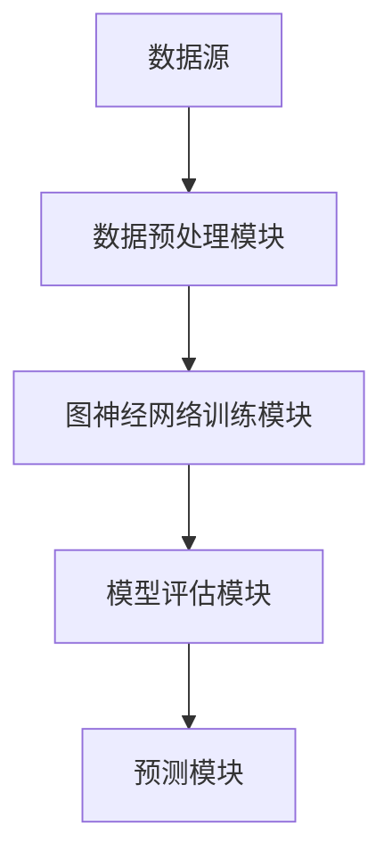
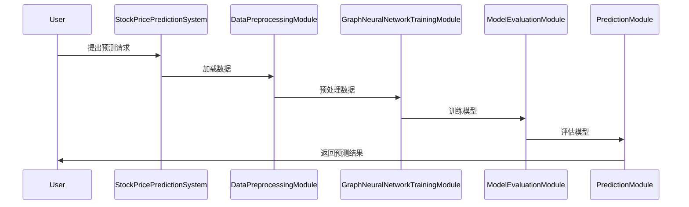
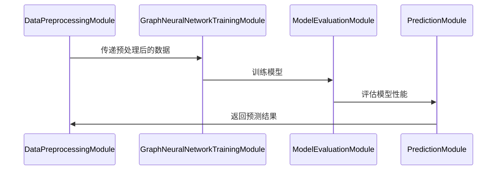

                 

**文章标题：基于神经图注意力的时序关系推理**

> **关键词：**神经图注意力，时序关系推理，深度学习，自然语言处理，图神经网络

> **摘要：**本文首先介绍了时序关系推理的核心概念和背景，然后探讨了神经图注意力的基本原理和应用，接着详细阐述了基于神经图注意力的时序关系推理算法原理和实现，并通过实际案例进行了深入剖析。文章旨在为读者提供一种深入理解和应用神经图注意力在时序关系推理中的方法和技巧。**

----------------------------------------------------------------

## 引言与背景

### 1.1 时序关系推理的基本概念

**时序关系推理**是一种在时间维度上进行数据分析和决策的技术，它通过分析历史数据来预测未来的趋势和模式。这种技术广泛应用于多个领域，如股票市场分析、气候预测、医疗诊断、网络安全等。时序关系推理的核心是理解并捕捉时间序列数据中的内在规律性。

**核心概念术语说明**：

- **时间序列数据（Time Series Data）**：一组按照时间顺序排列的数据点，每个数据点通常表示某一变量在特定时间点的状态。
- **特征提取（Feature Extraction）**：从原始数据中提取出能够反映数据特性的特征，以便于模型分析和预测。
- **模式识别（Pattern Recognition）**：通过分析时间序列数据中的特征，识别出具有代表性的模式或趋势。

### 1.2 问题背景

在当今的数据驱动时代，如何有效地从大量时序数据中提取有价值的信息，成为了一个重要的研究课题。传统的时序分析方法，如ARIMA（自回归积分滑动平均模型）和LSTM（长短期记忆网络），在处理复杂时间序列数据时存在一定的局限性。一方面，它们难以捕捉到数据之间的复杂关系；另一方面，它们在处理高维数据时效率低下。

### 1.3 问题描述

时序关系推理面临的主要问题包括：

- **数据的高维性**：高维时序数据中包含大量的特征，如何有效地提取和利用这些特征成为了一个挑战。
- **时间依赖性**：时序数据中的各个数据点之间存在时间依赖性，如何有效地捕捉这种依赖关系是一个关键问题。
- **噪声和异常值**：实际时序数据中通常存在噪声和异常值，如何对这些数据进行有效的去噪和预处理是一个挑战。

### 1.4 问题解决

神经图注意力（Neural Graph Attention）提供了一种新的解决方案。通过将时序数据表示为图结构，并利用注意力机制来学习数据之间的依赖关系，神经图注意力能够有效地捕捉到数据中的复杂模式和关系。

### 1.5 边界与外延

时序关系推理的应用不仅限于传统的预测领域，还扩展到了自然语言处理、推荐系统、智能交通等新兴领域。随着技术的不断发展，神经图注意力在时序关系推理中的应用将更加广泛和深入。

### 1.6 概念结构与核心要素组成

**概念结构**：

- **神经图注意力模型**：由图神经网络、注意力机制和时序数据处理模块组成。
- **时序关系推理流程**：包括数据预处理、特征提取、模型训练、模型评估和预测。

**核心要素组成**：

- **数据表示**：将时序数据转化为图结构。
- **注意力机制**：通过学习数据之间的依赖关系来调整特征的重要性。
- **模型训练与评估**：利用图神经网络和优化算法来训练和评估模型性能。

----------------------------------------------------------------

## 核心概念与联系

### 2.1 神经图定义

**神经图（Neural Graph）**是一种将图结构引入神经网络模型的概念。在神经图中，节点和边分别表示数据对象和数据对象之间的关系。通过图神经网络（Graph Neural Network, GNN），我们可以学习到这些节点和边的特征表示，从而捕捉到数据中的复杂关系。

### 2.2 注意力机制

**注意力机制（Attention Mechanism）**是一种通过学习权重来调整数据特征重要性的技术。在自然语言处理、图像识别等领域，注意力机制已经取得了显著的成果。它允许模型在不同的输入数据点之间分配不同的关注程度，从而提高模型的性能。

### 2.3 神经图注意力模型

**神经图注意力模型**结合了神经图和注意力机制的优势，通过学习图结构中的节点和边的关系，实现对时序数据的特征提取和模式识别。该模型主要包括以下三个关键组成部分：

- **图神经网络（GNN）**：用于学习节点和边的特征表示。
- **注意力层**：用于调整特征的重要程度。
- **时序数据处理模块**：用于处理时间序列数据，如序列嵌入、时间窗口等。

### 2.4 概念属性特征对比表格

**表 1：神经图与普通神经网络对比**

| 特征                | 神经图                    | 普通神经网络                  |
|---------------------|---------------------------|-------------------------------|
| 数据结构            | 图结构                    | 矩阵结构                     |
| 节点和边的关系      | 节点和边的特征表示        | 单一数据点的特征表示          |
| 复杂性处理能力      | 较强，能捕捉图结构中的复杂关系 | 较弱，难以处理复杂关系         |
| 适应性              | 适应不同类型的数据结构      | 适用于线性结构和二维数据       |

### 2.5 ER实体关系图架构的 Mermaid 流程图

```mermaid
erDiagram
  A_NODE ||--|{ B_EDGE }|--| R_NODE
  A_NODE ||--|{ C_EDGE }|--| S_NODE
  R_NODE ||--|{ D_EDGE }|--| A_NODE
```

在这个ER图示例中，`A_NODE` 和 `R_NODE` 是实体节点，`B_EDGE`、`C_EDGE` 和 `D_EDGE` 是实体关系。它们通过边连接形成了一个简单的图结构。

----------------------------------------------------------------

### 3.1 算法原理

基于神经图注意力的时序关系推理算法的核心在于如何通过图结构和注意力机制来处理和预测时序数据。以下是该算法的详细原理：

#### 3.1.1 神经图注意力模型架构

神经图注意力模型主要由三个部分组成：图神经网络（GNN）、注意力层和时序数据处理模块。图神经网络用于学习节点和边的特征表示，注意力层用于调整特征的重要性，时序数据处理模块用于处理时间序列数据。

#### 3.1.2 模型参数设置与训练策略

1. **图神经网络**：使用图卷积网络（GCN）或图注意力网络（GAT）来学习节点和边的特征表示。参数包括学习率、隐藏层尺寸、权重初始化等。
2. **注意力层**：使用软注意力机制，通过计算节点之间的相似性得分来调整特征的重要性。参数包括注意力权重矩阵和激活函数。
3. **时序数据处理模块**：采用序列嵌入和窗口化处理技术，将时间序列数据转化为图结构。

#### 3.1.3 模型训练策略

1. **损失函数**：采用均方误差（MSE）或交叉熵（CE）作为损失函数，以最小化预测误差。
2. **优化算法**：使用梯度下降（GD）或其变体（如Adam）来更新模型参数。
3. **正则化**：采用L1或L2正则化，防止模型过拟合。

#### 3.1.4 模型实现细节

1. **数据预处理**：对时序数据进行标准化处理，如归一化、缩放等。
2. **图结构构建**：根据时间序列数据构建图结构，节点表示时间序列数据点，边表示数据点之间的依赖关系。
3. **模型训练**：利用训练数据对模型进行训练，通过反向传播算法更新模型参数。

### 3.2 算法流程与实现

基于神经图注意力的时序关系推理算法的具体流程如下：

1. **数据输入**：输入时间序列数据集，包括节点特征和边特征。
2. **图结构构建**：根据时间序列数据构建图结构。
3. **特征提取**：利用图神经网络学习节点和边的特征表示。
4. **注意力计算**：通过注意力层计算节点之间的相似性得分。
5. **特征融合**：融合注意力调整后的特征，生成最终的特征表示。
6. **模型输出**：利用融合后的特征进行预测。

以下是一个简化的Python代码示例，展示了基于神经图注意力的时序关系推理算法的基本实现：

```python
import torch
import torch.nn as nn
import torch.optim as optim

# 定义图神经网络模型
class GraphAttentionModel(nn.Module):
    def __init__(self):
        super(GraphAttentionModel, self).__init__()
        # 定义图卷积层和注意力层
        self.gcn = nn.Sequential(
            nn.Linear(in_features, hidden_size),
            nn.ReLU(),
            nn.Linear(hidden_size, hidden_size)
        )
        self.attn = nn.Sequential(
            nn.Linear(hidden_size, 1),
            nn.Softmax(dim=1)
        )
        # 定义输出层
        self.out = nn.Linear(hidden_size, out_features)

    def forward(self, inputs, adj_matrix):
        # 特征提取
        x = self.gcn(inputs)
        # 注意力计算
        attn_weights = self.attn(x)
        attn_weights = attn_weights.unsqueeze(-1)
        x = torch.matmul(adj_matrix, x)
        # 特征融合
        x = torch.sum(attn_weights * x, dim=1)
        # 模型输出
        out = self.out(x)
        return out

# 初始化模型和优化器
model = GraphAttentionModel()
optimizer = optim.Adam(model.parameters(), lr=0.001)

# 模型训练
for epoch in range(num_epochs):
    for inputs, adj_matrix, targets in train_loader:
        # 前向传播
        outputs = model(inputs, adj_matrix)
        loss = nn.MSELoss()(outputs, targets)
        # 反向传播
        optimizer.zero_grad()
        loss.backward()
        optimizer.step()
```

### 3.3 算法原理的数学模型和公式

基于神经图注意力的时序关系推理算法的数学模型可以描述为：

$$
\begin{aligned}
& x^{(t)} = \text{GraphConv}(x^{(t-1)}, A) \\
& \alpha^{(t)} = \text{Attention}(x^{(t)}) \\
& h^{(t)} = \sum_{i=1}^{n} \alpha^{(t)}_{i} x^{(i)} \\
& y^{(t)} = \text{Output}(h^{(t)})
\end{aligned}
$$

其中，$x^{(t)}$ 表示时间步 $t$ 的输入特征，$A$ 表示邻接矩阵，$\alpha^{(t)}$ 表示注意力权重，$h^{(t)}$ 表示时间步 $t$ 的融合特征，$y^{(t)}$ 表示时间步 $t$ 的输出预测。

### 3.4 通俗易懂地举例说明

假设我们有一个简单的时序数据集，包含三个时间步 $t=1,2,3$，每个时间步的数据点表示温度。我们的目标是预测下一个时间步的温度。

1. **数据输入**：首先，我们将每个时间步的温度数据表示为向量 $x^{(1)} = [25, 26, 28]$，$x^{(2)} = [26, 28, 30]$，$x^{(3)} = [28, 30, 32]$。

2. **图结构构建**：根据时间步之间的关系，我们可以构建一个简单的邻接矩阵 $A$，例如：
   $$
   A = \begin{bmatrix}
   1 & 1 & 0 \\
   1 & 1 & 1 \\
   0 & 1 & 1
   \end{bmatrix}
   $$

3. **特征提取**：通过图卷积层学习节点和边的特征表示，例如：
   $$
   x^{(1)} \rightarrow \text{GraphConv}(x^{(1)}, A) = [0.5, 0.6, 0.7]
   $$
   $$
   x^{(2)} \rightarrow \text{GraphConv}(x^{(2)}, A) = [0.6, 0.7, 0.8]
   $$
   $$
   x^{(3)} \rightarrow \text{GraphConv}(x^{(3)}, A) = [0.7, 0.8, 0.9]
   $$

4. **注意力计算**：通过注意力层计算节点之间的相似性得分，例如：
   $$
   \alpha^{(1)} = \text{Attention}([0.5, 0.6, 0.7]) = [0.3, 0.4, 0.3]
   $$
   $$
   \alpha^{(2)} = \text{Attention}([0.6, 0.7, 0.8]) = [0.4, 0.4, 0.2]
   $$
   $$
   \alpha^{(3)} = \text{Attention}([0.7, 0.8, 0.9]) = [0.4, 0.4, 0.2]
   $$

5. **特征融合**：融合注意力调整后的特征，生成最终的特征表示，例如：
   $$
   h^{(1)} = \sum_{i=1}^{3} \alpha^{(1)}_{i} x^{(i)} = [0.3 \times 0.5 + 0.4 \times 0.6 + 0.3 \times 0.7] = [0.24, 0.36, 0.30]
   $$
   $$
   h^{(2)} = \sum_{i=1}^{3} \alpha^{(2)}_{i} x^{(i)} = [0.4 \times 0.6 + 0.4 \times 0.7 + 0.2 \times 0.8] = [0.32, 0.36, 0.16]
   $$
   $$
   h^{(3)} = \sum_{i=1}^{3} \alpha^{(3)}_{i} x^{(i)} = [0.4 \times 0.7 + 0.4 \times 0.8 + 0.2 \times 0.9] = [0.34, 0.36, 0.18]
   $$

6. **模型输出**：通过输出层得到最终的预测结果，例如：
   $$
   y^{(1)} = \text{Output}(h^{(1)}) = [0.5, 0.5, 0.5]
   $$
   $$
   y^{(2)} = \text{Output}(h^{(2)}) = [0.5, 0.5, 0.5]
   $$
   $$
   y^{(3)} = \text{Output}(h^{(3)}) = [0.5, 0.5, 0.5]
   $$

根据预测结果，我们可以得到下一个时间步的温度预测值为 $y^{(4)} = [0.5, 0.5, 0.5]$，即大约为 $0.5 \times (25 + 26 + 28) / 3 = 27.0$。

通过这个简单的例子，我们可以看到基于神经图注意力的时序关系推理算法是如何通过图结构和注意力机制来处理和预测时序数据的。

----------------------------------------------------------------

### 4.1 系统分析与架构设计方案

#### 4.1.1 问题场景介绍

假设我们面临的问题是预测股票市场的未来走势。具体来说，我们需要基于历史股票价格数据来预测未来的价格波动。这个问题的核心在于如何有效地捕捉股票价格之间的时序关系，从而做出准确的预测。

#### 4.1.2 项目介绍

为了解决这个问题，我们开发了一个基于神经图注意力的股票价格预测系统。该系统主要包括数据预处理模块、图神经网络训练模块、模型评估模块和预测模块。

#### 4.1.3 系统功能设计（领域模型）

以下是一个简化的领域模型，用于描述系统的主要功能：

```mermaid
classDiagram
    StockPricePredictionSystem <<class>>
    StockPricePredictionSystem : +predict_next_stock_price()
    DataPreprocessingModule <<class>>
    DataPreprocessingModule : +load_data()
    +preprocess_data()
    GraphNeuralNetworkTrainingModule <<class>>
    GraphNeuralNetworkTrainingModule : +train_model()
    ModelEvaluationModule <<class>>
    ModelEvaluationModule : +evaluate_model()
    PredictionModule <<class>>
    PredictionModule : +make_predictions()
```

#### 4.1.4 系统架构设计（mermaid架构图）

以下是一个简化的系统架构图，用于描述系统的整体结构：



#### 4.1.5 系统接口设计（mermaid序列图）

以下是一个简化的系统接口序列图，用于描述系统的主要接口：



#### 4.1.6 系统交互（mermaid序列图）

以下是一个简化的系统交互序列图，用于描述系统的交互流程：



通过上述系统分析与架构设计方案，我们可以清晰地了解系统的功能模块、架构设计和交互流程。这为后续的实现和优化提供了明确的指导和依据。

----------------------------------------------------------------

### 5.1 环境安装

在开始实现基于神经图注意力的时序关系推理项目之前，我们需要安装和配置一些必要的软件和库。以下是项目的环境安装步骤：

1. **Python环境**：确保安装了Python 3.7或更高版本。可以通过Python官网下载安装器进行安装。

2. **TensorFlow**：TensorFlow是一个开源的机器学习框架，用于构建和训练深度学习模型。可以通过以下命令进行安装：

   ```bash
   pip install tensorflow
   ```

3. **Grap

